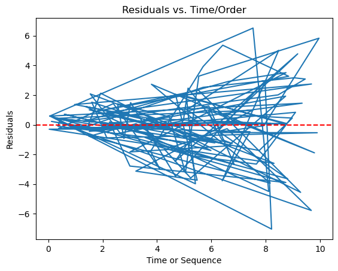

# 선형회귀의 독립성 확인

독립성은 관측값(과 그 잔차)이 서로 상관되어 있지 않음을 보장하는 선형회귀의 핵심 가정이다. 이 가정은 타당한 추론과 정확한 회귀계수 추정에 결정적이다. 독립성이 위배되면 모형의 표준오차가 과소추정되고 유의성 검정이 틀리게 된다. 이 절은 선형회귀에서 독립성을 확인하는 여러 방법을 살펴보며, 자기상관과 그 밖의 종속 형태를 찾아내고 대처하는 데 초점을 맞춘다.

## 1. 독립성 가정의 이해

<div class="defn" markdown>

### 정의 1. 독립성 { .dfn }
선형회귀의 맥락에서 독립성 가정은 모형의 잔차(오차)들이 서로 독립이어야 한다는 뜻이다. 시계열 자료에서는 한 시점의 잔차가 다른 시점의 잔차와 상관되어서는 안 된다는 뜻이고, 횡단면 자료에서는 한 관측값의 잔차가 다른 어떤 관측값의 잔차와도 상관되어서는 안 된다는 뜻이다.

형식적으로 이 가정은 다음을 요구한다.

$$
\text{Cov}(\epsilon_i, \epsilon_j) = 0 \quad \text{(모든 } i \neq j \text{에 대해)}
$$

행렬 형태로도 쓸 수 있다. 독립성 가정 아래에서 오차의 분산·공분산 행렬은 대각행렬이다.

$$
\text{Var}(\boldsymbol{\epsilon}) = \sigma^2 \mathbf{I}_n
$$

**왜 중요한가:**
독립성 가정이 위배되면 다음이 나타날 수 있다.

- **자기상관:** 잔차가 시간이나 순서에 걸쳐 상관될 때이며 시계열 자료에서 흔히 보인다. 양의 자기상관은 시점 $t$의 양의 잔차 뒤에 시점 $t+1$의 양의 잔차가 따라오는 경향을 뜻한다.
- **군집 오차:** 특정 집단이나 군집 안의 관측값이 다른 집단의 관측값보다 서로 더 비슷할 때이다.

</div>

## 설정

이 페이지의 진단은 모두 아래 자료와 모형 하나를 놓고 수행한다.

<div class="codebox" markdown>

**예제 1.** 진단에 쓸 모형 준비

```python
import numpy as np
import pandas as pd
import statsmodels.api as sm

rng = np.random.default_rng(7)
n = 120

# X는 균등, Y는 X에 선형으로 의존하되 오차의 분산이 X와 함께 커진다.
# 이렇게 두면 선형성은 성립하고 등분산성만 깨져, 각 진단이 무엇을
# 잡아내고 무엇을 놓치는지 구분해 볼 수 있다.
X = rng.uniform(0, 10, n)
Y = 2.0 + 1.5 * X + rng.normal(0, 0.5 + 0.35 * X, n)

df = pd.DataFrame({"X": X, "Y": Y})
model = sm.OLS(Y, sm.add_constant(X)).fit()
residuals = model.resid
fitted = model.fittedvalues

print(f"beta_hat = {model.params.round(4)}")
print(f"R^2 = {model.rsquared:.4f}")
```

출력:

```
beta_hat = [1.5933 1.5317]
R^2 = 0.7813
```

</div>

기울기 추정값 1.53이 참값 1.5에 가깝다. 이분산이 있어도 OLS 추정값 자체는 불편이며, 흔들리는 것은 표준오차다.

## 2. 자기상관을 위한 Durbin-Watson 검정

**Durbin-Watson(DW) 검정**은 회귀모형 잔차의 1차 자기상관 유무를 탐지하는 데 널리 쓰이는 통계검정이다. 시계열 자료에서 특히 유용하다.

**검정통계량:**

Durbin-Watson 통계량은 다음으로 정의된다.

$$
DW = \frac{\sum_{t=2}^{n}(e_t - e_{t-1})^2}{\sum_{t=1}^{n} e_t^2}
$$

여기서 $e_t$는 시점 $t$의 잔차이다.

DW 통계량은 0과 4 사이의 값을 갖는다.

- $DW \approx 2$: 자기상관 없음
- $DW \to 0$: 강한 양의 자기상관
- $DW \to 4$: 강한 음의 자기상관

**자기상관과의 관계:**

$$
DW \approx 2(1 - \hat{\rho})
$$

여기서 $\hat{\rho}$는 잔차의 추정된 1차 자기상관 계수이다.

**절차:**

1. **선형회귀 모형 적합:** 먼저 모형을 적합하여 잔차를 얻는다.
2. **Durbin-Watson 통계량 계산:** DW 통계량은 보통 0과 4 사이의 값을 갖는다.
3. **통계량 해석:**
   - DW가 2 근처면 자기상관이 없다.
   - 0에 가까울수록 양의 자기상관을 시사한다.
   - 4에 가까울수록 음의 자기상관을 시사한다.

**예시:**

<div class="codebox" markdown>

**예제 2.** Durbin-Watson 검정

```python
from statsmodels.stats.stattools import durbin_watson

# Durbin-Watson 통계량은 0 에서 4 사이이고 2 가 무상관이다. 2 보다 뚜렷이
# 작으면 양의 자기상관, 크면 음의 자기상관을 뜻한다. 이 검정은 잔차를
# 주어진 순서 그대로 보므로, 순서가 뜻을 갖는 자료에서만 쓸 수 있다.
dw_stat = durbin_watson(model.resid)
print(f'Durbin-Watson statistic: {dw_stat}')
```

출력:

```
Durbin-Watson statistic: 2.16161645652481
```

</div>

$d = 2.16$으로 2에 가까워 자기상관의 증거가 없다. 관측값을 서로 독립으로 생성했으니 옳은 판정이다.

다만 여기서 "순서"는 자료를 만든 순서일 뿐이다. 실제 연구에서는 측정 시각이나 공간 위치처럼 의미 있는 순서로 정렬해야 이 진단이 뜻을 갖는다.

**해석 지침:**

| DW 값 | 해석 |
|----------|---------------|
| $DW \approx 2$ | 유의한 자기상관 없음 |
| $DW < 1.5$ | 양의 자기상관 (독립성 위배) |
| $DW > 2.5$ | 음의 자기상관 (독립성 위배) |

## 3. 패턴 탐지를 위한 잔차그림

**잔차그림**은 독립성 가정을 확인하는 또 하나의 효과적인 도구이다. 잔차를 (시계열 자료에서는) 시간에 대해, (횡단면 자료에서는) 자료 수집 순서에 대해 그리면 종속을 시사하는 패턴을 눈으로 확인할 수 있다.

**절차:**

1. **잔차 그리기:** 잔차를 시간이나 관측 순서에 대해 그린다.
2. **패턴 평가:** 추세, 주기, 군집 같은 체계적 패턴을 찾는다.

**예시:**

<div class="codebox" markdown>

**예제 3.** 순서에 대한 잔차 그림

```python
import matplotlib.pyplot as plt

# 잔차를 시간 순서대로 잇는다. 위아래로 무작위하게 오가야 하고, 같은 쪽에
# 여러 점이 몰려 다니면 독립이 깨진 것이다.
plt.plot(X, model.resid)
plt.xlabel('Time or Sequence')
plt.ylabel('Residuals')
plt.title('Residuals vs. Time/Order')
plt.axhline(y=0, color='red', linestyle='--')
plt.show()
```



</div>

잔차가 0을 중심으로 무작위로 흩어져 있고 추세나 주기가 없다.

**해석:**

- **뚜렷한 패턴 없음:** 0 주위의 무작위 흩어짐은 독립성을 나타낸다.
- **눈에 띄는 패턴:** 추세, 주기, 군집은 독립성의 위배를 시사하며 자기상관이나 다른 형태의 종속 가능성을 나타낸다.

**흔한 패턴과 그 의미:**

| 패턴 | 유력한 원인 |
|---------|-------------|
| 매끄러운 파동 | 계절성 또는 주기적 자기상관 |
| 상승/하강 추세 | 모형에 추세 변수가 빠짐 |
| 부호가 번갈아 나타남 | 음의 자기상관 |
| 같은 부호가 이어짐 | 양의 자기상관 |

## 4. 고차 자기상관을 위한 Breusch-Godfrey 검정

**Breusch-Godfrey 검정**은 Durbin-Watson 검정의 확장으로, (1차만이 아니라) 고차 자기상관을 탐지하는 데 더 유연하다. 자기상관이 인접 관측값을 넘어 이어진다고 의심될 때 유용하다.

**가설:**

- $H_0$: 시차 $p$까지 자기상관이 없다
- $H_1$: 어떤 시차 $\leq p$에서 자기상관이 존재한다

이 검정은 잔차를 원래의 설명변수와 시차 잔차에 회귀시킨다.

$$
e_t = \alpha_0 + \alpha_1 X_{1t} + \cdots + \rho_1 e_{t-1} + \rho_2 e_{t-2} + \cdots + \rho_p e_{t-p} + u_t
$$

검정통계량은 이 보조회귀의 $nR^2$이며, $H_0$ 아래에서 $\chi^2(p)$ 분포를 따른다.

**절차:**

1. **선형회귀 모형 적합:** 적합된 모형에서 잔차를 얻는다.
2. **Breusch-Godfrey 검정 수행:** 검정이 통계량과 p값을 준다.
3. **결과 해석:** p값이 유의하면(보통 < 0.05) 자기상관의 존재를 시사한다.

**예시:**

<div class="codebox" markdown>

**예제 4.** Breusch-Godfrey 검정

```python
from statsmodels.stats.diagnostic import acorr_breusch_godfrey

# Breusch-Godfrey 검정은 Durbin-Watson 과 달리 시차를 여럿 한꺼번에 본다.
# nlags=2 는 한 시점 전과 두 시점 전의 잔차를 함께 살핀다는 뜻이다.
# 설명변수에 시차 종속변수가 들어 있어도 쓸 수 있다는 점이 이점이다.
bg_test = acorr_breusch_godfrey(model, nlags=2)
print(f'Breusch-Godfrey LM statistic: {bg_test[0]}')
print(f'Breusch-Godfrey p-value: {bg_test[1]}')
```

출력:

```
Breusch-Godfrey LM statistic: 1.584101499228634
Breusch-Godfrey p-value: 0.4529150269303661
```

</div>

Breusch-Godfrey 검정도 $p = 0.45$로 자기상관의 증거를 찾지 못한다. Durbin-Watson이 1차 자기상관만 보는 반면 이 검정은 더 높은 차수까지 볼 수 있다는 점이 다르다.

**해석:**

- **p값 > 0.05:** 유의한 자기상관이 탐지되지 않았다.
- **p값 < 0.05:** 유의한 자기상관이 존재하며 독립성 위배를 나타낸다.

**Durbin-Watson보다 나은 점:**

- 고차 자기상관(시차 2, 3 등)을 탐지할 수 있다.
- 시차 종속변수를 설명변수로 쓴 모형에서도 쓸 수 있다(이 경우 DW 검정은 타당하지 않다).
- 더 일반적이고 유연하다.

## 5. 자료 수집 과정 살피기

관측값 사이의 종속은 때때로 자료 수집 과정 자체에서 비롯되며, 군집 또는 위계 구조를 갖는 자료(예: 학교 안의 학생, 병원 안의 환자)에서 특히 그렇다. 자료의 구조를 이해하고 군집 가능성을 확인하는 것이 중요하다.

**절차:**

1. **자료 구조 이해:** 자료가 집단이나 군집 단위로 수집되었는지 확인한다.
2. **군집 확인:** 군집이 의심되면 위계 모형이나 혼합효과 모형을 쓴다. 표준적인 선형회귀는 군집 내 상관을 반영하지 못한다.

**흔한 군집 자료 구조:**

| 구조 | 1수준 | 2수준 | 예 |
|-----------|---------|---------|---------|
| 교육 | 학생 | 학교 | 학교별 시험 점수 |
| 의료 | 환자 | 병원 | 병원별 치료 결과 |
| 지리 | 관측값 | 지역 | 주별 경제 자료 |
| 종단 | 시점 | 대상자 | 개인별 반복측정 |

**해석:**

- **군집 없음:** 자료가 군집화되어 있지 않으면 독립성이 성립할 수 있다.
- **군집 탐지:** 자료가 군집화되어 있으면 독립성이 위배될 수 있으므로 대안적 모형화(예: 혼합효과 모형, 군집 표준오차)를 고려해야 한다.

## 독립성 진단 요약

| 방법 | 유형 | 탐지 대상 | 적합한 상황 |
|--------|------|---------|----------|
| Durbin-Watson | 형식적 검정 | 1차 자기상관 | 시계열 자료 |
| 잔차-시간 그림 | 시각적 | 모든 시간 패턴 | 시계열, 순서가 있는 자료 |
| Breusch-Godfrey | 형식적 검정 | 고차 자기상관 | 복잡한 시간 종속 |
| 자료 구조 검토 | 개념적 | 군집, 위계적 종속 | 군집화된 횡단면 자료 |

선형회귀에서 독립성을 확보하는 일은 타당한 통계적 추론과 신뢰할 만한 예측에 결정적이다. Durbin-Watson 검정, Breusch-Godfrey 검정, 잔차그림을 함께 써서 독립성 가정의 위배 가능성을 진단할 수 있다. 독립성이 위배된 경우에는 시차 변수 추가, 일반화최소제곱 사용, 군집 자료에 대한 혼합효과 모형 적용 같은 적절한 모형화 기법으로 문제에 대처해야 한다.

## 연습문제

<div class="drillbox" markdown>

**연습문제 1.** <span class="diff easy" title="쉬움"></span>
분기별 매출 자료에 대한 회귀모형에서 Durbin-Watson 통계량 $d = 0.95$를 얻었다. 이 결과를 해석하고 적절한 대책을 제안하라.

</div>

??? success "풀이"
    Durbin-Watson 통계량 $d = 0.95$는 2보다 상당히 작으므로 잔차에 **양의 1차 자기상관**이 있음을 나타낸다($\hat{\rho} \approx 1 - d/2 = 0.53$). 인접한 분기의 관측값이 비슷한 잔차를 갖는다는 뜻이며 시계열 자료에서 흔한 일이다.

    이는 독립성 가정을 위배하여 표준오차를 과소추정하게 만든다. 권장 대책:

    1. **시차 변수 포함:** $Y_{t-1}$ 같은 시차 변수를 설명변수로 넣어 시간 종속을 포착한다.
    2. **Newey-West(HAC) 표준오차 사용:** 자기상관에 로버스트한 표준오차를 쓴다.
    3. **자기회귀 모형 적합:** 일반화최소제곱으로 AR(1) 오차 모형 등을 적합한다.

<div class="drillbox" markdown>

**연습문제 2.** <span class="diff med" title="중간"></span>
독립성 가정을 자료만 보고 검증할 수 없고 연구 설계로 확보해야 하는 이유를 설명하라. 독립성을 보장하는 연구 설계의 예를 두 가지 들어라.

</div>

??? success "풀이"
    독립성은 관측된 자료가 아니라 **자료생성과정**의 성질이다. 상관된 자료도 우연히 무작위처럼 보이는 잔차그림을 낼 수 있고, 독립인 자료도 표집변동 때문에 겉보기 패턴을 보일 수 있다.

    독립성을 보장하는 연구 설계:

    1. **단순무작위추출:** 각 개체가 같은 확률로 독립적으로 뽑히는 모집단에서의 추출.
    2. **무작위대조실험:** 반복측정 없이 대상자를 처치 조건에 무작위로 배정하는 설계.

<div class="drillbox" markdown>

**연습문제 3.** <span class="diff med" title="중간"></span>
학급 안에 중첩된 학생 자료는 독립성 가정을 위배한다. 회귀 추론에 미치는 구체적인 영향을 설명하고 이 문제를 다루는 모형화 접근을 말하라.

</div>

??? success "풀이"
    같은 학급의 학생들은 같은 교사, 교육과정, 교실 환경을 공유하므로 **군집 내 상관**이 생긴다. 그 결과

    - 실효 표본크기가 명목상의 $n$보다 작아진다.
    - 표준오차가 과소추정되어 $t$ 통계량이 부풀려지고 p값이 인위적으로 작아진다.
    - 신뢰구간이 지나치게 좁아진다.

    적절한 접근은 학급을 확률효과로 포함하는 **혼합효과(위계/다수준) 모형**이다. 군집 내 상관을 반영하면서 고정효과의 표준오차를 올바르게 추정한다.

---

## 정리하며

독립성 확인은 **자료의 구조를 아는 데서 시작한다.**

- **더빈–왓슨 통계량이 1차 자기상관을 잰다.** $2$ 근처면 무상관, $0$ 에 가까우면 양의 상관, $4$ 에 가까우면 음의 상관이다. **1차만 본다는 한계**가 있다.
- **잔차를 순서대로 그린다.** 시간 순서나 공간 순서로 그려 패턴이 보이는지 확인하며, 그림이 검정보다 많은 것을 보여 준다.
- **자기상관함수(ACF)가 더 일반적이다.** 여러 시차의 상관을 한꺼번에 보므로 고차 구조도 잡아낸다.
- **횡단면 자료에서는 군집을 의심한다.** 같은 학교·병원·지역의 관측은 서로 닮아 있으며, 순서가 없어도 종속이 있다.
- **처방은 표준오차를 고치거나 모형을 바꾸는 것이다.** 뉴이–웨스트, 군집 강건 표준오차, 혼합효과 모형, 시계열 모형.

다음 절 **등분산성 확인**으로 넘어간다.
