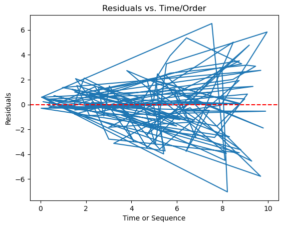

# 선형회귀의 독립성 확인

독립성은 관측값(과 그 잔차)이 서로 상관되어 있지 않음을 보장하는 선형회귀의 핵심 가정이다. 이 가정은 타당한 추론과 정확한 회귀계수 추정에 결정적이다. 독립성이 위배되면 모형의 표준오차가 과소추정되고 유의성 검정이 틀리게 된다. 이 절은 선형회귀에서 독립성을 확인하는 여러 방법을 살펴보며, 자기상관과 그 밖의 종속 형태를 찾아내고 대처하는 데 초점을 맞춘다.

## 1. 독립성 가정의 이해

<div class="defn" markdown>

### 정의 1. 독립성 { .dfn }
선형회귀의 맥락에서 독립성 가정은 모형의 잔차(오차)들이 서로 독립이어야 한다는 뜻이다. 시계열 자료에서는 한 시점의 잔차가 다른 시점의 잔차와 상관되어서는 안 된다는 뜻이고, 횡단면 자료에서는 한 관측값의 잔차가 다른 어떤 관측값의 잔차와도 상관되어서는 안 된다는 뜻이다.

형식적으로 이 가정은 다음을 요구한다.

$$
\text{Cov}(\epsilon_i, \epsilon_j) = 0 \quad \text{(모든 } i \neq j \text{에 대해)}
$$

행렬 형태로도 쓸 수 있다. 독립성 가정 아래에서 오차의 분산·공분산 행렬은 대각행렬이다.

$$
\text{Var}(\boldsymbol{\epsilon}) = \sigma^2 \mathbf{I}_n
$$

**왜 중요한가:**
독립성 가정이 위배되면 다음이 나타날 수 있다.

- **자기상관:** 잔차가 시간이나 순서에 걸쳐 상관될 때이며 시계열 자료에서 흔히 보인다. 양의 자기상관은 시점 $t$의 양의 잔차 뒤에 시점 $t+1$의 양의 잔차가 따라오는 경향을 뜻한다.
- **군집 오차:** 특정 집단이나 군집 안의 관측값이 다른 집단의 관측값보다 서로 더 비슷할 때이다.

</div>

## 설정

이 페이지의 진단은 모두 아래 자료와 모형 하나를 놓고 수행한다.

<div class="exbox" markdown>

**보기 1.** <span class="diff easy" title="쉬움"></span> 진단에 쓸 모형 준비. 이 페이지의 자료는 관측값을 **서로 독립**으로 만들었다. 그러니 독립이 깨졌을 때 무엇이 얼마나 틀어지는지를 먼저 재어 두자. 오차가 AR(1), 곧 $\varepsilon_t = \rho \varepsilon_{t-1} + u_t$이고 정상상태에서 $\operatorname{Var}(\varepsilon_t) = \sigma^2$, $\operatorname{Cov}(\varepsilon_t, \varepsilon_{t+k}) = \sigma^2 \rho^{\lvert k \rvert}$라 하자.

**(1)** 표본평균 $\bar\varepsilon$의 분산이

$$
\operatorname{Var}(\bar\varepsilon) = \frac{\sigma^2}{n}\left(1 + 2\sum_{k=1}^{n-1}\Big(1 - \frac{k}{n}\Big)\rho^k\right)
$$

임을 보이고, $n \to \infty$에서 이것이 $\dfrac{\sigma^2}{n}\cdot\dfrac{1+\rho}{1-\rho}$에 가까워짐을 보이시오. $\rho = 0.5$면 참 분산이 독립을 가정한 $\sigma^2/n$의 몇 배인가.

**(2)** 모형을 적합하고, (1)의 두 식을 모의실험으로 확인하시오.

</div>

??? success "풀이"

    **(1) 해석적으로.** 이중합을 펼친다.

    $$
    \operatorname{Var}(\bar\varepsilon)
    = \frac{1}{n^2}\sum_{s=1}^n \sum_{t=1}^n \operatorname{Cov}(\varepsilon_s, \varepsilon_t)
    = \frac{\sigma^2}{n^2}\sum_{s=1}^n \sum_{t=1}^n \rho^{\lvert s-t \rvert}
    $$

    $\lvert s - t \rvert = k$인 칸이 몇 개인지 세면 된다. $k = 0$인 대각선 칸이 $n$개이고, $k \ge 1$인 칸은 위아래로 각각 $n - k$개씩이다. 그러므로

    $$
    \operatorname{Var}(\bar\varepsilon)
    = \frac{\sigma^2}{n^2}\left(n + 2\sum_{k=1}^{n-1}(n-k)\rho^k\right)
    = \frac{\sigma^2}{n}\left(1 + 2\sum_{k=1}^{n-1}\Big(1-\frac{k}{n}\Big)\rho^k\right)
    $$

    이다. $\lvert \rho \rvert < 1$이면 $n \to \infty$에서 $1 - k/n \to 1$이고 $\sum_{k\ge1}\rho^k = \rho/(1-\rho)$이므로

    $$
    \operatorname{Var}(\bar\varepsilon) \;\longrightarrow\; \frac{\sigma^2}{n}\left(1 + \frac{2\rho}{1-\rho}\right) = \frac{\sigma^2}{n}\cdot\frac{1+\rho}{1-\rho}
    $$

    이다. $\rho = 0.5$면 배수가 $1.5/0.5 = 3$, 곧 **참 분산이 독립을 가정한 값의 세 배**다. 표준오차로는 $\sqrt 3 = 1.73$배이므로, 독립을 믿고 계산한 신뢰구간은 참 폭의 $58\%$밖에 안 된다.

    뒤집어 읽으면 **유효표본크기**가 된다. $n$개를 모았는데 실제로는

    $$
    n_{\text{eff}} = n \cdot \frac{1-\rho}{1+\rho}
    $$

    개를 모은 것과 같다. $\rho = 0.5$면 $120$개가 $40$개 값어치이고, $\rho = 0.8$이면 $120$개가 $13$개 값어치다. **독립성 위배는 추정값을 비틀지 않고 정보량을 깎는다.** 그래서 계수는 멀쩡해 보이는데 p-값만 터무니없이 작게 나온다.

    **(2) 수치적으로.** 먼저 이 페이지의 모형을 적합한다.

    ```python
    import numpy as np
    import pandas as pd
    import statsmodels.api as sm

    rng = np.random.default_rng(7)
    n = 120

    # X는 균등, Y는 X에 선형으로 의존하되 오차의 분산이 X와 함께 커진다.
    # 이렇게 두면 선형성은 성립하고 등분산성만 깨져, 각 진단이 무엇을
    # 잡아내고 무엇을 놓치는지 구분해 볼 수 있다.
    X = rng.uniform(0, 10, n)
    Y = 2.0 + 1.5 * X + rng.normal(0, 0.5 + 0.35 * X, n)

    df = pd.DataFrame({"X": X, "Y": Y})
    model = sm.OLS(Y, sm.add_constant(X)).fit()
    residuals = model.resid
    fitted = model.fittedvalues

    print(f"beta_hat = {model.params.round(4)}")
    print(f"R^2 = {model.rsquared:.4f}")
    ```

    출력:

    ```
    beta_hat = [1.5933 1.5317]
    R^2 = 0.7813
    ```

    이제 (1)의 두 식을 확인한다. $\sigma = 1$로 두면 독립일 때의 값이 $1/n = 0.008333$이다.

    ```python
    import numpy as np

    def exact_var(rho, n):
        """AR(1) 오차를 가진 표본평균의 분산. sigma = 1 로 둔다."""
        k = np.arange(1, n)
        return (1 + 2 * np.sum((1 - k / n) * rho ** k)) / n

    print(f"{'rho':>5}{'독립이면':>11}{'정확한 식':>12}{'극한식':>11}{'모의실험':>12}{'배수':>8}")
    for rho in (0.0, 0.3, 0.5, 0.8):
        r = np.random.default_rng(2024)
        B = 40_000
        u = r.normal(0, np.sqrt(1 - rho ** 2), (B, n))
        eps = np.empty((B, n))
        eps[:, 0] = r.normal(0, 1, B)
        for t in range(1, n):
            eps[:, t] = rho * eps[:, t - 1] + u[:, t]
        sim = eps.mean(axis=1).var(ddof=1)
        ex = exact_var(rho, n)
        print(f"{rho:>5.1f}{1 / n:>11.6f}{ex:>12.6f}"
              f"{(1 + rho) / (1 - rho) / n:>11.6f}{sim:>12.6f}{ex * n:>8.3f}")
    ```

    출력:

    ```
      rho       독립이면       정확한 식        극한식        모의실험      배수
      0.0   0.008333    0.008333   0.008333    0.008380   1.000
      0.3   0.008333    0.015391   0.015476    0.015479   1.847
      0.5   0.008333    0.024722   0.025000    0.024866   2.967
      0.8   0.008333    0.072222   0.075000    0.072615   8.667
    ```

    **정확한 식이 모의실험과 맞는다.** $\rho = 0.5$에서 공식이 $0.024722$, 모의실험이 $0.024866$이고, $\rho = 0.8$에서 $0.072222$ 대 $0.072615$다. 차이는 모두 $1\%$ 안이며 $40{,}000$회의 몬테카를로 오차 크기다.

    **극한식은 $n = 120$에서 조금 큰 쪽으로 어긋난다.** $\rho = 0.8$에서 정확한 값 $0.0722$ 대 극한값 $0.0750$으로 $4\%$ 차이이고, $\rho = 0.5$에서는 $1.1\%$다. 유한한 $n$에서 $(1-k/n)$ 가중이 뒤쪽 항을 깎기 때문이며, $\rho$가 1에 가까울수록 멀리 있는 항이 중요해져 어긋남이 커진다. **상관이 강할수록 "$n$이 충분히 크다"가 요구하는 $n$도 커진다.**

    배수를 보라. $\rho = 0.3$이라는, 그림으로는 거의 눈에 띄지 않을 약한 상관도 분산을 $1.85$배로 만든다. 표준오차를 $1.36$배 과소평가하고 그만큼 $t$값을 부풀린다는 뜻이다. **독립성은 그림으로 대충 보아 넘길 가정이 아니다.** 이 페이지의 나머지가 그것을 재는 도구들이다.

## 2. 자기상관을 위한 Durbin-Watson 검정

**Durbin-Watson(DW) 검정**은 회귀모형 잔차의 1차 자기상관 유무를 탐지하는 데 널리 쓰이는 통계검정이다. 시계열 자료에서 특히 유용하다.

**검정통계량:**

Durbin-Watson 통계량은 다음으로 정의된다.

$$
DW = \frac{\sum_{t=2}^{n}(e_t - e_{t-1})^2}{\sum_{t=1}^{n} e_t^2}
$$

여기서 $e_t$는 시점 $t$의 잔차이다.

DW 통계량은 0과 4 사이의 값을 갖는다.

- $DW \approx 2$: 자기상관 없음
- $DW \to 0$: 강한 양의 자기상관
- $DW \to 4$: 강한 음의 자기상관

**자기상관과의 관계:**

$$
DW \approx 2(1 - \hat{\rho})
$$

여기서 $\hat{\rho}$는 잔차의 추정된 1차 자기상관 계수이다.

**절차:**

1. **선형회귀 모형 적합:** 먼저 모형을 적합하여 잔차를 얻는다.
2. **Durbin-Watson 통계량 계산:** DW 통계량은 보통 0과 4 사이의 값을 갖는다.
3. **통계량 해석:**
   - DW가 2 근처면 자기상관이 없다.
   - 0에 가까울수록 양의 자기상관을 시사한다.
   - 4에 가까울수록 음의 자기상관을 시사한다.

**예시:**

<div class="exbox" markdown>

**보기 2.** <span class="diff easy" title="쉬움"></span> Durbin-Watson 검정. 위에 적은 $DW \approx 2(1-\hat\rho)$는 근사가 아니라 **정확한 항등식에서 작은 항 하나를 버린 것**이다.

**(1)** $\hat\rho_1 = \dfrac{\sum_{t=2}^n e_t e_{t-1}}{\sum_{t=1}^n e_t^2}$이라 두면

$$
DW = 2(1 - \hat\rho_1) - \frac{e_1^2 + e_n^2}{\sum_{t=1}^n e_t^2}
$$

임을 보이시오. 이것으로 $0 \le DW \le 4$도 설명되는가.

**(2)** 검정을 돌려 (1)의 항등식을 소수점 열째 자리까지 확인하고, 버린 항의 크기를 재시오.

</div>

??? success "풀이"

    **(1) 해석적으로.** 분자의 제곱을 펼친다.

    $$
    \sum_{t=2}^n (e_t - e_{t-1})^2
    = \sum_{t=2}^n e_t^2 + \sum_{t=2}^n e_{t-1}^2 - 2\sum_{t=2}^n e_t e_{t-1}
    $$

    앞의 두 합은 전체 제곱합 $S = \sum_{t=1}^n e_t^2$에서 각각 첫 항과 끝 항이 빠진 것이다. 곧 $\sum_{t=2}^n e_t^2 = S - e_1^2$이고 $\sum_{t=2}^n e_{t-1}^2 = S - e_n^2$이다. 따라서

    $$
    \sum_{t=2}^n (e_t - e_{t-1})^2 = 2S - e_1^2 - e_n^2 - 2\sum_{t=2}^n e_t e_{t-1}
    $$

    이고, 양변을 $S$로 나누면

    $$
    DW = 2 - \frac{e_1^2 + e_n^2}{S} - 2\hat\rho_1 = 2(1 - \hat\rho_1) - \frac{e_1^2 + e_n^2}{S}
    $$

    이다. **근사 기호가 하나도 필요 없는 등식**이다. 버린 항은 $n$개의 제곱 가운데 두 개가 차지하는 몫이므로 $O(1/n)$이고, 그래서 표본이 조금만 커지면 $DW \approx 2(1-\hat\rho_1)$이 된다.

    범위는 이 식만으로는 나오지 않는다. $\hat\rho_1$은 보통의 상관계수가 아니라 분모가 $S$로 고정된 양이라 $[-1,1]$에 갇힌다는 보장이 없기 때문이다. 범위는 분자·분모를 직접 보는 쪽이 빠르다. 분자가 제곱합이므로 $DW \ge 0$이고, 한편

    $$
    \sum_{t=2}^n (e_t - e_{t-1})^2 \le \sum_{t=2}^n 2(e_t^2 + e_{t-1}^2) \le 4S
    $$

    이므로 $DW \le 4$다. 첫 부등식은 $(a-b)^2 \le 2(a^2+b^2)$이고, 둘째는 각 $e_t^2$이 많아야 두 번씩 세어지기 때문이다. **$DW = 0$은 모든 잔차가 같을 때, $DW = 4$는 부호가 꼬박꼬박 뒤집히며 크기가 같을 때**에 가까워진다.

    **(2) 수치적으로.**

    ```python
    from statsmodels.stats.stattools import durbin_watson

    # Durbin-Watson 통계량은 0 에서 4 사이이고 2 가 무상관이다. 2 보다 뚜렷이
    # 작으면 양의 자기상관, 크면 음의 자기상관을 뜻한다. 이 검정은 잔차를
    # 주어진 순서 그대로 보므로, 순서가 뜻을 갖는 자료에서만 쓸 수 있다.
    dw_stat = durbin_watson(model.resid)
    print(f'Durbin-Watson statistic: {dw_stat}')
    ```

    출력:

    ```
    Durbin-Watson statistic: 2.16161645652481
    ```

    항등식을 조각으로 나누어 확인한다.

    ```python
    import numpy as np

    e = model.resid
    S = (e ** 2).sum()

    rho1 = (e[1:] * e[:-1]).sum() / S          # 1차 자기상관
    edge = (e[0] ** 2 + e[-1] ** 2) / S        # 끝점 보정

    print(f"rho_hat_1          = {rho1:+.10f}")
    print(f"2(1 - rho_hat_1)   = {2 * (1 - rho1):.10f}")
    print(f"끝점 보정          = {edge:.10f}")
    print(f"2(1-rho) - 보정    = {2 * (1 - rho1) - edge:.10f}")
    print(f"durbin_watson      = {durbin_watson(e):.10f}")

    # 보정항의 크기는 O(1/n) 이다.
    print(f"\n보정항 {edge:.6f} 대 2/n = {2 / len(e):.6f}")
    ```

    출력:

    ```
    rho_hat_1          = -0.0812166815
    2(1 - rho_hat_1)   = 2.1624333631
    끝점 보정          = 0.0008169065
    2(1-rho) - 보정    = 2.1616164565
    durbin_watson      = 2.1616164565

    보정항 0.000817 대 2/n = 0.016667
    ```

    **항등식이 소수점 열째 자리까지 맞는다.** $2(1-\hat\rho_1) = 2.1624333631$에서 보정 $0.0008169065$를 빼면 `durbin_watson`이 돌려준 $2.1616164565$가 정확히 나온다.

    **보정항이 $0.000817$로 아주 작다.** $2/n = 0.016667$보다도 스무 배 작은데, 하필 첫 잔차와 끝 잔차가 둘 다 작았기 때문이다. $e_1 = 0.727$, $e_{120} = 0.102$로 잔차의 표준편차 $2.34$에 견주면 거의 0이다. 이 항의 기댓값은 대략 $2/n$이고, 끝점에 큰 잔차가 걸리면 그보다 훨씬 커진다. **$DW$를 $2(1-\hat\rho_1)$로 환산해 읽을 때 소수 둘째 자리까지 믿지는 말라는 뜻이다.**

    $\hat\rho_1 = -0.081$로 0 근처이고 $DW = 2.16$이 2 근처다. 자기상관의 증거가 없으며, 관측값을 서로 독립으로 생성했으니 옳은 판정이다.

    다만 여기서 "순서"는 자료를 만든 순서일 뿐이다. 실제 연구에서는 측정 시각이나 공간 위치처럼 의미 있는 순서로 정렬해야 이 진단이 뜻을 갖는다. **그 점을 보기 3에서 수치로 확인한다.**

**해석 지침:**

| DW 값 | 해석 |
|----------|---------------|
| $DW \approx 2$ | 유의한 자기상관 없음 |
| $DW < 1.5$ | 양의 자기상관 (독립성 위배) |
| $DW > 2.5$ | 음의 자기상관 (독립성 위배) |

## 3. 패턴 탐지를 위한 잔차그림

**잔차그림**은 독립성 가정을 확인하는 또 하나의 효과적인 도구이다. 잔차를 (시계열 자료에서는) 시간에 대해, (횡단면 자료에서는) 자료 수집 순서에 대해 그리면 종속을 시사하는 패턴을 눈으로 확인할 수 있다.

**절차:**

1. **잔차 그리기:** 잔차를 시간이나 관측 순서에 대해 그린다.
2. **패턴 평가:** 추세, 주기, 군집 같은 체계적 패턴을 찾는다.

**예시:**

<div class="exbox" markdown>

**보기 3.** <span class="diff easy" title="쉬움"></span> 순서에 대한 잔차 그림. 아래 코드는 가로축에 `X`를 두고 `plt.plot`으로 **점을 선으로 잇는다.**

**(1)** 그림을 그려 보고, 이 그림이 왜 아무것도 읽을 수 없는 모양이 되었는지 설명하시오. 가로축 이름이 `Time or Sequence`인데 실제로 놓인 것은 무엇인가.

**(2)** 독립성 진단이 **순서에 전적으로 의존한다**는 것을 수치로 보이시오. 같은 잔차를 순서만 바꾸어 $DW$를 다시 재고, 순서가 아무 뜻도 없을 때 $DW$가 어떤 분포를 갖는지 알아보시오.

</div>

??? success "풀이"

    **(1) 그림이 왜 엉킨 실타래가 되었는가.** `plt.plot(X, model.resid)`는 가로 좌표를 `X`에 두고, **배열에 담긴 차례대로** 점을 선분으로 잇는다. 그런데 `X`는 균등난수라 정렬되어 있지 않다. 그래서 1번 점이 $x = 6.25$에, 2번 점이 $x = 8.97$에, 3번 점이 $x = 7.76$에, 4번 점이 $x = 2.25$에 놓이는 식으로 선이 좌우를 마구 가로지른다. 점 $120$개를 잇는 선분 $119$개가 겹쳐 아무 무늬도 읽히지 않는다.

    가로축 이름 `Time or Sequence`가 말하는 것은 관측 **순번** $1, 2, \ldots, 120$인데 실제로 놓인 것은 **설명변수의 값**이다. 둘은 전혀 다른 양이다. 순번에 대해 그리려면 `plt.plot(model.resid)`처럼 가로 좌표를 생략하거나 `np.arange(n)`을 주어야 한다.

    이 그림이 보여 주는 것이 하나 있기는 하다. **왼쪽에서 오른쪽으로 갈수록 실타래가 세로로 벌어진다.** 가로축이 $x$이므로 그것은 이분산이며, 독립성과는 무관하다.

    **(2) 수치적으로.**

    ```python
    import matplotlib.pyplot as plt
    import numpy as np
    from statsmodels.stats.stattools import durbin_watson

    plt.rcParams["font.sans-serif"] = ["NanumGothic", "Apple SD Gothic Neo", "Malgun Gothic"]
    plt.rcParams["font.family"] = "sans-serif"
    plt.rcParams["axes.unicode_minus"] = False

    # 잔차를 시간 순서대로 잇는다. 위아래로 무작위하게 오가야 하고, 같은 쪽에
    # 여러 점이 몰려 다니면 독립이 깨진 것이다.
    plt.plot(X, model.resid)
    plt.xlabel('Time or Sequence')
    plt.ylabel('Residuals')
    plt.title('Residuals vs. Time/Order')
    plt.axhline(y=0, color='red', linestyle='--')
    plt.show()

    e = model.resid

    # 같은 잔차를 순서만 바꾸어 DW 를 다시 잰다.
    print(f"생성 순서 그대로        DW = {durbin_watson(e):.4f}")
    print(f"X 로 정렬한 뒤          DW = {durbin_watson(e[np.argsort(X)]):.4f}")

    # 순서가 아무 뜻이 없다면 DW 는 어떤 분포를 갖는가
    perm = np.random.default_rng(42)
    dws = np.array([durbin_watson(e[perm.permutation(len(e))]) for _ in range(20_000)])
    print(f"\n무작위로 20000번 섞었을 때  평균 {dws.mean():.4f},  표준편차 {dws.std():.4f}")
    print(f"비교:  2/sqrt(n) = {2 / np.sqrt(len(e)):.4f}")
    print(f"생성 순서의 DW 는 그 분포의 {(dws < durbin_watson(e)).mean():.1%} 분위에 있다")
    ```

    출력:

    ```
    생성 순서 그대로        DW = 2.1616
    X 로 정렬한 뒤          DW = 2.0797

    무작위로 20000번 섞었을 때  평균 1.9995,  표준편차 0.1826
    비교:  2/sqrt(n) = 0.1826
    생성 순서의 DW 는 그 분포의 81.2% 분위에 있다
    ```

    

    **같은 잔차 $120$개인데 순서만 바꾸면 $DW$가 달라진다.** 생성 순서로는 $2.1616$, $x$로 정렬하면 $2.0797$이다. 잔차 집합은 한 치도 바뀌지 않았고 늘어놓은 차례만 바뀌었다. **$DW$는 잔차의 성질이 아니라 "잔차 + 순서"의 성질**이며, 순서가 자료에 내재하지 않으면 재는 값에 뜻이 없다.

    순서를 완전히 무작위로 섞은 분포가 그 사실을 분명히 해 준다. 평균이 $1.9995$로 2이고 표준편차가 $0.1826$인데, 이 값이 $2/\sqrt n = 0.1826$과 소수점 넷째 자리까지 같다. **무상관인 수열에서 $DW$의 표준편차가 $2/\sqrt n$이라는 것**은 보기 2의 항등식에서 바로 나온다. $DW \approx 2(1-\hat\rho_1)$이고 $\hat\rho_1$의 표준오차가 $1/\sqrt n$이기 때문이다.

    생성 순서의 $2.1616$은 그 분포의 $81$번째 백분위수다. 양측으로 보면 흔한 자리이므로 자기상관의 증거가 없다. 수치로 적으면 $2.1616$은 2에서 $0.88$ 표준편차 떨어져 있을 뿐이다.

    **실제 연구에서 지켜야 할 것은 하나다.** 자료에 측정 시각이나 공간 좌표처럼 **의미 있는 순서**가 있으면 그것으로 정렬한 뒤 $DW$를 재고 그 순서로 잔차를 그린다. 순서가 없으면 $DW$는 아예 돌리지 말아야 한다. 돌리면 위 분포에서 뽑은 난수 하나가 나올 뿐인데, 스무 번에 한 번은 그 난수가 "유의"하게 나온다.

**해석:**

- **뚜렷한 패턴 없음:** 0 주위의 무작위 흩어짐은 독립성을 나타낸다.
- **눈에 띄는 패턴:** 추세, 주기, 군집은 독립성의 위배를 시사하며 자기상관이나 다른 형태의 종속 가능성을 나타낸다.

**흔한 패턴과 그 의미:**

| 패턴 | 유력한 원인 |
|---------|-------------|
| 매끄러운 파동 | 계절성 또는 주기적 자기상관 |
| 상승/하강 추세 | 모형에 추세 변수가 빠짐 |
| 부호가 번갈아 나타남 | 음의 자기상관 |
| 같은 부호가 이어짐 | 양의 자기상관 |

## 4. 고차 자기상관을 위한 Breusch-Godfrey 검정

**Breusch-Godfrey 검정**은 Durbin-Watson 검정의 확장으로, (1차만이 아니라) 고차 자기상관을 탐지하는 데 더 유연하다. 자기상관이 인접 관측값을 넘어 이어진다고 의심될 때 유용하다.

**가설:**

- $H_0$: 시차 $p$까지 자기상관이 없다
- $H_1$: 어떤 시차 $\leq p$에서 자기상관이 존재한다

이 검정은 잔차를 원래의 설명변수와 시차 잔차에 회귀시킨다.

$$
e_t = \alpha_0 + \alpha_1 X_{1t} + \cdots + \rho_1 e_{t-1} + \rho_2 e_{t-2} + \cdots + \rho_p e_{t-p} + u_t
$$

검정통계량은 이 보조회귀의 $nR^2$이며, $H_0$ 아래에서 $\chi^2(p)$ 분포를 따른다.

**절차:**

1. **선형회귀 모형 적합:** 적합된 모형에서 잔차를 얻는다.
2. **Breusch-Godfrey 검정 수행:** 검정이 통계량과 p값을 준다.
3. **결과 해석:** p값이 유의하면(보통 < 0.05) 자기상관의 존재를 시사한다.

**예시:**

<div class="exbox" markdown>

**보기 4.** <span class="diff easy" title="쉬움"></span> Breusch-Godfrey 검정

**(1)** 보조회귀를 직접 만들어 $\mathrm{LM} = nR^2$을 재현하고 $\chi^2(2)$에서 p-값을 계산하시오. 앞쪽의 없는 시차를 어떻게 다루어야 `statsmodels`와 맞는가.

**(2)** 시차 하나만 보는 $\mathrm{BG}$와 $\hat\rho_1$로 계산한 $n\hat\rho_1^2$을 견주시오. 둘이 정확히 같지 않은 까닭은 무엇인가.

</div>

??? success "풀이"

    **(1) 보조회귀를 그대로 만든다.** 보조회귀는

    $$
    e_t = \alpha_0 + \alpha_1 x_t + \rho_1 e_{t-1} + \rho_2 e_{t-2} + u_t
    $$

    인데 $t = 1$에는 $e_0$도 $e_{-1}$도 없고 $t = 2$에는 $e_0$이 없다. 두 가지 관례가 있다. 앞의 두 관측을 **버리는** 것과 없는 시차를 **0으로 채우는** 것이다. `statsmodels`는 뒤쪽을 쓰며, 그래야 $n$이 그대로 $120$으로 남아 $\mathrm{LM} = nR^2$의 $n$이 바뀌지 않는다.

    **원래 모형의 설명변수 $x_t$를 보조회귀에 반드시 넣어야 한다.** $e$는 $x$와 직교하므로 $x$ 하나만으로는 아무것도 설명하지 못하지만, 시차 잔차와 함께 들어가면 $e_{t-1}$에 섞여 있는 $x$ 성분을 걷어 내는 몫을 한다. 이 항을 빼면 다른 수가 나온다.

    ```python
    from statsmodels.stats.diagnostic import acorr_breusch_godfrey

    # Breusch-Godfrey 검정은 Durbin-Watson 과 달리 시차를 여럿 한꺼번에 본다.
    # nlags=2 는 한 시점 전과 두 시점 전의 잔차를 함께 살핀다는 뜻이다.
    # 설명변수에 시차 종속변수가 들어 있어도 쓸 수 있다는 점이 이점이다.
    bg_test = acorr_breusch_godfrey(model, nlags=2)
    print(f'Breusch-Godfrey LM statistic: {bg_test[0]}')
    print(f'Breusch-Godfrey p-value: {bg_test[1]}')
    ```

    출력:

    ```
    Breusch-Godfrey LM statistic: 1.584101499228634
    Breusch-Godfrey p-value: 0.4529150269303661
    ```

    직접 만들어 맞춰 본다.

    ```python
    import numpy as np
    import statsmodels.api as sm
    from scipy.stats import chi2

    e = model.resid
    n = len(e)

    # 보조회귀: e_t 를 상수, X_t, e_{t-1}, e_{t-2} 에 회귀시킨다.
    # 앞쪽에서 없는 시차는 0 으로 채운다 (statsmodels 의 방식).
    lag1 = np.concatenate(([0.0], e[:-1]))
    lag2 = np.concatenate(([0.0, 0.0], e[:-2]))
    Z = np.column_stack([np.ones(n), X, lag1, lag2])
    aux = sm.OLS(e, Z).fit()

    print(f"보조회귀 R^2 = {aux.rsquared:.10f}")
    print(f"LM = n R^2   = {n * aux.rsquared:.10f}")
    print(f"statsmodels  = {acorr_breusch_godfrey(model, nlags=2)[0]:.10f}")
    print(f"p = chi2(2).sf(LM) = {chi2.sf(n * aux.rsquared, 2):.10f}")

    # 시차 하나만 보면 Durbin-Watson 과 무엇이 다른가
    bg1 = acorr_breusch_godfrey(model, nlags=1)
    rho1 = (e[1:] * e[:-1]).sum() / (e ** 2).sum()
    print(f"\nBG(nlags=1) LM = {bg1[0]:.6f},  p = {bg1[1]:.6f}")
    print(f"비교:  n * rho_hat_1^2 = {n * rho1 ** 2:.6f}")
    ```

    출력:

    ```
    보조회귀 R^2 = 0.0132008458
    LM = n R^2   = 1.5841014992
    statsmodels  = 1.5841014992
    p = chi2(2).sf(LM) = 0.4529150269

    BG(nlags=1) LM = 0.797528,  p = 0.371834
    비교:  n * rho_hat_1^2 = 0.791538
    ```

    **보조회귀가 소수점 열째 자리까지 재현된다.** $R^2 = 0.01320$이 작은데, 두 시차가 잔차 변동의 $1.3\%$밖에 설명하지 못한다는 뜻이다. $\mathrm{LM} = 120 \times 0.01320 = 1.584$이고 $\chi^2(2)$에서 $p = 0.4529$다. 자기상관의 증거가 없다.

    **(2) 시차 하나일 때.** $\mathrm{BG}$의 $\mathrm{LM}$이 $0.797528$, $n\hat\rho_1^2$이 $0.791538$로 **가깝지만 같지 않다.** 차이가 나는 이유는 둘이다. 첫째, $\mathrm{BG}$의 보조회귀에는 상수와 $x_t$가 함께 들어가 $e_{t-1}$의 기여가 그 둘을 걷어 낸 뒤의 몫으로 재어진다. 둘째, $\hat\rho_1$은 분모가 $\sum_t e_t^2$으로 고정된 양이라 보조회귀의 최소제곱 계수와 정확히 같지 않다. 두 수의 차이가 $0.8\%$인 것은 $x$와 $e_{t-1}$이 거의 직교했기 때문이며, 설명변수가 여럿이거나 시차 종속변수가 끼어 있으면 둘은 크게 갈린다.

    $\mathrm{BG}$와 $DW$의 관계도 같은 자리에서 보인다. $DW = 2.1616$은 $\hat\rho_1 = -0.081$을 말하고, 그 제곱에 $n$을 곱한 $0.79$가 바로 $\mathrm{BG}(1)$ 통계량의 크기다. **$DW$와 $\mathrm{BG}(1)$은 사실상 같은 것을 다른 눈금으로 적은 것**이고, $\mathrm{BG}$가 더 나은 점은 시차를 여럿 묶을 수 있다는 것과 설명변수에 시차 종속변수가 있어도 분포가 흐트러지지 않는다는 것이다.

    시차를 몇 개까지 볼 것인가는 공짜가 아니다. $\mathrm{nlags}$를 늘리면 자유도가 그만큼 늘어 [13.2절](checking_homoscedasticity.md)의 White 검정에서 본 것과 같은 희석이 일어난다. 자료의 주기를 짐작할 수 있으면 그만큼만 — 월별 자료면 $12$, 분기별이면 $4$ — 잡는 것이 보통이다.

**해석:**

- **p값 > 0.05:** 유의한 자기상관이 탐지되지 않았다.
- **p값 < 0.05:** 유의한 자기상관이 존재하며 독립성 위배를 나타낸다.

**Durbin-Watson보다 나은 점:**

- 고차 자기상관(시차 2, 3 등)을 탐지할 수 있다.
- 시차 종속변수를 설명변수로 쓴 모형에서도 쓸 수 있다(이 경우 DW 검정은 타당하지 않다).
- 더 일반적이고 유연하다.

## 5. 자료 수집 과정 살피기

관측값 사이의 종속은 때때로 자료 수집 과정 자체에서 비롯되며, 군집 또는 위계 구조를 갖는 자료(예: 학교 안의 학생, 병원 안의 환자)에서 특히 그렇다. 자료의 구조를 이해하고 군집 가능성을 확인하는 것이 중요하다.

**절차:**

1. **자료 구조 이해:** 자료가 집단이나 군집 단위로 수집되었는지 확인한다.
2. **군집 확인:** 군집이 의심되면 위계 모형이나 혼합효과 모형을 쓴다. 표준적인 선형회귀는 군집 내 상관을 반영하지 못한다.

**흔한 군집 자료 구조:**

| 구조 | 1수준 | 2수준 | 예 |
|-----------|---------|---------|---------|
| 교육 | 학생 | 학교 | 학교별 시험 점수 |
| 의료 | 환자 | 병원 | 병원별 치료 결과 |
| 지리 | 관측값 | 지역 | 주별 경제 자료 |
| 종단 | 시점 | 대상자 | 개인별 반복측정 |

**해석:**

- **군집 없음:** 자료가 군집화되어 있지 않으면 독립성이 성립할 수 있다.
- **군집 탐지:** 자료가 군집화되어 있으면 독립성이 위배될 수 있으므로 대안적 모형화(예: 혼합효과 모형, 군집 표준오차)를 고려해야 한다.

## 독립성 진단 요약

| 방법 | 유형 | 탐지 대상 | 적합한 상황 |
|--------|------|---------|----------|
| Durbin-Watson | 형식적 검정 | 1차 자기상관 | 시계열 자료 |
| 잔차-시간 그림 | 시각적 | 모든 시간 패턴 | 시계열, 순서가 있는 자료 |
| Breusch-Godfrey | 형식적 검정 | 고차 자기상관 | 복잡한 시간 종속 |
| 자료 구조 검토 | 개념적 | 군집, 위계적 종속 | 군집화된 횡단면 자료 |

선형회귀에서 독립성을 확보하는 일은 타당한 통계적 추론과 신뢰할 만한 예측에 결정적이다. Durbin-Watson 검정, Breusch-Godfrey 검정, 잔차그림을 함께 써서 독립성 가정의 위배 가능성을 진단할 수 있다. 독립성이 위배된 경우에는 시차 변수 추가, 일반화최소제곱 사용, 군집 자료에 대한 혼합효과 모형 적용 같은 적절한 모형화 기법으로 문제에 대처해야 한다.

## 연습문제

<div class="drillbox" markdown>

**연습문제 1.** <span class="diff easy" title="쉬움"></span>
분기별 매출 자료에 대한 회귀모형에서 Durbin-Watson 통계량 $d = 0.95$를 얻었다. 이 결과를 해석하고 적절한 대책을 제안하라.

</div>

??? success "풀이"
    Durbin-Watson 통계량 $d = 0.95$는 2보다 상당히 작으므로 잔차에 **양의 1차 자기상관**이 있음을 나타낸다($\hat{\rho} \approx 1 - d/2 = 0.53$). 인접한 분기의 관측값이 비슷한 잔차를 갖는다는 뜻이며 시계열 자료에서 흔한 일이다.

    이는 독립성 가정을 위배하여 표준오차를 과소추정하게 만든다. 권장 대책:

    1. **시차 변수 포함:** $Y_{t-1}$ 같은 시차 변수를 설명변수로 넣어 시간 종속을 포착한다.
    2. **Newey-West(HAC) 표준오차 사용:** 자기상관에 로버스트한 표준오차를 쓴다.
    3. **자기회귀 모형 적합:** 일반화최소제곱으로 AR(1) 오차 모형 등을 적합한다.

<div class="drillbox" markdown>

**연습문제 2.** <span class="diff med" title="중간"></span>
독립성 가정을 자료만 보고 검증할 수 없고 연구 설계로 확보해야 하는 이유를 설명하라. 독립성을 보장하는 연구 설계의 예를 두 가지 들어라.

</div>

??? success "풀이"
    독립성은 관측된 자료가 아니라 **자료생성과정**의 성질이다. 상관된 자료도 우연히 무작위처럼 보이는 잔차그림을 낼 수 있고, 독립인 자료도 표집변동 때문에 겉보기 패턴을 보일 수 있다.

    독립성을 보장하는 연구 설계:

    1. **단순무작위추출:** 각 개체가 같은 확률로 독립적으로 뽑히는 모집단에서의 추출.
    2. **무작위대조실험:** 반복측정 없이 대상자를 처치 조건에 무작위로 배정하는 설계.

<div class="drillbox" markdown>

**연습문제 3.** <span class="diff med" title="중간"></span>
학급 안에 중첩된 학생 자료는 독립성 가정을 위배한다. 회귀 추론에 미치는 구체적인 영향을 설명하고 이 문제를 다루는 모형화 접근을 말하라.

</div>

??? success "풀이"
    같은 학급의 학생들은 같은 교사, 교육과정, 교실 환경을 공유하므로 **군집 내 상관**이 생긴다. 그 결과

    - 실효 표본크기가 명목상의 $n$보다 작아진다.
    - 표준오차가 과소추정되어 $t$ 통계량이 부풀려지고 p값이 인위적으로 작아진다.
    - 신뢰구간이 지나치게 좁아진다.

    적절한 접근은 학급을 확률효과로 포함하는 **혼합효과(위계/다수준) 모형**이다. 군집 내 상관을 반영하면서 고정효과의 표준오차를 올바르게 추정한다.

---

## 정리하며

독립성 확인은 **자료의 구조를 아는 데서 시작한다.**

- **더빈–왓슨 통계량이 1차 자기상관을 잰다.** $2$ 근처면 무상관, $0$ 에 가까우면 양의 상관, $4$ 에 가까우면 음의 상관이다. **1차만 본다는 한계**가 있다.
- **잔차를 순서대로 그린다.** 시간 순서나 공간 순서로 그려 패턴이 보이는지 확인하며, 그림이 검정보다 많은 것을 보여 준다.
- **자기상관함수(ACF)가 더 일반적이다.** 여러 시차의 상관을 한꺼번에 보므로 고차 구조도 잡아낸다.
- **횡단면 자료에서는 군집을 의심한다.** 같은 학교·병원·지역의 관측은 서로 닮아 있으며, 순서가 없어도 종속이 있다.
- **처방은 표준오차를 고치거나 모형을 바꾸는 것이다.** 뉴이–웨스트, 군집 강건 표준오차, 혼합효과 모형, 시계열 모형.

다음 절 **등분산성 확인**으로 넘어간다.
