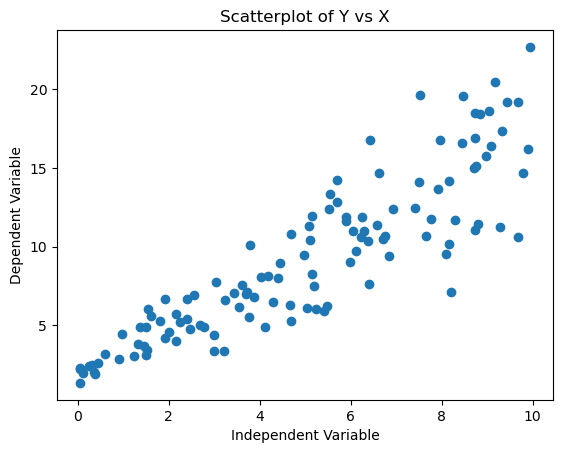
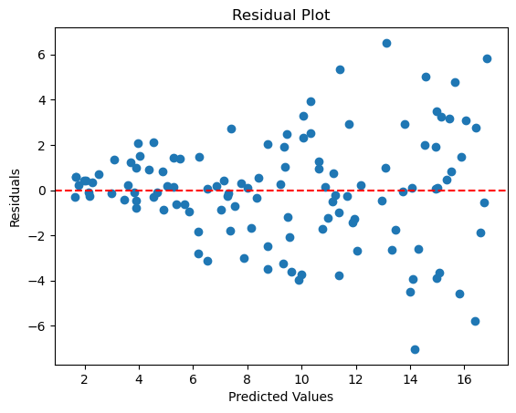
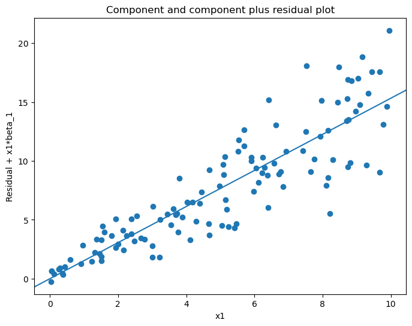

# 선형회귀의 선형성 확인

선형성은 종속변수와 각 독립변수 사이에 직선 관계가 있다고 상정하는 선형회귀의 기초 가정이다. 이 가정이 성립하는지 확인하는 일은 회귀모형의 타당성에 결정적이다. 변수들 사이의 관계가 선형이 아니면 모형이 편향된 추정을 내놓아 나쁜 예측과 잘못된 추론을 낳는다. 이 절은 선형회귀에서 선형성을 평가하는 여러 방법을 살펴본다.

## 설정

이 페이지의 진단은 모두 아래 자료와 모형 하나를 놓고 수행한다.

```python
import numpy as np
import pandas as pd
import statsmodels.api as sm

rng = np.random.default_rng(7)
n = 120

# X는 균등, Y는 X에 선형으로 의존하되 오차의 분산이 X와 함께 커진다.
# 이렇게 두면 선형성은 성립하고 등분산성만 깨져, 각 진단이 무엇을
# 잡아내고 무엇을 놓치는지 구분해 볼 수 있다.
X = rng.uniform(0, 10, n)
Y = 2.0 + 1.5 * X + rng.normal(0, 0.5 + 0.35 * X, n)

df = pd.DataFrame({"X": X, "Y": Y})
model = sm.OLS(Y, sm.add_constant(X)).fit()
residuals = model.resid
fitted = model.fittedvalues

print(f"beta_hat = {model.params.round(4)}")
print(f"R^2 = {model.rsquared:.4f}")
```

출력:

```
beta_hat = [1.5933 1.5317]
R^2 = 0.7813
```

기울기 추정값 1.53이 참값 1.5에 가깝다. 이분산이 있어도 OLS 추정값 자체는 불편이며, 흔들리는 것은 표준오차다.

## 1. 산점도를 이용한 시각적 점검

**산점도**는 선형성을 확인하는 가장 간단하고 직관적인 방법이다. 각 독립변수를 종속변수에 대해 그려 관계가 직선처럼 보이는지 눈으로 확인할 수 있다.

**절차:**

1. **자료 그리기:** 각 독립변수에 대해 $y$축에 종속변수, $x$축에 독립변수를 두고 산점도를 그린다.
2. **모양 평가:** 자료점들의 전반적인 모양을 관찰한다. 선형 관계라면 대체로 직선 주위에 모인 점구름으로 나타난다.
3. **패턴 찾기:** 자료점이 곡선이나 그 밖의 비선형 패턴을 이루면 선형성 가정이 위배되었을 가능성이 높다.

**예시:**

```python
import matplotlib.pyplot as plt

# Assuming X is the independent variable and Y is the dependent variable
plt.scatter(X, Y)
plt.xlabel('Independent Variable')
plt.ylabel('Dependent Variable')
plt.title('Scatterplot of Y vs X')
plt.show()
```



점들이 직선 주위에 모여 있어 선형 관계로 보인다. 오른쪽으로 갈수록 퍼짐이 커지는 것도 그림에서 이미 보인다.

**해석:**

- 직선 패턴은 선형성 가정이 충족되었을 가능성이 높음을 나타낸다.
- 곡선, 군집, 그 밖의 비선형 패턴은 선형성 가정의 위배 가능성을 시사한다.

## 2. 잔차그림

**잔차그림**은 선형성을 확인하는 또 하나의 강력한 도구이다. 잔차는 관측값과 회귀모형이 예측한 값의 차이이다. 잔차를 예측값에 대해 그리면 선형성 가정이 성립하는지 평가할 수 있다.

**절차:**

1. **선형회귀 모형 적합:** 먼저 모형을 적합하여 예측값을 얻는다.
2. **잔차 그리기:** $x$축에 예측값, $y$축에 잔차를 두고 그린다.
3. **잔차 평가:** 잔차가 수평축 주위에 무작위로 흩어져 있는지 확인한다.

**예시:**

```python
import statsmodels.api as sm
import matplotlib.pyplot as plt

# Assuming X is the independent variable and Y is the dependent variable
model = sm.OLS(Y, sm.add_constant(X)).fit()
predictions = model.predict(sm.add_constant(X))
residuals = Y - predictions

plt.scatter(predictions, residuals)
plt.xlabel('Predicted Values')
plt.ylabel('Residuals')
plt.title('Residual Plot')
plt.axhline(y=0, color='red', linestyle='--')
plt.show()
```



잔차가 0을 중심으로 무작위로 흩어져 있고 휘어진 패턴이 없다. 다만 오른쪽으로 갈수록 퍼짐이 커지는 것이 보이는데, 이것은 선형성이 아니라 **등분산성**의 문제다. 같은 그림이 두 가정을 동시에 진단한다는 점이 중요하다.

**해석:**

- **무작위 흩어짐:** 잔차가 뚜렷한 패턴 없이 0 주위에 무작위로 흩어져 있으면 선형성 가정이 충족되었을 가능성이 높다.
- **잔차의 패턴:** 잔차에 곡선 패턴, 체계적인 군집, 그 밖의 구조가 있으면 비선형성을 나타내며 선형모형이 적절하지 않을 수 있음을 시사한다.

## 3. 성분+잔차 그림(부분잔차 그림)

**성분+잔차(CPR) 그림**은 **부분잔차 그림**이라고도 하며, 잔차그림의 개념을 확장하여 다중회귀에서 개별 설명변수의 선형성을 평가하게 해 준다.

**수학적 정의:**

다중회귀 모형의 설명변수 $X_j$에 대해 부분잔차는 다음으로 정의된다.

$$
e_j^{(\text{부분})} = \hat{\beta}_j X_j + e
$$

여기서 $\hat{\beta}_j$는 $X_j$의 추정된 계수이고 $e$는 완전모형의 통상적인 잔차이다.

**절차:**

1. **완전모형 적합:** 다중선형회귀 모형을 적합한다.
2. **부분잔차 계산:** 각 독립변수에 대해 잔차에 추정계수와 설명변수의 곱을 더한 부분잔차를 그린다.
3. **선형성 평가:** 부분잔차와 설명변수의 관계가 선형인지 확인한다.

**예시:**

```python
import statsmodels.api as sm
from statsmodels.graphics.regressionplots import plot_ccpr
import matplotlib.pyplot as plt

# Fit the full model first; exog_idx selects the predictor to examine
results = sm.OLS(Y, sm.add_constant(X)).fit()

fig, ax = plt.subplots(figsize=(8, 6))
plot_ccpr(results, exog_idx=1, ax=ax)
plt.show()
```



부분잔차가 직선을 따라 놓이면 그 설명변수에 대한 선형성이 뒷받침된다.

!!! note "`plot_ccpr`와 `plot_partregress`는 다르다"
    성분+잔차(부분잔차) 그림은 `plot_ccpr`이다. 이름이 비슷한 `plot_partregress`는 **부분회귀 그림**(추가변수 그림)으로, $Y$를 나머지 설명변수에 회귀시킨 잔차를 $X_j$를 나머지 설명변수에 회귀시킨 잔차에 대해 그린 것이다. 둘 다 유용하지만 서로 다른 그림이며, `plot_partregress`의 인자 이름도 `exog`가 아니라 `exog_i`이다.

**해석:**

- **선형 추세:** CPR 그림에 직선 추세가 보이면 그 설명변수에 대한 선형성 가정이 충족된다.
- **비선형 추세:** 곡선이나 비선형 추세가 보이면 그 설명변수와 종속변수의 관계가 선형이 아님을 시사한다.

## 4. 다항 항 추가하기

종속변수와 독립변수의 관계가 선형이 아니라면 회귀모형에 **다항 항**(제곱항이나 세제곱항 등)을 추가하여 비선형 관계를 포착할 수 있다. 이 방법은 선형회귀의 틀을 유지하면서 곡률을 반영하게 해 준다.

**수학적 정식화:**

설명변수가 하나인 이차 다항 모형:

$$
Y = \beta_0 + \beta_1 X + \beta_2 X^2 + \epsilon
$$

삼차 다항 모형:

$$
Y = \beta_0 + \beta_1 X + \beta_2 X^2 + \beta_3 X^3 + \epsilon
$$

이들도 모수 $\beta_0, \beta_1, \beta_2, \beta_3$에 대해 선형이므로 여전히 **선형회귀** 모형임에 유의하라.

**절차:**

1. **다항 항 포함:** 독립변수의 고차 항을 회귀모형에 추가한다.
2. **모형 재적합:** 다항 항을 포함하여 모형을 적합한다.
3. **선형성 평가:** 다항 항 추가가 모형의 적합을 개선하는지 확인한다(예: $R^2$ 비교, AIC/BIC 사용).

**예시:**

```python
import numpy as np
import statsmodels.api as sm

X_poly = np.column_stack((X, X**2))
model_quad = sm.OLS(Y, sm.add_constant(X_poly)).fit()

# summary()는 실행 날짜와 시각을 함께 찍으므로 계수 표만 인쇄한다.
print(model_quad.summary().tables[1])
print(f"R^2: 선형 {model.rsquared:.4f}  →  이차 {model_quad.rsquared:.4f}")
print(f"AIC: 선형 {model.aic:.2f}  →  이차 {model_quad.aic:.2f}")
```

출력:

```
==============================================================================
                 coef    std err          t      P>|t|      [0.025      0.975]
------------------------------------------------------------------------------
const          2.2252      0.628      3.545      0.001       0.982       3.468
x1             1.1466      0.289      3.971      0.000       0.575       1.718
x2             0.0388      0.028      1.380      0.170      -0.017       0.094
==============================================================================
R^2: 선형 0.7813  →  이차 0.7848
AIC: 선형 549.02  →  이차 549.08
```

이차 항을 넣어도 $R^2$가 0.7813에서 0.7848로 거의 오르지 않고, AIC는 549.02에서 549.08로 오히려 나빠진다. $x^2$의 계수도 $p = 0.170$으로 유의하지 않다.

선형성 가정이 맞다는 뜻이다. 자료를 실제로 선형 관계로 만들었으니 기대한 결과이며, 이 진단이 거짓 양성을 내지 않는다는 확인이기도 하다.

**해석:**

- **적합 개선:** 다항 모형이 적합을 유의하게 개선하면(예: $R^2$ 상승, 제곱항 계수가 유의) 원래 관계가 비선형이었음을 시사한다.
- **개선 없음:** 유의한 개선이 없으면 원래의 선형성 가정이 여전히 타당할 수 있다.

## 선형성 진단 요약

| 방법 | 유형 | 적합한 상황 | 핵심 지표 |
|--------|------|----------|---------------|
| 산점도 | 시각적 | 단순회귀, 1차 평가 | 점구름의 비선형 패턴 |
| 잔차그림 | 시각적 | 모든 회귀모형 | 잔차의 곡선 패턴 |
| CPR 그림 | 시각적 | 다중회귀 | 부분잔차의 비선형 추세 |
| 다항 항 | 형식적 | 특정 비선형 관계의 검정 | 유의한 고차 계수 |

선형회귀에서 선형성 가정을 확인하는 일은 정확하고 해석 가능한 모형을 만드는 데 결정적이다. 여기서 다룬 방법들은 이 가정의 위배 가능성을 진단하고 대처하는 견실한 도구를 제공한다. 선형성을 신중히 확인하고 필요한 조정을 하면 선형회귀 모형의 신뢰성과 그로부터 끌어낸 결론의 타당성을 높일 수 있다.

## 연습문제

<div class="drillbox" markdown>

**연습문제 1.** <span class="diff med" title="중간"></span>
다중회귀에서 설명변수 $X_2$의 성분+잔차(CPR) 그림에 뚜렷한 U자 곡선이 나타났다. 이 비선형성에 대처하기 위해 모형을 수정하는 두 가지 방법을 기술하라.

</div>

??? success "풀이"

    1. **다항 항 추가:** $X_2^2$을 설명변수로 추가하여 모형을 $Y = \beta_0 + \beta_1 X_1 + \beta_2 X_2 + \beta_3 X_2^2 + \varepsilon$으로 바꾼다. 선형회귀의 틀 안에서 이차 관계를 포착한다.

    2. **변수변환:** 회귀를 적합하기 전에 $\log(X_2)$, $\sqrt{X_2}$ 등 관계를 선형화하는 단조 변환을 $X_2$에 적용한다.

<div class="drillbox" markdown>

**연습문제 2.** <span class="diff med" title="중간"></span>
다중회귀에서 $Y$ 대 $X_j$의 산점도와 $X_j$의 부분잔차 그림이 어떻게 다른지 설명하라. 두 그림이 선형성에 대해 서로 다른 결론을 줄 때는 언제인가?

</div>

??? success "풀이"
    $Y$ 대 $X_j$의 **산점도**는 주변 관계를 보여주며, 다른 설명변수의 효과에 의해 교란되어 있을 수 있다. **부분잔차 그림**(성분+잔차 그림)은 $e + \hat{\beta}_j X_j$를 $X_j$에 대해 그려, 다른 모든 설명변수의 효과를 제거한 뒤 $Y$와 $X_j$의 관계를 분리해 보여준다.

    두 그림은 다른 설명변수가 $X_j$와 상관되어 있을 때 달라진다. 예를 들어 $X_1$과 $X_2$가 양의 상관을 가지며 둘 다 $Y$에 영향을 준다면, $Y$ 대 $X_2$의 산점도는 ($X_1$의 효과가 $X_2$의 효과를 강화하여) 선형으로 보일 수 있지만, $X_1$을 조정한 부분잔차 그림에서는 비선형 부분관계가 드러날 수 있다.

<div class="drillbox" markdown>

**연습문제 3.** <span class="diff med" title="중간"></span>
집값을 면적에 회귀시켰을 때 산점도에서는 선형으로 보이는데 잔차-적합값 그림에는 미묘한 곡률이 보인다. 두 진단이 어긋날 수 있는 이유와 어느 쪽을 믿어야 하는지 설명하라.

</div>

??? success "풀이"
    산점도는 원자료를 보여주므로 분산이 크면 미묘한 비선형성이 가려질 수 있다. 잔차-적합값 그림은 선형 추세를 제거하고 $y$축 눈금을 잔차 범위로 압축하므로 남아 있는 곡률이 훨씬 잘 보인다.

    **잔차-적합값 그림**을 믿어야 한다. 모형의 선형성 가정이 적절한지를 직접 평가하기 때문이다. 산점도는 1차 탐색에는 유용하지만 신호 대 잡음비가 낮을 때 선형성에서의 미묘한 이탈을 탐지하지 못한다.

---

## 정리하며

선형성 확인의 **구체적 도구들**을 모았다.

- **적합값 대 잔차 그림이 첫 단계다.** 무작위 구름이면 좋고, 곡선·U 자 패턴이 보이면 관계가 선형이 아니다.
- **부분잔차 그림이 변수별로 본다.** 다중회귀에서 전체 잔차 그림이 깨끗해도 개별 변수와는 곡선 관계일 수 있으며, 이 그림이 그것을 드러낸다.
- **형식적 검정도 있다.** 램지 RESET 검정이 적합값의 거듭제곱을 넣어 개선되는지 본다.
- **처방이 여럿이다.** 다항항, 로그·제곱근 변환, 스플라인, GAM. **변환은 해석의 척도를 바꾸므로** 무엇을 얻고 무엇을 잃는지 따져야 한다.
- **자료 범위 안에서만 판단한다.** 관측이 드문 영역의 곡률은 근거가 약하다.

다음 절 **독립성 확인**으로 넘어간다.
