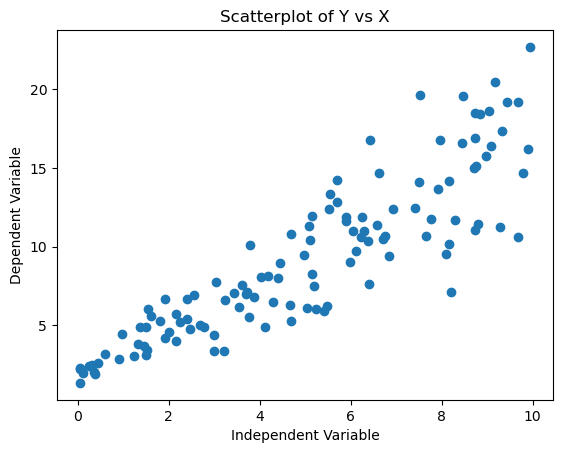
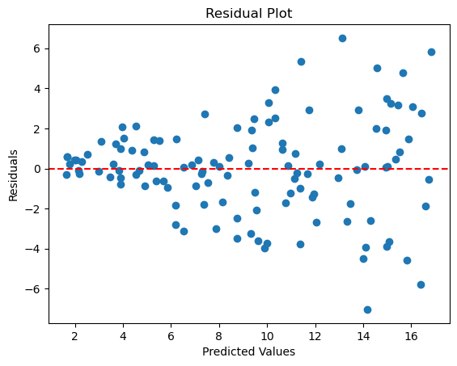
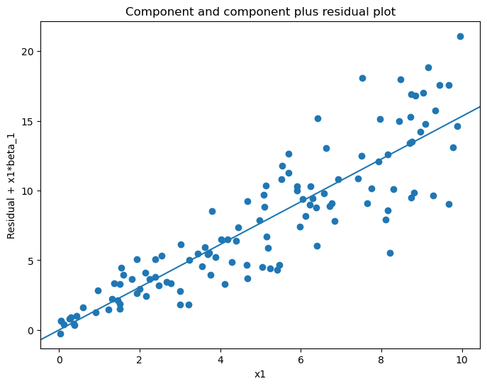

# 선형회귀의 선형성 확인

선형성은 종속변수와 각 독립변수 사이에 직선 관계가 있다고 상정하는 선형회귀의 기초 가정이다. 이 가정이 성립하는지 확인하는 일은 회귀모형의 타당성에 결정적이다. 변수들 사이의 관계가 선형이 아니면 모형이 편향된 추정을 내놓아 나쁜 예측과 잘못된 추론을 낳는다. 이 절은 선형회귀에서 선형성을 평가하는 여러 방법을 살펴본다.

---

## 1. 설정

이 페이지의 진단은 모두 아래 자료와 모형 하나를 놓고 수행한다.

<div class="exbox" markdown>

**보기 1.** <span class="diff easy" title="쉬움"></span> 진단에 쓸 모형 준비. 자료는 $X \sim U(0,10)$, $Y = 2 + 1.5X + \varepsilon$이고 $\varepsilon \mid X \sim N\big(0,\, \sigma(X)^2\big)$, $\sigma(x) = 0.5 + 0.35x$다. **선형성은 성립하고 등분산성만 깨져 있다.**

**(1)** 이 모형의 **모집단 $R^2$**

$$
R^2_{\text{pop}} = \frac{\operatorname{Var}\big(E[Y \mid X]\big)}{\operatorname{Var}(Y)}
$$

를 닫힌 꼴로 구하시오.

**(2)** 모형을 적합해 표본 $R^2$을 얻고, (1)의 값과 견주시오. 어긋난다면 그 크기가 설명되는가.

</div>

??? success "풀이"

    **(1) 해석적으로.** $E[Y \mid X] = 2 + 1.5X$이므로 분자는

    $$
    \operatorname{Var}(2 + 1.5X) = 1.5^2 \operatorname{Var}(X) = 2.25 \cdot \frac{10^2}{12} = 2.25 \cdot \frac{25}{3} = 18.75
    $$

    이다. 분모는 전분산 분해로 가른다.

    $$
    \operatorname{Var}(Y) = \operatorname{Var}\big(E[Y\mid X]\big) + E\big[\operatorname{Var}(Y \mid X)\big] = 18.75 + E\big[\sigma(X)^2\big]
    $$

    남은 것은 $E[\sigma(X)^2]$ 하나다. $X \sim U(0,10)$이므로 $E[X] = 5$, $E[X^2] = \operatorname{Var}(X) + 25 = \tfrac{25}{3} + 25 = \tfrac{100}{3}$이고

    $$
    E[(0.5 + 0.35X)^2] = 0.25 + 0.35 E[X] + 0.1225\, E[X^2]
    = 0.25 + 1.75 + 0.1225 \cdot \tfrac{100}{3} = \frac{73}{12} = 6.08\overline{3}
    $$

    이다(가운데 항의 계수는 $2 \cdot 0.5 \cdot 0.35 = 0.35$다). 따라서

    $$
    R^2_{\text{pop}} = \frac{18.75}{18.75 + 6.0833} = \frac{18.75}{24.8333} = 0.7550
    $$

    이다. **이 $0.755$가 자료를 아무리 많이 모아도 넘을 수 없는 천장이다.** 모형이 완벽하게 옳아도 $R^2$이 1이 되지 않는 것은 오차가 있기 때문이며, **$R^2$은 모형이 맞는지를 재는 수가 아니라 신호 대 잡음의 비를 재는 수**라는 뜻이다. 이 페이지의 진단들이 $R^2$이 아니라 잔차의 **무늬**를 보는 이유가 여기 있다.

    **(2) 수치적으로.**

    ```python
    import numpy as np
    import pandas as pd
    import statsmodels.api as sm

    rng = np.random.default_rng(7)
    n = 120

    # X는 균등, Y는 X에 선형으로 의존하되 오차의 분산이 X와 함께 커진다.
    # 이렇게 두면 선형성은 성립하고 등분산성만 깨져, 각 진단이 무엇을
    # 잡아내고 무엇을 놓치는지 구분해 볼 수 있다.
    X = rng.uniform(0, 10, n)
    Y = 2.0 + 1.5 * X + rng.normal(0, 0.5 + 0.35 * X, n)

    df = pd.DataFrame({"X": X, "Y": Y})
    model = sm.OLS(Y, sm.add_constant(X)).fit()
    residuals = model.resid
    fitted = model.fittedvalues

    print(f"beta_hat = {model.params.round(4)}")
    print(f"R^2 = {model.rsquared:.4f}")
    ```

    출력:

    ```
    beta_hat = [1.5933 1.5317]
    R^2 = 0.7813
    ```

    (1)의 값과 견주고, 표본을 키우면 어디로 가는지 본다.

    ```python
    import numpy as np
    import statsmodels.api as sm

    # (1) 의 두 조각
    var_signal = 1.5 ** 2 * (10 ** 2 / 12)
    e_sigma2 = 0.25 + 0.35 * 5 + 0.35 ** 2 * (100 / 3)
    print(f"Var(E[Y|X]) = {var_signal:.4f}")
    print(f"E[sigma(X)^2] = {e_sigma2:.4f}   (= 73/12)")
    print(f"R^2_pop = {var_signal / (var_signal + e_sigma2):.4f}")
    print(f"표본 R^2 (n = 120) = {model.rsquared:.4f}")

    # 같은 모형에서 40만 개를 뽑으면 어디로 가는가
    big = np.random.default_rng(5)
    Xb = big.uniform(0, 10, 400_000)
    Yb = 2 + 1.5 * Xb + big.normal(0, 0.5 + 0.35 * Xb)
    print(f"표본 R^2 (n = 400000) = {sm.OLS(Yb, sm.add_constant(Xb)).fit().rsquared:.4f}")

    # 기울기가 참값에서 얼마나 떨어져 있는가 (참 SE 로 재면)
    Sxx = ((X - X.mean()) ** 2).sum()
    c = (X - X.mean()) / Sxx
    se_true = np.sqrt((c ** 2 * (0.5 + 0.35 * X) ** 2).sum())
    print(f"\nb1 = {model.params[1]:.4f},  참 SE = {se_true:.4f},  "
          f"(b1 - 1.5)/SE = {(model.params[1] - 1.5) / se_true:+.3f}")
    ```

    출력:

    ```
    Var(E[Y|X]) = 18.7500
    E[sigma(X)^2] = 6.0833   (= 73/12)
    R^2_pop = 0.7550
    표본 R^2 (n = 120) = 0.7813
    표본 R^2 (n = 400000) = 0.7542

    b1 = 1.5317,  참 SE = 0.0825,  (b1 - 1.5)/SE = +0.384
    ```

    **유도한 $R^2_{\text{pop}} = 0.7550$이 맞는다.** $n = 400{,}000$에서 표본 $R^2$이 $0.7542$로 수렴하는 것이 그 확인이다. $n = 120$에서의 $0.7813$은 그보다 $0.026$ 높은데, 표본 $R^2$이 위로 치우치는 추정량이라 그렇다. 표본 하나에서 나온 값이니 이 정도 흔들림은 당연하다.

    기울기도 멀쩡하다. $\hat\beta_1 = 1.5317$이 참값 $1.5$에서 참 표준오차의 $0.38$배 떨어져 있을 뿐이다. **이분산이 있어도 추정값 자체는 치우치지 않는다**는 것을 다시 확인하는 셈이며, 이 페이지가 묻는 선형성은 멀쩡하다는 뜻이기도 하다. 이제 그 멀쩡함을 **진단으로** 확인할 수 있는지, 그리고 멀쩡하지 않을 때 진단이 잡아내는지를 차례로 본다.

---

## 2. 산점도를 이용한 시각적 점검

**산점도**는 선형성을 확인하는 가장 간단하고 직관적인 방법이다. 각 독립변수를 종속변수에 대해 그려 관계가 직선처럼 보이는지 눈으로 확인할 수 있다.

**절차:**

1. **자료 그리기:** 각 독립변수에 대해 $y$축에 종속변수, $x$축에 독립변수를 두고 산점도를 그린다.
2. **모양 평가:** 자료점들의 전반적인 모양을 관찰한다. 선형 관계라면 대체로 직선 주위에 모인 점구름으로 나타난다.
3. **패턴 찾기:** 자료점이 곡선이나 그 밖의 비선형 패턴을 이루면 선형성 가정이 위배되었을 가능성이 높다.

**예시:**

<div class="exbox" markdown>

**보기 2.** <span class="diff easy" title="쉬움"></span> 산점도로 보기

**(1)** 산점도를 그려 읽히는 것을 수치와 함께 적으시오.

**(2)** 산점도가 **놓치는 크기의 곡률**이 있는지 알아보시오. 자료에 $a(x-5)^2$을 더해 가며, 산점도에 보이기 전에 형식적 검정이 먼저 반응하는지 확인하시오.

</div>

??? success "풀이"

    **(1) 수치적으로.**

    ```python
    import matplotlib.pyplot as plt
    import numpy as np

    plt.rcParams["font.sans-serif"] = ["NanumGothic", "Apple SD Gothic Neo", "Malgun Gothic"]
    plt.rcParams["font.family"] = "sans-serif"
    plt.rcParams["axes.unicode_minus"] = False

    # 설명변수가 하나뿐이면 산점도가 선형성을 보는 가장 곧은 방법이다.
    # 변수가 여럿이면 다른 변수의 효과가 섞이므로 아래 잔차 그림으로 가야 한다.
    plt.scatter(X, Y)
    plt.xlabel('Independent Variable')
    plt.ylabel('Dependent Variable')
    plt.title('Scatterplot of Y vs X')
    plt.show()

    print(f"corr(X, Y) = {np.corrcoef(X, Y)[0, 1]:.4f}")
    print(f"그 제곱    = {np.corrcoef(X, Y)[0, 1] ** 2:.4f}   (= 단순회귀의 R^2)")
    ```

    출력:

    ```
    corr(X, Y) = 0.8839
    그 제곱    = 0.7813   (= 단순회귀의 R^2)
    ```

    

    점들이 직선 주위에 모여 있고 굽은 자리가 없다. 상관이 $0.8839$, 그 제곱이 보기 1의 $R^2 = 0.7813$과 같다(상수항이 있는 단순회귀에서는 늘 그렇다). 오른쪽으로 갈수록 세로 폭이 넓어지는 것도 이미 보이는데, **그것은 선형성이 아니라 등분산성의 문제**다. 한 그림이 두 가정을 동시에 보여 주는 셈이며, 폭의 변화를 수로 적는 일은 [13.2절](checking_homoscedasticity.md)의 몫이다.

    **(2) 산점도가 못 보는 곡률.** 자료에 $a(x-5)^2$을 더해 $a$를 키워 가며 세 가지를 나란히 잰다. 산점도가 눈으로 말해 주는 상관계수, 이차항의 $t$값, 그리고 AIC의 변화다.

    ```python
    import numpy as np
    import statsmodels.api as sm

    print(f"{'a':>6}{'corr(X,Y)':>11}{'선형 R^2':>11}{'t(x^2)':>9}{'p':>11}{'dAIC':>9}")
    for a in (0.00, 0.05, 0.10, 0.20):
        Yc = Y + a * (X - 5) ** 2
        m1 = sm.OLS(Yc, sm.add_constant(X)).fit()
        m2 = sm.OLS(Yc, sm.add_constant(np.column_stack((X, X ** 2)))).fit()
        print(f"{a:>6.2f}{np.corrcoef(X, Yc)[0, 1]:>11.4f}{m1.rsquared:>11.4f}"
              f"{m2.tvalues[2]:>9.3f}{m2.pvalues[2]:>11.2e}{m2.aic - m1.aic:>+9.2f}")
    ```

    출력:

    ```
         a  corr(X,Y)     선형 R^2   t(x^2)          p     dAIC
      0.00     0.8839     0.7813    1.380   1.70e-01    +0.06
      0.05     0.8770     0.7691    3.161   2.00e-03    -7.83
      0.10     0.8653     0.7487    4.941   2.61e-06   -20.74
      0.20     0.8295     0.6881    8.502   7.04e-14   -55.73
    ```

    **$a = 0.05$ 줄이 이 보기의 요점이다.** 상관계수가 $0.8839$에서 $0.8770$으로 $0.007$ 움직였을 뿐이고 $R^2$도 $0.781 \to 0.769$라 산점도를 나란히 놓고 보아도 어느 쪽이 굽었는지 가려낼 수 없다. $x$의 범위가 $0$에서 $10$이고 기울기가 $1.5$라 $Y$가 $15$가량 움직이는데, 곡률이 더하는 양은 양끝에서 $0.05 \times 25 = 1.25$에 지나지 않는다. **점구름의 세로 폭(잔차의 표준편차 $2.4$)보다도 작은 휘어짐이다.**

    그런데 이차항의 $t$값은 $1.380$에서 $3.161$로 뛰고 p-값이 $0.002$가 되며 AIC도 $7.8$ 좋아진다. **눈이 못 보는 곡률을 검정은 본다.** 산점도는 1차 점검이지 결론이 아니며, 그래서 보기 3의 잔차 그림과 보기 5의 이차항 검정이 뒤따라야 한다.

    반대 방향도 기억할 일이다. $a$를 키우면 상관계수와 $R^2$이 **내려간다.** 실제 관계가 굽어 있을수록 직선 적합의 설명력이 떨어지는 것인데, $R^2$만 보는 사람은 이것을 "잡음이 늘었다"로 읽기 쉽다. 잡음이 아니라 **모형이 틀린 것**이고, 그 둘을 가르는 것은 $R^2$이 아니라 잔차의 무늬다.

**해석:**

- 직선 패턴은 선형성 가정이 충족되었을 가능성이 높음을 나타낸다.
- 곡선, 군집, 그 밖의 비선형 패턴은 선형성 가정의 위배 가능성을 시사한다.

---

## 3. 잔차그림

**잔차그림**은 선형성을 확인하는 또 하나의 강력한 도구이다. 잔차는 관측값과 회귀모형이 예측한 값의 차이이다. 잔차를 예측값에 대해 그리면 선형성 가정이 성립하는지 평가할 수 있다.

**절차:**

1. **선형회귀 모형 적합:** 먼저 모형을 적합하여 예측값을 얻는다.
2. **잔차 그리기:** $x$축에 예측값, $y$축에 잔차를 두고 그린다.
3. **잔차 평가:** 잔차가 수평축 주위에 무작위로 흩어져 있는지 확인한다.

**예시:**

<div class="exbox" markdown>

**보기 3.** <span class="diff easy" title="쉬움"></span> 잔차 그림으로 보기

**(1)** 잔차 그림에 **직선 추세가 나타나는 일은 원리상 없다**는 것을 보이시오. 그러므로 이 그림에서 찾을 것은 곡률뿐이다.

**(2)** 그 곡률을 재는 올바른 방법은 $e$를 $x^2$에 그냥 회귀시키는 것이 아니라 **$x^2$에서 $1$과 $x$로 설명되는 몫을 걷어 낸 나머지**에 회귀시키는 것이다. 그 계수가 보기 5에서 얻을 완전모형의 $\hat\beta_2$와 **정확히 같음**을 확인하시오.

</div>

??? success "풀이"

    **(1) 해석적으로.** 보기 1에서 쓴 설계행렬의 두 열이 $\mathbf 1$과 $\mathbf x$이고 정규방정식이 $X^\top \mathbf e = \mathbf 0$이므로

    $$
    \sum_i e_i = 0,
    \qquad
    \sum_i x_i e_i = 0
    $$

    이다. 적합값 $\hat y_i$는 이 두 열의 선형결합이므로 $\mathbf e$와 $\hat{\mathbf y}$ 역시 직교하고, 평균이 0이라는 조건과 합치면 두 벡터의 표본상관이 **정확히 0**이다. 곧 잔차 그림에 **기울어진 직선 추세는 넣으려야 넣을 수 없다.** 그런 추세가 보인다면 계산을 잘못한 것이다.

    그러므로 이 그림에서 읽을 것은 둘뿐이다. **세로 폭의 변화**(등분산성)와 **휘어짐**(선형성)이다. 휘어짐이 걸리는 자리는 $x^2$이며, $\sum_i x_i^2 e_i$는 위 두 등식에 매이지 않아 자유롭게 0에서 떨어질 수 있다.

    **(2) 해석적으로.** 완전모형 $\mathbf y = \beta_0 \mathbf 1 + \beta_1 \mathbf x + \beta_2 \mathbf x^2 + \mathbf u$를 생각하자. $M$을 $\{\mathbf 1, \mathbf x\}$ 위로의 사영을 빼는 행렬이라 하면 $\mathbf e = M\mathbf y$이고, Frisch–Waugh–Lovell 정리에 따라

    $$
    \hat\beta_2 = \frac{(M\mathbf x^2)^\top \mathbf y}{(M\mathbf x^2)^\top (M\mathbf x^2)}
    $$

    이다. $M$이 대칭이고 멱등이므로 분자는 $(\mathbf x^2)^\top M \mathbf y = (M\mathbf x^2)^\top \mathbf e$로도 적힌다. 곧

    $$
    \hat\beta_2 = \frac{(M\mathbf x^2)^\top \mathbf e}{\lVert M\mathbf x^2 \rVert^2}
    $$

    이고, 이것은 **잔차 $\mathbf e$를 $M\mathbf x^2$에 (상수항 없이) 회귀시킨 계수**다. $\mathbf x^2$을 그냥 쓰면 안 되는 까닭도 분명하다. $\mathbf x^2$에는 $\mathbf 1$과 $\mathbf x$ 방향의 성분이 섞여 있고 $\mathbf e$는 그 두 방향과 직교하므로, 그 성분들이 분모만 키워 계수를 끌어내린다.

    ```python
    import numpy as np
    import statsmodels.api as sm

    e = model.resid
    predictions = model.fittedvalues

    # 그림이 아니라 수로 확인한다. 직교 조건 두 개는 적합이 강제한다.
    print(f"sum e_i      = {e.sum():+.2e}")
    print(f"sum x_i e_i  = {(X * e).sum():+.2e}")
    print(f"sum x_i^2 e_i = {(X ** 2 * e).sum():+.4f}   (이것만 자유롭다)")

    # x^2 에서 1 과 x 로 설명되는 몫을 걷어 낸 나머지
    x2_resid = sm.OLS(X ** 2, sm.add_constant(X)).fit().resid
    fwl = sm.OLS(e, x2_resid).fit()
    full = sm.OLS(Y, sm.add_constant(np.column_stack((X, X ** 2)))).fit()
    print(f"\nFWL 로 구한 beta2   = {fwl.params[0]:.15f}")
    print(f"완전모형의 beta2    = {full.params[2]:.15f}")
    print(f"\nFWL 의 t  = {fwl.tvalues[0]:.4f}  (자유도 {int(fwl.df_resid)})")
    print(f"완전모형의 t = {full.tvalues[2]:.4f}  (자유도 {int(full.df_resid)})")
    print(f"두 t 의 비 = {fwl.tvalues[0] / full.tvalues[2]:.6f},  "
          f"sqrt(119/117) = {np.sqrt(119 / 117):.6f}")
    ```

    출력:

    ```
    sum e_i      = +4.23e-13
    sum x_i e_i  = +2.79e-12
    sum x_i^2 e_i = +272.5912   (이것만 자유롭다)

    FWL 로 구한 beta2   = 0.038757372543221
    완전모형의 beta2    = 0.038757372543221

    FWL 의 t  = 1.3919  (자유도 119)
    완전모형의 t = 1.3802  (자유도 117)
    두 t 의 비 = 1.008511,  sqrt(119/117) = 1.008511
    ```

    

    **유도가 맞는다.** 두 등식이 $10^{-12}$ 수준으로 0이고, FWL이 준 $\hat\beta_2$가 완전모형의 값과 소수점 열다섯째 자리까지 같다.

    **$t$값은 미세하게 다르다.** $1.3919$ 대 $1.3802$인데, 두 회귀의 잔차제곱합은 같지만 자유도가 $119$와 $117$로 다르기 때문이다. 보조회귀는 이미 써 버린 두 모수를 세지 않아 $s^2$을 작게 잡고, 그만큼 $t$를 부풀린다. 비가 정확히 $\sqrt{119/117} = 1.008511$이다. **계수를 FWL로 구하는 것은 안전하지만 유의성은 완전모형에서 읽어야 한다**는 뜻이다.

    그림 자체로 돌아오면, 잔차가 0 주위에 흩어져 있고 휘어진 무늬가 없다. 곡률을 수로 재면 $\hat\beta_2 = 0.0388$, $t = 1.38$로 유의하지 않다. 다만 오른쪽으로 갈수록 세로 폭이 커지는 것이 뚜렷한데, (1)에서 말한 대로 **같은 그림이 읽어 주는 두 가지 가운데 둘째**이고 선형성이 아니라 등분산성의 문제다.

**해석:**

- **무작위 흩어짐:** 잔차가 뚜렷한 패턴 없이 0 주위에 무작위로 흩어져 있으면 선형성 가정이 충족되었을 가능성이 높다.
- **잔차의 패턴:** 잔차에 곡선 패턴, 체계적인 군집, 그 밖의 구조가 있으면 비선형성을 나타내며 선형모형이 적절하지 않을 수 있음을 시사한다.

---

## 4. 성분+잔차 그림(부분잔차 그림)

**성분+잔차(CPR) 그림**은 **부분잔차 그림**이라고도 하며, 잔차그림의 개념을 확장하여 다중회귀에서 개별 설명변수의 선형성을 평가하게 해 준다.

**수학적 정의:**

다중회귀 모형의 설명변수 $X_j$에 대해 부분잔차는 다음으로 정의된다.

$$
e_j^{(\text{부분})} = \hat{\beta}_j X_j + e
$$

여기서 $\hat{\beta}_j$는 $X_j$의 추정된 계수이고 $e$는 완전모형의 통상적인 잔차이다.

**절차:**

1. **완전모형 적합:** 다중선형회귀 모형을 적합한다.
2. **부분잔차 계산:** 각 독립변수에 대해 잔차에 추정계수와 설명변수의 곱을 더한 부분잔차를 그린다.
3. **선형성 평가:** 부분잔차와 설명변수의 관계가 선형인지 확인한다.

**예시:**

<div class="exbox" markdown>

**보기 4.** <span class="diff easy" title="쉬움"></span> 성분-잔차 그림. 부분잔차는 $\hat\beta_j x_{ji} + e_i$다.

**(1)** 설명변수가 $x$ 하나뿐일 때 부분잔차가 $y_i - \hat\beta_0$과 **정확히 같음**을 보이시오. 그러므로 이 그림은 보기 2의 산점도를 세로로 평행이동한 것일 뿐이다. 또 부분잔차에 그은 최소제곱 직선의 기울기가 **언제나 정확히 $\hat\beta_j$**임을 보이시오.

**(2)** 두 사실을 확인하고, 설명변수가 둘일 때 이 그림이 비로소 무엇을 해 주는지 수치로 보이시오.

</div>

??? success "풀이"

    **(1) 해석적으로.** 설명변수가 하나면 $\hat y_i = \hat\beta_0 + \hat\beta_1 x_i$이고 $e_i = y_i - \hat y_i$이므로

    $$
    \hat\beta_1 x_i + e_i = \hat\beta_1 x_i + y_i - \hat\beta_0 - \hat\beta_1 x_i = y_i - \hat\beta_0
    $$

    이다. **세로축이 $y_i$에서 상수 $\hat\beta_0$을 뺀 것일 뿐**이므로 점의 배치가 산점도와 한 치도 다르지 않다. 단순회귀에서 CCPR 그림은 새 정보를 주지 않는다.

    기울기는 일반적인 경우에도 깔끔하다. 부분잔차 $\mathbf r_j = \hat\beta_j \mathbf x_j + \mathbf e$를 $\mathbf x_j$에 (상수항과 함께) 회귀시키면 기울기는

    $$
    \frac{\widehat{\operatorname{cov}}(\mathbf r_j, \mathbf x_j)}{\widehat{\operatorname{var}}(\mathbf x_j)}
    = \hat\beta_j + \frac{\widehat{\operatorname{cov}}(\mathbf e, \mathbf x_j)}{\widehat{\operatorname{var}}(\mathbf x_j)}
    = \hat\beta_j
    $$

    이다. 둘째 항이 사라지는 것은 정규방정식 $\mathbf x_j^\top \mathbf e = 0$ 때문이다. **그림에 그어지는 직선의 기울기는 자료를 보고 정한 것이 아니라 이미 $\hat\beta_j$로 정해져 있다.** 그러므로 이 그림에서 읽을 것은 기울기가 아니라 **점들이 그 직선에서 체계적으로 벗어나는 모양**이다.

    **(2) 수치적으로.**

    ```python
    import statsmodels.api as sm
    from statsmodels.graphics.regressionplots import plot_ccpr
    import matplotlib.pyplot as plt

    # 성분-잔차 그림(CCPR)은 다른 변수의 효과를 걷어 낸 뒤, 관심 있는 변수
    # 하나와 반응의 관계만 남겨 보여 준다. 설명변수가 여럿일 때 선형성을
    # 변수별로 확인하는 방법이다. exog_idx 로 볼 변수를 고른다.
    results = sm.OLS(Y, sm.add_constant(X)).fit()

    fig, ax = plt.subplots(figsize=(8, 6))
    plot_ccpr(results, exog_idx=1, ax=ax)
    plt.show()
    ```

    

    세로축 이름이 `Residual + x1*beta_1`로 적혀 있고, 점의 배치가 보기 2의 산점도와 같은 모양이다. 세로 눈금만 $0$–$20$으로 바뀌었는데 $\hat\beta_0 = 1.59$만큼 내려간 것이다. 수로 확인한다.

    ```python
    import numpy as np
    import statsmodels.api as sm

    b0, b1 = model.params
    partial = b1 * X + model.resid          # CCPR 의 세로축

    print(f"max |부분잔차 - (Y - b0)| = {np.abs(partial - (Y - b0)).max():.2e}")
    print(f"부분잔차에 그은 최소제곱 기울기 = "
          f"{sm.OLS(partial, sm.add_constant(X)).fit().params[1]:.12f}")
    print(f"원래 모형의 b1                 = {b1:.12f}")

    # 변수가 둘일 때 비로소 쓸모가 생긴다. X2 가 X1 과 섞여 있는 자료.
    r = np.random.default_rng(11)
    x1 = r.uniform(0, 10, 300)
    x2 = x1 + r.normal(0, 1.0, 300)
    y = 1 + 2.0 * x1 - 1.5 * x2 + r.normal(0, 2.0, 300)
    mm = sm.OLS(y, sm.add_constant(np.column_stack((x1, x2)))).fit()

    marg = sm.OLS(y, sm.add_constant(x2)).fit().params[1]
    part = mm.params[2] * x2 + mm.resid
    cc = sm.OLS(part, sm.add_constant(x2)).fit().params[1]
    print(f"\n참 계수            = -1.5")
    print(f"y 를 x2 에만 회귀   = {marg:+.4f}   (산점도가 보여 주는 기울기)")
    print(f"완전모형의 beta_2   = {mm.params[2]:+.4f}")
    print(f"부분잔차 그림의 기울기 = {cc:+.4f}")
    ```

    출력:

    ```
    max |부분잔차 - (Y - b0)| = 3.55e-15
    부분잔차에 그은 최소제곱 기울기 = 1.531654179791
    원래 모형의 b1                 = 1.531654179791

    참 계수            = -1.5
    y 를 x2 에만 회귀   = +0.2369   (산점도가 보여 주는 기울기)
    완전모형의 beta_2   = -1.5705
    부분잔차 그림의 기울기 = -1.5705
    ```

    **두 주장이 모두 확인된다.** 부분잔차와 $y - \hat\beta_0$의 최대 차이가 $3.6 \times 10^{-15}$이고, 그림의 기울기가 $\hat\beta_1 = 1.531654179791$과 소수점 열두째 자리까지 같다.

    **변수가 둘이 되면 사정이 완전히 달라진다.** $x_2 = x_1 + \text{잡음}$으로 두 변수를 섞어 놓고 $y = 1 + 2x_1 - 1.5x_2 + \varepsilon$을 만들었다. $y$를 $x_2$에만 회귀시키면 기울기가 $+0.2369$로 **부호부터 틀린다.** $x_2$가 $x_1$을 업고 들어와 $x_1$의 양의 효과를 대신 받기 때문이다. $y$ 대 $x_2$ 산점도를 그렸다면 "약한 양의 관계"라고 읽었을 것이다.

    부분잔차 그림의 기울기는 $-1.5705$로 완전모형의 $\hat\beta_2$와 같고 참값 $-1.5$에 가깝다. **$x_1$의 몫을 이미 걷어 낸 잔차 $\mathbf e$ 위에 $\hat\beta_2 \mathbf x_2$만 되얹었기 때문**이며, 이것이 CCPR 그림이 다중회귀에서 하는 일이다. 선형성을 변수별로 보려면 산점도가 아니라 이 그림을 보아야 한다는 말의 내용이 이것이다.

!!! note "`plot_ccpr`와 `plot_partregress`는 다르다"
    성분+잔차(부분잔차) 그림은 `plot_ccpr`이다. 이름이 비슷한 `plot_partregress`는 **부분회귀 그림**(추가변수 그림)으로, $Y$를 나머지 설명변수에 회귀시킨 잔차를 $X_j$를 나머지 설명변수에 회귀시킨 잔차에 대해 그린 것이다. 둘 다 유용하지만 서로 다른 그림이며, `plot_partregress`의 인자 이름도 `exog`가 아니라 `exog_i`이다.

**해석:**

- **선형 추세:** CPR 그림에 직선 추세가 보이면 그 설명변수에 대한 선형성 가정이 충족된다.
- **비선형 추세:** 곡선이나 비선형 추세가 보이면 그 설명변수와 종속변수의 관계가 선형이 아님을 시사한다.

---

## 5. 다항 항 추가하기

종속변수와 독립변수의 관계가 선형이 아니라면 회귀모형에 **다항 항**(제곱항이나 세제곱항 등)을 추가하여 비선형 관계를 포착할 수 있다. 이 방법은 선형회귀의 틀을 유지하면서 곡률을 반영하게 해 준다.

**수학적 정식화:**

설명변수가 하나인 이차 다항 모형:

$$
Y = \beta_0 + \beta_1 X + \beta_2 X^2 + \epsilon
$$

삼차 다항 모형:

$$
Y = \beta_0 + \beta_1 X + \beta_2 X^2 + \beta_3 X^3 + \epsilon
$$

이들도 모수 $\beta_0, \beta_1, \beta_2, \beta_3$에 대해 선형이므로 여전히 **선형회귀** 모형임에 유의하라.

**절차:**

1. **다항 항 포함:** 독립변수의 고차 항을 회귀모형에 추가한다.
2. **모형 재적합:** 다항 항을 포함하여 모형을 적합한다.
3. **선형성 평가:** 다항 항 추가가 모형의 적합을 개선하는지 확인한다(예: $R^2$ 비교, AIC/BIC 사용).

**예시:**

<div class="exbox" markdown>

**보기 5.** <span class="diff easy" title="쉬움"></span> 이차항을 넣어 견주기. 두 모형이 포함관계이고 항이 하나만 늘었다.

**(1)** 변수를 하나 더할 때 AIC의 변화가 그 변수의 $t$값만으로 적힘을 보이시오. 곧

$$
\Delta\mathrm{AIC} = n \log\!\left(1 - \frac{t^2}{t^2 + \nu}\right) + 2,
\qquad \nu = n - p - 1
$$

임을 보이고, $n$이 크면 **AIC가 좋아지는 조건이 $\lvert t \rvert > \sqrt 2$** 임을 결론하시오. BIC라면 문턱이 얼마가 되는가.

**(2)** 이차항을 넣어 적합하고 (1)의 식을 확인하시오.

</div>

??? success "풀이"

    **(1) 해석적으로.** 정규가능도를 쓰면 AIC는 상수를 빼고

    $$
    \mathrm{AIC} = n \log\frac{\mathrm{SSE}}{n} + 2k
    $$

    이다($k$는 모수 개수, 분산을 세는 방식은 두 모형에서 같으므로 차에서 상쇄된다). 항을 하나 더해 $k$가 1 늘고 잔차제곱합이 $\mathrm{SSE}_1 \to \mathrm{SSE}_2$로 바뀌면

    $$
    \Delta\mathrm{AIC} = n \log\frac{\mathrm{SSE}_2}{\mathrm{SSE}_1} + 2
    $$

    이다. 이제 $\mathrm{SSE}$의 비를 $t$값으로 바꾼다. 항을 하나 더하는 경우 $F = t^2$이고

    $$
    t^2 = F = \frac{\mathrm{SSE}_1 - \mathrm{SSE}_2}{\mathrm{SSE}_2 / \nu},
    \qquad \nu = n - p - 1
    $$

    이므로 $\mathrm{SSE}_1 = \mathrm{SSE}_2 (1 + t^2/\nu)$, 곧

    $$
    \frac{\mathrm{SSE}_2}{\mathrm{SSE}_1} = \frac{1}{1 + t^2/\nu} = 1 - \frac{t^2}{t^2 + \nu}
    $$

    이다. 이것을 넣으면 구하는 식이 나온다.

    $n$이 크면 $\log(1 - u) \approx -u$이고 $t^2/(t^2+\nu) \approx t^2/n$이므로

    $$
    \Delta\mathrm{AIC} \approx -t^2 + 2
    $$

    이다. 따라서 **AIC가 좋아지는($\Delta < 0$) 조건은 $t^2 > 2$, 곧 $\lvert t \rvert > \sqrt 2 = 1.414$** 다. 유의성의 관례인 $\lvert t \rvert > 1.96$보다 **무른 문턱**이라는 데 유의하라. AIC는 예측을 겨냥하므로 유의하지 않은 변수도 더러 받아들인다.

    BIC는 벌점이 $2k$ 대신 $k \log n$이므로 같은 계산에서 $\Delta\mathrm{BIC} \approx -t^2 + \log n$이고 문턱이 $\lvert t \rvert > \sqrt{\log n}$이다. $n = 120$이면 $\sqrt{\log 120} = 2.188$로 $1.96$보다 **엄하다.** **같은 자료를 놓고 AIC는 넣자 하고 BIC는 빼자 하는 구간이 $1.414 < \lvert t \rvert < 2.188$로 꽤 넓다.**

    **(2) 수치적으로.**

    ```python
    import numpy as np
    import statsmodels.api as sm

    # 곡선이 의심되면 이차항을 넣어 견준다. R^2 는 항을 더하면 반드시 오르므로
    # 판단 근거가 되지 못한다. 벌점이 붙는 AIC 로 보아야 한다.
    X_poly = np.column_stack((X, X**2))
    model_quad = sm.OLS(Y, sm.add_constant(X_poly)).fit()

    # summary()는 실행 날짜와 시각을 함께 찍으므로 계수 표만 인쇄한다.
    print(model_quad.summary().tables[1])
    print(f"R^2: 선형 {model.rsquared:.4f}  →  이차 {model_quad.rsquared:.4f}")
    print(f"AIC: 선형 {model.aic:.2f}  →  이차 {model_quad.aic:.2f}")
    ```

    출력:

    ```
    ==============================================================================
                     coef    std err          t      P>|t|      [0.025      0.975]
    ------------------------------------------------------------------------------
    const          2.2252      0.628      3.545      0.001       0.982       3.468
    x1             1.1466      0.289      3.971      0.000       0.575       1.718
    x2             0.0388      0.028      1.380      0.170      -0.017       0.094
    ==============================================================================
    R^2: 선형 0.7813  →  이차 0.7848
    AIC: 선형 549.02  →  이차 549.08
    ```

    (1)의 식과 맞춰 본다.

    ```python
    import numpy as np

    t = model_quad.tvalues[2]
    nu = model_quad.df_resid          # n - p - 1 = 117
    dAIC_t = n * np.log(1 - t ** 2 / (t ** 2 + nu)) + 2
    dAIC_sse = n * np.log(model_quad.ssr / model.ssr) + 2

    print(f"t(x^2) = {t:.4f},  t^2 = {t ** 2:.4f},  nu = {int(nu)}")
    print(f"\ndAIC  (t 로)       = {dAIC_t:+.6f}")
    print(f"dAIC  (SSE 비로)   = {dAIC_sse:+.6f}")
    print(f"dAIC  (실제)       = {model_quad.aic - model.aic:+.6f}")
    print(f"큰 n 근사 -t^2 + 2 = {-t ** 2 + 2:+.6f}")

    print(f"\nAIC 문턱 sqrt(2)      = {np.sqrt(2):.4f}")
    print(f"BIC 문턱 sqrt(log n)  = {np.sqrt(np.log(n)):.4f}")
    print(f"dBIC (실제)           = {model_quad.bic - model.bic:+.6f}")
    ```

    출력:

    ```
    t(x^2) = 1.3802,  t^2 = 1.9048,  nu = 117

    dAIC  (t 로)       = +0.062043
    dAIC  (SSE 비로)   = +0.062043
    dAIC  (실제)       = +0.062043
    큰 n 근사 -t^2 + 2 = +0.095152

    AIC 문턱 sqrt(2)      = 1.4142
    BIC 문턱 sqrt(log n)  = 2.1880
    dBIC (실제)           = +2.849535
    ```

    **유도한 식이 소수점 여섯째 자리까지 맞는다.** $t$만으로 계산한 $\Delta\mathrm{AIC}$, $\mathrm{SSE}$ 비로 계산한 것, `statsmodels`가 보고한 실제 차이가 모두 $+0.062043$이다. 큰 $n$ 근사 $-t^2 + 2 = +0.095$는 $n = 120$에서 $0.03$쯤 어긋나는데, $\log(1-u) \approx -u$의 이차 오차이므로 예상된 크기다.

    **$\lvert t \rvert = 1.3802$가 문턱 $1.4142$ 바로 아래다.** 그래서 AIC가 $0.06$만큼 나빠진다. 간발의 차이이며, 이 자료에 이차항이 **거의 필요할 뻔했다**는 뜻이 아니라 **잡음이 우연히 이차항 모양을 조금 흉내 냈다**는 뜻이다. 자료를 실제로 직선으로 만들었으니 참말은 $\beta_2 = 0$이고, 진단이 거짓 양성을 내지 않은 것이 옳은 결과다. BIC는 $+2.85$로 훨씬 단호하게 거절한다.

    $R^2$을 보라. $0.7813 \to 0.7848$로 **올랐다.** 포함관계인 모형에 항을 더하면 $R^2$은 결코 내려가지 않으므로 이 상승은 아무것도 말해 주지 않는다. 보기 2에서 본 $a = 0.05$의 자료에서는 $t$가 $3.161$이어서 $\Delta\mathrm{AIC} = -7.83$으로 뚜렷이 좋아졌다. **같은 $R^2$의 상승이라도 그것이 벌점을 넘느냐가 판단의 기준**이고, 그 기준을 $t$ 하나로 읽는 법이 (1)의 식이다.

**해석:**

- **적합 개선:** 다항 모형이 적합을 유의하게 개선하면(예: $R^2$ 상승, 제곱항 계수가 유의) 원래 관계가 비선형이었음을 시사한다.
- **개선 없음:** 유의한 개선이 없으면 원래의 선형성 가정이 여전히 타당할 수 있다.

---

## 6. 선형성 진단 요약

| 방법 | 유형 | 적합한 상황 | 핵심 지표 |
|--------|------|----------|---------------|
| 산점도 | 시각적 | 단순회귀, 1차 평가 | 점구름의 비선형 패턴 |
| 잔차그림 | 시각적 | 모든 회귀모형 | 잔차의 곡선 패턴 |
| CPR 그림 | 시각적 | 다중회귀 | 부분잔차의 비선형 추세 |
| 다항 항 | 형식적 | 특정 비선형 관계의 검정 | 유의한 고차 계수 |

선형회귀에서 선형성 가정을 확인하는 일은 정확하고 해석 가능한 모형을 만드는 데 결정적이다. 여기서 다룬 방법들은 이 가정의 위배 가능성을 진단하고 대처하는 견실한 도구를 제공한다. 선형성을 신중히 확인하고 필요한 조정을 하면 선형회귀 모형의 신뢰성과 그로부터 끌어낸 결론의 타당성을 높일 수 있다.

---

## 연습문제

<div class="drillbox" markdown>

**연습문제 1.** <span class="diff med" title="중간"></span>
다중회귀에서 설명변수 $X_2$의 성분+잔차(CPR) 그림에 뚜렷한 U자 곡선이 나타났다. 이 비선형성에 대처하기 위해 모형을 수정하는 두 가지 방법을 기술하라.

</div>

??? success "풀이"

    1. **다항 항 추가:** $X_2^2$을 설명변수로 추가하여 모형을 $Y = \beta_0 + \beta_1 X_1 + \beta_2 X_2 + \beta_3 X_2^2 + \varepsilon$으로 바꾼다. 선형회귀의 틀 안에서 이차 관계를 포착한다.

    2. **변수변환:** 회귀를 적합하기 전에 $\log(X_2)$, $\sqrt{X_2}$ 등 관계를 선형화하는 단조 변환을 $X_2$에 적용한다.

<div class="drillbox" markdown>

**연습문제 2.** <span class="diff med" title="중간"></span>
다중회귀에서 $Y$ 대 $X_j$의 산점도와 $X_j$의 부분잔차 그림이 어떻게 다른지 설명하라. 두 그림이 선형성에 대해 서로 다른 결론을 줄 때는 언제인가?

</div>

??? success "풀이"
    $Y$ 대 $X_j$의 **산점도**는 주변 관계를 보여주며, 다른 설명변수의 효과에 의해 교란되어 있을 수 있다. **부분잔차 그림**(성분+잔차 그림)은 $e + \hat{\beta}_j X_j$를 $X_j$에 대해 그려, 다른 모든 설명변수의 효과를 제거한 뒤 $Y$와 $X_j$의 관계를 분리해 보여준다.

    두 그림은 다른 설명변수가 $X_j$와 상관되어 있을 때 달라진다. 예를 들어 $X_1$과 $X_2$가 양의 상관을 가지며 둘 다 $Y$에 영향을 준다면, $Y$ 대 $X_2$의 산점도는 ($X_1$의 효과가 $X_2$의 효과를 강화하여) 선형으로 보일 수 있지만, $X_1$을 조정한 부분잔차 그림에서는 비선형 부분관계가 드러날 수 있다.

<div class="drillbox" markdown>

**연습문제 3.** <span class="diff med" title="중간"></span>
집값을 면적에 회귀시켰을 때 산점도에서는 선형으로 보이는데 잔차-적합값 그림에는 미묘한 곡률이 보인다. 두 진단이 어긋날 수 있는 이유와 어느 쪽을 믿어야 하는지 설명하라.

</div>

??? success "풀이"
    산점도는 원자료를 보여주므로 분산이 크면 미묘한 비선형성이 가려질 수 있다. 잔차-적합값 그림은 선형 추세를 제거하고 $y$축 눈금을 잔차 범위로 압축하므로 남아 있는 곡률이 훨씬 잘 보인다.

    **잔차-적합값 그림**을 믿어야 한다. 모형의 선형성 가정이 적절한지를 직접 평가하기 때문이다. 산점도는 1차 탐색에는 유용하지만 신호 대 잡음비가 낮을 때 선형성에서의 미묘한 이탈을 탐지하지 못한다.

---

## 정리하며

선형성 확인의 **구체적 도구들**을 모았다.

- **적합값 대 잔차 그림이 첫 단계다.** 무작위 구름이면 좋고, 곡선·U 자 패턴이 보이면 관계가 선형이 아니다.
- **부분잔차 그림이 변수별로 본다.** 다중회귀에서 전체 잔차 그림이 깨끗해도 개별 변수와는 곡선 관계일 수 있으며, 이 그림이 그것을 드러낸다.
- **형식적 검정도 있다.** 램지 RESET 검정이 적합값의 거듭제곱을 넣어 개선되는지 본다.
- **처방이 여럿이다.** 다항항, 로그·제곱근 변환, 스플라인, GAM. **변환은 해석의 척도를 바꾸므로** 무엇을 얻고 무엇을 잃는지 따져야 한다.
- **자료 범위 안에서만 판단한다.** 관측이 드문 영역의 곡률은 근거가 약하다.

다음 절 **독립성 확인**으로 넘어간다.
