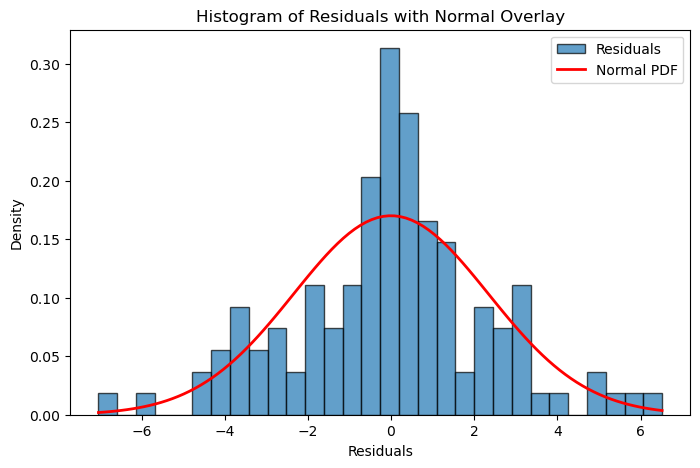
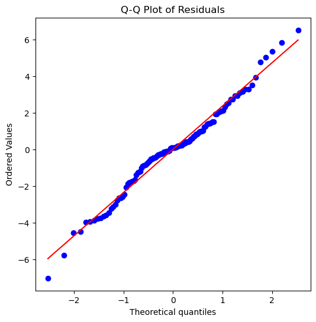

# 선형회귀의 정규성 확인

잔차의 정규성은 선형회귀의 핵심 가정 가운데 하나이다. 이 가정은 모형의 잔차(오차)가 정규분포를 따라야 한다고 상정한다. 회귀계수의 타당성에는 선형성 가정이 더 결정적이지만, 신뢰구간·가설검정·예측구간의 타당성을 확보하려면 잔차의 정규성을 확인하는 일이 중요하다. 이 절은 선형회귀에서 정규성을 확인하는 방법을 시각적 점검과 통계검정으로 나누어 정리한다.

## 1. 회귀에서의 정규성 이해

<div class="defn" markdown>

### 정의 1. 정규성 { .dfn }
선형회귀의 정규성은 잔차가 정규분포를 따른다는 뜻으로, 그렸을 때 0을 중심으로 하는 종 모양 곡선을 이루어야 한다는 것이다.

$$
\epsilon_i \sim N(0, \sigma^2)
$$

**왜 중요한가:**
잔차의 정규성은 회귀계수의 불편추정에는 필요하지 않지만 다음에는 결정적이다.

- **신뢰구간과 가설검정:** 정확하려면 오차가 정규분포를 따른다는 가정이 필요하다. 계수 검정에 쓰는 t 분포가 정규성 가정 아래에서 유도된 것이다.
- **예측구간:** 새 관측값에 대한 예측구간이 타당하려면 정규성이 필요하다.
- **작은 표본:** 큰 표본에서는 오차가 정규가 아니어도 중심극한정리가 검정통계량의 점근적 정규성을 보장한다. 작은 표본($n < 30$)에서는 정규성 가정이 결정적이 된다.

</div>

## 설정

이 페이지의 진단은 모두 아래 자료와 모형 하나를 놓고 수행한다.

<div class="codebox" markdown>

**예제 1.** 진단에 쓸 모형 준비

```python
import numpy as np
import pandas as pd
import statsmodels.api as sm

rng = np.random.default_rng(7)
n = 120

# X는 균등, Y는 X에 선형으로 의존하되 오차의 분산이 X와 함께 커진다.
# 이렇게 두면 선형성은 성립하고 등분산성만 깨져, 각 진단이 무엇을
# 잡아내고 무엇을 놓치는지 구분해 볼 수 있다.
X = rng.uniform(0, 10, n)
Y = 2.0 + 1.5 * X + rng.normal(0, 0.5 + 0.35 * X, n)

df = pd.DataFrame({"X": X, "Y": Y})
model = sm.OLS(Y, sm.add_constant(X)).fit()
residuals = model.resid
fitted = model.fittedvalues

print(f"beta_hat = {model.params.round(4)}")
print(f"R^2 = {model.rsquared:.4f}")
```

출력:

```
beta_hat = [1.5933 1.5317]
R^2 = 0.7813
```

기울기 추정값 1.53이 참값 1.5에 가깝다. 이분산이 있어도 OLS 추정값 자체는 불편이며, 흔들리는 것은 표준오차다.

</div>

## 2. 잔차의 히스토그램

정규성을 평가하는 가장 간단한 방법 하나는 **잔차의 히스토그램**을 그리는 것이다. 이 시각적 점검으로 잔차가 대략 정규분포를 따르는지 판단할 수 있다.

**절차:**

1. **선형회귀 모형 적합:** 모형에서 잔차를 얻는다.
2. **히스토그램 그리기:** 잔차로 히스토그램을 그린다.
3. **그림 평가:** 히스토그램의 모양을 정규분포와 비교한다.

**예시:**

<div class="codebox" markdown>

**예제 2.** 잔차의 히스토그램

```python
import matplotlib.pyplot as plt
import numpy as np
from scipy.stats import norm

# 정규성은 자료가 아니라 잔차에 요구되는 가정이다. 게다가 계수 추정의
# 불편성에는 필요 없고, 작은 표본에서 t 검정과 신뢰구간을 쓰기 위해 필요하다.
residuals = model.resid

fig, ax = plt.subplots(figsize=(8, 5))
ax.hist(residuals, bins=30, density=True, edgecolor='black', alpha=0.7, label='Residuals')

# 잔차의 평균과 표준편차로 만든 정규곡선을 겹쳐 그린다.
x = np.linspace(residuals.min(), residuals.max(), 100)
ax.plot(x, norm.pdf(x, loc=residuals.mean(), scale=residuals.std()),
        'r-', linewidth=2, label='Normal PDF')

ax.set_xlabel('Residuals')
ax.set_ylabel('Density')
ax.set_title('Histogram of Residuals with Normal Overlay')
ax.legend()
plt.show()
```



점들이 기준선을 잘 따른다. 양 끝에서 조금 벗어나지만 $n = 120$에서 이 정도는 흔한 흔들림이다.

**해석:**

- **정규성:** 히스토그램이 0을 중심으로 대칭인 종 모양 곡선을 닮아야 한다.
- **비정규성:** 히스토그램이 치우쳐 있거나, 봉우리가 여럿이거나(다봉), 지나치게 평평하거나(저첨), 지나치게 뾰족하면(고첨) 잔차가 정규분포를 따르지 않을 수 있다.

</div>

## 3. Q-Q 그림(분위수-분위수 그림)

**Q-Q 그림**은 정규성을 평가하는 더 정밀한 시각적 도구이다. 잔차의 분위수를 표준정규분포의 분위수와 비교한다.

**작동 방식:**

1. 잔차를 정렬하여 경험적 분위수를 계산한다.
2. 표준정규분포에서 대응하는 이론적 분위수를 계산한다.
3. 경험적 분위수($y$축)를 이론적 분위수($x$축)에 대해 그린다.
4. 잔차가 정규분포를 따르면 점들이 기준선을 따라 놓인다.

**절차:**

1. **선형회귀 모형 적합:** 잔차를 얻는다.
2. **Q-Q 그림 그리기:** 잔차로 그림을 그린다.
3. **그림 평가:** 잔차가 기준선을 따르는지 확인한다.

**예시:**

<div class="codebox" markdown>

**예제 3.** Q-Q 그림

```python
import scipy.stats as stats
import matplotlib.pyplot as plt

residuals = model.resid

# Q-Q 그림이 히스토그램보다 낫다. 계급 수에 휘둘리지 않고, 정규에서
# 벗어나는 자리가 꼬리인지 가운데인지까지 알려 준다.
fig, ax = plt.subplots(figsize=(6, 6))
stats.probplot(residuals, dist="norm", plot=ax)
ax.set_title('Q-Q Plot of Residuals')
plt.show()
```



종 모양에 가깝다. 관측값 120개를 구간에 나누어 담았으므로 요철은 표집 변동으로 보아야 한다.

**해석:**

- **정규성:** 점들이 기준선을 가깝게 따르면 잔차가 정규분포를 따를 가능성이 높다.
- **비정규성:** 선에서 벗어나는 모습, 특히 꼬리에서의 이탈은 정규성에서 벗어났음을 나타낸다.

**Q-Q 그림의 흔한 패턴:**

| 패턴 | 의미 |
|---------|-----------|
| 점들이 선을 따름 | 정규분포 |
| S자 곡선 | 두꺼운 꼬리(고첨) |
| 뒤집힌 S자 | 얇은 꼬리(저첨) |
| 양쪽 끝이 위로 휨 | 오른쪽으로 치우친 분포 |
| 양쪽 끝이 아래로 휨 | 왼쪽으로 치우친 분포 |

</div>

## 4. Shapiro-Wilk 검정

**Shapiro-Wilk 검정**은 잔차의 정규성을 검정하기 위해 특별히 고안된 통계검정이다. 정규성에서의 이탈을 탐지하는 가장 강력한 검정 가운데 하나이다.

**가설:**

- $H_0$: 잔차가 정규분포를 따른다
- $H_1$: 잔차가 정규분포를 따르지 않는다

**검정통계량:**

$$
W = \frac{\left(\sum_{i=1}^n a_i x_{(i)}\right)^2}{\sum_{i=1}^n (x_i - \bar{x})^2}
$$

여기서 $x_{(i)}$는 정렬된 잔차이고 $a_i$는 표준정규분포 순서통계량의 기댓값에서 생성된 상수이다.

**절차:**

1. **선형회귀 모형 적합:** 잔차를 얻는다.
2. **Shapiro-Wilk 검정 수행:** 잔차에 검정을 적용한다.
3. **결과 해석:** p값이 유의하면(보통 < 0.05) 잔차가 정규분포를 따르지 않음을 시사한다.

**예시:**

<div class="codebox" markdown>

**예제 4.** Shapiro-Wilk 검정

```python
from scipy.stats import shapiro

residuals = model.resid

# Shapiro-Wilk 는 작은 표본에서 검정력이 좋다. 다만 표본이 수천을 넘으면
# 실질적으로 무시할 만한 이탈에도 유의하게 나오므로 그림과 함께 읽는다.
stat, p_value = shapiro(residuals)
print(f'Shapiro-Wilk statistic: {stat:.4f}')
print(f'Shapiro-Wilk p-value: {p_value:.4f}')

if p_value > 0.05:
    print('No significant evidence of non-normality (fail to reject H0)')
else:
    print('Significant evidence of non-normality (reject H0)')
```

출력:

```
Shapiro-Wilk statistic: 0.9836
Shapiro-Wilk p-value: 0.1524
No significant evidence of non-normality (fail to reject H0)
```

Shapiro-Wilk가 $p = 0.15$로 정규성을 기각하지 못한다. 오차를 정규분포에서 만들었으니 옳은 판정이다. 분산이 $X$에 따라 달라도 각 오차는 여전히 정규라는 점에 주의하라. 이분산과 비정규성은 별개의 문제다.

**해석:**

- **p값 > 0.05:** 비정규성의 유의한 증거가 없다. 잔차를 정규분포를 따르는 것으로 볼 수 있다.
- **p값 < 0.05:** 비정규성의 유의한 증거가 있으며 가정 위배 가능성을 나타낸다.

**참고:** 대부분의 구현에서 Shapiro-Wilk 검정은 표본크기 $n \leq 5000$으로 제한된다.

</div>

## 5. Anderson-Darling 검정

**Anderson-Darling 검정**은 분포의 꼬리에서의 이탈에 특히 민감한 통계검정으로, 잔차의 정규성 확인에 좋은 선택이다.

**핵심 특징:** Anderson-Darling 검정은 Kolmogorov-Smirnov 검정 같은 다른 검정에 비해 분포의 꼬리에 있는 관측값에 더 큰 가중치를 주므로 꼬리에서의 정규성 이탈을 더 잘 탐지한다.

**검정통계량:**

$$
A^2 = -n - \sum_{i=1}^{n} \frac{2i-1}{n} \left[\ln F(x_{(i)}) + \ln(1-F(x_{(n+1-i)}))\right]
$$

여기서 $F$는 가정한 정규분포의 누적분포함수이고 $x_{(i)}$는 정렬된 잔차이다.

**절차:**

1. **선형회귀 모형 적합:** 잔차를 얻는다.
2. **Anderson-Darling 검정 수행:** 잔차에 검정을 적용한다.
3. **결과 해석:** 검정이 통계량과 여러 유의수준에서의 임계값을 준다.

**예시:**

<div class="codebox" markdown>

**예제 5.** Anderson-Darling 검정

```python
from scipy.stats import anderson

residuals = model.resid

# Anderson-Darling 은 꼬리 쪽 이탈에 특히 민감하다. p-값 대신 유의수준별
# 기각값을 돌려주므로, 통계량과 기각값을 견주어 판단한다.
result = anderson(residuals, dist='norm')
print(f'Anderson-Darling statistic: {result.statistic:.4f}')
print()
for i in range(len(result.critical_values)):
    sig_level = result.significance_level[i]
    crit_value = result.critical_values[i]
    status = 'REJECT' if result.statistic > crit_value else 'Fail to reject'
    print(f'At {sig_level}% significance: Critical value = {crit_value:.4f} → {status}')
```

출력:

```
Anderson-Darling statistic: 0.9338

At 15.0% significance: Critical value = 0.5580 → REJECT
At 10.0% significance: Critical value = 0.6360 → REJECT
At 5.0% significance: Critical value = 0.7630 → REJECT
At 2.5% significance: Critical value = 0.8900 → REJECT
At 1.0% significance: Critical value = 1.0590 → Fail to reject
```

Anderson-Darling은 유의수준 15%와 10%에서는 기각하고 5% 이하에서는 기각하지 못한다. 꼬리에 더 민감한 검정이라 Shapiro-Wilk보다 이 자료를 엄하게 본다.

**해석:**

- 검정통계량이 주어진 유의수준의 임계값보다 **작으면** $H_0$을 기각하지 못한다. 잔차가 정규성과 일치한다.
- 검정통계량이 임계값보다 **크면** $H_0$을 기각한다. 그 유의수준에서 잔차가 정규분포를 따르지 않는다.

</div>

## 6. Jarque-Bera 검정

**Jarque-Bera 검정**은 잔차의 왜도와 첨도가 정규분포의 것과 일치하는지를 검정하는 적합도 검정이다.

**검정통계량:**

$$
JB = \frac{n}{6}\left(S^2 + \frac{(K-3)^2}{4}\right)
$$

여기서

- $n$은 표본크기,
- $S$는 표본왜도(정규분포에서는 0이어야 한다),
- $K$는 표본첨도(정규분포에서는 3이어야 한다)이다.

$H_0$(정규성) 아래에서 $JB \sim \chi^2(2)$이다.

**절차:**

1. **선형회귀 모형 적합:** 잔차를 얻는다.
2. **Jarque-Bera 검정 수행:** 잔차에 검정을 적용한다.
3. **결과 해석:** p값이 유의하면 왜도나 첨도의 측면에서 비정규성을 나타낸다.

**예시:**

<div class="codebox" markdown>

**예제 6.** Jarque-Bera 검정

```python
from statsmodels.stats.stattools import jarque_bera

residuals = model.resid

# Jarque-Bera 는 왜도와 첨도만 본다. 정규분포는 왜도 0, 첨도 3 이므로
# 이 둘이 얼마나 벗어났는지를 하나의 통계량으로 묶은 것이다.
# 큰 표본에서만 믿을 만하다.
jb_stat, jb_pvalue, skew, kurtosis = jarque_bera(residuals)
print(f'Jarque-Bera statistic: {jb_stat:.4f}')
print(f'Jarque-Bera p-value: {jb_pvalue:.4f}')
print(f'Skewness: {skew:.4f}')
print(f'Kurtosis: {kurtosis:.4f}')
```

출력:

```
Jarque-Bera statistic: 1.6167
Jarque-Bera p-value: 0.4456
Skewness: -0.0508
Kurtosis: 3.5595
```

Jarque-Bera도 $p = 0.45$로 기각하지 못한다. 왜도 $-0.05$는 0에 가깝고 첨도 3.56은 정규분포의 3보다 조금 크다.

세 검정(Shapiro-Wilk, Anderson-Darling, Jarque-Bera)이 서로 다른 결론을 낸다는 점이 이 페이지의 교훈이다. 어느 통계량에 민감한지가 다르기 때문이며, 형식적 검정 하나에 의존하지 말고 Q-Q 그림과 함께 보아야 한다.

**해석:**

- **p값 > 0.05:** 왜도나 첨도에서 비정규성의 유의한 증거가 없다.
- **p값 < 0.05:** 비정규성의 유의한 증거가 있으며 가정 위배 가능성을 시사한다.

</div>

## 정규성 검정의 비교

| 검정 | 유형 | 민감한 대상 | 표본크기 | 핵심 장점 |
|------|------|-------------|-------------|---------------|
| 히스토그램 | 시각적 | 전반적 모양 | 제한 없음 | 직관적이고 해석이 쉬움 |
| Q-Q 그림 | 시각적 | 꼬리의 거동 | 제한 없음 | 정밀하며 비정규성의 종류를 드러냄 |
| Shapiro-Wilk | 형식적 | 일반적 이탈 | $n \leq 5000$ | 작은 표본에서 가장 강력함 |
| Anderson-Darling | 형식적 | 꼬리에서의 이탈 | 제한 없음 | 두꺼운 꼬리 탐지에 좋음 |
| Jarque-Bera | 형식적 | 왜도와 첨도 | 큰 $n$ | 점근이론에 기초 |

## 실무 권장 사항

1. **시각적 방법으로 시작하라** — 히스토그램과 Q-Q 그림이 비정규성의 종류와 심각도를 즉시 보여준다.
2. **형식적 검정으로 확인하라** — 작은 표본에는 Shapiro-Wilk를, 큰 표본에는 Jarque-Bera나 Anderson-Darling을 쓴다.
3. **표본크기를 고려하라** — 표본이 크면 정규성에서의 사소한 이탈도 통계적으로 유의해지지만 실질적으로는 중요하지 않을 수 있다.
4. **꼬리에 주목하라** — 분포 중심 근처의 작은 이탈보다 꼬리에서의 이탈이 훨씬 문제가 된다.

잔차가 정규가 아니라고 판단되면 종속변수 변환(로그, Box-Cox), 로버스트 회귀 기법, 붓스트랩 방법 등으로 대처할 수 있다. 정규성 가정을 제대로 평가하고 대처하면 선형회귀 모형에서 더 신뢰할 만한 추론을 얻을 수 있다.

## 연습문제

<div class="drillbox" markdown>

**연습문제 1.** <span class="diff med" title="중간"></span>
회귀 잔차의 Q-Q 그림에서 점들이 중앙에서는 기준선을 따르지만 오른쪽 꼬리에서는 위로, 왼쪽 꼬리에서는 아래로 벗어난다. 이것이 나타내는 분포적 이탈의 유형과 회귀 추론에 미칠 영향을 기술하라.

</div>

??? success "풀이"
    이 패턴은 **두꺼운 꼬리(고첨)**를 나타낸다. 잔차에 정규분포가 예측하는 것보다 극단적인 값이 더 많다는 뜻으로, 꼬리가 정규분포보다 "두껍다".

    회귀 추론에 미치는 영향: 두꺼운 꼬리는 극단적인 잔차가 나타날 가능성을 키우고, 이는 추정된 분산 $\hat{\sigma}^2$을 부풀릴 수 있다. 그 결과 신뢰구간이 넓어지고 $t$ 검정의 검정력이 떨어진다. 또한 극단적인 관측값이 지렛대가 크다면 영향점이 되어 계수 추정을 편향시킬 수 있다.

<div class="drillbox" markdown>

**연습문제 2.** <span class="diff med" title="중간"></span>
관측값이 $n = 500$개인 회귀에서 Shapiro-Wilk 검정이 정규성을 기각했지만($p < 0.001$) Q-Q 그림에는 꼬리에서 미미한 이탈만 보인다. 연구자가 걱정해야 하는가? 설명하라.

</div>

??? success "풀이"
    연구자가 **지나치게 걱정할 필요는 없다**. $n = 500$이면 Shapiro-Wilk 검정의 검정력이 매우 높아 추론에 실질적 영향이 없는 사소한 이탈도 탐지한다. Q-Q 그림에 꼬리의 미미한 이탈만 보인다는 사실이 그 이탈이 작다는 것을 확인해 준다.

    게다가 $n = 500$이면 **중심극한정리**에 의해 오차의 분포와 무관하게 OLS 추정량과 검정통계량의 표집분포가 근사적으로 정규가 된다. $t$ 검정과 $F$ 검정은 근사적으로 타당하다. 연구자는 분석을 그대로 진행해도 된다.

<div class="drillbox" markdown>

**연습문제 3.** <span class="diff med" title="중간"></span>
잔차의 정규성에 대한 형식적 검정 네 가지를 들고 각각의 장점 하나와 단점 하나를 설명하라.

</div>

??? success "풀이"

    1. **Shapiro-Wilk 검정.** 장점: 작거나 중간 크기의 표본에서 가장 강력한 검정이다. 단점: 큰 표본에서 지나치게 민감하여 사소한 이탈도 기각한다.

    2. **Anderson-Darling 검정.** 장점: Shapiro-Wilk보다 꼬리에 더 큰 가중치를 주므로 두꺼운 꼬리를 더 잘 탐지한다. 단점: 소프트웨어에서 덜 흔하게 제공된다.

    3. **Jarque-Bera 검정.** 장점: 비정규성의 두 핵심 측면인 왜도와 첨도를 직접 검정한다. 단점: 점근이론에 의존하므로 작은 표본에서 성능이 나쁘다.

    4. **Kolmogorov-Smirnov(Lilliefors) 검정.** 장점: 적률만이 아니라 분포 전체를 검정한다. 단점: 정규성 위배 탐지에서 Shapiro-Wilk보다 검정력이 낮다. 표준 KS 검정은 모수를 안다고 가정하며, Lilliefors 검정이 추정된 모수를 보정한다.

---

## 정리하며

정규성 확인은 **Q-Q 그림이 중심**이다.

- **잔차의 Q-Q 그림을 본다.** 점들이 직선에서 체계적으로 벗어나는 모양이 정보다. S 자면 꼬리가 두껍거나 얇은 것이고, 한쪽이 휘면 치우친 것이다.
- **형식적 검정은 보조 수단이다.** 샤피로–윌크나 자크–베라는 표본이 크면 사소한 이탈에도 기각하고 작으면 큰 이탈도 놓친다(14장). **검정 결과만으로 판단하지 말 것.**
- **정규성은 네 가정 중 가장 덜 중요하다.** 계수의 불편성에도, 가우스–마르코프에도 필요 없으며 대표본에서는 중심극한정리가 보호한다.
- **다만 예측구간은 정규성에 직접 기댄다.** 개별 예측의 구간을 쓸 생각이라면 더 신중해야 한다.
- **진짜 문제는 이상치다.** Q-Q 그림에서 크게 벗어난 몇 점이 보이면 정규성보다 그 점들 자체를 들여다볼 일이다.

다음 절 **가중회귀**로 넘어간다.
