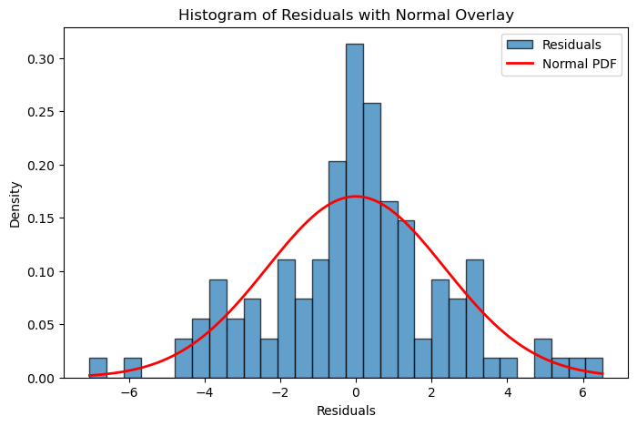
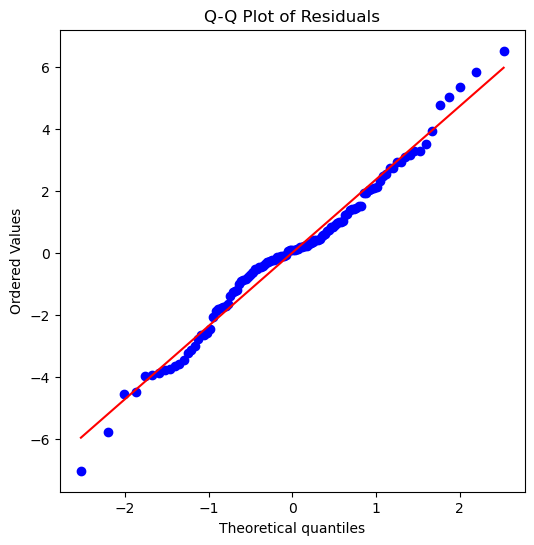

# 선형회귀의 정규성 확인

잔차의 정규성은 선형회귀의 핵심 가정 가운데 하나이다. 이 가정은 모형의 잔차(오차)가 정규분포를 따라야 한다고 상정한다. 회귀계수의 타당성에는 선형성 가정이 더 결정적이지만, 신뢰구간·가설검정·예측구간의 타당성을 확보하려면 잔차의 정규성을 확인하는 일이 중요하다. 이 절은 선형회귀에서 정규성을 확인하는 방법을 시각적 점검과 통계검정으로 나누어 정리한다.

## 1. 회귀에서의 정규성 이해

<div class="defn" markdown>

### 정의 1. 정규성 { .dfn }
선형회귀의 정규성은 잔차가 정규분포를 따른다는 뜻으로, 그렸을 때 0을 중심으로 하는 종 모양 곡선을 이루어야 한다는 것이다.

$$
\epsilon_i \sim N(0, \sigma^2)
$$

**왜 중요한가:**
잔차의 정규성은 회귀계수의 불편추정에는 필요하지 않지만 다음에는 결정적이다.

- **신뢰구간과 가설검정:** 정확하려면 오차가 정규분포를 따른다는 가정이 필요하다. 계수 검정에 쓰는 t 분포가 정규성 가정 아래에서 유도된 것이다.
- **예측구간:** 새 관측값에 대한 예측구간이 타당하려면 정규성이 필요하다.
- **작은 표본:** 큰 표본에서는 오차가 정규가 아니어도 중심극한정리가 검정통계량의 점근적 정규성을 보장한다. 작은 표본($n < 30$)에서는 정규성 가정이 결정적이 된다.

</div>

## 설정

이 페이지의 진단은 모두 아래 자료와 모형 하나를 놓고 수행한다.

<div class="exbox" markdown>

**보기 1.** <span class="diff easy" title="쉬움"></span> 진단에 쓸 모형 준비. 이 페이지의 자료는 $x_i \sim U(0,10)$, $y_i = 2 + 1.5x_i + \varepsilon_i$, $\varepsilon_i \sim N(0,\,\sigma_i^2)$이며 $\sigma_i = 0.5 + 0.35x_i$로 **$x$에 따라 달라진다.** 곧 선형성과 정규성은 성립하고 등분산성만 깨진 자료다.

**(1)** 단순회귀의 기울기 추정량이 $\hat\beta_1 = \beta_1 + \sum_i c_i \varepsilon_i$, $c_i = (x_i - \bar x)/S_{xx}$로 적힘을 보이고, 분산이 관측마다 달라도 $E[\hat\beta_1] = \beta_1$임을 보이시오. 또 참 분산이 $\sum_i c_i^2 \sigma_i^2$이며 OLS가 보고하는 $s^2/S_{xx}$와 일치하지 않음을 보이시오.

**(2)** 모형을 적합하고, $\sigma_i$를 아는 상태에서 참 표준오차를 계산해 OLS가 보고한 표준오차와 견주시오.

</div>

??? success "풀이"

    **(1) 해석적으로.** 기울기 추정량은

    $$
    \hat\beta_1 = \frac{\sum_i (x_i - \bar x)(y_i - \bar y)}{S_{xx}},
    \qquad S_{xx} = \sum_i (x_i - \bar x)^2
    $$

    이다. $\sum_i (x_i - \bar x) = 0$이므로 분자의 $\bar y$는 사라지고 $\hat\beta_1 = \sum_i c_i y_i$로 줄어든다. 여기서

    $$
    c_i = \frac{x_i - \bar x}{S_{xx}},
    \qquad \sum_i c_i = 0,
    \qquad \sum_i c_i x_i = \frac{S_{xx}}{S_{xx}} = 1
    $$

    이다. 이제 $y_i = \beta_0 + \beta_1 x_i + \varepsilon_i$를 넣으면 두 항등식이 상수항과 기울기를 각각 걷어 내어

    $$
    \hat\beta_1 = \beta_0 \underbrace{\sum_i c_i}_{0} + \beta_1 \underbrace{\sum_i c_i x_i}_{1} + \sum_i c_i \varepsilon_i
    = \beta_1 + \sum_i c_i \varepsilon_i
    $$

    를 얻는다. **$\hat\beta_1$은 참값에 오차의 고정된 선형결합을 더한 것**이다.

    기댓값을 취한다. $x$를 고정해 놓고 보면 $c_i$는 상수이고 $E[\varepsilon_i] = 0$이므로

    $$
    E[\hat\beta_1] = \beta_1 + \sum_i c_i E[\varepsilon_i] = \beta_1
    $$

    이다. **이 계산 어디에도 $\sigma_i$가 들어오지 않았다.** 분산이 관측마다 제각각이어도 불편성은 그대로다. 필요한 것은 $E[\varepsilon_i] = 0$ 하나뿐이다.

    분산은 사정이 다르다. 오차가 독립이면

    $$
    \operatorname{Var}(\hat\beta_1) = \sum_i c_i^2 \operatorname{Var}(\varepsilon_i) = \sum_i c_i^2 \sigma_i^2
    $$

    이다. 모든 $\sigma_i$가 같은 $\sigma$라면 $\sum_i c_i^2 = S_{xx}/S_{xx}^2 = 1/S_{xx}$이므로 익숙한 $\sigma^2/S_{xx}$로 돌아간다. **그러나 $\sigma_i$가 다르면 가중평균이 되고, 이때 OLS가 보고하는 $s^2/S_{xx}$는 $\sigma_i^2$을 하나의 수로 뭉갠 값이라 참 분산과 어긋난다.** 어느 쪽으로 어긋날지는 $\sigma_i^2$과 $c_i^2$의 상관으로 정해진다. 흩어짐이 큰 관측이 $x$의 양끝(곧 $c_i^2$이 큰 자리)에 몰리면 보고값이 참값보다 작아진다.

    **(2) 수치적으로.** 이 자료는 $\sigma_i$를 우리가 지어낸 것이므로 참 분산을 직접 계산할 수 있다.

    ```python
    import numpy as np
    import pandas as pd
    import statsmodels.api as sm

    rng = np.random.default_rng(7)
    n = 120

    # X는 균등, Y는 X에 선형으로 의존하되 오차의 분산이 X와 함께 커진다.
    # 이렇게 두면 선형성은 성립하고 등분산성만 깨져, 각 진단이 무엇을
    # 잡아내고 무엇을 놓치는지 구분해 볼 수 있다.
    X = rng.uniform(0, 10, n)
    Y = 2.0 + 1.5 * X + rng.normal(0, 0.5 + 0.35 * X, n)

    df = pd.DataFrame({"X": X, "Y": Y})
    model = sm.OLS(Y, sm.add_constant(X)).fit()
    residuals = model.resid
    fitted = model.fittedvalues

    print(f"beta_hat = {model.params.round(4)}")
    print(f"R^2 = {model.rsquared:.4f}")
    ```

    출력:

    ```
    beta_hat = [1.5933 1.5317]
    R^2 = 0.7813
    ```

    기울기 추정값 $1.5317$이 참값 $1.5$에 가깝다. 이제 두 항등식과 두 표준오차를 확인한다.

    ```python
    # c_i = (x_i - xbar) / S_xx 가 가중치다. sum c_i = 0, sum c_i x_i = 1 을 먼저 본다.
    Sxx = ((X - X.mean()) ** 2).sum()
    c = (X - X.mean()) / Sxx
    print(f"S_xx        = {Sxx:.4f}")
    print(f"sum c_i     = {c.sum():+.2e}   (0 이어야 한다)")
    print(f"sum c_i x_i = {(c * X).sum():.10f}   (1 이어야 한다)")

    # 이 자료는 sigma_i 를 우리가 안다. 참 표준오차를 직접 계산할 수 있다.
    sigma_i = 0.5 + 0.35 * X
    se_true = np.sqrt((c ** 2 * sigma_i ** 2).sum())
    se_ols = model.bse[1]
    print(f"\n참 SE(b1)   = sqrt(sum c_i^2 sigma_i^2) = {se_true:.6f}")
    print(f"OLS 보고 SE = s/sqrt(S_xx)              = {se_ols:.6f}")
    print(f"보고값이 참값의 {se_ols / se_true:.1%}")

    # 같은 X 를 고정한 채 오차만 다시 뽑아 흔들림을 직접 재 본다.
    sim = np.random.default_rng(123)
    b1 = 1.5 + (sim.normal(0, 1, (20000, n)) * sigma_i * c).sum(axis=1)
    print(f"\n모의 20000회: 평균 {b1.mean():.4f}, 표준편차 {b1.std(ddof=1):.6f}")
    ```

    출력:

    ```
    S_xx        = 1004.3944
    sum c_i     = -2.78e-17   (0 이어야 한다)
    sum c_i x_i = 1.0000000000   (1 이어야 한다)

    참 SE(b1)   = sqrt(sum c_i^2 sigma_i^2) = 0.082525
    OLS 보고 SE = s/sqrt(S_xx)              = 0.074595
    보고값이 참값의 90.4%

    모의 20000회: 평균 1.5009, 표준편차 0.082505
    ```

    **유도한 식이 맞는다.** 두 항등식이 각각 $-2.78 \times 10^{-17}$과 $1.0000000000$으로 기계 정밀도까지 성립하고, 공식이 준 참 표준오차 $0.082525$가 모의실험의 표준편차 $0.082505$와 소수점 넷째 자리까지 같다. 모의평균 $1.5009$가 참값 $1.5$ 근처인 것이 불편성이며, 남은 $0.0009$는 $0.0825/\sqrt{20000} = 0.00058$ 크기의 몬테카를로 오차로 설명된다.

    **보고된 표준오차는 참값의 $90.4\%$다.** 추정값 자체는 멀쩡한데 그 정밀도를 $10\%$ 과장해 말하는 셈이다. 신뢰구간이 그만큼 좁아지고 $t$ 값이 그만큼 커진다. 이 페이지가 뒤이어 돌릴 정규성 검정들은 **이 문제를 하나도 잡아내지 못한다.** 오차를 정규분포에서 뽑았으므로 잔차는 정규가 맞기 때문이다. 이분산과 비정규성은 별개의 가정이고, 별개의 진단이 필요하다는 것이 이 자료를 이렇게 만든 이유다.

## 2. 잔차의 히스토그램

정규성을 평가하는 가장 간단한 방법 하나는 **잔차의 히스토그램**을 그리는 것이다. 이 시각적 점검으로 잔차가 대략 정규분포를 따르는지 판단할 수 있다.

**절차:**

1. **선형회귀 모형 적합:** 모형에서 잔차를 얻는다.
2. **히스토그램 그리기:** 잔차로 히스토그램을 그린다.
3. **그림 평가:** 히스토그램의 모양을 정규분포와 비교한다.

**예시:**

<div class="exbox" markdown>

**보기 2.** <span class="diff easy" title="쉬움"></span> 잔차의 히스토그램. 보기 1의 잔차로 히스토그램을 그리고 정규곡선을 겹친다.

**(1)** 그림에서 읽히는 것을 왜도·첨도와 함께 적으시오. 겹친 정규곡선의 중심이 왜 **계산할 것도 없이** 0인지도 밝히시오.

**(2)** 이 그림이 구조적으로 **보여 줄 수 없는** 것 둘을 들고, 수치로 확인하시오.

</div>

??? success "풀이"

    **(1) 먼저 중심에 대하여.** 상수항이 있는 OLS의 정규방정식 가운데 첫 줄이

    $$
    \mathbf 1^\top \mathbf e = \sum_{i=1}^n e_i = 0
    $$

    이다. 잔차가 설계행렬의 모든 열과 직교해야 하는데 상수항 열이 $\mathbf 1$이기 때문이다. 그러므로 **잔차의 평균은 자료가 어떻게 생겼든 정확히 0이다.** 히스토그램이 0을 중심으로 서 있는 것은 정규성의 증거가 아니라 적합이 강제한 항등식이며, 이 그림으로는 모형의 **편향을 영원히 볼 수 없다**는 뜻이기도 하다.

    ```python
    import matplotlib.pyplot as plt
    import numpy as np
    from scipy.stats import norm, skew, kurtosis

    plt.rcParams["font.sans-serif"] = ["NanumGothic", "Apple SD Gothic Neo", "Malgun Gothic"]
    plt.rcParams["font.family"] = "sans-serif"
    plt.rcParams["axes.unicode_minus"] = False

    # 정규성은 자료가 아니라 잔차에 요구되는 가정이다. 게다가 계수 추정의
    # 불편성에는 필요 없고, 작은 표본에서 t 검정과 신뢰구간을 쓰기 위해 필요하다.
    residuals = model.resid

    fig, ax = plt.subplots(figsize=(8, 5))
    ax.hist(residuals, bins=30, density=True, edgecolor='black', alpha=0.7, label='Residuals')

    # 잔차의 평균과 표준편차로 만든 정규곡선을 겹쳐 그린다.
    x = np.linspace(residuals.min(), residuals.max(), 100)
    ax.plot(x, norm.pdf(x, loc=residuals.mean(), scale=residuals.std()),
            'r-', linewidth=2, label='Normal PDF')

    ax.set_xlabel('Residuals')
    ax.set_ylabel('Density')
    ax.set_title('Histogram of Residuals with Normal Overlay')
    ax.legend()
    plt.show()

    # 그림이 말해 주지 않는 수치들
    print(f"잔차 평균   = {residuals.mean():+.3e}   (정규방정식이 강제한다)")
    print(f"왜도        = {skew(residuals):+.4f}")
    print(f"첨도        = {kurtosis(residuals, fisher=False):.4f}")
    print(f"겹친 곡선의 척도 residuals.std() = {residuals.std():.4f}")
    print(f"회귀의      sigma_hat            = {np.sqrt(model.mse_resid):.4f}")

    # 계급 수를 바꾸면 가장 높은 막대의 높이가 얼마나 달라지는가
    for b in (10, 30, 60):
        h, _ = np.histogram(residuals, bins=b, density=True)
        print(f"bins={b:>3}: 최고 막대 밀도 {h.max():.4f}")

    # 이 그림이 전혀 보지 못하는 것: 오차의 분산이 x 와 함께 커진다는 사실
    lo, hi = residuals[X < 5], residuals[X >= 5]
    print(f"\nX<5  쪽 잔차 표준편차 = {lo.std(ddof=1):.4f}  (n={lo.size})")
    print(f"X>=5 쪽 잔차 표준편차 = {hi.std(ddof=1):.4f}  (n={hi.size})")
    ```

    출력:

    ```
    잔차 평균   = +3.523e-15   (정규방정식이 강제한다)
    왜도        = -0.0508
    첨도        = 3.5595
    겹친 곡선의 척도 residuals.std() = 2.3443
    회귀의      sigma_hat            = 2.3641
    bins= 10: 최고 막대 밀도 0.2459
    bins= 30: 최고 막대 밀도 0.3136
    bins= 60: 최고 막대 밀도 0.3320

    X<5  쪽 잔차 표준편차 = 1.3132  (n=57)
    X>=5 쪽 잔차 표준편차 = 3.0126  (n=63)
    ```

    

    **읽히는 것.** 왜도 $-0.0508$은 0에 사실상 붙어 있어 좌우 치우침이 없다. 첨도는 $3.5595$로 정규분포의 $3$보다 크고, 그것이 그림에 그대로 나타난다. 0을 사이에 둔 두 막대가 밀도 $0.314$와 $0.258$로 겹친 정규곡선의 꼭대기 $0.170$보다 훨씬 높고, 대신 $-2.3$과 $+1.8$ 부근의 막대는 $0.037$로 곡선의 $0.11$–$0.13$ 아래로 꺼지며, $\pm 6$ 바깥에 다시 막대가 선다. **가운데가 뾰족하고 어깨가 꺼지고 꼬리가 두꺼운** 전형적인 고첨 모양이며, 보기 6의 Jarque-Bera가 바로 이 $3.5595$를 재게 된다. 잔차 평균은 $3.5 \times 10^{-15}$로 부동소수점 오차만 남았다.

    겹친 곡선의 척도에 함정이 하나 있다. `residuals.std()`는 `ddof=0`이라 $\sqrt{\text{SSE}/n} = 2.3443$을 주는데, 회귀의 표준오차 추정값은 $\hat\sigma = \sqrt{\text{SSE}/(n-2)} = 2.3641$이다. $n = 120$에서 차이가 $0.8\%$뿐이라 눈에 띄지 않지만, $n$이 작으면 벌어진다.

    **(2) 이 그림이 못 보는 것 둘.**

    첫째, **계급폭에 휘둘린다.** 같은 잔차인데 `bins`를 $10, 30, 60$으로 바꾸면 최고 막대의 밀도가 $0.246 \to 0.314 \to 0.332$로 달라진다. "뾰족하다"는 인상의 상당 부분이 자료가 아니라 계급 수에서 온다. 보기 3의 Q-Q 그림에는 이 자유도가 아예 없다.

    둘째, **이분산을 통째로 가린다.** 이 자료는 $\sigma_i = 0.5 + 0.35x_i$로 만들어 $x$가 $0.04$에서 $9.96$까지 가는 동안 오차의 표준편차가 $0.51$에서 $3.98$로 **일곱 배 넘게** 커진다. 실제로 잔차를 $x < 5$와 $x \ge 5$로 갈라 재면 표준편차가 $1.3132$와 $3.0126$으로 $2.3$배 차이 난다. 그런데 히스토그램은 이 둘을 한 통에 쏟아부은 뒤 모양만 보므로 **그런 일이 있었다는 흔적조차 남지 않는다.** 서로 다른 정규분포들을 섞으면 정규보다 뾰족하고 꼬리가 두꺼운 분포가 되는데, 위에서 본 첨도 $3.56$이 바로 그 섞임의 부산물이다.

    정리하면 **이 히스토그램은 "대략 종 모양"이라는 결론만 줄 수 있고, 그것이 이 그림이 할 수 있는 전부다.** 중심은 볼 필요가 없고, 뾰족함은 계급 수에 흔들리며, 등분산은 보이지 않는다.

**해석:**

- **정규성:** 히스토그램이 0을 중심으로 대칭인 종 모양 곡선을 닮아야 한다.
- **비정규성:** 히스토그램이 치우쳐 있거나, 봉우리가 여럿이거나(다봉), 지나치게 평평하거나(저첨), 지나치게 뾰족하면(고첨) 잔차가 정규분포를 따르지 않을 수 있다.

## 3. Q-Q 그림(분위수-분위수 그림)

**Q-Q 그림**은 정규성을 평가하는 더 정밀한 시각적 도구이다. 잔차의 분위수를 표준정규분포의 분위수와 비교한다.

**작동 방식:**

1. 잔차를 정렬하여 경험적 분위수를 계산한다.
2. 표준정규분포에서 대응하는 이론적 분위수를 계산한다.
3. 경험적 분위수($y$축)를 이론적 분위수($x$축)에 대해 그린다.
4. 잔차가 정규분포를 따르면 점들이 기준선을 따라 놓인다.

**절차:**

1. **선형회귀 모형 적합:** 잔차를 얻는다.
2. **Q-Q 그림 그리기:** 잔차로 그림을 그린다.
3. **그림 평가:** 잔차가 기준선을 따르는지 확인한다.

**예시:**

<div class="exbox" markdown>

**보기 3.** <span class="diff easy" title="쉬움"></span> Q-Q 그림. `scipy.stats.probplot`은 그림만 그리는 것이 아니라 기준선의 기울기·절편과 점들의 상관계수 $r$도 돌려준다.

**(1)** 이 기준선의 절편이 왜 **반드시** 0인지 밝히시오.

**(2)** 그림을 그려 꼬리에서 무엇이 보이는지 적고, 기울기와 $r$이 각각 무엇을 재는 수인지 말하시오.

</div>

??? success "풀이"

    **(1) 해석적으로.** `probplot`의 기준선은 정렬된 잔차 $e_{(1)} \le \cdots \le e_{(n)}$를 이론분위수 $m_1, \ldots, m_n$에 **최소제곱으로 회귀시킨** 직선이다. 상수항이 있는 단순회귀의 절편은 언제나

    $$
    \hat a = \bar e - \hat b \,\bar m
    $$

    이다. 두 항이 모두 사라진다. $\bar e = 0$은 보기 2에서 본 정규방정식 $\sum_i e_i = 0$ 때문이고, $\bar m = 0$은 이론분위수가 표준정규의 것이라 $m_i = -m_{n+1-i}$로 대칭이기 때문이다. 따라서

    $$
    \hat a = 0 - \hat b \cdot 0 = 0
    $$

    이며, 자료가 정규든 아니든 그렇다. **Q-Q 그림의 기준선이 원점을 지나는 것은 정규성의 증거가 아니다.** 읽을 것은 기울기와 점들이 선에서 벗어나는 모양뿐이다.

    **(2) 수치적으로.**

    ```python
    import scipy.stats as stats
    import matplotlib.pyplot as plt

    plt.rcParams["font.sans-serif"] = ["NanumGothic", "Apple SD Gothic Neo", "Malgun Gothic"]
    plt.rcParams["font.family"] = "sans-serif"
    plt.rcParams["axes.unicode_minus"] = False

    residuals = model.resid

    # Q-Q 그림이 히스토그램보다 낫다. 계급 수에 휘둘리지 않고, 정규에서
    # 벗어나는 자리가 꼬리인지 가운데인지까지 알려 준다.
    fig, ax = plt.subplots(figsize=(6, 6))
    stats.probplot(residuals, dist="norm", plot=ax)
    ax.set_title('Q-Q Plot of Residuals')
    plt.show()

    # probplot 은 그림만 그리는 것이 아니라 기준선의 계수도 돌려준다.
    (osm, osr), (slope, intercept, r) = stats.probplot(residuals, dist="norm")
    print(f"기준선 기울기 = {slope:.4f}   (sigma 의 추정값)")
    print(f"기준선 절편   = {intercept:+.2e}   (0 이어야 한다)")
    print(f"상관계수  r   = {r:.6f},   r^2 = {r ** 2:.6f}")

    # 양 끝 두 점이 얼마나 바깥에 있는가
    print(f"\n가장 작은 잔차 {osr[0]:+.3f}  (기준선 예측 {slope * osm[0] + intercept:+.3f})")
    print(f"가장 큰   잔차 {osr[-1]:+.3f}  (기준선 예측 {slope * osm[-1] + intercept:+.3f})")
    ```

    출력:

    ```
    기준선 기울기 = 2.3627   (sigma 의 추정값)
    기준선 절편   = +3.10e-15   (0 이어야 한다)
    상관계수  r   = 0.990542,   r^2 = 0.981173

    가장 작은 잔차 -7.036  (기준선 예측 -5.970)
    가장 큰   잔차 +6.518  (기준선 예측 +5.970)
    ```

    

    **절편이 $3.10 \times 10^{-15}$다.** (1)에서 유도한 대로 0이며, 남은 것은 부동소수점 찌꺼기뿐이다.

    **기울기 $2.3627$은 $\sigma$의 추정값이다.** 표준정규의 분위수를 $\sigma$배 늘린 것이 $N(0,\sigma^2)$의 분위수이므로 기울기가 곧 척도다. 회귀의 $\hat\sigma = 2.3641$, 잔차의 표본표준편차 $s_e = 2.3541$과 나란히 두면 셋이 서로 $0.4\%$ 안에 있다. 셋 다 같은 것을 다른 방식으로 재고 있다.

    **꼬리에서 읽히는 것.** 가장 작은 잔차가 $-7.036$인데 기준선은 그 자리에 $-5.970$을 예측한다. 가장 큰 잔차는 $+6.518$인데 예측은 $+5.970$이다. **양쪽 끝이 모두 선 바깥으로 벌어진다** — 왼쪽은 아래로, 오른쪽은 위로. 이것이 S자 패턴이고 두꺼운 꼬리의 표시이며, 보기 2의 첨도 $3.5595$와 같은 말이다. 한쪽만 벌어졌다면 치우침이었을 것이다.

    **$r$은 "점들이 얼마나 직선인가"를 재는 수다.** 여기서 $r = 0.990542$, $r^2 = 0.981173$이다. 이 수가 중요한 것은 **정규성 검정 자체가 이 상관계수로 만들어지기 때문**이다. 분위수 자리를 $(i - 3/8)/(n + 1/4)$로 두고 잰 $r^2$이 샤피로–프랑시아 통계량이고(이 잔차에서 $0.981690$), 이론분위수 대신 순서통계량의 최량선형불편 가중치를 쓰면 보기 4의 샤피로–윌크가 된다($W = 0.983570$). `probplot`이 쓰는 분위수 자리는 또 조금 다르지만 셋이 모두 $0.981$–$0.984$ 안에 있다. **그림을 보는 일과 검정을 돌리는 일이 같은 양을 보고 있는 셈이다.**

**해석:**

- **정규성:** 점들이 기준선을 가깝게 따르면 잔차가 정규분포를 따를 가능성이 높다.
- **비정규성:** 선에서 벗어나는 모습, 특히 꼬리에서의 이탈은 정규성에서 벗어났음을 나타낸다.

**Q-Q 그림의 흔한 패턴:**

| 패턴 | 의미 |
|---------|-----------|
| 점들이 선을 따름 | 정규분포 |
| S자 곡선 | 두꺼운 꼬리(고첨) |
| 뒤집힌 S자 | 얇은 꼬리(저첨) |
| 양쪽 끝이 위로 휨 | 오른쪽으로 치우친 분포 |
| 양쪽 끝이 아래로 휨 | 왼쪽으로 치우친 분포 |

## 4. Shapiro-Wilk 검정

**Shapiro-Wilk 검정**은 잔차의 정규성을 검정하기 위해 특별히 고안된 통계검정이다. 정규성에서의 이탈을 탐지하는 가장 강력한 검정 가운데 하나이다.

**가설:**

- $H_0$: 잔차가 정규분포를 따른다
- $H_1$: 잔차가 정규분포를 따르지 않는다

**검정통계량:**

$$
W = \frac{\left(\sum_{i=1}^n a_i x_{(i)}\right)^2}{\sum_{i=1}^n (x_i - \bar{x})^2}
$$

여기서 $x_{(i)}$는 정렬된 잔차이고 $a_i$는 표준정규분포 순서통계량의 기댓값에서 생성된 상수이다.

**절차:**

1. **선형회귀 모형 적합:** 잔차를 얻는다.
2. **Shapiro-Wilk 검정 수행:** 잔차에 검정을 적용한다.
3. **결과 해석:** p값이 유의하면(보통 < 0.05) 잔차가 정규분포를 따르지 않음을 시사한다.

**예시:**

<div class="exbox" markdown>

**보기 4.** <span class="diff easy" title="쉬움"></span> Shapiro-Wilk 검정. 가중치 $a_1, \ldots, a_n$은 $\sum_i a_i = 0$, $\sum_i a_i^2 = 1$로 정규화되어 있고 $a_i = -a_{n+1-i}$로 반대칭이다.

**(1)** $0 \le W \le 1$임을 보이고, $W = 1$이 되는 것은 정렬된 표본이 $a_i$의 1차함수일 때뿐임을 보이시오. 그러므로 **$W$는 작을 때만 뜻이 있다.**

**(2)** 잔차에 검정을 돌리고, (1)의 등호에 가까운 자료와 멀리 떨어진 자료를 일부러 만들어 $W$가 어디에 놓이는지 확인하시오.

</div>

??? success "풀이"

    **(1) 해석적으로.** 정렬된 표본을 $x_{(1)} \le \cdots \le x_{(n)}$, 그 평균을 $\bar x$라 하자. $\sum_i a_i = 0$이므로 분자 안의 합에서 $\bar x$를 공짜로 빼 넣을 수 있다.

    $$
    \sum_i a_i x_{(i)} = \sum_i a_i \big(x_{(i)} - \bar x\big)
    $$

    여기에 코시–슈바르츠 부등식을 쓴다.

    $$
    \left(\sum_i a_i \big(x_{(i)} - \bar x\big)\right)^{2}
    \;\le\;
    \left(\sum_i a_i^2\right)\left(\sum_i \big(x_{(i)} - \bar x\big)^2\right)
    = \sum_i (x_i - \bar x)^2
    $$

    마지막 등식은 $\sum_i a_i^2 = 1$과, 제곱합이 정렬 순서에 무관하다는 사실에서 나온다. 양변을 $\sum_i (x_i - \bar x)^2$로 나누면 바로

    $$
    W = \frac{\left(\sum_i a_i x_{(i)}\right)^2}{\sum_i (x_i - \bar x)^2} \le 1
    $$

    이다. 분자가 제곱이고 분모가 양수이므로 $W \ge 0$도 당연하다.

    **등호 조건이 이 검정의 뜻을 전부 말해 준다.** 코시–슈바르츠에서 등호는 두 벡터가 평행할 때, 곧 어떤 $\lambda$에 대해

    $$
    x_{(i)} - \bar x = \lambda\, a_i \qquad (i = 1, \ldots, n)
    $$

    일 때만 성립한다. $a_i$는 정규분포의 순서통계량 기댓값에서 만든 수이므로, 이 조건은 **정렬된 표본이 정규 점수 위에 한 치도 어긋남 없이 올라앉았다**는 뜻이다. 보기 3의 Q-Q 그림에서 점들이 완벽한 직선을 이루는 상황이 바로 그것이다.

    따라서 $W$가 1에 가깝다는 것은 "정규성의 증거"라기보다 **상한에 붙어 있다**는 말에 가깝다. 어떤 표본이든 $W \le 1$이므로 큰 값은 정보가 적고, 1에서 얼마나 떨어졌는지가 정보다. **$W$는 작을 때만 뜻이 있는 통계량이다.**

    **(2) 수치적으로.**

    ```python
    import numpy as np
    from scipy.stats import shapiro, norm

    residuals = model.resid

    # Shapiro-Wilk 는 작은 표본에서 검정력이 좋다. 다만 표본이 수천을 넘으면
    # 실질적으로 무시할 만한 이탈에도 유의하게 나오므로 그림과 함께 읽는다.
    stat, p_value = shapiro(residuals)
    print(f'Shapiro-Wilk statistic: {stat:.4f}')
    print(f'Shapiro-Wilk p-value: {p_value:.4f}')

    if p_value > 0.05:
        print('No significant evidence of non-normality (fail to reject H0)')
    else:
        print('Significant evidence of non-normality (reject H0)')

    # (1) 의 등호 조건을 직접 만들어 본다. 정렬된 표본을 정규점수 그 자체로 두면
    # x_(i) - xbar 가 a_i 에 비례하는 상황에 가장 가까워진다.
    i = np.arange(1, 121)
    perfect = norm.ppf((i - 0.375) / (120 + 0.25))
    print(f'\n정규점수 격자 자체의 W = {shapiro(perfect).statistic:.6f}')

    # 반대쪽 극단: 치우친 분포에서는 W 가 1 에서 멀어진다.
    expo = np.sort(np.random.default_rng(0).exponential(size=120))
    print(f'지수분포 표본의    W = {shapiro(expo).statistic:.6f}, '
          f'p = {shapiro(expo).pvalue:.2e}')
    print(f'실제 잔차의        W = {stat:.6f}')
    ```

    출력:

    ```
    Shapiro-Wilk statistic: 0.9836
    Shapiro-Wilk p-value: 0.1524
    No significant evidence of non-normality (fail to reject H0)

    정규점수 격자 자체의 W = 0.999275
    지수분포 표본의    W = 0.842123, p = 5.45e-10
    실제 잔차의        W = 0.983570
    ```

    **$W$가 세 자료에서 $0.8421 < 0.9836 < 0.9993 \le 1$로 늘어선다.** 유도한 상한을 넘는 값이 하나도 없고, 등호에 가장 가까운 것이 정규 점수 격자 자체다. 그 값이 정확히 1이 아니라 $0.999275$인 데에는 이유가 있다. 격자를 $(i-3/8)/(n+1/4)$로 잡았는데 $a_i$는 그 자리가 아니라 순서통계량의 공분산까지 넣은 **최량선형불편 가중치**라서, 두 벡터가 거의 평행하되 완전히 평행하지는 않기 때문이다. 어느 격자를 써도 $W$가 1에 $0.001$ 안으로 붙는다는 것이 요점이다.

    **잔차의 $W = 0.9836$, $p = 0.1524$로 정규성을 기각하지 못한다.** 옳은 판정이다. 오차를 정규분포에서 뽑았으므로 잔차는 정규가 맞다. 보기 1에서 본 이분산은 **각 오차의 분포 모양이 아니라 그 폭을 건드린 것**이고, 샤피로–윌크는 폭에는 눈이 없다. 이분산과 비정규성은 별개의 가정이며 별개의 검정이 필요하다.

    반대편 끝의 지수분포 표본이 $W = 0.8421$, $p = 5 \times 10^{-10}$이다. $W$가 1에서 $0.16$만 떨어져도 $n = 120$에서는 압도적인 증거가 된다. **$W$의 눈금이 얼마나 촘촘한지** 보여 주는 수이며, 표본이 더 커지면 $0.99$도 기각된다.

**해석:**

- **p값 > 0.05:** 비정규성의 유의한 증거가 없다. 잔차를 정규분포를 따르는 것으로 볼 수 있다.
- **p값 < 0.05:** 비정규성의 유의한 증거가 있으며 가정 위배 가능성을 나타낸다.

**참고:** 대부분의 구현에서 Shapiro-Wilk 검정은 표본크기 $n \leq 5000$으로 제한된다.

## 5. Anderson-Darling 검정

**Anderson-Darling 검정**은 분포의 꼬리에서의 이탈에 특히 민감한 통계검정으로, 잔차의 정규성 확인에 좋은 선택이다.

**핵심 특징:** Anderson-Darling 검정은 Kolmogorov-Smirnov 검정 같은 다른 검정에 비해 분포의 꼬리에 있는 관측값에 더 큰 가중치를 주므로 꼬리에서의 정규성 이탈을 더 잘 탐지한다.

**검정통계량:**

$$
A^2 = -n - \sum_{i=1}^{n} \frac{2i-1}{n} \left[\ln F(x_{(i)}) + \ln(1-F(x_{(n+1-i)}))\right]
$$

여기서 $F$는 가정한 정규분포의 누적분포함수이고 $x_{(i)}$는 정렬된 잔차이다.

**절차:**

1. **선형회귀 모형 적합:** 잔차를 얻는다.
2. **Anderson-Darling 검정 수행:** 잔차에 검정을 적용한다.
3. **결과 해석:** 검정이 통계량과 여러 유의수준에서의 임계값을 준다.

**예시:**

<div class="exbox" markdown>

**보기 5.** <span class="diff easy" title="쉬움"></span> Anderson-Darling 검정

**(1)** 위 $A^2$의 정의식을 그대로 구현해 `scipy.stats.anderson`의 값과 맞추시오. 표준화에 쓸 척도를 `ddof=0`으로 잡을 때와 `ddof=1`로 잡을 때 어느 쪽이 맞는가.

**(2)** 통계량과 임계값을 견주어 판정하고, 같은 잔차에서 Shapiro-Wilk($p = 0.1524$)와 결론이 갈리는 까닭을 수치로 밝히시오.

</div>

??? success "풀이"

    **(1) 정의대로 계산한다.** $A^2$은 적분꼴로 쓰면

    $$
    A^2 = n \int_{-\infty}^{\infty} \frac{\big(F_n(x) - F(x)\big)^2}{F(x)\big(1 - F(x)\big)} \, dF(x)
    $$

    이고, 이것을 순서통계량으로 정리한 것이 위의 합 공식이다. 분모의 $F(1-F)$가 결정적이다. **꼬리로 갈수록 $F(1-F) \to 0$이라 같은 크기의 어긋남에 훨씬 큰 가중치가 붙는다.** Kolmogorov-Smirnov는 이 가중치가 없어 분포의 가운데만 들여다본다.

    모수를 모르므로 $F$에는 $\hat F(x) = \Phi\big((x - \bar e)/s\big)$를 넣는데, 여기서 척도를 무엇으로 잡느냐가 값을 바꾼다. `scipy`는 `np.std(x, ddof=1)`을 쓴다. 먼저 검정을 그대로 돌려 둔다.

    ```python
    from scipy.stats import anderson

    residuals = model.resid

    # Anderson-Darling 은 꼬리 쪽 이탈에 특히 민감하다. p-값 대신 유의수준별
    # 기각값을 돌려주므로, 통계량과 기각값을 견주어 판단한다.
    result = anderson(residuals, dist='norm')
    print(f'Anderson-Darling statistic: {result.statistic:.4f}')
    print()
    for i in range(len(result.critical_values)):
        sig_level = result.significance_level[i]
        crit_value = result.critical_values[i]
        status = 'REJECT' if result.statistic > crit_value else 'Fail to reject'
        print(f'At {sig_level}% significance: Critical value = {crit_value:.4f} → {status}')
    ```

    출력:

    ```
    Anderson-Darling statistic: 0.9338

    At 15.0% significance: Critical value = 0.5580 → REJECT
    At 10.0% significance: Critical value = 0.6360 → REJECT
    At 5.0% significance: Critical value = 0.7630 → REJECT
    At 2.5% significance: Critical value = 0.8900 → REJECT
    At 1.0% significance: Critical value = 1.0590 → Fail to reject
    ```

    이제 이 $0.9338$을 정의식으로 재현한다.

    ```python
    import numpy as np
    from scipy.stats import norm, anderson, shapiro

    residuals = model.resid
    n = len(residuals)
    xs = np.sort(residuals)

    # 척도를 ddof=1 로 잡아야 scipy 와 맞는다. ddof=0 을 쓰면 값이 달라진다.
    for ddof in (0, 1):
        F = norm.cdf((xs - xs.mean()) / xs.std(ddof=ddof))
        i = np.arange(1, n + 1)
        A2 = -n - np.sum((2 * i - 1) / n * (np.log(F) + np.log(1 - F[::-1])))
        print(f"정의대로 계산 (ddof={ddof}): A^2 = {A2:.12f}")
    print(f"scipy.stats.anderson       : A^2 = {anderson(residuals).statistic:.12f}")

    # 왜 꼬리에 민감한가: 가장 바깥 두 점이 기대보다 얼마나 더 바깥인가
    F = norm.cdf((xs - xs.mean()) / xs.std(ddof=1))
    print(f"\n가장 작은 잔차의 F     = {F[0]:.5f}  (기대 1/(n+1) = {1 / (n + 1):.5f})")
    print(f"가장 큰   잔차의 1 - F = {1 - F[-1]:.5f}")
    print(f"log F 의 끝항          = {np.log(F[0]):.3f}")

    # 양 끝 두 개씩을 덜어 내면 두 통계량이 어떻게 움직이는가
    trim = xs[2:-2]
    print(f"\n{'':14}{'전체':>12}{'양끝 2개씩 제거':>18}")
    print(f"{'A^2':14}{anderson(residuals).statistic:>12.4f}{anderson(trim).statistic:>18.4f}")
    print(f"{'Shapiro-Wilk W':14}{shapiro(residuals).statistic:>12.4f}{shapiro(trim).statistic:>18.4f}")
    ```

    출력:

    ```
    정의대로 계산 (ddof=0): A^2 = 0.923067249972
    정의대로 계산 (ddof=1): A^2 = 0.933839718132
    scipy.stats.anderson       : A^2 = 0.933839718132

    가장 작은 잔차의 F     = 0.00140  (기대 1/(n+1) = 0.00826)
    가장 큰   잔차의 1 - F = 0.00281
    log F 의 끝항          = -6.571

                            전체         양끝 2개씩 제거
    A^2                 0.9338            0.7793
    Shapiro-Wilk W      0.9836            0.9821
    ```

    **`ddof=1`이 맞는다.** 정의대로 계산한 $0.933839718132$가 `scipy`의 값과 소수점 열두째 자리까지 같다. `ddof=0`을 쓰면 $0.923067$로 $1.2\%$ 작아지는데, 척도를 조금만 작게 잡아도 표준화된 값들이 밖으로 밀려나 꼬리 항이 커지기 때문이다. 공식을 손으로 옮길 때 가장 자주 틀리는 자리다.

    **(2) 판정과 두 검정의 불일치.** 통계량 $0.9338$을 임계값과 견주면 $15\%$, $10\%$, $5\%$, $2.5\%$ 수준에서 모두 기각하고 $1\%$ 수준($1.059$)에서만 기각하지 못한다. 곧 **Anderson-Darling은 $\alpha = 0.05$에서 정규성을 기각한다.** 같은 잔차에서 Shapiro-Wilk는 $p = 0.1524$로 기각하지 못했다.

    갈림의 원인은 양 끝 두 점에 있다. 가장 작은 잔차의 $\hat F$가 $0.00140$인데, $n = 120$에서 최솟값의 $F$는 평균적으로 $1/(n+1) = 0.00826$쯤에 있어야 한다. **기대보다 여섯 배나 바깥**이다. $A^2$의 합에는 $\log \hat F$가 그대로 들어가므로 이 점이 $-6.571$을 기여한다. 같은 일이 오른쪽 끝에서도 일어나 $1 - \hat F = 0.00281$이다.

    양 끝 두 개씩, 곧 $120$개 가운데 $4$개를 덜어 내 보면 차이가 분명해진다. $A^2$이 $0.9338$에서 $0.7793$으로 $17\%$ 떨어지는 반면 $W$는 $0.9836$에서 $0.9821$로 사실상 움직이지 않는다. **$A^2$은 네 점이 거의 만들고 있었고 $W$는 $120$개를 고르게 본다.**

    어느 쪽이 옳은가. 이 자료에 한해서는 Shapiro-Wilk가 옳다. 오차를 정규분포에서 뽑았으니 참말은 "정규"이고, $A^2$의 기각은 **제1종 오류**다. 다만 이것을 Anderson-Darling의 결함이라 부를 수는 없다. $5\%$ 수준의 검정은 정규자료에서도 스무 번에 한 번 기각하도록 만들어진 것이고, 이번이 그 한 번이었을 뿐이다. 교훈은 다른 데 있다. **민감한 자리가 서로 다른 검정들을 같은 자료에 돌리면 결론이 갈리는 것이 정상이며, 그래서 어느 하나의 p-값으로 가정을 판정하지 않는다.**

**해석:**

- 검정통계량이 주어진 유의수준의 임계값보다 **작으면** $H_0$을 기각하지 못한다. 잔차가 정규성과 일치한다.
- 검정통계량이 임계값보다 **크면** $H_0$을 기각한다. 그 유의수준에서 잔차가 정규분포를 따르지 않는다.

## 6. Jarque-Bera 검정

**Jarque-Bera 검정**은 잔차의 왜도와 첨도가 정규분포의 것과 일치하는지를 검정하는 적합도 검정이다.

**검정통계량:**

$$
JB = \frac{n}{6}\left(S^2 + \frac{(K-3)^2}{4}\right)
$$

여기서

- $n$은 표본크기,
- $S$는 표본왜도(정규분포에서는 0이어야 한다),
- $K$는 표본첨도(정규분포에서는 3이어야 한다)이다.

$H_0$(정규성) 아래에서 $JB \sim \chi^2(2)$이다.

**절차:**

1. **선형회귀 모형 적합:** 잔차를 얻는다.
2. **Jarque-Bera 검정 수행:** 잔차에 검정을 적용한다.
3. **결과 해석:** p값이 유의하면 왜도나 첨도의 측면에서 비정규성을 나타낸다.

**예시:**

<div class="exbox" markdown>

**보기 6.** <span class="diff easy" title="쉬움"></span> Jarque-Bera 검정. 잔차의 왜도가 $S = -0.0508$, 첨도가 $K = 3.5595$이고 $n = 120$이다.

**(1)** $JB$ 값과 그 p-값을 **표를 찾지 말고** 손으로 계산하시오. $\chi^2(2)$의 생존함수가 닫힌 꼴임을 쓰면 된다.

**(2)** 코드와 맞춰 보고, 통계량을 왜도 몫과 첨도 몫으로 갈라 어느 쪽이 지배하는지 밝히시오.

</div>

??? success "풀이"

    **(1) 해석적으로.** 통계량부터 넣는다.

    $$
    JB = \frac{n}{6}\left(S^2 + \frac{(K-3)^2}{4}\right)
    = 20 \left( (-0.0508)^2 + \frac{(0.5595)^2}{4} \right)
    = 20\,(0.002581 + 0.078255) = 1.6167
    $$

    p-값에는 보통 표가 필요하지만 자유도 2는 예외다. $\chi^2(d)$의 밀도는

    $$
    f_d(x) = \frac{1}{2^{d/2}\Gamma(d/2)} x^{d/2 - 1} e^{-x/2}
    $$

    인데 $d = 2$이면 $\Gamma(1) = 1$, $2^{1} = 2$, $x^{0} = 1$이라 $f_2(x) = \tfrac12 e^{-x/2}$로 **지수분포**가 된다. 그러므로 생존함수가

    $$
    P(\chi^2(2) > x) = \int_x^\infty \tfrac12 e^{-t/2}\,dt = e^{-x/2}
    $$

    로 닫힌 꼴이고

    $$
    p = e^{-1.6167/2} = e^{-0.80836} = 0.4456
    $$

    이다. **자유도 2의 카이제곱은 p-값을 암산할 수 있는 유일한 자유도다.** $JB$가 $\chi^2(2)$를 따르는 것은 $H_0$ 아래에서 $\sqrt{n/6}\,S$와 $\sqrt{n/24}\,(K-3)$이 각각 점근적으로 표준정규이고 서로 점근 독립이기 때문이며, 그래서 통계량도 두 제곱의 합으로 적힌다.

    **(2) 수치적으로.**

    ```python
    import numpy as np
    from scipy.stats import chi2
    from statsmodels.stats.stattools import jarque_bera

    residuals = model.resid

    # Jarque-Bera 는 왜도와 첨도만 본다. 정규분포는 왜도 0, 첨도 3 이므로
    # 이 둘이 얼마나 벗어났는지를 하나의 통계량으로 묶은 것이다.
    # 큰 표본에서만 믿을 만하다.
    jb_stat, jb_pvalue, skew, kurtosis = jarque_bera(residuals)
    print(f'Jarque-Bera statistic: {jb_stat:.4f}')
    print(f'Jarque-Bera p-value: {jb_pvalue:.4f}')
    print(f'Skewness: {skew:.4f}')
    print(f'Kurtosis: {kurtosis:.4f}')

    # 손으로 다시 계산한다.
    n = len(residuals)
    skew_part = n / 6 * skew ** 2
    kurt_part = n / 6 * (kurtosis - 3) ** 2 / 4
    print(f'\n왜도 몫  = (n/6) S^2        = {skew_part:.6f}   ({skew_part / jb_stat:5.1%})')
    print(f'첨도 몫  = (n/6)(K-3)^2 / 4 = {kurt_part:.6f}   ({kurt_part / jb_stat:5.1%})')
    print(f'합       = {skew_part + kurt_part:.6f}   (statsmodels: {jb_stat:.6f})')

    # 자유도 2 의 카이제곱은 생존함수가 exp(-x/2) 로 닫힌 꼴이다.
    print(f'\np = exp(-JB/2)      = {np.exp(-jb_stat / 2):.6f}')
    print(f'p = chi2(2).sf(JB)  = {chi2.sf(jb_stat, 2):.6f}')
    ```

    출력:

    ```
    Jarque-Bera statistic: 1.6167
    Jarque-Bera p-value: 0.4456
    Skewness: -0.0508
    Kurtosis: 3.5595

    왜도 몫  = (n/6) S^2        = 0.051610   ( 3.2%)
    첨도 몫  = (n/6)(K-3)^2 / 4 = 1.565108   (96.8%)
    합       = 1.616719   (statsmodels: 1.616719)

    p = exp(-JB/2)      = 0.445589
    p = chi2(2).sf(JB)  = 0.445589
    ```

    **손 계산과 코드가 완전히 맞는다.** 두 몫의 합 $1.616719$가 `statsmodels`의 값과 같고, 닫힌 꼴 $e^{-JB/2}$가 `chi2(2).sf`와 소수점 여섯째 자리까지 같다.

    **통계량의 $96.8\%$가 첨도에서 온다.** 왜도 몫은 $0.0516$뿐이다. 보기 2의 히스토그램에서 본 "가운데가 뾰족하고 꼬리가 두껍다"가 이 수의 정체이고, 좌우 치우침은 사실상 없었으니 왜도 몫이 작은 것도 당연하다. **$JB = 1.6167$은 거의 전부 $K - 3 = 0.5595$ 하나를 재고 있다.**

    그런데도 $p = 0.4456$으로 기각하지 못한다. $n = 120$에서 $K - 3$의 표준오차가 $\sqrt{24/n} = 0.447$이므로 $0.5595$는 $1.25$ 표준오차 거리에 지나지 않는다. **첨도는 표본에서 매우 부정확하게 추정되는 양이고**, 그래서 Jarque-Bera는 표본이 작으면 웬만한 이탈을 다 놓친다. 보기 5의 Anderson-Darling이 같은 자료를 기각했던 것과 정확히 반대 방향의 실패다.

세 검정(Shapiro-Wilk, Anderson-Darling, Jarque-Bera)이 서로 다른 결론을 낸다는 점이 이 페이지의 교훈이다. 어느 통계량에 민감한지가 다르기 때문이며, 형식적 검정 하나에 의존하지 말고 Q-Q 그림과 함께 보아야 한다.

**해석:**

- **p값 > 0.05:** 왜도나 첨도에서 비정규성의 유의한 증거가 없다.
- **p값 < 0.05:** 비정규성의 유의한 증거가 있으며 가정 위배 가능성을 시사한다.

## 정규성 검정의 비교

| 검정 | 유형 | 민감한 대상 | 표본크기 | 핵심 장점 |
|------|------|-------------|-------------|---------------|
| 히스토그램 | 시각적 | 전반적 모양 | 제한 없음 | 직관적이고 해석이 쉬움 |
| Q-Q 그림 | 시각적 | 꼬리의 거동 | 제한 없음 | 정밀하며 비정규성의 종류를 드러냄 |
| Shapiro-Wilk | 형식적 | 일반적 이탈 | $n \leq 5000$ | 작은 표본에서 가장 강력함 |
| Anderson-Darling | 형식적 | 꼬리에서의 이탈 | 제한 없음 | 두꺼운 꼬리 탐지에 좋음 |
| Jarque-Bera | 형식적 | 왜도와 첨도 | 큰 $n$ | 점근이론에 기초 |

## 실무 권장 사항

1. **시각적 방법으로 시작하라** — 히스토그램과 Q-Q 그림이 비정규성의 종류와 심각도를 즉시 보여준다.
2. **형식적 검정으로 확인하라** — 작은 표본에는 Shapiro-Wilk를, 큰 표본에는 Jarque-Bera나 Anderson-Darling을 쓴다.
3. **표본크기를 고려하라** — 표본이 크면 정규성에서의 사소한 이탈도 통계적으로 유의해지지만 실질적으로는 중요하지 않을 수 있다.
4. **꼬리에 주목하라** — 분포 중심 근처의 작은 이탈보다 꼬리에서의 이탈이 훨씬 문제가 된다.

잔차가 정규가 아니라고 판단되면 종속변수 변환(로그, Box-Cox), 로버스트 회귀 기법, 붓스트랩 방법 등으로 대처할 수 있다. 정규성 가정을 제대로 평가하고 대처하면 선형회귀 모형에서 더 신뢰할 만한 추론을 얻을 수 있다.

## 연습문제

<div class="drillbox" markdown>

**연습문제 1.** <span class="diff med" title="중간"></span>
회귀 잔차의 Q-Q 그림에서 점들이 중앙에서는 기준선을 따르지만 오른쪽 꼬리에서는 위로, 왼쪽 꼬리에서는 아래로 벗어난다. 이것이 나타내는 분포적 이탈의 유형과 회귀 추론에 미칠 영향을 기술하라.

</div>

??? success "풀이"
    이 패턴은 **두꺼운 꼬리(고첨)**를 나타낸다. 잔차에 정규분포가 예측하는 것보다 극단적인 값이 더 많다는 뜻으로, 꼬리가 정규분포보다 "두껍다".

    회귀 추론에 미치는 영향: 두꺼운 꼬리는 극단적인 잔차가 나타날 가능성을 키우고, 이는 추정된 분산 $\hat{\sigma}^2$을 부풀릴 수 있다. 그 결과 신뢰구간이 넓어지고 $t$ 검정의 검정력이 떨어진다. 또한 극단적인 관측값이 지렛대가 크다면 영향점이 되어 계수 추정을 편향시킬 수 있다.

<div class="drillbox" markdown>

**연습문제 2.** <span class="diff med" title="중간"></span>
관측값이 $n = 500$개인 회귀에서 Shapiro-Wilk 검정이 정규성을 기각했지만($p < 0.001$) Q-Q 그림에는 꼬리에서 미미한 이탈만 보인다. 연구자가 걱정해야 하는가? 설명하라.

</div>

??? success "풀이"
    연구자가 **지나치게 걱정할 필요는 없다**. $n = 500$이면 Shapiro-Wilk 검정의 검정력이 매우 높아 추론에 실질적 영향이 없는 사소한 이탈도 탐지한다. Q-Q 그림에 꼬리의 미미한 이탈만 보인다는 사실이 그 이탈이 작다는 것을 확인해 준다.

    게다가 $n = 500$이면 **중심극한정리**에 의해 오차의 분포와 무관하게 OLS 추정량과 검정통계량의 표집분포가 근사적으로 정규가 된다. $t$ 검정과 $F$ 검정은 근사적으로 타당하다. 연구자는 분석을 그대로 진행해도 된다.

<div class="drillbox" markdown>

**연습문제 3.** <span class="diff med" title="중간"></span>
잔차의 정규성에 대한 형식적 검정 네 가지를 들고 각각의 장점 하나와 단점 하나를 설명하라.

</div>

??? success "풀이"

    1. **Shapiro-Wilk 검정.** 장점: 작거나 중간 크기의 표본에서 가장 강력한 검정이다. 단점: 큰 표본에서 지나치게 민감하여 사소한 이탈도 기각한다.

    2. **Anderson-Darling 검정.** 장점: Shapiro-Wilk보다 꼬리에 더 큰 가중치를 주므로 두꺼운 꼬리를 더 잘 탐지한다. 단점: 소프트웨어에서 덜 흔하게 제공된다.

    3. **Jarque-Bera 검정.** 장점: 비정규성의 두 핵심 측면인 왜도와 첨도를 직접 검정한다. 단점: 점근이론에 의존하므로 작은 표본에서 성능이 나쁘다.

    4. **Kolmogorov-Smirnov(Lilliefors) 검정.** 장점: 적률만이 아니라 분포 전체를 검정한다. 단점: 정규성 위배 탐지에서 Shapiro-Wilk보다 검정력이 낮다. 표준 KS 검정은 모수를 안다고 가정하며, Lilliefors 검정이 추정된 모수를 보정한다.

---

## 정리하며

정규성 확인은 **Q-Q 그림이 중심**이다.

- **잔차의 Q-Q 그림을 본다.** 점들이 직선에서 체계적으로 벗어나는 모양이 정보다. S 자면 꼬리가 두껍거나 얇은 것이고, 한쪽이 휘면 치우친 것이다.
- **형식적 검정은 보조 수단이다.** 샤피로–윌크나 자크–베라는 표본이 크면 사소한 이탈에도 기각하고 작으면 큰 이탈도 놓친다(14장). **검정 결과만으로 판단하지 말 것.**
- **정규성은 네 가정 중 가장 덜 중요하다.** 계수의 불편성에도, 가우스–마르코프에도 필요 없으며 대표본에서는 중심극한정리가 보호한다.
- **다만 예측구간은 정규성에 직접 기댄다.** 개별 예측의 구간을 쓸 생각이라면 더 신중해야 한다.
- **진짜 문제는 이상치다.** Q-Q 그림에서 크게 벗어난 몇 점이 보이면 정규성보다 그 점들 자체를 들여다볼 일이다.

다음 절 **가중회귀**로 넘어간다.
