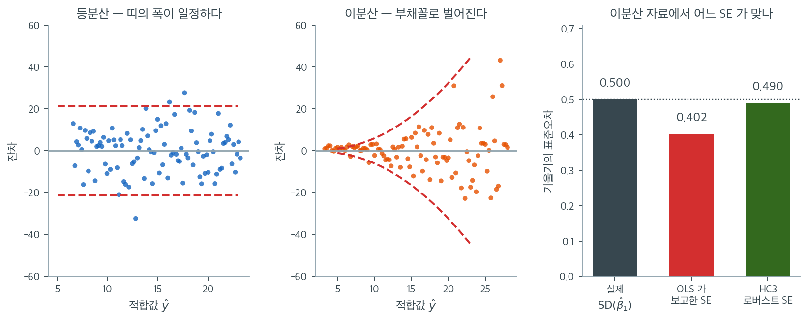

# 등분산성 가정

### 정의 1. 등분산성 { .dfn }

등분산성은 오차(잔차)의 분산이 독립변수의 모든 수준에서 일정하다는 가정이다. 이 가정이 성립하면 예측값의 범위 전체에 걸쳐 잔차의 흩어짐이 대체로 같아야 한다.

형식적으로

$$
\text{Var}(\epsilon_i \mid X_i) = \sigma^2 \quad \text{(모든 } i \text{에 대해)}
$$

여기서 $\sigma^2$은 $X_i$의 값에 의존하지 않는 상수이다.

반대 상황인 **이분산**은 오차의 분산이 독립변수의 수준에 따라 체계적으로 변할 때 나타난다.

$$
\text{Var}(\epsilon_i \mid X_i) = \sigma_i^2 \quad \text{(상수가 아님)}
$$

---

## 1. 중요성

등분산성이 중요한 이유는 이분산이 다음을 낳기 때문이다.

- **비효율적인 추정** — OLS 추정량은 여전히 불편이지만 더 이상 최소분산 선형불편추정량(BLUE)이 아니다. 더 효율적인 추정량이 존재한다.
- **편향된 표준오차** — 통상적인 OLS 표준오차가 틀리게 되어 신뢰구간과 가설검정을 믿을 수 없게 된다.
- **타당하지 않은 추론** — t 통계량과 F 통계량이 지나치게 크거나 작아져 오도하는 p값을 낳는다.

왼쪽 두 칸이 진단의 출발점이다. 두 자료 모두 참 모형은 $y = 3 + 2x + \varepsilon$ 이고 $n = 100$, $x \in [1, 10]$ 으로 같다. 다른 것은 오차의 크기가 $x$ 에 어떻게 의존하느냐뿐이다. 왼쪽은 $\sigma$ 가 일정해 $\pm 2\sigma$ 띠(붉은 점선)가 수평으로 뻗고, 가운데는 $\sigma_i = 0.3 + 0.22x_i^2$ 로 커져 띠가 나팔처럼 벌어진다. 두 그림의 평균 분산은 같게 맞추었으므로 점의 총 퍼짐은 비슷하다. 달라진 것은 **퍼짐이 어디에 몰려 있는가**뿐인데, 그 차이만으로 추론이 무너진다.

오른쪽 막대가 그 무너짐을 잰 것이다. 이분산 자료로 4000번 회귀를 반복했다. 먼저 계수 자체는 멀쩡하다. $\hat{\beta}_1$ 의 평균이 $1.992$ 로 참값 $2$ 를 맞힌다. 그런데 $\hat{\beta}_1$ 이 실제로 흔들린 폭은 $0.500$ 인 반면, OLS 가 매번 출력표에 찍어 준 표준오차는 평균 $0.402$ 로 **약 20% 작다.** 등분산 자료로 같은 실험을 하면 실제 $0.403$, 보고된 $0.405$ 로 둘이 포개진다. 곧 OLS 의 표준오차 공식이 틀리는 것은 이분산일 때뿐이고, 여기서는 실제보다 작게 나와 계수를 **실제보다 유의해 보이게** 만든다.

세 번째 막대가 처방이다. HC3 로버스트 표준오차는 평균 $0.490$ 으로 실제 $0.500$ 에 거의 닿는다. 검정의 성능으로 옮겨 보면 차이가 더 분명하다. 참인 귀무가설 $\beta_1 = 2$ 를 유의수준 5%로 검정할 때 통상적인 OLS 표준오차를 쓰면 기각률이 $11.5\%$ 로 약속의 두 배가 넘지만, HC3 을 쓰면 $5.6\%$ 로 제자리를 찾는다. 계수 추정값은 세 경우 모두 똑같다는 점이 중요하다. **고치는 것은 추정값이 아니라 그 곁의 표준오차뿐이다.** 그래서 로버스트 표준오차는 해석을 바꾸지 않으면서 추론만 구해 내는, 가장 값싼 처방이 된다.

---

## 2. 이분산의 흔한 패턴

| 패턴 | 설명 | 예 |
|---------|-------------|---------|
| 부채꼴 | 적합값이 커질수록 분산이 커진다 | 소득 대 지출 자료 |
| 역부채꼴 | 적합값이 커질수록 분산이 작아진다 | 집단 크기가 다른 집계 자료 |
| 나비넥타이 | 분산이 커졌다가 작아진다 | 자연스러운 상·하한이 있는 자료 |
| 집단별 | 집단마다 분산이 다르다 | 다집단 비교 |

---

## 3. 진단

- **잔차-적합값 그림:** 잔차를 종속변수의 적합값(예측값)에 대해 그린다. 잔차가 수평축 주위에 패턴이나 깔때기 모양 없이 고르게 퍼져 있으면 등분산성을 시사한다.
- **Breusch-Pagan 검정:** 제곱잔차를 독립변수에 회귀시켜 이분산의 존재를 평가하는 통계검정이다. 유의한 결과는 이분산을 나타낸다.
- **White 검정:** 이분산뿐 아니라 비선형성까지 확인하는 더 일반적인 검정이다.
- **척도-위치 그림:** 표준화 잔차의 제곱근을 적합값에 대해 그린다.

---

## 4. 이분산에 대한 대책

- **변수변환:** 종속변수에 로그나 제곱근 변환을 적용하면 잔차의 분산을 안정화할 수 있다.
- **가중최소제곱(WLS):** WLS는 관측값마다 다른 가중치를 부여하여 이분산에 대처하며, 분산이 큰 관측값에 더 작은 가중치를 준다.
- **로버스트 표준오차:** 이분산 일치(HC) 표준오차(White의 로버스트 표준오차)는 모형을 변환하지 않고도 타당한 추론을 제공한다.

자세한 진단 방법은 [등분산성 확인](checking_homoscedasticity.md)을 보라.

---

## 연습문제

**연습문제 1.** 
연봉을 경력 연수에 회귀시킨 단순선형회귀에서 잔차의 분산이 경력 수준에 따라 커진다. 이분산 아래에서 OLS 추정량이 왜 여전히 불편이지만 더 이상 효율적이지 않은지 설명하라.

??? success "풀이"
    OLS 추정량이 불편인 이유는 불편성의 Gauss-Markov 증명($E[\hat{\beta}] = \beta$)이 $E[\varepsilon|X] = 0$만을 요구하고 분산이 일정할 것을 요구하지 않기 때문이다.

    그러나 OLS는 모든 관측값에 같은 가중치를 주므로 더 이상 **효율적**이지(BLUE이지) 않다. 이분산 아래에서 분산이 큰 관측값은 회귀직선에 대한 정보를 적게 담고 있다. 관측값에 분산의 역수로 가중치를 주는 가중최소제곱이 더 효율적인 추정을 낳는다.

**연습문제 2.** 
이분산의 수학적 정의를 쓰고 등분산성과 어떻게 다른지 설명하라.

??? success "풀이"
    **등분산성:** 모든 $i$에 대해 $\text{Var}(\varepsilon_i | X_i) = \sigma^2$ (상수 분산).

    **이분산:** $\text{Var}(\varepsilon_i | X_i) = \sigma_i^2$이고 $\sigma_i^2$이 $X_i$에 따라 변한다 (비상수 분산).

    등분산성 아래에서는 $X$의 모든 값에서 잔차의 흩어짐이 같다. 이분산 아래에서는 흩어짐이 체계적으로 변한다. 예를 들어 $X$가 커질수록 커지거나(부채꼴 잔차그림) 집단마다 다르다.

---

## 정리하며

등분산성이 깨져도 **계수는 불편이지만 표준오차가 틀린다.**

- **OLS 는 여전히 불편이고 일치한다.** 잃는 것은 효율성과 **표준오차의 타당성**이다. 가우스–마르코프의 "최소분산" 부분이 깨진다.
- **부채꼴 패턴이 전형적인 신호다.** 적합값이 커질수록 잔차의 퍼짐이 커지는 모양이며, 소득·매출처럼 양수이고 규모가 다른 자료에서 흔하다.
- **형식적 검정이 있다.** 브로이시–페이건, 화이트 검정이며, 그림과 함께 보아야 한다.
- **처방이 세 갈래다.** 로그 변환(규모 효과를 덧셈으로), **로버스트 표준오차**(HC3 — 계수는 그대로 두고 표준오차만 고침), **가중최소제곱**(분산 구조를 알 때).
- **로버스트 표준오차가 가장 실용적이다.** 분산 구조를 몰라도 되고 계수 해석이 바뀌지 않는다.

다음 절 **정규성 개관**으로 넘어간다.
