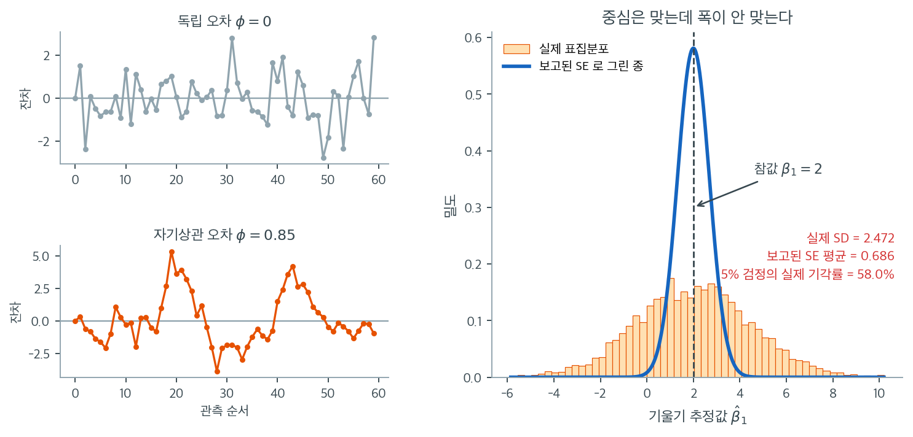

# 독립성 가정

### 정의 1. 독립성 { .dfn }

독립성 가정은 회귀모형의 잔차(오차)들이 서로 독립이라는 것이다. 다시 말해 한 관측값의 오차가 다른 관측값의 오차와 관련되어서는 안 된다.

형식적으로, 서로 다른 두 관측값 $i$와 $j$에 대해

$$
\text{Cov}(\epsilon_i, \epsilon_j) = 0 \quad \text{(모든 } i \neq j \text{에 대해)}
$$

---

## 1. 중요성

독립성 가정을 위배하면 다음이 일어난다.

- **비효율적인 계수 추정** — OLS 추정량은 여전히 불편이지만 더 이상 최소분산 선형불편추정량이 아니다.
- **틀린 표준오차** — 보통 과소추정되어 계수가 실제보다 더 유의해 보이게 만든다.
- **타당하지 않은 가설검정** — t 검정과 F 검정이 오도하는 p값을 내놓는다.

!!! note "자기상관이 계수를 편향시키는가"
    설명변수가 외생적이면($E[\varepsilon \mid X] = 0$) 자기상관이 있어도 OLS 계수 추정량은 **불편**이다. 망가지는 것은 표준오차이지 추정값 자체가 아니다. 다만 예외가 있다. 시차 종속변수($Y_{t-1}$)를 설명변수로 넣은 모형에서 오차가 자기상관되어 있으면 설명변수와 오차가 상관되어 계수 추정 자체가 편향되고 일치성도 잃는다.

독립성은 오차가 시간에 걸쳐 상관될 수 있는 **시계열 자료**에서 특히 결정적이다(이를 **자기상관**이라 한다). 같은 집단 안의 관측값이 다른 집단의 관측값보다 서로 비슷할 수 있는 **군집 자료**에서도 문제가 된다.

왼쪽의 두 작은 그림이 눈으로 보는 독립성 진단이다. 위는 독립 오차($\phi = 0$)를 관측 순서대로 찍은 것으로, 점이 0 위아래를 쉴 새 없이 오간다. 아래는 $\varepsilon_t = 0.85\varepsilon_{t-1} + u_t$ 로 만든 자기상관 오차인데, 한번 위로 올라가면 대여섯 점이 함께 위에 머물고 내려가면 또 한동안 아래에 머문다. 같은 개수의 점이지만 아래쪽 그림이 담고 있는 **독립적인 정보의 양**은 훨씬 적다. 더빈–왓슨 통계량이 재는 것이 바로 이 뭉침이다.

오른쪽은 $n = 60$, 참 기울기 $\beta_1 = 2$ 로 4000번 반복한 결과다. 주황 히스토그램이 $\hat{\beta}_1$ 의 실제 표집분포이고, 파란 종은 매 반복에서 OLS 가 출력표에 찍어 준 표준오차의 평균으로 그린 것이다. **중심은 정확히 맞는다.** 추정값의 평균이 $2.028$ 로 참값에서 벗어나지 않았다. 앞의 상자에서 말한 "자기상관은 계수를 편향시키지 않는다"가 그림으로 확인된 셈이다. 그런데 폭이 전혀 맞지 않는다. 실제 표준편차는 $2.472$ 인데 보고된 표준오차는 평균 $0.686$ 으로, **3.6배나 좁다.** 독립 오차로 같은 실험을 하면 실제 $0.440$, 보고된 $0.438$ 로 둘이 거의 포개진다.

이 어긋남이 그대로 검정의 실패로 이어진다. 참값 $\beta_1 = 2$ 를 귀무가설로 두고 유의수준 5%로 검정하면, 독립 오차에서는 기각률이 정확히 $5.0\%$ 로 나온다. 자기상관 오차에서는 $58.0\%$ 다. **참인 귀무가설을 열 번에 여섯 번 기각한다.** 분산으로 따지면 $2.472^2/0.440^2 \approx 31.6$ 배이니, 관측 60개가 실제로는 몇 개 값어치밖에 못 한다는 뜻이다. 그리고 이 실패는 $n$ 을 키워도 사라지지 않는다. 표준오차 공식이 틀린 것이지 표본이 작은 것이 아니기 때문이다. 뉴이–웨스트 표준오차나 혼합효과 모형처럼 상관 구조를 셈에 넣는 방법으로 **공식을 바꿔야** 한다.

---

## 2. 흔한 위배 사례

| 자료 유형 | 흔한 위배 | 예 |
|-----------|-----------------|---------|
| 시계열 | 자기상관 | 주식 수익률, 경제지표 |
| 공간 | 공간상관 | 지리 자료, 환경 측정값 |
| 군집 | 군집 내 상관 | 학교 안의 학생, 병원 안의 환자 |
| 반복측정 | 계열상관 | 종단연구, 패널자료 |

---

## 3. 진단

- **Durbin-Watson 검정:** 1차 자기상관을 탐지하는 통계검정이다. 값이 2에 가까우면 자기상관이 없음을, 2보다 뚜렷이 작으면 양의 자기상관을, 2보다 뚜렷이 크면 음의 자기상관을 시사한다.
- **잔차그림:** 시계열 자료에서는 잔차를 시간에 대해 그려 패턴을 확인한다. 눈에 띄는 패턴이 있으면 독립성 가정의 위배를 시사할 수 있다.
- **Breusch-Godfrey 검정:** 1차를 넘어서는 고차 자기상관을 탐지한다.

---

## 4. 비독립성에 대한 대책

- **시차 변수 도입:** 시계열 모형에서 시차 변수(예: $Y_{t-1}$)를 넣으면 자기상관을 설명할 수 있다.
- **일반화최소제곱(GLS):** GLS는 회귀계수의 표준오차를 조정하여 자기상관에 대처한다.
- **혼합효과모형:** 군집 자료에서는 혼합효과(위계) 모형이 군집 내 상관을 반영할 수 있다.
- **Newey-West 표준오차:** 이분산·자기상관 일치(HAC) 표준오차는 독립성이 위배되어도 타당한 추론을 제공한다.

자세한 진단 방법은 [독립성 확인](checking_independence.md)을 보라.

---

## 연습문제

**연습문제 1.** 
회귀 잔차에 대한 독립성 가정의 수학적 정의를 서술하라. 이 가정이 위배될 가능성이 높은 자료의 예를 하나 들어라.

??? success "풀이"
    독립성 가정은 다음을 요구한다.

    $$
    \text{Cov}(\varepsilon_i, \varepsilon_j) = 0 \quad \text{(모든 } i \neq j \text{에 대해)}
    $$

    **예:** 월별 주식 수익률을 시장 요인에 회귀시키는 경우. 경기 상황이 시간에 걸쳐 지속되므로 인접한 달의 수익률은 자기상관되어 있을 가능성이 높고, 따라서 $\text{Cov}(\varepsilon_t, \varepsilon_{t+1}) \neq 0$이다.

**연습문제 2.** 
독립성 가정의 위배가 정규성이나 등분산성의 위배보다 더 심각하다고 여겨지는 이유를 설명하라. 왜 고치기가 더 어려운가?

??? success "풀이"
    독립성 위배는 통계적 추론의 **핵심 구조**에 영향을 주기 때문에 더 심각하다.

    - 표준오차가 편향되므로(단지 비효율적인 것이 아니다) 모든 $t$ 검정과 $F$ 검정이 무효가 된다.
    - 실효 표본크기가 명목상의 $n$보다 작아지므로 신뢰구간이 오도할 만큼 좁아진다.
    - 이분산은 로버스트 표준오차로, 비정규성은 중심극한정리로 완화할 수 있지만, 독립성 위배는 상관 구조를 반영하는 근본적으로 다른 모형(혼합효과, 시계열, GEE)을 요구한다.

---

## 정리하며

$\mathrm{Cov}(\varepsilon_i,\varepsilon_j)=0$ 은 **가장 고치기 어려운** 가정이다.

- **위반하면 표준오차가 틀린다.** 계수 추정값 자체는 여전히 불편이지만 **표준오차가 과소추정되어 $t$ 가 부풀고 $p$ 값이 작아진다.** 있지도 않은 유의성이 생긴다.
- **7장의 유효표본크기가 그대로 적용된다.** 양의 자기상관이 있으면 관측 $n$ 개가 독립 $n(1-\phi)/(1+\phi)$ 개 값어치다.
- **전형적인 위반 상황.** 시계열의 자기상관, 군집(학교·병원·지역), 공간적 근접, 같은 대상의 반복측정.
- **더빈–왓슨 통계량이 1차 자기상관을 잰다.** $2$ 근처면 무상관, $0$ 에 가까우면 양의 상관이다. 잔차를 순서대로 그려 보는 것도 좋은 진단이다.
- **처방은 모형을 바꾸는 것이다.** 뉴이–웨스트 표준오차, 군집 강건 표준오차, 혼합효과 모형, 시계열 모형. **변환으로는 해결되지 않는다.**

다음 절 **등분산성 개관**으로 넘어간다.
