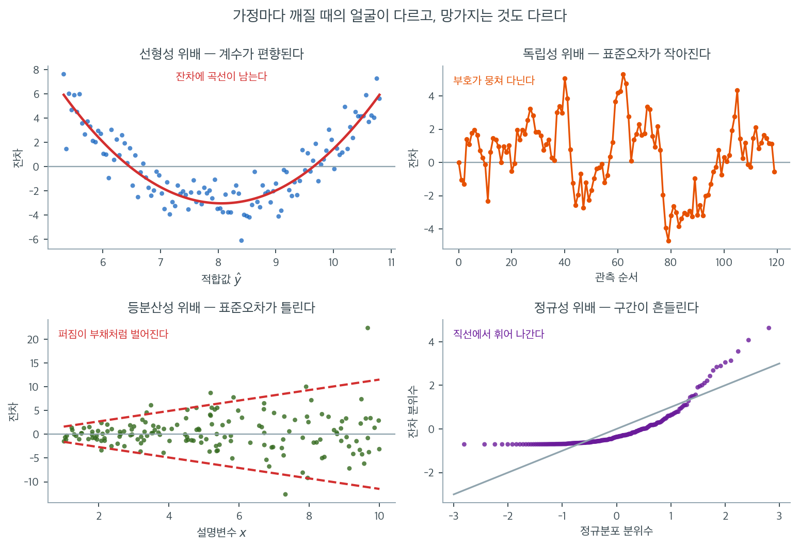

# 선형회귀의 가정과 진단

선형회귀는 종속변수와 하나 이상의 독립변수 사이의 관계를 모형화하는 기본적인 통계 방법이다. 그러나 선형회귀 모형의 결과가 타당하려면 몇 가지 가정이 충족되어야 한다. 이 가정들은 모형이 적절히 설정되었으며 모형에서 끌어낸 통계적 추론이 신뢰할 만하다는 것을 보장한다.

## 네 가지 핵심 가정

선형회귀의 바탕이 되는 네 가지 핵심 가정은 흔히 머리글자 **LINE**으로 요약된다.

1. **선형성(Linearity)** — 종속변수와 각 독립변수 사이에 직선 관계가 존재한다.
2. **독립성(Independence)** — 회귀모형의 잔차(오차)들이 서로 독립이다.
3. **정규성(Normality)** — 잔차가 평균 0인 정규분포를 따른다.
4. **등분산성(Equal variance)** — 독립변수의 모든 수준에서 잔차의 분산이 일정하다.

네 가정은 이름만 나란할 뿐 깨졌을 때의 얼굴도, 망가뜨리는 것도 서로 다르다. 위 그림의 네 칸은 각 가정이 위배된 자료에서 실제로 무엇이 보이는지를 나란히 놓은 것이다. 왼쪽 위는 참 관계가 곡선인데 직선을 적합한 경우로, 잔차가 적합값에 대해 뚜렷한 포물선을 그린다. 오른쪽 위는 $\phi = 0.85$ 의 1차 자기상관을 준 오차를 관측 순서대로 찍은 것인데, 점들이 0 위아래를 무작위로 오가지 않고 한동안 위에 머물다 한동안 아래에 머문다. 왼쪽 아래는 오차의 표준편차가 $\sigma_i = 0.25 + 0.55 x_i$ 로 커지는 자료다. 붉은 점선으로 그린 $\pm 2\sigma$ 띠가 $x = 1$ 에서 $\pm 1.6$ 이던 것이 $x = 10$ 에서 $\pm 11.5$ 로 일곱 배 벌어진다. 오른쪽 아래는 오차가 $(\chi^2_1 - 1)/\sqrt{2}$ 를 따를 때의 Q-Q 그림이며, 점들이 왼쪽 끝에서 바닥에 눌려 있다가 오른쪽에서 기준선 위로 튀어 오른다.

정작 중요한 것은 각 칸의 제목에 붙은 뒷말이다. 선형성이 깨지면 **계수 자체가 편향된다.** 나머지 셋은 그렇지 않다. 독립성과 등분산성이 깨져도 $\hat{\beta}$ 는 여전히 불편이고, 망가지는 것은 그 곁에 찍혀 나오는 **표준오차**다. 정규성이 깨지면 계수도 표준오차도 멀쩡하며 다만 $t$ 와 $F$ 의 **정확한 분포**가 근사로 내려앉는다. 그래서 위배의 심각도에 대략적인 순서가 생긴다. 선형성이 가장 무겁고, 독립성, 등분산성, 정규성 순으로 가벼워진다. 정규성을 맨 뒤에 두는 이 순서가 실무의 감각이다.

진단할 때 무엇을 볼지도 이 그림이 일러 준다. 네 칸 가운데 셋은 **잔차를 무엇에 대해 찍느냐**만 다르다. 적합값에 대해 찍으면 선형성과 등분산성이, 관측 순서에 대해 찍으면 독립성이, 정규분포 분위수에 대해 찍으면 정규성이 드러난다. 회귀 결과를 받아 들었을 때 가장 먼저 할 일이 이 세 그림을 그려 보는 것인 이유다. 출력표의 $R^2$ 과 $p$ 값은 가정이 지켜졌다는 전제 아래에서만 뜻을 갖고, 그 전제를 확인해 주는 것은 표가 아니라 잔차 그림이다.

## 이 가정들이 왜 중요한가

이 가정들을 이해하고 확인하는 일은 다음의 이유로 필수적이다.

- **선형성 위배**는 모형이 참 관계를 과대 또는 과소 추정하게 만들어 편향된 예측과 타당하지 않은 추론을 낳는다.
- **독립성 위배**는 표준오차를 틀리게 만들고 가설검정을 무효화한다. 자기상관이 나타날 수 있는 시계열 자료에서 특히 결정적이다.
- **등분산성 위배**(이분산)는 계수 추정을 비효율적으로 만들고 표준오차를 편향시켜 결국 가설검정을 훼손한다.
- **정규성 위배**는 신뢰구간, 가설검정(계수의 t-검정, 전체 유의성의 F-검정), 예측구간의 타당성을 흔든다.

## 진단 절차

회귀 가정을 점검하는 전형적인 진단 절차는 다음과 같다.

1. 회귀모형을 적합하고 잔차를 계산한다.
2. **시각적 진단**(산점도, 잔차그림, Q-Q 그림, 히스토그램)으로 1차 평가를 한다.
3. **형식적 통계검정**(Durbin-Watson, Breusch-Pagan, Shapiro-Wilk 등)으로 엄밀하게 평가한다.
4. 위배가 발견되면 변수변환, 가중최소제곱, 로버스트 회귀, 대안 모형 설정 같은 **대책**을 적용한다.

이어지는 절들에서 각 가정을 진단 방법, 형식적 검정, 위배 시의 대책과 함께 자세히 다룬다.

## 절 개요

| 절 | 주제 | 핵심 진단 |
|---------|-------|----------------|
| [선형성](linearity_overview.md) | 직선 관계 가정 | 산점도, 잔차그림 |
| [독립성](independence_overview.md) | 무상관 잔차 가정 | Durbin-Watson 검정, 잔차그림 |
| [등분산성](homoscedasticity_overview.md) | 상수분산 가정 | 잔차-적합값 그림, Breusch-Pagan 검정 |
| [정규성](normality_overview.md) | 잔차의 정규성 가정 | Q-Q 그림, Shapiro-Wilk 검정 |
| [선형성 확인](checking_linearity.md) | 선형성 평가 방법 | 산점도, 성분+잔차 그림, 다항 항 |
| [독립성 확인](checking_independence.md) | 독립성 평가 방법 | Durbin-Watson, Breusch-Godfrey, 군집 |
| [등분산성 확인](checking_homoscedasticity.md) | 등분산성 평가 방법 | Breusch-Pagan, White 검정, 척도-위치 그림 |
| [정규성 확인](checking_normality.md) | 정규성 평가 방법 | 히스토그램, Q-Q 그림, Shapiro-Wilk, Anderson-Darling, Jarque-Bera |
