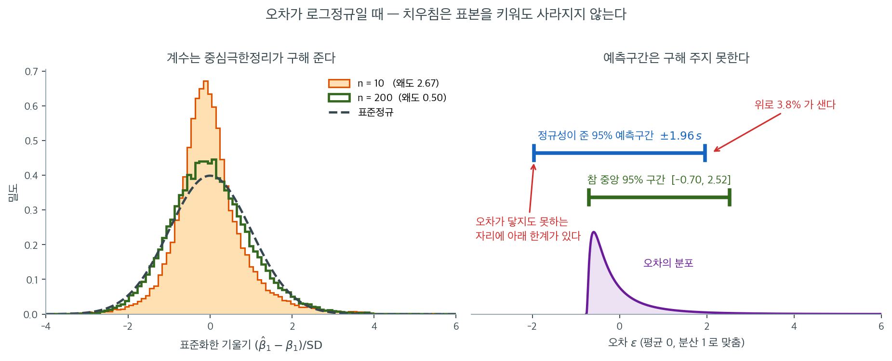

# 정규성 가정

### 정의 1. 정규성 { .dfn }

정규성 가정은 회귀모형의 잔차가 평균 0인 정규분포를 따른다는 것이다.

$$
\epsilon_i \sim N(0, \sigma^2)
$$

곧 잔차를 그렸을 때 0을 중심으로 하는 종 모양(Gauss) 곡선을 이루어야 한다는 뜻이다.

## 중요성

선형회귀의 여러 추론 통계가 이 가정에 의존하므로 잔차의 정규성은 결정적으로 중요하다.

- **계수의 t-검정** — 개별 회귀계수가 0과 유의하게 다른지 검정하려면 오차가 정규분포를 따라야 한다.
- **전체 유의성의 F-검정** — 모형 유의성에 대한 전체 F 검정은 정규 오차를 가정한다.
- **신뢰구간** — 계수의 신뢰구간은 정규성 가정 아래에서 유도된 t 분포를 쓴다.
- **예측구간** — 새 관측값에 대한 예측구간이 타당하려면 정규성이 필요하다.

**중요한 단서:** 정규성 가정은 회귀계수의 불편추정에는 **필요하지 않다**. OLS 추정량 $\hat{\beta}$는 오차의 분포와 무관하게 불편이다. 다만 정규성이 없으면 추론에 쓰는 정확한 분포 결과(t 검정, F 검정)가 중심극한정리를 통해 점근적으로만 타당해진다.

위 표가 말하는 "표본이 크면 덜 중요하다"와 "예측구간에는 표본크기와 무관하게 중요하다"가 왜 함께 성립하는지를 한 그림에 담았다. 오차를 평균 0, 분산 1 로 맞춘 **로그정규**로 두었다. 왜도가 $6.18$ 로 정규에서 아주 멀고, 왼쪽으로는 $-0.76$ 아래로 내려갈 수 없는 반면 오른쪽 꼬리는 길게 늘어진다. 설명변수도 일부러 한쪽으로 치우친 설계점을 썼다.

왼쪽 칸이 계수 쪽 이야기다. $n = 10$ 일 때 $\hat{\beta}_1$ 의 표집분포는 왜도 $2.67$ 로 뚜렷이 오른쪽으로 끌려 있고, 봉우리는 표준정규보다 높고 좁다. 이런 상태에서 $t$ 분포표를 읽는 것은 맞지 않는 자를 대는 일이다. 그런데 $n = 200$ 으로만 키워도 왜도가 $0.50$ 으로 떨어지고 히스토그램이 표준정규 곡선(검은 점선) 위에 거의 포개진다. $\hat{\beta}_1$ 은 오차들의 **가중평균**이므로 중심극한정리가 그대로 작동한 것이다. 오차 자체는 여전히 왜도 $6.18$ 의 괴물인데도 그렇다. 정규성을 "네 가정 중 가장 덜 중요한 것"으로 두는 근거가 이것이다.

오른쪽 칸이 구해 주지 못하는 쪽이다. 예측구간은 $\hat{\beta}$ 의 흔들림뿐 아니라 **앞으로 뽑힐 오차 한 개**를 그대로 품어야 한다. 그 오차 한 개에는 중심극한정리가 적용될 자리가 없다. 정규성을 믿고 만든 구간은 $\pm 1.96s$, 곧 $[-1.96, 1.96]$ 으로 좌우대칭인데, 참으로 중앙 95%를 담는 구간은 $[-0.70, 2.52]$ 로 오른쪽으로 밀려 있다. 그 결과 아래쪽 한계는 오차가 **닿을 수조차 없는 자리**에 놓여 한 푼도 쓰이지 않고, 새는 것은 전부 위쪽이다. 실제로 모의실험을 해 보면 $n = 20$ 에서 포함률 $93.4\%$(아래로 $0.0\%$, 위로 $6.6\%$), $n = 100$ 에서 $95.6\%$($0.0\%$, $4.4\%$), $n = 640$ 에서 $96.3\%$($0.0\%$, $3.7\%$)이다. 총량만 보면 95%에 가까워 멀쩡해 보이지만, **빗나감이 전부 한쪽에 몰려 있다는 사실은 표본을 32배로 키워도 그대로다.**

그러므로 정규성 점검의 실전 규칙은 이렇게 갈린다. 계수의 $p$ 값과 신뢰구간만 쓸 것이고 $n$ 이 충분히 크다면 Q-Q 그림이 조금 휘어도 넘어갈 수 있다. 그러나 개별 관측값을 예측하고 그 구간을 보고할 작정이라면, $n$ 이 아무리 커도 잔차의 모양을 정면으로 다루어야 한다. 변환하거나, 붓스트랩으로 비대칭 구간을 만들거나, 분위수회귀처럼 대칭을 강요하지 않는 방법으로 가는 것이 옳다.

## 정규성이 가장 중요한 경우

| 상황 | 정규성의 중요도 |
|-----------|---------------------|
| 작은 표본 ($n < 30$) | 결정적 — 중심극한정리의 근사가 충분하지 않다 |
| 큰 표본 ($n > 100$) | 덜 중요 — 중심극한정리가 검정통계량의 근사 정규성을 보장한다 |
| 예측구간을 만들 때 | 표본크기와 무관하게 항상 중요 |
| 두꺼운 꼬리 자료 | 중요 — 이상점이 OLS 추정에 강한 영향을 줄 수 있다 |

## 진단

- **Q-Q 그림(분위수-분위수 그림):** 잔차의 분위수를 정규분포의 분위수와 비교한다. 점들이 대략 직선을 따라 놓이면 잔차가 정규분포를 따를 가능성이 높다.
- **Shapiro-Wilk 검정:** 정규성에 대한 형식적 통계검정이다. 유의하지 않은 결과는 잔차가 정규분포를 따름을 시사한다.
- **잔차의 히스토그램:** 간단한 시각적 확인이다. 히스토그램이 0을 중심으로 하는 종 모양을 닮아야 한다.
- **Jarque-Bera 검정:** 잔차의 왜도와 첨도가 정규분포와 일치하는지 검정한다.

## 비정규성에 대한 대책

- **변수변환:** 종속변수에 로그, 제곱근, Box-Cox 변환 등을 적용하면 비정규성이 교정되기도 한다.
- **로버스트 회귀:** 정규성을 얻을 수 없을 때 로버스트 회귀 기법이 이상점의 영향을 낮춰 타당한 결과를 제공한다.
- **붓스트랩:** 붓스트랩 방법은 분포 가정에 기대지 않고 타당한 추론을 제공한다.
- **더 큰 표본:** 표본이 충분히 크면 오차가 정규가 아니어도 중심극한정리에 의해 검정통계량이 근사적으로 정규분포를 따른다.

자세한 진단 방법은 [정규성 확인](checking_normality.md)을 보라.

## 연습문제

**연습문제 1.** 
한 연구자가 관측값 $n = 15$개로 회귀모형을 적합했다. 잔차의 Q-Q 그림에서 오른쪽으로 상당히 치우친 모습이 보인다. 왜 이 상황에서 $n = 500$일 때보다 정규성이 더 중요한지 설명하라.

??? success "풀이"
    $n = 15$밖에 안 되면 **중심극한정리**가 좋은 근사를 제공하지 못한다. 개별 계수의 $t$ 통계량과 전체 유의성의 $F$ 통계량의 정확한 분포는 오차의 정규성에 의존한다. 잔차가 오른쪽으로 치우쳤다는 것은 실제 표집분포가 가정된 $t$ 분포와 다르다는 뜻이고, 따라서 p값과 신뢰구간이 부정확해진다.

    $n = 500$이면 오차의 분포와 무관하게 중심극한정리가 표집분포의 근사 정규성을 보장하므로 정규성에서 어느 정도 벗어나도 추론에 미치는 영향이 미미하다.

**연습문제 2.** 
$\hat{\beta}$의 불편추정에는 정규성이 필요하지 않지만 계수의 $t$ 검정이 정확히 타당하려면 정규성이 필요한 이유를 설명하라.

??? success "풀이"
    OLS 추정량 $\hat{\beta} = (X^T X)^{-1} X^T Y$는 $Y$의 선형함수이다. 그 기댓값은

    $$
    E[\hat{\beta}] = (X^T X)^{-1} X^T E[Y] = (X^T X)^{-1} X^T X \beta = \beta
    $$

    이 유도에는 $E[\varepsilon] = 0$만 쓰였고 정규성은 쓰이지 않았다. 따라서 $\hat{\beta}$는 오차의 분포와 무관하게 불편이다.

    반면 $t$ 검정통계량 $t = \hat{\beta}_j / \text{SE}(\hat{\beta}_j)$가 정확한 $t$ 분포를 따르는 것은 $\varepsilon \sim N(0, \sigma^2 I)$일 때뿐이다. 정규성이 없으면 유한표본에서 이 비는 정확한 $t$ 분포를 갖지 않으므로 $t$ 분포표에서 읽은 p값은 근삿값에 지나지 않는다.

---

## 정리하며

정규성은 **네 가정 중 가장 덜 중요하다.**

- **무엇에 필요한가.** 계수의 불편성에는 필요 없고, 가우스–마르코프에도 필요 없다. **$t$ 와 $F$ 의 정확한 분포**에만 필요하다.
- **대표본에서는 중심극한정리가 보호한다.** $\hat\beta$ 가 근사적으로 정규가 되므로 $n$ 이 크면 완만한 이탈은 문제가 되지 않는다.
- **잔차에 대한 가정이다.** $Y$ 나 $X$ 의 분포가 아니라 $\varepsilon$ 의 분포다. 이 혼동이 매우 흔하다.
- **Q-Q 그림이 주된 도구다.** 14장에서 보듯 형식적 정규성 검정은 표본크기에 좌우되므로 참고만 한다.
- **진짜 문제는 이상치와 심한 치우침이다.** 그때는 변환하거나 로버스트 회귀로 가며, **예측구간은 정규성에 훨씬 민감하다**는 점도 기억할 일이다.

다음 절부터 각 가정의 **구체적인 확인 절차**로 넘어간다.
