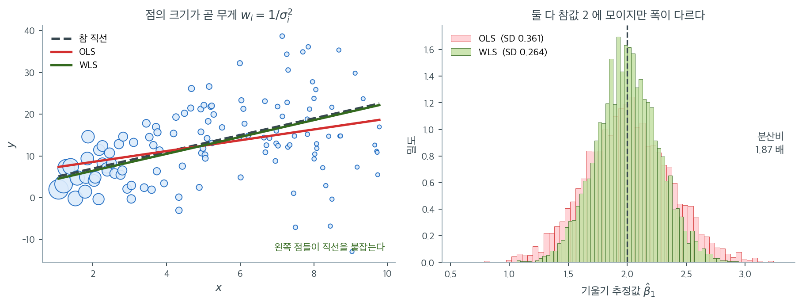

# 가중최소제곱

## 개요

이 페이지는 이분산에 대한 대책으로 가중최소제곱(WLS) 회귀를 보인다. 오차분산이 설명변수에 따라 선형으로 커지는 자료를 생성하고, OLS와 WLS를 모두 적합한 뒤 계수 추정값, 표준오차, 잔차그림을 비교하여 WLS가 비상수 분산을 어떻게 바로잡는지 보인다.

---

## 1. 수학적 배경

오차분산이 일정하지 않으면($\mathrm{Var}(\varepsilon_i) = \sigma_i^2$) OLS는 여전히 불편이지만 더 이상 효율적이지 않고 표준오차가 틀리게 된다. WLS는 가중된 잔차제곱합을 최소화하여 이에 대처한다.

$$
\hat{\boldsymbol{\beta}}_{\text{WLS}} = \arg\min_{\boldsymbol{\beta}} \sum_{i=1}^n w_i(y_i - \mathbf{x}_i^\top\boldsymbol{\beta})^2,
$$

여기서 $w_i = 1/\sigma_i^2$이다(분산이 큰 관측값이 작은 가중치를 받는다). 행렬 형태로는

$$
\hat{\boldsymbol{\beta}}_{\text{WLS}} = (\mathbf{X}^\top\mathbf{W}\mathbf{X})^{-1}\mathbf{X}^\top\mathbf{W}\mathbf{y},
$$

여기서 $\mathbf{W} = \mathrm{diag}(w_1, \ldots, w_n)$이다.

$\hat{\boldsymbol{\beta}}_{\text{WLS}}$의 공분산행렬은

$$
\mathrm{Var}(\hat{\boldsymbol{\beta}}_{\text{WLS}}) = (\mathbf{X}^\top\mathbf{W}\mathbf{X})^{-1}.
$$

WLS는 변환된 모형 $\sqrt{w_i}\,y_i = \sqrt{w_i}\,\mathbf{x}_i^\top\boldsymbol{\beta} + \sqrt{w_i}\,\varepsilon_i$에 OLS를 적용하는 것과 동등하다. 변환된 오차는 분산이 일정하다.

### OLS와 WLS 구현

<div class="exbox" markdown>

**보기 1.** <span class="diff easy" title="쉬움"></span> OLS와 WLS 구현

**(1)** WLS가 변환된 자료 $\tilde y_i = \sqrt{w_i}\, y_i$, $\tilde{\mathbf x}_i = \sqrt{w_i}\,\mathbf x_i$에 OLS를 돌린 것과 **같다**는 것을 보이고, 단순회귀의 WLS 기울기를 닫힌 꼴로 쓰시오.

**(2)** 가중치를 모두 $c$배 해도 $\hat{\boldsymbol\beta}_{\text{WLS}}$는 변하지 않지만 위에 적은 분산 공식 $(\mathbf X^\top \mathbf W \mathbf X)^{-1}$은 $1/c$배가 됨을 보이시오. 이것이 실무에서 뜻하는 바는 무엇인가. 코드로 확인하시오.

</div>

??? success "풀이"

    **(1) 해석적으로.** 가중제곱합을 그대로 다시 적는다. $w_i > 0$이므로 $w_i = (\sqrt{w_i})^2$이고

    $$
    \sum_i w_i\big(y_i - \mathbf x_i^\top \boldsymbol\beta\big)^2
    = \sum_i \big(\sqrt{w_i}\,y_i - \sqrt{w_i}\,\mathbf x_i^\top \boldsymbol\beta\big)^2
    = \lVert \tilde{\mathbf y} - \tilde{\mathbf X}\boldsymbol\beta \rVert^2
    $$

    이다. **목적함수가 글자 그대로 같으므로 최소점도 같다.** 정규방정식으로 봐도 $\tilde{\mathbf X}^\top \tilde{\mathbf X} = \mathbf X^\top \mathbf W \mathbf X$, $\tilde{\mathbf X}^\top \tilde{\mathbf y} = \mathbf X^\top \mathbf W \mathbf y$라 바로 확인된다. 왜 이 변환이 쓸모 있는가 하면, $w_i = 1/\sigma_i^2$일 때 변환된 오차가

    $$
    \operatorname{Var}(\sqrt{w_i}\,\varepsilon_i) = w_i \sigma_i^2 = 1
    $$

    로 **등분산이 되기 때문**이다. WLS는 새로운 이론이 아니라 자료를 등분산으로 만든 뒤의 OLS다.

    단순회귀의 닫힌 꼴은 OLS의 것에서 모든 합과 평균에 $w$를 끼워 넣은 모양이다. 가중평균을

    $$
    \bar x_w = \frac{\sum_i w_i x_i}{\sum_i w_i},
    \qquad
    \bar y_w = \frac{\sum_i w_i y_i}{\sum_i w_i}
    $$

    로 두면

    $$
    \hat\beta_1 = \frac{\sum_i w_i (x_i - \bar x_w)(y_i - \bar y_w)}{\sum_i w_i (x_i - \bar x_w)^2},
    \qquad
    \hat\beta_0 = \bar y_w - \hat\beta_1 \bar x_w
    $$

    이다. 중심을 산술평균이 아니라 **가중평균**으로 잡는다는 것이 핵심이다.

    **(2) 척도 불변성.** $\mathbf W \to c\mathbf W$를 넣으면

    $$
    (c\mathbf X^\top \mathbf W \mathbf X)^{-1}(c\mathbf X^\top \mathbf W \mathbf y)
    = \tfrac1c (\mathbf X^\top \mathbf W \mathbf X)^{-1} \cdot c\,\mathbf X^\top \mathbf W \mathbf y
    = \hat{\boldsymbol\beta}_{\text{WLS}}
    $$

    로 $c$가 깨끗이 상쇄된다. **추정값은 가중치의 절대 크기가 아니라 비율만 본다.** 그런데 분산 공식은 $(c\mathbf X^\top \mathbf W \mathbf X)^{-1} = \tfrac1c (\mathbf X^\top \mathbf W \mathbf X)^{-1}$로 $1/c$배가 된다.

    실무에서 이것은 **덫**이다. $\sigma_i$를 몰라 "$x$에 반비례하게" 같은 **모양만 맞는** 가중치를 쓰면 추정값은 제대로 나오지만 표준오차는 임의의 상수만큼 틀린다. $(\mathbf X^\top \mathbf W \mathbf X)^{-1}$이 분산이려면 $w_i$가 $1/\sigma_i^2$에 **비례**하는 것으로는 모자라고 **정확히 같아야** 한다. 비율만 아는 경우에는 가중잔차에서 척도를 다시 추정해 $\hat s^2 (\mathbf X^\top \mathbf W \mathbf X)^{-1}$을 써야 하며, `statsmodels.WLS`가 하는 일이 그것이다.

    ```python
    import numpy as np

    def ols_fit(X, y):
        """보통최소제곱. 모든 관측값에 같은 무게를 준다."""
        beta = np.linalg.lstsq(X, y, rcond=None)[0]
        return beta

    def wls_fit(X, y, w):
        """가중최소제곱. 관측값마다 다른 무게 w 를 준다.

        정규방정식의 X'X 와 X'y 사이에 가중행렬 W 가 끼어드는 것이 전부다.
        분산이 큰 관측값에 작은 무게를 주면 추정의 분산이 줄어든다.
        """
        W = np.diag(w)
        XtW = X.T @ W
        beta = np.linalg.solve(XtW @ X, XtW @ y)
        return beta
    ```

    아래 보기 2가 만드는 자료로 세 가지를 확인한다. 변환 동등성, 닫힌 꼴, 척도 불변성이다.

    ```python
    import numpy as np

    # 보기 2 가 쓸 자료를 먼저 만들어 둔다 (씨앗이 같으므로 같은 자료다).
    np.random.seed(42)
    n = 120
    x = np.random.uniform(1, 10, n)
    sigma = 0.5 + 1.5 * x
    y = 3.0 + 2.0 * x + np.random.normal(0, sigma)
    X = np.column_stack([np.ones(n), x])
    w = 1.0 / sigma ** 2

    # 1) sqrt(w) 변환 뒤의 OLS 와 같은가
    Xt = X * np.sqrt(w)[:, None]
    yt = y * np.sqrt(w)
    print("변환 뒤 OLS =", np.linalg.lstsq(Xt, yt, rcond=None)[0])
    print("wls_fit     =", wls_fit(X, y, w))

    # 2) 단순회귀의 닫힌 꼴
    xw = (w * x).sum() / w.sum()
    yw = (w * y).sum() / w.sum()
    b1 = (w * (x - xw) * (y - yw)).sum() / (w * (x - xw) ** 2).sum()
    print(f"\n닫힌 꼴 기울기 = {b1:.12f}")
    print(f"wls_fit 기울기 = {wls_fit(X, y, w)[1]:.12f}")

    # 3) 가중치를 1000 배 해도 추정값은 그대로, 분산 공식은 1/1000 배
    se = np.sqrt(np.diag(np.linalg.inv(X.T @ np.diag(w) @ X)))
    se_1000 = np.sqrt(np.diag(np.linalg.inv(X.T @ np.diag(1000 * w) @ X)))
    print(f"\nw 를 1000 배 한 추정값 = {wls_fit(X, y, 1000 * w)}")
    print(f"SE(기울기):  w 그대로 {se[1]:.6f},  1000w {se_1000[1]:.6f}")
    print(f"비 = {se[1] / se_1000[1]:.4f},  sqrt(1000) = {np.sqrt(1000):.4f}")
    ```

    출력:

    ```
    변환 뒤 OLS = [3.34999074 2.01054088]
    wls_fit     = [3.34999074 2.01054088]

    닫힌 꼴 기울기 = 2.010540878598
    wls_fit 기울기 = 2.010540878598

    w 를 1000 배 한 추정값 = [3.34999074 2.01054088]
    SE(기울기):  w 그대로 0.258867,  1000w 0.008186
    비 = 31.6228,  sqrt(1000) = 31.6228
    ```

    **세 가지가 모두 맞는다.** 변환 뒤의 OLS와 `wls_fit`이 같은 값을 주고, 닫힌 꼴이 소수점 열두째 자리까지 일치하며, 가중치를 $1000$배 해도 추정값은 한 자리도 바뀌지 않는다. 그런데 공식이 주는 표준오차는 $0.258867$에서 $0.008186$으로 **$\sqrt{1000} = 31.62$배 작아진다.** 자료도 추정값도 그대로인데 표준오차만 서른 배 작아졌다면 그 수가 거짓이라는 뜻이고, 거짓인 쪽은 가중치의 척도가 틀린 쪽이다.

### 이분산 자료 생성과 적합

<div class="exbox" markdown>

**보기 2.** <span class="diff easy" title="쉬움"></span> 이분산 자료로 견주기. $\sigma_i = 0.5 + 1.5x_i$인 자료를 만들고 $w_i = 1/\sigma_i^2$로 적합한다. "분산의 역수가 최적"이라는 말을 증명해 두자.

**(1)** 기울기의 **모든 선형불편추정량**은 $\sum_i a_i = 0$, $\sum_i a_i x_i = 1$을 만족하는 $a$로 $\tilde\beta_1 = \sum_i a_i y_i$라 적힌다. 코시–슈바르츠로

$$
\operatorname{Var}(\tilde\beta_1) = \sum_i a_i^2 \sigma_i^2 \;\ge\; \frac{1}{S_w},
\qquad S_w = \sum_i w_i (x_i - \bar x_w)^2
$$

임을 보이고, 등호가 $a_i = w_i(x_i - \bar x_w)/S_w$, 곧 **WLS일 때만** 성립함을 보이시오.

**(2)** 자료를 만들어 적합하고, 여러 가중치의 참 분산을 계산해 하한 $1/S_w$와 견주시오. **가중치를 잘못 주면 OLS보다 나빠질 수 있는가.**

</div>

??? success "풀이"

    **(1) 해석적으로.** $\tilde\beta_1 = \sum_i a_i y_i$가 불편이려면

    $$
    E[\tilde\beta_1] = \beta_0 \sum_i a_i + \beta_1 \sum_i a_i x_i = \beta_1
    $$

    이 모든 $(\beta_0, \beta_1)$에 대해 성립해야 하므로 두 제약 $\sum_i a_i = 0$과 $\sum_i a_i x_i = 1$이 나온다. 오차가 독립이므로 분산은 $\sum_i a_i^2 \sigma_i^2$이다.

    이제 둘째 제약을 첫째 제약으로 다듬는다. 어떤 상수 $\bar x_w$를 빼도 되므로

    $$
    1 = \sum_i a_i x_i = \sum_i a_i (x_i - \bar x_w)
    $$

    이다. 이 합을 두 조각으로 갈라 코시–슈바르츠를 적용한다.

    $$
    1 = \sum_i \big(a_i \sigma_i\big)\cdot\left(\frac{x_i - \bar x_w}{\sigma_i}\right)
    \;\le\;
    \sqrt{\sum_i a_i^2 \sigma_i^2} \cdot \sqrt{\sum_i \frac{(x_i - \bar x_w)^2}{\sigma_i^2}}
    $$

    오른쪽 둘째 근호 안이 $w_i = 1/\sigma_i^2$로 $\sum_i w_i (x_i - \bar x_w)^2 = S_w$다. 양변을 제곱해 옮기면

    $$
    \operatorname{Var}(\tilde\beta_1) = \sum_i a_i^2 \sigma_i^2 \;\ge\; \frac{1}{S_w}
    $$

    를 얻는다. 여기서 $\bar x_w$는 아직 아무 상수여도 좋았다. 부등식은 어느 $c$에 대해서도 $\operatorname{Var} \ge 1/S_w(c)$로 성립하므로 **가장 센 하한은 $S_w(c) = \sum_i w_i (x_i - c)^2$을 가장 작게 만드는 $c$에서 나온다.** 그 $c$가 바로 가중평균 $\bar x_w = \sum_i w_i x_i / \sum_i w_i$다($S_w(c)$를 $c$로 미분해 0으로 두면 나온다).

    등호는 두 벡터가 평행할 때, 곧 어떤 $\lambda$에 대해

    $$
    a_i \sigma_i = \lambda \cdot \frac{x_i - \bar x_w}{\sigma_i}
    \quad\Longleftrightarrow\quad
    a_i = \lambda\, w_i (x_i - \bar x_w)
    $$

    일 때다. 제약 $\sum_i a_i x_i = 1$에 넣으면 $\lambda \sum_i w_i (x_i - \bar x_w) x_i = \lambda S_w = 1$이므로 $\lambda = 1/S_w$이고

    $$
    a_i = \frac{w_i (x_i - \bar x_w)}{S_w}
    $$

    이다. 이것이 바로 보기 1의 닫힌 꼴 $\hat\beta_1 = \sum_i w_i(x_i - \bar x_w)(y_i - \bar y_w)/S_w$의 가중치다. **WLS가 최소분산 선형불편추정량이고, 그 분산이 정확히 $1/S_w$다.**

    등호 조건이 **유일**하다는 점에 주목하라. 가중치가 $1/\sigma_i^2$에 비례하지 않으면 등호가 깨지고 분산이 반드시 커진다. "분산이 큰 쪽에 작은 가중치를 주면 좋다"가 아니라 **"정확히 $1/\sigma_i^2$에 비례할 때만 최적"** 이다.

    **(2) 수치적으로.**

    ```python
    np.random.seed(42)
    n = 120
    x = np.random.uniform(1, 10, n)

    # 잡음의 크기가 x 에 따라 커진다. 전형적인 이분산 자료다.
    sigma = 0.5 + 1.5 * x
    y = 3.0 + 2.0 * x + np.random.normal(0, sigma)

    X = np.column_stack([np.ones(n), x])

    # 두 방법 모두 불편추정량이라 계수 자체는 비슷하게 나온다.
    beta_ols = ols_fit(X, y)

    # 분산의 역수를 무게로 쓰는 것이 최적이다. 여기서는 참 sigma 를 알고 있어
    # 그대로 썼지만, 실제로는 sigma 도 자료에서 추정해야 한다.
    w = 1.0 / sigma ** 2
    beta_wls = wls_fit(X, y, w)
    ```

    가중치를 바꿔 가며 참 분산을 계산한다. $\sigma_i$를 알고 있으므로 모의실험 없이 공식으로 끝난다.

    ```python
    import numpy as np

    def slope_var(v):
        """가중치 v 로 적합한 기울기의 참 분산과 그 선형가중치 a."""
        xv = (v * x).sum() / v.sum()
        S = (v * (x - xv) ** 2).sum()
        a = v * (x - xv) / S
        return (a ** 2 * sigma ** 2).sum(), a

    print(f"{'가중치':>22}{'Var':>11}{'SE':>10}{'sum a':>10}{'sum a*x':>10}")
    for lab, v in [("OLS (w = 1)", np.ones(n)),
                   ("WLS 최적 (1/sigma^2)", w),
                   ("1/sigma (덜 줌)", 1 / sigma),
                   ("1/sigma^4 (지나침)", 1 / sigma ** 4),
                   ("1/x (모양만 비슷)", 1 / x)]:
        V, a = slope_var(v)
        print(f"{lab:>22}{V:>11.6f}{np.sqrt(V):>10.6f}"
              f"{a.sum():>10.1e}{(a * x).sum():>10.4f}")

    xw = (w * x).sum() / w.sum()
    Sw = (w * (x - xw) ** 2).sum()
    print(f"\n하한 1/S_w = {1 / Sw:.6f}   (SE = {1 / np.sqrt(Sw):.6f})")
    ```

    출력:

    ```
                       가중치        Var        SE     sum a   sum a*x
               OLS (w = 1)   0.121722  0.348887   2.4e-17    1.0000
        WLS 최적 (1/sigma^2)   0.067012  0.258867  -4.5e-17    1.0000
             1/sigma (덜 줌)   0.080300  0.283372  -2.1e-16    1.0000
           1/sigma^4 (지나침)   0.195189  0.441802   3.3e-16    1.0000
              1/x (모양만 비슷)   0.077782  0.278894   5.2e-17    1.0000

    하한 1/S_w = 0.067012   (SE = 0.258867)
    ```

    **부등식이 다섯 줄 모두에서 지켜진다.** 어느 가중치든 두 제약 $\sum a_i = 0$($10^{-16}$ 수준)과 $\sum a_i x_i = 1$을 만족하므로 모두 불편이고, 분산은 전부 하한 $0.067012$ 이상이다. 그리고 **등호는 $w = 1/\sigma^2$ 한 줄에서만 성립한다.** 소수점 여섯째 자리까지 하한과 같다.

    **가중치를 지나치게 주면 OLS보다 나빠진다.** $1/\sigma^4$의 분산이 $0.1952$로 OLS의 $0.1217$보다 **$1.6$배 크다.** 정밀한 관측 몇 개에 발언권을 몰아주는 바람에, 사실상 그 몇 개로만 직선을 긋는 꼴이 된 것이다. "가중치를 주면 좋아진다"가 아니라 **"올바른 가중치를 주어야 좋아진다"**는 (1)의 등호 조건이 여기서 값을 치른다.

    반대로 $1/\sigma$나 $1/x$처럼 **방향만 맞는** 가중치는 $0.0803$, $0.0778$로 OLS의 $0.1217$보다는 좋고 최적의 $0.0670$보다는 나쁘다. 실무에서 $\sigma_i$를 정확히 알 길이 없으므로 대개 이 중간 어딘가에 머물게 되며, 그 사실이 WLS 대신 로버스트 표준오차를 쓰는 쪽을 택하게 만드는 이유 가운데 하나다.

### 표준오차 비교

<div class="exbox" markdown>

**보기 3.** <span class="diff easy" title="쉬움"></span> 표준오차의 차이

**(1)** 이분산 아래에서 OLS 추정량의 **참** 공분산행렬이

$$
\operatorname{Var}(\hat{\boldsymbol\beta}_{\text{OLS}}) = (\mathbf X^\top \mathbf X)^{-1}\mathbf X^\top \boldsymbol\Sigma \,\mathbf X (\mathbf X^\top \mathbf X)^{-1},
\qquad \boldsymbol\Sigma = \operatorname{diag}(\sigma_1^2, \ldots, \sigma_n^2)
$$

임을 보이고, OLS가 보고하는 $s^2 (\mathbf X^\top \mathbf X)^{-1}$과 어떻게 다른지 밝히시오. **보고값이 참값보다 큰지 작은지 미리 말할 수 있는가.**

**(2)** 세 가지 표준오차 — OLS 보고값, OLS 참값, WLS — 를 모두 계산하고 모의실험으로 어느 것이 옳은지 가리시오.

</div>

??? success "풀이"

    **(1) 해석적으로.** $\hat{\boldsymbol\beta}_{\text{OLS}} = (\mathbf X^\top \mathbf X)^{-1}\mathbf X^\top \mathbf y$에 $\mathbf y = \mathbf X \boldsymbol\beta + \boldsymbol\varepsilon$을 넣으면

    $$
    \hat{\boldsymbol\beta}_{\text{OLS}} = \boldsymbol\beta + \mathbf A \boldsymbol\varepsilon,
    \qquad \mathbf A = (\mathbf X^\top \mathbf X)^{-1}\mathbf X^\top
    $$

    이다. 선형변환의 공분산 법칙 $\operatorname{Var}(\mathbf A \boldsymbol\varepsilon) = \mathbf A \boldsymbol\Sigma \mathbf A^\top$를 그대로 적용하면

    $$
    \operatorname{Var}(\hat{\boldsymbol\beta}_{\text{OLS}})
    = (\mathbf X^\top \mathbf X)^{-1}\mathbf X^\top \boldsymbol\Sigma\, \mathbf X (\mathbf X^\top \mathbf X)^{-1}
    $$

    을 얻는다. 가운데에 $\boldsymbol\Sigma$가 끼인 모양이라 **샌드위치 공식**이라 부른다. $\boldsymbol\Sigma = \sigma^2 \mathbf I$이면 $\sigma^2$이 밖으로 나오고 양쪽의 $(\mathbf X^\top \mathbf X)^{-1}\mathbf X^\top \mathbf X$가 상쇄되어 익숙한 $\sigma^2 (\mathbf X^\top \mathbf X)^{-1}$로 돌아간다.

    OLS가 보고하는 것은 $s^2(\mathbf X^\top\mathbf X)^{-1}$인데, 이것은 **빵만 있고 속이 없는** 셈이다. $\boldsymbol\Sigma$가 $\sigma_i^2$마다 다른데 그것을 하나의 $s^2$으로 뭉갰기 때문이다.

    **어느 쪽으로 틀리는지는 미리 말할 수 없다.** 큰 $\sigma_i^2$이 지렛대가 큰 자리(설계행렬의 끝)에 몰리면 샌드위치의 속이 두꺼워져 참값이 보고값보다 커지고, 가운데에 몰리면 반대가 된다. **같은 자료에서도 계수마다 방향이 다를 수 있다**는 것을 (2)에서 보게 된다. 이것이 이 페이지가 "OLS 표준오차는 너무 클 수도 작을 수도 있다"고 적는 이유다.

    WLS의 분산 $(\mathbf X^\top \mathbf W \mathbf X)^{-1}$은 사정이 다르다. $\mathbf W = \boldsymbol\Sigma^{-1}$이면 샌드위치가 $(\mathbf X^\top \mathbf W \mathbf X)^{-1}\mathbf X^\top \mathbf W \boldsymbol\Sigma \mathbf W \mathbf X (\mathbf X^\top \mathbf W \mathbf X)^{-1} = (\mathbf X^\top \mathbf W \mathbf X)^{-1}$로 **저절로 접힌다.** 올바른 가중치를 쓰면 보고값이 곧 참값이다.

    **(2) 수치적으로.**

    ```python
    # 여기서 갈린다. OLS 의 표준오차 공식은 등분산을 전제하므로, 이분산
    # 자료에서는 그 값 자체를 믿을 수 없다.
    resid_ols = y - X @ beta_ols
    s2_ols = np.sum(resid_ols ** 2) / (n - 2)
    se_ols = np.sqrt(np.diag(s2_ols * np.linalg.inv(X.T @ X)))

    # WLS 의 표준오차는 이분산을 제대로 셈에 넣은 값이고, OLS 의 것보다 작다.
    # 같은 자료에서 더 정확한 결론을 얻는다는 뜻이다.
    W = np.diag(w)
    XtWX_inv = np.linalg.inv(X.T @ W @ X)
    se_wls = np.sqrt(np.diag(XtWX_inv))

    print(f"OLS:  intercept={beta_ols[0]:.3f} (SE={se_ols[0]:.3f}), "
          f"slope={beta_ols[1]:.3f} (SE={se_ols[1]:.3f})")
    print(f"WLS:  intercept={beta_wls[0]:.3f} (SE={se_wls[0]:.3f}), "
          f"slope={beta_wls[1]:.3f} (SE={se_wls[1]:.3f})")
    ```

    출력(참값은 절편 3.0, 기울기 2.0):

    ```text
    OLS:  intercept=4.083 (SE=1.851), slope=1.842 (SE=0.312)
    WLS:  intercept=3.350 (SE=0.841), slope=2.011 (SE=0.259)
    ```

    이제 샌드위치 공식으로 참값을 구하고 모의실험으로 판정한다.

    ```python
    import numpy as np

    XtX_inv = np.linalg.inv(X.T @ X)
    Sigma = np.diag(sigma ** 2)
    V_true = XtX_inv @ X.T @ Sigma @ X @ XtX_inv      # 샌드위치 공식
    se_true = np.sqrt(np.diag(V_true))

    print(f"{'':>12}{'절편':>12}{'기울기':>12}")
    print(f"{'OLS 보고':>12}{se_ols[0]:>12.4f}{se_ols[1]:>12.4f}")
    print(f"{'OLS 참값':>12}{se_true[0]:>12.4f}{se_true[1]:>12.4f}")
    print(f"{'WLS':>12}{se_wls[0]:>12.4f}{se_wls[1]:>12.4f}")

    # 같은 X 를 고정한 채 y 만 20000번 다시 뽑아 확인한다.
    r = np.random.default_rng(7)
    E = r.normal(0, 1, (20_000, n)) * sigma
    B_ols = (np.linalg.inv(X.T @ X) @ X.T @ E.T).T
    W = np.diag(w)
    B_wls = (np.linalg.inv(X.T @ W @ X) @ X.T @ W @ E.T).T
    print(f"{'모의 OLS':>12}{B_ols[:, 0].std(ddof=1):>12.4f}{B_ols[:, 1].std(ddof=1):>12.4f}")
    print(f"{'모의 WLS':>12}{B_wls[:, 0].std(ddof=1):>12.4f}{B_wls[:, 1].std(ddof=1):>12.4f}")
    ```

    출력:

    ```
                          절편         기울기
          OLS 보고      1.8509      0.3122
          OLS 참값      1.3636      0.3489
             WLS      0.8406      0.2589
          모의 OLS      1.3581      0.3478
          모의 WLS      0.8366      0.2574
    ```

    **샌드위치 공식이 맞는다.** 참값 $1.3636$과 $0.3489$를 모의실험이 $1.3581$과 $0.3478$로 재현한다(차이 $0.4\%$). WLS도 $0.8406$ 대 $0.8366$으로 맞는다. **보고된 OLS 표준오차만 어느 쪽과도 맞지 않는다.**

    **같은 자료에서 방향이 반대다.** 절편에서는 보고값 $1.8509$가 참값 $1.3636$보다 **$36\%$ 크고**, 기울기에서는 보고값 $0.3122$가 참값 $0.3489$보다 **$11\%$ 작다.** (1)에서 "미리 말할 수 없다"고 한 것의 가장 선명한 예다. 기울기만 보고 "이분산이면 표준오차가 과소평가된다"고 외운 사람은 절편에서 틀리게 된다.

    실질적으로 위험한 쪽은 기울기다. 참 표준오차가 $0.3489$인데 $0.3122$로 보고하면 $t$값이 $12\%$ 부풀고 신뢰구간이 그만큼 좁아진다. 절편의 과대평가는 보수적인 쪽이라 덜 위험하다.

    **WLS와 견주는 올바른 비교.** 이 페이지의 요지는 WLS가 더 효율적이라는 것인데, 그것을 보려면 WLS의 $0.2589$를 OLS **보고값** $0.3122$가 아니라 OLS **참값** $0.3489$와 견주어야 한다. 비는 $0.3489/0.2589 = 1.35$이고 분산으로는 $1.82$배다. 보기 2의 표가 준 $0.121722/0.067012 = 1.82$와 같은 수다. **OLS 보고값은 틀린 수이므로 어떤 비교에도 쓰면 안 된다.**

---

## 2. 무게가 하는 일



왼쪽은 위 보기와 같은 규칙($\sigma_i = 0.5 + 1.5x_i$)으로 뽑은 또 하나의 표본이며, 점의 넓이를 무게 $w_i = 1/\sigma_i^2$ 에 비례하게 그렸다. 무게의 차이가 얼마나 큰지 먼저 보자. $x = 1$ 인 관측의 무게는 $x = 10$ 인 관측의 **60배**다. 왼쪽 끝 점들은 잡음이 $\sigma \approx 2$ 로 작아 직선의 위치를 거의 못 박다시피 하고, 오른쪽 끝 점들은 $\sigma \approx 15.5$ 로 사방에 흩어져 있어 어디를 지나는 직선이든 허용한다. 그런데 OLS 는 이 둘에 똑같은 발언권을 준다. 이 표본에서 OLS 기울기는 $1.294$ 로 참값 $2$ 에서 크게 빗나갔고, 같은 자료에 무게만 준 WLS 는 $2.022$ 를 돌려주었다.

물론 한 번의 표본으로는 운이 좋았다 나빴다를 말할 수 없다. 오른쪽은 같은 실험을 4000번 되풀이한 결과다. 두 히스토그램의 중심이 모두 $2$ 에 놓인다. OLS 평균 $2.004$, WLS 평균 $2.000$ 으로 **둘 다 불편이다.** 이분산이 계수를 편향시키지는 않는다는 말이 여기서 확인된다. 갈리는 것은 폭이다. OLS 의 표준편차는 $0.361$, WLS 는 $0.264$ 로, 분산으로 보면 OLS 가 **1.87배** 크다. 같은 비용으로 같은 자료를 모았는데 한쪽이 1.87배 더 흔들린다는 뜻이고, 뒤집어 말하면 WLS 가 쓰는 정보를 OLS 는 절반 가까이 버리고 있다는 뜻이다.

이것이 "OLS 는 불편이지만 더 이상 BLUE 가 아니다"라는 문장의 그림판이다. 가우스–마르코프 정리가 약속한 최소분산은 등분산을 조건으로 한 약속이었고, 그 조건이 깨지자 더 분산이 작은 선형불편추정량 — 곧 WLS — 가 존재하게 되었다. 다만 이 그림은 **참 $\sigma_i$ 를 알고 있을 때**의 이상적인 이득이라는 점을 잊지 말아야 한다. 실제로는 $\sigma_i$ 를 잔차에서 추정해야 하고, 그 추정이 빗나가면 1.87배의 이득은 줄어들거나 사라진다.

---

## 3. 해석

- **이분산 아래의 OLS**: OLS 추정값은 여전히 불편이지만, 등분산 가정 아래에서 계산한 표준오차는 틀리다. 잔차그림에는 $x$가 커질수록 흩어짐이 커지는 특징적인 "부채꼴"이 나타난다.
- **WLS 보정**: 각 관측값에 분산의 역수로 가중치를 주어, 정밀한 관측값($x$가 작은 쪽)에 더 큰 가중치를, 잡음이 큰 관측값($x$가 큰 쪽)에 더 작은 가중치를 준다. 가중 잔차그림에서는 분산이 안정된 모습이 보인다.
- **표준오차**: 이 예에서는 WLS 표준오차가 OLS보다 작아 더 검정력 있는 검정을 준다. 다만 일반적으로 이분산 아래에서 OLS 표준오차는 이분산의 패턴에 따라 너무 클 수도, 너무 작을 수도 있다는 점에 유의하라.
- **실무 주의**: 실제로는 참 분산함수 $\sigma_i^2$을 모른다. 흔한 접근은 제곱잔차를 설명변수에 회귀시킨 예비 회귀로 추정하거나, WLS 대신 이분산 일치(HC) 표준오차를 쓰는 것이다.

---

## 연습문제

<div class="drillbox" markdown>

**연습문제 1.** <span class="diff med" title="중간"></span> 반대 패턴, 곧 분산이 $x$에 따라 줄어드는 자료를 생성하라(예: $\sigma_i = 10 - 0.8x_i$). OLS와 WLS를 적합하라. 계수 정확도의 관점에서 WLS가 여전히 OLS보다 나은가?

</div>

??? success "풀이"

    ```python
    sigma_rev = 10 - 0.8 * x
    y_rev = 3.0 + 2.0 * x + np.random.normal(0, sigma_rev)
    w_rev = 1.0 / sigma_rev ** 2
    beta_ols_rev = ols_fit(X, y_rev)
    beta_wls_rev = wls_fit(X, y_rev, w_rev)
    ```

    그렇다. 이분산이 존재하는 한 방향과 무관하게 WLS가 OLS보다 낫다. WLS는 올바른 가중치를 쓰므로 이분산 오차로 일반화된 Gauss-Markov 정리 아래에서 최소분산 선형불편추정량(BLUE)이 된다. $\square$

<div class="drillbox" markdown>

**연습문제 2.** <span class="diff med" title="중간"></span> 모든 $i$에 대해 가중치가 같으면($w_i = c$) WLS가 OLS로 환원됨을 보여라. 이는 두 방법의 관계에 대해 무엇을 말해 주는가?

</div>

??? success "풀이"

    모든 $i$에 대해 $w_i = c$이면 $\mathbf{W} = c\mathbf{I}$이므로

    $$
    \hat{\boldsymbol{\beta}}_{\text{WLS}} = (\mathbf{X}^\top c\mathbf{I}\,\mathbf{X})^{-1}\mathbf{X}^\top c\mathbf{I}\,\mathbf{y} = (c\mathbf{X}^\top\mathbf{X})^{-1}c\mathbf{X}^\top\mathbf{y} = (\mathbf{X}^\top\mathbf{X})^{-1}\mathbf{X}^\top\mathbf{y} = \hat{\boldsymbol{\beta}}_{\text{OLS}}.
    $$

    OLS는 모든 관측값에 같은 가중치를 주는 WLS의 특수한 경우이며, 등분산 가정이 성립할 때 적절하다. $\square$

<div class="drillbox" markdown>

**연습문제 3.** <span class="diff med" title="중간"></span> 실제로는 $\sigma_i^2$을 모른다. 먼저 OLS를 적합하고, $\ln(e_i^2)$을 $x_i$에 회귀시켜 분산함수를 추정한 뒤, 추정된 가중치로 WLS를 적용하는 실행가능 WLS를 구현하라.

</div>

??? success "풀이"

    ```python
    resid_ols = y - X @ beta_ols
    log_resid_sq = np.log(resid_ols ** 2 + 1e-10)
    gamma = np.linalg.lstsq(X, log_resid_sq, rcond=None)[0]
    sigma_hat = np.sqrt(np.exp(X @ gamma))
    w_feas = 1.0 / sigma_hat ** 2
    beta_fwls = wls_fit(X, y, w_feas)
    ```

    실행가능 WLS는 알려진 가중치 대신 추정된 가중치를 쓴다. 추정량은 일치성과 점근적 효율성을 갖지만, 가중치를 아는 WLS에 비해 작은 표본에서는 효율이 떨어질 수 있다. $\square$

<div class="drillbox" markdown>

**연습문제 4.** <span class="diff med" title="중간"></span> 공분산 구조 $\boldsymbol{\Sigma} = \mathrm{diag}(\sigma_1^2, \ldots, \sigma_n^2)$을 알 때 $\hat{\boldsymbol{\beta}}_{\text{WLS}}$가 BLUE임을 증명하라.

</div>

??? success "풀이"

    일반화 Gauss-Markov 정리에 따르면 $\mathrm{Var}(\boldsymbol{\varepsilon}) = \boldsymbol{\Sigma}$일 때 $\boldsymbol{\beta}$의 BLUE는

    $$
    \hat{\boldsymbol{\beta}}_{\text{GLS}} = (\mathbf{X}^\top\boldsymbol{\Sigma}^{-1}\mathbf{X})^{-1}\mathbf{X}^\top\boldsymbol{\Sigma}^{-1}\mathbf{y}.
    $$

    $\boldsymbol{\Sigma}$가 대각행렬이면 $\boldsymbol{\Sigma}^{-1} = \mathrm{diag}(1/\sigma_1^2, \ldots, 1/\sigma_n^2) = \mathbf{W}$이다. 따라서 $\hat{\boldsymbol{\beta}}_{\text{GLS}} = \hat{\boldsymbol{\beta}}_{\text{WLS}}$이다. "최선"이란 모든 선형불편추정량 가운데 분산이 가장 작다는 뜻으로, 임의의 선형불편 $\tilde{\boldsymbol{\beta}}$와 임의의 방향 $\mathbf{a}$에 대해 $\mathrm{Var}(\mathbf{a}^\top\hat{\boldsymbol{\beta}}_{\text{WLS}}) \leq \mathrm{Var}(\mathbf{a}^\top\tilde{\boldsymbol{\beta}})$이다. $\square$

<div class="drillbox" markdown>

**연습문제 5.** <span class="diff med" title="중간"></span> WLS를 OLS + 이분산 일치(HC) 표준오차(White의 로버스트 표준오차)와 비교하라. 절충 관계는 무엇인가?

</div>

??? success "풀이"

    HC 표준오차는 계수 추정값은 그대로 두고 OLS의 표준오차만 교정한다.

    $$
    \widehat{\mathrm{Var}}_{\text{HC}}(\hat{\boldsymbol{\beta}}) = (\mathbf{X}^\top\mathbf{X})^{-1}\mathbf{X}^\top\hat{\boldsymbol{\Omega}}\mathbf{X}(\mathbf{X}^\top\mathbf{X})^{-1},
    $$

    여기서 $\hat{\boldsymbol{\Omega}} = \mathrm{diag}(e_1^2, \ldots, e_n^2)$이다(HC0 형태). 절충 관계는 이렇다. (1) HC 표준오차는 분산함수를 지정하지 않고도 임의의 이분산 아래에서 타당하지만 OLS 계수 자체는 비효율적이다. (2) WLS는 효율적인 추정을 주지만 올바른 가중함수를 지정해야 한다. (3) 분산 모형이 잘못 설정되면 WLS는 표준오차에 편향을 들여올 수 있는 반면, HC 표준오차는 여전히 로버스트하다. 실무에서 분산함수를 모를 때는 HC 표준오차가 선호된다. $\square$

---

## 정리하며

가중최소제곱은 **분산 구조를 알 때** 이분산을 정면으로 다룬다.

$$
\hat{\boldsymbol\beta}_{\text{WLS}}=(\mathbf X^\top\mathbf W\mathbf X)^{-1}\mathbf X^\top\mathbf W\mathbf y,
\qquad w_i\propto\frac{1}{\sigma_i^2}
$$

- **정밀한 관측에 더 무게를 준다.** 7장의 역분산 가중과 같은 원리이며, 분산이 큰 관측의 영향을 줄인다.
- **가중치를 알아야 한다는 것이 실무의 걸림돌이다.** $\sigma_i^2$ 를 모르면 잔차에서 추정해야 하고(반복가중최소제곱), 그 추정이 틀리면 이득이 사라진다.
- **OLS 는 불편하지만 비효율적이다.** WLS 는 효율을 되찾으며, 가우스–마르코프의 최적성이 가중된 문제에서 회복된다.
- **로버스트 표준오차와 목적이 다르다.** HC3 은 계수를 그대로 두고 표준오차만 고치고, WLS 는 **추정값 자체를 바꾼다.** 분산 구조를 안다면 WLS 가 더 효율적이고, 모른다면 로버스트 표준오차가 안전하다.
- **잔차 그림으로 확인한다.** 가중 후 잔차의 퍼짐이 고르게 되었는지 보는 것이 성공 여부의 판단이다.

다음 절부터 **진단**으로 넘어간다.
