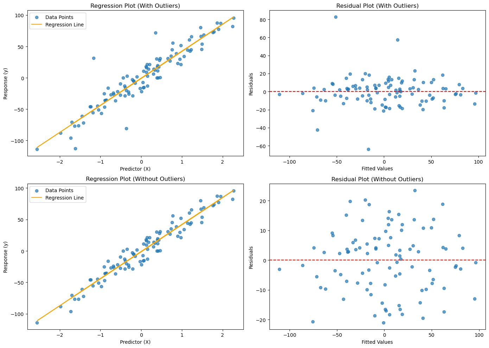

# 다중공선성과 영향점

## 이상점과 영향점 찾아내기

이상점과 영향점은 회귀 결과에 큰 영향을 줄 수 있다. 이들을 이해하는 일은 모형을 다듬는 데 필수적이다.

- **이상점**은 잔차가 유난히 큰 관측값으로, 모형의 예측에서 크게 벗어난다. 자료 기록 오류일 수도 있고 모형이 담지 못한 특수한 조건 때문일 수도 있다.
- **영향점**은 적합된 회귀모형에 지나치게 큰 영향을 주는 관측값이다. 이 점을 빼면 추정된 계수가 크게 달라진다.

## Cook 거리

**Cook 거리**는 잔차(예측값이 실제값에서 얼마나 떨어져 있는가)와 지렛대(설명변수 값이 평균에서 얼마나 떨어져 있는가)를 결합하여 각 관측값이 회귀에 미치는 전반적 영향을 측정한다.

### 정의

각 관측값 $i$에 대해 Cook 거리 $D_i$는

$$
D_i = \frac{\sum_{j=1}^n (\hat{y}_{j} - \hat{y}_{j(i)})^2}{p \cdot s^2}
$$

여기서

- $\hat{y}_j$는 모든 자료를 써서 얻은 $j$번째 관측값의 예측값,
- $\hat{y}_{j(i)}$는 $i$번째 관측값을 뺀 뒤 얻은 $j$번째 관측값의 예측값,
- $p$는 절편을 포함한 추정 모수의 개수,
- $s^2$은 모형의 평균제곱오차이다.

!!! note "이 페이지의 $p$ 표기"
    이 절에서 $p$는 **절편을 포함한 모수의 개수**이다. 단순선형회귀에서는 $p = 2$(기울기 하나 + 절편)이다. 설명변수의 개수만 셀 때와 혼동하지 않도록 주의하라.

### s 제곱의 계산

잔차분산은 분모로 $n - p$를 써서 계산한다.

$$
s^2 = \frac{\sum_{i=1}^n (y_i - \hat{y}_i)^2}{n - p}
$$

이는 모수 $p$개를 추정하면서 잃은 자유도를 반영한다. 단순선형회귀($p = 2$)에서는 $n - 2$가 된다. 다중회귀에서는 추정한 모든 모수를 포함한 $p$를 써서 $n - p$를 쓴다.

### 해석

Cook 거리가 크다는 것은 그 관측값이 큰 잔차와 높은 지렛대를 함께 갖고 있어 적합값에 강한 영향을 준다는 뜻이다. 흔히 쓰는 문턱값은 다음과 같다.

- **$D_i > 4/n$**: 표본크기로 조정한 흔한 경험 법칙이다. $n$이 커지면 문턱값이 작아져 큰 자료에서 영향점을 더 쉽게 탐지한다.
- **$D_i > 1.0$**: 일부 문헌에서 쓰는 더 단순한 고정 문턱값이다.
- **시각적 점검**: Cook 거리 값을 그려 뚜렷이 튀는 관측값을 찾는다.

$4/n$ 문턱값은 실용적인 출발점으로 널리 쓰인다. 자료 크기에 따라 이상점 민감도를 조정해 주지만, 시각적 점검과 분야 지식으로 보완해야 한다.

### 구현: Cook 거리로 이상점 제거하기

```python
import numpy as np
import pandas as pd
import statsmodels.api as sm
import matplotlib.pyplot as plt
from sklearn.datasets import make_regression

# Generate synthetic data
np.random.seed(0)
X, y = make_regression(n_samples=100, n_features=1, noise=10)
data = pd.DataFrame({'X': X.flatten(), 'y': y})

# Add artificial outliers
data.loc[95, 'y'] += 80
data.loc[96, 'y'] -= 80
data.loc[97, 'y'] += 60
data.loc[98, 'y'] -= 60

# Fit model with outliers
X_with_const = sm.add_constant(data['X'])
model = sm.OLS(data['y'], X_with_const).fit()

# Calculate Cook's Distance
influence = model.get_influence()
cooks_d, _ = influence.cooks_distance

# Identify influential points
n = len(data)
threshold = 4 / n
outliers = np.where(cooks_d > threshold)[0]

# Plot: with and without outliers
fig, axes = plt.subplots(2, 2, figsize=(14, 10))

# Row 1: Original data with outliers
axes[0, 0].scatter(data['X'], data['y'], alpha=0.7, label='Data Points')
axes[0, 0].plot(data['X'], model.fittedvalues, color='orange', label='Regression Line')
axes[0, 0].set_title('Regression Plot (With Outliers)')
axes[0, 0].set_xlabel('Predictor (X)')
axes[0, 0].set_ylabel('Response (y)')
axes[0, 0].legend()

axes[0, 1].scatter(model.fittedvalues, model.resid, alpha=0.7)
axes[0, 1].axhline(0, color='red', linestyle='--')
axes[0, 1].set_title('Residual Plot (With Outliers)')
axes[0, 1].set_xlabel('Fitted Values')
axes[0, 1].set_ylabel('Residuals')

# Row 2: Data without outliers
data_no_outliers = data.drop(index=outliers)
X_with_const_no_outliers = sm.add_constant(data_no_outliers['X'])
model_no_outliers = sm.OLS(data_no_outliers['y'], X_with_const_no_outliers).fit()

axes[1, 0].scatter(data_no_outliers['X'], data_no_outliers['y'], alpha=0.7, label='Data Points')
axes[1, 0].plot(data_no_outliers['X'], model_no_outliers.fittedvalues, color='orange', label='Regression Line')
axes[1, 0].set_title('Regression Plot (Without Outliers)')
axes[1, 0].set_xlabel('Predictor (X)')
axes[1, 0].set_ylabel('Response (y)')
axes[1, 0].legend()

axes[1, 1].scatter(model_no_outliers.fittedvalues, model_no_outliers.resid, alpha=0.7)
axes[1, 1].axhline(0, color='red', linestyle='--')
axes[1, 1].set_title('Residual Plot (Without Outliers)')
axes[1, 1].set_xlabel('Fitted Values')
axes[1, 1].set_ylabel('Residuals')

plt.tight_layout()
plt.show()
```



Cook 거리, 지렛값, 스튜던트화 잔차를 함께 그려 어느 관측값이 결과를 좌우하는지 본다.

!!! warning "이상점을 함부로 버리지 말 것"
    위 코드는 방법을 보이기 위해 $D_i > 4/n$인 점을 모두 제거한다. 실무에서는 각 점을 개별적으로 조사해야 한다. 기록 오류라면 고치거나 빼는 것이 옳지만, 타당하지만 극단적인 관측값이라면 남겨 두고 로버스트 회귀를 쓰는 편이 낫다. 이상점을 기계적으로 지우면 잔차가 인위적으로 작아져 모형이 실제보다 좋아 보이게 된다.

## 다중공선성

**다중공선성**은 설명변수들이 서로 강하게 상관되어 있을 때 나타난다. 모형의 전반적인 예측력은 높게 유지되더라도 계수 추정이 불안정해지고 해석하기 어려워진다.

### 다중공선성 탐지

- **조건수**: statsmodels 출력에 표시된다. 30을 넘으면 다중공선성 가능성을, 매우 큰 값(예: $> 1000$)은 심각한 문제를 시사한다. 교호작용 항은 원래의 설명변수와 본질적으로 상관되어 있으므로 조건수를 크게 키우는 일이 많다.
- **분산팽창인자(VIF)**: 다른 설명변수와의 상관 때문에 계수의 분산이 얼마나 부풀려졌는지를 잰다. VIF가 5–10을 넘으면 문제가 되는 다중공선성을 시사한다.
- **상관행렬**: 설명변수 사이의 쌍별 상관을 살피면 강한 선형관계를 발견할 수 있다.

### 다중공선성의 결과

- 계수 추정이 자료의 작은 변화에 민감해진다.
- 계수의 표준오차가 커져 가설검정의 검정력이 떨어진다.
- 모형 전체는 잘 맞는데도 개별 설명변수의 유의성이 가려질 수 있다.
- 모형의 예측 정확도는 대체로 영향을 받지 않지만 개별 계수의 해석은 믿을 수 없게 된다.

### 다중공선성에 대처하기

- **중복된 설명변수 제거**: 두 설명변수가 강하게 상관되어 있으면 하나만 남기는 것을 고려한다.
- **변수 중심화**: 교호작용 항을 만들기 전에 설명변수에서 평균을 빼면 다중공선성이 크게 줄어든다.
- **정칙화**: 릿지 회귀($L_2$ 벌점)는 계수를 0 쪽으로 축소하여 다중공선성에 직접 대처한다.
- **주성분회귀**: PCA로 원래 설명변수에서 무상관 성분을 만들어 쓴다.

## 연습문제

<div class="drillbox" markdown>

**연습문제 1.**
설명변수가 3개이고 관측값이 $n = 50$개인 회귀에서 어떤 관측값의 지렛대가 $h_{ii} = 0.18$이다. 표준 문턱값으로 이것이 높은 지렛대 점인지 판정하고, 높은 지렛대가 기하학적으로 무엇을 뜻하는지 설명하라.

</div>

??? success "풀이"
    절편을 포함한 모수의 개수는 $k = 3 + 1 = 4$이다. 높은 지렛대의 표준 문턱값은 $2k/n = 2 \times 4/50 = 0.16$이다. $h_{ii} = 0.18 > 0.16$이므로 이는 높은 지렛대 점이다.

    (문턱값 $2k/n$은 지렛대의 평균이 정확히 $k/n$이라는 사실에서 온다. $\sum_i h_{ii} = \text{tr}(H) = k$이기 때문이다. 곧 평균의 두 배를 기준으로 삼는 것이다.)

    기하학적으로 지렛대는 어떤 관측값의 설명변수 값이 설명변수 공간의 중심에서 얼마나 떨어져 있는지를 잰다. 지렛대가 높은 점은 $X$ 값들의 평균에서 멀리 떨어져 있어 회귀직선에 불균형하게 큰 영향을 준다. 회귀직선이 그런 점 쪽으로 "끌려간다".

<div class="drillbox" markdown>

**연습문제 2.**
$n = 30$이고 설명변수가 2개인 회귀에서 17번 관측값의 Cook 거리가 $D_{17} = 0.95$이다. 문턱값 $D > 4/n$을 써서 그 영향을 평가하고, 이 관측값을 빼면 회귀가 어떻게 달라질지 기술하라.

</div>

??? success "풀이"
    문턱값은 $4/n = 4/30 = 0.133$이다. $D_{17} = 0.95 \gg 0.133$이므로 이 관측값은 매우 영향력이 크다. 더 단순한 고정 문턱값 $D > 1$에는 조금 못 미치지만 그에 가까운 값이다.

    17번 관측값을 빼면 추정된 회귀계수 $\hat{\beta}$가 상당히 달라진다. 변화의 방향과 크기는 그 관측값이 큰 잔차를 가져 직선을 자기 쪽으로 끌어당기고 있는지, 아니면 현재의 추세 위에 놓여 있는지에 달려 있다. 연구자는 이 점이 자료 오류인지, 다른 모집단에서 온 이상점인지, 타당하지만 극단적인 관측값인지 조사해야 한다.

<div class="drillbox" markdown>

**연습문제 3.**
지렛대($h_{ii}$), 스튜던트화 잔차($r_i$), Cook 거리($D_i$)의 관계를 설명하라. 어떤 관측값이 Cook 거리는 크면서 지렛대는 작을 수 있는가?

</div>

??? success "풀이"
    Cook 거리는 지렛대와 잔차 크기를 결합한다. 절편을 포함한 모수의 개수를 $k$라 하면

    $$
    D_i = \frac{r_i^2}{k} \cdot \frac{h_{ii}}{1 - h_{ii}}
    $$

    여기서 $r_i$는 내부 스튜던트화 잔차, $h_{ii}$는 지렛대이다.

    스튜던트화 잔차가 아주 크면(설명변수 공간의 중심 근처에 있는 뚜렷한 이상점) 지렛대가 중간 정도여도 $D_i$가 클 수 있다. 그러나 실무에서 정말로 큰 Cook 거리는 대개 최소한 중간 이상의 지렛대를 동반한다. $X$의 중심 근처에 있는 관측값은 잔차가 커도 회귀직선 전체를 움직이는 힘이 제한적이기 때문이다. 위 공식에서 $h_{ii} \to 0$이면 인자 $h_{ii}/(1-h_{ii}) \to 0$이 되어 $D_i$도 0으로 간다는 점이 이를 보여준다.
