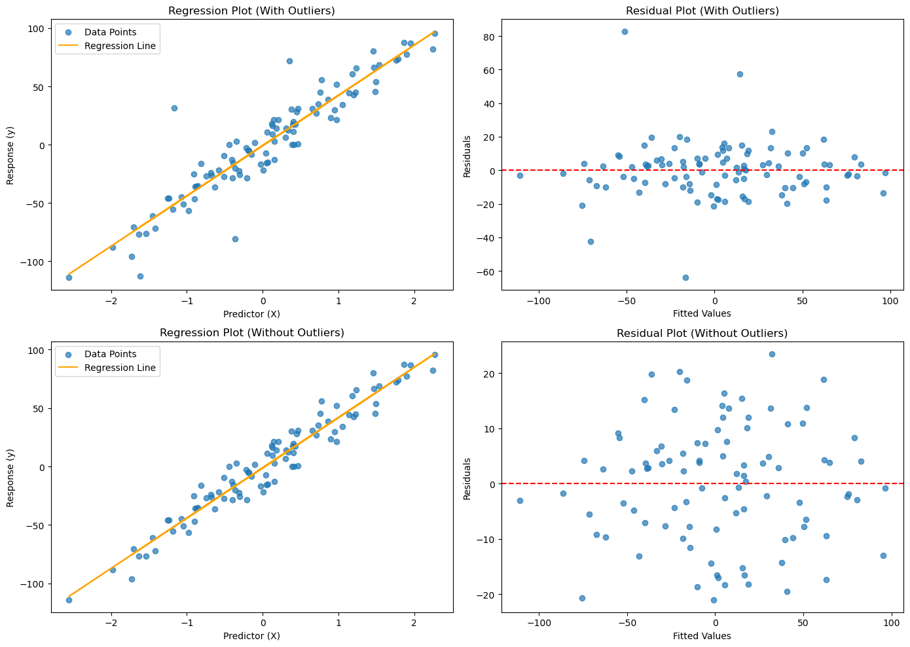

# 다중공선성과 영향점

## 이상점과 영향점 찾아내기

이상점과 영향점은 회귀 결과에 큰 영향을 줄 수 있다. 이들을 이해하는 일은 모형을 다듬는 데 필수적이다.

- **이상점**은 잔차가 유난히 큰 관측값으로, 모형의 예측에서 크게 벗어난다. 자료 기록 오류일 수도 있고 모형이 담지 못한 특수한 조건 때문일 수도 있다.
- **영향점**은 적합된 회귀모형에 지나치게 큰 영향을 주는 관측값이다. 이 점을 빼면 추정된 계수가 크게 달라진다.

## Cook 거리

**Cook 거리**는 잔차(예측값이 실제값에서 얼마나 떨어져 있는가)와 지렛대(설명변수 값이 평균에서 얼마나 떨어져 있는가)를 결합하여 각 관측값이 회귀에 미치는 전반적 영향을 측정한다.

<div class="defn" markdown>

### 정의 1. Cook 거리 { .dfn }

각 관측값 $i$에 대해 Cook 거리 $D_i$는

$$
D_i = \frac{\sum_{j=1}^n (\hat{y}_{j} - \hat{y}_{j(i)})^2}{p \cdot s^2}
$$

여기서

- $\hat{y}_j$는 모든 자료를 써서 얻은 $j$번째 관측값의 예측값,
- $\hat{y}_{j(i)}$는 $i$번째 관측값을 뺀 뒤 얻은 $j$번째 관측값의 예측값,
- $p$는 절편을 포함한 추정 모수의 개수,
- $s^2$은 모형의 평균제곱오차이다.

</div>

!!! note "이 페이지의 $p$ 표기"
    이 절에서 $p$는 **절편을 포함한 모수의 개수**이다. 단순선형회귀에서는 $p = 2$(기울기 하나 + 절편)이다. 설명변수의 개수만 셀 때와 혼동하지 않도록 주의하라.

### s 제곱의 계산

잔차분산은 분모로 $n - p$를 써서 계산한다.

$$
s^2 = \frac{\sum_{i=1}^n (y_i - \hat{y}_i)^2}{n - p}
$$

이는 모수 $p$개를 추정하면서 잃은 자유도를 반영한다. 단순선형회귀($p = 2$)에서는 $n - 2$가 된다. 다중회귀에서는 추정한 모든 모수를 포함한 $p$를 써서 $n - p$를 쓴다.

### 해석

Cook 거리가 크다는 것은 그 관측값이 큰 잔차와 높은 지렛대를 함께 갖고 있어 적합값에 강한 영향을 준다는 뜻이다. 흔히 쓰는 문턱값은 다음과 같다.

- **$D_i > 4/n$**: 표본크기로 조정한 흔한 경험 법칙이다. $n$이 커지면 문턱값이 작아져 큰 자료에서 영향점을 더 쉽게 탐지한다.
- **$D_i > 1.0$**: 일부 문헌에서 쓰는 더 단순한 고정 문턱값이다.
- **시각적 점검**: Cook 거리 값을 그려 뚜렷이 튀는 관측값을 찾는다.

$4/n$ 문턱값은 실용적인 출발점으로 널리 쓰인다. 자료 크기에 따라 이상점 민감도를 조정해 주지만, 시각적 점검과 분야 지식으로 보완해야 한다.

### 구현: Cook 거리로 이상점 제거하기

<div class="exbox" markdown>

**보기 1.** <span class="diff easy" title="쉬움"></span> 이상치를 넣고 뺀 회귀 비교. 깨끗한 선형 자료에 $y$값만 $+80, -80, +60, -60$으로 넷을 흔들어 심는다.

**(1)** 관측 $i$의 $y$를 $\delta_i$만큼 바꾸면 단순회귀의 계수가 **정확히**

$$
\Delta\hat\beta_1 = \sum_i c_i \delta_i\ \ \Big(c_i = \tfrac{x_i-\bar x}{S_{xx}}\Big),
\qquad
\Delta\hat\beta_0 = \bar\delta - \bar x\,\Delta\hat\beta_1
$$

만큼 움직임을 보이시오. 교란을 **위아래로 짝지어** 넣으면 기울기가 거의 움직이지 않는 까닭도 밝히시오.

**(2)** 공식을 확인하고, Cook 거리가 심은 넷을 정확히 집어내는지, 그것을 빼면 무엇이 회복되는지 보시오.

</div>

??? success "풀이"

    **(1) 해석적으로.** OLS 추정량 $\hat{\boldsymbol\beta} = (X^\top X)^{-1}X^\top \mathbf y$는 $\mathbf y$의 **선형함수**다. 그러므로 $\mathbf y \to \mathbf y + \boldsymbol\delta$로 바꾸면

    $$
    \Delta\hat{\boldsymbol\beta} = (X^\top X)^{-1}X^\top \boldsymbol\delta
    $$

    로 변화량이 정확히 적힌다. 자료의 나머지 부분은 전혀 들어오지 않는다. 단순회귀에서 이것을 성분으로 풀어쓰면 [13.1절 보기 1](../assumptions/checking_normality.md)에서 본 $\hat\beta_1 = \sum_i c_i y_i$에서

    $$
    \Delta\hat\beta_1 = \sum_i c_i \delta_i,
    \qquad
    \Delta\hat\beta_0 = \overline{(y+\delta)} - (\hat\beta_1 + \Delta\hat\beta_1)\bar x - (\bar y - \hat\beta_1 \bar x) = \bar\delta - \bar x\,\Delta\hat\beta_1
    $$

    이다.

    **짝지어 넣으면 왜 기울기가 덜 움직이는가.** 크기가 같고 부호가 반대인 두 교란 $+a$(관측 $j$)와 $-a$(관측 $k$)를 생각하자. 그 몫은

    $$
    a\,c_j - a\,c_k = \frac{a\big[(x_j - \bar x) - (x_k - \bar x)\big]}{S_{xx}} = \frac{a\,(x_j - x_k)}{S_{xx}}
    $$

    로 **$\bar x$가 사라지고 두 $x$의 차이만 남는다.** 두 점의 $x$가 가까우면 기여가 거의 0이다. 절편 쪽에서는 $\bar\delta = 0$이 되어 더욱 그렇다.

    **그렇다고 해가 없는 것은 아니다.** 계수는 멀쩡해도 잔차제곱합은 반드시 커지고, 그러면 $\hat\sigma$가 부풀어 모든 표준오차와 구간이 함께 부푼다. **"기울기가 안 움직였으니 괜찮다"가 아니라 "추정의 정밀도를 잃었다"로 읽어야 한다.**

    ```python
    import numpy as np
    import pandas as pd
    import statsmodels.api as sm
    import matplotlib.pyplot as plt
    from sklearn.datasets import make_regression

    # 깨끗한 선형 자료를 먼저 만든다.
    np.random.seed(0)
    X, y = make_regression(n_samples=100, n_features=1, noise=10)
    data = pd.DataFrame({'X': X.flatten(), 'y': y})

    # 여기에 이상치 넷을 일부러 심는다. 위아래로 짝을 맞춰 넣었으므로
    # 기울기보다는 잔차의 퍼짐이 크게 흔들린다.
    data.loc[95, 'y'] += 80
    data.loc[96, 'y'] -= 80
    data.loc[97, 'y'] += 60
    data.loc[98, 'y'] -= 60

    # 이상치가 든 채로 적합한다.
    X_with_const = sm.add_constant(data['X'])
    model = sm.OLS(data['y'], X_with_const).fit()

    # Cook 의 거리는 그 관측값 하나를 뺐을 때 적합값 전체가 얼마나 움직이는지를
    # 잰다. 잔차가 크다고 다 영향점인 것은 아니다 — 지렛값도 함께 커야 한다.
    influence = model.get_influence()
    cooks_d, _ = influence.cooks_distance

    # 4/n 은 널리 쓰이는 어림 기준일 뿐 검정이 아니다.
    n = len(data)
    threshold = 4 / n
    outliers = np.where(cooks_d > threshold)[0]

    # 이상치가 있을 때와 없을 때를 나란히 그린다
    fig, axes = plt.subplots(2, 2, figsize=(14, 10))

    # 윗줄: 이상치가 든 자료. 회귀선과 잔차 그림을 나란히 본다.
    axes[0, 0].scatter(data['X'], data['y'], alpha=0.7, label='Data Points')
    axes[0, 0].plot(data['X'], model.fittedvalues, color='orange', label='Regression Line')
    axes[0, 0].set_title('Regression Plot (With Outliers)')
    axes[0, 0].set_xlabel('Predictor (X)')
    axes[0, 0].set_ylabel('Response (y)')
    axes[0, 0].legend()

    axes[0, 1].scatter(model.fittedvalues, model.resid, alpha=0.7)
    axes[0, 1].axhline(0, color='red', linestyle='--')
    axes[0, 1].set_title('Residual Plot (With Outliers)')
    axes[0, 1].set_xlabel('Fitted Values')
    axes[0, 1].set_ylabel('Residuals')

    # 아랫줄: 문턱을 넘은 관측값을 뺀 뒤 다시 적합한 결과다.
    # 두 줄을 견주는 것이 이 그림의 목적이지, 이상치를 지우라는 뜻이 아니다.
    # 지울지 말지는 그 값이 왜 생겼는지를 알아본 뒤에 정할 일이다.
    data_no_outliers = data.drop(index=outliers)
    X_with_const_no_outliers = sm.add_constant(data_no_outliers['X'])
    model_no_outliers = sm.OLS(data_no_outliers['y'], X_with_const_no_outliers).fit()

    axes[1, 0].scatter(data_no_outliers['X'], data_no_outliers['y'], alpha=0.7, label='Data Points')
    axes[1, 0].plot(data_no_outliers['X'], model_no_outliers.fittedvalues, color='orange', label='Regression Line')
    axes[1, 0].set_title('Regression Plot (Without Outliers)')
    axes[1, 0].set_xlabel('Predictor (X)')
    axes[1, 0].set_ylabel('Response (y)')
    axes[1, 0].legend()

    axes[1, 1].scatter(model_no_outliers.fittedvalues, model_no_outliers.resid, alpha=0.7)
    axes[1, 1].axhline(0, color='red', linestyle='--')
    axes[1, 1].set_title('Residual Plot (Without Outliers)')
    axes[1, 1].set_xlabel('Fitted Values')
    axes[1, 1].set_ylabel('Residuals')

    plt.tight_layout()
    plt.show()
    ```

    

    윗줄이 이상치가 든 자료, 아랫줄이 뺀 자료다. 왼쪽은 회귀 그림, 오른쪽은 잔차 그림이다. 이제 (1)의 공식과 맞춰 본다.

    ```python
    import numpy as np
    import pandas as pd
    import statsmodels.api as sm
    from sklearn.datasets import make_regression

    # 교란하기 전의 적합
    np.random.seed(0)
    X0, y0 = make_regression(n_samples=100, n_features=1, noise=10)
    clean = sm.OLS(y0, sm.add_constant(X0)).fit()

    x = data['X'].values
    xbar, Sxx = x.mean(), ((x - x.mean()) ** 2).sum()
    c = (x - xbar) / Sxx
    delta = np.zeros(len(x))
    delta[[95, 96, 97, 98]] = [80, -80, 60, -60]

    print(f"S_xx = {Sxx:.4f}")
    print(f"공식  d_beta1 = sum c_i delta_i = {(c * delta).sum():.12f}")
    print(f"실제        = {model.params.iloc[1] - clean.params[1]:.12f}")
    print(f"공식  d_beta0 = {delta.mean() - xbar * (c * delta).sum():.12f}")
    print(f"실제        = {model.params.iloc[0] - clean.params[0]:.12f}")

    # 짝을 이루면 x 의 차만 남는다
    print(f"\n두 쌍의 기여:  80(x95 - x96)/S_xx = "
          f"{80 * (x[95] - x[96]) / Sxx:+.4f},  60(x97 - x98)/S_xx = "
          f"{60 * (x[97] - x[98]) / Sxx:+.4f}")

    print(f"\n{'':>12}{'절편':>10}{'기울기':>10}{'sigma_hat':>12}{'R^2':>9}")
    for name, m in [('교란 전', clean), ('교란 후', model), ('제거 후', model_no_outliers)]:
        b0, b1 = np.asarray(m.params)
        print(f"{name:>12}{b0:>10.4f}{b1:>10.4f}"
              f"{np.sqrt(m.mse_resid):>12.4f}{m.rsquared:>9.4f}")

    print(f"\nCook 문턱 {threshold} 을 넘은 관측 = {list(outliers)}")
    print(f"다섯째로 큰 Cook 거리 = {np.sort(cooks_d)[-5]:.4f}")
    ```

    출력:

    ```
    S_xx = 101.5827
    공식  d_beta1 = sum c_i delta_i = 0.531814777033
    실제        = 0.531814777033
    공식  d_beta0 = -0.031806786446
    실제        = -0.031806786446

    두 쌍의 기여:  80(x95 - x96)/S_xx = -0.6319,  60(x97 - x98)/S_xx = +1.1637

                        절편       기울기   sigma_hat      R^2
            교란 전   -0.8142   42.6194     10.7936   0.9417
            교란 후   -0.8460   43.1512     16.5534   0.8757
            제거 후   -1.1852   43.0230     10.7420   0.9430

    Cook 문턱 0.04 을 넘은 관측 = [95, 96, 97, 98]
    다섯째로 큰 Cook 거리 = 0.0355
    ```

    **공식이 소수점 열두째 자리까지 맞는다.** 기울기 변화 $0.531814777033$, 절편 변화 $-0.031806786446$이 공식과 실제에서 같다. 선형성이므로 당연하지만, **"이 관측을 이만큼 바꾸면 계수가 얼마나 움직이나"를 재적합 없이 답할 수 있다**는 뜻이다.

    **짝지음이 실제로 들었다.** 두 쌍의 기여가 $-0.6319$와 $+1.1637$로 서로 어긋나 합이 $0.5318$이 되었다. 기울기 $42.62$에 견주면 $1.2\%$다. $320$만큼의 교란을 심었는데도 그 정도다.

    **대신 $\hat\sigma$가 무너졌다.** $10.79$에서 $16.55$로 **$53\%$ 커지고** $R^2$이 $0.9417$에서 $0.8757$로 떨어진다. (1)에서 말한 "계수는 멀쩡해도 정밀도를 잃는다"가 이 두 수다. 표준오차가 $1.53$배가 되었으니 신뢰구간도 그만큼 넓어진다.

    **Cook 거리가 심은 넷을 정확히 집어낸다.** 문턱 $4/n = 0.04$를 넘은 것이 $[95, 96, 97, 98]$ 넷뿐이고, 다섯째로 큰 Cook 거리는 $0.0355$로 문턱 아래다. 거짓 양성도 거짓 음성도 없다.

    **빼면 $\hat\sigma$가 돌아온다.** $16.55 \to 10.74$로 교란 전의 $10.79$와 사실상 같다. 기울기가 $43.02$로 교란 전의 $42.62$와 완전히 같지는 않은데, 이는 교란을 덜 지웠기 때문이 아니라 **멀쩡한 관측 넷을 함께 잃었기 때문**이다. 제거 뒤의 적합은 손대지 않은 $96$개에 대한 적합과 정확히 같고, 표본이 $100$개에서 $96$개로 줄었으니 추정값이 그만큼 흔들린다.

    **이 보기가 성공한 것은 심은 값을 우리가 알기 때문이다.** 실제 자료에서는 어느 점이 "심어진" 것인지 알 수 없다. 아래 상자가 그 점을 경고한다.

!!! warning "이상점을 함부로 버리지 말 것"
    위 코드는 방법을 보이기 위해 $D_i > 4/n$인 점을 모두 제거한다. 실무에서는 각 점을 개별적으로 조사해야 한다. 기록 오류라면 고치거나 빼는 것이 옳지만, 타당하지만 극단적인 관측값이라면 남겨 두고 로버스트 회귀를 쓰는 편이 낫다. 이상점을 기계적으로 지우면 잔차가 인위적으로 작아져 모형이 실제보다 좋아 보이게 된다.

## 다중공선성

**다중공선성**은 설명변수들이 서로 강하게 상관되어 있을 때 나타난다. 모형의 전반적인 예측력은 높게 유지되더라도 계수 추정이 불안정해지고 해석하기 어려워진다.

### 다중공선성 탐지

- **조건수**: statsmodels 출력에 표시된다. 30을 넘으면 다중공선성 가능성을, 매우 큰 값(예: $> 1000$)은 심각한 문제를 시사한다. 교호작용 항은 원래의 설명변수와 본질적으로 상관되어 있으므로 조건수를 크게 키우는 일이 많다.
- **분산팽창인자(VIF)**: 다른 설명변수와의 상관 때문에 계수의 분산이 얼마나 부풀려졌는지를 잰다. VIF가 5–10을 넘으면 문제가 되는 다중공선성을 시사한다.
- **상관행렬**: 설명변수 사이의 쌍별 상관을 살피면 강한 선형관계를 발견할 수 있다.

### 다중공선성의 결과

- 계수 추정이 자료의 작은 변화에 민감해진다.
- 계수의 표준오차가 커져 가설검정의 검정력이 떨어진다.
- 모형 전체는 잘 맞는데도 개별 설명변수의 유의성이 가려질 수 있다.
- 모형의 예측 정확도는 대체로 영향을 받지 않지만 개별 계수의 해석은 믿을 수 없게 된다.

### 다중공선성에 대처하기

- **중복된 설명변수 제거**: 두 설명변수가 강하게 상관되어 있으면 하나만 남기는 것을 고려한다.
- **변수 중심화**: 교호작용 항을 만들기 전에 설명변수에서 평균을 빼면 다중공선성이 크게 줄어든다.
- **정칙화**: 릿지 회귀($L_2$ 벌점)는 계수를 0 쪽으로 축소하여 다중공선성에 직접 대처한다.
- **주성분회귀**: PCA로 원래 설명변수에서 무상관 성분을 만들어 쓴다.

## 연습문제

<div class="drillbox" markdown>

**연습문제 1.** <span class="diff easy" title="쉬움"></span>
설명변수가 3개이고 관측값이 $n = 50$개인 회귀에서 어떤 관측값의 지렛대가 $h_{ii} = 0.18$이다. 표준 문턱값으로 이것이 높은 지렛대 점인지 판정하고, 높은 지렛대가 기하학적으로 무엇을 뜻하는지 설명하라.

</div>

??? success "풀이"
    절편을 포함한 모수의 개수는 $k = 3 + 1 = 4$이다. 높은 지렛대의 표준 문턱값은 $2k/n = 2 \times 4/50 = 0.16$이다. $h_{ii} = 0.18 > 0.16$이므로 이는 높은 지렛대 점이다.

    (문턱값 $2k/n$은 지렛대의 평균이 정확히 $k/n$이라는 사실에서 온다. $\sum_i h_{ii} = \text{tr}(H) = k$이기 때문이다. 곧 평균의 두 배를 기준으로 삼는 것이다.)

    기하학적으로 지렛대는 어떤 관측값의 설명변수 값이 설명변수 공간의 중심에서 얼마나 떨어져 있는지를 잰다. 지렛대가 높은 점은 $X$ 값들의 평균에서 멀리 떨어져 있어 회귀직선에 불균형하게 큰 영향을 준다. 회귀직선이 그런 점 쪽으로 "끌려간다".

<div class="drillbox" markdown>

**연습문제 2.** <span class="diff easy" title="쉬움"></span>
$n = 30$이고 설명변수가 2개인 회귀에서 17번 관측값의 Cook 거리가 $D_{17} = 0.95$이다. 문턱값 $D > 4/n$을 써서 그 영향을 평가하고, 이 관측값을 빼면 회귀가 어떻게 달라질지 기술하라.

</div>

??? success "풀이"
    문턱값은 $4/n = 4/30 = 0.133$이다. $D_{17} = 0.95 \gg 0.133$이므로 이 관측값은 매우 영향력이 크다. 더 단순한 고정 문턱값 $D > 1$에는 조금 못 미치지만 그에 가까운 값이다.

    17번 관측값을 빼면 추정된 회귀계수 $\hat{\beta}$가 상당히 달라진다. 변화의 방향과 크기는 그 관측값이 큰 잔차를 가져 직선을 자기 쪽으로 끌어당기고 있는지, 아니면 현재의 추세 위에 놓여 있는지에 달려 있다. 연구자는 이 점이 자료 오류인지, 다른 모집단에서 온 이상점인지, 타당하지만 극단적인 관측값인지 조사해야 한다.

<div class="drillbox" markdown>

**연습문제 3.** <span class="diff med" title="중간"></span>
지렛대($h_{ii}$), 스튜던트화 잔차($r_i$), Cook 거리($D_i$)의 관계를 설명하라. 어떤 관측값이 Cook 거리는 크면서 지렛대는 작을 수 있는가?

</div>

??? success "풀이"
    Cook 거리는 지렛대와 잔차 크기를 결합한다. 절편을 포함한 모수의 개수를 $k$라 하면

    $$
    D_i = \frac{r_i^2}{k} \cdot \frac{h_{ii}}{1 - h_{ii}}
    $$

    여기서 $r_i$는 내부 스튜던트화 잔차, $h_{ii}$는 지렛대이다.

    스튜던트화 잔차가 아주 크면(설명변수 공간의 중심 근처에 있는 뚜렷한 이상점) 지렛대가 중간 정도여도 $D_i$가 클 수 있다. 그러나 실무에서 정말로 큰 Cook 거리는 대개 최소한 중간 이상의 지렛대를 동반한다. $X$의 중심 근처에 있는 관측값은 잔차가 커도 회귀직선 전체를 움직이는 힘이 제한적이기 때문이다. 위 공식에서 $h_{ii} \to 0$이면 인자 $h_{ii}/(1-h_{ii}) \to 0$이 되어 $D_i$도 0으로 간다는 점이 이를 보여준다.

---

## 정리하며

**이상점과 영향점은 다르다.**

| | 무엇이 특이한가 | 결과에 미치는 영향 |
|---|---|---|
| 이상점 | $y$ 값 (큰 잔차) | 반드시 크지는 않음 |
| 지렛점 | $x$ 값 (큰 $h_{ii}$) | 반드시 크지는 않음 |
| **영향점** | 둘의 조합 | **크다** |

- **둘 다여야 위험하다.** $x$ 가 극단이지만 직선 위에 있으면 영향이 작고, 잔차가 크지만 $x$ 가 중심 근처면 역시 작다. **극단적인 $x$ 에서 크게 벗어난 점**이 계수를 끌고 간다.
- **쿡 거리가 그 둘을 합친 척도다.** 그 점을 뺐을 때 적합값 전체가 얼마나 움직이는지를 재며, $D_i>1$ 또는 $4/n$ 을 기준으로 삼는다.
- **모자값 $h_{ii}$ 가 지렛대를 잰다.** 합이 $p+1$ 이므로 평균이 $(p+1)/n$ 이고, 그 두세 배를 넘으면 주목한다.
- **DFFITS 와 DFBETAS 가 더 세밀하다.** 앞의 것은 예측값의 변화, 뒤의 것은 **개별 계수**의 변화를 본다.
- **찾았다고 지우지 않는다.** 원인을 확인하고, 지운 경우와 아닌 경우를 모두 보고하는 민감도 분석이 정직한 방법이다.

다음 절 **다중회귀 진단**으로 넘어간다.
