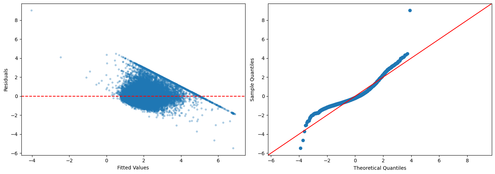
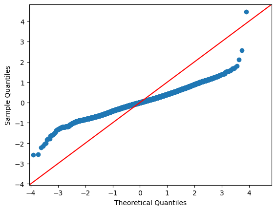

# 다중회귀 진단

## 개요

이 페이지는 다중선형회귀 진단을 종합적으로 따라가 본다. California Housing 자료로 모형을 적합하고, 분산팽창인자(VIF)로 다중공선성을 확인하고, 잔차 분석을 수행하고, Cook 거리로 영향점을 찾고, AIC와 BIC로 모형을 비교하며, 로그 변환·교호작용 항·다항회귀 같은 확장을 살펴본다.

## 수학적 배경

### 분산팽창인자

설명변수 $j$에 대해 VIF는 다른 설명변수와의 상관 때문에 $\hat{\beta}_j$의 분산이 얼마나 부풀려졌는지를 잰다.

$$
\mathrm{VIF}_j = \frac{1}{1 - R_j^2},
$$

여기서 $R_j^2$는 $x_j$를 나머지 모든 설명변수에 회귀시켰을 때의 $R^2$이다. VIF가 5–10을 넘으면 문제가 되는 다중공선성을 나타낸다.

### 잔차 진단

관측값 $i$의 표준화 잔차는

$$
r_i = \frac{e_i}{s\sqrt{1 - h_{ii}}},
$$

여기서 $h_{ii}$는 모자행렬 $\mathbf{H} = \mathbf{X}(\mathbf{X}^\top\mathbf{X})^{-1}\mathbf{X}^\top$의 $i$번째 대각원소이다.

### Cook 거리

Cook 거리는 $i$번째 관측값이 모든 적합값에 미치는 영향을 잰다.

$$
D_i = \frac{r_i^2}{k} \cdot \frac{h_{ii}}{1 - h_{ii}},
$$

여기서 $k$는 모수의 개수이다. $D_i > 4/n$인 관측값을 영향점으로 본다.

### 정보기준

$$
\mathrm{AIC} = n \ln(\mathrm{RSS}/n) + 2k, \qquad \mathrm{BIC} = n \ln(\mathrm{RSS}/n) + k \ln(n).
$$

$n > e^2 \approx 7.4$이면 BIC가 AIC보다 모형 복잡도에 더 무거운 벌점을 준다.

!!! note "statsmodels의 AIC와 위 공식은 상수만큼 다르다"
    위 공식은 모형 비교에 영향을 주지 않는 상수 $n\ln(2\pi) + n$을 뺀 간이형이다. `results.aic`는 $-2\ln L + 2k$를 그대로 계산하므로 절댓값이 다르다. 모형들 사이의 **차이**는 같으므로 비교 결과는 동일하다.

### 적합과 VIF 계산

<div class="exbox" markdown>

**보기 1.** <span class="diff easy" title="쉬움"></span> VIF로 다중공선성 보기

**(1)** 설명변수들의 **표본상관행렬** $R$에 대해

$$
\mathrm{VIF}_j = \big(R^{-1}\big)_{jj}
$$

임을 보이시오. 곧 VIF 전체를 보조회귀 $p$번 없이 **역행렬 한 번으로** 얻을 수 있다.

**(2)** 세 설명변수의 상관행렬을 뒤집어 (1)을 확인하시오.

</div>

??? success "풀이"

    **(1) 해석적으로.** 설명변수를 중심화한 행렬을 $X_c$라 하면 상수항과 분리되어

    $$
    \operatorname{Var}(\hat{\boldsymbol\beta}_{\text{기울기}}) = \sigma^2 (X_c^\top X_c)^{-1}
    $$

    이다. 여기서 $X_c^\top X_c = (n-1)\,D R D$로 적힌다. $D = \operatorname{diag}(s_1, \ldots, s_p)$는 표준편차의 대각행렬이고 $R$은 상관행렬이다. 역을 취하면

    $$
    (X_c^\top X_c)^{-1} = \frac{1}{n-1}\,D^{-1}R^{-1}D^{-1}
    $$

    이므로 $j$번째 대각원소가

    $$
    \big[(X_c^\top X_c)^{-1}\big]_{jj} = \frac{(R^{-1})_{jj}}{(n-1)s_j^2} = \frac{(R^{-1})_{jj}}{S_{jj}}
    $$

    이다($S_{jj} = (n-1)s_j^2 = \sum_i (x_{ij}-\bar x_j)^2$). 한편 VIF의 정의가 주는 식은

    $$
    \operatorname{Var}(\hat\beta_j) = \frac{\sigma^2}{S_{jj}(1-R_j^2)} = \frac{\sigma^2}{S_{jj}}\,\mathrm{VIF}_j
    $$

    이므로 두 식을 맞대면

    $$
    \mathrm{VIF}_j = \frac{1}{1-R_j^2} = \big(R^{-1}\big)_{jj}
    $$

    를 얻는다.

    **쓸모가 둘이다.** 첫째, 계산이 싸다. $p$번의 보조회귀 대신 $p \times p$ 역행렬 하나면 된다. 둘째, **VIF가 설명변수들의 상관구조만으로 정해진다**는 것이 분명해진다. 반응변수 $y$는 이 식 어디에도 들어오지 않는다. 공선성이 "모형의 문제가 아니라 자료의 문제"라는 말의 정확한 내용이다.

    상관행렬이 단위행렬에 가까우면 $R^{-1}$도 단위행렬에 가까워 모든 VIF가 $1$ 근처가 되고, $R$이 특이에 가까워지면 $R^{-1}$의 대각이 폭발한다.

    **(2) 수치적으로.**

    ```python
    import numpy as np
    import pandas as pd
    import statsmodels.api as sm
    from statsmodels.api import OLS, add_constant
    from statsmodels.stats.outliers_influence import variance_inflation_factor
    from sklearn.datasets import fetch_california_housing

    housing = fetch_california_housing()
    df = pd.DataFrame(housing.data, columns=housing.feature_names)
    df['PRICE'] = housing.target

    # 설명변수 셋으로 시작한다. 뒤에서 변수를 늘려 가며 견줄 것이다.
    features = ['MedInc', 'AveRooms', 'AveOccup']
    X = add_constant(df[features])
    y = df['PRICE']

    model = OLS(y, X).fit()

    # 분산팽창인자(VIF)는 그 변수를 나머지 변수들로 회귀했을 때의 R^2 로
    # 정해진다. VIF = 1/(1-R^2) 이므로, 다른 변수들로 잘 설명될수록 커진다.
    # 보통 5 나 10 을 넘으면 다중공선성을 의심한다. 상수항은 셈에서 뺀다.
    vif_data = pd.DataFrame()
    vif_data['Feature'] = X.columns[1:]
    vif_data['VIF'] = [variance_inflation_factor(X.values, i)
                       for i in range(1, X.shape[1])]
    print(vif_data)
    ```

    출력:

    ```
        Feature       VIF
    0    MedInc  1.120166
    1  AveRooms  1.119797
    2  AveOccup  1.000488
    ```

    상관행렬을 뒤집어 (1)과 맞춘다.

    ```python
    import numpy as np

    R = df[features].corr().values
    print("상관행렬 R:")
    print(np.round(R, 4))
    print("\nR^-1 의 대각 =", np.round(np.diag(np.linalg.inv(R)), 6))
    print("variance_inflation_factor =",
          np.round([variance_inflation_factor(X.values, i) for i in range(1, X.shape[1])], 6))
    print(f"\n이 모형의 R^2 = {model.rsquared:.4f}")
    ```

    출력:

    ```
    상관행렬 R:
    [[ 1.      0.3269  0.0188]
     [ 0.3269  1.     -0.0049]
     [ 0.0188 -0.0049  1.    ]]

    R^-1 의 대각 = [1.120166 1.119797 1.000488]
    variance_inflation_factor = [1.120166 1.119797 1.000488]

    이 모형의 R^2 = 0.4808
    ```

    **$R^{-1}$의 대각이 VIF와 소수점 여섯째 자리까지 같다.** 보조회귀를 세 번 돌린 결과가 $3\times3$ 역행렬 하나에서 그대로 나온다.

    **세 VIF가 모두 $1.1$ 근처다.** 상관행렬을 보면 까닭이 분명하다. 가장 큰 비대각 원소가 MedInc–AveRooms의 $0.327$이고 나머지 둘은 $0.02$ 아래다. 소득이 높은 동네의 집이 방이 많다는 것은 자연스럽지만 그 상관이 강하지 않다.

    두 변수만 있었다면 VIF가 정확히 $1/(1-0.3269^2) = 1.1197$이었을 것이다. 실제 값이 MedInc에서 $1.1202$, AveRooms에서 $1.1198$로 **그 값보다 아주 조금 크다.** AveOccup이 끼어 각각 $0.0188$과 $-0.0049$만큼 보태기 때문인데, 보탬이 거의 없어 소수점 셋째 자리에서만 보인다. [13.6절 보기 3](multicollinearity.md)에서 Latitude·Longitude가 두 변수 공식 $6.897$에서 실제 $8.18$까지 간 것과 견주면 차이가 분명하다.

    이 모형의 $R^2$는 $0.4808$이다. 공선성이 없다는 것과 설명력이 좋다는 것은 **별개**이며, VIF 식에 $y$가 들어 있지 않다는 (1)의 관찰이 그것을 말해 준다.

### 잔차 분석

<div class="exbox" markdown>

**보기 2.** <span class="diff easy" title="쉬움"></span> 잔차 진단 그림. 이 자료의 반응변수 `PRICE`는 $5.00001$(50만 달러)에서 **잘려 있다.** 그보다 비싼 집이 모두 그 값으로 기록되어 있다.

**(1)** 잘린 관측에서는 $y_i = c$로 고정되므로 잔차가 $e_i = c - \hat y_i$다. 그러므로 잔차 그림에서 그 점들이 **기울기 정확히 $-1$인 직선** 위에 놓임을 보이시오. 그 직선의 절편은 무엇인가.

**(2)** 그림을 그려 확인하고, 잔차의 왜도·첨도를 재시오. 오른쪽 Q-Q 그림의 `line='45'`가 이 자료에 적절한가.

</div>

??? success "풀이"

    **(1) 해석적으로.** 잘린 값을 $c = 5.00001$이라 하자. 그 관측들에서는 $y_i = c$이므로

    $$
    e_i = y_i - \hat y_i = c - \hat y_i
    $$

    이다. 가로축이 $\hat y_i$, 세로축이 $e_i$인 그림에서 이것은

    $$
    e = -\hat y + c
    $$

    곧 **기울기 $-1$, 절편 $c = 5.00001$인 직선**이다. 근사가 아니라 항등식이고, 잘린 점이 몇 개든 전부 그 직선 위에 정확히 놓인다.

    **잔차 그림의 가장 눈에 띄는 무늬가 모형의 문제가 아니라 자료 기록 방식에서 온다는 뜻**이다. 적합값이 큰 쪽(오른쪽)에서는 그 직선이 0 아래로 내려가고, 적합값이 작은 쪽에서는 위로 올라간다. 모형이 저평가한 비싼 집일수록 잔차가 크게 양수가 되므로 **오른쪽 위로 뻗는 사선**이 생긴다.

    이 직선은 등분산성이나 선형성에 대해 아무것도 말해 주지 않는다. 그런데 그림만 보면 "오른쪽에서 분산이 커진다"거나 "곡선 추세가 있다"로 오독하기 쉽다. **진단 그림에서 무늬를 보면 먼저 자료의 기록 방식을 의심해야 하는 이유다.**

    **(2) 수치적으로.**

    ```python
    y_pred = model.predict(X)
    residuals = y - y_pred

    # 왼쪽은 등분산성, 오른쪽은 정규성을 본다. 이 자료는 집값이 50만 달러에서
    # 잘려 있어 잔차 그림 오른쪽에 뚜렷한 사선이 생긴다.
    import matplotlib.pyplot as plt
    fig, axes = plt.subplots(1, 2, figsize=(14, 5))
    axes[0].scatter(y_pred, residuals, alpha=0.3, s=10)
    axes[0].axhline(y=0, color='red', linestyle='--')
    axes[0].set_xlabel('Fitted Values')
    axes[0].set_ylabel('Residuals')

    # line='45' 는 기울기 1 의 기준선이다. 표준화하지 않은 잔차에 쓰면
    # 점들이 그 선에서 벗어나 보이므로, 척도까지 맞추려면 line='s' 를 쓴다.
    sm.qqplot(residuals, line='45', ax=axes[1])
    plt.tight_layout()
    plt.show()
    ```

    

    왼쪽이 잔차 대 적합값, 오른쪽이 Q-Q 그림이다. (1)이 말한 사선이 왼쪽 그림에 또렷하다. 수로 확인한다.

    ```python
    import numpy as np
    from scipy.stats import skew, kurtosis

    cap = y.max()
    capped = (y == cap)
    print(f"반응변수의 최댓값 = {cap}")
    print(f"그 값에 붙어 있는 관측 = {capped.sum()}건 ({capped.mean():.2%})")

    # 그 점들의 잔차는 적합값의 1차함수여야 한다
    band = residuals[capped]
    print(f"\n절단된 점들에서  잔차 + 적합값 의 범위 = "
          f"[{(band + y_pred[capped]).min():.5f}, {(band + y_pred[capped]).max():.5f}]")
    print(f"그 점들의 corr(적합값, 잔차) = {np.corrcoef(y_pred[capped], band)[0, 1]:+.10f}")
    slope = np.polyfit(y_pred[capped], band, 1)
    print(f"그 점들에 맞춘 직선: 기울기 {slope[0]:+.6f},  절편 {slope[1]:.5f}")

    print(f"\n잔차의 왜도 = {skew(residuals):.4f},  첨도 = {kurtosis(residuals, fisher=False):.4f}")
    print(f"잔차의 표준편차 = {residuals.std():.4f}  (qqplot 의 line='45' 가 가정하는 값은 1)")
    ```

    출력:

    ```
    반응변수의 최댓값 = 5.00001
    그 값에 붙어 있는 관측 = 965건 (4.68%)

    절단된 점들에서  잔차 + 적합값 의 범위 = [5.00001, 5.00001]
    그 점들의 corr(적합값, 잔차) = -1.0000000000
    그 점들에 맞춘 직선: 기울기 -1.000000,  절편 5.00001

    잔차의 왜도 = 1.2564,  첨도 = 5.9654
    잔차의 표준편차 = 0.8315  (qqplot 의 line='45' 가 가정하는 값은 1)
    ```

    **(1)이 정확히 맞는다.** $965$건($4.68\%$)이 $5.00001$에 붙어 있고, 그 점들에서 잔차와 적합값의 합이 **범위 없이 $5.00001$ 하나**다. 상관이 $-1.0000000000$이고 맞춘 직선의 기울기가 $-1.000000$, 절편이 $5.00001$이다. 근사가 아니라 항등식이니 당연한 결과이며, 그 당연함이 요점이다. **잔차 그림의 가장 눈에 띄는 무늬가 자료의 기록 방식에서 왔다.**

    **왜도 $1.2564$, 첨도 $5.9654$.** 정규분포의 $0$과 $3$에서 멀리 떨어져 있다. 오른쪽으로 치우치고 꼬리가 두껍다는 뜻인데, 절단 때문만은 아니다. 집값 자체가 오른쪽으로 치우친 양이라 로그를 취하지 않은 반응변수를 쓰면 잔차에 그대로 넘어온다.

    **`line='45'`는 이 자료에 맞지 않는다.** 그 선은 "표본의 분위수 = 표준정규의 분위수"를 뜻하므로 잔차의 표준편차가 $1$일 때만 기준이 된다. 실제 잔차의 표준편차는 $0.8315$이므로 **점들이 $45$도 선보다 눕게 그려지고**, 정규성에서 벗어난 것처럼 보인다. 척도까지 맞추려면 `line='s'`(표본 척도에 맞춘 직선)를 써야 한다. 이 그림에서 읽을 것은 선과의 거리가 아니라 **점들이 직선에서 체계적으로 휘는 모양**이다.

### AIC와 BIC를 이용한 모형선택

<div class="exbox" markdown>

**보기 3.** <span class="diff easy" title="쉬움"></span> AIC·BIC로 모형 고르기

**(1)** 포함관계인 두 모형에서 변수를 $q$개 더할 때

$$
\Delta\mathrm{AIC} = n\ln\frac{\mathrm{RSS}_2}{\mathrm{RSS}_1} + 2q,
\qquad
\Delta\mathrm{BIC} = n\ln\frac{\mathrm{RSS}_2}{\mathrm{RSS}_1} + q\ln n
$$

임을 보이고, $n$이 클 때 **AIC가 큰 모형을 고르는 조건이 $F > 2$, BIC는 $F > \ln n$** 임을 보이시오($F$는 추가한 $q$개에 대한 부분 F-통계량).

**(2)** 네 모형을 적합해 위 상자의 상수 $n\ln(2\pi)+n$을 확인하고, Model 3 → Model 4를 $F$로 읽으시오.

</div>

??? success "풀이"

    **(1) 해석적으로.** 간이형 $\mathrm{AIC} = n\ln(\mathrm{RSS}/n) + 2k$에서 두 모형의 차를 취하면 $-n\ln n$이 상쇄되어

    $$
    \Delta\mathrm{AIC} = n\ln\mathrm{RSS}_2 - n\ln\mathrm{RSS}_1 + 2(k_2 - k_1)
    = n\ln\frac{\mathrm{RSS}_2}{\mathrm{RSS}_1} + 2q
    $$

    가 된다. BIC는 벌점만 $k\ln n$으로 바뀌므로 $\Delta\mathrm{BIC} = n\ln(\mathrm{RSS}_2/\mathrm{RSS}_1) + q\ln n$이다. **위 상자가 말하는 상수 $n\ln(2\pi)+n$은 두 모형에서 같으므로 차에서 깨끗이 사라진다.** 그러니 `statsmodels`의 AIC를 쓰든 간이형을 쓰든 비교 결과가 같다.

    이제 $F$로 바꾼다. 추가한 $q$개에 대한 부분 F-통계량이

    $$
    F = \frac{(\mathrm{RSS}_1 - \mathrm{RSS}_2)/q}{\mathrm{RSS}_2/\nu},
    \qquad \nu = n - k_2
    $$

    이므로 $\mathrm{RSS}_1 = \mathrm{RSS}_2\big(1 + qF/\nu\big)$이고

    $$
    \frac{\mathrm{RSS}_2}{\mathrm{RSS}_1} = \frac{1}{1 + qF/\nu}
    \quad\Longrightarrow\quad
    \Delta\mathrm{AIC} = -n\ln\!\Big(1 + \frac{qF}{\nu}\Big) + 2q
    $$

    이다. $n$이 크면 $\nu \approx n$이고 $\ln(1+u) \approx u$이므로

    $$
    \Delta\mathrm{AIC} \approx -qF + 2q = q(2 - F)
    $$

    가 되어 **$F > 2$일 때 AIC가 내려간다.** BIC는 같은 계산에서 $\Delta\mathrm{BIC} \approx q(\ln n - F)$이므로 **$F > \ln n$** 이어야 한다.

    $q = 1$이면 $F = t^2$이므로 [13.3절 보기 5](../assumptions/checking_linearity.md)의 $\lvert t\rvert > \sqrt 2$, $\lvert t\rvert > \sqrt{\ln n}$과 같은 말이다. **$n$이 커질수록 BIC의 문턱만 올라간다**는 것이 두 기준의 결정적 차이다. $n = 20{,}640$에서 $\ln n = 9.93$이니 BIC는 AIC보다 거의 다섯 배 센 증거를 요구한다.

    **(2) 수치적으로.**

    ```python
    # 변수를 늘려 가며 네 모형을 견준다. R^2 는 변수를 더하면 반드시 오르므로
    # 모형 고르기에 쓸 수 없다. 벌점이 붙는 AIC·BIC 를 본다.
    # BIC 의 벌점이 더 무거우므로 대개 더 작은 모형을 고른다.
    feature_sets = {
        'Model 1': ['MedInc'],
        'Model 2': ['MedInc', 'AveRooms'],
        'Model 3': ['MedInc', 'AveRooms', 'AveOccup'],
        'Model 4': list(housing.feature_names),
    }

    for name, feats in feature_sets.items():
        X_temp = add_constant(df[feats])
        m = OLS(y, X_temp).fit()
        print(f"{name}: AIC={m.aic:.1f}, BIC={m.bic:.1f}, "
              f"R2={m.rsquared:.4f}")
    ```

    출력:

    ```text
    Model 1: AIC=51249.3, BIC=51265.2, R2=0.4734
    Model 2: AIC=51016.2, BIC=51040.1, R2=0.4794
    Model 3: AIC=50962.2, BIC=50994.0, R2=0.4808
    Model 4: AIC=45265.5, BIC=45337.0, R2=0.6062
    ```

    간이 공식과의 차이, 그리고 Model 3 → Model 4의 $F$를 확인한다.

    ```python
    import numpy as np
    from scipy.stats import f as fdist

    n = len(y)
    fits = {name: OLS(y, add_constant(df[feats])).fit()
            for name, feats in feature_sets.items()}

    # 간이 공식과 statsmodels 의 차이가 상수인가
    print(f"{'모형':>9}{'statsmodels AIC':>18}{'간이 공식':>14}{'차':>14}")
    for name, m in fits.items():
        simple = n * np.log(m.ssr / n) + 2 * len(m.params)
        print(f"{name:>9}{m.aic:>18.1f}{simple:>14.1f}{m.aic - simple:>14.4f}")
    print(f"n ln(2 pi) + n = {n * np.log(2 * np.pi) + n:.4f}")

    # Model 3 -> Model 4 를 F 로 읽는다
    m3, m4 = fits['Model 3'], fits['Model 4']
    dk = len(m4.params) - len(m3.params)
    F = ((m3.ssr - m4.ssr) / dk) / (m4.ssr / m4.df_resid)
    print(f"\n추가한 변수 {dk}개,  F = {F:.2f},  p = {fdist.sf(F, dk, m4.df_resid):.3g}")
    print(f"dAIC: 공식 {n * np.log(m4.ssr / m3.ssr) + 2 * dk:.4f},"
          f"  실제 {m4.aic - m3.aic:.4f}")
    print(f"dBIC: 공식 {n * np.log(m4.ssr / m3.ssr) + dk * np.log(n):.4f},"
          f"  실제 {m4.bic - m3.bic:.4f}")
    print(f"\n문턱:  AIC 는 F > 2,  BIC 는 F > ln n = {np.log(n):.4f}")
    ```

    출력:

    ```
           모형   statsmodels AIC         간이 공식             차
      Model 1           51249.3       -7324.4    58573.7827
      Model 2           51016.2       -7557.5    58573.7827
      Model 3           50962.2       -7611.5    58573.7827
      Model 4           45265.5      -13308.2    58573.7827
    n ln(2 pi) + n = 58573.7827

    추가한 변수 5개,  F = 1314.16,  p = 0
    dAIC: 공식 -5696.7080,  실제 -5696.7080
    dBIC: 공식 -5657.0331,  실제 -5657.0331

    문턱:  AIC 는 F > 2,  BIC 는 F > ln n = 9.9350
    ```

    **위 상자의 상수가 정확하다.** 네 모형 모두에서 `statsmodels`의 AIC와 간이 공식의 차가 $58573.7827$로 같고, 그것이 $n\ln(2\pi) + n$이다. 절댓값이 $51249$냐 $-7324$냐는 아무 뜻이 없고 **차이만 뜻이 있다.**

    **(1)의 두 공식이 소수점 넷째 자리까지 맞는다.** $\Delta\mathrm{AIC} = -5696.7080$, $\Delta\mathrm{BIC} = -5657.0331$이 공식과 실제에서 같다. 둘의 차이는 $q(\ln n - 2) = 5 \times 7.935 = 39.67$인데, 실제로 $-5657.03 - (-5696.71) = 39.67$이다.

    **$F = 1314$다.** 문턱이 $2$(AIC)든 $9.94$(BIC)든 비교가 되지 않는다. 다섯 변수를 더해 얻는 것이 그만큼 크므로 두 기준이 같은 답을 낸다. **두 기준이 갈리는 것은 $F$가 $2$와 $9.94$ 사이에 있을 때뿐**이며, 이 자료에서는 그런 애매함이 없다.

    $R^2$도 $0.48$에서 $0.61$로 오르지만, 변수를 더하면 $R^2$은 반드시 오르므로 그 상승 자체는 근거가 되지 못한다. **근거는 $F$가 문턱을 넘었다는 것**이고, AIC와 BIC는 그 문턱을 각각 어디에 둘지 정해 주는 장치다.

## 해석

- **VIF**: 1에 가까우면 공선성이 거의 없다. VIF가 커지면 해당 계수의 표준오차가 부풀려져 유의성 검정을 믿을 수 없게 된다.
- **잔차-적합값**: 무작위로 흩어져 있으면 선형성과 상수분산 가정이 충족된다. 곡선이나 깔때기 같은 패턴은 모형 오설정이나 이분산을 시사한다.
- **Q-Q 그림**: 점들이 대각선을 따르면 잔차가 정규분포를 따른다. 꼬리에서 벗어나면 두껍거나 치우친 잔차 분포를 시사한다.
- **Cook 거리**: 이상점(큰 잔차)이면서 동시에 지렛대가 큰(설명변수 값이 특이한) 관측값은 Cook 거리가 크고 회귀 적합을 왜곡할 수 있다.
- **AIC/BIC**: 값이 작을수록 좋은 모형이다. AIC는 더 큰 모형을, BIC는 절약성을 선호하는 경향이 있다.

## 연습문제

<div class="drillbox" markdown>

**연습문제 1.** <span class="diff med" title="중간"></span> California Housing의 완전모형(8개 특성 전부)에서 각 설명변수의 VIF를 계산하라. 어느 설명변수가 높은 다중공선성을 보이는지 찾아라.

</div>

??? success "풀이"

    ```python
    X_full = add_constant(df[list(housing.feature_names)])
    for i, col in enumerate(X_full.columns):
        if col == 'const':
            continue          # VIF of the intercept is meaningless
        vif = variance_inflation_factor(X_full.values, i)
        print(f"{col}: VIF = {vif:.2f}")
    ```

    출력:

    ```text
    MedInc: VIF = 2.50
    HouseAge: VIF = 1.24
    AveRooms: VIF = 8.34
    AveBedrms: VIF = 6.99
    Population: VIF = 1.14
    AveOccup: VIF = 1.01
    Latitude: VIF = 9.30
    Longitude: VIF = 8.96
    ```

    VIF가 5를 넘는 것은 네 개이며 두 쌍으로 묶인다.

    - `AveRooms`(8.34)와 `AveBedrms`(6.99): 둘 다 방 수를 재므로 강하게 상관되어 있다.
    - `Latitude`(9.30)와 `Longitude`(8.96): 캘리포니아가 북서-남동으로 길게 뻗어 있어 두 좌표의 상관이 $r = -0.925$에 이른다.

    대책으로는 각 쌍에서 하나를 빼거나, 둘을 결합한 파생변수(예: 방당 침실 수, 위치 지표)를 만들거나, 정칙화를 쓰는 방법이 있다. 상수 열의 VIF는 의미가 없으므로 계산에서 제외해야 한다. $\square$

<div class="drillbox" markdown>

**연습문제 2.** <span class="diff med" title="중간"></span> 반응변수를 로그 변환한 $\ln(\text{PRICE})$로 모형을 적합하라. 잔차의 Q-Q 그림을 변환하지 않은 모형과 비교하고 어느 쪽이 정규성 가정을 더 잘 만족하는지 논하라.

</div>

??? success "풀이"

    ```python
    y_log = np.log(df['PRICE'])
    model_log = OLS(y_log, X).fit()
    sm.qqplot(model_log.resid, line='45')
    ```

    

    지렛값과 잔차를 함께 보면 어느 관측값이 영향력이 큰지 가려낼 수 있다.

    집값이 오른쪽으로 치우쳐 있으므로 로그 변환 모형의 잔차가 정규에 훨씬 가까워진다. 수치로 확인하면

    | 모형 | 잔차 왜도 | 잔차 첨도 | $R^2$ |
    |---|---|---|---|
    | PRICE | 1.256 | 5.965 | 0.4808 |
    | ln(PRICE) | 0.101 | 4.135 | 0.4430 |

    왜도가 $1.256$에서 $0.101$로 거의 사라져 Q-Q 그림에서 점들이 대각선에 훨씬 밀착한다. 첨도는 여전히 정규의 3보다 크지만 크게 개선되었다. 로그 변환이 큰 값을 압축하고 분산을 안정화하기 때문이다.

    다만 $R^2$가 0.481에서 0.443으로 떨어진 것을 두 모형의 우열로 읽어서는 안 된다. 반응변수의 척도가 달라졌으므로 두 $R^2$는 서로 비교할 수 있는 양이 아니다. $\square$

<div class="drillbox" markdown>

**연습문제 3.** <span class="diff med" title="중간"></span> 문턱값 $4/n$의 Cook 거리를 써서 설명변수 3개 모형에서 모든 영향점을 제거하라. $R^2$와 계수 추정값의 변화를 보고하라.

</div>

??? success "풀이"

    ```python
    influence = model.get_influence()
    cooks_d = influence.cooks_distance[0]
    mask = cooks_d < 4 / len(y)
    X_clean = X[mask]
    y_clean = y[mask]
    model_clean = OLS(y_clean, X_clean).fit()
    print(f"Original R2: {model.rsquared:.4f}")
    print(f"Cleaned R2:  {model_clean.rsquared:.4f}")
    ```

    출력:

    ```
    Original R2: 0.4808
    Cleaned R2:  0.5784
    ```

    영향점을 제거하니 $R^2$가 0.481에서 0.578로 오른다. 이 정도 변화는 결과를 보고할 때 반드시 함께 밝혀야 한다.

    20,640개 가운데 470개(2.3%)가 제거되고 $R^2$는 $0.4808$에서 $0.5784$로 오른다. 계수도 크게 달라진다.

    | 항 | 원래 | 제거 후 |
    |---|---|---|
    | const | 0.6069 | 1.2564 |
    | MedInc | 0.4347 | 0.5188 |
    | AveRooms | $-0.0383$ | $-0.1399$ |
    | AveOccup | $-0.0042$ | $-0.1590$ |

    `AveOccup`의 계수는 38배가 되고 `AveRooms`도 3.7배가 된다. 소수의 극단적인 관측값이 이 두 계수를 거의 0으로 끌어내리고 있었다는 뜻이다.

    !!! warning "$R^2$가 올랐다고 좋아진 모형이 아니다"
        잔차가 큰 점들을 골라 지웠으니 $R^2$가 오르는 것은 당연하다. 이는 모형이 나아졌다는 증거가 아니라 자료를 바꾼 결과일 뿐이다. 이 470개 점이 기록 오류인지, 절단된 최고가 구간에 속한 정당한 관측값인지 먼저 조사해야 한다. 실제로 이 자료의 `PRICE`는 5.00001에서 절단되어 있으므로 상당수가 후자일 가능성이 높다. $\square$

<div class="drillbox" markdown>

**연습문제 4.** <span class="diff med" title="중간"></span> 정규 가능도에서 AIC 공식 $n\ln(\mathrm{RSS}/n) + 2k$가 왜 $-2\ln L + 2k$와 (상수를 빼면) 동등한지 설명하라.

</div>

??? success "풀이"

    정규 모형에서 최대화된 로그가능도는

    $$
    \ln L = -\frac{n}{2}\ln(2\pi\hat{\sigma}^2) - \frac{n}{2},
    $$

    여기서 $\hat{\sigma}^2 = \mathrm{RSS}/n$이다. 따라서

    $$
    -2\ln L = n\ln(2\pi) + n\ln(\mathrm{RSS}/n) + n.
    $$

    $2k$를 더하면 $\mathrm{AIC} = n\ln(\mathrm{RSS}/n) + 2k + \text{상수}$가 된다. 상수 $n\ln(2\pi) + n$은 모형에 의존하지 않으므로 모형 비교에서는 버릴 수 있다. $\square$

<div class="drillbox" markdown>

**연습문제 5.** <span class="diff med" title="중간"></span> 모형에 교호작용 항 $\text{MedInc} \times \text{AveRooms}$와 이차항 $\text{MedInc}^2$을 추가하라. AIC로 이 추가가 모형을 개선하는지 판정하라.

</div>

??? success "풀이"

    ```python
    df['MedInc_x_AveRooms'] = df['MedInc'] * df['AveRooms']
    df['MedInc_sq'] = df['MedInc'] ** 2
    X_ext = add_constant(df[features + ['MedInc_x_AveRooms', 'MedInc_sq']])
    model_ext = OLS(y, X_ext).fit()
    print(f"Base AIC: {model.aic:.1f}")
    print(f"Extended AIC: {model_ext.aic:.1f}")
    ```

    출력:

    ```text
    Base AIC: 50962.2
    Extended AIC: 50767.5
    ```

    확장 모형의 AIC가 $194.7$ 낮으므로 추가된 두 항이 늘어난 복잡도를 충분히 정당화한다($R^2$도 $0.4808$에서 $0.4858$로 오른다). 교호작용은 소득의 효과가 방 수에 의존하는지를, 이차항은 소득이 집값에 미치는 수익체감을 포착한다. $\square$

---

## 정리하며

다중회귀에서는 **공선성**이 새로 등장한다.

$$
\mathrm{VIF}_j=\frac{1}{1-R_j^2}
$$

- **VIF 는 분산이 몇 배 부풀었는지를 말한다.** $R_j^2$ 은 $x_j$ 를 나머지 설명변수로 회귀했을 때의 결정계수이며, $\mathrm{VIF}=10$ 이면 표준오차가 $\sqrt{10}\approx3.2$ 배다.
- **관례적 기준은 $\mathrm{VIF}>10$**(또는 보수적으로 5)이다. 절대적인 선은 아니다.
- **공선성은 계수를 편향시키지 않는다.** 불편성은 유지되며, **불안정해질 뿐**이다. 표준오차가 커지고 자료가 조금만 바뀌어도 추정값이 크게 움직인다.
- **예측에는 해가 없다.** 개별 계수를 해석하려 할 때만 문제가 되며, 1장의 예측 대 추론 구분이 여기서 실질적인 차이를 만든다.
- **처방.** 변수를 빼거나, 합치거나, 중심화하거나(교호작용·다항항의 경우), 18장의 능형회귀로 간다.

다음 절 **주택 자료 회귀 진단**에서 전체 흐름을 실제 자료로 밟는다.
