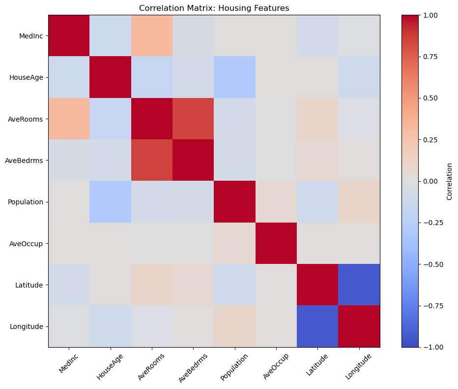

# 다중공선성

## 개요

**다중공선성**은 회귀모형의 독립변수 둘 이상이 강하게 상관되어 있을 때 나타난다. 이는 추정과 추론에 다음 문제를 일으킨다.

- **부풀려진 표준오차**: 계수가 불안정해지고 신뢰구간이 넓어진다
- **믿을 수 없는 계수**: 자료가 조금만 달라져도 추정된 계수가 크게 바뀐다
- **떨어진 검정력**: 설명변수의 개별 유의성을 판정하기 어려워진다
- **해석 가능성**: 각 변수의 고유한 기여를 신뢰성 있게 평가할 수 없다

이런 문제에도 불구하고 다중공선성은 계수 추정을 편향시키지 않으며 비슷한 자료에 대한 정확한 예측을 막지도 않는다. 해석이 어려워지더라도 모형은 예측에 여전히 쓸모가 있다.

---

## 다중공선성 탐지

### 방법 1: 상관행렬

가장 간단한 진단은 설명변수 사이의 쌍별 상관을 살피는 것이다.

```python
import numpy as np
import pandas as pd
import matplotlib.pyplot as plt

# Example: California Housing data
from sklearn.datasets import fetch_california_housing

housing = fetch_california_housing()
df = pd.DataFrame(housing.data, columns=housing.feature_names)

# Compute correlation matrix
corr_matrix = df.corr()

# Visualize with heatmap
plt.figure(figsize=(10, 8))
plt.imshow(corr_matrix, cmap='coolwarm', vmin=-1, vmax=1)
plt.colorbar(label='Correlation')
plt.xticks(range(len(housing.feature_names)), housing.feature_names, rotation=45)
plt.yticks(range(len(housing.feature_names)), housing.feature_names)
plt.title('Correlation Matrix: Housing Features')
plt.tight_layout()
plt.show()

# Print high correlations
print("High Correlations (|r| > 0.7):")
for i in range(len(corr_matrix.columns)):
    for j in range(i+1, len(corr_matrix.columns)):
        if abs(corr_matrix.iloc[i, j]) > 0.7:
            print(f"  {corr_matrix.columns[i]} <-> {corr_matrix.columns[j]}: {corr_matrix.iloc[i, j]:.3f}")
```

출력:

```
High Correlations (|r| > 0.7):
  AveRooms <-> AveBedrms: 0.848
  Latitude <-> Longitude: -0.925
```



AveRooms와 AveBedrms가 0.848, Latitude와 Longitude가 $-0.925$로 강하게 상관되어 있다. 상관행렬은 **쌍별** 관계만 보므로, 셋 이상이 얽힌 공선성은 VIF로 확인해야 한다.

**한계**: 쌍별 상관은 두 변수 사이의 관계만 포착한다. 변수 셋 이상이 얽혀 있으면 쌍별 상관이 크지 않아도 다중공선성이 존재할 수 있다. 이런 이유로 두 변수 사이의 단순 상관을 뜻하는 **공선성**과 여러 변수가 얽힌 **다중공선성**을 구분한다.

---

### 방법 2: 분산팽창인자(VIF)

**분산팽창인자(VIF)**는 다른 설명변수들과의 다중공선성 때문에 어떤 회귀계수의 분산이 얼마나 부풀려졌는지를 수량화한다.

#### 수학적 정의

설명변수 $X_j$의 VIF는

$$
\text{VIF}_j = \frac{1}{1 - R_j^2}
$$

여기서 $R_j^2$은 $X_j$를 나머지 모든 설명변수에 회귀시켰을 때의 $R^2$이다.

**해석**:

- **VIF = 1**: 다른 설명변수와 상관이 없다
- **VIF < 5**: 일반적으로 받아들일 만하다(경험 법칙)
- **VIF > 5**: 다중공선성이 우려되는 수준이다
- **VIF > 10**: 심각한 다중공선성으로 대개 조치가 필요하다

#### statsmodels 사용하기

```python
import statsmodels.api as sm
from statsmodels.stats.outliers_influence import variance_inflation_factor

# Example data
X = sm.add_constant(df[['MedInc', 'AveRooms', 'AveOccup', 'Latitude', 'Longitude']])

# Compute VIF for each predictor (excluding constant)
vif_data = pd.DataFrame()
vif_data['Feature'] = X.columns[1:]  # Skip constant
vif_data['VIF'] = [variance_inflation_factor(X.values, i+1) for i in range(X.shape[1]-1)]

print(vif_data)
```

출력:

```
     Feature       VIF
0     MedInc  1.269059
1   AveRooms  1.248489
2   AveOccup  1.000990
3   Latitude  8.184505
4  Longitude  7.977739
```

Latitude와 Longitude의 VIF가 8을 넘는다. 캘리포니아의 지리적 모양 때문에 위도와 경도가 강하게 상관되어 있다.

#### VIF를 직접 계산하기

VIF가 어떻게 계산되는지 이해하면 더 깊은 통찰을 얻을 수 있다.

```python
import numpy as np
import pandas as pd
from sklearn.linear_model import LinearRegression
from sklearn.datasets import fetch_california_housing

# Load data
housing = fetch_california_housing()
df = pd.DataFrame(housing.data, columns=housing.feature_names)

features = ['MedInc', 'AveRooms', 'AveOccup', 'Latitude', 'Longitude']
X = df[features]

print("Manual VIF Calculation:")
print("=" * 60)

for j, target_feature in enumerate(features):
    # Step 1: Regress target_feature on all other features
    other_features = [f for f in features if f != target_feature]
    X_j = X[target_feature].values.reshape(-1, 1)
    X_others = X[other_features].values

    # Fit model: target_feature ~ other_features
    model = LinearRegression()
    model.fit(X_others, X_j.ravel())

    # Compute R² for this regression
    y_pred_j = model.predict(X_others)
    ss_res = np.sum((X_j.ravel() - y_pred_j) ** 2)
    ss_tot = np.sum((X_j.ravel() - X_j.mean()) ** 2)
    r2_j = 1 - (ss_res / ss_tot)

    # VIF = 1 / (1 - R²)
    vif_j = 1 / (1 - r2_j)

    print(f"{target_feature:12s}:  R² = {r2_j:.4f},  VIF = {vif_j:7.2f}")

print("=" * 60)
```

출력:

```
Manual VIF Calculation:
============================================================
MedInc      :  R² = 0.2120,  VIF =    1.27
AveRooms    :  R² = 0.1990,  VIF =    1.25
AveOccup    :  R² = 0.0010,  VIF =    1.00
Latitude    :  R² = 0.8778,  VIF =    8.18
Longitude   :  R² = 0.8747,  VIF =    7.98
============================================================
```

VIF를 직접 계산해 확인했다. $\text{VIF}_j = 1/(1 - R_j^2)$이므로, 해당 변수를 나머지 변수들에 회귀시킨 $R_j^2$만 알면 된다.

**출력**:

```text
Manual VIF Calculation:
============================================================
MedInc      :  R² = 0.2120,  VIF =    1.27
AveRooms    :  R² = 0.1990,  VIF =    1.25
AveOccup    :  R² = 0.0010,  VIF =    1.00
Latitude    :  R² = 0.8778,  VIF =    8.18
Longitude   :  R² = 0.8747,  VIF =    7.98
============================================================
```

`variance_inflation_factor`가 내놓는 값과 정확히 일치한다.

이 예에서 Latitude와 Longitude의 VIF가 8 근처로 경험 법칙의 문턱값 5를 넘어 우려되는 수준이다(다만 "심각"의 기준인 10에는 못 미친다). 지리적으로 당연한 결과이다. 캘리포니아는 북서-남동 방향으로 길게 뻗은 주여서 위도와 경도의 상관이 $r = -0.925$에 이른다. 두 계수의 표준오차는 각각 $\sqrt{8.18} \approx 2.9$배, $\sqrt{7.98} \approx 2.8$배로 부풀려진다. 나머지 세 변수는 VIF가 1.3 이하로 문제가 없다.

---

## 다중공선성에 대처하기

### 방법 1: 중복된 설명변수 제거

두 설명변수가 강하게 상관되어 있으면 하나를 뺀다.

```python
# Check which features contribute least (lowest VIF)
# or have weakest relationship with the target
# and remove those
y = housing.target   # median house value
features_reduced = ['MedInc', 'AveRooms', 'AveOccup']  # Drop Lat/Long
X_reduced = sm.add_constant(df[features_reduced])
model_reduced = sm.OLS(y, X_reduced).fit()
```

### 방법 2: 상관된 설명변수 결합

상관된 변수들로 합성 지표를 만든다.

```python
# Combine latitude and longitude into a single "location" index
df['Location'] = (df['Latitude'] + df['Longitude']) / 2
```

### 방법 3: 정칙화(릿지 회귀 또는 라쏘 회귀)

계수를 축소하는 벌점 기반 방법을 쓴다.

```python
from sklearn.linear_model import Ridge, Lasso

# Ridge regression with alpha=1.0
ridge = Ridge(alpha=1.0)
ridge.fit(X, y)
print(ridge.coef_)

# Lasso regression with alpha=0.1
lasso = Lasso(alpha=0.1)
lasso.fit(X, y)
print(lasso.coef_)
```

출력:

```
[ 0.35902368  0.01500534 -0.00336581 -0.4979378  -0.51160538]
[ 0.37150935 -0.         -0.00281434 -0.18079981 -0.1744082 ]
```

OLS 계수와 릿지 계수를 비교한 것이다. 공선성이 있으면 OLS 계수가 크게 흔들리는 반면 릿지는 0 쪽으로 줄여 안정시킨다.

### 방법 4: 주성분분석(PCA)

상관된 설명변수를 서로 무상관인 주성분으로 변환한다.

```python
from sklearn.decomposition import PCA

# Create principal components
pca = PCA(n_components=3)
X_pca = pca.fit_transform(X)

# Fit model with principal components
model_pca = LinearRegression()
model_pca.fit(X_pca, y)
print(f"Explained variance ratio: {pca.explained_variance_ratio_}")
```

출력:

```
Explained variance ratio: [0.85492016 0.06636584 0.05359929]
```

주성분 셋이 분산의 85.5%, 6.6%, 5.4%를 설명한다. 첫 성분에 집중되어 있다는 것이 원래 변수들이 서로 강하게 얽혀 있다는 신호다.

---

## 핵심 개념

다중공선성을 이해하려면 다음을 알아야 한다.

1. **모형의 문제가 아니라 자료의 문제이다**: 문제는 모형 선택이 아니라 자료의 구조에서 온다.

2. **예측 대 추론**: 다중공선성은 주로 추론(변수 효과의 이해)에 영향을 준다. 비슷한 자료에 대한 예측은 여전히 신뢰할 만하다.

3. **분야 맥락이 중요하다**: 해석이나 분야 이해를 위해 상관된 변수들을 그대로 두는 것이 정당할 때도 있다. 부풀려진 표준오차를 감수하는 것이다.

4. **대책에는 대가가 따른다**: 변수를 빼면 정보를 잃는다. 정칙화는 편향을 도입하되 분산을 줄인다. PCA는 무상관 성분을 만들어 주지만 그 성분들의 의미를 해석하기 어렵다.

---

## 요약

다중공선성을 이해하는 일은 실무에서 통계 방법을 올바르게 적용하는 데 필수적이다. VIF로 탐지하고, 모형화 목표에 어떤 결과를 미치는지 이해하며, 맥락에 맞는 대책을 고르라.

## 연습문제

<div class="drillbox" markdown>

**연습문제 1.**
설명변수가 세 개인 회귀모형에서 $\text{VIF}_1 = 1.2$, $\text{VIF}_2 = 8.5$, $\text{VIF}_3 = 12.3$을 얻었다. 이 값들을 해석하고 어떤 설명변수에 주의가 필요한지 제안하라.

</div>

??? success "풀이"
    VIF(분산팽창인자)는 다중공선성 때문에 계수 추정의 분산이 얼마나 부풀려졌는지를 잰다. 흔한 문턱값은 VIF > 5(중간 정도 우려)와 VIF > 10(심각한 우려)이다.

    - $\text{VIF}_1 = 1.2$: 다중공선성 우려가 없다. $X_1$은 다른 설명변수들과 거의 무상관이다.
    - $\text{VIF}_2 = 8.5$: 중간 정도의 다중공선성이다. $\hat{\beta}_2$의 표준오차가 $\sqrt{8.5} \approx 2.9$배로 부풀려진다.
    - $\text{VIF}_3 = 12.3$: 심각한 다중공선성이다. $\hat{\beta}_3$의 표준오차가 $\sqrt{12.3} \approx 3.5$배로 부풀려진다.

    $X_2$와 $X_3$이 강하게 상관되어 있을 가능성이 높다. 하나를 빼거나, 둘을 결합하거나, 릿지 회귀를 쓰는 것을 고려하라.

<div class="drillbox" markdown>

**연습문제 2.**
다중공선성이 OLS 계수 추정을 편향시키지는 않지만 왜 믿을 수 없게 만드는지 설명하라. 구체적으로 어떤 양이 영향을 받는가?

</div>

??? success "풀이"
    다중공선성 아래에서도 OLS 추정량은 **불편**이다. $E[\hat{\beta}] = \beta$는 $E[\varepsilon|X] = 0$만을 요구하며 설명변수들 사이의 상관과는 무관하기 때문이다.

    그러나 다중공선성은 추정량의 **분산**을 부풀린다. 공분산행렬은 $\text{Var}(\hat{\beta}) = \sigma^2 (X^T X)^{-1}$인데, 설명변수들이 강하게 상관되면 $(X^T X)$가 거의 특이행렬이 되어 $(X^T X)^{-1}$의 대각원소가 매우 커진다. 그 결과 개별 계수의 신뢰구간이 넓어지고, 자료의 작은 변화에 민감해지며, 설명변수들이 결합적으로는 유의한데도 개별 $p$값은 클 수 있다.

<div class="drillbox" markdown>

**연습문제 3.**
집값을 예측하는 모형에 "총면적"과 "방 개수"가 모두 들어 있다. 두 변수의 상관은 $r = 0.92$이다. 두 변수의 예측 정보를 모두 유지하면서 이 다중공선성에 대처하는 두 가지 방법을 제안하라.

</div>

??? success "풀이"

    1. **합성 변수 만들기:** 상관된 두 설명변수를 "방당 면적"($X_{\text{new}} = \text{총면적}/\text{방 개수}$)으로 바꾼다. 크기 정보를 하나의 변수에 더 효율적으로 담는다.

    2. **릿지 회귀:** 손실함수에 벌점 $\lambda \|\beta\|^2$을 더하는 $L_2$ 정칙화를 쓴다. 상관된 계수들을 서로 가까이 축소하여 약간의 편향을 대가로 분산을 줄인다. 릿지 회귀는 어느 변수도 버리지 않으면서 추정을 안정화한다.
