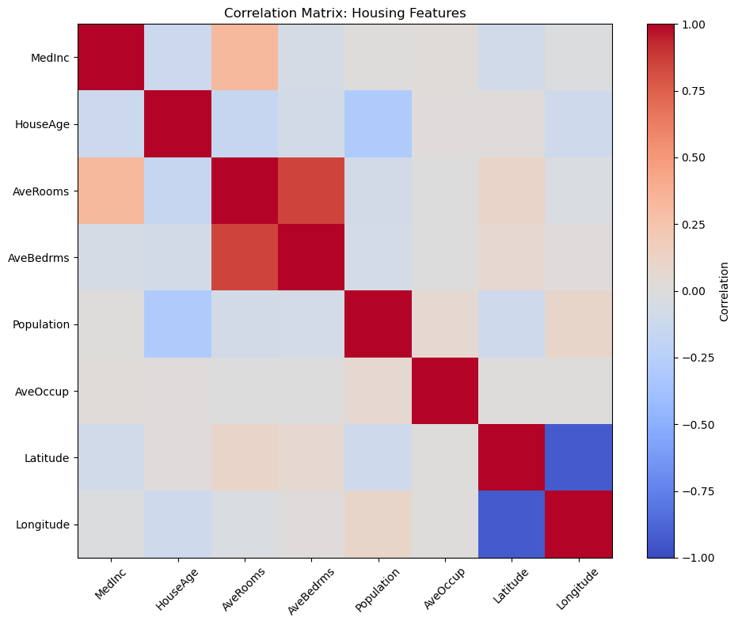

# 다중공선성

## 개요

**다중공선성**은 회귀모형의 독립변수 둘 이상이 강하게 상관되어 있을 때 나타난다. 이는 추정과 추론에 다음 문제를 일으킨다.

- **부풀려진 표준오차**: 계수가 불안정해지고 신뢰구간이 넓어진다
- **믿을 수 없는 계수**: 자료가 조금만 달라져도 추정된 계수가 크게 바뀐다
- **떨어진 검정력**: 설명변수의 개별 유의성을 판정하기 어려워진다
- **해석 가능성**: 각 변수의 고유한 기여를 신뢰성 있게 평가할 수 없다

이런 문제에도 불구하고 다중공선성은 계수 추정을 편향시키지 않으며 비슷한 자료에 대한 정확한 예측을 막지도 않는다. 해석이 어려워지더라도 모형은 예측에 여전히 쓸모가 있다.

---

## 다중공선성 탐지

### 방법 1: 상관행렬

가장 간단한 진단은 설명변수 사이의 쌍별 상관을 살피는 것이다.

<div class="exbox" markdown>

**보기 1.** <span class="diff easy" title="쉬움"></span> 상관행렬로 훑어보기

**(1)** 상관행렬은 **쌍별** 관계만 본다. $z_1, \ldots, z_m$이 서로 독립이고 분산이 같을 때 $z_{m+1} = z_1 + \cdots + z_m$으로 두면

$$
\operatorname{corr}(z_j,\, z_{m+1}) = \frac{1}{\sqrt m}
$$

임을 보이시오. 그러므로 $m$이 크면 **쌍별 상관이 모두 작은데도 완전공선인** 자료를 만들 수 있다.

**(2)** 주택 자료의 상관행렬을 그려 큰 쌍을 찾고, (1)의 자료를 만들어 상관행렬이 무엇을 놓치는지 보이시오.

</div>

??? success "풀이"

    **(1) 해석적으로.** $\operatorname{Var}(z_j) = \sigma^2$이라 하자. 독립이므로 $\operatorname{Var}(z_{m+1}) = m\sigma^2$이고, 공분산은 $z_j$ 자신과의 항만 남는다.

    $$
    \operatorname{Cov}(z_j,\, z_{m+1}) = \operatorname{Cov}\Big(z_j, \sum_{k=1}^m z_k\Big) = \operatorname{Var}(z_j) = \sigma^2
    $$

    따라서

    $$
    \operatorname{corr}(z_j,\, z_{m+1}) = \frac{\sigma^2}{\sigma \cdot \sqrt{m}\,\sigma} = \frac{1}{\sqrt m}
    $$

    이다. $m = 10$이면 $0.316$, $m = 50$이면 $0.141$로 **$m$을 키우면 얼마든지 작아진다.** 그런데 $z_{m+1}$은 앞의 변수들로 **완전히** 설명되므로 $R_{m+1}^2 = 1$, 곧 $\text{VIF}_{m+1} = \infty$다.

    **상관행렬을 아무리 들여다봐도 이 공선성은 보이지 않는다.** 모든 칸이 $0.32$ 이하인데 설계행렬은 특이하다. 이것이 "공선성"과 "다중공선성"을 가르는 이유이고, VIF가 필요한 이유다.

    **(2) 수치적으로.** 먼저 주택 자료다.

    ```python
    import numpy as np
    import pandas as pd
    import matplotlib.pyplot as plt

    # 캘리포니아 주택 자료. 위도와 경도처럼 서로 얽힌 변수가 들어 있다.
    from sklearn.datasets import fetch_california_housing

    housing = fetch_california_housing()
    df = pd.DataFrame(housing.data, columns=housing.feature_names)

    # 상관행렬은 다중공선성을 훑어보는 첫걸음이다. 다만 쌍끼리의 상관만
    # 보므로, 세 변수 이상이 얽힌 경우는 놓친다. 그래서 VIF 가 필요하다.
    corr_matrix = df.corr()

    # 열지도로 한눈에 본다.
    plt.figure(figsize=(10, 8))
    plt.imshow(corr_matrix, cmap='coolwarm', vmin=-1, vmax=1)
    plt.colorbar(label='Correlation')
    plt.xticks(range(len(housing.feature_names)), housing.feature_names, rotation=45)
    plt.yticks(range(len(housing.feature_names)), housing.feature_names)
    plt.title('Correlation Matrix: Housing Features')
    plt.tight_layout()
    plt.show()

    # 눈으로 놓치기 쉬우므로 0.7 을 넘는 쌍만 따로 찍는다.
    print("High Correlations (|r| > 0.7):")
    for i in range(len(corr_matrix.columns)):
        for j in range(i+1, len(corr_matrix.columns)):
            if abs(corr_matrix.iloc[i, j]) > 0.7:
                print(f"  {corr_matrix.columns[i]} <-> {corr_matrix.columns[j]}: {corr_matrix.iloc[i, j]:.3f}")
    ```

    출력:

    ```
    High Correlations (|r| > 0.7):
      AveRooms <-> AveBedrms: 0.848
      Latitude <-> Longitude: -0.925
    ```

    

    AveRooms와 AveBedrms가 $0.848$, Latitude와 Longitude가 $-0.925$로 강하게 상관되어 있다. 열지도에서도 그 네 칸만 진하다. 이 자료에서는 상관행렬이 제 몫을 한 셈이다.

    이제 (1)의 자료를 만들어 상관행렬이 무엇을 놓치는지 본다.

    ```python
    import numpy as np
    from statsmodels.stats.outliers_influence import variance_inflation_factor

    # 쌍별 상관은 모두 1/sqrt(m) 인데 완전공선인 자료를 만든다.
    rng = np.random.default_rng(0)
    m, N = 10, 2000
    Z = rng.normal(size=(N, m))
    Z = np.column_stack([Z, Z.sum(axis=1) + rng.normal(0, 0.01, N)])   # 마지막 열 = 앞의 합

    C = np.corrcoef(Z, rowvar=False)
    off = C[~np.eye(m + 1, dtype=bool)]
    print(f"변수 {m + 1}개, 쌍별 상관의 최대 절대값 = {np.abs(off).max():.4f}")
    print(f"이론값 1/sqrt(m) = {1 / np.sqrt(m):.4f}")
    print(f"0.7 을 넘는 쌍의 개수 = {(np.abs(off) > 0.7).sum()}")

    vifs = [variance_inflation_factor(Z, j) for j in range(m + 1)]
    print(f"\nVIF 최대 = {max(vifs):.1f}  (마지막 열)")
    print(f"VIF 중앙값 = {np.median(vifs):.1f}")
    ```

    출력:

    ```
    변수 11개, 쌍별 상관의 최대 절대값 = 0.3569
    이론값 1/sqrt(m) = 0.3162
    0.7 을 넘는 쌍의 개수 = 0

    VIF 최대 = 98068.6  (마지막 열)
    VIF 중앙값 = 9979.2
    ```

    **상관행렬이 완전히 눈이 멀었다.** 쌍별 상관의 최대 절대값이 $0.3569$로 이론값 $1/\sqrt{10} = 0.3162$ 근처이고($N = 2000$의 표집 변동 때문에 조금 크다), $\lvert r \rvert > 0.7$인 쌍은 **하나도 없다.** 위 코드의 경보 문턱 $0.7$을 쓰면 아무것도 걸리지 않는다. 그런데 VIF는 최대 $98{,}069$, 중앙값조차 $9{,}979$다.

    VIF가 무한이 아니라 $10^4$ 언저리인 것은 마지막 열에 표준편차 $0.01$의 잡음을 섞었기 때문이다. $R_j^2 = 1 - 10^{-4}$ 정도이면 $\text{VIF} \approx 10^4$가 되고, 계수의 표준오차는 $\sqrt{10^4} = 100$배로 부푼다. **잡음을 아예 빼면 설계행렬이 특이해져 회귀 자체가 불가능해진다.**

    중앙값 VIF도 $10^4$라는 데 주목하라. 공선성은 "마지막 변수의 문제"가 아니다. **$11$개 변수가 모두 한 덩어리의 관계에 묶여 있고, 어느 하나를 집어 나머지로 회귀시켜도 완벽히 맞는다.** 변수 하나를 빼야 한다면 어느 것을 빼도 좋다는 뜻이기도 하다.

**한계**: 쌍별 상관은 두 변수 사이의 관계만 포착한다. 변수 셋 이상이 얽혀 있으면 쌍별 상관이 크지 않아도 다중공선성이 존재할 수 있다. 이런 이유로 두 변수 사이의 단순 상관을 뜻하는 **공선성**과 여러 변수가 얽힌 **다중공선성**을 구분한다.

---

### 방법 2: 분산팽창인자(VIF)

**분산팽창인자(VIF)**는 다른 설명변수들과의 다중공선성 때문에 어떤 회귀계수의 분산이 얼마나 부풀려졌는지를 수량화한다.

#### 수학적 정의

설명변수 $X_j$의 VIF는

$$
\text{VIF}_j = \frac{1}{1 - R_j^2}
$$

여기서 $R_j^2$은 $X_j$를 나머지 모든 설명변수에 회귀시켰을 때의 $R^2$이다.

**해석**:

- **VIF = 1**: 다른 설명변수와 상관이 없다
- **VIF < 5**: 일반적으로 받아들일 만하다(경험 법칙)
- **VIF > 5**: 다중공선성이 우려되는 수준이다
- **VIF > 10**: 심각한 다중공선성으로 대개 조치가 필요하다

#### statsmodels 사용하기

<div class="exbox" markdown>

**보기 2.** <span class="diff easy" title="쉬움"></span> VIF 계산. 왜 이 수를 "분산팽창인자"라 부르는지 먼저 밝힌다.

**(1)** 다중회귀에서

$$
\operatorname{Var}(\hat\beta_j) = \frac{\sigma^2}{S_{jj}\,(1 - R_j^2)} = \frac{\sigma^2}{S_{jj}} \cdot \text{VIF}_j,
\qquad S_{jj} = \sum_i (x_{ij} - \bar x_j)^2
$$

임을 보이시오. 그러므로 $\text{VIF}_j$는 **"$X_j$가 다른 변수들과 무관했다면 가졌을 분산"의 몇 배인가**를 재는 수다.

**(2)** VIF를 계산하고, (1)의 식으로 표준오차를 재구성해 `statsmodels`가 보고한 값과 맞추시오.

</div>

??? success "풀이"

    **(1) 해석적으로.** Frisch–Waugh–Lovell 정리를 쓴다. $\mathbf X_{-j}$를 $X_j$를 뺀 나머지 열들(상수항 포함)이라 하고, 그 위로의 사영을 빼는 행렬을 $M_{-j}$라 하자. 정리에 따르면

    $$
    \hat\beta_j = \frac{(M_{-j}\mathbf x_j)^\top \mathbf y}{\lVert M_{-j}\mathbf x_j \rVert^2}
    $$

    이다. 이것은 $\mathbf y$의 선형결합이고 계수벡터가 $M_{-j}\mathbf x_j / \lVert M_{-j}\mathbf x_j\rVert^2$이므로, 등분산이면

    $$
    \operatorname{Var}(\hat\beta_j) = \sigma^2 \cdot \frac{\lVert M_{-j}\mathbf x_j \rVert^2}{\lVert M_{-j}\mathbf x_j \rVert^4} = \frac{\sigma^2}{\lVert M_{-j}\mathbf x_j \rVert^2}
    $$

    이다. 남은 것은 분모를 읽는 일이다. $\lVert M_{-j}\mathbf x_j \rVert^2$은 **$X_j$를 나머지 변수들에 회귀시켰을 때의 잔차제곱합**이고, 그 회귀의 결정계수가 $R_j^2$이므로

    $$
    \lVert M_{-j}\mathbf x_j \rVert^2 = \text{SSE}_j = S_{jj}\,(1 - R_j^2)
    $$

    이다. 넣으면 구하는 식이 된다.

    **이 한 줄이 공선성 이야기 전부다.** $R_j^2 \to 1$이면 분모가 0으로 가고 분산이 터진다. $R_j^2 = 0.9$면 $\text{VIF} = 10$이고 표준오차가 $\sqrt{10} = 3.16$배, $R_j^2 = 0.99$면 $\text{VIF} = 100$이고 $10$배다.

    동시에 **공선성이 무엇을 해치지 않는지도** 보인다. 식에 $\beta_j$가 들어 있지 않으므로 추정값은 여전히 불편이고, $\hat{\mathbf y} = \mathbf X\hat{\boldsymbol\beta}$의 분산도 $\sigma^2 \operatorname{tr}(H) = p\sigma^2$로 공선성과 무관하다. **공선성은 계수를 하나씩 떼어 읽으려 할 때만 아프다.**

    **(2) 수치적으로.**

    ```python
    import statsmodels.api as sm
    from statsmodels.stats.outliers_influence import variance_inflation_factor

    # 위도와 경도를 함께 넣으면 VIF 가 치솟는다. 캘리포니아가 북서에서 남동으로
    # 비스듬히 뻗어 있어 두 좌표가 강하게 얽히기 때문이다.
    X = sm.add_constant(df[['MedInc', 'AveRooms', 'AveOccup', 'Latitude', 'Longitude']])

    vif_data = pd.DataFrame()
    vif_data['Feature'] = X.columns[1:]  # Skip constant
    vif_data['VIF'] = [variance_inflation_factor(X.values, i+1) for i in range(X.shape[1]-1)]

    print(vif_data)
    ```

    출력:

    ```
         Feature       VIF
    0     MedInc  1.269059
    1   AveRooms  1.248489
    2   AveOccup  1.000990
    3   Latitude  8.184505
    4  Longitude  7.977739
    ```

    (1)의 식으로 표준오차를 직접 만들어 본다.

    ```python
    import numpy as np
    import statsmodels.api as sm

    features = ['MedInc', 'AveRooms', 'AveOccup', 'Latitude', 'Longitude']
    y = housing.target
    full = sm.OLS(y, sm.add_constant(df[features])).fit()
    s2 = full.mse_resid

    print(f"{'변수':>10}{'R_j^2':>10}{'VIF':>9}{'공식 SE':>13}{'보고 SE':>13}")
    for f in features:
        others = [g for g in features if g != f]
        r2 = sm.OLS(df[f], sm.add_constant(df[others])).fit().rsquared
        Sjj = ((df[f] - df[f].mean()) ** 2).sum()
        se_formula = np.sqrt(s2 / (Sjj * (1 - r2)))
        print(f"{f:>10}{r2:>10.6f}{1 / (1 - r2):>9.4f}"
              f"{se_formula:>13.8f}{full.bse[f]:>13.8f}")
    ```

    출력:

    ```
            변수     R_j^2      VIF        공식 SE        보고 SE
        MedInc  0.212015   1.2691   0.00306483   0.00306483
      AveRooms  0.199032   1.2485   0.00233421   0.00233421
      AveOccup  0.000989   1.0010   0.00049790   0.00049790
      Latitude  0.877818   8.1845   0.00692281   0.00692281
     Longitude  0.874651   7.9777   0.00728654   0.00728654
    ```

    **유도한 식이 다섯 변수 모두에서 소수점 여덟째 자리까지 맞는다.** $\sigma^2/(S_{jj}(1-R_j^2))$로 만든 표준오차와 `statsmodels`가 보고한 값이 같다.

    Latitude와 Longitude의 VIF가 $8$을 넘는다. 캘리포니아가 북서에서 남동으로 비스듬히 뻗은 주여서 두 좌표가 $r = -0.925$로 얽히기 때문이다. 표준오차가 각각 $\sqrt{8.18} = 2.86$배, $\sqrt{7.98} = 2.82$배로 부풀었다는 뜻이다. 나머지 세 변수는 $1.3$ 이하라 문제가 없고, 특히 AveOccup은 $1.0010$으로 **다른 변수들과 사실상 완전히 무관**하다.

#### VIF를 직접 계산하기

VIF가 어떻게 계산되는지 이해하면 더 깊은 통찰을 얻을 수 있다.

<div class="exbox" markdown>

**보기 3.** <span class="diff easy" title="쉬움"></span> VIF를 정의대로 직접 구하기

**(1)** $\text{VIF}_j \ge 1$이고 등호는 $R_j^2 = 0$일 때뿐임을 보이시오. 또 설명변수가 **둘뿐**이면 두 VIF가 같고

$$
\text{VIF}_1 = \text{VIF}_2 = \frac{1}{1 - r^2}
$$

($r$은 두 변수의 상관)임을 보이시오.

**(2)** VIF를 정의대로 계산해 `variance_inflation_factor`와 맞추고, Latitude의 VIF $8.18$이 두 변수 공식이 주는 값보다 **큰** 까닭을 밝히시오.

</div>

??? success "풀이"

    **(1) 해석적으로.** $R_j^2$은 결정계수이므로 상수항이 있는 회귀에서 $0 \le R_j^2 < 1$이다($R_j^2 = 1$이면 설계행렬이 특이해 회귀가 아예 정의되지 않는다). $u \mapsto 1/(1-u)$가 $[0,1)$에서 증가하므로

    $$
    \text{VIF}_j = \frac{1}{1 - R_j^2} \ \ge\ \frac{1}{1-0} = 1
    $$

    이고 등호는 $R_j^2 = 0$, 곧 **$X_j$가 나머지 변수들의 어떤 선형결합으로도 설명되지 않을 때**뿐이다. 보기 2의 식으로 읽으면 "분산이 부풀 수는 있어도 줄 수는 없다"는 말이다. 다른 변수를 모형에 넣어서 $\hat\beta_j$가 더 정밀해지는 일은 없다.

    설명변수가 $X_1, X_2$ 둘뿐이면 $X_1$을 $X_2$에 회귀시키는 것이 **단순회귀**이므로 $R_1^2 = r^2$이고, $X_2$를 $X_1$에 회귀시켜도 같은 $r^2$이다. 상관은 대칭이기 때문이다. 따라서

    $$
    \text{VIF}_1 = \text{VIF}_2 = \frac{1}{1 - r^2}
    $$

    이다. 이 경우에 한해 **상관행렬만 보아도 VIF를 알 수 있다.** 변수가 셋 이상이면 그렇지 않고, 그 차이를 (2)에서 수로 본다.

    **(2) 수치적으로.**

    ```python
    import numpy as np
    import pandas as pd
    from sklearn.linear_model import LinearRegression
    from sklearn.datasets import fetch_california_housing

    # 자료 읽기
    housing = fetch_california_housing()
    df = pd.DataFrame(housing.data, columns=housing.feature_names)

    features = ['MedInc', 'AveRooms', 'AveOccup', 'Latitude', 'Longitude']
    X = df[features]

    # VIF 를 정의대로 직접 구해 본다. 변수 하나를 반응으로 두고 나머지로
    # 회귀한 뒤, 그 R^2 에서 1/(1-R^2) 을 계산하는 것이 전부다.
    print("Manual VIF Calculation:")
    print("=" * 60)

    for j, target_feature in enumerate(features):
        # 관심 변수를 나머지 변수들로 회귀한다.
        other_features = [f for f in features if f != target_feature]
        X_j = X[target_feature].values.reshape(-1, 1)
        X_others = X[other_features].values

        # 관심 변수를 나머지 변수들로 회귀한다
        model = LinearRegression()
        model.fit(X_others, X_j.ravel())

        # 그 회귀의 R^2. 1 에 가까울수록 그 변수가 나머지로 거의 설명된다는 뜻이다.
        y_pred_j = model.predict(X_others)
        ss_res = np.sum((X_j.ravel() - y_pred_j) ** 2)
        ss_tot = np.sum((X_j.ravel() - X_j.mean()) ** 2)
        r2_j = 1 - (ss_res / ss_tot)

        # R^2 가 0.9 면 VIF 가 10, 0.99 면 100 이 된다. 계수의 표준오차가
        # 그 제곱근만큼 부풀려진다는 뜻이다.
        vif_j = 1 / (1 - r2_j)

        print(f"{target_feature:12s}:  R² = {r2_j:.4f},  VIF = {vif_j:7.2f}")

    print("=" * 60)
    ```

    출력:

    ```
    Manual VIF Calculation:
    ============================================================
    MedInc      :  R² = 0.2120,  VIF =    1.27
    AveRooms    :  R² = 0.1990,  VIF =    1.25
    AveOccup    :  R² = 0.0010,  VIF =    1.00
    Latitude    :  R² = 0.8778,  VIF =    8.18
    Longitude   :  R² = 0.8747,  VIF =    7.98
    ============================================================
    ```

    **보기 2의 `variance_inflation_factor`가 내놓은 값과 소수점 둘째 자리까지 같다.** $\text{VIF}_j = 1/(1-R_j^2)$이므로 해당 변수를 나머지에 회귀시킨 $R_j^2$만 알면 된다. 다섯 값이 모두 $1$ 이상이라는 (1)의 하한도 지켜진다.

    **두 변수 공식과의 차이를 보자.** Latitude와 Longitude의 상관이 $r = -0.9247$이므로 두 변수만 있었다면

    $$
    \text{VIF} = \frac{1}{1 - (-0.9247)^2} = 6.897
    $$

    이었을 것이다. 그런데 실제 VIF는 $8.18$과 $7.98$로 **더 크다.** 모형에 MedInc, AveRooms, AveOccup이 함께 들어 있고, 이 셋이 Latitude를 설명하는 데 조금씩 보태기 때문이다. $R_{\text{Lat}}^2$이 $0.8551$($= r^2$)에서 $0.8778$로 올라간 것이 그 몫이며, $1-R^2$이 분모라 이 작은 상승이 VIF를 $19\%$ 키웠다.

    **$R^2$이 1에 가까울수록 작은 변화가 VIF를 크게 흔든다.** $R^2 = 0.99$에서 $0.995$로 가면 VIF가 $100$에서 $200$으로 두 배가 된다. VIF를 소수 둘째 자리까지 읽고 $9.8$과 $10.2$를 다르게 대우하는 것이 무의미한 이유다.

    이 자료에서 Latitude와 Longitude의 VIF $8$ 근처는 경험 법칙의 문턱 $5$를 넘지만 "심각"의 기준 $10$에는 못 미친다. 캘리포니아가 북서–남동으로 길게 뻗은 주라는 지리가 그대로 수에 나타난 것이다. 두 계수의 표준오차가 각각 $\sqrt{8.18} = 2.86$배, $\sqrt{7.98} = 2.82$배 부풀었고, 나머지 세 변수는 $1.3$ 이하로 문제가 없다.

---

## 다중공선성에 대처하기

### 방법 1: 중복된 설명변수 제거

두 설명변수가 강하게 상관되어 있으면 하나를 뺀다.

<div class="exbox" markdown>

**보기 4.** <span class="diff easy" title="쉬움"></span> 대책 1 — 변수 빼기. Latitude와 Longitude를 빼면 VIF 문제는 사라진다. 그 대신 치르는 값을 재어 보자.

**(1)** 완전모형의 계수를 $(\hat{\boldsymbol\beta}_K, \hat{\boldsymbol\beta}_D)$(남길 변수와 뺄 변수), 뺀 변수들을 남긴 변수들에 회귀시킨 계수행렬을 $\hat\Delta$라 하자. 축소모형의 계수가

$$
\hat{\boldsymbol\beta}_{\text{short}} = \hat{\boldsymbol\beta}_K + \hat\Delta\, \hat{\boldsymbol\beta}_D
$$

로 **정확히** 적힘을 보이시오(기댓값이 아니라 표본에서 성립하는 항등식이다).

**(2)** 변수를 빼고 적합한 뒤 이 항등식을 확인하고, 계수가 얼마나 달라지는지 보시오.

</div>

??? success "풀이"

    **(1) 해석적으로.** 완전모형의 적합은

    $$
    \mathbf y = \mathbf X_K \hat{\boldsymbol\beta}_K + \mathbf X_D \hat{\boldsymbol\beta}_D + \mathbf e,
    \qquad \mathbf X_K^\top \mathbf e = \mathbf 0,\quad \mathbf X_D^\top \mathbf e = \mathbf 0
    $$

    이다. 한편 $\mathbf X_D$를 $\mathbf X_K$에 회귀시키면 $\mathbf X_D = \mathbf X_K \hat\Delta + \mathbf U$이고 $\mathbf X_K^\top \mathbf U = \mathbf 0$이다. 둘째 식을 첫째 식에 넣으면

    $$
    \mathbf y = \mathbf X_K\big(\hat{\boldsymbol\beta}_K + \hat\Delta \hat{\boldsymbol\beta}_D\big) + \underbrace{\mathbf U \hat{\boldsymbol\beta}_D + \mathbf e}_{\textstyle \mathbf r}
    $$

    가 된다. 나머지 $\mathbf r$가 $\mathbf X_K$와 직교한다. $\mathbf X_K^\top \mathbf U = \mathbf 0$이고 $\mathbf X_K^\top \mathbf e = \mathbf 0$이기 때문이다. **$\mathbf X_K$의 열공간 위에서 $\mathbf y$를 분해했는데 나머지가 그 공간과 직교한다면, 그것이 바로 축소모형의 최소제곱 적합이다.** 분해는 유일하므로

    $$
    \hat{\boldsymbol\beta}_{\text{short}} = \hat{\boldsymbol\beta}_K + \hat\Delta\, \hat{\boldsymbol\beta}_D
    $$

    이다.

    기댓값을 취하면 교과서의 **누락변수 편향** 공식 $E[\hat{\boldsymbol\beta}_{\text{short}}] = \boldsymbol\beta_K + \hat\Delta \boldsymbol\beta_D$가 되지만, 위 식은 **한 표본 안에서 이미 등식**이라는 점이 중요하다. 편향의 크기가 두 가지에 달려 있음도 읽힌다. **뺀 변수가 반응을 얼마나 설명하는가($\hat{\boldsymbol\beta}_D$)와, 뺀 변수가 남긴 변수들과 얼마나 얽혀 있는가($\hat\Delta$)다.** 둘 중 하나라도 0이면 편향이 없다. 공선성이 심할수록 $\hat\Delta$가 커지므로, **변수를 빼서 가장 큰 이득을 보는 상황이 바로 가장 큰 대가를 치르는 상황**이다.

    **(2) 수치적으로.**

    ```python
    # 대책 1: 얽힌 변수를 빼 버린다. 가장 간단하지만, 뺀 변수가 실제로
    # 반응을 설명하고 있었다면 남은 계수에 누락변수 편향이 생긴다.
    y = housing.target                                     # 주택가격 중앙값
    features_reduced = ['MedInc', 'AveRooms', 'AveOccup']  # 위도·경도를 뺀다
    X_reduced = sm.add_constant(df[features_reduced])
    model_reduced = sm.OLS(y, X_reduced).fit()
    ```

    항등식을 확인한다.

    ```python
    import numpy as np
    import statsmodels.api as sm

    features_full = ['MedInc', 'AveRooms', 'AveOccup', 'Latitude', 'Longitude']
    dropped = ['Latitude', 'Longitude']
    model_full = sm.OLS(y, sm.add_constant(df[features_full])).fit()

    # 뺀 변수들을 남긴 변수들에 회귀시킨 계수행렬 Delta
    Delta = np.column_stack([
        sm.OLS(df[d], X_reduced).fit().params.values for d in dropped
    ])
    predicted = (model_full.params[['const'] + features_reduced].values
                 + Delta @ model_full.params[dropped].values)

    print(f"{'':>10}{'완전모형':>12}{'축소모형':>12}{'항등식 예측':>14}")
    for k, name in enumerate(['const'] + features_reduced):
        print(f"{name:>10}{model_full.params[name]:>12.6f}"
              f"{model_reduced.params[name]:>12.6f}{predicted[k]:>14.6f}")
    print(f"\n최대 오차 = {np.abs(model_reduced.params.values - predicted).max():.2e}")
    print(f"\nR^2: 완전 {model_full.rsquared:.4f}  →  축소 {model_reduced.rsquared:.4f}")
    ```

    출력:

    ```
                      완전모형        축소모형        항등식 예측
         const  -42.829801    0.606932      0.606932
        MedInc    0.359016    0.434683      0.434683
      AveRooms    0.015013   -0.038326     -0.038326
      AveOccup   -0.003366   -0.004174     -0.004174

    최대 오차 = 1.58e-14

    R^2: 완전 0.5860  →  축소 0.4808
    ```

    **항등식이 기계 정밀도까지 맞는다.** 최대 오차가 $1.6 \times 10^{-14}$다.

    **치른 값이 작지 않다.** AveRooms의 계수가 $+0.0150$에서 $-0.0383$으로 **부호가 뒤집혔다.** 완전모형은 "같은 위치·같은 소득이면 방이 많을수록 집값이 조금 비싸다"고 말하는데, 축소모형은 "방이 많을수록 싸다"고 말한다. 방이 많은 동네가 땅값 싼 내륙에 몰려 있어서 생기는 일이며, 위치를 통제하지 않으면 그 효과가 AveRooms에 얹힌다. MedInc의 계수도 $0.359$에서 $0.435$로 $21\%$ 커졌다.

    $R^2$도 $0.586$에서 $0.481$로 떨어진다. **VIF $8$을 없애려고 설명력의 $18\%$를 버리고 한 계수의 부호를 뒤집은 셈**이다. 변수 빼기가 가장 간단한 대책이지만 가장 흔히 잘못 쓰이는 대책이기도 한 이유다. **뺀 변수가 반응과 무관할 때만 안전하다.**

### 방법 2: 상관된 설명변수 결합

상관된 변수들로 합성 지표를 만든다.

<div class="exbox" markdown>

**보기 5.** <span class="diff easy" title="쉬움"></span> 대책 2 — 변수 합치기. 위도와 경도를 평균 내 "위치" 지표 하나로 만든다. 상관이 $r = -0.925$로 **음수**라는 데 유의하라.

**(1)** 두 변수의 표준편차를 $s_1, s_2$라 할 때

$$
\operatorname{sd}\!\left(\frac{L_1+L_2}{2}\right) = \frac{\sqrt{s_1^2 + s_2^2 + 2rs_1s_2}}{2},
\qquad
\operatorname{sd}\!\left(\frac{L_1-L_2}{2}\right) = \frac{\sqrt{s_1^2 + s_2^2 - 2rs_1s_2}}{2}
$$

임을 쓰고, 이 자료에서 두 값을 계산하시오. $r$이 $-1$에 가까우므로 **합은 거의 사라지고 차만 남는다.** 그렇다면 합과 차 가운데 어느 쪽을 합성변수로 써야 하는가.

**(2)** 둘을 모두 만들어 모형에 넣고 $R^2$을 견주시오. 예상이 맞는가.

</div>

??? success "풀이"

    **(1) 해석적으로.** 분산의 덧셈 법칙에서 바로 나온다.

    $$
    \operatorname{Var}\!\left(\frac{L_1 \pm L_2}{2}\right)
    = \frac{\operatorname{Var}(L_1) + \operatorname{Var}(L_2) \pm 2\operatorname{Cov}(L_1,L_2)}{4}
    = \frac{s_1^2 + s_2^2 \pm 2rs_1s_2}{4}
    $$

    이고 제곱근을 취하면 된다. $s_1 = 2.136$, $s_2 = 2.004$, $r = -0.9247$이므로

    $$
    \operatorname{sd}\!\left(\frac{L_1+L_2}{2}\right) = \frac{\sqrt{4.563 + 4.014 - 7.916}}{2} = \frac{\sqrt{0.662}}{2} = 0.407
    $$

    $$
    \operatorname{sd}\!\left(\frac{L_1-L_2}{2}\right) = \frac{\sqrt{4.563 + 4.014 + 7.916}}{2} = \frac{\sqrt{16.49}}{2} = 2.030
    $$

    이다. **합의 흩어짐이 차의 $1/5$다.** 두 좌표가 거의 반비례로 움직이므로 더하면 상쇄되고 빼면 증폭되기 때문이다.

    여기서 성급한 결론을 내리기 쉽다. "흩어짐이 큰 쪽이 정보가 많으니 차를 쓰자"는 것이다. **그러나 그 결론은 틀릴 수 있다.** 합성변수의 쓸모를 정하는 것은 그 변수 자체의 분산이 아니라 **반응과의 관계**다. 완전모형의 계수가 $\hat\beta_{\text{Lat}} = -0.498$, $\hat\beta_{\text{Lon}} = -0.512$로 **거의 같으므로** 반응이 실제로 쓰는 조합은

    $$
    -0.498 L_1 - 0.512 L_2 \;\approx\; -1.01 \cdot \frac{L_1 + L_2}{2}
    $$

    곧 **합**이다. 그러니 합을 써야 한다. 흩어짐이 작은 방향이 신호를 나르는, 공선성 자료의 전형적인 모습이다.

    **(2) 수치적으로.**

    ```python
    # 대책 2: 얽힌 변수를 하나로 합친다. 여기서는 위도와 경도를 평균 내
    # "위치" 지표 하나로 만들었다. 뜻이 통하는 합성이어야 쓸모가 있다.
    df['Location'] = (df['Latitude'] + df['Longitude']) / 2
    ```

    합과 차를 모두 만들어 견준다.

    ```python
    import numpy as np
    import statsmodels.api as sm

    lat, lon = df['Latitude'], df['Longitude']
    r = lat.corr(lon)
    print(f"sd(Latitude) = {lat.std():.4f},  sd(Longitude) = {lon.std():.4f},  r = {r:.4f}")
    print(f"sd(합/2) 공식 = {np.sqrt((lat.var() + lon.var() + 2 * lat.cov(lon)) / 4):.4f}"
          f"   실측 = {((lat + lon) / 2).std():.4f}")
    print(f"sd(차/2) 공식 = {np.sqrt((lat.var() + lon.var() - 2 * lat.cov(lon)) / 4):.4f}"
          f"   실측 = {((lat - lon) / 2).std():.4f}")

    df['Diff'] = (lat - lon) / 2
    print(f"\n{'모형':>26}{'R^2':>9}{'합성변수의 계수':>16}")
    print(f"{'MedInc+AveRooms+AveOccup':>26}{model_reduced.rsquared:>9.4f}{'-':>16}")
    for name in ('Location', 'Diff'):
        mm = sm.OLS(y, sm.add_constant(df[features_reduced + [name]])).fit()
        print(f"{'  + ' + name:>26}{mm.rsquared:>9.4f}{mm.params[name]:>16.4f}")
    print(f"{'  + Latitude, Longitude':>26}{model_full.rsquared:>9.4f}"
          f"{model_full.params['Latitude'] + model_full.params['Longitude']:>16.4f}")
    ```

    출력:

    ```
    sd(Latitude) = 2.1360,  sd(Longitude) = 2.0035,  r = -0.9247
    sd(합/2) 공식 = 0.4069   실측 = 0.4069
    sd(차/2) 공식 = 2.0304   실측 = 2.0304

                            모형      R^2        합성변수의 계수
      MedInc+AveRooms+AveOccup   0.4808               -
                    + Location   0.5855         -0.9991
                        + Diff   0.4813         -0.0130
         + Latitude, Longitude   0.5860         -1.0097
    ```

    **공식이 맞는다.** 합의 표준편차 $0.4069$, 차의 표준편차 $2.0304$가 실측과 소수점 넷째 자리까지 같다.

    **예상대로 합이 이긴다.** `Location`(합) 하나를 넣으면 $R^2$이 $0.4808 \to 0.5855$로 올라 두 좌표를 다 넣은 $0.5860$을 거의 그대로 회복한다. **변수 하나를 잃고 설명력은 $0.0005$만 잃었다.** 반면 `Diff`(차)를 넣으면 $0.4813$으로 아무 변화가 없다. 흩어짐이 다섯 배 큰 변수인데도 그렇다.

    계수도 들어맞는다. `Location`의 계수가 $-0.9991$인데, 완전모형의 두 계수를 더한 값 $-1.0097$과 $1\%$ 안에서 같다. (1)에서 $-0.498L_1 - 0.512L_2 \approx -1.01 \cdot \frac{L_1+L_2}{2}$라 쓴 것이 자료에서 그대로 확인되는 셈이다.

    **이 보기의 교훈은 "평균 내라"가 아니다.** 상관이 **양수**인 두 변수였다면 합이 큰 분산을 갖고 차가 상쇄되어, 합성해야 할 것이 합이 되었을 것이다. 상관의 부호와 완전모형 계수의 부호를 함께 보고 **반응이 실제로 쓰는 방향**을 골라야 한다. 그 방향을 자료에게 물어보는 자동 절차가 보기 7의 주성분회귀이고, 반응까지 함께 보는 것이 부분최소제곱이다.

### 방법 3: 정칙화(릿지 회귀 또는 라쏘 회귀)

계수를 축소하는 벌점 기반 방법을 쓴다.

<div class="exbox" markdown>

**보기 6.** <span class="diff easy" title="쉬움"></span> 대책 3 — 능형회귀와 라쏘

**(1)** 능형회귀의 해가 $\hat{\boldsymbol\beta}_\lambda = (\mathbf X^\top \mathbf X + \lambda \mathbf I)^{-1}\mathbf X^\top \mathbf y$임을 보이고, $\mathbf X^\top \mathbf X$의 고윳값을 $d_1 \ge \cdots \ge d_p$라 할 때 **고윳방향마다 수축비가 $d_k/(d_k+\lambda)$**임을 보이시오. 그러므로 $\lambda$가 $d_k$에 견주어 작으면 아무 일도 일어나지 않는다.

**(2)** `alpha=1.0`을 넣은 능형이 이 자료에서 실제로 얼마나 수축시키는지 재시오. 벌점이 **척도에 의존**한다는 것도 확인하시오.

</div>

??? success "풀이"

    **(1) 해석적으로.** 능형의 목적함수는

    $$
    Q(\boldsymbol\beta) = \lVert \mathbf y - \mathbf X \boldsymbol\beta \rVert^2 + \lambda \lVert \boldsymbol\beta \rVert^2
    $$

    이다. 미분해 0으로 두면

    $$
    -2\mathbf X^\top(\mathbf y - \mathbf X\boldsymbol\beta) + 2\lambda \boldsymbol\beta = \mathbf 0
    \quad\Longrightarrow\quad
    (\mathbf X^\top \mathbf X + \lambda \mathbf I)\boldsymbol\beta = \mathbf X^\top \mathbf y
    $$

    이고, $\lambda > 0$이면 $\mathbf X^\top \mathbf X + \lambda \mathbf I$가 항상 양정치라 역행렬이 존재한다. **$\mathbf X$가 완전공선이어도 능형은 답을 준다**는 것이 이 한 줄의 내용이다. 이계도함수가 $2(\mathbf X^\top\mathbf X + \lambda\mathbf I) \succ 0$이므로 이 정류점이 최소점이다.

    수축의 모양을 보려면 고유분해 $\mathbf X^\top \mathbf X = \mathbf V \mathbf D \mathbf V^\top$를 넣는다. $\mathbf D = \operatorname{diag}(d_1, \ldots, d_p)$이고 $\mathbf V$가 직교이므로

    $$
    \hat{\boldsymbol\beta}_\lambda = \mathbf V (\mathbf D + \lambda \mathbf I)^{-1}\mathbf V^\top \mathbf X^\top \mathbf y
    = \mathbf V \,(\mathbf D + \lambda\mathbf I)^{-1}\mathbf D\, \mathbf V^\top \hat{\boldsymbol\beta}_{\text{OLS}}
    $$

    이다(마지막 등식은 $\mathbf X^\top \mathbf y = \mathbf X^\top \mathbf X \hat{\boldsymbol\beta}_{\text{OLS}} = \mathbf V\mathbf D\mathbf V^\top \hat{\boldsymbol\beta}_{\text{OLS}}$). 곧 $\mathbf V$의 $k$번째 방향 성분이

    $$
    \frac{d_k}{d_k + \lambda}
    $$

    배로 줄어든다. **$d_k \gg \lambda$인 방향은 손대지 않고, $d_k$가 작은 방향 — 곧 공선성이 사는 방향 — 만 크게 줄인다.** 능형이 공선성에 듣는 이유가 이것이고, 동시에 **$\lambda$를 자료의 척도에 맞춰 골라야 하는 이유**이기도 하다. 모든 $d_k$가 $\lambda$보다 훨씬 크면 수축비가 전부 1에 붙어 능형이 OLS와 구별되지 않는다.

    **(2) 수치적으로.**

    ```python
    from sklearn.linear_model import Ridge, Lasso

    # 대책 3: 벌점회귀. 능형회귀는 계수를 0 쪽으로 줄여 분산을 낮춘다.
    # 편향이 조금 생기는 대신 분산이 크게 줄어드는 맞바꿈이다.
    ridge = Ridge(alpha=1.0)
    ridge.fit(X, y)
    print(ridge.coef_)

    # 라쏘는 일부 계수를 정확히 0 으로 만들어 변수 선택까지 해 준다.
    lasso = Lasso(alpha=0.1)
    lasso.fit(X, y)
    print(lasso.coef_)
    ```

    출력:

    ```
    [ 0.35902368  0.01500534 -0.00336581 -0.4979378  -0.51160538]
    [ 0.37150935 -0.         -0.00281434 -0.18079981 -0.1744082 ]
    ```

    닫힌 꼴로 재현하고, 수축이 실제로 얼마나 일어났는지 잰다.

    ```python
    import numpy as np
    from sklearn.linear_model import LinearRegression

    # 능형의 닫힌 꼴. sklearn 은 절편을 벌하지 않으므로 중심화한 뒤 푼다.
    Xc = X.values - X.values.mean(axis=0)
    yc = y - y.mean()
    lam = 1.0
    b_closed = np.linalg.solve(Xc.T @ Xc + lam * np.eye(X.shape[1]), Xc.T @ yc)
    print("닫힌 꼴      :", np.round(b_closed, 8))
    print("sklearn Ridge:", np.round(ridge.coef_, 8))
    print(f"최대 오차 = {np.abs(b_closed - ridge.coef_).max():.2e}")

    # 수축이 실제로 얼마나 일어났는가
    b_ols = LinearRegression().fit(X, y).coef_
    print(f"\n||b_OLS||   = {np.linalg.norm(b_ols):.6f}")
    print(f"||b_Ridge|| = {np.linalg.norm(ridge.coef_):.6f}")
    print(f"||b_Lasso|| = {np.linalg.norm(lasso.coef_):.6f}")

    # 왜 능형이 거의 아무 일도 하지 않았는가: X'X 의 고윳값과 견주어 lambda 가 너무 작다
    ev = np.linalg.eigvalsh(Xc.T @ Xc)[::-1]
    print(f"\nX'X 의 고윳값 = {np.array2string(ev, precision=1)}")
    print(f"수축비 d/(d+lambda) = {np.array2string(ev / (ev + lam), precision=6)}")

    # 벌점은 척도에 의존한다. 표준화하면 결과가 완전히 달라진다.
    Xs = (X - X.mean()) / X.std()
    print(f"\n표준화 뒤 OLS   : {np.round(LinearRegression().fit(Xs, y).coef_, 4)}")
    print(f"표준화 뒤 Ridge : {np.round(Ridge(alpha=1.0).fit(Xs, y).coef_, 4)}")
    print(f"표준화 뒤 Lasso : {np.round(Lasso(alpha=0.1).fit(Xs, y).coef_, 4)}")
    ```

    출력:

    ```
    닫힌 꼴      : [ 0.35902368  0.01500534 -0.00336581 -0.4979378  -0.51160538]
    sklearn Ridge: [ 0.35902368  0.01500534 -0.00336581 -0.4979378  -0.51160538]
    최대 오차 = 1.11e-16

    ||b_OLS||   = 0.799364
    ||b_Ridge|| = 0.799260
    ||b_Lasso|| = 0.448480

    X'X 의 고윳값 = [2226360.5  172828.2  139581.8   59862.2    5540.9]
    수축비 d/(d+lambda) = [1.       0.999994 0.999993 0.999983 0.99982 ]

    표준화 뒤 OLS   : [ 0.6821  0.0371 -0.035  -1.0637 -1.0252]
    표준화 뒤 Ridge : [ 0.6821  0.0371 -0.035  -1.063  -1.0244]
    표준화 뒤 Lasso : [ 0.6931 -0.     -0.     -0.011  -0.    ]
    ```

    **닫힌 꼴이 `sklearn`과 기계 정밀도까지 같다.** 오차 $1.1 \times 10^{-16}$이다.

    **그런데 `alpha=1.0`의 능형은 이 자료에서 사실상 아무 일도 하지 않았다.** 계수 노름이 $0.799364$에서 $0.799260$으로 $0.013\%$ 줄었을 뿐이다. 까닭은 (1)의 수축비가 말해 준다. $\mathbf X^\top\mathbf X$의 고윳값이 $5{,}541$부터 $2{,}226{,}360$까지인데 $\lambda = 1$은 그에 견주어 미미해서, 수축비가 가장 작은 방향에서도 $0.99982$다. **능형의 $\lambda$는 자료의 척도에 달린 양이고, $1.0$이라는 수 자체에는 아무 뜻이 없다.**

    같은 $\lambda$로 라쏘는 많은 일을 한다. AveRooms를 정확히 $0$으로 보내고 Latitude·Longitude를 $-0.498, -0.512$에서 $-0.181, -0.174$로 크게 줄여 노름이 $0.448$이 되었다. 벌점이 $\lVert\boldsymbol\beta\rVert^2$이 아니라 $\lVert\boldsymbol\beta\rVert_1$이라 작은 계수에도 상수 크기의 힘이 걸리기 때문이다.

    **마지막 세 줄이 가장 중요하다.** 변수를 표준화하면 그림이 뒤집힌다. 능형은 여전히 거의 아무 일도 하지 않는데(표준화해도 $d_k$가 $\lambda$보다 훨씬 크다), 라쏘는 **MedInc 하나만 남기고 전부 0으로 보낸다.** 표준화 전에는 살아 있던 Latitude·Longitude가 사라진 것이다. 벌점 $\lambda\lVert\boldsymbol\beta\rVert_1$은 변수의 단위에 따라 값이 달라지므로, **표준화하지 않고 쓴 벌점회귀의 변수 선택은 "어느 변수가 중요한가"가 아니라 "어느 변수의 단위가 큰가"를 읽고 있을 수 있다.** 벌점회귀에서 표준화가 권고가 아니라 전제인 이유다.

### 방법 4: 주성분분석(PCA)

상관된 설명변수를 서로 무상관인 주성분으로 변환한다.

<div class="exbox" markdown>

**보기 7.** <span class="diff easy" title="쉬움"></span> 대책 4 — 주성분회귀

**(1)** `explained_variance_ratio_`가 공분산행렬의 고윳값 $\lambda_k$에 대해 $\lambda_k / \sum_j \lambda_j$임을 쓰고, 공선성의 신호가 **큰 고윳값**이 아니라 **작은 고윳값**에 있음을 설명하시오. 조건수 $\kappa = \sqrt{\lambda_1/\lambda_p}$가 쓰이는 이유는 무엇인가.

**(2)** 고윳값을 직접 계산해 `sklearn`과 맞추고, 첫 성분이 **무엇인지** 적재로 확인하시오. 변수를 표준화하면 그림이 어떻게 달라지는가.

</div>

??? success "풀이"

    **(1) 해석적으로.** 중심화한 자료의 표본공분산행렬 $S$를 고유분해하면 $S = \mathbf V \Lambda \mathbf V^\top$이고, $k$번째 주성분 점수 $\mathbf z_k = \mathbf X_c \mathbf v_k$의 표본분산은

    $$
    \operatorname{Var}(\mathbf z_k) = \mathbf v_k^\top S \mathbf v_k = \lambda_k
    $$

    이다. 성분들이 직교하므로 분산이 그대로 더해져 $\sum_k \lambda_k = \operatorname{tr}(S)$, 곧 원래 변수들의 분산 합과 같다. 그러므로 설명비율이 $\lambda_k/\sum_j \lambda_j$다.

    **공선성이 사는 곳은 작은 고윳값 쪽이다.** 어떤 방향 $\mathbf v$에 대해 $\mathbf X_c \mathbf v \approx \mathbf 0$이면 그 방향이 "변수들 사이의 거의 성립하는 선형관계"이고, 그때 $\lambda = \operatorname{Var}(\mathbf X_c\mathbf v) \approx 0$이다. 보기 2의 식으로 보면 $\operatorname{Var}(\hat{\boldsymbol\beta}) = \sigma^2(\mathbf X^\top\mathbf X)^{-1}$의 고윳값이 $\sigma^2/d_k$라 **가장 작은 $d_k$가 분산을 터뜨린다.**

    큰 고윳값은 이와 무관하다. 변수 하나가 다른 것들보다 단위가 커서 혼자 분산을 독차지하기만 해도 첫 성분이 $90\%$를 설명한다. **"첫 성분이 분산의 대부분을 설명한다"는 공선성의 증거가 아니다.** (2)에서 그 반례를 본다.

    조건수 $\kappa = \sqrt{\lambda_1/\lambda_p}$는 가장 큰 축과 가장 작은 축의 **비**라 단위에 덜 휘둘린다. 관례로 $\kappa > 30$이면 공선성을 의심한다.

    **(2) 수치적으로.**

    ```python
    from sklearn.decomposition import PCA

    # 대책 4: 주성분회귀. 서로 직교하는 성분으로 바꾸므로 다중공선성이
    # 원리적으로 사라진다. 대신 성분이 원래 변수의 섞임이라 해석이 어려워진다.
    pca = PCA(n_components=3)
    X_pca = pca.fit_transform(X)

    # 주성분으로 모형을 적합한다
    model_pca = LinearRegression()
    model_pca.fit(X_pca, y)
    print(f"Explained variance ratio: {pca.explained_variance_ratio_}")
    ```

    출력:

    ```
    Explained variance ratio: [0.85492016 0.06636584 0.05359929]
    ```

    고윳값을 직접 구하고 첫 성분의 정체를 확인한다.

    ```python
    import numpy as np
    from sklearn.decomposition import PCA

    # explained_variance 는 공분산행렬의 고윳값이다.
    pca_all = PCA().fit(X)
    eig = np.linalg.eigvalsh(np.cov(X.values, rowvar=False))[::-1]
    print("sklearn explained_variance :", np.round(pca_all.explained_variance_, 6))
    print("공분산행렬의 고윳값        :", np.round(eig, 6))
    print("비율                       :", np.round(pca_all.explained_variance_ratio_, 6))
    print(f"조건수 sqrt(l_1/l_p)       = {np.sqrt(eig[0] / eig[-1]):.3f}")

    # 첫 성분이 무엇인지 적재로 확인한다.
    print("\n첫 성분의 적재 :", dict(zip(features, np.round(pca_all.components_[0], 4))))
    print(f"AveOccup 의 분산 = {X['AveOccup'].var():.4f},  첫 고윳값 = {eig[0]:.4f}")

    # 표준화하면 완전히 다른 그림이 된다.
    Xs = (X - X.mean()) / X.std()
    pca_s = PCA().fit(Xs)
    print("\n표준화 뒤 비율 :", np.round(pca_s.explained_variance_ratio_, 6))
    print("표준화 뒤 조건수 =",
          f"{np.sqrt(pca_s.explained_variance_[0] / pca_s.explained_variance_[-1]):.3f}")
    print("가장 작은 성분의 적재 :",
          dict(zip(features, np.round(pca_s.components_[-1], 4))))
    ```

    출력:

    ```
    sklearn explained_variance : [107.871529   8.373863   6.763014   2.900441   0.268466]
    공분산행렬의 고윳값        : [107.871529   8.373863   6.763014   2.900441   0.268466]
    비율                       : [0.85492  0.066366 0.053599 0.022987 0.002128]
    조건수 sqrt(l_1/l_p)       = 20.045

    첫 성분의 적재 : {'MedInc': 0.0035, 'AveRooms': -0.0012, 'AveOccup': 1.0, 'Latitude': 0.0005, 'Longitude': 0.0005}
    AveOccup 의 분산 = 107.8700,  첫 고윳값 = 107.8715

    표준화 뒤 비율 : [0.386895 0.265062 0.200103 0.135386 0.012553]
    표준화 뒤 조건수 = 5.552
    가장 작은 성분의 적재 : {'MedInc': -0.105, 'AveRooms': 0.0963, 'AveOccup': 0.0062, 'Latitude': -0.7051, 'Longitude': -0.6946}
    ```

    **`explained_variance_`가 공분산행렬의 고윳값과 소수점 여섯째 자리까지 같다.**

    **첫 성분은 공선성과 아무 관계가 없다.** 적재가 AveOccup에 $1.000$, 나머지에 $0.004$ 이하다. 곧 **첫 주성분은 그냥 AveOccup 한 변수**이며, 첫 고윳값 $107.87$은 AveOccup의 분산 $107.87$ 그 자체다. 그런데 AveOccup은 보기 2에서 VIF가 $1.0010$으로 **다섯 변수 가운데 공선성이 가장 없는** 변수였다. 평균 거주 인원이라 단위가 큰 탓에 분산을 독차지했을 뿐이다. "첫 성분이 $85.5\%$를 설명하므로 변수들이 강하게 얽혀 있다"고 읽으면 안 되는 이유다.

    **공선성은 마지막 성분에 있다.** 표준화한 뒤의 가장 작은 성분(설명비율 $1.26\%$)의 적재가 Latitude $-0.705$, Longitude $-0.695$로 거의 같다. 곧 그 방향이 $\text{Lat} + \text{Lon}$이며, **보기 5에서 만든 `Location` 변수와 사실상 같은 방향**이다. 자료에서 거의 변하지 않는 방향, 곧 두 좌표가 묶여 있다는 사실이 여기 있다.

    **표준화 여부로 그림이 뒤집힌다.** 표준화 전에는 첫 성분이 $85.5\%$였는데 표준화 후에는 $38.7\%$로 내려가고 다섯 성분이 고르게 퍼진다. 조건수도 $20.0$에서 $5.6$으로 바뀐다. **PCA는 단위에 전적으로 의존하므로 공선성 진단에 쓰려면 반드시 표준화해야 한다.** 표준화한 조건수 $5.55$는 관례의 문턱 $30$에 한참 못 미치며, 보기 2의 VIF $8$이 "우려되나 심각하지 않다"고 말한 것과 같은 판정이다.

    주성분회귀 자체에 대해서는 한 가지만 덧붙인다. 성분 셋만 남기면 공선성은 원리적으로 사라지지만, **버린 성분이 반응을 설명하고 있었다면 그만큼 잃는다.** 보기 5가 보인 대로 이 자료에서 반응이 쓰는 방향은 분산이 가장 작은 쪽이었다. 분산이 큰 순서로 성분을 고르는 PCA는 **반응을 한 번도 보지 않는다**는 점을 기억해야 한다.

---

## 핵심 개념

다중공선성을 이해하려면 다음을 알아야 한다.

1. **모형의 문제가 아니라 자료의 문제이다**: 문제는 모형 선택이 아니라 자료의 구조에서 온다.

2. **예측 대 추론**: 다중공선성은 주로 추론(변수 효과의 이해)에 영향을 준다. 비슷한 자료에 대한 예측은 여전히 신뢰할 만하다.

3. **분야 맥락이 중요하다**: 해석이나 분야 이해를 위해 상관된 변수들을 그대로 두는 것이 정당할 때도 있다. 부풀려진 표준오차를 감수하는 것이다.

4. **대책에는 대가가 따른다**: 변수를 빼면 정보를 잃는다. 정칙화는 편향을 도입하되 분산을 줄인다. PCA는 무상관 성분을 만들어 주지만 그 성분들의 의미를 해석하기 어렵다.

---

## 연습문제

<div class="drillbox" markdown>

**연습문제 1.** <span class="diff easy" title="쉬움"></span>
설명변수가 세 개인 회귀모형에서 $\text{VIF}_1 = 1.2$, $\text{VIF}_2 = 8.5$, $\text{VIF}_3 = 12.3$을 얻었다. 이 값들을 해석하고 어떤 설명변수에 주의가 필요한지 제안하라.

</div>

??? success "풀이"
    VIF(분산팽창인자)는 다중공선성 때문에 계수 추정의 분산이 얼마나 부풀려졌는지를 잰다. 흔한 문턱값은 VIF > 5(중간 정도 우려)와 VIF > 10(심각한 우려)이다.

    - $\text{VIF}_1 = 1.2$: 다중공선성 우려가 없다. $X_1$은 다른 설명변수들과 거의 무상관이다.
    - $\text{VIF}_2 = 8.5$: 중간 정도의 다중공선성이다. $\hat{\beta}_2$의 표준오차가 $\sqrt{8.5} \approx 2.9$배로 부풀려진다.
    - $\text{VIF}_3 = 12.3$: 심각한 다중공선성이다. $\hat{\beta}_3$의 표준오차가 $\sqrt{12.3} \approx 3.5$배로 부풀려진다.

    $X_2$와 $X_3$이 강하게 상관되어 있을 가능성이 높다. 하나를 빼거나, 둘을 결합하거나, 릿지 회귀를 쓰는 것을 고려하라.

<div class="drillbox" markdown>

**연습문제 2.** <span class="diff med" title="중간"></span>
다중공선성이 OLS 계수 추정을 편향시키지는 않지만 왜 믿을 수 없게 만드는지 설명하라. 구체적으로 어떤 양이 영향을 받는가?

</div>

??? success "풀이"
    다중공선성 아래에서도 OLS 추정량은 **불편**이다. $E[\hat{\beta}] = \beta$는 $E[\varepsilon|X] = 0$만을 요구하며 설명변수들 사이의 상관과는 무관하기 때문이다.

    그러나 다중공선성은 추정량의 **분산**을 부풀린다. 공분산행렬은 $\text{Var}(\hat{\beta}) = \sigma^2 (X^T X)^{-1}$인데, 설명변수들이 강하게 상관되면 $(X^T X)$가 거의 특이행렬이 되어 $(X^T X)^{-1}$의 대각원소가 매우 커진다. 그 결과 개별 계수의 신뢰구간이 넓어지고, 자료의 작은 변화에 민감해지며, 설명변수들이 결합적으로는 유의한데도 개별 $p$값은 클 수 있다.

<div class="drillbox" markdown>

**연습문제 3.** <span class="diff med" title="중간"></span>
집값을 예측하는 모형에 "총면적"과 "방 개수"가 모두 들어 있다. 두 변수의 상관은 $r = 0.92$이다. 두 변수의 예측 정보를 모두 유지하면서 이 다중공선성에 대처하는 두 가지 방법을 제안하라.

</div>

??? success "풀이"

    1. **합성 변수 만들기:** 상관된 두 설명변수를 "방당 면적"($X_{\text{new}} = \text{총면적}/\text{방 개수}$)으로 바꾼다. 크기 정보를 하나의 변수에 더 효율적으로 담는다.

    2. **릿지 회귀:** 손실함수에 벌점 $\lambda \|\beta\|^2$을 더하는 $L_2$ 정칙화를 쓴다. 상관된 계수들을 서로 가까이 축소하여 약간의 편향을 대가로 분산을 줄인다. 릿지 회귀는 어느 변수도 버리지 않으면서 추정을 안정화한다.

---

## 정리하며

다중공선성을 이해하는 일은 실무에서 통계 방법을 올바르게 적용하는 데 필수적이다. VIF로 탐지하고, 모형화 목표에 어떤 결과를 미치는지 이해하며, 맥락에 맞는 대책을 고르라.
