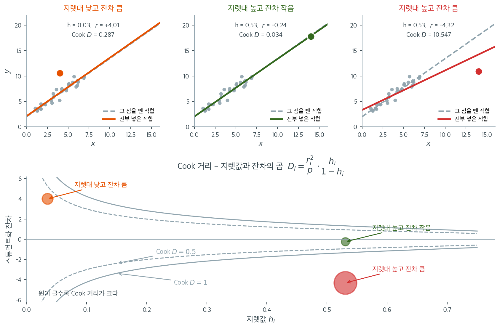

# 회귀 진단 (주택)

## 개요

이 페이지는 King County 주택 자료를 이용해 회귀 진단의 전체 흐름을 보인다. 이상점 탐지를 위한 스튜던트화 잔차, 영향 분석을 위한 Cook 거리와 모자값, Breusch-Pagan 검정을 통한 이분산 검정, 부분잔차 그림, 그리고 영향점 제거가 모형 추정에 미치는 영향을 다룬다.

!!! note "자료에 대하여"
    `house_98105`는 King County 주택 매매 자료 가운데 우편번호 98105 지역만 걸러 낸 부분자료를 담은 pandas `DataFrame`이다. 아래 코드는 이 변수가 이미 만들어져 있다고 가정한다. 다른 자료로 바꾸어도 진단 절차 자체는 그대로 적용된다.

## 수학적 배경

### 스튜던트화 잔차

관측값 $i$의 내부 스튜던트화 잔차는

$$
r_i = \frac{e_i}{s\sqrt{1 - h_{ii}}},
$$

여기서 $e_i = y_i - \hat{y}_i$는 원잔차이고 $h_{ii}$는 지렛대(모자행렬 $\mathbf{H} = \mathbf{X}(\mathbf{X}^\top\mathbf{X})^{-1}\mathbf{X}^\top$의 대각원소)이다. $|r_i| > 2.5$인 관측값은 잠재적 이상점이다.

### 모자값(지렛대)

지렛대 $h_{ii}$는 관측값 $i$가 설명변수 공간의 중심에서 얼마나 떨어져 있는지를 잰다. 지렛대가 크다는 것은 $\mathbf{x}_i$가 특이하다는 뜻이다. $h_{ii} > 2k/n$이거나 $h_{ii} > 3\bar{h}$($\bar{h} = k/n$)인 관측값을 높은 지렛대 점으로 본다.

### Cook 거리

Cook 거리는 잔차의 크기와 지렛대를 결합한다.

$$
D_i = \frac{1}{k}\,r_i^2\,\frac{h_{ii}}{1 - h_{ii}}.
$$

동등하게 $D_i$는 관측값 $i$를 뺐을 때 모든 적합값이 변하는 정도를 잰다. 흔한 문턱값은 $D_i > 4/n$이다.

### Breusch-Pagan 검정

이분산에 대한 Breusch-Pagan 검정은 제곱잔차를 설명변수에 회귀시킨다.

$$
e_i^2 = \gamma_0 + \gamma_1 x_{i1} + \cdots + \gamma_p x_{ip} + v_i.
$$

$H_0$(등분산) 아래에서 이 보조회귀의 검정통계량 $nR^2$은 $\chi^2_p$를 따른다.

## 자료

King County(시애틀) 주택 매매 자료에서 우편번호 98105 지역만 골라 쓴다.

<div class="exbox" markdown>

**보기 1.** <span class="diff easy" title="쉬움"></span> 주택 자료 읽기

**(1)** `describe()` 표의 세 수 — 평균 $756{,}277$, 중앙값 $630{,}041$, 최댓값 $3{,}013{,}254$ — 만으로 가격 분포의 **치우침 방향**을 읽고, 변동계수를 계산하시오.

**(2)** 가격과 로그가격의 왜도를 재어 (1)을 확인하고, 이 자료에서 **이분산이 예상되는 까닭**을 말하시오.

</div>

??? success "풀이"

    **(1) 표만 보고 읽기.** 평균이 중앙값보다 $126{,}236$ 크다. 대칭분포에서는 두 값이 같으므로, **평균이 중앙값보다 크다는 것은 오른쪽 꼬리가 길다는 뜻**이다. 소수의 비싼 집이 평균을 끌어올린 것이다.

    그 꼬리가 얼마나 긴지는 최댓값이 말해 준다. $3{,}013{,}254 / 630{,}041 = 4.78$로 **최고가가 중앙값의 다섯 배 가까이**다. 왼쪽으로는 최솟값이 중앙값의 $0.19$배까지밖에 가지 못한다. 가격처럼 0 아래로 내려갈 수 없는 양은 아래로는 막혀 있고 위로는 열려 있어 늘 이런 모습이 된다.

    변동계수는

    $$
    \mathrm{CV} = \frac{s}{\bar x} = \frac{391{,}463}{756{,}277} = 0.518
    $$

    이다. **표준편차가 평균의 절반이 넘는다.**

    **(2) 왜 이분산이 예상되는가.** 변동계수가 큰 양극단 자료에서는 흔히 **흩어짐이 수준에 비례한다.** 비싼 집과 싼 집의 가격 오차가 같은 달러 단위로 흔들릴 이유가 없고, 보통 같은 **비율**로 흔들린다. $\operatorname{sd}(y \mid x) \propto E[y\mid x]$이면 $\operatorname{Var}(y\mid x) \propto \mu^2$이라 명백한 이분산이고, 그때 $\log y$의 분산은 델타 방법으로

    $$
    \operatorname{Var}(\log y) \approx \frac{\operatorname{Var}(y)}{\mu^2} = \text{상수}
    $$

    가 되어 안정된다. 그러니 **로그를 취했을 때 치우침이 줄어드는지** 보면 이 짐작이 맞는지 알 수 있다.

    ```python
    import pandas as pd

    # "Practical Statistics for Data Scientists" 저장소의 자료. 탭으로 구분되어 있다.
    url = ("https://raw.githubusercontent.com/gedeck/"
           "practical-statistics-for-data-scientists/8a6d3bb6468e979c861d4b37215e1413702dfdfa/data/house_sales.csv")
    house = pd.read_csv(url, sep='\t')
    house_98105 = house.loc[house['ZipCode'] == 98105, :]

    print(f"전체 {len(house)}건 중 98105 지역 {len(house_98105)}건")
    print(house_98105[['AdjSalePrice', 'SqFtTotLiving', 'Bedrooms']].describe().round(1).to_string())
    ```

    출력:

    ```
    전체 22687건 중 98105 지역 313건
           AdjSalePrice  SqFtTotLiving  Bedrooms
    count         313.0          313.0     313.0
    mean       756277.3         2069.9       3.4
    std        391463.3          905.4       1.1
    min        119748.0          490.0       1.0
    25%        521101.0         1410.0       3.0
    50%        630041.0         1850.0       3.0
    75%        851954.0         2570.0       4.0
    max       3013254.0         5570.0       9.0
    ```

    ```python
    import numpy as np
    from scipy.stats import skew

    price = house_98105['AdjSalePrice']
    print(f"평균 {price.mean():,.0f},  중앙값 {price.median():,.0f},  "
          f"차 {price.mean() - price.median():,.0f}")
    print(f"변동계수 = sd/mean = {price.std() / price.mean():.4f}")
    print(f"최대/최소 = {price.max() / price.min():.1f},  최대/중앙값 = {price.max() / price.median():.2f}")
    print(f"\n왜도:  가격 {skew(price):+.4f},  로그가격 {skew(np.log(price)):+.4f}")
    print(f"sd(log 가격) = {np.log(price).std():.4f}   (변동계수의 근사값)")
    ```

    출력:

    ```
    평균 756,277,  중앙값 630,041,  차 126,236
    변동계수 = sd/mean = 0.5176
    최대/최소 = 25.2,  최대/중앙값 = 4.78

    왜도:  가격 +2.2581,  로그가격 +0.6970
    sd(log 가격) = 0.4199   (변동계수의 근사값)
    ```

    **(1)의 읽기가 맞는다.** 왜도가 $+2.258$로 크게 양수다. 평균과 중앙값의 차이 하나로 부호를 맞췄고, 최대/중앙값 비 $4.78$이 꼬리의 길이를 가늠하게 해 주었다.

    **로그를 취하면 왜도가 $+2.258$에서 $+0.697$로 세 분의 일이 된다.** (2)의 짐작이 들어맞는다는 뜻이고, 이 자료가 **로그정규에 가깝다**는 신호다. $\operatorname{sd}(\log y) = 0.4199$가 변동계수 $0.5176$과 같은 자릿수인 것도 그 증거다(로그정규이면 $\mathrm{CV} = \sqrt{e^{\sigma^2}-1}$이고 $\sigma$가 작을 때 $\mathrm{CV} \approx \sigma$다. $\sigma = 0.42$에서 $\sqrt{e^{0.176}-1} = 0.438$로 어느 정도만 맞는데, $\sigma$가 이미 작지 않기 때문이다).

    **이 한 쪽이 보기 4를 미리 말해 준다.** 가격을 그대로 두고 회귀하면 이분산이 나올 것이고, 로그를 취하면 상당히 나아질 것이다. 보기 4에서 Breusch-Pagan 검정으로 그것을 확인한다. 가격이 $12$만에서 $301$만까지 $25$배 벌어진 자료에서는 영향점도 함께 나타나기 쉬우며, 그 이야기가 보기 2와 3이다.

### 기준 모형과 영향 진단

<div class="exbox" markdown>

**보기 2.** <span class="diff easy" title="쉬움"></span> 영향점 진단량 구하기

**(1)** 모자행렬 $H$가 멱등이라는 사실에서 $\sum_i h_{ii} = p$임을 보이시오. 그러므로 $h_{ii}$의 **평균이 $p/n$으로 고정**되어 있고, 문턱 $2p/n$이 "평균의 두 배"라는 뜻임을 밝히시오.

**(2)** 위에 적은 두 Cook 공식

$$
D_i = \frac{r_i^2}{p}\cdot\frac{h_{ii}}{1-h_{ii}}
\qquad\text{와}\qquad
D_i = \frac{e_i^2\, h_{ii}}{p\, s^2 (1-h_{ii})^2}
$$

가 같음을 보이고, 둘 다 `cooks_distance`와 맞는지 확인하시오. 가장 영향이 큰 집이 **잔차 때문인지 지렛대 때문인지**도 가르시오.

</div>

??? success "풀이"

    **(1) 해석적으로.** $H = X(X^\top X)^{-1}X^\top$은 대칭이고 $H^2 = H$다. 멱등행렬의 고윳값은 $0$ 아니면 $1$이고, $1$인 것의 개수가 계수와 같다. $X$가 완전계수 $p$이면 $\operatorname{rank}(H) = p$이므로

    $$
    \sum_{i=1}^n h_{ii} = \operatorname{tr}(H) = \operatorname{rank}(H) = p
    $$

    이다([0.3절 멱등행렬](../../ch00/linalg_regression/square_matrices/idempotent.md)). 대각합을 직접 계산해도 같다. $\operatorname{tr}(X(X^\top X)^{-1}X^\top) = \operatorname{tr}((X^\top X)^{-1}X^\top X) = \operatorname{tr}(I_p) = p$다.

    **그러므로 지렛값의 평균은 자료가 무엇이든 정확히 $p/n$이다.** 이 자료에서는 $6/313 = 0.01917$이다. 지렛값을 "크다/작다"로 말하려면 기준이 있어야 하는데, 그 기준이 자료에 의존하지 않는 $p/n$으로 공짜로 주어지는 셈이다. 흔한 문턱 $2p/n$은 **평균의 두 배**, $3p/n$은 세 배를 뜻한다.

    덧붙여 $0 \le h_{ii} \le 1$이고(멱등행렬의 대각원소), 상수항이 있으면 $h_{ii} \ge 1/n$이다. 단순회귀에서는 닫힌 꼴로

    $$
    h_{ii} = \frac{1}{n} + \frac{(x_i - \bar x)^2}{S_{xx}}
    $$

    이라 **$x$가 중심에서 멀수록 지렛값이 커진다**는 것이 그대로 보인다.

    **(2) 두 Cook 공식이 같음.** 내부 스튜던트화 잔차의 정의가

    $$
    r_i = \frac{e_i}{s\sqrt{1-h_{ii}}}
    \quad\Longrightarrow\quad
    r_i^2 = \frac{e_i^2}{s^2(1-h_{ii})}
    $$

    이므로 첫째 식에 넣으면

    $$
    \frac{r_i^2}{p}\cdot\frac{h_{ii}}{1-h_{ii}}
    = \frac{e_i^2}{p\,s^2(1-h_{ii})}\cdot\frac{h_{ii}}{1-h_{ii}}
    = \frac{e_i^2\,h_{ii}}{p\,s^2(1-h_{ii})^2}
    $$

    로 둘째 식이 된다. **같은 식을 다르게 묶은 것일 뿐**이며, 첫째 꼴이 더 유용하다. $D_i$가 **"벗어난 정도" $r_i^2/p$와 "외따로 떨어진 정도" $h_{ii}/(1-h_{ii})$의 곱**으로 갈리기 때문이다. 어느 하나만 커서는 $D_i$가 크지 않다는 것이 한눈에 보인다.

    ```python
    import numpy as np
    import pandas as pd
    import statsmodels.api as sm
    from statsmodels.stats.outliers_influence import OLSInfluence

    # assign(const=1) 이 절편 열을 만든다. statsmodels 의 OLS 는 절편을
    # 자동으로 넣지 않는다.
    predictors = ['SqFtTotLiving', 'SqFtLot', 'Bathrooms', 'Bedrooms', 'BldgGrade']
    X = house_98105[predictors].assign(const=1)
    y = house_98105['AdjSalePrice']

    results = sm.OLS(y, X).fit()
    influence = OLSInfluence(results)

    # 세 진단량을 함께 본다. 스튜던트화 잔차는 그 점이 얼마나 벗어났는지,
    # 지렛값은 설명변수 쪽에서 얼마나 외따로 있는지, Cook 거리는 그 둘을
    # 합쳐 결론을 얼마나 흔드는지를 잰다.
    studentized_resids = influence.resid_studentized_internal
    hat_values = influence.hat_matrix_diag
    cooks_dist, _ = influence.cooks_distance

    print(results.summary().tables[1])
    print(f"n = {len(y)}, 문턱 4/n = {4/len(y):.4f}")
    print(f"Cook 거리 최댓값 = {cooks_dist.max():.4f} (관측 {cooks_dist.argmax()})")
    print(f"문턱을 넘는 관측값 수 = {(cooks_dist > 4/len(y)).sum()}")
    ```

    출력:

    ```
    =================================================================================
                        coef    std err          t      P>|t|      [0.025      0.975]
    ---------------------------------------------------------------------------------
    SqFtTotLiving   209.6023     24.408      8.587      0.000     161.574     257.631
    SqFtLot          38.9333      5.330      7.305      0.000      28.445      49.421
    Bathrooms      2282.2641      2e+04      0.114      0.909    -3.7e+04    4.16e+04
    Bedrooms      -2.632e+04   1.29e+04     -2.043      0.042   -5.17e+04    -973.867
    BldgGrade        1.3e+05   1.52e+04      8.533      0.000       1e+05     1.6e+05
    const         -7.725e+05   9.83e+04     -7.861      0.000   -9.66e+05   -5.79e+05
    =================================================================================
    n = 313, 문턱 4/n = 0.0128
    Cook 거리 최댓값 = 0.5608 (관측 152)
    문턱을 넘는 관측값 수 = 20
    ```

    이제 (1)과 (2)를 수로 확인한다.

    ```python
    import numpy as np

    r = np.asarray(studentized_resids)
    h = np.asarray(hat_values)
    D = np.asarray(cooks_dist)
    e = np.asarray(results.resid)
    n, k = len(y), X.shape[1]
    s2 = results.mse_resid

    print(f"sum h_ii = {h.sum():.10f}   (p = {k} 여야 한다)")
    print(f"평균 h = {h.mean():.6f} = p/n,   문턱 2p/n = {2 * k / n:.6f}")
    print(f"지렛값이 문턱을 넘는 관측 = {(h > 2 * k / n).sum()}건")

    # 두 가지 Cook 공식이 모두 같은 값을 주는가
    D1 = r ** 2 / k * h / (1 - h)
    D2 = e ** 2 * h / (k * s2 * (1 - h) ** 2)
    print(f"\n|D1 - cooks| 최대 = {np.abs(D1 - D).max():.2e}")
    print(f"|D2 - cooks| 최대 = {np.abs(D2 - D).max():.2e}")

    # 가장 영향이 큰 집을 뜯어본다
    i = int(D.argmax())
    print(f"\n위치 {i}:  D = {D[i]:.4f},  r = {r[i]:.4f},  h = {h[i]:.4f}"
          f"  (평균 h 의 {h[i] / h.mean():.1f}배)")
    print(f"  실제 가격 {y.iloc[i]:,.0f},  적합값 {results.fittedvalues.iloc[i]:,.0f},"
          f"  잔차 {e[i]:,.0f}")
    print(f"  두 인자:  r^2/p = {r[i] ** 2 / k:.4f},"
          f"  h/(1-h) = {h[i] / (1 - h[i]):.4f},  곱 = {r[i] ** 2 / k * h[i] / (1 - h[i]):.4f}")
    ```

    출력:

    ```
    sum h_ii = 6.0000000000   (p = 6 여야 한다)
    평균 h = 0.019169 = p/n,   문턱 2p/n = 0.038339
    지렛값이 문턱을 넘는 관측 = 19건

    |D1 - cooks| 최대 = 5.55e-17
    |D2 - cooks| 최대 = 1.11e-16

    위치 152:  D = 0.5608,  r = 4.9420,  h = 0.1211  (평균 h 의 6.3배)
      실제 가격 3,013,254,  적합값 2,186,265,  잔차 826,989
      두 인자:  r^2/p = 4.0705,  h/(1-h) = 0.1378,  곱 = 0.5608
    ```

    **$\sum h_{ii} = 6.0000000000$으로 정확히 $p$다.** 평균이 $0.019169 = 6/313$이고 문턱 $2p/n = 0.038339$를 넘는 관측이 $19$건이다. 두 Cook 공식도 `cooks_distance`와 $10^{-16}$ 수준까지 같다.

    **$152$번은 잔차 쪽이 문제다.** 두 인자를 갈라 보면 $r^2/p = 4.07$, $h/(1-h) = 0.138$로 **곱의 거의 전부가 잔차에서 온다.** 실제로 보기 1에서 본 최고가 $3{,}013{,}254$달러짜리 집인데 모형은 $2{,}186{,}265$달러를 예측했다. $827$천 달러를 빗나간 것이고 스튜던트화 잔차로 $4.94$다.

    지렛값 $h = 0.1211$도 평균의 $6.3$배라 작지는 않다. $4{,}470$제곱피트에 건물등급 $11$로 설명변수 쪽에서도 바깥에 있기 때문이다. **$D_i$가 $0.56$까지 간 것은 두 가지가 함께 컸기 때문**이며, 어느 하나만으로는 그만큼 가지 못한다. 잔차가 그대로이고 지렛값만 평균 수준 $0.0192$였다면 $D = 4.07 \times 0.0196 = 0.080$에 그쳤을 것이다.

    계수도 함께 읽어 두자. 거주면적 1제곱피트당 $210$달러, 건물 등급 한 단계당 $13$만 달러다. 침실 수의 계수가 **음수**($-26{,}320$)인 것이 눈에 띄는데, 면적을 고정한 채 침실을 늘리면 방이 작아지므로 값이 떨어진다는 뜻이다. 다중회귀 계수를 "다른 변수를 고정한 채"로 읽어야 하는 이유다.

### 지렛대와 잔차 가운데 무엇이 문제인가

Cook 거리가 큰 관측값 20건을 찾았는데, 그 20건이 왜 문제인지를 이해하려면 세 진단량이 어떻게 맞물리는지 보아야 한다.



위 세 칸은 같은 자료에 특별한 점 하나씩만 다르게 붙여 본 것이다. 점선이 그 점을 빼고 적합한 직선, 실선이 그 점까지 넣고 적합한 직선이다.

**왼쪽: 지렛값이 작고 잔차가 크다.** 스튜던트화 잔차가 $+4.01$로 크지만 $x$가 자료의 한복판에 있어 지렛값이 $h = 0.03$뿐이다. 두 직선이 거의 겹친다. 예측을 크게 빗나간 점이지만 **회귀선을 움직이지는 못한다.** Cook 거리 $0.287$.

**가운데: 지렛값이 크고 잔차가 작다.** $x = 14$로 자료에서 멀찍이 떨어져 $h = 0.53$인데, 그 점이 마침 직선 위에 놓여 잔차가 $-0.24$에 불과하다. 두 직선이 완전히 포개진다. 지렛값이 크다는 것만으로는 해롭지 않을 뿐 아니라, 이런 점은 오히려 **기울기 추정을 안정시킨다.** Cook 거리 $0.034$로 세 경우 중 가장 작다.

**오른쪽: 둘 다 크다.** $h = 0.53$이고 잔차가 $-4.32$다. 두 직선이 눈에 띄게 갈라진다. 점 하나가 기울기를 끌어내린 것이다. Cook 거리가 $10.547$로 왼쪽의 $37$배, 가운데의 $312$배다.

아래 그림이 이 세 경우를 한 평면에 놓은 **영향력 그림**이다. 가로축이 지렛값, 세로축이 스튜던트화 잔차이며 회색 곡선이 Cook 거리의 등고선이다. 등고선이 오른쪽으로 갈수록 세로로 좁아진다는 점이 요점이다. 지렛값이 작은 왼쪽 영역에서는 잔차가 $\pm 4$쯤 되어야 $D = 0.5$에 닿지만, $h = 0.5$ 언저리에서는 잔차가 $\pm 1$만 되어도 같은 등고선을 넘는다. 공식 $D_i = \frac{r_i^2}{p}\cdot\frac{h_i}{1-h_i}$의 두 번째 인자가 $h \to 1$에서 폭발하기 때문이다.

그래서 진단은 **잔차 그림 하나로 끝나지 않는다.** 잔차만 보면 가운데 경우를 "아무 문제 없음"으로 넘기는 것까지는 맞지만, 오른쪽 경우가 왼쪽보다 훨씬 위험하다는 사실을 알 수 없다. 이 절 앞머리에서 본 $152$번 관측값의 Cook 거리 $0.5608$도 그 점이 얼마나 벗어났는지가 아니라 **벗어남과 지렛대의 곱**이 컸다는 뜻이다.

### 영향점 제거의 효과

<div class="exbox" markdown>

**보기 3.** <span class="diff easy" title="쉬움"></span> 영향점을 빼고 다시 적합

**(1)** 관측 $i$ 하나만 뺀 계수가 **다시 적합하지 않고도**

$$
\hat{\boldsymbol\beta}_{(i)} = \hat{\boldsymbol\beta} - \frac{(X^\top X)^{-1}\mathbf x_i\, e_i}{1 - h_{ii}}
$$

로 나옴을 셔먼–모리슨 공식으로 보이고, 이것이 Cook 거리의 원래 정의

$$
D_i = \frac{(\hat{\boldsymbol\beta} - \hat{\boldsymbol\beta}_{(i)})^\top X^\top X (\hat{\boldsymbol\beta} - \hat{\boldsymbol\beta}_{(i)})}{p\,s^2}
$$

와 맞물림을 확인하시오.

**(2)** $152$번을 실제로 빼서 공식과 맞추고, 문턱을 넘는 $20$건을 뺐을 때 $R^2$이 오르는 **까닭**을 밝히시오.

</div>

??? success "풀이"

    **(1) 해석적으로.** 관측 $i$를 빼면 $X_{(i)}^\top X_{(i)} = X^\top X - \mathbf x_i \mathbf x_i^\top$다. 셔먼–모리슨 공식

    $$
    (A - \mathbf u\mathbf v^\top)^{-1} = A^{-1} + \frac{A^{-1}\mathbf u \mathbf v^\top A^{-1}}{1 - \mathbf v^\top A^{-1}\mathbf u}
    $$

    에 $A = X^\top X$, $\mathbf u = \mathbf v = \mathbf x_i$를 넣는다. 분모의 $\mathbf x_i^\top (X^\top X)^{-1}\mathbf x_i$가 바로 지렛값 $h_{ii}$이므로

    $$
    (X_{(i)}^\top X_{(i)})^{-1} = (X^\top X)^{-1} + \frac{(X^\top X)^{-1}\mathbf x_i \mathbf x_i^\top (X^\top X)^{-1}}{1 - h_{ii}}
    $$

    이다. 한편 $X_{(i)}^\top \mathbf y_{(i)} = X^\top \mathbf y - \mathbf x_i y_i$다. 둘을 곱해 정리하면(중간에 $\mathbf x_i^\top \hat{\boldsymbol\beta} = \hat y_i$와 $y_i - \hat y_i = e_i$를 쓴다)

    $$
    \hat{\boldsymbol\beta}_{(i)} = \hat{\boldsymbol\beta} - \frac{(X^\top X)^{-1}\mathbf x_i\, e_i}{1-h_{ii}}
    $$

    를 얻는다. **$n$번의 재적합이 한 번의 적합으로 줄어든다.** 이것이 $n$개의 Cook 거리를 눈 깜짝할 사이에 계산할 수 있는 이유다.

    이제 이것을 Cook 거리의 정의에 넣는다. $\mathbf d = \hat{\boldsymbol\beta} - \hat{\boldsymbol\beta}_{(i)} = (X^\top X)^{-1}\mathbf x_i e_i/(1-h_{ii})$이므로

    $$
    \mathbf d^\top X^\top X\, \mathbf d
    = \frac{e_i^2}{(1-h_{ii})^2}\,\mathbf x_i^\top (X^\top X)^{-1}\mathbf x_i
    = \frac{e_i^2\, h_{ii}}{(1-h_{ii})^2}
    $$

    이고, $p s^2$으로 나누면 보기 2의 둘째 꼴 $D_i = e_i^2 h_{ii}/\big(p s^2 (1-h_{ii})^2\big)$가 그대로 나온다. **세 식이 하나다.** "계수가 얼마나 움직이는가", "잔차 × 지렛대", "적합값이 얼마나 움직이는가"가 같은 수를 다르게 쓴 것이다.

    **(2) 수치적으로.**

    ```python
    # 문턱을 넘는 관측값을 빼고 다시 적합해 계수가 얼마나 달라지는지 본다.
    # 크게 달라진다면 결론이 몇 채의 집에 기대고 있다는 뜻이다.
    threshold_cooks = 4 / len(y)
    mask_keep = cooks_dist < threshold_cooks

    X_filtered = X[mask_keep]
    y_filtered = y[mask_keep]
    results_filtered = sm.OLS(y_filtered, X_filtered).fit()

    # 계수를 견준다
    comparison = pd.DataFrame({
        'Original': results.params,
        'Filtered': results_filtered.params,
    })
    print(comparison.round(2).to_string())
    print(f"\n제거된 관측값: {(~mask_keep).sum()}건")
    print(f"R^2: {results.rsquared:.4f} -> {results_filtered.rsquared:.4f}")
    ```

    출력:

    ```
                    Original   Filtered
    SqFtTotLiving     209.60     201.83
    SqFtLot            38.93      42.59
    Bathrooms        2282.26    1664.95
    Bedrooms       -26320.27  -23734.89
    BldgGrade      130000.10  111175.45
    const         -772549.86 -644099.89

    제거된 관측값: 20건
    R^2: 0.7954 -> 0.8415
    ```

    이제 한 점만 빼는 공식을 확인한다.

    ```python
    import numpy as np

    h = np.asarray(influence.hat_matrix_diag)
    e = np.asarray(results.resid)
    D = np.asarray(cooks_dist)
    n, k = len(y), X.shape[1]
    s2 = results.mse_resid
    i = int(D.argmax())

    # 한 점만 빼는 공식 (셔먼-모리슨)
    XtXinv = np.linalg.inv(X.values.T @ X.values)
    beta_formula = results.params.values - XtXinv @ X.values[i] * e[i] / (1 - h[i])

    # 실제로 빼고 다시 적합
    keep_one = np.ones(n, dtype=bool)
    keep_one[i] = False
    beta_refit = sm.OLS(y[keep_one], X[keep_one]).fit().params.values

    print(f"{'':>14}{'공식':>16}{'실제 재적합':>16}")
    for name, a, b in zip(X.columns, beta_formula, beta_refit):
        print(f"{name:>14}{a:>16.4f}{b:>16.4f}")
    print(f"\n최대 상대오차 = {np.abs((beta_formula - beta_refit) / beta_refit).max():.2e}")

    # Cook 거리가 정말 그 변화의 크기인가
    d = results.params.values - beta_formula
    print(f"\n이차형식으로 계산한 D = {d @ (X.values.T @ X.values) @ d / (k * s2):.12f}")
    print(f"cooks_distance        = {D[i]:.12f}")

    # 20건을 뺐을 때 R^2 이 오른 까닭
    print(f"\nSSE: {results.ssr:.4g} -> {results_filtered.ssr:.4g}"
          f"  ({results_filtered.ssr / results.ssr:.1%})")
    print(f"SST: {results.centered_tss:.4g} -> {results_filtered.centered_tss:.4g}"
          f"  ({results_filtered.centered_tss / results.centered_tss:.1%})")
    ```

    출력:

    ```
                                공식          실제 재적합
     SqFtTotLiving        217.5874        217.5874
           SqFtLot         31.5277         31.5277
         Bathrooms       9031.4566       9031.4566
          Bedrooms     -28072.1958     -28072.1958
         BldgGrade     120524.2661     120524.2661
             const    -693113.5065    -693113.5065

    최대 상대오차 = 1.77e-14

    이차형식으로 계산한 D = 0.560788525781
    cooks_distance        = 0.560788525781

    SSE: 9.781e+12 -> 4.069e+12  (41.6%)
    SST: 4.781e+13 -> 2.568e+13  (53.7%)
    ```

    **공식이 재적합과 소수점 열넷째 자리까지 같다.** 여섯 계수가 모두 일치하고, 이차형식으로 계산한 $D$가 `cooks_distance`와 소수점 열두째 자리까지 같다. **(1)에서 보인 세 식이 하나라는 것이 수로 확인되었다.**

    $152$번 한 채를 빼는 것만으로 BldgGrade의 계수가 $130{,}000 \to 120{,}524$로 $7\%$ 움직인다. $313$채 가운데 한 채가 그만큼 한다.

    **$R^2$이 오른 까닭은 모형이 좋아져서가 아니다.** $20$건을 빼면 SSE가 원래의 $41.6\%$로 줄지만 SST는 $53.7\%$까지만 준다. $R^2 = 1 - \text{SSE}/\text{SST}$이므로 비의 비가 그대로 넘어온다.

    $$
    \frac{\text{SSE}_{\text{filtered}}}{\text{SST}_{\text{filtered}}}
    = \frac{0.416}{0.537}\cdot\frac{\text{SSE}}{\text{SST}}
    = 0.775 \times 0.2046 = 0.1586
    $$

    곧 $R^2$이 $1 - 0.2046 = 0.7954$에서 $1 - 0.1586 = 0.8414$로 바뀐 것이다. **SSE가 SST보다 빠르게 줄었기 때문**이고, 잔차가 큰 점을 골라 뺐으니 당연한 일이다. 어떤 자료에서든 큰 잔차를 가진 관측을 빼면 $R^2$이 오른다. **그러므로 이 상승은 "모형이 나아졌다"는 증거가 아니다.**

    계수가 이만큼 움직인다는 것 자체가 보고해야 할 사실이다. 그렇다고 $20$건을 그냥 버려서는 안 된다. Cook 거리가 큰 관측값은 자료 오류일 수도, 정말로 특이한 거래(예: 재건축 예정 부지)일 수도 있으므로 개별적으로 확인해야 한다. 보기 2에서 본 $152$번은 자료 오류가 아니라 **이 지역에서 가장 비싼 집**이었다. 버릴 것이 아니라 "모형이 최고가 구간을 과소예측한다"는 사실로 읽어야 하며, 그 쪽으로 가는 길이 보기 4의 로그 변환이다.

### 이분산 검정

<div class="exbox" markdown>

**보기 4.** <span class="diff easy" title="쉬움"></span> 등분산 검정

**(1)** 보조회귀를 직접 만들어 $\mathrm{LM} = nR^2$을 재현하고, 자유도가 왜 $5$인지 밝힌 뒤 p-값을 **$0.0000$이 아닌 수로** 적으시오.

**(2)** 보기 1에서 짐작한 대로 로그 변환이 이분산을 고치는지 확인하시오. 완전히 고쳐지는가.

</div>

??? success "풀이"

    **(1) 보조회귀와 자유도.** Breusch-Pagan은 제곱잔차를 설명변수에 회귀시킨다.

    $$
    e_i^2 = \gamma_0 + \gamma_1 x_{i1} + \cdots + \gamma_5 x_{i5} + v_i
    $$

    검정하는 귀무가설은 $\gamma_1 = \cdots = \gamma_5 = 0$이므로 **제약의 개수가 $5$**이고, 그것이 자유도다. 상수항 $\gamma_0$은 제약하지 않는다. 등분산 아래에서도 $E[e_i^2] = \sigma^2 > 0$이어야 하기 때문이다. 설계행렬 `X`에 `const` 열이 들어 있으므로 `het_breuschpagan`이 그것을 알아서 빼고 자유도를 $5$로 잡는다.

    `:.4f`로 찍으면 $0.0000$이 되어 "얼마나 작은지"를 잃는다. $\chi^2(5)$에서 직접 계산하면 제대로 된 수가 나온다.

    **(2) 로그 변환.** 보기 1에서 가격이 로그정규에 가깝고 흩어짐이 수준에 비례할 것이라 짐작했다. 그 짐작이 맞다면 $\log y$를 반응으로 두었을 때 이분산이 크게 줄어야 한다.

    ```python
    from statsmodels.stats.diagnostic import het_breuschpagan

    # 집값 자료는 비싼 집일수록 오차도 커지는 것이 보통이라, 등분산 검정이
    # 기각되는 일이 흔하다. 그럴 때는 로그 변환이나 로버스트 표준오차로 간다.
    bp_stat, bp_pval, _, _ = het_breuschpagan(results.resid, X)
    print(f"Breusch-Pagan p-value: {bp_pval:.4f}")
    ```

    출력:

    ```
    Breusch-Pagan p-value: 0.0000
    ```

    ```python
    import numpy as np
    import statsmodels.api as sm
    from scipy.stats import chi2
    from statsmodels.stats.diagnostic import het_breuschpagan

    e = np.asarray(results.resid)
    n = len(y)

    aux = sm.OLS(e ** 2, X).fit()
    lm = n * aux.rsquared
    print(f"보조회귀 R^2 = {aux.rsquared:.6f}")
    print(f"LM = n R^2   = {lm:.6f}")
    print(f"statsmodels  = {het_breuschpagan(results.resid, X)[0]:.6f}")
    print(f"p = chi2(5).sf(LM) = {chi2.sf(lm, 5):.4e}   (0.0000 이 아니다)")

    # 로그 변환이 얼마나 고치는가
    res_log = sm.OLS(np.log(y), X).fit()
    lm_log, p_log, _, _ = het_breuschpagan(res_log.resid, X)
    print(f"\n로그 모형:  LM = {lm_log:.4f},  p = {p_log:.4f}")
    print(f"로그 모형의 R^2 = {res_log.rsquared:.4f}  (원 모형 {results.rsquared:.4f})")
    ```

    출력:

    ```
    보조회귀 R^2 = 0.199511
    LM = n R^2   = 62.446794
    statsmodels  = 62.446794
    p = chi2(5).sf(LM) = 3.7899e-12   (0.0000 이 아니다)

    로그 모형:  LM = 12.6167,  p = 0.0272
    로그 모형의 R^2 = 0.7651  (원 모형 0.7954)
    ```

    **$\mathrm{LM} = 62.447$이고 p-값은 $3.8 \times 10^{-12}$다.** 보조회귀를 직접 만들어 $n R^2 = 313 \times 0.19951$로 재현했고 `statsmodels`와 소수점 여섯째 자리까지 같다. $0.0000$보다 $3.8 \times 10^{-12}$라고 적는 편이 낫다. 제곱잔차의 $20\%$가 설명변수로 설명된다는 뜻이고, 이 정도면 OLS 표준오차를 그대로 믿을 수 없다.

    **로그 변환이 거의 고친다.** $\mathrm{LM}$이 $62.45$에서 $12.62$로 다섯 분의 일이 되고 p-값이 $3.8\times10^{-12}$에서 $0.0272$로 올라간다. 보기 1에서 왜도가 $2.258 \to 0.697$로 줄었던 것과 같은 개선이다.

    **그러나 완전히 고쳐지지는 않는다.** $p = 0.0272$는 $\alpha = 0.05$에서 여전히 기각이다. 로그는 "흩어짐이 수준에 **정확히** 비례한다"를 전제로 분산을 안정시키는데, 실제 자료가 그 전제를 꼭 맞게 따를 이유는 없다. 그러니 로그를 취한 뒤에도 **로버스트(HC) 표준오차를 함께 쓰는 것**이 안전하다.

    덧붙여 $R^2$이 $0.7954$에서 $0.7651$로 내려간 것은 **모형이 나빠졌다는 뜻이 아니다.** 반응변수가 달라졌으므로 두 $R^2$은 애초에 비교할 수 없는 수다. 분모인 SST가 달러의 제곱에서 로그의 제곱으로 바뀌었기 때문이다. **변환한 모형과 변환하지 않은 모형의 $R^2$을 견주는 것은 흔하지만 틀린 비교다.**

## 해석

- **스튜던트화 잔차**: 값이 크면 모형이 그 관측값을 잘 예측하지 못한다는 뜻이다. 자료 입력 오류, 특이한 사례, 혹은 모형 오설정의 신호일 수 있다.
- **지렛대**: 지렛대가 큰 점이 반드시 해로운 것은 아니다. 잔차까지 클 때에만 영향점이 된다. 회귀 곡면 위에 놓인 높은 지렛대 점은 오히려 적합을 안정시킨다.
- **Cook 거리**: Cook 거리가 큰 점은 회귀 곡면 전체에 영향을 준다. 그 점들을 빼고 결과를 비교해 보면 결론이 몇몇 관측값에 민감한지 드러난다.
- **Breusch-Pagan 검정**: 유의한 결과($p < 0.05$)는 이분산을 나타내며 OLS 표준오차를 믿을 수 없음을 시사한다. 대책으로는 WLS, 로버스트 표준오차, 분산 안정화 변환이 있다.
- **부분잔차 그림**(CCPR 그림)은 다른 설명변수를 고려한 뒤 각 설명변수와 반응변수의 관계를 보여주어 잠재적 비선형성을 드러낸다.

## 연습문제

<div class="drillbox" markdown>

**연습문제 1.** <span class="diff med" title="중간"></span> (하나 빼기 분산 추정을 쓰는) 외부 스튜던트화 잔차를 계산하여 내부 스튜던트화 잔차와 비교하라. 어떤 관측값에서 차이가 가장 큰가?

</div>

??? success "풀이"

    ```python
    ext_resids = influence.resid_studentized_external
    int_resids = influence.resid_studentized_internal
    discrepancy = np.abs(ext_resids - int_resids)
    top_idx = np.argsort(discrepancy)[-5:]
    ```

    차이가 가장 큰 곳은 잔차가 크면서 $h_{ii}$도 큰 관측값이다. 외부 잔차는 관측값 $i$를 빼고 계산한 $s_{(i)}$를 쓰는데, 관측값 $i$가 잔차분산에 강한 영향을 줄수록 $s$와 $s_{(i)}$의 차이가 커지기 때문이다. $\square$

<div class="drillbox" markdown>

**연습문제 2.** <span class="diff med" title="중간"></span> 모든 모자값의 합이 $k$(모수의 개수)임을 증명하라. 이는 평균 지렛대에 대해 무엇을 뜻하는가?

</div>

??? success "풀이"

    모자행렬은 $\mathbf{H} = \mathbf{X}(\mathbf{X}^\top\mathbf{X})^{-1}\mathbf{X}^\top$이다. $\mathbf{H}$가 멱등($\mathbf{H}^2 = \mathbf{H}$)이고 대칭이므로

    $$
    \sum_{i=1}^n h_{ii} = \operatorname{tr}(\mathbf{H}) = \operatorname{tr}(\mathbf{X}(\mathbf{X}^\top\mathbf{X})^{-1}\mathbf{X}^\top) = \operatorname{tr}((\mathbf{X}^\top\mathbf{X})^{-1}\mathbf{X}^\top\mathbf{X}) = \operatorname{tr}(\mathbf{I}_k) = k.
    $$

    따라서 평균 지렛대는 $\bar{h} = k/n$이고, 문턱값 $3\bar{h} = 3k/n$은 평균의 세 배가 넘는 지렛대를 가진 점을 찾아낸다. $\square$

<div class="drillbox" markdown>

**연습문제 3.** <span class="diff med" title="중간"></span> $e_i^2$을 $\mathbf{X}$에 회귀시키고 $nR^2$을 계산하여 Breusch-Pagan 검정을 직접 구현하라. statsmodels 결과와 일치하는지 확인하라.

</div>

??? success "풀이"

    ```python
    resid_sq = results.resid ** 2
    aux_model = sm.OLS(resid_sq, X).fit()
    bp_stat_manual = len(y) * aux_model.rsquared
    from scipy import stats
    bp_pval_manual = 1 - stats.chi2.cdf(bp_stat_manual, X.shape[1] - 1)
    ```

    직접 계산한 값은 `het_breuschpagan`과 거의 일치한다(상수항 처리 같은 구현 세부에서 미세한 차이가 날 수 있다). 자유도는 상수를 제외한 설명변수의 개수이므로 `X.shape[1] - 1`을 쓴다. $\square$

<div class="drillbox" markdown>

**연습문제 4.** <span class="diff med" title="중간"></span> 영향점을 제거하면 계수 추정값이 달라진다. 그런 관측값을 제거하는 것이 적절한 경우와 남겨 두어야 하는 경우를 논하라.

</div>

??? success "풀이"

    영향점이 명백히 잘못된 값(자료 입력 실수, 측정 실패)이거나 다른 모집단에서 온 것이라면 제거가 적절하다. 특이하긴 하지만 정당한 자료점이라면 남겨야 한다. 이 경우 민감도 분석 자체가 유익한 정보를 준다. 결과가 크게 달라진다면 결론이 취약하다는 뜻이다. 제거의 대안으로는 영향점을 완전히 배제하지 않고 가중치를 낮추는 로버스트 회귀(예: Huber나 bisquare 가중)가 있다. $\square$

<div class="drillbox" markdown>

**연습문제 5.** <span class="diff med" title="중간"></span> 참 오차가 정규분포를 따르는데도 Q-Q 그림의 꼬리가 대각선에서 자주 벗어나는 이유를 설명하라. 표본크기는 이 현상에 어떤 영향을 주는가?

</div>

??? success "풀이"

    Q-Q 그림에서 극단의 순서통계량(가장 작은 잔차와 가장 큰 잔차)은 표집변동이 가장 크다. 오차가 정확히 정규여도 유한표본에서는 경험분포의 꼬리가 상당히 흔들린다. 관측값이 $n$개일 때 정규표본의 범위는 대략 $2\sqrt{2\ln n}\,\sigma$이지만 실제 범위는 크게 변동한다. $n$이 커지면 (큰 수의 법칙이 경험분위수를 안정시키므로) Q-Q 그림의 꼬리가 더 안정되고, 따라서 큰 표본의 Q-Q 그림이 꼬리 거동에 대해 더 믿을 만한 증거를 준다. $\square$

---

## 정리하며

실제 주택 자료로 **진단 전 과정**을 밟았다.

- **스튜던트화 잔차로 이상점을, 쿡 거리와 모자값으로 영향점을 찾는다.** 두 지표를 산점도로 함께 그리면 어느 점이 왜 위험한지가 보인다.
- **브로이시–페이건 검정이 이분산을 확인한다.** 주택 가격처럼 규모가 다양한 자료에서는 거의 언제나 기각되며, 그때 로그 변환이나 로버스트 표준오차로 간다.
- **부분잔차 그림이 개별 변수의 관계 모양을 드러낸다.** 전체 잔차 그림이 깨끗해 보여도 특정 변수와는 곡선 관계일 수 있다.
- **영향점을 뺀 전후를 비교한다.** 계수가 크게 달라지면 그 결론이 몇 개의 관측에 달려 있다는 뜻이며, **반드시 보고해야 할 사실**이다.
- **실제 자료는 언제나 가정을 어긴다.** 문제는 "가정이 성립하는가"가 아니라 **"위반의 정도가 결론을 바꾸는가"** 이며, 그 판단이 진단의 목적이다.

다음 절부터 **성능 척도**로 넘어간다.
