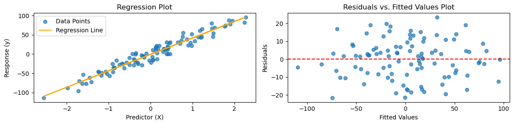
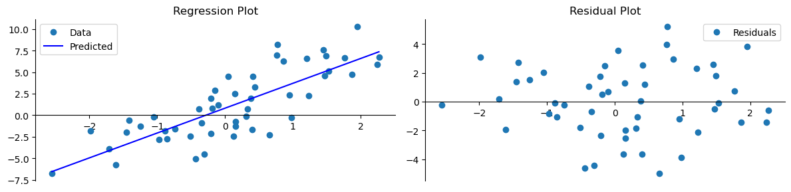
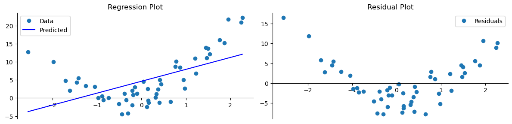
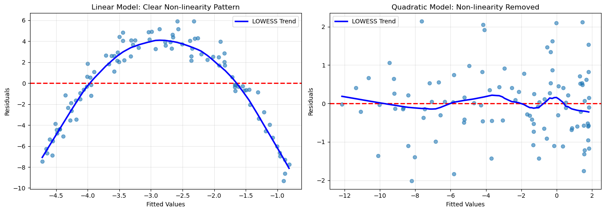
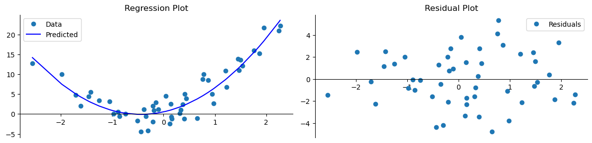
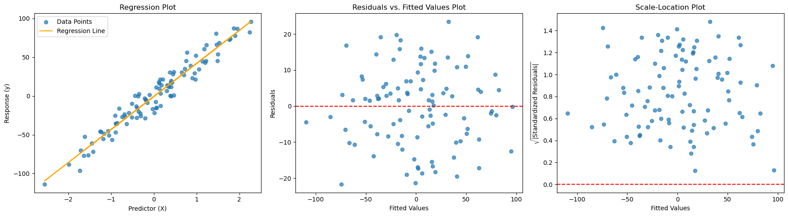

# 잔차 분석

잔차 분석은 선형회귀 모형이 자료에 얼마나 잘 맞는지 평가하는 결정적인 단계이다. 관측값과 예측값의 차이인 잔차를 살펴봄으로써 모형의 정확도와 핵심 가정의 성립 여부를 알 수 있다.

## 잔차의 이해

잔차는 관측값과 그에 대응하는 예측값의 차이이다.

$$
e_i = y_i - \hat{y}_i
$$

여기서 $y_i$는 관측값이고 $\hat{y}_i$는 회귀모형의 예측값이다.

$$\begin{array}{lll}
\text{예측값} && \hat{y}_i \\
\text{잔차} && y_i - \hat{y}_i \\\hline
\text{실제값} && y_i
\end{array}$$

잔차는 모형이 각 관측값에 얼마나 잘 맞는지를 드러낸다. 이상적으로는 0에 가까울수록 좋으며, 이는 예측이 관측값과 가깝게 일치함을 뜻한다.

## 핵심 가정

잔차 분석은 신뢰할 만한 선형회귀에 필수적인 다음 가정들을 확인한다.

- **선형성**: 설명변수와 반응변수의 관계가 선형이어야 한다. 잔차를 예측값에 대해 그렸을 때 패턴이 보이지 않아야 한다.
- **독립성**: 잔차들이 서로 독립이어야 한다. 시계열 자료에서 특히 중요하다.
- **등분산성(상수분산)**: 잔차의 분산이 독립변수의 모든 수준에서 일정해야 한다.
- **정규성**: 잔차가 정규분포를 따르는 것이 이상적이다. 모형을 추론에 쓸 때 특히 그렇다.

## 잔차그림

### 잔차-적합값 그림

이 그림은 **선형성**과 **등분산성**의 문제를 찾아내는 데 도움이 된다. 이상적으로는 잔차가 0을 지나는 수평선 주위에 패턴 없이 무작위로 흩어져 있어야 한다. 곡선 패턴은 비선형성을, 부채꼴이나 깔때기 모양은 이분산을 시사한다.

**일반 잔차그림과의 구분**: 잔차-적합값 그림은 $x$축에 적합값(예측값)을 두어 모형 전체를 점검한다. 일반적인 "잔차그림"은 $x$축에 개별 설명변수나 관측 순번을 두어 특정 설명변수와의 관계나 시간 추세를 진단하기도 한다.

| 항목 | 잔차-적합값 그림 | 일반 잔차그림 |
|---|---|---|
| **주된 목적** | 선형성과 등분산성 확인 | 개별 설명변수와의 관계 평가 |
| **X축** | 적합값(예측값) | 설명변수 또는 관측 순번 |
| **쓰는 때** | 적합 후 전반적 가정 점검 | 특정 설명변수나 시간 효과 진단 |

#### statsmodels로 구현하기

<div class="codebox" markdown>

**예제 1.** 모형이 잘 맞을 때의 잔차

```python
import matplotlib.pyplot as plt
import numpy as np
import pandas as pd
import statsmodels.api as sm
from sklearn.datasets import make_regression

# 모형이 잘 맞는 경우를 먼저 본다. 잔차 그림에 아무 무늬도 없어야 한다.
np.random.seed(0)
X, y = make_regression(n_samples=100, n_features=1, noise=10)
data = pd.DataFrame({'X': X.flatten(), 'y': y})

X_with_const = sm.add_constant(data['X'])
model = sm.OLS(data['y'], X_with_const).fit()

data['Fitted'] = model.fittedvalues
data['Residuals'] = model.resid

# 왼쪽은 회귀 그림, 오른쪽은 잔차 그림이다. 늘 짝으로 본다.
fig, (ax0, ax1) = plt.subplots(1, 2, figsize=(12, 3))

ax0.scatter(data['X'], data['y'], alpha=0.7, label='Data Points')
ax0.plot(data['X'], data['Fitted'], color='orange', label='Regression Line')
ax0.set_title('Regression Plot')
ax0.set_xlabel('Predictor (X)')
ax0.set_ylabel('Response (y)')
ax0.legend()

# 잔차가 0 선 둘레에 무늬 없이 흩어져 있으면 좋다. 이 자료가 그렇다.
ax1.scatter(data['Fitted'], data['Residuals'], alpha=0.7)
ax1.axhline(y=0, color='r', linestyle='--')
ax1.set_title('Residuals vs. Fitted Values Plot')
ax1.set_xlabel('Fitted Values')
ax1.set_ylabel('Residuals')

plt.tight_layout()
plt.show()
```



0을 중심으로 고르게 흩어진 띠. 이것이 기준선이며, 아래 그림들과 비교해 읽는다.

</div>

#### 그림 해석

1. **무작위 흩어짐**: 잔차가 0 주위에 무작위로 흩어져 있으면 선형성 가정이 성립함을 시사한다.
2. **일정한 폭**: 적합값 전 범위에 걸쳐 폭이 대체로 일정하면 등분산성을 뒷받침한다.
3. **패턴이나 깔때기 모양**: 곡선 패턴은 비선형성을, 깔때기 모양은 이분산을 나타낸다.

### 좋은 경우: 선형 자료에 선형모형

자료가 실제로 선형이고 선형모형을 적합하면 잔차가 일정한 분산으로 무작위로 흩어진다.

<div class="codebox" markdown>

**예제 2.** 회귀·잔차 그림 함수

```python
import matplotlib.pyplot as plt
import numpy as np
from sklearn.linear_model import LinearRegression

def generate_data(n=50, noise_level=3.0, seed=0):
    """기울기 2 의 직선 자료를 만든다. noise_level 로 잡음 크기를 조절한다."""
    np.random.seed(seed)
    x = np.random.randn(n, 1)
    x.sort(axis=0)
    noise = np.random.normal(0, 1, size=x.shape)
    y = (1 + 2 * x + noise_level * noise).reshape((-1,))
    return x, y

def perform_regression(x, y):
    """최소제곱으로 적합하고 예측값까지 돌려준다."""
    model = LinearRegression()
    model.fit(x, y)
    y_pred = model.predict(x)
    return model, y_pred

def plot_regression_and_residuals(x, y, y_pred):
    """회귀 그림과 잔차 그림을 나란히 그린다. 아래에서 되풀이해 쓴다."""
    fig, (ax0, ax1) = plt.subplots(1, 2, figsize=(12, 3))

    ax0.plot(x, y, 'o', label="Data")
    ax0.plot(x, y_pred, '-b', label="Predicted")
    ax0.set_title('Regression Plot')
    ax0.legend()

    ax1.plot(x, y - y_pred, 'o', label="Residuals")
    ax1.set_title('Residual Plot')
    ax1.legend()

    for ax in (ax0, ax1):
        ax.spines['top'].set_visible(False)
        ax.spines['right'].set_visible(False)
        ax.spines['bottom'].set_position("zero")

    plt.tight_layout()
    plt.show()

x, y = generate_data()
model, y_pred = perform_regression(x, y)
plot_regression_and_residuals(x, y, y_pred)
```



오른쪽으로 갈수록 퍼지는 깔때기 모양이다.

</div>

### 나쁜 경우: 다항 자료에 선형모형

자료가 다항 관계를 갖는데 선형모형만 적합하면 잔차에 뚜렷한 곡선 패턴이 나타난다. 선형성이 위배되었다는 신호이다.

<div class="codebox" markdown>

**예제 3.** 이차 자료를 직선으로 맞추면

```python
def generate_data(n=50, noise_level=3.0, d=1, seed=0):
    """차수 d 인 다항 자료를 만든다. d=1 이면 앞과 같은 직선이다."""
    np.random.seed(seed)
    x = np.random.randn(n, 1)
    x.sort(axis=0)
    noise = np.random.normal(0, 1, size=x.shape)
    y = (1 + np.sum([(k+1) * x**k for k in range(1, d+1)], axis=0) + noise_level * noise).reshape((-1,))
    return x, y

# 이차 자료를 직선으로 맞춘다. 회귀 그림만 보면 그럴듯해 보이지만
# 잔차 그림에는 굽은 무늬가 또렷하게 남는다. 잔차 그림을 보는 까닭이다.
x, y = generate_data(d=2)
model, y_pred = perform_regression(x, y)
plot_regression_and_residuals(x, y, y_pred)
```



잔차가 U자를 그린다. 모형이 선형인데 자료가 곡선이면 이런 패턴이 나온다.

</div>

#### 선형 대 이차 잔차 비교

모형 오설정을 더 잘 진단하려면 경쟁 모형들의 잔차를 직접 비교하는 것이 유용하다. 이차 관계를 따르는 자료를 생각하자.

<div class="codebox" markdown>

**예제 4.** 평활선으로 본 굽은 잔차

```python
import numpy as np
import matplotlib.pyplot as plt
import statsmodels.api as sm
from statsmodels.nonparametric.smoothers_lowess import lowess

# 같은 이야기를 평활선까지 얹어 더 또렷하게 본다.
np.random.seed(42)
x = np.random.uniform(-3, 3, 100)
y_true = 2 + 0.5 * x - 1.5 * x**2
y = y_true + np.random.normal(0, 1, len(x))

# 왼쪽에 쓸 선형 모형
X_linear = sm.add_constant(x)
model_linear = sm.OLS(y, X_linear).fit()
residuals_linear = model_linear.resid
y_pred_linear = model_linear.fittedvalues

# 오른쪽에 쓸 이차 모형
X_quad = sm.add_constant(np.column_stack([x, x**2]))
model_quad = sm.OLS(y, X_quad).fit()
residuals_quad = model_quad.resid
y_pred_quad = model_quad.fittedvalues

# 잔차에 평활선을 얹어 그린다
fig, (ax1, ax2) = plt.subplots(1, 2, figsize=(14, 5))

# 선형 모형의 잔차
ax1.scatter(y_pred_linear, residuals_linear, alpha=0.6)
ax1.axhline(y=0, color='r', linestyle='--', linewidth=2)

# 평활선이 굽어 있으면 남은 구조가 있다는 신호다.
lowess_result = lowess(residuals_linear, y_pred_linear, frac=0.3)
ax1.plot(lowess_result[:, 0], lowess_result[:, 1], 'b-', linewidth=2.5,
         label='LOWESS Trend')

ax1.set_xlabel('Fitted Values')
ax1.set_ylabel('Residuals')
ax1.set_title('Linear Model: Clear Non-linearity Pattern')
ax1.legend()
ax1.grid(True, alpha=0.3)

# 이차항을 넣고 나면 평활선이 평평해진다. 무늬가 사라진 것이다.
ax2.scatter(y_pred_quad, residuals_quad, alpha=0.6)
ax2.axhline(y=0, color='r', linestyle='--', linewidth=2)

# 평활선을 얹는다
lowess_result_quad = lowess(residuals_quad, y_pred_quad, frac=0.3)
ax2.plot(lowess_result_quad[:, 0], lowess_result_quad[:, 1], 'b-', linewidth=2.5,
         label='LOWESS Trend')

ax2.set_xlabel('Fitted Values')
ax2.set_ylabel('Residuals')
ax2.set_title('Quadratic Model: Non-linearity Removed')
ax2.legend()
ax2.grid(True, alpha=0.3)

plt.tight_layout()
plt.show()

# 요약 비교
print("Model Comparison:")
print(f"Linear Model R²:    {model_linear.rsquared:.4f}")
print(f"Quadratic Model R²: {model_quad.rsquared:.4f}")
print(f"Linear Model RSS:    {np.sum(residuals_linear**2):.2f}")
print(f"Quadratic Model RSS: {np.sum(residuals_quad**2):.2f}")
```

출력:

```
Model Comparison:
Linear Model R²:    0.0830
Quadratic Model R²: 0.9534
Linear Model RSS:    1530.56
Quadratic Model RSS: 77.72
```



이차 모형의 $R^2$가 0.083에서 0.953으로 뛴다. 선형 모형의 잔차 그림에 뚜렷한 곡선이 보였던 이유가 이것이다.

$R^2 = 0.083$이라는 값 자체보다, **잔차 그림이 그 원인을 알려 준다**는 점이 중요하다. 결정계수는 "얼마나 못 맞히는가"만 말하고 "왜 못 맞히는가"는 말하지 않는다.

**핵심 통찰**: 잔차를 지나는 LOWESS(국소가중 산점도 평활) 평활곡선이 위배 패턴을 뚜렷이 드러낸다. 선형모형에서는 이 곡선이 0 아래로 내려갔다가 위로 올라가며, 체계적인 과소예측과 과대예측이 일어나고 있음을 나타낸다. 이차 모형의 잔차는 무작위로 흩어져 비선형성의 형태가 제대로 포착되었음을 보여준다. $R^2$가 0.083에서 0.953으로 뛰고 잔차제곱합이 1530.56에서 77.72로 20분의 1 수준이 되는 것이 그 차이를 수치로 보여준다.

</div>

### 해결: 다항회귀

참 자료생성과정에 맞추어 다항 특성을 추가하면 잔차의 패턴이 해소된다.

<div class="codebox" markdown>

**예제 5.** 다항회귀로 고치기

```python
def perform_regression(x, y, d=1):
    """차수 d 의 다항회귀. x, x^2, ... 를 열로 쌓아 넣기만 하면 된다.

    항이 x 의 거듭제곱일 뿐 계수에 대해서는 여전히 선형이므로,
    최소제곱을 그대로 쓸 수 있다. 다항회귀도 선형모형인 까닭이다.
    """
    x_poly = np.concatenate([x**k for k in range(1, d+1)], axis=1)
    model = LinearRegression()
    model.fit(x_poly, y)
    y_pred = model.predict(x_poly)
    return model, y_pred

x, y = generate_data(d=2)
model, y_pred = perform_regression(x, y, d=2)
plot_regression_and_residuals(x, y, y_pred)
```



표준편차 단위로 바꾸면 $\pm 2$, $\pm 3$ 기준선과 곧바로 비교할 수 있다.

</div>

!!! tip "참고"
    [Transforming nonlinear data (Khan Academy)](https://www.khanacademy.org/math/ap-statistics/bivariate-data-ap/assessing-fit-least-squares-regression/v/transforming-nonlinear-data)

## 척도-위치 그림

척도-위치 그림은 표준화 잔차 절댓값의 제곱근을 적합값에 대해 그려 **등분산성**을 확인한다. 그림 전체에 걸쳐 폭이 일정하면 상수분산을 뒷받침한다.

<div class="codebox" markdown>

**예제 6.** 척도-위치 그림까지

```python
import matplotlib.pyplot as plt
import numpy as np
import pandas as pd
import statsmodels.api as sm
from sklearn.datasets import make_regression

np.random.seed(0)
X, y = make_regression(n_samples=100, n_features=1, noise=10)
data = pd.DataFrame({'X': X.flatten(), 'y': y})

X_with_const = sm.add_constant(data['X'])
model = sm.OLS(data['y'], X_with_const).fit()

data['Fitted'] = model.fittedvalues
data['Residuals'] = model.resid
# 척도-위치 그림을 위해 잔차를 표준화하고 절댓값의 제곱근을 취한다.
data['Standardized Residuals'] = data['Residuals'] / np.std(data['Residuals'])
data['Sqrt Abs Standardized Residuals'] = np.sqrt(np.abs(data['Standardized Residuals']))

fig, (ax0, ax1, ax2) = plt.subplots(1, 3, figsize=(18, 5))

# 회귀 그림
ax0.scatter(data['X'], data['y'], alpha=0.7, label='Data Points')
ax0.plot(data['X'], data['Fitted'], color='orange', label='Regression Line')
ax0.set_title('Regression Plot')
ax0.set_xlabel('Predictor (X)')
ax0.set_ylabel('Response (y)')
ax0.legend()

# 잔차 대 적합값
ax1.scatter(data['Fitted'], data['Residuals'], alpha=0.7)
ax1.axhline(y=0, color='r', linestyle='--')
ax1.set_title('Residuals vs. Fitted Values Plot')
ax1.set_xlabel('Fitted Values')
ax1.set_ylabel('Residuals')

# 척도-위치 그림은 등분산성만 본다. 부호를 없앴으므로 점들이 이루는 띠의
# 높이가 일정한지만 보면 된다.
ax2.scatter(data['Fitted'], data['Sqrt Abs Standardized Residuals'], alpha=0.7)
ax2.axhline(y=0, color='r', linestyle='--')
ax2.set_title('Scale-Location Plot')
ax2.set_xlabel('Fitted Values')
ax2.set_ylabel(r'$\sqrt{|\text{Standardized Residuals}|}$')

plt.tight_layout()
plt.show()
```



네 그림을 함께 보면 어느 가정이 어디서 깨지는지 한눈에 들어온다.

</div>

### 왜 제곱근을 쓰는가

척도-위치 그림에서 표준화 잔차 절댓값에 제곱근을 취하는 것이 관례인 이유는 다음과 같다.

- **변동의 안정화**: 제곱근 변환이 큰 값을 압축하여 흩어짐의 추세를 알아보기 쉽게 만든다.
- **시각적 명료성**: 이상점의 영향을 줄여 시각적으로 더 균형 잡힌 그림을 만든다.
- **통계적 관례**: 통계 소프트웨어의 표준 진단 출력과 일관된다.

제곱근 없이 절댓값만 쓰는 것도 타당하며, 단순함이 필요한 입문 상황에서 특히 그렇다. 추가 변환 없이 적합선에서의 이탈을 직접 보여준다.

## 가정 위배에 대한 대처

잔차 분석에서 위배가 드러나면

- **변수변환**: 종속변수나 독립변수에 로그나 제곱근 변환을 적용해 비선형성과 이분산에 대처한다.
- **가중최소제곱(WLS)**: 분산에 따라 관측값마다 다른 가중치를 주어 비상수 분산을 직접 다룬다.
- **로버스트 회귀**: 이상점의 영향을 최소화해 가정 이탈에 더 견고하게 만든다.
- **다항 특성**: 잔차그림이 비선형성을 시사하면 다항 항을 추가한다.

## 연습문제

<div class="drillbox" markdown>

**연습문제 1.** <span class="diff med" title="중간"></span>
원잔차, 표준화 잔차, 스튜던트화(외부 스튜던트화) 잔차의 차이를 설명하라. 이상점 탐지에는 어느 것이 가장 적절하며 왜 그런가?

</div>

??? success "풀이"

    - **원잔차:** $e_i = Y_i - \hat{Y}_i$. 분산이 서로 다르므로($\text{Var}(e_i) = \sigma^2(1 - h_{ii})$) 관측값끼리 직접 비교하면 오도할 수 있다.

    - **표준화(내부 스튜던트화) 잔차:** $r_i = e_i / (\hat{\sigma}\sqrt{1 - h_{ii}})$. 각 잔차를 그 추정 표준편차로 나눈다. 모형 가정 아래에서 근사적으로 $N(0,1)$을 따른다.

    - **외부 스튜던트화 잔차:** $t_i = e_i / (\hat{\sigma}_{(i)}\sqrt{1 - h_{ii}})$. 여기서 $\hat{\sigma}_{(i)}$는 관측값 $i$를 뺀 뒤 추정한 값이다. 자유도 $n - p - 2$의 정확한 $t$ 분포를 따른다.

    이상점 탐지에는 **외부 스튜던트화 잔차**가 가장 적절하다. 문제의 이상점 자체 때문에 부풀려지지 않은 분산 추정을 쓰므로 그 관측값이 정말 극단적인지를 더 정직하게 평가한다.

<div class="drillbox" markdown>

**연습문제 2.** <span class="diff easy" title="쉬움"></span>
어떤 잔차그림에서 잔차가 뚜렷한 패턴 없이 0 주위에 무작위로 흩어져 있다. 모형 가정에 대해 무엇을 결론지을 수 있는가? 이 그림이 다루지 **못하는** 가정은 무엇인가?

</div>

??? success "풀이"
    잔차-적합값 그림이 0 주위의 무작위 흩어짐을 보이면 **선형성**(체계적 곡률 없음)과 **등분산성**(일정한 폭) 가정을 뒷받침한다. 오차의 평균이 대략 0임도 확인해 준다.

    그러나 이 그림은 다음을 다루지 **못한다**. (1) 잔차의 **정규성**(Q-Q 그림이나 히스토그램이 필요하다), (2) **독립성**(잔차-순서 그림이나 Durbin-Watson 검정이 필요하다), (3) **이상점과 영향점**(Cook 거리나 지렛대 진단이 필요하다. 영향점 하나가 직선을 자기 쪽으로 끌어당겨 "보기 좋은" 잔차그림을 만들 수 있기 때문이다).

<div class="drillbox" markdown>

**연습문제 3.** <span class="diff med" title="중간"></span>
척도-위치 그림에 뚜렷한 상승 추세가 나타난다. 이것이 무엇을 나타내며 표준적인 잔차-적합값 그림과 어떻게 다른지 기술하라.

</div>

??? success "풀이"
    **척도-위치 그림**은 $\sqrt{|\text{표준화 잔차}|}$를 적합값에 대해 그린다. 상승 추세는 잔차의 **흩어짐**(절대 크기로 잰)이 적합값과 함께 커진다는 뜻이며 **이분산**을 나타낸다.

    표준적인 잔차-적합값 그림과 다른 점은 잔차의 부호가 아니라 **크기**에만 집중한다는 것이다. 표준 그림에서도 이분산이 깔때기 모양으로 나타날 수 있지만, 척도-위치 그림은 부호를 없애고 제곱근 척도로 그려지는 양의 분산을 안정화하므로 분산의 증가를 훨씬 쉽게 탐지할 수 있다.

---

## 정리하며

잔차 $e_i=y_i-\hat y_i$ 가 **모형 진단의 주재료**다.

- **잔차가 오차의 추정값이다.** 참 오차 $\varepsilon_i$ 는 관측할 수 없고 잔차로 대신 본다. 다만 **잔차는 오차와 달리 서로 상관되어 있고 분산도 일정하지 않다**($\mathrm{Var}(e_i)=\sigma^2(1-h_{ii})$).
- **그래서 표준화·스튜던트화 잔차를 쓴다.** 모자값 $h_{ii}$ 로 보정해 비교 가능하게 만든 것이며, 대략 $|r|>2$ 를 눈여겨본다.
- **네 가지 그림이 기본이다.** 적합값 대 잔차(선형성·등분산성), Q-Q(정규성), 순서 대 잔차(독립성), 척도–위치 그림.
- **패턴이 없어야 정상이다.** 무작위한 구름 모양이면 좋고, 곡선·부채꼴·주기가 보이면 무언가 놓친 것이다.
- **잔차의 합은 언제나 $0$ 이다.** 절편이 있으면 자동으로 그렇게 되므로, 그 사실 자체는 아무 정보도 아니다.

다음 절 **영향점**으로 넘어간다.
