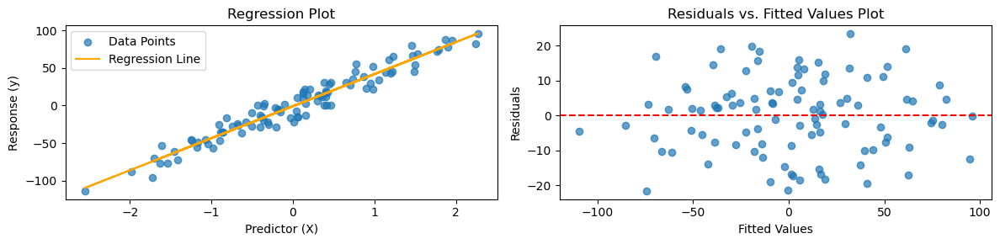
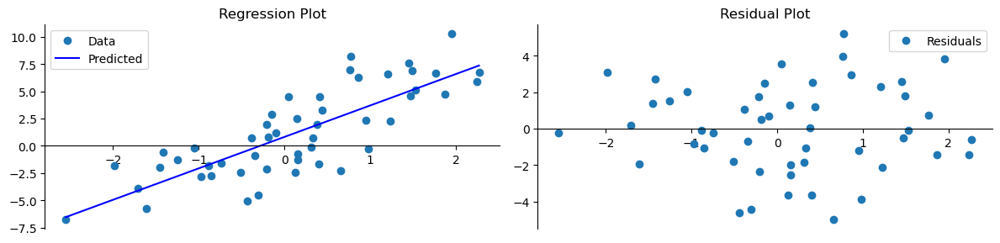
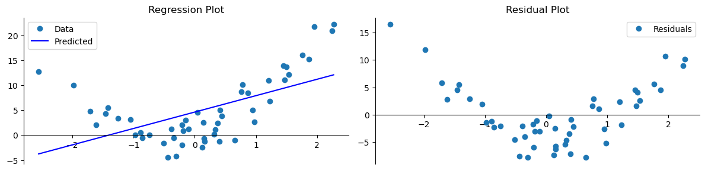
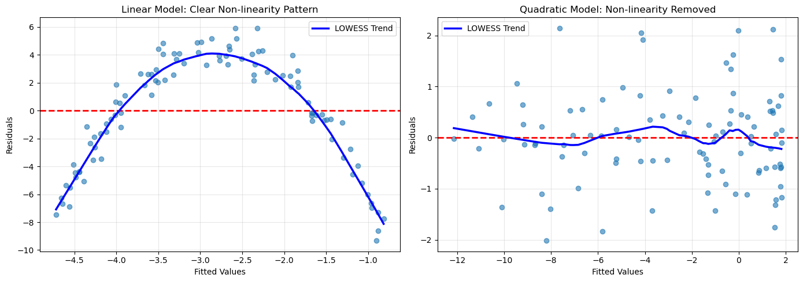
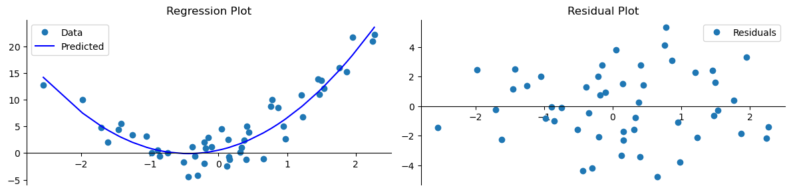
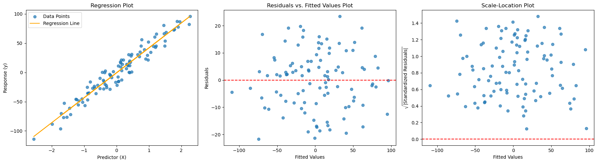

# 잔차 분석

잔차 분석은 선형회귀 모형이 자료에 얼마나 잘 맞는지 평가하는 결정적인 단계이다. 관측값과 예측값의 차이인 잔차를 살펴봄으로써 모형의 정확도와 핵심 가정의 성립 여부를 알 수 있다.

## 잔차의 이해

잔차는 관측값과 그에 대응하는 예측값의 차이이다.

$$
e_i = y_i - \hat{y}_i
$$

여기서 $y_i$는 관측값이고 $\hat{y}_i$는 회귀모형의 예측값이다.

$$\begin{array}{lll}
\text{예측값} && \hat{y}_i \\
\text{잔차} && y_i - \hat{y}_i \\\hline
\text{실제값} && y_i
\end{array}$$

잔차는 모형이 각 관측값에 얼마나 잘 맞는지를 드러낸다. 이상적으로는 0에 가까울수록 좋으며, 이는 예측이 관측값과 가깝게 일치함을 뜻한다.

## 핵심 가정

잔차 분석은 신뢰할 만한 선형회귀에 필수적인 다음 가정들을 확인한다.

- **선형성**: 설명변수와 반응변수의 관계가 선형이어야 한다. 잔차를 예측값에 대해 그렸을 때 패턴이 보이지 않아야 한다.
- **독립성**: 잔차들이 서로 독립이어야 한다. 시계열 자료에서 특히 중요하다.
- **등분산성(상수분산)**: 잔차의 분산이 독립변수의 모든 수준에서 일정해야 한다.
- **정규성**: 잔차가 정규분포를 따르는 것이 이상적이다. 모형을 추론에 쓸 때 특히 그렇다.

## 잔차그림

### 잔차-적합값 그림

이 그림은 **선형성**과 **등분산성**의 문제를 찾아내는 데 도움이 된다. 이상적으로는 잔차가 0을 지나는 수평선 주위에 패턴 없이 무작위로 흩어져 있어야 한다. 곡선 패턴은 비선형성을, 부채꼴이나 깔때기 모양은 이분산을 시사한다.

**일반 잔차그림과의 구분**: 잔차-적합값 그림은 $x$축에 적합값(예측값)을 두어 모형 전체를 점검한다. 일반적인 "잔차그림"은 $x$축에 개별 설명변수나 관측 순번을 두어 특정 설명변수와의 관계나 시간 추세를 진단하기도 한다.

| 항목 | 잔차-적합값 그림 | 일반 잔차그림 |
|---|---|---|
| **주된 목적** | 선형성과 등분산성 확인 | 개별 설명변수와의 관계 평가 |
| **X축** | 적합값(예측값) | 설명변수 또는 관측 순번 |
| **쓰는 때** | 적합 후 전반적 가정 점검 | 특정 설명변수나 시간 효과 진단 |

#### statsmodels로 구현하기

<div class="exbox" markdown>

**보기 1.** <span class="diff easy" title="쉬움"></span> 모형이 잘 맞을 때의 잔차. `make_regression(n_samples=100, n_features=1, noise=10)`은 $x_i \sim N(0,1)$, $y_i = \beta x_i + \varepsilon_i$, $\varepsilon_i \sim N(0, 10^2)$인 자료를 만든다(절편은 0이다).

**(1)** 그림을 보기 **전에** 잔차가 들어갈 띠의 폭을 계산하시오. $E[\sum_i e_i^2] = (n-p)\sigma^2$을 써서 잔차제곱평균의 이론값을 구하고, $\pm 2\hat\sigma$ 밖에 놓일 점이 몇 개쯤일지 말하시오. 또 모집단 $R^2$을 $\beta$와 $\sigma$로 적으시오.

**(2)** "무늬가 없다"를 눈이 아니라 **수로** 판정하는 방법 셋을 세우고 확인하시오.

</div>

??? success "풀이"

    **(1) 해석적으로.** [13.2절 보기 1](../assumptions/checking_homoscedasticity.md)에서 $E[\mathbf e^\top \mathbf e] = \operatorname{tr}((I-H)\Sigma)$를 보였다. 등분산이면 $\Sigma = \sigma^2 I$이고 $\operatorname{tr}(I - H) = n - p$이므로

    $$
    E\!\left[\frac{1}{n}\sum_i e_i^2\right] = \frac{(n-p)\sigma^2}{n} = \frac{98 \times 100}{100} = 98
    $$

    이다. 곧 잔차의 제곱평균이 $98$ 근처, 제곱근으로 $9.90$ 근처여야 한다. **참 $\sigma = 10$보다 조금 작다.** 두 모수를 적합하느라 잔차가 그만큼 수축했기 때문이다.

    $\hat\sigma = \sqrt{\text{SSE}/(n-p)}$는 이 수축을 되돌린 값이므로 $\sigma$를 겨냥한다. 오차가 정규이면 표준화 잔차가 대략 표준정규이므로 $\pm 2\hat\sigma$ 밖에 놓일 점은 $100 \times 0.0455 \approx 5$개가 기댓값이다. 다만 잔차는 서로 독립이 아니고 분산도 $\sigma^2(1-h_{ii})$로 조금씩 다르므로 이 수는 어림이다.

    모집단 $R^2$은 신호 대 전체의 비다. $\operatorname{Var}(x) = 1$이므로

    $$
    R^2_{\text{pop}} = \frac{\beta^2 \operatorname{Var}(x)}{\beta^2\operatorname{Var}(x) + \sigma^2} = \frac{\beta^2}{\beta^2 + 100}
    $$

    이다.

    **(2) 무늬 없음을 재는 세 가지.** 잔차 그림에서 눈이 찾는 것은 셋이고, 각각에 대응하는 수가 있다.

    | 눈이 보는 것 | 수로 재면 | 기대값 |
    |---|---|---|
    | 전체 기울기 | $\operatorname{corr}(e, \hat y)$ | **항등적으로 0** |
    | 깔때기 | $\operatorname{corr}(\lvert e \rvert, \hat y)$ | 0 근처 |
    | 휘어짐 | $e$를 $\hat y, \hat y^2$에 회귀한 2차항 | 유의하지 않음 |

    첫 줄이 항등적으로 0인 것은 정규방정식 때문이며([13.2절 보기 2](../assumptions/checking_homoscedasticity.md)), **그러므로 기울기는 볼 필요가 없다.** 읽을 것은 둘째와 셋째 줄뿐이다.

    ```python
    import matplotlib.pyplot as plt
    import numpy as np
    import pandas as pd
    import statsmodels.api as sm
    from sklearn.datasets import make_regression

    # 모형이 잘 맞는 경우를 먼저 본다. 잔차 그림에 아무 무늬도 없어야 한다.
    np.random.seed(0)
    X, y = make_regression(n_samples=100, n_features=1, noise=10)
    data = pd.DataFrame({'X': X.flatten(), 'y': y})

    X_with_const = sm.add_constant(data['X'])
    model = sm.OLS(data['y'], X_with_const).fit()

    data['Fitted'] = model.fittedvalues
    data['Residuals'] = model.resid

    # 왼쪽은 회귀 그림, 오른쪽은 잔차 그림이다. 늘 짝으로 본다.
    fig, (ax0, ax1) = plt.subplots(1, 2, figsize=(12, 3))

    ax0.scatter(data['X'], data['y'], alpha=0.7, label='Data Points')
    ax0.plot(data['X'], data['Fitted'], color='orange', label='Regression Line')
    ax0.set_title('Regression Plot')
    ax0.set_xlabel('Predictor (X)')
    ax0.set_ylabel('Response (y)')
    ax0.legend()

    # 잔차가 0 선 둘레에 무늬 없이 흩어져 있으면 좋다. 이 자료가 그렇다.
    ax1.scatter(data['Fitted'], data['Residuals'], alpha=0.7)
    ax1.axhline(y=0, color='r', linestyle='--')
    ax1.set_title('Residuals vs. Fitted Values Plot')
    ax1.set_xlabel('Fitted Values')
    ax1.set_ylabel('Residuals')

    plt.tight_layout()
    plt.show()
    ```

    

    참값과 세 판정을 모두 수로 확인한다.

    ```python
    import numpy as np
    import statsmodels.api as sm
    from sklearn.datasets import make_regression

    # make_regression 은 참 계수를 돌려줄 수 있다. 같은 씨앗이면 같은 자료다.
    np.random.seed(0)
    _, _, true_coef = make_regression(n_samples=100, n_features=1, noise=10, coef=True)
    n, p, sigma = 100, 2, 10.0

    print(f"참 기울기 = {true_coef:.4f},   적합값 = {model.params.iloc[1]:.4f}")
    print(f"참 절편   = 0.0000,   적합값 = {model.params.iloc[0]:.4f}")
    print(f"모집단 R^2 = {true_coef ** 2 / (true_coef ** 2 + sigma ** 2):.4f},"
          f"   표본 R^2 = {model.rsquared:.4f}")

    e = model.resid.values
    print(f"\n잔차제곱평균의 이론값 sigma^2 (n-p)/n = {sigma ** 2 * (n - p) / n:.3f}")
    print(f"실측 = {(e ** 2).mean():.3f}")
    print(f"sigma_hat = sqrt(SSE/(n-p)) = {np.sqrt(model.mse_resid):.4f}")
    print(f"|e| > 2 sigma_hat 인 점의 개수 = {(np.abs(e) > 2 * np.sqrt(model.mse_resid)).sum()} / {n}")

    # "무늬 없음" 을 눈 대신 수로 판정한다
    f = model.fittedvalues.values
    print(f"\ncorr(e, fitted)  = {np.corrcoef(e, f)[0, 1]:+.2e}   (항등적으로 0)")
    print(f"corr(|e|, fitted) = {np.corrcoef(np.abs(e), f)[0, 1]:+.4f}   (등분산)")
    aux = sm.OLS(e, sm.add_constant(np.column_stack([f, f ** 2]))).fit()
    print(f"e 를 fitted, fitted^2 에 회귀한 2차항의 p = {aux.pvalues[2]:.4f}   (선형성)")
    ```

    출력:

    ```
    참 기울기 = 42.3855,   적합값 = 42.6194
    참 절편   = 0.0000,   적합값 = -0.8142
    모집단 R^2 = 0.9473,   표본 R^2 = 0.9417

    잔차제곱평균의 이론값 sigma^2 (n-p)/n = 98.000
    실측 = 114.171
    sigma_hat = sqrt(SSE/(n-p)) = 10.7936
    |e| > 2 sigma_hat 인 점의 개수 = 2 / 100

    corr(e, fitted)  = -1.94e-15   (항등적으로 0)
    corr(|e|, fitted) = +0.0223   (등분산)
    e 를 fitted, fitted^2 에 회귀한 2차항의 p = 0.4335   (선형성)
    ```

    **참값과 적합값이 잘 맞는다.** 기울기 $42.619$ 대 참값 $42.3855$, 모집단 $R^2$ $0.9473$ 대 표본 $0.9417$이다.

    **잔차제곱평균은 이론값보다 크게 나왔다.** $98$을 예상했는데 $114.17$이다. $\hat\sigma = 10.79$로 참 $\sigma = 10$보다 $8\%$ 크다는 뜻이다. $\hat\sigma^2$의 상대표준편차가 $\sqrt{2/(n-p)} = \sqrt{2/98} = 0.143$이고 실제 어긋남이 $16.5\%$이므로 $1.15$ 표준편차 거리다. $\hat\sigma$ 자체의 상대표준편차는 그 절반인 $7\%$이니, **한 표본에서 $\hat\sigma$가 $\pm 7\%$씩 흔들리는 것이 정상이며**, 잔차 띠의 폭을 보고 $\sigma$를 눈으로 읽을 때 기억해 둘 일이다.

    $\pm 2\hat\sigma$ 밖의 점이 $2$개로 기대값 $5$보다 적다. $100$개 가운데 $5$개를 기대할 때의 표준편차가 $\sqrt{100 \times 0.0455 \times 0.9545} = 2.1$이므로 역시 흔한 일이다. 띠의 폭을 $\hat\sigma$로 재면 이미 부풀려진 척도를 쓰는 셈이라 바깥 점이 더 적게 세어지는 쪽으로 기운다.

    **세 판정이 모두 깨끗하다.** $\operatorname{corr}(e, \hat y)$가 $-1.9 \times 10^{-15}$로 항등적 0이고, $\operatorname{corr}(\lvert e\rvert, \hat y) = 0.0223$으로 깔때기가 없으며, 2차항의 $p = 0.4335$로 휘어짐도 없다. **이 세 수가 이 페이지의 기준선이다.** 아래 보기들에서 같은 수를 다시 재어 무엇이 어떻게 달라지는지 본다.

#### 그림 해석

1. **무작위 흩어짐**: 잔차가 0 주위에 무작위로 흩어져 있으면 선형성 가정이 성립함을 시사한다.
2. **일정한 폭**: 적합값 전 범위에 걸쳐 폭이 대체로 일정하면 등분산성을 뒷받침한다.
3. **패턴이나 깔때기 모양**: 곡선 패턴은 비선형성을, 깔때기 모양은 이분산을 나타낸다.

### 좋은 경우: 선형 자료에 선형모형

자료가 실제로 선형이고 선형모형을 적합하면 잔차가 일정한 분산으로 무작위로 흩어진다.

<div class="exbox" markdown>

**보기 2.** <span class="diff easy" title="쉬움"></span> 회귀·잔차 그림 함수. `generate_data()`는 $x_i \sim N(0,1)$, $y_i = 1 + 2x_i + 3u_i$, $u_i \sim N(0,1)$인 자료를 $n = 50$개 만든다. 곧 참 절편 $1$, 참 기울기 $2$, 참 $\sigma = 3$이다.

**(1)** 아래 세 함수를 만들어 적합하고, 추정값이 참값에서 **몇 표준오차** 떨어져 있는지 재시오. 참 표준오차는 $\sigma/\sqrt{S_{xx}}$로 계산할 수 있다.

**(2)** 그림을 "깔때기"로 읽어도 되는가. 적합값 사분위별 잔차의 폭과 Breusch-Pagan 검정으로 판정하시오.

</div>

??? success "풀이"

    **(1) 적합과 참값.** 이 자료는 등분산이므로 참 표준오차가 닫힌 꼴로 나온다.

    $$
    \operatorname{SE}(\hat\beta_1) = \frac{\sigma}{\sqrt{S_{xx}}},
    \qquad S_{xx} = \sum_i (x_i - \bar x)^2
    $$

    $\sigma = 3$을 알고 있으므로 $S_{xx}$만 자료에서 재면 된다.

    ```python
    import matplotlib.pyplot as plt
    import numpy as np
    from sklearn.linear_model import LinearRegression

    def generate_data(n=50, noise_level=3.0, seed=0):
        """기울기 2 의 직선 자료를 만든다. noise_level 로 잡음 크기를 조절한다."""
        np.random.seed(seed)
        x = np.random.randn(n, 1)
        x.sort(axis=0)
        noise = np.random.normal(0, 1, size=x.shape)
        y = (1 + 2 * x + noise_level * noise).reshape((-1,))
        return x, y

    def perform_regression(x, y):
        """최소제곱으로 적합하고 예측값까지 돌려준다."""
        model = LinearRegression()
        model.fit(x, y)
        y_pred = model.predict(x)
        return model, y_pred

    def plot_regression_and_residuals(x, y, y_pred):
        """회귀 그림과 잔차 그림을 나란히 그린다. 아래에서 되풀이해 쓴다."""
        fig, (ax0, ax1) = plt.subplots(1, 2, figsize=(12, 3))

        ax0.plot(x, y, 'o', label="Data")
        ax0.plot(x, y_pred, '-b', label="Predicted")
        ax0.set_title('Regression Plot')
        ax0.legend()

        ax1.plot(x, y - y_pred, 'o', label="Residuals")
        ax1.set_title('Residual Plot')
        ax1.legend()

        for ax in (ax0, ax1):
            ax.spines['top'].set_visible(False)
            ax.spines['right'].set_visible(False)
            ax.spines['bottom'].set_position("zero")

        plt.tight_layout()
        plt.show()

    x, y = generate_data()
    model, y_pred = perform_regression(x, y)
    plot_regression_and_residuals(x, y, y_pred)
    ```

    

    ```python
    import numpy as np
    import statsmodels.api as sm

    e = y - y_pred
    xf = x.ravel()
    Sxx = ((xf - xf.mean()) ** 2).sum()

    print(f"참값 (절편, 기울기) = (1, 2)")
    print(f"적합값              = ({model.intercept_:.4f}, {model.coef_[0]:.4f})")
    print(f"참 SE(기울기) = sigma/sqrt(S_xx) = {3 / np.sqrt(Sxx):.4f}   (S_xx = {Sxx:.3f})")
    print(f"(b1 - 2)/SE = {(model.coef_[0] - 2) / (3 / np.sqrt(Sxx)):+.3f}")

    print(f"\n잔차제곱평균 이론 sigma^2 (n-p)/n = {9 * 48 / 50:.3f},  실측 {(e ** 2).mean():.3f}")

    # 정말 깔때기인가. 적합값 사분위로 잘라 잔차의 폭을 잰다.
    q = np.quantile(y_pred, [0, 0.25, 0.5, 0.75, 1.0])
    print()
    for k in range(4):
        sel = (y_pred >= q[k]) & (y_pred <= q[k + 1])
        print(f"  Q{k + 1}: n = {sel.sum()}, sd(e) = {e[sel].std(ddof=1):.4f}")
    print(f"\ncorr(|e|, fitted) = {np.corrcoef(np.abs(e), y_pred)[0, 1]:+.4f}")
    from statsmodels.stats.diagnostic import het_breuschpagan
    lm, p = het_breuschpagan(e, sm.add_constant(xf))[:2]
    print(f"Breusch-Pagan: LM = {lm:.4f}, p = {p:.4f}")

    # 씨앗을 바꾸어 400번 되풀이하면 기울기는 2 둘레에 모인다.
    slopes = []
    for s in range(400):
        xs, ys = generate_data(seed=s)
        slopes.append(perform_regression(xs, ys)[0].coef_[0])
    print(f"\n씨앗 400개의 기울기: 평균 {np.mean(slopes):.4f}, 표준편차 {np.std(slopes):.4f}")
    ```

    출력:

    ```
    참값 (절편, 기울기) = (1, 2)
    적합값              = (0.8125, 2.8868)
    참 SE(기울기) = sigma/sqrt(S_xx) = 0.3769   (S_xx = 63.340)
    (b1 - 2)/SE = +2.352

    잔차제곱평균 이론 sigma^2 (n-p)/n = 8.640,  실측 5.770

      Q1: n = 13, sd(e) = 1.6495
      Q2: n = 12, sd(e) = 2.7632
      Q3: n = 12, sd(e) = 3.2007
      Q4: n = 13, sd(e) = 2.1579

    corr(|e|, fitted) = +0.1255
    Breusch-Pagan: LM = 0.6560, p = 0.4180

    씨앗 400개의 기울기: 평균 1.9988, 표준편차 0.4458
    ```

    **(1)의 답: 이 표본은 꽤 빗나갔다.** 기울기 추정값이 $2.887$로 참값 $2$에서 참 표준오차의 $2.35$배 떨어져 있다. $\hat\sigma$도 작게 나왔다. 잔차제곱평균이 $5.770$으로 이론값 $8.640$의 $2/3$다. 까닭은 둘이다. 이 씨앗이 뽑은 잡음 $u_i$의 표본표준편차가 $0.876$으로 참값 $1$보다 작았고, 게다가 $\operatorname{corr}(u, x) = 0.384$로 $x$와 같은 방향으로 기울어 **그 몫이 기울기에 흡수되었다.** 잡음의 제곱합이 $338.3$(기대 $441$)인데 적합 뒤에는 $288.5$(기대 $432$)만 남은 것이 흡수된 양이다.

    씨앗을 $400$개 바꾸어 보면 기울기의 평균이 $1.9988$로 참값 $2$에 맞는다. **추정은 불편이고, 다만 이 한 표본이 $2.35$ 표준오차 쪽에 떨어졌을 뿐**이다(양측으로 $P = 0.019$, 쉰 번에 한 번쯤 일어나는 일이다). 씨앗 간 표준편차 $0.4458$은 이 표본의 참 SE $0.3769$보다 조금 큰데, $S_{xx}$ 자체가 표본마다 달라지기 때문이다.

    **(2)의 답: 깔때기가 아니다.** 적합값 사분위별 잔차의 표준편차가 $1.65, 2.76, 3.20, 2.16$으로 **단조가 아니다.** 가운데가 가장 넓고 양끝이 좁은 모양인데, 이것은 이분산이 아니라 $x$가 정규분포라 가운데에 점이 몰려 있는 데서 오는 모습이다. 구간당 $12$–$13$개로 센 표준편차의 상대오차가 $1/\sqrt{2 \times 12} = 20\%$나 되므로 이 정도 들쭉날쭉은 잡음이다.

    형식적 검정도 같은 말을 한다. $\operatorname{corr}(\lvert e\rvert, \hat y) = 0.126$이고 Breusch-Pagan이 $p = 0.418$이다. **자료를 등분산으로 만들었으니 옳은 판정이며, "오른쪽으로 갈수록 퍼진다"고 읽는다면 그림에서 없는 것을 본 것이다.** 점 $50$개의 산점도에서 폭의 변화를 눈으로 판정하는 일이 얼마나 미덥지 못한지 보여 주는 보기이기도 하다.

### 나쁜 경우: 다항 자료에 선형모형

자료가 다항 관계를 갖는데 선형모형만 적합하면 잔차에 뚜렷한 곡선 패턴이 나타난다. 선형성이 위배되었다는 신호이다.

<div class="exbox" markdown>

**보기 3.** <span class="diff easy" title="쉬움"></span> 이차 자료를 직선으로 맞추면. `generate_data(d=2)`는 $y_i = 1 + 2x_i + 3x_i^2 + 3u_i$를 만든다. $x_i \sim N(0,1)$이다.

**(1)** 이 자료에 직선을 맞추면 $n \to \infty$에서 기울기가 $2$, 절편이 $4$로 수렴함을 보이시오($E[x] = E[x^3] = 0$, $E[x^2] = 1$을 쓴다). 또 잔차가

$$
e_i = \underbrace{\big[3x_i^2 \text{ 를 } (1, x) \text{ 에 사영하고 남은 것}\big]}_{\text{곡률}} + \underbrace{\big[3u_i \text{ 를 } (1, x) \text{ 에 사영하고 남은 것}\big]}_{\text{잡음}}
$$

로 **정확히** 갈린다는 것을 보이시오.

**(2)** 두 조각을 실제로 계산해 잔차의 흩어짐 가운데 곡률이 차지하는 몫을 재시오.

</div>

??? success "풀이"

    **(1) 해석적으로.** 직선 적합의 극한 기울기는 모집단 공분산의 비다.

    $$
    \beta_1^* = \frac{\operatorname{Cov}(x, y)}{\operatorname{Var}(x)}
    = \frac{\operatorname{Cov}(x,\, 2x + 3x^2)}{1}
    = 2\operatorname{Var}(x) + 3\operatorname{Cov}(x, x^2)
    $$

    인데 $\operatorname{Cov}(x, x^2) = E[x^3] - E[x]E[x^2] = 0 - 0 = 0$이므로 $\beta_1^* = 2$다. **표준정규는 대칭이라 $x$와 $x^2$이 무상관이고, 그래서 이차항이 기울기를 전혀 건드리지 않는다.** 절편은

    $$
    \beta_0^* = E[y] - \beta_1^* E[x] = (1 + 0 + 3 \cdot 1) - 0 = 4
    $$

    이다. **기울기는 멀쩡하고 절편만 $1$에서 $4$로 밀린다.** 이차항의 평균 $3E[x^2] = 3$이 통째로 절편에 얹힌 것이다.

    잔차의 분해는 최소제곱이 선형사영이라는 데서 바로 나온다. $M$을 $(1, x)$ 위로의 사영을 빼는 행렬이라 하면 $\mathbf e = M\mathbf y$이고

    $$
    \mathbf y = \mathbf 1 + 2\mathbf x + 3\mathbf x^2 + 3\mathbf u
    \quad\Longrightarrow\quad
    \mathbf e = M\mathbf 1 + 2M\mathbf x + 3M\mathbf x^2 + 3M\mathbf u
    = 3M\mathbf x^2 + 3M\mathbf u
    $$

    이다. $M\mathbf 1 = M\mathbf x = \mathbf 0$이기 때문이다. **앞의 항이 곡률의 몫이고 뒤의 항이 잡음의 몫이며, 둘의 합이 잔차와 정확히 같다.** 앞의 항은 $x$의 결정함수이므로 잔차 그림에서 **매끄러운 포물선 모양**으로 나타난다. 이것이 "U자"의 정체다.

    **(2) 수치적으로.**

    ```python
    def generate_data(n=50, noise_level=3.0, d=1, seed=0):
        """차수 d 인 다항 자료를 만든다. d=1 이면 앞과 같은 직선이다."""
        np.random.seed(seed)
        x = np.random.randn(n, 1)
        x.sort(axis=0)
        noise = np.random.normal(0, 1, size=x.shape)
        y = (1 + np.sum([(k+1) * x**k for k in range(1, d+1)], axis=0) + noise_level * noise).reshape((-1,))
        return x, y

    # 이차 자료를 직선으로 맞춘다. 회귀 그림만 보면 그럴듯해 보이지만
    # 잔차 그림에는 굽은 무늬가 또렷하게 남는다. 잔차 그림을 보는 까닭이다.
    x, y = generate_data(d=2)
    model, y_pred = perform_regression(x, y)
    plot_regression_and_residuals(x, y, y_pred)
    ```

    

    잔차가 U자를 그린다. 이제 (1)의 분해로 그 U자의 크기를 잰다.

    ```python
    import numpy as np
    import statsmodels.api as sm

    xf = x.ravel()
    e = y - y_pred

    print(f"직선 적합 (절편, 기울기) = ({model.intercept_:.4f}, {model.coef_[0]:.4f})")
    print(f"모집단 극한값            = (4, 2)")
    print(f"표본 적률: E[x] = {xf.mean():+.4f}, E[x^2] = {(xf ** 2).mean():.4f}, "
          f"E[x^3] = {(xf ** 3).mean():+.4f}")

    # 잔차를 두 조각으로 정확히 가른다: 곡률의 몫과 잡음의 몫
    curv = 3 * xf ** 2
    curv_part = curv - sm.OLS(curv, sm.add_constant(xf)).fit().fittedvalues
    noise_part = e - curv_part
    print(f"\n두 조각의 합이 잔차와 같은가: 최대 오차 {np.abs(e - (curv_part + noise_part)).max():.1e}")
    print(f"곡률 조각의 표준편차 = {curv_part.std():.4f}")
    print(f"잡음 조각의 표준편차 = {noise_part.std():.4f}")
    print(f"잔차의 분산 가운데 곡률이 차지하는 몫 = "
          f"{np.corrcoef(e, curv_part)[0, 1] ** 2:.4f}")
    print(f"곡률 조각의 범위 = [{curv_part.min():.3f}, {curv_part.max():.3f}]")
    ```

    출력:

    ```
    직선 적합 (절편, 기울기) = (4.6161, 3.2857)
    모집단 극한값            = (4, 2)
    표본 적률: E[x] = +0.1406, E[x^2] = 1.2866, E[x^3] = +0.3493

    두 조각의 합이 잔차와 같은가: 최대 오차 0.0e+00
    곡률 조각의 표준편차 = 4.6361
    잡음 조각의 표준편차 = 2.4021
    잔차의 분산 가운데 곡률이 차지하는 몫 = 0.8136
    곡률 조각의 범위 = [-3.816, 16.768]
    ```

    **분해가 정확하다.** 두 조각의 합과 잔차의 차이가 **정확히 0**이다. 근사가 아니라 항등식이다.

    **잔차의 $81.4\%$가 곡률이다.** 곡률 조각의 표준편차가 $4.636$으로 잡음 조각의 $2.402$보다 두 배 가까이 크다. 잔차 그림에서 보이는 U자는 "약간의 경향"이 아니라 **잔차를 지배하는 성분**이며, 그래서 $n = 50$뿐인데도 눈에 또렷하다. 곡률 조각이 $-3.82$에서 $+16.77$까지 가는데, 음의 범위가 짧고 양의 범위가 긴 **비대칭 U자**인 것도 그림과 맞는다. $x$가 0 근처일 때 $3x^2$이 바닥에 깔리고 $\lvert x\rvert$가 커지면 급히 치솟기 때문이다.

    **극한값과는 어느 정도만 맞는다.** 적합값이 $(4.616,\ 3.286)$으로 극한값 $(4,\ 2)$에서 꽤 떨어져 있다. 표본 적률을 보면 이유가 보인다. $n = 50$에서 $E[x] = 0.141$, $E[x^3] = 0.349$로 둘 다 0이 아니다. 극한값 유도가 쓴 대칭성이 이 표본에서는 깨져 있고, 그 비대칭이 $\operatorname{Cov}(x, x^2) \ne 0$을 만들어 기울기를 끌어올렸다. **"$x^2$은 기울기를 건드리지 않는다"는 모집단에서만 성립하며, 유한한 표본에서는 그만큼 샌다.**

#### 선형 대 이차 잔차 비교

모형 오설정을 더 잘 진단하려면 경쟁 모형들의 잔차를 직접 비교하는 것이 유용하다. 이차 관계를 따르는 자료를 생각하자.

<div class="exbox" markdown>

**보기 4.** <span class="diff easy" title="쉬움"></span> 평활선으로 본 굽은 잔차. 자료는 $x \sim U(-3,3)$, $y = 2 + 0.5x - 1.5x^2 + \varepsilon$, $\varepsilon \sim N(0,1)$이다.

**(1)** 직선 적합의 극한 계수와 **모집단 $R^2$**을 두 모형 각각에 대해 구하시오. $x \sim U(-3,3)$이면 $\operatorname{Var}(x) = 3$, $E[x^4] = 81/5$이다.

**(2)** 두 모형을 적합해 (1)과 맞추시오. 표본 $R^2 = 0.083$이 모집단 값 $0.042$의 두 배인데, 이것을 이상하게 보아야 하는가.

</div>

??? success "풀이"

    **(1) 해석적으로.** $x \sim U(-3,3)$이므로 $E[x] = 0$, $\operatorname{Var}(x) = 6^2/12 = 3$, $E[x^2] = 3$, $E[x^3] = 0$(대칭), $E[x^4] = 3^4/5 = 16.2$다. 따라서

    $$
    \operatorname{Var}(x^2) = E[x^4] - (E[x^2])^2 = 16.2 - 9 = 7.2
    $$

    이다. 직선 적합의 극한 기울기는 $\operatorname{Cov}(x, x^2) = E[x^3] = 0$이므로

    $$
    \beta_1^* = \frac{\operatorname{Cov}(x,\, 0.5x - 1.5x^2)}{\operatorname{Var}(x)} = 0.5
    $$

    이고 절편은 $\beta_0^* = E[y] = 2 - 1.5 E[x^2] = 2 - 4.5 = -2.5$다.

    모집단 $R^2$에는 $\operatorname{Var}(y)$가 필요하다. $x$와 $x^2$이 무상관이므로 교차항이 없고

    $$
    \operatorname{Var}(y) = 0.5^2 \operatorname{Var}(x) + 1.5^2 \operatorname{Var}(x^2) + 1
    = 0.75 + 16.2 + 1 = 17.95
    $$

    이다. 직선 모형이 설명하는 것은 $0.5x$ 부분뿐이므로

    $$
    R^2_{\text{직선}} = \frac{0.75}{17.95} = 0.0418,
    \qquad
    R^2_{\text{이차}} = \frac{0.75 + 16.2}{17.95} = 0.9443
    $$

    이다. **직선 모형이 못 잡는 $16.2$가 전부 $x^2$ 항이고, 그것이 $\operatorname{Var}(y)$의 $90\%$다.**

    **(2) 수치적으로.**

    ```python
    import numpy as np
    import matplotlib.pyplot as plt
    import statsmodels.api as sm
    from statsmodels.nonparametric.smoothers_lowess import lowess

    # 같은 이야기를 평활선까지 얹어 더 또렷하게 본다.
    np.random.seed(42)
    x = np.random.uniform(-3, 3, 100)
    y_true = 2 + 0.5 * x - 1.5 * x**2
    y = y_true + np.random.normal(0, 1, len(x))

    # 왼쪽에 쓸 선형 모형
    X_linear = sm.add_constant(x)
    model_linear = sm.OLS(y, X_linear).fit()
    residuals_linear = model_linear.resid
    y_pred_linear = model_linear.fittedvalues

    # 오른쪽에 쓸 이차 모형
    X_quad = sm.add_constant(np.column_stack([x, x**2]))
    model_quad = sm.OLS(y, X_quad).fit()
    residuals_quad = model_quad.resid
    y_pred_quad = model_quad.fittedvalues

    # 잔차에 평활선을 얹어 그린다
    fig, (ax1, ax2) = plt.subplots(1, 2, figsize=(14, 5))

    # 선형 모형의 잔차
    ax1.scatter(y_pred_linear, residuals_linear, alpha=0.6)
    ax1.axhline(y=0, color='r', linestyle='--', linewidth=2)

    # 평활선이 굽어 있으면 남은 구조가 있다는 신호다.
    lowess_result = lowess(residuals_linear, y_pred_linear, frac=0.3)
    ax1.plot(lowess_result[:, 0], lowess_result[:, 1], 'b-', linewidth=2.5,
             label='LOWESS Trend')

    ax1.set_xlabel('Fitted Values')
    ax1.set_ylabel('Residuals')
    ax1.set_title('Linear Model: Clear Non-linearity Pattern')
    ax1.legend()
    ax1.grid(True, alpha=0.3)

    # 이차항을 넣고 나면 평활선이 평평해진다. 무늬가 사라진 것이다.
    ax2.scatter(y_pred_quad, residuals_quad, alpha=0.6)
    ax2.axhline(y=0, color='r', linestyle='--', linewidth=2)

    # 평활선을 얹는다
    lowess_result_quad = lowess(residuals_quad, y_pred_quad, frac=0.3)
    ax2.plot(lowess_result_quad[:, 0], lowess_result_quad[:, 1], 'b-', linewidth=2.5,
             label='LOWESS Trend')

    ax2.set_xlabel('Fitted Values')
    ax2.set_ylabel('Residuals')
    ax2.set_title('Quadratic Model: Non-linearity Removed')
    ax2.legend()
    ax2.grid(True, alpha=0.3)

    plt.tight_layout()
    plt.show()

    # 요약 비교
    print("Model Comparison:")
    print(f"Linear Model R²:    {model_linear.rsquared:.4f}")
    print(f"Quadratic Model R²: {model_quad.rsquared:.4f}")
    print(f"Linear Model RSS:    {np.sum(residuals_linear**2):.2f}")
    print(f"Quadratic Model RSS: {np.sum(residuals_quad**2):.2f}")
    ```

    출력:

    ```
    Model Comparison:
    Linear Model R²:    0.0830
    Quadratic Model R²: 0.9534
    Linear Model RSS:    1530.56
    Quadratic Model RSS: 77.72
    ```

    

    (1)의 극한값과 맞춰 본다.

    ```python
    import numpy as np
    import statsmodels.api as sm

    # 모집단 적률 (x ~ U(-3,3))
    VarX = 36 / 12
    EX4 = 3 ** 4 / 5
    VarX2 = EX4 - VarX ** 2
    VarY = 0.5 ** 2 * VarX + 1.5 ** 2 * VarX2 + 1.0
    print(f"Var(x) = {VarX:.4f},  Var(x^2) = {VarX2:.4f},  Var(y) = {VarY:.4f}")
    print(f"직선 적합의 극한 (절편, 기울기) = ({2 - 1.5 * VarX:.4f}, {0.5:.4f})")
    print(f"실제 적합                      = ({model_linear.params[0]:.4f}, "
          f"{model_linear.params[1]:.4f})")
    print(f"\n모집단 R^2:  직선 {0.5 ** 2 * VarX / VarY:.4f},"
          f"  이차 {(0.5 ** 2 * VarX + 1.5 ** 2 * VarX2) / VarY:.4f}")
    print(f"표본   R^2:  직선 {model_linear.rsquared:.4f},  이차 {model_quad.rsquared:.4f}")

    # 표본 R^2 이 0.083 인 것이 이상한가. 같은 모형에서 2000번 뽑아 본다.
    r2s = []
    for s in range(2000):
        rng = np.random.default_rng(s)
        xx = rng.uniform(-3, 3, 100)
        yy = 2 + 0.5 * xx - 1.5 * xx ** 2 + rng.normal(0, 1, 100)
        r2s.append(sm.OLS(yy, sm.add_constant(xx)).fit().rsquared)
    r2s = np.array(r2s)
    print(f"\n직선 R^2 의 모의분포: 평균 {r2s.mean():.4f}, 표준편차 {r2s.std():.4f}")
    print(f"0.0830 은 그 분포의 {(r2s < model_linear.rsquared).mean():.1%} 분위")
    ```

    출력:

    ```
    Var(x) = 3.0000,  Var(x^2) = 7.2000,  Var(y) = 17.9500
    직선 적합의 극한 (절편, 기울기) = (-2.5000, 0.5000)
    실제 적합                      = (-2.7512, 0.6626)

    모집단 R^2:  직선 0.0418,  이차 0.9443
    표본   R^2:  직선 0.0830,  이차 0.9534

    직선 R^2 의 모의분포: 평균 0.0553, 표준편차 0.0493
    0.0830 은 그 분포의 75.9% 분위
    ```

    **유도한 극한값이 맞는다.** 직선 적합이 $(-2.751,\ 0.663)$으로 극한값 $(-2.5,\ 0.5)$ 근처이고, 모집단 $R^2$ $0.0418$과 $0.9443$이 표본값 $0.0830$과 $0.9534$와 같은 자리에 있다.

    **표본 $R^2 = 0.083$이 모집단 값의 두 배인 것은 이상하지 않다.** 같은 모형에서 $2000$번 뽑아 보면 직선 $R^2$의 평균이 $0.0553$, 표준편차가 $0.0493$이고 $0.0830$은 그 분포의 $76$번째 백분위수다. **$R^2$이 0 근처일 때는 표집분포가 오른쪽으로 길게 늘어져 평균이 모집단 값보다 위에 놓인다.** 모형에 아무 설명력이 없어도 $R^2$의 기댓값이 $1/(n-1)$만큼 양수인 것과 같은 현상이다. 작은 $R^2$을 보고 "그래도 $4\%$는 설명한다"고 말하기 전에 이 분포를 떠올려야 한다.

    **핵심은 $R^2$이 아니라 잔차의 무늬다.** $R^2 = 0.083$이라는 수는 "얼마나 못 맞히는가"만 말하고 "왜 못 맞히는가"는 말하지 않는다. 그 까닭을 알려 주는 것이 잔차 그림이고, 거기에 얹은 평활선이다.

**핵심 통찰**: 잔차를 지나는 LOWESS(국소가중 산점도 평활) 평활곡선이 위배 패턴을 뚜렷이 드러낸다. 선형모형에서는 이 곡선이 0 아래로 내려갔다가 위로 올라가며, 체계적인 과소예측과 과대예측이 일어나고 있음을 나타낸다. 이차 모형의 잔차는 무작위로 흩어져 비선형성의 형태가 제대로 포착되었음을 보여준다. $R^2$가 0.083에서 0.953으로 뛰고 잔차제곱합이 1530.56에서 77.72로 20분의 1 수준이 되는 것이 그 차이를 수치로 보여준다.

### 해결: 다항회귀

참 자료생성과정에 맞추어 다항 특성을 추가하면 잔차의 패턴이 해소된다.

<div class="exbox" markdown>

**보기 5.** <span class="diff easy" title="쉬움"></span> 다항회귀로 고치기. 보기 3의 자료에 이번에는 $x$와 $x^2$을 모두 넣는다.

**(1)** 보기 3에서 잔차를 $3M\mathbf x^2 + 3M\mathbf u$로 갈랐다. 이제 $\mathbf x^2$까지 설계행렬에 넣으면 **곡률 조각이 정확히 0이 된다**는 것을 보이시오.

**(2)** 두 적합의 잔차를 견주어 (1)을 확인하고, $\hat\sigma$가 참값 $3$에 가까워지는지 보시오.

</div>

??? success "풀이"

    **(1) 해석적으로.** 이제 사영을 빼는 행렬 $M_2$가 $(\mathbf 1, \mathbf x, \mathbf x^2)$ **셋 모두**를 지운다. 그러므로

    $$
    \mathbf e = M_2 \mathbf y = M_2\big(\mathbf 1 + 2\mathbf x + 3\mathbf x^2 + 3\mathbf u\big) = 3 M_2 \mathbf u
    $$

    로 **곡률 조각이 통째로 사라지고 잡음의 몫만 남는다.** 보기 3에서 잔차의 $81\%$를 차지하던 성분이 설계행렬 안으로 들어갔기 때문이다. 이것이 "다항회귀도 선형모형"이라는 말의 쓸모다. 설계행렬에 열을 하나 더 쌓는 것만으로 곡률을 완전히 흡수한다.

    따라서 $\hat\sigma^2 = \mathbf e^\top\mathbf e/(n-3)$이 이제 $\sigma^2 = 9$를 겨냥한다. 보기 3의 직선 적합에서는 곡률이 잔차에 남아 있었으므로 $\hat\sigma$가 참값보다 크게 나왔을 것이다. **모형을 잘못 세우면 $\hat\sigma$가 부풀고, 그 부푼 $\hat\sigma$로 계산한 모든 표준오차와 구간이 함께 부푼다.**

    **(2) 수치적으로.**

    ```python
    def perform_regression(x, y, d=1):
        """차수 d 의 다항회귀. x, x^2, ... 를 열로 쌓아 넣기만 하면 된다.

        항이 x 의 거듭제곱일 뿐 계수에 대해서는 여전히 선형이므로,
        최소제곱을 그대로 쓸 수 있다. 다항회귀도 선형모형인 까닭이다.
        """
        x_poly = np.concatenate([x**k for k in range(1, d+1)], axis=1)
        model = LinearRegression()
        model.fit(x_poly, y)
        y_pred = model.predict(x_poly)
        return model, y_pred

    x, y = generate_data(d=2)
    model, y_pred = perform_regression(x, y, d=2)
    plot_regression_and_residuals(x, y, y_pred)
    ```

    

    왼쪽 회귀 그림의 곡선이 점구름을 따라 휘고, 오른쪽 잔차 그림에는 보기 3의 U자가 없다. 수로 확인한다.

    ```python
    import numpy as np
    import statsmodels.api as sm

    xf = x.ravel()
    e2 = y - y_pred                                        # 이차 적합의 잔차
    _, y_lin = perform_regression(x, y, d=1)
    e1 = y - y_lin                                         # 보기 3 의 직선 적합 잔차

    print(f"이차 적합 계수 = (절편 {model.intercept_:.4f}, "
          f"x {model.coef_[0]:.4f}, x^2 {model.coef_[1]:.4f})   참값 (1, 2, 3)")
    print(f"\n{'':>10}{'직선':>12}{'이차':>12}")
    print(f"{'RSS':>10}{(e1 ** 2).sum():>12.2f}{(e2 ** 2).sum():>12.2f}")
    print(f"{'sigma_hat':>10}{np.sqrt((e1 ** 2).sum() / 48):>12.4f}"
          f"{np.sqrt((e2 ** 2).sum() / 47):>12.4f}   (참값 3)")

    # 보기 3 의 곡률 조각이 정말 사라졌는가
    curv = 3 * xf ** 2
    print(f"\ncorr(e, x^2):  직선 {np.corrcoef(e1, curv)[0, 1]:+.4f},"
          f"  이차 {np.corrcoef(e2, curv)[0, 1]:+.2e}")
    aux1 = sm.OLS(e1, sm.add_constant(np.column_stack([xf, xf ** 2]))).fit()
    print(f"e 를 (1, x, x^2) 에 회귀한 R^2:  직선 {aux1.rsquared:.4f}")
    ```

    출력:

    ```
    이차 적합 계수 = (절편 0.5384, x 2.8580, x^2 3.2162)   참값 (1, 2, 3)

                        직선          이차
           RSS     1518.09      282.93
     sigma_hat      5.6238      2.4535   (참값 3)

    corr(e, x^2):  직선 +0.8978,  이차 +4.02e-16
    e 를 (1, x, x^2) 에 회귀한 R^2:  직선 0.8136
    ```

    **곡률이 정확히 사라졌다.** $\operatorname{corr}(e, x^2)$이 직선 적합에서 $+0.898$이었던 것이 이차 적합에서 $4 \times 10^{-16}$이 된다. 근사가 아니라 정규방정식이 강제하는 0이다. $\mathbf x^2$이 설계행렬의 열이 된 순간 잔차는 그와 직교할 수밖에 없다.

    **$\hat\sigma$가 제자리로 돌아온다.** 직선 적합의 $\hat\sigma = 5.624$는 참값 $3$의 거의 두 배였는데, 이차 적합에서 $2.454$가 된다. 보기 2에서 본 대로 이 씨앗의 잡음이 작게 뽑혀 참값보다 조금 아래이지만, 직선 적합의 $5.62$와는 비교가 되지 않는다. **RSS도 $1518$에서 $283$으로 다섯 분의 일이 되었고**, 줄어든 $1235$가 바로 곡률이 차지하고 있던 몫이다. 보기 3에서 잰 "잔차의 $81.4\%$가 곡률"과 맞춰 보면 $1518 \times 0.814 = 1236$으로 들어맞는다.

    계수도 참값에 가깝다. $(0.538,\ 2.858,\ 3.216)$ 대 $(1,\ 2,\ 3)$인데, $n = 50$에 $\sigma = 3$이라 이 정도 흔들림은 자연스럽다.

!!! tip "참고"
    [Transforming nonlinear data (Khan Academy)](https://www.khanacademy.org/math/ap-statistics/bivariate-data-ap/assessing-fit-least-squares-regression/v/transforming-nonlinear-data)

## 척도-위치 그림

척도-위치 그림은 표준화 잔차 절댓값의 제곱근을 적합값에 대해 그려 **등분산성**을 확인한다. 그림 전체에 걸쳐 폭이 일정하면 상수분산을 뒷받침한다.

<div class="exbox" markdown>

**보기 6.** <span class="diff easy" title="쉬움"></span> 척도-위치 그림까지. 보기 1과 같은 자료에 그림 셋을 나란히 그린다.

**(1)** 등분산이 성립하면 척도-위치 그림의 점들이 **어느 높이**에 모여야 하는가. $Z \sim N(0,1)$에 대해 $E[\lvert Z\rvert^s] = 2^{s/2}\Gamma\!\big(\tfrac{s+1}{2}\big)/\sqrt\pi$를 써서 $E[\sqrt{\lvert Z\rvert}\,]$를 닫힌 꼴로 구하시오.

**(2)** 그림을 그리고 (1)의 높이를 확인하시오. 제곱근이 치우침을 없앴는지도 왜도로 재시오.

</div>

??? success "풀이"

    **(1) 해석적으로.** 주어진 적률 공식에 $s = 1/2$를 넣는다.

    $$
    E\big[\sqrt{\lvert Z \rvert}\,\big] = \frac{2^{1/4}\,\Gamma(3/4)}{\sqrt\pi}
    $$

    $\Gamma(3/4) = 1.225417$, $2^{1/4} = 1.189207$, $\sqrt\pi = 1.772454$이므로

    $$
    E\big[\sqrt{\lvert Z \rvert}\,\big] = \frac{1.189207 \times 1.225417}{1.772454} = 0.822179
    $$

    이다. **등분산이면 척도-위치 그림의 점들이 높이 $0.822$ 둘레에 평평한 띠를 이룬다.** 이 수를 알아 두면 그림의 세로축을 읽을 때 기준이 생긴다. 띠가 그보다 높은 쪽으로 기울면 그 자리의 $\sigma$가 크다는 뜻이고, 세로축이 $\sqrt\sigma$ 척도이므로 **높이의 비를 제곱하면 $\sigma$의 비**가 된다([13.2절 보기 5](../assumptions/checking_homoscedasticity.md)).

    같은 공식으로 $s = 1$을 넣으면 $E[\lvert Z\rvert] = \sqrt{2/\pi} = 0.7979$이고 $s = 2$면 $E[Z^2] = 1$이다. 세 변환 가운데 제곱근만이 분포의 치우침을 거의 없앤다는 것은 (2)에서 왜도로 확인한다.

    **(2) 수치적으로.**

    ```python
    import matplotlib.pyplot as plt
    import numpy as np
    import pandas as pd
    import statsmodels.api as sm
    from sklearn.datasets import make_regression

    np.random.seed(0)
    X, y = make_regression(n_samples=100, n_features=1, noise=10)
    data = pd.DataFrame({'X': X.flatten(), 'y': y})

    X_with_const = sm.add_constant(data['X'])
    model = sm.OLS(data['y'], X_with_const).fit()

    data['Fitted'] = model.fittedvalues
    data['Residuals'] = model.resid
    # 척도-위치 그림을 위해 잔차를 표준화하고 절댓값의 제곱근을 취한다.
    data['Standardized Residuals'] = data['Residuals'] / np.std(data['Residuals'])
    data['Sqrt Abs Standardized Residuals'] = np.sqrt(np.abs(data['Standardized Residuals']))

    fig, (ax0, ax1, ax2) = plt.subplots(1, 3, figsize=(18, 5))

    # 회귀 그림
    ax0.scatter(data['X'], data['y'], alpha=0.7, label='Data Points')
    ax0.plot(data['X'], data['Fitted'], color='orange', label='Regression Line')
    ax0.set_title('Regression Plot')
    ax0.set_xlabel('Predictor (X)')
    ax0.set_ylabel('Response (y)')
    ax0.legend()

    # 잔차 대 적합값
    ax1.scatter(data['Fitted'], data['Residuals'], alpha=0.7)
    ax1.axhline(y=0, color='r', linestyle='--')
    ax1.set_title('Residuals vs. Fitted Values Plot')
    ax1.set_xlabel('Fitted Values')
    ax1.set_ylabel('Residuals')

    # 척도-위치 그림은 등분산성만 본다. 부호를 없앴으므로 점들이 이루는 띠의
    # 높이가 일정한지만 보면 된다.
    ax2.scatter(data['Fitted'], data['Sqrt Abs Standardized Residuals'], alpha=0.7)
    ax2.axhline(y=0, color='r', linestyle='--')
    ax2.set_title('Scale-Location Plot')
    ax2.set_xlabel('Fitted Values')
    ax2.set_ylabel(r'$\sqrt{|\text{Standardized Residuals}|}$')

    plt.tight_layout()
    plt.show()
    ```

    

    세 그림을 함께 보면 어느 가정이 어디서 깨지는지 한눈에 들어온다. 오른쪽 그림의 높이를 (1)의 값과 맞춘다.

    ```python
    import math
    import numpy as np
    from scipy.stats import skew
    from statsmodels.nonparametric.smoothers_lowess import lowess

    theory = 2 ** 0.25 * math.gamma(0.75) / math.sqrt(math.pi)
    v = data['Sqrt Abs Standardized Residuals'].values
    print(f"E[sqrt|Z|] = 2^(1/4) Gamma(3/4) / sqrt(pi) = {theory:.6f}")
    print(f"그림의 세로축 평균                        = {v.mean():.6f}")
    print(f"(n = {len(v)}, 표준오차 = {v.std(ddof=1) / math.sqrt(len(v)):.6f})")

    # 띠가 평평한가: 평활선의 양 끝
    f = data['Fitted'].values
    sm_line = lowess(v, f, frac=0.6)
    print(f"\n평활선 왼쪽 끝 {sm_line[0, 1]:.4f}  →  오른쪽 끝 {sm_line[-1, 1]:.4f}")
    print(f"제곱한 비 (sd 의 비로 읽는다) = {(sm_line[-1, 1] / sm_line[0, 1]) ** 2:.4f}")

    # 제곱근이 치우침을 없앴는가
    print(f"\n왜도:  |r| = {skew(np.abs(data['Standardized Residuals'].values)):+.4f},"
          f"  sqrt|r| = {skew(v):+.4f}")
    ```

    출력:

    ```
    E[sqrt|Z|] = 2^(1/4) Gamma(3/4) / sqrt(pi) = 0.822179
    그림의 세로축 평균                        = 0.843058
    (n = 100, 표준오차 = 0.033396)

    평활선 왼쪽 끝 0.7258  →  오른쪽 끝 0.6442
    제곱한 비 (sd 의 비로 읽는다) = 0.7876

    왜도:  |r| = +0.5204,  sqrt|r| = -0.0001
    ```

    **유도한 높이 $0.822179$가 맞는다.** 실측 평균이 $0.843058$로 표준오차 $0.0334$의 $0.63$배 안에 들어온다. 그림의 점구름이 어느 높이에 모여야 하는지를 **자료를 보기 전에** 알고 있었던 셈이다.

    **띠는 평평하다.** 평활선이 $0.726$에서 $0.644$로 조금 내려가는데, 제곱한 $0.788$이 $\sigma$의 비다. 곧 오른쪽 끝의 $\sigma$가 왼쪽의 $79\%$라는 말인데, 보기 1에서 Breusch-Pagan 대신 쓴 $\operatorname{corr}(\lvert e\rvert, \hat y) = 0.022$가 이미 "이 기울기는 잡음"이라고 말해 주었다. **등분산 자료에서도 평활선은 이 정도 기운다**는 것을 기억해 두어야 진짜 이분산과 구별할 수 있다. [13.2절 보기 5](../assumptions/checking_homoscedasticity.md)의 이분산 자료에서는 같은 비가 $7.90$이었다.

    **제곱근이 치우침을 없앴다.** $\lvert r\rvert$의 왜도가 $+0.520$인데 $\sqrt{\lvert r\rvert}$의 왜도는 $-0.0001$이다. 표본 하나에서 이렇게까지 0에 붙은 것은 우연이지만, 방향은 분명하다. 반정규는 오른쪽으로 치우쳐 있고 제곱근이 그것을 거의 대칭으로 펴 준다. **치우친 세로축에 평활선을 얹으면 큰 값 몇 개가 선을 끌어올려 없는 추세를 만들어 낸다.** 제곱근을 쓰는 이유가 그것이다.

### 왜 제곱근을 쓰는가

척도-위치 그림에서 표준화 잔차 절댓값에 제곱근을 취하는 것이 관례인 이유는 다음과 같다.

- **변동의 안정화**: 제곱근 변환이 큰 값을 압축하여 흩어짐의 추세를 알아보기 쉽게 만든다.
- **시각적 명료성**: 이상점의 영향을 줄여 시각적으로 더 균형 잡힌 그림을 만든다.
- **통계적 관례**: 통계 소프트웨어의 표준 진단 출력과 일관된다.

제곱근 없이 절댓값만 쓰는 것도 타당하며, 단순함이 필요한 입문 상황에서 특히 그렇다. 추가 변환 없이 적합선에서의 이탈을 직접 보여준다.

## 가정 위배에 대한 대처

잔차 분석에서 위배가 드러나면

- **변수변환**: 종속변수나 독립변수에 로그나 제곱근 변환을 적용해 비선형성과 이분산에 대처한다.
- **가중최소제곱(WLS)**: 분산에 따라 관측값마다 다른 가중치를 주어 비상수 분산을 직접 다룬다.
- **로버스트 회귀**: 이상점의 영향을 최소화해 가정 이탈에 더 견고하게 만든다.
- **다항 특성**: 잔차그림이 비선형성을 시사하면 다항 항을 추가한다.

## 연습문제

<div class="drillbox" markdown>

**연습문제 1.** <span class="diff med" title="중간"></span>
원잔차, 표준화 잔차, 스튜던트화(외부 스튜던트화) 잔차의 차이를 설명하라. 이상점 탐지에는 어느 것이 가장 적절하며 왜 그런가?

</div>

??? success "풀이"

    - **원잔차:** $e_i = Y_i - \hat{Y}_i$. 분산이 서로 다르므로($\text{Var}(e_i) = \sigma^2(1 - h_{ii})$) 관측값끼리 직접 비교하면 오도할 수 있다.

    - **표준화(내부 스튜던트화) 잔차:** $r_i = e_i / (\hat{\sigma}\sqrt{1 - h_{ii}})$. 각 잔차를 그 추정 표준편차로 나눈다. 모형 가정 아래에서 근사적으로 $N(0,1)$을 따른다.

    - **외부 스튜던트화 잔차:** $t_i = e_i / (\hat{\sigma}_{(i)}\sqrt{1 - h_{ii}})$. 여기서 $\hat{\sigma}_{(i)}$는 관측값 $i$를 뺀 뒤 추정한 값이다. 자유도 $n - p - 2$의 정확한 $t$ 분포를 따른다.

    이상점 탐지에는 **외부 스튜던트화 잔차**가 가장 적절하다. 문제의 이상점 자체 때문에 부풀려지지 않은 분산 추정을 쓰므로 그 관측값이 정말 극단적인지를 더 정직하게 평가한다.

<div class="drillbox" markdown>

**연습문제 2.** <span class="diff easy" title="쉬움"></span>
어떤 잔차그림에서 잔차가 뚜렷한 패턴 없이 0 주위에 무작위로 흩어져 있다. 모형 가정에 대해 무엇을 결론지을 수 있는가? 이 그림이 다루지 **못하는** 가정은 무엇인가?

</div>

??? success "풀이"
    잔차-적합값 그림이 0 주위의 무작위 흩어짐을 보이면 **선형성**(체계적 곡률 없음)과 **등분산성**(일정한 폭) 가정을 뒷받침한다. 오차의 평균이 대략 0임도 확인해 준다.

    그러나 이 그림은 다음을 다루지 **못한다**. (1) 잔차의 **정규성**(Q-Q 그림이나 히스토그램이 필요하다), (2) **독립성**(잔차-순서 그림이나 Durbin-Watson 검정이 필요하다), (3) **이상점과 영향점**(Cook 거리나 지렛대 진단이 필요하다. 영향점 하나가 직선을 자기 쪽으로 끌어당겨 "보기 좋은" 잔차그림을 만들 수 있기 때문이다).

<div class="drillbox" markdown>

**연습문제 3.** <span class="diff med" title="중간"></span>
척도-위치 그림에 뚜렷한 상승 추세가 나타난다. 이것이 무엇을 나타내며 표준적인 잔차-적합값 그림과 어떻게 다른지 기술하라.

</div>

??? success "풀이"
    **척도-위치 그림**은 $\sqrt{|\text{표준화 잔차}|}$를 적합값에 대해 그린다. 상승 추세는 잔차의 **흩어짐**(절대 크기로 잰)이 적합값과 함께 커진다는 뜻이며 **이분산**을 나타낸다.

    표준적인 잔차-적합값 그림과 다른 점은 잔차의 부호가 아니라 **크기**에만 집중한다는 것이다. 표준 그림에서도 이분산이 깔때기 모양으로 나타날 수 있지만, 척도-위치 그림은 부호를 없애고 제곱근 척도로 그려지는 양의 분산을 안정화하므로 분산의 증가를 훨씬 쉽게 탐지할 수 있다.

---

## 정리하며

잔차 $e_i=y_i-\hat y_i$ 가 **모형 진단의 주재료**다.

- **잔차가 오차의 추정값이다.** 참 오차 $\varepsilon_i$ 는 관측할 수 없고 잔차로 대신 본다. 다만 **잔차는 오차와 달리 서로 상관되어 있고 분산도 일정하지 않다**($\mathrm{Var}(e_i)=\sigma^2(1-h_{ii})$).
- **그래서 표준화·스튜던트화 잔차를 쓴다.** 모자값 $h_{ii}$ 로 보정해 비교 가능하게 만든 것이며, 대략 $|r|>2$ 를 눈여겨본다.
- **네 가지 그림이 기본이다.** 적합값 대 잔차(선형성·등분산성), Q-Q(정규성), 순서 대 잔차(독립성), 척도–위치 그림.
- **패턴이 없어야 정상이다.** 무작위한 구름 모양이면 좋고, 곡선·부채꼴·주기가 보이면 무언가 놓친 것이다.
- **잔차의 합은 언제나 $0$ 이다.** 절편이 있으면 자동으로 그렇게 되므로, 그 사실 자체는 아무 정보도 아니다.

다음 절 **영향점**으로 넘어간다.
