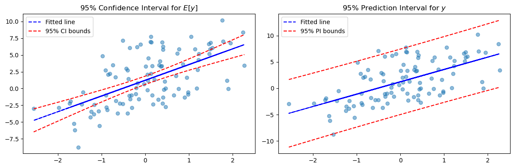

# 단순 OLS 추정량의 신뢰구간

## 개요

[앞 절](sampling_dist_simple.md)에서 유도한 표집분포를 이용하면 단순선형회귀에서 기울기, 기대반응, 개별 예측에 대한 신뢰구간을 만들 수 있다. 각 신뢰구간은 **점추정값 $\pm$ 임계값 $\times$ 표준오차**라는 표준적인 형태를 갖는다.

---

## 신뢰구간 공식

### 기울기

$$
\hat{\beta}_1 \pm t_{n-2}(0.975)\; s\sqrt{\frac{1}{\sum_{i=1}^n(x_i-\bar{x})^2}}
$$

이 구간은 $x$에 대한 $y$의 추정된 변화율의 불확실성을 수량화한다. 구간이 0을 포함하지 않으면 유의수준 5%에서 $x$가 $y$에 선형 효과를 갖는다는 증거가 된다.

### 반응의 기댓값(x_0에서의 평균반응)

$$
(\hat{\beta}_0+\hat{\beta}_1 x_0) \pm t_{n-2}(0.975)\; s\sqrt{\frac{1}{n}+\frac{(x_0-\bar{x})^2}{\sum_{i=1}^n(x_i-\bar{x})^2}}
$$

이 신뢰구간은 특정한 값 $x_0$에서 $y$의 참 평균을 포착한다. $x_0 = \bar{x}$일 때 가장 좁고 $x_0$이 자료의 중심에서 멀어질수록 넓어지므로, 모든 $x_0$에 대해 그리면 특징적인 "나비넥타이" 모양이 나타난다.

### 반응(x_0에서의 예측구간)

$$
(\hat{\beta}_0+\hat{\beta}_1 x_0) \pm t_{n-2}(0.975)\; s\sqrt{1+\frac{1}{n}+\frac{(x_0-\bar{x})^2}{\sum_{i=1}^n(x_i-\bar{x})^2}}
$$

이 예측구간은 $x_0$에서 **새로운 개별 관측값**이 놓일 만한 범위를 포착한다. 줄일 수 없는 잡음항 $\sigma^2$(제곱근 안의 앞머리 1)을 포함하므로 항상 평균반응의 신뢰구간보다 넓다.

### 핵심 구분

평균반응의 신뢰구간과 개별반응의 예측구간은 중심 $\hat{\beta}_0 + \hat{\beta}_1 x_0$이 같지만 폭이 다르다. 평균반응 구간은 $n \to \infty$일 때 폭이 0으로 줄어들지만(추정의 불확실성이 사라진다), 예측구간은 $\hat{y}_0 \pm t \cdot s$로 수렴한다(줄일 수 없는 잡음이 남는다).

!!! info "참고"
    [Khan Academy: Inference for Slope](https://www.khanacademy.org/math/ap-statistics/inference-slope-linear-regression/inference-slope/v/intro-inference-slope)

---

## 예제: 공부 시간과 카페인 섭취

### 문제

Musa는 자기 학교 학생 20명을 대상으로 공부 시간과 카페인 섭취의 상관을 조사한다. 최소제곱 회귀를 수행하여 다음 출력을 얻었다.

|  | Coef | SE Coef | T | P |
|:---|---:|---:|---:|---:|
| Constant | 2.544 | 0.134 | 18.955 | 0.000 |
| Caffeine | 0.164 | 0.057 | 2.862 | 0.010 |

$S = 1.532$, $R^2 = 31.3\%$

**과제**: 최소제곱 회귀직선 기울기의 95% 신뢰구간을 구하라.

### 풀이

회귀 출력에서 다음을 읽는다.

- $\hat{\beta}_1 = 0.164$ (추정된 기울기)
- $\text{SE}(\hat{\beta}_1) = 0.057$ (기울기의 표준오차)
- $n = 20$이므로 $\text{df} = n - 2 = 18$

95% 신뢰구간은

$$
\hat{\beta}_1 \pm t_{18}(0.975) \times \text{SE}(\hat{\beta}_1) = 0.164 \pm 2.1009 \times 0.057
$$

$$
= 0.164 \pm 0.1198 = (0.0442,\; 0.2838)
$$

**해석**: 카페인 섭취와 공부 시간을 잇는 참 기울기가 0.044와 0.284 사이에 있다고 95% 신뢰한다. 이 구간이 0을 포함하지 않으므로 양의 선형관계에 대한 통계적으로 유의한 증거가 있다.

!!! note "$S$와 $R^2$는 이 문제에 쓰이지 않는다"
    기울기의 신뢰구간은 $\hat{\beta}_1$과 그 표준오차만으로 계산된다. $S$와 $R^2$는 참고용 수치이다. 다만 이 둘은 서로 무관하지 않다. $t = 2.862$, $\text{df} = 18$에서 $R^2 = t^2/(t^2 + \text{df}) = 8.19/26.19 = 0.313$이므로, 출력표의 $R^2$는 반드시 31.3%가 되어야 한다.

### Python 구현

```python
from scipy import stats

def main():
    beta_1_hat = 0.164
    n = 20
    df = n - 2
    confidence_level = 0.95
    alpha = 1 - confidence_level
    t_star = stats.t(df).ppf(1 - alpha / 2)
    standard_error = 0.057
    margin_of_error = t_star * standard_error
    print(f"{confidence_level:.0%} confidence interval of the slope")
    print(f"{beta_1_hat:.4f} ± {margin_of_error:.4f}")

if __name__ == "__main__":
    main()
```

출력:

```
95% confidence interval of the slope
0.1640 ± 0.1198
```

기울기 추정값 0.164에 오차한계 0.120을 붙인 것이다. 구간 $(0.044, 0.284)$가 0을 담지 않으므로 5% 수준에서 기울기가 0이라는 가설을 기각한다.

**출력**:

```text
95% confidence interval of the slope
0.1640 ± 0.1198
```

---

## 시각화: 신뢰띠와 예측띠

다음 예제는 인공 회귀자료를 생성하고 평균반응에 대한 95% 신뢰구간(안쪽 띠)과 개별 관측값에 대한 95% 예측구간(바깥쪽 띠)을 함께 그린다.

### 준비

```python
import numpy as np
import matplotlib.pyplot as plt
from scipy import stats
```

### 자료 생성

```python
def generate_data(n, sigma, seed=0):
    """
    Generate synthetic linear regression data.

    Parameters
    ----------
    n : int
        Number of observations.
    sigma : float
        Standard deviation of the noise term.
    seed : int
        Random seed for reproducibility.

    Returns
    -------
    x, y : ndarray of shape (n, 1)
        Predictor and response arrays.
    """
    np.random.seed(seed)
    x = np.random.randn(n, 1)
    y = 1 + 2 * x + sigma * np.random.randn(n, 1)
    return x, y
```

### 회귀 추정

```python
def estimate_regression_line(x, y):
    """
    Estimate slope and intercept via the correlation formula.

    Returns
    -------
    y_hat : ndarray
        Fitted values.
    beta_hat : float
        Estimated slope.
    y_bar, x_bar : float
        Sample means.
    """
    x_bar = x.mean()
    y_bar = y.mean()
    s_x = x.std(ddof=1)
    s_y = y.std(ddof=1)
    r = np.corrcoef(np.concatenate([x, y], axis=1), rowvar=False)[1, 0]
    beta_hat = r * s_y / s_x
    y_hat = beta_hat * (x - x_bar) + y_bar
    return y_hat, beta_hat, y_bar, x_bar
```

### 잔차분산

```python
def calculate_residual_variance(y, y_hat, n):
    """
    Compute the unbiased residual variance s² and standard deviation s.
    """
    s_square = np.sum((y - y_hat) ** 2) / (n - 2)
    s = np.sqrt(s_square)
    return s_square, s
```

### 신뢰구간과 예측구간

```python
def confidence_intervals(x, y_hat, beta_hat, x_bar, y_bar, n, s):
    """
    Compute 95% confidence intervals for E[y|x] and for y|x.

    Returns
    -------
    x0 : ndarray
        Grid of x values for plotting.
    lower, upper : ndarray
        Bounds for the mean response interval.
    lower2, upper2 : ndarray
        Bounds for the prediction interval.
    """
    x0 = np.linspace(x.min(), x.max(), 20)
    y0_hat = beta_hat * (x0 - x_bar) + y_bar
    t_val = stats.t(n - 2).ppf(0.975)

    # Confidence interval for E[y | x = x0]
    margin = t_val * s * np.sqrt(
        (1 / n) + (x0 - x_bar) ** 2 / np.sum((x - x_bar) ** 2)
    )
    lower = y0_hat - margin
    upper = y0_hat + margin

    # Prediction interval for y | x = x0
    margin2 = t_val * s * np.sqrt(
        1 + (1 / n) + (x0 - x_bar) ** 2 / np.sum((x - x_bar) ** 2)
    )
    lower2 = y0_hat - margin2
    upper2 = y0_hat + margin2

    return x0, lower, upper, lower2, upper2
```

### 그리기

```python
def plot_intervals(x, y, y_hat, x0, lower, upper, lower2, upper2):
    """Plot confidence and prediction bands side by side."""
    fig, (ax0, ax1) = plt.subplots(1, 2, figsize=(12, 4))

    # Left: Confidence interval for E[y]
    ax0.plot(x, y, 'o', alpha=0.5)
    ax0.plot(x, y_hat, '--b', label='Fitted line')
    ax0.plot(x0, upper, '--r', label='95% CI bounds')
    ax0.plot(x0, lower, '--r')
    ax0.set_title('95% Confidence Interval for $E[y]$')
    ax0.legend()

    # Right: Prediction interval for y
    ax1.plot(x, y, 'o', alpha=0.5)
    ax1.plot(x, y_hat, '--b', label='Fitted line')
    ax1.plot(x0, upper2, '--r', label='95% PI bounds')
    ax1.plot(x0, lower2, '--r')
    ax1.set_title('95% Prediction Interval for $y$')
    ax1.legend()

    plt.tight_layout()
    plt.show()
```

### 전체 예제

```python
# Parameters
n = 100
sigma = 3

# Generate data (true model: y = 1 + 2x + noise)
x, y = generate_data(n, sigma)

# Fit regression
y_hat, beta_hat, y_bar, x_bar = estimate_regression_line(x, y)

# Residual variance
s_square, s = calculate_residual_variance(y, y_hat, n)
print(f"True σ²: {sigma**2}")
print(f"Estimated s²: {s_square:.4f}")

# Compute intervals
x0, lower, upper, lower2, upper2 = confidence_intervals(
    x, y_hat, beta_hat, x_bar, y_bar, n, s
)

# Plot
plot_intervals(x, y, y_hat, x0, lower, upper, lower2, upper2)
```

출력:

```
True σ²: 9
Estimated s²: 9.7087
```



참 $\sigma^2 = 9$를 $s^2 = 9.71$로 추정했다. $s^2$은 불편추정량이지만 표본 하나에서 이 정도 오차는 정상이다. 자유도가 $n - 2$인 것은 회귀에서 모수 두 개(절편과 기울기)를 추정했기 때문이다.

왼쪽 패널은 평균반응의 신뢰띠를 보여준다. $\bar{x}$에서 가장 좁은 특징적인 "나비넥타이" 모양에 주목하라. 오른쪽 패널은 개별 관측값의 변동까지 반영한 더 넓은 예측띠를 보여준다.

## 연습문제

**연습문제 1.**
$n = 20$, $\hat{\beta}_1 = 3.5$, $\text{SE}(\hat{\beta}_1) = 1.2$인 단순선형회귀에서 $\beta_1$의 95% 신뢰구간을 구하라.

??? success "풀이"
    자유도가 $n - 2 = 18$이므로 임계값은 $t_{0.025, 18} = 2.101$이다.

    $$
    \hat{\beta}_1 \pm t_{0.025, 18} \cdot \text{SE}(\hat{\beta}_1) = 3.5 \pm 2.101 \times 1.2 = 3.5 \pm 2.521
    $$

    95% 신뢰구간은 $(0.979, 6.021)$이다. 이 구간이 0을 포함하지 않으므로 $\beta_1$은 유의수준 5%에서 0과 유의하게 다르다.

---

**연습문제 2.**
$\beta_1$의 95% 신뢰구간과 $\alpha = 0.05$에서 $H_0: \beta_1 = 0$에 대한 양측 $t$ 검정의 관계를 설명하라. 둘은 언제 같은 결론에 이르는가?

??? success "풀이"
    95% 신뢰구간과 $\alpha = 0.05$의 양측 $t$ 검정은 **동등하다**. 유의수준 5%에서 $H_0: \beta_1 = 0$을 기각하는 것은 95% 신뢰구간이 0을 포함하지 않는 것과 필요충분이다.

    $t$ 검정은 $|\hat{\beta}_1/\text{SE}| > t_{\alpha/2, n-2}$일 때 기각하는데, 이는 $0 \notin (\hat{\beta}_1 \pm t_{\alpha/2} \cdot \text{SE})$와 같은 말이기 때문이다. 유의수준 $\alpha$와 $(1-\alpha)$ 신뢰구간을 짝지으면 언제나 같은 결론에 이른다.

---

**연습문제 3.**
표본크기 $n$이 커지면 $\beta_1$의 신뢰구간 폭은 어떻게 되는가? 수학적 이유를 설명하라.

??? success "풀이"
    폭이 줄어든다. 신뢰구간의 폭은 $2 t_{\alpha/2, n-2} \cdot \text{SE}(\hat{\beta}_1)$이다. $n$이 커지면

    1. $\text{SE}(\hat{\beta}_1) = \hat{\sigma}/\sqrt{\sum(x_i - \bar{x})^2}$가 줄어든다. 분모가 $n$과 함께 커지기 때문이다.
    2. $t_{\alpha/2, n-2} \to z_{\alpha/2}$가 된다($df \to \infty$일 때 $t$ 임계값이 $z$ 임계값으로 접근한다).

    두 효과가 모두 구간을 좁히며, 이는 자료가 많아질수록 추정이 정밀해짐을 반영한다.
