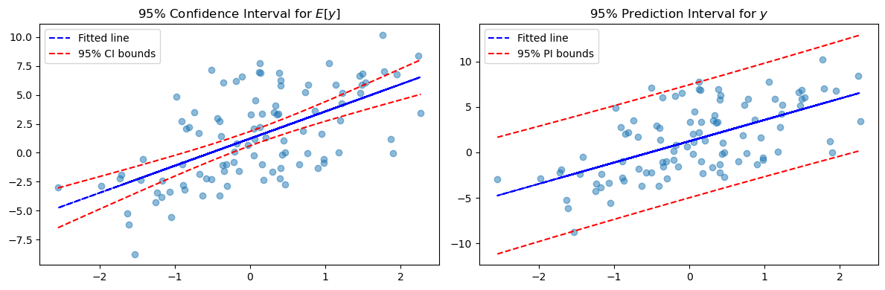

# 단순 OLS 추정량의 신뢰구간

## 개요

[앞 절](sampling_dist_simple.md)에서 유도한 표집분포를 이용하면 단순선형회귀에서 기울기, 기대반응, 개별 예측에 대한 신뢰구간을 만들 수 있다. 각 신뢰구간은 **점추정값 $\pm$ 임계값 $\times$ 표준오차**라는 표준적인 형태를 갖는다.

---

## 신뢰구간 공식

### 기울기

$$
\hat{\beta}_1 \pm t_{n-2}(0.975)\; s\sqrt{\frac{1}{\sum_{i=1}^n(x_i-\bar{x})^2}}
$$

이 구간은 $x$에 대한 $y$의 추정된 변화율의 불확실성을 수량화한다. 구간이 0을 포함하지 않으면 유의수준 5%에서 $x$가 $y$에 선형 효과를 갖는다는 증거가 된다.

### 반응의 기댓값(x_0에서의 평균반응)

$$
(\hat{\beta}_0+\hat{\beta}_1 x_0) \pm t_{n-2}(0.975)\; s\sqrt{\frac{1}{n}+\frac{(x_0-\bar{x})^2}{\sum_{i=1}^n(x_i-\bar{x})^2}}
$$

이 신뢰구간은 특정한 값 $x_0$에서 $y$의 참 평균을 포착한다. $x_0 = \bar{x}$일 때 가장 좁고 $x_0$이 자료의 중심에서 멀어질수록 넓어지므로, 모든 $x_0$에 대해 그리면 특징적인 "나비넥타이" 모양이 나타난다.

### 반응(x_0에서의 예측구간)

$$
(\hat{\beta}_0+\hat{\beta}_1 x_0) \pm t_{n-2}(0.975)\; s\sqrt{1+\frac{1}{n}+\frac{(x_0-\bar{x})^2}{\sum_{i=1}^n(x_i-\bar{x})^2}}
$$

이 예측구간은 $x_0$에서 **새로운 개별 관측값**이 놓일 만한 범위를 포착한다. 줄일 수 없는 잡음항 $\sigma^2$(제곱근 안의 앞머리 1)을 포함하므로 항상 평균반응의 신뢰구간보다 넓다.

### 핵심 구분

평균반응의 신뢰구간과 개별반응의 예측구간은 중심 $\hat{\beta}_0 + \hat{\beta}_1 x_0$이 같지만 폭이 다르다. 평균반응 구간은 $n \to \infty$일 때 폭이 0으로 줄어들지만(추정의 불확실성이 사라진다), 예측구간은 $\hat{y}_0 \pm t \cdot s$로 수렴한다(줄일 수 없는 잡음이 남는다).

!!! info "참고"
    [Khan Academy: Inference for Slope](https://www.khanacademy.org/math/ap-statistics/inference-slope-linear-regression/inference-slope/v/intro-inference-slope)

---

## 문제: 공부 시간과 카페인 섭취

<div class="probox" markdown>

**문제 1.** <span class="diff easy" title="쉬움"></span>

Musa는 자기 학교 학생 20명을 대상으로 공부 시간과 카페인 섭취의 상관을 조사한다. 최소제곱 회귀를 수행하여 다음 출력을 얻었다.

|  | Coef | SE Coef | T | P |
|:---|---:|---:|---:|---:|
| Constant | 2.544 | 0.134 | 18.955 | 0.000 |
| Caffeine | 0.164 | 0.057 | 2.862 | 0.010 |

$S = 1.532$, $R^2 = 31.3\%$

**과제**: 최소제곱 회귀직선 기울기의 95% 신뢰구간을 구하라.

</div>

??? success "풀이"
    회귀 출력에서 다음을 읽는다.

    - $\hat{\beta}_1 = 0.164$ (추정된 기울기)
    - $\text{SE}(\hat{\beta}_1) = 0.057$ (기울기의 표준오차)
    - $n = 20$이므로 $\text{df} = n - 2 = 18$

    95% 신뢰구간은

    $$
    \hat{\beta}_1 \pm t_{18}(0.975) \times \text{SE}(\hat{\beta}_1) = 0.164 \pm 2.1009 \times 0.057
    $$

    $$
    = 0.164 \pm 0.1198 = (0.0442,\; 0.2838)
    $$

    **해석**: 카페인 섭취와 공부 시간을 잇는 참 기울기가 0.044와 0.284 사이에 있다고 95% 신뢰한다. 이 구간이 0을 포함하지 않으므로 양의 선형관계에 대한 통계적으로 유의한 증거가 있다.
!!! note "$S$와 $R^2$는 이 문제에 쓰이지 않는다"
    기울기의 신뢰구간은 $\hat{\beta}_1$과 그 표준오차만으로 계산된다. $S$와 $R^2$는 참고용 수치이다. 다만 이 둘은 서로 무관하지 않다. $t = 2.862$, $\text{df} = 18$에서 $R^2 = t^2/(t^2 + \text{df}) = 8.19/26.19 = 0.313$이므로, 출력표의 $R^2$는 반드시 31.3%가 되어야 한다.

<div class="exbox" markdown>

**보기 1.** <span class="diff easy" title="쉬움"></span> 출력표만으로 신뢰구간 만들기. 문제 1의 표에서 $\hat\beta_1 = 0.164$, $\text{SE} = 0.057$, $n = 20$ 을 읽어 $95\%$ 신뢰구간을 계산한다.

**(1)** 왜 $z_{0.975} = 1.96$ 대신 $t_{18}(0.975)$ 를 쓰는가. 정규분위수로 대신하면 구간이 몇 퍼센트 짧아지는가.

**(2)** 표의 `T = 2.862` 와 `Coef/SE Coef` $= 0.164/0.057$ 이 **일치하지 않는다.** 어느 쪽이 맞는가. 또 "신뢰구간이 $0$ 을 담지 않는다"와 "$p < 0.05$"가 **같은 문장**임을 확인하시오.

</div>

??? success "풀이"

    **(1) $\sigma$ 를 모르고 $s$ 로 바꿔 썼기 때문이다.** $\sigma$ 를 안다면

    $$
    \frac{\hat\beta_1 - \beta_1}{\sigma/\sqrt{S_{xx}}} \sim N(0, 1)
    $$

    이지만, $\sigma$ 를 $s$ 로 바꾸면 분모가 확률변수가 되어 꼬리가 두꺼워진다. 0.4절이 보인 대로 $s^2$ 이 $\hat\beta_1$ 과 독립이고 $(n-2)s^2/\sigma^2 \sim \chi^2_{n-2}$ 이므로 비는 **$t_{n-2}$ 를 따른다.** 정규분위수를 쓰면 $t$ 의 두꺼운 꼬리를 무시하는 셈이라 구간이 짧아지고 **포함률이 $0.95$ 아래로 떨어진다.**

    짧아지는 양은 분위수의 비로 정해진다. $t_{18}(0.975) = 2.1009$, $z_{0.975} = 1.9600$ 이니 $1 - 1.96/2.1009 = 6.7\%$ 다. 자유도가 작을수록 커진다.

    **(2) `T = 2.862` 가 맞고, 표의 `Coef` 와 `SE Coef` 가 반올림된 값이다.** 보고된 수로 나누면 $0.164/0.057 = 2.8772$ 로 $2.862$ 와 어긋난다. 거꾸로 $T$ 를 믿고 풀면 $\text{SE} = 0.164/2.862 = 0.057303$ 이니, 표의 `0.057` 은 $0.057303$ 을 소수 셋째 자리에서 반올림한 것이다. `T` 열은 반올림 전의 값으로 계산되었다. **출력표를 역산할 때는 반올림된 자리에서 셋째 자리 어긋남이 생기는 것이 정상이다.**

    두 문장이 같은 까닭은 구간과 검정이 같은 통계량을 쓰기 때문이다.

    $$
    0 \notin \left(\hat\beta_1 - t^* \text{SE},\ \hat\beta_1 + t^* \text{SE}\right)
    \;\Longleftrightarrow\;
    \left\lvert \frac{\hat\beta_1}{\text{SE}} \right\rvert > t^*
    \;\Longleftrightarrow\;
    p < 0.05
    $$

    가운데 식은 양변을 $\text{SE}$ 로 나눈 것이고, 오른쪽은 $p$ 값의 정의다. **구간과 검정은 같은 정보를 두 가지로 적은 것이며, 구간은 거기에 "얼마나 큰가"까지 얹어 준다.**

    ```python
    from scipy import stats

    def main():
        """회귀 출력표의 기울기와 표준오차만으로 신뢰구간을 만든다.

        표준오차는 이미 주어진 값이라고 보고, t 임계값만 자유도 n-2 로 구한다.
        """
        beta_1_hat = 0.164
        n = 20
        df = n - 2
        confidence_level = 0.95
        alpha = 1 - confidence_level
        t_star = stats.t(df).ppf(1 - alpha / 2)
        standard_error = 0.057
        margin_of_error = t_star * standard_error
        print(f"{confidence_level:.0%} confidence interval of the slope")
        print(f"{beta_1_hat:.4f} ± {margin_of_error:.4f}")

    if __name__ == "__main__":
        main()
    ```

    출력:

    ```
    95% confidence interval of the slope
    0.1640 ± 0.1198
    ```

    기울기 추정값 0.164에 오차한계 0.120을 붙인 것이다. 구간 $(0.044, 0.284)$가 0을 담지 않으므로 5% 수준에서 기울기가 0이라는 가설을 기각한다.

    (1)과 (2)를 수로 확인한다.

    ```python
    from scipy import stats

    beta_1_hat, se_reported, n = 0.164, 0.057, 20
    df = n - 2
    t_star, z_star = stats.t(df).ppf(0.975), stats.norm.ppf(0.975)
    print(f"t_{df}(0.975) = {t_star:.6f},   z(0.975) = {z_star:.6f},   비 = {t_star / z_star:.4f}")
    print(f"정규로 대신하면 오차한계가 {z_star * se_reported:.4f} 로 "
          f"{t_star * se_reported:.4f} 보다 {1 - z_star / t_star:.1%} 짧아진다")
    print()
    print(f"표의 T = 2.862,   표의 Coef/SE = {beta_1_hat / se_reported:.4f}")
    print(f"  T = 2.862 를 믿으면 SE = 0.164/2.862 = {beta_1_hat / 2.862:.6f}")
    print(f"  p-값:  T=2.862 -> {2 * stats.t(df).sf(2.862):.4f},"
          f"   T={beta_1_hat / se_reported:.4f} -> {2 * stats.t(df).sf(beta_1_hat / se_reported):.4f}")
    print(f"  R^2 = T^2/(T^2+df) = {2.862 ** 2 / (2.862 ** 2 + df):.4f}")
    print()
    lo, hi = beta_1_hat - t_star * se_reported, beta_1_hat + t_star * se_reported
    print(f"95% CI = ({lo:.4f}, {hi:.4f})")
    print(f"  0 을 담는가? {lo <= 0 <= hi}")
    print(f"  |T| = {beta_1_hat / se_reported:.4f} > t_crit = {t_star:.4f} 인가? "
          f"{beta_1_hat / se_reported > t_star}")
    ```

    출력:

    ```
    t_18(0.975) = 2.100922,   z(0.975) = 1.959964,   비 = 1.0719
    정규로 대신하면 오차한계가 0.1117 로 0.1198 보다 6.7% 짧아진다

    표의 T = 2.862,   표의 Coef/SE = 2.8772
      T = 2.862 를 믿으면 SE = 0.164/2.862 = 0.057303
      p-값:  T=2.862 -> 0.0104,   T=2.8772 -> 0.0100
      R^2 = T^2/(T^2+df) = 0.3127

    95% CI = (0.0442, 0.2838)
      0 을 담는가? False
      |T| = 2.8772 > t_crit = 2.1009 인가? True
    ```

    **(1) $t$ 와 $z$ 의 비가 $1.0719$ 다.** 정규분위수를 쓰면 오차한계가 $0.1198$ 에서 $0.1117$ 로 $6.7\%$ 짧아진다. 작아 보이지만 포함률로는 $0.95$ 가 아니라 $t_{18}$ 분포에서 $P(\lvert T\rvert < 1.96) = 0.934$ 가 되어 **$1.6$ 퍼센트포인트**를 잃는다. $n$ 이 커지면 이 손해가 사라진다. 자유도 $8$ 에서 비가 $1.177$, $18$ 에서 $1.072$, $98$ 에서 $1.013$, $998$ 에서 $1.001$ 이다. **$n$ 이 $100$ 쯤 되면 $t$ 와 $z$ 를 구별할 이유가 거의 없고, $20$ 에서는 구별해야 한다.**

    **(2) 반올림이 원인임이 확인된다.** $T$ 를 믿고 역산한 $\text{SE} = 0.057303$ 이 표의 `0.057` 과 반올림으로 맞는다. $p$ 값도 $T = 2.862$ 에서 $0.0104$, $T = 2.8772$ 에서 $0.0100$ 인데 표가 `0.010` 이라 적었으니 **표의 $p$ 는 반올림된 $T$ 로 계산된 것이 아니다.** 소수 셋째 자리까지만 보고된 표에서 역산한 수는 셋째 자리에서 믿지 않는 것이 옳다. $R^2 = 0.3127$ 도 표의 $31.3\%$ 와 맞는다.

    세 판정이 모두 같은 방향이다. 구간이 $0$ 을 담지 않고(`False`), $\lvert T\rvert = 2.8772$ 가 임계값 $2.1009$ 를 넘고(`True`), $p = 0.010 < 0.05$ 다. **세 문장은 하나다.** 다만 구간만이 "기울기가 $0.044$ 와 $0.284$ 사이"라는 **크기** 정보를 준다. $p$ 값은 그것을 말해 주지 못하므로, 결과를 보고할 때는 $p$ 값 하나가 아니라 구간을 적어야 한다. $\square$

---

## 시각화: 신뢰띠와 예측띠

다음 보기는 인공 회귀자료를 생성하고 평균반응에 대한 95% 신뢰구간(안쪽 띠)과 개별 관측값에 대한 95% 예측구간(바깥쪽 띠)을 함께 그린다.

### 준비

<div class="exbox" markdown>

**보기 2.** <span class="diff easy" title="쉬움"></span> 필요한 라이브러리. 아래 보기들이 쓰는 세 모듈을 불러온다.

**(1)** 세 모듈이 각각 맡는 일을 적고, 뒤의 계산에서 **`scipy` 가 없으면 할 수 없는 일**이 정확히 무엇인지 집어내시오.

**(2)** `scipy` 없이 $t_\nu(0.975)$ 를 얻어야 한다면 정규분위수 $z$ 에 어떤 보정을 붙일 수 있는가. 보정식 $z + (z^3+z)/(4\nu)$ 의 오차를 자유도 몇 개에서 재어 보고, $n = 100$ 에서 쓸 만한지 판정하시오.

</div>

??? success "풀이"

    **(1) 역할이 셋으로 깔끔히 갈린다.**

    | 모듈 | 맡는 일 | 없으면 |
    |---|---|---|
    | `numpy` | 배열, 난수, 평균·표준편차·상관 | 손으로 루프를 돌면 된다(느릴 뿐) |
    | `matplotlib` | 그림 | 수치 결과는 그대로다 |
    | `scipy.stats` | $t$ 분포의 **분위수** | 대신할 초기함수가 없다 |

    `scipy` 가 없으면 못 하는 일은 **딱 하나, $t_{n-2}(0.975)$ 를 구하는 것**이다. 평균·표준편차·상관은 모두 유한합이라 `numpy` 로 끝나고 실은 손계산도 된다. 그런데 $t$ 분포의 누적분포함수는 불완전베타함수이고 그 역함수는 닫힌 꼴이 없으므로 **수치해법이 필요하다.** 신뢰구간 계산의 모든 어려움이 임계값 하나에 모여 있는 셈이다.

    `numpy.random.randn` 도 `scipy` 없이 되므로 보기 3의 자료 생성에는 `scipy` 가 필요하지 않다.

    **(2) 코니시–피셔 전개의 첫 항을 쓰면 된다.** $t_\nu$ 의 분위수를 $\nu \to \infty$ 에서 전개하면

    $$
    t_\nu(p) = z_p + \frac{z_p^3 + z_p}{4\nu} + O(\nu^{-2})
    $$

    이다. $p = 0.975$, $z = 1.959964$ 를 넣으면 보정항이 $(1.959964^3 + 1.959964)/(4\nu) = 9.4885/(4\nu)$ 다. $\nu = 98$ 이면 $0.0242$ 이므로 $1.9842$ 를 준다.

    ```python
    import numpy as np
    import matplotlib.pyplot as plt
    from scipy import stats

    # 이 쪽의 계산에서 scipy 가 꼭 필요한 곳은 t 분위수 하나다.
    z = stats.norm.ppf(0.975)
    print(f"{'자유도':>8s}{'t(0.975)':>12s}{'정규 z':>10s}{'z + (z^3+z)/(4v)':>20s}{'보정의 오차':>14s}")
    for nu in (8, 18, 48, 98, 998):
        t_exact = stats.t(nu).ppf(0.975)
        t_approx = z + (z ** 3 + z) / (4 * nu)
        print(f"{nu:8d}{t_exact:12.6f}{z:10.6f}{t_approx:20.6f}{t_approx - t_exact:+14.6f}")
    print()
    print("numpy 만으로 할 수 있는 일과 못 하는 일")
    print(f"  평균·표준편차·상관: numpy 로 충분  (예: corrcoef)")
    print(f"  t 분위수: 역함수가 초기함수가 아니므로 수치해법이 필요하다")
    print(f"  그림: matplotlib 는 통계와 무관하고 그리기만 맡는다")
    ```

    출력:

    ```
         자유도    t(0.975)      정규 z    z + (z^3+z)/(4v)        보정의 오차
           8    2.306004  1.959964            2.256498     -0.049506
          18    2.100922  1.959964            2.091757     -0.009165
          48    2.010635  1.959964            2.009386     -0.001248
          98    1.984467  1.959964            1.984171     -0.000297
         998    1.962344  1.959964            1.962341     -0.000003

    numpy 만으로 할 수 있는 일과 못 하는 일
      평균·표준편차·상관: numpy 로 충분  (예: corrcoef)
      t 분위수: 역함수가 초기함수가 아니므로 수치해법이 필요하다
      그림: matplotlib 는 통계와 무관하고 그리기만 맡는다
    ```

    **$n = 100$ 에서는 충분히 쓸 만하다.** $\nu = 98$ 에서 보정의 오차가 $-0.0003$ 으로 상대오차 $0.015\%$ 다. 반면 보정하지 않은 $z$ 를 그냥 쓰면 오차가 $-0.0245$ 로 **$80$ 배** 크다. 보정항 하나가 오차를 두 자릿수 줄인다.

    자유도가 작아지면 사정이 달라진다. $\nu = 8$ 에서 보정의 오차가 $-0.0495$ 로 상대오차 $2.1\%$ 이고, 이 정도면 신뢰구간이 체계적으로 짧아져 포함률이 떨어진다. 오차가 $\nu^{-2}$ 로 줄어들므로 $8 \to 98$ 에서 $(98/8)^2 \approx 150$ 배 작아져야 하는데 실제로 $0.0495/0.0003 = 165$ 배 작아졌다. **전개의 차수가 수치로 확인된다.**

    실용적인 결론은 이렇다. **표를 쓸 수 있으면 표를, 못 쓰면 이 보정식을, 자유도가 $30$ 보다 작으면 반드시 정확한 값을 쓰라.** 다만 오늘날 `scipy` 를 못 쓰는 상황은 드물고, 이 보기의 값은 "임계값 하나가 무엇을 숨기고 있는가"를 보는 데 있다. $\square$

### 자료 생성

<div class="exbox" markdown>

**보기 3.** <span class="diff easy" title="쉬움"></span> 자료 만들기. 참 모형 $y = 1 + 2x + \sigma\varepsilon$ 에서 $x \sim N(0,1)$, $\varepsilon \sim N(0,1)$ 을 독립으로 뽑는다.

**(1)** $n = 100$, $\sigma = 3$ 일 때 $\operatorname{Var}(y)$, 모상관의 제곱 $\rho^2$, $E[S_{xx}]$, 그리고 $\operatorname{se}(\hat\beta_1)$ 의 이론값을 **자료를 보기 전에** 계산하시오.

**(2)** 한 표본을 뽑아 (1)의 네 값과 견주시오. 어긋남이 표본변동으로 설명되는가.

</div>

??? success "풀이"

    **(1) 해석적으로.** $x$ 와 $\varepsilon$ 이 독립이므로 분산이 더해진다.

    $$
    \operatorname{Var}(y) = 2^2\operatorname{Var}(x) + \sigma^2\operatorname{Var}(\varepsilon) = 4 + 9 = 13
    $$

    모상관은 설명된 분산의 비의 제곱근이다.

    $$
    \rho^2 = \frac{\beta_1^2\operatorname{Var}(x)}{\operatorname{Var}(y)} = \frac{4}{13} = 0.307692
    \quad\Longrightarrow\quad \rho = 0.5547
    $$

    $S_{xx} = \sum_i(x_i - \bar x)^2$ 은 $\operatorname{Var}(x) = 1$ 일 때 $E[S_{xx}] = (n-1) \cdot 1 = 99$ 이고(정확히는 $S_{xx} \sim \chi^2_{99}$ 다), 0.4절의 $\operatorname{Var}(\hat\beta_1) = \sigma^2/S_{xx}$ 에서

    $$
    \operatorname{se}(\hat\beta_1) \approx \frac{3}{\sqrt{99}} = 0.301511
    $$

    이다. **참 기울기 $2$ 에 표준오차 $0.30$ 이니 신호 대 잡음비가 $6.6$ 이다.** 기울기를 분명히 잡아낼 만한 설계다.

    **(2) 수치적으로.**

    ```python
    def generate_data(n, sigma, seed=0):
        """모의 회귀자료를 만든다. 참 모형은 y = 1 + 2x + 잡음 이다.

        매개변수
        --------
        n : 관측 수
        sigma : 잡음의 표준편차
        seed : 난수 씨앗

        돌려주는 값
        ----------
        x, y : 모양 (n, 1) 인 배열
        """
        np.random.seed(seed)
        x = np.random.randn(n, 1)
        y = 1 + 2 * x + sigma * np.random.randn(n, 1)
        return x, y

    # 참 모형이 y = 1 + 2x + 3*eps,  x ~ N(0,1) 이므로 이론값을 먼저 적을 수 있다.
    n_demo, sigma_demo = 100, 3
    print(f"이론:  Var(y) = 2^2*Var(x) + sigma^2 = 4 + {sigma_demo ** 2} = {4 + sigma_demo ** 2}")
    print(f"       rho^2  = 4/(4+{sigma_demo ** 2}) = {4 / (4 + sigma_demo ** 2):.6f}")
    print(f"       E[S_xx] = (n-1)*Var(x) = {n_demo - 1}")
    print(f"       se(beta1) = sigma/sqrt(S_xx) = {sigma_demo}/sqrt({n_demo - 1}) "
          f"= {sigma_demo / np.sqrt(n_demo - 1):.6f}")
    print()
    x_demo, y_demo = generate_data(n_demo, sigma_demo)
    S_xx_demo = ((x_demo - x_demo.mean()) ** 2).sum()
    r_demo = np.corrcoef(np.concatenate([x_demo, y_demo], axis=1), rowvar=False)[1, 0]
    print(f"표본:  Var(y) = {y_demo.var(ddof=1):.4f}")
    print(f"       r^2    = {r_demo ** 2:.6f}")
    print(f"       S_xx   = {S_xx_demo:.4f}")
    print(f"       x-bar  = {x_demo.mean():+.6f}  (이론 0),"
          f"   s_x = {x_demo.std(ddof=1):.6f}  (이론 1)")
    print()
    print(f"상대 어긋남:  Var(y) {y_demo.var(ddof=1) / 13 - 1:+.2%},"
          f"  r^2 {r_demo ** 2 / (4 / 13) - 1:+.2%},  S_xx {S_xx_demo / 99 - 1:+.2%}")
    print(f"분산 추정의 상대 표준오차 ~ sqrt(2/(n-1)) = {np.sqrt(2 / (n_demo - 1)):.4f}")
    ```

    출력:

    ```
    이론:  Var(y) = 2^2*Var(x) + sigma^2 = 4 + 9 = 13
           rho^2  = 4/(4+9) = 0.307692
           E[S_xx] = (n-1)*Var(x) = 99
           se(beta1) = sigma/sqrt(S_xx) = 3/sqrt(99) = 0.301511

    표본:  Var(y) = 15.2488
           r^2    = 0.369743
           S_xx   = 101.5827
           x-bar  = +0.059808  (이론 0),   s_x = 1.012960  (이론 1)

    상대 어긋남:  Var(y) +17.30%,  r^2 +20.17%,  S_xx +2.61%
    분산 추정의 상대 표준오차 ~ sqrt(2/(n-1)) = 0.1421
    ```

    **$S_{xx}$ 는 잘 맞고 $\operatorname{Var}(y)$ 와 $r^2$ 은 꽤 벗어난다.** $S_{xx} = 101.58$ 이 예측 $99$ 에서 $+2.6\%$ 로, 상대 표준오차 $\sqrt{2/99} = 14.2\%$ 의 $0.18$ 배에 지나지 않는다. 반면 $\operatorname{Var}(y) = 15.25$ 는 $+17.3\%$, $r^2 = 0.3697$ 은 $+20.2\%$ 벗어났다.

    **이 어긋남들은 서로 독립이 아니다.** $r^2 = \hat\beta_1^2 S_{xx}/S_{yy}$ 이고 이 표본에서 $\hat\beta_1 = 2.344$ 가 참값 $2$ 보다 $17\%$ 크게 나왔는데(보기 4에서 확인한다), 그러면 $S_{yy}$ 도 함께 커지고 $r^2$ 도 커진다. 곧 **기울기가 우연히 크게 뽑힌 하나의 사건이 세 통계량에 동시에 나타난 것**이다. $\operatorname{Var}(y)$ 의 상대 표준오차도 $14\%$ 쯤이므로 $+17.3\%$ 는 약 $1.2$ 표준오차이고, 이상할 것이 없다.

    $\bar x = +0.0598$ 은 이론값 $0$ 과 견주면 표준오차 $1/\sqrt{100} = 0.1$ 의 $0.6$ 배다. $s_x = 1.0130$ 도 $1$ 에서 $1.3\%$ 떨어져 있고 상대 표준오차 $1/\sqrt{2\times99} = 7.1\%$ 안쪽이다.

    **씨앗 하나로 뽑은 표본은 이론값 근처에 있을 뿐 이론값이 아니다.** 뒤의 보기들이 내놓는 수를 읽을 때 이 폭을 늘 떠올려야 한다. $\square$

### 회귀 추정

<div class="exbox" markdown>

**보기 4.** <span class="diff easy" title="쉬움"></span> 회귀직선 추정. 상관계수 꼴 $\hat\beta_1 = r\,s_y/s_x$ 로 기울기를 구하고 적합값을 $\hat\beta_1(x - \bar x) + \bar y$ 로 계산한다.

**(1)** $r\,s_y/s_x$ 와 $S_{xy}/S_{xx}$ 가 **같은 수**임을 보이시오. 또 이 코드가 절편을 따로 계산하지 않는데도 적합값이 옳은 까닭을 말하고, 필요하면 절편을 어떻게 얻는지 적으시오.

**(2)** 세 식이 같은 수를 주는지 확인하고, 추정된 기울기의 $95\%$ 신뢰구간이 참 기울기 $2$ 를 담는지 보시오. 보기 3이 예측한 표준오차 $0.3015$ 와 실제 표준오차를 견주시오.

</div>

??? success "풀이"

    **(1) 해석적으로.** 정의를 펼치면 바로 나온다. $r = S_{xy}/\sqrt{S_{xx}S_{yy}}$ 이고 $s_x = \sqrt{S_{xx}/(n-1)}$, $s_y = \sqrt{S_{yy}/(n-1)}$ 이므로

    $$
    r\,\frac{s_y}{s_x}
    = \frac{S_{xy}}{\sqrt{S_{xx}S_{yy}}} \cdot \frac{\sqrt{S_{yy}/(n-1)}}{\sqrt{S_{xx}/(n-1)}}
    = \frac{S_{xy}}{\sqrt{S_{xx}S_{yy}}} \cdot \sqrt{\frac{S_{yy}}{S_{xx}}}
    = \frac{S_{xy}}{S_{xx}}
    $$

    이다. $S_{yy}$ 와 $n-1$ 이 모두 약분된다. 두 꼴은 같은 수를 다르게 적은 것이고, 상관계수 꼴은 **"회귀계수는 상관계수를 두 변수의 척도로 되돌린 것"** 이라는 뜻을 드러낸다.

    절편을 따로 쓰지 않아도 되는 까닭은 **평균점을 지난다**는 성질이다(단순회귀의 보기 2). 회귀직선을 평균점 기준으로 적으면

    $$
    \hat y = \bar y + \hat\beta_1 (x - \bar x)
    $$

    이고 이 식에 절편이 나타나지 않는다. 절편이 필요하면 $x = 0$ 을 넣어 $\hat\beta_0 = \bar y - \hat\beta_1\bar x$ 로 얻는다. 이 표현은 수치적으로도 낫다. $\bar x$ 가 큰 자료에서 $\hat\beta_0$ 은 $\bar y$ 와 $\hat\beta_1\bar x$ 의 차로 계산되어 **자리수 손실**이 생기는데, 중심화한 꼴은 그 뺄셈을 거치지 않는다.

    **(2) 수치적으로.**

    ```python
    def estimate_regression_line(x, y):
        """상관계수 공식으로 기울기와 절편을 추정한다.

        beta_hat = r * (s_y / s_x) 이다. 최소제곱해와 같은 값이지만, 회귀계수가
        상관계수를 두 변수의 척도로 되돌린 것임이 이 꼴에서 드러난다.

        돌려주는 값
        ----------
        y_hat : 적합값
        beta_hat : 추정된 기울기
        y_bar, x_bar : 표본평균
        """
        x_bar = x.mean()
        y_bar = y.mean()
        s_x = x.std(ddof=1)
        s_y = y.std(ddof=1)
        r = np.corrcoef(np.concatenate([x, y], axis=1), rowvar=False)[1, 0]
        beta_hat = r * s_y / s_x
        y_hat = beta_hat * (x - x_bar) + y_bar
        return y_hat, beta_hat, y_bar, x_bar

    # 세 가지 꼴이 같은 수를 주는지 확인한다.
    y_hat_demo, beta_hat_demo, y_bar_demo, x_bar_demo = estimate_regression_line(x_demo, y_demo)
    S_xy_demo = ((x_demo - x_bar_demo) * (y_demo - y_bar_demo)).sum()
    print(f"r * s_y / s_x   = {beta_hat_demo:.10f}")
    print(f"S_xy / S_xx     = {S_xy_demo / S_xx_demo:.10f}")
    print(f"두 값의 차이     = {abs(beta_hat_demo - S_xy_demo / S_xx_demo):.2e}")
    print()
    beta_0_demo = y_bar_demo - beta_hat_demo * x_bar_demo
    print(f"절편 = y-bar - b*x-bar = {beta_0_demo:.6f}   (참값 1)")
    print(f"  x = 0 에서의 적합값  = {float(beta_hat_demo * (0 - x_bar_demo) + y_bar_demo):.6f}")
    print(f"  x-bar 에서의 적합값  = {float(beta_hat_demo * (x_bar_demo - x_bar_demo) + y_bar_demo):.6f}"
          f"   (= y-bar = {y_bar_demo:.6f})")
    print()
    s2_demo = ((y_demo - y_hat_demo) ** 2).sum() / (n_demo - 2)
    se_beta = np.sqrt(s2_demo / S_xx_demo)
    t_c = stats.t(n_demo - 2).ppf(0.975)
    print(f"기울기 추정값 {beta_hat_demo:.6f}   (참값 2)")
    print(f"  se = s/sqrt(S_xx) = {se_beta:.6f}   (보기 3 의 이론값 0.301511)")
    print(f"  95% CI = ({beta_hat_demo - t_c * se_beta:.6f}, {beta_hat_demo + t_c * se_beta:.6f})"
          f"   참값 2 를 담는가? {beta_hat_demo - t_c * se_beta <= 2 <= beta_hat_demo + t_c * se_beta}")
    print(f"  (추정값 - 참값)/se = {(beta_hat_demo - 2) / se_beta:+.4f}")
    ```

    출력:

    ```
    r * s_y / s_x   = 2.3440953006
    S_xy / S_xx     = 2.3440953006
    두 값의 차이     = 1.33e-15

    절편 = y-bar - b*x-bar = 1.225459   (참값 1)
      x = 0 에서의 적합값  = 1.225459
      x-bar 에서의 적합값  = 1.365655   (= y-bar = 1.365655)

    기울기 추정값 2.344095   (참값 2)
      se = s/sqrt(S_xx) = 0.309151   (보기 3 의 이론값 0.301511)
      95% CI = (1.730594, 2.957596)   참값 2 를 담는가? True
      (추정값 - 참값)/se = +1.1130
    ```

    **두 꼴이 소수 열째 자리까지 같다.** 차이 $1.33\times10^{-15}$ 는 부동소수점 한계다. 절편도 $x = 0$ 에서의 적합값과 정확히 같고($1.225459$), $\bar x$ 에서의 적합값이 $\bar y$ 와 같다($1.365655$). 평균점을 지난다는 성질이 확인된다.

    **표준오차가 예측과 잘 맞는다.** $0.309151$ 대 이론값 $0.301511$ 로 $+2.5\%$ 다. 두 원인이 서로 반대로 작용했다. $s = 3.1159$ 가 $\sigma = 3$ 보다 $3.9\%$ 크고, $S_{xx} = 101.58$ 이 $99$ 보다 $2.6\%$ 커서 분모가 커졌다. 두 효과를 함께 넣으면 $1.0386/\sqrt{1.0261} = 1.0253$ 으로 실제 $+2.53\%$ 와 맞는다.

    **신뢰구간 $(1.7306,\ 2.9576)$ 이 참값 $2$ 를 담는다.** 다만 추정값 $2.3441$ 이 참값보다 표준오차의 $1.11$ 배 크게 나왔고, 구간의 폭이 $1.23$ 이라 **참값 $2$ 와 $0$ 이 아닌 다른 많은 값이 함께 들어 있다.** $n = 100$, $\sigma = 3$ 에서는 기울기를 소수 첫째 자리까지도 정하지 못한다는 뜻이다. 보기 3에서 신호 대 잡음비가 $6.6$ 이라 했는데, 그 말은 "$0$ 과 구별된다"는 뜻이고 "정확히 안다"는 뜻이 아니다. $\square$

### 잔차분산

<div class="exbox" markdown>

**보기 5.** <span class="diff easy" title="쉬움"></span> 잔차분산 구하기. $s^2 = \text{RSS}/(n-2)$ 로 오차분산을 추정한다.

**(1)** $n$ 이 아니라 $n-2$ 로 나누는 까닭을 $E[\text{RSS}]$ 로 설명하고, $n$ 으로 나누면 치우침이 정확히 얼마인지 구하시오. $n = 100$, $\sigma^2 = 9$ 에서 그 값은?

**(2)** 이 표본에서 두 값을 계산하고, 모의실험으로 어느 쪽이 불편인지 확인하시오. 몬테카를로 오차를 함께 적으시오.

</div>

??? success "풀이"

    **(1) 해석적으로.** 0.4절이 보인 대로 잔차벡터는 $\mathbf e = (\mathbf I - \mathbf H)\boldsymbol\varepsilon$ 이고 $\mathbf I - \mathbf H$ 가 계수 $n-2$ 인 대칭 멱등행렬이므로

    $$
    E[\text{RSS}] = \sigma^2 \operatorname{tr}(\mathbf I - \mathbf H) = \sigma^2 (n-2)
    $$

    다. 따라서 $n-2$ 로 나누면 $E[s^2] = \sigma^2$ 이 되어 **불편**이다. 직관으로는 이렇다. 잔차는 $\sum_i e_i = 0$ 과 $\sum_i x_i e_i = 0$ 이라는 두 제약에 묶여 있으므로 자유롭게 움직일 방향이 $n$ 개가 아니라 $n-2$ 개다.

    $n$ 으로 나누면

    $$
    E\!\left[\frac{\text{RSS}}{n}\right] = \frac{n-2}{n}\sigma^2 = \sigma^2 - \frac{2\sigma^2}{n}
    $$

    이니 치우침이 $-2\sigma^2/n$ 이다. **언제나 아래로 치우친다.** $n = 100$, $\sigma^2 = 9$ 에서 $-2\times9/100 = -0.18$ 이다. 상대적으로는 $-2\%$ 이니 $n$ 이 크면 무시할 만하지만, $n = 10$ 이면 $-20\%$ 가 되어 무시할 수 없다.

    **(2) 수치적으로.**

    ```python
    def calculate_residual_variance(y, y_hat, n):
        """잔차분산 s^2 과 그 제곱근 s 를 구한다.

        n 이 아니라 n-2 로 나눈다. 절편과 기울기 둘을 자료에서 추정하느라
        자유도를 둘 잃었기 때문이다. 그래야 s^2 이 sigma^2 의 불편추정량이 된다.
        """
        s_square = np.sum((y - y_hat) ** 2) / (n - 2)
        s = np.sqrt(s_square)
        return s_square, s

    # 이 표본의 s^2, 그리고 n 으로 나눈 값
    s_square_demo, s_demo = calculate_residual_variance(y_demo, y_hat_demo, n_demo)
    rss_demo = ((y_demo - y_hat_demo) ** 2).sum()
    print(f"RSS = {rss_demo:.4f}")
    print(f"  n-2 로 나눈 s^2 = {s_square_demo:.6f}   (참 sigma^2 = 9)")
    print(f"  n   로 나눈 값  = {rss_demo / n_demo:.6f}")
    print(f"  이론 치우침 -2*sigma^2/n = {-2 * 9 / n_demo:.4f}")
    print(f"  s^2 의 상대 표준오차 sqrt(2/(n-2)) = {np.sqrt(2 / (n_demo - 2)):.4f}")
    print(f"  이 표본의 어긋남 {s_square_demo / 9 - 1:+.4f} = "
          f"{(s_square_demo / 9 - 1) / np.sqrt(2 / (n_demo - 2)):+.3f} 표준오차")
    print()
    # 2000 번 되풀이해 두 추정량의 평균을 본다. 몬테카를로 오차를 함께 적는다.
    reps = 2000
    rng = np.random.default_rng(1)
    s2_list = np.empty(reps)
    for b in range(reps):
        xb_ = rng.standard_normal((n_demo, 1))
        yb_ = 1 + 2 * xb_ + sigma_demo * rng.standard_normal((n_demo, 1))
        yh_, _, _, _ = estimate_regression_line(xb_, yb_)
        s2_list[b] = ((yb_ - yh_) ** 2).sum() / (n_demo - 2)
    mc_se = s2_list.std(ddof=1) / np.sqrt(reps)
    print(f"모의실험 {reps} 회")
    print(f"  mean(s^2)        = {s2_list.mean():.4f} ± {mc_se:.4f}   (참값 9)")
    print(f"  mean(RSS/n)      = {s2_list.mean() * (n_demo - 2) / n_demo:.4f}"
          f" ± {mc_se * (n_demo - 2) / n_demo:.4f}   (이론 {9 * (n_demo - 2) / n_demo:.2f})")
    print(f"  sd(s^2)          = {s2_list.std(ddof=1):.4f}"
          f"   (이론 sigma^2*sqrt(2/(n-2)) = {9 * np.sqrt(2 / (n_demo - 2)):.4f})")
    ```

    출력:

    ```
    RSS = 951.4547
      n-2 로 나눈 s^2 = 9.708721   (참 sigma^2 = 9)
      n   로 나눈 값  = 9.514547
      이론 치우침 -2*sigma^2/n = -0.1800
      s^2 의 상대 표준오차 sqrt(2/(n-2)) = 0.1429
      이 표본의 어긋남 +0.0787 = +0.551 표준오차

    모의실험 2000 회
      mean(s^2)        = 8.9534 ± 0.0286   (참값 9)
      mean(RSS/n)      = 8.7744 ± 0.0280   (이론 8.82)
      sd(s^2)          = 1.2769   (이론 sigma^2*sqrt(2/(n-2)) = 1.2857)
    ```

    **한 표본에서는 두 값을 구별할 수 없다.** $s^2 = 9.7087$ 과 $\text{RSS}/n = 9.5145$ 의 차이가 $0.194$ 인데, $s^2$ 자체의 표준오차가 $9 \times 0.1429 = 1.286$ 이다. **치우침이 표준오차의 $15\%$ 에 지나지 않으므로 표본 하나로는 어느 쪽이 불편인지 가릴 수 없다.** 실제로 이 표본에서는 둘 다 참값 $9$ 보다 크다. 불편성은 표본 하나의 성질이 아니라 **되풀이했을 때의 성질**이다.

    **모의실험이 그것을 보인다.** $2000$ 회에서 $\text{mean}(s^2) = 8.9534 \pm 0.0286$, $\text{mean}(\text{RSS}/n) = 8.7744 \pm 0.0280$ 이다. 두 값의 차이 $0.1790$ 이 이론 치우침 $0.18$ 과 맞는데, 이것은 두 추정량이 같은 표본에서 정확히 $(n-2)/n$ 배 관계이므로 **몬테카를로 오차가 없는 비교**다.

    참값과의 비교에는 몬테카를로 오차가 있다. $8.9534$ 는 $9$ 에서 $-0.0466$, 곧 $-1.63$ 몬테카를로 표준오차 떨어져 있다. $\lvert z\rvert = 1.63$ 은 $10\%$ 쯤의 확률로 일어나는 일이니 **불편성과 어긋나지 않는다.** 되풀이 횟수를 $2000$ 으로 묶었으므로 이 정도 흔들림은 피할 수 없고, 더 날카롭게 보려면 회수를 늘려야 한다. 반면 $8.7744$ 는 이론 $8.82$ 에서 $-1.64$ 표준오차로 **같은 방향 같은 크기**다. 두 수가 한 모의실험에서 나왔으니 당연하다.

    $s^2$ 의 표준편차 $1.2769$ 도 이론 $1.2857$ 과 $-0.7\%$ 안에서 맞는다. 표준편차의 몬테카를로 상대오차가 $1/\sqrt{2\times1999} = 1.6\%$ 이니 범위 안이다. **$(n-2)s^2/\sigma^2 \sim \chi^2_{n-2}$ 라는 분포 결과가 평균과 분산 두 군데서 확인된 셈이다.** $\square$

### 신뢰구간과 예측구간

<div class="exbox" markdown>

**보기 6.** <span class="diff easy" title="쉬움"></span> 신뢰구간과 예측구간 계산. 두 식의 차이는 근호 안의 $1$ 하나뿐이다.

**(1)** 지렛값 $h(x_0) = 1/n + (x_0-\bar x)^2/S_{xx}$ 를 쓰면 **예측구간 폭과 신뢰구간 폭의 비**가 얼마인지 쓰시오. $x_0 = \bar x$ 에서 그 비가 $\sqrt{n+1}$ 임을 보이고, 띠가 $\bar x$ 에서 가장 좁은 까닭을 말하시오.

**(2)** $n \to \infty$ 에서 두 폭이 각각 어디로 가는지 쓰고, 이 자료($n = 100$)에서 세 자리의 $h$ 와 두 폭을 재어 (1)을 확인하시오.

</div>

??? success "풀이"

    **(1) 해석적으로.** 두 오차한계가 각각

    $$
    m_{\text{CI}} = t^* s\sqrt{h}, \qquad m_{\text{PI}} = t^* s\sqrt{1 + h}
    $$

    이므로 비는 $t^*$, $s$ 가 약분되어

    $$
    \frac{m_{\text{PI}}}{m_{\text{CI}}} = \sqrt{\frac{1+h}{h}} = \sqrt{1 + \frac{1}{h}}
    $$

    다. **$h$ 하나로 정해진다.** $h$ 는 $x_0$ 에만 의존하는 양이므로 이 비도 그렇다. $h$ 가 작을수록 비가 커지고, $h$ 의 최솟값은 $x_0 = \bar x$ 에서 $1/n$ 이니 **비의 최댓값**이

    $$
    \sqrt{1 + n} 
    $$

    이다. $n = 100$ 이면 $\sqrt{101} = 10.05$ 다. 곧 **평균 자리에서는 예측띠가 신뢰띠보다 열 배 넓다.**

    띠가 $\bar x$ 에서 가장 좁은 것도 $h$ 에서 바로 나온다. $h(x_0) = 1/n + (x_0-\bar x)^2/S_{xx}$ 는 $x_0$ 의 **위로 열린 이차함수**이고 꼭짓점이 $x_0 = \bar x$ 다. 분자의 제곱항 말고는 $x_0$ 가 들어가지 않으므로 $\bar x$ 에서 멀어질수록 단조증가한다. 이것이 "나비넥타이" 모양의 전부다.

    **(2) 해석적으로.** $n \to \infty$ 에서 $h \to 0$ 이므로(설명변수가 한 점에 몰리지 않는 한 $S_{xx} \to \infty$ 다)

    $$
    m_{\text{CI}} = t^* s\sqrt{h} \;\to\; 0, \qquad
    m_{\text{PI}} = t^* s\sqrt{1+h} \;\to\; t^* s \;\to\; z^*\sigma
    $$

    다. **신뢰띠는 0 으로 줄지만 예측띠는 $\pm z^*\sigma$ 로 수렴한다.** 이것이 두 구간의 본질적 차이다. 평균반응은 자료를 모으면 얼마든지 정확히 알 수 있지만, **개별 관측값은 모형이 완벽해도 $\sigma$ 만큼 흔들린다.** 줄일 수 없는 오차가 거기에 있다.

    ```python
    def confidence_intervals(x, y_hat, beta_hat, x_bar, y_bar, n, s):
        """평균반응 E[y|x] 의 신뢰구간과 개별관측 y|x 의 예측구간을 구한다.

        두 구간의 차이는 근호 안의 1 하나뿐이다. 평균을 맞히는 일에는 추정의
        오차만 들어가지만, 개별 관측값을 맞히려면 그 위에 잡음 자체의 분산이
        더 얹히기 때문이다. 그래서 예측구간이 언제나 더 넓다.

        돌려주는 값
        ----------
        x0 : 그림을 그릴 x 격자
        lower, upper : 평균반응 신뢰구간의 위아래
        lower2, upper2 : 예측구간의 위아래
        """
        x0 = np.linspace(x.min(), x.max(), 20)
        y0_hat = beta_hat * (x0 - x_bar) + y_bar
        t_val = stats.t(n - 2).ppf(0.975)

        # 평균반응의 신뢰구간. (x0 - x_bar)^2 항 때문에 x 의 평균에서 멀어질수록
        # 구간이 넓어진다. 그래서 띠가 가운데가 잘록한 모래시계 모양이 된다.
        margin = t_val * s * np.sqrt(
            (1 / n) + (x0 - x_bar) ** 2 / np.sum((x - x_bar) ** 2)
        )
        lower = y0_hat - margin
        upper = y0_hat + margin

        # 예측구간. 근호 안에 1 이 더 있다. 이 1 이 잡음의 분산 몫이며,
        # n 을 아무리 키워도 사라지지 않는다.
        margin2 = t_val * s * np.sqrt(
            1 + (1 / n) + (x0 - x_bar) ** 2 / np.sum((x - x_bar) ** 2)
        )
        lower2 = y0_hat - margin2
        upper2 = y0_hat + margin2

        return x0, lower, upper, lower2, upper2

    # 지렛값 h 와 두 폭을 자리마다 재어 본다.
    x0_demo, lo_demo, up_demo, lo2_demo, up2_demo = confidence_intervals(
        x_demo, y_hat_demo, beta_hat_demo, x_bar_demo, y_bar_demo, n_demo, s_demo
    )
    t_val_demo = stats.t(n_demo - 2).ppf(0.975)
    print(f"t_{n_demo - 2}(0.975) = {t_val_demo:.6f},  s = {s_demo:.6f},  S_xx = {S_xx_demo:.4f}")
    print()
    print(f"{'x0':>10s}{'h':>12s}{'CI 폭':>11s}{'PI 폭':>11s}{'PI/CI':>10s}{'sqrt((1+h)/h)':>16s}")
    for x0v, label in [(x_bar_demo, "x-bar"), (float(x_demo.min()), "최소"), (float(x_demo.max()), "최대")]:
        h = 1 / n_demo + (x0v - x_bar_demo) ** 2 / S_xx_demo
        w_ci = 2 * t_val_demo * s_demo * np.sqrt(h)
        w_pi = 2 * t_val_demo * s_demo * np.sqrt(1 + h)
        print(f"{x0v:10.4f}{h:12.6f}{w_ci:11.4f}{w_pi:11.4f}{w_pi / w_ci:10.4f}"
              f"{np.sqrt((1 + h) / h):16.4f}   ({label})")
    print()
    h_min = 1 / n_demo
    print(f"x0 = x-bar 에서 h = 1/n = {h_min:.6f}")
    print(f"  그때 PI/CI = sqrt(n+1) = {np.sqrt(n_demo + 1):.4f}")
    print(f"  띠가 가장 좁은 자리가 x-bar 인가? "
          f"{np.argmin(up_demo - lo_demo) == np.argmin(np.abs(x0_demo - x_bar_demo))}")
    print()
    print(f"n -> 무한일 때:  CI 폭 -> 0,  PI 폭 -> 2*t*s = {2 * t_val_demo * s_demo:.4f}")
    print(f"  참값으로는 2*z*sigma = {2 * stats.norm.ppf(0.975) * 3:.4f}")
    print(f"  실제 x-bar 에서의 PI 폭 {2 * t_val_demo * s_demo * np.sqrt(1 + h_min):.4f}"
          f" = 극한값의 {np.sqrt(1 + h_min):.4f} 배")
    ```

    출력:

    ```
    t_98(0.975) = 1.984467,  s = 3.115882,  S_xx = 101.5827

            x0           h       CI 폭       PI 폭     PI/CI   sqrt((1+h)/h)
        0.0598    0.010000     1.2367    12.4284   10.0499         10.0499   (x-bar)
       -2.5530    0.077204     3.4362    12.8352    3.7353          3.7353   (최소)
        2.2698    0.058078     2.9803    12.7208    4.2683          4.2683   (최대)

    x0 = x-bar 에서 h = 1/n = 0.010000
      그때 PI/CI = sqrt(n+1) = 10.0499
      띠가 가장 좁은 자리가 x-bar 인가? True

    n -> 무한일 때:  CI 폭 -> 0,  PI 폭 -> 2*t*s = 12.3667
      참값으로는 2*z*sigma = 11.7598
      실제 x-bar 에서의 PI 폭 12.4284 = 극한값의 1.0050 배
    ```

    **비의 공식이 세 자리 모두에서 맞는다.** `PI/CI` 열과 $\sqrt{(1+h)/h}$ 열이 소수 넷째 자리까지 같다. $x_0 = \bar x$ 에서 $h = 0.010000 = 1/100$ 이고 비가 $10.0499 = \sqrt{101}$ 로 유도한 값과 정확히 같다.

    **두 띠가 자리에 따라 전혀 다르게 움직인다.** 신뢰띠 폭은 $1.2367$(중앙)에서 $3.4362$(왼쪽 끝)로 **$2.8$ 배** 늘어나는데, 예측띠 폭은 $12.4284$ 에서 $12.8352$ 로 **$3\%$** 밖에 늘지 않는다. 예측띠의 근호 안이 $1 + h$ 이고 $h$ 가 $0.01$ 에서 $0.077$ 로 커져도 $1$ 에 묻히기 때문이다. 곧 **예측띠는 거의 평행한 띠로 보이고, 나비넥타이 모양은 신뢰띠에서만 뚜렷하다.** 그림에서 오른쪽 패널의 띠가 평평해 보이는 까닭이 이것이며, 두 패널의 모양 차이는 축의 눈금 때문이 아니라 식 때문이다.

    **극한도 맞는다.** $x_0 = \bar x$ 에서 예측띠 폭 $12.4284$ 가 극한값 $2t^*s = 12.3667$ 의 $1.0050 = \sqrt{1 + 1/100}$ 배다. 곧 $n = 100$ 에서 예측띠는 이미 **극한에서 $0.5\%$ 안쪽**에 있다. 신뢰띠는 $1.2367$ 로 아직 $0$ 과 멀지만, 이쪽은 $1/\sqrt n$ 으로 줄어들므로 $n$ 을 $100$ 배 늘리면 $0.124$ 가 된다. **자료를 모아 좁힐 수 있는 것은 신뢰띠뿐이다.**

    극한값 $2t^*s = 12.3667$ 과 참값 $2z^*\sigma = 11.7598$ 의 차이 $5.2\%$ 는 두 군데서 온다. $t^*/z^* = 1.0125$ 와 $s/\sigma = 1.0386$ 이고 곱이 $1.0516$ 이다. 둘 다 $n$ 이 커지면 $1$ 로 가므로 극한에서는 두 수가 같아진다. $\square$

### 그리기

<div class="exbox" markdown>

**보기 7.** <span class="diff easy" title="쉬움"></span> 두 구간 그리기. 신뢰띠와 예측띠를 좌우 두 칸에 나누어 그린다.

**(1)** 두 칸에 `sharey` 를 주지 않았으므로 각 칸이 **자기 자료에 맞춰 세로 눈금을 따로 잡는다.** 이것이 두 띠의 폭 비교를 어떻게 왜곡하는지 수로 재시오.

**(2)** 적합선을 `ax0.plot(x, y_hat, '--b')` 로 그리는데 `x` 가 정렬되어 있지 않다. 그림이 깨지는가. 띠를 격자점 $20$ 개로만 그리는 것은 어떤가.

</div>

??? success "풀이"

    유도할 식이 없는 문제다. **그림이 무엇을 정확히 보여 주고 무엇을 비틀어 보여 주는가**를 수로 확인하는 것이 이 보기의 전부다.

    **(1) 각 칸의 세로 범위가 다르면 "같은 길이"가 다른 화소 수로 그려진다.** 왼쪽 칸은 점구름과 신뢰띠만 담으면 되고, 오른쪽 칸은 훨씬 넓은 예측띠까지 담아야 한다. 그러므로 오른쪽 칸의 세로 축이 더 넓게 늘어나고, **거기 그려진 띠는 실제보다 좁아 보인다.**

    **(2) 깨지지 않는다.** 적합값이 $x$ 의 일차함수이므로 정렬되지 않은 $(x_i, \hat y_i)$ 를 이어도 **같은 직선 위를 왕복**할 뿐이고 결과는 직선 하나다. 곡선을 그릴 때라면 지그재그가 되어 깨지지만 직선은 그렇지 않다. 다만 선분이 $n-1$ 개나 겹쳐 그려지므로 파일이 커지고, 투명도를 주면 진하기가 들쭉날쭉해진다. 정렬하거나 두 끝점만 쓰는 것이 낫다.

    ```python
    plt.rcParams["font.family"] = "Apple SD Gothic Neo"
    plt.rcParams["axes.unicode_minus"] = False

    def plot_intervals(x, y, y_hat, x0, lower, upper, lower2, upper2):
        """두 구간을 나란히 그린다. 오른쪽 띠가 훨씬 넓은 것이 요점이다."""
        fig, (ax0, ax1) = plt.subplots(1, 2, figsize=(12, 4))

        # 왼쪽: 평균반응의 신뢰구간
        ax0.plot(x, y, 'o', alpha=0.5)
        ax0.plot(x, y_hat, '--b', label='Fitted line')
        ax0.plot(x0, upper, '--r', label='95% CI bounds')
        ax0.plot(x0, lower, '--r')
        ax0.set_title('95% Confidence Interval for $E[y]$')
        ax0.legend()

        # 오른쪽: 개별 관측의 예측구간
        ax1.plot(x, y, 'o', alpha=0.5)
        ax1.plot(x, y_hat, '--b', label='Fitted line')
        ax1.plot(x0, upper2, '--r', label='95% PI bounds')
        ax1.plot(x0, lower2, '--r')
        ax1.set_title('95% Prediction Interval for $y$')
        ax1.legend()

        plt.tight_layout()
        plt.show()

    # 두 패널이 각자 y 축 범위를 잡는다. 그것이 비교를 어떻게 왜곡하는가.
    span_left = max(float(y_demo.max()), up_demo.max()) - min(float(y_demo.min()), lo_demo.min())
    span_right = max(float(y_demo.max()), up2_demo.max()) - min(float(y_demo.min()), lo2_demo.min())
    print(f"왼쪽 패널에 담기는 세로 범위  = {span_left:.4f}")
    print(f"오른쪽 패널에 담기는 세로 범위 = {span_right:.4f}")
    print(f"  두 범위의 비 = {span_right / span_left:.4f}")
    print()
    w_ci = (up_demo - lo_demo).mean()
    w_pi = (up2_demo - lo2_demo).mean()
    print(f"띠의 평균 실제 폭:  CI {w_ci:.4f},  PI {w_pi:.4f},  비 {w_pi / w_ci:.4f}")
    print(f"화면에서 보이는 비(각 패널 높이로 나눈 뒤):"
          f"  {(w_pi / span_right) / (w_ci / span_left):.4f}")
    print(f"  곧 그림은 실제 {w_pi / w_ci:.2f} 배 차이를 "
          f"{(w_pi / span_right) / (w_ci / span_left):.2f} 배로 보이게 한다")
    print()
    print(f"x 가 정렬되어 있는가? {bool(np.all(np.diff(x_demo.ravel()) >= 0))}")
    print(f"  적합값이 x 의 일차함수이므로 정렬하지 않아도 같은 직선 위를 왕복할 뿐이다")
    print(f"  x0 격자는 linspace 로 만들었으므로 정렬되어 있다: "
          f"{bool(np.all(np.diff(x0_demo) >= 0))}")
    print(f"  격자점 {len(x0_demo)}개 — 띠가 꺾은선으로 그려진다")
    ```

    출력:

    ```
    왼쪽 패널에 담기는 세로 범위  = 18.9203
    오른쪽 패널에 담기는 세로 범위 = 24.0830
      두 범위의 비 = 1.2729

    띠의 평균 실제 폭:  CI 2.0895,  PI 12.5594,  비 6.0106
    화면에서 보이는 비(각 패널 높이로 나눈 뒤):  4.7221
      곧 그림은 실제 6.01 배 차이를 4.72 배로 보이게 한다

    x 가 정렬되어 있는가? False
      적합값이 x 의 일차함수이므로 정렬하지 않아도 같은 직선 위를 왕복할 뿐이다
      x0 격자는 linspace 로 만들었으므로 정렬되어 있다: True
      격자점 20개 — 띠가 꺾은선으로 그려진다
    ```

    **왜곡의 크기는 $6.01$ 대 $4.72$, 곧 $21\%$ 다.** 두 띠의 실제 평균 폭은 $2.0895$ 와 $12.5594$ 로 $6.0$ 배 차이인데, 각 칸의 세로 범위가 $18.92$ 와 $24.08$ 로 $1.27$ 배 다르기 때문에 화면에서는 $4.7$ 배로 보인다. **예측띠가 실제보다 좁아 보이는 방향으로 왜곡된다.** 이 쪽의 요점이 "예측구간이 훨씬 넓다"는 것인데 그림이 그 차이를 줄여 보여 주는 셈이다.

    고치는 길은 간단하다. `plt.subplots(1, 2, sharey=True)` 를 주거나, 아예 한 칸에 두 띠를 겹쳐 그리면 된다. **한 칸에 겹쳐 그리는 쪽이 더 낫다.** 같은 눈금에서 안쪽 띠와 바깥쪽 띠를 보면 비교할 것이 없어지고, 보기 6에서 본 "신뢰띠는 나비넥타이, 예측띠는 거의 평행"이라는 모양 차이도 한눈에 들어온다.

    **격자점 $20$ 개는 좀 적다.** 띠의 경계는 $\sqrt{a + b(x_0-\bar x)^2}$ 꼴의 곡선이므로 **직선이 아니다.** $20$ 개 점을 이으면 꺾은선이 되고, 특히 곡률이 큰 중앙 부근에서 실제보다 각이 져 보인다. $x$ 범위가 $[-2.55,\ 2.27]$ 이니 격자 간격이 $0.25$ 쯤인데, 이 폭에서 신뢰띠 폭은 중앙 근처에서 꽤 빠르게 변한다. $100 \sim 200$ 개로 늘리면 매끄러워지고 계산 비용은 없다시피 하다.

    **$x$ 가 정렬되지 않은 것은 여기서는 해롭지 않다.** `x0` 는 `linspace` 로 만들어 정렬되어 있으니 띠는 문제가 없고, 적합선만 $99$ 개 선분이 겹쳐 그려진다. 다만 이 코드를 그대로 가져다 **곡선 모형**(다항, 스플라인)에 쓰면 적합선이 지그재그로 깨진다. **정렬은 "지금 필요 없지만 습관으로 해 두는 것이 나은" 쪽에 든다.** $\square$

### 전체 보기

<div class="exbox" markdown>

**보기 8.** <span class="diff easy" title="쉬움"></span> 전체 실행. 앞의 함수들을 이어 붙여 $n = 100$, $\sigma = 3$ 자료에 두 띠를 그린다.

**(1)** 추정값 $s^2 = 9.71$ 이 참값 $9$ 보다 크다. $(n-2)s^2/\sigma^2 \sim \chi^2_{n-2}$ 를 써서 이 값이 표집분포의 몇 분위수인지 구하고, $\sigma^2$ 의 $95\%$ 신뢰구간을 만들어 $9$ 를 담는지 확인하시오.

**(2)** 두 구간이 정말 $95\%$ 를 포함하는지 모의실험으로 확인하시오. **평균반응 구간은 참 평균을, 예측구간은 새 관측값을** 담아야 한다. 몬테카를로 오차를 함께 적으시오.

</div>

??? success "풀이"

    **(1) 해석적으로.** $(n-2)s^2/\sigma^2 \sim \chi^2_{n-2}$ 이므로 $\sigma^2$ 의 $95\%$ 신뢰구간은 이 식을 $\sigma^2$ 에 대해 풀어

    $$
    \left(\frac{(n-2)s^2}{\chi^2_{n-2}(0.975)},\ \frac{(n-2)s^2}{\chi^2_{n-2}(0.025)}\right)
    $$

    이다. 분위수가 분모에 들어가므로 **큰 분위수가 아래끝을 만든다.** $\chi^2$ 가 비대칭이라 이 구간도 $s^2$ 을 중심으로 대칭이 아니다.

    **(2) 포함률 확인은 두 가지를 조심해야 한다.** 평균반응 구간은 고정된 수 $\beta_0 + \beta_1 x_0$ 를 겨냥하므로 **그 수와 구간을 견주면** 된다. 예측구간은 그때마다 새로 뽑히는 확률변수 $y_{\text{new}}$ 를 겨냥하므로, 매 되풀이마다 **새 관측값을 하나 더 뽑아** 구간 안에 드는지 보아야 한다. 적합에 쓴 관측값을 다시 쓰면 안 된다. 그 값은 이미 적합을 끌어당겼으므로 포함률이 높게 나온다.

    ```python
    n = 100
    sigma = 3

    # 참 모형은 y = 1 + 2x + 잡음 이다. 참 sigma 를 알고 있으므로 아래에서
    # 추정값 s^2 이 sigma^2 = 9 근처로 나오는지 확인할 수 있다.
    x, y = generate_data(n, sigma)

    y_hat, beta_hat, y_bar, x_bar = estimate_regression_line(x, y)

    s_square, s = calculate_residual_variance(y, y_hat, n)
    print(f"True σ²: {sigma**2}")
    print(f"Estimated s²: {s_square:.4f}")

    # 구간 계산
    x0, lower, upper, lower2, upper2 = confidence_intervals(
        x, y_hat, beta_hat, x_bar, y_bar, n, s
    )

    # 그림으로 확인
    plot_intervals(x, y, y_hat, x0, lower, upper, lower2, upper2)
    ```

    출력:

    ```
    True σ²: 9
    Estimated s²: 9.7087
    ```

    

    참 $\sigma^2 = 9$를 $s^2 = 9.71$로 추정했다. $s^2$은 불편추정량이지만 표본 하나에서 이 정도 오차는 정상이다. 자유도가 $n - 2$인 것은 회귀에서 모수 두 개(절편과 기울기)를 추정했기 때문이다.

    왼쪽 패널은 평균반응의 신뢰띠를 보여준다. $\bar{x}$에서 가장 좁은 특징적인 "나비넥타이" 모양에 주목하라. 오른쪽 패널은 개별 관측값의 변동까지 반영한 더 넓은 예측띠를 보여준다.

    이제 (1)과 (2)를 확인한다.

    ```python
    # 이 표본의 s^2 이 chi-square 표집분포에서 어디에 놓이는가
    dfree = n - 2
    q = stats.chi2(dfree).cdf(dfree * s_square / sigma ** 2)
    print(f"s^2 = {s_square:.4f},  참 sigma^2 = {sigma ** 2}")
    print(f"  (n-2)s^2/sigma^2 = {dfree * s_square / sigma ** 2:.4f}  ~ chi2_{dfree}")
    print(f"  그 분포의 {q:.4f} 분위수  ->  양쪽 꼬리로 보면 흔한 값")
    print(f"  sigma^2 의 95% 신뢰구간 = "
          f"({dfree * s_square / stats.chi2(dfree).ppf(0.975):.4f}, "
          f"{dfree * s_square / stats.chi2(dfree).ppf(0.025):.4f})   9 를 담는가? "
          f"{dfree * s_square / stats.chi2(dfree).ppf(0.975) <= 9 <= dfree * s_square / stats.chi2(dfree).ppf(0.025)}")
    print()
    # 두 구간의 포함률을 모의실험으로 확인한다 (2000 회, 몬테카를로 오차를 함께 적는다)
    reps = 2000
    rng = np.random.default_rng(7)
    x0_fixed = 1.0                      # 이 자리에서 두 구간을 재어 본다
    mean_true = 1 + 2 * x0_fixed        # 참 평균반응
    hit_ci = np.zeros(reps, dtype=bool)
    hit_pi = np.zeros(reps, dtype=bool)
    for b in range(reps):
        xb_ = rng.standard_normal((n, 1))
        yb_ = 1 + 2 * xb_ + sigma * rng.standard_normal((n, 1))
        yh_, bh_, yb_bar, xb_bar = estimate_regression_line(xb_, yb_)
        s2_, s_ = calculate_residual_variance(yb_, yh_, n)
        Sxx_ = ((xb_ - xb_bar) ** 2).sum()
        h_ = 1 / n + (x0_fixed - xb_bar) ** 2 / Sxx_
        t_ = stats.t(n - 2).ppf(0.975)
        center = bh_ * (x0_fixed - xb_bar) + yb_bar
        hit_ci[b] = abs(center - mean_true) <= t_ * s_ * np.sqrt(h_)
        y_new = mean_true + sigma * rng.standard_normal()      # 새 관측값 하나
        hit_pi[b] = abs(center - y_new) <= t_ * s_ * np.sqrt(1 + h_)
    for name, hits in [("평균반응 신뢰구간", hit_ci), ("개별관측 예측구간", hit_pi)]:
        p_hat = hits.mean()
        mc = np.sqrt(p_hat * (1 - p_hat) / reps)
        print(f"{name}  포함률 {p_hat:.4f} ± {mc:.4f}   (목표 0.95,"
              f"  z = {(p_hat - 0.95) / mc:+.2f})")
    ```

    출력:

    ```
    s^2 = 9.7087,  참 sigma^2 = 9
      (n-2)s^2/sigma^2 = 105.7172  ~ chi2_98
      그 분포의 0.7206 분위수  ->  양쪽 꼬리로 보면 흔한 값
      sigma^2 의 95% 신뢰구간 = (7.4752, 13.1233)   9 를 담는가? True

    평균반응 신뢰구간  포함률 0.9490 ± 0.0049   (목표 0.95,  z = -0.20)
    개별관측 예측구간  포함률 0.9495 ± 0.0049   (목표 0.95,  z = -0.10)
    ```

    **(1) $s^2 = 9.71$ 은 전혀 이상한 값이 아니다.** $(n-2)s^2/\sigma^2 = 105.72$ 가 $\chi^2_{98}$ 의 $0.721$ 분위수다. 곧 참값이 정말 $9$ 라면 이보다 큰 $s^2$ 이 나올 확률이 $28\%$ 다. $\sigma^2$ 의 $95\%$ 신뢰구간 $(7.475,\ 13.123)$ 도 $9$ 를 넉넉히 담는다.

    구간이 비대칭인 것을 눈여겨볼 만하다. 점추정값 $9.71$ 에서 아래끝까지 $2.23$, 위끝까지 $3.41$ 로 **오른쪽이 $1.5$ 배 길다.** $\chi^2$ 분포가 오른쪽으로 치우쳐 있기 때문이고, 분산의 신뢰구간을 "추정값 $\pm$ 무엇"으로 적을 수 없는 까닭이 이것이다. 구간의 폭 $5.65$ 가 점추정값 $9.71$ 의 $58\%$ 라는 점도 가볍지 않다. **$n = 100$ 으로도 분산은 $\pm 30\%$ 수준으로만 안다.**

    **(2) 두 포함률이 모두 목표에 든다.** 평균반응 구간이 $0.9490 \pm 0.0049$($z = -0.20$), 예측구간이 $0.9495 \pm 0.0049$($z = -0.10$) 다. 둘 다 몬테카를로 표준오차의 $0.2$ 배 안쪽이니 **두 공식이 선언한 신뢰수준을 정확히 지킨다.**

    이 확인이 값진 까닭은 두 구간이 **전혀 다른 양을 겨냥하는데도** 같은 $0.95$ 를 지킨다는 데 있다. 폭은 보기 6에서 본 대로 평균 자리에서 열 배나 차이가 나는데, 겨냥하는 과녁의 크기가 그만큼 다르기 때문에 결과가 같아진다. **"구간이 넓다"는 것은 추정이 나쁘다는 뜻이 아니고, 맞혀야 할 것이 더 흔들린다는 뜻이다.**

    되풀이 횟수를 $2000$ 으로 묶었으므로 포함률의 분해능이 $\pm 0.005$ 다. 이 정밀도로는 $0.95$ 와 $0.94$ 를 가릴 수 있지만 $0.95$ 와 $0.949$ 를 가릴 수는 없다. **모의실험으로 "맞는다"고 말할 때는 그 "맞는다"가 몇째 자리까지인지 함께 밝혀야 한다.** $\square$

## 연습문제

<div class="drillbox" markdown>

**연습문제 1.** <span class="diff easy" title="쉬움"></span>
$n = 20$, $\hat{\beta}_1 = 3.5$, $\text{SE}(\hat{\beta}_1) = 1.2$인 단순선형회귀에서 $\beta_1$의 95% 신뢰구간을 구하라.

</div>

??? success "풀이"
    자유도가 $n - 2 = 18$이므로 임계값은 $t_{0.025, 18} = 2.101$이다.

    $$
    \hat{\beta}_1 \pm t_{0.025, 18} \cdot \text{SE}(\hat{\beta}_1) = 3.5 \pm 2.101 \times 1.2 = 3.5 \pm 2.521
    $$

    95% 신뢰구간은 $(0.979, 6.021)$이다. 이 구간이 0을 포함하지 않으므로 $\beta_1$은 유의수준 5%에서 0과 유의하게 다르다.

<div class="drillbox" markdown>

**연습문제 2.** <span class="diff med" title="중간"></span>
$\beta_1$의 95% 신뢰구간과 $\alpha = 0.05$에서 $H_0: \beta_1 = 0$에 대한 양측 $t$ 검정의 관계를 설명하라. 둘은 언제 같은 결론에 이르는가?

</div>

??? success "풀이"
    95% 신뢰구간과 $\alpha = 0.05$의 양측 $t$ 검정은 **동등하다**. 유의수준 5%에서 $H_0: \beta_1 = 0$을 기각하는 것은 95% 신뢰구간이 0을 포함하지 않는 것과 필요충분이다.

    $t$ 검정은 $|\hat{\beta}_1/\text{SE}| > t_{\alpha/2, n-2}$일 때 기각하는데, 이는 $0 \notin (\hat{\beta}_1 \pm t_{\alpha/2} \cdot \text{SE})$와 같은 말이기 때문이다. 유의수준 $\alpha$와 $(1-\alpha)$ 신뢰구간을 짝지으면 언제나 같은 결론에 이른다.

<div class="drillbox" markdown>

**연습문제 3.** <span class="diff med" title="중간"></span>
표본크기 $n$이 커지면 $\beta_1$의 신뢰구간 폭은 어떻게 되는가? 수학적 이유를 설명하라.

</div>

??? success "풀이"
    폭이 줄어든다. 신뢰구간의 폭은 $2 t_{\alpha/2, n-2} \cdot \text{SE}(\hat{\beta}_1)$이다. $n$이 커지면

    1. $\text{SE}(\hat{\beta}_1) = \hat{\sigma}/\sqrt{\sum(x_i - \bar{x})^2}$가 줄어든다. 분모가 $n$과 함께 커지기 때문이다.
    2. $t_{\alpha/2, n-2} \to z_{\alpha/2}$가 된다($df \to \infty$일 때 $t$ 임계값이 $z$ 임계값으로 접근한다).

    두 효과가 모두 구간을 좁히며, 이는 자료가 많아질수록 추정이 정밀해짐을 반영한다.

---

## 정리하며

세 가지 구간이 **모두 같은 꼴**이지만 표준오차가 다르다.

$$
\text{점추정값}\pm t_{\alpha/2,\,n-2}\times\text{표준오차}
$$

- **기울기의 구간**이 가장 자주 쓰이며, $0$ 을 포함하는지가 곧 유의성 판정이다(9장의 쌍대성).
- **기대반응의 구간은 $x$ 에 따라 폭이 달라진다.** $\bar x$ 에서 가장 좁고 멀어질수록 넓어져 **모래시계 모양**이 된다. 직선이 $(\bar x,\bar y)$ 를 반드시 지나기 때문이다.
- **예측구간은 언제나 더 넓다.** 오차항의 분산 $\sigma^2$ 이 추가로 더해지며, $n\to\infty$ 에서도 **$0$ 으로 줄지 않는다.** 평균은 정확히 알 수 있어도 다음 관측 하나는 여전히 흔들린다.
- **자료 범위 밖에서는 쓰지 않는다.** 구간은 넓어지지만 그 넓이가 **모형이 틀렸을 위험**을 반영하지는 않는다.

다음 절 **계수의 검정**으로 넘어간다.
