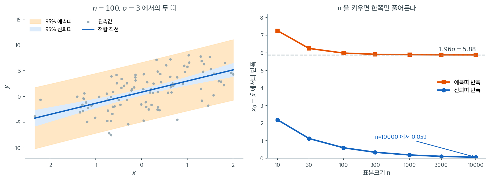

# 신뢰띠와 예측띠

## 개요

이 페이지는 단순선형회귀에서 평균반응 $E[y \mid x]$의 신뢰구간과 새 관측값 $y \mid x$의 예측구간을 설명하고 구현한다. 알려진 모형에서 인공자료를 생성하고 OLS를 적합한 뒤 두 띠를 함께 그려, 회귀직선에 대한 불확실성과 개별 예측에 대한 불확실성이 어떻게 다른지 보인다.

---

## 1. 수학적 배경

단순선형회귀 모형을 생각하자.

$$
y_i = \beta_0 + \beta_1 x_i + \varepsilon_i, \qquad \varepsilon_i \overset{\text{iid}}{\sim} N(0, \sigma^2).
$$

새 설명변수 값 $x_0$이 주어지면 적합값은 $\hat{y}_0 = \hat{\beta}_0 + \hat{\beta}_1 x_0$이다. 두 종류의 구간이 있다.

**$E[y \mid x_0]$의 신뢰구간**(평균반응):

$$
\hat{y}_0 \pm t^*_{n-2} \cdot s \sqrt{\frac{1}{n} + \frac{(x_0 - \bar{x})^2}{\sum_{i=1}^n (x_i - \bar{x})^2}}
$$

**$x_0$에서 새 $y$의 예측구간**:

$$
\hat{y}_0 \pm t^*_{n-2} \cdot s \sqrt{1 + \frac{1}{n} + \frac{(x_0 - \bar{x})^2}{\sum_{i=1}^n (x_i - \bar{x})^2}}
$$

예측구간은 평균 추정의 불확실성과 줄일 수 없는 잡음 $\sigma^2$을 모두 반영하므로 언제나 더 넓다.

### 자료 생성

<div class="exbox" markdown>

**보기 1.** <span class="diff easy" title="쉬움"></span> 자료 만들기. 함수 안에서 `np.random.seed(seed)` 로 **전역** 난수 상태를 고정한 뒤 $x$ 와 잡음을 차례로 뽑는다.

**(1)** 이 함수를 같은 인수로 두 번 부르면 같은 자료가 나오는가. 그렇다면 `np.random.seed` 를 **함수 안에** 두는 설계의 대가는 무엇인가.

**(2)** `generate_data(50, 3)` 과 `generate_data(100, 3)` 을 비교하면 $x$ 의 앞 $50$ 개는 같고 $y$ 의 앞 $50$ 개는 **다르다.** 왜 그런지 설명하고 확인하시오.

</div>

??? success "풀이"

    **(1) 같은 자료가 나온다.** `np.random.seed(seed)` 가 함수를 부를 때마다 전역 상태를 같은 자리로 되돌리므로, 뒤에 뽑는 난수열이 매번 같다. 재현성을 얻는 가장 간단한 길이다.

    대가는 **전역 상태를 건드린다는 것**이다. 세 가지 문제가 따라온다.

    - 이 함수를 부르면 **바깥의 난수열이 되감긴다.** 모의실험 도중에 부르면 그 뒤의 난수가 처음부터 다시 나와, 되풀이마다 같은 자료를 쓰게 된다. 숨은 버그가 되기 쉽다.
    - 여러 스레드에서 동시에 부르면 **경쟁 상태**가 된다. 전역 상태 하나를 여럿이 다투기 때문이다.
    - 함수의 결과가 인수뿐 아니라 "이 함수가 상태를 고쳐 쓴다"는 부작용에 달려 있어, **부작용 없는 함수**가 아니다.

    요즘 권장하는 꼴은 생성기를 넘겨받는 것이다. `rng = np.random.default_rng(seed)` 를 함수 바깥에서 만들고 `rng` 를 인수로 받으면 전역 상태를 건드리지 않는다. 이 책의 보기 코드는 간결함을 위해 전역 씨앗을 쓰지만, 실제 모의실험에서는 생성기를 넘기는 쪽이 옳다.

    **(2) 난수열에서 잡음이 시작하는 자리가 다르기 때문이다.** `np.random.randn(n, 1)` 은 표준정규 난수열에서 앞쪽 $n$ 개를 꺼내 쓴다. 그러므로

    - $x$ 는 **난수열 $0$ 번째부터** $n$ 개다. $n = 50$ 이면 $0 \sim 49$, $n = 100$ 이면 $0 \sim 99$ 이니 앞 $50$ 개가 같다.
    - 잡음은 **$x$ 를 꺼낸 다음부터** $n$ 개다. $n = 50$ 이면 $50 \sim 99$, $n = 100$ 이면 $100 \sim 199$ 다. **겹치는 구간이 하나도 없다.**

    그래서 $x$ 는 앞 $50$ 개가 일치하고 $y = 1 + 2x + \sigma\varepsilon$ 는 잡음이 전혀 달라 일치하지 않는다. $n$ 을 바꾸어 가며 "같은 자료에 관측값을 더한 효과"를 보려 한다면 이 설계로는 안 되고, 큰 $n$ 으로 한 번 만든 뒤 앞쪽을 잘라 써야 한다.

    ```python
    import numpy as np

    def generate_data(n, sigma, seed=0):
        """자료를 만든다. 참 모형은 y = 1 + 2x + 잡음 이다."""
        np.random.seed(seed)
        x = np.random.randn(n, 1)
        y = 1 + 2 * x + sigma * np.random.randn(n, 1)
        return x, y

    # 전역 씨앗을 쓰는 함수의 재현성을 확인한다.
    x_a, y_a = generate_data(100, 3)
    x_b, y_b = generate_data(100, 3)
    print(f"같은 인수로 두 번 부르면 같은가:  x {np.array_equal(x_a, x_b)},  y {np.array_equal(y_a, y_b)}")

    x_s, y_s = generate_data(50, 3)
    print(f"n=50 의 x 가 n=100 의 앞 50 과 같은가:  {np.allclose(x_s, x_a[:50])}")
    print(f"n=50 의 y 가 n=100 의 앞 50 과 같은가:  {np.allclose(y_s, y_a[:50])}")
    print(f"  n=50 의 잡음은 난수열의 50번째부터, n=100 의 잡음은 100번째부터 뽑힌다")

    np.random.seed(0)
    first, second = np.random.randn(3), np.random.randn(3)
    print(f"\n씨앗을 한 번 고정한 뒤 연속 두 호출")
    print(f"  첫 번째 {np.round(first, 4)}")
    print(f"  두 번째 {np.round(second, 4)}   같은가? {np.allclose(first, second)}")
    ```

    출력:

    ```
    같은 인수로 두 번 부르면 같은가:  x True,  y True
    n=50 의 x 가 n=100 의 앞 50 과 같은가:  True
    n=50 의 y 가 n=100 의 앞 50 과 같은가:  False
      n=50 의 잡음은 난수열의 50번째부터, n=100 의 잡음은 100번째부터 뽑힌다

    씨앗을 한 번 고정한 뒤 연속 두 호출
      첫 번째 [1.7641 0.4002 0.9787]
      두 번째 [ 2.2409  1.8676 -0.9773]   같은가? False
    ```

    세 판정이 유도와 모두 맞는다. 마지막 두 줄이 **(1)의 핵심**을 보인다. 씨앗을 한 번 고정한 뒤 두 번 뽑으면 다른 수가 나온다. 곧 씨앗은 "난수열의 시작점"을 정하는 것이고 매 호출마다 열을 되감지 않는다. `generate_data` 가 자료를 재현해 주는 것은 **함수 안에서 매번 되감기 때문**이며, 바로 그 되감기가 (1)에서 말한 대가를 만든다. $\square$

### 회귀직선 추정

<div class="exbox" markdown>

**보기 2.** <span class="diff easy" title="쉬움"></span> 회귀직선 추정. $\hat\beta_1 = r\,s_y/s_x$ 로 기울기를 구한다. 함수는 절편을 돌려주지 않는다.

**(1)** 코드가 상관행렬의 `[1, 0]` 원소를 읽는다. `[0, 1]` 과 같은가. 둘이 수학적으로 같은데도 부동소수점에서 어긋날 수 있는 까닭은 무엇인가. 또 함수가 돌려주는 네 값에서 **절편을 어떻게 복원**하는가.

**(2)** $x$ 를 $10$ 배 하거나 $y$ 를 $10$ 배 하면 $r$ 과 $\hat\beta_1$ 이 각각 어떻게 바뀌는지 **먼저 예측하고** 확인하시오.

</div>

??? success "풀이"

    **(1) 수학적으로는 같고 수치로는 어긋날 수 있다.** 상관행렬은 정의상 대칭이므로 $[1,0]$ 과 $[0,1]$ 은 같은 수다. 그런데 `np.corrcoef` 는 공분산행렬 $\mathbf C$ 를 계산한 뒤 $C_{ij}/\sqrt{C_{ii}C_{jj}}$ 로 정규화하는데, 이 나눗셈이 두 원소에 대해 **같은 순서로 수행된다는 보장이 없다.** 부동소수점 곱셈과 나눗셈은 결합법칙을 지키지 않으므로 마지막 비트가 어긋날 수 있다.

    따라서 어느 쪽을 읽어도 통계적으로는 차이가 없다. 다만 **두 값을 `==` 로 견주는 코드를 쓰면 안 된다.** `np.allclose` 를 써야 한다.

    절편은 평균점을 지난다는 성질에서 나온다. 함수가 $\hat\beta_1$, $\bar y$, $\bar x$ 를 돌려주므로

    $$
    \hat\beta_0 = \bar y - \hat\beta_1 \bar x
    $$

    로 복원한다. 돌려주는 값에 $\bar y$ 와 $\bar x$ 가 끼어 있는 까닭이 바로 이것이다. 적합값만 필요하면 $\hat y = \bar y + \hat\beta_1(x - \bar x)$ 로 절편을 거치지 않아도 된다.

    **(2) 예측부터 한다.** 상관계수는 **표준화한 뒤의 양**이므로 어느 쪽을 양수배 해도 변하지 않는다.

    $$
    \operatorname{corr}(ax, y) = \operatorname{corr}(x, y) \quad (a > 0)
    $$

    기울기는 다르다. $\hat\beta_1 = r\,s_y/s_x$ 에서

    - $x \mapsto 10x$ 면 $s_x \mapsto 10 s_x$ 이므로 $\hat\beta_1 \mapsto \hat\beta_1/10$. **$x$ 의 단위가 열 배 커졌으니 "한 단위당 변화"는 열 배 작아진다.**
    - $y \mapsto 10y$ 면 $s_y \mapsto 10 s_y$ 이므로 $\hat\beta_1 \mapsto 10\hat\beta_1$.

    $$
    \hat\beta_1 \mapsto \frac{c}{a}\,\hat\beta_1 \qquad (x \mapsto ax,\ y \mapsto cy)
    $$

    **기울기는 단위가 있고 상관계수는 없다.** 이것이 둘을 함께 보고해야 하는 까닭이다.

    ```python
    def estimate_regression_line(x, y):
        """상관계수 공식으로 기울기와 절편을 구한다.

        beta_hat = r * (s_y / s_x) 이다. 최소제곱해와 정확히 같은 값이지만,
        회귀계수가 상관계수를 척도만 바꿔 옮긴 것임이 이 꼴에서 드러난다.
        """
        x_bar = x.mean()
        y_bar = y.mean()
        s_x = x.std(ddof=1)
        s_y = y.std(ddof=1)
        r = np.corrcoef(np.concatenate([x, y], axis=1), rowvar=False)[1, 0]
        beta_hat = r * s_y / s_x
        y_hat = beta_hat * (x - x_bar) + y_bar
        return y_hat, beta_hat, y_bar, x_bar

    # 상관행렬의 두 비대각 원소, 그리고 척도를 바꿀 때 무엇이 변하는가.
    corr_matrix = np.corrcoef(np.concatenate([x_a, y_a], axis=1), rowvar=False)
    print("상관행렬")
    print(np.round(corr_matrix, 6))
    print(f"  [1,0] 과 [0,1] 의 차이 = {corr_matrix[1, 0] - corr_matrix[0, 1]:.2e}")
    print()
    y_hat_a, beta_a, y_bar_a, x_bar_a = estimate_regression_line(x_a, y_a)
    print(f"기울기 {beta_a:.8f},  절편 = y-bar - b*x-bar = {y_bar_a - beta_a * x_bar_a:.8f}")
    print()
    print("척도를 바꾸면 무엇이 변하는가")
    for label, xx, yy in [("x -> 10x", 10 * x_a, y_a), ("y -> 10y", x_a, 10 * y_a)]:
        r_new = np.corrcoef(np.concatenate([xx, yy], axis=1), rowvar=False)[1, 0]
        b_new = r_new * yy.std(ddof=1) / xx.std(ddof=1)
        print(f"  {label:10s} r = {r_new:.8f}   beta = {b_new:.8f}")
    print(f"  원래      r = {beta_a / (y_a.std(ddof=1) / x_a.std(ddof=1)):.8f}   beta = {beta_a:.8f}")
    ```

    출력:

    ```
    상관행렬
    [[1.       0.608065]
     [0.608065 1.      ]]
      [1,0] 과 [0,1] 의 차이 = -1.11e-16

    기울기 2.34409530,  절편 = y-bar - b*x-bar = 1.22545926

    척도를 바꾸면 무엇이 변하는가
      x -> 10x   r = 0.60806485   beta = 0.23440953
      y -> 10y   r = 0.60806485   beta = 23.44095301
      원래      r = 0.60806485   beta = 2.34409530
    ```

    **(1) 두 원소가 정말로 어긋난다.** 차이가 $-1.11\times10^{-16}$ 로, 배정도 실수의 기계 입실론 $2.2\times10^{-16}$ 의 절반이다. **딱 한 비트 차이**다. 소수 여섯째 자리까지 찍은 행렬에서는 둘이 완전히 같아 보이지만, 비트 단위로는 다르다.

    통계적으로는 아무 차이가 없다. $\lvert r \rvert \le 1$ 이라는 성질조차 흔들리지 않는다. 그러나 **`corr_matrix[1,0] == corr_matrix[0,1]` 이 `False` 를 돌려준다**는 사실은 기억해 둘 만하다. 부동소수점 수를 등호로 견주는 습관이 이런 자리에서 깨진다.

    절편은 $1.22545926 = \bar y - \hat\beta_1\bar x$ 로 복원된다. 참값 $1$ 보다 $0.23$ 크다.

    **(2) 예측이 정확히 맞는다.** 세 경우 모두 $r = 0.60806485$ 로 소수 여덟째 자리까지 같고, 기울기는 $x$ 를 열 배 하면 $0.23440953$($1/10$ 배), $y$ 를 열 배 하면 $23.44095301$($10$ 배)이다.

    이 불변성이 실무에서 중요한 까닭은 이렇다. **단위를 바꾸면 계수가 바뀌므로 "계수가 크다"는 말은 단위를 밝히지 않으면 아무 뜻이 없다.** 반면 $r$ 은 단위에 무관하므로 서로 다른 변수들끼리도 견줄 수 있다. 다만 $r$ 은 "한 단위당 몇"이라는 **실질적 크기**를 말해 주지 못한다. 그래서 다중회귀에서는 계수를 표준편차당 효과 $\hat\beta_j \cdot s_{x_j}$ 로 바꿔 보고하는 일이 흔하며, 그것이 두 성질의 중간을 취하는 길이다. $\square$

### 잔차분산

<div class="exbox" markdown>

**보기 3.** <span class="diff easy" title="쉬움"></span> 잔차분산 구하기. $s^2 = \text{RSS}/(n-2)$ 와 $s = \sqrt{s^2}$ 을 돌려준다.

**(1)** 단순회귀에서 $\text{RSS} = S_{yy}(1 - r^2)$ 임을 보이고, 따라서

$$
s^2 = \frac{n-1}{n-2}\,s_y^2\,(1 - r^2)
$$

임을 유도하시오. 이 식은 **원자료 없이 $r$, $s_y$, $n$ 만으로** $s^2$ 을 계산할 수 있음을 뜻한다.

**(2)** $s^2$ 은 $\sigma^2$ 의 불편추정량이다. 그렇다면 $s$ 는 $\sigma$ 의 불편추정량인가. 치우침의 방향을 먼저 말하고 그 크기를 자유도 몇 개에서 재어 보시오.

</div>

??? success "풀이"

    **(1) 해석적으로.** 적합값이 $\hat y_i = \bar y + \hat\beta_1(x_i - \bar x)$ 이므로 잔차는 $e_i = (y_i - \bar y) - \hat\beta_1(x_i - \bar x)$ 다. 제곱해 더하면

    $$
    \text{RSS} = S_{yy} - 2\hat\beta_1 S_{xy} + \hat\beta_1^2 S_{xx}
    $$

    이고 $\hat\beta_1 = S_{xy}/S_{xx}$ 를 넣으면 뒤 두 항이 합쳐진다.

    $$
    \text{RSS} = S_{yy} - \frac{S_{xy}^2}{S_{xx}} = S_{yy}\left(1 - \frac{S_{xy}^2}{S_{xx}S_{yy}}\right) = S_{yy}(1 - r^2)
    $$

    $r^2 = S_{xy}^2/(S_{xx}S_{yy})$ 라는 정의가 그대로 쓰였다. 이제 $S_{yy} = (n-1)s_y^2$ 이므로

    $$
    s^2 = \frac{\text{RSS}}{n-2} = \frac{(n-1)s_y^2(1-r^2)}{n-2}
    $$

    다. **$r$ 과 $s_y$ 와 $n$ 만 알면 $s^2$ 이 나온다.** 논문에 상관계수와 표준편차만 실려 있어도 잔차분산을 되살릴 수 있다는 뜻이고, 거꾸로 $R^2$ 와 $s$ 가 서로 독립된 정보가 아니라는 뜻이다(문제 1의 $S$ 와 $R^2$ 가 무관하지 않았던 까닭이 이것이다).

    **(2) $s$ 는 불편이 아니고 아래로 치우친다.** $\sqrt{\cdot}$ 가 **오목함수**이므로 젠센 부등식에서

    $$
    E[s] = E\!\left[\sqrt{s^2}\right] \;\le\; \sqrt{E[s^2]} = \sigma
    $$

    이고 $s^2$ 이 상수가 아니므로 등호가 성립하지 않는다. **$s$ 는 평균적으로 $\sigma$ 를 과소추정한다.**

    크기는 정확히 계산된다. $\nu = n-2$ 에 대해 $\nu s^2/\sigma^2 \sim \chi^2_\nu$ 이고 $\chi^2_\nu$ 의 제곱근의 기댓값이 알려져 있으므로

    $$
    \frac{E[s]}{\sigma} = \sqrt{\frac{2}{\nu}}\,\frac{\Gamma\!\left(\frac{\nu+1}{2}\right)}{\Gamma\!\left(\frac{\nu}{2}\right)}
    \;\approx\; 1 - \frac{1}{4\nu}
    $$

    다. **치우침이 $\nu^{-1}$ 로 줄어든다.**

    ```python
    def calculate_residual_variance(y, y_hat, n):
        """잔차분산 s^2 을 구한다.

        n 이 아니라 n-2 로 나눈다. 절편과 기울기 둘을 자료에서 추정하느라
        자유도를 둘 잃었기 때문이다.
        """
        s_square = np.sum((y - y_hat) ** 2) / (n - 2)
        s = np.sqrt(s_square)
        return s_square, s

    # s^2 을 r^2 으로 적는 세 가지 길이 같은지 본다.
    from scipy.special import gammaln

    n_a = 100
    s_square_a, s_a = calculate_residual_variance(y_a, y_hat_a, n_a)
    r_a = np.corrcoef(np.concatenate([x_a, y_a], axis=1), rowvar=False)[1, 0]
    s_y_a = y_a.std(ddof=1)
    S_yy_a = ((y_a - y_bar_a) ** 2).sum()
    print(f"RSS                       = {((y_a - y_hat_a) ** 2).sum():.6f}")
    print(f"S_yy * (1 - r^2)          = {S_yy_a * (1 - r_a ** 2):.6f}")
    print(f"s^2 = RSS/(n-2)           = {s_square_a:.6f}")
    print(f"(n-1)/(n-2) * s_y^2 (1-r^2) = {(n_a - 1) / (n_a - 2) * s_y_a ** 2 * (1 - r_a ** 2):.6f}")
    print()
    # s 는 sigma 의 불편추정량이 아니다
    def unbias_factor(nu):
        return np.sqrt(2 / nu) * np.exp(gammaln((nu + 1) / 2) - gammaln(nu / 2))
    print("E[s]/sigma = sqrt(2/nu) * Gamma((nu+1)/2) / Gamma(nu/2)")
    for nu in (8, 18, 98):
        print(f"  자유도 {nu:3d}:  {unbias_factor(nu):.6f}   치우침 {unbias_factor(nu) - 1:+.6f}"
              f"   근사 -1/(4nu) = {-1 / (4 * nu):+.6f}")
    print()
    print(f"이 표본:  s = {s_a:.6f},  참 sigma = 3")
    print(f"  치우침 보정한 추정값 s/{unbias_factor(n_a - 2):.6f} = {s_a / unbias_factor(n_a - 2):.6f}")
    ```

    출력:

    ```
    RSS                       = 951.454669
    S_yy * (1 - r^2)          = 951.454669
    s^2 = RSS/(n-2)           = 9.708721
    (n-1)/(n-2) * s_y^2 (1-r^2) = 9.708721

    E[s]/sigma = sqrt(2/nu) * Gamma((nu+1)/2) / Gamma(nu/2)
      자유도   8:  0.969311   치우침 -0.030689   근사 -1/(4nu) = -0.031250
      자유도  18:  0.986214   치우침 -0.013786   근사 -1/(4nu) = -0.013889
      자유도  98:  0.997452   치우침 -0.002548   근사 -1/(4nu) = -0.002551

    이 표본:  s = 3.115882,  참 sigma = 3
      치우침 보정한 추정값 s/0.997452 = 3.123841
    ```

    **(1) 네 줄이 소수 여섯째 자리까지 닫힌다.** $\text{RSS} = 951.454669 = S_{yy}(1-r^2)$ 이고 $s^2 = 9.708721$ 이 $\frac{n-1}{n-2}s_y^2(1-r^2)$ 와 같다. **원자료를 보지 않고 $r = 0.608065$, $s_y = 3.904969$, $n = 100$ 만으로 $s^2$ 이 나온다.**

    이 사실에는 양면이 있다. 요약통계만 있는 논문에서 잔차분산을 되살릴 수 있어 유용하지만, 동시에 **$R^2$ 와 $s$ 를 "두 개의 독립된 증거"로 읽으면 안 된다**는 뜻이기도 하다. 둘은 같은 정보를 담고 있고, 다른 것은 단위뿐이다($R^2$ 는 무차원, $s$ 는 $y$ 의 단위).

    **(2) 치우침이 작고 예측대로 음수다.** 자유도 $98$ 에서 $E[s]/\sigma = 0.997452$ 로 $-0.25\%$ 다. 근사식 $-1/(4\nu) = -0.2551\%$ 와 소수 넷째 자리까지 맞는다. 자유도 $8$ 에서는 $-3.07\%$ 로 커지는데 근사값 $-3.13\%$ 와 $0.06$ 퍼센트포인트 차이다. **근사가 자유도 $8$ 에서도 쓸 만하다.**

    실용적인 결론은 이렇다. $n$ 이 $20$ 만 넘으면 $s$ 의 치우침은 $1\%$ 아래이므로 **신뢰구간 계산에서 보정할 필요가 없다.** 실제로 모든 교과서 공식이 보정 없이 $s$ 를 쓴다. 보정이 필요한 것은 자유도가 한 자리로 떨어지는 품질관리 쪽 관행이며, 거기서는 보정계수를 $c_4$ 라 부른다.

    이 표본에서 보정하면 $s = 3.1159$ 가 $3.1238$ 로 올라간다. 참값 $3$ 에서 **더 멀어졌다.** 모순이 아니다. 보정은 **평균적으로** 치우침을 없애는 것이고, 이 표본의 $s$ 가 이미 참값보다 큰 쪽으로 뽑혔으므로 위로 올리면 더 멀어지는 것이 당연하다. **불편성은 한 표본에서 확인할 수 없는 성질이다.** $\square$

### 신뢰구간과 예측구간

<div class="exbox" markdown>

**보기 4.** <span class="diff easy" title="쉬움"></span> 두 구간 계산. 코드가 격자를 `np.linspace(x.min(), x.max(), 20)` 으로 잡으므로 **자료 범위 안만** 그린다.

**(1)** $x_0 = \bar x + k\,s_x$ 로 두면 지렛값이 $h = \frac{1}{n} + \frac{k^2}{n-1}$ 임을 보이고, 신뢰띠 반폭이 중앙 대비 $\sqrt{1 + k^2 n/(n-1)}$ 배가 됨을 유도하시오. $k \to \infty$ 에서 두 띠는 각각 어떻게 자라는가.

**(2)** $k = 0, 1, 2, 3, 5, 10$ 에서 두 반폭을 재어 (1)을 확인하시오. 자료 범위 안만 그리는 이 코드가 **보여 주지 못하는 위험**은 무엇인가.

</div>

??? success "풀이"

    **(1) 해석적으로.** $S_{xx} = (n-1)s_x^2$ 이므로 $x_0 - \bar x = k s_x$ 를 넣으면

    $$
    h(x_0) = \frac{1}{n} + \frac{k^2 s_x^2}{(n-1)s_x^2} = \frac{1}{n} + \frac{k^2}{n-1}
    $$

    다. **$s_x$ 가 약분되어 $h$ 가 $k$ 와 $n$ 만의 함수가 된다.** 중앙에서는 $h(\bar x) = 1/n$ 이니 비는

    $$
    \frac{m_{\text{CI}}(x_0)}{m_{\text{CI}}(\bar x)} = \sqrt{\frac{h(x_0)}{1/n}}
    = \sqrt{1 + \frac{k^2 n}{n-1}}
    $$

    이다. $n$ 이 크면 $\sqrt{1+k^2}$ 에 가까워진다.

    $k$ 가 커질 때 두 띠가 전혀 다르게 자란다.

    $$
    m_{\text{CI}} \sim t^* s\,\frac{\lvert k \rvert}{\sqrt{n-1}} \quad (\text{$k$ 에 비례해 선형으로}),
    \qquad
    m_{\text{PI}} \sim t^* s\sqrt{1 + \frac{k^2}{n-1}} \quad (\text{같은 기울기로 자라지만 출발점이 높다})
    $$

    둘 다 결국 $\lvert k\rvert$ 에 선형이지만, **신뢰띠는 원점에서 출발해 선형이고 예측띠는 $t^*s$ 에서 출발한다.** 그래서 $k$ 가 아주 커지면 두 띠의 **비가 $1$ 로 수렴한다.** 멀리 외삽하면 "직선의 위치를 모르는 불확실성"이 "잡음"을 압도하기 때문이다.

    **(2) 수치적으로.**

    ```python
    from scipy import stats

    def confidence_intervals(x, y_hat, beta_hat, x_bar, y_bar, n, s):
        """평균반응의 신뢰구간과 개별관측의 예측구간을 함께 구한다.

        두 식의 차이는 근호 안의 1 뿐이다. 평균을 맞히는 데는 추정오차만 들지만,
        개별 관측을 맞히려면 잡음 자체의 분산이 더 얹힌다.
        """
        x0 = np.linspace(x.min(), x.max(), 20)
        y0_hat = beta_hat * (x0 - x_bar) + y_bar
        t_val = stats.t(n - 2).ppf(0.975)
        ss_x = np.sum((x - x_bar) ** 2)

        # 평균반응의 신뢰구간. x 의 평균에서 멀어질수록 넓어진다.
        margin = t_val * s * np.sqrt((1 / n) + (x0 - x_bar) ** 2 / ss_x)
        lower = y0_hat - margin
        upper = y0_hat + margin

        # 예측구간. 근호 안의 1 이 잡음 몫이며, n 을 키워도 사라지지 않는다.
        margin2 = t_val * s * np.sqrt(1 + (1 / n) + (x0 - x_bar) ** 2 / ss_x)
        lower2 = y0_hat - margin2
        upper2 = y0_hat + margin2

        return x0, lower, upper, lower2, upper2

    # 코드가 그리는 범위와, 그 밖으로 나갔을 때 띠가 얼마나 넓어지는가.
    x0_a, lo_a, up_a, lo2_a, up2_a = confidence_intervals(
        x_a, y_hat_a, beta_a, x_bar_a, y_bar_a, n_a, s_a
    )
    s_x_a = x_a.std(ddof=1)
    S_xx_a = ((x_a - x_bar_a) ** 2).sum()
    t_a = stats.t(n_a - 2).ppf(0.975)
    print(f"코드가 그리는 x 범위 = [{x0_a.min():.4f}, {x0_a.max():.4f}]"
          f"   = x-bar + [{(x0_a.min() - x_bar_a) / s_x_a:.3f}, "
          f"{(x0_a.max() - x_bar_a) / s_x_a:.3f}] * s_x")
    print()
    print(f"{'k':>4s}{'x0 = x-bar + k*s_x':>20s}{'h':>12s}{'CI 반폭':>10s}{'배수':>9s}"
          f"{'sqrt(1+k^2 n/(n-1))':>22s}{'PI 반폭':>10s}{'PI 배수':>9s}")
    half_ci_center = t_a * s_a * np.sqrt(1 / n_a)
    half_pi_center = t_a * s_a * np.sqrt(1 + 1 / n_a)
    for k in (0, 1, 2, 3, 5, 10):
        x0v = x_bar_a + k * s_x_a
        h = 1 / n_a + (x0v - x_bar_a) ** 2 / S_xx_a
        hc = t_a * s_a * np.sqrt(h)
        hp = t_a * s_a * np.sqrt(1 + h)
        print(f"{k:4d}{x0v:20.4f}{h:12.6f}{hc:10.4f}{hc / half_ci_center:9.4f}"
              f"{np.sqrt(1 + k ** 2 * n_a / (n_a - 1)):22.4f}{hp:10.4f}{hp / half_pi_center:9.4f}")
    print()
    print(f"격자 끝까지(k = 2.18)만 그리면 CI 반폭은 "
          f"{t_a * s_a * np.sqrt(1 / n_a + (2.18 * s_x_a) ** 2 / S_xx_a):.4f} 에서 멈춘다")
    print(f"  k = 10 까지 가면 {t_a * s_a * np.sqrt(1 / n_a + (10 * s_x_a) ** 2 / S_xx_a):.4f}"
          f" 로 {np.sqrt(1 + 100 * n_a / (n_a - 1)) / np.sqrt(1 + 2.18 ** 2 * n_a / (n_a - 1)):.2f} 배가 된다")
    ```

    출력:

    ```
    코드가 그리는 x 범위 = [-2.5530, 2.2698]   = x-bar + [-2.579, 2.182] * s_x

       k  x0 = x-bar + k*s_x           h     CI 반폭       배수   sqrt(1+k^2 n/(n-1))     PI 반폭    PI 배수
       0              0.0598    0.010000    0.6183   1.0000                1.0000    6.2142   1.0000
       1              1.0728    0.020101    0.8767   1.4178                1.4178    6.2452   1.0050
       2              2.0857    0.050404    1.3882   2.2451                2.2451    6.3373   1.0198
       3              3.0987    0.100909    1.9642   3.1766                3.1766    6.4878   1.0440
       5              5.1246    0.262525    3.1682   5.1237                5.1237    6.9478   1.1180
      10             10.1894    1.020101    6.2452  10.1000               10.1000    8.7884   1.4142

    격자 끝까지(k = 2.18)만 그리면 CI 반폭은 1.4892 에서 멈춘다
      k = 10 까지 가면 6.2452 로 4.19 배가 된다
    ```

    **유도한 배수가 여섯 줄 모두에서 맞는다.** `배수` 열과 $\sqrt{1 + k^2 n/(n-1)}$ 열이 소수 넷째 자리까지 같다. $k = 1$ 에서 $1.4178$, $k = 10$ 에서 $10.1000$ 이다. $k$ 가 커지면 배수가 거의 $k$ 와 같아지는데, $\sqrt{1 + k^2 n/(n-1)} \approx k\sqrt{n/(n-1)} = 1.005k$ 이기 때문이다.

    **두 띠의 반응이 극명하게 다르다.** $k$ 를 $0$ 에서 $10$ 으로 밀면 신뢰띠는 $0.6183 \to 6.2452$ 로 **$10.1$ 배** 넓어지는데 예측띠는 $6.2142 \to 8.7884$ 로 **$1.414$ 배**만 넓어진다. 외삽은 **직선의 위치**를 모르게 만들고, 잡음의 크기는 건드리지 않기 때문이다. 두 띠의 비도 $k = 0$ 에서 $6.2142/0.6183 = 10.05$ 였던 것이 $k = 10$ 에서 $8.7884/6.2452 = 1.407$ 로 줄어든다. **멀리 외삽하면 두 띠가 서로 가까워진다** — (1)에서 예언한 대로다.

    **(2) 코드가 보여 주지 못하는 위험은 외삽의 위험이다.** 격자가 $k \in [-2.58,\ 2.18]$ 로 자료 범위에 묶여 있으므로 신뢰띠 반폭이 $1.4892$ 를 넘지 않는다. 그 바깥을 그리면 $k = 10$ 에서 $6.2452$, 곧 **$4.19$ 배**가 된다. 그림만 보면 "띠가 완만하게 벌어지는 모래시계"처럼 보이지만, 실제로는 자료 밖으로 나갈수록 **선형으로 벌어진다.**

    더 중요한 것은 이 띠가 **담지 못하는 위험**이다. 두 식 모두 "참 관계가 직선이다"를 전제로 세워졌다. 자료 범위 밖에서는 그 전제를 확인할 자료가 아예 없으므로, **모형이 틀렸을 가능성은 띠의 폭에 조금도 반영되지 않는다.** 띠는 넓어지지만 그 넓어짐은 계수의 불확실성에서만 오고, "직선이 아닐 수도 있다"는 불확실성은 들어 있지 않다.

    그러므로 격자를 자료 범위에 묶어 둔 코드의 선택은 **옳은 보수**다. 외삽된 띠를 그리면 그 띠가 외삽의 위험을 재어 준다는 잘못된 인상을 주기 때문이다. 외삽이 필요하면 띠를 그리는 대신 **"이 범위 밖은 모형이 보증하지 않는다"고 글로 적는 것**이 정직하다. $\square$

---

## 2. 해석



왼쪽이 위 코드가 그리는 그림이다. $n = 100$, $\sigma = 3$이고 파란 띠가 평균반응의 95% 신뢰띠, 주황 띠가 새 관측값의 95% 예측띠다. 두 띠의 폭 차이가 먼저 눈에 들어온다. $x_0 = \bar{x}$에서 신뢰띠의 반폭은 $0.595$, 예측띠는 $5.983$으로 **10배** 차이다. 관측점을 세어 보면 이유가 분명해진다. 점들은 주황 띠 안에 거의 다 들어오지만 파란 띠 안에는 극히 일부만 들어온다. 파란 띠는 **직선이 지나갈 자리**를 재는 것이지 점이 떨어질 자리를 재는 것이 아니기 때문이다. 이 혼동이 실무에서 가장 흔한 오독이다.

오른쪽은 $x_0 = \bar{x}$에서 두 반폭을 $n$에 대해 그린 것이다. 신뢰띠는 $t^* s/\sqrt{n}$이므로 $n$을 키우면 0으로 간다. $n = 10$에서 $2.188$이던 것이 $n = 10000$에서 $0.059$로 줄어든다. 예측띠는 $t^* s\sqrt{1 + 1/n}$이어서 $t^* s$로 수렴한다. $n = 10$에서 $7.256$이던 것이 $n = 10000$에서 $5.881$까지만 내려가고 회색 점선 $1.96\sigma = 5.88$에 붙어 멈춘다. **자료를 아무리 더 모아도 이 폭은 줄지 않는다.** 줄어드는 것은 "직선이 어디 있는지 모르는" 몫뿐이고, "다음 점이 직선에서 얼마나 벗어날지 모르는" 몫은 $\sigma$ 자체이기 때문이다.

두 곡선의 비를 보면 이야기가 더 선명하다. $n = 10$에서 예측띠는 신뢰띠의 $3.3$배지만 $n = 100$에서 $10$배, $n = 10000$에서 $100$배가 된다. 표본이 커질수록 두 띠의 구별이 **더** 중요해진다는 뜻이다. 큰 자료에서 신뢰띠를 그려 놓고 "모형의 95% 구간"이라 부르면, 실제 관측값의 95%가 아니라 1%도 담지 못하는 띠를 보여 주는 셈이 된다. 개별 사례를 예측하고 그 불확실성을 말해야 하는 문제라면 언제나 예측띠가 옳다.

- **신뢰띠**(CI)는 참 회귀직선이 어디에 있는지에 대한 불확실성을 수량화한다. $x = \bar{x}$에서 가장 좁고 $x_0$이 자료의 중심에서 멀어질수록 넓어진다.
- **예측띠**(PI)는 새로운 관측값 하나가 어디에 떨어질지에 대한 불확실성을 수량화한다. 제곱근 안에 $+1$이 더 들어 있으므로 언제나 신뢰띠보다 넓다.
- $n \to \infty$이면 신뢰띠의 폭은 0으로 줄어들지만(직선이 완벽하게 추정된다) 예측띠는 $\hat{y}_0 \pm t^* \cdot s$로 수렴하며, 이는 줄일 수 없는 잡음을 반영한다.
- 두 띠의 "나비넥타이" 모양은 지렛대 원리를 보여준다. 예측은 관측된 설명변수 값들의 중심 근처에서 가장 믿을 만하다.

---

## 연습문제

<div class="drillbox" markdown>

**연습문제 1.** <span class="diff med" title="중간"></span> $n = 100$, $\sigma = 3$인 인공자료에서 $E[y \mid x_0 = 0]$의 90% 신뢰구간을 계산하고 95% 구간과 비교하라.

</div>

??? success "풀이"

    표준정규 설명변수에서 $x_0 = 0$은 대략 $\bar{x}$이다.

    ```python
    import numpy as np
    from scipy import stats

    n, s = 100, 3.0
    t_90 = stats.t(n - 2).ppf(0.95)
    t_95 = stats.t(n - 2).ppf(0.975)

    margin_90 = t_90 * s * np.sqrt(1 / n)
    margin_95 = t_95 * s * np.sqrt(1 / n)
    print(f"t_90 = {t_90:.4f}, margin_90 = {margin_90:.4f}")
    print(f"t_95 = {t_95:.4f}, margin_95 = {margin_95:.4f}")
    print(f"ratio = {margin_90 / margin_95:.4f}")
    ```

    출력:

    ```
    t_90 = 1.6606, margin_90 = 0.4982
    t_95 = 1.9845, margin_95 = 0.5953
    ratio = 0.8368
    ```

    90% 구간이 95% 구간의 0.837배로 좁다. 이 비는 $t$ 임계값의 비 $t_{0.95}/t_{0.975} = 1.6606/1.9845$와 정확히 같다. 신뢰수준만 바꾸면 구간의 **폭만** 비례해서 달라진다. $\square$

<div class="drillbox" markdown>

**연습문제 2.** <span class="diff med" title="중간"></span> 어떤 $x_0$에서든 예측구간이 신뢰구간보다 항상 넓은 이유를 대수적으로 설명하라.

</div>

??? success "풀이"

    신뢰구간 반폭의 제곱은 다음에 비례한다.

    $$
    \frac{1}{n} + \frac{(x_0 - \bar{x})^2}{S_{xx}},
    $$

    반면 예측구간은

    $$
    1 + \frac{1}{n} + \frac{(x_0 - \bar{x})^2}{S_{xx}}.
    $$

    예측구간에는 $1$이라는 항이 더 붙는다(표준화한 뒤 $\mathrm{Var}(\varepsilon_{\text{new}})/s^2 = 1$에 해당한다). 따라서 제곱근 안의 값이 예측구간에서 항상 더 크다. 임계값과 $s$가 같으므로 예측구간이 언제나 더 넓다. $\square$

<div class="drillbox" markdown>

**연습문제 3.** <span class="diff med" title="중간"></span> $n = 30$, $\sigma = 1$인 모형의 띠를 그리도록 코드를 고쳐라. 원래의 $n = 100$, $\sigma = 3$인 경우와 띠의 폭을 비교하면 어떠한가?

</div>

??? success "풀이"

    ```python
    x30, y30 = generate_data(30, 1)
    y_hat30, beta30, ybar30, xbar30 = estimate_regression_line(x30, y30)
    _, s30 = calculate_residual_variance(y30, y_hat30, 30)
    ```

    신뢰구간의 폭은 $s/\sqrt{n}$에 의존한다. $n=30$, $\sigma=1$이면 $s \approx 1$이고 $s/\sqrt{30} \approx 0.18$인 반면, 원래는 $s \approx 3$이고 $s/\sqrt{100} = 0.3$이었다. 새 신뢰구간이 더 좁다. 예측구간의 폭은 $s$가 지배하므로 $\sigma=1$일 때의 예측구간은 $\sigma=3$일 때보다 훨씬 좁다. $\square$

<div class="drillbox" markdown>

**연습문제 4.** <span class="diff med" title="중간"></span> $y_{\text{new}} = \beta_0 + \beta_1 x_0 + \varepsilon_{\text{new}}$이고 $\varepsilon_{\text{new}}$이 훈련자료와 독립일 때, 예측오차 $\hat{y}_0 - y_{\text{new}}$의 분산을 유도하라.

</div>

??? success "풀이"

    예측오차는 $\hat{y}_0 - y_{\text{new}} = (\hat{y}_0 - E[y \mid x_0]) - \varepsilon_{\text{new}}$이다. $\hat{y}_0$은 훈련자료에만 의존하고 $\varepsilon_{\text{new}}$은 그와 독립이므로

    $$
    \mathrm{Var}(\hat{y}_0 - y_{\text{new}}) = \mathrm{Var}(\hat{y}_0) + \mathrm{Var}(\varepsilon_{\text{new}}) = \sigma^2\!\left(\frac{1}{n} + \frac{(x_0 - \bar{x})^2}{S_{xx}}\right) + \sigma^2.
    $$

    $\sigma^2$을 묶어 내면

    $$
    \mathrm{Var}(\hat{y}_0 - y_{\text{new}}) = \sigma^2\!\left(1 + \frac{1}{n} + \frac{(x_0 - \bar{x})^2}{S_{xx}}\right).
    $$

    이것이 ($\sigma$를 $s$로 바꾸면) 예측구간 공식의 제곱근 안 표현과 정확히 일치한다. $\square$

<div class="drillbox" markdown>

**연습문제 5.** <span class="diff med" title="중간"></span> $x_0 = \bar{x}$에서 평균의 신뢰구간이 $\bar{y} \pm t^*_{n-2} \cdot s / \sqrt{n}$으로 간단해짐을 보여라. 입문 통계학에서 배우는 모평균의 신뢰구간과 비교하라.

</div>

??? success "풀이"

    $x_0 = \bar{x}$에서는 $(x_0 - \bar{x})^2/S_{xx} = 0$이므로 신뢰구간이

    $$
    \hat{y}_0 \pm t^*_{n-2} \cdot s \sqrt{\frac{1}{n}} = \bar{y} \pm \frac{t^*_{n-2} \cdot s}{\sqrt{n}}
    $$

    가 된다. $\hat{y}_0 = \hat{\beta}_0 + \hat{\beta}_1 \bar{x} = \bar{y}$이기 때문이다. 이는 모평균의 신뢰구간 $\bar{y} \pm t^*_{n-1} \cdot s/\sqrt{n}$과 같은 형태이며, 다만 회귀에서는 모수를 두 개 추정하므로 자유도가 $n-1$이 아니라 $n-2$이다. $\square$

---

## 정리하며

두 띠를 **함께 그리면** 차이가 분명해진다.

- **신뢰 띠는 회귀직선의 위치에 대한 불확실성**이고, **예측 띠는 새 관측 하나에 대한 불확실성**이다.
- **예측 띠가 훨씬 넓다.** 차이가 $\sigma^2$ 만큼이며, $n$ 을 아무리 늘려도 이 폭은 줄지 않는다. **줄어드는 것은 신뢰 띠뿐이다.**
- **둘 다 $\bar x$ 에서 가장 좁다.** 모래시계 모양이며, 자료 중심에서 멀어질수록 추정이 불안해진다.
- **혼동이 실무에서 자주 일어난다.** "이 모형의 95% 구간"이라 하면 대개 예측 띠를 뜻해야 하는데 신뢰 띠를 그려 놓는 일이 흔하다. **개별 사례를 예측하는 문제라면 예측 띠가 옳다.**
- **띠가 자료 범위 안에서만 의미가 있다.** 밖으로 나가면 넓어지기는 하지만 모형 오지정의 위험은 반영하지 못한다.

다음 절 **RSS 곡면 시각화**로 넘어간다.
