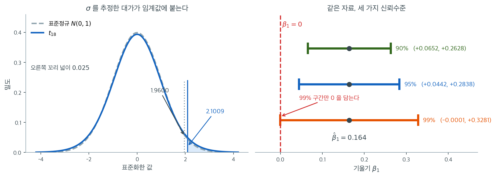

# 기울기의 신뢰구간 (카페인 보기)

## 개요

이 페이지는 단순선형회귀에서 기울기 계수의 신뢰구간을 어떻게 구성하는지 보인다. 공부 시간과 카페인 섭취의 관계를 살핀 학생 20명의 연구를 이용해 $t$ 분포로 오차한계를 계산하고 $\beta_1$의 95% 신뢰구간을 만든다.

## 수학적 배경

단순선형회귀 모형은

$$
y_i = \beta_0 + \beta_1 x_i + \varepsilon_i, \qquad \varepsilon_i \overset{\text{iid}}{\sim} N(0, \sigma^2).
$$

최소제곱 추정량 $\hat{\beta}_1$의 표집분포는

$$
\hat{\beta}_1 \sim N\!\left(\beta_1,\; \frac{\sigma^2}{\sum_{i=1}^n (x_i - \bar{x})^2}\right).
$$

$\sigma^2$을 모르므로 잔차분산 $s^2$으로 대체하고 자유도 $n - 2$의 $t$ 분포를 쓴다. $\beta_1$의 $(1 - \alpha)$ 수준 신뢰구간은

$$
\hat{\beta}_1 \pm t^*_{n-2,\,\alpha/2} \cdot \mathrm{SE}(\hat{\beta}_1),
$$

여기서 $t^*_{n-2,\,\alpha/2}$는 $t$ 분포의 임계값이다.

다음 코드는 카페인 연구에서 기울기의 95% 신뢰구간을 계산한다.

<div class="exbox" markdown>

**보기 1.** <span class="diff easy" title="쉬움"></span> 기울기의 신뢰구간. $\hat\beta_1 = 0.164$, $\text{SE} = 0.057$, $n = 20$ 으로 $95\%$ 신뢰구간을 만든다.

**(1)** 신뢰수준을 $1$ 쪽으로 밀면 오차한계가 커져 구간이 결국 $0$ 을 담게 된다. **구간이 $0$ 을 담기 시작하는 신뢰수준**을 $p$ 값으로 정확히 나타내시오.

**(2)** 그 수준을 계산하고, 신뢰수준 $0.90$ 부터 $0.999$ 까지 구간을 늘어놓아 확인하시오. $\alpha \to 0$ 에서 $t^*_{18}$ 이 어떻게 자라는가.

</div>

??? success "풀이"

    **(1) 답은 $1 - p$ 다.** 구간이 $0$ 을 담지 **않을** 조건은 보기로 익숙한 꼴이다.

    $$
    \lvert \hat\beta_1 \rvert > t^*_{n-2}\!\left(1 - \tfrac\alpha2\right)\cdot\text{SE}
    \quad\Longleftrightarrow\quad
    \lvert T_{\text{obs}} \rvert > t^*_{n-2}\!\left(1 - \tfrac\alpha2\right),
    \qquad T_{\text{obs}} = \frac{\hat\beta_1}{\text{SE}}
    $$

    $t^*_{n-2}(1-\alpha/2)$ 는 $\alpha$ 에 대해 **단조감소**하므로, 위 부등식은 $\alpha$ 가 어떤 문턱보다 클 때 성립하고 작으면 깨진다. 등호가 되는 자리는 $t^*_{n-2}(1-\alpha/2) = \lvert T_{\text{obs}}\rvert$ 이고, 양변에 생존함수를 씌우면

    $$
    \frac{\alpha}{2} = P\!\left(T_{n-2} > \lvert T_{\text{obs}}\rvert\right)
    \quad\Longrightarrow\quad
    \alpha = 2P\!\left(T_{n-2} > \lvert T_{\text{obs}}\rvert\right) = p
    $$

    다. 곧 **문턱 유의수준이 바로 $p$ 값**이고, 구간이 $0$ 을 담기 시작하는 신뢰수준은 $1 - p$ 다.

    이것이 "$p$ 값은 귀무가설이 간신히 기각되는 유의수준"이라는 정의의 신뢰구간 판본이다. 신뢰수준을 $1-p$ 보다 조금만 높이면 구간이 $0$ 을 삼키고, 조금만 낮추면 뱉는다.

    $\alpha \to 0$ 에서는 $t^*_{n-2}(1-\alpha/2) \to \infty$ 이므로 오차한계도 무한히 커진다. **어떤 자료에서든 신뢰수준을 충분히 높이면 구간이 $0$ 을 담는다.** 자유도가 작으면 더 빨리 커지는데, $t_\nu$ 의 꼬리가 $x^{-\nu}$ 로 줄어들어 분위수가 $\alpha^{-1/\nu}$ 로 자라기 때문이다. 정규라면 $\sqrt{2\log(1/\alpha)}$ 로 훨씬 느리게 자란다.

    **(2) 수치적으로.**

    ```python
    from scipy import stats

    # 회귀 출력표에서 그대로 읽은 값이다.
    beta_1_hat = 0.164      # 추정된 기울기
    standard_error = 0.057  # 기울기의 표준오차

    # 자유도는 n-2 다. 절편과 기울기를 자료에서 추정했기 때문이다.
    n = 20
    df = n - 2

    # 표본이 20 으로 작아 t 임계값이 정규의 1.96 보다 눈에 띄게 크다.
    confidence_level = 0.95
    alpha = 1 - confidence_level
    t_star = stats.t(df).ppf(1 - alpha / 2)

    margin_of_error = t_star * standard_error

    ci_lower = beta_1_hat - margin_of_error
    ci_upper = beta_1_hat + margin_of_error

    print(f"Slope estimate: {beta_1_hat:.4f}")
    print(f"Standard error: {standard_error:.4f}")
    print(f"t* (df={df}): {t_star:.4f}")
    print(f"Margin of error: {margin_of_error:.4f}")
    print(f"\n{confidence_level:.0%} confidence interval of the slope")
    print(f"{beta_1_hat:.4f} +/- {margin_of_error:.4f}")
    print(f"({ci_lower:.4f}, {ci_upper:.4f})")
    ```

    출력:

    ```
    Slope estimate: 0.1640
    Standard error: 0.0570
    t* (df=18): 2.1009
    Margin of error: 0.1198

    95% confidence interval of the slope
    0.1640 +/- 0.1198
    (0.0442, 0.2838)
    ```

    자유도가 $n - 2 = 18$이므로 $t^* = 2.1009$다. 정규분포의 1.96보다 큰 이 값이 $\sigma$를 추정한 대가다. 이제 신뢰수준을 바꿔 가며 (1)을 확인한다.

    ```python
    # 신뢰수준을 바꾸면 구간이 어떻게 달라지는가, 그리고 0 을 언제 담기 시작하는가.
    t_obs = beta_1_hat / standard_error
    p_value = 2 * stats.t(df).sf(t_obs)
    print(f"관측 t = {beta_1_hat}/{standard_error} = {t_obs:.6f},   p-값 = {p_value:.6f}")
    print(f"구간이 0 을 담기 시작하는 신뢰수준 = 1 - p = {1 - p_value:.6f}"
          f"  ({100 * (1 - p_value):.4f}%)")
    print()
    print(f"{'신뢰수준':>10s}{'t*':>10s}{'오차한계':>11s}{'하한':>11s}{'상한':>11s}  0 을 담는가")
    for level in (0.90, 0.95, 0.98, 1 - p_value, 0.99, 0.999):
        tc = stats.t(df).ppf(1 - (1 - level) / 2)
        moe = tc * standard_error
        lo, hi = beta_1_hat - moe, beta_1_hat + moe
        print(f"{level:10.6f}{tc:10.4f}{moe:11.4f}{lo:11.4f}{hi:11.4f}  "
              f"{'담는다' if lo <= 0 <= hi else '담지 않는다'}")
    print()
    print(f"alpha -> 0 에서 t*_18 이 어떻게 자라는가")
    for a in (0.05, 0.01, 1e-3, 1e-6, 1e-12):
        print(f"  alpha = {a:>8.0e}:  t* = {stats.t(df).ppf(1 - a / 2):10.4f}"
              f"   오차한계 = {stats.t(df).ppf(1 - a / 2) * standard_error:9.4f}")
    ```

    출력:

    ```
    관측 t = 0.164/0.057 = 2.877193,   p-값 = 0.010027
    구간이 0 을 담기 시작하는 신뢰수준 = 1 - p = 0.989973  (98.9973%)

          신뢰수준        t*       오차한계         하한         상한  0 을 담는가
      0.900000    1.7341     0.0988     0.0652     0.2628  담지 않는다
      0.950000    2.1009     0.1198     0.0442     0.2838  담지 않는다
      0.980000    2.5524     0.1455     0.0185     0.3095  담지 않는다
      0.989973    2.8772     0.1640     0.0000     0.3280  담지 않는다
      0.990000    2.8784     0.1641    -0.0001     0.3281  담는다
      0.999000    3.9216     0.2235    -0.0595     0.3875  담는다

    alpha -> 0 에서 t*_18 이 어떻게 자라는가
      alpha =    5e-02:  t* =     2.1009   오차한계 =    0.1198
      alpha =    1e-02:  t* =     2.8784   오차한계 =    0.1641
      alpha =    1e-03:  t* =     3.9216   오차한계 =    0.2235
      alpha =    1e-06:  t* =     7.2321   오차한계 =    0.4122
      alpha =    1e-12:  t* =    17.4502   오차한계 =    0.9947
    ```

    **문턱이 정확히 $1 - p = 0.989973$ 이다.** 그 수준에서 오차한계가 $0.1640$ 으로 추정값 $0.164$ 와 같아져 하한이 정확히 $0$ 이 된다. 표에서 그 줄의 하한이 `0.0000` 이고 바로 아래 $0.99$ 줄의 하한이 `-0.0001` 인 것이 그 경계를 사이에 두고 갈라진 모습이다. 신뢰수준을 $0.989973$ 에서 $0.99$ 로 **$0.0027$ 퍼센트포인트** 올린 것만으로 판정이 뒤집힌다.

    이 쪽의 해석 글이 말하는 "$p = 0.0100$ 이 $0.01$ 을 간발의 차이로 넘는다"가 바로 이것이다. 더 정확히는 $p = 0.010027$ 이고 $0.01$ 보다 $0.000027$ 크다. 그래서 $99\%$ 구간이 $0$ 을 **담는다.** 출력표에 반올림되어 적힌 `0.010` 은 이 미세한 초과를 숨긴다.

    **$t^*$ 가 자라는 속도도 유도와 맞는다.** $\alpha$ 를 $10^{-2}$ 에서 $10^{-12}$ 로 $10$ 자릿수 줄이는 동안 $t^*_{18}$ 은 $2.88$ 에서 $17.45$ 로 $6.1$ 배 커졌다. 정규라면 $2.58$ 에서 $7.13$ 으로 $2.8$ 배만 커진다. 자유도 $18$ 의 꼬리가 그만큼 두껍기 때문이다. $\alpha^{-1/18}$ 꼴을 쓰면 $10^{10}$ 의 $1/18$ 제곱이 $3.6$ 배인데 실제가 $6.1$ 배이므로, 이 자유도에서는 점근식이 아직 정확하지 않다. **방향만 맞고 크기는 어림이다.**

    실용적인 교훈은 하나다. **구간은 신뢰수준을 하나 고르는 순간 정해지고, 그 선택이 결론을 바꿀 수 있다.** 그러므로 "$95\%$ 구간이 $0$ 을 담지 않았다"는 보고에는 반드시 구간 자체가 따라붙어야 한다. $(0.044,\ 0.284)$ 를 보면 이 결론이 얼마나 아슬아슬한지 — 하한이 $0$ 에서 겨우 $0.044$ 떨어져 있다는 것이 — 바로 보인다. $\square$

## 해석



왼쪽이 $t^* = 2.1009$라는 수가 어디서 왔는지를 보여 준다. 파란 곡선이 $t_{18}$, 회색 점선이 표준정규다. 가운데 부분에서는 두 곡선이 거의 겹치지만 꼬리에서 $t_{18}$이 더 두껍다. 오른쪽 꼬리 넓이를 $0.025$로 만드는 지점이 정규에서는 $1.9600$, $t_{18}$에서는 $2.1009$로 $7.2\%$ 더 바깥이다. 이 $7.2\%$가 $\sigma$를 모르고 $s$로 추정한 대가다. 표본이 20개뿐이라 $s$ 자체가 꽤 흔들리고, 그 흔들림을 구간에 얹어 주어야 약속한 95%를 지킬 수 있다.

오른쪽은 같은 $\hat{\beta}_1 = 0.164$, 같은 $\mathrm{SE} = 0.057$에 신뢰수준만 세 가지로 바꾼 결과다. 90%는 $(0.0652,\ 0.2628)$, 95%는 $(0.0442,\ 0.2838)$, 99%는 $(-0.0001,\ 0.3281)$이다. 세 구간 모두 같은 점 $0.164$를 중심으로 하며 **폭만** 달라진다. 그런데 결론은 달라진다. 90%와 95% 구간은 붉은 점선($\beta_1 = 0$)의 오른쪽에 온전히 놓여 있지만, 99% 구간은 왼쪽 끝이 $-0.0001$로 $0$을 간신히 넘어간다. 곧 유의수준 5%에서는 "카페인과 공부 시간 사이에 양의 연관이 있다"고 말하고, 유의수준 1%에서는 그렇게 말할 수 없다.

이 아슬아슬함이 우연이 아니라는 점이 중요하다. $p$값을 계산하면 $2 \times P(T_{18} > 0.164/0.057) = 0.0100$으로 $0.01$을 간발의 차이로 넘는다. 신뢰구간이 $0$을 담는지와 $p$값이 $\alpha$를 넘는지는 같은 사실의 두 얼굴이며, 그림의 99% 구간이 $0$을 스칠 듯 말 듯 하는 것은 $p$가 $0.01$을 스칠 듯 말 듯 한 것과 정확히 같은 일이다. 그래서 "유의하다/아니다"라는 이분법보다 구간 자체를 보고하는 편이 낫다. $(0.044,\ 0.284)$라는 구간은 효과가 아주 작을 수도($0.044$) 그럭저럭 클 수도($0.284$) 있다고 말해 주는데, "$p < 0.05$"는 그 정보를 통째로 버린다.

- 추정된 기울기 $\hat{\beta}_1 = 0.164$는 카페인 섭취가 한 단위 늘어날 때 공부 시간이 평균 0.164만큼 늘어남과 연관됨을 뜻한다.
- 95% 신뢰구간은, 이 연구를 여러 번 반복한다면 그렇게 얻은 구간의 약 95%가 참 기울기 $\beta_1$을 포함할 것임을 말해 준다.
- 구간이 0을 포함하지 않으므로(양 끝이 모두 양수) 유의수준 5%에서 카페인 섭취와 공부 시간 사이에 통계적으로 유의한 양의 연관이 있다고 결론지을 수 있다.
- 오차한계는 세 가지 양에 의존한다. 임계값 $t^*$(신뢰수준이 높아지거나 $n$이 작아지면 커진다), 기울기의 표준오차, 그리고 암묵적으로 설명변수 값들의 산포이다.

## 연습문제

<div class="drillbox" markdown>

**연습문제 1.** <span class="diff easy" title="쉬움"></span> 같은 기울기 추정값에 대해 99% 신뢰구간을 계산하라. 95% 구간과 폭을 비교하면 어떠한가?

</div>

??? success "풀이"

    $\alpha = 0.05$를 $\alpha = 0.01$로 바꾼다.

    ```python
    alpha_99 = 0.01
    t_star_99 = stats.t(df).ppf(1 - alpha_99 / 2)  # approximately 2.8784
    margin_99 = t_star_99 * standard_error
    ci_lower_99 = beta_1_hat - margin_99
    ci_upper_99 = beta_1_hat + margin_99
    print(f"99% CI: ({ci_lower_99:.4f}, {ci_upper_99:.4f})")
    ```

    출력:

    ```
    99% CI: (-0.0001, 0.3281)
    ```

    99% 구간 $(-0.0001, 0.3281)$은 0을 아슬아슬하게 담는다. 같은 자료의 95% 구간은 0을 담지 않았다. 신뢰수준을 올리면 구간이 넓어지고 결론이 뒤집힐 수 있다.

    $t^*_{18,\,0.005} = 2.8784$이므로 오차한계는 $0.1641$이고 99% 신뢰구간은 $(-0.0001, 0.3281)$이다. 신뢰수준이 높아지면 임계값 $t^*$가 커지므로 99% 구간이 95% 구간보다 넓다.

    여기서 99% 구간은 0을 아슬아슬하게 **포함한다**. 곧 유의수준 1%에서는 $H_0\colon \beta_1 = 0$을 기각하지 못한다. 이는 $p$값이 $2 \times P(T_{18} > 0.164/0.057) = 0.0100$으로 0.01을 간발의 차로 넘는다는 사실과 정확히 일치한다. 회귀 출력표에 반올림되어 적힌 "0.010"이 실제로는 0.01보다 아주 조금 크다는 뜻이다. $\square$

<div class="drillbox" markdown>

**연습문제 2.** <span class="diff easy" title="쉬움"></span> 표본크기가 $n = 20$이 아니라 $n = 50$이라면($\hat{\beta}_1$과 SE는 그대로) 95% 신뢰구간은 어떻게 달라지는가? 이유를 설명하라.

</div>

??? success "풀이"

    $n = 50$이면 자유도가 $df = 48$이 된다. 임계값 $t^*_{48, 0.025}$는 표준정규의 $z^* = 1.96$에 더 가까워지므로 구간이 조금 좁아진다. 더 중요한 것은, 표본이 커지면 표준오차 자체가 줄어들 가능성이 높다는 점이다($\mathrm{SE} \propto 1/\sqrt{\sum(x_i - \bar{x})^2}$이므로). 그러면 구간이 훨씬 더 좁아진다. 표본이 클수록 추정이 정밀해진다. $\square$

<div class="drillbox" markdown>

**연습문제 3.** <span class="diff easy" title="쉬움"></span> 신뢰구간을 이용해 $\alpha = 0.05$에서 $H_0\colon \beta_1 = 0$의 양측 가설검정을 수행하라. 판정을 서술하고 신뢰구간과 가설검정의 쌍대성을 설명하라.

</div>

??? success "풀이"

    95% 신뢰구간은 약 $(0.044, 0.284)$이다. $0$이 이 구간에 들어 있지 않으므로 유의수준 5%에서 $H_0\colon \beta_1 = 0$을 기각한다. 쌍대성이란 유의수준 $\alpha$에서 $H_0$을 기각하는 것이 $(1-\alpha)$ 수준 신뢰구간이 귀무값을 포함하지 않는 것과 동치라는 뜻이다. $\square$

<div class="drillbox" markdown>

**연습문제 4.** <span class="diff med" title="중간"></span> $w_i = (x_i - \bar{x}) / \sum_{j=1}^n (x_j - \bar{x})^2$일 때 $\hat{\beta}_1 = \sum_{i=1}^n w_i y_i$에서 출발하여 $\mathrm{SE}(\hat{\beta}_1)$의 공식을 유도하라.

</div>

??? success "풀이"

    $S_{xx} = \sum_j (x_j - \bar{x})^2$일 때 $w_i = (x_i - \bar{x})/S_{xx}$이고 $\hat{\beta}_1 = \sum_i w_i y_i$이며, $y_i$들은 독립이고 분산이 $\sigma^2$이므로

    $$
    \mathrm{Var}(\hat{\beta}_1) = \sum_{i=1}^n w_i^2 \,\sigma^2 = \frac{\sigma^2}{S_{xx}^2}\sum_{i=1}^n (x_i - \bar{x})^2 = \frac{\sigma^2}{S_{xx}}.
    $$

    따라서 $\mathrm{SE}(\hat{\beta}_1) = s / \sqrt{S_{xx}}$이며 $s$는 잔차 표준오차이다. $\square$

<div class="drillbox" markdown>

**연습문제 5.** <span class="diff med" title="중간"></span> $n \to \infty$일 때 $t$ 기반 신뢰구간이 $z$ 기반 구간으로 수렴함을 증명하라. 실무에서 이 구분이 중요해지는 조건은 무엇인가?

</div>

??? success "풀이"

    자유도 $\nu$의 $t$ 분포는 $\nu \to \infty$일 때 $N(0,1)$로 분포수렴한다. 신뢰구간에서는 $n \to \infty$이면 $df = n - 2 \to \infty$이므로 $t^*_{n-2,\,\alpha/2} \to z_{\alpha/2}$가 되어 $t$ 구간이 $z$ 구간이 된다. 실무에서 이 구분은 $n$이 작을 때(대략 $n < 30$) 중요하다. 그때는 $t$ 분포의 두꺼운 꼬리가 더 넓은 구간을 만들어 $\sigma$를 추정하는 데서 오는 추가 불확실성을 제대로 반영한다. $\square$

---

## 정리하며

기울기 신뢰구간을 **실제 자료로** 계산했다.

- **$n=20$ 이므로 자유도가 $18$ 이다.** $t_{0.025,18}\approx2.101$ 로 $z$ 의 $1.96$ 보다 뚜렷이 크며, **소표본에서 $t$ 를 써야 하는 이유**가 수치로 드러난다.
- **표준오차가 $s/\sqrt{S_{xx}}$ 다.** 잔차의 흩어짐이 클수록, 그리고 $x$ 가 좁게 몰려 있을수록 커진다.
- **구간이 $0$ 을 포함하는지 확인한다.** 포함하지 않으면 $\alpha=0.05$ 양측검정에서 기각한다는 뜻이다.
- **구간의 폭이 효과의 정밀도를 말해 준다.** 유의하더라도 구간이 넓으면 "효과가 있다"는 것 외에 할 말이 별로 없다.
- **단위를 함께 적는다.** 기울기는 단위가 있는 양이므로 "카페인 1mg 당 시간"처럼 읽혀야 한다.

다음 절 **신뢰구간과 예측 띠**로 넘어간다.
