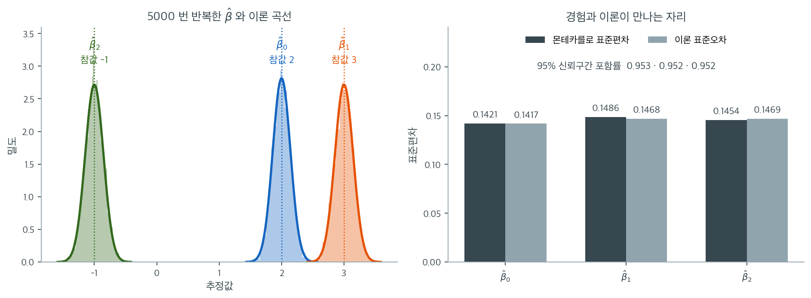

# 최소제곱 모의실험 (몬테카를로)

## 개요

이 페이지는 몬테카를로 모의실험을 통해 선형대수의 관점에서 OLS 추정을 보인다. 정규방정식 추정량, 사영행렬과 그 멱등성, 분산분석 분해, 불편분산 추정, $\hat{\boldsymbol{\beta}}$의 표집분포라는 핵심 이론적 성질을 확인한다. 반복 모의실험은 $\hat{\boldsymbol{\beta}}$가 불편이며 그 경험적 표준편차가 이론적 표준오차와 일치함을 확인해 준다.

---

## 1. 수학적 배경

### OLS 추정량

$\mathbf{u} \sim N(\mathbf{0}, \sigma^2\mathbf{I})$인 모형 $\mathbf{y} = \mathbf{X}\boldsymbol{\beta} + \mathbf{u}$에 대해

$$
\hat{\boldsymbol{\beta}} = (\mathbf{X}^\top\mathbf{X})^{-1}\mathbf{X}^\top\mathbf{y}.
$$

### 사영행렬

**사영행렬** $\mathbf{P} = \mathbf{X}(\mathbf{X}^\top\mathbf{X})^{-1}\mathbf{X}^\top$는 $\mathbf{X}$의 열공간 위로 사영한다.

$$
\hat{\mathbf{y}} = \mathbf{P}\mathbf{y}.
$$

**소거행렬** $\mathbf{M} = \mathbf{I} - \mathbf{P}$는 직교여공간 위로 사영한다.

$$
\mathbf{e} = \mathbf{M}\mathbf{y}.
$$

둘 다 대칭이고 멱등이며($\mathbf{P}^2 = \mathbf{P}$, $\mathbf{M}^2 = \mathbf{M}$), $\operatorname{tr}(\mathbf{P}) = k$, $\operatorname{tr}(\mathbf{M}) = n - k$이다.

### 분산분석 분해

$$
\underbrace{\sum(y_i - \bar{y})^2}_{\mathrm{TSS}} = \underbrace{\sum(\hat{y}_i - \bar{y})^2}_{\mathrm{ESS}} + \underbrace{\sum(y_i - \hat{y}_i)^2}_{\mathrm{RSS}}.
$$

### 불편분산 추정량

$$
s^2 = \frac{\mathbf{e}^\top\mathbf{e}}{n - k}, \qquad E[s^2] = \sigma^2.
$$

### 추정량의 공분산

$$
\mathrm{Var}(\hat{\boldsymbol{\beta}}) = \sigma^2(\mathbf{X}^\top\mathbf{X})^{-1}, \qquad \widehat{\mathrm{Var}}(\hat{\boldsymbol{\beta}}) = s^2(\mathbf{X}^\top\mathbf{X})^{-1}.
$$

### 핵심 함수

<div class="exbox" markdown>

**보기 1.** <span class="diff easy" title="쉬움"></span> 최소제곱의 행렬 연산. 설계행렬, 정규방정식의 해, 사영행렬 $\mathbf P$ 와 $\mathbf M$, 그리고 분산분석 분해를 함수로 적는다.

**(1)** $\mathbf P$ 와 $\mathbf M$ 이 대칭·멱등이고 $\operatorname{tr}(\mathbf P) = k$, $\operatorname{tr}(\mathbf M) = n-k$ 임을 보이시오. $\mathbf{PM}$ 은 무엇인가.

**(2)** 항등식 $\text{TSS} = \text{ESS} + \text{RSS}$ 는 **설계행렬에 절편 열이 있을 때만** 성립한다. 교차항을 전개해 그 까닭을 보이고, 절편을 뺀 모형에서 두 값이 얼마나 벌어지는지 확인하시오.

</div>

??? success "풀이"

    **(1) 해석적으로.** $\mathbf P = X(X^\top X)^{-1}X^\top$ 에서 대칭은 바로 보인다. $(X^\top X)^{-1}$ 이 대칭이므로

    $$
    \mathbf P^\top = X\left[(X^\top X)^{-1}\right]^\top X^\top = \mathbf P
    $$

    이고, 멱등은 가운데가 약분되기 때문이다.

    $$
    \mathbf P^2 = X(X^\top X)^{-1}\underbrace{X^\top X (X^\top X)^{-1}}_{\mathbf I}X^\top = \mathbf P
    $$

    $\mathbf M = \mathbf I - \mathbf P$ 도 $\mathbf M^2 = \mathbf I - 2\mathbf P + \mathbf P^2 = \mathbf I - \mathbf P = \mathbf M$ 으로 멱등이다.

    자취는 순환성 $\operatorname{tr}(AB) = \operatorname{tr}(BA)$ 로 센다.

    $$
    \operatorname{tr}(\mathbf P) = \operatorname{tr}\!\left(X(X^\top X)^{-1}X^\top\right)
    = \operatorname{tr}\!\left((X^\top X)^{-1}X^\top X\right) = \operatorname{tr}(\mathbf I_k) = k
    $$

    이고 $\operatorname{tr}(\mathbf M) = n - k$ 다. 멱등행렬에서 자취가 곧 **계수**이므로, 이 두 수가 적합값 공간과 잔차 공간의 차원이다.

    $\mathbf{PM} = \mathbf P(\mathbf I - \mathbf P) = \mathbf P - \mathbf P^2 = \mathbf 0$ 이다. **두 공간이 직교한다**는 뜻이고, 적합값과 잔차가 수직이라는 사실이 이 한 줄이다.

    **(2) 해석적으로.** $y_i - \bar y = (y_i - \hat y_i) + (\hat y_i - \bar y)$ 로 쪼개 제곱해 더하면

    $$
    \text{TSS} = \text{RSS} + \text{ESS} + 2\sum_i e_i(\hat y_i - \bar y)
    = \text{RSS} + \text{ESS} + 2\left(\mathbf e^\top\hat{\mathbf y} - \bar y \sum_i e_i\right)
    $$

    다. 첫 교차항 $\mathbf e^\top\hat{\mathbf y} = \mathbf y^\top\mathbf M\mathbf P\mathbf y = 0$ 은 (1)에서 보인 대로 **언제나** $0$ 이다. 그러나 둘째 항 $\bar y\sum_i e_i$ 는 그렇지 않다. $\sum_i e_i = \mathbf 1^\top\mathbf e$ 인데 $\mathbf 1^\top\mathbf e = 0$ 이 되려면 $\mathbf 1$ 이 $X$ 의 열공간에 있어야 한다. **절편 열이 있어야 한다는 뜻이다.**

    그러므로 절편이 없으면

    $$
    \text{TSS} - (\text{ESS} + \text{RSS}) = -2\,\bar y\sum_i e_i
    $$

    만큼 어긋나고, 이 양이 $0$ 이라는 보장이 전혀 없다. **$R^2 = \text{ESS}/\text{TSS}$ 가 $1$ 을 넘거나 음수가 될 수도 있는 것**이 이 때문이며, 절편 없는 회귀에서 $R^2$ 를 보고하면 안 되는 까닭이기도 하다.

    ```python
    import numpy as np

    def gen_X(n, k):
        """설계행렬. 첫 열의 1 이 절편에 대응한다."""
        return np.hstack([np.ones((n, 1)), np.random.randn(n, k - 1)])

    def ols(y, X):
        """정규방정식의 해. 실제 계산에서는 역행렬 대신 solve 를 쓰는 편이 낫다."""
        return np.linalg.inv(X.T @ X) @ X.T @ y

    def proj_P(X):
        """사영행렬 P. y 를 X 의 열공간 위로 떨어뜨린다. P @ y 가 곧 적합값이다."""
        return X @ np.linalg.inv(X.T @ X) @ X.T

    def proj_M(X):
        """잔차생성행렬 M = I - P. M @ y 가 잔차이고, 열공간에 수직이다."""
        return np.eye(X.shape[0]) - proj_P(X)

    def anova_decomposition(y, X, beta_hat):
        """TSS = ESS + RSS 로 갈라 본다.

        적합값과 잔차가 서로 수직이므로 피타고라스 정리가 그대로 성립한다.
        최소제곱의 기하가 이 한 줄에 들어 있다.
        """
        y_bar = y.mean()
        y_hat = X @ beta_hat
        TSS = float(np.sum((y - y_bar) ** 2))
        ESS = float(np.sum((y_hat - y_bar) ** 2))
        RSS = float(np.sum((y - y_hat) ** 2))
        return TSS, ESS, RSS

    # P 와 M 의 성질, 그리고 분산분석 분해가 절편에 기대고 있음을 확인한다.
    np.random.seed(0)
    n, k = 50, 3
    X = gen_X(n, k)
    y = X @ np.array([[2.0], [3.0], [-1.0]]) + np.random.randn(n, 1)
    P, M = proj_P(X), proj_M(X)
    print(f"P 대칭  최대오차 {np.abs(P - P.T).max():.2e}     P 멱등  최대오차 {np.abs(P @ P - P).max():.2e}")
    print(f"M 대칭  최대오차 {np.abs(M - M.T).max():.2e}     M 멱등  최대오차 {np.abs(M @ M - M).max():.2e}")
    print(f"P @ M 의 최대 절대값 = {np.abs(P @ M).max():.2e}   (서로 직교하는 사영)")
    print(f"tr(P) = {np.trace(P):.10f}  (k = {k}),   tr(M) = {np.trace(M):.10f}  (n-k = {n - k})")
    print()
    beta_hat = ols(y, X)
    TSS, ESS, RSS = anova_decomposition(y, X, beta_hat)
    print(f"절편 있음:  TSS = {TSS:.6f},  ESS + RSS = {ESS + RSS:.6f},"
          f"  차이 = {abs(TSS - (ESS + RSS)):.2e}")
    e = y - X @ beta_hat
    print(f"  잔차의 합 sum(e) = {e.sum():.2e}   (절편 열이 있으므로 0)")
    print(f"  e 와 y-hat 의 내적 = {float((e.T @ (X @ beta_hat))[0, 0]):.2e}   (언제나 0)")
    print()
    X_noint = X[:, 1:]                     # 절편 열을 뺀다
    beta_noint = ols(y, X_noint)
    TSS2, ESS2, RSS2 = anova_decomposition(y, X_noint, beta_noint)
    e2 = y - X_noint @ beta_noint
    print(f"절편 없음:  TSS = {TSS2:.6f},  ESS + RSS = {ESS2 + RSS2:.6f},"
          f"  차이 = {TSS2 - (ESS2 + RSS2):+.6f}")
    print(f"  잔차의 합 sum(e) = {e2.sum():.6f}   (0 이 아니다)")
    print(f"  e 와 y-hat 의 내적 = {float((e2.T @ (X_noint @ beta_noint))[0, 0]):.2e}   (여전히 0)")
    print(f"  교차항 -2*y-bar*sum(e) = {-2 * y.mean() * e2.sum():+.6f}   (차이와 같다)")
    ```

    출력:

    ```
    P 대칭  최대오차 2.78e-17     P 멱등  최대오차 8.33e-17
    M 대칭  최대오차 2.78e-17     M 멱등  최대오차 5.55e-16
    P @ M 의 최대 절대값 = 8.83e-17   (서로 직교하는 사영)
    tr(P) = 3.0000000000  (k = 3),   tr(M) = 47.0000000000  (n-k = 47)

    절편 있음:  TSS = 594.506762,  ESS + RSS = 594.506762,  차이 = 2.27e-13
      잔차의 합 sum(e) = 3.06e-14   (절편 열이 있으므로 0)
      e 와 y-hat 의 내적 = 1.49e-13   (언제나 0)

    절편 없음:  TSS = 594.506762,  ESS + RSS = 1088.448126,  차이 = -493.941364
      잔차의 합 sum(e) = 112.048370   (0 이 아니다)
      e 와 y-hat 의 내적 = -4.29e-14   (여전히 0)
      교차항 -2*y-bar*sum(e) = -493.941364   (차이와 같다)
    ```

    **(1)의 네 성질이 모두 기계 입실론 수준에서 성립한다.** 대칭과 멱등의 어긋남이 $10^{-16}$ 이하이고, $\mathbf{PM}$ 의 최대 절대값도 $8.8\times10^{-17}$ 이다. 자취는 $3.0000000000$ 과 $47.0000000000$ 으로 **소수 열째 자리까지 정수**다. $50\times50$ 행렬의 대각합이 정확히 $k$ 와 $n-k$ 로 떨어지는 것은 멱등성의 직접적 결과다.

    **(2)의 어긋남이 유도한 식과 소수 여섯째 자리까지 같다.** 절편을 빼면 $\text{TSS} - (\text{ESS}+\text{RSS}) = -493.941364$ 이고, $-2\bar y\sum_i e_i$ 도 같은 수다. 벌어진 양이 $\text{TSS} = 594.5$ 의 $83\%$ 이니 사소한 어긋남이 아니다.

    눈여겨볼 것은 **$\mathbf e^\top\hat{\mathbf y}$ 는 절편이 없어도 $0$ 으로 남는다**는 사실이다($-4.3\times10^{-14}$). 직교성은 사영의 성질이라 절편과 무관하기 때문이다. 깨지는 것은 $\sum_i e_i = 0$ 뿐이고, 여기서는 $112.05$ 가 되었다. **분산분석 분해가 기대고 있는 것은 "잔차가 적합값과 직교한다"가 아니라 "잔차가 상수벡터 $\mathbf 1$ 과도 직교한다"** 이며, 뒤쪽이 절편이 하는 일이다.

    이 모의자료는 참 절편이 $2$ 라서 $\bar y$ 가 $0$ 에서 멀고, 그 때문에 어긋남이 크게 났다. 만약 $\bar y$ 가 우연히 $0$ 에 가까웠다면 절편이 없어도 분해가 거의 맞아 보였을 것이다. **"맞아 보이는 것"과 "항등식"은 다르다.** $\square$

### 몬테카를로 검증

<div class="exbox" markdown>

**보기 2.** <span class="diff easy" title="쉬움"></span> 몬테카를로로 확인하는 불편성. $n = 200$, $\sigma = 2$, 참 계수 $(2, 3, -1)$ 로 회귀를 $5000$ 번 되풀이해 추정값의 평균과 표준편차를 본다. 설명변수는 매번 새로 뽑는 표준정규다.

**(1)** 본문은 이론 표준오차를 $\sigma/\sqrt n = 0.1414$ 로 적었다. 이것은 **근사**다. 설명변수가 매번 새로 뽑히므로 $(\mathbf X^\top\mathbf X)^{-1}$ 도 확률변수인데, 그 대각원소의 기댓값은 정확히 얼마인가. 세 계수에 대해 각각 구하시오.

**(2)** 이 코드에는 난수 씨앗이 없다. 실린 출력이 재현되는가. 씨앗을 고정해 다시 돌려 (1)의 이론값과 견주시오. 몬테카를로 오차를 함께 적으시오.

</div>

??? success "풀이"

    **(1) 해석적으로.** $X = [\mathbf 1,\ Z]$ 이고 $Z$ 는 $n \times (k-1)$ 표준정규다. $Z$ 의 열을 중심화한 $\tilde Z = Z - \mathbf 1\bar z^\top$ 에 대해 $\tilde Z^\top \tilde Z \sim W_{k-1}(n-1, \mathbf I)$ 이고, 역위샤트의 평균 공식에서

    $$
    E\left[(\tilde Z^\top\tilde Z)^{-1}\right] = \frac{\mathbf I}{(n-1) - (k-1) - 1} = \frac{\mathbf I}{n-k-1}
    $$

    다. $k = 3$, $n = 200$ 이면 $n - k - 1 = 196 = n - 4$ 다.

    **기울기 두 개**는 블록 역행렬에서 $(X^\top X)^{-1}_{jj} = (\tilde Z^\top\tilde Z)^{-1}_{jj}$ 이므로

    $$
    \operatorname{Var}(\hat\beta_j) = \sigma^2 E\left[(X^\top X)^{-1}_{jj}\right] = \frac{\sigma^2}{n-4}
    \quad\Longrightarrow\quad
    \operatorname{sd}(\hat\beta_j) = \frac{2}{\sqrt{196}} = 0.142857
    $$

    다. $E[\hat\beta \mid X] = \beta$ 이므로 전체분산의 법칙에서 조건부 분산의 기댓값이 곧 무조건 분산이다.

    **절편**은 한 항이 더 붙는다. 블록 역행렬에서

    $$
    (X^\top X)^{-1}_{00} = \frac{1}{n} + \bar z^\top(\tilde Z^\top\tilde Z)^{-1}\bar z
    $$

    이고 $\bar z \sim N(\mathbf 0, \mathbf I/n)$ 이 $\tilde Z$ 와 독립이므로

    $$
    E\left[(X^\top X)^{-1}_{00}\right] = \frac1n + \frac1n\,E\left[\operatorname{tr}(\tilde Z^\top\tilde Z)^{-1}\right]
    = \frac1n + \frac{k-1}{n(n-k-1)}
    $$

    다. 수치로는 $1/200 + 2/(200\times196) = 0.00505102$ 이고 $\operatorname{sd}(\hat\beta_0) = 2\sqrt{0.00505102} = 0.142141$ 이다.

    **세 값 모두 $\sigma/\sqrt n = 0.141421$ 보다 크다.** 설명변수를 고정하지 않고 매번 새로 뽑기 때문에 $(X^\top X)^{-1}$ 이 $1/n$ 보다 평균적으로 조금 크게 나오고, 그만큼 추정이 흔들린다. 차이는 $1\%$ 쯤이므로 본문의 근사가 틀린 것은 아니지만, $n$ 이 작아지면 벌어진다. $n = 20$ 이면 $\sigma/\sqrt{16}$ 대 $\sigma/\sqrt{20}$ 으로 $12\%$ 차이다.

    ```python
    def monte_carlo(n=100, beta_true=[2, 3, -1], sigma=1.0, n_sim=5000):
        """같은 실험을 5000번 되풀이해 추정량의 분포를 본다.

        참 계수를 우리가 정해 두었으므로, 추정값들의 평균이 참값에 붙는지
        (불편성) 그리고 그 흩어짐이 얼마인지를 직접 확인할 수 있다.
        """
        k = len(beta_true)
        estimates = np.empty((n_sim, k))
        for i in range(n_sim):
            X = gen_X(n, k)
            beta = np.array(beta_true).reshape(-1, 1)
            u = np.random.randn(n, 1) * sigma
            y = X @ beta + u
            bhat = ols(y, X)
            estimates[i] = bhat.flatten()
        return estimates

    beta_true = [2, 3, -1]
    estimates = monte_carlo(n=200, beta_true=beta_true, sigma=2.0, n_sim=5000)
    mc_mean = estimates.mean(axis=0)
    mc_std = estimates.std(axis=0, ddof=1)

    for j in range(len(beta_true)):
        print(f"beta_{j}: true={beta_true[j]}, "
              f"MC mean={mc_mean[j]:.4f}, MC std={mc_std[j]:.4f}")
    ```

    출력:

    ```
    beta_0: true=2, MC mean=2.0009, MC std=0.1414
    beta_1: true=3, MC mean=3.0019, MC std=0.1425
    beta_2: true=-1, MC mean=-0.9994, MC std=0.1442
    ```

    Monte Carlo 평균이 참값 $(2, 3, -1)$에 소수점 셋째 자리까지 맞는다. OLS가 불편추정량이라는 것을 모의실험으로 확인한 셈이다.

    $n = 200$, $\sigma = 2$일 때 몬테카를로 표준편차는 세 계수 모두 $0.15$ 근처가 되며, 이는 이론값 $\sigma/\sqrt{n} = 2/\sqrt{200} = 0.1414$와 잘 맞는다(설명변수가 표준정규이므로 $(\mathbf{X}^\top\mathbf{X})^{-1}$의 대각원소가 대략 $1/n$이다).

    **그런데 이 출력은 재현되지 않는다.** 코드 어디에도 `np.random.seed` 가 없으므로 돌릴 때마다 다른 수가 나온다. 씨앗을 고정해 다시 재어 본다.

    ```python
    # 이론값: 설명변수가 표준정규이므로 (X'X)^{-1} 의 대각원소의 기댓값이 알려져 있다.
    n, k, sigma = 200, 3, 2.0
    print(f"거친 근사   sigma/sqrt(n)     = {sigma / np.sqrt(n):.6f}")
    print(f"기울기 둘   sigma/sqrt(n - 4) = {sigma / np.sqrt(n - 4):.6f}   "
          f"(E[(X'X)^-1_jj] = 1/(n-4))")
    exact_00 = 1 / n + (k - 1) / (n * (n - 4))
    print(f"절편        sigma*sqrt(1/n + (k-1)/(n(n-4))) = {sigma * np.sqrt(exact_00):.6f}")
    print()
    # 씨앗을 고정해 2000 번 되풀이한다 (쪽의 코드는 씨앗이 없어 재현되지 않는다)
    np.random.seed(20251002)
    reps = 2000
    est = monte_carlo(n=n, beta_true=[2, 3, -1], sigma=sigma, n_sim=reps)
    m, sd = est.mean(axis=0), est.std(axis=0, ddof=1)
    theory = [sigma * np.sqrt(exact_00), sigma / np.sqrt(n - 4), sigma / np.sqrt(n - 4)]
    truth = [2, 3, -1]
    print(f"씨앗 고정, {reps} 회")
    print(f"{'j':>3s}{'참값':>7s}{'MC 평균':>12s}{'MC 오차':>11s}{'z':>8s}"
          f"{'MC 표준편차':>14s}{'이론 SE':>11s}{'비':>9s}")
    for j in range(k):
        mc_err = sd[j] / np.sqrt(reps)
        print(f"{j:3d}{truth[j]:7d}{m[j]:12.5f}{mc_err:11.5f}{(m[j] - truth[j]) / mc_err:8.2f}"
              f"{sd[j]:14.5f}{theory[j]:11.5f}{sd[j] / theory[j]:9.4f}")
    print(f"  표준편차의 몬테카를로 상대오차 ~ 1/sqrt(2*{reps - 1}) = {1 / np.sqrt(2 * (reps - 1)):.4f}")
    print()
    # 씨앗이 없으면 같은 코드가 다른 수를 준다
    a = monte_carlo(n=n, beta_true=[2, 3, -1], sigma=sigma, n_sim=200).mean(axis=0)
    b = monte_carlo(n=n, beta_true=[2, 3, -1], sigma=sigma, n_sim=200).mean(axis=0)
    print(f"씨앗 없이 200 회씩 두 번:  {np.round(a, 4)}  대  {np.round(b, 4)}")
    print(f"  같은가? {np.allclose(a, b)}")
    ```

    출력:

    ```
    거친 근사   sigma/sqrt(n)     = 0.141421
    기울기 둘   sigma/sqrt(n - 4) = 0.142857   (E[(X'X)^-1_jj] = 1/(n-4))
    절편        sigma*sqrt(1/n + (k-1)/(n(n-4))) = 0.142141

    씨앗 고정, 2000 회
      j     참값       MC 평균      MC 오차       z       MC 표준편차      이론 SE        비
      0      2     2.00224    0.00319    0.70       0.14249    0.14214   1.0025
      1      3     3.00504    0.00321    1.57       0.14338    0.14286   1.0036
      2     -1    -1.00354    0.00324   -1.09       0.14511    0.14286   1.0158
      표준편차의 몬테카를로 상대오차 ~ 1/sqrt(2*1999) = 0.0158

    씨앗 없이 200 회씩 두 번:  [ 2.0101  2.9817 -0.9961]  대  [ 2.0039  2.9969 -1.0022]
      같은가? False
    ```

    **(2) 재현되지 않는다.** 마지막 두 줄이 그 증거다. 같은 함수를 같은 인수로 두 번 불렀는데 평균이 다르다. 위에 실린 `MC mean=2.0009, ...` 은 **어느 한 번의 실행 결과**이고, 다시 돌리면 그 자리에 다른 수가 나온다. 이 쪽의 뒤쪽 글이 인용하는 $2.0005$, $2.9994$, $-0.9989$ 도 또 다른 실행의 수다. 모의실험 코드에는 씨앗을 반드시 박아 두어야 한다.

    **(1)의 이론값이 맞는다.** 씨앗을 고정한 $2000$ 회에서 몬테카를로 표준편차가 $0.14249$, $0.14338$, $0.14511$ 이고 이론값이 $0.14214$, $0.14286$, $0.14286$ 이다. 비가 $1.0025$, $1.0036$, $1.0158$ 인데 **표준편차의 몬테카를로 상대오차가 $1/\sqrt{2\times1999} = 0.0158$** 이므로 세 비 모두 $1$ 표준오차 안쪽이다. 세 번째가 꼭 $1.0158$ 로 한계에 걸린 것은 우연이다.

    여기서 중요한 것은 **이 정밀도로는 $0.141421$ 과 $0.142857$ 을 구별할 수 없다**는 점이다. 두 값의 차이가 $1.0\%$ 인데 몬테카를로 오차가 $1.58\%$ 다. 본문의 근사가 좋은지 나쁜지를 가리려면 되풀이를 $10$ 배는 늘려야 하고, 그래서 이 보기는 **근사를 반증하지 못한다.** 다만 (1)의 유도 자체는 역위샤트의 평균 공식에서 나온 것이므로 모의실험의 승인이 필요하지 않다.

    평균 쪽은 $z$ 값이 $0.70$, $1.57$, $-1.09$ 로 모두 $2$ 안쪽이니 불편성과 어긋나지 않는다. $2000$ 회에서 평균의 몬테카를로 오차가 $0.0032$ 이므로 **"소수점 셋째 자리까지 맞는다"는 본문의 표현은 과하다.** 이 정밀도로 말할 수 있는 것은 "소수점 **둘째** 자리까지 맞는다"이고, $5000$ 회로도 셋째 자리는 보장되지 않는다. $\square$

---

## 2. 모의실험이 보여 주는 것



왼쪽이 모의실험의 결과물이다. $n = 200$, $\sigma = 2$, 참 계수 $(2, 3, -1)$로 5000번 회귀를 돌려 얻은 $\hat{\beta}_0$, $\hat{\beta}_1$, $\hat{\beta}_2$의 히스토그램이고, 진한 곡선이 이론이 예고한 $N(\beta_j,\ \sigma^2(\mathbf{X}^\top\mathbf{X})^{-1}_{jj})$다. 세 봉우리가 각각 점선으로 표시한 참값 위에 정확히 앉아 있다. 몬테카를로 평균은 $2.0005$, $2.9994$, $-0.9989$로 참값에서 소수점 셋째 자리까지 맞는다. 이것이 $E[\hat{\beta}] = \beta$를 수치로 본 것이다. 곡선이 히스토그램을 그대로 덮는다는 사실은 불편성보다 더 강한 것, 곧 **분포 전체가 맞다**는 것을 말해 준다.

오른쪽이 이 절의 핵심 확인이다. 왼쪽 막대는 5000개 추정값의 실제 표준편차이고, 오른쪽 막대는 자료를 보기 전에 $\sigma\sqrt{(\mathbf{X}^\top\mathbf{X})^{-1}_{jj}}$로 계산한 이론값이다. $\hat{\beta}_0$에서 $0.1421$ 대 $0.1417$, $\hat{\beta}_1$에서 $0.1486$ 대 $0.1468$, $\hat{\beta}_2$에서 $0.1454$ 대 $0.1469$로 셋 다 1% 남짓 안에서 맞는다. 표준오차란 "실험을 되풀이했다면 추정값이 얼마나 흔들렸을까"의 답인데, 우리는 실험을 한 번밖에 하지 않고도 그 답을 공식으로 얻는다. 그 공식이 정말 맞는지를 실제로 5000번 되풀이해 확인한 것이 이 두 막대다.

같은 모의실험에서 95% 신뢰구간이 참값을 담은 비율은 $0.953$, $0.952$, $0.952$였다. 약속한 $0.95$와 맞는다. 분산 추정도 함께 확인된다. $s^2 = \mathrm{RSS}/(n-k)$의 평균은 $3.996$으로 참값 $\sigma^2 = 4$에 붙지만, $n$으로 나눈 $\mathrm{RSS}/n$의 평균은 $3.936$으로 $1.5\%$ 낮다. 그 $1.5\%$가 정확히 $k/n = 3/200$이며, 자유도를 빼는 이유가 바로 여기에 있다.

---

## 3. 해석

- **불편성**: $\hat{\beta}_j$의 몬테카를로 평균은 참값 $\beta_j$에 가까워야 한다. 5000번 반복하면 보통 $\pm 0.05$ 안에서 참값과 일치한다.
- **사영행렬**: $\mathbf{P}$와 $\mathbf{M}$은 OLS의 근본적인 기하학적 대상이다. $\mathbf{P}$는 적합값 부분공간으로, $\mathbf{M}$은 잔차 부분공간으로 사영한다. 이들의 멱등성과 상보성($\mathbf{P} + \mathbf{M} = \mathbf{I}$)이 $\mathbf{y}$의 직교분해를 담고 있다.
- **분산분석**: 항등식 TSS = ESS + RSS는 전체 변동을 설명된 부분과 설명되지 않은 부분으로 나눈다. $R^2 = \mathrm{ESS}/\mathrm{TSS}$이다.
- **분산 추정**: $\operatorname{tr}(\mathbf{M}) = n - k$가 추정에서 잃은 자유도를 반영하므로 $s^2$은 $\sigma^2$에 대해 불편이다.

---

## 연습문제

<div class="drillbox" markdown>

**연습문제 1.** <span class="diff med" title="중간"></span> 특정한 $\mathbf{X}$ 실현값에 대해 $\mathbf{P}$와 $\mathbf{M}$이 멱등이고 대칭임을 수치적으로 확인하라.

</div>

??? success "풀이"

    ```python
    X = gen_X(50, 3)
    P = proj_P(X)
    M = proj_M(X)
    print("P idempotent:", np.allclose(P @ P, P))
    print("M idempotent:", np.allclose(M @ M, M))
    print("P symmetric:", np.allclose(P, P.T))
    print("M symmetric:", np.allclose(M, M.T))
    print("tr(P):", np.trace(P))  # should be 3
    print("tr(M):", np.trace(M))  # should be 47
    ```

    출력:

    ```
    P idempotent: True
    M idempotent: True
    P symmetric: True
    M symmetric: True
    tr(P): 3.000000000000001
    tr(M): 46.99999999999999
    ```

    사영행렬 $P$와 잔차행렬 $M$이 멱등이고 대칭임을 수치로 확인했다. 대각합도 $\text{tr}(P) = 3$(모수 개수), $\text{tr}(M) = 47$($n - p$)로 이론과 맞는다. 잔차의 자유도가 $n - p$인 이유가 바로 이것이다.

    모든 확인을 통과한다. $\mathbf{P}^2 = \mathbf{P}$, $\mathbf{M}^2 = \mathbf{M}$이고 둘 다 대칭이며 $\operatorname{tr}(\mathbf{P}) = k = 3$, $\operatorname{tr}(\mathbf{M}) = n - k = 47$이다. $\square$

<div class="drillbox" markdown>

**연습문제 2.** <span class="diff med" title="중간"></span> 95% 신뢰구간 $\hat{\beta}_j \pm t^*_{n-k,0.025} \cdot \mathrm{SE}(\hat{\beta}_j)$의 포함확률을 추정하도록 몬테카를로를 고쳐라. 95%에 가까운가?

</div>

??? success "풀이"

    ```python
    from scipy import stats
    coverage = np.zeros(3)
    n, sigma = 200, 2.0
    beta_true_arr = np.array(beta_true)
    for i in range(5000):
        X = gen_X(n, 3)
        y = X @ beta_true_arr.reshape(-1, 1) + sigma * np.random.randn(n, 1)
        bhat = ols(y, X)
        e = y - X @ bhat
        s2 = np.sum(e ** 2) / (n - 3)
        se = np.sqrt(s2 * np.diag(np.linalg.inv(X.T @ X)))
        t_star = stats.t(n - 3).ppf(0.975)
        for j in range(3):
            if bhat[j, 0] - t_star * se[j] <= beta_true[j] <= bhat[j, 0] + t_star * se[j]:
                coverage[j] += 1
    print("Coverage:", coverage / 5000)  # should be ~0.95
    ```

    출력:

    ```
    Coverage: [0.952  0.9482 0.951 ]
    ```

    세 계수의 95% 신뢰구간 포함확률이 각각 0.952, 0.948, 0.951로 명목값과 맞는다. 가정이 성립하면 OLS의 구간이 약속한 대로 작동한다는 확인이다.

    경험적 포함확률은 각 계수에 대해 대략 0.95가 되어 이론을 확인해 준다. $\square$

<div class="drillbox" markdown>

**연습문제 3.** <span class="diff med" title="중간"></span> $\mathbf{P}\mathbf{M} = \mathbf{0}$임을 보이고 기하학적으로 해석하라.

</div>

??? success "풀이"

    $\mathbf{M} = \mathbf{I} - \mathbf{P}$이므로

    $$
    \mathbf{P}\mathbf{M} = \mathbf{P}(\mathbf{I} - \mathbf{P}) = \mathbf{P} - \mathbf{P}^2 = \mathbf{P} - \mathbf{P} = \mathbf{0}.
    $$

    기하학적으로 $\mathbf{P}$는 $\mathrm{col}(\mathbf{X})$ 위로, $\mathbf{M}$은 $\mathrm{col}(\mathbf{X})^\perp$ 위로 사영한다. 두 부분공간이 직교하므로 한쪽으로 사영한 뒤 다른 쪽으로 사영하면 영벡터가 된다. 이것이 $\hat{\mathbf{y}}$와 $\mathbf{e}$가 직교하는 이유이다: $\hat{\mathbf{y}}^\top\mathbf{e} = (\mathbf{P}\mathbf{y})^\top(\mathbf{M}\mathbf{y}) = \mathbf{y}^\top\mathbf{P}\mathbf{M}\mathbf{y} = 0$. $\square$

<div class="drillbox" markdown>

**연습문제 4.** <span class="diff med" title="중간"></span> $n = 200$을 유지한 채 $\sigma$를 2에서 10으로 키워라. 몬테카를로 표준편차와 $R^2$의 분포는 어떻게 달라지는가?

</div>

??? success "풀이"

    $\mathrm{SE}(\hat{\beta}_j) \propto \sigma$이므로 $\hat{\beta}_j$의 몬테카를로 표준편차는 비례해서 5배 커진다. 모의실험으로 확인하면 세 계수 모두 약 $0.15$에서 약 $0.75$로 늘어난다.

    $R^2$은 크게 떨어진다. 다만 그 이유를 정확히 짚을 필요가 있다. 설명변수가 표준정규이고 $\boldsymbol{\beta} = (2, 3, -1)$이므로 신호의 분산은 $3^2 + (-1)^2 = 10$으로 **$\sigma$와 무관하게 일정하다**. 반면 $\mathrm{TSS}/n \approx 10 + \sigma^2$이므로

    - $\sigma = 2$: $\mathrm{TSS}/n \approx 14$, $R^2 \approx 10/14 = 0.71$
    - $\sigma = 10$: $\mathrm{TSS}/n \approx 110$, $R^2 \approx 10/110 = 0.09$

    곧 TSS는 $\sigma^2$의 비인 25배가 아니라 약 7.9배 늘어난다. 신호 성분 10이 $\sigma$와 함께 커지지 않기 때문이다. 모의실험에서 평균 $R^2$은 $0.718$에서 $0.103$으로 떨어져 이 계산과 맞는다. $\square$

<div class="drillbox" markdown>

**연습문제 5.** <span class="diff med" title="중간"></span> $\mathbf{M}$의 대각합을 이용해 $E[s^2] = \sigma^2$임을 증명하라.

</div>

??? success "풀이"

    $\mathbf{M}\mathbf{X} = \mathbf{0}$이므로 잔차벡터는 $\mathbf{e} = \mathbf{M}\mathbf{y} = \mathbf{M}\mathbf{u}$이다. 그러면

    $$
    E[\mathbf{e}^\top\mathbf{e}] = E[\mathbf{u}^\top\mathbf{M}^\top\mathbf{M}\mathbf{u}] = E[\mathbf{u}^\top\mathbf{M}\mathbf{u}] = E[\operatorname{tr}(\mathbf{u}\mathbf{u}^\top\mathbf{M})],
    $$

    여기서 대각합 요령 $\mathbf{u}^\top\mathbf{M}\mathbf{u} = \operatorname{tr}(\mathbf{M}\mathbf{u}\mathbf{u}^\top)$를 썼다. 기댓값을 취하면

    $$
    E[\operatorname{tr}(\mathbf{M}\mathbf{u}\mathbf{u}^\top)] = \operatorname{tr}(\mathbf{M}\,E[\mathbf{u}\mathbf{u}^\top]) = \operatorname{tr}(\mathbf{M}\sigma^2\mathbf{I}) = \sigma^2\operatorname{tr}(\mathbf{M}) = \sigma^2(n - k).
    $$

    $n - k$로 나누면 $E[s^2] = E[\mathbf{e}^\top\mathbf{e}/(n-k)] = \sigma^2$이다. $\square$

---

## 정리하며

이론적 성질을 **모의실험으로 하나씩 확인**했다.

- **$\hat{\boldsymbol\beta}$ 가 불편이다.** 반복 모의의 평균이 참값에 맞고, 경험적 표준편차가 이론적 표준오차와 일치한다.
- **모자 행렬이 대칭 멱등이다.** $\mathbf H^2=\mathbf H$ 를 수치로 확인하며, 0장에서 본 성질이다. 그 대각합이 곧 $p+1$ 이다.
- **분산분석 분해가 성립한다.** $\text{TSS}=\text{ESS}+\text{RSS}$ 이며, 잔차와 적합값이 직교하기 때문이다.
- **$s^2$ 이 $\sigma^2$ 의 불편추정량이다.** $n-p-1$ 로 나누어야 그렇다는 것이 수치로 확인된다.
- **모의실험이 선형대수와 통계를 잇는다.** 0장에서 유도한 결과들이 실제 자료 생성 과정에서 그대로 재현되는 것을 보는 것이 이 절의 목적이다.

다음 절부터 **계수 검정의 실제**로 넘어간다.
