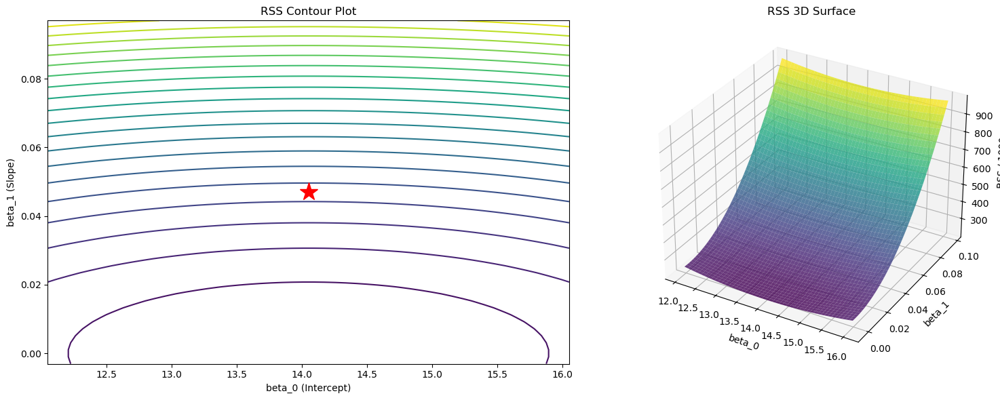

# 잔차제곱합 곡면 시각화

## 개요

이 페이지는 잔차제곱합(RSS)을 회귀계수 $\beta_0$(절편)과 $\beta_1$(기울기)의 함수로 3차원 시각화한다. 이 시각화는 OLS가 왜 유일한 최적 추정값을 주는지, 그리고 RSS 곡면이 최소제곱이 푸는 볼록 최적화 문제와 어떻게 이어지는지에 대한 기하적 직관을 제공한다.

## 수학적 배경

단순선형회귀 모형 $y_i = \beta_0 + \beta_1 x_i + \varepsilon_i$에서 RSS는 계수의 함수이다.

$$
\mathrm{RSS}(\beta_0, \beta_1) = \sum_{i=1}^n (y_i - \beta_0 - \beta_1 x_i)^2.
$$

이 식을 전개하면 RSS가 $(\beta_0, \beta_1)$에 대한 **이차함수**(포물면)임이 드러난다.

$$
\mathrm{RSS}(\beta_0, \beta_1) = n\beta_0^2 + \beta_1^2 \sum x_i^2 + 2\beta_0\beta_1\sum x_i - 2\beta_0\sum y_i - 2\beta_1\sum x_i y_i + \sum y_i^2.
$$

RSS의 헤세 행렬은

$$
\mathbf{H} = 2\mathbf{X}^\top\mathbf{X} = 2\begin{pmatrix} n & \sum x_i \\ \sum x_i & \sum x_i^2 \end{pmatrix},
$$

이며 ($x_i$가 모두 같지 않다면) 양의 정부호이므로 RSS 곡면이 **강볼록**이고 유일한 전역 최솟값을 가짐이 보장된다.

### 자료 생성과 모형 적합

<div class="codebox" markdown>

#### 예제 1. 자료와 최소제곱해 { .eg }

```python
import numpy as np
from sklearn.linear_model import LinearRegression
from sklearn.preprocessing import StandardScaler

# 광고비와 매출을 흉내 낸 자료. 참 기울기는 0.05 다.
np.random.seed(42)
n_samples = 100
TV = np.random.uniform(0, 300, n_samples)
Sales = 7 + 0.05 * TV + np.random.normal(0, 2, n_samples)

# 중심화만 하고 척도는 건드리지 않는다(with_std=False). 중심화하면 절편과
# 기울기의 추정이 서로 독립이 되어, 아래 등고선이 기울어지지 않고 바로 선다.
X = TV.reshape(-1, 1)
scaler = StandardScaler(with_mean=True, with_std=False)
X_scaled = scaler.fit_transform(X)

model = LinearRegression()
model.fit(X_scaled, Sales)
beta_0 = model.intercept_
beta_1 = model.coef_[0]
```

$X$를 중심화만 했으므로($\bar{x} = 0$) 절편은 `Sales`의 평균과 같다. 적합 결과는 $\hat{\beta}_0 = 14.0506$, $\hat{\beta}_1 = 0.046935$이다.

</div>

### RSS 곡면 계산

<div class="codebox" markdown>

#### 예제 2. RSS 격자 계산 { .eg }

```python
# 최적해 둘레로 격자를 깔고 칸마다 잔차제곱합을 계산한다.
# 최소제곱이 무엇을 최소화하는지를 눈으로 보려는 것이다.
B0_range = np.linspace(beta_0 - 2, beta_0 + 2, 50)
B1_range = np.linspace(beta_1 - 0.05, beta_1 + 0.05, 50)
B0_mesh, B1_mesh = np.meshgrid(B0_range, B1_range)

RSS = np.zeros_like(B0_mesh)
for i in range(B0_mesh.shape[0]):
    for j in range(B0_mesh.shape[1]):
        y_pred = B0_mesh[i, j] + B1_mesh[i, j] * X_scaled
        RSS[i, j] = np.sum((Sales - y_pred) ** 2)
```

</div>

### 시각화

<div class="codebox" markdown>

#### 예제 3. 등고선과 곡면으로 보기 { .eg }

```python
import matplotlib.pyplot as plt

fig = plt.figure(figsize=(16, 6))

# 왼쪽: 등고선. 별표가 최소점이고, 그것이 곧 최소제곱추정값이다.
ax1 = fig.add_subplot(121)
contour = ax1.contour(B0_mesh, B1_mesh, RSS / 1000, levels=20, cmap='viridis')
ax1.plot(beta_0, beta_1, 'r*', markersize=20, label='Optimal')
ax1.set_xlabel('beta_0 (Intercept)')
ax1.set_ylabel('beta_1 (Slope)')
ax1.set_title('RSS Contour Plot')

# 오른쪽: 같은 것을 곡면으로. RSS 가 계수의 이차함수이므로 사발 모양이고,
# 그래서 최소점이 하나뿐이며 닫힌 해가 존재한다.
ax2 = fig.add_subplot(122, projection='3d')
ax2.plot_surface(B0_mesh, B1_mesh, RSS / 1000, cmap='viridis', alpha=0.8)
ax2.set_xlabel('beta_0')
ax2.set_ylabel('beta_1')
ax2.set_zlabel('RSS / 1000')
ax2.set_title('RSS 3D Surface')

plt.tight_layout()
plt.show()
```



$(\beta_0, \beta_1)$ 평면 위의 RSS 곡면이다. 그릇 모양이라는 것이 최소제곱 문제가 볼록이라는 사실을 눈으로 보여준다. 국소 최소점이 없으므로 해가 유일하다.

</div>

## 해석

- **볼록성**: RSS 곡면은 전역 최솟값이 하나뿐인 그릇 모양(포물면)이다. 따라서 어떤 출발점에서 경사하강을 해도 OLS 해로 수렴한다.
- **등고선의 모양**: 타원형 등고선이 설명변수의 상관 구조를 반영한다. (중심화한 뒤) 설명변수가 무상관이면 등고선이 좌표축과 나란하고, 상관되어 있으면 기울어진다.
- **민감도**: 등고선이 촘촘하면 그 방향으로 RSS가 빠르게 변한다는 뜻이고, 그 계수가 잘 결정된다는 의미이다. 등고선이 성기면 식별이 어렵다.
- **최적점**: 빨간 별이 $\nabla \mathrm{RSS} = \mathbf{0}$인 OLS 해 $(\hat{\beta}_0, \hat{\beta}_1)$이다.

## 연습문제

<div class="drillbox" markdown>

**연습문제 1.** <span class="diff med" title="중간"></span> $\partial \mathrm{RSS}/\partial \beta_0$과 $\partial \mathrm{RSS}/\partial \beta_1$을 계산해 0으로 두어, OLS 해에서 RSS의 기울기가 0임을 해석적으로 확인하라.

</div>

??? success "풀이"

    $$
    \frac{\partial \mathrm{RSS}}{\partial \beta_0} = -2\sum_{i=1}^n (y_i - \beta_0 - \beta_1 x_i) = 0 \implies n\hat{\beta}_0 + \hat{\beta}_1\sum x_i = \sum y_i.
    $$

    $$
    \frac{\partial \mathrm{RSS}}{\partial \beta_1} = -2\sum_{i=1}^n x_i(y_i - \beta_0 - \beta_1 x_i) = 0 \implies \hat{\beta}_0\sum x_i + \hat{\beta}_1\sum x_i^2 = \sum x_i y_i.
    $$

    이것이 정규방정식 $\mathbf{X}^\top\mathbf{X}\hat{\boldsymbol{\beta}} = \mathbf{X}^\top\mathbf{y}$이며, OLS 해에서 기울기가 0임을 확인해 준다. $\square$

<div class="drillbox" markdown>

**연습문제 2.** <span class="diff med" title="중간"></span> $x_i$가 모두 같지 않을 때 헤세 행렬 $\mathbf{H} = 2\mathbf{X}^\top\mathbf{X}$가 양의 정부호임을 보여라. 모두 같으면 어떻게 되는가?

</div>

??? success "풀이"

    헤세 행렬은 $\mathbf{X} = [\mathbf{1} \mid \mathbf{x}]$일 때 $2\mathbf{X}^\top\mathbf{X}$이다. 이는 $\mathbf{X}$가 완전 열계수 2를 가질 때에만 양의 정부호이다. 모든 $x_i$가 같으면 $\mathbf{X}$의 둘째 열이 첫째 열의 상수배이므로 $\mathbf{X}$의 계수가 1이 되고 $\mathbf{X}^\top\mathbf{X}$가 특이행렬이 된다. RSS 곡면은 퇴화하여 최솟값이 한 점이 아니라 직선 위에 놓이며, 이는 $\beta_0$과 $\beta_1$을 따로 식별할 수 없음을 반영한다. $\square$

<div class="drillbox" markdown>

**연습문제 3.** <span class="diff med" title="중간"></span> 잡음 수준을 높인($\sigma = 10$) 자료를 생성해 곡면을 다시 그려라. $\sigma = 2$일 때와 모양이 어떻게 달라지는가?

</div>

??? success "풀이"

    잡음이 커지면 RSS의 최솟값이 커지지만(그릇이 위로 올라간다) 곡면의 모양과 최솟값의 위치는 질적으로 비슷하다. RSS 값이 전반적으로 커지므로 등고선이 퍼진다. OLS 추정값은 여전히 최솟값에 있지만 표준오차가 커지며, 이는 전체 RSS에 견주었을 때 최솟값 주변의 "골짜기"가 더 넓고 얕아진다는 뜻이다. $\square$

<div class="drillbox" markdown>

**연습문제 4.** <span class="diff med" title="중간"></span> 경사하강법을 구현하여 RSS 곡면의 최솟값을 찾아라. 학습률에 따라 필요한 반복 횟수를 비교하라.

</div>

??? success "풀이"

    먼저 **왜 학습률을 아무렇게나 고르면 안 되는지**부터 짚어야 한다. 이 자료를 중심화만 했을 때 헤세 행렬의 고윳값은

    $$
    \lambda_{\min} = 2n = 200, \qquad \lambda_{\max} = 2\sum x_i^2 = 1.577 \times 10^6
    $$

    이다. 경사하강이 수렴하려면 $\eta < 2/\lambda_{\max} = 1.27 \times 10^{-6}$이어야 한다. $\eta = 10^{-4}$이나 $10^{-5}$로 두면 곧바로 **발산**한다(오버플로가 난다). $\eta = 10^{-6}$이면 발산은 면하지만 조건수가 $\lambda_{\max}/\lambda_{\min} \approx 7885$로 크기 때문에 $\beta_0$ 방향의 수렴이 극도로 느려, 1000회 반복 후에도 $\beta_0 = 2.55$에 머문다(참값은 $14.05$).

    올바른 처방은 설명변수를 **표준화**하는 것이다. 그러면 $\sum x_i^2 = n$이 되어 (평균 기울기를 쓰면) 헤세 행렬이 $2\mathbf{I}$가 되고 조건수가 1이 된다.

    ```python
    from sklearn.preprocessing import StandardScaler

    Xz = StandardScaler().fit_transform(TV.reshape(-1, 1)).flatten()

    beta = np.array([0.0, 0.0])
    lr = 0.1
    for step in range(200):
        residuals = Sales - beta[0] - beta[1] * Xz
        grad = np.array([-2 * residuals.mean(),
                         -2 * (residuals * Xz).mean()])
        beta -= lr * grad
    print(f"GD solution: beta_0={beta[0]:.6f}, beta_1={beta[1]:.6f}")
    ```

    출력:

    ```
    GD solution: beta_0=14.050550, beta_1=4.167789
    ```

    경사하강법이 찾은 해 $(14.05, 4.17)$이 정규방정식의 닫힌 해와 소수점 아래까지 일치한다. RSS 곡면이 볼록하므로 어디서 출발해도 같은 최소점에 도달한다.

    출력은 `beta_0=14.050550, beta_1=4.167789`로 정확한 OLS 해와 소수점 여섯 자리까지 일치한다. 표준화된 기울기를 원래 척도로 되돌리려면 $\text{sd}(TV) = 88.80$으로 나눈다: $4.167789 / 88.80 = 0.046935$.

    학습률에 따른 수렴 속도(최대 오차가 $10^{-6}$ 아래로 내려가는 데 걸린 반복 횟수):

    | 학습률 $\eta$ | 반복 횟수 |
    |---|---|
    | 0.5 | 1 |
    | 0.3 | 18 |
    | 0.1 | 74 |
    | 0.01 | 815 |

    표준화한 경우 헤세 행렬이 $2\mathbf{I}$이므로 $\eta = 0.5$가 정확히 한 걸음에 최솟값에 도달하는 이상적인 학습률이다($\eta = 1/\lambda$). 그보다 작으면 반복이 늘고, $\eta > 2/\lambda = 1$이면 발산한다. $\square$

<div class="drillbox" markdown>

**연습문제 5.** <span class="diff med" title="중간"></span> $\bar{x} = 0$(중심화된 설명변수)일 때 등고선 타원이 좌표축과 나란하고 $\bar{x} \neq 0$일 때 기울어지는 이유를 설명하라.

</div>

??? success "풀이"

    등고선의 모양은 $\mathbf{X}^\top\mathbf{X}$가 결정한다. 설명변수를 중심화하면($\bar{x} = 0$) 비대각원소 $\sum x_i = n\bar{x} = 0$이 되어 $\mathbf{X}^\top\mathbf{X}$가 대각행렬이 된다. 대각행렬은 축과 나란한 타원을 만든다. $\bar{x} \neq 0$이면 비대각원소가 0이 아니어서 $\beta_0$과 $\beta_1$ 사이에 상관이 생기고 타원이 기울어진다. 설명변수를 중심화하면 절편과 기울기의 추정이 직교화되어 시각화와 수치 계산이 모두 간단해진다. $\square$

---

## 정리하며

RSS 곡면을 그려 보면 **최소제곱이 왜 유일한 답을 주는지** 보인다.

- **곡면이 볼록한 그릇 모양이다.** $\beta_0,\beta_1$ 의 이차함수이므로 지역 최솟값이 곧 전역 최솟값이며, **반복 최적화가 필요 없다.** 정규방정식이 한 번에 답을 준다.
- **등고선이 타원이다.** 타원의 방향과 납작함이 두 계수의 상관을 보여 주며, 설명변수들이 공선이면 타원이 길쭉해져 **골짜기가 평평해진다.**
- **평평한 골짜기가 곧 불안정한 추정이다.** 여러 $(\beta_0,\beta_1)$ 조합이 거의 같은 RSS 를 주므로 자료가 조금만 바뀌어도 추정값이 크게 움직인다. 다중공선성의 기하학적 정체다.
- **$x$ 를 중심화하면 타원이 축에 나란해진다.** 절편과 기울기의 상관이 사라지며, 해석과 수치 안정성이 함께 좋아진다.
- **18장의 정칙화가 이 그림에 벌점 항을 더한 것**이다. 골짜기가 평평할 때 해를 안정시킨다.

다음 절 **OLS 모의실험**으로 넘어간다.
