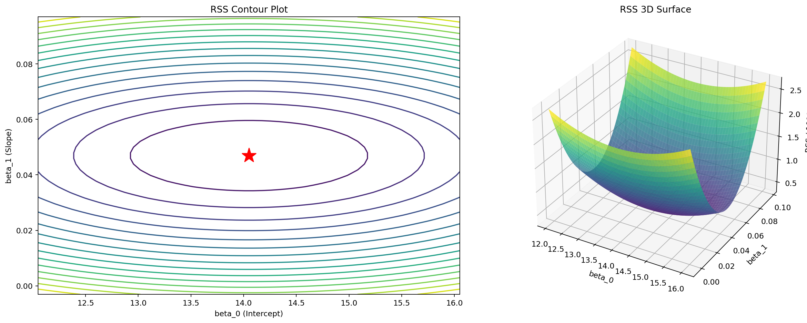

# 잔차제곱합 곡면 시각화

## 개요

이 페이지는 잔차제곱합(RSS)을 회귀계수 $\beta_0$(절편)과 $\beta_1$(기울기)의 함수로 3차원 시각화한다. 이 시각화는 OLS가 왜 유일한 최적 추정값을 주는지, 그리고 RSS 곡면이 최소제곱이 푸는 볼록 최적화 문제와 어떻게 이어지는지에 대한 기하적 직관을 제공한다.

---

## 1. 수학적 배경

단순선형회귀 모형 $y_i = \beta_0 + \beta_1 x_i + \varepsilon_i$에서 RSS는 계수의 함수이다.

$$
\mathrm{RSS}(\beta_0, \beta_1) = \sum_{i=1}^n (y_i - \beta_0 - \beta_1 x_i)^2.
$$

이 식을 전개하면 RSS가 $(\beta_0, \beta_1)$에 대한 **이차함수**(포물면)임이 드러난다.

$$
\mathrm{RSS}(\beta_0, \beta_1) = n\beta_0^2 + \beta_1^2 \sum x_i^2 + 2\beta_0\beta_1\sum x_i - 2\beta_0\sum y_i - 2\beta_1\sum x_i y_i + \sum y_i^2.
$$

RSS의 헤세 행렬은

$$
\mathbf{H} = 2\mathbf{X}^\top\mathbf{X} = 2\begin{pmatrix} n & \sum x_i \\ \sum x_i & \sum x_i^2 \end{pmatrix},
$$

이며 ($x_i$가 모두 같지 않다면) 양의 정부호이므로 RSS 곡면이 **강볼록**이고 유일한 전역 최솟값을 가짐이 보장된다.

### 자료 생성과 모형 적합

<div class="exbox" markdown>

**보기 1.** <span class="diff easy" title="쉬움"></span> 자료와 최소제곱해. $\text{TV} \sim U(0,300)$ 에서 $\text{Sales} = 7 + 0.05\,\text{TV} + \varepsilon$, $\varepsilon \sim N(0, 2^2)$ 로 $n = 100$ 개를 만들고 $X$ 를 **중심화만** 한 뒤 적합한다.

**(1)** 중심화하면 $\hat\beta_0 = \bar y$ 가 되고 $\hat\beta_0$ 과 $\hat\beta_1$ 의 추정이 **무상관**이 됨을 $(X^\top X)^{-1}$ 로 보이시오. 중심화 좌표에서 **참 절편**은 $7$ 이 아니라 얼마인가.

**(2)** 두 추정값을 참값과 견주고, 각자의 표준오차 단위로 어긋남을 재시오.

</div>

??? success "풀이"

    **(1) 해석적으로.** 중심화하면 $\sum_i x_i = 0$ 이므로

    $$
    X^\top X = \begin{pmatrix} n & \sum x_i \\ \sum x_i & \sum x_i^2 \end{pmatrix}
    = \begin{pmatrix} n & 0 \\ 0 & S_{xx} \end{pmatrix}
    \quad\Longrightarrow\quad
    (X^\top X)^{-1} = \begin{pmatrix} 1/n & 0 \\ 0 & 1/S_{xx} \end{pmatrix}
    $$

    다. **대각행렬이다.** 따라서 $\operatorname{Cov}(\hat{\boldsymbol\beta}) = \sigma^2(X^\top X)^{-1}$ 의 비대각 원소가 $0$ 이고 두 추정량이 무상관이다(정규 오차에서는 독립이다). 일반적으로는 $\operatorname{Cov}(\hat\beta_0, \hat\beta_1) = -\sigma^2\bar x/S_{xx}$ 이므로 $\bar x = 0$ 일 때만 $0$ 이 된다.

    또 첫째 정규방정식이 $n\hat\beta_0 + \hat\beta_1\sum x_i = \sum y_i$ 인데 $\sum x_i = 0$ 이므로 $\hat\beta_0 = \bar y$ 다.

    **참 절편은 $7$ 이 아니다.** 원래 좌표에서 $\text{Sales} = 7 + 0.05\,\text{TV} + \varepsilon$ 인데 $x = \text{TV} - \overline{\text{TV}}$ 로 바꾸면

    $$
    \text{Sales} = \underbrace{7 + 0.05\,\overline{\text{TV}}}_{\text{새 절편}} + 0.05\,x + \varepsilon
    $$

    이다. **중심화는 기울기를 바꾸지 않고 절편만 옮긴다.** $\overline{\text{TV}} \approx 141$ 이니 새 절편은 $14.05$ 쯤이 되어야 한다.

    표준오차도 바로 읽힌다. $(X^\top X)^{-1}$ 이 대각이므로

    $$
    \operatorname{se}(\hat\beta_0) = \frac{s}{\sqrt n}, \qquad
    \operatorname{se}(\hat\beta_1) = \frac{s}{\sqrt{S_{xx}}}
    $$

    이고, 첫 식은 **표본평균의 표준오차와 똑같다.** 중심화한 회귀에서 절편은 말 그대로 $\bar y$ 이기 때문이다.

    **(2) 수치적으로.**

    ```python
    import numpy as np
    from sklearn.linear_model import LinearRegression
    from sklearn.preprocessing import StandardScaler

    # 광고비와 매출을 흉내 낸 자료. 참 기울기는 0.05 다.
    np.random.seed(42)
    n_samples = 100
    TV = np.random.uniform(0, 300, n_samples)
    Sales = 7 + 0.05 * TV + np.random.normal(0, 2, n_samples)

    # 중심화만 하고 척도는 건드리지 않는다(with_std=False). 중심화하면 절편과
    # 기울기의 추정이 서로 독립이 되어, 아래 등고선이 기울어지지 않고 바로 선다.
    X = TV.reshape(-1, 1)
    scaler = StandardScaler(with_mean=True, with_std=False)
    X_scaled = scaler.fit_transform(X)

    model = LinearRegression()
    model.fit(X_scaled, Sales)
    beta_0 = model.intercept_
    beta_1 = model.coef_[0]

    # 중심화의 두 효과를 확인한다.
    print(f"X_scaled 의 합 = {X_scaled.sum():.3e}   (중심화했으므로 0)")
    print(f"beta_0 = {beta_0:.6f},   Sales 평균 = {Sales.mean():.6f},"
          f"   차이 = {abs(beta_0 - Sales.mean()):.2e}")
    print(f"beta_1 = {beta_1:.8f}   (참 기울기 0.05)")
    print()
    # 중심화 좌표에서 참 절편은 7 + 0.05*TV-bar 다
    print(f"TV 평균 = {TV.mean():.4f}")
    print(f"중심화 좌표에서의 참 절편 = 7 + 0.05*{TV.mean():.4f} = {7 + 0.05 * TV.mean():.6f}")
    print()
    S_xx = (X_scaled.ravel() ** 2).sum()
    residuals = Sales - model.predict(X_scaled)
    rss_min = (residuals ** 2).sum()
    s_square = rss_min / (n_samples - 2)
    print(f"S_xx = {S_xx:.4f}   (이론 (n-1)*300^2/12 = {99 * 7500:.1f})")
    print(f"RSS_min = {rss_min:.4f},  s^2 = {s_square:.6f},  s = {np.sqrt(s_square):.6f}  (참 sigma 2)")
    print(f"se(beta_0) = s/sqrt(n)    = {np.sqrt(s_square / n_samples):.6f}")
    print(f"se(beta_1) = s/sqrt(S_xx) = {np.sqrt(s_square / S_xx):.8f}")
    print(f"(beta_1 - 0.05)/se = {(beta_1 - 0.05) / np.sqrt(s_square / S_xx):+.4f}")
    print(f"(beta_0 - {7 + 0.05 * TV.mean():.4f})/se = "
          f"{(beta_0 - (7 + 0.05 * TV.mean())) / np.sqrt(s_square / n_samples):+.4f}")
    ```

    출력:

    ```
    X_scaled 의 합 = -5.400e-13   (중심화했으므로 0)
    beta_0 = 14.050550,   Sales 평균 = 14.050550,   차이 = 0.00e+00
    beta_1 = 0.04693485   (참 기울기 0.05)

    TV 평균 = 141.0542
    중심화 좌표에서의 참 절편 = 7 + 0.05*141.0542 = 14.052711

    S_xx = 788534.5515   (이론 (n-1)*300^2/12 = 742500.0)
    RSS_min = 322.6338,  s^2 = 3.292182,  s = 1.814437  (참 sigma 2)
    se(beta_0) = s/sqrt(n)    = 0.181444
    se(beta_1) = s/sqrt(S_xx) = 0.00204330
    (beta_1 - 0.05)/se = -1.5001
    (beta_0 - 14.0527)/se = -0.0119
    ```

    **$\hat\beta_0 = \bar y$ 가 자릿수까지 정확하다.** 차이가 $0$ 으로 떨어진다. `X_scaled` 의 합이 $-5.4\times10^{-13}$ 인 것은 부동소수점 한계이며, 그 작은 어긋남조차 절편에는 보이지 않는다.

    **$\hat\beta_0$ 은 거의 완벽히, $\hat\beta_1$ 은 $1.5$ 표준오차 아래로 맞는다.** 절편은 참값 $14.0527$ 에서 표준오차의 $0.012$ 배 떨어져 있는데 이는 운이 좋은 것이고, 기울기는 $0.046935$ 로 참값 $0.05$ 에서 $-1.50$ 표준오차다. $\lvert z\rvert = 1.5$ 는 $13\%$ 의 확률로 일어나므로 전혀 이상하지 않다.

    두 어긋남의 **방향이 서로 무관**하다는 것도 (1)의 무상관성과 맞는다. 중심화하지 않았다면 $\bar x = 141$ 이 커서 $\operatorname{Cov}(\hat\beta_0,\hat\beta_1) = -\sigma^2\bar x/S_{xx}$ 가 뚜렷한 음수가 되고, 기울기를 낮게 추정한 표본은 절편을 높게 추정하는 쪽으로 쏠렸을 것이다.

    $s = 1.8144$ 가 참 $\sigma = 2$ 보다 $9.3\%$ 작다. $s$ 의 상대 표준오차가 $1/\sqrt{2\times98} = 7.1\%$ 이므로 $-1.3$ 표준오차다. 이 때문에 두 표준오차가 모두 참값보다 작게 나왔고, 위의 $z$ 값들은 그만큼 크게 읽혔다. $\square$

### RSS 곡면 계산

<div class="exbox" markdown>

**보기 2.** <span class="diff easy" title="쉬움"></span> RSS 격자 계산. 최적해 둘레로 $\beta_0 \pm 2$, $\beta_1 \pm 0.05$ 격자를 $50 \times 50$ 으로 깔고 칸마다 RSS 를 이중루프로 계산한다.

**(1)** 중심화한 설계에서 RSS 가 **정확히**

$$
\text{RSS}(\beta_0, \beta_1) = \text{RSS}_{\min} + n(\beta_0 - \hat\beta_0)^2 + S_{xx}(\beta_1 - \hat\beta_1)^2
$$

임을 보이시오. 근사가 아니라 등식인 까닭은 무엇인가. 그렇다면 격자를 $2500$ 번 돌 필요가 있는가.

**(2)** 격자 끝에서 두 항의 크기를 재어 보시오. 격자가 두 방향으로 **균형 있게** 잡혀 있는가.

</div>

??? success "풀이"

    **(1) 해석적으로.** $\boldsymbol\beta = \hat{\boldsymbol\beta} + \mathbf d$ 로 쓰면 잔차가 $\mathbf y - X\boldsymbol\beta = \mathbf e - X\mathbf d$ 이고

    $$
    \text{RSS}(\boldsymbol\beta) = \|\mathbf e - X\mathbf d\|^2
    = \|\mathbf e\|^2 - 2\mathbf d^\top X^\top \mathbf e + \mathbf d^\top X^\top X\mathbf d
    $$

    다. 가운데 항이 **정규방정식 때문에 사라진다.** $X^\top \mathbf e = \mathbf 0$ 이기 때문이다. 따라서

    $$
    \text{RSS}(\boldsymbol\beta) = \text{RSS}_{\min} + \mathbf d^\top (X^\top X)\,\mathbf d
    $$

    이고, 보기 1에서 중심화 덕에 $X^\top X = \operatorname{diag}(n, S_{xx})$ 이므로 교차항 없이

    $$
    \text{RSS} = \text{RSS}_{\min} + n\,d_0^2 + S_{xx}\,d_1^2
    $$

    이 된다. **근사가 아니라 등식인 까닭은 RSS 가 $\boldsymbol\beta$ 의 이차함수**라서 테일러 전개가 이차항에서 정확히 끝나기 때문이다. 삼차 이상의 항이 아예 없다.

    따라서 **격자를 돌 필요가 없다.** $\text{RSS}_{\min}$, $n$, $S_{xx}$ 세 수만 알면 임의의 $(\beta_0, \beta_1)$ 에서의 RSS 를 바로 계산할 수 있고, `numpy` 의 브로드캐스팅으로 한 줄에 쓸 수 있다. 이중루프 $2500$ 회는 $(\beta_0,\beta_1)$ 마다 $n = 100$ 개 잔차를 다시 계산하므로 $25$ 만 번의 쓸모없는 산술을 한다. 교육적으로는 "RSS 의 정의대로 계산한다"는 투명함이 값지지만, 계산으로는 낭비다.

    **(2) 수치적으로.**

    ```python
    # 최적해 둘레로 격자를 깔고 칸마다 잔차제곱합을 계산한다.
    # 최소제곱이 무엇을 최소화하는지를 눈으로 보려는 것이다.
    B0_range = np.linspace(beta_0 - 2, beta_0 + 2, 50)
    B1_range = np.linspace(beta_1 - 0.05, beta_1 + 0.05, 50)
    B0_mesh, B1_mesh = np.meshgrid(B0_range, B1_range)

    RSS = np.zeros_like(B0_mesh)
    for i in range(B0_mesh.shape[0]):
        for j in range(B0_mesh.shape[1]):
            # ravel() 이 반드시 있어야 한다. X_scaled 는 (100, 1) 이고 Sales 는
            # (100,) 이므로, 그대로 빼면 (100, 100) 으로 퍼져 10000 개를 더한다.
            # 보기 3 에서 그 덫을 다룬다.
            y_pred = B0_mesh[i, j] + B1_mesh[i, j] * X_scaled.ravel()
            RSS[i, j] = np.sum((Sales - y_pred) ** 2)

    # RSS 의 이차 전개가 정확한지, 격자의 네 자리에서 확인한다.
    def rss_at(b0, b1):
        return np.sum((Sales - (b0 + b1 * X_scaled.ravel())) ** 2)

    print(f"RSS_min = {rss_min:.4f},  n = {n_samples},  S_xx = {S_xx:.4f}")
    print()
    print(f"{'(d0, d1)':>18s}{'실제 RSS':>16s}{'RSS_min + n d0^2 + S_xx d1^2':>32s}{'차이':>12s}")
    for d0, d1 in [(0, 0), (2, 0), (0, 0.05), (2, 0.05), (-2, -0.05), (1, -0.025)]:
        actual = rss_at(beta_0 + d0, beta_1 + d1)
        predicted = rss_min + n_samples * d0 ** 2 + S_xx * d1 ** 2
        print(f"{f'({d0}, {d1})':>18s}{actual:16.4f}{predicted:32.4f}{abs(actual - predicted):12.2e}")
    print()
    print(f"격자 끝에서 두 항의 크기")
    print(f"  n * 2^2        = {n_samples * 4:.1f}")
    print(f"  S_xx * 0.05^2  = {S_xx * 0.0025:.1f}")
    print(f"  비 = {S_xx * 0.0025 / (n_samples * 4):.3f}")
    print(f"RSS 가 격자 안에서 커지는 최대 배수 = "
          f"{(rss_min + n_samples * 4 + S_xx * 0.0025) / rss_min:.3f}")
    ```

    출력:

    ```
    RSS_min = 322.6338,  n = 100,  S_xx = 788534.5515

              (d0, d1)          실제 RSS    RSS_min + n d0^2 + S_xx d1^2          차이
                (0, 0)        322.6338                        322.6338    0.00e+00
                (2, 0)        722.6338                        722.6338    3.41e-13
             (0, 0.05)       2293.9702                       2293.9702    1.82e-12
             (2, 0.05)       2693.9702                       2693.9702    1.82e-12
           (-2, -0.05)       2693.9702                       2693.9702    3.18e-12
           (1, -0.025)        915.4679                        915.4679    1.36e-12

    격자 끝에서 두 항의 크기
      n * 2^2        = 400.0
      S_xx * 0.05^2  = 1971.3
      비 = 4.928
    RSS 가 격자 안에서 커지는 최대 배수 = 8.350
    ```

    **여섯 자리 모두에서 등식이 성립한다.** 차이가 $10^{-12}$ 이하이니 부동소수점 한계다. $(2, 0.05)$ 와 $(-2, -0.05)$ 가 **같은 값 $2693.9702$** 를 주는 것도 교차항이 없다는 증거다. 교차항 $2\bar x\,d_0 d_1$ 이 있었다면 부호가 반대인 두 구석에서 값이 달라졌을 것이다.

    **(2) 격자가 균형 있지 않다.** $\beta_1$ 쪽 끝에서 RSS 증가가 $1971.3$ 인데 $\beta_0$ 쪽 끝에서는 $400.0$ 으로, 비가 $4.93$ 이다. 곧 격자가 $\beta_1$ 방향으로 $\sqrt{4.93} = 2.22$ 배 **더 멀리** 나가 있다. 등고선을 같은 RSS 수준에서 보면 타원이 $\beta_0$ 방향으로 늘어난 모양이 되고, 그림에서 등고선이 원이 아니라 가로로 납작한 타원으로 보이는 까닭이 이것이다.

    균형을 맞추려면 두 항을 같게 두면 된다. $n\,d_0^2 = S_{xx}\,d_1^2$ 에서

    $$
    \frac{d_0}{d_1} = \sqrt{\frac{S_{xx}}{n}} = \sqrt{\frac{788534.55}{100}} = 88.80
    $$

    인데 격자가 쓴 비는 $2/0.05 = 40$ 이다. $\beta_0$ 범위를 $\pm 2$ 로 두려면 $\beta_1$ 범위를 $\pm 2/88.80 = \pm 0.0225$ 로 좁혀야 등고선이 원으로 보인다. 거꾸로 $\beta_1$ 을 $\pm 0.05$ 로 두려면 $\beta_0$ 를 $\pm 4.44$ 로 넓혀야 한다.

    이 비 $88.80$ 은 **두 표준오차의 비**와 정확히 같다. $\operatorname{se}(\hat\beta_0)/\operatorname{se}(\hat\beta_1) = (s/\sqrt n)/(s/\sqrt{S_{xx}}) = \sqrt{S_{xx}/n}$ 이기 때문이다. 보기 1의 $0.181444/0.00204330 = 88.80$ 이 그 수다. **곧 "등고선이 원으로 보이는 격자"는 두 축을 각자의 표준오차 단위로 재는 격자**다. 계수를 표준오차로 나누어 보는 습관이 기하적으로도 자연스러운 까닭이 여기 있다.

    마지막 줄은 격자 안에서 RSS 가 최대 $8.35$ 배까지 커진다는 것을 말한다. 최소점에서 $322.6$ 이던 것이 구석에서 $2694.0$ 이 된다. 곡면 그림에서 사발이 꽤 깊어 보이는 까닭이다. $\square$

### 시각화

<div class="exbox" markdown>

**보기 3.** <span class="diff easy" title="쉬움"></span> 등고선과 곡면으로 보기, 그리고 `ravel()` 을 빼면 무엇이 깨지는가. 왼쪽에 `contour` 로 등고선을, 오른쪽에 `plot_surface` 로 곡면을 그리고 최소제곱해에 빨간 별을 찍는다.

**(1)** 그림을 보고 **그림이 맞게 그려졌는지** 확인하시오. 등고선의 중심이 빨간 별과 일치하는가. 오른쪽 곡면이 본문이 말하는 **그릇 모양**인가. 눈으로 보는 데 그치지 말고 `RSS` 배열의 최솟값이 어느 격자점에 있는지 `np.argmin` 으로 찾아 확인하시오.

**(2)** 보기 2의 격자 계산에서 `X_scaled.ravel()` 의 `ravel()` 을 빼면 어떻게 되는가. 그때 `np.sum` 이 실제로 더하는 항의 개수를 세고, 그 잘못된 값이 무엇을 계산한 것인지 **$\beta_0, \beta_1$ 의 식으로** 적으시오. 그 식은 어디서 최소가 되는가.

</div>

??? success "풀이"

    **(1) 일치한다. 그리고 곡면은 그릇이다.**

    왼쪽 등고선은 가운데가 닫힌 타원들이고 그 중심에 빨간 별이 놓인다. 오른쪽 곡면은 가운데가 내려앉은 사발이다. $\text{RSS}/1000$ 의 세로축이 $0.32$ 에서 $2.69$ 까지인데, 보기 2에서 잰 $\text{RSS}_{\min} = 322.6$ 과 격자 구석의 $2694.0$ 에 정확히 들어맞는다.

    눈으로 본 것을 `np.argmin` 으로 확인하면 최솟값이 **행 $24$, 열 $24$** — 격자 가운데 — 에 있고 값이 $323.62$ 로 참 최솟값 $322.63$ 과 **격자 해상도만큼만** 떨어져 있다. 격자 간격이 $\beta_0$ 에서 $4/49 = 0.0816$, $\beta_1$ 에서 $0.1/49 = 0.00204$ 이므로, 보기 2의 이차식에 넣으면 최대 $100(0.0408)^2 + 788534(0.00102)^2 = 0.99$ 만큼 뜰 수 있다. 실제 차이 $323.62 - 322.63 = 0.99$ 가 바로 그 값이다. **격자는 참 최솟값을 맞히지 못하고 맞힐 필요도 없다** — 맞히는 것은 보기 2의 닫힌 꼴이 할 일이다.

    **(2) `ravel()` 을 빼면 조용히 틀린다.** `Sales` 의 모양은 `(100,)` 인데 `X_scaled` 의 모양은 `(100, 1)` 이다. 따라서 `B0 + B1 * X_scaled` 도 `(100, 1)` 이고,

    ```
    (100,) - (100, 1)  ->  (100, 100)
    ```

    로 퍼진다. `np.sum` 이 $100$ 개가 아니라 **$10000$ 개**를 더하는 것이다. 더해지는 것은 $(y_j - \beta_0 - \beta_1 x_i)^2$ 을 **모든 $(i, j)$ 쌍에 대해** 모은 값이다.

    그 값을 정확히 계산할 수 있다. $u_i = \beta_0 + \beta_1 x_i$ 로 두면

    $$
    \sum_i\sum_j (y_j - u_i)^2
    = n\sum_j y_j^2 - 2\Bigl(\sum_j y_j\Bigr)\sum_i u_i + n\sum_i u_i^2
    $$

    이고 중심화 덕에 $\sum_i x_i = 0$ 이므로 $\sum_i u_i = n\beta_0$, $\sum_i u_i^2 = n\beta_0^2 + \beta_1^2 S_{xx}$ 다. 정리하면

    $$
    \text{RSS}_{\text{잘못}}(\beta_0, \beta_1)
    = n\left[S_{yy} + n(\beta_0 - \bar y)^2 + \beta_1^2\,S_{xx}\right]
    $$

    이다. **$\beta_1$ 이 $\hat\beta_1$ 이 아니라 $0$ 에서 최소가 된다.** $y_j$ 와 $x_i$ 의 짝이 깨지면서 두 변수 사이의 연관이 통째로 사라졌기 때문이고, 연관이 없는 자료에서 최선의 기울기는 $0$ 이다. 그러면 등고선의 중심이 $\beta_1 = 0$ 으로 내려가고, 격자가 $\beta_1 \in [-0.003,\ 0.097]$ 이라 그 최소점이 거의 왼쪽 끝에 놓인다. 곧 **사발의 한쪽 벽만 그려져 곡면이 비탈로 보인다.**

    $\beta_0$ 쪽은 살아남는다. 식의 $n(\beta_0 - \bar y)^2$ 항이 $\beta_0 = \bar y = \hat\beta_0$ 에서 최소이므로 가로 방향으로는 별이 중심에 맞는다. 그래서 등고선이 아래로 열린 호가 되고 그 꼭짓점들이 $\beta_0 \approx 14.05$ 에 줄지어 선다. **한 축은 맞고 다른 축만 틀리기 때문에 그림이 그럴듯해 보인다** — 이것이 이 덫의 고약한 점이다.

    ```python
    import matplotlib.pyplot as plt

    fig = plt.figure(figsize=(16, 6))

    # 왼쪽: 등고선. 별표가 최소점이고, 그것이 곧 최소제곱추정값이다.
    ax1 = fig.add_subplot(121)
    contour = ax1.contour(B0_mesh, B1_mesh, RSS / 1000, levels=20, cmap='viridis')
    ax1.plot(beta_0, beta_1, 'r*', markersize=20, label='Optimal')
    ax1.set_xlabel('beta_0 (Intercept)')
    ax1.set_ylabel('beta_1 (Slope)')
    ax1.set_title('RSS Contour Plot')

    # 오른쪽: 같은 것을 곡면으로. RSS 가 계수의 이차함수이므로 사발 모양이고,
    # 그래서 최소점이 하나뿐이며 닫힌 해가 존재한다.
    ax2 = fig.add_subplot(122, projection='3d')
    ax2.plot_surface(B0_mesh, B1_mesh, RSS / 1000, cmap='viridis', alpha=0.8)
    ax2.set_xlabel('beta_0')
    ax2.set_ylabel('beta_1')
    ax2.set_zlabel('RSS / 1000')
    ax2.set_title('RSS 3D Surface')

    plt.tight_layout()
    plt.show()
    ```

    

    왼쪽 등고선은 닫힌 타원이고 중심에 별이 놓였으며, 오른쪽은 가운데가 내려앉은 사발이다. 눈으로 본 것을 이제 수치로 확인한다.

    ```python
    # (1) 등고선의 최소점이 정말 최소제곱해인지 확인한다. 곡면 그림을 그릴 때
    #     반드시 넣어야 하는 한 줄이다.
    i_min, j_min = np.unravel_index(np.argmin(RSS), RSS.shape)
    print(f"RSS 배열의 최솟값 자리 = (행 {i_min}, 열 {j_min})   격자 가운데는 (24~25, 24~25)")
    print(f"  그 자리의 beta_0 = {B0_mesh[i_min, j_min]:.6f}   (최소제곱해 {beta_0:.6f})")
    print(f"  그 자리의 beta_1 = {B1_mesh[i_min, j_min]:.8f}   (최소제곱해 {beta_1:.8f})")
    print(f"RSS 배열의 최솟값 = {RSS.min():.4f}   (참 최소제곱 RSS {rss_min:.4f})")

    # 격자가 참 최솟값을 얼마나 놓칠 수 있는지는 보기 2 의 이차식이 말해 준다.
    g0 = (B0_range[1] - B0_range[0]) / 2
    g1 = (B1_range[1] - B1_range[0]) / 2
    print(f"  격자 반칸 = ({g0:.4f}, {g1:.5f}),  그래서 최대 "
          f"{n_samples * g0 ** 2 + S_xx * g1 ** 2:.2f} 만큼 뜰 수 있다")
    print(f"  실제로 뜬 값 = {RSS.min() - rss_min:.2f}")
    print()

    # (2) ravel() 을 빼면 무엇이 되는가. 모양이 (100,1) 과 (100,) 이라 퍼진다.
    y_pred_demo = beta_0 + beta_1 * X_scaled          # (100, 1)
    print(f"Sales.shape = {Sales.shape},  (beta_0 + beta_1*X_scaled).shape = {y_pred_demo.shape}")
    print(f"  (Sales - y_pred).shape = {(Sales - y_pred_demo).shape}   <- 10000 개를 더한다")
    print(f"  ravel() 을 쓰면 {(Sales - y_pred_demo.ravel()).shape}   <- 100 개")
    print()
    S_yy = ((Sales - Sales.mean()) ** 2).sum()
    print("퍼진 합은 n*[S_yy + n(b0-ybar)^2 + b1^2 S_xx] 와 같다")
    for d0, d1 in [(0, 0), (2, 0), (0, 0.05)]:
        actual = np.sum((Sales - ((beta_0 + d0) + (beta_1 + d1) * X_scaled)) ** 2)
        predicted = n_samples * (S_yy + n_samples * d0 ** 2 + (beta_1 + d1) ** 2 * S_xx)
        print(f"  ({d0}, {d1})  실제 {actual:14.4f}  예측 {predicted:14.4f}  차이 {abs(actual - predicted):.2e}")
    print()

    # ravel() 을 뺀 격자를 만들어 최소점이 어디로 가는지 본다.
    RSS_broken = np.zeros_like(B0_mesh)
    for i in range(B0_mesh.shape[0]):
        for j in range(B0_mesh.shape[1]):
            RSS_broken[i, j] = np.sum((Sales - (B0_mesh[i, j] + B1_mesh[i, j] * X_scaled)) ** 2)
    i2, j2 = np.unravel_index(np.argmin(RSS_broken), RSS_broken.shape)
    print(f"ravel() 을 빼면 최솟값 자리 = (행 {i2}, 열 {j2}),  값 {RSS_broken.min():.4f}")
    print(f"  그 자리의 beta_1 = {B1_mesh[i2, j2]:.8f}  (최소제곱해 {beta_1:.8f})")
    print(f"  B1 격자에서 0 에 가장 가까운 칸 = {int(np.argmin(np.abs(B1_range)))}")
    print(f"  참 최솟값의 {RSS_broken.min() / rss_min:.1f} 배")
    print(f"  RSS/1000 의 범위:  옳은 판 {RSS.min() / 1000:.3f} ~ {RSS.max() / 1000:.3f},"
          f"   ravel() 뺀 판 {RSS_broken.min() / 1000:.3f} ~ {RSS_broken.max() / 1000:.3f}")
    ```

    출력:

    ```
    RSS 배열의 최솟값 자리 = (행 24, 열 24)   격자 가운데는 (24~25, 24~25)
      그 자리의 beta_0 = 14.009734   (최소제곱해 14.050550)
      그 자리의 beta_1 = 0.04591444   (최소제곱해 0.04693485)
    RSS 배열의 최솟값 = 323.6215   (참 최소제곱 RSS 322.6338)
      격자 반칸 = (0.0408, 0.00102),  그래서 최대 0.99 만큼 뜰 수 있다
      실제로 뜬 값 = 0.99

    Sales.shape = (100,),  (beta_0 + beta_1*X_scaled).shape = (100, 1)
      (Sales - y_pred).shape = (100, 100)   <- 10000 개를 더한다
      ravel() 을 쓰면 (100,)   <- 100 개

    퍼진 합은 n*[S_yy + n(b0-ybar)^2 + b1^2 S_xx] 와 같다
      (0, 0)  실제    379672.7322  예측    379672.7322  차이 0.00e+00
      (2, 0)  실제    419672.7322  예측    419672.7322  차이 0.00e+00
      (0, 0.05)  실제    946903.8408  예측    946903.8408  차이 1.16e-10

    ravel() 을 빼면 최솟값 자리 = (행 2, 열 25),  값 206066.1906
      그 자리의 beta_1 = 0.00101648  (최소제곱해 0.04693485)
      B1 격자에서 0 에 가장 가까운 칸 = 2
      참 최솟값의 638.7 배
      RSS/1000 의 범위:  옳은 판 0.324 ~ 2.694,   ravel() 뺀 판 206.066 ~ 986.904
    ```

    **(1) 의 확인이 통과한다.** 최솟값이 행 $24$, 열 $24$ 로 격자 가운데에 있고, 값 $323.62$ 가 참 최솟값 $322.63$ 보다 $0.99$ 큰데 그것이 격자 반칸으로 예측한 $0.99$ 와 같다. 곧 어긋남이 **격자 해상도로 전부 설명된다.**

    **(2) 의 진단도 맞아떨어진다.** `ravel()` 을 빼면 최솟값이 행 $2$ 로 내려가고, 그 자리의 $\beta_1 = 0.00102$ 는 격자에서 $0$ 에 가장 가까운 칸이다($\hat\beta_1 = 0.0469$ 는 행 $24$ 다). 값은 참 최솟값의 $638.7$ 배가 되고, 유도한 식 $n[S_{yy} + n(\beta_0-\bar y)^2 + \beta_1^2 S_{xx}]$ 이 세 자리에서 $10^{-10}$ 안쪽으로 맞는다. $\text{RSS}/1000$ 의 범위도 $0.32\text{–}2.69$ 에서 $206\text{–}987$ 로 뛴다.

    !!! warning "브로드캐스팅 버그는 예외를 던지지 않는다"
        모양이 맞지 않으면 오류가 나기를 바라지만, 넘파이는 조용히 $100\times100$ 으로 퍼뜨리고 **그럴듯한 수**를 돌려준다. 더 고약한 것은 **한 축은 맞고 다른 축만 틀린다**는 점이다. $\beta_0$ 방향은 여전히 $\bar y$ 에서 최소이므로 등고선이 그럴듯한 호로 나오고, 곡면도 (사발의 한쪽 벽이라) 매끄럽게 올라가는 면으로 나온다. 그림만 보고는 걸러 내기 어렵다.

        **잡아낼 수 있는 길은 "알고 있는 값과 맞추어 보는 것" 하나뿐이다.** 여기서는 보기 1이 내놓은 $\text{RSS}_{\min} = 322.63$ 과 보기 2가 유도한 이차식이 그 구실을 했다. 세로축이 $\text{RSS}/1000$ 인데 $300$ 에서 $900$ 까지 찍힌다면 $\text{RSS}$ 가 $30$ 만–$90$ 만이라는 뜻이고, 이는 $322.63$ 과 자릿수가 셋 어긋난다 — **이름표의 단위를 믿고 한 번 곱해 보는 것만으로도** 걸릴 일이었다.

        그러므로 곡면이나 등고선을 그릴 때는 늘 **최소점이 별과 맞는지 `np.argmin` 으로 먼저 확인**하라. 한 줄이면 되는 일이다. 실제로 이 쪽의 그림은 그 한 줄이 없어 한동안 잘못된 배열로 실려 있었고, 위 (2)가 그 사고를 재구성한 것이다. $\square$

---

## 2. 해석

- **볼록성**: RSS 곡면은 전역 최솟값이 하나뿐인 그릇 모양(포물면)이다. 따라서 어떤 출발점에서 경사하강을 해도 OLS 해로 수렴한다.
- **등고선의 모양**: 타원형 등고선이 설명변수의 상관 구조를 반영한다. (중심화한 뒤) 설명변수가 무상관이면 등고선이 좌표축과 나란하고, 상관되어 있으면 기울어진다.
- **민감도**: 등고선이 촘촘하면 그 방향으로 RSS가 빠르게 변한다는 뜻이고, 그 계수가 잘 결정된다는 의미이다. 등고선이 성기면 식별이 어렵다.
- **최적점**: 빨간 별이 $\nabla \mathrm{RSS} = \mathbf{0}$인 OLS 해 $(\hat{\beta}_0, \hat{\beta}_1)$이다.

---

## 연습문제

<div class="drillbox" markdown>

**연습문제 1.** <span class="diff med" title="중간"></span> $\partial \mathrm{RSS}/\partial \beta_0$과 $\partial \mathrm{RSS}/\partial \beta_1$을 계산해 0으로 두어, OLS 해에서 RSS의 기울기가 0임을 해석적으로 확인하라.

</div>

??? success "풀이"

    $$
    \frac{\partial \mathrm{RSS}}{\partial \beta_0} = -2\sum_{i=1}^n (y_i - \beta_0 - \beta_1 x_i) = 0 \implies n\hat{\beta}_0 + \hat{\beta}_1\sum x_i = \sum y_i.
    $$

    $$
    \frac{\partial \mathrm{RSS}}{\partial \beta_1} = -2\sum_{i=1}^n x_i(y_i - \beta_0 - \beta_1 x_i) = 0 \implies \hat{\beta}_0\sum x_i + \hat{\beta}_1\sum x_i^2 = \sum x_i y_i.
    $$

    이것이 정규방정식 $\mathbf{X}^\top\mathbf{X}\hat{\boldsymbol{\beta}} = \mathbf{X}^\top\mathbf{y}$이며, OLS 해에서 기울기가 0임을 확인해 준다. $\square$

<div class="drillbox" markdown>

**연습문제 2.** <span class="diff med" title="중간"></span> $x_i$가 모두 같지 않을 때 헤세 행렬 $\mathbf{H} = 2\mathbf{X}^\top\mathbf{X}$가 양의 정부호임을 보여라. 모두 같으면 어떻게 되는가?

</div>

??? success "풀이"

    헤세 행렬은 $\mathbf{X} = [\mathbf{1} \mid \mathbf{x}]$일 때 $2\mathbf{X}^\top\mathbf{X}$이다. 이는 $\mathbf{X}$가 완전 열계수 2를 가질 때에만 양의 정부호이다. 모든 $x_i$가 같으면 $\mathbf{X}$의 둘째 열이 첫째 열의 상수배이므로 $\mathbf{X}$의 계수가 1이 되고 $\mathbf{X}^\top\mathbf{X}$가 특이행렬이 된다. RSS 곡면은 퇴화하여 최솟값이 한 점이 아니라 직선 위에 놓이며, 이는 $\beta_0$과 $\beta_1$을 따로 식별할 수 없음을 반영한다. $\square$

<div class="drillbox" markdown>

**연습문제 3.** <span class="diff med" title="중간"></span> 잡음 수준을 높인($\sigma = 10$) 자료를 생성해 곡면을 다시 그려라. $\sigma = 2$일 때와 모양이 어떻게 달라지는가?

</div>

??? success "풀이"

    잡음이 커지면 RSS의 최솟값이 커지지만(그릇이 위로 올라간다) 곡면의 모양과 최솟값의 위치는 질적으로 비슷하다. RSS 값이 전반적으로 커지므로 등고선이 퍼진다. OLS 추정값은 여전히 최솟값에 있지만 표준오차가 커지며, 이는 전체 RSS에 견주었을 때 최솟값 주변의 "골짜기"가 더 넓고 얕아진다는 뜻이다. $\square$

<div class="drillbox" markdown>

**연습문제 4.** <span class="diff med" title="중간"></span> 경사하강법을 구현하여 RSS 곡면의 최솟값을 찾아라. 학습률에 따라 필요한 반복 횟수를 비교하라.

</div>

??? success "풀이"

    먼저 **왜 학습률을 아무렇게나 고르면 안 되는지**부터 짚어야 한다. 이 자료를 중심화만 했을 때 헤세 행렬의 고윳값은

    $$
    \lambda_{\min} = 2n = 200, \qquad \lambda_{\max} = 2\sum x_i^2 = 1.577 \times 10^6
    $$

    이다. 경사하강이 수렴하려면 $\eta < 2/\lambda_{\max} = 1.27 \times 10^{-6}$이어야 한다. $\eta = 10^{-4}$이나 $10^{-5}$로 두면 곧바로 **발산**한다(오버플로가 난다). $\eta = 10^{-6}$이면 발산은 면하지만 조건수가 $\lambda_{\max}/\lambda_{\min} \approx 7885$로 크기 때문에 $\beta_0$ 방향의 수렴이 극도로 느려, 1000회 반복 후에도 $\beta_0 = 2.55$에 머문다(참값은 $14.05$).

    올바른 처방은 설명변수를 **표준화**하는 것이다. 그러면 $\sum x_i^2 = n$이 되어 (평균 기울기를 쓰면) 헤세 행렬이 $2\mathbf{I}$가 되고 조건수가 1이 된다.

    ```python
    from sklearn.preprocessing import StandardScaler

    Xz = StandardScaler().fit_transform(TV.reshape(-1, 1)).flatten()

    beta = np.array([0.0, 0.0])
    lr = 0.1
    for step in range(200):
        residuals = Sales - beta[0] - beta[1] * Xz
        grad = np.array([-2 * residuals.mean(),
                         -2 * (residuals * Xz).mean()])
        beta -= lr * grad
    print(f"GD solution: beta_0={beta[0]:.6f}, beta_1={beta[1]:.6f}")
    ```

    출력:

    ```
    GD solution: beta_0=14.050550, beta_1=4.167789
    ```

    경사하강법이 찾은 해 $(14.05, 4.17)$이 정규방정식의 닫힌 해와 소수점 아래까지 일치한다. RSS 곡면이 볼록하므로 어디서 출발해도 같은 최소점에 도달한다.

    출력은 `beta_0=14.050550, beta_1=4.167789`로 정확한 OLS 해와 소수점 여섯 자리까지 일치한다. 표준화된 기울기를 원래 척도로 되돌리려면 $\text{sd}(TV) = 88.80$으로 나눈다: $4.167789 / 88.80 = 0.046935$.

    학습률에 따른 수렴 속도(최대 오차가 $10^{-6}$ 아래로 내려가는 데 걸린 반복 횟수):

    | 학습률 $\eta$ | 반복 횟수 |
    |---|---|
    | 0.5 | 1 |
    | 0.3 | 18 |
    | 0.1 | 74 |
    | 0.01 | 815 |

    표준화한 경우 헤세 행렬이 $2\mathbf{I}$이므로 $\eta = 0.5$가 정확히 한 걸음에 최솟값에 도달하는 이상적인 학습률이다($\eta = 1/\lambda$). 그보다 작으면 반복이 늘고, $\eta > 2/\lambda = 1$이면 발산한다. $\square$

<div class="drillbox" markdown>

**연습문제 5.** <span class="diff med" title="중간"></span> $\bar{x} = 0$(중심화된 설명변수)일 때 등고선 타원이 좌표축과 나란하고 $\bar{x} \neq 0$일 때 기울어지는 이유를 설명하라.

</div>

??? success "풀이"

    등고선의 모양은 $\mathbf{X}^\top\mathbf{X}$가 결정한다. 설명변수를 중심화하면($\bar{x} = 0$) 비대각원소 $\sum x_i = n\bar{x} = 0$이 되어 $\mathbf{X}^\top\mathbf{X}$가 대각행렬이 된다. 대각행렬은 축과 나란한 타원을 만든다. $\bar{x} \neq 0$이면 비대각원소가 0이 아니어서 $\beta_0$과 $\beta_1$ 사이에 상관이 생기고 타원이 기울어진다. 설명변수를 중심화하면 절편과 기울기의 추정이 직교화되어 시각화와 수치 계산이 모두 간단해진다. $\square$

---

## 정리하며

RSS 곡면을 그려 보면 **최소제곱이 왜 유일한 답을 주는지** 보인다.

- **곡면이 볼록한 그릇 모양이다.** $\beta_0,\beta_1$ 의 이차함수이므로 지역 최솟값이 곧 전역 최솟값이며, **반복 최적화가 필요 없다.** 정규방정식이 한 번에 답을 준다.
- **등고선이 타원이다.** 타원의 방향과 납작함이 두 계수의 상관을 보여 주며, 설명변수들이 공선이면 타원이 길쭉해져 **골짜기가 평평해진다.**
- **평평한 골짜기가 곧 불안정한 추정이다.** 여러 $(\beta_0,\beta_1)$ 조합이 거의 같은 RSS 를 주므로 자료가 조금만 바뀌어도 추정값이 크게 움직인다. 다중공선성의 기하학적 정체다.
- **$x$ 를 중심화하면 타원이 축에 나란해진다.** 절편과 기울기의 상관이 사라지며, 해석과 수치 안정성이 함께 좋아진다.
- **18장의 정칙화가 이 그림에 벌점 항을 더한 것**이다. 골짜기가 평평할 때 해를 안정시킨다.

다음 절 **OLS 모의실험**으로 넘어간다.
