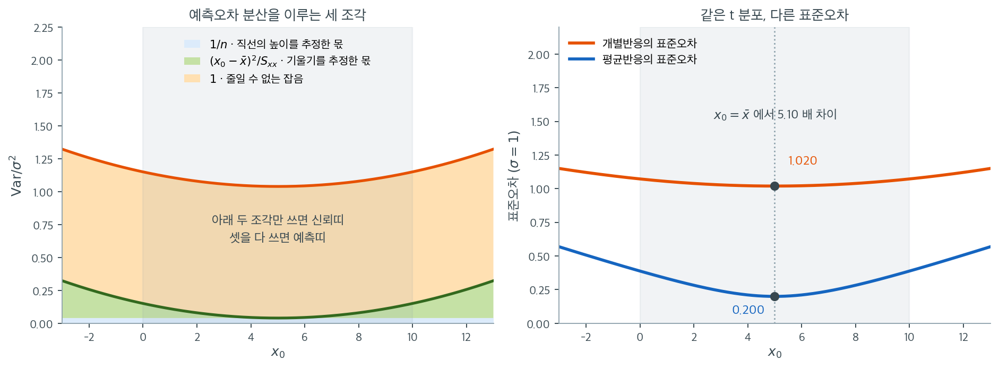

# 단순 OLS 추정량의 표집분포

## 개요

단순선형회귀에서 핵심 추론 결과는 추정된 계수와 예측값의 **표집분포**를 아는 데 달려 있다. 고전적 가정 — 선형성, 독립성, 등분산성, 오차의 정규성 — 아래에서 이 분포들은 $t$ 분포에 기초한 우아한 닫힌 형태를 갖는다. 이 절은 세 가지 기본 양, 곧 기울기 추정량, 주어진 점에서의 기대반응, 개별 예측반응의 표집분포를 유도한다.

---

## 1. 기울기 추정량

### 정리 1. 기울기 추정량의 t 분포 { .thm }

정규오차 단순선형회귀 모형 아래에서

$$
\frac{\hat{\beta}_1 - \beta_1}{s\sqrt{\dfrac{1}{\sum_{i=1}^n(x_i - \bar{x})^2}}} \sim t_{n-2}
$$

이다.

??? proof "증명"

    **1단계: 모형 가정.** 단순선형회귀 모형을 생각하자.

    $$
    y_i = \beta_0 + \beta_1 x_i + \varepsilon_i
    $$

    여기서 $\varepsilon_i \overset{\text{i.i.d.}}{\sim} N(0, \sigma^2)$이다.

    **2단계: OLS 추정량.** $\beta_1$의 최소제곱 추정량은

    $$
    \hat{\beta}_1 = \frac{\sum_{i=1}^n (x_i - \bar{x})(y_i - \bar{y})}{\sum_{i=1}^n (x_i - \bar{x})^2}
    $$

    **3단계: $\hat{\beta}_1$의 분포.** $\hat{\beta}_1$은 정규분포를 따르는 $y_i$들의 선형결합이므로

    $$
    \hat{\beta}_1 \sim N\!\left(\beta_1,\; \frac{\sigma^2}{\sum_{i=1}^n (x_i - \bar{x})^2}\right)
    $$

    **4단계: $\sigma$를 알 때의 표준화.** 참 표준편차로 나누면 표준정규가 된다.

    $$
    \frac{\hat{\beta}_1 - \beta_1}{\sigma\sqrt{\dfrac{1}{\sum_{i=1}^n(x_i - \bar{x})^2}}} \sim N(0, 1)
    $$

    **5단계: $\sigma^2$의 추정.** $\sigma^2$을 모르므로 불편추정량을 쓴다.

    $$
    s^2 = \frac{\sum_{i=1}^n (y_i - \hat{y}_i)^2}{n - 2}
    $$

    **6단계: 대입.** $\sigma$를 $s$로 바꾸면

    $$
    \frac{\hat{\beta}_1 - \beta_1}{s\sqrt{\dfrac{1}{\sum_{i=1}^n(x_i - \bar{x})^2}}}
    $$

    **7단계: $t$ 분포 결과.** 분자는 정규이고, $s^2$은 자유도 $n - 2$의 척도조정된 카이제곱분포를 따르며, 둘은 독립이다. 표준정규를 독립인 카이제곱을 자유도로 나눈 것의 제곱근으로 나눈 것이 $t$ 분포라는 정의에 따라

    $$
    \frac{\hat{\beta}_1 - \beta_1}{s\sqrt{\dfrac{1}{\sum_{i=1}^n(x_i - \bar{x})^2}}} \sim t_{n-2} \qquad \square
    $$

### 구성 요소

정리의 식을 이루는 각 조각이 무엇을 재는지 따로 본다.

**추정된 기울기** $\hat{\beta}_1$: 기울기의 OLS 추정값으로, 표본에서 $x$가 한 단위 늘어날 때 관측되는 $y$의 변화를 나타낸다.

**참 기울기** $\beta_1$: 우리가 추정하려는 미지의 모수. 가설검정은 보통 $\beta_1 = 0$인지를 살핀다.

**잔차 표준편차** $s$: $x$와의 선형관계로 설명되지 않는 $y$의 변동을 잰다.

$$
s = \sqrt{\frac{\sum_{i=1}^n (y_i - \hat{y}_i)^2}{n - 2}}
$$

여기서 $\hat{y}_i$는 적합값이고, $n - 2$는 $\beta_0$과 $\beta_1$ 둘 다 추정한 것을 반영한다.

**$x$의 제곱합**: $SS_x = \sum_{i=1}^n (x_i - \bar{x})^2$은 설명변수 값들의 산포를 담으며 기울기 추정의 정밀도를 곧바로 결정한다.

**기울기의 표준오차**: 분모 $s \sqrt{1 / SS_x}$는 표집변동으로 인한 $\hat{\beta}_1$의 불확실성을 수량화하며, 잔차의 산포와 설명변수의 산포를 결합한다.

---

## 2. 주어진 점에서의 반응의 기댓값

### 정리 2. 평균반응 추정량의 t 분포 { .thm }

같은 모형에서 임의로 고정한 $x_0$에 대해

$$
\frac{(\hat{\beta}_0 + \hat{\beta}_1 x_0) - (\beta_0 + \beta_1 x_0)}{s\sqrt{\dfrac{1}{n} + \dfrac{(x_0 - \bar{x})^2}{\sum_{i=1}^n(x_i - \bar{x})^2}}} \sim t_{n-2}
$$

이다.

??? proof "증명"

    **1단계: 예측오차의 분해.** 추정된 평균반응과 참 평균반응의 차이는

    $$
    (\hat{\beta}_0 + \hat{\beta}_1 x_0) - (\beta_0 + \beta_1 x_0) = (\hat{\beta}_0 - \beta_0) + (\hat{\beta}_1 - \beta_1)x_0
    $$

    두 추정량이 모두 불편이므로 이 값의 평균은 0이다.

    **2단계: 분산 계산.** OLS의 분산·공분산 결과를 쓴다.

    - $\text{Var}(\hat{\beta}_0) = \sigma^2\!\left(\dfrac{1}{n} + \dfrac{\bar{x}^2}{SS_x}\right)$
    - $\text{Var}(\hat{\beta}_1) = \dfrac{\sigma^2}{SS_x}$
    - $\text{Cov}(\hat{\beta}_0, \hat{\beta}_1) = -\dfrac{\sigma^2 \bar{x}}{SS_x}$

    $\text{Var}(\hat{\beta}_0 + \hat{\beta}_1 x_0) = \text{Var}(\hat{\beta}_0) + x_0^2\,\text{Var}(\hat{\beta}_1) + 2x_0\,\text{Cov}(\hat{\beta}_0, \hat{\beta}_1)$으로 결합하면

    $$
    \text{Var}(\hat{\beta}_0 + \hat{\beta}_1 x_0) = \sigma^2\!\left(\frac{1}{n} + \frac{(x_0 - \bar{x})^2}{SS_x}\right)
    $$

    **3단계: 표준화.** $\sigma$를 알면

    $$
    \frac{(\hat{\beta}_0 + \hat{\beta}_1 x_0) - (\beta_0 + \beta_1 x_0)}{\sigma\sqrt{\dfrac{1}{n} + \dfrac{(x_0 - \bar{x})^2}{SS_x}}} \sim N(0, 1)
    $$

    **4단계: $\sigma$ 대신 $s$.** $\sigma$를 잔차 표준오차 $s$로 바꾸고 앞과 같은 $t$ 분포 논증을 적용하면

    $$
    \frac{(\hat{\beta}_0 + \hat{\beta}_1 x_0) - (\beta_0 + \beta_1 x_0)}{s\sqrt{\dfrac{1}{n} + \dfrac{(x_0 - \bar{x})^2}{SS_x}}} \sim t_{n-2} \qquad \square
    $$

### 구성 요소

분모가 왜 저 모양인지 조각별로 본다.

**예측된 평균반응** $\hat{\beta}_0 + \hat{\beta}_1 x_0$: 적합된 회귀직선에서 $x = x_0$일 때 $y$의 추정된 기댓값.

**참 평균반응** $\beta_0 + \beta_1 x_0$: $x = x_0$일 때 $y$의 미지의 모평균.

**평균 예측의 표준오차**: 분모는 두 개의 분산 성분으로 이루어진다.

- $\dfrac{1}{n}$: 절편과 기울기를 추정하는 데서 오는 변동.
- $\dfrac{(x_0 - \bar{x})^2}{\sum_{i=1}^n(x_i - \bar{x})^2}$: $x_0$이 $\bar{x}$에서 멀 때 추가되는 변동.

따라서 평균반응의 신뢰띠는 $\bar{x}$에서 가장 좁고 $x_0$이 자료의 중심에서 멀어질수록 넓어진다.

---

## 3. 주어진 점에서의 반응(예측)

### 정리 3. 개별 반응 예측오차의 t 분포 { .thm }

같은 모형에서 $x_0$에서의 새 관측값 $y_0 = \beta_0 + \beta_1 x_0 + \varepsilon$에 대해

$$
\frac{(\hat{\beta}_0 + \hat{\beta}_1 x_0) - (\beta_0 + \beta_1 x_0 + \varepsilon)}{s\sqrt{1 + \dfrac{1}{n} + \dfrac{(x_0 - \bar{x})^2}{\sum_{i=1}^n(x_i - \bar{x})^2}}} \sim t_{n-2}
$$

이다.

??? proof "증명"

    **1단계: 예측오차.** 예측오차를 정의하면

    $$
    \hat{y}_0 - y_0 = (\hat{\beta}_0 + \hat{\beta}_1 x_0) - (\beta_0 + \beta_1 x_0 + \varepsilon) = (\hat{\beta}_0 - \beta_0) + (\hat{\beta}_1 - \beta_1)x_0 - \varepsilon
    $$

    **2단계: 분산의 분해.** 오차 $\varepsilon$은 (훈련자료에 의존하는) 추정량 $\hat{\beta}_0$, $\hat{\beta}_1$과 독립이므로

    $$
    \text{Var}(\hat{y}_0 - y_0) = \underbrace{\sigma^2\!\left(\frac{1}{n} + \frac{(x_0 - \bar{x})^2}{SS_x}\right)}_{\text{추정의 불확실성}} + \underbrace{\sigma^2}_{\text{줄일 수 없는 잡음}} = \sigma^2\!\left(1 + \frac{1}{n} + \frac{(x_0 - \bar{x})^2}{SS_x}\right)
    $$

    **3단계: $\sigma$를 알 때의 표준화.** 예측오차는 평균이 0인 정규분포를 따른다.

    $$
    \frac{\hat{y}_0 - y_0}{\sigma\sqrt{1 + \dfrac{1}{n} + \dfrac{(x_0 - \bar{x})^2}{SS_x}}} \sim N(0, 1)
    $$

    **4단계: $\sigma$ 대신 $s$.** $\sigma$를 $s$로 바꾸면 $t$ 분포를 얻는다.

    $$
    \frac{(\hat{\beta}_0 + \hat{\beta}_1 x_0) - (\beta_0 + \beta_1 x_0 + \varepsilon)}{s\sqrt{1 + \dfrac{1}{n} + \dfrac{(x_0 - \bar{x})^2}{SS_x}}} \sim t_{n-2} \qquad \square
    $$

### 구성 요소

분모가 앞의 것과 어디서 달라지는지 조각별로 본다.

**예측된 반응** $\hat{y}_0 = \hat{\beta}_0 + \hat{\beta}_1 x_0$: $x_0$에서의 점 예측값.

**참 개별반응** $y_0 = \beta_0 + \beta_1 x_0 + \varepsilon$: 실제 관측값으로, 무작위 오차 $\varepsilon \sim N(0, \sigma^2)$만큼 평균반응과 다르다.

**개별 예측의 표준오차**: 분모는 세 개의 분산 성분을 포함한다.

- $1$: 회귀직선 주위에서 개별 관측값이 갖는 잔차 변동.
- $\dfrac{1}{n}$: 회귀계수를 추정하는 데서 오는 표집변동.
- $\dfrac{(x_0 - \bar{x})^2}{SS_x}$: $\bar{x}$에서 멀어지는 외삽으로 인한 추가 불확실성.

앞머리의 $1$이 평균반응의 경우와 결정적으로 다른 점이다. 이 항 때문에 개별 관측값에 대한 예측구간은 언제나 평균반응에 대한 신뢰구간보다 넓다.

---

## 4. 요약 비교

| 대상 | 표준오차 | 분포 |
|:---|:---|:---|
| 기울기 $\hat{\beta}_1$ | $s\sqrt{\dfrac{1}{SS_x}}$ | $t_{n-2}$ |
| $x_0$에서의 평균반응 | $s\sqrt{\dfrac{1}{n} + \dfrac{(x_0-\bar{x})^2}{SS_x}}$ | $t_{n-2}$ |
| $x_0$에서의 개별반응 | $s\sqrt{1 + \dfrac{1}{n} + \dfrac{(x_0-\bar{x})^2}{SS_x}}$ | $t_{n-2}$ |

세 통계량은 모두 같은 $t_{n-2}$ 분포를 따르지만 표준오차가 다르다. 기울기 추정만 있는 경우에서 평균 예측, 개별 예측으로 갈수록 불확실성의 원천이 늘어남을 반영한다.

왼쪽 그림은 표의 마지막 행에 있는 제곱근 안의 세 항을 $x_0$의 함수로 쌓아 올린 것이다. $n = 25$, $x$가 $0$부터 $10$까지 고르게 퍼져 있어 $\bar{x} = 5$, $S_{xx} = 225.7$이고 $\sigma = 1$로 두었다. 맨 아래 파란 띠는 $1/n = 0.04$로 $x_0$에 상관없이 일정하다. 회귀직선의 **높이**를 표본으로 추정한 값이다. 그 위 초록 띠가 $(x_0 - \bar{x})^2/S_{xx}$로, $x_0 = \bar{x}$에서 정확히 0이고 바깥으로 갈수록 이차함수로 벌어진다. **기울기**를 추정한 값이며, 지렛대가 길수록 기울기의 작은 오차가 큰 높이 오차로 증폭되는 것이 이 항이다. 맨 위 주황 띠는 값이 언제나 $1$인 줄일 수 없는 잡음이다.

세 통계량이 갈리는 지점이 여기다. 기울기 검정은 파란 조각만 쓰고, 평균반응의 신뢰구간은 파랑과 초록을 쓰며, 개별반응의 예측구간은 셋을 다 쓴다. 그 차이가 얼마나 큰지 오른쪽에서 볼 수 있다. $x_0 = \bar{x}$에서 평균반응의 표준오차는 $\sigma/\sqrt{25} = 0.200$인 반면 개별반응은 $\sigma\sqrt{1 + 1/25} = 1.020$으로 **5.10배**다. 근호 안에 $1$을 더하는 것이 이만한 차이를 만든다.

반대로 자료 범위를 벗어나면 이야기가 달라진다. $x_0 = 12$(관측 범위의 오른쪽 끝에서 2만큼 밖)에서 기울기 조각은 $0.217$까지 커져 평균반응의 표준오차가 $0.507$로 $\bar{x}$에서의 두 배 반이 된다. 같은 자리에서 개별반응의 표준오차는 $1.121$로 거의 그대로다. 두 배 차이는 $5.10$배에서 $2.21$배로 줄어든다. 곧 **외삽은 신뢰띠를 빠르게 망가뜨리지만 예측띠는 상대적으로 덜 흔든다.** 예측띠는 원래부터 줄일 수 없는 잡음이 지배하고 있었기 때문이다. 회색으로 칠한 구간이 자료가 실제로 있는 범위이며, 그 바깥의 곡선들은 "모형이 계속 맞다면"이라는 가정 위에서만 뜻을 갖는다는 점도 잊지 말아야 한다.

---

## 연습문제

**연습문제 1.** 
고전적 가정 아래에서 단순선형회귀의 $\hat{\beta}_1$의 표집분포를 서술하라. 이 분포는 어떤 모수에 의존하는가?

??? success "풀이"
    고전적 가정($\varepsilon_i \sim N(0, \sigma^2)$, 독립) 아래에서

    $$
    \hat{\beta}_1 \sim N\left(\beta_1, \frac{\sigma^2}{\sum_{i=1}^n (x_i - \bar{x})^2}\right)
    $$

    이 분포는 참 기울기 $\beta_1$, 오차분산 $\sigma^2$, 설명변수 값들의 산포 $\sum(x_i - \bar{x})^2$에 의존한다. $X$의 산포가 클수록, 오차분산이 작을수록 추정이 정밀해진다.

**연습문제 2.** 
단순선형회귀에서 $\hat{\sigma}^2 = \text{SSE}/(n-2)$가 $\sigma^2$의 불편추정량인 반면 $\text{SSE}/n$은 편향되는 이유를 설명하라.

??? success "풀이"
    잔차 $e_i = Y_i - \hat{Y}_i$는 (정규방정식에서 오는) 두 개의 선형 제약을 받으므로 자유롭게 변할 수 있는 것은 $n - 2$개뿐이다. 따라서 $\text{SSE}/\sigma^2 \sim \chi^2_{n-2}$이고

    $$
    E\left[\frac{\text{SSE}}{\sigma^2}\right] = n - 2 \implies E[\text{SSE}] = (n-2)\sigma^2 \implies E\left[\frac{\text{SSE}}{n-2}\right] = \sigma^2
    $$

    대신 $n$으로 나누면 $E[\text{SSE}/n] = (n-2)\sigma^2/n < \sigma^2$이 되어 $\sigma^2$을 과소추정한다.

**연습문제 3.** 
어떤 연구자가 기울기를 높은 정밀도로 추정하려 한다. $\text{Var}(\hat{\beta}_1)$의 공식에 근거하여 표준오차를 줄이는 실용적인 전략 두 가지를 제시하라.

??? success "풀이"
    $\text{Var}(\hat{\beta}_1) = \sigma^2 / \sum(x_i - \bar{x})^2$에서

    1. **$X$ 값의 산포를 키운다.** $X$의 더 극단적인 값에서 자료를 모으면 $\sum(x_i - \bar{x})^2$이 커져 분산이 줄어든다. 실험 상황에서는 처치 수준을 촘촘하게 두지 말고 멀리 떨어뜨려 잡으라는 뜻이다.

    2. **표본크기 $n$을 늘린다.** 관측값이 많아지면 (새 관측값의 산포가 비슷하다면) $\sum(x_i - \bar{x})^2$이 커져 분산이 비례해서 줄어든다.

    세 번째 전략은 외부 변동원을 통제하여(공변량을 넣거나 측정 정밀도를 높여) $\sigma^2$을 줄이는 것인데, 이는 모형 자체를 바꾸는 일이다.

---

## 정리하며

계수와 예측값의 **표집분포**가 모든 추론의 근거다.

$$
\frac{\hat\beta_1-\beta_1}{s/\sqrt{S_{xx}}}\sim t_{n-2}
$$

- **자유도가 $n-2$ 다.** 절편과 기울기 두 모수를 추정했으므로 둘을 잃는다. 다중회귀에서는 $n-p-1$ 이다.
- **$S_{xx}=\sum(x_i-\bar x)^2$ 이 분모에 있다.** **설명변수가 넓게 퍼져 있을수록 기울기가 정밀하게 추정된다**는 뜻이며, 실험 설계에서 $x$ 를 양 끝에 배치하는 이유다.
- **세 가지 분포를 구별해야 한다.** 계수의 분포, 주어진 점에서 **기대반응**의 분포, 그리고 **개별 예측값**의 분포. 마지막 것이 오차항의 분산만큼 더 넓다.
- **그래서 예측구간이 신뢰구간보다 넓다.** 평균을 맞히는 것과 다음 관측 하나를 맞히는 것은 다른 일이다.
- **정규성이 필요한 곳이 여기다.** $t$ 분포가 정확히 나오려면 오차가 정규여야 하며, 아니면 대표본 근사다.

다음 절 **계수의 신뢰구간**으로 넘어간다.
