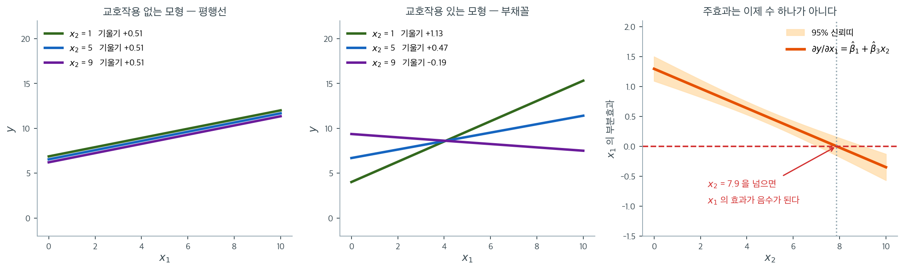

# 교호작용 항

## 1. 왜 교호작용 항을 쓰는가

현실의 많은 상황에서 한 변수가 결과에 미치는 효과는 일정하지 않고 다른 변수에 따라 달라진다. **교호작용 항**은 둘 이상의 독립변수가 종속변수에 미치는 이런 결합 효과를 모형화한다.

교호작용이 자연스럽게 나타나는 예:

- 운동과 식단이 체중 감량에 미치는 효과를 연구할 때, 운동의 영향은 특정 식단을 하는 사람에게서 더 클 수 있다.
- 매출 예측에서 마케팅 캠페인의 효과는 경기 상황이나 계절에 따라 달라질 수 있다.
- 금융에서 금리 변화가 자산 가격에 미치는 효과는 현재의 변동성 국면에 의존할 수 있다.

교호작용이 존재하는데도 모형화하지 않으면, 각 설명변수의 효과가 다른 설명변수의 값과 무관하게 동일하다고 가정하는 셈이므로 회귀 결과가 오도할 수 있다.

---

## 2. 수학적 정식화

두 변수 $X_1$과 $X_2$의 교호작용은 곱항으로 회귀모형에 추가된다.

$$
Y = \beta_0 + \beta_1 X_1 + \beta_2 X_2 + \beta_3 (X_1 \times X_2) + \epsilon
$$

여기서

- $Y$는 종속변수,
- $\beta_1$과 $\beta_2$는 $X_1$과 $X_2$의 **주효과**,
- $\beta_3$은 $X_1$과 $X_2$ 사이의 **교호작용 효과**,
- $\epsilon$은 오차항이다.

항 $X_1 \times X_2$가 교호작용을 포착한다. $X_1$이 $Y$에 미치는 부분효과는 더 이상 상수 $\beta_1$이 아니라 $\beta_1 + \beta_3 X_2$가 되어 $X_2$의 수준에 의존한다.

!!! note "주효과를 함께 넣기"
    교호작용 항을 포함할 때는 대응하는 두 주효과($X_1$과 $X_2$)도 일반적으로 모형에 남겨야 한다. 교호작용을 넣으면서 주효과를 빼면 계수가 편향되고 해석할 수 없게 된다.

---

## 3. 교호작용 항의 해석

$\beta_3$의 부호와 크기가 교호작용의 성격을 정한다.

- **양의 교호작용 계수 ($\beta_3 > 0$)**: 두 설명변수가 함께 증가할 때 $Y$에 미치는 결합 효과가 각각의 효과를 더한 것보다 **크다**. 두 설명변수가 서로를 강화한다.

- **음의 교호작용 계수 ($\beta_3 < 0$)**: 두 설명변수의 결합 효과가 각각의 효과를 더한 것보다 **작다**. 한 설명변수가 다른 쪽의 효과를 억누른다.

- **교호작용이 0 ($\beta_3 = 0$)**: $X_1$이 $Y$에 미치는 효과가 $X_2$에 의존하지 않는다. 모형은 교호작용이 없는 가법모형으로 줄어든다.

교호작용 항이 통계적으로 유의하다는 것은 한 변수와 결과의 관계가 다른 변수에 따라 달라진다는 뜻이다.



$\beta_1 + \beta_3 X_2$라는 식이 그림으로는 무엇인지 보자. 참 모형이 $y = 2 + 1.5x_1 + 0.8x_2 - 0.18\,x_1x_2 + \varepsilon$인 자료 $400$개를 만들고 두 가지로 적합했다.

왼쪽은 교호작용 항을 빼고 적합한 가법모형이다. $x_2$를 $1, 5, 9$로 고정하고 $y$ 대 $x_1$을 그리면 **세 직선이 완벽하게 평행하다.** 기울기가 셋 다 $+0.51$이다. 가법모형은 구조상 그럴 수밖에 없다. $x_2$는 직선을 위아래로 옮기기만 할 뿐 기울기를 건드릴 수 없기 때문이다. 오른쪽은 곱항 $x_1x_2$를 넣은 모형이고, 같은 세 수준에서 직선들이 한 점에서 **부챗살처럼 벌어진다.** 기울기가 $x_2 = 1$에서 $+1.13$, $x_2 = 5$에서 $+0.47$, $x_2 = 9$에서 $-0.19$다. $x_2$가 낮을 때 $x_1$을 늘리면 $y$가 오르지만, $x_2$가 높으면 오히려 내려간다. 가법모형의 $+0.51$은 이 셋을 하나로 뭉갠 평균값이었던 셈이다.

추정된 계수는 $\hat\beta_1 = 1.295$, $\hat\beta_3 = -0.165$로 참값 $1.5$, $-0.18$에 가깝다. 여기서 **$\hat\beta_1 = 1.295$를 "$x_1$의 효과"라고 읽으면 안 된다**는 점이 결정적이다. 그것은 $x_2 = 0$일 때의 기울기일 뿐이며, $x_2$가 $0$을 취하지 않는 자료라면 아무 데도 해당하지 않는 수다. 교호작용 모형에서 주효과 계수는 "상대가 $0$인 지점의 기울기"라는 아주 좁은 뜻을 가진다.

그래서 오른쪽 세 번째 칸처럼 **부분효과 자체를 그리는 것**이 표준적인 보고 방식이다. 가로축이 $x_2$, 세로축이 $\partial y/\partial x_1 = \hat\beta_1 + \hat\beta_3 x_2$이고, 주황 띠가 그 추정의 95% 신뢰띠다. 직선이 $x_2 = 7.87$에서 $0$을 지나므로, 그 너머에서는 $x_1$을 늘리는 것이 오히려 해가 된다. 표에 적힌 계수 네 개로는 이 문턱을 곧바로 읽을 수 없지만 그림에서는 한눈에 보인다. 참고로 $R^2$은 가법모형 $0.169$에서 교호작용 모형 $0.306$으로 올랐다. 곱항 하나가 설명력의 절반 가까이를 더 가져온 것이다.

---

<div class="exbox" markdown>

**보기 1.** <span class="diff easy" title="쉬움"></span> 공부 시간, 수면, 성적. 공부 시간과 수면이 학생의 시험 성적에 미치는 효과를 연구한다고 하자. 교호작용 항이 없으면 모형은 학생이 얼마나 자든 공부 시간 추가의 이득이 동일하다고 가정한다.

공부 시간과 수면의 교호작용 항은 수면이 부족할 때 공부 시간 추가의 이득이 **줄어든다**는 사실을 드러낼 수 있다. 형식적으로 쓰면

</div>

??? success "풀이"
    $$
    \text{Score} = \beta_0 + \beta_1 \cdot \text{StudyHours} + \beta_2 \cdot \text{Sleep} + \beta_3 \cdot (\text{StudyHours} \times \text{Sleep}) + \epsilon
    $$

    $\beta_3 > 0$이면 잠을 더 잘수록 공부의 이득이 커진다. $\beta_3 < 0$이면 적게 자는 학생에게는 공부를 더 해도 수익체감이 나타난다.

<div class="exbox" markdown>

**보기 2.** <span class="diff easy" title="쉬움"></span> 교호작용 항. 아래 두 보기에서 쓸 자료를 읽는다. ISLR 교재의 Advertising(시장 200곳)과 Credit(400명)이다.

**(1)** Credit 자료에서 학생의 평균 잔액이 비학생보다 $396$ 달러 높은데 소득은 $2.3$ 밖에 높지 않다. 이 차이를 소득으로 설명할 수 있는가. 그리고 **학생이 몇 명인지** 세어 보기 4 의 추론에 무엇을 예고하는지 말하시오.

**(2)** Advertising 자료에서 곱항 `TV × Radio` 가 가질 수 있는 **값의 범위**를 요약표의 수로 계산하시오. 그것이 보기 3 의 계수를 읽을 때 왜 중요한가.

</div>

??? success "풀이"

    **유도할 식이 없는 보기다.** 자료를 읽어 들이는 것이 전부이므로, 요약표에서 읽히는 수와 아래에서 쓰일 수를 따라간다.

    두 보기에서 쓸 자료를 먼저 읽는다. ISLR 교재의 Advertising과 Credit이다.

    ```python
    import pandas as pd

    # Advertising: 광고비(TV, Radio, Newspaper)와 매출(Sales), 200개 시장
    advertising = pd.read_csv("https://www.statlearning.com/s/Advertising.csv",
                              index_col=0)
    advertising = advertising.rename(columns={"radio": "Radio",
                                              "newspaper": "Newspaper",
                                              "sales": "Sales"})

    # Credit: 신용카드 잔액(Balance)과 소득(Income), 학생 여부(Student), 400명
    credit = pd.read_csv("https://raw.githubusercontent.com/vincentarelbundock/"
                         "Rdatasets/1dcc2bf5f955cc1224a3e1307256e1fe86b68dae/csv/ISLR/Credit.csv", index_col=0)

    print(advertising[["TV", "Radio", "Sales"]].describe().round(2).to_string())
    print()
    print(credit.groupby("Student")[["Income", "Balance"]].mean().round(2).to_string())
    ```

    출력:

    ```
               TV   Radio   Sales
    count  200.00  200.00  200.00
    mean   147.04   23.26   14.02
    std     85.85   14.85    5.22
    min      0.70    0.00    1.60
    25%     74.38    9.98   10.38
    50%    149.75   22.90   12.90
    75%    218.82   36.52   17.40
    max    296.40   49.60   27.00

             Income  Balance
    Student                 
    No        44.99   480.37
    Yes       47.29   876.82
    ```

    요약표가 말하지 않는 두 가지를 더 센다.

    ```python
    print("Credit 의 학생 수:", credit['Student'].value_counts().to_dict())
    tab = credit.groupby("Student")[["Income", "Balance"]].agg(['count', 'mean', 'std'])
    print(tab.round(2).to_string())
    print(f"Income 의 범위: {credit['Income'].min():.2f} ~ {credit['Income'].max():.2f}")
    print(f"Balance 가 0 인 사람: {(credit['Balance'] == 0).sum()}명")
    print(f"TV x Radio 의 범위: {(advertising['TV'] * advertising['Radio']).min():.2f} ~ "
          f"{(advertising['TV'] * advertising['Radio']).max():.2f}")
    print(f"요약표의 최댓값으로 셈하면 296.40 x 49.60 = {296.40 * 49.60:.2f}")
    ```

    출력:

    ```
    Credit 의 학생 수: {'No': 360, 'Yes': 40}
            Income               Balance                
             count   mean    std   count    mean     std
    Student                                             
    No         360  44.99  34.91     360  480.37  439.41
    Yes         40  47.29  38.55      40  876.82  490.00
    Income 의 범위: 10.35 ~ 186.63
    Balance 가 0 인 사람: 90명
    TV x Radio 의 범위: 0.00 ~ 13540.41
    요약표의 최댓값으로 셈하면 296.40 x 49.60 = 14701.44
    ```

    **(1) 소득으로는 설명되지 않는다.** 학생의 평균 소득이 $47.29$, 비학생이 $44.99$ 로 차이가 $2.30$(천 달러)이다. 소득의 표준편차가 $35$ 쯤이니 **$0.07$ 표준편차**에 지나지 않는다. 그런데 잔액의 차이는 $396.45$ 달러로, 잔액 표준편차 $440$ 의 $0.9$ 배다. **소득 차이가 $0.07$ 표준편차인데 잔액 차이가 $0.9$ 표준편차**이니 소득은 범인이 아니다.

    보기 4 가 이것을 수로 확인해 준다. 소득을 통제하고 나면 학생 더미의 계수가 $477$ 달러로 **오히려 커진다.** 학생이 소득이 조금 더 높았으므로, 소득을 맞춰 놓으면 차이가 더 벌어지는 것이다.

    **학생은 40 명이다.** 전체 $400$ 명의 $10\%$ 다. 이것이 보기 4 의 결과를 미리 설명한다. 교호작용 계수는 "두 집단의 기울기 차이" 이므로 그 정밀도가 **적은 쪽 집단의 크기**에 묶인다. $40$ 명으로 추정한 기울기는 거칠 수밖에 없고, 따라서 교호작용의 $p$-값이 클 것이다. **표본이 $400$ 이라고 해서 교호작용을 잴 표본도 $400$ 인 것은 아니다.**

    한 가지 더 눈에 둘 것은 **잔액이 정확히 $0$ 인 사람이 $90$ 명**이라는 점이다. 전체의 $22.5\%$ 가 한 값에 몰려 있다. 카드를 쓰지 않는 사람들이고, 연속변수를 가정하는 회귀가 다루기 어려운 꼴이다. 왼쪽이 $0$ 에서 잘린 자료이므로 잔차의 정규성이 깨질 것을 예상할 수 있다.

    **(2) 곱항은 0 에서 13,540 까지 간다.** 요약표의 최댓값만으로 셈하면 $296.40 \times 49.60 = 14{,}701$ 이지만, 그것은 TV 와 Radio 가 **동시에** 최대인 시장이 있을 때의 상한이다. 실제 최댓값은 $13{,}540.41$ 로 그보다 조금 작다. 최솟값은 Radio 가 $0$ 인 시장이 있으므로 $0$ 이다.

    이것이 중요한 까닭은 **계수의 크기가 변수의 눈금에 반비례**하기 때문이다. 보기 3 에서 `TV:Radio` 의 계수가 $0.0011$ 로 나오는데, 그것을 "거의 $0$ 이니 효과가 없다" 고 읽으면 완전히 틀린다. 그 변수가 $10^4$ 규모로 움직이므로 기여가

    $$
    0.001086 \times 13{,}540 = 14.7
    $$

    까지 간다. 매출의 평균이 $14.02$, 표준편차가 $5.22$ 이니 **매출 전체 규모만큼의 기여**다.

    그러므로 계수의 절대값으로 효과를 견주어서는 안 된다. 견줄 것은 $t$ 값이거나, 변수를 표준화한 뒤의 계수이거나, "설명변수가 실제로 움직이는 범위에서 반응이 얼마 움직이는가" 다. Advertising 은 시장 $200$ 곳의 광고비와 매출, Credit 은 $400$ 명의 소득과 잔액이다.
<div class="exbox" markdown>

**보기 3.** <span class="diff easy" title="쉬움"></span> 마케팅 효과 (TV와 Radio). 매출을 TV·Radio 광고비와 그 곱항에 회귀한다.

**(1)** 적합 결과에서 TV 한 단위의 **부분효과**를 Radio 의 함수로 적고, Radio 가 $0$, 평균 $23.26$, 최댓값 $49.6$ 일 때의 값을 구하시오. 그 부분효과가 $0$ 이 되는 Radio 는 자료 안에 있는가.

**(2)** 곱항을 넣은 것이 통계적으로 정당한지 **중첩 $F$ 검정**으로 판정하고, 그 $F$ 가 표의 $t = 20.727$ 과 어떤 관계인지 확인하시오.

</div>

??? success "풀이"

    **(1) 부분효과는 상대의 함수다.** 모형이

    $$
    \text{Sales} = \beta_0 + \beta_1 \text{TV} + \beta_2 \text{Radio} + \beta_3\,\text{TV}\cdot\text{Radio} + \varepsilon
    $$

    이므로 TV 로 미분하면

    $$
    \frac{\partial \text{Sales}}{\partial \text{TV}} = \beta_1 + \beta_3\,\text{Radio}
    $$

    이다. 표의 값 $\hat\beta_1 = 0.0191$, $\hat\beta_3 = 0.001086$ 을 넣으면

    $$
    0.0191 + 0.001086\,\text{Radio}
    $$

    이고, Radio 가 $0$ 이면 $0.0191$, $23.26$ 이면 $0.0444$, $49.6$ 이면 $0.0730$ 이다. **라디오를 많이 쓰는 시장에서 TV 의 효과가 네 배 가까이 커진다.**

    부분효과가 $0$ 이 되는 곳은

    $$
    \text{Radio} = -\frac{\hat\beta_1}{\hat\beta_3} = -\frac{0.0191}{0.001086} = -17.6
    $$

    로 **음수**다. Radio 는 $0$ 이상이므로 자료 안에 그런 자리가 없고, 관측된 전 구간에서 TV 의 효과가 양수다. 앞 절의 그림에서는 부분효과가 자료 안의 $x_2 = 7.87$ 에서 부호를 바꾸었는데, 여기는 그렇지 않다. **교호작용의 부호가 주효과와 같으면 문턱이 자료 밖으로 밀려난다.**

    Radio 쪽도 같은 방식이다. $\partial \text{Sales}/\partial \text{Radio} = \hat\beta_2 + \hat\beta_3 \text{TV}$ 이므로 TV $= 0$ 에서 $0.0289$, 평균 $147.04$ 에서 $0.1886$, 최댓값 $296.4$ 에서 $0.3509$ 다. $12$ 배 차이다.

    **(2) 분자 자유도가 1 인 $F$ 는 $t^2$ 이다.** 곱항을 뺀 가법모형이 곱항을 넣은 모형에 중첩되므로

    $$
    F = \frac{\mathrm{RSS}_{\text{가법}} - \mathrm{RSS}_{\text{교호}}}{\mathrm{RSS}_{\text{교호}}/(n - 4)}
    \;\sim\; F_{1,\,196}
    $$

    이고, 검정하는 가설이 $H_0: \beta_3 = 0$ 으로 표의 $t$ 검정과 **같은 가설**이다. 그러므로

    $$
    F = t^2 = 20.727^2 = 429.6
    $$

    이어야 한다. 그만큼 큰 $F$ 는 어떤 유의수준으로도 기각된다.


    광고 분석의 고전적 예는 TV와 Radio 광고 지출이 매출에 미치는 영향이다. 주효과만 있는 모형은 각 매체가 독립적인 효과를 갖는다고 가정한다.

    $$
    \text{Sales} = \beta_0 + \beta_1 \cdot \text{TV} + \beta_2 \cdot \text{Radio} + \epsilon
    $$

    그러나 **상승효과**가 있을 수 있다. TV와 Radio에 함께 광고하면 각각의 효과를 더한 것보다 더 효과적일 수 있다. 교호작용 항이 이를 포착한다.

    $$
    \text{Sales} = \beta_0 + \beta_1 \cdot \text{TV} + \beta_2 \cdot \text{Radio} + \beta_3 \cdot (\text{TV} \times \text{Radio}) + \epsilon
    $$

    **해석**:

    - $\beta_3 > 0$이면 TV와 Radio 광고를 결합할 때 각 매체가 따로 주는 것을 넘어서는 상승효과가 매출에 생긴다.
    - $\beta_3 < 0$이면 효과가 체감한다. 두 매체에 동시에 많이 쓰는 것은 덜 효율적일 수 있다.

    이 모형은 statsmodels의 식(formula) 문법으로 편리하게 적합할 수 있다.

    ```python
    import statsmodels.formula.api as smf

    # 수식 문법. R 의 것을 그대로 따른다
    # 별표는 주효과와 교호작용을 한꺼번에 넣는다는 뜻이다
    model = smf.ols('Sales ~ TV * Radio', data=advertising).fit()
    # summary()는 실행 날짜와 시각을 함께 찍으므로 계수 표만 인쇄한다.
    print(model.summary().tables[1])
    print(f"R^2 = {model.rsquared:.4f}")
    ```

    출력:

    ```
    ==============================================================================
                     coef    std err          t      P>|t|      [0.025      0.975]
    ------------------------------------------------------------------------------
    Intercept      6.7502      0.248     27.233      0.000       6.261       7.239
    TV             0.0191      0.002     12.699      0.000       0.016       0.022
    Radio          0.0289      0.009      3.241      0.001       0.011       0.046
    TV:Radio       0.0011   5.24e-05     20.727      0.000       0.001       0.001
    ==============================================================================
    R^2 = 0.9678
    ```

    ```python
    b = model.params
    print("계수:", {k: round(v, 6) for k, v in b.items()})
    for r in [0, advertising['Radio'].mean(), 30, advertising['Radio'].max()]:
        print(f"  Radio={r:6.2f}: dSales/dTV = {b['TV'] + b['TV:Radio'] * r:.4f}")
    for t_ in [0, advertising['TV'].mean(), advertising['TV'].max()]:
        print(f"  TV={t_:7.2f}: dSales/dRadio = {b['Radio'] + b['TV:Radio'] * t_:.4f}")
    print(f"dSales/dTV = 0 이 되는 Radio = {-b['TV'] / b['TV:Radio']:.2f}"
          f"   (Radio 의 범위 {advertising['Radio'].min()} ~ {advertising['Radio'].max()})")

    additive = smf.ols('Sales ~ TV + Radio', data=advertising).fit()
    F = (additive.ssr - model.ssr) / (model.ssr / model.df_resid)
    t = model.tvalues['TV:Radio']
    print(f"가법모형 R^2 = {additive.rsquared:.4f},  교호작용 R^2 = {model.rsquared:.4f}")
    print(f"중첩 F = {F:.4f},  t^2 = {t ** 2:.4f},  p = {model.pvalues['TV:Radio']:.3e}")
    ```

    출력:

    ```
    계수: {'Intercept': 6.75022, 'TV': 0.019101, 'Radio': 0.02886, 'TV:Radio': 0.001086}
      Radio=  0.00: dSales/dTV = 0.0191
      Radio= 23.26: dSales/dTV = 0.0444
      Radio= 30.00: dSales/dTV = 0.0517
      Radio= 49.60: dSales/dTV = 0.0730
      TV=   0.00: dSales/dRadio = 0.0289
      TV= 147.04: dSales/dRadio = 0.1886
      TV= 296.40: dSales/dRadio = 0.3509
    dSales/dTV = 0 이 되는 Radio = -17.58   (Radio 의 범위 0.0 ~ 49.6)
    가법모형 R^2 = 0.8972,  교호작용 R^2 = 0.9678
    중첩 F = 429.5905,  t^2 = 429.5905,  p = 2.758e-51
    ```

    **(1)의 세 값이 그대로 나왔다.** $0.0191$, $0.0444$, $0.0730$ 이다. 부분효과가 $0$ 이 되는 Radio 는 $-17.58$ 로 자료 밖이다.

    **(2) $F$ 와 $t^2$ 이 소수 넷째 자리까지 같다.** $429.5905$ 다. $p$-값이 $2.8 \times 10^{-51}$ 이니 곱항이 필요하다는 데 의심의 여지가 없다. 가법모형의 $R^2$ $0.8972$ 가 $0.9678$ 로 올랐고, 남은 설명되지 않은 분산이 $0.1028$ 에서 $0.0322$ 로 **세 분의 일**이 되었다.

    교호작용 항 `TV:Radio` 의 계수가 $0.0011$ 이고 $t = 20.7$ 로 압도적으로 유의하다. TV 와 라디오 광고 사이에 상승효과가 있다는 뜻이다.

    크기를 가늠해 보자. 라디오에 $0$ 을 쓸 때 TV $1$ 단위의 효과는 $0.0191$ 이지만, 라디오에 $30$ 을 쓰면 $0.0191 + 0.001086 \times 30 = 0.0517$ 로 **$2.7$ 배**가 된다. **교호작용이 있으면 주효과를 단독으로 해석할 수 없다**는 말의 뜻이 이것이다.

    한 가지 더. 표에서 `TV:Radio` 의 계수 $0.0011$ 과 표준오차 $5.24 \times 10^{-5}$ 가 유별나게 작다. 곱항의 값이 $0$ 에서 $13{,}540$ 까지 가기 때문이다(보기 2). 계수의 **크기만 보고 효과가 작다고 읽으면 안 된다.** 계수는 변수의 눈금에 반비례하므로, 비교할 것은 계수가 아니라 $t$ 값이거나 "설명변수가 한 표준편차 움직일 때 반응이 얼마 움직이는가" 다.
!!! warning "`statsmodels.api`에는 소문자 `ols`가 없다"
    식 인터페이스는 `statsmodels.formula.api`(관례적으로 `smf`)에 있다. `statsmodels.api`(관례적으로 `sm`)에는 배열을 받는 대문자 `sm.OLS`만 있으므로 `sm.ols(...)`를 호출하면 `AttributeError`가 난다.

<div class="exbox" markdown>

**보기 4.** <span class="diff easy" title="쉬움"></span> 소득과 학생 여부의 교호작용. 신용카드 잔액을 소득, 학생 여부, 그리고 그 곱항에 회귀한다.

**(1)** 적합 결과를 **두 집단의 회귀직선 두 개**로 다시 쓰시오. 두 직선이 만나는 소득은 얼마이며 그 값이 자료 안에 있는가.

**(2)** (1)의 두 직선을 **집단별로 따로 적합**해도 같은 계수가 나와야 한다. 그것을 확인하고, 그렇다면 교호작용 모형을 쓰는 까닭이 무엇인지 말하시오. 교호작용의 $p$-값이 $0.249$ 로 큰 것도 설명하시오.

</div>

??? success "풀이"

    **(1) 두 직선으로 풀어 쓴다.** patsy 가 `No` 를 기준으로 삼았으므로 더미변수는 $S = \mathbf{1}(\text{학생})$ 이고

    $$
    \widehat{\text{Balance}} = \hat\beta_0 + \hat\beta_2 S + (\hat\beta_1 + \hat\beta_3 S)\cdot \text{Income}
    $$

    이다. $S = 0$ 과 $S = 1$ 을 넣으면

    $$
    \text{비학생: } \; 200.62 + 6.22\,\text{Income},
    \qquad
    \text{학생: } \; (200.62 + 476.68) + (6.22 - 2.00)\,\text{Income} = 677.30 + 4.22\,\text{Income}
    $$

    이다. **학생 쪽이 출발점은 $477$ 달러 높고 기울기는 $2.00$ 낮다.**

    두 직선이 만나는 곳은 $\hat\beta_2 + \hat\beta_3\,\text{Income} = 0$, 곧

    $$
    \text{Income} = -\frac{\hat\beta_2}{\hat\beta_3} = \frac{476.6758}{1.9992} = 238.4
    $$

    이다. 자료의 소득 최댓값이 $186.63$ 이므로 **자료 범위 밖**이다. 그러므로 관측된 소득 구간 전체에서 학생의 잔액이 비학생보다 높고, 교차는 외삽일 뿐이다.

    **(2) 같아야 한다.** 더미변수와 그 교호작용을 모두 넣은 모형의 설계행렬은

    $$
    [\,\mathbf{1},\; S,\; \text{Income},\; S \cdot \text{Income}\,]
    $$

    인데, 열을 다시 묶으면 $[\,\mathbf{1}_{\text{비학생}},\; \text{Income}_{\text{비학생}},\; \mathbf{1}_{\text{학생}},\; \text{Income}_{\text{학생}}\,]$ 과 **같은 열공간**을 친다(두 집단의 지시벡터와 그 안의 소득). 그리고 두 집단은 서로 겹치지 않으므로 잔차제곱합이

    $$
    \mathrm{RSS} = \mathrm{RSS}_{\text{비학생}} + \mathrm{RSS}_{\text{학생}}
    $$

    로 쪼개진다. 각 조각이 자기 집단의 계수만 포함하므로 **따로 최소화해도 같은 해**다. 그러므로 계수는 정확히 같아야 한다.

    **다른 것은 표준오차다.** 묶은 모형은 $\sigma^2$ 을 두 집단에서 **하나로** 추정하고($\mathrm{RSS}/(n-4)$), 따로 적합하면 각 집단에서 따로 추정한다. 두 집단의 잔차 퍼짐이 다르면 표준오차가 달라진다.

    **$p$-값이 큰 까닭.** 교호작용 계수 $\hat\beta_3$ 은 "두 기울기의 차이" 이므로 그 정밀도가 **적은 쪽 집단**에 묶여 있다. 학생이 몇 명뿐이면 학생 쪽 기울기가 부정확하고, 차이의 표준오차가 커진다. 보기 2 에서 학생이 몇 명이었는지 확인하면 답이 나온다.


    신용카드 잔액이 소득과 학생 여부에 어떻게 의존하는지 살피는 모형을 생각하자. **질적 변수**(학생: 예/아니오)가 연속변수(소득)와 교호작용할 수 있다.

    $$
    \text{Balance} = \beta_0 + \beta_1 \cdot \text{Income} + \beta_2 \cdot \text{Student} + \beta_3 \cdot (\text{Income} \times \text{Student}) + \epsilon
    $$

    여기서 Student는 1(예) 또는 0(아니오)으로 부호화한다.

    **해석**:

    - $\beta_1$: **학생이 아닌 사람**에게 Income이 Balance에 미치는 효과는 $\beta_1$이다.
    - $\beta_1 + \beta_3$: **학생**에게 Income이 Balance에 미치는 효과는 $\beta_1 + \beta_3$이다.
    - $\beta_3 \neq 0$이면 Income과 Balance의 관계가 **학생 여부에 따라 다르다**.

    이런 교호작용은 서로 다른 집단이 같은 설명변수에 다르게 반응하는지를 드러내며, 세분화와 표적 분석에 결정적인 통찰을 준다.

    ```python
    # 범주형 변수가 든 예
    # statsmodels 는 범주형을 알아서 가변수로 바꾼다
    model = smf.ols('Balance ~ Income + C(Student) + Income:C(Student)',
                    data=credit).fit()
    print(model.summary().tables[1])
    print(f"R^2 = {model.rsquared:.4f}")
    ```

    출력:

    ```
    ============================================================================================
                                   coef    std err          t      P>|t|      [0.025      0.975]
    --------------------------------------------------------------------------------------------
    Intercept                  200.6232     33.698      5.953      0.000     134.373     266.873
    C(Student)[T.Yes]          476.6758    104.351      4.568      0.000     271.524     681.827
    Income                       6.2182      0.592     10.502      0.000       5.054       7.382
    Income:C(Student)[T.Yes]    -1.9992      1.731     -1.155      0.249      -5.403       1.404
    ============================================================================================
    R^2 = 0.2799
    ```

    ```python
    import numpy as np

    pr = model.params
    print("비학생:", f"{pr['Intercept']:.4f} + {pr['Income']:.4f} * Income")
    print("학생  :", f"{pr['Intercept'] + pr['C(Student)[T.Yes]']:.4f} + "
                     f"{pr['Income'] + pr['Income:C(Student)[T.Yes]']:.4f} * Income")
    print(f"두 직선이 만나는 Income = {pr['C(Student)[T.Yes]'] / -pr['Income:C(Student)[T.Yes]']:.2f}"
          f"   (자료의 최댓값 {credit['Income'].max():.2f})")

    # 집단별로 따로 적합한다.
    no = smf.ols('Balance ~ Income', data=credit[credit['Student'] == 'No']).fit()
    yes = smf.ols('Balance ~ Income', data=credit[credit['Student'] == 'Yes']).fit()
    print(f"따로 적합 비학생: 절편 {no.params['Intercept']:.4f}  기울기 {no.params['Income']:.4f}  (n={int(no.nobs)})")
    print(f"따로 적합 학생  : 절편 {yes.params['Intercept']:.4f}  기울기 {yes.params['Income']:.4f}  (n={int(yes.nobs)})")
    print(f"계수의 최대 차이 = "
          f"{max(abs(no.params['Income'] - pr['Income']), abs(yes.params['Income'] - (pr['Income'] + pr['Income:C(Student)[T.Yes]']))):.2e}")
    print(f"잔차표준오차: 묶음 {np.sqrt(model.mse_resid):.2f},  "
          f"비학생 {np.sqrt(no.mse_resid):.2f},  학생 {np.sqrt(yes.mse_resid):.2f}")
    print(f"학생 기울기의 SE: 묶은 모형 쪽은 따로 적합의 {yes.bse['Income']:.4f} 과 다르다")
    print(f"교호작용 t = {model.tvalues['Income:C(Student)[T.Yes]']:.4f},  "
          f"p = {model.pvalues['Income:C(Student)[T.Yes]']:.4f}")
    print(f"교호작용 없는 모형 R^2 = {smf.ols('Balance ~ Income + C(Student)', data=credit).fit().rsquared:.4f},  "
          f"넣은 모형 {model.rsquared:.4f}")
    ```

    출력:

    ```
    비학생: 200.6232 + 6.2182 * Income
    학생  : 677.2990 + 4.2190 * Income
    두 직선이 만나는 Income = 238.44   (자료의 최댓값 186.63)
    따로 적합 비학생: 절편 200.6232  기울기 6.2182  (n=360)
    따로 적합 학생  : 절편 677.2990  기울기 4.2190  (n=40)
    계수의 최대 차이 = 1.78e-14
    잔차표준오차: 묶음 391.62,  비학생 382.59,  학생 468.27
    학생 기울기의 SE: 묶은 모형 쪽은 따로 적합의 1.9452 과 다르다
    교호작용 t = -1.1547,  p = 0.2489
    교호작용 없는 모형 R^2 = 0.2775,  넣은 모형 0.2799
    ```

    **(1)과 (2)가 모두 확인된다.** 두 직선이 $200.62 + 6.22\,\text{Income}$ 과 $677.30 + 4.22\,\text{Income}$ 이고, 집단별로 따로 적합한 계수가 **$10^{-14}$ 까지 같다.** 유도한 열공간 논증 그대로다. 교차점 $238.44$ 는 자료의 최댓값 $186.63$ 밖이다.

    **그러면 왜 묶어서 적합하는가.** 세 가지다.

    첫째, **차이를 검정할 수 있다.** 따로 적합하면 기울기 $6.22$ 와 $4.22$ 라는 두 수를 얻을 뿐이고, 그 차이가 유의한지는 별도 계산이 필요하다. 묶은 모형은 $\hat\beta_3$ 의 $t$ 값을 바로 준다.

    둘째, **$\sigma^2$ 을 한 번만 추정해 자유도를 아낀다.** 두 집단의 잔차표준오차가 $382.59$ 와 $468.27$ 로 비슷하므로 묶는 것이 정당하고, 그 결과 $391.62$ 를 $n - 4 = 396$ 자유도로 추정한다. 따로 적합하면 $358$ 과 $38$ 자유도로 나뉘어 후자가 아주 거칠다.

    셋째, **제약을 걸 수 있다.** 기울기는 같고 절편만 다르다는 모형(`Balance ~ Income + C(Student)`)을 쉽게 적합해 견줄 수 있다.

    **$p = 0.249$ 의 까닭은 학생이 40 명뿐**이라는 것이다. 전체 $400$ 명의 $10\%$ 다. 학생 쪽 기울기의 표준오차가 따로 적합할 때 $1.9452$ 이고, 비학생 쪽은 자료가 아홉 배 많아 훨씬 작다. 두 기울기의 차이를 재는 $\hat\beta_3$ 의 표준오차 $1.731$ 은 거의 전부 학생 쪽에서 온다. 참 차이가 $-2$ 쯤이라 해도 **표준오차가 $1.7$ 이면 $t$ 가 $1.2$ 밖에 안 된다.**

    그러므로 "$p = 0.249$ 이므로 교호작용이 없다" 는 결론은 성립하지 않는다. 옳은 말은 **"학생이 $40$ 명뿐이라 $2.00$ 짜리 차이를 가려낼 검정력이 없다"** 다. $R^2$ 가 $0.2775$ 에서 $0.2799$ 로 올랐으나 이 역시 모수를 하나 더해 반드시 오르는 양이다.

    주효과는 강하다. 학생이라는 것만으로 잔액이 평균 $477$ 달러 높고(`C(Student)[T.Yes]`), 소득이 $1$(천 달러) 늘 때마다 $6.22$ 달러 는다. 보기 2 에서 본 "학생 $877$ 달러 대 비학생 $480$ 달러" 라는 $397$ 달러 차이가, 소득을 통제한 뒤에는 **$477$ 달러로 오히려 커진다.** 학생의 소득이 조금 더 높았기 때문이다($47.29$ 대 $44.99$).

    `C(Student)[T.Yes]` 라는 이름은 patsy 가 No 를 기준으로 삼았다는 뜻이다. 기준 수준이 무엇인지 확인하지 않으면 계수의 부호를 거꾸로 읽게 된다.
이런 교호작용을 시각화하면 흔히 기울기가 다른 두 회귀직선(집단마다 하나씩)이 나타나며, Income이 Balance에 미치는 차별적 효과를 보여준다.

---

## 4. 고차 및 다원 교호작용

교호작용은 변수 쌍에만 국한되지 않는다. $X_1$, $X_2$, $X_3$ 사이의 **3원 교호작용**은 다음 형태이다.

$$
Y = \beta_0 + \beta_1 X_1 + \beta_2 X_2 + \beta_3 X_3 + \beta_4 X_1 X_2 + \beta_5 X_1 X_3 + \beta_6 X_2 X_3 + \beta_7 X_1 X_2 X_3 + \epsilon
$$

실무에서 3원 이상의 고차 교호작용은 해석하기 어려워 드물게만 쓴다. 대부분의 응용 연구는 2원 교호작용에 집중한다.

---

## 연습문제

<div class="drillbox" markdown>

**연습문제 1.** <span class="diff med" title="중간"></span>
모형 $Y = \beta_0 + \beta_1 X_1 + \beta_2 X_2 + \beta_3 X_1 X_2 + \varepsilon$에서 $X_1$이 $Y$에 미치는 효과가 $X_2$에 따라 어떻게 변하는지의 관점에서 $\beta_3$을 해석하라.

</div>

??? success "풀이"
    $X_1$이 $Y$에 미치는 부분효과는

    $$
    \frac{\partial E[Y]}{\partial X_1} = \beta_1 + \beta_3 X_2
    $$

    따라서 $\beta_3$은 $X_2$가 한 단위 늘어날 때 **$X_1$의 기울기가 변하는 양**을 나타낸다. $\beta_3 > 0$이면 $X_2$가 커질수록 $X_1$이 $Y$에 미치는 효과가 강해진다. $\beta_3 < 0$이면 약해진다. $\beta_3 = 0$이면 $X_2$와 무관하게 $X_1$의 효과가 동일하다(교호작용 없음).

<div class="drillbox" markdown>

**연습문제 2.** <span class="diff med" title="중간"></span>
연봉을 예측하는 모형에 경력, 학위(이진: 0 = 학위 없음, 1 = 학위 있음), 그리고 그 교호작용이 들어 있다. 추정된 식은 $\hat{Y} = 30000 + 2000 X_1 + 10000 X_2 + 1500 X_1 X_2$이다. 학위가 있는 사람과 없는 사람에 대해 회귀식을 따로 쓰고 그 차이를 해석하라.

</div>

??? success "풀이"
    **학위 없음** ($X_2 = 0$): $\hat{Y} = 30000 + 2000 X_1$. 경력 1년 추가마다 연봉이 \$2,000 오른다.

    **학위 있음** ($X_2 = 1$): $\hat{Y} = (30000 + 10000) + (2000 + 1500) X_1 = 40000 + 3500 X_1$. 경력 1년 추가마다 연봉이 \$3,500 오른다.

    교호작용 항(\$1,500)은 학위가 경력의 수익률을 연간 \$1,500만큼 키운다는 뜻이다. 학위 소지자는 출발점도 높고(\$40,000 대 \$30,000) 경력 1년당 얻는 것도 많다(\$3,500 대 \$2,000).

<div class="drillbox" markdown>

**연습문제 3.** <span class="diff med" title="중간"></span>
주효과($X_1$이나 $X_2$)를 빼면서 교호작용 항($X_1 X_2$)은 남겨 두는 것이 일반적으로 부적절한 이유를 설명하라. 이는 어떤 통계적 원칙을 어기는가?

</div>

??? success "풀이"
    이는 **위계 원칙**(주변성 원칙)을 어긴다. 교호작용 항을 포함한다면 그것을 이루는 모든 저차 항도 함께 있어야 한다는 원칙이다.

    교호작용을 남긴 채 주효과를 빼면 남은 항들의 해석이 달라진다. 예를 들어 $Y = \beta_0 + \beta_2 X_2 + \beta_3 X_1 X_2 + \varepsilon$에서 $X_1$을 빼면, 모형은 $X_2 = 0$일 때 $X_1$의 효과가 0이라고 강제하게 되는데 이는 강하고 대개 정당화되지 않는 제약이다. 또한 교호작용 계수가 $X_2$의 부호화 방식에 의존하게 되어 해석 가능성이 무너진다.

---

## 정리하며

교호작용 항은 한 설명변수의 효과가 다른 설명변수의 수준에 의존하도록 허용함으로써 다중회귀의 틀을 확장한다. 현실의 여러 관계를 정확히 모형화하는 데 필수적이며, 이론이나 분야 지식이 설명변수의 효과가 순수하게 가법적이지 않다고 시사할 때는 반드시 검정해 보아야 한다.
