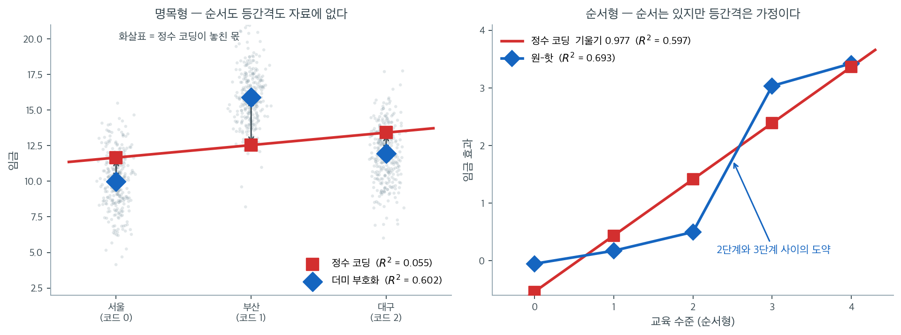

# 범주형 설명변수

회귀식은 설명변수에 **수를 곱한다.**

$$
y=\beta_0+\beta_1x_1+\cdots+\beta_px_p+\varepsilon
$$

그런데 현실의 설명변수에는 도시, 직업, 혈액형, 학력처럼 **수가 아닌 것**이 흔하다. 이런 변수를 회귀에 넣으려면 먼저 수로 바꿔야 하고, **어떻게 바꾸느냐가 모형의 의미를 바꾼다.**

이 절은 그 변환을 다룬다. 결론을 먼저 말하면 이렇다.

> **명목형에 정수를 매기면 안 된다.** 자료에 없는 순서와 간격을 모형에 집어넣게 된다.

## 정수를 그대로 쓰면 무슨 일이 생기는가

세 도시의 임금을 비교한다고 하자. 서울 $=0$, 부산 $=1$, 대구 $=2$로 두고 그대로 회귀에 넣으면 어떻게 되는가.

<div class="exbox" markdown>

**보기 1.** <span class="diff easy" title="쉬움"></span> 명목형에 정수를 매기면. 서울 $=0$, 부산 $=1$, 대구 $=2$로 코딩해 그대로 단순회귀에 넣는다.

**(1)** 정수 코딩의 최소제곱 기울기를 **집단평균 $\bar y_k$ 와 집단크기 $n_k$ 만으로** 나타내고 수치를 구하시오. 이 모형의 $R^2$ 가 $\operatorname{corr}(x, y)^2$ 과 같은 까닭은 무엇인가.

**(2)** 각 집단에 그 집단의 평균을 예측값으로 주는 모형의 잔차제곱합은 **집단내 제곱합** $\text{WSS}$ 다. 정수 코딩의 RSS 와 견주어 **등간격 제약이 낸 손실**을 수로 적으시오.

</div>

??? success "풀이"

    **(1) 해석적으로.** 설명변수가 하나뿐이므로 $\hat\beta_1 = S_{xy}/S_{xx}$ 다. $x$ 가 $\{0, 1, 2\}$ 세 값만 가지므로 합을 집단별로 묶을 수 있다.

    $$
    \bar x = \frac{1}{n}\sum_{k=0}^{2} k\,n_k, \qquad
    S_{xy} = \sum_{k=0}^{2} n_k\,(k - \bar x)(\bar y_k - \bar y), \qquad
    S_{xx} = \sum_{k=0}^{2} n_k\,(k - \bar x)^2
    $$

    둘째 식이 성립하는 까닭은 각 집단 안에서 $x_i - \bar x$ 가 상수 $k - \bar x$ 라서 집단 안의 합이 $\sum_{i \in k}(y_i - \bar y) = n_k(\bar y_k - \bar y)$ 로 줄기 때문이다. **그러므로 정수 코딩의 기울기는 세 집단평균과 세 집단크기만 알면 계산된다.** 개별 관측값은 필요 없다.

    $R^2 = \operatorname{corr}(x, y)^2$ 인 것은 **설명변수가 하나**이기 때문이다. 단순회귀에서만 성립하는 등식이고, 더미를 두 개 쓰는 보기 2에서는 쓸 수 없다.

    **(2) 해석적으로.** 집단별로 상수를 자유롭게 고르는 모형은 각 집단에서 $\sum_{i\in k}(y_i - c_k)^2$ 을 최소화하므로 $c_k = \bar y_k$ 이고, 그 RSS 가 정의상 $\text{WSS} = \sum_k \sum_{i \in k}(y_i - \bar y_k)^2$ 다. 정수 코딩 모형은 그 세 상수를 $\hat\beta_0, \hat\beta_0 + \hat\beta_1, \hat\beta_0 + 2\hat\beta_1$ 로 **등간격이 되도록 묶은** 축소모형이므로

    $$
    \text{RSS}_{\text{정수}} \;\ge\; \text{WSS}
    $$

    이고, 차이 $\text{RSS}_{\text{정수}} - \text{WSS}$ 가 **등간격 제약 때문에 설명하지 못하게 된 몫**이다.

    ```python
    import numpy as np
    import pandas as pd
    from sklearn.linear_model import LinearRegression

    rng = np.random.default_rng(0)
    n = 900

    # 세 도시. 효과에 순서가 없다: 부산이 가장 높고 서울이 가장 낮다.
    city = rng.integers(0, 3, n)
    CITY = ["서울", "부산", "대구"]
    true = np.array([10.0, 16.0, 12.0])
    y = true[city] + rng.normal(0, 2, n)

    print("집단별 표본평균")
    for k, name in enumerate(CITY):
        print(f"  {name}  n={np.sum(city == k):3d}  평균 {y[city == k].mean():7.4f}"
              f"   (참값 {true[k]:.1f})")

    # 정수 코딩: 도시 이름을 0, 1, 2 로 바꿔 넣는다.
    X_int = city.reshape(-1, 1).astype(float)
    m_int = LinearRegression().fit(X_int, y)
    print(f"\n정수 코딩 (서울=0, 부산=1, 대구=2)")
    print(f"  기울기 {m_int.coef_[0]:+.4f}, 절편 {m_int.intercept_:.4f}, "
          f"R^2 {m_int.score(X_int, y):.4f}")
    print(f"  예측값: 서울 {m_int.predict([[0]])[0]:.4f}, "
          f"부산 {m_int.predict([[1]])[0]:.4f}, "
          f"대구 {m_int.predict([[2]])[0]:.4f}")
    ```

    출력:

    ```text
    집단별 표본평균
      서울  n=287  평균  9.9962   (참값 10.0)
      부산  n=286  평균 15.8841   (참값 16.0)
      대구  n=327  평균 11.9519   (참값 12.0)

    정수 코딩 (서울=0, 부산=1, 대구=2)
      기울기 +0.8759, 절편 11.6630, R^2 0.0547
      예측값: 서울 11.6630, 부산 12.5389, 대구 13.4148
    ```

    **세 집단의 참 평균은 10, 16, 12다.** 순서로 보면 서울 $<$ 대구 $<$ 부산이다.

    **정수 코딩은 서울 $<$ 부산 $<$ 대구 순으로 일정하게 오르는 직선을 강요한다.** 기울기 $0.8759$ 하나로 세 집단을 표현해야 하므로, 예측값이 $11.66,\ 12.54,\ 13.41$로 **등간격으로 늘어선다.** 실제 평균 $10.0,\ 15.9,\ 12.0$과 전혀 맞지 않는다.

    **$R^2$가 $0.055$다.** 도시가 임금 분산의 60%를 설명하는 자료인데도(아래에서 확인한다) 5%밖에 잡지 못했다.

    **정수 코딩이 강요하는 두 가지 가정.**

    - **순서**: $0<1<2$이므로 서울, 부산, 대구에 순서가 있다고 선언한 셈이다.
    - **등간격**: 서울$\to$부산의 효과와 부산$\to$대구의 효과가 같다고 선언한 셈이다.

    **둘 다 자료에 없는 정보다.** 도시 이름을 붙이는 순서를 바꾸면 결과가 달라진다는 것이 그 증거다.

    이제 (1)과 (2)의 유도를 수로 확인한다.

    ```python
    # 집단평균과 집단크기만으로 정수 코딩의 기울기를 계산한다.
    counts = np.array([np.sum(city == k) for k in range(3)])
    means = np.array([y[city == k].mean() for k in range(3)])
    codes = np.arange(3.0)
    x_bar, y_bar = (codes * counts).sum() / n, y.mean()
    S_xy = (counts * (codes - x_bar) * (means - y_bar)).sum()
    S_xx = (counts * (codes - x_bar) ** 2).sum()
    print(f"x-bar = {x_bar:.6f},  y-bar = {y_bar:.4f}")
    print(f"S_xy = {S_xy:.4f},  S_xx = {S_xx:.4f}")
    print(f"S_xy / S_xx     = {S_xy / S_xx:.6f}   (sklearn 기울기 {m_int.coef_[0]:.6f})")
    print(f"y-bar - b*x-bar = {y_bar - S_xy / S_xx * x_bar:.6f}   (sklearn 절편 {m_int.intercept_:.6f})")
    print()
    print(f"R^2          = {m_int.score(X_int, y):.6f}")
    print(f"corr(x, y)^2 = {np.corrcoef(city, y)[0, 1] ** 2:.6f}")
    print()
    total_ss = ((y - y_bar) ** 2).sum()
    within_ss = sum(((y[city == k] - means[k]) ** 2).sum() for k in range(3))
    between_ss = (counts * (means - y_bar) ** 2).sum()
    rss_int = ((y - m_int.predict(X_int)) ** 2).sum()
    print(f"총 제곱합 TSS        = {total_ss:.4f}")
    print(f"집단간 BSS           = {between_ss:.4f}   BSS/TSS = {between_ss / total_ss:.6f}")
    print(f"집단내 WSS           = {within_ss:.4f}   (집단평균 모형의 RSS)")
    print(f"정수 코딩의 RSS      = {rss_int:.4f}")
    print(f"등간격 제약이 낸 손실 = {rss_int - within_ss:.4f}  "
          f"(= TSS 의 {(rss_int - within_ss) / total_ss:.4f})")
    ```

    출력:

    ```text
    x-bar = 1.044444,  y-bar = 12.5778
    S_xy = 536.2542,  S_xx = 612.2222
    S_xy / S_xx     = 0.875914   (sklearn 기울기 0.875914)
    y-bar - b*x-bar = 11.662986   (sklearn 절편 11.662986)

    R^2          = 0.054742
    corr(x, y)^2 = 0.054742

    총 제곱합 TSS        = 8580.4087
    집단간 BSS           = 5167.1933   BSS/TSS = 0.602208
    집단내 WSS           = 3413.2155   (집단평균 모형의 RSS)
    정수 코딩의 RSS      = 8110.6959
    등간격 제약이 낸 손실 = 4697.4805  (= TSS 의 0.5475)
    ```

    **(1)의 유도가 소수 여섯째 자리까지 맞는다.** 집단평균 세 개와 집단크기 세 개, 모두 여섯 개의 수로 계산한 $S_{xy}/S_{xx} = 0.875914$ 가 `sklearn` 이 $900$ 개 관측값으로 구한 기울기와 같고, 절편도 $11.662986$ 으로 같다. $R^2$ 와 $\operatorname{corr}(x,y)^2$ 도 $0.054742$ 로 같다.

    기울기가 양수로 나온 **까닭**도 이 식에서 읽힌다. $\bar x = 1.0444$ 이므로 $k - \bar x$ 는 서울 $-1.044$, 부산 $-0.044$, 대구 $+0.956$ 이다. 집단평균의 편차는 서울 $-2.58$, 부산 $+3.31$, 대구 $-0.63$ 이다. 곱해 더하면 서울 항이 $287 \times (-1.0444) \times (-2.5816) = +773.8$ 로 **크게 양수**가 되고, 이것이 부산 항의 작은 음수($-42.0$)와 대구 항의 음수($-195.6$)를 압도해 합이 $+536.25$ 가 된다. 곧 **"서울이 코드도 작고 임금도 낮다"는 사실 하나가 기울기의 부호를 정했다.** 부산이 가장 높다는 정보는 $k - \bar x \approx 0$ 때문에 거의 반영되지 않는다. 코딩 순서를 바꾸면 이 계산이 전부 달라진다.

    **(2)의 손실이 $4697.48$ 이다.** 총 제곱합 $8580.41$ 의 $54.75\%$ 다. 집단평균 모형은 RSS 를 $3413.22$ 까지 내리는데 정수 코딩은 $8110.70$ 에서 멈추므로, **등간격 제약 하나가 자료의 변동 절반 이상을 설명 못 하게 만든다.** 이것이 $R^2$ 가 $0.6022$ 에서 $0.0547$ 로 떨어진 내용이다. 실제로 $0.602208 - 0.054742 = 0.547466$ 이 위 비율과 같다.

    요점을 바꿔 말하면 이렇다. **정수 코딩은 자료를 적게 쓴 것이 아니라 틀린 모양을 강요한 것이다.** 자유도를 하나 아낀 대가가 아니고(집단평균 모형은 모수가 셋, 정수 코딩은 둘이니 하나 차이다), 그 하나를 **잘못된 방향으로** 묶은 결과다. $\square$

## 더미 부호화와 기준범주

올바른 방법은 **각 수준에 0/1 지시변수를 하나씩** 주는 것이다. 이것을 **더미변수**(dummy variable) 또는 **지시변수**라 한다.

수준이 $k$개면 더미를 $k-1$개 만들고, **빠진 하나를 기준범주**(reference category)로 삼는다.

$$
y=\beta_0+\beta_1 D_{\text{부산}}+\beta_2 D_{\text{대구}}+\varepsilon
$$

여기서 $D_{\text{부산}}$은 부산이면 1, 아니면 0이다. 서울은 두 더미가 모두 0인 경우로 표현되며, 이것이 기준범주다.

<div class="exbox" markdown>

**보기 2.** <span class="diff easy" title="쉬움"></span> 더미 계수는 기준범주와의 차이다. 서울을 기준범주로 삼고 부산·대구 더미 두 개를 넣는다.

**(1)** 절편과 더미 $k-1$ 개만 있는 모형의 최소제곱 적합값이 **각 집단의 표본평균**임을 보이고, 따라서 $\hat\beta_0 = \bar y_{\text{서울}}$, $\hat\beta_j = \bar y_j - \bar y_{\text{서울}}$ 임을 보이시오.

**(2)** 이 모형의 $R^2$ 가 $\text{BSS}/\text{TSS}$ 와 같음을 보이고 $0.6022$ 를 확인하시오. 같은 분해로 일원배치 $F$ 통계량도 계산하시오.

</div>

??? success "풀이"

    **(1) 해석적으로.** 설계행렬의 열이 $\mathbf 1,\ D_{\text{부산}},\ D_{\text{대구}}$ 세 개다. 어떤 관측값 $i$ 의 적합값은

    $$
    \hat y_i = \hat\beta_0 + \hat\beta_1 D_{\text{부산},i} + \hat\beta_2 D_{\text{대구},i}
    $$

    인데, $i$ 가 서울이면 두 더미가 모두 $0$ 이라 $\hat y_i = \hat\beta_0$, 부산이면 $\hat\beta_0 + \hat\beta_1$, 대구면 $\hat\beta_0 + \hat\beta_2$ 다. 곧 **적합값은 집단 안에서 상수**이고, 세 상수 $(c_0, c_1, c_2) = (\hat\beta_0,\ \hat\beta_0+\hat\beta_1,\ \hat\beta_0+\hat\beta_2)$ 는 세 모수와 **일대일 대응**이므로 서로 독립적으로 아무 값이나 가질 수 있다.

    따라서 최소화 문제가 집단별로 쪼개진다.

    $$
    \text{RSS} = \sum_{k=0}^{2}\ \sum_{i \in k}(y_i - c_k)^2
    $$

    각 항은 $c_k$ 하나에만 의존하고, $\sum_{i\in k}(y_i - c)^2$ 는 $c = \bar y_k$ 에서 최소다(미분해 $2\sum_{i\in k}(c - y_i) = 0$). 그러므로 $c_k = \bar y_k$ 이고 되돌리면

    $$
    \hat\beta_0 = \bar y_0 = \bar y_{\text{서울}}, \qquad
    \hat\beta_1 = \bar y_1 - \bar y_0, \qquad
    \hat\beta_2 = \bar y_2 - \bar y_0
    $$

    이다. **더미 부호화는 집단평균을 다시 좌표만 바꿔 적은 것이다.**

    **(2) 해석적으로.** (1)에서 적합값이 $\bar y_k$ 이므로

    $$
    \text{RSS} = \sum_k\sum_{i\in k}(y_i - \bar y_k)^2 = \text{WSS}
    $$

    이고, 분산분석의 제곱합 분해 $\text{TSS} = \text{BSS} + \text{WSS}$ 를 쓰면

    $$
    R^2 = 1 - \frac{\text{RSS}}{\text{TSS}} = 1 - \frac{\text{WSS}}{\text{TSS}} = \frac{\text{BSS}}{\text{TSS}}
    $$

    이다. 같은 두 제곱합을 각자의 자유도로 나누어 비를 만들면 일원배치 $F$ 다.

    $$
    F = \frac{\text{BSS}/(k-1)}{\text{WSS}/(n-k)} = \frac{\text{BSS}/2}{\text{WSS}/(n-3)}
    $$

    ```python
    # 첫 열(서울)을 빼서 서울을 기준범주로 삼는다.
    D = np.eye(3)[city][:, 1:]
    m_d = LinearRegression().fit(D, y)

    print(f"더미 부호화 (기준 = 서울)")
    print(f"  절편 {m_d.intercept_:.4f}  = 서울 평균")
    for k, name in enumerate(CITY[1:], 1):
        print(f"  {name} 더미 계수 {m_d.coef_[k - 1]:+.4f}"
              f"  = {name} 평균 - 서울 평균 "
              f"= {y[city == k].mean() - y[city == 0].mean():+.4f}")
    print(f"  R^2 {m_d.score(D, y):.4f}")
    ```

    출력:

    ```text
    더미 부호화 (기준 = 서울)
      절편 9.9962  = 서울 평균
      부산 더미 계수 +5.8878  = 부산 평균 - 서울 평균 = +5.8878
      대구 더미 계수 +1.9557  = 대구 평균 - 서울 평균 = +1.9557
      R^2 0.6022
    ```

    **$R^2$가 $0.055$에서 $0.602$로 올랐다.** 같은 자료, 같은 변수인데 부호화만 바꾼 결과다.

    **계수의 뜻이 아주 단순하다.**

    | 항 | 값 | 뜻 |
    |---|---|---|
    | 절편 $\beta_0$ | 9.9962 | **기준범주(서울)의 평균** |
    | $\beta_{\text{부산}}$ | $+5.8878$ | 부산 평균 $-$ 서울 평균 |
    | $\beta_{\text{대구}}$ | $+1.9557$ | 대구 평균 $-$ 서울 평균 |

    **더미만 있는 회귀는 집단평균을 그대로 되살린다.** 절편이 기준집단의 평균이고, 각 계수가 기준과의 차이다. 예측값은 $9.9962,\ 15.8841,\ 11.9519$로 표본평균과 정확히 같다.

    !!! note "분산분석과 같은 모형이다"
        범주형 설명변수 하나만 넣은 회귀는 **일원배치 분산분석과 완전히 같은 모형**이다. $F$ 통계량도 같다. 11장에서 분산분석으로 배운 것을 여기서는 회귀의 언어로 적은 것뿐이다.

    **계수에 붙는 $p$값이 묻는 것도 달라진다.** $\beta_{\text{부산}}$의 $p$값은 "부산과 **서울**이 다른가"를 묻지, "부산이 전체 평균과 다른가"를 묻지 않는다. **기준범주가 무엇인지 모르면 계수를 읽을 수 없다.**

    (1)과 (2)의 유도를 수로 확인한다.

    ```python
    # 더미 모형의 예측값이 집단평균인지, R^2 가 BSS/TSS 인지 확인한다.
    from scipy import stats

    fitted = m_d.predict(D)
    print("예측값이 집단평균과 같은가")
    for k, name in enumerate(CITY):
        print(f"  {name}  예측 {fitted[city == k][0]:.6f}   평균 {y[city == k].mean():.6f}"
              f"   차이 {abs(fitted[city == k][0] - y[city == k].mean()):.2e}")
    print(f"  예측값이 집단 안에서 모두 같은가? "
          f"{all(np.ptp(fitted[city == k]) < 1e-12 for k in range(3))}")
    print()
    rss_dummy = ((y - fitted) ** 2).sum()
    print(f"더미 모형의 RSS = {rss_dummy:.4f}   WSS = {within_ss:.4f}"
          f"   차이 {abs(rss_dummy - within_ss):.2e}")
    print(f"R^2 = 1 - RSS/TSS = {1 - rss_dummy / total_ss:.6f}")
    print(f"      BSS/TSS     = {between_ss / total_ss:.6f}")
    print()
    F = (between_ss / 2) / (within_ss / (n - 3))
    print(f"일원배치 F = (BSS/2) / (WSS/(n-3)) = {F:.4f}")
    print(f"  p-값 = {stats.f.sf(F, 2, n - 3):.4g}   (자유도 2, {n - 3})")
    ```

    출력:

    ```text
    예측값이 집단평균과 같은가
      서울  예측 9.996228   평균 9.996228   차이 1.60e-14
      부산  예측 15.884073   평균 15.884073   차이 4.62e-14
      대구  예측 11.951942   평균 11.951942   차이 2.66e-14
      예측값이 집단 안에서 모두 같은가? True

    더미 모형의 RSS = 3413.2155   WSS = 3413.2155   차이 4.55e-13
    R^2 = 1 - RSS/TSS = 0.602208
          BSS/TSS     = 0.602208

    일원배치 F = (BSS/2) / (WSS/(n-3)) = 678.9745
      p-값 = 2.79e-180   (자유도 2, 897)
    ```

    **(1)이 그대로 확인된다.** 세 집단의 예측값이 집단평균과 $10^{-14}$ 안에서 같고, 집단 안에서는 예측값이 **모두 같은 하나의 수**다(`True`). 적합값이 집단평균이라는 것은 근사가 아니라 대수적 항등식이며, 어긋남은 부동소수점 한계다.

    **(2)도 닫힌다.** 더미 모형의 RSS 가 $3413.2155$ 로 보기 1에서 센 WSS 와 같고, $1 - \text{RSS}/\text{TSS}$ 와 $\text{BSS}/\text{TSS}$ 가 모두 $0.602208$ 이다. $F = 678.97$ 에 $p = 2.8\times10^{-180}$ 이니 세 도시의 평균이 같다는 가설은 압도적으로 기각된다. 이 $F$ 는 11장의 일원배치 분산분석이 같은 자료에 주는 값과 **같은 수**다. 분자자유도가 $k - 1 = 2$, 분모자유도가 $n - k = 897$ 인 것도 두 틀에서 같다.

    유의성이 이토록 강한 것은 집단이 큰 덕이다. 집단마다 $300$ 명쯤 있고 집단간 차이가 $5.89$ 인데 집단내 표준편차는 $\sqrt{3413.2155/897} = 1.95$ 다. 효과크기가 **표준편차의 세 배**이니 $900$ 개로 못 잡을 수가 없다. 보기 1의 정수 코딩이 이 신호를 $R^2 = 0.055$ 로 뭉갰다는 것이 그만큼 더 뼈아프다. **신호는 자료에 있었고, 부호화가 그것을 버린 것이다.** $\square$



왼쪽이 보기 1과 보기 2를 한 장에 겹친 것이다. 회색 점 구름이 세 도시의 임금이고, 붉은 정사각형이 정수 코딩의 예측값, 파란 마름모가 더미 부호화의 예측값이다. **파란 마름모는 각 구름의 한가운데에 정확히 앉는다.** 더미 부호화가 집단평균 $9.9962$, $15.8841$, $11.9519$를 그대로 되살리기 때문이다. 반면 붉은 정사각형은 직선 위에 등간격으로 늘어서서 $11.663$, $12.539$, $13.415$가 된다. 부산 구름의 한가운데는 $15.88$인데 예측은 $12.54$이고, 서울 구름의 한가운데는 $9.996$인데 예측은 $11.66$이다. 각 도시마다 그어 놓은 검은 화살표의 길이가 정수 코딩이 놓친 몫이며, 그 길이들이 모여 $R^2$을 $0.602$에서 $0.055$로 끌어내린다.

왜 이런 일이 일어나는지도 그림에 그대로 있다. 붉은 점 세 개는 **한 직선 위에 있어야만 한다.** 기울기 하나로 세 집단을 표현하기로 한 순간, 세 예측값은 $\hat\beta_0,\ \hat\beta_0+\hat\beta_1,\ \hat\beta_0+2\hat\beta_1$로 등간격이 될 수밖에 없다. 참 평균 $10, 16, 12$는 등간격도 아니고 코드 순서대로 오르지도 않으므로, 이 직선은 애초에 자료를 표현할 수 없는 모양이다. 더미 부호화는 계수를 두 개 쓰는 대신 세 점을 **어디에든** 놓을 수 있다.

오른쪽은 뒤에서 다룰 순서형의 경우를 미리 보인 것이다. 교육 수준 다섯 단계의 참 효과는 $0,\ 0.2,\ 0.5,\ 3.0,\ 3.4$로 $2$단계와 $3$단계 사이에서 크게 도약한다. 파란 꺾은선(원-핫)은 그 도약을 그대로 따라가 $0.226,\ 0.552,\ 3.090,\ 3.480$을 되찾지만, 붉은 직선(정수 코딩)은 기울기 $0.977$ 하나로 도약을 평평하게 뭉갠다. $R^2$이 $0.693$ 대 $0.598$로 갈린다. 다만 여기서는 명목형과 달리 정수 코딩도 **방향은 맞힌다.** 순서가 실제로 있기 때문이다. 깨지는 것은 등간격 가정뿐이며, 그래서 손해도 $0.055$ 대 $0.602$만큼 크지는 않다. 순서형에서 정수 코딩이 여전히 선택지로 남아 있는 이유가 이 차이에 있다.

## 더미변수 함정

더미를 $k-1$개가 아니라 $k$개 전부 넣으면 어떻게 되는가. 직관적으로는 더 많은 정보를 주는 것 같지만, 실제로는 **모형이 망가진다.**

<div class="exbox" markdown>

**보기 3.** <span class="diff easy" title="쉬움"></span> 더미를 전부 넣으면 해가 유일하지 않다. 절편과 더미 $3$개를 모두 넣은 설계행렬의 계수와 해를 살펴본다.

**(1)** 벡터 $\mathbf v = (1, -1, -1, -1)^T$ 가 $X$ 의 **영공간**에 있음을 보이고, 영공간의 차원이 $1$ 임을 보이시오. 따라서 모든 최소제곱해가 $\hat b + t\,\mathbf v$ 꼴임을 보이시오.

**(2)** `np.linalg.lstsq` 가 돌려주는 해는 그 직선 위의 **어느 점**인가. 식별되지 않는 것이 개별 계수라면, **식별되는 것**은 무엇인가.

</div>

??? success "풀이"

    **(1) 해석적으로.** $X$ 의 네 열은 $\mathbf 1,\ D_{\text{서울}},\ D_{\text{부산}},\ D_{\text{대구}}$ 다. $i$ 번째 행에서 세 더미 가운데 **정확히 하나**가 $1$ 이므로

    $$
    (X\mathbf v)_i = 1 \cdot 1 + (-1)D_{\text{서울},i} + (-1)D_{\text{부산},i} + (-1)D_{\text{대구},i} = 1 - 1 = 0
    $$

    이다. 모든 $i$ 에서 $0$ 이니 $X\mathbf v = \mathbf 0$, 곧 $\mathbf v \in \mathcal N(X)$ 다. **이것이 바로 본문의 등식 $D_{\text{서울}} + D_{\text{부산}} + D_{\text{대구}} = \mathbf 1$ 을 영벡터 쪽으로 옮겨 적은 것이다.**

    차원을 세려면 계수를 보아야 한다. 세 집단이 모두 비어 있지 않으면 세 더미 열은 서로 직교하는 영 아닌 벡터이므로 **일차독립**이고, $\mathbf 1$ 이 그 합이므로 $\operatorname{rank}(X) = 3$ 이다. 계수-여차원 정리에서

    $$
    \dim \mathcal N(X) = 4 - \operatorname{rank}(X) = 4 - 3 = 1
    $$

    이고, 영공간이 $\mathbf v$ 하나로 생성된다. 최소제곱해는 정규방정식 $X^TX\,b = X^Ty$ 의 해이고, 해집합은 **특수해 하나에 영공간을 더한 아핀 집합**이다. 따라서 모든 해가 $\hat b + t\,\mathbf v$ 꼴이다. 해가 하나가 아니라 **직선 하나만큼** 있다.

    **(2) 해석적으로.** `lstsq` 는 특이값분해에 기반한 유사역행렬을 쓰므로 **최소노름해**를 돌려준다. 곧 $\|\hat b + t\mathbf v\|$ 를 최소로 하는 $t$ 를 고른 것이고, 그 조건은 미분해서

    $$
    \frac{d}{dt}\|\hat b + t\mathbf v\|^2 = 2(\hat b \cdot \mathbf v) + 2t\|\mathbf v\|^2 = 0
    \quad\Longrightarrow\quad
    t = -\frac{\hat b \cdot \mathbf v}{\|\mathbf v\|^2}
    $$

    이므로 **돌려주는 해는 $\mathbf v$ 와 직교한다**($\hat b\cdot\mathbf v = 0$). 여기서는 $\beta_0 - \beta_{\text{서울}} - \beta_{\text{부산}} - \beta_{\text{대구}} = 0$ 이라는 제약이 **본인의 선택도 아닌 채로** 걸리는 셈이다.

    식별되는 것은 **적합값이 결정하는 선형결합**뿐이다. 적합값은 $\beta_0 + \beta_k$ 이므로 세 합 $\beta_0 + \beta_{\text{서울}}$, $\beta_0 + \beta_{\text{부산}}$, $\beta_0 + \beta_{\text{대구}}$ 가 식별되고, 그 차 $\beta_{\text{부산}} - \beta_{\text{서울}}$ 등도 식별된다. **기준범주 부호화가 보고하는 양이 바로 이 차들이다.** 그래서 기준범주를 빼는 것이 임의의 선택이면서도 해를 잃지 않는 선택이다.

    ```python
    full = np.eye(3)[city]                        # 더미 3개 전부
    X_bad = np.column_stack([np.ones(n), full])   # 절편 + 더미 3개
    X_ok = np.column_stack([np.ones(n), full[:, 1:]])

    print(f"절편 + 더미 3개 : 열 {X_bad.shape[1]}개, 계수(rank) "
          f"{np.linalg.matrix_rank(X_bad)}")
    print(f"절편 + 더미 2개 : 열 {X_ok.shape[1]}개, 계수(rank) "
          f"{np.linalg.matrix_rank(X_ok)}")
    print(f"\n더미 3개의 합이 절편 열과 같은가?  "
          f"{np.allclose(full.sum(axis=1), 1.0)}")

    # 해가 유일하지 않다는 것을 직접 보인다.
    b1, *_ = np.linalg.lstsq(X_bad, y, rcond=None)
    shift = np.array([1.0, -1.0, -1.0, -1.0])     # 절편 +1, 더미 전부 -1
    b2 = b1 + shift

    print(f"\n해 1: {np.round(b1, 4)}")
    print(f"해 2: {np.round(b2, 4)}")
    print(f"두 해의 예측이 같은가? {np.allclose(X_bad @ b1, X_bad @ b2)}")
    print(f"잔차제곱합  해1 {np.sum((y - X_bad @ b1) ** 2):.4f}   "
          f"해2 {np.sum((y - X_bad @ b2) ** 2):.4f}")
    ```

    출력:

    ```text
    절편 + 더미 3개 : 열 4개, 계수(rank) 3
    절편 + 더미 2개 : 열 3개, 계수(rank) 3

    더미 3개의 합이 절편 열과 같은가?  True

    해 1: [9.4581 0.5382 6.426  2.4939]
    해 2: [10.4581 -0.4618  5.426   1.4939]
    두 해의 예측이 같은가? True
    잔차제곱합  해1 3413.2155   해2 3413.2155
    ```

    **열이 4개인데 계수가 3이다.** 설계행렬이 **완전공선**이며, 원인은 한 줄로 말할 수 있다.

    $$
    D_{\text{서울}}+D_{\text{부산}}+D_{\text{대구}}=1=\text{절편 열}
    $$

    **세 더미를 더하면 절편 열이 그대로 나온다.** 절편이 이미 담고 있는 정보를 더미들이 한 번 더 담는 것이다.

    **결과는 해의 비유일성이다.** 위 출력에서 계수가 전혀 다른 두 벡터가 **똑같은 예측**과 **똑같은 잔차제곱합**을 준다. 절편을 1 올리고 더미 계수를 모두 1 내리면 예측이 변하지 않기 때문이다.

    **이것이 더미변수 함정**(dummy variable trap)이다. $\beta$를 **해석할 수 없게** 된다 — 어떤 수를 보고해야 할지 정할 방법이 없다.

    **대처는 셋 중 하나다.**

    | 방법 | 내용 |
    |---|---|
    | **기준범주 빼기** | 더미를 $k-1$개만 넣는다. 가장 흔한 방법 |
    | 절편 빼기 | 더미 $k$개를 다 넣되 절편을 없앤다. 계수가 각 집단의 평균이 된다 |
    | 제약 걸기 | 효과 부호화처럼 계수의 합을 0으로 고정한다(연습문제 3) |

    **소프트웨어는 대개 알아서 처리한다.** `statsmodels` 의 `C(city)` 나 `pandas.get_dummies(drop_first=True)` 가 기준범주를 빼 준다. 다만 **직접 설계행렬을 만들 때는 반드시 확인해야** 한다. `numpy.linalg.lstsq` 는 경고 없이 최소노름해를 돌려주므로 문제를 눈치채지 못할 수 있다.

    (1)과 (2)를 수로 확인한다.

    ```python
    # 영공간을 확인하고, lstsq 가 어느 해를 고르는지 본다.
    print(f"X_bad @ shift 의 절대값 최댓값 = {np.abs(X_bad @ shift).max():.2e}"
          f"   (0 이면 shift 가 영공간에 있다)")
    print(f"영공간의 차원 = 열 {X_bad.shape[1]}개 - rank {np.linalg.matrix_rank(X_bad)} = "
          f"{X_bad.shape[1] - np.linalg.matrix_rank(X_bad)}")
    print()
    print(f"해 1 의 노름 = {np.linalg.norm(b1):.6f}")
    print(f"해 2 의 노름 = {np.linalg.norm(b2):.6f}")
    print(f"해 1 과 shift 의 내적 = {b1 @ shift:.2e}   (0 이면 최소노름해다)")
    norms = [(t, np.linalg.norm(b1 + t * shift)) for t in np.linspace(-2, 2, 401)]
    t_best = min(norms, key=lambda p: p[1])[0]
    print(f"노름을 최소로 하는 t = {t_best:.4f}")
    print()
    print("식별되지 않는 것: 개별 계수.  식별되는 것: 절편 + 더미 계수의 합")
    for k, name in enumerate(CITY):
        print(f"  {name}  해1 {b1[0] + b1[k + 1]:.6f}   해2 {b2[0] + b2[k + 1]:.6f}"
              f"   집단평균 {y[city == k].mean():.6f}")
    print()
    print("차이도 식별된다 (기준범주 부호화가 쓰는 양)")
    print(f"  부산 - 서울  해1 {b1[2] - b1[1]:+.6f}   해2 {b2[2] - b2[1]:+.6f}")
    print(f"  대구 - 서울  해1 {b1[3] - b1[1]:+.6f}   해2 {b2[3] - b2[1]:+.6f}")
    ```

    출력:

    ```text
    X_bad @ shift 의 절대값 최댓값 = 0.00e+00   (0 이면 shift 가 영공간에 있다)
    영공간의 차원 = 열 4개 - rank 3 = 1

    해 1 의 노름 = 11.715699
    해 2 의 노름 = 11.885185
    해 1 과 shift 의 내적 = 1.55e-14   (0 이면 최소노름해다)
    노름을 최소로 하는 t = 0.0000

    식별되지 않는 것: 개별 계수.  식별되는 것: 절편 + 더미 계수의 합
      서울  해1 9.996228   해2 9.996228   집단평균 9.996228
      부산  해1 15.884073   해2 15.884073   집단평균 15.884073
      대구  해1 11.951942   해2 11.951942   집단평균 11.951942

    차이도 식별된다 (기준범주 부호화가 쓰는 양)
      부산 - 서울  해1 +5.887845   해2 +5.887845
      대구 - 서울  해1 +1.955714   해2 +1.955714
    ```

    **(1)이 정확히 확인된다.** $X\mathbf v$ 의 절대값 최댓값이 $0$ 이니 반올림조차 없이 영벡터다(세 더미의 합이 정확히 $1$ 이고 모두 $0$ 또는 $1$ 이므로 부동소수점 오차가 생기지 않는다). 영공간의 차원도 $4 - 3 = 1$ 이다.

    **(2) `lstsq` 가 돌려준 해가 최소노름해다.** 내적 $\hat b\cdot\mathbf v$ 가 $1.55\times10^{-14}$ 로 $0$ 이고, $t$ 를 격자로 훑어 노름을 재면 최소가 $t = 0$ 에서 잡힌다. 실제로 해 1 의 노름 $11.715699$ 가 해 2 의 $11.885185$ 보다 작다. **곧 `lstsq` 는 아무 해나 주는 것이 아니라 원점에 가장 가까운 해를 주는데, 이 선택에는 통계적 근거가 없다.** 다른 소프트웨어는 다른 해를 줄 수 있고, 그래서 보고된 계수를 비교할 수가 없다.

    **식별되는 양은 두 해에서 소수 여섯째 자리까지 같다.** 절편과 더미 계수의 합이 세 집단평균 $9.996228$, $15.884073$, $11.951942$ 와 정확히 같고, 차이 $+5.887845$, $+1.955714$ 도 양쪽에서 같다. 이 두 수가 보기 2에서 기준범주 부호화가 보고한 바로 그 계수다.

    그러므로 더미변수 함정의 정체는 **"정보를 잃는 것"이 아니라 "좌표를 정하지 못하는 것"** 이다. 예측도 잔차제곱합도 $R^2$ 도 멀쩡하다. 망가지는 것은 계수의 **해석**뿐이고, 기준범주를 빼는 일은 그 해석할 좌표를 하나 정해 주는 일이다. $\square$

## 순서형은 어떻게 할 것인가

명목형에 정수를 매기면 안 된다는 것은 분명하다. 그런데 **순서형**은 사정이 다르다. "불만족 $<$ 보통 $<$ 만족 $<$ 매우 만족"에는 순서가 **실제로 있다.**

그렇다면 정수 코딩이 괜찮은가. **순서는 맞지만 등간격은 여전히 가정**이라는 것이 답이다. 정수 $0,1,2,3$을 쓰면 "불만족$\to$보통"의 효과와 "만족$\to$매우 만족"의 효과가 **같다**고 선언하게 된다.

$$
\underbrace{0<1<2<3}_{\text{순서: 자료에 있음}}
\qquad
\underbrace{1-0=2-1=3-2}_{\text{등간격: 가정}}
$$

**어느 쪽을 택할지는 절충이다.**

| | 정수 코딩 | 원-핫(더미) |
|---|---|---|
| 모수 개수 | **1개** | $k-1$개 |
| 순서 정보 | **쓴다** | **버린다** |
| 등간격 가정 | **강제** | 없음 |
| 수준이 많을 때 | 유리 | 자유도를 많이 쓴다 |

**원-핫 모형은 "매우 만족"이 "만족"보다 높다는 사실조차 모른다.** 순서를 버리는 대신 어떤 모양이든 표현할 수 있다.

등간격 가정이 깨졌을 때 정수 코딩이 무엇을 놓치는지는 연습문제 1에서 수치로 확인한다.

## 연습문제

<div class="drillbox" markdown>

**연습문제 1.** <span class="diff med" title="중간"></span>
순서형 변수를 회귀에 넣을 때 **정수 코드**를 그대로 쓰는 것과 **원-핫**으로 푸는 것이 어떻게 다른가? 효과가 등간격이 아닐 때 무슨 일이 일어나는지 수치로 보여라.

</div>

??? success "풀이"
    ```python
    import numpy as np
    from sklearn.linear_model import LinearRegression

    rng = np.random.default_rng(1)
    n_edu = 6000
    level = rng.integers(0, 5, n_edu)                 # 교육수준 5단계
    true_edu = np.array([0.0, 0.2, 0.5, 3.0, 3.4])    # 임금 효과 — 등간격이 아니다
    y_edu = true_edu[level] + rng.normal(0, 1, n_edu)

    X_int = level.reshape(-1, 1).astype(float)        # 정수 인코딩
    X_hot = np.eye(5)[level][:, 1:]                   # 원-핫 (기준 범주 제외)

    for name, X in [("정수 인코딩", X_int), ("원-핫 인코딩", X_hot)]:
        m = LinearRegression().fit(X, y_edu)
        print(f"{name:>14}: R^2 {m.score(X, y_edu):.4f}"
              f"   계수 {np.round(m.coef_, 3)}")
    print(f"{'참 효과':>14}: (기준 대비) {np.round(true_edu - true_edu[0], 3)}")
    ```

    ```text
            정수 인코딩: R^2 0.5975   계수 [0.977]
           원-핫 인코딩: R^2 0.6933   계수 [0.226 0.552 3.09  3.48 ]
              참 효과: (기준 대비) [0.  0.2 0.5 3.  3.4]
    ```

    **정수 인코딩은 계수 하나만 준다**($0.977$). "한 단계 오를 때마다 임금이 $0.98$씩 오른다"는 뜻인데, 참 효과는 $0.2, 0.5, 3.0, 3.4$로 **$2$단계와 $3$단계 사이에서 크게 도약한다.** 이 구조가 평균 기울기 하나로 뭉개졌다.

    **원-핫은 각 수준을 따로 추정해 참 효과를 그대로 되찾는다**($0.226, 0.552, 3.09, 3.48$). $R^2$도 $0.598$에서 $0.693$으로 오른다.

    **정수 인코딩이 강제하는 가정은 두 가지다.**

    - **등간격**: 인접한 두 수준의 차이가 모두 같다.
    - **단조성과 선형성**: 효과가 수준에 대해 직선으로 변한다.

    앞 절에서 본 가정이 여기서는 **회귀계수의 형태**로 나타난다.

    **그렇다고 원-핫이 언제나 옳은 것은 아니다.**

    | 상황 | 권장 |
    |---|---|
    | 수준이 적고 자료가 충분하다 | **원-핫** |
    | 수준이 많고(예: $10$단계) 자료가 적다 | 정수 또는 소수의 묶음 |
    | 효과가 정말 단조·선형이라고 믿을 근거가 있다 | 정수 (모수가 적어 유리) |
    | 순서를 보존하면서 유연하게 | 단조 제약 회귀, [스플라인](../splines_gams/generalized_additive_models.md) |

    **원-핫의 대가는 자유도다.** 수준이 $k$개면 $k-1$개의 계수를 추정해야 하고, 순서 정보를 **버린다.** 원-핫 모형은 "매우 만족"이 "만족"보다 높다는 사실조차 모른다.

    **진단하는 법.** 정수 인코딩으로 적합한 뒤 잔차를 수준별로 평균 내 보라. 체계적인 패턴이 남아 있으면 등간격 가정이 깨진 것이다. 위 예에서는 $3$단계 이상에서 잔차가 크게 양수로 나온다. $\square$

<div class="drillbox" markdown>

**연습문제 2.** <span class="diff easy" title="쉬움"></span>
보기 2에서 서울을 기준범주로 삼았다. **기준범주를 바꾸면** 계수가 어떻게 달라지는가? 모형의 무엇이 바뀌고 무엇이 바뀌지 않는지 확인하라.

</div>

??? success "풀이"
    ```python
    print("기준범주를 바꾸면")
    for ref in range(3):
        keep = [k for k in range(3) if k != ref]
        D = np.eye(3)[city][:, keep]
        m = LinearRegression().fit(D, y)
        parts = ", ".join(f"{CITY[k]} {c:+.4f}" for k, c in zip(keep, m.coef_))
        print(f"  기준={CITY[ref]:3s} 절편 {m.intercept_:8.4f} | {parts} "
              f"| R^2 {m.score(D, y):.4f}")

    print("\n어느 기준을 쓰든 예측 집단평균은 같다")
    for ref in range(3):
        keep = [k for k in range(3) if k != ref]
        D = np.eye(3)[city][:, keep]
        m = LinearRegression().fit(D, y)
        mu = {ref: m.intercept_}
        for k, c in zip(keep, m.coef_):
            mu[k] = m.intercept_ + c
        print(f"  기준={CITY[ref]:3s} " +
              ", ".join(f"{CITY[k]} {mu[k]:.4f}" for k in range(3)))
    ```

    ```text
    기준범주를 바꾸면
      기준=서울  절편   9.9962 | 부산 +5.8878, 대구 +1.9557 | R^2 0.6022
      기준=부산  절편  15.8841 | 서울 -5.8878, 대구 -3.9321 | R^2 0.6022
      기준=대구  절편  11.9519 | 서울 -1.9557, 부산 +3.9321 | R^2 0.6022

    어느 기준을 쓰든 예측 집단평균은 같다
      기준=서울  서울 9.9962, 부산 15.8841, 대구 11.9519
      기준=부산  서울 9.9962, 부산 15.8841, 대구 11.9519
      기준=대구  서울 9.9962, 부산 15.8841, 대구 11.9519
    ```

    **바뀌는 것: 절편과 계수의 값·부호.** 기준이 서울일 때 부산 계수는 $+5.89$인데, 기준이 부산이면 서울 계수가 $-5.89$다.

    **바뀌지 않는 것: 적합값, 잔차, $R^2$.** 세 경우 모두 $R^2=0.6022$이고 예측 집단평균이 동일하다.

    **같은 모형을 다른 좌표로 적은 것이기 때문이다.** 기준범주를 고르는 것은 **어느 집단을 원점으로 둘지** 정하는 일이며, 모형이 설명하는 내용 자체는 달라지지 않는다.

    **그래서 기준범주는 해석의 편의로 고른다.**

    - **대조군, 표준 처리, 가장 흔한 범주**를 기준으로 두면 계수가 "표준 대비 효과"로 읽힌다.
    - **표본이 아주 적은 범주는 기준으로 쓰지 않는다.** 모든 계수가 그 범주의 잡음을 함께 짊어지게 된다.

    **주의.** 계수의 $p$값도 기준범주에 따라 달라진다. "부산이 유의하다"는 말은 **"서울과 비교해 유의하다"**는 뜻이지 부산이 특별하다는 뜻이 아니다. 모든 쌍을 비교하려면 [다중검정 보정](../../ch09/multiple_testing/multiple_testing.md)이 필요하다. $\square$

<div class="drillbox" markdown>

**연습문제 3.** <span class="diff med" title="중간"></span>
더미변수 함정을 피하는 또 다른 방법이 **효과 부호화**(effect coding)다. 기준범주를 $-1$로 두어 계수의 합이 $0$이 되게 한다. 이때 절편과 계수가 무엇을 뜻하는지 확인하라.

</div>

??? success "풀이"
    ```python
    # 효과 부호화: 부산 -> (1,0), 대구 -> (0,1), 서울(기준) -> (-1,-1)
    E = np.zeros((n, 2))
    E[city == 1, 0] = 1
    E[city == 2, 1] = 1
    E[city == 0, :] = -1

    m = LinearRegression().fit(E, y)
    group_means = [y[city == k].mean() for k in range(3)]

    print(f"절편 {m.intercept_:.4f}")
    print(f"  세 집단 평균의 평균 {np.mean(group_means):.4f}")
    print(f"계수 {np.round(m.coef_, 4)}   (부산, 대구)")
    print(f"  서울 효과 = -(계수의 합) = {-m.coef_.sum():+.4f}")
    print(f"\n각 집단 평균 - 전체(집단평균의 평균)")
    for k, name in enumerate(CITY):
        print(f"  {name} {group_means[k] - np.mean(group_means):+.4f}")
    ```

    ```text
    절편 12.6107
      세 집단 평균의 평균 12.6107
    계수 [ 3.2733 -0.6588]   (부산, 대구)
      서울 효과 = -(계수의 합) = -2.6145

    각 집단 평균 - 전체(집단평균의 평균)
      서울 -2.6145
      부산 +3.2733
      대구 -0.6588
    ```

    **절편이 집단평균들의 평균**($12.6107$)이다. 더미 부호화에서 절편이 **기준집단의 평균**이었던 것과 다르다.

    **각 계수는 "전체 평균으로부터의 이탈"**이다. 부산이 $+3.27$, 대구가 $-0.66$이고, 빠진 서울의 효과는 **계수 합의 음수**로 복원된다($-2.61$).

    $$
    \alpha_{\text{서울}}+\alpha_{\text{부산}}+\alpha_{\text{대구}}=0
    $$

    **이 제약이 함정을 푸는 방식이다.** 더미 $k$개를 다 쓰지 않고, 합이 0이라는 제약을 걸어 자유도 하나를 줄인다.

    **어느 쪽을 쓸 것인가.**

    | | 더미 부호화 | 효과 부호화 |
    |---|---|---|
    | 절편의 뜻 | 기준집단 평균 | **전체(집단평균의 평균)** |
    | 계수의 뜻 | 기준과의 차이 | **전체와의 차이** |
    | 어울리는 상황 | 대조군이 뚜렷할 때 | **대등한 집단들을 비교할 때** |

    **효과 부호화는 분산분석의 전통적 모수화**($y_{ij}=\mu+\alpha_i+\varepsilon_{ij}$, $\sum\alpha_i=0$)와 정확히 일치한다. 11장에서 본 그 제약이 여기서는 설계행렬의 부호로 나타난 것이다.

    **적합값과 $R^2$은 더미 부호화와 완전히 같다.** 같은 모형의 다른 표현이기 때문이다. $\square$

<div class="drillbox" markdown>

**연습문제 4.** <span class="diff hard" title="어려움"></span>
수준이 아주 많은 범주형 변수(우편번호, 상품 코드처럼 수백 개)를 원-핫으로 풀면 무슨 문제가 생기는가? 수준당 관측값 수를 줄여 가며 확인하고, 대처법을 제시하라.

</div>

??? success "풀이"
    ```python
    import numpy as np
    from sklearn.linear_model import LinearRegression

    rng = np.random.default_rng(3)
    N = 2000
    SIGMA = 3.0

    # 참 효과가 전부 0 이므로, 계수의 제곱평균제곱근이 곧 '0 에서 벗어난 정도'다.
    print(f"관측 {N}개를 K개 수준에 고르게 나눈다 (참 효과는 전부 0)")
    print(f"{'K':>5s}{'수준당 n':>10s}{'모수':>6s}"
          f"{'훈련 R^2':>10s}{'계수 RMS':>10s}")
    for K in [2, 5, 20, 100, 400]:
        g = rng.integers(0, K, N)
        y0 = rng.normal(0, SIGMA, N)          # 집단 효과가 전혀 없는 자료
        D = np.eye(K)[g][:, 1:]
        m = LinearRegression().fit(D, y0)
        rms = np.sqrt((m.coef_ ** 2).mean())
        print(f"{K:>5d}{N / K:>10.1f}{K:>6d}"
              f"{m.score(D, y0):>10.4f}{rms:>10.4f}")
    ```

    ```text
    관측 2000개를 K개 수준에 고르게 나눈다 (참 효과는 전부 0)
        K     수준당 n    모수    훈련 R^2    계수 RMS
        2    1000.0     2    0.0002    0.0913
        5     400.0     5    0.0007    0.1731
       20     100.0    20    0.0091    0.3379
      100      20.0   100    0.0518    0.7033
      400       5.0   400    0.2049    1.5411
    ```

    **참 효과가 전부 0인 자료인데 훈련 $R^2$이 $K$와 함께 커진다.** $K=400$에서 $0.205$다. **순전히 과적합**이며, 모수가 400개면 2000개 관측을 그만큼 잘 맞출 수 있기 때문이다.

    **추정된 계수의 크기도 커진다.** 참값이 전부 0이므로 계수 RMS 는 곧 **0에서 벗어난 정도**인데, 수준당 관측이 5개뿐이면 $1.54$까지 커진다. 잡음을 집단 효과로 오인한 것이다.

    | $K$ | 수준당 $n$ | 훈련 $R^2$ | 계수 RMS |
    |---|---|---|---|
    | 5 | 400 | 0.001 | 0.17 |
    | 100 | 20 | 0.052 | 0.70 |
    | **400** | **5** | **0.205** | **1.54** |

    **문제가 셋이다.**

    1. **과적합**: 모수가 많아 훈련자료를 외운다.
    2. **불안정한 계수**: 수준당 표본이 적어 추정값이 튄다.
    3. **새 수준**: 예측 시점에 훈련자료에 없던 우편번호가 나오면 아예 처리할 수 없다.

    **대처법 넷.**

    | 방법 | 내용 |
    |---|---|
    | **범주 묶기** | 드문 수준을 "기타"로 합친다. 가장 간단하고 흔하다 |
    | **의미 있는 상위 범주로** | 우편번호 $\to$ 시도, 상품코드 $\to$ 대분류 |
    | **정칙화** | 능형회귀로 계수를 0쪽으로 당긴다([18장](../../ch18/index.md)) |
    | **혼합모형·목표 부호화** | 수준별 효과를 임의효과로 두거나 수준별 평균으로 축약한다 |

    **훈련 $R^2$을 믿으면 안 된다는 것이 핵심 교훈이다.** 수준이 많은 범주형을 넣으면 $R^2$은 언제나 오른다. **교차검증**으로 평가해야 과적합이 드러난다([모형 선택](../model_selection/cross_validation.md) 절). $\square$

---

## 정리하며

범주형 설명변수는 **수로 바꿔야 회귀에 들어가고, 바꾸는 방식이 모형의 가정을 정한다.**

- **명목형에 정수를 매기면 안 된다.** 자료에 없는 순서와 등간격을 선언하게 된다. 보기 1에서 $R^2$이 0.055 대 0.602로 갈렸다.
- **더미 부호화가 표준이다.** 수준 $k$개에 더미 $k-1$개를 두고 하나를 기준범주로 삼는다. **절편은 기준집단의 평균, 각 계수는 기준과의 차이**다.
- **더미를 $k$개 다 넣으면 완전공선이 되어 해가 유일하지 않다.** 보기 3에서 계수가 다른 두 해가 같은 예측과 같은 잔차제곱합을 주었다.
- **기준범주를 바꾸면 계수는 바뀌지만 모형은 바뀌지 않는다.** 적합값과 $R^2$이 같다. 계수의 $p$값은 **기준과의 비교**를 묻는다는 점에 주의한다.
- **순서형은 순서가 실재하지만 등간격은 여전히 가정**이다. 정수 코딩은 모수를 아끼고, 원-핫은 어떤 모양이든 표현하는 대신 순서를 버린다.
- **수준이 많으면 원-핫이 과적합을 부른다.** 묶기, 상위 범주화, 정칙화로 대처한다.

범주형 설명변수와 연속형 설명변수가 **상호작용**하면 집단마다 기울기가 달라진다. 이는 [교호작용 항](../interaction_polynomial/interaction_terms.md) 절에서 다룬다.
