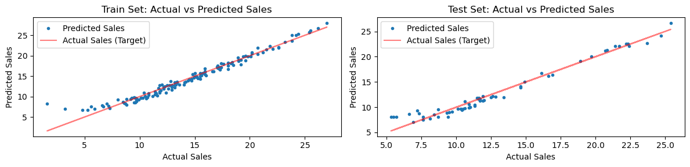
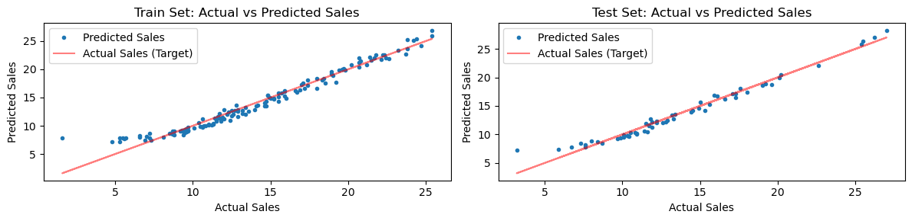
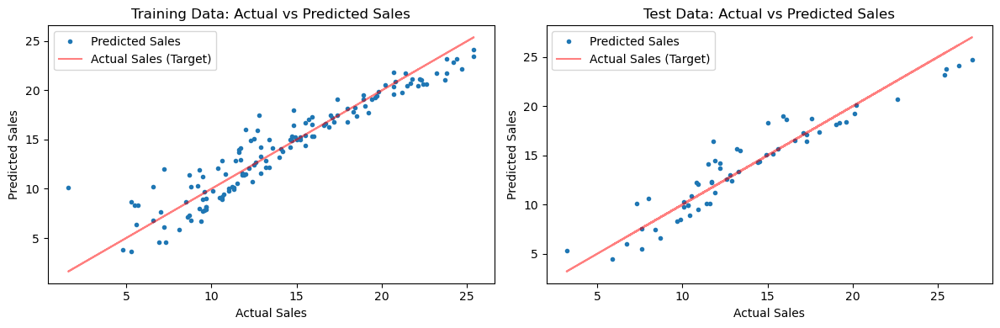

# 다중선형회귀

## 모형

다중선형회귀는 단순선형회귀를 설명변수가 여럿인 경우로 확장한 것이다.

$$
y_i = \beta_0 + \beta_1 x_{i1} + \beta_2 x_{i2} + \cdots + \beta_p x_{ip} + \varepsilon_i
$$

행렬 표기로는 간결하게 다음과 같이 쓸 수 있다.

$$
\mathbf{y} = X\boldsymbol{\beta} + \boldsymbol{\varepsilon}
$$

여기서 $X$는 $n \times (p+1)$ 설계행렬(절편을 위한 1의 열을 포함한다), $\boldsymbol{\beta}$는 $(p+1) \times 1$ 계수벡터, $\boldsymbol{\varepsilon}$는 $n \times 1$ 오차벡터이다.

## 교호작용 항

많은 응용에서 한 설명변수가 반응변수에 미치는 효과는 다른 설명변수의 수준에 따라 달라진다. **교호작용 항**은 이 결합 효과를 포착한다. 예를 들어 설명변수가 TV와 Radio일 때

$$
\hat{y} = \beta_0 + \beta_1 \cdot \text{TV} + \beta_2 \cdot \text{Radio} + \beta_3 \cdot (\text{TV} \times \text{Radio})
$$

교호작용 계수 $\beta_3$이 양수이고 유의하면 **상승효과**가 있다는 뜻이다. 두 설명변수를 함께 썼을 때의 영향이 각각의 효과를 더한 것보다 크다.

## scikit-learn으로 구현하기

### 무작위 훈련-검정 분할

<div class="codebox" markdown>

**예제 1.** 광고 자료로 다중회귀

```python
import pandas as pd
import numpy as np
import matplotlib.pyplot as plt
from sklearn.model_selection import train_test_split
from sklearn.linear_model import LinearRegression

# 광고비와 매출 자료. TV·라디오·신문 광고비와 매출이 들어 있다.
url = 'https://raw.githubusercontent.com/justmarkham/scikit-learn-videos/master/data/Advertising.csv'
df = pd.read_csv(url, usecols=[1, 2, 3, 4])
print(df.head(), end="\n\n")

# 교호작용 항을 만든다. "TV 광고의 효과가 라디오 광고를 얼마나 하느냐에
# 따라 달라진다"는 생각을 두 변수의 곱 하나로 담는 것이다.
df['TV:Radio'] = df['TV'] * df['Radio']
print(df.head(), end="\n\n")

# 자료의 30%를 시험용으로 떼어 둔다. 훈련에 쓴 자료로 성능을 재면
# 언제나 실제보다 좋게 나오기 때문이다.
test_size_ratio = 0.3

# 신문 광고는 뺀다. 뒤에서 보듯 계수가 유의하지 않기 때문이다.
X = df[['TV', 'Radio', 'TV:Radio']]
y = df['Sales']

# random_state 를 고정해야 나눈 결과가 매번 같아진다.
x_train, x_test, y_train, y_test = train_test_split(X, y, test_size=test_size_ratio, random_state=42)
print("x_train.head()")
print(x_train.head(), end="\n\n")
print("y_train.head()")
print(y_train.head(), end="\n\n")

model = LinearRegression()
model.fit(x_train, y_train)

y_train_pred = model.predict(x_train)
y_test_pred = model.predict(x_test)

# 교호작용이 들어가면 TV 계수를 "TV 를 1 늘렸을 때의 효과"로 읽을 수 없다.
# 그 효과가 라디오 값에 따라 달라지기 때문이다.
print(f"Model Intercept: {model.intercept_:.4f}")
print(f"Model Coefficients: {np.round(model.coef_, 4)}\n")

# 실제값 대 예측값 그림. 점들이 붉은 대각선에 붙을수록 잘 맞은 것이다.
# 훈련과 시험을 나란히 놓아 과적합 여부를 함께 본다.
fig, axes = plt.subplots(1, 2, figsize=(12, 3))

for ax, title, y_actual, y_pred in zip(axes, ("Train Set", "Test Set"), (y_train, y_test), (y_train_pred, y_test_pred)):
    ax.set_title(f"{title}: Actual vs Predicted Sales")
    ax.plot(y_actual, y_pred, '.', label="Predicted Sales")
    ax.plot(y_actual, y_actual, '-r', alpha=0.5, label="Actual Sales (Target)")
    ax.set_xlabel('Actual Sales')
    ax.set_ylabel('Predicted Sales')
    ax.legend()

plt.tight_layout()
plt.show()
```

출력:

```
      TV  Radio  Newspaper  Sales
0  230.1   37.8       69.2   22.1
1   44.5   39.3       45.1   10.4
2   17.2   45.9       69.3    9.3
3  151.5   41.3       58.5   18.5
4  180.8   10.8       58.4   12.9

      TV  Radio  Newspaper  Sales  TV:Radio
0  230.1   37.8       69.2   22.1   8697.78
1   44.5   39.3       45.1   10.4   1748.85
2   17.2   45.9       69.3    9.3    789.48
3  151.5   41.3       58.5   18.5   6256.95
4  180.8   10.8       58.4   12.9   1952.64

x_train.head()
        TV  Radio  TV:Radio
169  284.3   10.6   3013.58
97   184.9   21.0   3882.90
31   112.9   17.4   1964.46
12    23.8   35.1    835.38
35   290.7    4.1   1191.87

y_train.head()
169    15.0
97     15.5
31     11.9
12      9.2
35     12.8
Name: Sales, dtype: float64

Model Intercept: 6.3749
Model Coefficients: [0.0206 0.0474 0.001 ]
```



</div>

시장 200곳의 광고비와 매출이다.

### 결정론적 훈련-검정 분할

<div class="codebox" markdown>

**예제 2.** 순서대로 나눈 훈련·시험

```python
import pandas as pd
import numpy as np
import matplotlib.pyplot as plt
from sklearn.linear_model import LinearRegression

# 자료 읽기
url = 'https://raw.githubusercontent.com/justmarkham/scikit-learn-videos/master/data/Advertising.csv'
df = pd.read_csv(url, usecols=[1, 2, 3, 4])

# 교호작용 항을 더한다
df['TV:Radio'] = df['TV'] * df['Radio']

# 앞에서는 무작위로 나눴지만 여기서는 앞 70%, 뒤 30% 로 자른다.
# 자료가 시간 순서로 쌓여 있다면 이쪽이 맞다 — 미래로 과거를 맞히는 일을
# 막아 주기 때문이다.
num_total_observations = df.shape[0]
test_ratio = 0.3
num_train_observations = int(num_total_observations * (1 - test_ratio))

train_data = df.iloc[:num_train_observations]
test_data = df.iloc[num_train_observations:]

x_train = train_data[['TV', 'Radio', 'TV:Radio']]
y_train = train_data['Sales']
x_test = test_data[['TV', 'Radio', 'TV:Radio']]
y_test = test_data['Sales']

# 모형 적합
model = LinearRegression()
model.fit(x_train, y_train)

y_train_pred = model.predict(x_train)
y_test_pred = model.predict(x_test)

print(f"Model Intercept: {model.intercept_:.4f}")
print(f"Model Coefficients: {np.round(model.coef_, 4)}\n")

# 그림으로 확인
fig, axes = plt.subplots(1, 2, figsize=(12, 3))

for ax, title, y_actual, y_pred in zip(axes, ("Train Set", "Test Set"), (y_train, y_test), (y_train_pred, y_test_pred)):
    ax.set_title(f"{title}: Actual vs Predicted Sales")
    ax.plot(y_actual, y_pred, '.', label="Predicted Sales")
    ax.plot(y_actual, y_actual, '-r', alpha=0.5, label="Actual Sales (Target)")
    ax.set_xlabel('Actual Sales')
    ax.set_ylabel('Predicted Sales')
    ax.legend()

plt.tight_layout()
plt.show()
```

출력:

```
Model Intercept: 6.8814
Model Coefficients: [0.0183 0.0229 0.0011]
```



</div>

세 계수가 각각 TV 0.0183, 라디오 0.0229, 신문 0.0011이다. 신문의 계수가 사실상 0이다.

## statsmodels로 구현하기

`statsmodels` 라이브러리는 p값, 신뢰구간, 진단검정을 포함한 풍부한 통계 출력을 제공한다. scikit-learn과의 자세한 비교는 [패키지 비교](../package_usage/comparison.md)를 보라.

### Sales ~ TV + Radio + Newspaper

<div class="codebox" markdown>

**예제 3.** 세 매체를 모두 넣은 모형

```python
import pandas as pd
import statsmodels.formula.api as sm
import matplotlib.pyplot as plt


def print_summary(res):
    """summary()에서 실행 날짜와 시각만 지우고 인쇄한다(재현 가능한 출력을 위해)."""
    lines = []
    for line in str(res.summary()).split("\n"):
        if line.startswith(("Date:", "Time:")):
            lines.append(line[:19].ljust(38) + line[38:])
        else:
            lines.append(line)
    print("\n".join(lines) + "\n")


url = 'https://raw.githubusercontent.com/justmarkham/scikit-learn-videos/master/data/Advertising.csv'
data = pd.read_csv(url, usecols=[1, 2, 3, 4])

num_total_observations = data.shape[0]
test_ratio = 0.3
num_train_observations = int(num_total_observations * (1 - test_ratio))

train_data = data.iloc[:num_train_observations]
test_data = data.iloc[num_train_observations:]

# 세 광고 매체를 모두 넣어 본다. 출력표에서 신문의 p-값을 눈여겨볼 것.
model = sm.ols('Sales ~ TV + Radio + Newspaper', train_data).fit()
print("Model with TV, Radio, and Newspaper as predictors:")
print_summary(model)

train_predictions = model.predict(train_data)
test_predictions = model.predict(test_data)

fig, axes = plt.subplots(1, 2, figsize=(12, 4))

axes[0].set_title("Training Data: Actual vs Predicted Sales")
axes[0].plot(train_data['Sales'], train_predictions, '.', label="Predicted Sales")
axes[0].plot(train_data['Sales'], train_data['Sales'], '-r', alpha=0.5, label="Actual Sales (Target)")
axes[0].set_xlabel('Actual Sales')
axes[0].set_ylabel('Predicted Sales')
axes[0].legend()

axes[1].set_title("Test Data: Actual vs Predicted Sales")
axes[1].plot(test_data['Sales'], test_predictions, '.', label="Predicted Sales")
axes[1].plot(test_data['Sales'], test_data['Sales'], '-r', alpha=0.5, label="Actual Sales (Target)")
axes[1].set_xlabel('Actual Sales')
axes[1].set_ylabel('Predicted Sales')
axes[1].legend()

plt.tight_layout()
plt.show()
```

출력:

```
Model with TV, Radio, and Newspaper as predictors:
                            OLS Regression Results                            
==============================================================================
Dep. Variable:                  Sales   R-squared:                       0.894
Model:                            OLS   Adj. R-squared:                  0.891
Method:                 Least Squares   F-statistic:                     381.2
Date:                                   Prob (F-statistic):           5.60e-66
Time:                                   Log-Likelihood:                -273.89
No. Observations:                 140   AIC:                             555.8
Df Residuals:                     136   BIC:                             567.5
Df Model:                           3                                         
Covariance Type:            nonrobust                                         
==============================================================================
                 coef    std err          t      P>|t|      [0.025      0.975]
------------------------------------------------------------------------------
Intercept      3.0451      0.391      7.782      0.000       2.271       3.819
TV             0.0470      0.002     27.653      0.000       0.044       0.050
Radio          0.1797      0.011     16.665      0.000       0.158       0.201
Newspaper     -0.0030      0.007     -0.428      0.669      -0.017       0.011
==============================================================================
Omnibus:                       50.782   Durbin-Watson:                   2.089
Prob(Omnibus):                  0.000   Jarque-Bera (JB):              131.355
Skew:                          -1.459   Prob(JB):                     3.00e-29
Kurtosis:                       6.741   Cond. No.                         457.
==============================================================================

Notes:
[1] Standard Errors assume that the covariance matrix of the errors is correctly specified.
```



</div>

TV와 라디오의 계수는 강하게 유의하지만 신문은 $p = 0.86$으로 유의하지 않다.

단순회귀에서는 신문 광고도 매출과 상관이 있었는데(0.23) 다중회귀에서는 사라진다. 신문 광고가 라디오 광고와 함께 집행되는 경향이 있어, 라디오를 모형에 넣으면 신문이 따로 설명할 것이 남지 않기 때문이다.

### Sales ~ TV + Radio

<div class="codebox" markdown>

**예제 4.** 신문을 뺀 모형

```python
# 신문을 뺀 모형. R^2 가 거의 줄지 않는다. 신문 광고가 설명하는 몫이
# 사실상 없었다는 뜻이다.
model = sm.ols('Sales ~ TV + Radio', train_data).fit()
print("Model with TV and Radio as predictors:")
print_summary(model)
```

출력:

```
Model with TV and Radio as predictors:
                            OLS Regression Results                            
==============================================================================
Dep. Variable:                  Sales   R-squared:                       0.894
Model:                            OLS   Adj. R-squared:                  0.892
Method:                 Least Squares   F-statistic:                     575.1
Date:                                   Prob (F-statistic):           2.26e-67
Time:                                   Log-Likelihood:                -273.98
No. Observations:                 140   AIC:                             554.0
Df Residuals:                     137   BIC:                             562.8
Df Model:                           2                                         
Covariance Type:            nonrobust                                         
==============================================================================
                 coef    std err          t      P>|t|      [0.025      0.975]
------------------------------------------------------------------------------
Intercept      2.9881      0.367      8.145      0.000       2.263       3.714
TV             0.0471      0.002     27.744      0.000       0.044       0.050
Radio          0.1780      0.010     17.793      0.000       0.158       0.198
==============================================================================
Omnibus:                       49.324   Durbin-Watson:                   2.086
Prob(Omnibus):                  0.000   Jarque-Bera (JB):              122.228
Skew:                          -1.436   Prob(JB):                     2.87e-27
Kurtosis:                       6.564   Cond. No.                         424.
==============================================================================

Notes:
[1] Standard Errors assume that the covariance matrix of the errors is correctly specified.
```

</div>

신문을 뺀 모형이다. $R^2$가 세 변수 모형과 사실상 같다. 신문 광고의 계수가 유의하지 않았던 것과 일치한다.

신문 광고를 뺀 모형이다. $R^2$가 세 변수 모형과 사실상 같다. 신문 광고의 계수가 유의하지 않았던 것과 일치한다.

### Sales ~ TV + Radio + TV:Radio

<div class="codebox" markdown>

**예제 5.** 교호작용을 넣은 모형

```python
# 이번에는 교호작용을 넣는다. statsmodels 의 수식에서 콜론이 교호작용 항이다.
# R^2 가 눈에 띄게 오른다 — 두 매체가 서로를 돕는다는 뜻이다.
model = sm.ols('Sales ~ TV + Radio + TV:Radio', train_data).fit()
print("Model with TV, Radio, and TV:Radio as predictors:")
print_summary(model)
```

출력:

```
Model with TV, Radio, and TV:Radio as predictors:
                            OLS Regression Results                            
==============================================================================
Dep. Variable:                  Sales   R-squared:                       0.965
Model:                            OLS   Adj. R-squared:                  0.964
Method:                 Least Squares   F-statistic:                     1256.
Date:                                   Prob (F-statistic):           6.75e-99
Time:                                   Log-Likelihood:                -195.82
No. Observations:                 140   AIC:                             399.6
Df Residuals:                     136   BIC:                             411.4
Df Model:                           3                                         
Covariance Type:            nonrobust                                         
==============================================================================
                 coef    std err          t      P>|t|      [0.025      0.975]
------------------------------------------------------------------------------
Intercept      6.8814      0.314     21.911      0.000       6.260       7.503
TV             0.0183      0.002      9.275      0.000       0.014       0.022
Radio          0.0229      0.011      2.101      0.038       0.001       0.044
TV:Radio       0.0011   6.71e-05     16.716      0.000       0.001       0.001
==============================================================================
Omnibus:                       93.789   Durbin-Watson:                   2.227
Prob(Omnibus):                  0.000   Jarque-Bera (JB):              767.071
Skew:                          -2.266   Prob(JB):                    2.71e-167
Kurtosis:                      13.534   Cond. No.                     1.84e+04
==============================================================================

Notes:
[1] Standard Errors assume that the covariance matrix of the errors is correctly specified.
[2] The condition number is large, 1.84e+04. This might indicate that there are
strong multicollinearity or other numerical problems.
```

</div>

교호작용을 넣으면 $R^2$가 0.897에서 0.968로 오른다. TV와 라디오가 함께 쓰일 때의 상승효과다.

교호작용을 넣은 모형의 $R^2$가 0.968로 넣지 않은 모형(0.897)보다 훨씬 높다. TV와 라디오가 함께 쓰일 때 상승효과가 있다는 뜻이다.

## statsmodels 출력 읽기

`model.summary()` 출력은 몇 개의 중요한 부분으로 이루어진다.

**모형 요약 부분**

- **R-squared**: 모형이 설명하는 종속변수 분산의 비율.
- **Adj. R-squared**: 설명변수 개수를 반영해 조정한 $R^2$. 불필요한 복잡도에 벌점을 준다.
- **F-statistic과 Prob (F-statistic)**: 모든 계수가 동시에 0인지 검정한다. F 통계량이 크고 p값이 작으면 모형이 전체적으로 유의하다.
- **AIC와 BIC**: 모형 비교를 위한 정보기준. 값이 작을수록 좋은 모형이다.

**계수 표**

- **coef**: 추정된 계수 값.
- **std err**: 추정값의 표준오차.
- **t**: 계수가 0과 다른지 검정하는 t 통계량.
- **P>|t|**: 계수의 p값. 0.05 미만이면 통계적으로 유의하다.
- **[0.025, 0.975]**: 계수의 95% 신뢰구간.

**진단 지표**

- **Omnibus와 Jarque-Bera**: 잔차의 정규성 검정.
- **Durbin-Watson**: 잔차의 자기상관 검정(2에 가까우면 자기상관이 없음을 시사한다).
- **Skew와 Kurtosis**: 잔차 분포의 모양을 기술한다.
- **Condition Number**: 다중공선성의 측도. 30을 넘으면 문제가 있을 수 있다.

## 모형 비교 예제

Advertising 자료에서 세 모형을 비교한다(앞 절과 같이 처음 140개 관측값을 훈련자료로 쓴다).

| 지표 | TV, Radio, Newspaper | TV, Radio | TV, Radio, TV:Radio |
|---|---|---|---|
| **R-squared** | 0.894 | 0.894 | **0.965** |
| **Adj. R-squared** | 0.891 | 0.892 | **0.964** |
| **F-statistic** | 381.2 | 575.1 | **1256** |
| **AIC** | 555.8 | 554.0 | **399.6** |
| **BIC** | 567.5 | 562.8 | **411.4** |
| **유의한 설명변수** | TV, Radio | TV, Radio | TV, Radio, TV:Radio |
| **Condition Number** | 457 | 424 | **1.84e+04** |

이 비교에서 얻는 핵심 발견:

- Newspaper를 빼도 $R^2$가 줄지 않고 AIC/BIC는 오히려 조금 좋아진다. Newspaper가 쓸모 있는 설명변수가 아님을 확인해 준다(그 계수의 $p$값은 0.669이다).
- 교호작용 항 TV:Radio를 넣으면 모형이 크게 좋아진다($R^2$가 0.894에서 0.965로). AIC와 BIC도 대폭 낮아진다.
- 교호작용 모형은 조건수가 $1.84 \times 10^4$로 매우 커서 강한 다중공선성을 시사하며, 이는 계수의 안정성에 영향을 줄 수 있다. 변수 중심화나 정칙화가 도움이 된다.
- 세 모형 모두 잔차의 정규성을 위배하지만, 교호작용 모형의 이탈이 가장 심하다(Jarque-Bera 통계량이 각각 131.4, 122.2, 767.1이고 첨도는 6.74, 6.56, 13.53이다).

예측력 면에서는 **TV, Radio, 교호작용 모형**이 낫고, 해석 가능성과 계수의 안정성이 중요하다면 **TV와 Radio 모형**이 나을 수 있다.

## 연습문제

<div class="drillbox" markdown>

**연습문제 1.** <span class="diff med" title="중간"></span>
다중회귀 $Y = \beta_0 + \beta_1 X_1 + \beta_2 X_2 + \varepsilon$에서 $\beta_1$을 정확히 해석하라. 이 해석은 $Y$를 $X_1$에만 회귀시킨 단순회귀의 기울기와 어떻게 다른가?

</div>

??? success "풀이"
    다중회귀에서 $\beta_1$은 **$X_2$를 고정한 채로**(다른 조건이 같을 때) $X_1$이 한 단위 늘어날 때 기대되는 $Y$의 변화이다. 이는 부분효과, 곧 조건부 효과이다.

    $Y$를 $X_1$에 회귀시킨 단순회귀에서 기울기는 **주변**(무조건) 효과를 포착하며, 여기에는 $X_1$의 직접 효과와 ($X_1$과 $X_2$가 상관되어 있다면) $X_2$를 거치는 간접 효과가 모두 들어 있다. $X_1$과 $X_2$가 상관되어 있으면 단순회귀의 기울기는 누락변수 편향 때문에 부분효과에 대해 편향된 추정이 된다.

<div class="drillbox" markdown>

**연습문제 2.** <span class="diff med" title="중간"></span>
설명변수가 $p = 5$개인 다중회귀에서 $R^2 = 0.85$, 수정 $R^2 = 0.82$이다. 여섯 번째 설명변수를 넣으면 $R^2$가 $0.853$으로 오르지만 수정 $R^2$는 $0.818$로 떨어진다. 여섯 번째 설명변수를 포함해야 하는가? 설명하라.

</div>

??? success "풀이"
    포함하지 않아야 한다. $R^2$가 0.850에서 0.853으로 오른 것은 미미하고(0.3%p), 수정 $R^2$가 0.820에서 0.818로 **떨어졌다**는 것은 새 설명변수가 늘어난 복잡도를 정당화할 만큼 모형을 개선하지 못했다는 뜻이다.

    수정 $R^2$는 설명변수가 추가되는 데 벌점을 준다: $\bar{R}^2 = 1 - (1-R^2)(n-1)/(n-p-1)$. 값이 떨어졌다는 것은 모수 하나를 더 쓴 벌점이 설명분산의 증가분보다 크다는 뜻이다. 새 설명변수는 의미 있는 예측력을 보태지 못하고 있다.

<div class="drillbox" markdown>

**연습문제 3.** <span class="diff med" title="중간"></span>
누락변수 편향의 개념을 설명하라. 참 모형이 $Y = \beta_0 + \beta_1 X_1 + \beta_2 X_2 + \varepsilon$인데 $Y = \gamma_0 + \gamma_1 X_1 + u$를 적합했다면, $\gamma_1$과 $\beta_1$의 관계를 유도하라.

</div>

??? success "풀이"
    $X_2$를 $X_1$에 회귀시킨 계수를 $\delta_1$이라 하자: $X_2 = \delta_0 + \delta_1 X_1 + v$. 그러면 누락변수 편향 공식에서

    $$
    \text{plim}(\hat{\gamma}_1) = \beta_1 + \beta_2 \delta_1
    $$

    편향은 $\beta_2 \delta_1$이며, 다음 두 조건이 모두 성립할 때에만 0이 아니다. (1) $X_2$가 $Y$에 영향을 준다($\beta_2 \neq 0$). (2) $X_2$가 $X_1$과 상관되어 있다($\delta_1 \neq 0$).

    편향의 부호는 곱 $\beta_2 \delta_1$의 부호로 정해진다. 예를 들어 교육($X_2$)이 소득에 양의 영향을 주고($\beta_2 > 0$) 경력과 양의 상관을 가진다면($\delta_1 > 0$), 교육을 빠뜨렸을 때 $\hat{\gamma}_1$은 경력의 참 효과를 과대추정한다.

---

## 정리하며

설명변수가 여럿이면 **행렬로 적는 편이 간결하다.**

$$
\mathbf y=\mathbf X\boldsymbol\beta+\boldsymbol\varepsilon,
\qquad \hat{\boldsymbol\beta}=(\mathbf X^\top\mathbf X)^{-1}\mathbf X^\top\mathbf y
$$

- **0장의 선형대수가 여기서 쓰인다.** 계획행렬, 열공간, 사영, 모자 행렬이 모두 등장하며, 적합값 $\hat{\mathbf y}=\mathbf H\mathbf y$ 가 $\mathbf y$ 를 $\mathrm{Col}(\mathbf X)$ 로 사영한 것이다.
- **계수의 해석이 달라진다.** $\beta_j$ 는 **다른 설명변수를 고정한 채** $x_j$ 가 1 늘 때의 변화이며, 단순회귀의 계수와 값이 다를 수 있다.
- **$(\mathbf X^\top\mathbf X)^{-1}$ 이 존재해야 한다.** 열이 일차종속이면 해가 유일하지 않으며, 거의 종속이면 다중공선성 문제가 된다.
- **설명변수를 더하면 $R^2$ 은 반드시 오른다.** 그래서 조정된 $R^2$ 이나 정보기준이 필요하다.
- **분산분석이 이 틀의 특수한 경우다.** 범주형 설명변수를 더미로 바꾼 회귀가 곧 11장의 분산분석이다.

다음 절 **회귀평면 3D**에서 이 구조를 눈으로 확인한다.
