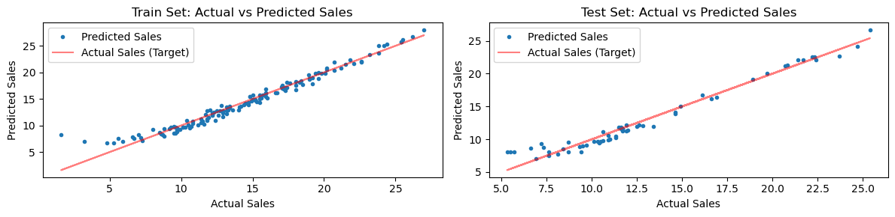
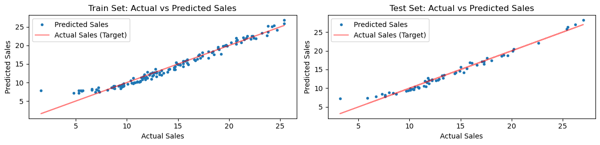
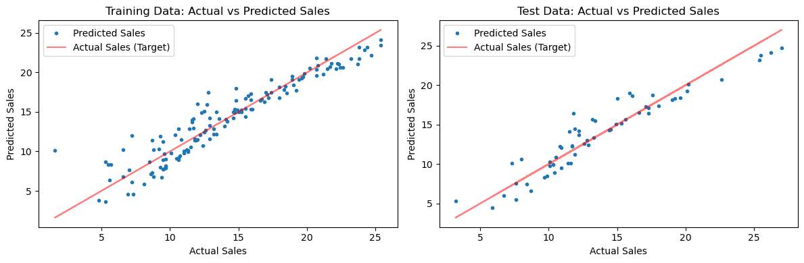

# 다중선형회귀

## 모형

다중선형회귀는 단순선형회귀를 설명변수가 여럿인 경우로 확장한 것이다.

$$
y_i = \beta_0 + \beta_1 x_{i1} + \beta_2 x_{i2} + \cdots + \beta_p x_{ip} + \varepsilon_i
$$

행렬 표기로는 간결하게 다음과 같이 쓸 수 있다.

$$
\mathbf{y} = X\boldsymbol{\beta} + \boldsymbol{\varepsilon}
$$

여기서 $X$는 $n \times (p+1)$ 설계행렬(절편을 위한 1의 열을 포함한다), $\boldsymbol{\beta}$는 $(p+1) \times 1$ 계수벡터, $\boldsymbol{\varepsilon}$는 $n \times 1$ 오차벡터이다.

## 교호작용 항

많은 응용에서 한 설명변수가 반응변수에 미치는 효과는 다른 설명변수의 수준에 따라 달라진다. **교호작용 항**은 이 결합 효과를 포착한다. 예를 들어 설명변수가 TV와 Radio일 때

$$
\hat{y} = \beta_0 + \beta_1 \cdot \text{TV} + \beta_2 \cdot \text{Radio} + \beta_3 \cdot (\text{TV} \times \text{Radio})
$$

교호작용 계수 $\beta_3$이 양수이고 유의하면 **상승효과**가 있다는 뜻이다. 두 설명변수를 함께 썼을 때의 영향이 각각의 효과를 더한 것보다 크다.

## scikit-learn으로 구현하기

### 무작위 훈련-검정 분할

<div class="exbox" markdown>

**보기 1.** <span class="diff easy" title="쉬움"></span> 광고 자료로 다중회귀. `Sales`를 `TV`, `Radio`, 그리고 교호작용 `TV:Radio`에 회귀시킨다. 자료의 30%를 무작위로 떼어 시험용으로 쓴다.

**(1)** 출력의 `Model Coefficients`의 첫 값 $0.0206$을 "TV 광고비를 $1$ 늘리면 매출이 $0.0206$ 늘어난다"로 읽을 수 있는가. $\partial \hat y/\partial \text{TV}$를 계수로 적어 그 해석이 성립하는 조건을 말하시오.

**(2)** 다중회귀에서 $R^2$는 **$y$와 $\hat y$의 상관의 제곱**이다. 단순회귀의 $r^2 = R^2$과 무엇이 다른지 말하고, 이 자료에서 두 값을 계산해 확인하시오.

</div>

??? success "풀이"

    **(1) 그렇게 읽을 수 없다.** 적합된 식은

    $$
    \hat y = \hat\beta_0 + \hat\beta_1 \cdot \text{TV} + \hat\beta_2 \cdot \text{Radio} + \hat\beta_3 \cdot (\text{TV} \times \text{Radio})
    $$

    이므로 TV 에 대한 편미분은

    $$
    \frac{\partial \hat y}{\partial \text{TV}} = \hat\beta_1 + \hat\beta_3 \cdot \text{Radio}
    $$

    이다. **TV 의 효과가 Radio 의 값에 따라 달라진다.** 그러므로 $\hat\beta_1 = 0.0206$은 "TV 를 $1$ 늘릴 때의 효과"가 아니라 **$\text{Radio} = 0$ 일 때의 효과**다. 교호작용이 든 모형에서 주효과 계수는 언제나 "다른 변수가 $0$ 인 자리에서의 기울기"이고, 그 자리가 자료에 거의 없으면 해석할 값이 없는 수가 된다.

    같은 이유로 Radio 계수 $0.0474$도 $\text{TV} = 0$에서의 기울기다. 뒤집어 말하면 **교호작용 모형에서 "TV 의 효과"는 하나의 수가 아니라 Radio 에 대한 함수**다.

    **(2) 단순회귀에서만 $r^2 = R^2$ 이다.** 설명변수가 하나면 $\hat y$가 $x$의 증가 선형함수이거나 감소 선형함수이므로 $\lvert \operatorname{corr}(y, \hat y)\rvert = \lvert \operatorname{corr}(y, x)\rvert$이고 제곱하면 같아진다. 설명변수가 여럿이면 $\hat y$는 여러 열의 선형결합이므로 어느 한 $x_j$와의 상관으로 환원되지 않는다. 그때 $R^2$의 뜻은

    $$
    R^2 = 1 - \frac{\text{RSS}}{\text{TSS}} = \bigl[\operatorname{corr}(y, \hat y)\bigr]^2
    $$

    이고, 이 등식은 절편을 포함한 최소제곱에서 항상 성립한다. 잔차가 $\hat y$와 직교하기 때문이다.

    ```python
    import pandas as pd
    import numpy as np
    import matplotlib.pyplot as plt
    from sklearn.model_selection import train_test_split
    from sklearn.linear_model import LinearRegression

    plt.rcParams["font.family"] = "Apple SD Gothic Neo"
    plt.rcParams["axes.unicode_minus"] = False

    # 광고비와 매출 자료. TV·라디오·신문 광고비와 매출이 들어 있다.
    url = 'https://raw.githubusercontent.com/justmarkham/scikit-learn-videos/8545c74961398def7724501648fd504dbf061b41/data/Advertising.csv'
    df = pd.read_csv(url, usecols=[1, 2, 3, 4])
    print(df.head(), end="\n\n")

    # 교호작용 항을 만든다. "TV 광고의 효과가 라디오 광고를 얼마나 하느냐에
    # 따라 달라진다"는 생각을 두 변수의 곱 하나로 담는 것이다.
    df['TV:Radio'] = df['TV'] * df['Radio']
    print(df.head(), end="\n\n")

    # 자료의 30%를 시험용으로 떼어 둔다. 훈련에 쓴 자료로 성능을 재면
    # 언제나 실제보다 좋게 나오기 때문이다.
    test_size_ratio = 0.3

    # 신문 광고는 뺀다. 뒤에서 보듯 계수가 유의하지 않기 때문이다.
    X = df[['TV', 'Radio', 'TV:Radio']]
    y = df['Sales']

    # random_state 를 고정해야 나눈 결과가 매번 같아진다.
    x_train, x_test, y_train, y_test = train_test_split(X, y, test_size=test_size_ratio, random_state=42)
    print("x_train.head()")
    print(x_train.head(), end="\n\n")
    print("y_train.head()")
    print(y_train.head(), end="\n\n")

    model = LinearRegression()
    model.fit(x_train, y_train)

    y_train_pred = model.predict(x_train)
    y_test_pred = model.predict(x_test)

    # 교호작용이 들어가면 TV 계수를 "TV 를 1 늘렸을 때의 효과"로 읽을 수 없다.
    # 그 효과가 라디오 값에 따라 달라지기 때문이다.
    print(f"Model Intercept: {model.intercept_:.4f}")
    print(f"Model Coefficients: {np.round(model.coef_, 4)}\n")

    # 실제값 대 예측값 그림. 점들이 붉은 대각선에 붙을수록 잘 맞은 것이다.
    # 훈련과 시험을 나란히 놓아 과적합 여부를 함께 본다.
    fig, axes = plt.subplots(1, 2, figsize=(12, 3))

    for ax, title, y_actual, y_pred in zip(axes, ("Train Set", "Test Set"), (y_train, y_test), (y_train_pred, y_test_pred)):
        ax.set_title(f"{title}: Actual vs Predicted Sales")
        ax.plot(y_actual, y_pred, '.', label="Predicted Sales")
        ax.plot(y_actual, y_actual, '-r', alpha=0.5, label="Actual Sales (Target)")
        ax.set_xlabel('Actual Sales')
        ax.set_ylabel('Predicted Sales')
        ax.legend()

    plt.tight_layout()
    plt.show()
    ```

    출력:

    ```
          TV  Radio  Newspaper  Sales
    0  230.1   37.8       69.2   22.1
    1   44.5   39.3       45.1   10.4
    2   17.2   45.9       69.3    9.3
    3  151.5   41.3       58.5   18.5
    4  180.8   10.8       58.4   12.9

          TV  Radio  Newspaper  Sales  TV:Radio
    0  230.1   37.8       69.2   22.1   8697.78
    1   44.5   39.3       45.1   10.4   1748.85
    2   17.2   45.9       69.3    9.3    789.48
    3  151.5   41.3       58.5   18.5   6256.95
    4  180.8   10.8       58.4   12.9   1952.64

    x_train.head()
            TV  Radio  TV:Radio
    169  284.3   10.6   3013.58
    97   184.9   21.0   3882.90
    31   112.9   17.4   1964.46
    12    23.8   35.1    835.38
    35   290.7    4.1   1191.87

    y_train.head()
    169    15.0
    97     15.5
    31     11.9
    12      9.2
    35     12.8
    Name: Sales, dtype: float64

    Model Intercept: 6.3749
    Model Coefficients: [0.0206 0.0474 0.001 ]
    ```

    

    시장 200곳의 광고비와 매출이다. 처음 두 표에서 `TV:Radio` 열이 두 열의 곱으로 만들어졌음을 볼 수 있다($230.1 \times 37.8 = 8697.78$). 교호작용 항은 **새 자료가 아니라 기존 두 열에서 계산된 열**이다.

    (1)과 (2)를 수치로 확인한다.

    ```python
    import numpy as np
    import pandas as pd
    from sklearn.model_selection import train_test_split
    from sklearn.linear_model import LinearRegression

    url = 'https://raw.githubusercontent.com/justmarkham/scikit-learn-videos/8545c74961398def7724501648fd504dbf061b41/data/Advertising.csv'
    df = pd.read_csv(url, usecols=[1, 2, 3, 4])
    df['TV:Radio'] = df['TV'] * df['Radio']
    X = df[['TV', 'Radio', 'TV:Radio']]
    y = df['Sales']
    x_train, x_test, y_train, y_test = train_test_split(X, y, test_size=0.3, random_state=42)
    model = LinearRegression().fit(x_train, y_train)

    b_tv, b_radio, b_inter = model.coef_
    print(f"TV 계수 b1 = {b_tv:.6f},  교호작용 계수 b3 = {b_inter:.8f}")
    print()
    print(f"{'Radio':>8s}{'dSales/dTV = b1 + b3*Radio':>30s}")
    for radio in (0.0, x_train.Radio.mean(), x_train.Radio.max()):
        print(f"{radio:8.3f}{b_tv + b_inter * radio:30.6f}")
    print()
    print(f"훈련 R^2 = {model.score(x_train, y_train):.6f},  시험 R^2 = {model.score(x_test, y_test):.6f}")
    print(f"훈련 RMSE = {np.sqrt(((y_train - model.predict(x_train)) ** 2).mean()):.4f},  "
          f"시험 RMSE = {np.sqrt(((y_test - model.predict(x_test)) ** 2).mean()):.4f}")
    print()
    # 다중회귀에서 R^2 는 y 와 y-hat 의 상관의 제곱이다
    y_hat = model.predict(x_train)
    print(f"corr(y, y-hat)^2 = {np.corrcoef(y_train, y_hat)[0, 1] ** 2:.6f}")
    print(f"TV 하나만 쓴 단순회귀의 r^2 = "
          f"{np.corrcoef(x_train.TV, y_train)[0, 1] ** 2:.6f}")
    ```

    출력:

    ```
    TV 계수 b1 = 0.020610,  교호작용 계수 b3 = 0.00100684

       Radio    dSales/dTV = b1 + b3*Radio
       0.000                      0.020610
      23.525                      0.044295
      49.600                      0.070549

    훈련 R^2 = 0.965903,  시험 R^2 = 0.967327
    훈련 RMSE = 0.9459,  시험 RMSE = 0.9445

    corr(y, y-hat)^2 = 0.965903
    TV 하나만 쓴 단순회귀의 r^2 = 0.573602
    ```

    **TV 의 한계효과가 Radio 에 따라 세 배 넘게 변한다.** Radio 가 $0$ 일 때 $0.0206$, 훈련자료 평균 $23.5$ 일 때 $0.0443$, 최댓값 $49.6$ 일 때 $0.0705$다. 그러므로 $0.0206$ 하나로 "TV 의 효과"를 말하면 라디오 광고를 많이 하는 시장에서 **$3.4$ 배 과소평가**한다. 교호작용이 든 모형에서 주효과 계수만 보고하는 보고서는 이 점에서 틀린다.

    **(2)의 등식도 맞는다.** `corr(y, y-hat)^2 = 0.965903`이 `model.score`가 준 $R^2$와 소수 여섯째 자리까지 같다. 반면 TV 하나만 쓴 단순회귀의 $r^2$은 $0.5736$에 지나지 않는다. **$0.5736$과 $0.9659$의 간격이 "설명변수를 하나 더 넣는 일"의 값이며, 어느 한 변수와 $y$의 상관으로는 이 수를 만들 수 없다.** 단순회귀에서 $r^2 = R^2$였던 등식은 설명변수가 하나라는 사실에 기대고 있었고, 여기서는 쓸 수 없다.

    그림에서 읽을 것은 두 칸의 **흩어짐이 거의 같다**는 사실이다. 훈련 RMSE $0.9459$, 시험 RMSE $0.9445$로 시험이 오히려 아주 조금 작다. 모수가 네 개뿐이고 훈련자료가 $140$개이므로 과적합이 생길 여지가 거의 없다. 다만 왼쪽 아래와 오른쪽 위에서 점들이 빨간 $y = x$ 선 **같은 쪽으로** 치우치는 모양이 보이는데, 이는 뒤에서 볼 잔차의 왜도($-2.27$)와 같은 현상이다. $\square$

### 결정론적 훈련-검정 분할

<div class="exbox" markdown>

**보기 2.** <span class="diff easy" title="쉬움"></span> 순서대로 나눈 훈련·시험. 보기 1과 같은 모형을 쓰지만 무작위 분할 대신 앞 $70\%$를 훈련, 뒤 $30\%$를 시험으로 자른다.

**(1)** 보기 1의 계수와 이 보기의 계수가 다르다. 네 계수의 차이를 각각 **계수의 표준오차** 단위로 재어, 그 차이가 놀랄 만한 크기인지 판정하시오. 어느 분할이 "맞는" 분할인가.

**(2)** 이 보기의 계수가 뒤에 나올 보기 5의 `statsmodels` 출력과 같은지 확인하시오. 두 패키지가 같은 값을 주어야 하는 까닭은 무엇인가.

</div>

??? success "풀이"

    **(1) 해석적으로.** 두 분할은 같은 모집단에서 뽑은 서로 다른 $140$개 표본이므로, 계수가 다른 것은 **추정량의 표본변동**이다. 변동의 자연스러운 척도는 계수의 표준오차 $\widehat{\operatorname{se}}(\hat\beta_j)$이고, 차이를 그것으로 나눈 값이 몇 이내인지를 본다.

    다만 **두 표본이 독립이 아니다.** 무작위 $70\%$와 앞쪽 $70\%$는 상당히 겹친다(두 표본 모두 $140$개이고 전체가 $200$개이므로 겹침이 적어도 $80$개다). 그러므로 "차이/표준오차"는 $t$ 통계량이 아니라 **눈금자**로만 쓴다. 독립 표본이라면 차이의 표준오차가 $\sqrt2\,\widehat{\operatorname{se}}$였을 것이고, 겹치면 그보다 작아진다.

    **(2) 같아야 한다.** `sklearn` 의 `LinearRegression` 과 `statsmodels` 의 `ols` 는 둘 다 **절편이 있는 보통최소제곱**을 푼다. 최소제곱 해는 $X$가 완전계수이면 유일하므로 두 패키지의 답은 수치오차 말고는 같을 수밖에 없다. 다른 것은 **보고하는 것**이다. `sklearn` 은 계수와 예측만 주고, `statsmodels` 은 표준오차·$t$·$p$·신뢰구간·진단까지 준다.

    ```python
    import pandas as pd
    import numpy as np
    import matplotlib.pyplot as plt
    from sklearn.linear_model import LinearRegression

    # 자료 읽기
    url = 'https://raw.githubusercontent.com/justmarkham/scikit-learn-videos/8545c74961398def7724501648fd504dbf061b41/data/Advertising.csv'
    df = pd.read_csv(url, usecols=[1, 2, 3, 4])

    # 교호작용 항을 더한다
    df['TV:Radio'] = df['TV'] * df['Radio']

    # 앞에서는 무작위로 나눴지만 여기서는 앞 70%, 뒤 30% 로 자른다.
    # 자료가 시간 순서로 쌓여 있다면 이쪽이 맞다 — 미래로 과거를 맞히는 일을
    # 막아 주기 때문이다.
    num_total_observations = df.shape[0]
    test_ratio = 0.3
    num_train_observations = int(num_total_observations * (1 - test_ratio))

    train_data = df.iloc[:num_train_observations]
    test_data = df.iloc[num_train_observations:]

    x_train = train_data[['TV', 'Radio', 'TV:Radio']]
    y_train = train_data['Sales']
    x_test = test_data[['TV', 'Radio', 'TV:Radio']]
    y_test = test_data['Sales']

    # 모형 적합
    model = LinearRegression()
    model.fit(x_train, y_train)

    y_train_pred = model.predict(x_train)
    y_test_pred = model.predict(x_test)

    print(f"Model Intercept: {model.intercept_:.4f}")
    print(f"Model Coefficients: {np.round(model.coef_, 4)}\n")

    # 그림으로 확인
    fig, axes = plt.subplots(1, 2, figsize=(12, 3))

    for ax, title, y_actual, y_pred in zip(axes, ("Train Set", "Test Set"), (y_train, y_test), (y_train_pred, y_test_pred)):
        ax.set_title(f"{title}: Actual vs Predicted Sales")
        ax.plot(y_actual, y_pred, '.', label="Predicted Sales")
        ax.plot(y_actual, y_actual, '-r', alpha=0.5, label="Actual Sales (Target)")
        ax.set_xlabel('Actual Sales')
        ax.set_ylabel('Predicted Sales')
        ax.legend()

    plt.tight_layout()
    plt.show()
    ```

    출력:

    ```
    Model Intercept: 6.8814
    Model Coefficients: [0.0183 0.0229 0.0011]
    ```

    

    세 계수가 각각 TV $0.0183$, Radio $0.0229$, 교호작용 `TV:Radio` $0.0011$이다. **셋째 계수는 신문이 아니라 교호작용이다.** 이 모형에는 `Newspaper` 가 애초에 들어 있지 않다.

    이제 (1)과 (2)를 수치로 확인한다.

    ```python
    import numpy as np
    import pandas as pd
    import statsmodels.formula.api as smf
    from sklearn.model_selection import train_test_split
    from sklearn.linear_model import LinearRegression

    url = 'https://raw.githubusercontent.com/justmarkham/scikit-learn-videos/8545c74961398def7724501648fd504dbf061b41/data/Advertising.csv'
    df = pd.read_csv(url, usecols=[1, 2, 3, 4])
    df['TV:Radio'] = df['TV'] * df['Radio']
    cols = ['TV', 'Radio', 'TV:Radio']

    # 무작위로 나눈 경우(보기 1)
    X, y = df[cols], df['Sales']
    xr_train, xr_test, yr_train, yr_test = train_test_split(X, y, test_size=0.3, random_state=42)
    random_model = LinearRegression().fit(xr_train, yr_train)

    # 순서대로 나눈 경우(이 보기)
    train_data, test_data = df.iloc[:140], df.iloc[140:]
    seq_model = LinearRegression().fit(train_data[cols], train_data['Sales'])

    # statsmodels 로 같은 모형을 적합해 표준오차를 얻는다
    sm_fit = smf.ols('Sales ~ TV + Radio + TV:Radio', train_data).fit()

    print(f"{'항':12s}{'무작위':>12s}{'순서대로':>12s}{'statsmodels':>14s}{'차이':>12s}{'SE':>11s}{'차이/SE':>9s}")
    names = ['Intercept', 'TV', 'Radio', 'TV:Radio']
    random_params = [random_model.intercept_, *random_model.coef_]
    seq_params = [seq_model.intercept_, *seq_model.coef_]
    for name, a, b in zip(names, random_params, seq_params):
        se = sm_fit.bse[name]
        print(f"{name:12s}{a:12.6f}{b:12.6f}{sm_fit.params[name]:14.6f}"
              f"{a - b:12.6f}{se:11.6f}{(a - b) / se:9.3f}")
    print()
    print(f"sklearn 와 statsmodels 계수의 최대 차이 = "
          f"{max(abs(b - sm_fit.params[n]) for n, b in zip(names, seq_params)):.2e}")
    print()
    for label, model, xtr, ytr, xte, yte in [
            ("무작위", random_model, xr_train, yr_train, xr_test, yr_test),
            ("순서대로", seq_model, train_data[cols], train_data['Sales'],
             test_data[cols], test_data['Sales'])]:
        print(f"{label:8s} 훈련 R^2 {model.score(xtr, ytr):.4f}  시험 R^2 {model.score(xte, yte):.4f}"
              f"   훈련 RMSE {np.sqrt(((ytr - model.predict(xtr)) ** 2).mean()):.4f}"
              f"  시험 RMSE {np.sqrt(((yte - model.predict(xte)) ** 2).mean()):.4f}")
    ```

    출력:

    ```
    항                    무작위        순서대로   statsmodels          차이         SE    차이/SE
    Intercept       6.374865    6.881435      6.881435   -0.506570   0.314065   -1.613
    TV              0.020610    0.018326      0.018326    0.002284   0.001976    1.156
    Radio           0.047355    0.022921      0.022921    0.024434   0.010912    2.239
    TV:Radio        0.001007    0.001121      0.001121   -0.000115   0.000067   -1.707

    sklearn 와 statsmodels 계수의 최대 차이 = 6.66e-14

    무작위      훈련 R^2 0.9659  시험 R^2 0.9673   훈련 RMSE 0.9459  시험 RMSE 0.9445
    순서대로     훈련 R^2 0.9652  시험 R^2 0.9739   훈련 RMSE 0.9800  시험 RMSE 0.8213
    ```

    **차이는 대개 표준오차 두 개 안쪽이다.** 절편 $-1.61$, TV $+1.16$, 교호작용 $-1.71$로 모두 $2$ 미만이고, Radio 만 $+2.24$로 조금 크다. 눈금자로 보면 Radio 계수가 $0.0474$와 $0.0229$로 **두 배 차이**나지만, 그 계수의 표준오차가 $0.0109$라 절대 크기로는 $2.2$ SE 다. 두 표본이 겹쳐 있으므로 이것을 유의성으로 읽어서는 안 되고, "작은 표본에서는 계수가 이만큼 흔들린다"로 읽어야 한다. 교호작용 모형에서 Radio 주효과는 "TV $= 0$ 에서의 기울기"이므로 자료가 뒷받침하는 정보가 적고, 그래서 가장 불안정한 것도 자연스럽다.

    **어느 분할이 맞는지는 자료의 성질이 정한다.** 관측값이 교환가능하다면 무작위 분할이 낫다. 시험자료가 훈련자료와 같은 분포에서 오기 때문이다. 관측값이 **시간 순서로 쌓였다면** 순서대로 자르는 것이 맞다. 무작위로 섞으면 미래 관측값이 훈련에 섞여 들어가 성능을 부풀린다. 이 자료는 시장 $200$곳이고 행 순서가 시간이라는 근거가 없으므로 둘 중 어느 쪽이 옳다고 단정할 수 없다. 코드의 주석이 "자료가 시간 순서로 쌓여 있다면 이쪽이 맞다"고 **조건을 달아 둔 것**이 정확한 서술이다.

    **(2) 두 패키지가 소수 열넷째 자리까지 같다.** 최대 차이가 $6.7 \times 10^{-14}$로 부동소수점 한계이며, `statsmodels` 열이 뒤에 나올 보기 5의 출력(`Intercept 6.8814`, `TV 0.0183`, `Radio 0.0229`, `TV:Radio 0.0011`)과 그대로 맞는다. 곧 이 보기와 보기 5는 **같은 적합을 두 도구로 본 것**이다.

    마지막 두 줄이 한 가지를 더 보여 준다. 순서대로 나눈 경우 시험 RMSE $0.8213$ 이 훈련 RMSE $0.9800$ 보다 **작다.** 과적합의 반대 방향이다. 뒤 $60$개 시장이 앞 $140$개보다 모형에 잘 맞는 자료였다는 뜻일 뿐이며, 시험자료 하나로 성능을 재면 이런 변동이 늘 따라온다는 경고로 읽어야 한다. $\square$

## statsmodels로 구현하기

`statsmodels` 라이브러리는 p값, 신뢰구간, 진단검정을 포함한 풍부한 통계 출력을 제공한다. scikit-learn과의 자세한 비교는 [패키지 비교](../package_usage/comparison.md)를 보라.

### Sales ~ TV + Radio + Newspaper

<div class="exbox" markdown>

**보기 3.** <span class="diff easy" title="쉬움"></span> 세 매체를 모두 넣은 모형. `Sales ~ TV + Radio + Newspaper`를 훈련자료 $140$개로 적합하고 `summary()`를 읽는다.

**(1)** 신문 광고는 매출과 **양의 상관**을 갖는데 이 모형의 계수는 $-0.0030$이고 $p = 0.669$다. 부호가 뒤집히고 유의성이 사라지는 까닭을 **누락변수 분해**

$$
\gamma_{\text{news}} = \beta_{\text{news}} + \beta_{\text{TV}}\,\delta_{\text{TV}} + \beta_{\text{Radio}}\,\delta_{\text{Radio}}
$$

로 설명하시오. 여기서 $\gamma$는 `Sales ~ Newspaper` 단순회귀의 기울기이고 $\delta_j$는 `x_j ~ Newspaper` 보조회귀의 기울기다. 세 항을 수치로 분해해 등식을 확인하시오.

**(2)** 표의 `t = -0.428`을 제곱한 값이 "신문을 뺀 모형과 비교하는 **부분 $F$ 검정**"의 $F$와 같음을 확인하시오.

</div>

??? success "풀이"

    **(1) 해석적으로.** 단순회귀 `Sales ~ Newspaper`의 기울기는 신문이 **혼자서** 설명하는 양이다. 참 모형이 $y = \beta_0 + \beta_{\text{TV}}x_1 + \beta_{\text{Radio}}x_2 + \beta_{\text{news}}x_3 + \varepsilon$인데 $x_3$ 하나만 넣고 적합하면, 생략된 두 변수가 $x_3$와 상관된 만큼 그 효과가 $x_3$의 계수로 흘러든다. 보조회귀 $x_j = \delta_{j0} + \delta_j x_3 + v_j$를 대입하면

    $$
    \hat\gamma_{\text{news}} = \hat\beta_{\text{news}} + \hat\beta_{\text{TV}}\,\hat\delta_{\text{TV}} + \hat\beta_{\text{Radio}}\,\hat\delta_{\text{Radio}}
    $$

    이고 이것은 **표본에서 항등식으로 성립한다**(근사가 아니다). 신문과 라디오가 함께 집행되는 경향이 있으면 $\hat\delta_{\text{Radio}} > 0$이고 라디오의 효과 $\hat\beta_{\text{Radio}} > 0$이므로 셋째 항이 양수가 되어 $\hat\gamma$를 밀어 올린다. **단순상관이 보여 준 것은 신문의 효과가 아니라 라디오의 효과였다.**

    **(2) 해석적으로.** 모수 하나를 빼는 부분 $F$ 검정은 분자 자유도가 $1$이다.

    $$
    F = \frac{(\text{RSS}_{\text{축소}} - \text{RSS}_{\text{완전}})/1}{\text{RSS}_{\text{완전}}/(n - p)}
    $$

    분자 자유도가 $1$인 $F$ 분포는 $t$ 분포의 제곱이므로 $F_{1,\,n-p} = t_{n-p}^2$이고, 두 검정은 **같은 검정**이다. 따라서 $F = (-0.428477)^2 = 0.1836$이 나와야 한다. 여기서 $n - p = 140 - 4 = 136$이 잔차자유도다.

    !!! warning "$p$ 의 뜻이 절에 따라 다르다"
        [0.4절](../../ch00/linalg_regression/linalg_statistics/sampling_dist_general_ols.md)이 경고해 둔 대로, 0장은 $p$ 를 **절편 열을 포함한 $X$ 의 열 개수**로 쓰고 잔차자유도를 $n - p$ 로 적는다. 이 장의 본문은 $p$ 를 **설명변수 개수**로 세고 계획행렬을 $n \times (p+1)$ 로 쓰므로 자유도가 $n - p - 1$ 이 된다. 두 표기의 $p$ 가 $1$ 만큼 어긋날 뿐 자유도 자체는 같다. 지금 자료는 $n = 140$, 설명변수 $3$ 개이므로 어느 표기로도 $136$ 이고, 출력의 `Df Residuals: 136` 이 그것이다. 수를 읽을 때는 `summary()` 의 `Df Residuals` 를 믿는 것이 안전하다.

    ```python
    import pandas as pd
    import statsmodels.formula.api as sm
    import matplotlib.pyplot as plt

    plt.rcParams["font.family"] = "Apple SD Gothic Neo"
    plt.rcParams["axes.unicode_minus"] = False


    def print_summary(res):
        """summary()에서 실행 날짜와 시각만 지우고 인쇄한다(재현 가능한 출력을 위해)."""
        lines = []
        for line in str(res.summary()).split("\n"):
            if line.startswith(("Date:", "Time:")):
                lines.append(line[:19].ljust(38) + line[38:])
            else:
                lines.append(line)
        print("\n".join(lines) + "\n")


    url = 'https://raw.githubusercontent.com/justmarkham/scikit-learn-videos/8545c74961398def7724501648fd504dbf061b41/data/Advertising.csv'
    data = pd.read_csv(url, usecols=[1, 2, 3, 4])

    num_total_observations = data.shape[0]
    test_ratio = 0.3
    num_train_observations = int(num_total_observations * (1 - test_ratio))

    train_data = data.iloc[:num_train_observations]
    test_data = data.iloc[num_train_observations:]

    # 세 광고 매체를 모두 넣어 본다. 출력표에서 신문의 p-값을 눈여겨볼 것.
    model = sm.ols('Sales ~ TV + Radio + Newspaper', train_data).fit()
    print("Model with TV, Radio, and Newspaper as predictors:")
    print_summary(model)

    train_predictions = model.predict(train_data)
    test_predictions = model.predict(test_data)

    fig, axes = plt.subplots(1, 2, figsize=(12, 4))

    axes[0].set_title("Training Data: Actual vs Predicted Sales")
    axes[0].plot(train_data['Sales'], train_predictions, '.', label="Predicted Sales")
    axes[0].plot(train_data['Sales'], train_data['Sales'], '-r', alpha=0.5, label="Actual Sales (Target)")
    axes[0].set_xlabel('Actual Sales')
    axes[0].set_ylabel('Predicted Sales')
    axes[0].legend()

    axes[1].set_title("Test Data: Actual vs Predicted Sales")
    axes[1].plot(test_data['Sales'], test_predictions, '.', label="Predicted Sales")
    axes[1].plot(test_data['Sales'], test_data['Sales'], '-r', alpha=0.5, label="Actual Sales (Target)")
    axes[1].set_xlabel('Actual Sales')
    axes[1].set_ylabel('Predicted Sales')
    axes[1].legend()

    plt.tight_layout()
    plt.show()
    ```

    출력:

    ```
    Model with TV, Radio, and Newspaper as predictors:
                                OLS Regression Results                            
    ==============================================================================
    Dep. Variable:                  Sales   R-squared:                       0.894
    Model:                            OLS   Adj. R-squared:                  0.891
    Method:                 Least Squares   F-statistic:                     381.2
    Date:                                   Prob (F-statistic):           5.60e-66
    Time:                                   Log-Likelihood:                -273.89
    No. Observations:                 140   AIC:                             555.8
    Df Residuals:                     136   BIC:                             567.5
    Df Model:                           3                                         
    Covariance Type:            nonrobust                                         
    ==============================================================================
                     coef    std err          t      P>|t|      [0.025      0.975]
    ------------------------------------------------------------------------------
    Intercept      3.0451      0.391      7.782      0.000       2.271       3.819
    TV             0.0470      0.002     27.653      0.000       0.044       0.050
    Radio          0.1797      0.011     16.665      0.000       0.158       0.201
    Newspaper     -0.0030      0.007     -0.428      0.669      -0.017       0.011
    ==============================================================================
    Omnibus:                       50.782   Durbin-Watson:                   2.089
    Prob(Omnibus):                  0.000   Jarque-Bera (JB):              131.355
    Skew:                          -1.459   Prob(JB):                     3.00e-29
    Kurtosis:                       6.741   Cond. No.                         457.
    ==============================================================================

    Notes:
    [1] Standard Errors assume that the covariance matrix of the errors is correctly specified.
    ```

    

    TV 와 라디오의 계수는 강하게 유의하지만($t = 27.7$, $16.7$) 신문은 $t = -0.428$, $p = 0.669$로 유의하지 않다. 이제 그 까닭을 분해해 본다.

    ```python
    import pandas as pd
    import statsmodels.formula.api as smf

    url = 'https://raw.githubusercontent.com/justmarkham/scikit-learn-videos/8545c74961398def7724501648fd504dbf061b41/data/Advertising.csv'
    data = pd.read_csv(url, usecols=[1, 2, 3, 4])
    train_data = data.iloc[:140]

    print("상관(훈련 140개):")
    print(train_data.corr().round(4).to_string())
    print()

    full = smf.ols('Sales ~ TV + Radio + Newspaper', train_data).fit()
    simple = smf.ols('Sales ~ Newspaper', train_data).fit()
    aux_tv = smf.ols('TV ~ Newspaper', train_data).fit()
    aux_radio = smf.ols('Radio ~ Newspaper', train_data).fit()

    print(f"Sales ~ Newspaper 단순회귀 기울기 gamma = {simple.params['Newspaper']:.6f}"
          f"  (p = {simple.pvalues['Newspaper']:.4f},  R^2 = {simple.rsquared:.4f})")
    print(f"다중회귀의 Newspaper 계수        beta = {full.params['Newspaper']:.6f}"
          f"  (p = {full.pvalues['Newspaper']:.4f})")
    print()
    print("누락변수 분해  gamma = beta_news + beta_TV*delta_TV + beta_Radio*delta_Radio")
    print(f"  beta_news                      = {full.params['Newspaper']:+.6f}")
    print(f"  beta_TV    * delta_TV          = {full.params['TV']:+.6f} * {aux_tv.params['Newspaper']:.6f}"
          f" = {full.params['TV'] * aux_tv.params['Newspaper']:+.6f}")
    print(f"  beta_Radio * delta_Radio       = {full.params['Radio']:+.6f} * {aux_radio.params['Newspaper']:.6f}"
          f" = {full.params['Radio'] * aux_radio.params['Newspaper']:+.6f}")
    total = (full.params['Newspaper'] + full.params['TV'] * aux_tv.params['Newspaper']
             + full.params['Radio'] * aux_radio.params['Newspaper'])
    print(f"  합계                           = {total:+.6f}   (gamma = {simple.params['Newspaper']:+.6f})")
    print()
    reduced = smf.ols('Sales ~ TV + Radio', train_data).fit()
    partial_f = ((reduced.ssr - full.ssr) / 1) / (full.ssr / full.df_resid)
    print(f"RSS(TV+Radio) = {reduced.ssr:.4f},  RSS(+Newspaper) = {full.ssr:.4f}")
    print(f"부분 F = {partial_f:.6f}")
    print(f"t^2    = {full.tvalues['Newspaper'] ** 2:.6f}   (t = {full.tvalues['Newspaper']:.6f})")
    ```

    출력:

    ```
    상관(훈련 140개):
                   TV   Radio  Newspaper   Sales
    TV         1.0000  0.0604     0.0099  0.8047
    Radio      0.0604  1.0000     0.3661  0.5437
    Newspaper  0.0099  0.3661     1.0000  0.1784
    Sales      0.8047  0.5437     0.1784  1.0000

    Sales ~ Newspaper 단순회귀 기울기 gamma = 0.041658  (p = 0.0349,  R^2 = 0.0318)
    다중회귀의 Newspaper 계수        beta = -0.003006  (p = 0.6690)

    누락변수 분해  gamma = beta_news + beta_TV*delta_TV + beta_Radio*delta_Radio
      beta_news                      = -0.003006
      beta_TV    * delta_TV          = +0.047049 * 0.038078 = +0.001792
      beta_Radio * delta_Radio       = +0.179683 * 0.238598 = +0.042872
      합계                           = +0.041658   (gamma = +0.041658)

    RSS(TV+Radio) = 410.6588,  RSS(+Newspaper) = 410.1052
    부분 F = 0.183592
    t^2    = 0.183592   (t = -0.428477)
    ```

    **(1) 분해가 소수 여섯째 자리까지 닫힌다.** 단순회귀의 기울기 $+0.041658$이 세 항의 합

    $$
    \underbrace{-0.003006}_{\text{신문 자신}} \;+\; \underbrace{0.001792}_{\text{TV 경유}} \;+\; \underbrace{0.042872}_{\text{라디오 경유}} \;=\; +0.041658
    $$

    으로 정확히 재구성된다. **셋째 항이 전부다.** 신문 자신의 몫은 음수이고 크기도 $0.003$에 지나지 않는데, 라디오를 거쳐 들어온 몫이 $0.0429$로 $14$ 배 크다. 라디오가 신문과 $r = 0.3661$로 상관되어 있고($\hat\delta_{\text{Radio}} = 0.2386$) 라디오의 효과가 $0.1797$로 크기 때문이다. TV 경유 몫이 작은 것도 설명된다. TV 와 신문의 상관이 $0.0099$로 거의 $0$이다.

    그러므로 **"신문 광고가 매출을 올린다"는 단순상관의 메시지는 라디오의 효과를 신문에 돌린 것이다.** 본문이 든 수 $0.23$은 전체 $200$개 자료의 상관이고, 훈련자료 $140$개에서는 $0.1784$다. 어느 쪽이든 양수이며 단순회귀의 $p = 0.0349$는 $0.05$ 아래라 **혼자 보면 "유의하다"고 선언된다.** 다중회귀가 그 선언을 뒤집는다.

    부호가 음수로 뒤집힌 것은 **의미를 둘 필요가 없다.** $-0.0030$의 표준오차가 $0.007$이라 $0$과 구별되지 않고, $t = -0.43$이다. 부호는 표본변동이 결정한 것이다.

    **(2) 두 값이 완전히 같다.** 부분 $F$ 가 $0.183592$, $t^2$ 이 $0.183592$다. 분자가 $\text{RSS}$ 의 감소 $410.6588 - 410.1052 = 0.5536$ 이고 분모가 $410.1052/136 = 3.0155$ 이니 $F = 0.1836$ 이다. 단일 계수의 $t$ 검정과 그 변수를 뺀 모형과의 비교가 **같은 검정**이라는 것이 이 등식이다. 그래서 "계수가 유의하지 않다"와 "그 변수를 빼도 적합이 거의 나빠지지 않는다"는 두 문장도 같은 말이다. $\square$

### Sales ~ TV + Radio

<div class="exbox" markdown>

**보기 4.** <span class="diff easy" title="쉬움"></span> 신문을 뺀 모형. 보기 3에서 `Newspaper`만 빼고 다시 적합한다.

**(1)** 변수를 빼면 $R^2$는 **반드시** 줄어든다(또는 그대로다). 그런데 이 자료에서 수정 $R^2$는 $0.891$에서 $0.892$로 **올랐다.** 수정 $R^2$의 공식

$$
\bar R^2 = 1 - (1-R^2)\frac{n-1}{n-k-1}
$$

에서 두 지표가 반대 방향으로 가는 까닭을 설명하고, $\bar R^2$가 $1 - s^2/s_y^2$와 같음을 보이시오.

**(2)** 변수 하나를 뺐을 때 $\bar R^2$가 **오르는** 조건이 $\lvert t \rvert < 1$ 임이 알려져 있다. 세 설명변수를 각각 빼 보아 이 규칙이 맞는지 확인하시오. AIC 와 BIC 는 어느 쪽을 고르는가.

</div>

??? success "풀이"

    **(1) 해석적으로.** $R^2 = 1 - \text{RSS}/\text{TSS}$에서 $\text{TSS}$는 모형과 무관하고 $\text{RSS}$는 열을 뺄 때 **결코 줄 수 없다.** 더 작은 공간에서 최소화하기 때문이다. 그래서 $R^2$는 변수를 빼면 내려간다.

    수정 $R^2$는 다른 것을 잰다. 공식을 정리하면

    $$
    \bar R^2 = 1 - (1-R^2)\frac{n-1}{n-k-1}
    = 1 - \frac{\text{RSS}/(n-k-1)}{\text{TSS}/(n-1)}
    = 1 - \frac{s^2}{s_y^2}
    $$

    이다. 분모 $s_y^2 = \text{TSS}/(n-1)$은 모형과 무관하므로 **$\bar R^2$가 오른다는 것과 $s^2$ 이 내린다는 것은 같은 말이다.** $s^2 = \text{RSS}/(n-k-1)$에서 변수를 빼면 분자는 커지지만 분모도 $136$에서 $137$로 커진다. 두 효과가 다투고, 분자가 커지는 양이 분모가 커지는 양보다 작으면 $s^2$이 내려간다. **$R^2$는 적합의 정도를, $\bar R^2$는 오차분산의 추정값을 잰다.** 재는 것이 다르니 방향이 달라도 모순이 아니다.

    **(2) 해석적으로.** 변수 하나를 더할 때 $\bar R^2$가 오르는 조건을 따져 보자. $s^2$이 내려가야 하므로

    $$
    \frac{\text{RSS}_{\text{완전}}}{n-k-1} < \frac{\text{RSS}_{\text{축소}}}{n-k}
    $$

    이다. $\text{RSS}_{\text{축소}} - \text{RSS}_{\text{완전}} = F \cdot s^2_{\text{완전}}$이고 $F = t^2$(보기 3)이므로 $\text{RSS}_{\text{축소}} = \text{RSS}_{\text{완전}}(1 + t^2/(n-k-1))$이다. 이를 넣고 정리하면

    $$
    \frac{1}{n-k-1} < \frac{1 + t^2/(n-k-1)}{n-k}
    \;\Longleftrightarrow\;
    n-k < (n-k-1) + t^2
    \;\Longleftrightarrow\;
    t^2 > 1
    $$

    이다. 곧 **더해서 $\bar R^2$가 오르는 조건이 $\lvert t \rvert > 1$ 이고, 빼서 오르는 조건이 $\lvert t \rvert < 1$ 이다.** 신문의 $\lvert t \rvert = 0.4285 < 1$이므로 빼면 올라야 한다.

    $\lvert t \rvert = 1$ 이라는 문턱이 유의수준 $0.05$ 의 문턱 $\lvert t \rvert \approx 1.98$ 보다 훨씬 낮다는 점을 눈여겨볼 만하다. **수정 $R^2$ 는 유의성 검정보다 변수를 넣는 쪽에 관대하다.** $t = 1.5$ 인 변수는 유의하지 않지만 수정 $R^2$ 를 올린다.

    ```python
    # 신문을 뺀 모형. R^2 가 거의 줄지 않는다. 신문 광고가 설명하는 몫이
    # 사실상 없었다는 뜻이다.
    model = sm.ols('Sales ~ TV + Radio', train_data).fit()
    print("Model with TV and Radio as predictors:")
    print_summary(model)
    ```

    출력:

    ```
    Model with TV and Radio as predictors:
                                OLS Regression Results                            
    ==============================================================================
    Dep. Variable:                  Sales   R-squared:                       0.894
    Model:                            OLS   Adj. R-squared:                  0.892
    Method:                 Least Squares   F-statistic:                     575.1
    Date:                                   Prob (F-statistic):           2.26e-67
    Time:                                   Log-Likelihood:                -273.98
    No. Observations:                 140   AIC:                             554.0
    Df Residuals:                     137   BIC:                             562.8
    Df Model:                           2                                         
    Covariance Type:            nonrobust                                         
    ==============================================================================
                     coef    std err          t      P>|t|      [0.025      0.975]
    ------------------------------------------------------------------------------
    Intercept      2.9881      0.367      8.145      0.000       2.263       3.714
    TV             0.0471      0.002     27.744      0.000       0.044       0.050
    Radio          0.1780      0.010     17.793      0.000       0.158       0.198
    ==============================================================================
    Omnibus:                       49.324   Durbin-Watson:                   2.086
    Prob(Omnibus):                  0.000   Jarque-Bera (JB):              122.228
    Skew:                          -1.436   Prob(JB):                     2.87e-27
    Kurtosis:                       6.564   Cond. No.                         424.
    ==============================================================================

    Notes:
    [1] Standard Errors assume that the covariance matrix of the errors is correctly specified.
    ```

    두 모형의 지표를 나란히 놓고 (1)과 (2)를 확인한다.

    ```python
    import pandas as pd
    import statsmodels.formula.api as smf

    url = 'https://raw.githubusercontent.com/justmarkham/scikit-learn-videos/8545c74961398def7724501648fd504dbf061b41/data/Advertising.csv'
    train_data = pd.read_csv(url, usecols=[1, 2, 3, 4]).iloc[:140]

    full = smf.ols('Sales ~ TV + Radio + Newspaper', train_data).fit()
    reduced = smf.ols('Sales ~ TV + Radio', train_data).fit()

    n = len(train_data)
    total_ss = ((train_data.Sales - train_data.Sales.mean()) ** 2).sum()
    print(f"{'모형':16s}{'k':>3s}{'RSS':>11s}{'s^2':>10s}{'R^2':>11s}{'수정 R^2':>12s}{'공식값':>11s}{'AIC':>10s}{'BIC':>10s}")
    for name, m, k in [("TV+Radio+News", full, 3), ("TV+Radio", reduced, 2)]:
        formula = 1 - (1 - m.rsquared) * (n - 1) / (n - k - 1)
        print(f"{name:16s}{k:3d}{m.ssr:11.4f}{m.mse_resid:10.6f}{m.rsquared:11.6f}"
              f"{m.rsquared_adj:12.6f}{formula:11.6f}{m.aic:10.4f}{m.bic:10.4f}")
    print()
    print(f"s_y^2 = TSS/(n-1) = {total_ss / (n - 1):.6f}")
    print(f"1 - s^2/s_y^2:  완전 {1 - full.mse_resid / (total_ss / (n - 1)):.6f}, "
          f"축소 {1 - reduced.mse_resid / (total_ss / (n - 1)):.6f}")
    print()
    print("변수를 하나 뺐을 때 수정 R^2 가 오르는가  <=>  |t| < 1 인가")
    for v in ['TV', 'Radio', 'Newspaper']:
        others = [x for x in ['TV', 'Radio', 'Newspaper'] if x != v]
        m = smf.ols('Sales ~ ' + ' + '.join(others), train_data).fit()
        print(f"  {v:10s} |t| = {abs(full.tvalues[v]):8.4f}   수정 R^2 "
              f"{full.rsquared_adj:.6f} -> {m.rsquared_adj:.6f}  "
              f"{'오름' if m.rsquared_adj > full.rsquared_adj else '내림'}")
    ```

    출력:

    ```
    모형                k        RSS       s^2        R^2      수정 R^2        공식값       AIC       BIC
    TV+Radio+News     3   410.1052  3.015479   0.893710    0.891366   0.891366  555.7708  567.5373
    TV+Radio          2   410.6588  2.997509   0.893567    0.892013   0.892013  553.9596  562.7845

    s_y^2 = TSS/(n-1) = 27.758053
    1 - s^2/s_y^2:  완전 0.891366, 축소 0.892013

    변수를 하나 뺐을 때 수정 R^2 가 오르는가  <=>  |t| < 1 인가
      TV         |t| =  27.6535   수정 R^2 0.891366 -> 0.285777  내림
      Radio      |t| =  16.6646   수정 R^2 0.891366 -> 0.671950  내림
      Newspaper  |t| =   0.4285   수정 R^2 0.891366 -> 0.892013  오름
    ```

    **(1)의 세 수가 유도와 맞는다.** $\text{RSS}$ 는 $410.1052$ 에서 $410.6588$ 로 **늘었고**(그래서 $R^2$ 가 $0.893710 \to 0.893567$ 로 줄었고) $s^2$ 은 $3.015479$ 에서 $2.997509$ 로 **줄었다.** 분자가 늘어난 비율은 $0.135\%$ 인데 분모가 $136 \to 137$ 로 늘어난 비율은 $0.735\%$ 라 뒤쪽이 이긴다. 공식값 열이 `statsmodels` 의 `rsquared_adj` 와 소수 여섯째 자리까지 같고, $1 - s^2/s_y^2$ 도 같은 두 수를 준다. $s_y^2 = 27.758053$ 은 두 모형에서 공통이다.

    **(2)의 규칙도 세 변수 모두에서 맞는다.** $\lvert t \rvert$ 가 $27.65$, $16.66$ 인 TV 와 Radio 를 빼면 수정 $R^2$ 가 $0.286$, $0.672$ 로 **곤두박질치고**, $\lvert t \rvert = 0.4285 < 1$ 인 Newspaper 를 빼면 $0.892013$ 으로 올라간다. TV 를 뺀 쪽의 추락이 특히 심한 것은 TV 가 매출과 $r = 0.8047$ 로 가장 강하게 얽혀 있기 때문이다. **규칙이 가르는 기준은 $\lvert t \rvert = 1$ 하나이고, 떨어지는 양은 그 $\lvert t \rvert$ 가 얼마나 큰지가 정한다.**

    **AIC 와 BIC 도 신문을 빼는 쪽을 고른다.** AIC 가 $555.77 \to 553.96$ 으로 $1.81$, BIC 가 $567.54 \to 562.78$ 로 $4.75$ 내려간다. BIC 쪽이 더 많이 내려가는 것은 BIC 의 모수 벌점 $\log n = \log 140 = 4.94$ 가 AIC 의 $2$ 보다 크기 때문이다. **표본이 클수록 BIC 는 간결한 모형을 더 세게 선호한다.** 네 지표($\bar R^2$, AIC, BIC, $p$ 값)가 모두 같은 결론을 주는 것은 신문의 기여가 거의 없다는 사실이 분명하기 때문이고, 경계선에 걸린 변수에서는 지표마다 다른 답을 주는 일이 흔하다. $\square$

### Sales ~ TV + Radio + TV:Radio

<div class="exbox" markdown>

**보기 5.** <span class="diff easy" title="쉬움"></span> 교호작용을 넣은 모형. `Sales ~ TV + Radio + TV:Radio`를 적합한다. 출력 끝에 조건수가 $1.84 \times 10^4$라는 다중공선성 경고가 붙는다.

**(1)** TV 와 Radio 를 각자의 평균으로 **중심화**해 같은 모형을 다시 적합하면 무엇이 바뀌고 무엇이 바뀌지 않는가. 적합값·$R^2$·교호작용 계수와 그 $t$·주효과 계수와 그 $t$·조건수를 각각 따지시오.

**(2)** 중심화한 모형의 `TVc` 계수가 보기 1에서 구한 $\hat\beta_1 + \hat\beta_3\overline{\text{Radio}}$와 같음을 확인하시오. 그렇다면 조건수 경고는 무엇을 경고하는 것인가.

</div>

??? success "풀이"

    **(1) 해석적으로.** 중심화한 설계행렬의 열을 원래 열로 적어 보면 답이 나온다. $a = \overline{\text{TV}}$, $b = \overline{\text{Radio}}$라 두면

    $$
    (\text{TV} - a)(\text{Radio} - b) = (\text{TV}\cdot\text{Radio}) - b\,\text{TV} - a\,\text{Radio} + ab
    $$

    이다. 네 열 $\mathbf 1,\ \text{TV}-a,\ \text{Radio}-b,\ (\text{TV}-a)(\text{Radio}-b)$ 가 모두 원래 네 열 $\mathbf 1,\ \text{TV},\ \text{Radio},\ \text{TV}\cdot\text{Radio}$ 의 선형결합이고, 그 변환행렬은 대각이 모두 $1$ 인 삼각행렬이라 **가역**이다. 따라서 **두 설계행렬이 같은 열공간을 생성한다.**

    여기서 바로 따라온다. 사영은 공간에만 의존하므로 **적합값과 잔차가 똑같고, 따라서 $\text{RSS}$ 와 $R^2$ 도 똑같다.** 중심화는 적합을 바꾸지 않는다. 바꾸는 것은 **좌표**뿐이다.

    교호작용 계수는 바뀌지 않는다. 위 전개에서 $\text{TV}\cdot\text{Radio}$ 항의 계수가 양쪽에서 같아야 하므로 $\hat\beta_3' = \hat\beta_3$ 이다. 추정량 자체가 같은 확률변수이므로 **표준오차와 $t$ 값까지 같다.**

    주효과는 바뀐다. 두 식을 같게 놓고 $\text{TV}$ 항을 맞추면

    $$
    \hat\beta_1' = \hat\beta_1 + \hat\beta_3\,b, \qquad \hat\beta_2' = \hat\beta_2 + \hat\beta_3\,a
    $$

    이다. 보기 1에서 본 $\partial\hat y/\partial\text{TV} = \hat\beta_1 + \hat\beta_3\cdot\text{Radio}$ 를 $\text{Radio} = b$ 에서 평가한 값이 바로 $\hat\beta_1'$ 이다. 곧 **중심화한 모형의 주효과는 "다른 변수가 평균일 때의 한계효과"** 이고, 중심화하지 않은 모형의 "다른 변수가 $0$ 일 때"보다 훨씬 자료 가운데에 있는 자리다. 그 자리에서는 자료가 많으므로 표준오차가 작아지고 $t$ 가 커진다.

    조건수는 내려간다. $\text{TV}$ 와 $\text{TV}\cdot\text{Radio}$ 는 둘 다 $\text{TV}$ 가 커지면 커지므로 거의 평행한데, 중심화하면 이 평행함이 크게 줄어든다.

    **(2) 조건수 경고는 "적합이 나쁘다"가 아니라 "좌표가 나쁘다"를 경고한다.** 열공간이 같으므로 예측은 한 치도 달라지지 않는다. 달라지는 것은 개별 계수의 표준오차이고, 그래서 **계수를 해석하려 할 때만 문제가 된다.** 중심화로 조건수가 내려간다는 사실이 그 증거다. 자료가 바뀐 것이 없는데 조건수가 바뀌었으니, 조건수는 자료의 성질이 아니라 **좌표 선택의 성질**이다.

    ```python
    # 이번에는 교호작용을 넣는다. statsmodels 의 수식에서 콜론이 교호작용 항이다.
    # R^2 가 눈에 띄게 오른다 — 두 매체가 서로를 돕는다는 뜻이다.
    model = sm.ols('Sales ~ TV + Radio + TV:Radio', train_data).fit()
    print("Model with TV, Radio, and TV:Radio as predictors:")
    print_summary(model)
    ```

    출력:

    ```
    Model with TV, Radio, and TV:Radio as predictors:
                                OLS Regression Results                            
    ==============================================================================
    Dep. Variable:                  Sales   R-squared:                       0.965
    Model:                            OLS   Adj. R-squared:                  0.964
    Method:                 Least Squares   F-statistic:                     1256.
    Date:                                   Prob (F-statistic):           6.75e-99
    Time:                                   Log-Likelihood:                -195.82
    No. Observations:                 140   AIC:                             399.6
    Df Residuals:                     136   BIC:                             411.4
    Df Model:                           3                                         
    Covariance Type:            nonrobust                                         
    ==============================================================================
                     coef    std err          t      P>|t|      [0.025      0.975]
    ------------------------------------------------------------------------------
    Intercept      6.8814      0.314     21.911      0.000       6.260       7.503
    TV             0.0183      0.002      9.275      0.000       0.014       0.022
    Radio          0.0229      0.011      2.101      0.038       0.001       0.044
    TV:Radio       0.0011   6.71e-05     16.716      0.000       0.001       0.001
    ==============================================================================
    Omnibus:                       93.789   Durbin-Watson:                   2.227
    Prob(Omnibus):                  0.000   Jarque-Bera (JB):              767.071
    Skew:                          -2.266   Prob(JB):                    2.71e-167
    Kurtosis:                      13.534   Cond. No.                     1.84e+04
    ==============================================================================

    Notes:
    [1] Standard Errors assume that the covariance matrix of the errors is correctly specified.
    [2] The condition number is large, 1.84e+04. This might indicate that there are
    strong multicollinearity or other numerical problems.
    ```

    교호작용을 넣으면 $R^2$ 가 보기 4의 $0.894$ 에서 $0.965$ 로 오른다. TV 와 라디오가 함께 쓰일 때의 상승효과다. 이제 중심화해 보자.

    ```python
    import numpy as np
    import pandas as pd
    import statsmodels.formula.api as smf

    url = 'https://raw.githubusercontent.com/justmarkham/scikit-learn-videos/8545c74961398def7724501648fd504dbf061b41/data/Advertising.csv'
    train_data = pd.read_csv(url, usecols=[1, 2, 3, 4]).iloc[:140]

    raw = smf.ols('Sales ~ TV + Radio + TV:Radio', train_data).fit()
    centered_data = train_data.assign(TVc=train_data.TV - train_data.TV.mean(),
                                      Radioc=train_data.Radio - train_data.Radio.mean())
    cen = smf.ols('Sales ~ TVc + Radioc + TVc:Radioc', centered_data).fit()

    print(f"TV 평균 {train_data.TV.mean():.4f},  Radio 평균 {train_data.Radio.mean():.4f}")
    print()
    print(f"{'항':12s}{'원래 계수':>12s}{'원래 t':>10s}   {'중심화 계수':>12s}{'중심화 t':>10s}")
    for a, b in zip(['Intercept', 'TV', 'Radio', 'TV:Radio'],
                    ['Intercept', 'TVc', 'Radioc', 'TVc:Radioc']):
        print(f"{a:12s}{raw.params[a]:12.6f}{raw.tvalues[a]:10.4f}   "
              f"{cen.params[b]:12.6f}{cen.tvalues[b]:10.4f}")
    print()
    print(f"R^2          원래 {raw.rsquared:.8f}   중심화 {cen.rsquared:.8f}")
    print(f"RSS          원래 {raw.ssr:.6f}   중심화 {cen.ssr:.6f}")
    print(f"적합값 최대차 {np.abs(raw.fittedvalues - cen.fittedvalues).max():.2e}")
    print(f"조건수       원래 {raw.condition_number:.4g}       중심화 {cen.condition_number:.4g}")
    print()
    print("중심화 주효과 = 평균에서의 한계효과")
    print(f"  b1 + b3 * Radio-bar = {raw.params['TV']:.6f} + {raw.params['TV:Radio']:.6f}"
          f" * {train_data.Radio.mean():.4f} = {raw.params['TV'] + raw.params['TV:Radio'] * train_data.Radio.mean():.6f}")
    print(f"  중심화 TVc 계수                                      = {cen.params['TVc']:.6f}")
    print()
    no_inter = smf.ols('Sales ~ TV + Radio', train_data).fit()
    partial_f = ((no_inter.ssr - raw.ssr) / 1) / (raw.ssr / raw.df_resid)
    print(f"교호작용을 넣으면 R^2 가 {no_inter.rsquared:.6f} -> {raw.rsquared:.6f}")
    print(f"부분 F = {partial_f:.4f},  t^2 = {raw.tvalues['TV:Radio'] ** 2:.4f}")
    ```

    출력:

    ```
    TV 평균 143.7750,  Radio 평균 24.6864

    항                  원래 계수      원래 t         중심화 계수     중심화 t
    Intercept       6.881435   21.9109      14.062044  167.0324
    TV              0.018326    9.2754       0.046008   47.1352
    Radio           0.022921    2.1005       0.184143   31.9886
    TV:Radio        0.001121   16.7155       0.001121   16.7155

    R^2          원래 0.96515497   중심화 0.96515497
    RSS          원래 134.444997   중심화 134.444997
    적합값 최대차 6.04e-14
    조건수       원래 1.843e+04       중심화 1262

    중심화 주효과 = 평균에서의 한계효과
      b1 + b3 * Radio-bar = 0.018326 + 0.001121 * 24.6864 = 0.046008
      중심화 TVc 계수                                      = 0.046008

    교호작용을 넣으면 R^2 가 0.893567 -> 0.965155
    부분 F = 279.4085,  t^2 = 279.4085
    ```

    **바뀌지 않은 것부터.** $R^2$ 가 $0.96515497$ 로 소수 여덟째 자리까지 같고, $\text{RSS}$ 도 $134.444997$ 로 같다. 적합값의 최대 차이가 $6.0\times10^{-14}$ 이니 **같은 사영이다.** 교호작용 계수 $0.001121$ 과 그 $t = 16.7155$ 도 양쪽에서 완전히 같다. 유도한 대로다.

    **바뀐 것.** TV 의 $t$ 가 $9.2754$ 에서 $47.1352$ 로 다섯 배, Radio 의 $t$ 가 $2.1005$ 에서 $31.9886$ 으로 **열다섯 배** 커졌다. 자료가 하나도 달라지지 않았는데 유의성이 이렇게 뛰는 것은, 두 모형이 **서로 다른 가설을 검정하고 있기** 때문이다. 원래 모형의 Radio 검정은 "TV $= 0$ 일 때 라디오의 기울기가 $0$ 인가"를 묻는데 TV $= 0$ 인 시장이 자료에 거의 없어 정보가 빈약하다. 중심화한 모형은 "TV 가 평균일 때"를 묻고 그 자리에는 자료가 가득하다.

    **(2)의 등식도 맞는다.** $0.018326 + 0.001121 \times 24.6864 = 0.046008$ 이 중심화한 `TVc` 계수와 같다. 그러므로 중심화는 새 추정을 하는 것이 아니라 **같은 적합을 해석하기 좋은 자리에서 읽는 일**이다.

    마지막 두 줄은 교호작용이 실제로 필요한지를 보여 준다. 부분 $F = 279.4085$ 가 $t^2 = 279.4085$ 와 같고(보기 3의 등식이 여기서도 성립한다), $p$ 값은 $8.8 \times 10^{-35}$ 다. **조건수가 크다는 경고에도 불구하고 교호작용 항은 확실히 있어야 한다.** 조건수는 계수를 따로따로 믿을 수 있는지를 말할 뿐이고, 항이 필요한지는 $\text{RSS}$ 의 감소가 말한다.

    다만 중심화한 뒤의 조건수 $1262$ 도 여전히 본문이 말하는 문턱 $30$ 보다 훨씬 크다. **중심화는 교호작용이 만드는 공선성을 줄이지만 없애지는 못한다.** 훈련자료에서 $\text{TV}$ 가 $0.7$ 부터 $296.4$ 까지 퍼져 있고 $\text{Radio}$ 는 $0$ 부터 $49.6$ 까지인데, 그 곱까지 열로 들어가면 열들의 눈금이 세 자릿수로 어긋나기 때문이다. 표준화(평균 $0$, 표준편차 $1$)를 쓰면 더 내려가지만, 그러면 계수의 단위가 "표준편차 하나"가 되어 해석이 또 달라진다. $\square$

## statsmodels 출력 읽기

`model.summary()` 출력은 몇 개의 중요한 부분으로 이루어진다.

**모형 요약 부분**

- **R-squared**: 모형이 설명하는 종속변수 분산의 비율.
- **Adj. R-squared**: 설명변수 개수를 반영해 조정한 $R^2$. 불필요한 복잡도에 벌점을 준다.
- **F-statistic과 Prob (F-statistic)**: 모든 계수가 동시에 0인지 검정한다. F 통계량이 크고 p값이 작으면 모형이 전체적으로 유의하다.
- **AIC와 BIC**: 모형 비교를 위한 정보기준. 값이 작을수록 좋은 모형이다.

**계수 표**

- **coef**: 추정된 계수 값.
- **std err**: 추정값의 표준오차.
- **t**: 계수가 0과 다른지 검정하는 t 통계량.
- **P>|t|**: 계수의 p값. 0.05 미만이면 통계적으로 유의하다.
- **[0.025, 0.975]**: 계수의 95% 신뢰구간.

**진단 지표**

- **Omnibus와 Jarque-Bera**: 잔차의 정규성 검정.
- **Durbin-Watson**: 잔차의 자기상관 검정(2에 가까우면 자기상관이 없음을 시사한다).
- **Skew와 Kurtosis**: 잔차 분포의 모양을 기술한다.
- **Condition Number**: 다중공선성의 측도. 30을 넘으면 문제가 있을 수 있다.

## 모형 비교 보기

Advertising 자료에서 세 모형을 비교한다(앞 절과 같이 처음 140개 관측값을 훈련자료로 쓴다).

| 지표 | TV, Radio, Newspaper | TV, Radio | TV, Radio, TV:Radio |
|---|---|---|---|
| **R-squared** | 0.894 | 0.894 | **0.965** |
| **Adj. R-squared** | 0.891 | 0.892 | **0.964** |
| **F-statistic** | 381.2 | 575.1 | **1256** |
| **AIC** | 555.8 | 554.0 | **399.6** |
| **BIC** | 567.5 | 562.8 | **411.4** |
| **유의한 설명변수** | TV, Radio | TV, Radio | TV, Radio, TV:Radio |
| **Condition Number** | 457 | 424 | **1.84e+04** |

이 비교에서 얻는 핵심 발견:

- Newspaper를 빼도 $R^2$가 줄지 않고 AIC/BIC는 오히려 조금 좋아진다. Newspaper가 쓸모 있는 설명변수가 아님을 확인해 준다(그 계수의 $p$값은 0.669이다).
- 교호작용 항 TV:Radio를 넣으면 모형이 크게 좋아진다($R^2$가 0.894에서 0.965로). AIC와 BIC도 대폭 낮아진다.
- 교호작용 모형은 조건수가 $1.84 \times 10^4$로 매우 커서 강한 다중공선성을 시사하며, 이는 계수의 안정성에 영향을 줄 수 있다. 변수 중심화나 정칙화가 도움이 된다.
- 세 모형 모두 잔차의 정규성을 위배하지만, 교호작용 모형의 이탈이 가장 심하다(Jarque-Bera 통계량이 각각 131.4, 122.2, 767.1이고 첨도는 6.74, 6.56, 13.53이다).

예측력 면에서는 **TV, Radio, 교호작용 모형**이 낫고, 해석 가능성과 계수의 안정성이 중요하다면 **TV와 Radio 모형**이 나을 수 있다.

## 연습문제

<div class="drillbox" markdown>

**연습문제 1.** <span class="diff med" title="중간"></span>
다중회귀 $Y = \beta_0 + \beta_1 X_1 + \beta_2 X_2 + \varepsilon$에서 $\beta_1$을 정확히 해석하라. 이 해석은 $Y$를 $X_1$에만 회귀시킨 단순회귀의 기울기와 어떻게 다른가?

</div>

??? success "풀이"
    다중회귀에서 $\beta_1$은 **$X_2$를 고정한 채로**(다른 조건이 같을 때) $X_1$이 한 단위 늘어날 때 기대되는 $Y$의 변화이다. 이는 부분효과, 곧 조건부 효과이다.

    $Y$를 $X_1$에 회귀시킨 단순회귀에서 기울기는 **주변**(무조건) 효과를 포착하며, 여기에는 $X_1$의 직접 효과와 ($X_1$과 $X_2$가 상관되어 있다면) $X_2$를 거치는 간접 효과가 모두 들어 있다. $X_1$과 $X_2$가 상관되어 있으면 단순회귀의 기울기는 누락변수 편향 때문에 부분효과에 대해 편향된 추정이 된다.

<div class="drillbox" markdown>

**연습문제 2.** <span class="diff med" title="중간"></span>
설명변수가 $p = 5$개인 다중회귀에서 $R^2 = 0.85$, 수정 $R^2 = 0.82$이다. 여섯 번째 설명변수를 넣으면 $R^2$가 $0.853$으로 오르지만 수정 $R^2$는 $0.818$로 떨어진다. 여섯 번째 설명변수를 포함해야 하는가? 설명하라.

</div>

??? success "풀이"
    포함하지 않아야 한다. $R^2$가 0.850에서 0.853으로 오른 것은 미미하고(0.3%p), 수정 $R^2$가 0.820에서 0.818로 **떨어졌다**는 것은 새 설명변수가 늘어난 복잡도를 정당화할 만큼 모형을 개선하지 못했다는 뜻이다.

    수정 $R^2$는 설명변수가 추가되는 데 벌점을 준다: $\bar{R}^2 = 1 - (1-R^2)(n-1)/(n-p-1)$. 값이 떨어졌다는 것은 모수 하나를 더 쓴 벌점이 설명분산의 증가분보다 크다는 뜻이다. 새 설명변수는 의미 있는 예측력을 보태지 못하고 있다.

<div class="drillbox" markdown>

**연습문제 3.** <span class="diff med" title="중간"></span>
누락변수 편향의 개념을 설명하라. 참 모형이 $Y = \beta_0 + \beta_1 X_1 + \beta_2 X_2 + \varepsilon$인데 $Y = \gamma_0 + \gamma_1 X_1 + u$를 적합했다면, $\gamma_1$과 $\beta_1$의 관계를 유도하라.

</div>

??? success "풀이"
    $X_2$를 $X_1$에 회귀시킨 계수를 $\delta_1$이라 하자: $X_2 = \delta_0 + \delta_1 X_1 + v$. 그러면 누락변수 편향 공식에서

    $$
    \text{plim}(\hat{\gamma}_1) = \beta_1 + \beta_2 \delta_1
    $$

    편향은 $\beta_2 \delta_1$이며, 다음 두 조건이 모두 성립할 때에만 0이 아니다. (1) $X_2$가 $Y$에 영향을 준다($\beta_2 \neq 0$). (2) $X_2$가 $X_1$과 상관되어 있다($\delta_1 \neq 0$).

    편향의 부호는 곱 $\beta_2 \delta_1$의 부호로 정해진다. 예를 들어 교육($X_2$)이 소득에 양의 영향을 주고($\beta_2 > 0$) 경력과 양의 상관을 가진다면($\delta_1 > 0$), 교육을 빠뜨렸을 때 $\hat{\gamma}_1$은 경력의 참 효과를 과대추정한다.

---

## 정리하며

설명변수가 여럿이면 **행렬로 적는 편이 간결하다.**

$$
\mathbf y=\mathbf X\boldsymbol\beta+\boldsymbol\varepsilon,
\qquad \hat{\boldsymbol\beta}=(\mathbf X^\top\mathbf X)^{-1}\mathbf X^\top\mathbf y
$$

- **0장의 선형대수가 여기서 쓰인다.** 계획행렬, 열공간, 사영, 모자 행렬이 모두 등장하며, 적합값 $\hat{\mathbf y}=\mathbf H\mathbf y$ 가 $\mathbf y$ 를 $\mathrm{Col}(\mathbf X)$ 로 사영한 것이다.
- **계수의 해석이 달라진다.** $\beta_j$ 는 **다른 설명변수를 고정한 채** $x_j$ 가 1 늘 때의 변화이며, 단순회귀의 계수와 값이 다를 수 있다.
- **$(\mathbf X^\top\mathbf X)^{-1}$ 이 존재해야 한다.** 열이 일차종속이면 해가 유일하지 않으며, 거의 종속이면 다중공선성 문제가 된다.
- **설명변수를 더하면 $R^2$ 은 반드시 오른다.** 그래서 조정된 $R^2$ 이나 정보기준이 필요하다.
- **분산분석이 이 틀의 특수한 경우다.** 범주형 설명변수를 더미로 바꾼 회귀가 곧 11장의 분산분석이다.

다음 절 **회귀평면 3D**에서 이 구조를 눈으로 확인한다.
