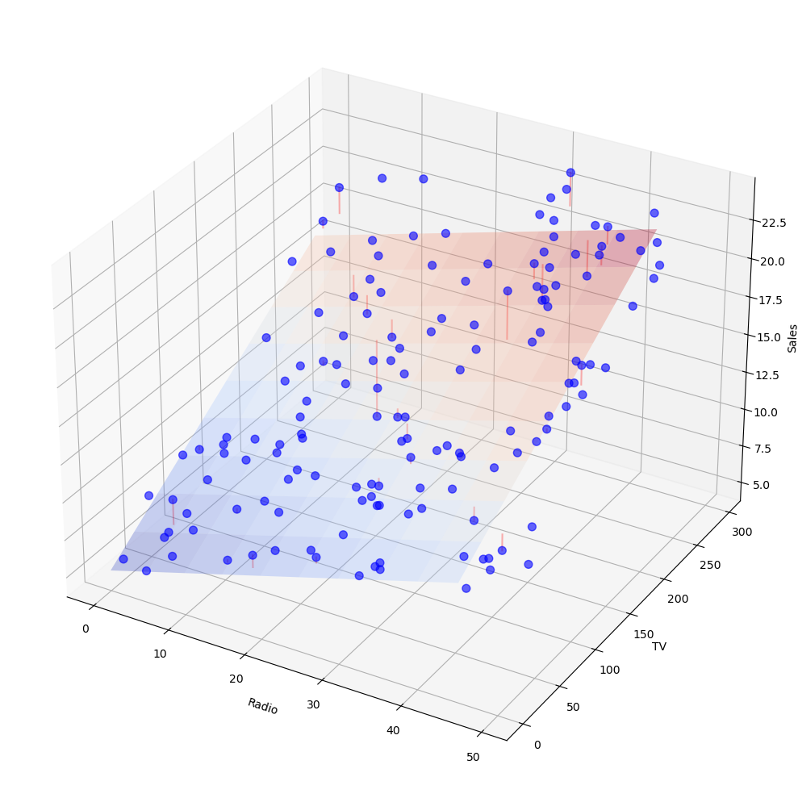

# 3차원 회귀평면

## 개요

이 페이지는 설명변수가 둘인 다중선형회귀를 3차원 공간의 평면으로 시각화한다. 인공 광고자료(TV와 Radio 지출로 Sales를 예측)를 써서 회귀평면을 적합하고, 자료점을 3차원에 흩뿌리고, 잔차선을 그려 다중회귀의 기하학적 해석을 보인다.

## 수학적 배경

설명변수가 둘일 때 다중선형회귀 모형은

$$
y_i = \beta_0 + \beta_1 x_{i1} + \beta_2 x_{i2} + \varepsilon_i.
$$

적합값 $\hat{y}_i = \hat{\beta}_0 + \hat{\beta}_1 x_{i1} + \hat{\beta}_2 x_{i2}$는 $(x_1, x_2, y)$ 공간에서 **평면**을 이룬다. 잔차 $e_i = y_i - \hat{y}_i$는 자료점에서 평면까지의 수직 거리이다.

결정계수는 설명된 분산의 비율을 잰다.

$$
R^2 = 1 - \frac{\mathrm{RSS}}{\mathrm{TSS}} = 1 - \frac{\sum(y_i - \hat{y}_i)^2}{\sum(y_i - \bar{y})^2}.
$$

각 계수는 **부분적 해석**을 갖는다. $\hat{\beta}_1$은 $x_2$를 고정했을 때 $x_1$이 한 단위 늘어날 때 기대되는 $y$의 변화이다. 기하학적으로 $\hat{\beta}_1$은 $x_1$ 방향으로 잰 평면의 기울기이다.

### 자료 생성과 적합

<div class="codebox" markdown>

**예제 1.** 설명변수 둘인 자료와 적합

```python
import numpy as np
from sklearn.linear_model import LinearRegression

# 설명변수가 둘이면 회귀선이 아니라 회귀평면이 된다. 그것을 눈으로 본다.
np.random.seed(42)
n = 150
TV = np.random.uniform(0, 300, n)
Radio = np.random.uniform(0, 50, n)
Sales = 5 + 0.04 * TV + 0.15 * Radio + np.random.normal(0, 1.5, n)

X = np.column_stack([Radio, TV])
y = Sales

model = LinearRegression()
model.fit(X, y)

beta_0 = model.intercept_
beta_1 = model.coef_[0]  # Radio
beta_2 = model.coef_[1]  # TV
```

</div>

### 회귀평면 격자 만들기

<div class="codebox" markdown>

**예제 2.** 회귀평면 격자 만들기

```python
# 평면을 그리려면 두 축의 격자를 만들고 칸마다 적합값을 계산한다.
Radio_range = np.arange(0, 50, 5)
TV_range = np.arange(0, 300, 30)
Radio_mesh, TV_mesh = np.meshgrid(Radio_range, TV_range)

Sales_mesh = beta_0 + beta_1 * Radio_mesh + beta_2 * TV_mesh
```

</div>

### 3차원 시각화

<div class="codebox" markdown>

**예제 3.** 평면과 잔차를 3차원으로

```python
import matplotlib.pyplot as plt

fig = plt.figure(figsize=(14, 10))
ax = fig.add_subplot(111, projection='3d')

# 회귀평면. 반투명으로 그려 점이 앞뒤 어디에 있는지 보이게 한다.
ax.plot_surface(Radio_mesh, TV_mesh, Sales_mesh,
                alpha=0.3, cmap='coolwarm')

# 관측점
ax.scatter(Radio, TV, Sales, c='blue', s=50, alpha=0.6)

# 점에서 평면까지 수직으로 선을 긋는다. 그 길이가 잔차이고,
# 최소제곱은 이 길이들의 제곱합을 가장 작게 만드는 평면을 고른 것이다.
# 다 그리면 지저분하므로 다섯 점마다 하나씩만 그린다.
y_pred = model.predict(X)
for i in range(0, n, 5):
    ax.plot([X[i, 0], X[i, 0]], [X[i, 1], X[i, 1]],
            [y[i], y_pred[i]], 'r-', alpha=0.3)

ax.set_xlabel('Radio')
ax.set_ylabel('TV')
ax.set_zlabel('Sales')
plt.tight_layout()
plt.show()
```

</div>



설명변수가 둘이면 회귀직선이 아니라 회귀**평면**이 된다. 점들이 평면 위아래로 흩어진 거리가 잔차다.

## 해석

- **회귀평면**: 색칠된 곡면은 TV와 Radio 지출의 모든 조합에 대한 모형의 예측을 나타낸다. 평면의 기울기 방향이 계수들의 상대적 크기를 반영한다.
- **자료점**: 평면 주위에 흩어진 파란 점들이다. 평면 위의 점은 양의 잔차를, 아래의 점은 음의 잔차를 갖는다.
- **잔차선**: 자료점과 평면을 잇는 빨간 수직 선분이다. OLS는 이 선분들의 길이 제곱의 합을 최소화한다.
- **계수의 의미**: $\hat{\beta}_{\text{Radio}} = 0.15$, $\hat{\beta}_{\text{TV}} = 0.04$라면, (TV를 고정했을 때) Radio 지출 \$1,000 증가는 Sales 0.15 단위 증가와 연관되고, TV 지출 \$1,000 증가는 0.04 단위 증가와 연관된다.
- **한계**: 설명변수가 3개 이상이면 회귀 곡면이 초평면이 되어 직접 시각화할 수 없다. 3차원 시각화는 설명변수가 둘일 때만 쓸 수 있는 교육용 도구이다.

## 연습문제

<div class="drillbox" markdown>

**연습문제 1.** <span class="diff med" title="중간"></span> 모형에 세 번째 설명변수(예: Newspaper 지출)를 추가하라. 그 결과 회귀 곡면을 3차원에 그릴 수 없는 이유를 설명하고 시각화의 대안을 제시하라.

</div>

??? success "풀이"

    설명변수가 셋이면 회귀 곡면은 4차원 공간($x_1, x_2, x_3, y$)의 초평면이 되어 직접 그릴 수 없다. 대안으로는 (1) 부분회귀 그림(다른 설명변수의 선형 효과를 제거한 뒤 $y$를 $x_j$에 대해 그린다), (2) 단면 그림(설명변수 둘을 평균에 고정하고 $y$를 나머지 하나에 대해 그린다), (3) 추가변수 그림, (4) 점추정값과 신뢰구간을 보여주는 계수 그림이 있다. $\square$

<div class="drillbox" markdown>

**연습문제 2.** <span class="diff med" title="중간"></span> RSS와 TSS로부터 $R^2$를 직접 계산하라. `model.score(X, y)`와 일치하는지 확인하라.

</div>

??? success "풀이"

    ```python
    y_pred = model.predict(X)
    RSS = np.sum((y - y_pred) ** 2)
    TSS = np.sum((y - y.mean()) ** 2)
    R2_manual = 1 - RSS / TSS
    R2_sklearn = model.score(X, y)
    print(f"Manual R2: {R2_manual:.4f}")
    print(f"Sklearn R2: {R2_sklearn:.4f}")
    print(f"Match: {np.isclose(R2_manual, R2_sklearn)}")
    ```

    출력:

    ```
    Manual R2: 0.9054
    Sklearn R2: 0.9054
    Match: True
    ```

    직접 계산한 $R^2$와 sklearn의 값이 정확히 같다. $R^2 = 1 - \text{RSS}/\text{TSS}$라는 정의를 확인한 셈이다.

    정의상 두 값은 동일하다. $\square$

<div class="drillbox" markdown>

**연습문제 3.** <span class="diff med" title="중간"></span> 3차원 그림을 여러 시점으로 돌려 보라. 어느 각도에서 잔차가 가장 작아 보이는가? 기하학적으로 설명하라.

</div>

??? success "풀이"

    잔차 선분은 모두 **$y$(Sales)축과 나란한 수직선**이다. 따라서 잔차의 겉보기 길이는 평면의 방향이 아니라 오직 시선이 $y$축과 이루는 각도에 달려 있다.

    시선 방향의 단위벡터를 $\mathbf{d}$, $y$축 방향을 $\hat{\mathbf{z}}$라 하면, 길이 $\ell$인 수직 선분이 화면에 투영되는 길이는

    $$
    \ell \left\lVert \hat{\mathbf{z}} - (\hat{\mathbf{z}} \cdot \mathbf{d})\,\mathbf{d} \right\rVert = \ell \sin\theta, \qquad \theta = \angle(\hat{\mathbf{z}}, \mathbf{d})
    $$

    이다. 따라서

    - **바로 위(또는 아래)에서 내려다볼 때**($\mathbf{d} \parallel \hat{\mathbf{z}}$, $\theta = 0$): 잔차가 점으로 축소되어 **가장 작아 보인다**. `matplotlib`에서는 `ax.view_init(elev=90, azim=0)`이다.
    - **수평 시점**($\mathbf{d} \perp \hat{\mathbf{z}}$, $\theta = 90^\circ$): 잔차가 실제 길이로 보여 **가장 크게 보인다**. `ax.view_init(elev=0, ...)`이다.

    평면이 선으로 보이는(측면으로 보이는) 각도는 이와 별개의 이야기이다. 시선이 평면 **안에** 놓일 때, 곧 시선이 평면의 법선벡터와 **직교**할 때 평면이 측면으로 보인다. 법선벡터를 **따라** 보면 평면은 측면이 아니라 정면으로 보여 화면을 가득 채운다. $\square$

<div class="drillbox" markdown>

**연습문제 4.** <span class="diff med" title="중간"></span> (절편이 포함될 때) OLS 잔차가 각 설명변수 $j$에 대해 $\sum_{i=1}^n e_i = 0$과 $\sum_{i=1}^n x_{ij} e_i = 0$을 만족함을 증명하라.

</div>

??? success "풀이"

    정규방정식은 $\mathbf{X}^\top(\mathbf{y} - \mathbf{X}\hat{\boldsymbol{\beta}}) = \mathbf{0}$, 곧 $\mathbf{X}^\top\mathbf{e} = \mathbf{0}$이다. $\mathbf{X}$의 첫 열이 $\mathbf{1}$(절편 열)이므로 첫 번째 식이 $\mathbf{1}^\top\mathbf{e} = \sum e_i = 0$을 준다. $(j+1)$번째 식은 $\mathbf{x}_j^\top\mathbf{e} = \sum x_{ij}e_i = 0$을 준다. 이 직교성 조건들이 OLS의 근본 성질이다. $\square$

<div class="drillbox" markdown>

**연습문제 5.** <span class="diff med" title="중간"></span> 모형 $\text{Sales} = \beta_0 + \beta_1 \cdot \text{Radio} + \beta_2 \cdot \text{TV} + \varepsilon$에서 $\beta_1$(부분계수)과 Sales를 Radio에만 회귀시켜 얻은 계수의 차이를 설명하라.

</div>

??? success "풀이"

    단순회귀 계수 $\tilde{\beta}_1$은 Radio와 Sales 사이의 전체 연관을 포착하며, 여기에는 TV를 거치는 간접 연관도 들어 있다(예: Radio에 많이 쓰는 기업이 TV에도 많이 쓴다면). 부분계수 $\hat{\beta}_1$은 Radio와 Sales 양쪽에서 TV의 선형 영향을 제거한 뒤 Radio의 직접 효과만 분리한다. 형식적으로 $\hat{\beta}_1$은 Sales를 TV에 회귀시킨 잔차를 Radio를 TV에 회귀시킨 잔차에 회귀시킨 기울기와 같다(Frisch-Waugh-Lovell 정리). 두 계수는 Radio와 TV가 무상관일 때에만 일치한다. $\square$

---

## 정리하며

설명변수가 둘이면 적합된 것은 **평면**이다.

- **직선 → 평면 → 초평면.** $p=1$ 이면 직선, $p=2$ 면 평면, $p\ge3$ 이면 그릴 수 없는 초평면이다. **$p=2$ 가 눈으로 볼 수 있는 마지막 경우**이므로 직관을 세우기에 좋다.
- **잔차는 수직 거리다.** 점에서 평면까지 **$y$ 축 방향으로** 잰 거리이며, 평면에 대한 최단거리가 아니다. 최소제곱이 최소화하는 것이 바로 이 거리의 제곱합이다.
- **계수가 기울기 둘이다.** $\beta_1$ 은 Radio 를 고정한 채 TV 방향의 기울기, $\beta_2$ 는 그 반대다.
- **교호작용이 없으면 평면이다.** $x_1x_2$ 항을 넣으면 휘어진 곡면이 되며, 그때 "다른 변수를 고정한 채"라는 해석이 수준마다 달라진다.
- **그림이 다중공선성도 드러낸다.** 두 설명변수가 강하게 상관되면 점들이 평면 위의 한 직선 근처에 몰려, 평면의 기울기가 불안정해진다.

다음 절 **회귀 (대마 인구통계)** 에서 실제 자료에 적용한다.
