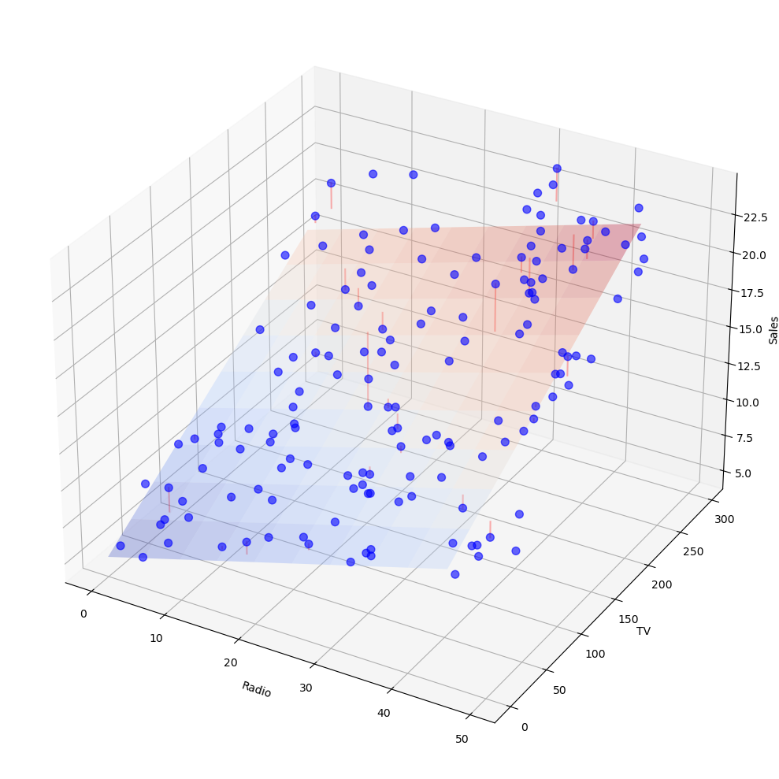

# 3차원 회귀평면

## 개요

이 페이지는 설명변수가 둘인 다중선형회귀를 3차원 공간의 평면으로 시각화한다. 인공 광고자료(TV와 Radio 지출로 Sales를 예측)를 써서 회귀평면을 적합하고, 자료점을 3차원에 흩뿌리고, 잔차선을 그려 다중회귀의 기하학적 해석을 보인다.

## 수학적 배경

설명변수가 둘일 때 다중선형회귀 모형은

$$
y_i = \beta_0 + \beta_1 x_{i1} + \beta_2 x_{i2} + \varepsilon_i.
$$

적합값 $\hat{y}_i = \hat{\beta}_0 + \hat{\beta}_1 x_{i1} + \hat{\beta}_2 x_{i2}$는 $(x_1, x_2, y)$ 공간에서 **평면**을 이룬다. 잔차 $e_i = y_i - \hat{y}_i$는 자료점에서 평면까지의 수직 거리이다.

결정계수는 설명된 분산의 비율을 잰다.

$$
R^2 = 1 - \frac{\mathrm{RSS}}{\mathrm{TSS}} = 1 - \frac{\sum(y_i - \hat{y}_i)^2}{\sum(y_i - \bar{y})^2}.
$$

각 계수는 **부분적 해석**을 갖는다. $\hat{\beta}_1$은 $x_2$를 고정했을 때 $x_1$이 한 단위 늘어날 때 기대되는 $y$의 변화이다. 기하학적으로 $\hat{\beta}_1$은 $x_1$ 방향으로 잰 평면의 기울기이다.

### 자료 생성과 적합

<div class="exbox" markdown>

**보기 1.** <span class="diff easy" title="쉬움"></span> 설명변수 둘인 자료와 적합. $\text{TV} \sim U(0, 300)$, $\text{Radio} \sim U(0, 50)$ 을 독립으로 뽑고 $\text{Sales} = 5 + 0.04\,\text{TV} + 0.15\,\text{Radio} + \varepsilon$, $\varepsilon \sim N(0, 1.5^2)$ 로 $n = 150$ 개를 만든 뒤 적합한다.

**(1)** 두 설명변수가 **독립**이므로 $\operatorname{Var}(\hat\beta_j) \approx \sigma^2/S_{jj}$ 로 근사할 수 있다. 균등분포의 분산이 $a^2/12$ 임을 써서 $S_{\text{RR}}$, $S_{\text{TT}}$ 와 두 계수의 **표준오차를 자료를 보기 전에** 예측하시오.

**(2)** 적합해 보고 (1)의 예측과 견주시오. 세 참 모수가 $95\%$ 신뢰구간에 들어오는가. 예측한 표준오차와 실제 표준오차가 어긋난다면 그 까닭은 무엇인가.

</div>

??? success "풀이"

    **(1) 해석적으로.** $\operatorname{Var}(\hat{\boldsymbol\beta}) = \sigma^2 (X^TX)^{-1}$ 이고, 두 설명변수가 독립이면 중심화한 뒤 $X^TX$ 가 거의 대각이 되어

    $$
    \operatorname{Var}(\hat\beta_j) \approx \frac{\sigma^2}{S_{jj}}, \qquad S_{jj} = \sum_i (x_{ij} - \bar x_j)^2
    $$

    이다. $S_{jj}$ 의 기댓값은 $(n-1)\operatorname{Var}(x_j)$ 이고 $U(0,a)$ 의 분산이 $a^2/12$ 이므로

    $$
    E[S_{\text{RR}}] = 149 \times \frac{50^2}{12} = 31041.67, \qquad
    E[S_{\text{TT}}] = 149 \times \frac{300^2}{12} = 1117500
    $$

    이다. 표준오차는 그 제곱근으로 나눈다.

    $$
    \operatorname{se}(\hat\beta_{\text{Radio}}) \approx \frac{1.5}{\sqrt{31041.67}} = 0.008514, \qquad
    \operatorname{se}(\hat\beta_{\text{TV}}) \approx \frac{1.5}{\sqrt{1117500}} = 0.001419
    $$

    **TV 쪽 표준오차가 여섯 배 작다.** TV 가 여섯 배 넓은 구간에 퍼져 있어 $S_{\text{TT}}$ 가 $36$ 배 크기 때문이다. 이것이 0.4절의 $\operatorname{Var}(\hat\beta_1) = \sigma^2/S_{xx}$ 가 말하는 바다. **설명변수를 넓게 퍼뜨릴수록 그 계수가 정밀해진다.**

    **(2) 수치적으로.**

    ```python
    import numpy as np
    import statsmodels.api as sm
    from sklearn.linear_model import LinearRegression

    # 설명변수가 둘이면 회귀선이 아니라 회귀평면이 된다. 그것을 눈으로 본다.
    np.random.seed(42)
    n = 150
    TV = np.random.uniform(0, 300, n)
    Radio = np.random.uniform(0, 50, n)
    Sales = 5 + 0.04 * TV + 0.15 * Radio + np.random.normal(0, 1.5, n)

    X = np.column_stack([Radio, TV])
    y = Sales

    model = LinearRegression()
    model.fit(X, y)

    beta_0 = model.intercept_
    beta_1 = model.coef_[0]  # Radio
    beta_2 = model.coef_[1]  # TV

    # 균등분포의 분산은 a^2/12 이므로 S_jj 를 미리 예측할 수 있다.
    S_RR, S_TT = ((Radio - Radio.mean()) ** 2).sum(), ((TV - TV.mean()) ** 2).sum()
    print(f"S_RR 실제 {S_RR:12.2f}   예측 (n-1)*50^2/12  = {(n - 1) * 2500 / 12:12.2f}")
    print(f"S_TT 실제 {S_TT:12.2f}   예측 (n-1)*300^2/12 = {(n - 1) * 90000 / 12:12.2f}")
    print(f"corr(TV, Radio) = {np.corrcoef(TV, Radio)[0, 1]:+.4f}  (독립이므로 0 에 가깝다)")
    print()

    res = sm.OLS(y, sm.add_constant(X)).fit()
    names = ["절편", "Radio", "TV"]
    truth = [5.0, 0.15, 0.04]
    theory_se = [np.nan, 1.5 / np.sqrt((n - 1) * 2500 / 12), 1.5 / np.sqrt((n - 1) * 90000 / 12)]
    print(f"{'항':8s}{'참값':>8s}{'추정값':>11s}{'SE':>10s}{'이론 SE':>11s}"
          f"{'95% CI':>24s}  판정")
    for k, (nm, tv, tse) in enumerate(zip(names, truth, theory_se)):
        lo, hi = res.conf_int()[k]
        print(f"{nm:8s}{tv:8.4f}{res.params[k]:11.6f}{res.bse[k]:10.6f}"
              f"{tse:11.6f}   [{lo:8.5f}, {hi:8.5f}]  {'포함' if lo <= tv <= hi else '벗어남'}")
    print()
    print(f"s = {np.sqrt(res.mse_resid):.4f}   (참 sigma = 1.5,  비 {np.sqrt(res.mse_resid) / 1.5:.4f})")
    print(f"R^2 = {model.score(X, y):.6f}")
    ```

    출력:

    ```
    S_RR 실제     31633.01   예측 (n-1)*50^2/12  =     31041.67
    S_TT 실제   1179148.00   예측 (n-1)*300^2/12 =   1117500.00
    corr(TV, Radio) = +0.0357  (독립이므로 0 에 가깝다)

    항             참값        추정값        SE      이론 SE                  95% CI  판정
    절편        5.0000   5.089605  0.291330        nan   [ 4.51387,  5.66534]  포함
    Radio     0.1500   0.142954  0.007850   0.008514   [ 0.12744,  0.15847]  포함
    TV        0.0400   0.041303  0.001286   0.001419   [ 0.03876,  0.04384]  포함

    s = 1.3953   (참 sigma = 1.5,  비 0.9302)
    R^2 = 0.905404
    ```

    **세 참값이 모두 신뢰구간 안에 있다.** $S_{jj}$ 의 예측도 좋다. $S_{\text{RR}}$ 은 $31042$ 예측에 $31633$ 실제로 $1.9\%$ 차이, $S_{\text{TT}}$ 는 $1117500$ 예측에 $1179148$ 실제로 $5.5\%$ 차이다. 둘 다 같은 방향으로 크게 나왔는데, $S_{jj}$ 의 상대 표준오차가 $\sqrt{2/(n-1)} \approx 11.6\%$ 가 아니라 균등분포에서는 더 작으므로 이 정도 어긋남은 흔하다.

    **표준오차는 예측보다 작게 나왔다.** Radio 는 $0.008514$ 예측에 $0.007850$ 실제로 $-7.8\%$, TV 는 $0.001419$ 에 $0.001286$ 으로 $-9.4\%$ 다. 까닭이 두 가지로 나뉜다. 첫째, $s = 1.3953$ 이 참 $\sigma = 1.5$ 보다 $7.0\%$ 작다. 이 표본의 오차가 우연히 작게 뽑힌 것이다. 둘째, $S_{jj}$ 가 예측보다 커서 분모가 커졌다. 두 효과를 함께 넣으면

    $$
    1.5 \times \frac{0.9302}{\sqrt{31633.01}} = 0.007845
    $$

    로 실제 $0.007850$ 과 소수 다섯째 자리에서 맞는다(남은 $6\times10^{-6}$ 은 $X^TX$ 가 완전히 대각이 아니기 때문이다). **어긋남의 정체가 완전히 설명된다.** 이론식이 틀린 것이 아니라 $\sigma$ 와 $S_{jj}$ 를 참값이 아닌 실현값으로 바꿔야 했던 것이다.

    참값 $0.15$ 대 추정값 $0.142954$ 의 차이는 $-0.007$ 로 표준오차 $0.00785$ 의 $0.90$ 배다. TV 는 $+0.0013$ 으로 표준오차의 $1.01$ 배다. 둘 다 정상 범위다. $\square$

### 회귀평면 격자 만들기

<div class="exbox" markdown>

**보기 2.** <span class="diff easy" title="쉬움"></span> 회귀평면 격자 만들기. `np.arange` 로 두 축의 격자를 만들고 칸마다 적합값을 계산한다.

**(1)** `np.arange(0, 50, 5)` 와 `np.arange(0, 300, 30)` 은 각각 몇 개의 점을 주며 끝점 $50$ 과 $300$ 을 포함하는가. 격자가 덮는 범위를 **자료의 범위**와 견주어, 격자 밖으로 나가는 점이 몇 개인지 세시오.

**(2)** 격자를 $10\times10$ 대신 $2\times2$ 로 줄여도 그려지는 면이 **똑같다**. 왜 그런지 말하고 수치로 확인하시오. 어떤 모형에서는 이것이 성립하지 않는가.

</div>

??? success "풀이"

    **(1) 둘 다 $10$ 개이고 끝점은 포함하지 않는다.** `np.arange(start, stop, step)` 은 **$\text{stop}$ 을 포함하지 않는** 반열린구간을 준다. 그래서 Radio 격자는 $0, 5, \ldots, 45$ 로 끝나고 TV 격자는 $0, 30, \ldots, 270$ 으로 끝난다.

    자료는 그보다 넓다. $\text{Radio} \sim U(0,50)$ 이고 $\text{TV} \sim U(0,300)$ 이니 $45$ 를 넘는 Radio 가 기대값으로 $150 \times 0.1 = 15$ 개, $270$ 을 넘는 TV 가 $150 \times 0.1 = 15$ 개다. 둘 중 하나라도 넘을 확률은 $1 - 0.9^2 = 0.19$ 이므로 **약 $29$ 개 점이 격자 밖**으로 나간다. 끝점을 포함하려면 `np.linspace(0, 50, 11)` 를 쓰거나 `np.arange(0, 50.1, 5)` 처럼 $\text{stop}$ 을 밀어야 한다.

    **(2) 적합된 함수가 $\text{Radio}$ 와 $\text{TV}$ 에 대해 **일차**이기 때문이다.** $\hat y = \hat\beta_0 + \hat\beta_1 r + \hat\beta_2 t$ 는 평면이고, 평면은 네 꼭짓점 — 사실은 일직선 위에 없는 세 점 — 으로 완전히 정해진다. 격자를 촘촘히 하는 것은 같은 평면 위에 점을 더 찍는 일에 지나지 않는다.

    더 정확히 말하면 이 함수는 **이중선형보간과 정확히 일치한다.** 직사각형의 네 꼭짓점 값으로 이중선형보간을 하면 $r$, $t$, $rt$ 항이 나오는데, 평면에는 $rt$ 항의 계수가 $0$ 이라 보간이 평면을 그대로 되살린다.

    성립하지 않는 경우는 **적합된 함수가 비선형일 때**다. 교호작용 $\hat\beta_3 rt$ 를 넣으면 쌍곡포물면이 되어 네 꼭짓점만으로는 휘어짐을 그릴 수 없고, 다항항이나 스플라인을 넣으면 더하다. 그때는 격자가 촘촘해야 곡면의 모양이 보인다.

    ```python
    # 평면을 그리려면 두 축의 격자를 만들고 칸마다 적합값을 계산한다.
    Radio_range = np.arange(0, 50, 5)
    TV_range = np.arange(0, 300, 30)
    Radio_mesh, TV_mesh = np.meshgrid(Radio_range, TV_range)

    Sales_mesh = beta_0 + beta_1 * Radio_mesh + beta_2 * TV_mesh

    print(f"Radio 격자 {Radio_range}   점 {len(Radio_range)}개,  마지막 {Radio_range[-1]}")
    print(f"TV    격자 {TV_range}   점 {len(TV_range)}개,  마지막 {TV_range[-1]}")
    print(f"격자 모양 {Radio_mesh.shape},  Sales_mesh 모양 {Sales_mesh.shape}")
    print()
    print(f"자료 범위:  Radio [{Radio.min():.3f}, {Radio.max():.3f}]   "
          f"TV [{TV.min():.3f}, {TV.max():.3f}]")
    print(f"격자 범위:  Radio [0, {Radio_range[-1]}]   TV [0, {TV_range[-1]}]")
    print(f"격자 밖으로 나가는 점:  Radio>45 {np.sum(Radio > 45)}개,  "
          f"TV>270 {np.sum(TV > 270)}개,  둘 중 하나라도 {np.sum((Radio > 45) | (TV > 270))}개"
          f"  ({np.mean((Radio > 45) | (TV > 270)):.1%})")
    print()
    # 평면은 선형이므로 꼭짓점 네 개면 똑같은 면이 나온다.
    corners_R, corners_T = np.meshgrid([0, 45], [0, 270])
    corners_S = beta_0 + beta_1 * corners_R + beta_2 * corners_T
    print("꼭짓점 네 개만으로 같은 평면이 되는가")
    print(f"  (0,0)     격자 {Sales_mesh[0, 0]:.6f}   꼭짓점 {corners_S[0, 0]:.6f}")
    print(f"  (45,0)    격자 {Sales_mesh[0, -1]:.6f}   꼭짓점 {corners_S[0, 1]:.6f}")
    print(f"  (0,270)   격자 {Sales_mesh[-1, 0]:.6f}   꼭짓점 {corners_S[1, 0]:.6f}")
    print(f"  (45,270)  격자 {Sales_mesh[-1, -1]:.6f}   꼭짓점 {corners_S[1, 1]:.6f}")
    # 격자 한가운데 칸이 네 꼭짓점의 선형보간과 같은가
    mid = beta_0 + beta_1 * 22.5 + beta_2 * 135
    bilinear = corners_S.mean()
    print(f"\n격자 중심 (22.5, 135) 의 평면값 {mid:.6f}")
    print(f"네 꼭짓점의 평균               {bilinear:.6f}   차이 {abs(mid - bilinear):.2e}")
    ```

    출력:

    ```
    Radio 격자 [ 0  5 10 15 20 25 30 35 40 45]   점 10개,  마지막 45
    TV    격자 [  0  30  60  90 120 150 180 210 240 270]   점 10개,  마지막 270
    격자 모양 (10, 10),  Sales_mesh 모양 (10, 10)

    자료 범위:  Radio [0.253, 49.503]   TV [1.657, 296.066]
    격자 범위:  Radio [0, 45]   TV [0, 270]
    격자 밖으로 나가는 점:  Radio>45 15개,  TV>270 14개,  둘 중 하나라도 29개  (19.3%)

    꼭짓점 네 개만으로 같은 평면이 되는가
      (0,0)     격자 5.089605   꼭짓점 5.089605
      (45,0)    격자 11.522515   꼭짓점 11.522515
      (0,270)   격자 16.241330   꼭짓점 16.241330
      (45,270)  격자 22.674240   꼭짓점 22.674240

    격자 중심 (22.5, 135) 의 평면값 13.881923
    네 꼭짓점의 평균               13.881923   차이 1.78e-15
    ```

    **(1)의 예측이 거의 그대로 나왔다.** $\text{Radio} > 45$ 가 $15$ 개(예측 $15$), $\text{TV} > 270$ 이 $14$ 개(예측 $15$), 둘 중 하나라도 넘는 점이 $29$ 개로 전체의 $19.3\%$ 다. 예측한 $19\%$ 와 맞는다. 자료의 최댓값이 Radio $49.503$, TV $296.066$ 이니 **그림에서 그 $29$ 개 점은 평면 바깥에 떠 있게 된다.** 평면이 끝난 자리 위로 점이 매달려 보이는 것은 모형의 문제가 아니라 격자를 잘못 잡은 것이다.

    **(2)도 확실하다.** 네 꼭짓점의 값이 $10\times10$ 격자의 네 구석과 소수 여섯째 자리까지 같고, 격자 중심 $(22.5, 135)$ 의 평면값 $13.881923$ 이 네 꼭짓점의 **단순평균**과 $1.8\times10^{-15}$ 안에서 같다. 평균이 보간값과 같은 것은 중심이 네 꼭짓점의 중점이고 함수가 일차이기 때문이다. **평면에서는 보간과 외삽이 모두 계수 세 개로 끝난다.**

    그러므로 이 격자를 만드는 계산은 **그림을 위한 것이지 모형을 위한 것이 아니다.** 모형은 이미 보기 1에서 계수 세 개로 끝났고, 격자는 그 세 수를 눈에 보이는 면으로 펼친 것에 지나지 않는다. $\square$

### 3차원 시각화

<div class="exbox" markdown>

**보기 3.** <span class="diff easy" title="쉬움"></span> 평면과 잔차를 3차원으로. 반투명 회귀평면 위에 점 $150$ 개를 흩뿌리고 다섯 점마다 하나씩 잔차선을 긋는다.

**(1)** 그림의 빨간 선분은 모두 $y$ 축과 나란하다. 점에서 **평면까지의 최단거리**는 잔차와 어떤 비로 다른지 평면의 법선벡터로 유도하고, 이 자료에서 그 비를 구하시오.

**(2)** 그림에서 읽을 수 있는 것과 **읽을 수 없는 것**을 수치와 함께 적으시오.

</div>

??? success "풀이"

    유도할 식은 (1) 하나뿐이고, (2)는 **그림에서 무엇이 읽히고 무엇이 읽히지 않는가**가 전부다.

    **(1) 해석적으로.** 평면 $y = \hat\beta_0 + \hat\beta_1 r + \hat\beta_2 t$ 를 $(r, t, y)$ 공간의 음함수로 적으면

    $$
    \hat\beta_1 r + \hat\beta_2 t - y + \hat\beta_0 = 0
    $$

    이므로 법선벡터가 $\mathbf n = (\hat\beta_1,\ \hat\beta_2,\ -1)$ 이고 $\|\mathbf n\| = \sqrt{1 + \hat\beta_1^2 + \hat\beta_2^2}$ 다. 점 $(r_i, t_i, y_i)$ 에서 평면까지의 최단거리는 점-평면 거리 공식으로

    $$
    d_i = \frac{\lvert \hat\beta_1 r_i + \hat\beta_2 t_i - y_i + \hat\beta_0 \rvert}{\|\mathbf n\|}
    = \frac{\lvert \hat y_i - y_i \rvert}{\sqrt{1 + \hat\beta_1^2 + \hat\beta_2^2}}
    = \frac{\lvert e_i \rvert}{\sqrt{1 + \hat\beta_1^2 + \hat\beta_2^2}}
    $$

    이다. 곧 **잔차와 최단거리의 비가 $\sqrt{1 + \hat\beta_1^2 + \hat\beta_2^2}$ 로 모든 점에서 같은 상수**다. 비가 상수라는 점이 중요하다. 최소제곱이 수직거리의 제곱합을 최소화하는 일과 최단거리의 제곱합을 최소화하는 일이 **같은 평면을 주지 않는** 까닭은 계수가 바뀌면 이 비도 바뀌기 때문이고, 계수가 고정된 뒤에는 두 거리가 비례한다.

    이 자료에서는 $\hat\beta_1 = 0.142954$, $\hat\beta_2 = 0.041303$ 이 둘 다 작아 비가 $1$ 에 매우 가깝다.

    **(2) 수치적으로.**

    ```python
    import matplotlib.pyplot as plt

    fig = plt.figure(figsize=(14, 10))
    ax = fig.add_subplot(111, projection='3d')

    # 회귀평면. 반투명으로 그려 점이 앞뒤 어디에 있는지 보이게 한다.
    ax.plot_surface(Radio_mesh, TV_mesh, Sales_mesh,
                    alpha=0.3, cmap='coolwarm')

    # 관측점
    ax.scatter(Radio, TV, Sales, c='blue', s=50, alpha=0.6)

    # 점에서 평면까지 수직으로 선을 긋는다. 그 길이가 잔차이고,
    # 최소제곱은 이 길이들의 제곱합을 가장 작게 만드는 평면을 고른 것이다.
    # 다 그리면 지저분하므로 다섯 점마다 하나씩만 그린다.
    y_pred = model.predict(X)
    for i in range(0, n, 5):
        ax.plot([X[i, 0], X[i, 0]], [X[i, 1], X[i, 1]],
                [y[i], y_pred[i]], 'r-', alpha=0.3)

    ax.set_xlabel('Radio')
    ax.set_ylabel('TV')
    ax.set_zlabel('Sales')
    plt.tight_layout()
    plt.show()
    ```

    

    설명변수가 둘이면 회귀직선이 아니라 회귀**평면**이 된다. 점들이 평면 위아래로 흩어진 거리가 잔차다. 이제 그 거리를 수로 잰다.

    ```python
    # 그림에서 읽을 수치를 미리 찍어 둔다.
    residuals = y - model.predict(X)
    factor = np.sqrt(1 + beta_1 ** 2 + beta_2 ** 2)
    print(f"잔차선을 그린 점 {len(range(0, n, 5))}개 / 전체 {n}개")
    print(f"잔차  평균 {residuals.mean():+.2e}   표준편차 {residuals.std(ddof=3):.4f}"
          f"   최대 |e| {np.abs(residuals).max():.4f}")
    print(f"평면 위 {np.sum(residuals > 0)}개,  아래 {np.sum(residuals < 0)}개")
    print()
    print(f"평면의 법선 (-b1, -b2, 1) 의 길이 = sqrt(1 + b1^2 + b2^2) = {factor:.6f}")
    print(f"  수직 잔차 / 평면까지의 최단거리 = {factor:.6f}   (차이 {factor - 1:.2%})")
    print(f"  가장 큰 잔차 {np.abs(residuals).max():.4f} 에 대해 "
          f"최단거리는 {np.abs(residuals).max() / factor:.4f}")
    print()
    print(f"R^2 = {model.score(X, y):.6f},  RSS = {np.sum(residuals ** 2):.4f},"
          f"  TSS = {np.sum((y - y.mean()) ** 2):.4f}")
    ```

    출력:

    ```
    잔차선을 그린 점 30개 / 전체 150개
    잔차  평균 +5.46e-15   표준편차 1.3953   최대 |e| 5.0688
    평면 위 77개,  아래 73개

    평면의 법선 (-b1, -b2, 1) 의 길이 = sqrt(1 + b1^2 + b2^2) = 1.011010
      수직 잔차 / 평면까지의 최단거리 = 1.011010   (차이 1.10%)
      가장 큰 잔차 5.0688 에 대해 최단거리는 5.0136

    R^2 = 0.905404,  RSS = 286.2067,  TSS = 3025.5718
    ```

    **(1)의 비가 $1.011010$ 이다.** 수직 잔차가 최단거리보다 $1.10\%$ 길다. 가장 큰 잔차 $5.0688$ 조차 최단거리로는 $5.0136$ 이니 차이가 $0.055$ 에 지나지 않는다. **이 그림에서는 두 거리가 사실상 같다.**

    까닭을 오해하면 안 된다. 기울기가 **작아서** 그런 것이 아니라 **단위 때문에** 작아 보이는 것이다. TV 를 천 달러 단위에서 백만 달러 단위로 바꾸면 $\hat\beta_2$ 가 $0.0413$ 에서 $41.3$ 으로 커지고 비가 $\sqrt{1 + 41.3^2} \approx 41.3$ 이 된다. **최소제곱이 수직거리를 쓰는 것과 최단거리를 쓰는 것은 근본적으로 다른 방법이며**, 후자는 전직교회귀(또는 주성분회귀)라 불리고 **단위를 바꾸면 답이 바뀐다.** 최소제곱은 $y$ 축 방향만 재므로 설명변수의 단위에 영향받지 않는다. 이 그림에서 두 거리가 비슷해 보이는 것은 **우연한 단위 선택의 결과일 뿐**이다.

    **(2) 그림에서 읽히는 것.** 점들이 평면 위 $77$ 개, 아래 $73$ 개로 거의 반반이고 잔차의 평균이 $5.5\times10^{-15}$ 다. 정규방정식이 $\sum e_i = 0$ 을 강제하므로 이것은 확인이지 발견이 아니다. 잔차의 표준편차가 $1.3953$ 이고 $\text{Sales}$ 의 범위가 대략 $5$ 에서 $23$ 이니 **점구름의 두께가 평면이 덮는 높이의 $8\%$ 쯤**이다. 그래서 그림에서 점들이 평면에 꽤 붙어 보이고, $R^2 = 0.9054$ 가 그것을 수로 적은 값이다.

    **그림이 읽을 수 없는 것은 네 가지다.** 첫째, **잔차선이 $150$ 개 중 $30$ 개만 그려져 있다.** `range(0, n, 5)` 가 다섯 점마다 하나씩 고르므로, 가장 큰 잔차 $5.0688$ 을 가진 점이 그려졌는지 알 수 없다. 극단값을 찾는 도구로 이 그림을 쓸 수 없다. 둘째, **등분산인지 가늠할 수 없다.** 3차원 투영에서는 어느 점이 앞이고 뒤인지 흐려져 "$\hat y$ 가 클 때 흩어짐이 큰가"를 눈으로 판정할 수 없다. 그 판정은 잔차 대 적합값의 2차원 그림이 한다. 셋째, **다중공선성이 보이지 않는다.** 여기서는 $\operatorname{corr}(\text{TV}, \text{Radio}) = 0.0357$ 로 점들이 바닥 전체에 고르게 깔려 있지만, 두 변수가 상관되면 점들이 바닥의 한 직선 근처로 몰려 평면의 기울기가 불안정해진다. 그 쏠림은 바닥을 **위에서 내려다보아야** 보인다. 넷째, **격자가 자료를 다 덮지 못한다**(보기 2). $29$ 개 점이 평면 밖에 떠 있다.

    그러므로 이 그림의 몫은 **"평면이다"와 "잔차는 세로로 잰다"는 두 가지를 눈에 새기는 것**이고, 진단은 다른 그림들이 맡는다. 설명변수가 셋이 되면 이 그림 자체가 불가능해지지만 그 두 사실은 그대로 남는다. $\square$

## 해석

- **회귀평면**: 색칠된 곡면은 TV와 Radio 지출의 모든 조합에 대한 모형의 예측을 나타낸다. 평면의 기울기 방향이 계수들의 상대적 크기를 반영한다.
- **자료점**: 평면 주위에 흩어진 파란 점들이다. 평면 위의 점은 양의 잔차를, 아래의 점은 음의 잔차를 갖는다.
- **잔차선**: 자료점과 평면을 잇는 빨간 수직 선분이다. OLS는 이 선분들의 길이 제곱의 합을 최소화한다.
- **계수의 의미**: $\hat{\beta}_{\text{Radio}} = 0.15$, $\hat{\beta}_{\text{TV}} = 0.04$라면, (TV를 고정했을 때) Radio 지출 \$1,000 증가는 Sales 0.15 단위 증가와 연관되고, TV 지출 \$1,000 증가는 0.04 단위 증가와 연관된다.
- **한계**: 설명변수가 3개 이상이면 회귀 곡면이 초평면이 되어 직접 시각화할 수 없다. 3차원 시각화는 설명변수가 둘일 때만 쓸 수 있는 교육용 도구이다.

## 연습문제

<div class="drillbox" markdown>

**연습문제 1.** <span class="diff med" title="중간"></span> 모형에 세 번째 설명변수(예: Newspaper 지출)를 추가하라. 그 결과 회귀 곡면을 3차원에 그릴 수 없는 이유를 설명하고 시각화의 대안을 제시하라.

</div>

??? success "풀이"

    설명변수가 셋이면 회귀 곡면은 4차원 공간($x_1, x_2, x_3, y$)의 초평면이 되어 직접 그릴 수 없다. 대안으로는 (1) 부분회귀 그림(다른 설명변수의 선형 효과를 제거한 뒤 $y$를 $x_j$에 대해 그린다), (2) 단면 그림(설명변수 둘을 평균에 고정하고 $y$를 나머지 하나에 대해 그린다), (3) 추가변수 그림, (4) 점추정값과 신뢰구간을 보여주는 계수 그림이 있다. $\square$

<div class="drillbox" markdown>

**연습문제 2.** <span class="diff med" title="중간"></span> RSS와 TSS로부터 $R^2$를 직접 계산하라. `model.score(X, y)`와 일치하는지 확인하라.

</div>

??? success "풀이"

    ```python
    y_pred = model.predict(X)
    RSS = np.sum((y - y_pred) ** 2)
    TSS = np.sum((y - y.mean()) ** 2)
    R2_manual = 1 - RSS / TSS
    R2_sklearn = model.score(X, y)
    print(f"Manual R2: {R2_manual:.4f}")
    print(f"Sklearn R2: {R2_sklearn:.4f}")
    print(f"Match: {np.isclose(R2_manual, R2_sklearn)}")
    ```

    출력:

    ```
    Manual R2: 0.9054
    Sklearn R2: 0.9054
    Match: True
    ```

    직접 계산한 $R^2$와 sklearn의 값이 정확히 같다. $R^2 = 1 - \text{RSS}/\text{TSS}$라는 정의를 확인한 셈이다.

    정의상 두 값은 동일하다. $\square$

<div class="drillbox" markdown>

**연습문제 3.** <span class="diff med" title="중간"></span> 3차원 그림을 여러 시점으로 돌려 보라. 어느 각도에서 잔차가 가장 작아 보이는가? 기하학적으로 설명하라.

</div>

??? success "풀이"

    잔차 선분은 모두 **$y$(Sales)축과 나란한 수직선**이다. 따라서 잔차의 겉보기 길이는 평면의 방향이 아니라 오직 시선이 $y$축과 이루는 각도에 달려 있다.

    시선 방향의 단위벡터를 $\mathbf{d}$, $y$축 방향을 $\hat{\mathbf{z}}$라 하면, 길이 $\ell$인 수직 선분이 화면에 투영되는 길이는

    $$
    \ell \left\lVert \hat{\mathbf{z}} - (\hat{\mathbf{z}} \cdot \mathbf{d})\,\mathbf{d} \right\rVert = \ell \sin\theta, \qquad \theta = \angle(\hat{\mathbf{z}}, \mathbf{d})
    $$

    이다. 따라서

    - **바로 위(또는 아래)에서 내려다볼 때**($\mathbf{d} \parallel \hat{\mathbf{z}}$, $\theta = 0$): 잔차가 점으로 축소되어 **가장 작아 보인다**. `matplotlib`에서는 `ax.view_init(elev=90, azim=0)`이다.
    - **수평 시점**($\mathbf{d} \perp \hat{\mathbf{z}}$, $\theta = 90^\circ$): 잔차가 실제 길이로 보여 **가장 크게 보인다**. `ax.view_init(elev=0, ...)`이다.

    평면이 선으로 보이는(측면으로 보이는) 각도는 이와 별개의 이야기이다. 시선이 평면 **안에** 놓일 때, 곧 시선이 평면의 법선벡터와 **직교**할 때 평면이 측면으로 보인다. 법선벡터를 **따라** 보면 평면은 측면이 아니라 정면으로 보여 화면을 가득 채운다. $\square$

<div class="drillbox" markdown>

**연습문제 4.** <span class="diff med" title="중간"></span> (절편이 포함될 때) OLS 잔차가 각 설명변수 $j$에 대해 $\sum_{i=1}^n e_i = 0$과 $\sum_{i=1}^n x_{ij} e_i = 0$을 만족함을 증명하라.

</div>

??? success "풀이"

    정규방정식은 $\mathbf{X}^\top(\mathbf{y} - \mathbf{X}\hat{\boldsymbol{\beta}}) = \mathbf{0}$, 곧 $\mathbf{X}^\top\mathbf{e} = \mathbf{0}$이다. $\mathbf{X}$의 첫 열이 $\mathbf{1}$(절편 열)이므로 첫 번째 식이 $\mathbf{1}^\top\mathbf{e} = \sum e_i = 0$을 준다. $(j+1)$번째 식은 $\mathbf{x}_j^\top\mathbf{e} = \sum x_{ij}e_i = 0$을 준다. 이 직교성 조건들이 OLS의 근본 성질이다. $\square$

<div class="drillbox" markdown>

**연습문제 5.** <span class="diff med" title="중간"></span> 모형 $\text{Sales} = \beta_0 + \beta_1 \cdot \text{Radio} + \beta_2 \cdot \text{TV} + \varepsilon$에서 $\beta_1$(부분계수)과 Sales를 Radio에만 회귀시켜 얻은 계수의 차이를 설명하라.

</div>

??? success "풀이"

    단순회귀 계수 $\tilde{\beta}_1$은 Radio와 Sales 사이의 전체 연관을 포착하며, 여기에는 TV를 거치는 간접 연관도 들어 있다(예: Radio에 많이 쓰는 기업이 TV에도 많이 쓴다면). 부분계수 $\hat{\beta}_1$은 Radio와 Sales 양쪽에서 TV의 선형 영향을 제거한 뒤 Radio의 직접 효과만 분리한다. 형식적으로 $\hat{\beta}_1$은 Sales를 TV에 회귀시킨 잔차를 Radio를 TV에 회귀시킨 잔차에 회귀시킨 기울기와 같다(Frisch-Waugh-Lovell 정리). 두 계수는 Radio와 TV가 무상관일 때에만 일치한다. $\square$

---

## 정리하며

설명변수가 둘이면 적합된 것은 **평면**이다.

- **직선 → 평면 → 초평면.** $p=1$ 이면 직선, $p=2$ 면 평면, $p\ge3$ 이면 그릴 수 없는 초평면이다. **$p=2$ 가 눈으로 볼 수 있는 마지막 경우**이므로 직관을 세우기에 좋다.
- **잔차는 수직 거리다.** 점에서 평면까지 **$y$ 축 방향으로** 잰 거리이며, 평면에 대한 최단거리가 아니다. 최소제곱이 최소화하는 것이 바로 이 거리의 제곱합이다.
- **계수가 기울기 둘이다.** $\beta_1$ 은 Radio 를 고정한 채 TV 방향의 기울기, $\beta_2$ 는 그 반대다.
- **교호작용이 없으면 평면이다.** $x_1x_2$ 항을 넣으면 휘어진 곡면이 되며, 그때 "다른 변수를 고정한 채"라는 해석이 수준마다 달라진다.
- **그림이 다중공선성도 드러낸다.** 두 설명변수가 강하게 상관되면 점들이 평면 위의 한 직선 근처에 몰려, 평면의 기울기가 불안정해진다.

다음 절 **회귀 (대마 인구통계)** 에서 실제 자료에 적용한다.
