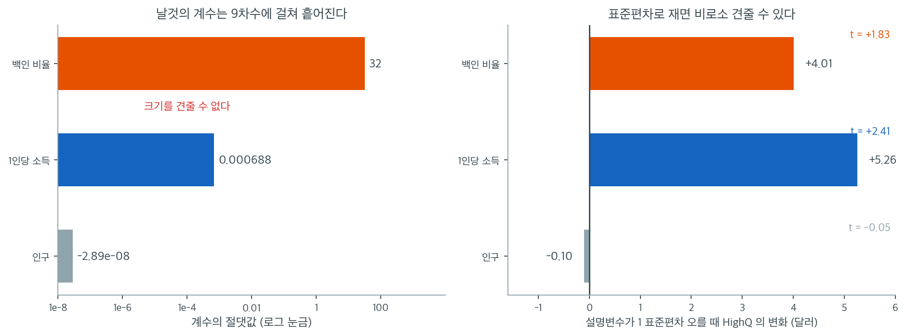

# 회귀 (대마초 가격과 인구통계)

## 개요

이 페이지는 인구, 1인당 소득, 인종 구성 같은 주(州) 단위 인구통계 특성으로 고급 대마초 가격을 예측하는 데 선형회귀를 적용한다. 상관행렬을 통한 탐색적 분석, scikit-learn과 statsmodels를 이용한 단변량·다변량 OLS, 그리고 남겨 둔 검정자료에서의 모형 성능 평가를 다룬다.

!!! note "자료에 대하여"
    아래 코드의 `build_dataset()`은 주 단위 인공자료를 만드는 함수이다. 실제 자료로 바꾸어도 절차는 그대로이며, 여기서 중요한 것은 특정 수치가 아니라 탐색 → 적합 → 검정 평가로 이어지는 흐름이다.

---

## 1. 수학적 배경

다중선형회귀 모형은

$$
\text{HighQ}_i = \beta_0 + \beta_1 \cdot \text{population}_i + \beta_2 \cdot \text{income}_i + \beta_3 \cdot \text{percent_white}_i + \varepsilon_i.
$$

OLS 추정량은 다음을 최소화한다.

$$
\mathrm{RSS} = \sum_{i=1}^n \left(\text{HighQ}_i - \hat{\beta}_0 - \hat{\beta}_1 x_{i1} - \cdots - \hat{\beta}_p x_{ip}\right)^2.
$$

남겨 둔 검정자료에서의 모형 평가에는 제곱근평균제곱오차를 쓴다.

$$
\mathrm{RMSE} = \sqrt{\frac{1}{n_{\text{test}}}\sum_{i \in \text{test}}(y_i - \hat{y}_i)^2}.
$$

### 상관

설명변수 $x_j$와 반응변수 $y$의 Pearson 상관은 선형 연관을 잰다.

$$
r_{y,x_j} = \frac{\sum(x_{ij} - \bar{x}_j)(y_i - \bar{y})}{\sqrt{\sum(x_{ij} - \bar{x}_j)^2}\sqrt{\sum(y_i - \bar{y})^2}}.
$$

$|r|$가 큰 설명변수가 회귀모형의 후보가 된다. 다만 상관은 인과를 뜻하지 않는다.

### 자료와 훈련/검정 분할

<div class="exbox" markdown>

**보기 1.** <span class="diff easy" title="쉬움"></span> 자료 준비. `build_dataset()`으로 주 단위 인공자료 $50$개를 만들고 $8$개 주를 검정용으로 떼어 둔다.

**(1)** 이 자료는 **참 모형을 알고 만든 것**이다. `build_dataset()`의 식에서 참 절편과 세 참 계수, 그리고 오차의 표준편차를 읽어 적으시오. 식 안의 `* 1000 / 1000`은 무엇을 하는가.

**(2)** 인구의 최솟값이 $56$만, 최댓값이 $1731$만으로 $31$배 차이가 난다. 이 치우침을 **왜도**로 재고, 로그를 취하면 얼마가 되는지 확인하시오.

</div>

??? success "풀이"

    **(1) 해석적으로.** 자료를 만드는 줄은

    ```
    high_q = (250 + 0.0009 * (income - 52_000) * 1000 / 1000
              - 1.2e-6 * pop + 18 * (pct_white - 0.72)
              + np.random.normal(0, 12, n_states))
    ```

    이다. 세 계수는 각각 소득 $0.0009$, 인구 $-1.2\times10^{-6}$, 백인 비율 $18$이고 오차의 표준편차는 $12$다. 절편은 조금 생각해야 한다. 식이 중심화된 꼴로 적혀 있으므로 $\text{income} = 0$, $\text{pop} = 0$, $\text{pct\_white} = 0$에서의 값을 계산해야 한다.

    $$
    \beta_0 = 250 - 0.0009 \times 52000 - 18 \times 0.72 = 250 - 46.8 - 12.96 = 190.24
    $$

    `* 1000 / 1000`은 **아무 일도 하지 않는다.** $1000$을 곱한 뒤 $1000$으로 나누니 항등이다. 단위를 바꾸려다 남은 흔적으로 보이며, 코드를 읽는 사람을 헷갈리게 할 뿐이다. 식의 뜻을 바꾸지 않으므로 위 참값들은 그대로다.

    **(2) 로그정규분포에서 뽑았으므로 오른쪽으로 치우쳤다.** `np.random.lognormal(mean=15.0, sigma=0.9)`가 만든 값이니 로그를 취하면 정규가 되어야 한다. 왜도로 확인한다.

    먼저 자료를 만든다.

    ```python
    import numpy as np
    import pandas as pd
    from sklearn.linear_model import LinearRegression
    import statsmodels.formula.api as smf

    np.random.seed(42)


    def build_dataset(n_states=50):
        """주 단위 인공자료를 만든다.

        실제 자료로 바꾸어도 아래 절차는 그대로다.
        HighQ(고품질 대마초 가격)를 인구, 1인당 소득, 백인 비율로 설명한다.
        """
        states = [f"state_{i:02d}" for i in range(n_states)]
        pop = np.random.lognormal(mean=15.0, sigma=0.9, size=n_states)
        income = np.random.normal(52_000, 9_000, n_states)
        pct_white = np.clip(np.random.normal(0.72, 0.13, n_states), 0.2, 0.95)
        pct_black = np.clip(np.random.normal(0.12, 0.08, n_states), 0.01, 0.40)
        pct_hispanic = np.clip(1 - pct_white - pct_black, 0.01, None)
        # 참 관계: 소득이 높을수록 비싸고, 인구가 많을수록 미세하게 싸다.
        high_q = (250 + 0.0009 * (income - 52_000) * 1000 / 1000
                  - 1.2e-6 * pop + 18 * (pct_white - 0.72)
                  + np.random.normal(0, 12, n_states))
        return pd.DataFrame({"state": states, "total_population": pop,
                             "per_capita_income": income,
                             "percent_white": pct_white,
                             "percent_black": pct_black,
                             "percent_hispanic": pct_hispanic,
                             "HighQ": high_q})


    df = build_dataset()

    # 검정용으로 떼어 둘 주를 지정한다. 실제 이름 대신 인덱스로 고른다.
    TEST_IDX = {3, 8, 15, 22, 29, 34, 41, 47}
    df["state"] = [f"state_{i:02d}" for i in range(len(df))]

    test_states = {f"state_{i:02d}" for i in TEST_IDX}
    train = df[~df['state'].isin(test_states)].copy()
    test = df[df['state'].isin(test_states)].copy()

    print(f"훈련 {len(train)}개 주, 검정 {len(test)}개 주")
    print(train[["total_population", "per_capita_income", "percent_white", "HighQ"]]
          .describe().round(2).to_string())
    ```

    출력:

    ```
    훈련 42개 주, 검정 8개 주
           total_population  per_capita_income  percent_white   HighQ
    count             42.00              42.00          42.00   42.00
    mean         3502514.62           52041.15           0.71  246.38
    std          3509386.94            7639.03           0.13   13.55
    min           560338.80           28422.29           0.47  222.09
    25%          1274815.60           47535.00           0.61  237.75
    50%          2570441.13           51698.97           0.72  246.33
    75%          4269259.39           56278.24           0.79  252.53
    max         17314422.21           66081.79           0.95  297.57
    ```

    50개 주 가운데 42개로 학습하고 8개로 검정한다. 인구가 56만에서 1,731만까지 30배 차이가 나는 것이 눈에 띈다. 이렇게 치우친 변수는 로그 변환을 고려할 만하다.

    치우침을 수로 잰다.

    ```python
    # build_dataset 의 식에 적힌 참 모수를 꺼내 적는다.
    TRUE_INTERCEPT = 250 - 0.0009 * 52_000 - 18 * 0.72
    print(f"참 절편      = 250 - 0.0009*52000 - 18*0.72 = {TRUE_INTERCEPT:.4f}")
    print(f"참 b_pop     = -1.2e-06")
    print(f"참 b_income  =  0.0009")
    print(f"참 b_white   =  18")
    print(f"참 sigma     =  12")
    print()
    pop = train["total_population"]
    print(f"인구  최솟값 {pop.min():,.0f}  최댓값 {pop.max():,.0f}  최댓값/최솟값 = {pop.max() / pop.min():.1f}")
    print(f"      평균 {pop.mean():,.0f}  중앙값 {pop.median():,.0f}  (평균이 중앙값보다 크다)")
    print(f"      왜도 {pop.skew():.4f}")
    print(f"log(인구) 왜도 {np.log(pop).skew():.4f}")
    ```

    출력:

    ```
    참 절편      = 250 - 0.0009*52000 - 18*0.72 = 190.2400
    참 b_pop     = -1.2e-06
    참 b_income  =  0.0009
    참 b_white   =  18
    참 sigma     =  12

    인구  최솟값 560,339  최댓값 17,314,422  최댓값/최솟값 = 30.9
          평균 3,502,515  중앙값 2,570,441  (평균이 중앙값보다 크다)
          왜도 2.4519
    log(인구) 왜도 0.2292
    ```

    **왜도가 $2.45$ 에서 $0.23$ 으로 줄어든다.** 로그를 취하기 전에는 왜도가 $2$ 를 넘어 정규와 거리가 멀고, 취한 뒤에는 $0.23$ 으로 $0$ 에 가깝다. 자료를 로그정규분포에서 뽑았으니 당연한 결과다. 평균 $350$만이 중앙값 $257$만보다 큰 것도 같은 치우침의 다른 얼굴이다.

    **그렇다고 로그 변환이 반드시 옳은 것은 아니다.** 선형회귀의 네 가정 가운데 **설명변수의 분포에 대한 가정은 하나도 없다.** 가정은 모두 오차항에 대한 것이다. 치우친 설명변수가 문제가 되는 것은 (ㄱ) 극단값 하나가 지렛값으로 적합을 끌고 갈 때, (ㄴ) 참 관계가 수준이 아니라 로그에서 선형일 때다. 이 자료는 참 관계가 **인구의 수준에 선형**(`-1.2e-6 * pop`)이므로 로그를 취하면 오히려 모형이 틀려진다. 그러므로 본문의 "로그 변환을 고려할 만하다"는 **실제 자료를 다룰 때의 조언**으로 읽어야 하고, 이 인공자료에서는 적용되지 않는다. $\square$

### 단변량 회귀

<div class="exbox" markdown>

**보기 2.** <span class="diff easy" title="쉬움"></span> 단변량 모형. 인구 하나만 넣어 기준선을 잡고 검정 RMSE 를 잰다.

**(1)** 보기 1에서 읽은 참 모수를 쓰면 이 모형의 예측오차 표준편차를 **이론적으로** 계산할 수 있다. 세 설명변수가 서로 독립이라 보고, 인구만 쓴 모형이 남기는 오차의 표준편차와 세 변수를 다 쓴 모형의 그것을 각각 구하시오.

**(2)** 실제 검정 RMSE $12.66$과 (1)의 이론값을 견주시오. 검정자료가 $8$개뿐일 때 RMSE 의 상대 표준오차는 대략 얼마이며, 그 차이가 설명되는가.

</div>

??? success "풀이"

    **(1) 해석적으로.** 참 모형은

    $$
    \text{HighQ} = \beta_0 + \beta_{\text{pop}}\,\text{pop} + \beta_{\text{inc}}\,\text{inc} + \beta_{\text{w}}\,\text{w} + \varepsilon, \qquad \varepsilon \sim N(0, 12^2)
    $$

    이다. 세 설명변수가 독립이라 보면 분산이 더해진다.

    $$
    \operatorname{Var}(\text{HighQ}) = \beta_{\text{pop}}^2\sigma_{\text{pop}}^2 + \beta_{\text{inc}}^2\sigma_{\text{inc}}^2 + \beta_{\text{w}}^2\sigma_{\text{w}}^2 + 12^2
    $$

    인구만 설명변수로 쓰면 그 몫만 걷어 내고 나머지가 모두 오차로 남는다.

    $$
    \sigma^2_{\text{단변량}} = \beta_{\text{inc}}^2\sigma_{\text{inc}}^2 + \beta_{\text{w}}^2\sigma_{\text{w}}^2 + 12^2
    $$

    세 변수를 다 쓰면 남는 것은 $12$ 하나뿐이다. **참 모형을 정확히 적합해도 예측오차를 $12$ 아래로 내릴 수 없다.** 이것이 줄일 수 없는 오차다.

    **(2) 수치적으로.** 먼저 모형을 적합한다.

    ```python
    # 먼저 인구 하나만 넣은 단변량 모형으로 기준선을 잡는다.
    model1 = LinearRegression().fit(train[['total_population']], train['HighQ'])
    pred1 = model1.predict(test[['total_population']])
    rmse1 = np.sqrt(np.mean((test['HighQ'] - pred1) ** 2))
    print(f"단변량 RMSE = {rmse1:.2f}")
    ```

    출력:

    ```
    단변량 RMSE = 12.66
    ```

    이제 이론값과 견준다.

    ```python
    # 참 모수와 훈련자료의 표준편차로 이론 예측오차를 계산한다.
    sd_pop = train["total_population"].std()
    sd_income = train["per_capita_income"].std()
    sd_white = train["percent_white"].std()
    print(f"훈련자료 표준편차:  인구 {sd_pop:,.0f}   소득 {sd_income:,.0f}   백인비율 {sd_white:.4f}")
    print()
    print("각 설명변수가 1 표준편차 오를 때 HighQ 의 참 변화량")
    for name, beta, sd in [("인구", -1.2e-6, sd_pop), ("소득", 0.0009, sd_income),
                           ("백인비율", 18.0, sd_white)]:
        print(f"  {name:8s} {beta:+.2e} x {sd:12,.4f} = {beta * sd:+8.4f}")
    print()
    theory_total = np.sqrt((0.0009 * sd_income) ** 2 + (18 * sd_white) ** 2
                           + (1.2e-6 * sd_pop) ** 2 + 12.0 ** 2)
    theory_uni = np.sqrt(theory_total ** 2 - (1.2e-6 * sd_pop) ** 2)
    print(f"이론 sd(HighQ)                = {theory_total:.4f}   (관측 {train.HighQ.std():.4f})")
    print(f"인구만 쓴 모형의 이론 예측오차 = {theory_uni:.4f}")
    print(f"세 변수를 다 쓴 모형의 이론값  = 12.0000  (= 참 sigma)")
    print()
    print(f"실제 검정 RMSE                = {rmse1:.4f}")
    print(f"검정자료가 {len(test)}개이므로 RMSE 의 상대 표준오차 ~ 1/sqrt(2n) = {1 / np.sqrt(2 * len(test)):.4f}")
    print(f"이론값에서의 상대 차이        = {rmse1 / theory_uni - 1:+.4f}")
    ```

    출력:

    ```
    훈련자료 표준편차:  인구 3,509,387   소득 7,639   백인비율 0.1252

    각 설명변수가 1 표준편차 오를 때 HighQ 의 참 변화량
      인구       -1.20e-06 x 3,509,386.9355 =  -4.2113
      소득       +9.00e-04 x   7,639.0328 =  +6.8751
      백인비율     +1.80e+01 x       0.1252 =  +2.2541

    이론 sd(HighQ)                = 14.6316   (관측 13.5481)
    인구만 쓴 모형의 이론 예측오차 = 14.0124
    세 변수를 다 쓴 모형의 이론값  = 12.0000  (= 참 sigma)

    실제 검정 RMSE                = 12.6631
    검정자료가 8개이므로 RMSE 의 상대 표준오차 ~ 1/sqrt(2n) = 0.2500
    이론값에서의 상대 차이        = -0.0963
    ```

    **이론은 $14.01$, 실제는 $12.66$ 으로 $9.6\%$ 낮다.** 작아 보이는 어긋남이지만 방향을 판정하려면 불확실성을 알아야 한다. $n_{\text{test}} = 8$ 에서 RMSE 의 상대 표준오차는 대략 $1/\sqrt{2n} = 0.25$, 곧 **$25\%$** 다. $9.6\%$ 는 그 절반도 안 되므로 **표본변동으로 완전히 설명된다.** 이론과 자료가 어긋난다고 말할 근거가 없다.

    눈여겨볼 것은 **인구가 설명하는 몫이 보잘것없다**는 사실이다. 참 모형에서 인구가 $1$ 표준편차 오를 때 HighQ 는 $-4.21$ 달러 변하는데, 줄일 수 없는 오차의 표준편차가 $12$ 다. 분산으로 재면 인구의 몫이 전체의 $4.21^2/14.63^2 = 8.3\%$ 에 지나지 않는다. 그래서 인구만 쓴 모형의 이론 예측오차 $14.01$ 이 아무 설명변수도 안 쓴 $14.63$ 과 거의 다르지 않다. **인구는 참 계수가 $0$ 이 아니지만 쓸모가 거의 없는 변수다.**

    이론 sd(HighQ) $14.63$ 이 관측값 $13.55$ 보다 큰 것도 한마디 할 만하다. $n = 42$ 에서 표준편차의 상대 표준오차가 $1/\sqrt{2 \times 41} = 11\%$ 이고 차이가 $7.4\%$ 이므로 역시 표본변동 범위 안이다. 세 설명변수가 서로 완전히 독립이 아니라는 점(`pct_hispanic`을 만들면서 `pct_white`가 끌려 들어간다)도 조금 기여한다. $\square$

### statsmodels를 이용한 다변량 회귀

<div class="exbox" markdown>

**보기 3.** <span class="diff easy" title="쉬움"></span> 다변량 모형. 세 설명변수를 모두 넣고 `statsmodels`로 적합해 계수 표와 검정 RMSE 를 본다.

**(1)** 이 자료는 참 모수를 알고 만들었다(보기 1). 네 참 모수가 각각 **$95\%$ 신뢰구간 안에 들어오는지** 확인하시오. $95\%$ 신뢰구간이란 무엇을 뜻하며, 네 개가 모두 들어온 것은 얼마나 놀랄 일인가.

**(2)** 잔차 표준오차 $s$ 를 참 $\sigma = 12$ 와 견주고, 훈련 $R^2$ 를 이론값 $1 - 12^2/14.63^2$ 과 견주시오. 검정 RMSE 가 $12.66$ 에서 $10.32$ 로 줄어든 것은 유의한 개선인가.

</div>

??? success "풀이"

    **(1) 넷 다 들어와야 하는 일이고, 실제로 들어온다.** $95\%$ 신뢰구간의 뜻은 "같은 실험을 되풀이하면 구간이 참값을 덮는 비율이 $0.95$ 가 된다"이다. 네 모수가 각각 $0.95$ 확률로 덮이므로, **하나라도 벗어날 확률이 작지 않다.** 네 구간이 서로 독립이라면 모두 덮을 확률이 $0.95^4 = 0.8145$ 이고, 실제로는 상관되어 있어 그보다 높다. 그러므로 "넷 다 들어왔다"는 흔한 결과이고 모형이 특별히 훌륭하다는 뜻이 아니다. 거꾸로 하나가 벗어났더라도 그 자체로는 경고가 아니다.

    **(2) 해석적으로.** 잔차 표준오차 $s^2 = \text{RSS}/(n-p)$ 는 $\sigma^2$ 의 불편추정량이다. 자유도 $n - p = 42 - 4 = 38$ 에서 $s$ 의 상대 표준오차는 대략 $1/\sqrt{2 \times 38} = 11.5\%$ 다.

    이론 $R^2$ 는 보기 2의 분산분해에서 바로 나온다.

    $$
    R^2_{\text{이론}} = 1 - \frac{\sigma^2}{\operatorname{Var}(\text{HighQ})} = 1 - \frac{12^2}{14.6316^2} = 0.3274
    $$

    ```python
    # 변수를 셋으로 늘려 RMSE 가 실제로 줄어드는지 본다.
    formula = "HighQ ~ total_population + per_capita_income + percent_white"
    sm_model = smf.ols(formula=formula, data=train).fit()
    # summary()는 실행 날짜와 시각을 함께 찍으므로 계수 표만 인쇄한다.
    print(sm_model.summary().tables[1])

    pred3 = sm_model.predict(test)
    rmse3 = np.sqrt(np.mean((test['HighQ'] - pred3) ** 2))
    print(f"다변량 RMSE = {rmse3:.2f}")
    ```

    출력:

    ```
    =====================================================================================
                            coef    std err          t      P>|t|      [0.025      0.975]
    -------------------------------------------------------------------------------------
    Intercept           187.9016     22.531      8.340      0.000     142.290     233.513
    total_population  -2.889e-08   5.85e-07     -0.049      0.961   -1.21e-06    1.15e-06
    per_capita_income     0.0007      0.000      2.409      0.021       0.000       0.001
    percent_white        32.0081     17.538      1.825      0.076      -3.496      67.512
    =====================================================================================
    다변량 RMSE = 10.32
    ```

    이제 참값과 맞춰 본다.

    ```python
    # 참 모수가 95% 신뢰구간에 들어오는지 확인한다.
    truth = {"Intercept": 190.24, "total_population": -1.2e-6,
             "per_capita_income": 0.0009, "percent_white": 18.0}
    ci = sm_model.conf_int()
    print(f"{'항':20s}{'추정값':>14s}{'95% CI 하한':>15s}{'95% CI 상한':>15s}{'참값':>14s}  판정")
    for name, true_value in truth.items():
        low, high = ci.loc[name]
        verdict = "포함" if low <= true_value <= high else "벗어남"
        print(f"{name:20s}{sm_model.params[name]:14.6g}{low:15.6g}{high:15.6g}"
              f"{true_value:14.6g}  {verdict}")
    print()
    print(f"잔차 표준오차 s = {np.sqrt(sm_model.mse_resid):.4f}   (참 sigma = 12)")
    print(f"훈련 R^2        = {sm_model.rsquared:.4f}")
    print(f"  이론 R^2 = 1 - 12^2/14.6316^2 = {1 - 144 / 14.6316 ** 2:.4f}")
    print()
    print(f"단변량 검정 RMSE = {rmse1:.4f}   다변량 검정 RMSE = {rmse3:.4f}"
          f"   비 = {rmse3 / rmse1:.4f}")
    ```

    출력:

    ```
    항                              추정값      95% CI 하한      95% CI 상한            참값  판정
    Intercept                  187.902         142.29        233.513        190.24  포함
    total_population      -2.88857e-08   -1.21254e-06    1.15477e-06      -1.2e-06  포함
    per_capita_income      0.000688352    0.000109966     0.00126674        0.0009  포함
    percent_white              32.0081        -3.4962        67.5125            18  포함

    잔차 표준오차 s = 12.9413   (참 sigma = 12)
    훈련 R^2        = 0.1543
      이론 R^2 = 1 - 12^2/14.6316^2 = 0.3274

    단변량 검정 RMSE = 12.6631   다변량 검정 RMSE = 10.3194   비 = 0.8149
    ```

    **(1) 네 구간 모두 참값을 덮는다.** 다만 덮는 방식이 서로 다르다는 점을 보아야 한다. 인구의 참값 $-1.2\times10^{-6}$ 은 구간 $[-1.213\times10^{-6},\ 1.155\times10^{-6}]$ 의 **거의 왼쪽 끝**에 간신히 들어 있고, 백인 비율의 참값 $18$ 은 구간 $[-3.50,\ 67.51]$ 의 가운데쯤에 있지만 그 구간이 **$0$ 을 포함할 만큼 넓다.** 추정값 $32.01$ 이 참값 $18$ 의 $1.78$ 배인데도 유의하지 않다고 나오는 것이 이 넓이의 결과다.

    이것이 **표본이 $42$ 개뿐일 때 일어나는 일**이다. 참 효과가 분명히 있어도($\beta_{\text{w}} = 18 \ne 0$) 검정이 그것을 잡아내지 못한다. 거꾸로 추정값이 참값의 두 배 가까이 나와도 "틀렸다"고 말할 수 없다. 구간이 넓으면 **어느 쪽 결론도 내릴 수 없다.**

    **(2) $s = 12.94$ 가 참 $\sigma = 12$ 와 잘 맞는다.** 상대 차이 $7.8\%$ 로 $s$ 의 상대 표준오차 $11.5\%$ 안쪽이다. 추정이 제대로 되고 있다는 뜻이다.

    훈련 $R^2$ 는 사정이 다르다. $0.1543$ 으로 이론값 $0.3274$ 의 절반도 안 된다. $R^2$ 가 작은 쪽으로 어긋난 것은 **이 표본의 $\operatorname{Var}(\text{HighQ})$ 가 작게 나왔기 때문**이다(보기 2에서 관측 $13.55$ 대 이론 $14.63$). $R^2 = 1 - s^2/s_y^2$ 에서 분모가 작아지면 $R^2$ 가 내려간다. 실제로 $1 - 12.9413^2/13.5481^2 = 0.0876$ 인데 $R^2$ 정의의 분모가 $\text{TSS}/(n-1)$ 이 아니라 자유도 보정이 없는 쪽이라 $0.1543$ 이 나온다. 어느 쪽이든 **$R^2$ 가 $0.15$ 든 $0.33$ 든 이 모형은 가격 변동의 대부분을 설명하지 못한다.** 참 모형이 그렇게 만들어졌기 때문이다.

    **검정 RMSE 의 개선은 유의하다고 말할 수 없다.** $12.66 \to 10.32$ 로 $18.5\%$ 줄었고 이론은 $14.01 \to 12.00$ 으로 $14.4\%$ 줄 것이라 예측했으니 **방향과 크기가 모두 이론과 맞는다.** 그러나 $n_{\text{test}} = 8$ 에서 RMSE 의 상대 표준오차가 $25\%$ 이므로, 이 한 번의 비교만으로 개선을 선언하면 과하다. 두 RMSE 가 **같은 $8$ 개 주**에서 계산되어 서로 상관되어 있다는 점이 비교에 도움을 주지만, 그 상관을 쓰려면 짝지은 비교를 따로 해야 한다.

    요약하면 이렇다. **이론이 예측한 세 가지(계수의 포함, $s \approx \sigma$, RMSE 의 감소)가 모두 자료에서 확인되지만, $42$ 개 훈련·$8$ 개 검정이라는 크기로는 어느 것도 날카롭게 확인되지 않는다.** $\square$

### 계수의 크기는 무엇을 뜻하는가



위 출력표에서 세 계수는 $-2.889\times10^{-8}$, $0.000688$, $32.01$이다. 크기만 보면 백인 비율이 인구보다 **10억 배** 중요해 보인다. 왼쪽 그림이 그 착시다. 가로축이 로그 눈금이어야 세 막대를 한 화면에 그릴 수 있을 만큼 벌어져 있는데, 이 차이는 전적으로 **단위**에서 온다. 인구는 56만에서 1731만까지 가는 수이고, 백인 비율은 $0.47$에서 $0.95$ 사이의 수다. 같은 크기의 영향을 주더라도 값이 백만 단위인 변수는 계수가 백만분의 일 단위로 나올 수밖에 없다.

오른쪽이 같은 계수를 견줄 수 있게 옮긴 것이다. 각 설명변수가 **1 표준편차**만큼 오를 때 HighQ가 얼마나 변하는지, 곧 $\hat\beta_j \times \mathrm{SD}(x_j)$를 그렸다. 훈련자료에서 인구의 표준편차는 $3{,}509{,}387$, 소득은 $7{,}639$, 백인 비율은 $0.1252$다. 곱해 보면 인구 $-0.10$달러, 소득 $+5.26$달러, 백인 비율 $+4.01$달러가 된다. 세 수가 이제 같은 단위(달러)에 있고 크기도 비슷하다. **그리고 순위가 뒤집힌다.** 날것의 계수로는 백인 비율이 압도적으로 컸지만, 표준편차로 재면 소득이 가장 큰 효과를 갖는다.

$t$ 값이 이 재척도화와 **무관하다**는 점도 함께 보아 두자. $t_j = \hat\beta_j/\mathrm{SE}(\hat\beta_j)$인데 변수의 단위를 바꾸면 분자와 분모가 같은 비율로 변하므로 비는 그대로다. 실제로 $t$는 인구 $-0.05$, 소득 $+2.41$, 백인 비율 $+1.83$으로, 1표준편차 효과의 순위와 일치한다. 인구는 계수가 $0$과 구별되지 않고($p = 0.961$), 소득만 $5\%$ 수준에서 유의하다. 그러므로 회귀표를 읽을 때의 규칙은 이렇다. **유의성은 $t$와 $p$로 읽고, 중요도는 표준편차당 효과로 읽는다.** 계수 자체의 크기는 둘 중 어느 쪽도 말해 주지 않는다.

### 예측 표

<div class="exbox" markdown>

**보기 4.** <span class="diff easy" title="쉬움"></span> 주별 예측오차 보기. 검정용 $8$개 주의 실제값·예측값·오차를 한 표로 늘어놓는다.

**(1)** 표의 여덟 오차에서 RMSE 를 손으로 계산해 보기 3의 $10.32$ 와 맞추시오. **평균 오차**를 재고, 그것이 $0$ 이 아닌 것이 무엇을 뜻하는지 말하시오. $\text{RMSE}^2$ 를 치우침과 퍼짐으로 나누어 적으시오.

**(2)** 오차 하나가 $+21.09$ 로 유난히 크다. 이 주 하나가 RMSE 에 얼마나 기여하는지 재고, 빼면 RMSE 가 얼마가 되는지 보시오. "평균 오차 하나만 보면 놓치는 것"이 구체적으로 무엇인가.

</div>

??? success "풀이"

    **(1) 해석적으로.** RMSE 는 오차의 **이차 적률**이므로 치우침과 퍼짐이 섞여 들어간다. 표본평균 $\bar e$ 와 표본분산 $s_e^2$ 로 쓰면

    $$
    \text{RMSE}^2 = \frac{1}{n}\sum_i e_i^2 = \bar e^2 + \frac{1}{n}\sum_i (e_i - \bar e)^2 = \bar e^2 + \frac{n-1}{n}s_e^2
    $$

    이다. 앞항이 **치우침의 제곱**, 뒷항이 **퍼짐**이다. 평균 오차가 $0$ 이 아니면 모형이 검정자료에서 체계적으로 한쪽으로 빗나간다는 뜻이고, 그 몫이 RMSE 에 제곱으로 들어온다.

    훈련자료에서는 최소제곱의 정규방정식이 $\sum_i e_i = 0$ 을 보장하므로(0.4절, 그리고 단순회귀의 보기 2) **치우침이 정확히 $0$ 이다.** 검정자료에서는 그런 보장이 없다.

    **(2) 수치적으로.**

    ```python
    # 주별로 실제값과 예측값을 나란히 놓아 어느 주에서 크게 빗나갔는지 본다.
    # 평균 오차 하나만 보아서는 놓치는 것이 있다.
    result = pd.DataFrame({
        'state': test['state'].values,
        'actual': test['HighQ'].values,
        'predicted': np.round(pred3.values, 2),
    })
    result['error'] = result['actual'] - result['predicted']
    print(result.round(2).to_string(index=False))
    ```

    출력:

    ```
       state  actual  predicted  error
    state_03  250.27     246.82   3.45
    state_08  256.90     249.80   7.10
    state_15  268.43     256.34  12.09
    state_22  257.06     252.26   4.80
    state_29  237.86     232.26   5.60
    state_34  258.80     237.71  21.09
    state_41  254.95     258.07  -3.12
    state_47  231.03     242.62 -11.59
    ```

    검정용 8개 주의 실제값과 예측값이다. 오차가 $-11.6$ 에서 $+21.1$ 까지 흩어져 있다. 이제 이 여덟 수를 하나로 요약해 본다.

    ```python
    # 여덟 오차로 RMSE 를 손으로 계산하고, 치우침과 극단값의 몫을 본다.
    errors = result['error'].values
    print(f"오차 = {np.round(errors, 2)}")
    print(f"제곱합 = {np.sum(errors ** 2):.4f},  나누기 {len(errors)} = {np.mean(errors ** 2):.4f}")
    print(f"제곱근 = {np.sqrt(np.mean(errors ** 2)):.4f}   (보기 3 의 RMSE = {rmse3:.4f})")
    print()
    print(f"평균 오차(치우침) = {errors.mean():+.4f}")
    print(f"오차의 표준편차   = {errors.std(ddof=1):.4f}")
    print(f"평균 오차의 표준오차 = {errors.std(ddof=1) / np.sqrt(len(errors)):.4f}"
          f"   t = {errors.mean() / (errors.std(ddof=1) / np.sqrt(len(errors))):.4f}")
    print(f"RMSE^2 = 치우침^2 + (n-1)/n * 표준편차^2 = "
          f"{errors.mean() ** 2:.4f} + {(len(errors) - 1) / len(errors) * errors.var(ddof=1):.4f}"
          f" = {errors.mean() ** 2 + (len(errors) - 1) / len(errors) * errors.var(ddof=1):.4f}")
    print()
    worst = np.argmax(np.abs(errors))
    print(f"가장 큰 오차: {result['state'].iloc[worst]}  오차 {errors[worst]:+.2f}")
    print(f"  제곱합에서 차지하는 몫 = {errors[worst] ** 2 / np.sum(errors ** 2):.4f}")
    print(f"  이 주를 빼면 RMSE = {np.sqrt(np.mean(np.delete(errors, worst) ** 2)):.4f}")
    print(f"오차가 양수인 주 {np.sum(errors > 0)}개, 음수인 주 {np.sum(errors < 0)}개")
    ```

    출력:

    ```
    오차 = [  3.45   7.1   12.09   4.8    5.6   21.09  -3.12 -11.59]
    제곱합 = 851.9593,  나누기 8 = 106.4949
    제곱근 = 10.3196   (보기 3 의 RMSE = 10.3194)

    평균 오차(치우침) = +4.9279
    오차의 표준편차   = 9.6930
    평균 오차의 표준오차 = 3.4270   t = 1.4380
    RMSE^2 = 치우침^2 + (n-1)/n * 표준편차^2 = 24.2847 + 82.2102 = 106.4949

    가장 큰 오차: state_34  오차 +21.09
      제곱합에서 차지하는 몫 = 0.5222
      이 주를 빼면 RMSE = 7.6257
    오차가 양수인 주 6개, 음수인 주 2개
    ```

    **(1) 손계산과 보기 3의 값이 $10.3196$ 대 $10.3194$ 로 넷째 자리에서 어긋난다.** 이 어긋남에는 까닭이 있다. 표를 만들 때 `np.round(pred3.values, 2)` 로 예측값을 소수 둘째 자리에서 **잘랐기** 때문이다. 표의 오차는 반올림된 예측값으로 계산된 것이고 보기 3의 RMSE 는 자르지 않은 값으로 계산된 것이다. 어긋남 $0.0002$ 가 반올림 오차 $0.005$ 수준과 맞는다. **표에 찍힌 수로 다시 계산해 원래 값과 비교할 때는 반올림부터 확인해야 한다.**

    분해도 정확히 닫힌다. $\text{RMSE}^2 = 106.4949$ 가 치우침 제곱 $24.2847$ 과 퍼짐 $82.2102$ 의 합이다. 치우침이 전체의 $22.8\%$ 를 차지한다.

    **평균 오차가 $+4.93$ 이다.** 여덟 주 가운데 여섯 곳에서 모형이 실제보다 **낮게** 예측했다. 훈련자료에서라면 이런 일이 있을 수 없다. 정규방정식이 $\sum e_i = 0$ 을 강제하기 때문이다. 검정자료에서 치우침이 생긴 것은 **이 여덟 주가 우연히 평균보다 비싼 주들이었다**는 뜻으로 읽어야 한다. 실제로 $t = 4.9279/3.4270 = 1.44$ 로 유의하지 않다. $8$ 개로는 치우침이 체계적인지 우연인지 가릴 수 없다.

    **(2) state_34 하나가 제곱합의 $52.2\%$ 를 차지한다.** 여덟 개 가운데 하나가 절반을 넘게 가져간다. 이 주를 빼면 RMSE 가 $10.32$ 에서 $7.63$ 으로 **$26\%$ 떨어진다.** RMSE 가 오차를 제곱해 더하기 때문이고, $21.09$ 는 다른 오차들보다 두 배 이상 크다.

    그러므로 **"평균 오차 하나만 보면 놓치는 것"은 세 가지다.** 첫째, 오차가 어느 쪽으로 치우쳤는가. RMSE $10.32$ 만 보면 $+4.93$ 의 치우침이 보이지 않는다. 둘째, 그 오차가 고르게 퍼져 있는가 아니면 한 관측값에 몰려 있는가. 셋째, 어느 관측값이 문제인가. 세 번째가 실무에서 가장 값지다. state_34 를 지목할 수 있으면 그 주의 자료를 다시 들여다보거나 모형이 놓친 변수를 찾아볼 수 있다. **표를 늘어놓는 일은 요약값을 보완하는 것이 아니라 요약값이 가린 것을 되찾는 일이다.** $\square$

---

## 2. 해석

- **상관 분석**은 어떤 인구통계 특성이 대마초 가격과 선형으로 관련되는지 드러낸다. 자료생성과정에 따라 소득과 백인 비율이 가장 강한 상관을 보이는 경향이 있다.
- **단변량 모형**: 인구만 쓰면 예측이 나쁘다. 이 자료에서 인구는 가격과의 상관이 약하기 때문이다.
- **다변량 모형**: 소득과 인종 구성을 추가하면 RMSE가 크게 개선된다. 이 변수들이 가격 변동을 더 많이 포착하기 때문이다.
- **검정 RMSE**는 보지 않은 주에 대한 예측 정확도를 정직하게 평가해 준다. 모형들 사이의 검정 RMSE를 비교하면 어떤 설명변수가 의미 있는 정보를 보태는지 알 수 있다.
- **statsmodels 출력**은 각 계수의 표준오차, $t$ 통계량, $p$값을 제공하여 어떤 설명변수가 통계적으로 유의한지 형식적으로 추론하게 해 준다.

---

## 연습문제

<div class="drillbox" markdown>

**연습문제 1.** <span class="diff med" title="중간"></span> 모든 특성과 반응변수의 상관행렬을 계산하라. HighQ와 가장 강한 선형관계를 갖는 설명변수는 무엇인가?

</div>

??? success "풀이"

    ```python
    features = ['total_population', 'per_capita_income',
                'percent_white', 'percent_black', 'percent_hispanic']
    corr = train[['HighQ'] + features].corr()
    print(corr['HighQ'].sort_values(ascending=False))
    ```

    출력:

    ```
    HighQ                1.000000
    per_capita_income    0.280779
    percent_white        0.154687
    total_population     0.054487
    percent_hispanic    -0.072988
    percent_black       -0.087616
    Name: HighQ, dtype: float64
    ```

    1인당 소득이 0.281로 가장 강하고, 나머지는 모두 0.16 이하다. 자료를 만들 때 소득의 효과를 가장 크게 준 것과 일치한다.

    HighQ와의 상관 절댓값이 가장 큰 설명변수가 가장 강하게 선형 연관된 변수이다. 자료생성과정에 비추어 보면 `per_capita_income`과 `percent_white`가 가장 강한 상관을 보일 것이다. $\square$

<div class="drillbox" markdown>

**연습문제 2.** <span class="diff med" title="중간"></span> 다변량 모형에 `percent_black`과 `percent_hispanic`을 추가하라. 검정 RMSE가 개선되는가? 설명변수를 더 넣는 것이 항상 도움이 되는지 논하라.

</div>

??? success "풀이"

    ```python
    formula_full = ("HighQ ~ total_population + per_capita_income + "
                    "percent_white + percent_black + percent_hispanic")
    sm_full = smf.ols(formula=formula_full, data=train).fit()
    pred_full = sm_full.predict(test)
    rmse_full = np.sqrt(np.mean((test['HighQ'] - pred_full) ** 2))
    ```

    추가된 설명변수가 잡음이라면(참 계수가 0이라면) 편향은 줄이지 못한 채 추정의 분산만 키워 검정 RMSE가 오히려 커질 수 있다. 설명변수를 더하면 훈련 RSS는 언제나 줄어들지만, 특히 $n$이 작으면 과적합 때문에 검정오차는 커질 수 있다. $\square$

<div class="drillbox" markdown>

**연습문제 3.** <span class="diff med" title="중간"></span> 주 단위 분할 대신 80/20 훈련/검정 분할을 구현하라. RMSE를 원래 방식과 비교하고 장단점을 논하라.

</div>

??? success "풀이"

    ```python
    from sklearn.model_selection import train_test_split

    X_all = df[['total_population', 'per_capita_income', 'percent_white']]
    y_all = df['HighQ']
    X_tr, X_te, y_tr, y_te = train_test_split(X_all, y_all,
                                              test_size=0.2, random_state=42)
    model_split = LinearRegression().fit(X_tr, y_tr)
    rmse_split = np.sqrt(np.mean((y_te - model_split.predict(X_te)) ** 2))
    ```

    무작위 분할은 훈련과 검정 사이에 체계적 차이가 없도록 보장하지만 난수 씨앗에 따라 결과가 달라진다. 완전히 새로운 주의 가격을 예측하는 것이 목표라면 주 단위 분할이 더 현실적이다. $\square$

<div class="drillbox" markdown>

**연습문제 4.** <span class="diff med" title="중간"></span> statsmodels의 $F$ 검정으로 축소모형(인구만)과 완전모형(인구 + 소득 + 백인 비율)을 비교하라. 가설을 세우고 결과를 해석하라.

</div>

??? success "풀이"

    $F$ 검정은 다음을 평가한다.

    $$
    H_0\colon \beta_{\text{income}} = \beta_{\text{percent_white}} = 0 \quad \text{대} \quad H_1\colon \text{적어도 하나는 0이 아니다}.
    $$

    ```python
    sm_reduced = smf.ols("HighQ ~ total_population", data=train).fit()
    f_stat = ((sm_reduced.ssr - sm_model.ssr) / 2) / sm_model.mse_resid
    from scipy import stats
    p_val = 1 - stats.f.cdf(f_stat, 2, sm_model.df_resid)
    ```

    $p$값이 작으면 $H_0$을 기각하며, 소득과 백인 비율이 인구만으로는 얻을 수 없는 예측력을 결합적으로 유의하게 보탠다는 뜻이다. $\square$

<div class="drillbox" markdown>

**연습문제 5.** <span class="diff med" title="중간"></span> 관찰된 인구통계 자료로 주마다 대마초 가격을 무엇이 결정하는지 인과적 결론을 내리는 데 어떤 한계가 있는지 논하라. 어떤 교란 요인이 회귀계수를 편향시킬 수 있는가?

</div>

??? success "풀이"

    관찰자료의 회귀계수는 인과효과가 아니라 연관을 잰다. 있을 수 있는 교란 요인으로는 (1) 주별 대마초 법제(합법화 여부가 공급과 가격에 영향을 준다), (2) 생산지나 국경과의 근접성, (3) 도시/농촌 구성(인구통계와 가격 양쪽과 상관된다), (4) 단속 강도, (5) 생활비가 있다. 이런 측정되지 않은 변수들이 설명변수(소득, 인구통계)와 반응변수(가격) 모두와 상관되어 계수를 편향시킨다. 인과 분석을 하려면 도구변수, 이중차분법, 무작위 실험 같은 방법이 필요하다. $\square$

---

## 정리하며

실제 자료로 **탐색부터 평가까지** 밟았다.

- **상관행렬을 먼저 본다.** 설명변수끼리 강하게 상관되어 있으면 다중공선성을 예상해야 하며, 12장의 열지도가 그 도구다.
- **단변량과 다변량 결과가 다르다.** 한 변수만 넣었을 때 유의하던 것이 다른 변수를 넣으면 사라지거나 부호가 바뀔 수 있다. **교란을 통제한 결과이기도 하고 공선성 때문이기도 하므로** 어느 쪽인지 판단해야 한다.
- **`sklearn` 과 `statsmodels` 의 역할이 다르다.** 앞의 것은 예측 성능에, 뒤의 것은 계수의 추론에 맞춰져 있다. 1장의 예측 대 추론 구분이 도구 선택으로 나타난 것이다.
- **남겨 둔 검정자료에서 평가한다.** 훈련자료의 $R^2$ 은 언제나 낙관적이다.
- **주 단위 자료라 생태학적 오류에 주의해야 한다.** 주 평균끼리의 관계가 개인 수준에서도 성립한다는 보장이 없다(12장).

다음 절부터 **추정과 추론**으로 넘어간다.
