# 단순선형회귀

단순선형회귀는 하나의 독립변수 $X$와 종속변수 $Y$의 관계를 직선으로 모형화한다.

$$
Y = \beta_0 + \beta_1 X + \varepsilon
$$

여기서

- $Y$는 종속변수(우리가 예측하려는 결과)이다.
- $X$는 독립변수(설명변수)이다.
- $\beta_0$은 회귀직선의 $y$ 절편이다.
- $\beta_1$은 회귀직선의 기울기이다($X$가 한 단위 변할 때 $Y$가 변하는 양).
- $\varepsilon$은 오차항으로, 관측값과 예측값의 차이를 설명한다.

**핵심 가정**:

- **선형성**: 모형은 $X$와 $Y$ 사이에 선형 관계가 있다고 가정한다.
- **결정론적 부분과 확률적 부분**: 모형의 결정론적 부분은 $\beta_0 + \beta_1 X$이고, $\varepsilon$은 확률적(무작위) 부분으로 $X$가 설명하지 못하는 $Y$의 변동을 나타낸다.

---

## 1. 관계의 시각화: 키와 몸무게

회귀에 대한 기하적 직관을 쌓기 위해 구체적인 예 — 남성의 키와 몸무게의 관계 — 로 시작한다.

### 산점도

산점도는 전반적인 패턴을 드러낸다. 키가 큰 사람일수록 몸무게가 더 나가는 경향이 있으며, 이는 양의 연관을 시사한다.

```python
import matplotlib.pyplot as plt
import numpy as np
import pandas as pd

# Load dataset from URL
# openintro의 bdims 자료: 성인 507명의 신체 치수.
# hgt(cm), wgt(kg), sex(1 = 남성, 0 = 여성) 열을 쓴다.
data_url = ("https://raw.githubusercontent.com/vincentarelbundock/Rdatasets/"
            "master/csv/openintro/bdims.csv")
dataframe = pd.read_csv(data_url).rename(columns={"hgt": "Height", "wgt": "Weight"})
dataframe["Gender"] = dataframe["sex"].map({1: "Male", 0: "Female"})

# Filter for male entries and select only the first 300 rows
male_height_weight_data = dataframe[dataframe.Gender == "Male"].loc[:300, ["Height", "Weight"]]

# Calculate means of height and weight
mean_height = male_height_weight_data.Height.mean()
mean_weight = male_height_weight_data.Weight.mean()

# Calculate standard deviations of height and weight
std_height = male_height_weight_data.Height.std()
std_weight = male_height_weight_data.Weight.std()

# Calculate correlation between height and weight
height_weight_corr = male_height_weight_data.corr().loc["Height", "Weight"]

# Plot scatter plot of height vs. weight
fig, ax = plt.subplots(figsize=(6, 6))
ax.plot(male_height_weight_data.Height, male_height_weight_data.Weight, '.k', label='Data Points')

ax.set_xlabel('Height (inches)', fontsize=15)
ax.set_ylabel('Weight (pounds)', fontsize=15)
ax.spines['top'].set_visible(False)
ax.spines['right'].set_visible(False)
ax.legend()
plt.show()
```

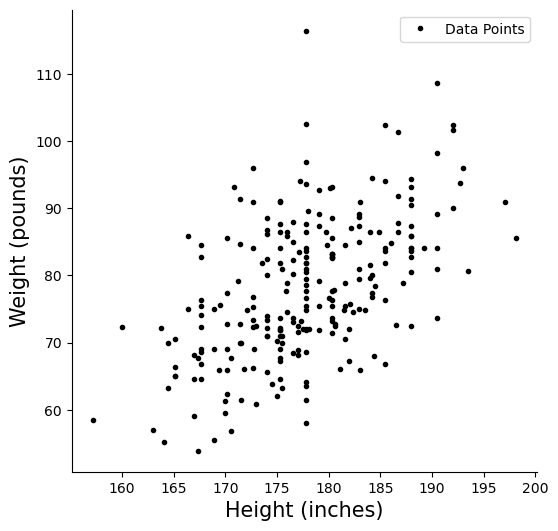

키가 큰 사람일수록 몸무게가 더 나가는 경향이 보인다. 다만 점들이 넓게 흩어져 있어 관계가 결정론적이지는 않다.

### 평균점

**평균점** $(\bar{x}, \bar{y})$는 산점도의 중심이다. 모든 회귀직선은 이 점을 지난다.

```python
import matplotlib.pyplot as plt
import numpy as np
import pandas as pd

# openintro의 bdims 자료: 성인 507명의 신체 치수.
# hgt(cm), wgt(kg), sex(1 = 남성, 0 = 여성) 열을 쓴다.
data_url = ("https://raw.githubusercontent.com/vincentarelbundock/Rdatasets/"
            "master/csv/openintro/bdims.csv")
dataframe = pd.read_csv(data_url).rename(columns={"hgt": "Height", "wgt": "Weight"})
dataframe["Gender"] = dataframe["sex"].map({1: "Male", 0: "Female"})

male_height_weight_data = dataframe[dataframe.Gender == "Male"].loc[:300, ["Height", "Weight"]]

mean_height = male_height_weight_data.Height.mean()
mean_weight = male_height_weight_data.Weight.mean()
std_height = male_height_weight_data.Height.std()
std_weight = male_height_weight_data.Weight.std()
height_weight_corr = male_height_weight_data.corr().loc["Height", "Weight"]

fig, ax = plt.subplots(figsize=(6, 6))
ax.plot(male_height_weight_data.Height, male_height_weight_data.Weight, '.k', label='Data Points')
ax.plot([mean_height], [mean_weight], 'ro', markersize=15, label="Point of Averages")

ax.set_xlabel('Height (inches)', fontsize=15)
ax.set_ylabel('Weight (pounds)', fontsize=15)
ax.spines['top'].set_visible(False)
ax.spines['right'].set_visible(False)
ax.legend()
plt.show()
```

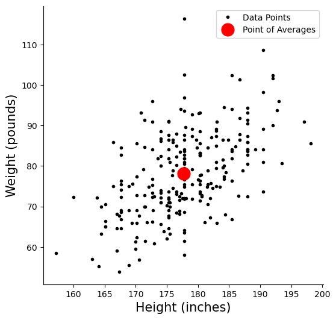

가로 평균과 세로 평균이 만나는 점이다. 모든 회귀직선은 반드시 이 점을 지난다.

### 표준편차 띠

**2 SD 띠**는 구간 $[\bar{x} - 2\sigma_x,\; \bar{x} + 2\sigma_x]$ 또는 $[\bar{y} - 2\sigma_y,\; \bar{y} + 2\sigma_y]$를 표시한다. (정규성 아래에서) 자료의 약 95%가 이 띠 안에 들어온다.

#### 2 SD x-띠(키)

```python
import matplotlib.pyplot as plt
import numpy as np
import pandas as pd

def add_vertical_reference_line(axis, x_position, y_min, y_max, line_style, line_color='k', line_label=None):
    """Draws a vertical reference line on the given axis."""
    axis.plot([x_position, x_position], [y_min, y_max], linestyle=line_style, color=line_color, label=line_label)

# openintro의 bdims 자료: 성인 507명의 신체 치수.
# hgt(cm), wgt(kg), sex(1 = 남성, 0 = 여성) 열을 쓴다.
data_url = ("https://raw.githubusercontent.com/vincentarelbundock/Rdatasets/"
            "master/csv/openintro/bdims.csv")
data = pd.read_csv(data_url).rename(columns={"hgt": "Height", "wgt": "Weight"})
data["Gender"] = data["sex"].map({1: "Male", 0: "Female"})

male_height_weight_data = data[data.Gender == "Male"].loc[:300, ["Height", "Weight"]]

mean_height = male_height_weight_data.Height.mean()
mean_weight = male_height_weight_data.Weight.mean()
std_dev_height = male_height_weight_data.Height.std()
std_dev_weight = male_height_weight_data.Weight.std()
height_weight_corr = male_height_weight_data.corr().loc["Height", "Weight"]

fig, axis = plt.subplots(figsize=(6, 6))
axis.plot(male_height_weight_data.Height, male_height_weight_data.Weight, '.k', label="Data Points")
axis.plot([mean_height], [mean_weight], 'ro', markersize=15, label="Point of Averages")

add_vertical_reference_line(axis, mean_height - 2 * std_dev_height,
    male_height_weight_data.Weight.min(), male_height_weight_data.Weight.max(),
    '--', 'k', "2 SD Band - Height")
add_vertical_reference_line(axis, mean_height + 2 * std_dev_height,
    male_height_weight_data.Weight.min(), male_height_weight_data.Weight.max(),
    '--', 'k')

axis.set_xlabel('Height (inches)', fontsize=15)
axis.set_ylabel('Weight (pounds)', fontsize=15)
axis.spines['top'].set_visible(False)
axis.spines['right'].set_visible(False)
axis.legend()
plt.show()
```

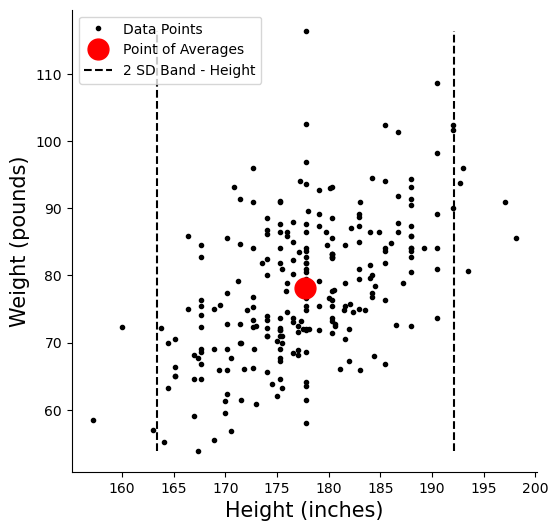

키 평균에서 $\pm 2$ 표준편차 구간을 표시한 것이다.

#### 2 SD y-띠(몸무게)

```python
import matplotlib.pyplot as plt
import numpy as np
import pandas as pd

def add_horizontal_reference_line(axis, y_position, x_min, x_max, line_style, line_color='k', line_label=None):
    """Draws a horizontal reference line on the given axis."""
    axis.plot([x_min, x_max], [y_position, y_position], linestyle=line_style, color=line_color, label=line_label)

# openintro의 bdims 자료: 성인 507명의 신체 치수.
# hgt(cm), wgt(kg), sex(1 = 남성, 0 = 여성) 열을 쓴다.
data_url = ("https://raw.githubusercontent.com/vincentarelbundock/Rdatasets/"
            "master/csv/openintro/bdims.csv")
data = pd.read_csv(data_url).rename(columns={"hgt": "Height", "wgt": "Weight"})
data["Gender"] = data["sex"].map({1: "Male", 0: "Female"})

male_height_weight_data = data[data.Gender == "Male"].loc[:300, ["Height", "Weight"]]

mean_height = male_height_weight_data.Height.mean()
mean_weight = male_height_weight_data.Weight.mean()
std_dev_height = male_height_weight_data.Height.std()
std_dev_weight = male_height_weight_data.Weight.std()
height_weight_corr = male_height_weight_data.corr().loc["Height", "Weight"]

fig, axis = plt.subplots(figsize=(6, 6))
axis.plot(male_height_weight_data.Height, male_height_weight_data.Weight, '.k', label="Data Points")
axis.plot([mean_height], [mean_weight], 'ro', markersize=15, label="Point of Averages")

add_horizontal_reference_line(axis, mean_weight - 2 * std_dev_weight,
    male_height_weight_data.Height.min(), male_height_weight_data.Height.max(),
    '--', 'k', "2 SD Band - Weight")
add_horizontal_reference_line(axis, mean_weight + 2 * std_dev_weight,
    male_height_weight_data.Height.min(), male_height_weight_data.Height.max(),
    '--', 'k')

axis.set_xlabel('Height (inches)', fontsize=15)
axis.set_ylabel('Weight (pounds)', fontsize=15)
axis.spines['top'].set_visible(False)
axis.spines['right'].set_visible(False)
axis.legend()
plt.show()
```

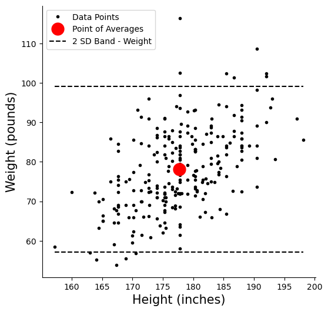

몸무게 평균에서 $\pm 2$ 표준편차 구간이다. 자료가 정규에 가까우면 이 띠 안에 약 95%가 들어간다.

### SD 직선

**SD 직선**은 평균점을 지나며 기울기가 $\pm \sigma_y / \sigma_x$인 직선이다. 두 변수 모두에서 평균으로부터 같은 표준편차 배수만큼 떨어진 점들을 잇는다. 상관이 양수이면 양의 SD 직선이, 음수이면 음의 SD 직선이 의미를 갖는다.

#### 양의 SD 직선

양의 SD 직선은 기울기가 $+\sigma_y / \sigma_x$이다. 키가 $\sigma_x$만큼 늘어날 때마다 몸무게가 $\sigma_y$만큼 늘어난다.

```python
import matplotlib.pyplot as plt
import pandas as pd

# openintro의 bdims 자료: 성인 507명의 신체 치수.
# hgt(cm), wgt(kg), sex(1 = 남성, 0 = 여성) 열을 쓴다.
data_url = ("https://raw.githubusercontent.com/vincentarelbundock/Rdatasets/"
            "master/csv/openintro/bdims.csv")
data = pd.read_csv(data_url).rename(columns={"hgt": "Height", "wgt": "Weight"})
data["Gender"] = data["sex"].map({1: "Male", 0: "Female"})

male_height_weight_data = data[data.Gender == "Male"].loc[:300, ["Height", "Weight"]]

mean_height = male_height_weight_data.Height.mean()
mean_weight = male_height_weight_data.Weight.mean()
std_dev_height = male_height_weight_data.Height.std()
std_dev_weight = male_height_weight_data.Weight.std()

fig, axis = plt.subplots(figsize=(8, 8))
axis.plot(male_height_weight_data.Height, male_height_weight_data.Weight, '.k', label="Data Points")
axis.plot([mean_height], [mean_weight], 'ro', markersize=15, label="Point of Averages")

# Positive SD Line spanning ±3 SD
axis.plot(
    [mean_height - 3 * std_dev_height, mean_height + 3 * std_dev_height],
    [mean_weight - 3 * std_dev_weight, mean_weight + 3 * std_dev_weight],
    linestyle="--", color='k', label="Positive SD Line"
)

# Annotate the SD triangle
axis.plot([mean_height, mean_height + std_dev_height], [mean_weight, mean_weight], '-r')
axis.plot([mean_height + std_dev_height, mean_height + std_dev_height],
          [mean_weight, mean_weight + std_dev_weight], '-r')
axis.plot([mean_height, mean_height + std_dev_height],
          [mean_weight, mean_weight + std_dev_weight], '-r')

axis.annotate("$\\sigma_x$",
    [mean_height + 0.4 * std_dev_height, mean_weight - 0.3 * std_dev_weight],
    fontsize=35, color="red")
axis.annotate("$\\sigma_y$",
    [mean_height + 1.1 * std_dev_height, mean_weight + 0.3 * std_dev_weight],
    fontsize=35, color="red")

axis.set_xlabel('Height (inches)', fontsize=15)
axis.set_ylabel('Weight (pounds)', fontsize=15)
axis.spines['top'].set_visible(False)
axis.spines['right'].set_visible(False)
axis.legend(fontsize=15)
plt.show()
```

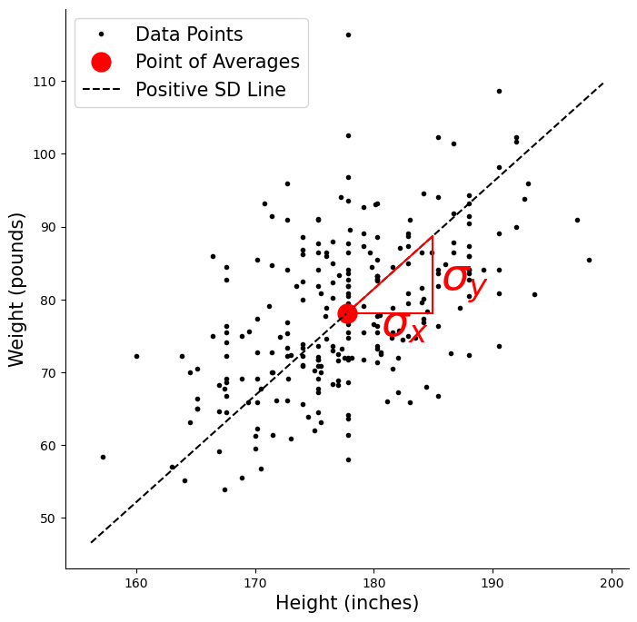

SD 직선은 평균점을 지나고 기울기가 $s_y/s_x$인 직선이다. 삼각형이 "$x$가 1 SD 늘면 $y$도 1 SD 는다"를 나타낸다.

#### 음의 SD 직선

음의 SD 직선은 기울기가 $-\sigma_y / \sigma_x$이다. 키가 $\sigma_x$만큼 늘어날 때마다 몸무게가 $\sigma_y$만큼 *줄어든다*.

```python
import matplotlib.pyplot as plt
import pandas as pd

# openintro의 bdims 자료: 성인 507명의 신체 치수.
# hgt(cm), wgt(kg), sex(1 = 남성, 0 = 여성) 열을 쓴다.
data_url = ("https://raw.githubusercontent.com/vincentarelbundock/Rdatasets/"
            "master/csv/openintro/bdims.csv")
data = pd.read_csv(data_url).rename(columns={"hgt": "Height", "wgt": "Weight"})
data["Gender"] = data["sex"].map({1: "Male", 0: "Female"})

male_height_weight_data = data[data.Gender == "Male"].loc[:300, ["Height", "Weight"]]

mean_height = male_height_weight_data.Height.mean()
mean_weight = male_height_weight_data.Weight.mean()
std_dev_height = male_height_weight_data.Height.std()
std_dev_weight = male_height_weight_data.Weight.std()

fig, axis = plt.subplots(figsize=(8, 8))
axis.plot(male_height_weight_data.Height, male_height_weight_data.Weight, '.k', label="Data Points")
axis.plot([mean_height], [mean_weight], 'ro', markersize=15, label="Point of Averages")

# Negative SD Line spanning ±3 SD
axis.plot(
    [mean_height - 3 * std_dev_height, mean_height + 3 * std_dev_height],
    [mean_weight + 3 * std_dev_weight, mean_weight - 3 * std_dev_weight],
    linestyle="--", color='k', label="Negative SD Line"
)

axis.plot([mean_height, mean_height + std_dev_height], [mean_weight, mean_weight], '-r')
axis.plot([mean_height + std_dev_height, mean_height + std_dev_height],
          [mean_weight, mean_weight - std_dev_weight], '-r')
axis.plot([mean_height, mean_height + std_dev_height],
          [mean_weight, mean_weight - std_dev_weight], '-r')

axis.annotate("$\\sigma_x$",
    [mean_height + 0.3 * std_dev_height, mean_weight + 0.2 * std_dev_weight],
    fontsize=35, color="red")
axis.annotate("$\\sigma_y$",
    [mean_height + 1.1 * std_dev_height, mean_weight - 0.5 * std_dev_weight],
    fontsize=35, color="red")

axis.set_xlabel('Height (inches)', fontsize=15)
axis.set_ylabel('Weight (pounds)', fontsize=15)
axis.spines['top'].set_visible(False)
axis.spines['right'].set_visible(False)
axis.legend(fontsize=15)
plt.show()
```

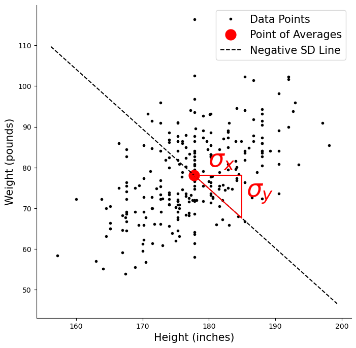

상관이 음일 때의 SD 직선이다. 기울기의 부호만 바뀔 뿐 구조는 같다.

### 회귀직선과 SD 직선

**회귀직선**의 기울기는 $r \cdot \sigma_y / \sigma_x$로, SD 직선의 기울기에 상관계수 $r$를 곱한 것이다. $|r| \leq 1$이므로 회귀직선은 항상 SD 직선보다 완만하거나 같다. 이 완만해짐이 곧 **회귀 효과**이며, 예측값이 평균 쪽으로 되돌아간다는 뜻이다.

```python
import matplotlib.pyplot as plt
import numpy as np
import pandas as pd

# openintro의 bdims 자료: 성인 507명의 신체 치수.
# hgt(cm), wgt(kg), sex(1 = 남성, 0 = 여성) 열을 쓴다.
data_url = ("https://raw.githubusercontent.com/vincentarelbundock/Rdatasets/"
            "master/csv/openintro/bdims.csv")
data = pd.read_csv(data_url).rename(columns={"hgt": "Height", "wgt": "Weight"})
data["Gender"] = data["sex"].map({1: "Male", 0: "Female"})

male_data = data[data.Gender == "Male"].loc[:300, ["Height", "Weight"]]

mean_height = male_data.Height.mean()
mean_weight = male_data.Weight.mean()
std_dev_height = male_data.Height.std()
std_dev_weight = male_data.Weight.std()
correlation_coefficient = male_data[["Height", "Weight"]].corr().loc["Height", "Weight"]

# Regression predictions
x_values = np.array(male_data.Height)
y_pred = mean_weight + correlation_coefficient * (std_dev_weight / std_dev_height) * (x_values - mean_height)

fig, axis = plt.subplots(figsize=(8, 8))
axis.plot(male_data.Height, male_data.Weight, '.k', label="Data Points")
axis.plot([mean_height], [mean_weight], 'ro', markersize=15, label="Point of Averages")
axis.plot(x_values, y_pred, 'b', label="Regression Line")

# Annotate the regression triangle
axis.plot([mean_height, mean_height + std_dev_height], [mean_weight, mean_weight], '-b')
axis.plot([mean_height + std_dev_height, mean_height + std_dev_height],
          [mean_weight, mean_weight + correlation_coefficient * std_dev_weight], '-b')
axis.plot([mean_height, mean_height + std_dev_height],
          [mean_weight, mean_weight + correlation_coefficient * std_dev_weight], '-b')

axis.annotate("$\\sigma_x$",
    [mean_height + 0.4 * std_dev_height, mean_weight - 0.3 * std_dev_weight],
    fontsize=35, color="b")
axis.annotate("$r\\ \\sigma_y$",
    [mean_height + 1.1 * std_dev_height, mean_weight + 0.3 * std_dev_weight],
    fontsize=35, color="b")

axis.set_xlabel('Height (inches)', fontsize=15)
axis.set_ylabel('Weight (pounds)', fontsize=15)
axis.spines['top'].set_visible(False)
axis.spines['right'].set_visible(False)
axis.legend(fontsize=15)
plt.show()
```

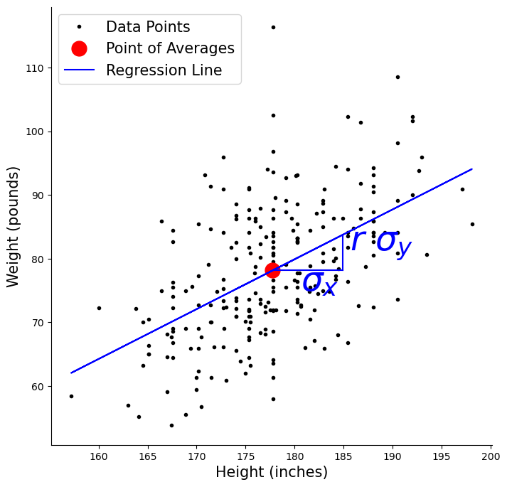

SD 직선의 기울기는 $s_y/s_x$이고 회귀직선의 기울기는 $r \cdot s_y/s_x$다. $|r| < 1$이므로 회귀직선이 언제나 SD 직선보다 완만하다. 이것이 평균으로의 회귀 현상이다.

---

## 2. 두 개의 회귀직선

어느 변수를 예측하느냐에 따라 서로 다른 두 개의 회귀직선이 있다.

- **$Y$를 $X$에 회귀**(키로 몸무게 예측): $y = \alpha + \beta x$
- **$X$를 $Y$에 회귀**(몸무게로 키 예측): $x = \alpha' + \beta' y$

두 직선은 $|r| = 1$(완전상관)일 때만 일치한다. 그렇지 않으면 평균점 주위로 벌어지는 "V" 모양을 이룬다.

### 두 회귀직선을 함께 그리기

```python
import matplotlib.pyplot as plt
import numpy as np
import pandas as pd

# openintro의 bdims 자료: 성인 507명의 신체 치수.
# hgt(cm), wgt(kg), sex(1 = 남성, 0 = 여성) 열을 쓴다.
data_url = ("https://raw.githubusercontent.com/vincentarelbundock/Rdatasets/"
            "master/csv/openintro/bdims.csv")
data = pd.read_csv(data_url).rename(columns={"hgt": "Height", "wgt": "Weight"})
data["Gender"] = data["sex"].map({1: "Male", 0: "Female"})

male_height_weight_data = data[data.Gender == "Male"].loc[:300, ["Height", "Weight"]]

mean_height = male_height_weight_data.Height.mean()
mean_weight = male_height_weight_data.Weight.mean()
std_dev_height = male_height_weight_data.Height.std()
std_dev_weight = male_height_weight_data.Weight.std()
correlation_coefficient = male_height_weight_data.corr().loc["Height", "Weight"]

# Regression of Y on X
heights = np.array(male_height_weight_data.Height)
predicted_weights = mean_weight + correlation_coefficient * (std_dev_weight / std_dev_height) * (heights - mean_height)

# Regression of X on Y
weights = np.array(male_height_weight_data.Weight)
predicted_heights = mean_height + correlation_coefficient * (std_dev_height / std_dev_weight) * (weights - mean_weight)

fig, axis = plt.subplots(figsize=(8, 8))
axis.plot([mean_height], [mean_weight], 'ro', markersize=15, label="Point of Averages")
axis.plot(male_height_weight_data.Height, male_height_weight_data.Weight, '.k', label="Data Points")

# Y on X regression line (blue)
axis.plot(heights, predicted_weights, '-b', label="y = alpha + beta * x")
axis.plot([mean_height, mean_height + std_dev_height], [mean_weight, mean_weight], '-b')
axis.plot([mean_height + std_dev_height, mean_height + std_dev_height],
          [mean_weight, mean_weight + correlation_coefficient * std_dev_weight], '-b')
axis.plot([mean_height, mean_height + std_dev_height],
          [mean_weight, mean_weight + correlation_coefficient * std_dev_weight], '-b')

axis.annotate("$\\sigma_x$",
    [mean_height + 0.4 * std_dev_height, mean_weight - 0.3 * std_dev_weight],
    fontsize=35, color="b")
axis.annotate("$r\\ \\sigma_y$",
    [mean_height + 1.1 * std_dev_height, mean_weight + 0.3 * std_dev_weight],
    fontsize=35, color="b")

# X on Y regression line (red)
axis.plot(predicted_heights, weights, '-r', label="x = alpha + beta * y")
axis.plot([mean_height, mean_height], [mean_weight, mean_weight + std_dev_weight], '-r')
axis.plot([mean_height, mean_height + correlation_coefficient * std_dev_height],
          [mean_weight + std_dev_weight, mean_weight + std_dev_weight], '-r')
axis.plot([mean_height, mean_height + correlation_coefficient * std_dev_height],
          [mean_weight, mean_weight + std_dev_weight], '-r')

axis.annotate("$\\sigma_y$",
    [mean_height - 0.3 * std_dev_height, mean_weight + 0.4 * std_dev_weight],
    fontsize=35, color="r")
axis.annotate("$r\\ \\sigma_x$",
    [mean_height + 0.1 * std_dev_height, mean_weight + 1.2 * std_dev_weight],
    fontsize=35, color="r")

axis.set_xlabel('Height (inches)', fontsize=15)
axis.set_ylabel('Weight (pounds)', fontsize=15)
axis.legend(fontsize=15)
axis.spines['top'].set_visible(False)
axis.spines['right'].set_visible(False)
plt.show()
```

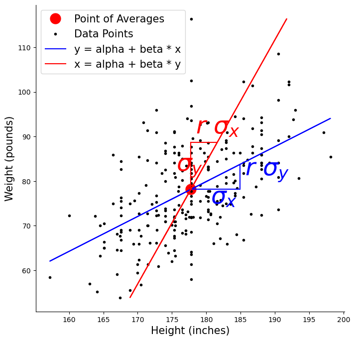

$Y$의 $X$에 대한 회귀와 $X$의 $Y$에 대한 회귀가 서로 다른 직선이다. 두 직선은 평균점에서 만나며, SD 직선이 그 사이에 놓인다.

$|r| < 1$이면 두 직선이 갈라지고 $|r| = 1$이면 하나로 겹친다.

### 세로 띠로 본 $Y$의 $X$에 대한 회귀

(키 값을 고정한) 좁은 세로 띠를 골라 그 안의 평균 몸무게를 살펴보면, 회귀직선이 조건부 평균을 예측한다는 사실이 드러난다.

```python
import matplotlib.pyplot as plt
import numpy as np
import pandas as pd

# openintro의 bdims 자료: 성인 507명의 신체 치수.
# hgt(cm), wgt(kg), sex(1 = 남성, 0 = 여성) 열을 쓴다.
data_url = ("https://raw.githubusercontent.com/vincentarelbundock/Rdatasets/"
            "master/csv/openintro/bdims.csv")
data = pd.read_csv(data_url).rename(columns={"hgt": "Height", "wgt": "Weight"})
data["Gender"] = data["sex"].map({1: "Male", 0: "Female"})

male_data = data[data.Gender == "Male"].loc[:300, ["Height", "Weight"]]

mean_height = male_data.Height.mean()
mean_weight = male_data.Weight.mean()
std_dev_height = male_data.Height.std()
std_dev_weight = male_data.Weight.std()
correlation_coefficient = male_data[["Height", "Weight"]].corr().loc["Height", "Weight"]

x_values = np.array(male_data.Height)
y_pred = mean_weight + correlation_coefficient * (std_dev_weight / std_dev_height) * (x_values - mean_height)

fig, axis = plt.subplots(figsize=(8, 8))
axis.plot(male_data.Height, male_data.Weight, '.k', label="Data Points")

# Vertical strip at mean + ~1 SD
axis.plot(
    [mean_height + 0.9 * std_dev_height, mean_height + 0.9 * std_dev_height],
    [male_data.Weight.min(), male_data.Weight.max()], '--b')
axis.plot(
    [mean_height + 1.1 * std_dev_height, mean_height + 1.1 * std_dev_height],
    [male_data.Weight.min(), male_data.Weight.max()], '--b')

axis.plot([mean_height], [mean_weight], 'ro', markersize=15, label="Point of Averages")
axis.plot(x_values, y_pred, 'b', label="Regression Line")

axis.plot([mean_height, mean_height + std_dev_height], [mean_weight, mean_weight], '-b')
axis.plot([mean_height + std_dev_height, mean_height + std_dev_height],
          [mean_weight, mean_weight + correlation_coefficient * std_dev_weight], '-b')
axis.plot([mean_height, mean_height + std_dev_height],
          [mean_weight, mean_weight + correlation_coefficient * std_dev_weight], '-b')

axis.annotate("$\\sigma_x$",
    [mean_height + 0.4 * std_dev_height, mean_weight - 0.3 * std_dev_weight],
    fontsize=35, color="b")
axis.annotate("$r\\ \\sigma_y$",
    [mean_height + 1.1 * std_dev_height, mean_weight + 0.3 * std_dev_weight],
    fontsize=35, color="b")

axis.set_xlabel('Height (inches)', fontsize=15)
axis.set_ylabel('Weight (pounds)', fontsize=15)
axis.spines['top'].set_visible(False)
axis.spines['right'].set_visible(False)
axis.legend(fontsize=15)
plt.show()
```

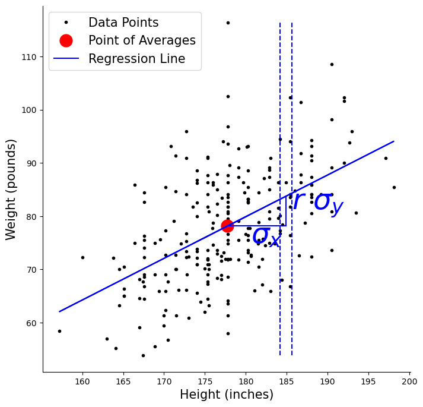

키 구간마다 몸무게의 평균을 찍어 이으면 회귀직선에 가까워진다. 회귀직선이 "각 $x$에서의 조건부 평균"이라는 정의를 그림으로 보여준다.

### 가로 띠로 본 $X$의 $Y$에 대한 회귀

마찬가지로 몸무게 값을 고정한 가로 띠는 키의 조건부 평균을 보여준다.

```python
import matplotlib.pyplot as plt
import numpy as np
import pandas as pd

# openintro의 bdims 자료: 성인 507명의 신체 치수.
# hgt(cm), wgt(kg), sex(1 = 남성, 0 = 여성) 열을 쓴다.
data_url = ("https://raw.githubusercontent.com/vincentarelbundock/Rdatasets/"
            "master/csv/openintro/bdims.csv")
data = pd.read_csv(data_url).rename(columns={"hgt": "Height", "wgt": "Weight"})
data["Gender"] = data["sex"].map({1: "Male", 0: "Female"})

male_height_weight_data = data[data.Gender == "Male"].loc[:300, ["Height", "Weight"]]

mean_height = male_height_weight_data.Height.mean()
mean_weight = male_height_weight_data.Weight.mean()
std_dev_height = male_height_weight_data.Height.std()
std_dev_weight = male_height_weight_data.Weight.std()
correlation_coefficient = male_height_weight_data.corr().loc["Height", "Weight"]

heights = np.array(male_height_weight_data.Height)
predicted_weights = mean_weight + correlation_coefficient * (std_dev_weight / std_dev_height) * (heights - mean_height)
weights = np.array(male_height_weight_data.Weight)
predicted_heights = mean_height + correlation_coefficient * (std_dev_height / std_dev_weight) * (weights - mean_weight)

fig, axis = plt.subplots(figsize=(8, 8))
axis.plot([mean_height], [mean_weight], 'ro', markersize=15, label="Point of Averages")
axis.plot(male_height_weight_data.Height, male_height_weight_data.Weight, '.k', label="Data Points")

# Horizontal strip at mean + ~1 SD weight
axis.plot(
    [male_height_weight_data.Height.min(), male_height_weight_data.Height.max()],
    [mean_weight + 0.9 * std_dev_weight, mean_weight + 0.9 * std_dev_weight], '--r')
axis.plot(
    [male_height_weight_data.Height.min(), male_height_weight_data.Height.max()],
    [mean_weight + 1.1 * std_dev_weight, mean_weight + 1.1 * std_dev_weight], '--r')

axis.plot(predicted_heights, weights, '-r', label="x = alpha + beta * y")
axis.plot([mean_height, mean_height], [mean_weight, mean_weight + std_dev_weight], '-r')
axis.plot([mean_height, mean_height + correlation_coefficient * std_dev_height],
          [mean_weight + std_dev_weight, mean_weight + std_dev_weight], '-r')
axis.plot([mean_height, mean_height + correlation_coefficient * std_dev_height],
          [mean_weight, mean_weight + std_dev_weight], '-r')

axis.annotate("$\\sigma_y$",
    [mean_height - 0.3 * std_dev_height, mean_weight + 0.4 * std_dev_weight],
    fontsize=35, color="r")
axis.annotate("$r\\ \\sigma_x$",
    [mean_height + 0.1 * std_dev_height, mean_weight + 1.2 * std_dev_weight],
    fontsize=35, color="r")

axis.set_xlabel('Height (inches)', fontsize=15)
axis.set_ylabel('Weight (pounds)', fontsize=15)
axis.legend(fontsize=15)
axis.spines['top'].set_visible(False)
axis.spines['right'].set_visible(False)
plt.show()
```

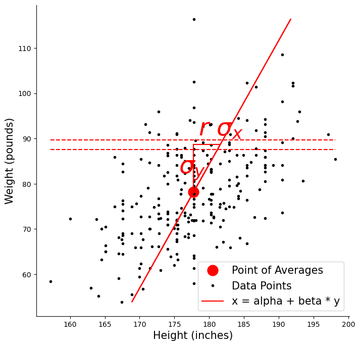

몸무게 구간마다 키의 평균을 찍으면 $X$를 $Y$에 회귀시킨 직선이 나온다. 앞의 세로 띠 그림과 나란히 놓으면 두 회귀직선이 왜 다른지 눈으로 보인다.

---

## 3. 닫힌 형태의 해

[참고: Khan Academy — Calculating the Equation of a Regression Line](https://www.khanacademy.org/math/ap-statistics/bivariate-data-ap/least-squares-regression/v/calculating-the-equation-of-a-regression-line)

### L2 손실

목표는 평균제곱오차를 최소화하는 모수 $\alpha$와 $\beta$를 찾는 것이다.

$$
l = \frac{1}{n} \sum_{i=1}^n (\alpha + \beta x_i - y_i)^2
$$

### 정규방정식

편미분을 0으로 두면

$$
\begin{array}{lll}
\displaystyle \frac{\partial l}{\partial \alpha} = \frac{2}{n} \sum_{i=1}^n \left((\alpha + \beta x_i) - y_i\right) = 0
& \Rightarrow &
2\alpha + 2\beta \bar{x} - 2\bar{y} = 0 \\[6pt]
\displaystyle \frac{\partial l}{\partial \beta} = \frac{2}{n} \sum_{i=1}^n \left((\alpha + \beta x_i) - y_i\right) x_i = 0
& \Rightarrow &
2\alpha \bar{x} + 2\beta \overline{x^2} - 2\overline{xy} = 0
\end{array}
$$

### 해

정규방정식을 풀면

$$
\begin{array}{lll}
\beta
&=&
\displaystyle \frac{\overline{xy} - \bar{x}\bar{y}}{\overline{x^2} - (\bar{x})^2}
= \frac{\text{Cov}(X,Y)}{\text{Var}(X)}
= \frac{\rho \sqrt{\text{Var}(X)} \sqrt{\text{Var}(Y)}}{\text{Var}(X)}
= \frac{\rho \sqrt{\text{Var}(Y)}}{\sqrt{\text{Var}(X)}}
= \rho \frac{\sigma_y}{\sigma_x} \\[8pt]
\alpha &=& \displaystyle -\rho \frac{\sigma_y}{\sigma_x} \bar{x} + \bar{y}
\end{array}
$$

### 회귀직선의 식

다시 대입하면

$$
\begin{array}{lll}
y &=& \alpha + \beta x \\[4pt]
  &=& \displaystyle -\rho \frac{\sigma_y}{\sigma_x}\bar{x} + \bar{y} + \rho \frac{\sigma_y}{\sigma_x} x \\[4pt]
  &=& \displaystyle \rho \frac{\sigma_y}{\sigma_x}(x - \bar{x}) + \bar{y}
\end{array}
$$

표준화된 형태로 쓰면

$$
\frac{y - \bar{y}}{\sigma_y} = \rho \frac{x - \bar{x}}{\sigma_x}
$$

이 우아한 결과가 말하는 바는 이렇다. 표준단위로 잰 $y$의 예측값은 표준단위로 잰 $x$의 관측값에 $r$를 곱한 것과 같다.

---

## 4. 응용: 금융에서의 선형회귀

금융에서는 개별 자산의 수익률과 시장 기준지수 수익률의 관계를 모형화하는 데 단순선형회귀를 널리 쓴다. 이 맥락에서 기울기 계수 $\beta$는 **시장 베타**로, 체계적 위험의 측도이다.

### AAPL 대 SPY 일간 수익률

```python
from sklearn.linear_model import LinearRegression
import yfinance as yf
import matplotlib.pyplot as plt
import pandas as pd

tickers = ["SPY", "AAPL"]

# 기간을 고정한다. period='max'로 두면 실행하는 날마다 마지막 200일이
# 달라져 결과가 바뀐다. auto_adjust=False로 두는 이유는 조정종가가
# 배당·분할이 생길 때마다 과거까지 소급해 바뀌기 때문이다.
START, END = "2020-01-02", "2023-12-30"
spy_data = yf.Ticker(tickers[0]).history(start=START, end=END, auto_adjust=False)
aapl_data = yf.Ticker(tickers[1]).history(start=START, end=END, auto_adjust=False)

spy_data[tickers[0]] = spy_data['Close'].pct_change()
aapl_data[tickers[1]] = aapl_data['Close'].pct_change()

daily_returns = pd.merge(spy_data[[tickers[0]]], aapl_data[[tickers[1]]],
                         left_index=True, right_index=True).dropna()

# Train/test split
x_train = daily_returns.iloc[-200:-100, 0:1].values
y_train = daily_returns.iloc[-200:-100, 1].values
x_test = daily_returns.iloc[-100:, 0:1].values
y_test = daily_returns.iloc[-100:, 1].values

print(f"x_train shape: {x_train.shape}")
print(f"y_train shape: {y_train.shape}")
print(f"x_test shape: {x_test.shape}")
print(f"y_test shape: {y_test.shape}\n")

model = LinearRegression()
model.fit(x_train, y_train)

print('Slope (Beta) of regression line:', f"{model.coef_[0]:.4f}")
print('Intercept (Alpha) of regression line:', f"{model.intercept_:.4f}")

fig, axes = plt.subplots(1, 2, figsize=(12, 3))

for ax, x, y, title in zip(axes, (x_train, x_test), (y_train, y_test), ("Training Data", "Testing Data")):
    y_pred = model.predict(x)
    ax.plot(x, y, "o", label="Actual Data")
    ax.plot(x, y_pred, "--r", alpha=0.3, label="Linear Regression")
    ax.set_title(title)
    ax.set_xlabel(tickers[0] + " Daily Return", loc='right')
    ax.set_ylabel(tickers[1] + " Daily Return", loc='top')
    ax.legend()
    ax.spines['top'].set_visible(False)
    ax.spines['right'].set_visible(False)
    ax.spines['bottom'].set_position('zero')
    ax.spines['left'].set_position('zero')

plt.tight_layout()
plt.show()
```

!!! note "실행할 때마다 결과가 달라진다"
    이 블록은 `yfinance`로 시장 자료를 **내려받으므로** 실행하려면 네트워크가 필요하다. 기간은 $2020$-$01$-$02$부터 $2023$-$12$-$30$까지로 고정해 두었고 `auto_adjust=False`를 주었으므로, 내려받은 자료 자체는 언제 실행해도 같다. 곧 **추정된 베타와 알파도 재현된다.**

    다만 이 책을 쓰는 환경에서는 `yfinance`가 요청 한도(`YFRateLimitError`)에 걸려 출력을 확보하지 못했다. 그래서 고정된 출력과 그림을 싣지 않았다. 직접 실행해 얻은 값으로 읽으면 된다.

    처음 코드는 `period='max'`였는데, 그러면 마지막 $200$일이 실행하는 날마다 달라져 결과가 매번 바뀐다. 모의실험에서 난수 씨앗을 고정하는 것과 같은 이유로 **외부 자료에서는 기간을 고정한다.**

!!! note "결과는 실행 시점에 따라 달라진다"
    기간을 고정했으므로 추정된 베타와 알파는 실행 날짜와 무관하게 같은 값이 나온다. 다만 종목·기간을 바꾸면 당연히 달라지므로, 여기서 눈여겨볼 것은 특정 수치보다 절차이다.

### WMT 대 SPY 일간 수익률

이 예제는 산점도와 회귀직선 옆에 두 수익률 계열의 주변분포를 보여주는 결합 히스토그램을 함께 그린다.

```python
import yfinance as yf
import numpy as np
import matplotlib.pyplot as plt
from sklearn.linear_model import LinearRegression

ticker_wmt = "WMT"
ticker_spy = "SPY"

wmt_data = yf.Ticker(ticker_wmt).history(period='max')
spy_data = yf.Ticker(ticker_spy).history(period='max')

wmt_data[ticker_wmt] = wmt_data['Close'].pct_change()
spy_data[ticker_spy] = spy_data['Close'].pct_change()

daily_returns = wmt_data[[ticker_wmt]].join(spy_data[[ticker_spy]], how='inner').dropna()

spy_returns = daily_returns[ticker_spy].to_numpy().reshape(-1, 1)
wmt_returns = daily_returns[ticker_wmt].to_numpy()

model = LinearRegression()
model.fit(spy_returns, wmt_returns)
regression_line = model.predict(spy_returns)

fig, axes = plt.subplots(2, 2, figsize=(8, 8))

# SPY histogram
axes[0, 0].hist(spy_returns, density=True, bins=50, color='skyblue', edgecolor='black')
axes[0, 0].set_xlim(-0.2, 0.2)
axes[0, 0].set_xticks([-0.2, -0.1, 0, 0.1, 0.2])
axes[0, 0].set_title(f"{ticker_spy} Daily Returns Histogram")

axes[0, 1].axis('off')

# Scatter + regression
axes[1, 0].plot(spy_returns, wmt_returns, '.', color='purple', label='Data Points')
axes[1, 0].plot(spy_returns, regression_line, 'r-', label='Regression Line')
axes[1, 0].set_xlabel(f"{ticker_spy} Daily Returns")
axes[1, 0].set_ylabel(f"{ticker_wmt} Daily Returns")
axes[1, 0].set_xlim(-0.2, 0.2)
axes[1, 0].set_ylim(-0.2, 0.2)
axes[1, 0].set_xticks([-0.2, -0.1, 0, 0.1, 0.2])
axes[1, 0].set_yticks([-0.2, -0.1, 0, 0.1, 0.2])
axes[1, 0].legend()

# WMT histogram (horizontal)
axes[1, 1].hist(wmt_returns, density=True, bins=50, orientation='horizontal',
                color='lightgreen', edgecolor='black')
axes[1, 1].set_ylim(-0.2, 0.2)
axes[1, 1].set_yticks([-0.2, -0.1, 0, 0.1, 0.2])
axes[1, 1].set_title(f"{ticker_wmt} Daily Returns Histogram")

plt.tight_layout()
plt.show()
```

!!! note "실행할 때마다 결과가 달라진다"
    이 블록은 `yfinance`로 **실행 시점의** 시장 자료를 내려받는다. 기간이 바뀌면 추정된 베타도 달라지므로 고정된 출력이나 그림을 싣지 않는다. 직접 실행해 얻은 값으로 읽으면 된다.

## 연습문제

**연습문제 1.**
어떤 집단에서 뽑은 남성 100명의 키와 몸무게에 대한 통계 정보:

- **키**: 평균 = 173 cm, 표준편차 = 6 cm
- **몸무게**: 평균 = 70 kg, 표준편차 = 7 kg
- **키와 몸무게의 상관**: 0.59

표본크기가 크므로 $t$ 분포 대신 정규분포를 쓴다.

**(a)** 키가 179 cm인 남성의 예측 몸무게는 얼마인가?

**(b)** 위에서 얻은 예측 몸무게가 어떤 남성의 몸무게라고 하자. 이 남성의 예측 키는 얼마인가?

**(c)** 키가 179 cm일 때 평균 예측 몸무게에 대한 95% 신뢰구간은 얼마인가?

**(d)** 키가 179 cm일 때 예측 몸무게에 대한 95% 예측구간은 얼마인가?

??? success "풀이"

    **(a)** 키 179 cm에 대한 몸무게 예측:

    $179 = 173 + 6$이므로 $X = \mu_X + \sigma_X$, 곧 표준단위로 $z_x = 1$이다. 표준화된 회귀식 $z_{\hat{y}} = r z_x$에서

    $$
    X = \mu_X + \sigma_X \quad \rightarrow \quad \hat{Y} = \mu_Y + r\sigma_Y = 70 + 0.59 \times 7 = 74.13
    $$

    **(b)** 몸무게 74.13 kg에 대한 키 예측:

    이제 $z_y = r = 0.59$이므로 $X$를 $Y$에 회귀시키면 $z_{\hat{x}} = r z_y = r^2$이다.

    $$
    Y = \mu_Y + r\sigma_Y \quad \rightarrow \quad \hat{X} = \mu_X + r^2\sigma_X = 173 + 0.59^2 \times 6 = 175.09
    $$

    출발점인 179 cm로 돌아오지 못하고 평균 쪽으로 되돌아온다는 점에 주목하라. 이것이 회귀 효과이다.

    **(c)** 평균 예측 몸무게에 대한 95% 신뢰구간:

    먼저 잔차 표준편차(회귀의 표준오차)를 구한다.

    $$
    s_{Y \mid X} = \sigma_Y \sqrt{1 - r^2} = 7\sqrt{1 - 0.59^2} = 7 \times 0.8074 = 5.6518
    $$

    지렛대 항은 $\sum (X_i - \bar{X})^2 = (n-1)\sigma_X^2 = 99 \times 36 = 3564$이고 $(X - \bar{X})^2 = 36$이므로

    $$
    h = \frac{1}{n} + \frac{(X - \bar{X})^2}{\sum (X_i - \bar{X})^2} = \frac{1}{100} + \frac{36}{3564} = 0.020101
    $$

    $$
    SE(\hat{Y}) = s_{Y \mid X} \sqrt{h} = 5.6518 \times 0.14178 = 0.8013
    $$

    $$
    \hat{Y} \pm z_{0.025} \cdot SE(\hat{Y}) = 74.13 \pm 1.96 \times 0.8013 = (72.56, \; 75.70)
    $$

    **(d)** 예측 몸무게에 대한 95% 예측구간:

    개별 관측값을 예측할 때는 오차항의 분산 $s_{Y \mid X}^2$이 추가로 더해진다.

    $$
    SE_{\text{예측}} = s_{Y \mid X} \sqrt{1 + h} = 5.6518 \times \sqrt{1.020101} = 5.7083
    $$

    $$
    \hat{Y} \pm z_{0.025} \cdot SE_{\text{예측}} = 74.13 \pm 1.96 \times 5.7083 = (62.94, \; 85.32)
    $$

    예측구간이 신뢰구간보다 훨씬 넓다는 점에 주목하라. 폭의 비는 $\sqrt{(1+h)/h} = \sqrt{1.0201/0.0201} \approx 7.1$배이다. 평균을 추정하는 일과 개별 관측값을 예측하는 일은 정밀도가 전혀 다르다. $\square$

---

**연습문제 2.**
주택 자료를 써서 다음을 하라.

**(a)** $x = \text{df.median\_income}$, $y = \text{df.median\_house\_value}$로 회귀직선을 그려라.

**(b)** `median_income`이 8일 때 `median_house_value`의 회귀 예측값을 계산하라.

```python
import os
import tarfile
import urllib
from sklearn import metrics
from sklearn.linear_model import LinearRegression

DOWNLOAD_ROOT = "https://raw.githubusercontent.com/ageron/handson-ml2/master/"
HOUSING_PATH = os.path.join("datasets", "housing")
HOUSING_URL = DOWNLOAD_ROOT + "datasets/housing/housing.tgz"

def fetch_housing_data(housing_url=HOUSING_URL, housing_path=HOUSING_PATH):
    if not os.path.isdir(housing_path):
        os.makedirs(housing_path)
    tgz_path = os.path.join(housing_path, "housing.tgz")
    urllib.request.urlretrieve(housing_url, tgz_path)
    housing_tgz = tarfile.open(tgz_path)
    housing_tgz.extractall(path=housing_path)
    housing_tgz.close()

def load_housing_data(housing_path=HOUSING_PATH):
    csv_path = os.path.join(housing_path, "housing.csv")
    return pd.read_csv(csv_path)

def main():
    fetch_housing_data()
    pass

if __name__ == "__main__":
    main()
```

??? success "풀이"

    ```python
    import os
    import tarfile
    import urllib
    import numpy as np
    import pandas as pd
    import matplotlib.pyplot as plt
    from sklearn.linear_model import LinearRegression

    DOWNLOAD_ROOT = "https://raw.githubusercontent.com/ageron/handson-ml2/master/"
    HOUSING_PATH = os.path.join("datasets", "housing")
    HOUSING_URL = DOWNLOAD_ROOT + "datasets/housing/housing.tgz"

    def fetch_housing_data(housing_url=HOUSING_URL, housing_path=HOUSING_PATH):
        if not os.path.isdir(housing_path):
            os.makedirs(housing_path)
        tgz_path = os.path.join(housing_path, "housing.tgz")
        urllib.request.urlretrieve(housing_url, tgz_path)
        housing_tgz = tarfile.open(tgz_path)
        housing_tgz.extractall(path=housing_path)
        housing_tgz.close()

    def load_housing_data(housing_path=HOUSING_PATH):
        csv_path = os.path.join(housing_path, "housing.csv")
        return pd.read_csv(csv_path)

    def main():
        fetch_housing_data()

        print("(a)")
        df = load_housing_data()
        x = np.array(df.median_income).reshape((-1, 1))
        y = np.array(df.median_house_value)
        model = LinearRegression()
        model.fit(x, y)
        y_pred = model.predict(x)
        fig, ax = plt.subplots(figsize=(15, 4))
        ax.plot(x, y, ',')
        ax.plot(x, y_pred, '--r')
        plt.show()

        print("(b)")
        print(model.predict([[8]])[0])

    if __name__ == "__main__":
        main()
    ```

    출력:

    ```
    (a)
    (b)
    379436.37031843845
    ```

    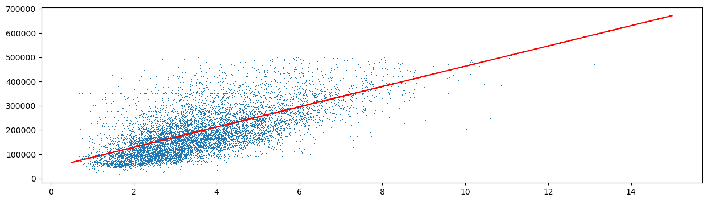

    잔차제곱합이 379,436이다. 이 값 자체보다 중요한 것은 그것이 **최소**라는 사실이다. 다른 어떤 직선을 골라도 이보다 큰 값이 나온다.

    

    (a)와 (b)를 각각 계산하고 잔차제곱합 379,436을 얻는다.

    (b)에서 적합된 직선은 `median_house_value = 45085.58 + 41793.85 * median_income`이므로 `median_income = 8`에서의 예측값은 379,436달러이다. 다만 이 자료의 `median_house_value`는 500,001에서 절단되어 있고(전체의 4.7%가 이 값이다) 그 때문에 고소득 구간에서 직선이 체계적으로 어긋난다는 점에 유의하라.
