# 단순선형회귀

단순선형회귀는 하나의 독립변수 $X$와 종속변수 $Y$의 관계를 직선으로 모형화한다.

$$
Y = \beta_0 + \beta_1 X + \varepsilon
$$

여기서

- $Y$는 종속변수(우리가 예측하려는 결과)이다.
- $X$는 독립변수(설명변수)이다.
- $\beta_0$은 회귀직선의 $y$ 절편이다.
- $\beta_1$은 회귀직선의 기울기이다($X$가 한 단위 변할 때 $Y$가 변하는 양).
- $\varepsilon$은 오차항으로, 관측값과 예측값의 차이를 설명한다.

**핵심 가정**:

- **선형성**: 모형은 $X$와 $Y$ 사이에 선형 관계가 있다고 가정한다.
- **결정론적 부분과 확률적 부분**: 모형의 결정론적 부분은 $\beta_0 + \beta_1 X$이고, $\varepsilon$은 확률적(무작위) 부분으로 $X$가 설명하지 못하는 $Y$의 변동을 나타낸다.

---

## 1. 관계의 시각화: 키와 몸무게

회귀에 대한 기하적 직관을 쌓기 위해 구체적인 예 — 남성의 키와 몸무게의 관계 — 로 시작한다.

### 산점도

산점도는 전반적인 패턴을 드러낸다. 키가 큰 사람일수록 몸무게가 더 나가는 경향이 있으며, 이는 양의 연관을 시사한다.

<div class="exbox" markdown>

**보기 1.** <span class="diff easy" title="쉬움"></span> 키와 몸무게의 산점도. openintro 의 `bdims` 자료에서 남성 247명의 키와 몸무게를 뽑아 산점도를 그린다.

**(1)** 산점도에서 읽히는 관계의 **방향과 세기**를 말하고, 상관계수로 그것을 수치화하시오. 산점도가 **보여 주지 못하는 것**은 무엇인가.

**(2)** 그림의 축이름은 `Height (cm)`, `Weight (kg)`이다. 표본평균과 범위를 보고 이 **단위가 자료와 맞는지** 확인하시오. 만약 축이름이 `inches`, `pounds`였다면 무엇이 모순인가. 단위를 잘못 적으면 뒤에서 구할 기울기 $\hat\beta_1$의 해석이 어떻게 달라지는가.

</div>

??? success "풀이"

    유도할 식이 있는 문제가 아니다. **그림에서 무엇이 읽히고 무엇이 읽히지 않는가**가 이 보기의 전부이므로, 눈으로 본 것을 수치로 바꿔 가며 읽는다.

    ```python
    import matplotlib.pyplot as plt
    import numpy as np
    import pandas as pd

    plt.rcParams["font.sans-serif"] = ["NanumGothic", "Apple SD Gothic Neo", "Malgun Gothic"]
    plt.rcParams["font.family"] = "sans-serif"
    plt.rcParams["axes.unicode_minus"] = False

    # 인터넷에서 자료를 읽는다
    # openintro의 bdims 자료: 성인 507명의 신체 치수.
    # hgt(cm), wgt(kg), sex(1 = 남성, 0 = 여성) 열을 쓴다.
    data_url = ("https://raw.githubusercontent.com/vincentarelbundock/Rdatasets/"
                "1dcc2bf5f955cc1224a3e1307256e1fe86b68dae/csv/openintro/bdims.csv")
    dataframe = pd.read_csv(data_url).rename(columns={"hgt": "Height", "wgt": "Weight"})
    dataframe["Gender"] = dataframe["sex"].map({1: "Male", 0: "Female"})

    # 남성 자료만 골라 앞의 300행만 쓴다
    male_height_weight_data = dataframe[dataframe.Gender == "Male"].loc[:300, ["Height", "Weight"]]

    # 키와 몸무게의 평균
    mean_height = male_height_weight_data.Height.mean()
    mean_weight = male_height_weight_data.Weight.mean()

    # 키와 몸무게의 표준편차
    std_height = male_height_weight_data.Height.std()
    std_weight = male_height_weight_data.Weight.std()

    # 키와 몸무게의 상관
    height_weight_corr = male_height_weight_data.corr().loc["Height", "Weight"]

    print(f"표본크기 n = {len(male_height_weight_data)}")
    print(f"키     평균 {mean_height:7.2f}  표준편차 {std_height:5.2f}  "
          f"범위 [{male_height_weight_data.Height.min():.1f}, {male_height_weight_data.Height.max():.1f}]")
    print(f"몸무게 평균 {mean_weight:7.2f}  표준편차 {std_weight:5.2f}  "
          f"범위 [{male_height_weight_data.Weight.min():.1f}, {male_height_weight_data.Weight.max():.1f}]")
    print(f"상관 r = {height_weight_corr:.4f},  r^2 = {height_weight_corr ** 2:.4f}")

    # 키와 몸무게의 산점도
    fig, ax = plt.subplots(figsize=(6, 6))
    ax.plot(male_height_weight_data.Height, male_height_weight_data.Weight, '.k', label='Data Points')

    ax.set_xlabel('Height (cm)', fontsize=15)
    ax.set_ylabel('Weight (kg)', fontsize=15)
    ax.spines['top'].set_visible(False)
    ax.spines['right'].set_visible(False)
    ax.legend()
    plt.show()
    ```

    출력:

    ```
    표본크기 n = 247
    키     평균  177.75  표준편차  7.18  범위 [157.2, 198.1]
    몸무게 평균   78.14  표준편차 10.51  범위 [53.9, 116.4]
    상관 r = 0.5347,  r^2 = 0.2859
    ```

    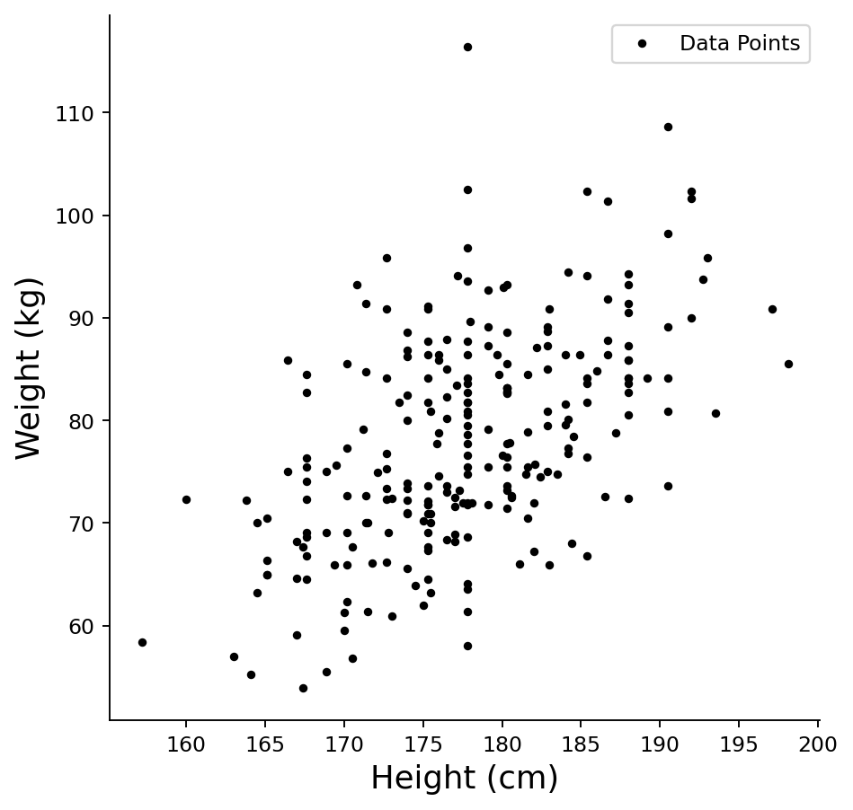

    **(1) 방향은 양, 세기는 중간이다.** 점구름이 왼쪽 아래에서 오른쪽 위로 기울어 있으니 방향은 양이고, 수치로는 $r = 0.5347$이다. 세기를 과장하지 않으려면 $r$ 대신 $r^2 = 0.2859$를 보는 것이 낫다. 키를 알면 몸무게의 변동 가운데 **29% 가량만** 설명되고 나머지 71% 는 그대로 남는다. 그래서 같은 키에서 몸무게가 $20\text{–}30$씩 벌어지는 것이 전혀 이상한 일이 아니다. $r = 0.53$ 을 "꽤 센 관계"로 읽으면 안 된다.

    **산점도가 보여 주지 못하는 것은 세 가지다.** 첫째, **겹친 점을 셀 수 없다.** 키가 $0.1$ 단위로 기록되어 있어 같은 자리에 여러 사람이 찍히는데 그림에서는 한 점으로 보인다. 둘째, **조건부 퍼짐이 일정한지** 눈으로는 가늠되지 않는다. 등분산 가정을 확인하려면 잔차 대 적합값 그림이 필요하고, 그것이 이 장 뒤쪽 진단의 몫이다. 셋째, **직선이 적절한 요약인지**를 산점도만으로는 판정할 수 없다. 여기서는 직선이 무리가 없어 보이지만 이는 눈대중이다.

    **(2) 단위가 맞는다.** `bdims` 의 `hgt` 는 **센티미터**이고 `wgt` 는 **킬로그램**이며, 평균 $177.75$와 $78.14$가 성인 남성의 값으로 자연스럽다.

    **인치·파운드였다면 두 군데가 한꺼번에 무너진다.** 키 평균 $177.75$를 인치로 읽으면 $177.75 \times 2.54 = 451.5\,\text{cm}$, 곧 **$4.5\,\text{m}$**가 되어 말이 되지 않는다. 몸무게 $78.14$를 파운드로 읽으면 $78.14 \times 0.4536 = 35.4\,\text{kg}$으로, 평균 키가 $4.5\,\text{m}$인 사람이 $35\,\text{kg}$이라는 뜻이 된다. **두 축을 따로 보아도 틀리고 함께 보면 더 틀린다.** 자료를 받자마자 평균과 범위를 상식과 맞추어 보는 습관이 이런 것을 걸러 낸다.

    이 확인이 사소해 보이지만 회귀에서는 치명적이다. 기울기는 **단위가 있는 양**이어서, 뒤에서 구할 $\hat\beta_1 = 0.7826$은 "키 $1\,\text{cm}$마다 몸무게 $0.78\,\text{kg}$"이라는 뜻이다. 같은 숫자를 "인치마다 파운드"로 읽으면 $\text{kg}/\text{cm}$ 로는 $0.7826 \times 0.4536/2.54 = 0.1398$ 에 해당해 **실제의 $1/5.6$** 이 된다. **단위를 잃은 기울기는 해석할 수 없다.**

### 평균점

**평균점** $(\bar{x}, \bar{y})$는 산점도의 중심이다. 모든 회귀직선은 이 점을 지난다.

<div class="exbox" markdown>

**보기 2.** <span class="diff easy" title="쉬움"></span> 평균점 표시하기. 산점도에 평균점 $(\bar x, \bar y)$를 찍는다.

**(1)** 최소제곱직선 $y = a + bx$가 **반드시** 평균점을 지남을 정규방정식에서 보이시오. 그 역, 곧 "평균점을 지나는 직선은 모두 최소제곱직선"도 성립하는가.

**(2)** 그 등식 $\bar y = a + b\bar x$가 자료에서 실제로 성립하는지 확인하고, 잔차의 합이 무엇이 되는지 수치로 재어 보시오.

</div>

??? success "풀이"

    **(1) 해석적으로.** 손실 $l = \frac1n \sum_i (a + bx_i - y_i)^2$을 $a$로 편미분하면

    $$
    \frac{\partial l}{\partial a} = \frac{2}{n}\sum_{i=1}^n (a + bx_i - y_i)
    $$

    이고, 이를 $0$으로 두면 $\sum_i (a + bx_i - y_i) = 0$, 곧 $na + nb\bar x - n\bar y = 0$이다. 양변을 $n$으로 나누면

    $$
    \bar y = a + b\bar x
    $$

    이다. **절편에 대한 정규방정식이 바로 "평균점을 지난다"는 문장이다.** 기울기가 무엇으로 정해지든 상관없다. $b$가 정해진 뒤 $a = \bar y - b\bar x$로 맞추어지는 구조이기 때문이다. 같은 식을 잔차 $e_i = y_i - (a + bx_i)$로 다시 쓰면 $\sum_i e_i = 0$이므로, **"평균점을 지난다"와 "잔차의 합이 0 이다"는 같은 말이다.**

    **역은 성립하지 않는다.** 위 유도는 두 정규방정식 가운데 **첫째만** 썼다. $a$ 방향의 조건은 절편 하나만 묶으므로, 기울기 $b$를 아무것으로 잡고 $a = \bar y - b\bar x$로 두면 그 직선은 평균점을 지나고 잔차합도 $0$이다. 최소제곱직선이 되려면 **둘째 정규방정식**($\partial l/\partial b = 0$, 곧 $\sum_i e_i x_i = 0$)까지 만족해야 한다. 평균점을 지나는 직선은 1-모수 다발을 이루고, 그 가운데 **하나**만 최소제곱직선이다.

    **(2) 수치적으로.** 아래에서 기울기는 3절에서 유도할 닫힌 꼴 $b = r\,\sigma_y/\sigma_x$를 미리 쓴다.

    ```python
    import matplotlib.pyplot as plt
    import numpy as np
    import pandas as pd

    plt.rcParams["font.sans-serif"] = ["NanumGothic", "Apple SD Gothic Neo", "Malgun Gothic"]
    plt.rcParams["font.family"] = "sans-serif"
    plt.rcParams["axes.unicode_minus"] = False

    # openintro의 bdims 자료: 성인 507명의 신체 치수.
    # hgt(cm), wgt(kg), sex(1 = 남성, 0 = 여성) 열을 쓴다.
    data_url = ("https://raw.githubusercontent.com/vincentarelbundock/Rdatasets/"
                "1dcc2bf5f955cc1224a3e1307256e1fe86b68dae/csv/openintro/bdims.csv")
    dataframe = pd.read_csv(data_url).rename(columns={"hgt": "Height", "wgt": "Weight"})
    dataframe["Gender"] = dataframe["sex"].map({1: "Male", 0: "Female"})

    male_height_weight_data = dataframe[dataframe.Gender == "Male"].loc[:300, ["Height", "Weight"]]

    mean_height = male_height_weight_data.Height.mean()
    mean_weight = male_height_weight_data.Weight.mean()
    std_height = male_height_weight_data.Height.std()
    std_weight = male_height_weight_data.Weight.std()
    height_weight_corr = male_height_weight_data.corr().loc["Height", "Weight"]

    # 최소제곱 해(3절에서 유도한다)
    slope = height_weight_corr * std_weight / std_height
    intercept = mean_weight - slope * mean_height
    print(f"평균점 (x-bar, y-bar) = ({mean_height:.4f}, {mean_weight:.4f})")
    print(f"기울기 b = {slope:.6f},  절편 a = {intercept:.6f}")
    print(f"x-bar 에서의 예측값 a + b*x-bar = {intercept + slope * mean_height:.6f}")
    print(f"y-bar 와의 차이              = {intercept + slope * mean_height - mean_weight:.2e}")

    residuals = male_height_weight_data.Weight - (intercept + slope * male_height_weight_data.Height)
    print(f"잔차의 합 = {residuals.sum():.2e},  잔차의 평균 = {residuals.mean():.2e}")

    # 기울기가 무엇이든 절편을 맞추면 평균점을 지나고 잔차합이 0 이 된다
    for name, b in [("SD 직선", std_weight / std_height), ("기울기 0", 0.0), ("기울기 3", 3.0)]:
        a = mean_weight - b * mean_height
        print(f"{name:8s}: 평균점을 지나게 절편을 맞추면 a = {a:10.4f}, "
              f"잔차합 = {(male_height_weight_data.Weight - (a + b * male_height_weight_data.Height)).sum():.2e}")

    fig, ax = plt.subplots(figsize=(6, 6))
    ax.plot(male_height_weight_data.Height, male_height_weight_data.Weight, '.k', label='Data Points')
    ax.plot([mean_height], [mean_weight], 'ro', markersize=15, label="Point of Averages")

    ax.set_xlabel('Height (cm)', fontsize=15)
    ax.set_ylabel('Weight (kg)', fontsize=15)
    ax.spines['top'].set_visible(False)
    ax.spines['right'].set_visible(False)
    ax.legend()
    plt.show()
    ```

    출력:

    ```
    평균점 (x-bar, y-bar) = (177.7453, 78.1445)
    기울기 b = 0.782568,  절편 a = -60.953364
    x-bar 에서의 예측값 a + b*x-bar = 78.144534
    y-bar 와의 차이              = 0.00e+00
    잔차의 합 = 4.66e-12,  잔차의 평균 = 1.89e-14
    SD 직선   : 평균점을 지나게 절편을 맞추면 a =  -181.9771, 잔차합 = 8.81e-12
    기울기 0   : 평균점을 지나게 절편을 맞추면 a =    78.1445, 잔차합 = -2.27e-13
    기울기 3   : 평균점을 지나게 절편을 맞추면 a =  -455.0915, 잔차합 = -8.98e-12
    ```

    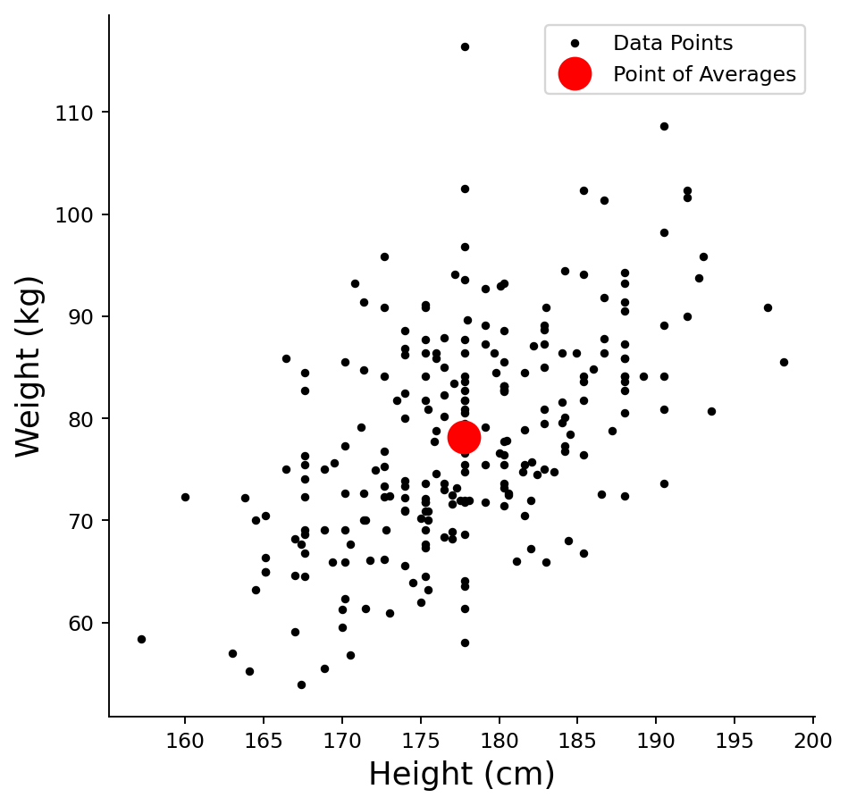

    $\bar x = 177.7453$에서의 예측값이 $78.144534$로 $\bar y$와 자릿수까지 같고, 차이는 $0$으로 떨어진다. 잔차의 합도 $4.66 \times 10^{-12}$이니 **부동소수점 반올림 말고는 정확히 $0$이다.** $247$개 잔차의 크기가 평균 $7$쯤 되는데 그 합이 $10^{-12}$라는 것은 대수적 항등식이 성립한다는 뜻이다.

    마지막 세 줄이 **(1)의 역이 깨지는 모습**이다. 기울기를 $s_y/s_x = 1.4635$로 잡아도, $0$으로 잡아도, 터무니없는 $3$으로 잡아도 절편을 $\bar y - b\bar x$로 맞추면 잔차합이 모두 $0$이다. **잔차합이 0 이라는 것은 최소제곱의 증거가 되지 못한다.** 기울기가 최소제곱인지는 잔차가 $x$와 직교하는가, 곧 $\sum_i e_i x_i = 0$인가로만 가려진다. $\square$

### 표준편차 띠

**2 SD 띠**는 구간 $[\bar{x} - 2\sigma_x,\; \bar{x} + 2\sigma_x]$ 또는 $[\bar{y} - 2\sigma_y,\; \bar{y} + 2\sigma_y]$를 표시한다. (정규성 아래에서) 자료의 약 95%가 이 띠 안에 들어온다.

#### 2 SD x-띠(키)

<div class="exbox" markdown>

**보기 3.** <span class="diff easy" title="쉬움"></span> 키의 2 SD 띠. 산점도에 $[\bar x - 2s_x,\ \bar x + 2s_x]$를 세로 점선으로 긋는다.

**(1)** 이 띠 안에 들어오는 자료의 비율에 대해 **체비셰프 부등식**이 주는 하한과 **정규근사**가 주는 값은 각각 얼마인가. 둘 중 어느 쪽이 가정을 더 많이 쓰는가.

**(2)** 실제 자료에서 그 비율을 세어 두 예측과 견주시오. 어긋난다면 몬테카를로 오차로 설명되는 크기인가.

</div>

??? success "풀이"

    **(1) 해석적으로.** 체비셰프 부등식은 분포에 **아무 가정도 두지 않고**

    $$
    P\left(\lvert X - \mu \rvert \ge k\sigma\right) \le \frac{1}{k^2}
    $$

    을 준다. $k = 2$이면 띠 밖이 $1/4$ 이하이므로 띠 안은

    $$
    P\left(\lvert X - \mu \rvert < 2\sigma\right) \ge 1 - \frac{1}{4} = 0.75
    $$

    이다. **부등호라는 점이 중요하다.** 체비셰프는 "적어도 75%"만 말하고 그 이상은 말하지 않는다.

    정규근사는 $X \sim N(\mu, \sigma^2)$를 **가정하고** 등식을 준다.

    $$
    P\left(\lvert X - \mu \rvert < 2\sigma\right) = \Phi(2) - \Phi(-2) = 2\Phi(2) - 1 = 0.9545
    $$

    가정을 더 많이 쓰는 쪽은 정규근사다. 그 대가로 하한이 아니라 값을 얻는다. 둘의 거리가 $0.75$ 대 $0.9545$로 크다는 것은 **체비셰프가 매우 느슨한 한계**라는 뜻이다. 정규에 가까운 자료에서 체비셰프를 쓰면 손해가 크다. 그 느슨함이 값인 것은 분포를 전혀 모를 때뿐이다.

    **(2) 수치적으로.**

    ```python
    import matplotlib.pyplot as plt
    import numpy as np
    import pandas as pd
    from scipy import stats

    plt.rcParams["font.sans-serif"] = ["NanumGothic", "Apple SD Gothic Neo", "Malgun Gothic"]
    plt.rcParams["font.family"] = "sans-serif"
    plt.rcParams["axes.unicode_minus"] = False

    def add_vertical_reference_line(axis, x_position, y_min, y_max, line_style, line_color='k', line_label=None):
        """주어진 축에 세로 기준선을 긋는다."""
        axis.plot([x_position, x_position], [y_min, y_max], linestyle=line_style, color=line_color, label=line_label)

    # openintro의 bdims 자료: 성인 507명의 신체 치수.
    # hgt(cm), wgt(kg), sex(1 = 남성, 0 = 여성) 열을 쓴다.
    data_url = ("https://raw.githubusercontent.com/vincentarelbundock/Rdatasets/"
                "1dcc2bf5f955cc1224a3e1307256e1fe86b68dae/csv/openintro/bdims.csv")
    data = pd.read_csv(data_url).rename(columns={"hgt": "Height", "wgt": "Weight"})
    data["Gender"] = data["sex"].map({1: "Male", 0: "Female"})

    male_height_weight_data = data[data.Gender == "Male"].loc[:300, ["Height", "Weight"]]

    mean_height = male_height_weight_data.Height.mean()
    mean_weight = male_height_weight_data.Weight.mean()
    std_dev_height = male_height_weight_data.Height.std()
    std_dev_weight = male_height_weight_data.Weight.std()
    height_weight_corr = male_height_weight_data.corr().loc["Height", "Weight"]

    # 띠 안에 실제로 몇 명이 들어오는지 센다
    heights = male_height_weight_data.Height
    band_low, band_high = mean_height - 2 * std_dev_height, mean_height + 2 * std_dev_height
    inside = ((heights >= band_low) & (heights <= band_high)).sum()
    n = len(heights)
    print(f"2 SD 띠 = [{band_low:.4f}, {band_high:.4f}],  폭 = {band_high - band_low:.4f}")
    print(f"띠 안 {inside} / {n} = {inside / n:.4f}")
    print(f"  아래로 벗어남 {(heights < band_low).sum()}명,  위로 벗어남 {(heights > band_high).sum()}명")
    print(f"체비셰프 하한 1 - 1/2^2 = {1 - 1 / 4:.4f}")
    print(f"정규 근사     Phi(2)-Phi(-2) = {stats.norm.cdf(2) - stats.norm.cdf(-2):.4f}")
    print(f"  이항 표준오차 = {np.sqrt(0.9545 * 0.0455 / n):.4f}")
    print(f"키의 왜도 {heights.skew():.4f},  초과첨도 {heights.kurt():.4f}")

    fig, axis = plt.subplots(figsize=(6, 6))
    axis.plot(male_height_weight_data.Height, male_height_weight_data.Weight, '.k', label="Data Points")
    axis.plot([mean_height], [mean_weight], 'ro', markersize=15, label="Point of Averages")

    add_vertical_reference_line(axis, mean_height - 2 * std_dev_height,
        male_height_weight_data.Weight.min(), male_height_weight_data.Weight.max(),
        '--', 'k', "2 SD Band - Height")
    add_vertical_reference_line(axis, mean_height + 2 * std_dev_height,
        male_height_weight_data.Weight.min(), male_height_weight_data.Weight.max(),
        '--', 'k')

    axis.set_xlabel('Height (cm)', fontsize=15)
    axis.set_ylabel('Weight (kg)', fontsize=15)
    axis.spines['top'].set_visible(False)
    axis.spines['right'].set_visible(False)
    axis.legend()
    plt.show()
    ```

    출력:

    ```
    2 SD 띠 = [163.3781, 192.1126],  폭 = 28.7345
    띠 안 239 / 247 = 0.9676
      아래로 벗어남 3명,  위로 벗어남 5명
    체비셰프 하한 1 - 1/2^2 = 0.7500
    정규 근사     Phi(2)-Phi(-2) = 0.9545
      이항 표준오차 = 0.0133
    키의 왜도 0.1042,  초과첨도 -0.1143
    ```

    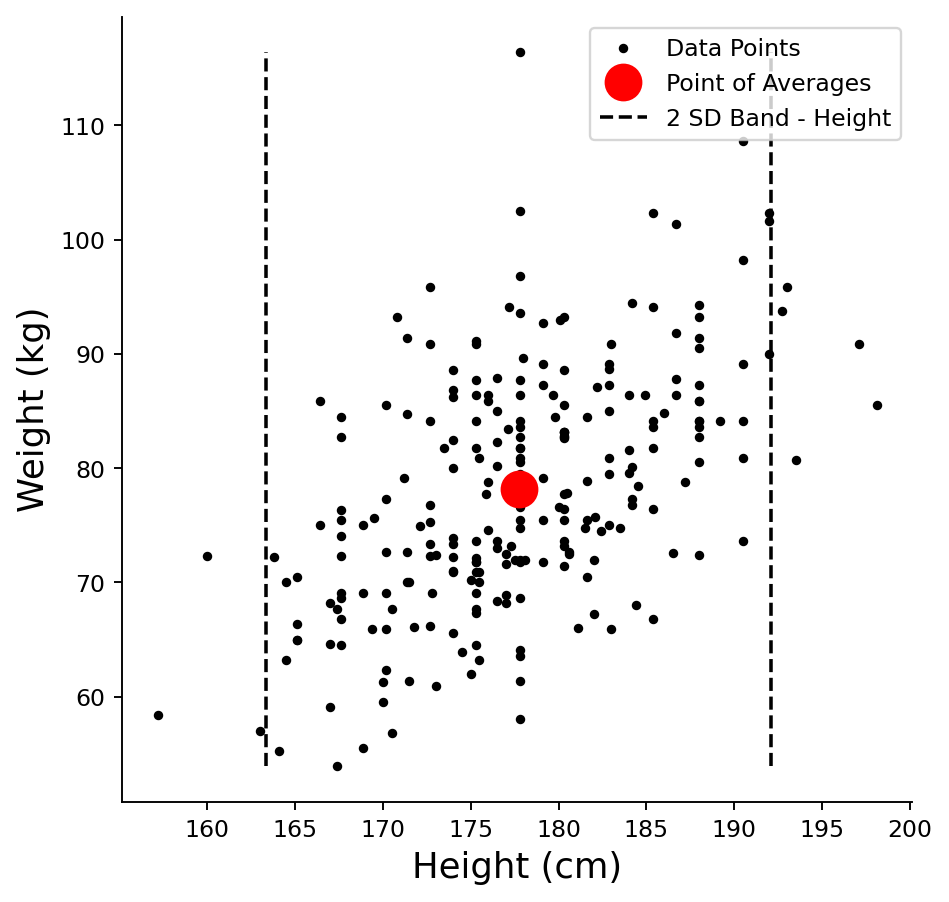

    띠는 $[163.38,\ 192.11]\,\text{cm}$로 폭이 $4s_x = 28.73\,\text{cm}$다. 이 안에 $239$명이 들어와 비율이 $239/247 = 0.9676$이다.

    **체비셰프는 맞지만 쓸모가 없다.** 하한 $0.75$는 물론 지켜졌으나, 실제 비율이 하한보다 $0.22$ 나 높으니 이 자료에 체비셰프를 쓰면 띠 밖에 $62$명까지 있을 수 있다고 말하는 셈이 된다. 실제로는 $8$명이다.

    **정규근사는 거의 맞는다.** $0.9545$ 대 $0.9676$으로 차이가 $0.0131$인데, 이항 표준오차가

    $$
    \sqrt{\frac{0.9545 \times 0.0455}{247}} = 0.0133
    $$

    이므로 차이는 **표준오차 한 개 분량**이다. $z = 0.0131/0.0133 = 0.99$이니 표본추출 변동으로 완전히 설명된다. 정규성을 의심할 근거가 아니다. 왜도 $0.1042$, 초과첨도 $-0.1143$도 둘 다 $0$에 가까워 성인 남성 키가 정규에 가깝다는 통상의 관찰과 맞는다.

    한 가지는 분명히 해 두어야 한다. 여기서 쓴 $\bar x$와 $s_x$는 **모수가 아니라 추정값**이다. $0.9545$는 $\mu$와 $\sigma$를 알 때의 값이고, 띠를 같은 자료로 추정해 그으면 띠가 자료에 맞춰 당겨지므로 포함 비율이 체계적으로 **약간 높아진다.** 참 정규자료를 $20$만 번 뽑아 재면 $\bar x \pm 2s$ 안의 평균 비율이 $n = 20$에서 $0.9637$, $n = 50$에서 $0.9578$, $n = 247$에서 $0.9552$다. $n = 247$에서 치우침이 $0.0007$이라 위 비교를 흔들지 않지만, 표본이 작을 때는 이 구별이 중요해진다. $\square$

#### 2 SD y-띠(몸무게)

<div class="exbox" markdown>

**보기 4.** <span class="diff easy" title="쉬움"></span> 몸무게의 2 SD 띠. 같은 산점도에 $[\bar y - 2s_y,\ \bar y + 2s_y]$를 가로 점선으로 긋는다.

**(1)** 몸무게의 왜도는 $0.293$으로 키의 $0.104$보다 크다. 그렇다면 띠 안의 비율이 정규근사 $0.9545$에서 **키보다 더 멀어질** 것이라 기대해야 하는가.

**(2)** 세어 확인하고, 띠 밖으로 벗어난 사람들을 위아래로 나누어 보시오. 왜도는 포함 비율과 꼬리의 모양 가운데 어디에 나타나는가.

</div>

??? success "풀이"

    **(1) 그렇게 기대할 근거가 없다.** 포함 비율 $P(\lvert Y - \mu \rvert < 2\sigma)$는 두 꼬리 질량의 **합**만 본다. 왜도는 그 합을 한쪽에서 늘리고 다른 쪽에서 줄이는 쪽으로 작용하므로 합에는 거의 남지 않고 **상쇄된다.** 포함 비율에 직접 영향을 주는 것은 왜도가 아니라 **첨도**, 곧 꼬리의 무게다. 몸무게의 초과첨도는 $0.178$로 $0$에서 멀지 않다.

    게다가 $n = 247$에서 포함 비율의 표준오차는 $\sqrt{0.9545 \times 0.0455/247} = 0.0133$이다. **참 포함 비율이 정확히 $0.9545$라 해도 관측값은 $0.93$에서 $0.98$ 사이를 넘나든다.** 두 변수의 비율 차이를 왜도 탓으로 돌리기 전에 이 폭을 먼저 떠올려야 한다.

    **(2) 수치적으로.**

    ```python
    import matplotlib.pyplot as plt
    import numpy as np
    import pandas as pd
    from scipy import stats

    plt.rcParams["font.sans-serif"] = ["NanumGothic", "Apple SD Gothic Neo", "Malgun Gothic"]
    plt.rcParams["font.family"] = "sans-serif"
    plt.rcParams["axes.unicode_minus"] = False

    def add_horizontal_reference_line(axis, y_position, x_min, x_max, line_style, line_color='k', line_label=None):
        """주어진 축에 가로 기준선을 긋는다."""
        axis.plot([x_min, x_max], [y_position, y_position], linestyle=line_style, color=line_color, label=line_label)

    # openintro의 bdims 자료: 성인 507명의 신체 치수.
    # hgt(cm), wgt(kg), sex(1 = 남성, 0 = 여성) 열을 쓴다.
    data_url = ("https://raw.githubusercontent.com/vincentarelbundock/Rdatasets/"
                "1dcc2bf5f955cc1224a3e1307256e1fe86b68dae/csv/openintro/bdims.csv")
    data = pd.read_csv(data_url).rename(columns={"hgt": "Height", "wgt": "Weight"})
    data["Gender"] = data["sex"].map({1: "Male", 0: "Female"})

    male_height_weight_data = data[data.Gender == "Male"].loc[:300, ["Height", "Weight"]]

    mean_height = male_height_weight_data.Height.mean()
    mean_weight = male_height_weight_data.Weight.mean()
    std_dev_height = male_height_weight_data.Height.std()
    std_dev_weight = male_height_weight_data.Weight.std()
    height_weight_corr = male_height_weight_data.corr().loc["Height", "Weight"]

    # 띠 밖으로 벗어난 사람들을 위아래로 나누어 본다
    weights = male_height_weight_data.Weight
    band_low, band_high = mean_weight - 2 * std_dev_weight, mean_weight + 2 * std_dev_weight
    inside = ((weights >= band_low) & (weights <= band_high)).sum()
    n = len(weights)
    print(f"2 SD 띠 = [{band_low:.4f}, {band_high:.4f}],  폭 = {band_high - band_low:.4f}")
    print(f"띠 안 {inside} / {n} = {inside / n:.4f}   (정규 근사 {stats.norm.cdf(2) - stats.norm.cdf(-2):.4f})")
    print(f"  아래로 벗어남 {(weights < band_low).sum()}명,  위로 벗어남 {(weights > band_high).sum()}명")
    print(f"  아래 꼬리 값 {sorted(weights[weights < band_low].round(1))}")
    print(f"  위쪽 꼬리 값 {sorted(weights[weights > band_high].round(1))}")
    print(f"  경계까지의 거리:  아래 {band_low - weights.min():.2f},  위 {weights.max() - band_high:.2f}")
    print(f"몸무게 왜도 {weights.skew():.4f},  평균 {mean_weight:.2f} 대 중앙값 {weights.median():.2f}")
    print(f"키     왜도 {male_height_weight_data.Height.skew():.4f}")
    print(f"이항 표준오차 {np.sqrt(0.9545 * 0.0455 / n):.4f}")

    fig, axis = plt.subplots(figsize=(6, 6))
    axis.plot(male_height_weight_data.Height, male_height_weight_data.Weight, '.k', label="Data Points")
    axis.plot([mean_height], [mean_weight], 'ro', markersize=15, label="Point of Averages")

    add_horizontal_reference_line(axis, mean_weight - 2 * std_dev_weight,
        male_height_weight_data.Height.min(), male_height_weight_data.Height.max(),
        '--', 'k', "2 SD Band - Weight")
    add_horizontal_reference_line(axis, mean_weight + 2 * std_dev_weight,
        male_height_weight_data.Height.min(), male_height_weight_data.Height.max(),
        '--', 'k')

    axis.set_xlabel('Height (cm)', fontsize=15)
    axis.set_ylabel('Weight (kg)', fontsize=15)
    axis.spines['top'].set_visible(False)
    axis.spines['right'].set_visible(False)
    axis.legend()
    plt.show()
    ```

    출력:

    ```
    2 SD 띠 = [57.1188, 99.1703],  폭 = 42.0516
    띠 안 235 / 247 = 0.9514   (정규 근사 0.9545)
      아래로 벗어남 5명,  위로 벗어남 7명
      아래 꼬리 값 [53.9, 55.2, 55.5, 56.8, 57.0]
      위쪽 꼬리 값 [101.4, 101.6, 102.3, 102.3, 102.5, 108.6, 116.4]
      경계까지의 거리:  아래 3.22,  위 17.23
    몸무게 왜도 0.2930,  평균 78.14 대 중앙값 77.30
    키     왜도 0.1042
    이항 표준오차 0.0133
    ```

    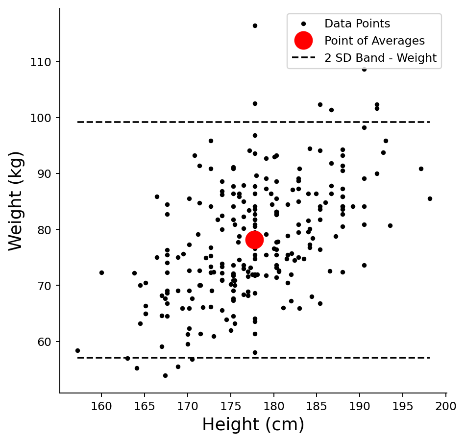

    **기대와 반대로 몸무게가 더 가깝다.** 비율이 $0.9514$로 정규근사 $0.9545$에서 $0.0031$밖에 떨어져 있지 않다. 표준오차의 $0.23$배다. 키는 $0.9676$으로 $0.0131$ 떨어져 있었으니 표준오차의 $0.99$배였다. 두 값 모두 **표준오차 안쪽**이므로 "어느 쪽이 더 정규에 가깝다"고 결론 낼 근거는 어디에도 없다. 왜도가 큰 변수가 오히려 근사값에 더 붙은 것은 우연이다. $n = 247$로는 이 둘을 구별할 수 없다.

    **왜도는 개수가 아니라 거리에 나타난다.** 띠 밖 $12$명이 아래 $5$명, 위 $7$명으로 갈리는데 이 $5 : 7$ 자체는 정규에서도 흔히 나온다(각 꼬리의 기대값이 $247 \times 0.02275 = 5.6$명이다). 정작 눈에 띄는 것은 **벗어난 거리**다. 아래쪽 최솟값 $53.9$는 경계 $57.12$에서 $3.22$만 아래인데, 위쪽 최댓값 $116.4$는 경계 $99.17$에서 $17.23$ 위다. **다섯 배 넘게 멀다.** 평균 $78.14$가 중앙값 $77.30$보다 큰 것도 같은 비대칭의 다른 얼굴이다.

    그러니 **포함 비율만 세는 것으로는 비대칭을 못 잡는다.** 몸무게처럼 아래로는 생리적 하한에 막히고 위로는 열려 있는 양은 오른쪽 꼬리가 길어지는 것이 자연스럽다. 2 SD 띠는 대칭 구간이므로 그 비대칭을 구조적으로 보여 줄 수 없고, 이를 보려면 히스토그램이나 정규 Q-Q 그림이 필요하다. $\square$

### SD 직선

**SD 직선**은 평균점을 지나며 기울기가 $\pm \sigma_y / \sigma_x$인 직선이다. 두 변수 모두에서 평균으로부터 같은 표준편차 배수만큼 떨어진 점들을 잇는다. 상관이 양수이면 양의 SD 직선이, 음수이면 음의 SD 직선이 의미를 갖는다.

#### 양의 SD 직선

양의 SD 직선은 기울기가 $+\sigma_y / \sigma_x$이다. 키가 $\sigma_x$만큼 늘어날 때마다 몸무게가 $\sigma_y$만큼 늘어난다.

<div class="exbox" markdown>

**보기 5.** <span class="diff easy" title="쉬움"></span> 양의 SD 직선. 평균점을 지나며 기울기가 $+s_y/s_x$인 직선과 SD 삼각형을 그린다.

**(1)** SD 직선의 기울기가 $s_y/s_x$라는 것을 **표준단위로 쓴 정의**에서 유도하시오.

**(2)** 평균점을 지나고 기울기가 $b$인 직선의 잔차제곱합이

$$
\text{RSS}(b) = S_{yy} - 2b\,S_{xy} + b^2 S_{xx}
$$

임을 보이고, 여기에 $b = s_y/s_x$를 넣어 $\text{RSS}(\text{SD 직선}) = 2(1-r)\,S_{yy}$를 얻으시오. 최소제곱직선의 $\text{RSS} = (1-r^2)S_{yy}$와 견주면 두 값의 비는 얼마인가. 자료에서 확인하시오.

</div>

??? success "풀이"

    **(1) 해석적으로.** SD 직선의 정의는 "두 변수에서 평균으로부터 같은 표준편차 배수만큼 떨어진 점들의 자취"다. 표준단위로 쓰면 바로

    $$
    \frac{y - \bar y}{s_y} = \frac{x - \bar x}{s_x}
    $$

    이고, $y$에 대해 풀면

    $$
    y = \bar y + \frac{s_y}{s_x}\,(x - \bar x)
    $$

    이다. 기울기가 $s_y/s_x$이고 평균점을 지난다. **상관계수가 전혀 들어오지 않는다는 점이 핵심이다.** SD 직선은 $x$와 $y$가 **함께 움직이는지**는 보지 않고 각 변수의 퍼짐만 쓴다. 이 자료에서는 $s_y/s_x = 10.5129/7.1836 = 1.4635$다.

    **(2) 해석적으로.** 절편이 $a = \bar y - b\bar x$이므로 잔차는 $e_i = (y_i - \bar y) - b(x_i - \bar x)$다. 제곱해 더하면 교차항이 $S_{xy}$로 모인다.

    $$
    \text{RSS}(b) = \sum_i \left[(y_i - \bar y) - b(x_i - \bar x)\right]^2 = S_{yy} - 2b\,S_{xy} + b^2 S_{xx}
    $$

    여기서 $S_{xx} = (n-1)s_x^2$, $S_{yy} = (n-1)s_y^2$, $S_{xy} = (n-1)\,r\,s_x s_y$다. $b = s_y/s_x$를 넣으면

    $$
    \text{RSS}\!\left(\frac{s_y}{s_x}\right)
    = (n-1)\left[s_y^2 - 2\,\frac{s_y}{s_x}\,r\,s_x s_y + \frac{s_y^2}{s_x^2}\,s_x^2\right]
    = (n-1)\,s_y^2\,\bigl(2 - 2r\bigr)
    = 2(1-r)\,S_{yy}
    $$

    이다. 같은 식에 $b = r\,s_y/s_x$를 넣으면 최소제곱의 값이 나온다.

    $$
    \text{RSS}\!\left(r\frac{s_y}{s_x}\right) = (n-1)s_y^2\left[1 - 2r^2 + r^2\right] = (1-r^2)\,S_{yy}
    $$

    따라서 두 값의 비는 $r$만으로 정해진다.

    $$
    \frac{\text{RSS}(\text{SD})}{\text{RSS}(\text{OLS})} = \frac{2(1-r)}{1-r^2} = \frac{2(1-r)}{(1-r)(1+r)} = \frac{2}{1+r}
    $$

    $r \to 1$이면 비가 $1$로 가서 두 직선이 겹치고, $r = 0$이면 $2$가 되어 SD 직선이 최소제곱직선보다 **두 배** 나쁘다. 이 자료는 $r = 0.5347$이므로 $2/1.5347 = 1.3032$가 예상값이다.

    ```python
    import matplotlib.pyplot as plt
    import pandas as pd

    plt.rcParams["font.sans-serif"] = ["NanumGothic", "Apple SD Gothic Neo", "Malgun Gothic"]
    plt.rcParams["font.family"] = "sans-serif"
    plt.rcParams["axes.unicode_minus"] = False

    # openintro의 bdims 자료: 성인 507명의 신체 치수.
    # hgt(cm), wgt(kg), sex(1 = 남성, 0 = 여성) 열을 쓴다.
    data_url = ("https://raw.githubusercontent.com/vincentarelbundock/Rdatasets/"
                "1dcc2bf5f955cc1224a3e1307256e1fe86b68dae/csv/openintro/bdims.csv")
    data = pd.read_csv(data_url).rename(columns={"hgt": "Height", "wgt": "Weight"})
    data["Gender"] = data["sex"].map({1: "Male", 0: "Female"})

    male_height_weight_data = data[data.Gender == "Male"].loc[:300, ["Height", "Weight"]]

    mean_height = male_height_weight_data.Height.mean()
    mean_weight = male_height_weight_data.Weight.mean()
    std_dev_height = male_height_weight_data.Height.std()
    std_dev_weight = male_height_weight_data.Weight.std()
    correlation = male_height_weight_data.corr().loc["Height", "Weight"]

    # 평균점을 지나고 기울기가 b 인 직선의 잔차제곱합
    def residual_sum_of_squares(b):
        intercept = mean_weight - b * mean_height
        return ((male_height_weight_data.Weight
                 - (intercept + b * male_height_weight_data.Height)) ** 2).sum()

    sd_slope = std_dev_weight / std_dev_height
    ols_slope = correlation * std_dev_weight / std_dev_height
    total = residual_sum_of_squares(0.0)          # 평균만 쓰는 직선의 RSS = Syy

    print(f"r = {correlation:.6f}")
    print(f"SD 직선 기울기 s_y/s_x   = {sd_slope:.6f}")
    print(f"최소제곱 기울기 r s_y/s_x = {ols_slope:.6f}")
    print()
    print(f"{'직선':12s}{'기울기':>10s}{'RSS':>14s}{'RSS/Syy':>12s}{'이론값':>12s}")
    for name, b, theory in [("평균만", 0.0, 1.0),
                            ("최소제곱", ols_slope, 1 - correlation ** 2),
                            ("SD 직선", sd_slope, 2 * (1 - correlation))]:
        print(f"{name:12s}{b:10.4f}{residual_sum_of_squares(b):14.4f}"
              f"{residual_sum_of_squares(b) / total:12.6f}{theory:12.6f}")
    print()
    print(f"RSS(SD)/RSS(OLS) = {residual_sum_of_squares(sd_slope) / residual_sum_of_squares(ols_slope):.6f}")
    print(f"2/(1+r)          = {2 / (1 + correlation):.6f}")

    fig, axis = plt.subplots(figsize=(8, 8))
    axis.plot(male_height_weight_data.Height, male_height_weight_data.Weight, '.k', label="Data Points")
    axis.plot([mean_height], [mean_weight], 'ro', markersize=15, label="Point of Averages")

    # 양의 SD 직선. 평균에서 ±3 표준편차까지 그린다
    axis.plot(
        [mean_height - 3 * std_dev_height, mean_height + 3 * std_dev_height],
        [mean_weight - 3 * std_dev_weight, mean_weight + 3 * std_dev_weight],
        linestyle="--", color='k', label="Positive SD Line"
    )

    # SD 삼각형을 표시한다
    axis.plot([mean_height, mean_height + std_dev_height], [mean_weight, mean_weight], '-r')
    axis.plot([mean_height + std_dev_height, mean_height + std_dev_height],
              [mean_weight, mean_weight + std_dev_weight], '-r')
    axis.plot([mean_height, mean_height + std_dev_height],
              [mean_weight, mean_weight + std_dev_weight], '-r')

    axis.annotate("$\\sigma_x$",
        [mean_height + 0.4 * std_dev_height, mean_weight - 0.3 * std_dev_weight],
        fontsize=35, color="red")
    axis.annotate("$\\sigma_y$",
        [mean_height + 1.1 * std_dev_height, mean_weight + 0.3 * std_dev_weight],
        fontsize=35, color="red")

    axis.set_xlabel('Height (cm)', fontsize=15)
    axis.set_ylabel('Weight (kg)', fontsize=15)
    axis.spines['top'].set_visible(False)
    axis.spines['right'].set_visible(False)
    axis.legend(fontsize=15)
    plt.show()
    ```

    출력:

    ```
    r = 0.534742
    SD 직선 기울기 s_y/s_x   = 1.463451
    최소제곱 기울기 r s_y/s_x = 0.782568

    직선                 기울기           RSS     RSS/Syy         이론값
    평균만             0.0000    27188.1301    1.000000    1.000000
    최소제곱            0.7826    19413.7185    0.714051    0.714051
    SD 직선           1.4635    25299.0036    0.930516    0.930516

    RSS(SD)/RSS(OLS) = 1.303151
    2/(1+r)          = 1.303151
    ```

    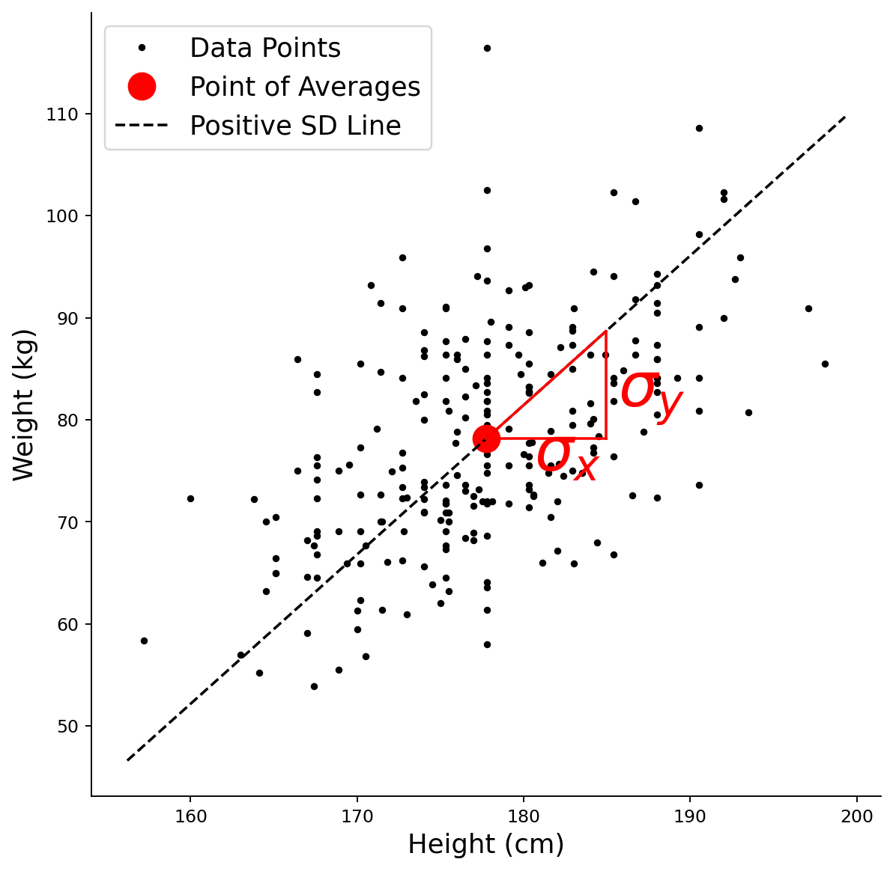

    **세 줄 모두 유도한 값과 소수 여섯째 자리까지 맞는다.** 최소제곱의 $\text{RSS}/S_{yy}$가 $0.714051$이고 $1 - r^2 = 0.714051$이다. SD 직선은 $0.930516$이고 $2(1-r) = 0.930516$이다. 비는 $1.303151$로 $2/(1+r) = 1.303151$과 같다.

    **SD 직선은 최소제곱직선이 아니다.** 그림에서 삼각형의 세로변이 온전히 $\sigma_y$인데, 점구름의 기울기와 견주면 점선이 분명히 과하게 서 있다. 수치로는 잔차제곱합이 $30.3\%$ 더 크다. 그래도 **평균만 쓰는 수평선보다는 낫다**($0.9305 < 1$). 이 자료에 한해서는 $r$이 양수라 SD 직선이 그럭저럭 쓸 만한 방향을 가리키기 때문이다.

    유도한 비 $2/(1+r)$이 **$r$에만 의존한다**는 것도 되새길 만하다. 단위를 바꾸거나 자료를 늘려도 이 비는 바뀌지 않는다. $r$이 $1$에 가까울수록 SD 직선이 최소제곱직선에 가까워지고, $r$이 $0$에 가까우면 손실이 두 배까지 벌어진다. $\square$

#### 음의 SD 직선

음의 SD 직선은 기울기가 $-\sigma_y / \sigma_x$이다. 키가 $\sigma_x$만큼 늘어날 때마다 몸무게가 $\sigma_y$만큼 *줄어든다*.

<div class="exbox" markdown>

**보기 6.** <span class="diff easy" title="쉬움"></span> 음의 SD 직선. 같은 자료에 기울기 $-s_y/s_x$인 직선을 그린다.

**(1)** 보기 5의 식 $\text{RSS}(b) = S_{yy} - 2bS_{xy} + b^2S_{xx}$에 $b = -s_y/s_x$를 넣어 $\text{RSS}(\text{음의 SD 직선}) = 2(1+r)\,S_{yy}$임을 보이시오. 이 값이 **평균만 쓰는 수평선의 $\text{RSS} = S_{yy}$보다 커지는** $r$의 범위는 어디인가.

**(2)** 이 자료의 상관은 $r = +0.5347$인데도 음의 SD 직선을 그리고 있다. 그림이 자료와 어긋나 있는가. 음의 SD 직선이 뜻을 갖는 자료는 어떤 자료인지 말하고, 세 직선의 잔차제곱합을 재어 확인하시오.

</div>

??? success "풀이"

    **(1) 해석적으로.** $b = -s_y/s_x$를 넣으면 교차항의 부호만 뒤집힌다.

    $$
    \text{RSS}\!\left(-\frac{s_y}{s_x}\right)
    = (n-1)\left[s_y^2 + 2\,\frac{s_y}{s_x}\,r\,s_x s_y + \frac{s_y^2}{s_x^2}\,s_x^2\right]
    = (n-1)\,s_y^2\,(2 + 2r)
    = 2(1+r)\,S_{yy}
    $$

    보기 5의 $2(1-r)S_{yy}$에서 $r \to -r$로 바뀐 꼴이다. 이 값이 $S_{yy}$보다 큰 조건은

    $$
    2(1+r) > 1 \quad \Longleftrightarrow \quad r > -\tfrac12
    $$

    이다. **상관이 $-1/2$보다 크기만 하면 음의 SD 직선은 평균만 쓰는 것보다 나쁘다.** 특히 $r \ge 0$인 자료에서는 $2(1+r) \ge 2$이므로 **적어도 두 배** 나쁘다. 그럴 수밖에 없다. 기울기가 자료의 추세와 반대 방향이면 직선이 점들로부터 멀어지는 쪽으로 일하기 때문이다.

    **(2) 어긋나 있다.** 이 자료는 $r = +0.5347$이므로 음의 SD 직선은 자료의 추세와 **반대로** 기울어 있고, 어떤 뜻에서도 이 자료를 요약하지 못한다. 그림은 "기울기의 부호만 바꾸면 이런 직선이 된다"를 보이는 **그림 연습**이며, 자료를 설명하는 직선으로 읽으면 안 된다.

    음의 SD 직선이 뜻을 갖는 것은 $r < 0$인 자료, 곧 한 변수가 커질 때 다른 변수가 작아지는 자료다. 같은 자료로 그런 상황을 만들려면 키의 부호를 뒤집으면 된다. $x \mapsto -x$로 바꾸면 $s_x$는 그대로이고 $S_{xy}$만 부호가 바뀌므로 $r \mapsto -r$이 되고, 그 자료의 최소제곱 기울기는 $-0.7826$이 되어 **음의 SD 직선과 같은 쪽**을 가리킨다.

    ```python
    import matplotlib.pyplot as plt
    import pandas as pd

    plt.rcParams["font.sans-serif"] = ["NanumGothic", "Apple SD Gothic Neo", "Malgun Gothic"]
    plt.rcParams["font.family"] = "sans-serif"
    plt.rcParams["axes.unicode_minus"] = False

    # openintro의 bdims 자료: 성인 507명의 신체 치수.
    # hgt(cm), wgt(kg), sex(1 = 남성, 0 = 여성) 열을 쓴다.
    data_url = ("https://raw.githubusercontent.com/vincentarelbundock/Rdatasets/"
                "1dcc2bf5f955cc1224a3e1307256e1fe86b68dae/csv/openintro/bdims.csv")
    data = pd.read_csv(data_url).rename(columns={"hgt": "Height", "wgt": "Weight"})
    data["Gender"] = data["sex"].map({1: "Male", 0: "Female"})

    male_height_weight_data = data[data.Gender == "Male"].loc[:300, ["Height", "Weight"]]

    mean_height = male_height_weight_data.Height.mean()
    mean_weight = male_height_weight_data.Weight.mean()
    std_dev_height = male_height_weight_data.Height.std()
    std_dev_weight = male_height_weight_data.Weight.std()
    correlation = male_height_weight_data.corr().loc["Height", "Weight"]

    def residual_sum_of_squares(b):
        intercept = mean_weight - b * mean_height
        return ((male_height_weight_data.Weight
                 - (intercept + b * male_height_weight_data.Height)) ** 2).sum()

    sd_slope = std_dev_weight / std_dev_height
    total = residual_sum_of_squares(0.0)

    print(f"이 자료의 상관 r = {correlation:+.4f}  (양수다)")
    print(f"{'직선':14s}{'기울기':>10s}{'RSS/Syy':>12s}{'이론값':>12s}")
    for name, b, theory in [("양의 SD 직선", sd_slope, 2 * (1 - correlation)),
                            ("평균만", 0.0, 1.0),
                            ("음의 SD 직선", -sd_slope, 2 * (1 + correlation))]:
        print(f"{name:14s}{b:10.4f}{residual_sum_of_squares(b) / total:12.6f}{theory:12.6f}")

    # 키의 부호를 뒤집으면 상관도 부호가 바뀐다
    flipped = male_height_weight_data.assign(Height=-male_height_weight_data.Height)
    print(f"\n키를 -키 로 바꾸면 r = {flipped.corr().loc['Height', 'Weight']:+.4f}")
    print(f"  그 자료의 최소제곱 기울기 = "
          f"{flipped.corr().loc['Height', 'Weight'] * std_dev_weight / std_dev_height:+.4f}")

    fig, axis = plt.subplots(figsize=(8, 8))
    axis.plot(male_height_weight_data.Height, male_height_weight_data.Weight, '.k', label="Data Points")
    axis.plot([mean_height], [mean_weight], 'ro', markersize=15, label="Point of Averages")

    # 음의 SD 직선
    axis.plot(
        [mean_height - 3 * std_dev_height, mean_height + 3 * std_dev_height],
        [mean_weight + 3 * std_dev_weight, mean_weight - 3 * std_dev_weight],
        linestyle="--", color='k', label="Negative SD Line"
    )

    axis.plot([mean_height, mean_height + std_dev_height], [mean_weight, mean_weight], '-r')
    axis.plot([mean_height + std_dev_height, mean_height + std_dev_height],
              [mean_weight, mean_weight - std_dev_weight], '-r')
    axis.plot([mean_height, mean_height + std_dev_height],
              [mean_weight, mean_weight - std_dev_weight], '-r')

    axis.annotate("$\\sigma_x$",
        [mean_height + 0.3 * std_dev_height, mean_weight + 0.2 * std_dev_weight],
        fontsize=35, color="red")
    axis.annotate("$\\sigma_y$",
        [mean_height + 1.1 * std_dev_height, mean_weight - 0.5 * std_dev_weight],
        fontsize=35, color="red")

    axis.set_xlabel('Height (cm)', fontsize=15)
    axis.set_ylabel('Weight (kg)', fontsize=15)
    axis.spines['top'].set_visible(False)
    axis.spines['right'].set_visible(False)
    axis.legend(fontsize=15)
    plt.show()
    ```

    출력:

    ```
    이 자료의 상관 r = +0.5347  (양수다)
    직선                   기울기     RSS/Syy         이론값
    양의 SD 직선          1.4635    0.930516    0.930516
    평균만               0.0000    1.000000    1.000000
    음의 SD 직선         -1.4635    3.069484    3.069484

    키를 -키 로 바꾸면 r = -0.5347
      그 자료의 최소제곱 기울기 = -0.7826
    ```

    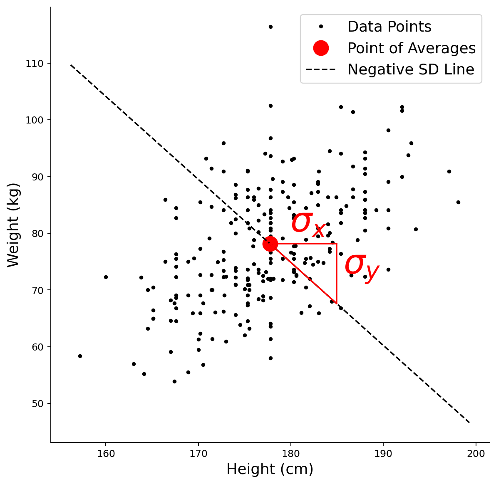

    세 번째 줄의 $3.069484$가 유도한 $2(1+r) = 2 \times 1.534742 = 3.069484$와 맞는다. **음의 SD 직선은 평균만 쓰는 수평선보다 세 배 넘게 나쁘다.** 키를 전혀 쓰지 않는 것이 이 직선을 쓰는 것보다 나은 셈이다. 세 줄을 함께 읽으면 순서가 분명하다.

    $$
    \underbrace{0.714}_{\text{최소제곱}} \;<\; \underbrace{0.931}_{\text{양의 SD}} \;<\; \underbrace{1.000}_{\text{평균만}} \;<\; \underbrace{3.069}_{\text{음의 SD}}
    $$

    **그림이 보여 주지 못하는 것**은 이 순서다. 점선 하나만 그려 놓으면 "기울기의 부호가 바뀐 SD 직선"으로 보일 뿐, 그것이 이 자료에 대해 얼마나 나쁜지는 눈에 들어오지 않는다. 숫자로 재야 비로소 보인다. $\square$

### 회귀직선과 SD 직선

**회귀직선**의 기울기는 $r \cdot \sigma_y / \sigma_x$로, SD 직선의 기울기에 상관계수 $r$를 곱한 것이다. $|r| \leq 1$이므로 회귀직선은 항상 SD 직선보다 완만하거나 같다. 이 완만해짐이 곧 **회귀 효과**이며, 예측값이 평균 쪽으로 되돌아간다는 뜻이다.

<div class="exbox" markdown>

**보기 7.** <span class="diff easy" title="쉬움"></span> 회귀직선과 SD 직선. 같은 평균점에서 두 직선을 함께 그리고 회귀 삼각형의 세로변이 $r\sigma_y$임을 표시한다.

**(1)** 두 기울기의 **비**가 $r$임을 보이고, $x = \bar x + k s_x$에서 두 직선의 예측값 차이가 $k\,s_y(1-r)$임을 유도하시오. 이 차이가 $x$에서 멀어질수록 어떻게 되는가.

**(2)** $k = 1, 2, 3$에서 두 예측값과 그 차이를 계산해 유도한 식과 맞는지 확인하시오. 표준단위로 보면 "평균으로의 회귀"는 몇 SD 되돌아오는 것인가.

</div>

??? success "풀이"

    **(1) 해석적으로.** 두 직선 모두 평균점을 지나므로 비교는 기울기만으로 끝난다.

    $$
    \frac{\text{회귀직선 기울기}}{\text{SD 직선 기울기}} = \frac{r\,s_y/s_x}{s_y/s_x} = r
    $$

    $\lvert r \rvert \le 1$이므로 회귀직선은 **언제나 SD 직선보다 완만하거나 같다.** 등호는 $\lvert r \rvert = 1$일 때만이고, 그때는 모든 점이 한 직선 위에 있다.

    $x_0 = \bar x + k s_x$에서 두 예측값은 각각

    $$
    \hat y_{\text{SD}} = \bar y + \frac{s_y}{s_x}(k s_x) = \bar y + k s_y, \qquad
    \hat y_{\text{회귀}} = \bar y + r\frac{s_y}{s_x}(k s_x) = \bar y + k r s_y
    $$

    이므로 차이는

    $$
    \hat y_{\text{SD}} - \hat y_{\text{회귀}} = k s_y (1 - r)
    $$

    이다. **차이가 $k$에 비례한다.** 평균점에서는 $k = 0$이라 차이가 $0$이고, 멀어질수록 **선형으로** 벌어진다. $r$이 $1$에서 멀수록 벌어지는 속도가 빠르다. 그러므로 SD 직선을 예측에 쓰면 **극단에서 가장 크게 틀린다.**

    표준단위로 쓰면 이 사실이 한 줄로 줄어든다.

    $$
    z_{\hat y} = r\,z_x
    $$

    $x$가 평균보다 $k$ SD 크면 예측값은 평균보다 $kr$ SD 크다. $\lvert r \rvert < 1$이므로 $\lvert kr \rvert < \lvert k \rvert$, 곧 **예측값은 언제나 $x$보다 평균에 가깝다.** 이것이 평균으로의 회귀다.

    **(2) 수치적으로.**

    ```python
    import matplotlib.pyplot as plt
    import numpy as np
    import pandas as pd

    plt.rcParams["font.sans-serif"] = ["NanumGothic", "Apple SD Gothic Neo", "Malgun Gothic"]
    plt.rcParams["font.family"] = "sans-serif"
    plt.rcParams["axes.unicode_minus"] = False

    # openintro의 bdims 자료: 성인 507명의 신체 치수.
    # hgt(cm), wgt(kg), sex(1 = 남성, 0 = 여성) 열을 쓴다.
    data_url = ("https://raw.githubusercontent.com/vincentarelbundock/Rdatasets/"
                "1dcc2bf5f955cc1224a3e1307256e1fe86b68dae/csv/openintro/bdims.csv")
    data = pd.read_csv(data_url).rename(columns={"hgt": "Height", "wgt": "Weight"})
    data["Gender"] = data["sex"].map({1: "Male", 0: "Female"})

    male_data = data[data.Gender == "Male"].loc[:300, ["Height", "Weight"]]

    mean_height = male_data.Height.mean()
    mean_weight = male_data.Weight.mean()
    std_dev_height = male_data.Height.std()
    std_dev_weight = male_data.Weight.std()
    correlation_coefficient = male_data[["Height", "Weight"]].corr().loc["Height", "Weight"]

    sd_slope = std_dev_weight / std_dev_height
    reg_slope = correlation_coefficient * std_dev_weight / std_dev_height
    print(f"SD 직선 기울기   = {sd_slope:.6f}")
    print(f"회귀직선 기울기  = {reg_slope:.6f}")
    print(f"비 = {reg_slope / sd_slope:.6f},   r = {correlation_coefficient:.6f}")
    print()
    print(f"{'k':>4s}{'x = x-bar + k s_x':>20s}{'SD 직선':>12s}{'회귀직선':>12s}{'차이':>10s}{'k s_y (1-r)':>14s}")
    for k in (1, 2, 3):
        x0 = mean_height + k * std_dev_height
        y_sd = mean_weight + sd_slope * (x0 - mean_height)
        y_reg = mean_weight + reg_slope * (x0 - mean_height)
        print(f"{k:4d}{x0:20.4f}{y_sd:12.4f}{y_reg:12.4f}{y_sd - y_reg:10.4f}"
              f"{k * std_dev_weight * (1 - correlation_coefficient):14.4f}")
    print()
    for k in (1, 2, 3):
        print(f"키가 평균보다 {k} SD 큰 사람의 예측 몸무게는 평균보다 "
              f"{k * correlation_coefficient:.4f} SD 크다")

    # 회귀 예측값
    x_values = np.array(male_data.Height)
    y_pred = mean_weight + correlation_coefficient * (std_dev_weight / std_dev_height) * (x_values - mean_height)

    fig, axis = plt.subplots(figsize=(8, 8))
    axis.plot(male_data.Height, male_data.Weight, '.k', label="Data Points")
    axis.plot([mean_height], [mean_weight], 'ro', markersize=15, label="Point of Averages")
    axis.plot(x_values, y_pred, 'b', label="Regression Line")

    # 회귀 삼각형을 표시한다. SD 직선보다 기울기가 완만하다
    axis.plot([mean_height, mean_height + std_dev_height], [mean_weight, mean_weight], '-b')
    axis.plot([mean_height + std_dev_height, mean_height + std_dev_height],
              [mean_weight, mean_weight + correlation_coefficient * std_dev_weight], '-b')
    axis.plot([mean_height, mean_height + std_dev_height],
              [mean_weight, mean_weight + correlation_coefficient * std_dev_weight], '-b')

    axis.annotate("$\\sigma_x$",
        [mean_height + 0.4 * std_dev_height, mean_weight - 0.3 * std_dev_weight],
        fontsize=35, color="b")
    axis.annotate("$r\\ \\sigma_y$",
        [mean_height + 1.1 * std_dev_height, mean_weight + 0.3 * std_dev_weight],
        fontsize=35, color="b")

    axis.set_xlabel('Height (cm)', fontsize=15)
    axis.set_ylabel('Weight (kg)', fontsize=15)
    axis.spines['top'].set_visible(False)
    axis.spines['right'].set_visible(False)
    axis.legend(fontsize=15)
    plt.show()
    ```

    출력:

    ```
    SD 직선 기울기   = 1.463451
    회귀직선 기울기  = 0.782568
    비 = 0.534742,   r = 0.534742

       k   x = x-bar + k s_x       SD 직선        회귀직선        차이   k s_y (1-r)
       1            184.9290     88.6574     83.7662    4.8912        4.8912
       2            192.1126     99.1703     89.3879    9.7824        9.7824
       3            199.2962    109.6832     95.0096   14.6736       14.6736

    키가 평균보다 1 SD 큰 사람의 예측 몸무게는 평균보다 0.5347 SD 크다
    키가 평균보다 2 SD 큰 사람의 예측 몸무게는 평균보다 1.0695 SD 크다
    키가 평균보다 3 SD 큰 사람의 예측 몸무게는 평균보다 1.6042 SD 크다
    ```

    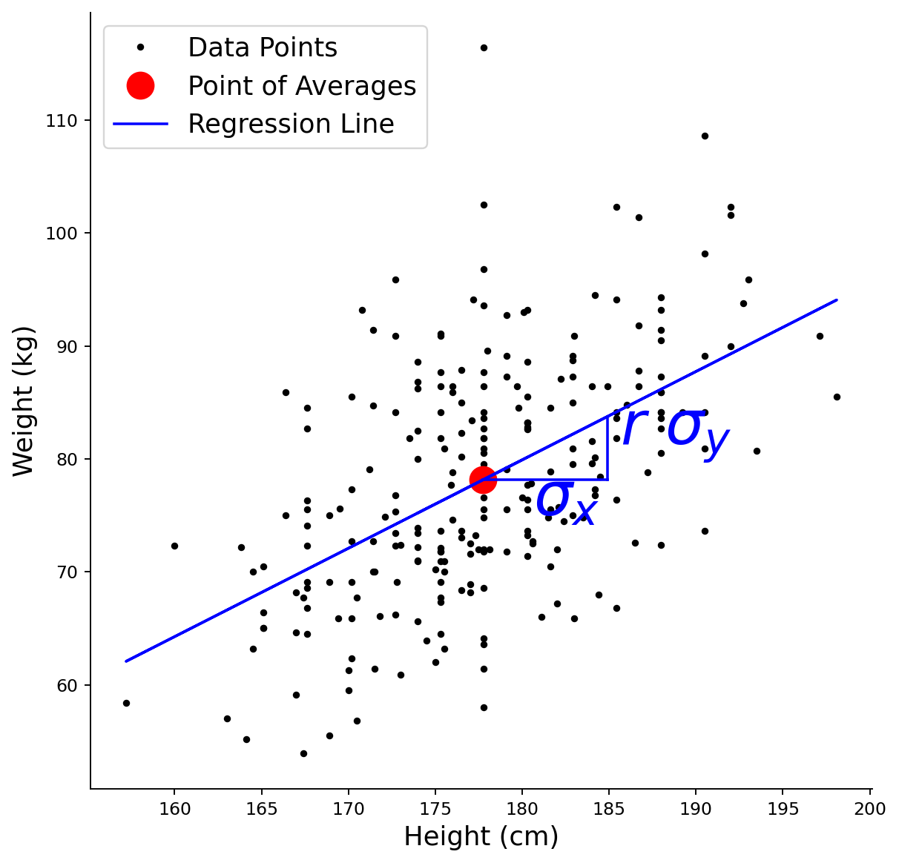

    **기울기의 비가 $0.534742$로 $r$과 소수 여섯째 자리까지 같다.** 차이 열과 $k s_y(1-r)$ 열도 $k = 1, 2, 3$에서 각각 $4.8912$, $9.7824$, $14.6736$으로 완전히 일치한다. $k$가 하나 늘 때마다 차이가 $4.8912 = s_y(1-r)$씩 **같은 양으로** 늘어난다. 선형이라는 유도가 수치로 확인된다.

    그림에서 읽을 것은 **삼각형의 세로변**이다. 보기 5의 빨간 삼각형은 세로가 $\sigma_y$였는데 여기 파란 삼각형은 $r\sigma_y$로 줄어 있다. 줄어든 양이 정확히 $(1-r)\sigma_y = 4.89\,\text{kg}$이고, 그것이 위 표 첫 줄의 차이다.

    해석의 요점은 이렇다. 키가 평균보다 $3$ SD, 곧 $199.3\,\text{cm}$인 사람에게 SD 직선은 $109.7\,\text{kg}$을 주고 회귀직선은 $95.0\,\text{kg}$을 준다. **$14.7\,\text{kg}$ 차이다.** 표준단위로 보면 키에서 $3$ SD 극단인 사람의 예측 몸무게가 $1.60$ SD 극단에 지나지 않는다. $3$에서 $1.6$으로 **절반 가까이 되돌아온 것**이 평균으로의 회귀이며, 되돌아오는 비율이 바로 $r = 0.53$이다.

    한 가지 혼동을 미리 막아 두자. 평균으로의 회귀는 **몸무게의 퍼짐이 실제로 줄어든다는 뜻이 아니다.** 키가 $199\,\text{cm}$인 사람들의 몸무게도 여전히 넓게 흩어져 있다. 줄어든 것은 그 분포의 **중심**이고, 흩어짐은 조건부 표준편차 $s_y\sqrt{1-r^2} = 10.51 \times 0.8450 = 8.88\,\text{kg}$로 남는다. 예측구간이 좁아지지 않는 까닭이 이것이며, 0.4절과 이 장의 예측띠가 같은 이야기를 한다. $\square$

---

## 2. 두 개의 회귀직선

어느 변수를 예측하느냐에 따라 서로 다른 두 개의 회귀직선이 있다.

- **$Y$를 $X$에 회귀**(키로 몸무게 예측): $y = \alpha + \beta x$
- **$X$를 $Y$에 회귀**(몸무게로 키 예측): $x = \alpha' + \beta' y$

두 직선은 $|r| = 1$(완전상관)일 때만 일치한다. 그렇지 않으면 평균점 주위로 벌어지는 "V" 모양을 이룬다.

### 두 회귀직선을 함께 그리기

<div class="exbox" markdown>

**보기 8.** <span class="diff easy" title="쉬움"></span> 두 회귀직선을 함께 그리기. $Y$를 $X$에 회귀시킨 직선(파랑)과 $X$를 $Y$에 회귀시킨 직선(빨강)을 한 그림에 놓는다.

**(1)** $Y$의 $X$에 대한 회귀 기울기 $b = r\,s_y/s_x$와 $X$의 $Y$에 대한 회귀 기울기 $b' = r\,s_x/s_y$에 대해 **$bb' = r^2$** 임을 보이시오. 두 직선을 $(x, y)$ 평면에서 함께 볼 때 SD 직선의 기울기가 **두 기울기의 기하평균**임을 보이고, 두 직선이 겹치는 조건을 구하시오.

**(2)** $y = \bar y + s_y$에서 키를 읽는 **두 가지 잘못된/올바른 방법**을 비교하시오. $X|Y$ 직선으로 읽은 값과 $Y|X$ 직선을 거꾸로 풀어 읽은 값의 비는 얼마인가.

</div>

??? success "풀이"

    **(1) 해석적으로.** 곱은 바로 나온다.

    $$
    b\,b' = \left(r\frac{s_y}{s_x}\right)\left(r\frac{s_x}{s_y}\right) = r^2
    $$

    $s_x, s_y$가 모두 약분되므로 **곱은 단위가 없고 $r^2$ 하나로 정해진다.** 이것이 "두 회귀가 대칭이 아니다"를 가장 간결하게 말하는 식이다. 대칭이라면 $b' = 1/b$, 곧 $bb' = 1$이어야 하는데 $r^2 \le 1$이기 때문이다.

    $(x, y)$ 평면에서 두 직선을 함께 보려면 $X|Y$ 직선도 $y$에 대해 풀어야 한다. $x = \bar x + b'(y - \bar y)$를 뒤집으면

    $$
    y = \bar y + \frac{1}{b'}(x - \bar x), \qquad \frac{1}{b'} = \frac{s_y}{r\,s_x}
    $$

    이다. 이제 두 기울기 $b = r\,s_y/s_x$와 $1/b' = s_y/(r s_x)$의 기하평균을 재면

    $$
    \sqrt{b \cdot \frac{1}{b'}} = \sqrt{r\frac{s_y}{s_x} \cdot \frac{s_y}{r\,s_x}} = \frac{s_y}{s_x}
    $$

    로 **SD 직선의 기울기**다. $r$이 깨끗이 약분된다. 그래서 그림에서 SD 직선은 늘 두 회귀직선 **사이**에 놓인다. 더 정확히는 로그 기울기 축에서 정확히 가운데다.

    겹치는 조건은 $b = 1/b'$, 곧 $bb' = 1$이므로 $r^2 = 1$이다. $\lvert r \rvert = 1$일 때만 두 직선이 하나가 되고, 그때 모든 점이 그 직선 위에 놓인다. $\lvert r \rvert < 1$이면 두 직선은 평균점에서만 만나고 "V" 모양으로 벌어진다.

    **(2) 해석적으로.** $y_0 = \bar y + s_y$에서 올바른 길은 **$X|Y$ 직선**을 쓰는 것이다.

    $$
    \hat x_{X|Y} = \bar x + b'(y_0 - \bar y) = \bar x + r\,s_x
    $$

    잘못된 길은 $Y|X$ 직선 $y = \bar y + b(x - \bar x)$를 $x$에 대해 푸는 것이다.

    $$
    x_{\text{거꾸로}} = \bar x + \frac{y_0 - \bar y}{b} = \bar x + \frac{s_x}{r}
    $$

    평균에서의 편차를 비교하면

    $$
    \frac{s_x/r}{r\,s_x} = \frac{1}{r^2}
    $$

    이다. **거꾸로 읽은 편차가 $1/r^2$ 배로 과장된다.** $r$이 작을수록 과장이 심해진다. $Y|X$ 직선은 "$x$가 주어졌을 때 $y$의 평균"을 주는 함수이고, 그것을 뒤집으면 "$y$가 주어졌을 때 $x$의 평균"이 아니라 전혀 다른 양이 된다.

    ```python
    import matplotlib.pyplot as plt
    import numpy as np
    import pandas as pd

    plt.rcParams["font.sans-serif"] = ["NanumGothic", "Apple SD Gothic Neo", "Malgun Gothic"]
    plt.rcParams["font.family"] = "sans-serif"
    plt.rcParams["axes.unicode_minus"] = False

    # openintro의 bdims 자료: 성인 507명의 신체 치수.
    # hgt(cm), wgt(kg), sex(1 = 남성, 0 = 여성) 열을 쓴다.
    data_url = ("https://raw.githubusercontent.com/vincentarelbundock/Rdatasets/"
                "1dcc2bf5f955cc1224a3e1307256e1fe86b68dae/csv/openintro/bdims.csv")
    data = pd.read_csv(data_url).rename(columns={"hgt": "Height", "wgt": "Weight"})
    data["Gender"] = data["sex"].map({1: "Male", 0: "Female"})

    male_height_weight_data = data[data.Gender == "Male"].loc[:300, ["Height", "Weight"]]

    mean_height = male_height_weight_data.Height.mean()
    mean_weight = male_height_weight_data.Weight.mean()
    std_dev_height = male_height_weight_data.Height.std()
    std_dev_weight = male_height_weight_data.Weight.std()
    correlation_coefficient = male_height_weight_data.corr().loc["Height", "Weight"]

    slope_y_on_x = correlation_coefficient * std_dev_weight / std_dev_height   # dy/dx
    slope_x_on_y = correlation_coefficient * std_dev_height / std_dev_weight   # dx/dy
    print(f"Y 를 X 에 회귀:  dy/dx = {slope_y_on_x:.6f}")
    print(f"X 를 Y 에 회귀:  dx/dy = {slope_x_on_y:.6f}")
    print(f"두 기울기의 곱       = {slope_y_on_x * slope_x_on_y:.6f}   (r^2 = {correlation_coefficient ** 2:.6f})")
    print()
    print(f"(x, y) 평면에서 본 기울기:  Y|X = {slope_y_on_x:.6f},  X|Y = {1 / slope_x_on_y:.6f}")
    print(f"  두 기울기의 기하평균 = {np.sqrt(slope_y_on_x / slope_x_on_y):.6f}")
    print(f"  SD 직선 기울기       = {std_dev_weight / std_dev_height:.6f}")
    print()
    # y = y-bar + s_y 에서 x 를 읽는 두 가지 방법
    y0 = mean_weight + std_dev_weight
    print(f"y = y-bar + s_y = {y0:.4f} 에서 x 를 읽으면")
    print(f"  X|Y 회귀직선:          {mean_height + correlation_coefficient * std_dev_height:.4f}")
    print(f"  Y|X 회귀직선을 거꾸로: {mean_height + std_dev_height / correlation_coefficient:.4f}")
    print(f"  평균에서의 편차 비 = {1 / correlation_coefficient ** 2:.4f}  ( = 1/r^2 )")

    # Y 를 X 에 회귀
    heights = np.array(male_height_weight_data.Height)
    predicted_weights = mean_weight + correlation_coefficient * (std_dev_weight / std_dev_height) * (heights - mean_height)

    # X 를 Y 에 회귀. 두 직선은 서로 다르다
    weights = np.array(male_height_weight_data.Weight)
    predicted_heights = mean_height + correlation_coefficient * (std_dev_height / std_dev_weight) * (weights - mean_weight)

    fig, axis = plt.subplots(figsize=(8, 8))
    axis.plot([mean_height], [mean_weight], 'ro', markersize=15, label="Point of Averages")
    axis.plot(male_height_weight_data.Height, male_height_weight_data.Weight, '.k', label="Data Points")

    # Y 의 X 에 대한 회귀직선(파랑)
    axis.plot(heights, predicted_weights, '-b', label="y = alpha + beta * x")
    axis.plot([mean_height, mean_height + std_dev_height], [mean_weight, mean_weight], '-b')
    axis.plot([mean_height + std_dev_height, mean_height + std_dev_height],
              [mean_weight, mean_weight + correlation_coefficient * std_dev_weight], '-b')
    axis.plot([mean_height, mean_height + std_dev_height],
              [mean_weight, mean_weight + correlation_coefficient * std_dev_weight], '-b')

    axis.annotate("$\\sigma_x$",
        [mean_height + 0.4 * std_dev_height, mean_weight - 0.3 * std_dev_weight],
        fontsize=35, color="b")
    axis.annotate("$r\\ \\sigma_y$",
        [mean_height + 1.1 * std_dev_height, mean_weight + 0.3 * std_dev_weight],
        fontsize=35, color="b")

    # X 의 Y 에 대한 회귀직선(빨강)
    axis.plot(predicted_heights, weights, '-r', label="x = alpha + beta * y")
    axis.plot([mean_height, mean_height], [mean_weight, mean_weight + std_dev_weight], '-r')
    axis.plot([mean_height, mean_height + correlation_coefficient * std_dev_height],
              [mean_weight + std_dev_weight, mean_weight + std_dev_weight], '-r')
    axis.plot([mean_height, mean_height + correlation_coefficient * std_dev_height],
              [mean_weight, mean_weight + std_dev_weight], '-r')

    axis.annotate("$\\sigma_y$",
        [mean_height - 0.3 * std_dev_height, mean_weight + 0.4 * std_dev_weight],
        fontsize=35, color="r")
    axis.annotate("$r\\ \\sigma_x$",
        [mean_height + 0.1 * std_dev_height, mean_weight + 1.2 * std_dev_weight],
        fontsize=35, color="r")

    axis.set_xlabel('Height (cm)', fontsize=15)
    axis.set_ylabel('Weight (kg)', fontsize=15)
    axis.legend(fontsize=15)
    axis.spines['top'].set_visible(False)
    axis.spines['right'].set_visible(False)
    plt.show()
    ```

    출력:

    ```
    Y 를 X 에 회귀:  dy/dx = 0.782568
    X 를 Y 에 회귀:  dx/dy = 0.365398
    두 기울기의 곱       = 0.285949   (r^2 = 0.285949)

    (x, y) 평면에서 본 기울기:  Y|X = 0.782568,  X|Y = 2.736744
      두 기울기의 기하평균 = 1.463451
      SD 직선 기울기       = 1.463451

    y = y-bar + s_y = 88.6574 에서 x 를 읽으면
      X|Y 회귀직선:          181.5867
      Y|X 회귀직선을 거꾸로: 191.1792
      평균에서의 편차 비 = 3.4971  ( = 1/r^2 )
    ```

    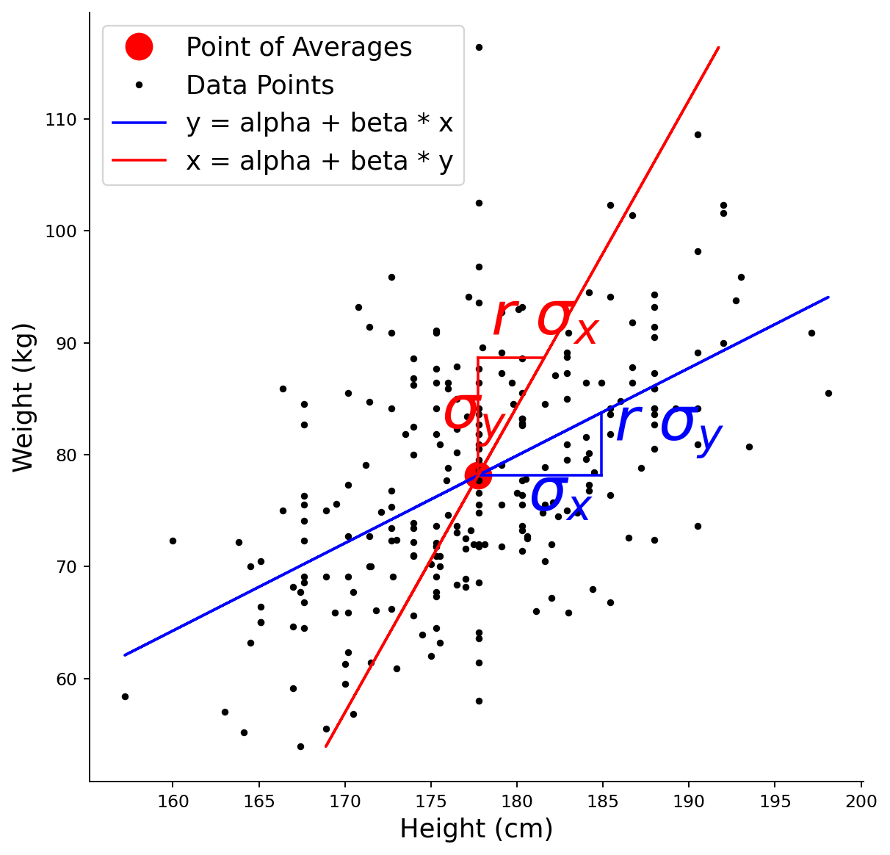

    **곱이 $0.285949$로 $r^2$과 소수 여섯째 자리까지 같다.** 대칭이라면 $1$이어야 할 값이 $0.29$에 지나지 않으니, 이 자료에서 두 회귀는 **전혀 대칭이 아니다.**

    기하평균도 $1.463451$로 SD 직선의 기울기와 정확히 같다. 그림에서 파란 직선($0.7826$)과 빨간 직선($2.7367$)이 평균점에서 만나 벌어지는 모습이 "V"이고, SD 직선은 늘 그 안쪽을 지난다. 두 삼각형이 이 비대칭의 정체를 보여 준다. **파란 삼각형은 가로가 $\sigma_x$인데 세로가 $r\sigma_y$로 줄었고, 빨간 삼각형은 세로가 $\sigma_y$인데 가로가 $r\sigma_x$로 줄었다.** 각자 자기 쪽 예측값을 평균으로 끌어당기는 것이다.

    **(2)의 두 값이 $9.59\,\text{cm}$ 벌어진다.** 몸무게 $88.66\,\text{kg}$인 사람의 평균 키를 묻는다면 답은 $181.59\,\text{cm}$다. 같은 질문에 $Y|X$ 직선을 거꾸로 풀어 답하면 $191.18\,\text{cm}$가 나오는데, 이는 표본 최댓값 $198.1$에 가까운 극단값이다. 평균에서의 편차로 재면 $3.84$ 대 $13.43$으로 비가 $3.4971 = 1/r^2$이다.

    그러므로 **회귀직선은 역함수로 쓸 수 없다.** 두 방향 각각에 직선이 따로 있고, 묻는 방향에 맞는 직선을 써야 한다. 이 혼동은 실무에서 흔하다. 보기 9와 10 이 각 직선이 실제로 무엇의 평균인지를 띠로 확인한다. $\square$

### 세로 띠로 본 Y의 X에 대한 회귀

(키 값을 고정한) 좁은 세로 띠를 골라 그 안의 평균 몸무게를 살펴보면, 회귀직선이 조건부 평균을 예측한다는 사실이 드러난다.

<div class="exbox" markdown>

**보기 9.** <span class="diff easy" title="쉬움"></span> 세로 띠로 본 Y의 X에 대한 회귀. 평균보다 $1$ SD 큰 키 자리에 좁은 세로 띠 $[\bar x + 0.9 s_x,\ \bar x + 1.1 s_x]$를 긋고 그 안의 몸무게를 본다.

**(1)** 회귀직선이 $x = \bar x + s_x$에서 예측하는 몸무게를 $\bar y$, $r$, $s_y$로 쓰고 수치를 구하시오. 그 자리의 몸무게가 흩어지는 폭, 곧 **조건부 표준편차**는 얼마로 예측되는가.

**(2)** 띠 안의 실제 평균 몸무게를 재어 (1)의 예측과 견주시오. 어긋난 양을 **평균의 표준오차** 단위로 재면 얼마인가.

</div>

??? success "풀이"

    **(1) 해석적으로.** 표준화된 회귀식 $z_{\hat y} = r z_x$에서 $z_x = 1$이므로 $z_{\hat y} = r$이고

    $$
    \hat y\big|_{x = \bar x + s_x} = \bar y + r\,s_y = 78.1445 + 0.5347 \times 10.5129 = 83.7662
    $$

    이다. 조건부 평균은 평균보다 $r s_y = 5.62\,\text{kg}$ 높다.

    흩어짐은 **줄지 않는다.** 조건부 표준편차는 $x$에 의존하지 않고

    $$
    s_{y \mid x} = s_y\sqrt{1 - r^2} = 10.5129 \times \sqrt{0.714051} = 8.8836
    $$

    이다. 전체 $s_y = 10.5129$에서 $15.5\%$만 줄었다. $r^2 = 0.286$밖에 설명하지 못하니 당연한 일이다. **띠를 좁혀도 그 안의 몸무게는 거의 그대로 흩어져 있다.**

    따라서 띠 안 $m$명의 평균 몸무게는 예측값 주위로 표준오차 $s_{y\mid x}/\sqrt{m}$만큼 흔들린다. 띠가 좁으면 $m$이 작아 이 흔들림이 크다.

    **(2) 수치적으로.**

    ```python
    import matplotlib.pyplot as plt
    import numpy as np
    import pandas as pd

    plt.rcParams["font.sans-serif"] = ["NanumGothic", "Apple SD Gothic Neo", "Malgun Gothic"]
    plt.rcParams["font.family"] = "sans-serif"
    plt.rcParams["axes.unicode_minus"] = False

    # openintro의 bdims 자료: 성인 507명의 신체 치수.
    # hgt(cm), wgt(kg), sex(1 = 남성, 0 = 여성) 열을 쓴다.
    data_url = ("https://raw.githubusercontent.com/vincentarelbundock/Rdatasets/"
                "1dcc2bf5f955cc1224a3e1307256e1fe86b68dae/csv/openintro/bdims.csv")
    data = pd.read_csv(data_url).rename(columns={"hgt": "Height", "wgt": "Weight"})
    data["Gender"] = data["sex"].map({1: "Male", 0: "Female"})

    male_data = data[data.Gender == "Male"].loc[:300, ["Height", "Weight"]]

    mean_height = male_data.Height.mean()
    mean_weight = male_data.Weight.mean()
    std_dev_height = male_data.Height.std()
    std_dev_weight = male_data.Weight.std()
    correlation_coefficient = male_data[["Height", "Weight"]].corr().loc["Height", "Weight"]

    # 세로 띠 안의 몸무게를 모은다
    strip_low = mean_height + 0.9 * std_dev_height
    strip_high = mean_height + 1.1 * std_dev_height
    in_strip = male_data[(male_data.Height >= strip_low) & (male_data.Height <= strip_high)]
    predicted = mean_weight + correlation_coefficient * std_dev_weight   # x = x-bar + s_x 에서의 예측
    conditional_sd = std_dev_weight * np.sqrt(1 - correlation_coefficient ** 2)
    standard_error = conditional_sd / np.sqrt(len(in_strip))

    print(f"세로 띠 = [{strip_low:.4f}, {strip_high:.4f}]  (x-bar + 0.9 s_x ~ x-bar + 1.1 s_x)")
    print(f"띠 안 사람 수 = {len(in_strip)}")
    print(f"회귀직선의 예측  y-bar + r s_y = {predicted:.4f}")
    print(f"띠 안 실제 평균 몸무게         = {in_strip.Weight.mean():.4f}")
    print(f"차이 = {in_strip.Weight.mean() - predicted:+.4f}")
    print()
    print(f"조건부 표준편차 s_y sqrt(1-r^2) = {conditional_sd:.4f}")
    print(f"띠 안 몸무게의 실제 표준편차    = {in_strip.Weight.std():.4f}")
    print(f"평균의 표준오차 = {standard_error:.4f}")
    print(f"차이 / 표준오차 = {(in_strip.Weight.mean() - predicted) / standard_error:+.4f}")

    x_values = np.array(male_data.Height)
    y_pred = mean_weight + correlation_coefficient * (std_dev_weight / std_dev_height) * (x_values - mean_height)

    fig, axis = plt.subplots(figsize=(8, 8))
    axis.plot(male_data.Height, male_data.Weight, '.k', label="Data Points")

    # 평균에서 1 표준편차쯤 떨어진 자리의 세로 띠
    axis.plot(
        [mean_height + 0.9 * std_dev_height, mean_height + 0.9 * std_dev_height],
        [male_data.Weight.min(), male_data.Weight.max()], '--b')
    axis.plot(
        [mean_height + 1.1 * std_dev_height, mean_height + 1.1 * std_dev_height],
        [male_data.Weight.min(), male_data.Weight.max()], '--b')

    axis.plot([mean_height], [mean_weight], 'ro', markersize=15, label="Point of Averages")
    axis.plot(x_values, y_pred, 'b', label="Regression Line")

    axis.plot([mean_height, mean_height + std_dev_height], [mean_weight, mean_weight], '-b')
    axis.plot([mean_height + std_dev_height, mean_height + std_dev_height],
              [mean_weight, mean_weight + correlation_coefficient * std_dev_weight], '-b')
    axis.plot([mean_height, mean_height + std_dev_height],
              [mean_weight, mean_weight + correlation_coefficient * std_dev_weight], '-b')

    axis.annotate("$\\sigma_x$",
        [mean_height + 0.4 * std_dev_height, mean_weight - 0.3 * std_dev_weight],
        fontsize=35, color="b")
    axis.annotate("$r\\ \\sigma_y$",
        [mean_height + 1.1 * std_dev_height, mean_weight + 0.3 * std_dev_weight],
        fontsize=35, color="b")

    axis.set_xlabel('Height (cm)', fontsize=15)
    axis.set_ylabel('Weight (kg)', fontsize=15)
    axis.spines['top'].set_visible(False)
    axis.spines['right'].set_visible(False)
    axis.legend(fontsize=15)
    plt.show()
    ```

    출력:

    ```
    세로 띠 = [184.2106, 185.6473]  (x-bar + 0.9 s_x ~ x-bar + 1.1 s_x)
    띠 안 사람 수 = 10
    회귀직선의 예측  y-bar + r s_y = 83.7662
    띠 안 실제 평균 몸무게         = 82.1900
    차이 = -1.5762

    조건부 표준편차 s_y sqrt(1-r^2) = 8.8836
    띠 안 몸무게의 실제 표준편차    = 10.8314
    평균의 표준오차 = 2.8092
    차이 / 표준오차 = -0.5611
    ```

    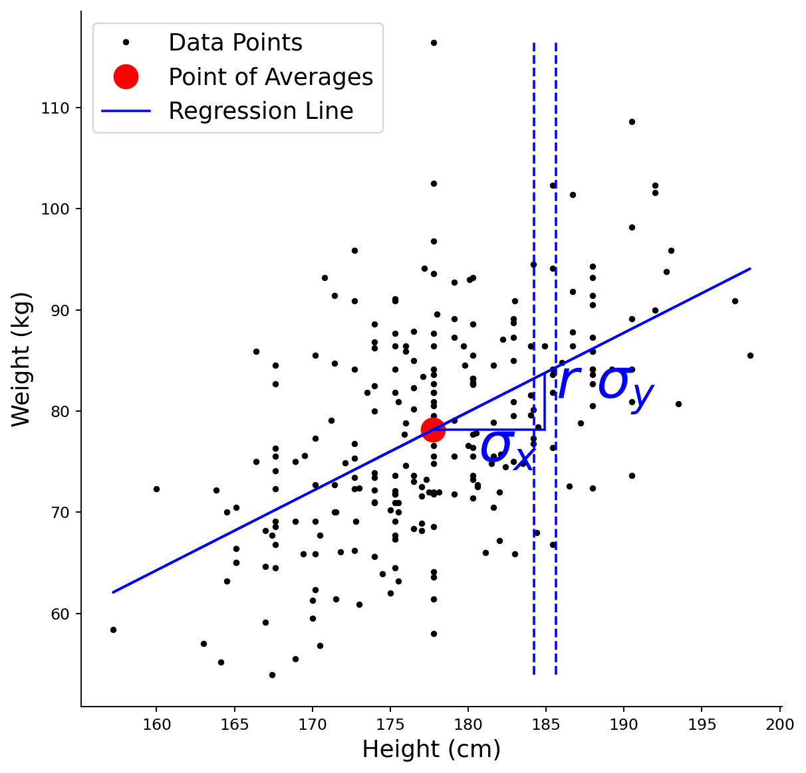

    **예측 $83.77$ 대 실제 $82.19$로 차이가 $-1.58\,\text{kg}$이다.** 표준오차가 $2.81$이므로 $z = -0.56$, 곧 **표준오차 반 개 분량**이다. 표본추출 변동으로 완전히 설명되는 크기이며 회귀직선이 조건부 평균을 맞히지 못한다는 증거가 아니다.

    여기서 눈여겨볼 것은 **띠 안에 열 명밖에 없다는 사실**이다. $247$명 가운데 $0.2 s_x = 1.44\,\text{cm}$ 폭의 띠에 들어온 사람이 $10$명이다. 조건부 표준편차가 $8.88$이니 $10$명의 평균은 $2.81$의 표준오차를 갖고, 이는 조건부 평균이 평균보다 높은 양 $r s_y = 5.62$의 **절반**이다. 그러므로 띠 하나만 보고 회귀직선을 확인하는 일은 애초에 정밀하지 못하다. 띠를 넓히면 $m$이 늘어 표준오차가 줄지만 "한 점에서의 조건부 평균"이라는 뜻이 흐려진다. **이 맞바꿈이 조건부 평균을 자료에서 직접 재려 할 때 늘 따라온다.**

    띠 안 몸무게의 실제 표준편차 $10.83$이 조건부 예측 $8.88$보다 크다는 것도 읽어 둘 만하다. $10$개로 잰 표준편차의 상대 표준오차가 대략 $1/\sqrt{2(m-1)} = 24\%$이므로 이 차이($22\%$) 역시 유의하지 않다. **표본이 열이면 표준편차도 평균만큼이나 믿을 수 없다.**

    그림이 정작 **보여 주지 못하는 것**은 이 모든 수치다. 세로 점선 두 줄과 직선만으로는 "띠 안 평균이 직선 위에 있는가"를 눈으로 가늠할 수 없고, 띠 안 평균이 점으로 찍혀 있지도 않다. 그 점을 찍고 오차막대를 붙이는 것이 이 그림을 완성하는 길이다. $\square$

### 가로 띠로 본 X의 Y에 대한 회귀

마찬가지로 몸무게 값을 고정한 가로 띠는 키의 조건부 평균을 보여준다.

<div class="exbox" markdown>

**보기 10.** <span class="diff easy" title="쉬움"></span> 가로 띠로 본 X의 Y에 대한 회귀. 평균보다 $1$ SD 큰 몸무게 자리에 가로 띠 $[\bar y + 0.9 s_y,\ \bar y + 1.1 s_y]$를 긋고 그 안의 키를 본다.

**(1)** 이 띠 안의 평균 키를 $X|Y$ 회귀직선이 예측하는 값과, $Y|X$ 직선을 $x$에 대해 거꾸로 풀어 얻은 값을 각각 쓰시오. 어느 쪽이 맞는 예측이어야 하는가.

**(2)** 두 값을 실제 평균 키와 견주시오. 틀린 쪽은 표준오차 몇 개만큼 벗어나는가. 보기 8에서 보인 $1/r^2$ 과장이 자료에서 실제로 드러나는가.

</div>

??? success "풀이"

    **(1) 해석적으로.** 띠는 $y$를 고정한다. 그러므로 묻는 것은 $E[X \mid Y = y_0]$이고, 이를 주는 직선은 **$X$를 $Y$에 회귀시킨 직선**이다. $y_0 = \bar y + s_y$에서

    $$
    \hat x_{X|Y} = \bar x + r\,s_x = 177.7453 + 0.5347 \times 7.1836 = 181.5867
    $$

    이다. $Y|X$ 직선을 거꾸로 푼 값은 보기 8에서 보았듯

    $$
    x_{\text{거꾸로}} = \bar x + \frac{s_x}{r} = 177.7453 + \frac{7.1836}{0.5347} = 191.1792
    $$

    이다. 맞는 예측은 앞의 것이다. 조건부 표준편차는 이제 $x$ 쪽을 재므로

    $$
    s_{x\mid y} = s_x\sqrt{1 - r^2} = 7.1836 \times 0.8450 = 6.0703
    $$

    이고, 띠 안 $m$명의 평균 키의 표준오차는 $6.0703/\sqrt{m}$이다.

    **(2) 수치적으로.**

    ```python
    import matplotlib.pyplot as plt
    import numpy as np
    import pandas as pd

    plt.rcParams["font.sans-serif"] = ["NanumGothic", "Apple SD Gothic Neo", "Malgun Gothic"]
    plt.rcParams["font.family"] = "sans-serif"
    plt.rcParams["axes.unicode_minus"] = False

    # openintro의 bdims 자료: 성인 507명의 신체 치수.
    # hgt(cm), wgt(kg), sex(1 = 남성, 0 = 여성) 열을 쓴다.
    data_url = ("https://raw.githubusercontent.com/vincentarelbundock/Rdatasets/"
                "1dcc2bf5f955cc1224a3e1307256e1fe86b68dae/csv/openintro/bdims.csv")
    data = pd.read_csv(data_url).rename(columns={"hgt": "Height", "wgt": "Weight"})
    data["Gender"] = data["sex"].map({1: "Male", 0: "Female"})

    male_height_weight_data = data[data.Gender == "Male"].loc[:300, ["Height", "Weight"]]

    mean_height = male_height_weight_data.Height.mean()
    mean_weight = male_height_weight_data.Weight.mean()
    std_dev_height = male_height_weight_data.Height.std()
    std_dev_weight = male_height_weight_data.Weight.std()
    correlation_coefficient = male_height_weight_data.corr().loc["Height", "Weight"]

    # 가로 띠 안의 키를 모은다
    strip_low = mean_weight + 0.9 * std_dev_weight
    strip_high = mean_weight + 1.1 * std_dev_weight
    in_strip = male_height_weight_data[(male_height_weight_data.Weight >= strip_low)
                                       & (male_height_weight_data.Weight <= strip_high)]
    pred_x_on_y = mean_height + correlation_coefficient * std_dev_height       # 옳은 직선
    pred_inverted = mean_height + std_dev_height / correlation_coefficient     # Y|X 를 거꾸로 푼 값
    conditional_sd = std_dev_height * np.sqrt(1 - correlation_coefficient ** 2)
    standard_error = conditional_sd / np.sqrt(len(in_strip))

    print(f"가로 띠 = [{strip_low:.4f}, {strip_high:.4f}]  (y-bar + 0.9 s_y ~ y-bar + 1.1 s_y)")
    print(f"띠 안 사람 수 = {len(in_strip)}")
    print(f"띠 안 실제 평균 키 = {in_strip.Height.mean():.4f}")
    print()
    print(f"X|Y 회귀직선의 예측  x-bar + r s_x = {pred_x_on_y:.4f}"
          f"   차이 {in_strip.Height.mean() - pred_x_on_y:+.4f}"
          f"  ({(in_strip.Height.mean() - pred_x_on_y) / standard_error:+.2f} SE)")
    print(f"Y|X 직선을 거꾸로 푼 값 x-bar + s_x/r = {pred_inverted:.4f}"
          f"   차이 {in_strip.Height.mean() - pred_inverted:+.4f}"
          f"  ({(in_strip.Height.mean() - pred_inverted) / standard_error:+.2f} SE)")
    print()
    print(f"조건부 표준편차 s_x sqrt(1-r^2) = {conditional_sd:.4f}")
    print(f"평균의 표준오차 = {standard_error:.4f}")

    heights = np.array(male_height_weight_data.Height)
    predicted_weights = mean_weight + correlation_coefficient * (std_dev_weight / std_dev_height) * (heights - mean_height)
    weights = np.array(male_height_weight_data.Weight)
    predicted_heights = mean_height + correlation_coefficient * (std_dev_height / std_dev_weight) * (weights - mean_weight)

    fig, axis = plt.subplots(figsize=(8, 8))
    axis.plot([mean_height], [mean_weight], 'ro', markersize=15, label="Point of Averages")
    axis.plot(male_height_weight_data.Height, male_height_weight_data.Weight, '.k', label="Data Points")

    # 몸무게가 평균보다 1 표준편차쯤 큰 자리의 가로 띠
    axis.plot(
        [male_height_weight_data.Height.min(), male_height_weight_data.Height.max()],
        [mean_weight + 0.9 * std_dev_weight, mean_weight + 0.9 * std_dev_weight], '--r')
    axis.plot(
        [male_height_weight_data.Height.min(), male_height_weight_data.Height.max()],
        [mean_weight + 1.1 * std_dev_weight, mean_weight + 1.1 * std_dev_weight], '--r')

    axis.plot(predicted_heights, weights, '-r', label="x = alpha + beta * y")
    axis.plot([mean_height, mean_height], [mean_weight, mean_weight + std_dev_weight], '-r')
    axis.plot([mean_height, mean_height + correlation_coefficient * std_dev_height],
              [mean_weight + std_dev_weight, mean_weight + std_dev_weight], '-r')
    axis.plot([mean_height, mean_height + correlation_coefficient * std_dev_height],
              [mean_weight, mean_weight + std_dev_weight], '-r')

    axis.annotate("$\\sigma_y$",
        [mean_height - 0.3 * std_dev_height, mean_weight + 0.4 * std_dev_weight],
        fontsize=35, color="r")
    axis.annotate("$r\\ \\sigma_x$",
        [mean_height + 0.1 * std_dev_height, mean_weight + 1.2 * std_dev_weight],
        fontsize=35, color="r")

    axis.set_xlabel('Height (cm)', fontsize=15)
    axis.set_ylabel('Weight (kg)', fontsize=15)
    axis.legend(fontsize=15)
    axis.spines['top'].set_visible(False)
    axis.spines['right'].set_visible(False)
    plt.show()
    ```

    출력:

    ```
    가로 띠 = [87.6061, 89.7087]  (y-bar + 0.9 s_y ~ y-bar + 1.1 s_y)
    띠 안 사람 수 = 11
    띠 안 실제 평균 키 = 180.3636

    X|Y 회귀직선의 예측  x-bar + r s_x = 181.5867   차이 -1.2231  (-0.67 SE)
    Y|X 직선을 거꾸로 푼 값 x-bar + s_x/r = 191.1792   차이 -10.8155  (-5.91 SE)

    조건부 표준편차 s_x sqrt(1-r^2) = 6.0703
    평균의 표준오차 = 1.8303
    ```

    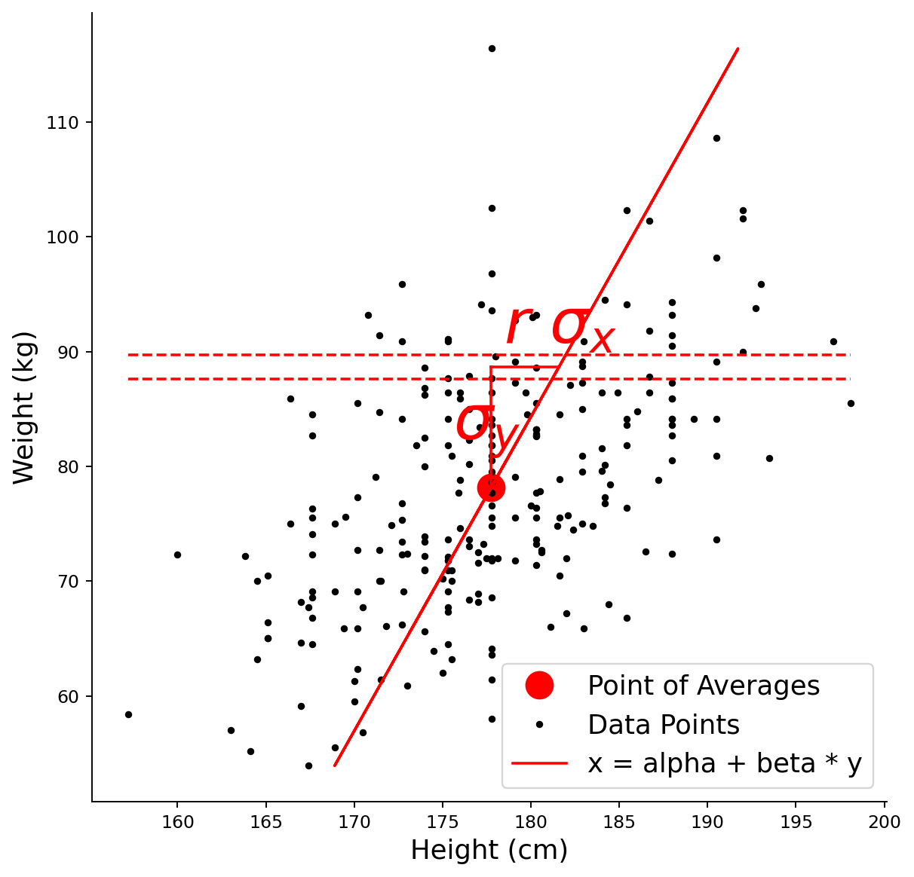

    **옳은 직선은 $0.67$ SE 안에 들어오고, 거꾸로 푼 값은 $5.91$ SE 벗어난다.** 띠 안 열한 명의 평균 키가 $180.36\,\text{cm}$인데 $X|Y$ 직선은 $181.59$를 주어 $1.22\,\text{cm}$ 차이이고, 이는 표준오차 $1.83$의 $0.67$배다. 거꾸로 푼 $191.18$은 $10.82\,\text{cm}$나 높고 표준오차로 재면 $5.91$배다. 자료에 $191.18\,\text{cm}$ 넘는 사람이 $247$명 중 여덟 명뿐이니, 몸무게가 평균보다 $1$ SD 큰 사람의 **평균** 키로 이 값을 내놓는 것은 애초에 말이 되지 않는다.

    **보기 8의 $1/r^2$ 과장이 자료에서 그대로 드러난다.** 평균에서의 편차로 재면 $3.84$ 대 $13.43$으로 $3.50$배이고, $1/r^2 = 3.4971$이다. 과장의 크기가 $r$ 하나로 예언된 셈이다.

    이 보기와 보기 9 를 나란히 놓으면 **두 직선이 각각 무엇의 평균인지**가 분명해진다. 세로 띠는 $x$를 고정하므로 파란 직선이 맞고, 가로 띠는 $y$를 고정하므로 빨간 직선이 맞다. 빨간 삼각형이 세로 $\sigma_y$에 가로 $r\sigma_x$인 것이 바로 "몸무게가 $1$ SD 크면 키는 $r$ SD 크다"를 그린 것이다.

    다만 **띠로 확인하는 일의 한계**도 같이 봐야 한다. 띠 안이 $10$명, $11$명이라 표준오차가 각각 $2.81$, $1.83$으로 크다. 이 정밀도로는 "옳은 직선이 맞는다"까지만 말할 수 있고 "얼마나 정확히 맞는다"는 말할 수 없다. 반면 **틀린 직선은 $5.91$ SE 밖이라 이 정밀도로도 확실히 걸러진다.** 느슨한 자료로도 큰 오류는 잡힌다는 것이 이 확인의 값이다. $\square$

---

## 3. 닫힌 형태의 해

[참고: Khan Academy — Calculating the Equation of a Regression Line](https://www.khanacademy.org/math/ap-statistics/bivariate-data-ap/least-squares-regression/v/calculating-the-equation-of-a-regression-line)

### L2 손실

목표는 평균제곱오차를 최소화하는 모수 $\alpha$와 $\beta$를 찾는 것이다.

$$
l = \frac{1}{n} \sum_{i=1}^n (\alpha + \beta x_i - y_i)^2
$$

### 정규방정식

편미분을 0으로 두면

$$
\begin{array}{lll}
\displaystyle \frac{\partial l}{\partial \alpha} = \frac{2}{n} \sum_{i=1}^n \left((\alpha + \beta x_i) - y_i\right) = 0
& \Rightarrow &
2\alpha + 2\beta \bar{x} - 2\bar{y} = 0 \\[6pt]
\displaystyle \frac{\partial l}{\partial \beta} = \frac{2}{n} \sum_{i=1}^n \left((\alpha + \beta x_i) - y_i\right) x_i = 0
& \Rightarrow &
2\alpha \bar{x} + 2\beta \overline{x^2} - 2\overline{xy} = 0
\end{array}
$$

### 해

정규방정식을 풀면

$$
\begin{array}{lll}
\beta
&=&
\displaystyle \frac{\overline{xy} - \bar{x}\bar{y}}{\overline{x^2} - (\bar{x})^2}
= \frac{\text{Cov}(X,Y)}{\text{Var}(X)}
= \frac{\rho \sqrt{\text{Var}(X)} \sqrt{\text{Var}(Y)}}{\text{Var}(X)}
= \frac{\rho \sqrt{\text{Var}(Y)}}{\sqrt{\text{Var}(X)}}
= \rho \frac{\sigma_y}{\sigma_x} \\[8pt]
\alpha &=& \displaystyle -\rho \frac{\sigma_y}{\sigma_x} \bar{x} + \bar{y}
\end{array}
$$

### 회귀직선의 식

다시 대입하면

$$
\begin{array}{lll}
y &=& \alpha + \beta x \\[4pt]
  &=& \displaystyle -\rho \frac{\sigma_y}{\sigma_x}\bar{x} + \bar{y} + \rho \frac{\sigma_y}{\sigma_x} x \\[4pt]
  &=& \displaystyle \rho \frac{\sigma_y}{\sigma_x}(x - \bar{x}) + \bar{y}
\end{array}
$$

표준화된 형태로 쓰면

$$
\frac{y - \bar{y}}{\sigma_y} = \rho \frac{x - \bar{x}}{\sigma_x}
$$

이 우아한 결과가 말하는 바는 이렇다. 표준단위로 잰 $y$의 예측값은 표준단위로 잰 $x$의 관측값에 $r$를 곱한 것과 같다.

---

## 4. 응용: 금융에서의 선형회귀

금융에서는 개별 자산의 수익률과 시장 기준지수 수익률의 관계를 모형화하는 데 단순선형회귀를 널리 쓴다. 이 맥락에서 기울기 계수 $\beta$는 **시장 베타**로, 체계적 위험의 측도이다.

### AAPL 대 SPY 일간 수익률

<div class="exbox" markdown>

**보기 11.** <span class="diff easy" title="쉬움"></span> AAPL의 베타. SPY 일간 수익률을 $x$, AAPL 일간 수익률을 $y$로 두고 $100$일로 적합한 뒤 다음 $100$일에 그 직선을 그린다.

**(1)** `LinearRegression`이 돌려주는 `coef_`가 $S_{xy}/S_{xx}$와 같음을 정규방정식에서 확인하고, 그것이 금융에서 말하는 **시장 베타** $\beta = \operatorname{Cov}(R_a, R_m)/\operatorname{Var}(R_m)$의 표본꼴임을 보이시오. 손으로 계산한 값과 `sklearn`의 값이 실제로 같은지 확인하시오.

**(2)** 코드는 훈련자료로 **한 번만** 적합하고 시험 칸에도 그 직선을 그린다. 시험 칸의 직선을 "시험자료에 적합한 직선"으로 읽으면 무엇을 놓치는가.

</div>

??? success "풀이"

    **(1) 해석적으로.** `LinearRegression`은 절편이 있는 최소제곱을 푼다. 3절의 둘째 정규방정식 $\sum_i (a + bx_i - y_i)x_i = 0$에 첫째 정규방정식 $a = \bar y - b\bar x$를 넣으면

    $$
    \sum_i \bigl[(y_i - \bar y) - b(x_i - \bar x)\bigr](x_i - \bar x) = 0
    \quad \Longrightarrow \quad
    \hat b = \frac{S_{xy}}{S_{xx}}
    $$

    이다. 여기서 $S_{xy} = \sum_i (x_i - \bar x)(y_i - \bar y)$, $S_{xx} = \sum_i (x_i - \bar x)^2$다. 분자와 분모를 각각 $n-1$로 나누면 표본공분산과 표본분산이므로

    $$
    \hat b = \frac{\widehat{\operatorname{Cov}}(x, y)}{\widehat{\operatorname{Var}}(x)} = r\,\frac{s_y}{s_x}
    $$

    이다. $x$를 시장수익률, $y$를 종목수익률로 두면 이것이 **시장 베타의 표본추정량**이다. 모집단 꼴 $\beta = \operatorname{Cov}(R_a, R_m)/\operatorname{Var}(R_m)$에서 모적률을 표본적률로 바꾼 것일 뿐이며, 절편 $\hat a$가 금융에서 말하는 **알파**다.

    `sklearn`이 정말 이 값을 주는지는 네트워크 없이도 확인할 수 있다. 보기 1의 자료를 그대로 쓴다.

    ```python
    import numpy as np
    import pandas as pd
    from sklearn.linear_model import LinearRegression

    # 수식이 맞는지만 보는 확인이므로 자료는 아무것이나 좋다. 보기 1 의 bdims 를 쓴다.
    data_url = ("https://raw.githubusercontent.com/vincentarelbundock/Rdatasets/"
                "1dcc2bf5f955cc1224a3e1307256e1fe86b68dae/csv/openintro/bdims.csv")
    data = pd.read_csv(data_url).rename(columns={"hgt": "Height", "wgt": "Weight"})
    male = data[data.sex == 1].loc[:300, ["Height", "Weight"]]
    x = male.Height.to_numpy()
    y = male.Weight.to_numpy()

    model = LinearRegression().fit(x.reshape(-1, 1), y)
    Sxx = ((x - x.mean()) ** 2).sum()
    Sxy = ((x - x.mean()) * (y - y.mean())).sum()

    print(f"sklearn  coef_      = {model.coef_[0]:.10f}")
    print(f"S_xy / S_xx         = {Sxy / Sxx:.10f}")
    print(f"r * s_y / s_x       = {np.corrcoef(x, y)[0, 1] * y.std(ddof=1) / x.std(ddof=1):.10f}")
    print(f"sklearn  intercept_ = {model.intercept_:.10f}")
    print(f"y-bar - b * x-bar   = {y.mean() - (Sxy / Sxx) * x.mean():.10f}")
    ```

    출력:

    ```
    sklearn  coef_      = 0.7825684506
    S_xy / S_xx         = 0.7825684506
    r * s_y / s_x       = 0.7825684506
    sklearn  intercept_ = -60.9533641420
    y-bar - b * x-bar   = -60.9533641420
    ```

    **세 식이 소수 열째 자리까지 같다.** 실제 차이는 $8.9 \times 10^{-16}$으로 부동소수점 한계다. 절편도 $\bar y - \hat b\bar x$와 같다. 그러므로 아래 블록이 찍는 `Slope (Beta)`는 `SPY` 와 `AAPL` 수익률로 계산한 $S_{xy}/S_{xx}$이고, `Intercept (Alpha)`는 $\bar y - \hat\beta\bar x$다.

    **(2) 시험 칸의 직선은 시험자료를 쓰지 않았다.** `model.fit`은 훈련자료에서 한 번만 호출되고, 시험 칸에서는 `model.predict(x_test)`로 **같은 계수**를 그대로 쓴다. 이것을 "시험자료에 적합한 직선"으로 읽으면 두 가지를 놓친다.

    첫째, **시험 칸의 잔차는 진짜 예측오차다.** 훈련 칸의 잔차는 그 자료로 최소화한 값이므로 낙관적으로 작고, 시험 칸의 잔차에는 그런 혜택이 없다. 두 칸의 잔차 퍼짐을 견주는 것이 이 그림의 요점이며, 같은 자료에 다시 적합한 직선을 그려 버리면 그 비교가 사라진다.

    둘째, **베타는 기간마다 변한다.** 시험 칸에서 점구름의 기울기가 직선과 눈에 띄게 다르면 그것은 모형이 나쁘다는 뜻이 아니라 **그 100일 동안 종목의 체계적 위험이 달라졌다**는 뜻일 수 있다. 시험자료에 다시 적합해 버리면 이 변화가 계수에 흡수되어 보이지 않는다.

    !!! note "이 블록의 출력을 싣지 못한 사정"
        기간을 $2020$-$01$-$02$부터 $2023$-$12$-$30$까지로 고정하고 `auto_adjust=False`를 주었으므로 내려받은 자료 자체는 언제 실행해도 같고, **추정된 베타와 알파도 재현된다.** 다만 이 책을 쓰는 환경에서는 `yfinance` 가 요청 한도(`YFRateLimitError`)에 걸려 출력을 확보하지 못했다. 그래서 고정된 출력과 그림을 싣지 않았다. (1)에서 확인한 대로 찍히는 값은 $S_{xy}/S_{xx}$와 $\bar y - \hat\beta\bar x$이므로, 직접 실행해 얻은 두 수를 그 식으로 읽으면 된다.

        처음 코드는 `period='max'`였는데, 그러면 마지막 $200$일이 실행하는 날마다 달라져 결과가 매번 바뀐다. 모의실험에서 난수 씨앗을 고정하는 것과 같은 이유로 **외부 자료에서는 기간을 고정한다.**

    ```python
    from sklearn.linear_model import LinearRegression
    import yfinance as yf
    import matplotlib.pyplot as plt
    import pandas as pd

    tickers = ["SPY", "AAPL"]

    # 기간을 고정한다. period='max'로 두면 실행하는 날마다 마지막 200일이
    # 달라져 결과가 바뀐다. auto_adjust=False로 두는 이유는 조정종가가
    # 배당·분할이 생길 때마다 과거까지 소급해 바뀌기 때문이다.
    START, END = "2020-01-02", "2023-12-30"
    spy_data = yf.Ticker(tickers[0]).history(start=START, end=END, auto_adjust=False)
    aapl_data = yf.Ticker(tickers[1]).history(start=START, end=END, auto_adjust=False)

    spy_data[tickers[0]] = spy_data['Close'].pct_change()
    aapl_data[tickers[1]] = aapl_data['Close'].pct_change()

    daily_returns = pd.merge(spy_data[[tickers[0]]], aapl_data[[tickers[1]]],
                             left_index=True, right_index=True).dropna()

    # 훈련·시험 나누기
    x_train = daily_returns.iloc[-200:-100, 0:1].values
    y_train = daily_returns.iloc[-200:-100, 1].values
    x_test = daily_returns.iloc[-100:, 0:1].values
    y_test = daily_returns.iloc[-100:, 1].values

    print(f"x_train shape: {x_train.shape}")
    print(f"y_train shape: {y_train.shape}")
    print(f"x_test shape: {x_test.shape}")
    print(f"y_test shape: {y_test.shape}\n")

    model = LinearRegression()
    model.fit(x_train, y_train)

    print('Slope (Beta) of regression line:', f"{model.coef_[0]:.4f}")
    print('Intercept (Alpha) of regression line:', f"{model.intercept_:.4f}")

    fig, axes = plt.subplots(1, 2, figsize=(12, 3))

    for ax, x, y, title in zip(axes, (x_train, x_test), (y_train, y_test), ("Training Data", "Testing Data")):
        y_pred = model.predict(x)
        ax.plot(x, y, "o", label="Actual Data")
        ax.plot(x, y_pred, "--r", alpha=0.3, label="Linear Regression")
        ax.set_title(title)
        ax.set_xlabel(tickers[0] + " Daily Return", loc='right')
        ax.set_ylabel(tickers[1] + " Daily Return", loc='top')
        ax.legend()
        ax.spines['top'].set_visible(False)
        ax.spines['right'].set_visible(False)
        ax.spines['bottom'].set_position('zero')
        ax.spines['left'].set_position('zero')

    plt.tight_layout()
    plt.show()
    ```

    이 블록은 네트워크가 있어야 돌고, 돌면 `x_train shape: (100, 1)` 꼴의 모양 네 줄에 이어 베타와 알파 두 줄을 찍는다. 종목·기간을 바꾸면 당연히 두 수도 달라지므로, 여기서 눈여겨볼 것은 특정 수치가 아니라 **훈련으로 적합하고 시험에서 검사한다**는 절차다. $\square$

### WMT 대 SPY 일간 수익률

이 보기는 산점도와 회귀직선 옆에 두 수익률 계열의 주변분포를 보여주는 결합 히스토그램을 함께 그린다.

<div class="exbox" markdown>

**보기 12.** <span class="diff easy" title="쉬움"></span> WMT의 베타. 산점도와 회귀직선 옆에 두 수익률 계열의 **주변 히스토그램**을 함께 놓는다.

**(1)** 두 주변 히스토그램만 보고 베타를 알 수 있는가. 주변분포를 **그대로 두고** 베타를 바꿀 수 있는지 따지고, 바꿀 수 있다면 그 범위를 $s_x, s_y$로 쓰시오. 자료로 확인하시오.

**(2)** 이 블록은 `period='max'`와 `how='inner'`를 쓴다. 두 가지가 각각 재현성에 어떤 영향을 주는가.

</div>

??? success "풀이"

    **(1) 알 수 없다.** 베타는 $\hat\beta = r\,s_y/s_x$이고, 주변 히스토그램은 $s_x$와 $s_y$만 알려 준다. **빠진 것은 $r$ 이며, $r$ 은 주변분포에 들어 있지 않다.** 결합분포에만 있는 정보다.

    바꿀 수 있는 범위는 바로 나온다. $\lvert r \rvert \le 1$이므로

    $$
    -\frac{s_y}{s_x} \;\le\; \hat\beta \;\le\; \frac{s_y}{s_x}
    $$

    이고, **양 끝은 SD 직선의 기울기**(보기 5, 6)다. 두 주변 히스토그램이 정해 주는 것은 이 구간뿐이고, 그 안의 어디에 $\hat\beta$가 놓이는지는 **짝을 어떻게 지었는가**가 정한다.

    실제로 짝만 바꿔 보면 된다. $x$ 값들의 다중집합과 $y$ 값들의 다중집합을 고정하고 짝만 다시 맺으면 두 히스토그램은 한 화소도 변하지 않지만 $r$은 크게 변한다. 네트워크 없이 확인할 수 있으므로 보기 1의 자료로 한다.

    ```python
    import numpy as np
    import pandas as pd
    from sklearn.linear_model import LinearRegression

    # 주변분포는 그대로 두고 짝만 바꾼다. 자료는 보기 1 의 bdims 를 쓴다.
    data_url = ("https://raw.githubusercontent.com/vincentarelbundock/Rdatasets/"
                "1dcc2bf5f955cc1224a3e1307256e1fe86b68dae/csv/openintro/bdims.csv")
    data = pd.read_csv(data_url).rename(columns={"hgt": "Height", "wgt": "Weight"})
    male = data[data.sex == 1].loc[:300, ["Height", "Weight"]]
    x_sorted = np.sort(male.Height.to_numpy())
    y_sorted = np.sort(male.Weight.to_numpy())

    def fit(x, y):
        m = LinearRegression().fit(x.reshape(-1, 1), y)
        return np.corrcoef(x, y)[0, 1], m.coef_[0]

    rng = np.random.default_rng(0)
    pairings = [
        ("원래 짝",        male.Height.to_numpy(), male.Weight.to_numpy()),
        ("큰 것끼리",      x_sorted,               y_sorted),
        ("큰 것과 작은 것", x_sorted,               y_sorted[::-1]),
        ("무작위로 섞어",   x_sorted,               rng.permutation(y_sorted)),
    ]
    sx, sy = x_sorted.std(ddof=1), y_sorted.std(ddof=1)
    print(f"주변분포는 네 경우 모두 같다:  s_x = {sx:.4f},  s_y = {sy:.4f}")
    print(f"s_y / s_x = {sy / sx:.4f}  (베타가 가질 수 있는 값의 한계)")
    print()
    print(f"{'짝 짓는 방식':18s}{'r':>10s}{'beta':>10s}{'r s_y/s_x':>12s}")
    for name, xv, yv in pairings:
        r, b = fit(xv, yv)
        print(f"{name:18s}{r:10.4f}{b:10.4f}{r * sy / sx:12.4f}")
    ```

    출력:

    ```
    주변분포는 네 경우 모두 같다:  s_x = 7.1836,  s_y = 10.5129
    s_y / s_x = 1.4635  (베타가 가질 수 있는 값의 한계)

    짝 짓는 방식                    r      beta   r s_y/s_x
    원래 짝                  0.5347    0.7826      0.7826
    큰 것끼리                 0.9914    1.4508      1.4508
    큰 것과 작은 것            -0.9891   -1.4475     -1.4475
    무작위로 섞어               0.0012    0.0017      0.0017
    ```

    **같은 두 히스토그램에서 베타가 $-1.4475$ 부터 $+1.4508$ 까지 나온다.** 네 경우 모두 $s_x = 7.1836$, $s_y = 10.5129$로 똑같다. 그런데도 $r$이 $-0.9891$에서 $+0.9914$까지 움직이고 베타가 그에 비례해 따라간다. 각 줄에서 `beta` 열과 `r s_y/s_x` 열이 소수 넷째 자리까지 같으니 공식도 함께 확인된다.

    양 끝이 $\pm 1.4635$에 **살짝 못 미친다**는 것도 읽어 둘 만하다. 크기 순으로 짝지어도 $r = 0.9914$에서 멈추는데, 이는 두 주변분포의 모양이 서로 선형변환 관계가 아니기 때문이다. $r = 1$이 되려면 $y$의 분위수가 $x$의 분위수의 **정확히 선형함수**여야 한다. 그러므로 $\pm s_y/s_x$는 도달 가능한 한계가 아니라 **느슨한 상한**이다.

    금융에서 이 점이 중요하다. **"수익률의 변동성이 시장과 비슷하다"는 말은 베타에 대해 거의 아무것도 말해 주지 않는다.** 변동성은 $s_y$이고 베타는 $r s_y/s_x$다. 변동성이 큰 종목의 베타가 작을 수도 있고(시장과 무관하게 흔들리는 경우), 변동성이 작아도 베타가 $1$에 가까울 수 있다. 분산 분해 $s_y^2 = \hat\beta^2 s_x^2 + s_{y\mid x}^2$ 에서 앞항이 **체계적 위험**, 뒷항이 **고유 위험**이며, 주변 히스토그램은 이 둘의 합만 보여 주고 나눠 주지는 않는다. 산점도가 필요한 까닭이다.

    **(2) 두 가지가 서로 다른 방식으로 재현을 깨뜨린다.** `period='max'`는 **끝점**을 실행하는 날로 잡는다. 그래서 돌릴 때마다 자료가 길어지고 베타도 조금씩 움직인다. `how='inner'`는 두 계열의 **날짜 교집합**만 남기므로 시작점을 늦게 상장된 쪽이 정하는데, 이 시작점 자체는 고정된다. 곧 **재현을 깨는 쪽은 `period='max'` 이고, `how='inner'` 는 표본의 범위를 결정할 뿐이다.**

    고치는 길은 보기 11 과 같다. `start`, `end`를 못 박고 `auto_adjust=False`를 주는 것이다. 조정종가는 배당·분할이 생길 때마다 과거 값까지 소급해 바뀌므로, 날짜를 고정해도 조정종가를 쓰면 수익률이 달라진다.

    !!! note "이 블록의 출력을 싣지 못한 사정"
        이 블록은 `yfinance`로 **실행 시점의** 시장 자료를 내려받는다. 기간이 고정되어 있지 않으므로 추정된 베타도 실행할 때마다 달라지며, 그래서 고정된 출력이나 그림을 싣지 않았다. 더하여 이 책을 쓰는 환경에서는 `yfinance`가 요청 한도(`YFRateLimitError`)에 걸려 아예 내려받지 못했다. 직접 실행해 얻은 값으로 읽으면 되고, (1)에서 본 대로 **두 히스토그램이 아니라 산점도**가 베타를 결정한다는 점만 가져가면 된다. $\square$

    ```python
    import yfinance as yf
    import numpy as np
    import matplotlib.pyplot as plt
    from sklearn.linear_model import LinearRegression

    ticker_wmt = "WMT"
    ticker_spy = "SPY"

    wmt_data = yf.Ticker(ticker_wmt).history(period='max')
    spy_data = yf.Ticker(ticker_spy).history(period='max')

    wmt_data[ticker_wmt] = wmt_data['Close'].pct_change()
    spy_data[ticker_spy] = spy_data['Close'].pct_change()

    daily_returns = wmt_data[[ticker_wmt]].join(spy_data[[ticker_spy]], how='inner').dropna()

    spy_returns = daily_returns[ticker_spy].to_numpy().reshape(-1, 1)
    wmt_returns = daily_returns[ticker_wmt].to_numpy()

    model = LinearRegression()
    model.fit(spy_returns, wmt_returns)
    regression_line = model.predict(spy_returns)

    fig, axes = plt.subplots(2, 2, figsize=(8, 8))

    # SPY 수익률 히스토그램
    axes[0, 0].hist(spy_returns, density=True, bins=50, color='skyblue', edgecolor='black')
    axes[0, 0].set_xlim(-0.2, 0.2)
    axes[0, 0].set_xticks([-0.2, -0.1, 0, 0.1, 0.2])
    axes[0, 0].set_title(f"{ticker_spy} Daily Returns Histogram")

    axes[0, 1].axis('off')

    # 산점도와 회귀직선
    axes[1, 0].plot(spy_returns, wmt_returns, '.', color='purple', label='Data Points')
    axes[1, 0].plot(spy_returns, regression_line, 'r-', label='Regression Line')
    axes[1, 0].set_xlabel(f"{ticker_spy} Daily Returns")
    axes[1, 0].set_ylabel(f"{ticker_wmt} Daily Returns")
    axes[1, 0].set_xlim(-0.2, 0.2)
    axes[1, 0].set_ylim(-0.2, 0.2)
    axes[1, 0].set_xticks([-0.2, -0.1, 0, 0.1, 0.2])
    axes[1, 0].set_yticks([-0.2, -0.1, 0, 0.1, 0.2])
    axes[1, 0].legend()

    # WMT 수익률 히스토그램(가로)
    axes[1, 1].hist(wmt_returns, density=True, bins=50, orientation='horizontal',
                    color='lightgreen', edgecolor='black')
    axes[1, 1].set_ylim(-0.2, 0.2)
    axes[1, 1].set_yticks([-0.2, -0.1, 0, 0.1, 0.2])
    axes[1, 1].set_title(f"{ticker_wmt} Daily Returns Histogram")

    plt.tight_layout()
    plt.show()
    ```

    왼쪽 아래 칸이 산점도이고 위와 오른쪽이 각 계열의 주변 히스토그램이다. 오른쪽 위 칸은 `axis('off')`로 비워 두었다. 그림을 읽을 때는 **세 칸이 같은 축 범위를 쓴다**는 점에 주의해야 한다. 두 히스토그램은 $[-0.2, 0.2]$로 잘려 있어 그 밖의 극단적인 날들이 보이지 않는다.

## 연습문제

<div class="drillbox" markdown>

**연습문제 1.** <span class="diff easy" title="쉬움"></span>
어떤 집단에서 뽑은 남성 100명의 키와 몸무게에 대한 통계 정보:

- **키**: 평균 = 173 cm, 표준편차 = 6 cm
- **몸무게**: 평균 = 70 kg, 표준편차 = 7 kg
- **키와 몸무게의 상관**: 0.59

표본크기가 크므로 $t$ 분포 대신 정규분포를 쓴다.

**(a)** 키가 179 cm인 남성의 예측 몸무게는 얼마인가?

**(b)** 위에서 얻은 예측 몸무게가 어떤 남성의 몸무게라고 하자. 이 남성의 예측 키는 얼마인가?

**(c)** 키가 179 cm일 때 평균 예측 몸무게에 대한 95% 신뢰구간은 얼마인가?

**(d)** 키가 179 cm일 때 예측 몸무게에 대한 95% 예측구간은 얼마인가?

</div>

??? success "풀이"

    **(a)** 키 179 cm에 대한 몸무게 예측:

    $179 = 173 + 6$이므로 $X = \mu_X + \sigma_X$, 곧 표준단위로 $z_x = 1$이다. 표준화된 회귀식 $z_{\hat{y}} = r z_x$에서

    $$
    X = \mu_X + \sigma_X \quad \rightarrow \quad \hat{Y} = \mu_Y + r\sigma_Y = 70 + 0.59 \times 7 = 74.13
    $$

    **(b)** 몸무게 74.13 kg에 대한 키 예측:

    이제 $z_y = r = 0.59$이므로 $X$를 $Y$에 회귀시키면 $z_{\hat{x}} = r z_y = r^2$이다.

    $$
    Y = \mu_Y + r\sigma_Y \quad \rightarrow \quad \hat{X} = \mu_X + r^2\sigma_X = 173 + 0.59^2 \times 6 = 175.09
    $$

    출발점인 179 cm로 돌아오지 못하고 평균 쪽으로 되돌아온다는 점에 주목하라. 이것이 회귀 효과이다.

    **(c)** 평균 예측 몸무게에 대한 95% 신뢰구간:

    먼저 잔차 표준편차(회귀의 표준오차)를 구한다.

    $$
    s_{Y \mid X} = \sigma_Y \sqrt{1 - r^2} = 7\sqrt{1 - 0.59^2} = 7 \times 0.8074 = 5.6518
    $$

    지렛대 항은 $\sum (X_i - \bar{X})^2 = (n-1)\sigma_X^2 = 99 \times 36 = 3564$이고 $(X - \bar{X})^2 = 36$이므로

    $$
    h = \frac{1}{n} + \frac{(X - \bar{X})^2}{\sum (X_i - \bar{X})^2} = \frac{1}{100} + \frac{36}{3564} = 0.020101
    $$

    $$
    SE(\hat{Y}) = s_{Y \mid X} \sqrt{h} = 5.6518 \times 0.14178 = 0.8013
    $$

    $$
    \hat{Y} \pm z_{0.025} \cdot SE(\hat{Y}) = 74.13 \pm 1.96 \times 0.8013 = (72.56, \; 75.70)
    $$

    **(d)** 예측 몸무게에 대한 95% 예측구간:

    개별 관측값을 예측할 때는 오차항의 분산 $s_{Y \mid X}^2$이 추가로 더해진다.

    $$
    SE_{\text{예측}} = s_{Y \mid X} \sqrt{1 + h} = 5.6518 \times \sqrt{1.020101} = 5.7083
    $$

    $$
    \hat{Y} \pm z_{0.025} \cdot SE_{\text{예측}} = 74.13 \pm 1.96 \times 5.7083 = (62.94, \; 85.32)
    $$

    예측구간이 신뢰구간보다 훨씬 넓다는 점에 주목하라. 폭의 비는 $\sqrt{(1+h)/h} = \sqrt{1.0201/0.0201} \approx 7.1$배이다. 평균을 추정하는 일과 개별 관측값을 예측하는 일은 정밀도가 전혀 다르다. $\square$

<div class="drillbox" markdown>

**연습문제 2.** <span class="diff med" title="중간"></span>
주택 자료를 써서 다음을 하라.

**(a)** $x = \text{df.median\_income}$, $y = \text{df.median\_house\_value}$로 회귀직선을 그려라.

**(b)** `median_income`이 8일 때 `median_house_value`의 회귀 예측값을 계산하라.

```python
import os
import tarfile
import urllib.request   # urllib 만 가져오면 urllib.request 가 없다
from sklearn import metrics
from sklearn.linear_model import LinearRegression

DOWNLOAD_ROOT = "https://raw.githubusercontent.com/ageron/handson-ml2/7b7e23e7267356f8355580877eff98c43cda1bd0/"
HOUSING_PATH = os.path.join("datasets", "housing")
HOUSING_URL = DOWNLOAD_ROOT + "datasets/housing/housing.tgz"

def fetch_housing_data(housing_url=HOUSING_URL, housing_path=HOUSING_PATH):
    if not os.path.isdir(housing_path):
        os.makedirs(housing_path)
    tgz_path = os.path.join(housing_path, "housing.tgz")
    urllib.request.urlretrieve(housing_url, tgz_path)
    housing_tgz = tarfile.open(tgz_path)
    housing_tgz.extractall(path=housing_path)
    housing_tgz.close()

def load_housing_data(housing_path=HOUSING_PATH):
    csv_path = os.path.join(housing_path, "housing.csv")
    return pd.read_csv(csv_path)

def main():
    fetch_housing_data()
    pass

if __name__ == "__main__":
    main()
```

</div>

??? success "풀이"

    ```python
    import os
    import tarfile
    import urllib.request   # urllib 만 가져오면 urllib.request 가 없다
    import numpy as np
    import pandas as pd
    import matplotlib.pyplot as plt
    from sklearn.linear_model import LinearRegression

    DOWNLOAD_ROOT = "https://raw.githubusercontent.com/ageron/handson-ml2/7b7e23e7267356f8355580877eff98c43cda1bd0/"
    HOUSING_PATH = os.path.join("datasets", "housing")
    HOUSING_URL = DOWNLOAD_ROOT + "datasets/housing/housing.tgz"

    def fetch_housing_data(housing_url=HOUSING_URL, housing_path=HOUSING_PATH):
        if not os.path.isdir(housing_path):
            os.makedirs(housing_path)
        tgz_path = os.path.join(housing_path, "housing.tgz")
        urllib.request.urlretrieve(housing_url, tgz_path)
        housing_tgz = tarfile.open(tgz_path)
        housing_tgz.extractall(path=housing_path)
        housing_tgz.close()

    def load_housing_data(housing_path=HOUSING_PATH):
        csv_path = os.path.join(housing_path, "housing.csv")
        return pd.read_csv(csv_path)

    def main():
        fetch_housing_data()

        print("(a)")
        df = load_housing_data()
        x = np.array(df.median_income).reshape((-1, 1))
        y = np.array(df.median_house_value)
        model = LinearRegression()
        model.fit(x, y)
        y_pred = model.predict(x)
        fig, ax = plt.subplots(figsize=(15, 4))
        ax.plot(x, y, ',')
        ax.plot(x, y_pred, '--r')
        plt.show()

        print("(b)")
        print(model.predict([[8]])[0])

    if __name__ == "__main__":
        main()
    ```

    출력:

    ```
    (a)
    (b)
    379436.37031843845
    ```

    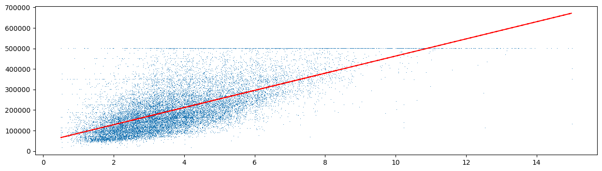

    **(a)** 점 2 만여 개를 `','` 로 찍고 그 위에 적합된 직선을 겹쳐 그렸다.

    **(b) $379{,}436$ 은 예측값이다.** 적합된 직선이 `median_house_value = 45085.58 + 41793.85 * median_income` 이므로

    $$
    45085.58 + 41793.85 \times 8 = 379{,}436.38
    $$

    이고, 이것이 `model.predict([[8]])` 이 찍은 수다. **잔차제곱합이 아니다.** 잔차제곱합은 2 만여 가구의 제곱합이라 $10^{12}$ 자릿수이며 위 코드는 그것을 계산하지도 않는다. 최소제곱이 최소화하는 것이 잔차제곱합이라는 사실과, 이 자리에서 찍힌 수가 무엇인가는 별개다.

    **절단에 유의하라.** 이 자료의 `median_house_value` 는 $500{,}001$ 에서 잘려 있고(전체의 $4.7\%$ 가 이 값이다), 그래서 고소득 구간에서 직선이 체계적으로 어긋난다. $x = 8$ 은 그 구간에 가까우므로 위 예측값도 그만큼 낮게 끌려 있다.

---

## 정리하며

단순선형회귀는 두 변수의 관계를 **직선 하나**로 모형화한다.

$$
Y=\beta_0+\beta_1X+\varepsilon
$$

- **$\beta_1$ 은 "$X$ 가 1 늘 때 $Y$ 의 평균 변화"다.** 상관계수와 달리 **단위가 있고 크기를 해석할 수 있다**(12장).
- **$\varepsilon$ 이 모형의 전부를 담는다.** 선형성·독립성·등분산성·정규성이라는 네 가정이 모두 오차항에 대한 조건이며, 이 장의 상당 부분이 그것을 확인하는 데 쓰인다.
- **$X$ 와 $Y$ 를 바꾸면 다른 직선이 나온다.** 회귀는 대칭이 아니며, "$Y$ 의 $X$ 에 대한 회귀"와 "$X$ 의 $Y$ 에 대한 회귀"가 다르다. 상관계수는 대칭이라는 점과 대조된다.
- **적합이 곧 인과가 아니다.** 계수를 "효과"로 읽으려면 12장의 조건들이 필요하다.
- **외삽을 조심한다.** 자료의 범위 밖에서는 직선이 성립한다는 근거가 없다.

다음 절 **다중선형회귀**로 넘어간다.
