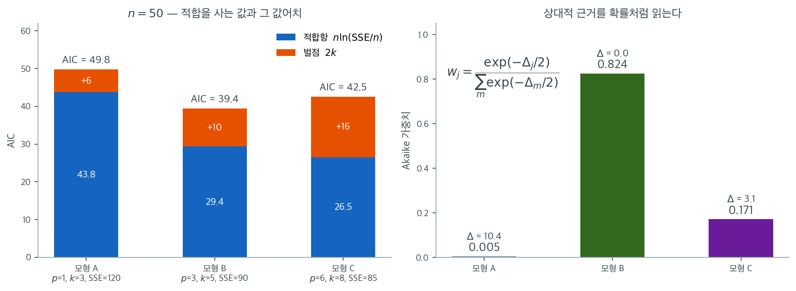

# Akaike 정보기준

설명변수의 개수가 다른 회귀모형들을 비교할 때 $R^2$ 같은 적합도 척도는 언제나 더 복잡한 모형을 선호한다. 자료를 잘 설명하는 모형에 보상을 주되 불필요한 모수에는 벌점을 주어 적합과 복잡도를 저울질하는 기준이 필요하다. Akaike 정보기준(AIC)은 모형이 참 자료생성과정을 근사할 때 잃어버리는 정보량을 추정함으로써 이를 달성한다.

---

## 1. 정보이론에서 온 동기

자료의 참 분포가 $f$이고 후보 모형의 분포가 $g$라 하자. **Kullback-Leibler(KL) 발산**은 $f$를 $g$로 근사할 때 잃는 정보량을 잰다.

$$
D_{\text{KL}}(f \| g) = \int f(x) \ln \frac{f(x)}{g(x)} \, dx
$$

$f$를 모르므로 $D_{\text{KL}}$을 직접 계산할 수는 없다. 그러나 Akaike(1973)는 최대가능도 추정값에서 평가한 기대 로그가능도가 상대적 KL 발산의 점근적 불편추정값을 제공하며, 다만 모수 개수 $k$만큼의 편향 보정이 필요함을 보였다. 이 통찰에서 AIC 공식이 나온다.

---

## 2. 정의

추정 모수가 $k$개이고 최대화된 로그가능도가 $\ln \hat{L}$인 모형의 **Akaike 정보기준**은

$$
\text{AIC} = 2k - 2 \ln \hat{L}
$$

여기서

- $k$는 추정한 모수의 총 개수(절편과, 해당된다면 오차분산 $\sigma^2$까지 포함),
- $\hat{L}$은 최대가능도 추정값에서 평가한 가능도함수의 값이다.

$2k$ 항은 모형 복잡도에 벌점을 주고 $-2 \ln \hat{L}$ 항은 적합도에 보상을 준다. **AIC가 작을수록 좋은 모형**이며, 적합과 절약성 사이에서 유리한 절충을 이룬 모형이다.

---

## 3. 선형회귀의 AIC

정규오차를 갖는 선형회귀 모형에서 최대화된 로그가능도는 다음 형태를 갖는다.

$$
\ln \hat{L} = -\frac{n}{2} \ln(2\pi) - \frac{n}{2} \ln \hat{\sigma}^2 - \frac{n}{2}
$$

여기서 $\hat{\sigma}^2 = \text{SSE}/n$은 오차분산의 최대가능도 추정값이다. AIC 공식에 대입하면

$$
\text{AIC} = 2k + n \ln\!\left(\frac{\text{SSE}}{n}\right) + n \ln(2\pi) + n
$$

같은 자료를 쓰는 모형들 사이에서 $n \ln(2\pi) + n$은 상수이므로, 모형 비교에는 다음의 간단한 형태를 쓸 수 있다.

$$
\text{AIC} = 2k + n \ln\!\left(\frac{\text{SSE}}{n}\right)
$$

여기서 $k = p + 2$이다($p$개의 회귀계수, 절편, 그리고 $\sigma^2$).

---

## 4. 소표본 보정(AICc)

표본크기 $n$이 모수 개수 $k$에 비해 작으면 AIC는 지나치게 복잡한 모형을 고르는 경향이 있다. Hurvich와 Tsai(1989)는 보정된 형태를 제안했다.

$$
\text{AIC}_c = \text{AIC} + \frac{2k(k+1)}{n - k - 1}
$$

보정항 $\frac{2k(k+1)}{n-k-1}$은 $n \gg k$일 때 무시할 만하지만 $n/k < 40$이면 상당히 커진다. 흔한 경험 법칙은 $n / k < 40$일 때마다 AICc를 쓰는 것이다.

!!! tip "망설여지면 AICc를 쓴다"
    $n \to \infty$일 때 AICc는 AIC로 수렴하므로, 모형선택에서 AICc를 쓰는 것은 언제나 AIC 못지않다. 많은 실무자가 표본크기와 무관하게 기본적으로 AICc를 쓴다.

---

## 5. 모형 비교에 AIC 쓰기

AIC는 상대적인 의미에서만 뜻이 있다. AIC의 절댓값 자체에는 해석이 없다. 후보 모형 $M$개를 비교하려면 각 모형 $j = 1, \ldots, M$의 $\text{AIC}_j$를 계산하고 AIC가 가장 작은 모형을 고른다.

### 델타 AIC

모형 $j$의 **델타 AIC**는

$$
\Delta_j = \text{AIC}_j - \text{AIC}_{\min}
$$

여기서 $\text{AIC}_{\min}$은 모든 후보 가운데 가장 작은 AIC이다. Burnham과 Anderson(2002)은 다음 해석을 제안한다.

| $\Delta_j$ | 해석 |
|-------------|----------------|
| 0 – 2     | 상당한 근거가 있음. 경쟁력 있는 모형 |
| 4 – 7     | 근거가 상당히 약함 |
| > 10       | 사실상 근거 없음 |

### Akaike 가중치

Akaike 가중치는 각 모형의 상대적 근거를 확률처럼 나타낸다.

$$
w_j = \frac{\exp(-\Delta_j / 2)}{\sum_{m=1}^{M} \exp(-\Delta_m / 2)}
$$

가중치의 합은 1이며, 자료가 주어졌을 때 모형 $j$가 후보들 가운데 최선일 근사적 확률로 해석할 수 있다.

---

## 6. 중요한 성질

- **가설검정이 아니다**: AIC는 어떤 모형이 "유의하게" 나은지를 검정하지 않는다. 추정된 예측 정확도로 모형들의 순위를 매긴다.
- **절대적이 아니라 상대적이다**: AIC 값은 같은 자료 안에서 비교할 때에만 의미가 있다. 서로 다른 자료의 AIC를 비교하는 것은 타당하지 않다.
- **예측을 선호한다**: AIC는 모형선택에서 하나 빼기 교차검증과 점근적으로 동등하므로, "참" 모형의 식별보다는 예측에 지향되어 있다.
- **일치성이 없다**: 참 모형이 후보에 들어 있고 $n \to \infty$여도 AIC가 반드시 참 모형을 고르지는 않는다. 조금 더 복잡한 모형을 고르는 경향이 있다. 이 일치성은 대신 BIC가 갖는다.

!!! warning "같은 자료여야 한다"
    AIC로 모형을 비교할 때 모든 모형은 정확히 같은 자료(같은 관측값들)에 적합되어야 한다. 크기가 다르거나 관측값이 다른 자료에 적합한 모형들의 AIC를 비교하는 것은 의미가 없다.

---

## 7. 수치 보기

관측값 $n = 50$개인 자료에 대한 후보 모형 셋을 생각하자.

| 모형 | 설명변수 수 ($p$) | $k$ | SSE | $\text{AIC}$ |
|-------|-------------------|------|------|---------------|
| A     | 1                 | 3    | 120  | $50\ln(120/50) + 2(3) = 50(0.875) + 6 = 49.8$ |
| B     | 3                 | 5    | 90   | $50\ln(90/50) + 2(5) = 50(0.588) + 10 = 39.4$ |
| C     | 6                 | 8    | 85   | $50\ln(85/50) + 2(8) = 50(0.531) + 16 = 42.5$ |

모형 B의 AIC가 가장 작아(39.4) 적합과 복잡도의 균형이 가장 좋다. 모형 C는 모형 B보다 SSE가 조금 더 작지만, 세 개의 추가 모수가 그 미미한 적합 개선으로 정당화되지 않는다. 복잡도 벌점 $2 \times 8 = 16$이 $2 \times 5 = 10$을 넘어서는 몫이 이득보다 크기 때문이다.

델타 값은 $\Delta_A = 10.4$, $\Delta_B = 0$, $\Delta_C = 3.1$이다. Burnham과 Anderson의 지침에 따르면 모형 A는 사실상 근거가 없고, 모형 B가 최선이며, 모형 C는 근거가 눈에 띄게 약하지만 완전히 배제할 수는 없다.



위 표의 계산을 그림으로 옮겼다. 왼쪽 막대의 파란 부분이 적합항 $n\ln(\mathrm{SSE}/n)$이고 주황 부분이 벌점 $2k$다. 파란 부분은 A에서 C로 갈수록 $43.8 \to 29.4 \to 26.5$로 **계속 줄어든다.** 모수를 더 주면 SSE는 반드시 줄어들기 때문이다. 주황 부분은 $6 \to 10 \to 16$으로 계속 는다. 두 막대의 합인 AIC가 $49.8 \to 39.4 \to 42.5$로 **내려갔다가 다시 올라가는** 것이 AIC가 하는 일의 전부다.

B와 C를 견주면 셈이 더 또렷하다. 모형 C는 모수를 셋 더 써서 적합항을 $29.4$에서 $26.5$로 $2.86$만큼 줄였다. 그 대가로 벌점이 $10$에서 $16$으로 $6$만큼 늘었다. **$2.86$을 벌자고 $6$을 쓴 셈**이므로 AIC가 $3.14$만큼 나빠진다. 여기서 AIC의 규칙을 한 줄로 읽을 수 있다. 모수 하나를 더 넣으려면 적합항을 적어도 $2$만큼은 줄여야 한다.

오른쪽이 같은 정보를 확률처럼 바꾼 것이다. $\Delta$가 $10.4,\ 0,\ 3.1$이므로 Akaike 가중치는 $0.005,\ 0.824,\ 0.171$이 된다. 읽는 법은 이렇다. 모형 B가 셋 가운데 최선일 근사적 확률이 $82\%$, 모형 C가 그럴 확률이 $17\%$이고, 모형 A는 사실상 $0$이다. **"B가 이겼다"보다 "B가 82%, C가 17%"가 훨씬 정직한 보고**다. 셋 중 하나를 골라야 한다면 B지만, 자료가 C를 완전히 배제하지는 못한다는 사실까지 함께 전달하기 때문이다. 예측이 목적이라면 하나를 고르는 대신 이 가중치로 모형들의 예측을 평균하는 방법(모형 평균)도 있다.

---

## 연습문제

<div class="drillbox" markdown>

**연습문제 1.** <span class="diff easy" title="쉬움"></span>
같은 자료에 **모형 A**와 **모형 B**라는 두 선형회귀 모형을 적합했다. 결과는 다음과 같다.

- 모형 A의 $R^2$가 더 높다.
- 모형 B의 AIC(Akaike 정보기준)가 더 낮다.

**(a)** 모형 A($R^2$가 높음)와 모형 B(AIC가 낮음) 가운데 어느 것을 골라야 하는가?

**(b)** 모형선택에서 $R^2$보다 AIC가 선호되는 이유는 무엇인가?

</div>

??? success "풀이"

    **(a)** 일반적으로 **AIC가 더 낮은 모형**(여기서는 모형 B)을 우선하는 것이 권장된다.

    **(b)** 세 가지 핵심 이유가 있다.

    1. **$R^2$의 한계**: $R^2$는 설명된 분산의 비율을 재지만 모형 복잡도에 벌점을 주지 않는다. 설명변수가 많은 모형은 그 변수들이 참된 예측 성능을 개선하지 않아도 $R^2$를 인위적으로 높일 수 있어 과적합으로 이어진다.

    2. **AIC의 강점**: AIC는 모형의 적합(자료를 얼마나 잘 설명하는가)과 단순성(추가 설명변수에 벌점)을 균형 있게 반영한다. 그래서 보지 않은 자료에서 더 나은 예측 성능을 낼 가능성이 높은 모형을 고르는 데 도움이 된다.

    3. **핵심 차이**: $R^2$는 설명력에만 초점을 맞추지만 AIC는 설명력과 복잡도를 함께 고려한다. 따라서 예측 정확도의 관점에서 모형을 비교할 때 AIC가 더 믿을 만한 기준이다.

---

<div class="drillbox" markdown>

**연습문제 2.** <span class="diff easy" title="쉬움"></span>
소표본 보정을 넣으면 순위가 바뀌는가

본문 7절의 세 모형($n = 50$, $k = 3, 5, 8$, AIC $= 49.8,\ 39.4,\ 42.5$)에 AICc를 적용한다.

**(a)** 세 모형의 보정항과 AICc를 구하라.

**(b)** 순위가 바뀌는가? 바뀌지 않는다면 보정이 무엇을 바꾸었는가?

**(c)** 이 자료에서 AICc를 쓰는 것이 권장되는가? $n/k$로 판정하라.

</div>

??? success "풀이"

    **(a)** 보정항은 $2k(k+1)/(n-k-1)$이다.

    | 모형 | $k$ | AIC | 보정항 | AICc |
    |---|---|---|---|---|
    | A | 3 | 49.77 | $2(3)(4)/46 = 0.52$ | 50.30 |
    | B | 5 | 39.39 | $2(5)(6)/44 = 1.36$ | 40.75 |
    | C | 8 | 42.53 | $2(8)(9)/41 = 3.51$ | 46.04 |

    **(b)** 순위는 B $<$ C $<$ A로 그대로다. 바뀐 것은 **간격**이다. $\Delta_C$가
    $3.14$에서 $5.29$로 벌어졌다. 보정항이 $k$에 대해 가파르게 늘어나므로 모수가 많은 모형
    일수록 더 많이 깎인다. Akaike 가중치로 보면 C의 몫이 $0.171$에서 $0.066$으로 줄고 B가
    $0.824$에서 $0.926$으로 는다. **"B가 이겼다"는 결론은 같지만 C를 남겨 둘 여지가
    줄어든다.**

    **(c)** 권장된다. $n/k$가 모형 A에서 $50/3 = 16.7$, C에서 $50/8 = 6.25$로 모두 경험
    법칙의 문턱 $40$보다 한참 작다. 특히 C처럼 모수가 많은 쪽에서 보정이 커지는데, 보정을
    빼먹으면 바로 그 모형이 부당하게 유리해진다. $\square$

---

<div class="drillbox" markdown>

**연습문제 3.** <span class="diff easy" title="쉬움"></span>
델타와 Akaike 가중치 읽기

같은 자료에 적합한 네 모형의 AIC가 다음과 같다.

| 모형 | $M_1$ | $M_2$ | $M_3$ | $M_4$ |
|---|---|---|---|---|
| AIC | 182.4 | 180.1 | 180.9 | 186.7 |

**(a)** $\Delta_j$와 Akaike 가중치를 구하라.

**(b)** $M_2$와 $M_3$의 **근거비**(가중치의 비)를 구하고, "$M_2$가 이겼다"는 보고가 왜
불충분한지 말하라.

**(c)** $M_4$를 후보에서 빼면 나머지 셋의 가중치는 어떻게 되는가?

</div>

??? success "풀이"

    **(a)** 최솟값이 $180.1$이므로 $\Delta = 2.3,\ 0,\ 0.8,\ 6.6$이고
    $w_j \propto e^{-\Delta_j/2}$를 정규화하면

    $$
    w_1 = 0.156, \quad w_2 = 0.494, \quad w_3 = 0.331, \quad w_4 = 0.018
    $$

    이다.

    **(b)** 근거비는 $w_2/w_3 = e^{-(180.1 - 180.9)/2} = e^{0.4} = 1.49$다. **$M_2$가 겨우
    1.5 배 낫다.** $\Delta_3 = 0.8 < 2$이므로 본문의 지침으로도 "둘 다 상당한 근거가 있는
    경쟁 모형"이다. 이 상황에서 $M_2$만 보고하면 자료가 전혀 가려 주지 못한 선택을 마치
    결론인 것처럼 전달하게 된다. $w_2 = 0.49$, $w_3 = 0.33$을 함께 적는 편이 정직하다.

    **(c)** $M_4$의 몫 $0.018$을 나머지가 비율대로 나눠 가지므로 각 가중치가
    $1/(1 - 0.018) = 1.019$배가 되어 $0.159,\ 0.503,\ 0.337$이 된다. 거의 달라지지 않지만,
    **가중치가 후보 집합에 의존한다**는 사실 자체는 중요하다. 연습문제 10에서 이 성질이
    훨씬 크게 문제가 되는 경우를 본다. $\square$

---

<div class="drillbox" markdown>

**연습문제 4.** <span class="diff med" title="중간"></span>
선형회귀 AIC 공식 유도

정규오차 선형회귀에서 최대화된 로그가능도가

$$
\ln \hat L = -\frac n2 \ln(2\pi) - \frac n2 \ln \hat\sigma^2 - \frac n2,
\qquad \hat\sigma^2 = \frac{\text{SSE}}{n}
$$

임을 가능도에서 유도하고, 이를 $\text{AIC} = 2k - 2\ln\hat L$에 넣어 본문의 간단한 꼴
$\text{AIC} = 2k + n\ln(\text{SSE}/n)$을 얻어라. 버린 항이 무엇이고 왜 버려도 되는지
밝혀라.

</div>

??? success "풀이"

    오차가 $N(0, \sigma^2)$이므로 로그가능도는

    $$
    \ell(\boldsymbol\beta, \sigma^2) = -\frac n2\ln(2\pi) - \frac n2 \ln\sigma^2
    - \frac{1}{2\sigma^2}\sum_i (y_i - \mathbf{x}_i^\top\boldsymbol\beta)^2
    $$

    이다. $\boldsymbol\beta$에 대한 최대화는 제곱합을 최소화하는 것과 같으므로 OLS 해가
    그대로 나오고, 그때 마지막 합이 $\text{SSE}$다. $\sigma^2$로 미분해 $0$으로 놓으면

    $$
    -\frac{n}{2\sigma^2} + \frac{\text{SSE}}{2\sigma^4} = 0
    \quad \Longrightarrow \quad
    \hat\sigma^2 = \frac{\text{SSE}}{n}
    $$

    이고, 이를 다시 넣으면 마지막 항이 $\text{SSE}/(2\hat\sigma^2) = n/2$로 **상수가 된다.**
    그래서

    $$
    \ln\hat L = -\frac n2\ln(2\pi) - \frac n2\ln\frac{\text{SSE}}{n} - \frac n2
    $$

    이다. AIC에 넣으면

    $$
    \text{AIC} = 2k + n\ln\frac{\text{SSE}}{n} + n\ln(2\pi) + n
    $$

    이고, 버린 $n\ln(2\pi) + n$은 **$n$에만 의존한다.** 같은 자료에 적합한 모형들끼리
    비교할 때는 모든 모형에 똑같이 더해지므로 차이 $\Delta$와 가중치 $w$를 바꾸지 않는다.

    버려도 되는 조건이 "같은 자료"라는 점이 중요하다. $n$이 다른 자료의 AIC를 견주면 이 항이
    더 이상 공통이 아니어서 비교가 무너진다. 본문의 경고가 이것이고, 결측값 때문에 모형마다
    쓰는 관측값 수가 달라지는 상황이 실무에서 가장 흔한 함정이다. $\square$

---

<div class="drillbox" markdown>

**연습문제 5.** <span class="diff med" title="중간"></span>
모수 하나의 값어치

본문은 "모수 하나를 더 넣으려면 적합항을 적어도 $2$만큼은 줄여야 한다"고 적었다. 이것을
SSE의 비율로 옮긴다.

**(a)** 변수를 하나 더해 $\text{SSE}$가 $\text{SSE}_0$에서 $\text{SSE}_1$로 줄었다. AIC가
개선될 조건을 $\text{SSE}_1/\text{SSE}_0$에 대한 부등식으로 쓰라.

**(b)** $n = 50, 200, 1000$에서 그 문턱을 백분율로 구하라.

**(c)** $n$이 커질수록 문턱이 느슨해진다. 이것이 AIC가 큰 표본에서 변수를 많이 고르는
경향과 어떻게 이어지는가?

</div>

??? success "풀이"

    **(a)** 모수가 하나 늘면 벌점이 $2$ 늘고 적합항은 $n\ln(\text{SSE}/n)$이므로

    $$
    n\ln\frac{\text{SSE}_1}{n} + 2(k+1) < n\ln\frac{\text{SSE}_0}{n} + 2k
    \quad \Longleftrightarrow \quad
    \frac{\text{SSE}_1}{\text{SSE}_0} < e^{-2/n}
    $$

    이다.

    **(b)** $1 - e^{-2/n}$을 백분율로 적으면

    | $n$ | 문턱 $e^{-2/n}$ | 적어도 줄여야 할 몫 |
    |---|---|---|
    | 50 | 0.9608 | 3.92% |
    | 200 | 0.9900 | 1.00% |
    | 1000 | 0.9980 | 0.20% |

    **(c)** $n$이 커지면 문턱이 $1$로 가므로 **아주 작은 SSE 감소만으로도 AIC가 개선된다.**
    그런데 쓸모없는 변수라도 SSE를 평균적으로 $\sigma^2$만큼은 줄여 주고, 그 상대적 크기는
    $\sigma^2/\text{SSE} \approx 1/n$이라 문턱 $2/n$과 **같은 차수**다. 둘이 같은 속도로
    줄어들기 때문에 표본을 아무리 키워도 쓸모없는 변수가 통과할 확률이 $0$으로 가지 않는다.
    AIC에 일치성이 없다는 말의 계산적 내용이 이것이고, 연습문제 8이 이를 모의실험으로 보인다.
    벌점을 $2$ 대신 $\ln n$으로 키운 BIC는 문턱이 $\ln n / n$이 되어 $1/n$보다 느리게
    줄어들므로 이 구멍을 막는다. $\square$

---

<div class="drillbox" markdown>

**연습문제 6.** <span class="diff med" title="중간"></span>
$R^2$·조정 $R^2$·AIC가 각각 언제 좋아지는가

변수를 하나 더할 때 세 기준이 개선되는 조건을 그 변수의 부분 $F$ 통계량
$F = t^2$(계수의 $t$ 값 제곱)으로 견준다. $n$이 충분히 크다고 보아도 좋다.

**(a)** $R^2$는 언제 좋아지는가?

**(b)** 조정 $R^2$가 좋아질 조건이 대략 $F > 1$임을 보여라.

**(c)** AIC가 좋아질 조건이 대략 $F > 2$임을 보여라. BIC라면 문턱이 얼마가 되는가?

**(d)** 세 기준이 "유의수준 $0.05$ 검정"($F > 3.84$)과 견주어 어디에 놓이는지 한 줄로
정리하라.

</div>

??? success "풀이"

    **(a)** $R^2 = 1 - \text{SSE}/\text{SST}$이고 변수를 더하면 SSE는 **절대 늘지 않는다.**
    그러므로 $R^2$는 쓸모가 있든 없든 언제나 좋아진다(최악이라도 그대로다). 기준으로 쓸 수
    없는 까닭이다.

    **(b)** 조정 $R^2 = 1 - \frac{\text{SSE}/(n-p-1)}{\text{SST}/(n-1)}$이므로 개선은
    $\text{SSE}/(n-p-1)$, 곧 **잔차 평균제곱 $s^2$이 줄어드는 것**과 같다. 변수를 하나 더해
    $\text{SSE}_0 \to \text{SSE}_1$, 자유도 $\nu \to \nu-1$일 때

    $$
    \frac{\text{SSE}_1}{\nu - 1} < \frac{\text{SSE}_0}{\nu}
    \quad \Longleftrightarrow \quad
    \frac{\text{SSE}_0 - \text{SSE}_1}{\text{SSE}_1/(\nu-1)} > 1
    $$

    인데 왼쪽이 바로 부분 $F$다. 곧 $F > 1$.

    **(c)** AIC 차이는 (a)의 부등식에서

    $$
    \Delta\text{AIC} = n\ln\frac{\text{SSE}_1}{\text{SSE}_0} + 2
    = n\ln\!\left(1 - \frac{\text{SSE}_0-\text{SSE}_1}{\text{SSE}_0}\right) + 2
    \approx -\frac{n(\text{SSE}_0-\text{SSE}_1)}{\text{SSE}_0} + 2
    $$

    이고, $\text{SSE}_0/n \approx \hat\sigma^2$이므로 첫 항은 $-F$에 가깝다. 따라서
    $\Delta\text{AIC} < 0 \iff F > 2$다. BIC는 벌점이 $\ln n$이므로 문턱이 $F > \ln n$이고,
    $n = 100$이면 $4.6$, $n = 10^4$이면 $9.2$로 **표본이 클수록 깐깐해진다.**

    **(d)** 문턱을 늘어놓으면

    $$
    R^2\ (F > 0) \;<\; \text{조정 } R^2\ (F > 1) \;<\; \text{AIC}\ (F > 2)
    \;<\; \text{유의수준 } 0.05\ (F > 3.84) \;<\; \text{BIC}\ (F > \ln n)
    $$

    이다($n > 47$이면 $\ln n > 3.84$). AIC는 흔히 쓰는 가설검정보다 **너그럽고**, 그래서
    예측을 겨냥한 기준이라는 말이 숫자로 확인된다. $\square$

---

<div class="drillbox" markdown>

**연습문제 7.** <span class="diff med" title="중간"></span>
AICc의 보정항이 하는 일

**(a)** $n$을 고정하고 $k$를 늘릴 때 보정항 $2k(k+1)/(n-k-1)$이 어떻게 자라는지 말하고,
$k \to n-1$에서 무슨 일이 일어나는지 설명하라.

**(b)** $k$를 고정하고 $n \to \infty$이면 AICc와 AIC의 차이가 $0$으로 감을 보여라.

**(c)** $n = 30$, $k = 10$과 $k = 11$인 두 모형이 AIC는 똑같다고 하자. AICc로는 어느 쪽이
이기며 차이는 얼마인가?

</div>

??? success "풀이"

    **(a)** 분자는 $k^2$로 자라고 분모는 $k$가 커질수록 작아지므로 보정항은 $k$에 대해
    **$k^2$보다도 빠르게** 자란다. $k \to n-1$이면 분모가 $0$으로 가 보정항이 발산한다.
    모수가 관측값만큼 많아지면 AICc가 그 모형을 사실상 금지한다는 뜻이고, 자유도가 바닥난
    모형을 고르지 못하게 막는 장치로 읽을 수 있다. 반면 AIC는 그런 모형에도 유한한 값을
    주므로 소표본에서 과대적합을 허용한다.

    **(b)** $k$가 고정이면 분자 $2k(k+1)$도 상수이고 분모 $n-k-1 \to \infty$이므로
    보정항이 $O(1/n)$으로 사라진다. 그래서 큰 표본에서는 두 기준이 같은 순위를 준다.
    "망설여지면 AICc"라는 권고가 공짜인 까닭이다.

    **(c)** 보정항은

    $$
    k = 10:\ \frac{2(10)(11)}{30-10-1} = \frac{220}{19} = 11.58, \qquad
    k = 11:\ \frac{2(11)(12)}{30-11-1} = \frac{264}{18} = 14.67
    $$

    이므로 AICc 차이는 $3.08$이고 $k = 10$인 쪽이 이긴다. **AIC가 비겼다고 본 둘을 AICc는
    뚜렷이 가른다.** $n/k = 3$인 극단적 소표본이라 보정항 자체가 AIC 눈금에서 $10$을 넘는
    큰 값이 되었다는 점도 눈여겨볼 만하다. $\square$

---

<div class="drillbox" markdown>

**연습문제 8.** <span class="diff med" title="중간"></span>
AIC에 일치성이 없다는 말을 모의실험으로 확인하기

후보 설명변수 $10$개 가운데 앞의 $3$개만 참으로 쓰이는 자료를 만든다
($y = x_1 + x_2 + x_3 + \varepsilon$, $\varepsilon \sim N(0,1)$). 중첩 모형
$p = 0, 1, \ldots, 10$을 AIC와 BIC로 각각 고르고, 표본크기를 키우며 **참 모형($p = 3$)을
고르는 비율**을 재라. 두 기준의 차이를 설명하라.

</div>

??? success "풀이"

    모형마다 $k = p + 2$(기울기 $p$개, 절편, $\sigma^2$)이고, 상수항
    $n\ln(2\pi) + n$은 모든 모형에 공통이므로 뺀 채 계산한다.

    ```python
    import numpy as np

    rng = np.random.default_rng(0)
    P, P0, REP = 10, 3, 2000          # 후보 변수, 참 변수, 되풀이
    beta = np.r_[np.full(P0, 1.0), np.zeros(P - P0)]

    def pick(n):
        """중첩 모형 p = 0..P 를 AIC 와 BIC 로 고른 결과를 돌려준다."""
        aic_hit = bic_hit = aic_over = 0
        for _ in range(REP):
            X = rng.normal(size=(n, P))
            y = X @ beta + rng.normal(size=n)
            aic, bic = [], []
            for p in range(P + 1):
                Xp = np.c_[np.ones(n), X[:, :p]]
                resid = y - Xp @ np.linalg.lstsq(Xp, y, rcond=None)[0]
                sse = resid @ resid
                k = p + 2                      # 기울기 p 개 + 절편 + sigma^2
                ll = -n / 2 * np.log(sse / n)  # 상수항은 모형 간 공통이라 뺀다
                aic.append(2 * k - 2 * ll)
                bic.append(np.log(n) * k - 2 * ll)
            a, b = int(np.argmin(aic)), int(np.argmin(bic))
            aic_hit += a == P0
            bic_hit += b == P0
            aic_over += a > P0
        return aic_hit / REP, bic_hit / REP, aic_over / REP

    print("   n     AIC 가 참 모형     BIC 가 참 모형     AIC 가 과대적합")
    for n in (50, 200, 1000, 5000):
        a, b, o = pick(n)
        print(f"{n:5d}        {a:.3f}            {b:.3f}            {o:.3f}")
    ```

    출력:

    ```
       n     AIC 가 참 모형     BIC 가 참 모형     AIC 가 과대적합
       50        0.638            0.904            0.361
      200        0.698            0.979            0.302
     1000        0.736            0.990            0.264
     5000        0.739            0.998            0.261
    ```

    **BIC의 적중률은 $n$을 키우면 $1$로 간다.** $0.904 \to 0.979 \to 0.990 \to 0.998$이다.
    이것이 **일치성**이다.

    **AIC는 $0.74$ 언저리에서 멈춘다.** $n$을 $100$배로 키워도 $0.638 \to 0.739$로 조금
    오르다 말고, 과대적합 비율이 $0.26$에 눌러앉는다. 연습문제 5가 그 까닭을 이미 보였다.
    쓸모없는 변수가 SSE를 줄여 주는 몫도, AIC가 요구하는 문턱도 똑같이 $1/n$ 차수라
    **표본을 키워도 둘의 경쟁이 그대로**이기 때문이다. BIC의 문턱 $\ln n / n$만이 그보다
    느리게 줄어 결국 이긴다.

    여기서 "AIC가 나쁘다"고 읽으면 안 된다. **두 기준은 다른 것을 겨냥한다.** 참 모형을
    찾는 것이 목적이면 BIC가 맞고, 표본 밖 예측이 목적이면 AIC가 맞다. 실제로 이 모의실험
    에서 AIC가 잘못 고른 경우의 대부분은 참 변수 셋을 모두 담은 채 쓸모없는 변수를 한둘 더
    넣은 모형이고, 그런 모형의 예측오차는 참 모형보다 아주 조금만 나쁘다. 반대로 변수를
    빠뜨리면 편향이 생겨 훨씬 비싸다. **AIC는 그 비대칭을 알고 있는 기준이다.** $\square$

---

<div class="drillbox" markdown>

**연습문제 9.** <span class="diff hard" title="어려움"></span>
벌점 $2k$는 어디서 오는가

AIC는 쿨백–라이블러 발산 $\text{KL}(f \,\|\, g_{\hat\theta})$를 작게 하려는 기준이며,
핵심은 **같은 자료로 적합하고 같은 자료로 평가하면 가능도가 낙관적으로 부풀려진다**는 데
있다. 이 낙관 편향이 근사적으로 $k$임을 보이고, 그래서 벌점이 $2k$가 되는 과정을 적어라.
(엄밀한 증명 대신 이차근사 수준의 뼈대를 적으면 된다.)

</div>

??? success "풀이"

    **목표.** 참 분포 $f$에서 새로 뽑을 자료에 대한 기대 로그가능도

    $$
    \mathcal{E} = E_{\text{new}}\bigl[\ell_{\text{new}}(\hat\theta)\bigr]
    $$

    를 크게 하는 모형을 고르고 싶다. $\text{KL}(f\|g_{\hat\theta})$를 줄이는 것과 같은
    말이다. 그런데 손에 있는 것은 **같은 자료로 잰** $\ell(\hat\theta)$뿐이다.

    **낙관 편향.** $\hat\theta$는 바로 그 자료에서 $\ell$을 최대로 만든 값이므로
    $\ell(\hat\theta) \ge \ell(\theta_0)$이고, 그 초과분이 편향이다. $\hat\theta$ 둘레에서
    이차 전개하면

    $$
    \ell(\hat\theta) - \ell(\theta_0)
    \approx \tfrac12 (\hat\theta - \theta_0)^\top I (\hat\theta - \theta_0)
    $$

    인데 $\sqrt n(\hat\theta - \theta_0) \to N(0, I^{-1})$이므로 오른쪽은 자유도 $k$인
    카이제곱의 절반이고 기댓값이 $k/2$다. 새 자료에 대한 평가에서도 같은 크기의 손실이
    한 번 더 생겨, 모두 합쳐

    $$
    E\bigl[\ell(\hat\theta)\bigr] - \mathcal{E} \approx k
    $$

    가 된다. **모수 하나당 로그가능도가 평균 $1$만큼 부풀려진다.**

    **보정.** 그러므로 $\mathcal{E}$의 편향 없는 추정값은 $\ell(\hat\theta) - k$이고,
    여기에 역사적 관행인 $-2$를 곱해 "작을수록 좋은" 눈금으로 바꾸면

    $$
    \text{AIC} = -2\ell(\hat\theta) + 2k
    $$

    이다. $2$라는 숫자는 깊은 뜻이 있어서가 아니라 **가능도비 검정의 $-2\ln\Lambda$와 눈금을
    맞추려고** 곱한 것이다. $k$가 본질이고 $2$는 단위다.

    이 유도가 쓴 가정도 함께 보아야 한다. 이차근사가 성립하려면 $n$이 $k$에 비해 충분히
    커야 하는데, 그렇지 않을 때 편향이 $k$보다 커지는 것을 바로잡은 것이 AICc다. 연습문제
    7의 보정항이 $k^2/n$ 차수였던 것이 그 자취다. $\square$

---

<div class="drillbox" markdown>

**연습문제 10.** <span class="diff hard" title="어려움"></span>
Akaike 가중치를 확률로 읽을 때의 함정

가중치 $w_j$는 "모형 $j$가 후보 가운데 최선일 확률"로 읽힌다. **후보 가운데**라는 단서가
실제로 얼마나 센 제약인지 따진다.

**(a)** 두 모형 $A$, $B$의 AIC가 각각 $100$과 $102$다. 가중치를 구하라.

**(b)** 이제 $B$와 사실상 같은 모형(예: 변수 하나를 단위만 바꾸어 넣은 것) 넷을 후보에
더해 AIC가 모두 $102$인 모형이 다섯이 되었다. $A$의 가중치는 어떻게 되는가?

**(c)** (b)가 드러내는 성질을 한 문장으로 적고, 이것이 모형 평균에서 왜 위험한지 말하라.
어떻게 대응할 수 있는가?

</div>

??? success "풀이"

    **(a)** $\Delta_A = 0$, $\Delta_B = 2$이므로 $e^{0} = 1$, $e^{-1} = 0.368$,
    합이 $1.368$이다.

    $$
    w_A = 0.731, \qquad w_B = 0.269
    $$

    **(b)** 이제 $e^{-1}$짜리가 다섯이므로 분모가 $1 + 5(0.368) = 2.839$다.

    $$
    w_A = \frac{1}{2.839} = 0.352, \qquad w_{B_i} = \frac{0.368}{2.839} = 0.130 \ (\times 5)
    $$

    **자료는 하나도 바뀌지 않았는데 $A$의 "확률"이 $0.73$에서 $0.35$로 반 토막 났다.**
    같은 모형을 베껴 넣기만 해도 그 모형 쪽으로 가중치가 몰린다.

    **(c)** 가중치는 **후보 집합에 상대적인 양**이지 모형의 절대적 신빙성이 아니다. 후보를
    어떻게 짜느냐가 결과를 좌우하므로, 비슷한 모형이 떼로 들어 있는 후보 집합에서는 그
    떼거리가 가중치를 빨아들인다.

    모형 평균에서 특히 위험하다. 예측을 $\sum_j w_j \hat y_j$로 섞을 때, 거의 같은 모형이
    여럿이면 그쪽 예측이 사실상 여러 번 세어져 평균이 그리로 끌려간다. 변수 선택 경로에서
    나온 중첩 모형 수십 개를 그대로 후보로 쓰는 흔한 관행이 바로 이 모양이다.

    대응은 셋이다. 첫째, **후보 집합을 자료가 아니라 과학적 근거로 미리 짠다**(Burnham–
    Anderson이 거듭 강조하는 지점이다). 둘째, 사실상 같은 모형은 하나로 묶어 대표만 남긴다.
    셋째, 가중치를 "확률"이라 부르지 말고 **"이 후보 집합 안에서의 상대적 근거"**라고 적는다.
    이름을 정확히 부르는 것만으로도 오독의 절반은 막을 수 있다. $\square$

---

## 정리하며

AIC 는 **적합과 복잡도를 저울질**한다.

$$
\text{AIC}=-2\ell(\hat\theta)+2k
$$

- **동기가 정보이론이다.** 참 분포 $f$ 를 모형 $g$ 로 근사할 때 잃는 정보량(쿨백–라이블러 발산)의 추정값이며, 벌점 $2k$ 가 그 추정의 편향 보정에서 나온다.
- **절대값은 뜻이 없다.** 같은 자료에 적합한 모형들끼리의 **차이**만 의미가 있으며, $\Delta\text{AIC}<2$ 면 구별하기 어렵다고 본다.
- **예측을 겨냥한다.** 참 모형을 찾는 것이 아니라 **표본 밖 예측이 좋은 모형**을 고른다. 참 모형이 후보에 없어도 쓸 수 있다.
- **$k$ 에 절편과 $\sigma^2$ 도 센다.** 빠뜨리면 모형 간 비교가 어긋난다.
- **소표본에서는 AICc 를 쓴다.** $n/k$ 가 40 미만이면 보정항이 필요하다.

다음 절 **BIC**로 넘어간다. 같은 꼴이지만 벌점이 다르고 목표도 다르다.
