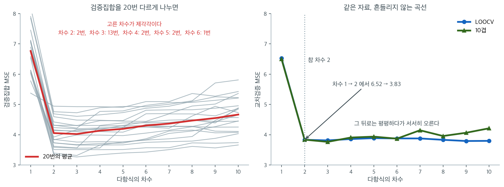

# 교차검증 다항 모형선택

## 개요

이 페이지는 회귀에서 최적 다항 차수를 고르는 세 가지 재표본추출 접근 — 검증집합 방법, 하나 빼기 교차검증(LOOCV), $k$-겹 교차검증 — 을 보인다. 참 관계가 이차인 인공자료를 써서, 검증집합 방법은 변동이 크고, LOOCV는 편향이 작지만 계산 비용이 크며, $k$-겹 교차검증이 실용적인 균형을 준다는 점을 보인다.

---

## 1. 수학적 배경

### 다항회귀

$d$차 다항 모형은

$$
y_i = \beta_0 + \beta_1 x_i + \beta_2 x_i^2 + \cdots + \beta_d x_i^d + \varepsilon_i.
$$

$d$를 키우면 훈련오차는 줄지만 검정오차는 커질 수 있다(과적합). 모형선택의 목표는 기대 검정오차를 최소화하는 $d$를 찾는 것이다.

### 검증집합 방법

자료를 훈련집합과 검증집합으로 나눈다. 각 후보 모형을 훈련자료에 적합하고 검증자료에서 평가한다. 검증집합의 MSE가 검정오차를 추정한다. 단점은 추정값이 무작위 분할에 크게 좌우된다는 점이다.

### 하나 빼기 교차검증(LOOCV)

LOOCV는 관측값 하나씩을 빼는 $n$개의 겹을 쓴다.

$$
\mathrm{CV}_{(n)} = \frac{1}{n}\sum_{i=1}^n (y_i - \hat{y}_i^{(-i)})^2.
$$

선형모형에서는 모자행렬을 이용해 효율적으로 계산할 수 있다.

$$
\mathrm{CV}_{(n)} = \frac{1}{n}\sum_{i=1}^n \left(\frac{e_i}{1 - h_{ii}}\right)^2.
$$

### k-겹 교차검증

자료를 크기가 대략 같은 $K$개의 겹으로 나누고, $K-1$개 겹으로 훈련한 뒤 남겨 둔 겹에서 검정한다.

$$
\mathrm{CV}_{(K)} = \frac{1}{K}\sum_{k=1}^K \mathrm{MSE}_k.
$$

흔한 선택은 $K = 5$나 $K = 10$이다.

### 검증집합 방법

<div class="exbox" markdown>

**보기 1.** <span class="diff easy" title="쉬움"></span> 검증집합을 스무 번 다시 나누기. 같은 자료를 $20$ 번 다르게 나누어 차수 $1$ 부터 $10$ 까지 검증 MSE 를 잰다.

**(1)** 검증집합이 $40$ 개일 때 검증 MSE 가 **얼마나 흔들리는지** 해석적으로 어림하시오. 오차가 정규라고 두어도 된다.

**(2)** $20$ 번의 결과에서 차수 $2$ 의 MSE 가 실제로 얼마나 흩어지는지 재어 (1)과 맞추고, 최적 차수의 빈도를 세시오.

</div>

??? success "풀이"

    **(1) 검증 MSE 는 카이제곱 변량이다.** 모형이 참에 가까우면 검증집합의 잔차는 거의 그 자체의 잡음이므로 $y_i - \hat y_i \approx \varepsilon_i \sim N(0, \sigma^2)$ 이고

    $$
    \mathrm{MSE}_{\text{val}} = \frac{1}{m}\sum_{i=1}^{m} \varepsilon_i^2
    \;\approx\; \frac{\sigma^2}{m}\,\chi^2_m
    $$

    이다. 여기서 $m = 0.2n = 40$ 이다. $\chi^2_m$ 의 평균이 $m$, 분산이 $2m$ 이므로

    $$
    E[\mathrm{MSE}_{\text{val}}] = \sigma^2,
    \qquad
    \operatorname{sd}(\mathrm{MSE}_{\text{val}}) = \sigma^2\sqrt{\frac{2}{m}}
    $$

    곧 **상대표준오차가 $\sqrt{2/m}$** 이다. $m = 40$ 이면

    $$
    \sqrt{\frac{2}{40}} = 0.2236
    $$

    **$22\%$** 다. 참 $\sigma^2 = 4$ 이므로 검증 MSE 가 $4 \pm 0.89$ 쯤으로 흔들린다는 뜻이고, 두 표준편차를 잡으면 $2.2$ 에서 $5.8$ 까지다.

    이것이 보기의 결론을 미리 설명한다. 표의 차수 $2$ 와 차수 $3$ 의 차이가 $0.02$ 쯤인데 측정의 흔들림이 $0.89$ 다. **재려는 차이보다 자가 $40$ 배 거칠다.** 그러니 최적 차수가 분할마다 바뀌는 것이 당연하다.

    눈금을 바꾸려면 $m$ 을 키워야 하지만 그러면 훈련자료가 줄어 모형이 나빠진다. 그 딜레마를 푸는 것이 교차검증이다. **모든 관측값을 한 번씩 검증에 쓰면서도 훈련에는 거의 전부를 쓴다.**

    **(2) 수치적으로.**

    ```python
    import numpy as np
    from sklearn.preprocessing import PolynomialFeatures
    from sklearn.linear_model import LinearRegression

    # 참 모형은 이차식이다. 교차검증이 차수 2 를 골라내는지 보는 것이 목표다.
    np.random.seed(42)
    n = 200
    X = np.random.uniform(1, 10, n)
    y = 5 + 2 * X - 0.3 * X**2 + np.random.normal(0, 2, n)
    X_2d = X.reshape(-1, 1)

    # 검증집합 한 번만 떼어 보면 어떻게 나누느냐에 따라 결과가 들쭉날쭉하다.
    # 그래서 20번 다르게 나눠 보며 그 흔들림을 직접 확인한다.
    degrees = np.arange(1, 11)
    n_validations = 20
    val_mse_multiple = np.zeros((n_validations, len(degrees)))

    for run in range(n_validations):
        val_size = int(0.2 * n)
        indices = np.random.permutation(n)
        train_idx, val_idx = indices[:-val_size], indices[-val_size:]
        for i, degree in enumerate(degrees):
            poly = PolynomialFeatures(degree)
            X_tr = poly.fit_transform(X_2d[train_idx])
            X_va = poly.transform(X_2d[val_idx])
            model = LinearRegression().fit(X_tr, y[train_idx])
            val_mse_multiple[run, i] = np.mean((y[val_idx] - model.predict(X_va)) ** 2)
    ```

    20번의 무작위 분할이 고른 최적 차수는

    ```text
    [5, 6, 3, 3, 2, 3, 8, 6, 2, 2, 9, 9, 2, 8, 9, 2, 3, 3, 3, 5]
    ```


    ```python
    import collections

    best_degrees = degrees[val_mse_multiple.argmin(axis=1)]
    print("20번의 최적 차수:", best_degrees.tolist())
    print("빈도:", dict(sorted(collections.Counter(best_degrees.tolist()).items())))

    col2 = val_mse_multiple[:, 1]          # 차수 2
    print(f"차수 2 의 MSE: 최소 {col2.min():.4f}  최대 {col2.max():.4f}  "
          f"평균 {col2.mean():.4f}  표준편차 {col2.std(ddof=1):.4f}  (최대/최소 = {col2.max() / col2.min():.2f})")
    m = int(0.2 * n)
    print(f"이론: 상대표준오차 sqrt(2/{m}) = {np.sqrt(2 / m):.4f}")
    print(f"관측: 표준편차/평균       = {col2.std(ddof=1) / col2.mean():.4f}")
    ```

    출력:

    ```
    20번의 최적 차수: [5, 6, 3, 3, 2, 3, 8, 6, 2, 2, 9, 9, 2, 8, 9, 2, 3, 3, 3, 5]
    빈도: {2: 5, 3: 6, 5: 2, 6: 2, 8: 2, 9: 3}
    차수 2 의 MSE: 최소 2.5677  최대 5.6572  평균 3.9887  표준편차 0.9364  (최대/최소 = 2.20)
    이론: 상대표준오차 sqrt(2/40) = 0.2236
    관측: 표준편차/평균       = 0.2348
    ```

    **(1)의 어림이 아주 잘 맞는다.** 이론값 $0.2236$ 과 관측값 $0.2348$ 이 $5\%$ 차이다. $20$ 번만 되풀이했으니 이 정도 차이는 당연하다(표준편차 자체의 상대오차가 $1/\sqrt{2 \cdot 19} \approx 16\%$ 다).

    차수 $2$ 의 MSE 가 $2.5677$ 에서 $5.6572$ 까지, 곧 **$2.2$ 배**로 흩어진다. 평균 $3.9887$ 은 참 $\sigma^2 = 4$ 에 거의 정확히 맞는다. **치우침은 없고 분산만 크다**는 것이 검증집합 방법의 성격이다.

    **최적 차수는 여섯 가지가 나왔다.** 차수 $3$ 이 $6$ 번, 차수 $2$ 가 $5$ 번, 차수 $9$ 가 $3$ 번, 차수 $5, 6, 8$ 이 각각 $2$ 번이다. 참값 $2$ 를 맞힌 것이 $20$ 번 중 $5$ 번, **$25\%$** 다. 한 번만 나누어 보고 "이 자료의 최적 차수는 $9$" 라고 적었을 수도 있다는 뜻이다.

    여기서 한 가지를 분명히 해 두자. **$20$ 번 중 $15$ 번이 차수 $3$ 이상을 골랐다.** 검증집합 방법의 흔들림은 위아래로 대칭이 아니라 **큰 차수 쪽으로 기울어 있다.** 높은 차수의 모형이 분할에 따라 아주 잘 맞을 때도 있기 때문이고, 그 운 좋은 한 번이 최솟값을 가져간다. 곧 **후보가 많을 때 가장 작은 값을 고르는 일 자체가 복잡한 모형을 편애한다.** 보기 2, 3 의 교차검증이 이 두 문제를 모두 줄인다.

### LOOCV

<div class="exbox" markdown>

**보기 2.** <span class="diff easy" title="쉬움"></span> 하나빼기 교차검증. `LeaveOneOut` 으로 차수 $1$ 부터 $10$ 까지 LOOCV MSE 를 구한다.

**(1)** LOOCV MSE 가 훈련 MSE 보다 **반드시 크거나 같다**는 것을 쪽머리의 지름길 식에서 보이고, 그 비가 대략 $(1 - p/n)^{-2}$ 임을 유도하시오.

**(2)** 지름길 식과 무차별 재적합을 **열 차수 모두에서** 맞추어 보시오. 어긋나는 차수가 있다면 그 까닭을 설명하시오.

</div>

??? success "풀이"

    **(1) 지름길 식이 답을 바로 준다.** 쪽머리의 식은

    $$
    \mathrm{CV}_{(n)} = \frac{1}{n}\sum_{i=1}^n \left(\frac{e_i}{1 - h_{ii}}\right)^2
    $$

    이다. 모자행렬의 대각원소는 $0 \le h_{ii} \le 1$ 이므로 $0 < 1 - h_{ii} \le 1$ 이고, 따라서 각 항이

    $$
    \left(\frac{e_i}{1 - h_{ii}}\right)^2 \ge e_i^2
    $$

    이다. 더하고 $n$ 으로 나누면

    $$
    \mathrm{CV}_{(n)} \ge \frac{1}{n}\sum_i e_i^2 = \mathrm{MSE}_{\text{train}}
    $$

    **언제나 그렇다.** 등호는 모든 $h_{ii} = 0$ 일 때인데 그런 설계행렬은 없다.

    **비의 크기.** 레버리지의 합이 모수의 개수와 같으므로

    $$
    \sum_i h_{ii} = p = d + 1
      \qquad\Longrightarrow\qquad
      \bar h = \frac{p}{n}
    $$

    이다. 모든 $h_{ii}$ 가 평균 근처라고 보면 각 항이 $e_i^2/(1 - p/n)^2$ 이 되어

    $$
    \mathrm{CV}_{(n)} \;\approx\; \frac{\mathrm{MSE}_{\text{train}}}{\bigl(1 - p/n\bigr)^2}
    $$

    를 얻는다. 이것이 **일반화 교차검증(GCV)** 이라 부르는 어림식이다. $n = 200$, $d = 2$ 면 $p/n = 0.015$ 이므로 보정이 $3\%$ 다. $d = 10$ 이면 $p/n = 0.055$ 로 $11\%$ 가 된다. **차수를 올리면 훈련 MSE 는 줄지만 보정이 커지므로 LOOCV 가 올라갈 수 있다.** 과적합이 이 두 힘의 싸움으로 나타난다.

    **(2) 대수적으로는 언제나 같다.** 연습문제 5 가 셔먼-모리슨 공식으로 증명하는 대로 지름길과 무차별 재적합은 **같은 수**다. 그러므로 어긋난다면 수학이 아니라 **수치** 문제다.

    의심할 곳은 분명하다. 설계행렬이 $1, x, x^2, \ldots, x^{10}$ 인데 $x$ 가 $1$ 에서 $10$ 사이이므로 마지막 열의 값이 $10^{10}$ 까지 간다. 열들이 거의 평행해져 $\mathbf{X}^\top\mathbf{X}$ 의 조건수가 폭발하고, 그 역행렬로 계산한 $h_{ii}$ 가 믿을 수 없게 된다. 특히 $1 - h_{ii}$ 가 $0$ 에 가까울 때 분모의 작은 오차가 크게 증폭된다. 조건수를 함께 찍어 확인한다.

    ```python
    from sklearn.model_selection import cross_val_score, LeaveOneOut

    # 하나빼기 교차검증은 관측값 하나씩을 검증집합으로 쓴다. 어떻게 나누느냐에
    # 따른 흔들림이 없다는 것이 장점이고, n 번 적합해야 해서 느린 것이 단점이다.
    loo = LeaveOneOut()
    loocv_mse = np.zeros(len(degrees))
    for i, degree in enumerate(degrees):
        poly = PolynomialFeatures(degree)
        X_poly = poly.fit_transform(X_2d)
        model = LinearRegression()
        scores = cross_val_score(model, X_poly, y, cv=loo,
                                 scoring='neg_mean_squared_error')
        loocv_mse[i] = -scores.mean()
    ```

    ```python
    train_mse = np.zeros(len(degrees))
    shortcut = np.zeros(len(degrees))
    cond = np.zeros(len(degrees))
    for i, degree in enumerate(degrees):
        X_poly = PolynomialFeatures(degree).fit_transform(X_2d)
        fit = LinearRegression().fit(X_poly, y)
        e = y - fit.predict(X_poly)
        h = np.diag(X_poly @ np.linalg.pinv(X_poly.T @ X_poly) @ X_poly.T)
        shortcut[i] = np.mean((e / (1 - h)) ** 2)
        train_mse[i] = np.mean(e ** 2)
        cond[i] = np.linalg.cond(X_poly)

    print("  d  LOOCV(무차별)   지름길     훈련MSE   훈련/(1-p/n)^2     조건수")
    for i, degree in enumerate(degrees):
        print(f"  {degree:2d}  {loocv_mse[i]:10.4f}  {shortcut[i]:10.4f}  {train_mse[i]:8.4f}  "
              f"{train_mse[i] / (1 - (degree + 1) / n) ** 2:12.4f}   {cond[i]:.2e}")
    print(f"LOOCV >= 훈련 MSE 가 모든 차수에서 성립: {bool(np.all(loocv_mse >= train_mse))}")
    print(f"지름길과 무차별의 최대 차이 = {np.abs(loocv_mse - shortcut).max():.3f}")
    # 반올림한 뒤 비교한다. 차이의 생값은 BLAS 구현에 따라 자리 수가 달라진다.
    same = np.round(loocv_mse, 4) == np.round(shortcut, 4)
    print(f"소수 넷째 자리까지 같은 차수 = {degrees[same].tolist()}")
    print(f"어긋나는 차수             = {degrees[~same].tolist()}")
    print(f"적합 횟수: 무차별 {n * len(degrees)} 번,  지름길 {len(degrees)} 번")
    ```

    출력:

    ```
      d  LOOCV(무차별)   지름길     훈련MSE   훈련/(1-p/n)^2     조건수
       1      6.5243      6.5243    6.3816        6.5111   1.38e+01
       2      3.8318      3.8318    3.7175        3.8316   2.26e+02
       3      3.8123      3.8123    3.6552        3.8059   4.11e+03
       4      3.8574      3.8574    3.6530        3.8427   8.27e+04
       5      3.8870      3.8870    3.6338        3.8620   1.77e+06
       6      3.9246      3.8772    3.6225        3.8900   3.74e+07
       7      3.9769      3.8766    3.6200        3.9279   8.59e+08
       8      4.0359      3.8308    3.6127        3.9611   1.88e+10
       9      4.0686      3.7920    3.5739        3.9600   4.35e+11
      10      4.1443      3.7969    3.5736        4.0017   9.55e+12
    LOOCV >= 훈련 MSE 가 모든 차수에서 성립: True
    지름길과 무차별의 최대 차이 = 0.347
    소수 넷째 자리까지 같은 차수 = [1, 2, 3, 4, 5]
    어긋나는 차수             = [6, 7, 8, 9, 10]
    적합 횟수: 무차별 2000 번,  지름길 10 번
    ```

    **(1)의 두 결론이 맞는다.**

    열 차수 모두에서 LOOCV 가 훈련 MSE 보다 크다. 그리고 GCV 어림식이 놀랄 만큼 잘 맞는다. 차수 $2$ 에서 $3.8316$ 대 $3.8318$ 로 소수 셋째 자리까지 같고, 차수 $3$ 에서 $3.8059$ 대 $3.8123$ 이다.

    유도가 예고한 싸움도 표에 그대로 있다. **훈련 MSE 는 $6.3816$ 에서 $3.5736$ 으로 단조감소**하는데, 보정 $(1 - p/n)^{-2}$ 이 $1.020$ 에서 $1.120$ 으로 커지면서 둘의 곱이 차수 $3$ 에서 바닥을 치고 다시 올라간다. **과적합이라는 말의 산술이 이 두 열이다.**

    **(2) 차수 6 부터 어긋난다.** 차수 $1$ 에서 $5$ 까지는 두 값이 소수 넷째 자리까지 같고, 차수 $6$ 부터 $10$ 까지는 모두 어긋난다. 전체 최대 차이가 $0.347$ 이며, 차수 $6$ 에서 $3.9246$ 대 $3.8772$, 차수 $9$ 에서 $4.0686$ 대 $3.7920$ 으로 갈라진다. (낮은 차수에서 남는 차이의 **생값**은 $10^{-15}$ 에서 $10^{-9}$ 사이로 선형대수 라이브러리에 따라 달라지므로, 반올림한 뒤 견주는 것이 옳다.)

    범인은 마지막 열의 조건수다. 차수 $5$ 에서 $1.77 \times 10^6$ 이던 것이 차수 $6$ 에서 $3.74 \times 10^7$, 차수 $10$ 에서 $9.55 \times 10^{12}$ 가 된다. 배정밀도의 상대정밀도가 $10^{-16}$ 이므로 조건수가 $10^{13}$ 이면 **유효숫자가 세 자리밖에 남지 않는다.** 그 정밀도로 계산한 $h_{ii}$ 로 $1 - h_{ii}$ 를 만들어 나누면 오차가 몇 퍼센트로 커진다.

    어느 쪽이 맞는가. **무차별 재적합 쪽이 더 믿을 만하다.** 지름길은 $(\mathbf{X}^\top\mathbf{X})^{-1}$ 을 한 번 만들어 모든 $h_{ii}$ 를 거기서 끌어내므로 그 한 번의 오차가 전부에 번지는데, 무차별 쪽은 겹마다 따로 최소제곱을 풀고 sklearn 은 정규방정식 대신 QR/SVD 기반의 `lstsq` 를 쓴다. 지름길의 값이 훈련 MSE 쪽으로 **끌려 내려간** 모양($3.7969 < 3.8318$, 차수 $10$ 이 차수 $2$ 보다 낮다)인 것도 오차의 흔적이다. 과적합이 심해지는데 LOOCV 가 내려갈 수는 없다.

    교훈은 둘이다. 첫째, **지름길 식은 대수적으로 정확하지만 수치적으로는 설계행렬의 조건에 달려 있다.** 연습문제 1 이 차수 $2$ 에서 두 값의 일치를 확인하는 것은 조건수가 $226$ 으로 작기 때문이다. 둘째, **원시 거듭제곱 기저를 차수 $5$ 넘게 쓰지 말라.** 직교다항식(`numpy.polynomial.legendre` 나 patsy 의 `poly()`)을 쓰면 조건수가 $10$ 대에 머물고 이 문제가 사라진다.

### k-겹 교차검증

<div class="exbox" markdown>

**보기 3.** <span class="diff easy" title="쉬움"></span> 10겹 교차검증. `KFold(n_splits=10, shuffle=True, random_state=42)` 로 차수마다 교차검증 MSE 를 구한다.

**(1)** 차수마다 적합하는 횟수를 LOOCV 와 견주시오. 10겹의 추정값이 LOOCV 보다 **위로 치우치는** 까닭도 적으시오.

**(2)** 10겹에는 `random_state` 라는 난수가 남아 있다. 씨앗을 $20$ 가지로 바꾸어 최적 차수가 얼마나 흔들리는지 재고, 보기 1 의 검증집합 방법과 견주시오.

</div>

??? success "풀이"

    **(1) 차수마다 10 번이다.** 겹이 $10$ 개이고 겹마다 한 번 적합하므로 $10$ 번이다. LOOCV 는 $n = 200$ 번이므로 **$20$ 배 빠르다.** 차수 열 개를 모두 보려면 $100$ 번 대 $2000$ 번이다.

    **위로 치우치는 까닭.** 겹 하나를 떼어 놓으면 훈련에 쓰는 자료가 $n \times 9/10 = 180$ 개로 줄어든다. LOOCV 는 $199$ 개를 쓴다. 훈련자료가 적으면 추정한 계수가 덜 정확하고 예측오차가 커지므로

    $$
    \mathrm{CV}_{(10)} \;\gtrsim\; \mathrm{CV}_{(n)}
    $$

    가 기대된다. 보기 2 에서 쓴 어림식으로 크기를 가늠할 수 있다. 모수 $p$ 개에 대해 예측오차가 대략 $\sigma^2(1 + p/n_{\text{train}})$ 이므로, 두 방법의 비는

    $$
    \frac{1 + p/180}{1 + p/199}
    $$

    이고 $p = 2$ 에서 $1.0005$, $p = 11$ 에서 $1.003$ 이다. **차이가 $0.3\%$ 아래**라는 뜻이고, 실제 표에서도 두 열이 거의 같다.

    주의할 것은 이 어림이 **평균의 방향**만 말한다는 점이다. 한 번의 10겹 값이 LOOCV 보다 작게 나오는 일은 흔하다. 아래 표에서 차수 $3$ 의 10겹 값 $3.7948$ 이 LOOCV 의 $3.8123$ 보다 작은 것이 그 예다.

    **(2) 씨앗이 남아 있으므로 흔들린다.** LOOCV 는 분할이 유일하게 정해져 흔들림이 없지만, 10겹은 어떤 관측값이 어느 겹에 들어가는지를 난수로 정한다. 그러므로 `random_state` 를 바꾸면 값이 달라지고 최적 차수도 바뀔 수 있다.

    다만 보기 1 보다는 훨씬 안정될 것이다. 검증집합 방법은 $40$ 개로 한 번 재지만, 10겹은 **모든 $200$ 개를 한 번씩 검증에 쓰고 $10$ 개 값을 평균**한다. 보기 1 에서 유도한 상대표준오차 $\sqrt{2/n_{\text{val}}}$ 의 꼴로 어림하면 $\sqrt{2/200} = 0.1$ 이 되어야 하나, 겹들이 같은 훈련자료를 많이 공유하므로 그대로 쓸 수는 없다. 수로 재는 편이 낫다.
    ```python
    from sklearn.model_selection import KFold

    # k겹 교차검증은 그 둘의 절충이다. 10번만 적합하면 되고, 하나빼기보다
    # 추정의 분산이 작다. 그래서 실제로는 이쪽을 가장 많이 쓴다.
    kfold = KFold(n_splits=10, shuffle=True, random_state=42)
    kfold_mse = np.zeros(len(degrees))
    for i, degree in enumerate(degrees):
        poly = PolynomialFeatures(degree)
        X_poly = poly.fit_transform(X_2d)
        model = LinearRegression()
        scores = cross_val_score(model, X_poly, y, cv=kfold,
                                 scoring='neg_mean_squared_error')
        kfold_mse[i] = -scores.mean()
    ```

    ```python
    import collections

    print("10겹:", kfold_mse.round(4).tolist())
    print("LOOCV:", loocv_mse.round(4).tolist())
    print(f"최대 차이 = {np.abs(kfold_mse - loocv_mse).max():.4f} (차수 {degrees[np.abs(kfold_mse - loocv_mse).argmax()]})")

    cnt = collections.Counter(); gap = []; at2 = []
    for rs in range(20):
        kf = KFold(n_splits=10, shuffle=True, random_state=rs)
        col = []
        for d in degrees:
            X_poly = PolynomialFeatures(d).fit_transform(X_2d)
            col.append(-cross_val_score(LinearRegression(), X_poly, y, cv=kf,
                                        scoring='neg_mean_squared_error').mean())
        col = np.array(col)
        cnt[int(degrees[col.argmin()])] += 1
        gap.append(col[1] - col[2]); at2.append(col[1])
    gap = np.array(gap)
    print("random_state 20개에서 최적 차수 빈도:", dict(sorted(cnt.items())))
    print(f"차수2 - 차수3: 평균 {gap.mean():+.4f}  표준편차 {gap.std(ddof=1):.4f},  "
          f"차수 3 이 더 작은 비율 {(gap > 0).mean():.2f}")
    print(f"차수 2 의 10겹 MSE: 평균 {np.mean(at2):.4f}  표준편차 {np.std(at2, ddof=1):.4f}")
    print(f"  (보기 1 의 검증집합 표준편차 {val_mse_multiple[:, 1].std(ddof=1):.4f} 와 견주라)")
    ```

    출력:

    ```
    10겹: [6.4595, 3.8361, 3.7948, 3.8162, 3.8284, 3.8642, 3.9221, 4.0216, 4.0074, 4.0964]
    LOOCV: [6.5243, 3.8318, 3.8123, 3.8574, 3.887, 3.9246, 3.9769, 4.0359, 4.0686, 4.1443]
    최대 차이 = 0.0648 (차수 1)
    random_state 20개에서 최적 차수 빈도: {2: 5, 3: 15}
    차수2 - 차수3: 평균 +0.0147  표준편차 0.0200,  차수 3 이 더 작은 비율 0.75
    차수 2 의 10겹 MSE: 평균 3.8454  표준편차 0.0307
      (보기 1 의 검증집합 표준편차 0.9364 와 견주라)
    ```

    **(1) 두 열의 차이가 $0.0648$ 을 넘지 않는다.** 가장 큰 차이가 차수 $1$ 에서 나는데, 거기서는 10겹이 $6.4595$ 로 LOOCV 의 $6.5243$ 보다 **작다.** 유도한 "10겹이 위로 치우친다" 는 평균의 이야기이고 한 번의 값에는 적용되지 않는다는 것을 그대로 보여 준다. 차수 $4$ 부터는 10겹이 일관되게 작은데, 이 구간에서는 설계행렬의 조건수 문제(보기 2)가 LOOCV 쪽을 더 세게 흔든다.

    어느 쪽이든 **차이가 $1\%$ 안쪽**이고 유도한 $0.3\%$ 와 자리 수가 같다. $n = 200$ 에서는 $180$ 개로 훈련하든 $199$ 개로 훈련하든 거의 같다는 뜻이다. 그런데 계산은 $20$ 배 차이가 난다. 이것이 실무에서 10겹을 쓰는 이유다.

    **(2) 흔들리지만 보기 1 과는 차원이 다르다.**

    - 최적 차수가 $20$ 개 씨앗 가운데 차수 $3$ 에서 $15$ 번, 차수 $2$ 에서 $5$ 번 나왔다. **두 값 사이에서만 흔들린다.** 보기 1 의 검증집합 방법은 $2$ 에서 $9$ 까지 여섯 가지 차수를 골랐다.
    - 차수 $2$ 의 MSE 표준편차가 $0.0307$ 이다. 보기 1 의 $0.9364$ 와 견주면 **$30$ 배 작다.**

    그렇다고 결론이 확정된 것은 아니다. 차수 $2$ 와 $3$ 의 차이가 평균 $+0.0147$, 표준편차 $0.0200$ 이므로 **차이가 흔들림보다 작다.** 그래서 차수 $3$ 이 이기는 비율이 $0.75$ 로 확실하지 않다.

    **참 차수가 $2$ 라는 것을 알고 있으니 답은 분명하다.** 교차검증은 $75\%$ 의 경우에 차수 $3$ 을 가리켜 **틀린 쪽으로 기울었다.** 삼차항이 이 표본의 잡음을 조금 더 맞춰 주기 때문이고, 어떤 재표집 방법도 이 미세한 과적합을 막아 주지 못한다.

    막아 주는 것은 **1 표준오차 규칙**이다. `random_state=42` 인 이 10겹에서 차수 $3$ 의 겹별 MSE 는 표준편차가 $1.0049$ 이므로 평균의 표준오차가 $1.0049/\sqrt{10} = 0.3178$ 이다. 문턱은

    $$
    3.7948 + 0.3178 = 4.1126
    $$

    이고 차수 $2$ 의 $3.8361$ 은 이 안에 들어온다(차수 $1$ 의 $6.4595$ 는 들어오지 않는다). 그러므로 1 표준오차 규칙은 **차수 $2$ 를 고르며 참값을 맞힌다.** 요점은 겹 사이의 흔들림이 비교하려는 차이보다 훨씬 크다는 것이고, 그럴 때는 언제나 단순한 쪽이 낫다.

### 결과

| 차수 | LOOCV MSE | 10-겹 MSE |
|---|---|---|
| 1 | 6.5243 | 6.4595 |
| 2 | 3.8318 | 3.8361 |
| **3** | **3.8123** | **3.7948** |
| 4 | 3.8574 | 3.8162 |
| 5 | 3.8870 | 3.8284 |
| 6 | 3.9246 | 3.8642 |
| 7 | 3.9769 | 3.9221 |
| 8 | 4.0359 | 4.0216 |
| 9 | 4.0686 | 4.0074 |
| 10 | 4.1443 | 4.0964 |

두 방법 모두 형식적으로는 차수 3에서 최솟값을 갖지만, 차수 2와 3의 차이는 0.5%에 지나지 않아 사실상 동률이다. 참 차수가 2인 점을 생각하면 이는 자연스러운 결과이다. 삼차항이 잡음을 조금 더 맞춰 준 것뿐이며, 이런 상황에서는 [1 표준오차 규칙](./cross_validation.md)에 따라 더 단순한 차수 2를 고르는 것이 옳다.

차수 1에서 2로 갈 때 MSE가 $6.52$에서 $3.83$으로 절반 가까이 떨어지는 반면 그 뒤로는 거의 평평하다가 서서히 올라간다는 점이 중요하다. 곡률을 포착하는 것이 결정적이고, 그 이상은 과적합이라는 뜻이다.



세 보기의 결과를 나란히 놓으면 이렇게 된다. 왼쪽은 보기 1이다. 같은 자료를 $20$번 다르게 반으로 나누어 얻은 검증 MSE 곡선을 회색으로 겹쳐 그렸다. 곡선들이 위아래로 크게 벌어진다. 차수 $2$에서만 보아도 MSE가 $3.34$에서 $4.94$까지 흩어져 최솟값과 최댓값이 $1.5$배 차이 난다. 결과적으로 **어떤 차수를 고르느냐도 제각각이다.** $20$번 가운데 차수 $3$을 고른 것이 $13$번, 차수 $2$가 $2$번, 차수 $4$가 $2$번, 차수 $5$가 $2$번, 차수 $6$이 $1$번이었다. 한 번만 나누어 보고 "이 자료의 최적 차수는 $6$"이라고 보고했을 수도 있는 것이다.

오른쪽은 보기 2와 3이다. 같은 자료인데 곡선이 딱 하나씩이고 서로 거의 포개진다. LOOCV는 나누는 방식이 유일하게 정해지므로 애초에 흔들릴 여지가 없고, $10$겹은 $10$개 겹을 평균하므로 분할 운이 대부분 상쇄된다. 두 곡선 모두 차수 $1$의 $6.52$에서 차수 $2$의 $3.83$으로 **절반 가까이 떨어진 뒤 평평해진다.** 곡률을 담는 것이 결정적이고 그 이상은 얻을 것이 없다는 신호다.

다만 오른쪽 곡선의 평평한 구간이 또 다른 함정이다. LOOCV의 최솟값은 형식적으로 차수 $3$($3.8123$)에 있지만 차수 $2$($3.8318$)와의 차이가 $0.5\%$에 지나지 않는다. 이 정도 차이는 자료를 한 번 더 뽑으면 뒤집힌다. **최솟값을 기계적으로 따르는 대신 1 표준오차 규칙으로 더 단순한 차수 $2$를 고르는 것이 옳은 이유**가 여기에 있다. 곡선이 평평하다는 것은 "그 구간 안에서는 어느 것을 골라도 비슷하다"는 뜻이고, 그럴 때는 언제나 단순한 쪽이 낫다.

---

## 2. 해석

- **검증집합**: 빠르지만 불안정하다. 무작위 분할이 달라지면 다른 최적 차수를 고를 수 있어 한 번의 분할로는 신뢰할 수 없다.
- **LOOCV**: 거의 불편이지만(각 훈련집합이 $n-1$개의 관측값을 쓴다) 계산이 비싸고(후보마다 $n$번 적합) $n$개의 훈련집합이 거의 동일하므로 분산이 클 수 있다.
- **10-겹 교차검증**: 실용적인 절충이다. 각 훈련집합이 자료의 $90\%$를 쓰고(편향이 작고) 10개 겹의 평균이 분산을 줄인다.
- 참 관계가 이차($d = 2$)이므로 세 방법 모두 차수 2 또는 그 근처를 고른다. 차수가 높아지면 과적합이 일어나 최솟값 이후 검정오차 곡선이 올라간다.

---

## 연습문제

<div class="drillbox" markdown>

**연습문제 1.** <span class="diff med" title="중간"></span> 모자행렬 지름길로 $n$개 모형을 다시 적합하지 않고 2차 다항회귀의 LOOCV MSE를 계산하라. 무차별 계산 결과와 일치하는지 확인하라.

</div>

??? success "풀이"

    ```python
    poly = PolynomialFeatures(2)
    X_poly = poly.fit_transform(X_2d)
    model = LinearRegression().fit(X_poly, y)
    H = X_poly @ np.linalg.inv(X_poly.T @ X_poly) @ X_poly.T
    e = y - model.predict(X_poly)
    h = np.diag(H)
    loocv_shortcut = np.mean((e / (1 - h)) ** 2)
    print(f"LOOCV (shortcut): {loocv_shortcut:.4f}")
    print(f"LOOCV (brute):    {loocv_mse[1]:.4f}")
    ```

    출력:

    ```
    LOOCV (shortcut): 3.8318
    LOOCV (brute):    3.8318
    ```

    지름길 공식으로 계산한 LOOCV와 $n$번 적합해 얻은 값이 소수점 넷째 자리까지 같다.

    선형모형에서는 관측값을 하나씩 빼고 다시 적합할 필요가 없다. $\text{LOOCV} = \frac{1}{n}\sum \left(\frac{e_i}{1 - h_{ii}}\right)^2$로 **한 번의 적합**에서 얻을 수 있으며, 지렛값 $h_{ii}$가 그 역할을 한다.

    두 값 모두 $3.8318$로 일치한다. 지름길 공식이 선형모형에서 하나 빼기 재적합과 대수적으로 동등하기 때문이다. $\square$

---

<div class="drillbox" markdown>

**연습문제 2.** <span class="diff med" title="중간"></span> $n$을 200에서 1000으로 늘려라. 검증집합 방법의 변동성과 LOOCV·10-겹 사이의 격차는 어떻게 달라지는가?

</div>

??? success "풀이"

    $n = 1000$이면 (1) 훈련집합과 검증집합이 모두 커져 특정 분할에 대한 민감도가 줄어들므로 검증집합 방법이 더 안정된다. (2) 10-겹 교차검증의 편향(자료의 $90\%$만 훈련에 쓰는 데서 오는)이 $n$이 클 때 무시할 만해지므로 LOOCV와의 격차가 좁아진다. 두 방법이 참 검정오차에 대해 비슷한 추정값으로 수렴한다. $\square$

---

<div class="drillbox" markdown>

**연습문제 3.** <span class="diff med" title="중간"></span> (10-겹 교차검증으로 얻은) 검정 MSE와 함께 훈련 MSE를 다항 차수의 함수로 그려라. 그림에 드러나는 편향-분산 절충을 설명하라.

</div>

??? success "풀이"

    ```python
    train_mse = []
    for degree in degrees:
        poly = PolynomialFeatures(degree)
        X_poly = poly.fit_transform(X_2d)
        model = LinearRegression().fit(X_poly, y)
        train_mse.append(np.mean((y - model.predict(X_poly)) ** 2))
    ```

    훈련 MSE는 차수에 따라 단조롭게 감소한다(모수가 많아지면 훈련자료를 언제나 더 잘 맞춘다). 검정 MSE는 처음에 감소했다가(편향 감소) 이후 증가한다(분산 증가). 최적 차수는 검정 MSE가 최소가 되는 지점이다. 이 U자 모양의 검정오차 곡선이 편향-분산 절충의 상징적인 모습이다. $\square$

---

<div class="drillbox" markdown>

**연습문제 4.** <span class="diff med" title="중간"></span> $K$-겹 교차검증에서 $K$의 선택에 편향-분산 절충이 있는 이유를 설명하라. 극단인 $K = 2$와 $K = n$의 경우는 어떠한가?

</div>

??? success "풀이"

    $K$가 작으면(예: $K = 2$) 각 훈련집합이 자료의 $50\%$만 쓰므로 오차 추정값에 위쪽 편향이 생긴다(적은 자료로 훈련한 모형은 성능이 나쁘다). 그러나 $K$개의 추정값이 겹치지 않는 훈련집합에서 나오므로 분산은 작다. $K = n$(LOOCV)이면 각 훈련집합이 $n-1$개의 관측값을 쓰므로 편향이 최소이지만, $n$개의 훈련집합이 거의 완전히 겹쳐 추정값들이 강하게 상관되고 분산이 클 수 있다. $K = 5$나 $K = 10$이 이 양극단의 균형을 잡는다. $\square$

---

<div class="drillbox" markdown>

**연습문제 5.** <span class="diff hard" title="어려움"></span> 계수 1의 갱신에 대한 Sherman-Morrison-Woodbury 공식에서 $\mathrm{CV}_{(n)} = \frac{1}{n}\sum_i \left(\frac{e_i}{1 - h_{ii}}\right)^2$을 유도하라.

</div>

??? success "풀이"

    관측값 $i$를 지우는 것은 $\mathbf{X}^\top\mathbf{X}$의 계수 1 갱신과 같다. Sherman-Morrison 공식에 의해

    $$
    (\mathbf{X}_{(-i)}^\top\mathbf{X}_{(-i)})^{-1} = (\mathbf{X}^\top\mathbf{X} - \mathbf{x}_i\mathbf{x}_i^\top)^{-1} = (\mathbf{X}^\top\mathbf{X})^{-1} + \frac{(\mathbf{X}^\top\mathbf{X})^{-1}\mathbf{x}_i\mathbf{x}_i^\top(\mathbf{X}^\top\mathbf{X})^{-1}}{1 - h_{ii}}.
    $$

    정리하면 관측값 $i$의 하나 빼기 예측오차가 $y_i - \hat{y}_i^{(-i)} = e_i/(1 - h_{ii})$로 간단해지고 공식이 나온다. $\square$

---

## 정리하며

다항 차수 선택으로 **세 재표집 방법의 성격**을 비교했다.

- **참 관계가 이차인 자료를 쓴다.** 정답을 아는 상태에서 각 방법이 그것을 찾아내는지 볼 수 있다.
- **검증집합 방법은 변동이 크다.** 나누기를 바꾸면 고르는 차수가 달라지며, 훈련자료가 줄어 오차가 비관적이다.
- **LOOCV 는 편향이 작지만 분산이 크다.** 훈련집합들이 거의 같아 오차 추정값들이 강하게 상관되기 때문이다.
- **$k$-겹이 균형을 잡는다.** $k=5{-}10$ 에서 편향과 분산이 모두 적당하며, 실무의 기본 선택이다.
- **차수를 올리면 훈련오차는 단조 감소하지만 검증오차는 U 자다.** 과소적합과 과적합 사이의 최저점이 최적 차수이며, **1장의 편향–분산 절충이 그림 하나로 보인다.**

다음 절 **부분집합·단계적 선택 실습**으로 넘어간다.
