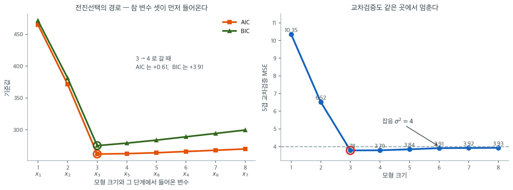

# 모형선택 비교

## 개요

이 페이지는 세 가지 기준 — Akaike 정보기준(AIC), Bayes 정보기준(BIC), 교차검증(CV) — 을 이용한 모형선택을 보인다. 설명변수 8개 중 3개만 실제로 관련 있는 인공자료로 전진 선택을 수행하고, 각 기준이 어떤 모형 크기를 최적으로 판정하는지 비교한다.

## 수학적 배경

### Akaike 정보기준 (AIC)

$$
\mathrm{AIC} = n \ln\!\left(\frac{\mathrm{RSS}}{n}\right) + 2k,
$$

여기서 $k$는 (절편을 포함한) 추정 모수의 개수이다. AIC는 표본 밖 예측오차를 추정하며 모수 하나당 $2$의 벌점으로 복잡도를 억제한다.

### Bayes 정보기준 (BIC)

$$
\mathrm{BIC} = n \ln\!\left(\frac{\mathrm{RSS}}{n}\right) + k \ln(n).
$$

BIC는 모수 하나당 $\ln(n)$의 벌점을 쓰며, $n > e^2 \approx 7.4$이면 이 값이 2를 넘는다. 따라서 표본이 중간 이상이면 BIC가 더 작은 모형을 선호한다.

### 교차검증 MSE

예측오차의 $K$-겹 교차검증 추정값은

$$
\mathrm{CV}(K) = \frac{1}{K}\sum_{k=1}^{K} \mathrm{MSE}_k, \qquad \mathrm{MSE}_k = \frac{1}{|V_k|}\sum_{i \in V_k}(y_i - \hat{y}_i^{(-k)})^2,
$$

여기서 $\hat{y}_i^{(-k)}$는 겹 $k$ 없이 훈련한 모형이 내놓은 관측값 $i$의 예측값이다.

### 정보기준 함수

<div class="exbox" markdown>

**보기 1.** <span class="diff easy" title="쉬움"></span> AIC와 BIC 구현. 쪽머리의 두 식을 함수로 옮긴다.

**(1)** 정규 선형모형의 로그가능도에서 출발해 $\mathrm{AIC} = n\ln(\mathrm{RSS}/n) + 2k$ 를 유도하시오. 버려진 항이 무엇이며 버려도 되는 까닭은 무엇인가.

**(2)** 그 버린 항의 크기를 $n = 200$ 에서 계산하고, statsmodels 의 `aic` 와 이 함수의 값이 그만큼 차이 나는지 확인하시오. 그리고 "$n > 7$ 부터 BIC 의 벌점이 더 무겁다" 는 주석의 근거를 적으시오.

</div>

??? success "풀이"

    **(1) 해석적으로.** 오차가 $\varepsilon_i \sim N(0, \sigma^2)$ 로 독립이면 로그가능도는

    $$
    \log L(\boldsymbol\beta, \sigma^2)
    = -\frac{n}{2}\log(2\pi) - \frac{n}{2}\log \sigma^2 - \frac{1}{2\sigma^2}\sum_i (y_i - \mathbf{x}_i^\top\boldsymbol\beta)^2
    $$

    이다. $\sigma^2$ 의 최대가능도추정값은 $\hat\sigma^2 = \mathrm{RSS}/n$ 이므로 그것을 넣으면 마지막 항이 $-n/2$ 로 떨어지고

    $$
    \log \hat L = -\frac{n}{2}\log(2\pi) - \frac{n}{2}\log\frac{\mathrm{RSS}}{n} - \frac{n}{2}
    $$

    이 된다. 따라서

    $$
    -2\log \hat L = n\log\frac{\mathrm{RSS}}{n} + \underbrace{n\bigl(1 + \log 2\pi\bigr)}_{\text{모형과 무관}}
    $$

    이고, 여기에 벌점 $2k$ 를 더한 것이 AIC 다. 구현한 함수는 **둘째 항을 버렸다.**

    버려도 되는 까닭은 그것이 **$n$ 에만 의존하고 모형에는 의존하지 않는다**는 것이다. AIC 로 하는 일은 같은 자료 위의 여러 모형을 견주는 것이므로 모든 후보에 같은 상수가 더해지면 **순서가 바뀌지 않고 차이도 바뀌지 않는다.** 바뀌는 것은 AIC 의 절대값뿐이다.

    그러므로 **다른 소프트웨어가 찍은 AIC 와 이 함수의 값을 섞어 쓰면 안 된다.** 같은 규약 안에서 비교해야 한다.

    **(2) 상수의 크기와 벌점의 비.** $n = 200$ 이면

    $$
    n(1 + \log 2\pi) = 200 \times (1 + 1.837877) = 567.5754
    $$

    이다. statsmodels 의 `aic` 에서 이 함수의 값을 빼면 정확히 이 수가 나와야 한다. BIC 도 같은 상수를 공유하므로 차이가 같아야 한다.

    벌점의 비교는 간단하다. $k$ 를 하나 늘릴 때 AIC 는 $2$, BIC 는 $\log n$ 만큼 커지므로

    $$
    \log n > 2 \iff n > e^2 = 7.3891
    $$

    이다. $n = 200$ 이면 $\log 200 = 5.2983$ 이므로 BIC 의 벌점이 AIC 의 **$2.65$ 배**다.

    ```python
    import numpy as np

    def aic(n, rss, k):
        """AIC. 모수 하나당 벌점이 2 다."""
        return n * np.log(rss / n) + 2 * k

    def bic(n, rss, k):
        """BIC. 벌점이 log(n) 이라 n>7 부터 AIC 보다 무겁다.

        그래서 BIC 는 대개 더 작은 모형을 고른다. AIC 는 예측을 잘하는 모형을,
        BIC 는 참 모형을 찾는 것을 겨냥한다고 흔히 말한다.
        """
        return n * np.log(rss / n) + k * np.log(n)
    ```

    ```python
    import statsmodels.api as sm

    rng = np.random.RandomState(0)          # 전역 난수 상태를 건드리지 않는다
    n_demo = 200
    X_demo = np.column_stack([np.ones(n_demo), rng.randn(n_demo, 3)])
    y_demo = X_demo @ np.array([1.0, 2.0, -1.0, 0.5]) + rng.randn(n_demo)
    res = sm.OLS(y_demo, X_demo).fit()
    rss_demo = (res.resid ** 2).sum()
    k_demo = X_demo.shape[1]

    print(f"쪽의 aic()      = {aic(n_demo, rss_demo, k_demo):.4f}")
    print(f"statsmodels aic = {res.aic:.4f}")
    print(f"차이            = {res.aic - aic(n_demo, rss_demo, k_demo):.4f}")
    print(f"n(1 + ln 2pi)   = {n_demo * (1 + np.log(2 * np.pi)):.4f}")
    print(f"bic 쪽의 차이   = {res.bic - bic(n_demo, rss_demo, k_demo):.4f}")
    print(f"ln n = {np.log(n_demo):.4f},  2 와의 비 = {np.log(n_demo) / 2:.4f},  e^2 = {np.e ** 2:.4f}")
    ```

    출력:

    ```
    쪽의 aic()      = -8.9125
    statsmodels aic = 558.6629
    차이            = 567.5754
    n(1 + ln 2pi)   = 567.5754
    bic 쪽의 차이   = 567.5754
    ln n = 5.2983,  2 와의 비 = 2.6492,  e^2 = 7.3891
    ```

    **유도한 상수가 정확히 나왔다.** 차이가 $567.5754$ 이고 $n(1 + \log 2\pi) = 567.5754$ 다. BIC 쪽의 차이도 같은 $567.5754$ 다. 유도대로 두 기준이 같은 상수를 공유한다.

    눈에 띄는 것은 이 함수가 **음수**를 준다는 점이다($-8.9125$). 잡음의 표준편차를 $1$ 로 두었으므로 $\mathrm{RSS}/n \approx 1$ 이고 $n\log(\mathrm{RSS}/n) \approx 0$ 이어서 벌점 $2k = 8$ 만 남을 것 같은데, 실제로는 $\mathrm{RSS}/n$ 이 $1$ 보다 조금 작아 첫 항이 $-17$ 쯤 된다. **AIC 의 부호에는 뜻이 없다.** 비교만 뜻을 가진다.

    벌점의 비도 유도한 대로다. $\log 200 / 2 = 2.6492$ 이고 $e^2 = 7.3891$ 이다. 그러므로 관측값이 여덟 개만 넘으면 BIC 가 더 엄격한 기준이며, 이 쪽의 $n = 200$ 에서는 모수 하나를 더하는 값이 AIC 에서 $2$, BIC 에서 $5.30$ 이다. 그 차이가 보기 3 의 표에서 눈으로 보인다.

### 교차검증 MSE

<div class="exbox" markdown>

**보기 2.** <span class="diff easy" title="쉬움"></span> 교차검증 구현. 섞은 색인을 토막으로 끊어 $K$ 겹 교차검증 MSE 를 계산한다.

**(1)** `fold_size = n // folds` 때문에 **검증에 한 번도 쓰이지 않는** 관측값이 생길 수 있다. $n = 200$ 일 때 `folds` 값마다 몇 개인지 세시오.

**(2)** 이 함수는 씨앗을 받지 않는다. 같은 입력으로 되풀이해 불러 값의 흩어짐을 재고, 아래 결과표에서 크기 $3$ 과 크기 $4$ 의 CV 차이 $0.029$ 와 견주시오. 그 차이로 모형을 고를 수 있는가.

</div>

??? success "풀이"

    **(1) 나머지가 버려진다.** `fold_size = n // folds` 는 **내림** 나눗셈이므로 겹 하나의 크기가 $\lfloor n/K \rfloor$ 다. 검증에 쓰이는 관측값은 모두

    $$
    K \cdot \left\lfloor \frac{n}{K} \right\rfloor = n - (n \bmod K)
    $$

    개이고, 따라서 **$n \bmod K$ 개가 어느 겹에도 들어가지 않는다.** 섞은 색인의 뒤쪽 꼬리에 남아 매번 훈련에만 쓰인다.

    $n = 200$ 이면 $K = 5$ 나 $K = 10$ 처럼 $200$ 을 나누는 수에서는 나머지가 $0$ 이라 문제가 없다. $K = 7$ 이면 $200 = 7 \times 28 + 4$ 이므로 $4$ 개가 버려지고, $K = 30$ 이면 $200 = 30 \times 6 + 20$ 이므로 **$20$ 개, 곧 $10\%$** 가 버려진다. 겹을 많이 쪼갤수록 나빠진다.

    제대로 하려면 `np.array_split` 처럼 크기가 하나씩 다른 토막으로 나누어야 한다. sklearn 의 `KFold` 가 그렇게 한다.

    **(2) 씨앗이 없으면 값이 매번 달라진다.** `np.random.shuffle` 은 전역 난수 상태를 쓰므로, 같은 `X`, `y` 로 두 번 불러도 다른 분할이 되고 다른 수가 나온다. 재현되지 않는다는 것이 첫째 문제이고, **그 흔들림이 비교하려는 차이보다 크면 비교 자체가 무의미해진다**는 것이 둘째 문제다.

    결과표에서 크기 $3$ 의 CV 가 $3.7603$, 크기 $4$ 가 $3.7891$ 로 차이가 $0.0288$ 이다. 한 번 부른 값의 표준편차가 그보다 크면 순위가 분할마다 뒤집힐 것이다. 재 본다.

    ```python
    def cv_mse(X, y, folds=5):
        """k겹 교차검증으로 예측오차를 추정한다.

        AIC·BIC 가 공식으로 벌점을 매긴다면, 교차검증은 실제로 떼어 놓은
        자료에서 재 본다. 가정이 적은 대신 계산이 많이 든다.
        """
        n = len(y)
        indices = np.arange(n)
        np.random.shuffle(indices)
        fold_size = n // folds
        mses = []
        for k in range(folds):
            val_idx = indices[k * fold_size:(k + 1) * fold_size]
            train_idx = np.setdiff1d(indices, val_idx)
            X_tr, y_tr = X[train_idx], y[train_idx]
            X_va, y_va = X[val_idx], y[val_idx]
            beta = np.linalg.lstsq(X_tr, y_tr, rcond=None)[0]
            pred = X_va @ beta
            mses.append(np.mean((y_va - pred) ** 2))
        return np.mean(mses)
    ```

    ```python
    n_demo = 200
    for f in [5, 6, 7, 9, 30]:
        used = f * (n_demo // f)
        print(f"  folds={f:2d}: fold_size={n_demo // f:3d},  검증에 쓰이는 관측값 {used}개,  한 번도 안 쓰이는 것 {n_demo - used}개")

    # 아래 보기 3 과 같은 자료를 RandomState 로 만든다(전역 상태를 건드리지 않는다).
    rng2 = np.random.RandomState(42)
    p_demo = 8
    Xd = rng2.randn(n_demo, p_demo)
    yd = Xd @ np.array([3.0, -2.0, 1.5, 0, 0, 0, 0, 0]) + rng2.randn(n_demo) * 2
    order = [0, 1, 2, 4, 7, 3, 5, 6]          # 보기 3 이 고르게 되는 순서
    designs = [np.column_stack([np.ones(n_demo), Xd[:, order[:s]]]) for s in range(1, 9)]

    np.random.seed(0)
    col3 = np.array([cv_mse(designs[2], yd) for _ in range(20)])
    print(f"크기 3 모형에 cv_mse 를 20번: 평균 {col3.mean():.4f}  표준편차 {col3.std(ddof=1):.4f}  "
          f"최소 {col3.min():.4f}  최대 {col3.max():.4f}")

    # 여덟 크기의 CV 열을 500 번 다시 만들어, 최솟값이 어디에 떨어지는지 센다.
    import collections
    np.random.seed(0)
    cnt = collections.Counter(); diff = []
    for _ in range(500):
        col = [cv_mse(D, yd) for D in designs]
        cnt[int(np.argmin(col)) + 1] += 1
        diff.append(col[2] - col[3])
    diff = np.array(diff)
    print("최솟값이 나온 모형 크기의 빈도(500회):", dict(sorted(cnt.items())))
    print(f"크기3 - 크기4: 평균 {diff.mean():+.4f}  표준편차 {diff.std(ddof=1):.4f}  "
          f"(평균의 몬테카를로 오차 {diff.std(ddof=1) / np.sqrt(500):.4f})")
    print(f"크기 3 이 크기 4 보다 작게 나온 비율 = {(diff < 0).mean():.3f}")
    ```

    출력:

    ```
      folds= 5: fold_size= 40,  검증에 쓰이는 관측값 200개,  한 번도 안 쓰이는 것 0개
      folds= 6: fold_size= 33,  검증에 쓰이는 관측값 198개,  한 번도 안 쓰이는 것 2개
      folds= 7: fold_size= 28,  검증에 쓰이는 관측값 196개,  한 번도 안 쓰이는 것 4개
      folds= 9: fold_size= 22,  검증에 쓰이는 관측값 198개,  한 번도 안 쓰이는 것 2개
      folds=30: fold_size=  6,  검증에 쓰이는 관측값 180개,  한 번도 안 쓰이는 것 20개
    크기 3 모형에 cv_mse 를 20번: 평균 3.7151  표준편차 0.0527  최소 3.6409  최대 3.8332
    최솟값이 나온 모형 크기의 빈도(500회): {3: 217, 4: 154, 5: 85, 6: 35, 7: 7, 8: 2}
    크기3 - 크기4: 평균 -0.0164  표준편차 0.0771  (평균의 몬테카를로 오차 0.0034)
    크기 3 이 크기 4 보다 작게 나온 비율 = 0.570
    ```

    **(1)의 셈이 맞는다.** $200 \bmod K$ 가 그대로 "안 쓰이는 것" 의 개수다. $K = 5$ 는 $0$, $K = 7$ 은 $4$, $K = 30$ 은 $20$ 이다.

    **(2) 그 차이로는 모형을 고를 수 없다.**

    크기 $3$ 모형에 같은 함수를 $20$ 번 불렀더니 값이 $3.6409$ 에서 $3.8332$ 까지 흔들렸고 표준편차가 $0.0527$ 이다. 그런데 표에서 크기 $3$ 과 크기 $4$ 의 차이는 $0.0288$ 로 **그 표준편차의 절반**이다. 곧 표에 적힌 $3.7603$ 과 $3.7891$ 이라는 두 수는 소수 넷째 자리까지 적혀 있지만, 실은 둘째 자리부터 분할에 따라 달라지는 수다.

    $500$ 번 다시 재어 보면 결론이 분명해진다. **CV 의 최솟값이 크기 $3$ 에 떨어지는 것은 $500$ 번 가운데 $217$ 번, $43\%$ 뿐이다.** 크기 $4$ 가 $154$ 번($31\%$), 크기 $5$ 가 $85$ 번($17\%$)이고, 심지어 크기 $8$ 이 뽑힌 적도 두 번 있다. 크기 $3$ 이 크기 $4$ 보다 작게 나온 비율도 $0.570$ 으로 동전 던지기에 가깝다.

    평균으로 보면 크기 $3$ 이 크기 $4$ 보다 $0.0164$ 작고, 그 평균의 몬테카를로 오차가 $0.0034$ 이니 **평균 차이 자체는 실재한다**($0.0164 / 0.0034 \approx 4.8$ 배). 다만 그것을 보려면 분할을 수백 번 되풀이해야 한다. 한 번 부른 값으로는 알 수 없다.

    그러므로 쪽 아래 결과표의 CV 열은 **AIC·BIC 열과 성격이 다르다.** AIC 와 BIC 는 자료가 정해지면 유일하게 정해지는 수이고, CV 는 분할이라는 또 하나의 난수에 매달린 수다. 표의 세 열이 모두 크기 $3$ 에서 최소라는 사실 가운데 앞의 둘은 재현되고 **셋째는 운이었다.**

    고치는 길은 세 가지다. 씨앗을 인자로 받게 하는 것, 반복 교차검증(`RepeatedKFold`)으로 여러 분할을 평균하는 것, 그리고 CV 값과 함께 **분할에 따른 흔들림을 함께 보고하는 것**이다. 쪽 끝의 "겹 나누기에 따라 결과가 달라지므로 여러 번 반복해 평균을 보는 것이 좋다" 가 바로 이 이야기다.

### 전진 선택

<div class="exbox" markdown>

**보기 3.** <span class="diff easy" title="쉬움"></span> 전진선택으로 변수 고르기. 설명변수 여덟 개 가운데 앞의 셋만 계수가 $0$ 이 아닌 자료에서 AIC 를 낮추는 변수를 하나씩 더해 간다.

**(1)** 모형에 변수를 하나 더할 때 AIC 와 BIC 가 **얼마나** 바뀌는지 $\mathrm{RSS}$ 로 적으시오. 크기 $3 \to 4$ 에서 그 식이 표의 차이 $0.61$ 과 $3.91$ 을 주는지 확인하시오.

**(2)** 쓸모없는 변수를 하나 더할 때 AIC 가 그것을 **받아들일 확률**을 어림하고, BIC 의 경우와 견주시오. "AIC 가 조금 큰 모형을 고르는 경향" 을 수로 적는 셈이다.

</div>

??? success "풀이"

    **(1) 한 걸음의 차이.** 변수를 하나 더하면 모수가 $k$ 에서 $k+1$ 로 늘고 $\mathrm{RSS}$ 가 $\mathrm{RSS}_k$ 에서 $\mathrm{RSS}_{k+1}$ 로 줄어든다. 쪽머리의 식에서

    $$
    \Delta \mathrm{AIC}
    = n\log\frac{\mathrm{RSS}_{k+1}}{n} + 2(k+1)
      - n\log\frac{\mathrm{RSS}_{k}}{n} - 2k
    = n\log\frac{\mathrm{RSS}_{k+1}}{\mathrm{RSS}_{k}} + 2
    $$

    이고 BIC 는 마지막 $2$ 가 $\log n$ 으로 바뀐다.

    $$
    \Delta \mathrm{BIC} = n\log\frac{\mathrm{RSS}_{k+1}}{\mathrm{RSS}_{k}} + \log n
    $$

    **앞의 항은 두 기준에서 똑같다.** 그러므로 두 $\Delta$ 의 차이는 언제나 $\log n - 2$ 로 **상수**이고, $n = 200$ 에서 $3.2983$ 이다. 표의 차이 $3.91 - 0.61 = 3.30$ 이 그것이어야 한다.

    변수를 받아들이는 조건은 $\Delta < 0$ 이므로

    $$
    n\log\frac{\mathrm{RSS}_{k}}{\mathrm{RSS}_{k+1}} > 2 \quad (\text{AIC}),
    \qquad
    n\log\frac{\mathrm{RSS}_{k}}{\mathrm{RSS}_{k+1}} > \log n \quad (\text{BIC})
    $$

    다. 왼쪽의 양을 **적합이 좋아진 몫**이라 부르자.

    **(2) 그 몫의 분포.** 변수가 쓸모없으면($\beta = 0$) 그 변수를 더해 줄어드는 $\mathrm{RSS}$ 는 자유도 $1$ 의 카이제곱 몫이다. 정확히는 부분 $F$ 통계량이

    $$
    F = \frac{\mathrm{RSS}_k - \mathrm{RSS}_{k+1}}{\mathrm{RSS}_{k+1}/(n-k-1)} \sim F_{1,\,n-k-1}
    $$

    이고 $n$ 이 크면 $F \approx \chi^2_1$ 이다. 한편 $\log(1+x) \approx x$ 를 쓰면

    $$
    n\log\frac{\mathrm{RSS}_{k}}{\mathrm{RSS}_{k+1}}
    = n\log\!\left(1 + \frac{\mathrm{RSS}_k - \mathrm{RSS}_{k+1}}{\mathrm{RSS}_{k+1}}\right)
    \approx n \cdot \frac{\mathrm{RSS}_k - \mathrm{RSS}_{k+1}}{\mathrm{RSS}_{k+1}}
    \approx F
    $$

    이다(마지막에서 $n/(n-k-1) \approx 1$ 을 썼다). 그러므로 **적합이 좋아진 몫은 대략 $\chi^2_1$ 변량**이고, 쓸모없는 변수를 받아들일 확률은

    $$
    P(\chi^2_1 > 2) \quad (\text{AIC}),
    \qquad
    P(\chi^2_1 > \log n) \quad (\text{BIC})
    $$

    다. $n = 200$ 에서 두 값을 계산해 보면 된다. 중요한 것은 **AIC 쪽은 $n$ 과 무관한 상수**이고 BIC 쪽은 $n \to \infty$ 에서 $0$ 으로 간다는 점이다. 연습문제 5 가 말하는 일치성이 이 한 줄이다.

    ```python
    # 여덟 변수 중 앞의 셋만 실제로 쓰이고 나머지 다섯은 계수가 0 이다.
    # 전진선택이 그 셋을 먼저 집어내는지 보는 것이 이 실험의 목적이다.
    np.random.seed(42)
    n, p_total = 200, 8
    X_raw = np.random.randn(n, p_total)
    beta_true = np.array([3.0, -2.0, 1.5, 0, 0, 0, 0, 0])
    y = X_raw @ beta_true + np.random.randn(n) * 2

    remaining = list(range(p_total))
    selected = []
    aic_history, bic_history = [], []

    # 전진선택: 매 단계에서 AIC 를 가장 많이 낮추는 변수를 하나씩 더한다.
    # 모든 부분집합을 따지면 2^8 개지만, 이렇게 하면 훨씬 적게 본다.
    # 대신 최적 부분집합을 놓칠 수 있다.
    for step in range(p_total):
        best_score, best_j = np.inf, None
        for j in remaining:
            cols = selected + [j]
            X_cand = np.column_stack([np.ones(n), X_raw[:, cols]])
            beta = np.linalg.lstsq(X_cand, y, rcond=None)[0]
            rss = np.sum((y - X_cand @ beta) ** 2)
            score = aic(n, rss, len(cols) + 1)
            if score < best_score:
                best_score, best_j = score, j
        selected.append(best_j)
        remaining.remove(best_j)

        X_sel = np.column_stack([np.ones(n), X_raw[:, selected]])
        beta = np.linalg.lstsq(X_sel, y, rcond=None)[0]
        rss = np.sum((y - X_sel @ beta) ** 2)
        k = len(selected) + 1
        aic_history.append(aic(n, rss, k))
        bic_history.append(bic(n, rss, k))
    ```

    ```python
    from scipy import stats

    def rss_of(s):
        Xs = np.column_stack([np.ones(n), X_raw[:, selected[:s]]])
        return np.sum((y - Xs @ np.linalg.lstsq(Xs, y, rcond=None)[0]) ** 2)

    print("선택 순서:", selected)
    print("크기   RSS        AIC       BIC")
    for s in range(1, p_total + 1):
        print(f" {s}   {rss_of(s):9.4f}  {aic_history[s - 1]:8.2f}  {bic_history[s - 1]:8.2f}")

    rss3, rss4 = rss_of(3), rss_of(4)
    print(f"n ln(RSS4/RSS3) = {n * np.log(rss4 / rss3):.4f}")
    print(f"AIC 차 = 그것 + 2    = {n * np.log(rss4 / rss3) + 2:.4f}   (표의 차 {aic_history[3] - aic_history[2]:.4f})")
    print(f"BIC 차 = 그것 + ln n = {n * np.log(rss4 / rss3) + np.log(n):.4f}   (표의 차 {bic_history[3] - bic_history[2]:.4f})")
    print(f"네 번째 변수의 부분 F = {(rss3 - rss4) / (rss4 / (n - 5)):.4f}")
    print(f"P(chi2_1 > 2) = {stats.chi2.sf(2, 1):.4f},  P(chi2_1 > ln 200) = {stats.chi2.sf(np.log(n), 1):.4f}")
    print(f"RSS3/n = {rss3 / n:.4f},  RSS3/(n-4) = {rss3 / (n - 4):.4f}  (참 sigma^2 = 4)")
    ```

    출력:

    ```
    선택 순서: [0, 1, 2, 4, 7, 3, 5, 6]
    크기   RSS        AIC       BIC
     1   2002.7003    464.79    471.38
     2   1243.9264    371.54    381.44
     3    712.3828    262.06    275.25
     4    707.4385    262.67    279.16
     5    705.3433    264.07    283.86
     6    705.1412    266.02    289.10
     7    705.0570    267.99    294.38
     8    705.0384    269.99    299.67
    n ln(RSS4/RSS3) = -1.3929
    AIC 차 = 그것 + 2    = 0.6071   (표의 차 0.6071)
    BIC 차 = 그것 + ln n = 3.9054   (표의 차 3.9054)
    네 번째 변수의 부분 F = 1.3628
    P(chi2_1 > 2) = 0.1573,  P(chi2_1 > ln 200) = 0.0213
    RSS3/n = 3.5619,  RSS3/(n-4) = 3.6346  (참 sigma^2 = 4)
    ```

    **(1) 한 걸음의 식이 정확히 맞는다.** $n\log(\mathrm{RSS}_4/\mathrm{RSS}_3) = -1.3929$ 이고, 거기에 $2$ 를 더한 $0.6071$ 이 AIC 표의 차이와 소수 넷째 자리까지 같다. $\log 200 = 5.2983$ 을 더한 $3.9054$ 도 BIC 표의 차이와 같다. 두 차이의 간격 $3.9054 - 0.6071 = 3.2983$ 이 유도한 $\log n - 2$ 다.

    선택 순서 `[0, 1, 2, 4, 7, 3, 5, 6]` 도 재현되었다. **참으로 관련 있는 $0, 1, 2$ 가 정확히 앞자리 셋을 차지했다.** 뒤의 다섯은 모두 계수가 $0$ 이므로 순서에 뜻이 없다.

    **(2) AIC 는 쓸모없는 변수를 $16\%$ 확률로 받아들인다.** $P(\chi^2_1 > 2) = 0.1573$ 이다. BIC 는 $P(\chi^2_1 > \log 200) = 0.0213$ 으로 **$2\%$** 다. 일곱 배 차이다.

    이 쪽의 네 번째 변수가 바로 그 경계에 있다. 부분 $F = 1.3628$ 로 문턱 $2$ 에 못 미쳐 AIC 가 거부했지만, **$2$ 를 넘을 확률이 $16\%$ 였으니 다른 표본에서는 받아들여졌을 것이다.** 쪽 본문이 "네 번째 설명변수가 우연히 조금만 더 큰 적합 개선을 냈다면 AIC 는 그것을 골랐을 수 있다" 고 적은 것의 정확한 크기가 $0.1573$ 이다.

    쓸모없는 변수가 다섯 개이므로, 그 가운데 **적어도 하나**를 AIC 가 받아들일 확률은 어림으로 $1 - 0.8427^5 = 0.575$ 다. 절반이 넘는다(전진선택이라 독립이 아니므로 어림값이다). BIC 는 $1 - 0.9787^5 = 0.102$ 다. **AIC 로 변수를 고르면 잡음 변수 한두 개가 섞여 들어오는 것이 정상**이라는 뜻이고, 그것이 "예측을 겨냥해 약간의 과대적합을 감수한다" 는 말의 실체다.

    마지막으로 바닥을 확인하자. 크기 $3$ 모형의 $\mathrm{RSS}/n = 3.5619$, 불편추정값 $\mathrm{RSS}/(n-4) = 3.6346$ 이다. 참 $\sigma^2 = 4$ 보다 조금 작다. 이 표본에서 실현된 잡음이 참값보다 작았기 때문이며, 어떤 모형도 $\sigma^2$ 아래로 내려갈 수 없다는 사실과 어긋나지 않는다. 크기 $4$ 부터 $8$ 까지 $\mathrm{RSS}$ 가 $707.44 \to 705.04$ 로 $0.3\%$ 밖에 줄지 않는 것도 같은 이야기다. **이미 바닥에 닿았으므로 더 보탤 것이 없다.**


### 결과

선택 순서(0부터 시작하는 색인)는 `[0, 1, 2, 4, 7, 3, 5, 6]`으로, 참으로 관련 있는 세 설명변수 0, 1, 2가 정확히 먼저 뽑혔다.

| 모형 크기 | AIC | BIC | 5-겹 CV MSE |
|---|---|---|---|
| 1 | 464.79 | 471.38 | 10.1104 |
| 2 | 371.54 | 381.44 | 6.3024 |
| **3** | **262.06** | **275.25** | **3.7603** |
| 4 | 262.67 | 279.16 | 3.7891 |
| 5 | 264.07 | 283.86 | 3.8011 |
| 6 | 266.02 | 289.10 | 3.8225 |
| 7 | 267.99 | 294.38 | 3.8682 |
| 8 | 269.99 | 299.67 | 3.8933 |

세 기준 모두 크기 3에서 최솟값을 갖는다. 잡음 설명변수 다섯 개가 올바르게 배제되었다.

크기 3과 크기 4의 AIC 차이가 $0.61$에 지나지 않는다는 점에 주목하라. AIC 벌점이 상대적으로 약하기 때문에, 네 번째 설명변수가 우연히 조금만 더 큰 적합 개선을 냈다면 AIC는 그것을 골랐을 수 있다. 반면 BIC 차이는 $3.91$로 훨씬 뚜렷하다. AIC보다 BIC가 절약적인 모형을 더 확실하게 선호한다는 사실을 그대로 보여준다.



위 표를 그림으로 옮겼다. 왼쪽 가로축은 모형의 크기이고, 그 아래에 그 단계에서 새로 들어온 변수를 적었다. 순서가 $x_1, x_2, x_3$으로 시작한다는 것이 이 실험의 첫 결과다. 참으로 관련 있는 셋이 **잡음 다섯 개보다 먼저, 그것도 정확히 앞자리에** 들어왔다. 네 번째 자리부터는 $x_5, x_8, x_4, \ldots$로 순서가 뒤죽박죽인데, 계수가 모두 $0$인 변수들 사이에서는 순서에 의미가 없으니 당연한 일이다.

두 기준선 모두 크기 $3$을 지나면서 바닥을 치고 올라간다. 여기서 눈여겨볼 것은 **올라가는 속도**다. 크기 $3$에서 $4$로 갈 때 AIC는 $262.06$에서 $262.67$로 $+0.61$만 오르는 반면 BIC는 $275.25$에서 $279.16$으로 $+3.91$ 오른다. AIC의 곡선이 바닥 근처에서 훨씬 평평하다는 뜻이고, 이는 네 번째 변수가 우연히 조금만 더 잘 맞았다면 AIC가 그것을 데려갔으리라는 뜻이다. 앞 절에서 본 "AIC가 조금 큰 모형을 고르는 경향"이 이 평평함이다.

오른쪽은 $5$겹 교차검증 MSE다. 점근이론도 가능도도 쓰지 않고 표본 밖 오차를 직접 재는 방법인데, 결론은 같다. 크기 $3$에서 $3.78$로 최소이고 그 뒤로는 $3.79,\ 3.84,\ 3.91, \ldots$로 서서히 오른다. 그리고 그 최솟값이 잡음의 분산 $\sigma^2 = 4$ 바로 아래에 붙어 있다는 점이 결정적이다. **$4$가 어떤 모형도 넘어설 수 없는 바닥**이고, 크기 $3$ 모형이 이미 거기에 닿았으므로 더 보탤 것이 없다. 서로 전혀 다른 출발점에서 온 세 기준이 같은 자리를 가리킨다는 사실이 이 선택에 대한 가장 강한 근거다.

## 해석

- **AIC**는 벌점($2k$)이 비교적 약해 조금 더 큰 모형을 고르는 경향이 있다. 예측 정확도를 겨냥한다.
- **BIC**는 $k \ln(n)$이 표본크기와 함께 커지므로 더 작은 모형을 고르는 경향이 있다. 일치성을 가져 (참 모형이 후보에 있다면) $n \to \infty$일 때 참 모형을 고른다.
- **교차검증**은 점근이론에 기대지 않고 표본 밖 예측오차를 직접 추정한다. 계산 비용이 크지만 분포 가정을 덜 요구한다.
- 이 예에서는 참으로 관련 있는 설명변수가 3개이며, 세 방법 모두 크기 3의 모형을 찾아내어 잡음 설명변수가 올바르게 배제됨을 확인해 준다.

## 연습문제

<div class="drillbox" markdown>

**연습문제 1.** <span class="diff med" title="중간"></span> 각 단계에서 다음 설명변수를 정할 때 AIC 대신 BIC를 써서 전진 선택 절차를 수행하라. 선택되는 설명변수의 순서가 달라지는가?

</div>

??? success "풀이"

    안쪽 반복문의 `score = aic(n, rss, len(cols) + 1)`을 `score = bic(n, rss, len(cols) + 1)`로 바꾼다.

    선택 **순서는 바뀌지 않는다**. 한 단계 안에서 후보들은 모두 같은 $k$를 가지므로 AIC든 BIC든 벌점항이 상수이고, 결국 RSS를 가장 크게 줄이는 변수를 고르게 되어 두 기준이 동일한 선택을 한다. 달라지는 것은 **멈추는 지점**이다. BIC는 벌점이 더 강해 더 적은 설명변수에서 멈춘다. 위 표에서도 크기 4 이후 BIC의 증가폭이 AIC보다 훨씬 가파르다. $\square$

<div class="drillbox" markdown>

**연습문제 2.** <span class="diff med" title="중간"></span> 잡음 수준을 $\sigma = 2$에서 $\sigma = 5$로 키워라. 각 기준이 고르는 최적 모형 크기는 어떻게 달라지는가?

</div>

??? success "풀이"

    잡음이 커지면 신호 대 잡음비가 낮아진다. 참 설명변수를 넣고 뺄 때의 RSS 차이가 전체 RSS에 비해 작아진다. AIC와 BIC가 더 적은 설명변수를 고를 수 있고(3개 대신 1–2개), 교차검증 MSE 곡선은 평평해져 최솟값이 덜 뚜렷해진다. 잡음 설명변수와 참 설명변수를 구별하기 어려워진다. $\square$

<div class="drillbox" markdown>

**연습문제 3.** <span class="diff med" title="중간"></span> 10-겹 교차검증을 구현하여 5-겹과 비교하라. $K$의 선택에서 편향-분산 절충을 논하라.

</div>

??? success "풀이"

    ```python
    cv5 = [cv_mse(np.column_stack([np.ones(n), X_raw[:, selected[:s]]]), y, folds=5)
           for s in range(1, p_total + 1)]
    cv10 = [cv_mse(np.column_stack([np.ones(n), X_raw[:, selected[:s]]]), y, folds=10)
            for s in range(1, p_total + 1)]
    ```

    $K$가 커지면 각 훈련집합의 크기가 $n$에 가까워져 편향이 줄지만, 겹들이 더 많이 겹쳐 분산이 커진다. $K = 5$는 편향이 조금 크지만 분산이 작고, $K = 10$은 편향이 작지만 분산이 크다. 극단인 $K = n$(LOOCV)은 거의 불편이지만 분산이 클 수 있다. $\square$

<div class="drillbox" markdown>

**연습문제 4.** <span class="diff hard" title="어려움"></span> Bayes 모형비교의 관점에서 BIC 벌점 $k\ln(n)$을 유도하라. 왜 벌점이 $n$에 의존하는가?

</div>

??? success "풀이"

    Bayes 모형선택에서는 모수공간에 대해 적분하여 주변가능도 $p(\mathbf{y} \mid M)$을 계산한다. 이 적분에 라플라스 근사를 쓰면

    $$
    \ln p(\mathbf{y} \mid M) \approx \ln p(\mathbf{y} \mid \hat{\boldsymbol{\theta}}, M) - \frac{k}{2}\ln(n) + O(1).
    $$

    양변에 $-2$를 곱하면 $\mathrm{BIC} = -2\ln L + k\ln(n)$을 얻는다. 벌점이 $n$에 의존하는 것은, 자료가 많아질수록 사후분포가 더 좁게 집중되어 모수 추가에 드는 "부피" 비용이 $n$에 대해 로그로 커지기 때문이다. $\square$

<div class="drillbox" markdown>

**연습문제 5.** <span class="diff med" title="중간"></span> 참 모형에 관련 설명변수가 3개 있다고 하자. $n \to \infty$일 때 $P(\text{BIC가 참 모형을 고른다}) \to 1$이지만 AIC는 그렇지 않음을 증명하라.

</div>

??? success "풀이"

    AIC에서 모수 하나를 더할 때의 벌점은 $n$과 무관하게 $2$이다. $n \to \infty$일 때 무관한 설명변수를 넣어 얻는 $n\ln(\mathrm{RSS}/n)$의 감소량은 $\chi^2_1$ 확률변수(평균 1)로 수렴하므로 2를 넘을 확률이 0이 아니다. 따라서 AIC는 점근적으로 과대적합한다.

    BIC에서는 벌점이 $\ln(n) \to \infty$인 반면, 무관한 설명변수를 넣어 얻는 개선은 여전히 유계이다($\chi^2_1$로 수렴한다). 따라서 $n$이 충분히 크면 벌점이 지배하여 무관한 설명변수가 확률 1로 배제된다. 이것이 BIC의 일치성이다. $\square$

---

## 정리하며

세 기준을 **같은 자료에서** 비교했다.

- **설명변수 8개 중 3개만 실제로 관련 있는 자료**로 전진 선택을 돌리면 각 기준이 고르는 모형 크기가 갈린다.
- **BIC 가 가장 작은 모형을 고른다.** 벌점이 무거워 참 모형 크기에 가장 가깝게 간다.
- **AIC 는 조금 큰 모형을 고르는 경향이 있다.** 예측을 겨냥하므로 약간의 과대적합을 감수한다.
- **교차검증은 둘 사이 어딘가에 놓이며 변동이 있다.** 겹 나누기에 따라 결과가 달라지므로 여러 번 반복해 평균을 보는 것이 좋다.
- **세 기준이 일치하면 안심할 수 있고 갈리면 그 사실을 보고한다.** "최선의 모형" 하나를 고집하기보다 **여러 기준이 지지하는 후보들**을 제시하는 편이 정직하다.

다음 절 **다항 모형선택 교차검증**으로 넘어간다.
