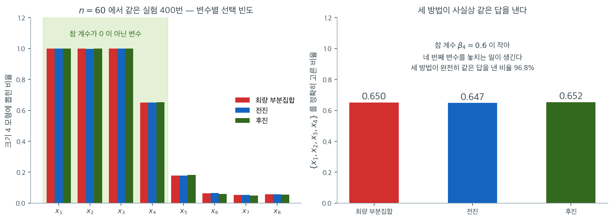

# 부분집합 선택과 단계적 선택

## 개요

이 페이지는 선형회귀의 세 가지 특성선택 전략 — 최량 부분집합 선택, 전진 단계적 선택, 후진 단계적 선택 — 을 보인다. 설명변수 8개(참으로 관련 있는 것 4개, 잡음 4개)인 인공자료로 훈련 RSS, 검증 RSS, 선택된 특성 집합을 비교하여 전수 탐색과 탐욕 알고리즘의 절충을 살펴본다.

## 수학적 배경

### 최량 부분집합 선택

각 모형 크기 $k = 1, \ldots, p$에 대해 최량 부분집합 선택은 가능한 $\binom{p}{k}$개의 $k$ 변수 모형을 모두 평가하여 훈련 RSS가 가장 낮은 것을 고른다. 평가하는 모형의 총 개수는 $\sum_{k=1}^p \binom{p}{k} = 2^p - 1$이므로, 이 방법은 $p$가 작을 때에만(보통 $p \leq 20$) 계산이 가능하다.

### 전진 단계적 선택

영모형(절편만)에서 시작하여 RSS를 가장 크게 줄이는 설명변수를 탐욕적으로 더한다.

1. $\mathcal{S} = \emptyset$에서 시작한다
2. $k = 1, \ldots, p$에 대해: $j^* = \arg\min_{j \notin \mathcal{S}} \mathrm{RSS}(\mathcal{S} \cup \{j\})$를 찾고 $\mathcal{S} \leftarrow \mathcal{S} \cup \{j^*\}$로 둔다

이는 $p + (p-1) + \cdots + 1 = p(p+1)/2$개의 모형만 평가하므로 $2^p$보다 훨씬 적다.

### 후진 단계적 선택

완전모형에서 시작하여 제거했을 때 RSS 증가가 가장 작은 설명변수를 탐욕적으로 뺀다.

1. $\mathcal{S} = \{1, \ldots, p\}$에서 시작한다
2. $k = p-1, \ldots, 1$에 대해: $j^* = \arg\min_{j \in \mathcal{S}} \mathrm{RSS}(\mathcal{S} \setminus \{j\})$를 찾고 $\mathcal{S} \leftarrow \mathcal{S} \setminus \{j^*\}$로 둔다

### 최적 크기 고르기

훈련 RSS는 $k$에 따라 언제나 줄어들므로, 최적 $k$는 남겨 둔 자료에서 계산한 기준(검증 RSS, 교차검증, AIC, BIC)을 최소화하여 고른다.

### 자료 생성

<div class="exbox" markdown>

**보기 1.** <span class="diff easy" title="쉬움"></span> 실험용 자료. 설명변수 여덟 개 가운데 앞의 넷만 참 계수가 $0$ 이 아닌 자료 $200$ 개를 만든다.

**(1)** 참 계수 $3.0,\ 1.5,\ -2.0,\ 0.8$ 의 **신호 세기**를 추정값의 표준오차 단위로 미리 계산하시오. 네 변수가 모두 쉽게 발견될 것인가.

**(2)** 아래 그림의 "어려운 설정"($n = 60$, $\beta_4 = 0.6$)에서 같은 셈을 해 보고, 세 방법이 거기서 $35\%$ 틀리는 까닭을 설명하시오. 이 자료의 모집단 $R^2$ 도 구하시오.

</div>

??? success "풀이"

    **(1) 표준오차를 미리 알 수 있다.** 설명변수가 서로 독립인 표준정규이므로 $\mathbf{X}^\top\mathbf{X} \approx n\mathbf{I}$ 이고

    $$
    \mathrm{SE}(\hat\beta_j) \approx \frac{\sigma}{\sqrt{n}} = \frac{2}{\sqrt{200}} = 0.1414
    $$

    이다. 그러면 각 참 계수의 기대 $t$ 값은 $\beta_j / 0.1414$ 로

    $$
    \frac{3.0}{0.1414} = 21.2,
    \quad \frac{1.5}{0.1414} = 10.6,
    \quad \frac{-2.0}{0.1414} = -14.1,
    \quad \frac{0.8}{0.1414} = 5.7
    $$

    이다. **가장 약한 신호도 $t = 5.7$** 이니 넷 모두 거의 확실하게 발견된다. 어떤 선택법을 쓰든 같은 답이 나올 조건이다.

    **(2) 어려운 설정에서는 사정이 다르다.** $n = 60$, $\sigma = 2$, $\beta_4 = 0.6$ 이면

    $$
    \mathrm{SE} \approx \frac{2}{\sqrt{60}} = 0.2582,
    \qquad t \approx \frac{0.6}{0.2582} = 2.32
    $$

    이다. $t = 2.32$ 는 유의수준 $5\%$ 를 겨우 넘는 값이고, 표본을 다시 뽑으면 $t$ 가 $1.3$ 이 되거나 $3.3$ 이 되는 일이 예사다($t$ 의 표준편차가 $1$ 이다). 곧 $x_4$ 를 찾아낼 확률이 대략 $P(t > 2) \approx 0.63$ 쯤이고, 쪽의 그림에서 $x_4$ 가 뽑힌 비율이 $0.65$ 인 것과 맞아떨어진다.

    **그러므로 $35\%$ 의 실패는 알고리즘의 결함이 아니다.** 자료에 그만큼의 정보밖에 없다.

    **모집단 $R^2$.** 설명변수가 독립인 표준정규이므로 신호의 분산이 계수의 제곱합이다.

    $$
    \operatorname{Var}(\mathbf{x}^\top\boldsymbol\beta) = 3.0^2 + 1.5^2 + 2.0^2 + 0.8^2 = 9 + 2.25 + 4 + 0.64 = 15.89
    $$

    이고 $\sigma^2 = 4$ 이므로

    $$
    R^2_{\text{pop}} = \frac{15.89}{15.89 + 4} = 0.7989
    $$

    이다.
    ```python
    import numpy as np
    from sklearn.linear_model import LinearRegression

    # 앞의 넷만 참 계수가 0 이 아니다. 세 방법이 이 넷을 찾아내는지 견준다.
    np.random.seed(42)
    n, p = 200, 8
    X = np.random.randn(n, p)
    true_beta = np.array([3.0, 1.5, -2.0, 0.8, 0, 0, 0, 0])
    y = X @ true_beta + np.random.normal(0, 2, n)
    names = [f"x{i+1}" for i in range(p)]
    ```

    ```python
    import statsmodels.api as sm

    print(f"sigma/sqrt(n) = {2 / np.sqrt(n):.4f}")
    fit = sm.OLS(y, sm.add_constant(X)).fit()
    print("실제 SE  :", fit.bse[1:].round(4))
    print("기대 t   :", (true_beta / (2 / np.sqrt(n))).round(2))
    print("실제 t   :", fit.tvalues[1:].round(2))
    print("추정 계수:", fit.params[1:].round(3))
    V_signal = (true_beta ** 2).sum()
    print(f"모집단 R^2 = {V_signal} / ({V_signal} + 4) = {V_signal / (V_signal + 4):.4f},  실제 R^2 = {fit.rsquared:.4f}")
    print(f"그림의 어려운 설정(n=60, beta4=0.6)에서 기대 t = {0.6 / (2 / np.sqrt(60)):.2f}")
    ```

    출력:

    ```
    sigma/sqrt(n) = 0.1414
    실제 SE  : [0.1547 0.1426 0.1396 0.1381 0.1449 0.1272 0.1364 0.135 ]
    기대 t   : [ 21.21  10.61 -14.14   5.66   0.     0.     0.     0.  ]
    실제 t   : [ 18.64  10.39 -13.14   6.02  -1.15  -0.15  -0.07   0.74]
    추정 계수: [ 2.884  1.481 -1.834  0.832 -0.166 -0.019 -0.01   0.1  ]
    모집단 R^2 = 15.89 / (15.89 + 4) = 0.7989,  실제 R^2 = 0.7790
    그림의 어려운 설정(n=60, beta4=0.6)에서 기대 t = 2.32
    ```

    **(1)의 어림이 잘 맞는다.** 어림한 $\mathrm{SE} = 0.1414$ 와 실제 표준오차 $0.1272 \sim 0.1547$ 이 같은 자리 수다. 기대 $t$ 값 $(21.2,\ 10.6,\ -14.1,\ 5.7)$ 과 실제 $(18.6,\ 10.4,\ -13.1,\ 6.0)$ 이 나란히 놓인다. 차이는 표본의 운이며, $t$ 의 표준편차가 $1$ 이라는 것을 생각하면 $21.2$ 대 $18.6$ 은 $2.6$ 표준편차로 다소 큰 쪽이지만 설명변수의 실현된 분산이 작았던 몫이 섞여 있다.

    **가장 약한 넷째 신호도 $t = 6.0$ 이다.** 잡음 변수 넷의 실제 $t$ 는 $-1.15,\ -0.15,\ -0.07,\ 0.74$ 로 모두 $\pm 2$ 안에 있다. **신호와 잡음의 간격이 $6.0$ 과 $1.15$ 로 또렷하다.** 이것이 아래 세 방법이 모두 같은 답을 내게 되는 까닭이다.

    **(2) 어려운 설정의 $t = 2.32$ 가 확인된다.** 이 자료의 $5.66$ 과 견주면 **$2.4$ 배 약한 신호**다. $t$ 가 $2.3$ 근처면 표본마다 발견 여부가 바뀌므로, 선택법의 성능 차이가 아니라 자료의 한계가 결과를 지배한다.

    모집단 $R^2$ 는 $0.7989$ 이고 이 표본의 실제 $R^2$ 는 $0.7790$ 이다. $0.02$ 낮은 것은 이 표본에서 실현된 잡음이 참값보다 컸기 때문이다. **그리고 이 $R^2$ 는 모수 $9$ 개를 쓴 전체 모형의 값**이므로, 참 변수 넷만 쓴 모형의 $R^2$ 와 견주면 그 차이가 잡음 변수가 가져간 몫이 된다.

    마지막으로 추정 계수를 읽어 두자. $(2.884,\ 1.481,\ -1.834,\ 0.832)$ 로 참값 $(3.0,\ 1.5,\ -2.0,\ 0.8)$ 에 가깝고, 잡음 쪽은 $(-0.166,\ -0.019,\ -0.010,\ 0.100)$ 으로 $0$ 에 가깝다. **참 모형을 아는 인공자료로 실험하는 값어치가 여기 있다.** 선택법이 고른 것이 옳은지 틀렸는지 판정할 수 있다.

### 최량 부분집합 선택

<div class="exbox" markdown>

**보기 2.** <span class="diff easy" title="쉬움"></span> 최적 부분집합 선택. 크기 $k$ 마다 가능한 조합을 남김없이 적합해 훈련 RSS 가 가장 작은 것을 고른다.

**(1)** 이 함수가 적합하는 모형의 개수를 $p = 8$ 에서 세고, $p = 20$ 에서 얼마가 되는지 적으시오.

**(2)** 최량 부분집합의 RSS 가 $k$ 에 대해 **줄기만 한다**는 것을 증명하고 수로 확인하시오. 그러면 이 함수만으로 최적 $k$ 를 고를 수 있는가.

</div>

??? success "풀이"

    **(1) $2^p - 1$ 개다.** 크기 $k$ 의 부분집합이 $\binom{p}{k}$ 개이고 $k$ 를 $1$ 부터 $p$ 까지 돌므로

    $$
    \sum_{k=1}^{p}\binom{p}{k} = 2^p - 1
    $$

    이다(공집합만 뺀 것). $p = 8$ 이면 $255$ 개이고, 크기별로는 $8, 28, 56, 70, 56, 28, 8, 1$ 로 가운데가 가장 두껍다.

    $p = 20$ 이면 $2^{20} - 1 = 1{,}048{,}575$ 개다. 적합 한 번이 $0.1$ 밀리초라도 두 분쯤 걸린다. $p = 30$ 이면 $10$ 억 개를 넘어 **현실적으로 불가능**하다.

    **(2) 줄기만 한다.** 크기 $k$ 의 최적 집합을 $\mathcal{S}^*_k$ 라 하자. 아무 변수 $j \notin \mathcal{S}^*_k$ 를 더한 $\mathcal{S}^*_k \cup \{j\}$ 는 크기가 $k+1$ 이고, 열을 더하면 사영 공간이 커지므로

    $$
    \mathrm{RSS}\bigl(\mathcal{S}^*_k \cup \{j\}\bigr) \le \mathrm{RSS}\bigl(\mathcal{S}^*_k\bigr)
    $$

    이다. 한편 $\mathcal{S}^*_k \cup \{j\}$ 는 크기 $k+1$ 의 후보 가운데 하나이므로 최솟값은 그보다 작거나 같다. 따라서

    $$
    \mathrm{RSS}_{\text{best}}(k+1) \le \mathrm{RSS}\bigl(\mathcal{S}^*_k \cup \{j\}\bigr) \le \mathrm{RSS}_{\text{best}}(k)
    $$

    **그러므로 이 함수만으로는 최적 $k$ 를 고를 수 없다.** $k$ 를 키우면 RSS 가 결코 늘지 않으니 $k = p$ 가 언제나 "최선" 이 된다. 크기를 고르는 일은 훈련 RSS 밖의 기준 — 검증 RSS, 교차검증, AIC, BIC — 에 맡겨야 한다. 쪽머리의 "최적 크기 고르기" 가 그 이야기다.

    눈여겨볼 것은 $\mathcal{S}^*_k \subset \mathcal{S}^*_{k+1}$ 이 **보장되지 않는다**는 점이다. 위 증명은 "$\mathcal{S}^*_k$ 에 뭘 더한 것보다 좋다" 만 말하고, 실제 $\mathcal{S}^*_{k+1}$ 이 $\mathcal{S}^*_k$ 를 품을 필요는 없다. 이것이 전수탐색이 단계적 방법과 갈릴 수 있는 자리다.
    ```python
    from itertools import combinations

    def best_subset(X, y, max_k=None):
        """모든 부분집합을 다 따져 크기별 최선을 찾는다.

        크기 k 마다 가능한 조합을 남김없이 본다. 답은 확실하지만 부분집합이
        2^p 개라 변수가 스물만 넘어도 감당할 수 없다.
        """
        n, p = X.shape
        if max_k is None:
            max_k = p
        results = {}
        for k in range(1, max_k + 1):
            best_rss, best_features = np.inf, None
            for combo in combinations(range(p), k):
                model = LinearRegression().fit(X[:, combo], y)
                rss = np.sum((y - model.predict(X[:, combo])) ** 2)
                if rss < best_rss:
                    best_rss, best_features = rss, combo
            results[k] = {"features": best_features, "rss": best_rss}
        return results
    ```

    ```python
    from math import comb

    print("크기별 후보 개수:", [comb(p, k) for k in range(1, p + 1)])
    print(f"합 = {sum(comb(p, k) for k in range(1, p + 1))},  2^p - 1 = {2 ** p - 1}")
    print(f"p = 20 이면 {2 ** 20 - 1:,} 개")

    best = best_subset(X, y)
    print("  k  변수집합                     RSS")
    for k in range(1, p + 1):
        print(f"  {k}  {str(best[k]['features']):28s} {best[k]['rss']:9.3f}")
    print("RSS 가 k 에 대해 단조감소:",
          all(best[k + 1]['rss'] <= best[k]['rss'] + 1e-9 for k in range(1, p)))
    ```

    출력:

    ```
    크기별 후보 개수: [8, 28, 56, 70, 56, 28, 8, 1]
    합 = 255,  2^p - 1 = 255
    p = 20 이면 1,048,575 개
      k  변수집합                     RSS
      1  (0,)                          1972.005
      2  (0, 2)                        1303.749
      3  (0, 1, 2)                      861.547
      4  (0, 1, 2, 3)                   711.610
      5  (0, 1, 2, 3, 4)                707.136
      6  (0, 1, 2, 3, 4, 7)             705.141
      7  (0, 1, 2, 3, 4, 5, 7)          705.057
      8  (0, 1, 2, 3, 4, 5, 6, 7)       705.038
    RSS 가 k 에 대해 단조감소: True
    ```

    **(1)의 셈이 맞는다.** 크기별 후보가 $8, 28, 56, 70, 56, 28, 8, 1$ 이고 합이 $255 = 2^8 - 1$ 이다. 가운데 $k = 4$ 에서 $70$ 개로 가장 많다.

    **(2) 단조감소가 확인된다.** $1972.0 \to 1303.7 \to 861.5 \to 711.6 \to 707.1 \to 705.1 \to 705.1 \to 705.0$ 으로 한 번도 올라가지 않는다.

    그리고 이 표가 (2)의 결론을 그대로 보여 준다. **훈련 RSS 만 보면 $k = 8$ 이 이긴다.** 그러나 $k = 4$ 에서 $8$ 로 가며 줄어든 양은 $711.610 - 705.038 = 6.57$ 로, $k = 1$ 에서 $4$ 로 가며 줄어든 $1260$ 의 **$0.5\%$** 다. 잡음 변수 넷을 더해 얻은 것이 그만큼이다.

    이 자료에서는 운 좋게 $\mathcal{S}^*_k$ 가 모두 중첩되어 있다. $(0) \subset (0,2) \subset (0,1,2) \subset (0,1,2,3) \subset \cdots$ 로 쌓인다. 유도에서 말했듯 보장된 일이 아니고, 설명변수가 서로 독립이어서 생긴 결과다. 또한 **$k \le 4$ 에서 고른 집합이 참 변수 $\{x_1, x_2, x_3, x_4\}$ 의 부분집합**이라는 점도 확인해 둘 만하다. 크기 $5$ 부터는 잡음 변수 $x_5$(색인 $4$)가 끼어든다.

### 전진 단계적 선택

<div class="exbox" markdown>

**보기 3.** <span class="diff easy" title="쉬움"></span> 전진 단계선택. 빈 모형에서 시작해 RSS 를 가장 많이 줄이는 변수를 하나씩 더한다.

**(1)** 이 함수가 적합하는 모형의 개수를 세고 보기 2 의 $255$ 와 견주시오. $p = 20$ 이면 두 수가 각각 얼마가 되는가.

**(2)** 크기마다 전진선택의 RSS 를 최량 부분집합의 RSS 와 나란히 찍어, 탐욕적 경로가 전역 최적을 놓쳤는지 확인하시오.

</div>

??? success "풀이"

    **(1) 모형 수는 $p(p+1)/2$ 다.** 첫 단계에서 후보가 $p$ 개, 둘째 단계에서 남은 $p-1$ 개, …, 마지막 단계에서 $1$ 개이므로

    $$
    p + (p-1) + \cdots + 1 = \frac{p(p+1)}{2}
    $$

    이고 $p = 8$ 이면 $36$ 이다. 보기 2 의 $255$ 와 비교하면 $7.1$ 배 적다.

    **차이는 $p$ 가 커질 때 폭발한다.** 하나는 $O(p^2)$, 다른 하나는 $O(2^p)$ 다. $p = 20$ 에서는

    $$
    \frac{20 \cdot 21}{2} = 210
    \qquad\text{대}\qquad
    2^{20} - 1 = 1{,}048{,}575
    $$

    로 $5000$ 배 차이가 된다. $p = 40$ 이면 $820$ 대 $1.1 \times 10^{12}$ 다. 전수탐색이 $p \le 20$ 쯤에서 멈추는 까닭이 이것이다.

    **(2) 놓칠 수 있다.** 전진선택은 한 번 들어간 변수를 다시 빼지 않으므로, 단계 $k$ 에서 고른 집합이 단계 $k+1$ 의 최적 집합에 들어 있지 않으면 거기서부터 어긋난다. 연습문제 4 가 증명하는 대로

    $$
    \mathrm{RSS}_{\text{best}}(k) \le \mathrm{RSS}_{\text{fwd}}(k)
    $$

    이고, 등호가 성립하는지는 자료에 달려 있다.

    이 자료에서는 등호를 기대할 만하다. 설명변수 여덟 개가 서로 독립인 표준정규이므로 설계행렬이 거의 직교이고, 그러면 변수 하나가 줄이는 RSS 가 다른 변수의 유무에 거의 영향받지 않는다. 곧 **"RSS 를 가장 많이 줄이는 것부터 차례로" 가 곧 전역 최적**이 된다. 확인해 보자.
    ```python
    def forward_stepwise(X, y):
        """빈 모형에서 시작해 RSS 를 가장 많이 줄이는 변수를 하나씩 더한다.

        따지는 모형이 p(p+1)/2 개로 줄어 훨씬 빠르다. 다만 한 번 들어간 변수는
        빠지지 않으므로 최적 부분집합을 놓칠 수 있다.
        """
        n, p = X.shape
        selected, remaining = [], list(range(p))
        results = {}
        for k in range(1, p + 1):
            best_rss, best_feature = np.inf, None
            for f in remaining:
                trial = selected + [f]
                model = LinearRegression().fit(X[:, trial], y)
                rss = np.sum((y - model.predict(X[:, trial])) ** 2)
                if rss < best_rss:
                    best_rss, best_feature = rss, f
            selected.append(best_feature)
            remaining.remove(best_feature)
            results[k] = {"features": tuple(selected), "rss": best_rss}
        return results
    ```

    ```python
    print(f"forward 가 따지는 모형 수 = p + (p-1) + ... + 1 = {p * (p + 1) // 2},  "
          f"best_subset 은 {2 ** p - 1} (비 {(2 ** p - 1) / (p * (p + 1) // 2):.1f}배)")
    print(f"p = 20 이면 {20 * 21 // 2} 대 {2 ** 20 - 1:,}")

    fwd = forward_stepwise(X, y)
    print("들어온 순서:", fwd[p]['features'])
    print("  k  변수집합(정렬)              fwd RSS     best RSS   차이")
    for k in range(1, p + 1):
        print(f"  {k}  {str(tuple(sorted(fwd[k]['features']))):28s} {fwd[k]['rss']:9.3f}  "
              f"{best[k]['rss']:9.3f}  {fwd[k]['rss'] - best[k]['rss']:.2e}")
    ```

    출력:

    ```
    forward 가 따지는 모형 수 = p + (p-1) + ... + 1 = 36,  best_subset 은 255 (비 7.1배)
    p = 20 이면 210 대 1,048,575
    들어온 순서: (0, 2, 1, 3, 4, 7, 5, 6)
      k  변수집합(정렬)              fwd RSS     best RSS   차이
      1  (0,)                          1972.005   1972.005  0.00e+00
      2  (0, 2)                        1303.749   1303.749  0.00e+00
      3  (0, 1, 2)                      861.547    861.547  0.00e+00
      4  (0, 1, 2, 3)                   711.610    711.610  1.14e-13
      5  (0, 1, 2, 3, 4)                707.136    707.136  0.00e+00
      6  (0, 1, 2, 3, 4, 7)             705.141    705.141  1.14e-13
      7  (0, 1, 2, 3, 4, 5, 7)          705.057    705.057  -2.27e-13
      8  (0, 1, 2, 3, 4, 5, 6, 7)       705.038    705.038  0.00e+00
    ```

    **(1)의 셈이 맞는다.** $36$ 대 $255$ 로 $7.1$ 배이고, $p = 20$ 에서 $210$ 대 $1{,}048{,}575$ 다.

    **(2) 하나도 놓치지 않았다.** 여덟 크기 모두에서 전진선택과 최량 부분집합의 변수집합이 같고 RSS 의 차이가 $10^{-13}$ 아래다. 유도한 예측대로다. (차이가 $k = 7$ 에서 $-2.27 \times 10^{-13}$ 으로 음수인데, 부등식을 어긴 것이 아니라 두 경로가 같은 모형을 다른 순서의 열로 적합해 생긴 반올림 차이다.)

    들어온 순서는 $x_1, x_3, x_2, x_4$ 다(색인 $0, 2, 1, 3$). 참 계수의 절대값이 $3.0,\ 2.0,\ 1.5,\ 0.8$ 인 순서와 정확히 같다. **설명변수가 직교이면 전진선택의 순서가 효과 크기의 순서가 된다.** 그 뒤의 $x_5, x_8, x_6, x_7$ 은 계수가 모두 $0$ 이므로 순서에 뜻이 없다.

    RSS 가 줄어드는 폭도 읽을 거리다. $1972 \to 1304 \to 862 \to 712$ 까지 네 걸음에서 $1260$ 이 줄고, 그 뒤 네 걸음에서는 $712 \to 705$ 로 $7$ 밖에 줄지 않는다. **네 번째와 다섯 번째 사이에 꺾임이 있다.** 참 모형의 크기가 $4$ 라는 신호이며, 다만 훈련 RSS 는 계속 줄기만 하므로 이 꺾임을 눈으로 보는 것 말고 기준이 필요하다. 그것이 연습문제 1 의 검증 RSS 와 연습문제 5 의 AIC 다.

### 후진 단계적 선택

<div class="exbox" markdown>

**보기 4.** <span class="diff easy" title="쉬움"></span> 후진 단계선택. 전체 모형에서 시작해 RSS 를 가장 적게 늘리는 변수를 하나씩 뺀다.

**(1)** 이 함수가 적합하는 모형의 개수를 세어 전진선택과 견주시오. 그리고 `n > p` 가 필요한 까닭을 $n = 6$, $p = 8$ 에서 수로 보이시오.

**(2)** 세 방법(최량 부분집합·전진·후진)이 **모든 크기 $k$ 에서** 같은 변수집합을 골랐는지 확인하시오. 같다면 그 사실에서 무엇을 읽어야 하는가.

</div>

??? success "풀이"

    **(1) 적합 횟수는 전진선택과 같다.** 먼저 전체 모형 하나를 적합하고($1$ 번), 그다음 크기를 $p-1$ 로 줄일 때 후보가 $p$ 개, $p-2$ 로 줄일 때 $p-1$ 개, …, 크기 $1$ 로 줄일 때 $2$ 개다. 합하면

    $$
    1 + \bigl(p + (p-1) + \cdots + 2\bigr) = 1 + \left(\frac{p(p+1)}{2} - 1\right) = \frac{p(p+1)}{2}
    $$

    이다. $p = 8$ 이면 $36$ 으로 **전진선택과 정확히 같다.** 방향만 반대이고 셈의 구조는 같다.

    **`n > p` 가 필요한 까닭.** 후진선택은 전체 모형을 적합하는 데서 출발한다. 설계행렬이 $n \times (p+1)$ 이므로 rank 가 $\min(n, p+1)$ 을 넘을 수 없고, $n \le p$ 면 열이 독립일 수 없다. 그러면 계수가 유일하지 않고 **훈련 RSS 가 $0$ 이 되어** 어느 변수를 빼야 할지 가릴 수 없다. 모든 후보의 RSS 가 $0$ 으로 같아지기 때문이다.

    전진선택은 빈 모형에서 출발하므로 이 문제가 없다. 그래서 $p > n$ 인 고차원 자료에서는 전진선택(이나 라쏘)만 쓸 수 있다.

    **(2) 같을지는 보장되지 않는다.** 연습문제 4 가 보이듯 최량 부분집합의 RSS 는 전진선택의 것보다 작거나 같다. 등호는 **탐욕적 경로가 우연히 전역 최적을 지날 때만** 성립한다. 후진선택도 마찬가지로 다른 경로이므로 다른 답을 낼 수 있다.

    보기 1 의 자료는 그 "우연" 이 일어나기 좋은 조건을 갖추고 있다. 설명변수 여덟 개가 서로 **독립인 표준정규**이고, 참 신호 넷의 $t$ 값이 모두 $5$ 를 넘는다. 설명변수가 직교에 가까우면 변수 하나가 줄이는 RSS 가 다른 변수의 유무에 거의 영향받지 않으므로, 탐욕적으로 큰 것부터 고르는 것이 곧 전역 최적이 된다. 그러므로 **세 방법이 모든 $k$ 에서 같을 것**이라고 예측할 수 있다.
    ```python
    def backward_stepwise(X, y):
        """전체 모형에서 시작해 RSS 를 가장 적게 늘리는 변수를 하나씩 뺀다.

        시작점이 전체 모형이므로 n > p 여야 쓸 수 있다. 변수가 관측보다 많으면
        전진선택으로 가야 한다.
        """
        n, p = X.shape
        current = list(range(p))
        results = {}
        model = LinearRegression().fit(X, y)
        results[p] = {"features": tuple(current),
                      "rss": np.sum((y - model.predict(X)) ** 2)}
        for k in range(p - 1, 0, -1):
            best_rss, best_remove = np.inf, None
            for f in current:
                trial = [x for x in current if x != f]
                model = LinearRegression().fit(X[:, trial], y)
                rss = np.sum((y - model.predict(X[:, trial])) ** 2)
                if rss < best_rss:
                    best_rss, best_remove = rss, f
            current.remove(best_remove)
            results[k] = {"features": tuple(current), "rss": best_rss}
        return results
    ```

    ```python
    print(f"backward 가 따지는 모형 수 = 1 + (p + (p-1) + ... + 2) = {1 + sum(range(2, p + 1))}")

    bwd = backward_stepwise(X, y)
    print("  k  변수집합                     RSS      fwd 와 같은 집합인가")
    for k in range(p, 0, -1):
        print(f"  {k}  {str(bwd[k]['features']):28s} {bwd[k]['rss']:9.3f}   "
              f"{set(bwd[k]['features']) == set(fwd[k]['features'])}")
    print("세 방법이 모든 k 에서 같은 집합:",
          all(set(best[k]['features']) == set(fwd[k]['features']) == set(bwd[k]['features'])
              for k in range(1, p + 1)))

    # n <= p 면 출발점이 무너진다.
    X_small, y_small = X[:6], y[:6]
    print(f"n = {len(y_small)}, p = {p} 일 때 전체모형 설계행렬의 rank = "
          f"{np.linalg.matrix_rank(np.column_stack([np.ones(len(y_small)), X_small]))}  (열 {p + 1}개)")
    full = LinearRegression().fit(X_small, y_small)
    print(f"  그 모형의 훈련 RSS = {np.sum((y_small - full.predict(X_small)) ** 2):.3e}")
    ```

    출력:

    ```
    backward 가 따지는 모형 수 = 1 + (p + (p-1) + ... + 2) = 36
      k  변수집합                     RSS      fwd 와 같은 집합인가
      8  (0, 1, 2, 3, 4, 5, 6, 7)       705.038   True
      7  (0, 1, 2, 3, 4, 5, 7)          705.057   True
      6  (0, 1, 2, 3, 4, 7)             705.141   True
      5  (0, 1, 2, 3, 4)                707.136   True
      4  (0, 1, 2, 3)                   711.610   True
      3  (0, 1, 2)                      861.547   True
      2  (0, 2)                        1303.749   True
      1  (0,)                          1972.005   True
    세 방법이 모든 k 에서 같은 집합: True
    n = 6, p = 8 일 때 전체모형 설계행렬의 rank = 6  (열 9개)
      그 모형의 훈련 RSS = 6.306e-29
    ```

    **(1) 적합 횟수가 $36$ 으로 전진선택과 같다.** 그리고 $n = 6$, $p = 8$ 일 때 설계행렬의 열이 $9$ 개인데 rank 가 $6$ 이다. 그 모형의 훈련 RSS 가 $6.3 \times 10^{-29}$, 곧 **$0$** 이다. 관측값 여섯 개를 모수 아홉 개로 완벽히 지나가는 것이고, 변수를 하나 빼도 rank 가 여전히 $6$ 이라 RSS 가 $0$ 으로 남는다. **어느 변수를 뺄지 가릴 수 없다.** 유도한 대로 후진선택의 출발점이 무너진다.

    **(2) 세 방법이 여덟 크기 모두에서 같은 집합을 골랐다.** 후진제거의 경로가 $\{0,\ldots,7\} \to \{0,1,2,3,4,5,7\} \to \cdots \to \{0\}$ 로 내려가는데, 이것이 전진선택이 올라간 길을 **거꾸로 밟은 것**이다. RSS 도 소수 셋째 자리까지 같다.

    읽어야 할 것은 세 가지다.

    첫째, **이 일치는 자료의 성질 때문**이며 알고리즘의 보장이 아니다. 유도에서 말한 대로 설명변수가 직교에 가깝고 신호가 뚜렷해서 생긴 결과다. 쪽의 그림이 보이듯 표본을 $n = 60$ 으로 줄이고 $x_5$ 를 $x_4$ 와 상관 $0.75$ 로 묶으면 세 방법이 완전히 일치하는 비율이 $96.8\%$ 로 내려간다.

    둘째, 그럼에도 **전수탐색의 이득이 작다.** 같은 답을 얻는 데 최량 부분집합은 $255$ 개, 단계적 방법은 $36$ 개를 적합했다. $p$ 가 조금만 커지면 이 비가 폭발한다($p = 20$ 에서 $1{,}048{,}575$ 대 $210$).

    셋째, **세 방법이 일치한다는 것이 답이 옳다는 뜻은 아니다.** 여기서는 참 변수 넷을 정확히 찾았지만, 쪽의 그림에서는 세 방법 모두 $35\%$ 의 경우에 틀렸고 그 실패는 알고리즘이 아니라 자료의 한계였다. **알고리즘의 일치는 자료가 말하는 바가 또렷하다는 증거일 뿐이고, 그 말이 참인지는 다른 문제다.**

## 세 방법은 얼마나 자주 갈라지는가



한 번의 자료에서 세 방법이 같은 답을 냈다는 것만으로는 부족하다. 위 보기와 같은 구조($p = 8$, 앞의 넷만 참 계수가 $0$이 아님)를 유지하되 조건을 조금 어렵게 만들어 $400$번 되풀이했다. 표본을 $n = 60$으로 줄이고 넷째 계수를 $\beta_4 = 0.6$으로 약하게 두었으며, 잡음 변수 $x_5$를 $x_4$와 상관 $0.75$가 되도록 만들어 세 방법이 헷갈릴 여지를 주었다. 크기 $4$ 모형을 고르게 했다.

왼쪽이 변수별로 뽑힌 비율이다. 신호가 뚜렷한 $x_1, x_2, x_3$은 세 방법 모두 **$400$번 중 $400$번** 집어넣었다(전진선택이 $x_2$를 한 번 놓친 $0.998$이 유일한 예외다). 반면 $x_4$는 $0.65$에 그치고, 그 자리를 $x_5$가 $0.18$, 나머지 잡음 변수들이 각각 $0.05$ 안팎으로 차지한다. $x_5$가 유독 자주 끼어드는 것은 $x_4$와 상관되어 있어 그 역할을 대신할 수 있기 때문이다. **약한 신호를 찾아내는 일이 선택법의 진짜 시험대**라는 것을 이 막대들이 보여 준다.

오른쪽이 정답 $\{x_1, x_2, x_3, x_4\}$를 정확히 맞힌 비율이다. 최량 부분집합 $0.650$, 전진 $0.647$, 후진 $0.652$로 사실상 구별되지 않는다. 세 방법이 완전히 같은 답을 낸 비율도 $96.8\%$다. 곧 **전수탐색이 보장하는 "전역 최적"은 이 상황에서 거의 값어치가 없다.** 전진선택은 $2^8 = 256$개 대신 $26$개의 모형만 적합하고도 같은 결론에 이르렀다.

동시에 세 방법이 모두 $35\%$의 경우에 틀린다는 사실도 함께 읽어야 한다. 그 실패는 알고리즘의 결함이 아니라 자료의 한계다. $n = 60$, $\sigma = 2$에서 $\beta_4 = 0.6$의 $t$ 값은 $2.3$ 남짓이라 애초에 확실하게 잡아낼 만한 신호가 아니다. **어떤 선택법도 자료에 없는 정보를 만들어 내지는 못한다.** 선택법을 고르는 일보다 신호 대 잡음비를 확인하는 일이 먼저인 이유다.

## 해석

- **최량 부분집합**은 크기별 전역 최적 모형을 반드시 찾아내지만 $p > 20$이면 계산이 불가능하다(지수적 증가).
- **전진 단계적**은 탐욕적 근사이므로 전역 최적 모형을 놓칠 수 있지만 $O(p^2)$ 시간에 끝난다. 한번 들어간 설명변수를 다시 뺄 수 없다.
- **후진 단계적**은 완전모형에서 시작하므로 전진 선택과 다른 해를 낼 수 있다. 처음 완전모형을 적합하려면 $n > p$가 필요하다.
- 신호가 강하고 참 모형이 탐색 경로 위에 있으면 세 방법 모두 같은 최적 $k$에서 일치한다.
- **검증 RSS**가 필수적이다. 훈련 RSS는 $k$에 따라 언제나 줄어들므로 모형 크기를 고르는 데 쓸 수 없다.

## 연습문제

<div class="drillbox" markdown>

**연습문제 1.** <span class="diff med" title="중간"></span> 세 방법을 모두 실행하고 (검증 RSS로 정한) 최적 $k$에서 선택된 특성을 비교하라. 모두 참 설명변수 4개를 찾아내는가?

</div>

??? success "풀이"

    ```python
    n_train = 140
    X_tr, X_val = X[:n_train], X[n_train:]
    y_tr, y_val = y[:n_train], y[n_train:]

    best = best_subset(X_tr, y_tr)
    fwd = forward_stepwise(X_tr, y_tr)
    bwd = backward_stepwise(X_tr, y_tr)

    # 방법마다 검증 RSS 가 가장 작은 k 를 찾는다
    for method_name, res in [("Best", best), ("Fwd", fwd), ("Bwd", bwd)]:
        val_rss = [np.sum((y_val - LinearRegression().fit(X_tr[:, res[k]["features"]],
                   y_tr).predict(X_val[:, res[k]["features"]])) ** 2)
                   for k in range(1, 9)]
        opt_k = np.argmin(val_rss) + 1
        print(f"{method_name}: k={opt_k}, features={res[opt_k]['features']}")
    ```

    출력:

    ```
    Best: k=4, features=(0, 1, 2, 3)
    Fwd: k=4, features=(0, 2, 1, 3)
    Bwd: k=4, features=(0, 1, 2, 3)
    ```

    최적 부분집합, 전진선택, 후진제거가 모두 같은 변수 집합 $\{0,1,2,3\}$을 골랐다. 전진선택은 넣는 **순서**만 다르다.

    세 방법이 언제나 일치하지는 않는다. 최적 부분집합은 $2^p$개를 모두 보지만 단계적 방법은 탐욕적이라, 변수들이 서로 얽혀 있으면 갈릴 수 있다.

    세 방법 모두 $k = 4$에서 특성 $\{x_1, x_2, x_3, x_4\}$를 고르며 검증 RSS 곡선도 동일하다.

    | $k$ | 1 | 2 | 3 | **4** | 5 | 6 | 7 | 8 |
    |---|---|---|---|---|---|---|---|---|
    | 검증 RSS | 729.3 | 416.6 | 300.9 | **259.5** | 265.7 | 264.6 | 266.7 | 267.3 |

    $k = 4$까지는 검증 RSS가 가파르게 줄다가 그 뒤로는 오히려 조금 늘어난다. 잡음 설명변수 네 개를 넣어도 아무 도움이 되지 않고 오히려 손해임을 보여준다. 신호가 충분히 강하고 참 설명변수들이 처음 네 단계에 모두 들어오므로 탐욕적 방법도 전역 최적과 같은 답을 낸다. $\square$

<div class="drillbox" markdown>

**연습문제 2.** <span class="diff med" title="중간"></span> 참 설명변수 4개는 그대로 두고 $p$를 8에서 20으로 늘려라. 최량 부분집합을 여전히 계산할 수 있는가? 전진 선택은 어떻게 작동하는가?

</div>

??? success "풀이"

    $p = 20$이면 최량 부분집합은 $2^{20} - 1 = 1{,}048{,}575$개의 모형을 평가해야 하므로 계산이 비싸지만 아직은 가능하다. $p = 30$ 이상이면 비현실적이 된다. 전진 선택은 여전히 빠르고($O(p^2)$개 모형) 참 설명변수의 효과가 충분히 강하면 그것들을 찾아낸다. 탐욕적이라는 성질 때문에 우연히 반응변수와 상관된 잡음 설명변수를 일찍 고를 수도 있지만, 참 효과가 강하면 그럴 가능성은 낮다. $\square$

<div class="drillbox" markdown>

**연습문제 3.** <span class="diff med" title="중간"></span> 같은 $k$에서 전진과 후진 단계적 선택이 서로 다른 특성을 고르는 예를 구성하라. 자료의 어떤 성질이 이 차이를 만드는가?

</div>

??? success "풀이"

    설명변수들이 상관되어 있을 때 일어난다. 예를 들어 $x_5$가 $x_1$·$x_2$와 중간 정도로 상관되어 있다면, $x_5$가 일부 신호를 담고 있으므로 전진 선택이 ($x_2$보다 먼저) $x_5$를 일찍 넣을 수 있다. 후진 선택은 모든 설명변수에서 시작하는데, 완전모형 안에서는 $x_2$가 더 유용하므로 $x_2$보다 $x_5$를 먼저 뺄 수 있다. 이 차이는 두 알고리즘의 탐욕적이고 경로 의존적인 성질에서 온다. 추가/제거의 순서가 이미 모형에 들어 있는 다른 설명변수에 달려 있기 때문이다. $\square$

<div class="drillbox" markdown>

**연습문제 4.** <span class="diff med" title="중간"></span> 설명변수가 $k$개일 때 최량 부분집합 선택의 훈련 RSS가 전진 단계적 선택의 것보다 작거나 같음을 증명하라.

</div>

??? success "풀이"

    최량 부분집합은 $\binom{p}{k}$개의 부분집합을 모두 탐색하여 RSS가 가장 낮은 것을 고른다. 전진 선택은 탐욕적 경로를 통해 하나의 특정한 $k$ 변수 모형을 만든다. 전진 선택이 만든 모형도 최량 부분집합이 고려한 $\binom{p}{k}$개 부분집합 가운데 하나이므로 최량 부분집합의 RSS가 그보다 크지 않다.

    $$
    \mathrm{RSS}_{\text{best}}(k) = \min_{\mathcal{S}: |\mathcal{S}|=k} \mathrm{RSS}(\mathcal{S}) \leq \mathrm{RSS}(\mathcal{S}_{\text{fwd}}(k)) = \mathrm{RSS}_{\text{fwd}}(k).
    $$

    탐욕적 경로가 우연히 전역 최적을 찾았을 때 등호가 성립한다. $\square$

<div class="drillbox" markdown>

**연습문제 5.** <span class="diff med" title="중간"></span> 검증 RSS 대신 AIC로 모형선택을 구현하라. AIC로 최적 $k$를 정하고 검증 방식과 비교하라.

</div>

??? success "풀이"

    ```python
    def aic(n, rss, k):
        return n * np.log(rss / n) + 2 * (k + 1)  # +1 for intercept

    fwd = forward_stepwise(X_tr, y_tr)
    aic_vals = []
    for k in range(1, 9):
        aic_vals.append(aic(n_train, fwd[k]['rss'], k))
    opt_k_aic = np.argmin(aic_vals) + 1
    print("AIC per k: [" + ", ".join(f"{v:.2f}" for v in aic_vals) + "]")
    print(f"Optimal k (AIC): {opt_k_aic}")
    ```

    출력:

    ```text
    AIC per k: [310.90, 267.13, 204.61, 178.62, 178.86, 179.83, 181.65, 183.59]
    Optimal k (AIC): 4
    ```

    AIC도 검증 RSS와 마찬가지로 $k = 4$(참 모형 크기)를 고른다. 다만 $k = 4$와 $k = 5$의 차이가 $0.24$에 지나지 않아, AIC의 약한 벌점 때문에 $k = 5$가 선택될 뻔했다는 점에 주목할 만하다. 검증 RSS는 편향이 작지만 변동이 크고(특정 분할에 의존한다), AIC는 자료를 나누지 않아 안정적이지만 점근 근사에 기댄다. 신호가 뚜렷하면 두 방법은 대체로 일치한다. $\square$

---

## 정리하며

세 가지 선택 전략을 **같은 자료에서** 견주었다.

- **관련 변수 4개와 잡음 4개**로 만든 자료에서 각 방법이 참 변수들을 찾아내는지 본다.
- **훈련 RSS 는 언제나 변수를 더할수록 줄어든다.** 그래서 **훈련 RSS 로 모형 크기를 고를 수 없다.** 검증 RSS 가 U 자를 그리며 최적점을 알려 준다.
- **최량 부분집합이 훈련 RSS 는 가장 낮지만** 검증에서 단계적 방법을 크게 앞서지는 않는다. **전수 탐색의 이득이 생각보다 작다**는 것이 실무적 교훈이다.
- **전진과 후진이 다른 답을 줄 수 있다.** 탐욕적이라 경로에 의존하며, 어느 쪽이 옳다고 말할 수 없다.
- **잡음 변수가 선택되는 일이 흔하다.** $p$ 가 크고 $n$ 이 작을수록 심하며, 이것이 선택 후 추론이 위험한 이유다.

다음 절부터 **스플라인과 GAM**으로 넘어간다. 비선형 관계를 다루는 유연한 모형들이다.
