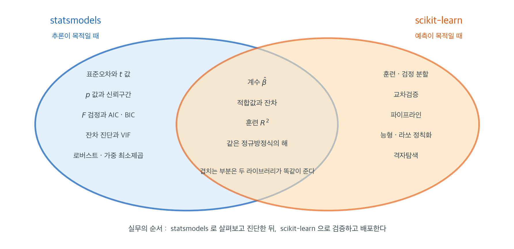

# sklearn과 statsmodels 비교

## 개요

Python에는 회귀 모형화를 위한 주요 라이브러리가 둘 있다. **scikit-learn**(`sklearn`)과 **statsmodels**이다. 둘은 목적이 다르며 서로 다른 작업 흐름에 적합하다.

---

## 한눈에 보기

| 기능 | `statsmodels` | `sklearn` |
|---|---|---|
| 주된 초점 | 통계적 추론 | 예측과 기계학습 |
| 모형 요약 | 상세함(계수, $p$값, $R^2$, AIC, BIC) | 최소한(직접 계산해야 함) |
| 가설검정 | 내장($t$ 검정, $F$ 검정, Wald 검정) | 없음 |
| 신뢰구간 | 계수와 예측에 대해 내장 | 없음 |
| 진단 | 풍부함(VIF, 영향 그림, 잔차 검정) | 제한적 |
| 교차검증 | 내장되어 있지 않음 | 내장(`cross_val_score`, 파이프라인) |
| 정칙화 | 제한적 | 릿지, 라쏘, 엘라스틱넷 내장 |
| 절편 처리 | `add_constant()`로 직접 추가해야 함 | 자동(기본 `fit_intercept=True`) |
| 식 인터페이스 | 있음(`smf.ols('y ~ x1 + x2', data=df)`) | 없음 |



위 표를 한 장으로 옮기면 이렇게 된다. 가장 먼저 붙잡아야 할 것은 **가운데 겹치는 부분**이다. 두 라이브러리는 같은 정규방정식 $\mathbf{X}^\top\mathbf{X}\hat{\boldsymbol\beta} = \mathbf{X}^\top\mathbf{y}$를 푼다. 그래서 계수도, 적합값도, 잔차도, 훈련 $R^2$도 똑같이 나온다. 아래 보기에서 두 라이브러리의 계수가 $4.5154$, $-0.5718$, $-0.9307$로 소수점까지 일치하는 것이 그 확인이다. 어느 쪽이 "더 정확한 회귀"인가 하는 물음은 성립하지 않는다.

갈리는 것은 **그 곁에 무엇을 얹어 주느냐**다. 왼쪽 파란 영역은 "이 계수를 얼마나 믿을 수 있는가"에 답하는 도구들이다. 표준오차, $t$ 값, $p$ 값, 신뢰구간, $F$ 검정, AIC·BIC, 잔차 진단, VIF가 모두 여기 있다. `sklearn`에는 이 가운데 **하나도 없다.** 오른쪽 주황 영역은 "이 모형이 새 자료에서 얼마나 맞힐 것인가"에 답하는 도구들이다. 훈련·검정 분할, 교차검증, 파이프라인, 정칙화, 격자탐색이 하나의 일관된 API로 묶여 있고, `statsmodels`에는 이것이 없다.

이 그림이 실무의 순서도 말해 준다. 먼저 `statsmodels`로 계수를 보고, 가정을 진단하고, 어떤 변수가 필요한지 판단한다. 그다음 `sklearn`으로 그 모형을 교차검증하고 파이프라인으로 감싸 배포한다. 아래 보기의 두 수를 나란히 놓으면 왜 두 단계가 다 필요한지 분명해진다. 훈련 $R^2$은 $0.679$이지만 5겹 교차검증 $R^2$은 $0.430 \pm 0.300$이다. `statsmodels`만 보았다면 $0.679$를 모형의 성능으로 보고했을 것이고, 겹마다 점수가 이렇게 크게 흔들린다는 사실은 끝내 몰랐을 것이다.

---

## 각각을 언제 쓰는가

### `statsmodels`를 쓸 때:

- **계수 추론**이 필요할 때: $p$값, 신뢰구간, 유의성 검정.
- **모형 진단**을 수행할 때: 잔차 분석, 이분산 검정, 다중공선성 확인.
- **AIC나 BIC**로 모형을 비교하고 싶을 때.
- 보고를 위한 **상세한 회귀 요약표**가 필요할 때.
- **고전 통계학**이나 **계량경제학** 맥락에서 작업할 때.

### `sklearn`을 쓸 때:

- 주된 목표가 **예측**과 새 자료로의 일반화일 때.
- **교차검증**과 **훈련/검정 분할**이 필요할 때.
- 전처리 단계(척도화, 부호화, 특성 선택)를 포함한 **파이프라인**을 만들 때.
- **정칙화 모형**(릿지, 라쏘, 엘라스틱넷)이 필요할 때.
- 여러 모형 유형(회귀, 분류, 군집)에 걸쳐 일관된 API를 원할 때.

---

<div class="exbox" markdown>

**보기 1.** <span class="diff easy" title="쉬움"></span> 자료 읽기. 두 라이브러리를 같은 자료에 적용해 비교하려고, Boston 주택 자료에서 방 개수(RM), 저소득층 비율(LSTAT), 학생-교사 비율(PTRATIO), 주택 중앙값(PRICE) 네 열만 남긴다.

**(1)** `PRICE` 의 최댓값이 정확히 $50.000$ 이다. 그 값을 갖는 건수를 세어 자료에 무슨 일이 있었는지 말하시오.

**(2)** 네 변수의 평균과 중앙값을 견주어 치우침의 **방향**을 읽으시오. `PTRATIO` 가 다른 셋과 다른 점은 무엇인가.

</div>

??? success "풀이"

    **유도할 식이 없는 보기다.** 요약표에서 읽히는 것이 전부이므로, 수를 하나씩 따라간다.

    ```python
    import pandas as pd

    # MASS 패키지의 Boston 자료 (Rdatasets 미러). sklearn에서는 1.2판에 제거되었다.
    url = ("https://raw.githubusercontent.com/vincentarelbundock/Rdatasets/"
           "master/csv/MASS/Boston.csv")
    boston = pd.read_csv(url)
    df = boston.rename(columns={"rm": "RM", "lstat": "LSTAT",
                                "ptratio": "PTRATIO", "medv": "PRICE"})
    df = df[["RM", "LSTAT", "PTRATIO", "PRICE"]]

    print(df.describe().round(3).to_string())
    ```

    출력:

    ```
                RM    LSTAT  PTRATIO    PRICE
    count  506.000  506.000  506.000  506.000
    mean     6.285   12.653   18.456   22.533
    std      0.703    7.141    2.165    9.197
    min      3.561    1.730   12.600    5.000
    25%      5.885    6.950   17.400   17.025
    50%      6.208   11.360   19.050   21.200
    75%      6.624   16.955   20.200   25.000
    max      8.780   37.970   22.000   50.000
    ```

    몇 가지를 더 세어 본다.

    ```python
    from scipy import stats

    print(f"PRICE 의 최댓값 = {df['PRICE'].max()},  정확히 50 인 건수 = {(df['PRICE'] == 50).sum()},  45 이상 = {(df['PRICE'] >= 45).sum()}")
    for c in ["RM", "LSTAT", "PTRATIO", "PRICE"]:
        print(f"{c:8s} 평균 {df[c].mean():7.3f}  중앙값 {df[c].median():7.3f}  "
              f"평균-중앙값 {df[c].mean() - df[c].median():+7.3f}  왜도 {stats.skew(df[c]):+.3f}")
    print(f"PTRATIO 의 서로 다른 값 = {df['PTRATIO'].nunique()}개,  최빈값 20.2 가 {(df['PTRATIO'] == 20.2).sum()}건")
    ```

    출력:

    ```
    PRICE 의 최댓값 = 50.0,  정확히 50 인 건수 = 16,  45 이상 = 22
    RM       평균   6.285  중앙값   6.208  평균-중앙값  +0.076  왜도 +0.402
    LSTAT    평균  12.653  중앙값  11.360  평균-중앙값  +1.293  왜도 +0.904
    PTRATIO  평균  18.456  중앙값  19.050  평균-중앙값  -0.594  왜도 -0.800
    PRICE    평균  22.533  중앙값  21.200  평균-중앙값  +1.333  왜도 +1.105
    PTRATIO 의 서로 다른 값 = 46개,  최빈값 20.2 가 140건
    ```

    **(1) 반응변수가 50 에서 잘렸다.** `PRICE` 가 정확히 $50.0$ 인 집이 **$16$ 채**다. $45$ 이상인 집이 모두 $22$ 채이니 그 가운데 $16$ 채가 한 값에 몰려 있다. 연속변수에서 이런 일은 일어나지 않는다. **원래 자료가 "50 천 달러 이상" 을 모두 $50$ 으로 기록한 것**이다. 상한절단이다.

    이것이 회귀에 미치는 영향은 분명하다. 비싼 집의 참 가격이 $50$ 보다 큰데 $50$ 으로 적혀 있으므로, 적합선이 비싼 쪽에서 아래로 끌린다. 그래서 그 구간의 잔차가 체계적으로 음수가 되고, **잔차 그림에서 적합값이 큰 쪽에 직선 모양의 띠가 나타난다.** 보기 2 의 Jarque-Bera $p \approx 10^{-222}$ 와 왜도 $1.700$ 에 이 $16$ 채가 적지 않게 기여한다.

    제대로 다루려면 절단회귀(토빗)를 쓰거나 그 $16$ 채를 떼어 놓아야 한다. 이 쪽의 목적은 두 라이브러리를 견주는 것이므로 그대로 두지만, **자료에 결함이 있다는 것을 알고 쓰는 것과 모르고 쓰는 것은 다르다.**

    **(2) 셋은 오른쪽, 하나는 왼쪽으로 치우쳤다.**

    | 변수 | 평균 $-$ 중앙값 | 왜도 | 방향 |
    |---|---|---|---|
    | `RM` | $+0.076$ | $+0.402$ | 오른쪽(약함) |
    | `LSTAT` | $+1.293$ | $+0.904$ | 오른쪽 |
    | `PTRATIO` | $-0.594$ | $-0.800$ | **왼쪽** |
    | `PRICE` | $+1.333$ | $+1.105$ | 오른쪽 |

    평균이 중앙값보다 크면 오른쪽 꼬리, 작으면 왼쪽 꼬리다. 네 변수 모두 두 눈금(평균 $-$ 중앙값, 왜도)이 같은 부호를 주므로 읽기가 어렵지 않다. `LSTAT` 은 저소득층 비율이니 대부분의 지역이 낮고 일부가 매우 높아 오른쪽 꼬리가 생긴다. `PRICE` 의 오른쪽 꼬리는 (1)에서 본 절단 때문에 **실제보다 짧게** 보일 것이다.

    `PTRATIO` 가 유별난 점은 두 가지다. 첫째, 혼자 **왼쪽**으로 치우쳤다. 둘째, 그리고 더 중요하게, **서로 다른 값이 $46$ 개뿐이고 $20.2$ 라는 한 값에 $140$ 건, 곧 전체의 $28\%$ 가 몰려 있다.** 연속변수가 아니라는 신호다.

    까닭은 변수의 정의에 있다. 학생-교사 비율은 **학군 단위**로 정해지는 양이지 집마다 다른 양이 아니다. 그러므로 같은 지역의 집들은 `PTRATIO` 가 모두 같다. 이것이 두 가지를 예고한다. 자료가 지역 순으로 정렬되어 있다면 **이웃한 행들이 서로 닮았을 것**(보기 2 의 Durbin-Watson $0.901$)이고, 겹을 섞지 않고 나누면 **겹마다 다른 지역이 들어갈 것**(보기 3 의 교차검증 $R^2 = 0.43$)이다. 요약표 한 줄에 그 두 결함의 씨앗이 들어 있다.

## 나란히 놓고 보기

### statsmodels

<div class="exbox" markdown>

**보기 2.** <span class="diff easy" title="쉬움"></span> statsmodels — 추론이 목적일 때. 세 설명변수로 집값을 회귀하고 요약표·$p$-값·신뢰구간을 꺼낸다.

**(1)** `Durbin-Watson: 0.901` 을 식으로 적고, 그 값에서 잔차의 **1차 자기상관** $\hat\rho$ 를 되찾으시오.

**(2)** 그 자기상관이 사실이라면 표 가운데 블록의 `std err` 와 $p$-값을 믿을 수 없다. **얼마나** 믿을 수 없는지 자기상관에 강건한 표준오차와 견주어 수로 보이시오.

</div>

??? success "풀이"

    **(1) 더빈-왓슨은 이웃한 잔차의 차이를 잰다.** 정의가

    $$
    d = \frac{\sum_{i=2}^{n}(e_i - e_{i-1})^2}{\sum_{i=1}^{n} e_i^2}
    $$

    다. 분자를 펼치면

    $$
    \sum_{i=2}^n (e_i^2 - 2e_ie_{i-1} + e_{i-1}^2)
    \;\approx\; 2\sum_i e_i^2 - 2\sum_{i=2}^n e_ie_{i-1}
    $$

    이고(양 끝의 $e_1^2$, $e_n^2$ 한 개씩만 어긋난다), 잔차의 1차 자기상관을

    $$
    \hat\rho = \frac{\sum_{i=2}^n e_i e_{i-1}}{\sum_i e_i^2}
    $$

    로 적으면

    $$
    d \approx 2(1 - \hat\rho)
    \qquad\Longleftrightarrow\qquad
    \hat\rho \approx 1 - \frac{d}{2}
    $$

    이다. 따라서 $d = 0.901$ 은

    $$
    \hat\rho \approx 1 - \frac{0.901}{2} = 0.5495
    $$

    를 뜻한다. **잔차가 이웃끼리 $0.55$ 의 상관을 갖는다.** $d$ 가 $2$ 면 $\hat\rho = 0$, $d$ 가 $0$ 에 가까우면 $\hat\rho \to 1$, $d$ 가 $4$ 에 가까우면 $\hat\rho \to -1$ 이다. $d$ 의 범위가 $[0, 4]$ 인 것이 여기서 나온다.

    **(2) 표준오차가 얼마나 작게 나왔는가.** `nonrobust` 표준오차는 $\operatorname{Var}(\boldsymbol\varepsilon) = \sigma^2\mathbf{I}$ 를 가정한다. 자기상관이 있으면 그 가정이 깨지고, **양의 자기상관은 표준오차를 작게** 만든다. 서로 닮은 관측값을 독립인 것처럼 세었으므로 실효 표본크기가 $n$ 보다 작기 때문이다.

    크기를 어림해 보자. 오차가 AR(1) 이면 표본평균의 분산이

    $$
    \frac{1 + \rho}{1 - \rho}
    $$

    배로 부푼다. $\hat\rho = 0.55$ 면 $3.41$ 배이고, 표준오차는 그 제곱근인 **$1.85$ 배**다. 회귀계수에 그대로 적용되는 식은 아니지만 자리 수를 알려 준다. 곧 표의 `std err` 가 참값의 절반쯤일 수 있다.

    정확히 보려면 자기상관에 강건한 **HAC(뉴이-웨스트) 표준오차**를 계산해 견주면 된다. `cov_type='HAC'` 한 줄이면 된다.
    ```python
    import statsmodels.api as sm
    import pandas as pd

    # statsmodels 는 추론이 목적일 때 쓴다. 표준오차·p-값·신뢰구간이
    # 출력표에 한꺼번에 나온다.
    X = sm.add_constant(df[['RM', 'LSTAT', 'PTRATIO']])
    y = df['PRICE']

    def print_summary(res):
        """summary()에서 실행 날짜와 시각만 지우고 인쇄한다(재현 가능한 출력을 위해)."""
        lines = []
        for line in str(res.summary()).split("\n"):
            if line.startswith(("Date:", "Time:")):
                lines.append(line[:19].ljust(38) + line[38:])
            else:
                lines.append(line)
        print("\n".join(lines))


    model = sm.OLS(y, X).fit()
    print_summary(model)

    # 필요한 값은 속성으로 바로 꺼낼 수 있다.
    print(f"R²: {model.rsquared:.4f}")
    print(f"Adj. R²: {model.rsquared_adj:.4f}")
    print(f"AIC: {model.aic:.2f}")
    print(f"BIC: {model.bic:.2f}")
    print(model.pvalues)
    print(model.conf_int())
    ```

    출력:

    ```
                                OLS Regression Results                            
    ==============================================================================
    Dep. Variable:                  PRICE   R-squared:                       0.679
    Model:                            OLS   Adj. R-squared:                  0.677
    Method:                 Least Squares   F-statistic:                     353.3
    Date:                                   Prob (F-statistic):          2.69e-123
    Time:                                   Log-Likelihood:                -1553.0
    No. Observations:                 506   AIC:                             3114.
    Df Residuals:                     502   BIC:                             3131.
    Df Model:                           3                                         
    Covariance Type:            nonrobust                                         
    ==============================================================================
                     coef    std err          t      P>|t|      [0.025      0.975]
    ------------------------------------------------------------------------------
    const         18.5671      3.913      4.745      0.000      10.879      26.255
    RM             4.5154      0.426     10.603      0.000       3.679       5.352
    LSTAT         -0.5718      0.042    -13.540      0.000      -0.655      -0.489
    PTRATIO       -0.9307      0.118     -7.911      0.000      -1.162      -0.700
    ==============================================================================
    Omnibus:                      202.072   Durbin-Watson:                   0.901
    Prob(Omnibus):                  0.000   Jarque-Bera (JB):             1022.153
    Skew:                           1.700   Prob(JB):                    1.10e-222
    Kurtosis:                       9.076   Cond. No.                         402.
    ==============================================================================

    Notes:
    [1] Standard Errors assume that the covariance matrix of the errors is correctly specified.
    R²: 0.6786
    Adj. R²: 0.6767
    AIC: 3114.10
    BIC: 3131.00
    const      2.725808e-06
    RM         7.734793e-24
    LSTAT      7.944208e-36
    PTRATIO    1.644660e-14
    dtype: float64
                     0          1
    const    10.878841  26.255382
    RM        3.678711   5.352131
    LSTAT    -0.654775  -0.488836
    PTRATIO  -1.161877  -0.699568
    ```

    ```python
    import numpy as np
    from statsmodels.stats.stattools import durbin_watson

    e = np.asarray(model.resid)
    dw_hand = (np.diff(e) ** 2).sum() / (e ** 2).sum()
    rho = np.corrcoef(e[:-1], e[1:])[0, 1]
    print(f"DW 손계산 = {dw_hand:.6f},  durbin_watson() = {durbin_watson(e):.6f}")
    print(f"잔차의 1차 자기상관 rho = {rho:.6f},  2(1 - rho) = {2 * (1 - rho):.6f}")
    print(f"분산 부풀림 (1+rho)/(1-rho) = {(1 + rho) / (1 - rho):.4f},  "
          f"표준오차 쪽은 그 제곱근 {np.sqrt((1 + rho) / (1 - rho)):.4f}")

    # 자기상관에 강건한 표준오차와 견준다.
    hac = sm.OLS(y, X).fit(cov_type='HAC', cov_kwds={'maxlags': 10})
    tab = pd.DataFrame({'nonrobust': model.bse, 'HAC(10)': hac.bse})
    tab['비'] = tab['HAC(10)'] / tab['nonrobust']
    print(tab.round(4).to_string())
    print("HAC 의 t 값:", hac.tvalues.round(3).tolist())
    print("HAC 의 p 값:", ["%.2e" % v for v in hac.pvalues])
    ```

    출력:

    ```
    DW 손계산 = 0.901236,  durbin_watson() = 0.901236
    잔차의 1차 자기상관 rho = 0.546931,  2(1 - rho) = 0.906137
    분산 부풀림 (1+rho)/(1-rho) = 3.4143,  표준오차 쪽은 그 제곱근 1.8478
             nonrobust  HAC(10)       비
    const       3.9132   9.9983  2.5550
    RM          0.4259   1.4322  3.3629
    LSTAT       0.0422   0.1108  2.6244
    PTRATIO     0.1177   0.1682  1.4299
    HAC 의 t 값: [1.857, 3.153, -5.159, -5.532]
    HAC 의 p 값: ['6.33e-02', '1.62e-03', '2.48e-07', '3.16e-08']
    ```

    **(1) 식과 되찾은 값이 맞는다.** 손계산 $d = 0.901236$ 이 `durbin_watson()` 과 소수 여섯째 자리까지 같고 표의 $0.901$ 과 같다. 실제 1차 자기상관은 $\hat\rho = 0.546931$ 이고 $2(1 - \hat\rho) = 0.906137$ 이다. $d$ 와 $0.005$ 차이인데, 그것이 유도에서 버린 양 끝 항의 몫이다. 어림식 $\hat\rho \approx 1 - d/2 = 0.5495$ 도 참값 $0.5469$ 와 $0.0026$ 차이다.

    **(2) 표준오차가 $1.4$ 배에서 $3.4$ 배까지 작게 나와 있었다.** `const` 가 $2.56$ 배, `RM` 이 $3.36$ 배, `LSTAT` 이 $2.62$ 배, `PTRATIO` 가 $1.43$ 배다. 어림한 $1.85$ 배가 그 범위 안에 들어 있으니 자리 수는 맞혔다. 계수마다 배수가 다른 것은 그 설명변수가 지역 안에서 얼마나 비슷한 값을 갖는지에 달려 있다. `PTRATIO` 의 배수가 가장 작은 $1.43$ 인 것은 그 변수가 **지역마다 거의 상수**여서 이미 지역 효과를 많이 흡수했기 때문으로 보인다(보기 1 에서 서로 다른 값이 $46$ 개뿐이었다).

    **결론이 하나 뒤집힌다.** 절편의 $t$ 가 $4.745$ 에서 $1.857$ 로, $p$-값이 $2.7 \times 10^{-6}$ 에서 **$0.0633$** 으로 올라간다. 유의수준 $5\%$ 에서 유의하지 않다. `RM` 도 $t = 10.603$ 에서 $3.153$ 으로 떨어진다. 여전히 유의하지만 $p$-값이 $7.7 \times 10^{-24}$ 에서 $1.6 \times 10^{-3}$ 으로 **스무 자리** 올라갔다.

    $R^2 = 0.679$ 이고 표에서 세 계수 모두 $p < 10^{-13}$ 로 강하게 유의하다. 방이 하나 늘면 가격이 $4.5$(천 달러) 오르고, 저소득층 비율이 $1$ 퍼센트포인트 늘면 $0.57$ 내린다. **계수의 값 자체는 믿을 만하다.** OLS 추정량은 자기상관이 있어도 여전히 불편이다.

    믿을 수 없는 것은 그 곁의 수들이다. 아래 진단 블록이 그것을 알려 준다. Durbin-Watson $0.901$ 은 잔차에 강한 양의 자기상관이 있다는 뜻이고, Jarque-Bera $p \approx 10^{-222}$ 는 정규성이 심하게 깨졌다는 뜻이다. 공간자료라 이웃한 관측값끼리 닮았기 때문이며, 위에서 보았듯 **$p$-값과 신뢰구간은 글자 그대로 받아들이면 안 된다.**

    바로잡는 길은 셋이다. HAC 나 군집 표준오차를 쓰는 것, 지역을 모형에 넣는 것(고정효과), 공간 상관을 명시적으로 모형화하는 것이다. 아무것도 하지 않고 $p < 0.001$ 을 보고하는 것이 가장 나쁘다.

### sklearn

<div class="exbox" markdown>

**보기 3.** <span class="diff easy" title="쉬움"></span> sklearn — 예측이 목적일 때. 같은 자료를 `LinearRegression`으로 적합하고 5겹 교차검증 $R^2$ 를 구한다.

**(1)** 두 라이브러리가 같은 계수를 준다는 말을 **몇 자리까지** 믿을 수 있는지 수로 확인하시오.

**(2)** 훈련 $R^2 = 0.679$ 에서 교차검증 $R^2 = 0.430$ 으로 내려간 것을 "훈련 성능은 낙관적이다" 로 설명할 수 있는가. 낙관의 크기를 어림해 보고, 겹마다의 점수를 들여다보아 참 원인을 찾으시오.

</div>

??? success "풀이"

    **(1) 부동소수점 한계까지 같다.** 두 라이브러리 모두 같은 정규방정식

    $$
    \mathbf{X}^\top\mathbf{X}\hat{\boldsymbol\beta} = \mathbf{X}^\top\mathbf{y}
    $$

    를 푼다. 다만 푸는 **경로**가 조금 다르다. statsmodels 는 기본적으로 `pinv` 를 쓰고 sklearn 은 `scipy.linalg.lstsq` 를 쓰며, sklearn 은 절편을 위해 평균을 뺀 뒤 되살린다. 그러므로 **수학적으로는 같고 마지막 몇 자리는 다를 수 있다.** 어느 자리까지인지는 수로 본다.

    **(2) 낙관의 크기를 먼저 어림한다.** 훈련 $R^2$ 가 부풀는 양은 모수의 개수가 표본에 비해 얼마나 큰지로 정해진다. 거친 어림으로

    $$
    E[R^2_{\text{train}}] - R^2_{\text{true}} \;\approx\; \frac{2p}{n}(1 - R^2)
    \;\le\; \frac{2p}{n} = \frac{2 \cdot 4}{506} = 0.0158
    $$

    이다. **$0.016$ 이다.** 관측된 간격 $0.679 - 0.430 = 0.249$ 는 그보다 **열다섯 배 넘게 크다.** 그러므로 "훈련 성능이 낙관적이어서" 로는 설명되지 않는다. 다른 원인이 있다.

    남은 용의자는 **겹을 나누는 방식**이다. `cv=5` 는 `KFold(shuffle=False)` 이므로 자료를 들어온 순서대로 다섯 토막으로 끊는다. Boston 자료는 **읍 단위로 정렬되어 있다.** 그러면 각 겹이 특정 지역에 뭉치므로, 어떤 겹을 검증에 쓸 때 훈련자료에는 그 지역이 거의 없다. 곧 "서울 자료로 배워 부산 자료를 맞히라" 는 문제가 다섯 번 풀리는 셈이다.

    그렇다면 겹마다 점수가 크게 다를 것이고, 겹마다 `PRICE` 의 평균도 다를 것이다. 섞어서 다시 나누면 점수가 올라가야 한다. 이것을 확인한다.
    ```python
    from sklearn.linear_model import LinearRegression
    from sklearn.model_selection import cross_val_score
    from sklearn.metrics import r2_score, mean_squared_error
    import numpy as np

    # sklearn 은 예측이 목적일 때 쓴다. 표준오차나 p-값은 아예 제공하지 않는
    # 대신, 교차검증·파이프라인·정규화가 한 틀로 묶여 있다.
    X = df[['RM', 'LSTAT', 'PTRATIO']]
    y = df['PRICE']

    model = LinearRegression()
    model.fit(X, y)

    y_pred = model.predict(X)
    print(f"R²: {r2_score(y, y_pred):.4f}")
    print(f"RMSE: {np.sqrt(mean_squared_error(y, y_pred)):.4f}")
    print(f"Coefficients: {model.coef_}")
    print(f"Intercept: {model.intercept_:.4f}")

    # 훈련자료에서 잰 R^2 는 언제나 후하다. 교차검증 값이 실제 성능에 가깝다.
    cv_scores = cross_val_score(model, X, y, cv=5, scoring='r2')
    print(f"CV R² (mean ± std): {cv_scores.mean():.4f} ± {cv_scores.std():.4f}")
    ```

    출력:

    ```
    R²: 0.6786
    RMSE: 5.2087
    Coefficients: [ 4.51542094 -0.57180569 -0.93072256]
    Intercept: 18.5671
    CV R² (mean ± std): 0.4300 ± 0.2997
    ```

    ```python
    from sklearn.model_selection import KFold

    sm_fit = sm.OLS(df['PRICE'], sm.add_constant(df[['RM', 'LSTAT', 'PTRATIO']])).fit()
    print(f"계수의 최대 차이   = {np.abs(np.r_[model.intercept_, model.coef_] - sm_fit.params.values).max():.3e}")
    print(f"적합값의 최대 차이 = {np.abs(model.predict(X) - sm_fit.fittedvalues).max():.3e}")
    print(f"훈련 R^2 = {r2_score(y, y_pred):.4f},  낙관의 어림값 2p/n = {2 * 4 / len(df):.4f}")

    print("섞지 않은 CV:", cv_scores.round(4), f" 평균 {cv_scores.mean():.4f}  표준편차 {cv_scores.std():.4f}")
    shuffled = cross_val_score(LinearRegression(), X, y,
                               cv=KFold(5, shuffle=True, random_state=0), scoring='r2')
    print("섞은 CV     :", shuffled.round(4), f" 평균 {shuffled.mean():.4f}  표준편차 {shuffled.std():.4f}")
    for i, (_, te) in enumerate(KFold(5).split(X)):
        print(f"  겹 {i}: 색인 {te.min():3d}~{te.max():3d}  PRICE 평균 {y.iloc[te].mean():.2f}")
    ```

    출력:

    ```
    계수의 최대 차이   = 7.105e-14
    적합값의 최대 차이 = 8.660e-14
    훈련 R^2 = 0.6786,  낙관의 어림값 2p/n = 0.0158
    섞지 않은 CV: [ 0.7269  0.7149  0.5482  0.1819 -0.0219]  평균 0.4300  표준편차 0.2997
    섞은 CV     : [0.4882 0.7613 0.6543 0.6005 0.7952]  평균 0.6599  표준편차 0.1111
      겹 0: 색인   0~101  PRICE 평균 22.40
      겹 1: 색인 102~202  PRICE 평균 24.42
      겹 2: 색인 203~303  PRICE 평균 29.70
      겹 3: 색인 304~404  PRICE 평균 20.04
      겹 4: 색인 405~505  PRICE 평균 16.10
    ```

    **(1) 열세 자리까지 같다.** 계수의 최대 차이가 $7.1 \times 10^{-14}$, 적합값의 최대 차이가 $8.7 \times 10^{-14}$ 다. 계수의 크기가 $10^0 \sim 10^1$ 이니 상대오차가 $10^{-14}$ 수준이고, 이는 배정밀도의 한계다. 쪽 위에서 "$4.5154$, $-0.5718$, $-0.9307$ 로 소수점까지 일치한다" 고 적은 것의 정확한 뜻이 이것이다. **어느 쪽이 더 정확한 회귀인가 하는 물음은 성립하지 않는다.**

    **(2) 낙관이 아니라 겹이 문제다.**

    겹마다의 점수가 $0.7269,\ 0.7149,\ 0.5482,\ 0.1819,\ -0.0219$ 다. **마지막 겹이 음수**다. $R^2 < 0$ 은 "그 겹의 평균값으로 예측하는 것보다 못하다" 는 뜻이다. 앞의 두 겹은 $0.72$ 로 훈련 $R^2$ 보다 높다. 곧 겹들이 **같은 모집단에서 뽑힌 것처럼 행동하지 않는다.**

    그 까닭이 마지막 줄에 있다. 겹별 `PRICE` 평균이 $22.40,\ 24.42,\ 29.70,\ 20.04,\ 16.10$ 으로 **$13.6$ 만큼 벌어진다.** `PRICE` 의 전체 표준편차가 $9.197$ 이니 겹 사이의 차이가 표준편차의 $1.5$ 배다. 자료가 지역 순으로 정렬되어 있다는 증거다.

    섞어서 나누면 결론이 뒤집힌다. $R^2$ 가 $0.4300 \pm 0.2997$ 에서 **$0.6599 \pm 0.1111$** 로 올라가고 흩어짐이 세 분의 일로 줄며, 음수 점수가 사라진다. 그리고 $0.6599$ 와 훈련 $0.6786$ 의 간격은 $0.019$ 로 **유도한 낙관의 어림값 $0.016$ 과 거의 같다.** 이것이 "훈련 성능이 낙관적이다" 가 실제로 뜻하는 크기다.

    **그러면 어느 쪽이 맞는 성능인가.** 질문에 따라 다르다. 같은 지역의 다른 집값을 맞히는 것이 목적이면 섞은 $0.66$ 이 맞고, **처음 보는 지역**의 집값을 맞히는 것이 목적이면 섞지 않은 $0.43$ 이 맞다. 후자가 더 어려운 문제이고 현실의 질문일 때가 많다. 지역이 열로 있다면 `GroupKFold` 를 쓰는 것이 정석이다.

    요점은 **섞지 않은 $0.43$ 을 "교차검증값" 이라고 무심히 보고하면 안 된다**는 것이다. 그 수에는 과적합의 몫($0.02$)과 지역 외삽의 몫($0.23$)이 섞여 있고, 둘은 전혀 다른 이야기다.

    다른 것은 무엇을 덤으로 주느냐다. statsmodels 는 $p$-값과 신뢰구간을, sklearn 은 교차검증 점수를 쉽게 준다. 그리고 위에서 보았듯 **그 점수를 해석하려면 겹이 어떻게 나뉘었는지까지 물어야 한다.** 편한 API 가 생각을 대신해 주지는 않는다.

---

## 둘을 함께 쓰기

실무에서 많은 분석가가 한 프로젝트에서 두 라이브러리를 모두 쓴다.

1. `statsmodels`로 **탐색하고 진단한다**: OLS 모형을 적합하고, 요약을 살피고, VIF를 확인하고, 잔차 가정을 검정한다.
2. `sklearn`으로 **예측하고 검증한다**: 교차검증, 정칙화 모형, 파이프라인으로 배포 가능한 예측을 만든다.

<div class="exbox" markdown>

**보기 4.** <span class="diff easy" title="쉬움"></span> 둘을 함께 쓰기. statsmodels 로 요약표와 VIF 를 보고, sklearn 으로 표준화 + 릿지 파이프라인을 교차검증한다.

**(1)** 요약표의 `Cond. No.`는 $402$ 인데 VIF 는 모두 $1.7$ 보다 작다. 둘이 어긋나는 것처럼 보이는 까닭을 밝히고 수로 확인하시오.

**(2)** 릿지의 교차검증 점수가 OLS 와 사실상 같다. `alpha=1.0` 이 표준화된 설계행렬에 **얼마나** 작은 벌점인지 특이값으로 계산하여 설명하시오.

</div>

??? success "풀이"

    **(1) 조건수는 공선성만 재는 양이 아니다.** statsmodels 가 찍는 `Cond. No.` 는 설계행렬 $\mathbf{X}$ 를 **그대로** 둔 채 계산한 특이값의 비

    $$
    \kappa(\mathbf{X}) = \frac{d_{\max}}{d_{\min}}
    $$

    다. 그런데 이 양은 **열의 눈금이 다르기만 해도 커진다.** 예를 들어 어떤 열을 $100$ 배 하면 그 열의 특이값도 대략 $100$ 배가 되어 조건수가 $100$ 배 가까이 커지는데, 열공간은 전혀 바뀌지 않았고 공선성도 늘지 않았다.

    VIF 는 다르다. $\mathrm{VIF}_j = 1/(1 - R_j^2)$ 이고 $R_j^2$ 는 결정계수이므로 **열의 눈금에 전혀 영향받지 않는다.** 그래서 두 지표가 어긋날 수 있고, 어긋나면 **VIF 를 믿어야 한다.**

    이 자료에서 어긋날 이유는 분명하다. 절편 열의 노름은 $\sqrt{506} = 22.5$ 인데 `PTRATIO` 는 값이 $18$ 쯤이라 노름이 $400$ 을 넘는다. 열의 노름을 $1$ 로 맞추거나 중심화·표준화한 뒤 조건수를 다시 재면 작아져야 한다.

    **(2) 릿지의 축소량.** 표준화된 설계행렬 $\mathbf{Z}$ 의 특이값분해를 $\mathbf{Z} = \mathbf{U}\mathbf{D}\mathbf{V}^\top$ 라 하면, 릿지의 적합값은 주성분 방향마다

    $$
    \hat{\mathbf{y}}_{\text{ridge}} = \sum_{j} \mathbf{u}_j \frac{d_j^2}{d_j^2 + \alpha}\,\mathbf{u}_j^\top \mathbf{y}
    $$

    로 쪼개진다. 곧 $j$ 번째 방향이 $d_j^2/(d_j^2 + \alpha)$ 배로 **축소**된다. $\alpha = 0$ 이면 모두 $1$ 로 OLS 다.

    **표준화한 열의 $d_j^2$ 는 $n$ 규모다.** 표준화하면 각 열의 제곱합이 $n$ 이고 $\sum_j d_j^2 = \|\mathbf{Z}\|_F^2 = np$ 이므로, 열들이 서로 거의 직교하면 $d_j^2 \approx n$ 이다. 교차검증의 각 겹은 훈련 $405$ 행을 쓰므로 $d_j^2$ 가 수백이고

    $$
    \frac{d_j^2}{d_j^2 + 1} \approx \frac{400}{401} = 0.9975
    $$

    이다. **$\alpha = 1$ 은 $0.25\%$ 짜리 축소**이고 그래서 OLS 와 구별되지 않는다. 릿지가 뜻을 가지려면 $\alpha$ 가 $d_{\min}^2$ 와 견줄 만해야 한다.
    ```python
    # 실무에서는 둘을 함께 쓴다. 먼저 statsmodels 로 무엇이 유의한지,
    # 가정이 지켜지는지를 살핀다.
    import pandas as pd
    import statsmodels.api as sm
    from statsmodels.stats.outliers_influence import variance_inflation_factor

    X_sm = sm.add_constant(df[['RM', 'LSTAT', 'PTRATIO']])
    model_sm = sm.OLS(df['PRICE'], X_sm).fit()
    print_summary(model_sm)

    # 다중공선성 점검. 상수항은 셈에서 뺀다.
    vif = pd.DataFrame({
        'Feature': X_sm.columns[1:],
        'VIF': [variance_inflation_factor(X_sm.values, i) for i in range(1, X_sm.shape[1])]
    })
    print(vif)

    # 그다음 sklearn 으로 예측 파이프라인을 세운다. 표준화와 능형회귀를
    # 하나로 묶으면, 교차검증의 각 겹에서 표준화가 훈련 부분만 보고 이뤄진다.
    # 이렇게 해야 검증자료의 정보가 새어 들어가지 않는다.
    from sklearn.linear_model import Ridge
    from sklearn.model_selection import cross_val_score
    from sklearn.preprocessing import StandardScaler
    from sklearn.pipeline import Pipeline

    pipe = Pipeline([
        ('scaler', StandardScaler()),
        ('ridge', Ridge(alpha=1.0))
    ])

    X_sk = df[['RM', 'LSTAT', 'PTRATIO']]
    cv_scores = cross_val_score(pipe, X_sk, df['PRICE'], cv=5, scoring='r2')
    print(f"Ridge CV R²: {cv_scores.mean():.4f} ± {cv_scores.std():.4f}")
    ```

    출력:

    ```
                                OLS Regression Results                            
    ==============================================================================
    Dep. Variable:                  PRICE   R-squared:                       0.679
    Model:                            OLS   Adj. R-squared:                  0.677
    Method:                 Least Squares   F-statistic:                     353.3
    Date:                                   Prob (F-statistic):          2.69e-123
    Time:                                   Log-Likelihood:                -1553.0
    No. Observations:                 506   AIC:                             3114.
    Df Residuals:                     502   BIC:                             3131.
    Df Model:                           3                                         
    Covariance Type:            nonrobust                                         
    ==============================================================================
                     coef    std err          t      P>|t|      [0.025      0.975]
    ------------------------------------------------------------------------------
    const         18.5671      3.913      4.745      0.000      10.879      26.255
    RM             4.5154      0.426     10.603      0.000       3.679       5.352
    LSTAT         -0.5718      0.042    -13.540      0.000      -0.655      -0.489
    PTRATIO       -0.9307      0.118     -7.911      0.000      -1.162      -0.700
    ==============================================================================
    Omnibus:                      202.072   Durbin-Watson:                   0.901
    Prob(Omnibus):                  0.000   Jarque-Bera (JB):             1022.153
    Skew:                           1.700   Prob(JB):                    1.10e-222
    Kurtosis:                       9.076   Cond. No.                         402.
    ==============================================================================

    Notes:
    [1] Standard Errors assume that the covariance matrix of the errors is correctly specified.
       Feature       VIF
    0       RM  1.653419
    1    LSTAT  1.679425
    2  PTRATIO  1.198101
    Ridge CV R²: 0.4304 ± 0.2994
    ```

    ```python
    import numpy as np

    Xv = X_sm.values
    for i in range(1, X_sm.shape[1]):
        others = [j for j in range(X_sm.shape[1]) if j != i]
        aux = sm.OLS(Xv[:, i], Xv[:, others]).fit()
        print(f"  {X_sm.columns[i]:8s} VIF = {variance_inflation_factor(Xv, i):.6f},  "
              f"1/(1 - R^2) = {1 / (1 - aux.rsquared):.6f}")

    print(f"조건수 그대로         = {model_sm.condition_number:.2f}")
    print(f"열별 노름             = {np.linalg.norm(Xv, axis=0).round(2)}")
    print(f"열 노름을 1 로 맞추면  = {np.linalg.cond(Xv / np.linalg.norm(Xv, axis=0)):.3f}")
    Z = (Xv[:, 1:] - Xv[:, 1:].mean(0)) / Xv[:, 1:].std(0)
    print(f"중심화·표준화 뒤       = {np.linalg.cond(np.column_stack([np.ones(len(Z)), Z])):.3f}")

    d = np.linalg.svd(Z[:405], compute_uv=False)
    print(f"표준화 열의 특이값(훈련 405행) = {d.round(1)},  d^2 = {(d ** 2).round(0)}")
    print(f"릿지의 축소율 d^2/(d^2 + 1)    = {(d ** 2 / (d ** 2 + 1)).round(5)}")
    ols_cv = cross_val_score(LinearRegression(), X_sk, df['PRICE'], cv=5, scoring='r2')
    print(f"Ridge CV {cv_scores.mean():.4f} +- {cv_scores.std():.4f},  "
          f"OLS CV {ols_cv.mean():.4f} +- {ols_cv.std():.4f}")
    ```

    출력:

    ```
      RM       VIF = 1.653419,  1/(1 - R^2) = 1.653419
      LSTAT    VIF = 1.679425,  1/(1 - R^2) = 1.679425
      PTRATIO  VIF = 1.198101,  1/(1 - R^2) = 1.198101
    조건수 그대로         = 401.61
    열별 노름             = [ 22.49 142.25 326.75 417.99]
    열 노름을 1 로 맞추면  = 39.888
    중심화·표준화 뒤       = 2.224
    표준화 열의 특이값(훈련 405행) = [28.3 17.9 12.1],  d^2 = [803. 320. 146.]
    릿지의 축소율 d^2/(d^2 + 1)    = [0.99876 0.99688 0.99319]
    Ridge CV 0.4304 +- 0.2994,  OLS CV 0.4300 +- 0.2997
    ```

    **(1) 조건수 $402$ 는 거의 전부 눈금 탓이다.** 세 VIF 가 $1.653419$, $1.679425$, $1.198101$ 로 모두 $1/(1-R_j^2)$ 와 소수 여섯째 자리까지 같고, 가장 큰 것이 $1.68$ 이다. 흔히 쓰는 눈금 $\mathrm{VIF} > 10$ 에 한참 못 미친다. **공선성 문제는 없다.**

    조건수가 왜 큰지는 열별 노름이 말해 준다. $(22.49,\ 142.25,\ 326.75,\ 417.99)$ 로 $19$ 배 차이가 난다. 노름을 $1$ 로 맞추면 조건수가 $401.61$ 에서 **$39.888$** 로 떨어지고, 중심화·표준화까지 하면 **$2.224$** 가 된다. 유도한 대로다.

    그러므로 `Cond. No.` 가 $30$ 을 넘으면 공선성을 의심하라는 흔한 규칙은 **열의 눈금을 맞춘 뒤에만** 쓸 수 있다. 눈금을 맞추지 않은 $402$ 를 보고 공선성을 진단하면 거짓 경보다. VIF 를 함께 보는 것이 이 보기가 `variance_inflation_factor` 를 부르는 까닭이다.

    **(2) 릿지의 축소율이 $0.993$ 보다 크다.** 세 특이값의 제곱이 $803, 320, 146$ 이므로 축소율이 $0.99876$, $0.99688$, $0.99319$ 다. 가장 심하게 눌린 방향도 $0.7\%$ 밖에 줄지 않았다. 그래서 교차검증 점수가 $0.4304$ 대 $0.4300$ 으로 소수 넷째 자리에서만 다르다.

    **이것이 릿지가 쓸모없다는 뜻은 아니다.** 설명변수가 셋뿐이고 서로 거의 직교하므로 $d_{\min}^2 = 146$ 이 크고, 벌점이 걸릴 자리가 없는 것이다. 설명변수가 수십 개이고 서로 강하게 얽혀 있으면 $d_{\min}^2$ 가 $1$ 근처까지 내려와 $\alpha = 1$ 이 절반을 깎는다. 요점은 **$\alpha$ 를 고정된 수로 쓰지 말고 교차검증으로 고르라**는 것이며, `RidgeCV` 가 그 일을 한다.

    두 라이브러리를 이어 쓰는 전형적인 흐름이다. statsmodels 로 계수의 유의성과 VIF 를 확인하고, sklearn 으로 교차검증 성능을 잰다. 위 두 물음이 보여 주듯 **어느 한쪽만 보면 틀린 결론에 이른다.** 조건수만 보면 있지도 않은 공선성을 고치려 들고, 교차검증 점수만 보면 그 점수가 왜 낮은지(보기 3) 알 수 없다.

!!! note "VIF 계산에서 상수 열 제외하기"
    `sm.add_constant`가 만든 0번 열은 절편을 위한 상수이므로 그에 대한 VIF는 의미가 없다. 위 코드처럼 `range(1, ...)`로 실제 설명변수만 계산해야 한다.

---

## 연습문제

<div class="drillbox" markdown>

**연습문제 1.** <span class="diff med" title="중간"></span>
어떤 데이터 과학자가 선형회귀 모형을 적합하고 각 계수의 p값, 95% 신뢰구간, 종합적인 모형 요약을 얻어야 한다. `sklearn`과 `statsmodels` 가운데 무엇을 써야 하는가? 답을 정당화하라.

</div>

??? success "풀이"
    **`statsmodels`**가 명백한 선택이다. `OLS` 클래스의 `.summary()` 메서드는 계수 추정값, 표준오차, $t$ 통계량, p값, 신뢰구간, $R^2$, 수정 $R^2$, $F$ 통계량, AIC, BIC, 잔차 진단을 하나의 출력에 담아 준다.

    `sklearn`의 `LinearRegression`은 어떤 추론 통계량도 제공하지 않는다(p값도, 표준오차도, 신뢰구간도 없다). 추론이 아니라 예측을 위해 설계되었기 때문이다.

<div class="drillbox" markdown>

**연습문제 2.** <span class="diff med" title="중간"></span>
교차검증과 파이프라인 같은 기법을 쓸 때, 예측 모형을 만드는 데 `sklearn`이 `statsmodels`보다 나은 점 하나를 설명하라.

</div>

??? success "풀이"
    `sklearn`은 `.fit()`, `.predict()`, `.score()` 메서드로 이루어진 일관된 API를 제공하며, 이는 그 생태계의 도구들과 매끄럽게 통합된다. 교차검증을 위한 `cross_val_score`, 전처리와 모형화 단계를 엮는 `Pipeline`, 초모수 조정을 위한 `GridSearchCV`, 특성 척도화를 위한 `StandardScaler` 등이 그것이다.

    `statsmodels`에는 이런 표준화된 인터페이스가 없고 교차검증 파이프라인을 기본으로 지원하지 않으므로, 예측 모형화 작업 흐름에서 모형선택과 평가를 하기에는 번거롭다.

---

## 정리하며

`statsmodels`는 통계적 추론과 진단에, `sklearn`은 예측과 모형 배포에 뛰어나다. 두 라이브러리는 상호보완적이며, 회귀 작업 흐름에서 둘을 함께 쓰면 가장 완전한 분석을 얻을 수 있다.
