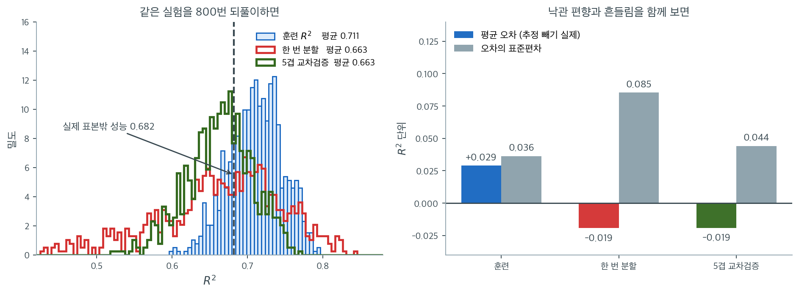

# sklearn LinearRegression 인터페이스

`statsmodels`가 통계적 추론을 위해 설계된 반면, scikit-learn의 `LinearRegression`은 예측을 위해 설계되었다. scikit-learn의 일관된 추정기 API — `fit`, `predict`, `score` — 를 따르며 라이브러리의 전처리, 파이프라인, 교차검증 도구와 매끄럽게 통합된다. 대가는 `sklearn`이 p값, 신뢰구간, 진단검정을 기본으로 제공하지 않는다는 점이다.

---

## 1. 기본 사용법

`LinearRegression` 클래스는 최소제곱으로 모형 $Y = \mathbf{X}\boldsymbol{\beta} + \varepsilon$을 적합한다. `statsmodels`와 달리 절편을 기본으로 자동 추가한다.

<div class="exbox" markdown>

**보기 1.** <span class="diff easy" title="쉬움"></span> 모형 적합과 계수. 참 절편이 $2.0$, 참 계수가 $(3.0,\ 1.5)$, 잡음이 $N(0, 0.5^2)$ 인 자료 $100$ 개를 만들어 `LinearRegression`으로 적합한다.

**(1)** `fit_intercept=True` 인 `LinearRegression`이 푸는 것은 $1$ 로 채운 열을 붙인 설계행렬의 정규방정식이다. 그 해를 손으로 구해 `intercept_`, `coef_`와 맞추시오.

**(2)** 추정값 $2.046,\ 3.095,\ 1.414$ 가 참값 $2.0,\ 3.0,\ 1.5$ 에서 벗어난 정도를 **표준오차의 몇 배**로 적으시오. 참 $\sigma = 0.5$ 를 알고 있으니 표준오차를 미리 계산할 수 있다.

</div>

??? success "풀이"

    **(1) 해석적으로.** `fit_intercept=True` 는 설계행렬에

    $$
    \mathbf{X}_{\text{design}} = [\,\mathbf{1} \;\; \mathbf{X}\,]
    $$

    처럼 $1$ 로 채운 열을 앞에 붙인 것과 같다. 최소제곱의 해는 정규방정식

    $$
    \hat{\boldsymbol\beta} = (\mathbf{X}_{\text{design}}^\top \mathbf{X}_{\text{design}})^{-1}\mathbf{X}_{\text{design}}^\top \mathbf{y}
    $$

    이고, sklearn 은 그 결과의 첫 성분을 `intercept_` 에, 나머지를 `coef_` 에 나누어 담는다. (실제로는 평균을 뺀 뒤 절편을 되살리는 방식으로 계산하지만 수학적으로 같다.)

    **(2) 표준오차.** $\varepsilon \sim N(0, \sigma^2 \mathbf{I})$ 이므로

    $$
    \operatorname{Var}(\hat{\boldsymbol\beta}) = \sigma^2 (\mathbf{X}_{\text{design}}^\top \mathbf{X}_{\text{design}})^{-1},
    \qquad
    \mathrm{SE}(\hat\beta_j) = \sigma \sqrt{\bigl[(\mathbf{X}_{\text{design}}^\top \mathbf{X}_{\text{design}})^{-1}\bigr]_{jj}}
    $$

    이다. 여기서 $\sigma = 0.5$ 가 **참값으로 주어져 있으므로** 자료의 잔차를 보지 않고도 표준오차를 계산할 수 있다.

    크기를 가늠해 두자. $X$ 의 두 열은 서로 독립인 표준정규이므로 $\mathbf{X}^\top\mathbf{X} \approx n\mathbf{I}$ 이고

    $$
    \mathrm{SE}(\hat\beta_j) \approx \frac{\sigma}{\sqrt{n}} = \frac{0.5}{10} = 0.05
    $$

    이다. 더 정확히는 $\mathrm{SE}(\hat\beta_j) \approx \sigma/(s_j\sqrt{n})$ 이어서, 그 열의 표본표준편차 $s_j$ 가 $1$ 보다 작으면 표준오차가 커진다.

    그러므로 추정값이 참값에서 $0.05$ 의 몇 배쯤 벗어나는 것이 정상이고, $3$ 배를 넘으면 뭔가 잘못된 것이다.

    ```python
    import numpy as np
    from sklearn.linear_model import LinearRegression

    # 참 계수가 [3.0, 1.5], 절편이 2.0 인 자료다.
    np.random.seed(42)
    n = 100
    X = np.random.randn(n, 2)
    beta_true = np.array([3.0, 1.5])
    y = X @ beta_true + 2.0 + np.random.randn(n) * 0.5

    # sklearn 은 절편을 자동으로 넣는다(fit_intercept 의 기본값이 True).
    # statsmodels 와 달리 1 로 채운 열을 붙일 필요가 없다.
    model = LinearRegression()
    model.fit(X, y)

    # 적합 뒤에 만들어지는 속성은 이름 끝에 밑줄이 붙는다. sklearn 의 관례다.
    print("Intercept:", model.intercept_)
    print("Coefficients:", model.coef_)
    ```

    출력:

    ```
    Intercept: 2.046396690621326
    Coefficients: [3.09536017 1.41392895]
    ```

    이제 정규방정식을 직접 풀고 표준오차를 계산한다.

    ```python
    X_design = np.column_stack([np.ones(n), X])
    beta_hat = np.linalg.solve(X_design.T @ X_design, X_design.T @ y)
    sklearn_beta = np.r_[model.intercept_, model.coef_]
    print("정규방정식 :", beta_hat)
    print("sklearn    :", sklearn_beta)
    print(f"최대 차이  = {np.abs(beta_hat - sklearn_beta).max():.3e}")

    XtX_inv = np.linalg.inv(X_design.T @ X_design)
    se = 0.5 * np.sqrt(np.diag(XtX_inv))          # 참 sigma = 0.5 를 쓴다
    true = np.r_[2.0, beta_true]
    print(f"SE (참 sigma=0.5) = {se.round(5)},   sigma/sqrt(n) = {0.5 / np.sqrt(n):.5f}")
    print(f"X 열의 표본표준편차 = {X.std(axis=0, ddof=1).round(4)}")
    print(f"(추정 - 참)/SE   = {((beta_hat - true) / se).round(3)}")
    ```

    출력:

    ```
    정규방정식 : [2.04639669 3.09536017 1.41392895]
    sklearn    : [2.04639669 3.09536017 1.41392895]
    최대 차이  = 1.332e-15
    SE (참 sigma=0.5) = [0.05049 0.05871 0.05034],   sigma/sqrt(n) = 0.05000
    X 열의 표본표준편차 = [0.8563 0.9989]
    (추정 - 참)/SE   = [ 0.919  1.624 -1.71 ]
    ```

    **(1) 정규방정식과 sklearn 이 같다.** 최대 차이가 $1.3 \times 10^{-15}$ 로 배정밀도의 반올림 한계다. `LinearRegression` 이 하는 일은 결국 이 한 줄이며, 다른 알고리즘이 아니다.

    **(2) 세 벗어남이 모두 $2$ 표준오차 안에 있다.** $0.919$, $1.624$, $-1.710$ 이다. 가장 큰 것이 $1.71$ 이니 흔히 보는 크기다. **"추정값이 $3.095$ 로 참값 $3.0$ 보다 크다" 는 사실 자체는 아무것도 뜻하지 않는다.** 표준오차 $0.0587$ 로 나누어 $1.62$ 라는 것을 보아야 한다.

    표준오차의 크기도 유도한 대로다. $\sigma/\sqrt{n} = 0.05$ 라고 가늠했고, 실제 값은 $0.0505, 0.0587, 0.0503$ 이다. 둘째 것만 눈에 띄게 크다. 그 까닭은 바로 아래 줄에 있다. $X$ 의 첫째 열의 표본표준편차가 $0.8563$ 으로 $1$ 보다 작아서다. $0.5/(0.8563 \cdot 10) = 0.0584$ 로 $0.0587$ 에 거의 맞는다. **설명변수가 덜 퍼져 있으면 그 계수를 덜 정확하게 안다.**

    마지막으로 담는 자리. scikit-learn 은 절편을 `intercept_` 에, 기울기를 `coef_` 에 **따로** 담는다. statsmodels 가 둘을 한 배열에 담는 것과 다르며, 두 라이브러리를 오가며 쓸 때 자주 헷갈리는 지점이다. 또한 `X` 에 $1$ 로 채운 열을 붙이면 안 된다. 붙이면 그 열과 내부 절편이 완전 공선이 되어, 앞 절들에서 본 계수 폭주가 생긴다.

---

## 2. 예측

`predict` 메서드는 새 자료의 적합값을 계산한다.

<div class="exbox" markdown>

**보기 2.** <span class="diff easy" title="쉬움"></span> 예측하기. 새 입력 $(1.0,\ 0.5)$ 와 $(-0.5,\ 2.0)$ 의 예측값을 구한다.

**(1)** 두 예측값을 보기 1 의 계수로 **손으로** 계산하여 `predict`의 출력과 맞추시오.

**(2)** 두 점의 **레버리지**를 계산하여 어느 점의 예측이 더 불안한지 가리시오. 두 점이 훈련자료의 범위 안에 있는가.

</div>

??? success "풀이"

    **(1) 해석적으로.** 예측은 계수와의 내적에 절편을 더하는 것뿐이다.

    $$
    \hat y = \hat\beta_0 + \mathbf{x}^\top \hat{\boldsymbol\beta}_{1:2}
    $$

    보기 1 의 값을 넣으면 첫째 점은

    $$
    2.046397 + 3.095360 \cdot 1.0 + 1.413929 \cdot 0.5 = 2.046397 + 3.095360 + 0.706964 = 5.848721
    $$

    이고 둘째 점은

    $$
    2.046397 + 3.095360 \cdot (-0.5) + 1.413929 \cdot 2.0 = 2.046397 - 1.547680 + 2.827858 = 3.326575
    $$

    이다. `predict` 가 하는 일이 이 두 줄이다.

    **(2) 레버리지.** 적합값의 분산은

    $$
    \operatorname{Var}(\hat y(\mathbf{x})) = \sigma^2 \, \tilde{\mathbf{x}}^\top (\mathbf{X}_{\text{design}}^\top\mathbf{X}_{\text{design}})^{-1} \tilde{\mathbf{x}}
    = \sigma^2 h(\mathbf{x}),
    \qquad \tilde{\mathbf{x}} = \begin{pmatrix} 1 \\ \mathbf{x}\end{pmatrix}
    $$

    이고 $h(\mathbf{x})$ 를 레버리지라 부른다. 훈련점들의 레버리지 평균은 $p/n = 3/100 = 0.03$ 이다. 새 점의 $h$ 가 그보다 크면 **자료의 중심에서 먼 곳**이고 예측이 덜 믿을 만하다.

    두 점을 눈으로 보면 $(-0.5, 2.0)$ 이 원점에서 더 멀므로($\|\mathbf{x}\| = 2.06$ 대 $1.12$) 레버리지도 더 클 것이다.

    ```python
    y_pred_train = model.predict(X)

    # 새 자료로 예측할 때도 열의 개수와 순서가 훈련 때와 같아야 한다.
    X_new = np.array([[1.0, 0.5], [-0.5, 2.0]])
    y_pred_new = model.predict(X_new)
    print("Predictions:", y_pred_new)
    ```

    출력:

    ```
    Predictions: [5.84872133 3.3265745 ]
    ```

    ```python
    by_hand = model.intercept_ + X_new @ model.coef_
    print("sklearn :", model.predict(X_new))
    print("손계산  :", by_hand)
    print(f"최대 차이 = {np.abs(by_hand - model.predict(X_new)).max():.3e}")

    resid = y - model.predict(X)
    s2 = (resid ** 2).sum() / (n - 3)
    for x_new in X_new:
        xx = np.r_[1.0, x_new]
        h = xx @ XtX_inv @ xx
        print(f"  x = {x_new}  레버리지 h = {h:.5f}  (평균 p/n = {3 / n:.3f}),  "
              f"적합값의 SE = {np.sqrt(s2 * h):.4f}")
    print(f"훈련자료 X 의 범위: {X.min(axis=0).round(3)} ~ {X.max(axis=0).round(3)}")
    ```

    출력:

    ```
    sklearn : [5.84872133 3.3265745 ]
    손계산  : [5.84872133 3.3265745 ]
    최대 차이 = 0.000e+00
      x = [1.  0.5]  레버리지 h = 0.02896  (평균 p/n = 0.030),  적합값의 SE = 0.0910
      x = [-0.5  2. ]  레버리지 h = 0.05179  (평균 p/n = 0.030),  적합값의 SE = 0.1217
    훈련자료 X 의 범위: [-2.62  -1.988] ~ [1.886 2.72 ]
    ```

    **(1) 손계산과 `predict` 가 정확히 같다.** 차이가 $0$ 이다(반올림 오차조차 없다). 유도한 $5.848721$ 과 $3.326575$ 가 출력의 $5.84872133$, $3.3265745$ 다.

    **(2) 둘째 점이 두 배 가까이 불안하다.** 레버리지가 $0.02896$ 대 $0.05179$ 이고, 적합값의 표준오차가 $0.0910$ 대 $0.1217$ 이다. 예측한 대로 원점에서 먼 점이 더 크다. 첫째 점은 평균 레버리지 $0.03$ 과 거의 같으니 **자료의 중심에 놓인 전형적인 점**이다.

    두 점 모두 훈련자료의 범위 안에 있다. 첫째 좌표의 범위가 $[-2.620,\ 1.886]$, 둘째가 $[-1.988,\ 2.720]$ 이므로 $1.0, 0.5$ 와 $-0.5, 2.0$ 이 다 들어간다. **외삽이 아니다.** 다만 변수별 범위에 들어간다는 것과 자료의 중심에 가깝다는 것은 다른 이야기이고, 레버리지가 그 차이를 잰다.

    표준오차 $0.09 \sim 0.12$ 는 **적합값**의 것이고 새 관측값의 예측구간은 더 넓다. 거기에는 새 관측의 잡음 $\sigma$ 가 더해져 $\sqrt{s^2(1 + h)} \approx 0.54$ 가 된다. 곧 $0.09$ 와 $0.54$ 는 다른 질문의 답이다.

    실무의 주의 하나. `predict` 는 **2차원 배열**을 받으므로 관측값이 하나여도 `[[x1, x2]]` 모양으로 넣어야 한다. 열의 개수와 **순서**가 훈련 때와 같아야 하며, pandas `DataFrame` 으로 적합했다면 열 이름까지 맞추는 것이 안전하다.

---

## 3. 모형 성능 평가

`score` 메서드는 주어진 자료에서의 $R^2$를 돌려준다.

<div class="exbox" markdown>

**보기 3.** <span class="diff easy" title="쉬움"></span> 결정계수. `score`가 돌려주는 훈련 $R^2$ 를 본다.

**(1)** 참 모형을 알고 있으므로 **모집단 $R^2$** 를 해석적으로 구하시오. 참 $\beta$ 를 그대로 써도 넘을 수 없는 값이다.

**(2)** 관측된 훈련 $R^2 = 0.9706$ 이 그 값보다 작다. 두 가지 까닭을 수로 가려내시오.

</div>

??? success "풀이"

    **(1) 해석적으로.** 참 모형은

    $$
    y = 2 + 3X_1 + 1.5X_2 + \varepsilon,
    \qquad X_1, X_2 \stackrel{\text{iid}}{\sim} N(0,1),
    \quad \varepsilon \sim N(0, 0.5^2)
    $$

    이다. 세 항이 서로 독립이므로 분산이 쪼개진다. 절편은 상수여서 분산에 들어가지 않는다.

    $$
    \operatorname{Var}(y) = 3^2 \cdot 1 + 1.5^2 \cdot 1 + 0.25 = 9 + 2.25 + 0.25 = 11.5
    $$

    설명할 수 있는 몫은 $\varepsilon$ 을 뺀 $11.25$ 이므로

    $$
    R^2_{\text{pop}} = \frac{11.25}{11.5} = 0.978261
    $$

    **$0.9783$ 이 모집단의 천장이다.**

    **(2) 떨어질 수 있는 두 길.** 관측값이 천장보다 **작다**면 길은 두 가지다.

    첫째, 추정한 $\hat\beta$ 가 참 $\beta$ 와 달라서. 이 몫은 $n$ 이 커지면 사라진다.

    둘째, **이 표본이 모집단과 달라서.** 천장 자체가 표본마다 흔들린다. 실현된 신호의 분산 $\widehat{\operatorname{Var}}(\mathbf{X}\boldsymbol\beta)$ 와 실현된 잡음의 분산 $\widehat{\operatorname{Var}}(\boldsymbol\varepsilon)$ 로 다시 계산한 "이 표본의 천장"

    $$
    \frac{\widehat{\operatorname{Var}}(\mathbf{X}\boldsymbol\beta)}{\widehat{\operatorname{Var}}(\mathbf{X}\boldsymbol\beta) + \widehat{\operatorname{Var}}(\boldsymbol\varepsilon)}
    $$

    이 $0.9783$ 과 다를 수 있다. 어느 쪽이 더 큰 몫인지는 수로 가린다.

    반대 방향도 짚어 두자. **최소제곱은 이 표본에 맞추므로 참 $\beta$ 보다 이 표본에서 더 잘 맞는다.** 곧 훈련 $R^2$ 는 "참 $\beta$ 로 계산한 $R^2$" 보다 **크다**. 이것이 과적합의 가장 작은 형태다.

    ```python
    # 회귀 모형의 score 는 R^2 다. 분류 모형이면 정확도를 돌려준다.
    r2_train = model.score(X, y)
    print(f"R-squared (training): {r2_train:.4f}")
    ```

    출력:

    ```
    R-squared (training): 0.9706
    ```

    ```python
    print(f"훈련 R^2 = {model.score(X, y):.6f}")
    V_signal_pop = beta_true[0] ** 2 + beta_true[1] ** 2
    print(f"모집단 R^2 = {V_signal_pop} / ({V_signal_pop} + 0.25) = {V_signal_pop / (V_signal_pop + 0.25):.6f}")

    # 이 표본에서 실제로 실현된 신호와 잡음의 분산
    np.random.seed(42); _ = np.random.randn(n, 2); eps = np.random.randn(n) * 0.5
    V_signal = (X @ beta_true).var(ddof=1)
    print(f"이 표본에서  Var(X beta) = {V_signal:.4f} (참 11.25),  Var(eps) = {eps.var(ddof=1):.4f} (참 0.25)")
    print(f"이 표본의 상한 = {V_signal / (V_signal + eps.var(ddof=1)):.6f}")

    tss = ((y - y.mean()) ** 2).sum()
    rss_oracle = ((y - (X @ beta_true + 2.0)) ** 2).sum()
    print(f"참 beta 를 그대로 쓴 R^2 = {1 - rss_oracle / tss:.6f}")
    print(f"sigma 추정값 = sqrt(RSS/(n-3)) = {np.sqrt(s2):.4f}  (참 0.5)")
    ```

    출력:

    ```
    훈련 R^2 = 0.970625
    모집단 R^2 = 11.25 / (11.25 + 0.25) = 0.978261
    이 표본에서  Var(X beta) = 9.0931 (참 11.25),  Var(eps) = 0.2939 (참 0.25)
    이 표본의 상한 = 0.968689
    참 beta 를 그대로 쓴 R^2 = 0.969088
    sigma 추정값 = sqrt(RSS/(n-3)) = 0.5349  (참 0.5)
    ```

    **범인은 표본이다.** 이 표본에서 $X$ 가 실제로 만들어 낸 신호의 분산은 $9.0931$ 로 참값 $11.25$ 보다 $19\%$ 작고, 잡음의 분산은 $0.2939$ 로 참값 $0.25$ 보다 $18\%$ 크다. 둘 다 $R^2$ 를 내리는 방향이다. 다시 계산한 **이 표본의 천장은 $0.968689$** 이고, 모집단 값 $0.978261$ 보다 $0.0096$ 낮다.

    **그리고 관측된 $0.970625$ 는 그 천장보다 오히려 높다.** 어떻게 그럴 수 있는가. 유도의 마지막 단락이 답이다. 참 $\beta$ 를 그대로 써서 계산한 $R^2$ 가 $0.969088$ 인데, 최소제곱으로 적합한 $R^2$ 는 $0.970625$ 다. **최소제곱이 정답보다 이 표본에서 더 잘 맞는다.** 차이가 $0.0015$ 이니 외운 잡음의 양이 아주 적지만, 방향은 언제나 이쪽이다. 모수 $3$ 개를 관측값 $100$ 개에 맞췄으니 그만큼이다.

    정리하면 $0.9783$(모집단) $\to 0.9687$(이 표본의 천장) $\to 0.9691$(참 $\beta$) $\to 0.9706$(최소제곱)이다. 첫 걸음이 표본추출의 운, 마지막 걸음이 과적합이다.

    잡음의 크기도 되찾았다. $\sqrt{\mathrm{RSS}/(n-3)} = 0.5349$ 가 참 $\sigma = 0.5$ 와 $7\%$ 차이다. 이 표본의 실현된 잡음 표준편차($\sqrt{0.2939} = 0.542$)와는 $1\%$ 차이다.

    다른 척도가 필요하면 `sklearn.metrics` 를 쓴다.

<div class="exbox" markdown>

**보기 4.** <span class="diff easy" title="쉬움"></span> 여러 성능 측도. MAE, MSE, RMSE 를 같은 잔차에서 계산한다.

**(1)** $\mathrm{RMSE} \ge \mathrm{MAE}$ 가 **언제나** 성립함을 증명하고, 등호가 성립하는 때를 말하시오.

**(2)** 잔차가 정규분포라면 $\mathrm{MAE}/\mathrm{RMSE}$ 가 어떤 수에 가까워지는지 유도하고, 출력의 비와 맞추시오.

</div>

??? success "풀이"

    **(1) 코시-슈바르츠로 끝난다.** 잔차의 절대값을 $a_i = |y_i - \hat y_i| \ge 0$ 이라 하자.

    $$
    \mathrm{MAE} = \frac{1}{n}\sum_i a_i,
    \qquad
    \mathrm{RMSE} = \sqrt{\frac{1}{n}\sum_i a_i^2}
    $$

    코시-슈바르츠 부등식을 벡터 $(a_1, \ldots, a_n)$ 과 $(1, \ldots, 1)$ 에 쓰면

    $$
    \left(\sum_i a_i \cdot 1\right)^{\!2} \le \left(\sum_i a_i^2\right)\!\left(\sum_i 1^2\right) = n\sum_i a_i^2
    $$

    이고, 양변을 $n^2$ 으로 나누면

    $$
    \mathrm{MAE}^2 = \left(\frac{1}{n}\sum_i a_i\right)^{\!2} \le \frac{1}{n}\sum_i a_i^2 = \mathrm{RMSE}^2
    $$

    이다. 둘 다 음이 아니므로 $\mathrm{MAE} \le \mathrm{RMSE}$ 다. 같은 말을 확률로 하면 $(E|Z|)^2 \le E[Z^2]$, 곧 $\operatorname{Var}(|Z|) \ge 0$ 이다.

    **등호는 모든 $a_i$ 가 같을 때만** 성립한다. 코시-슈바르츠의 등호 조건이 두 벡터의 비례이고, 상대가 $(1,\ldots,1)$ 이므로 $a_1 = \cdots = a_n$ 이라는 뜻이다. 현실의 잔차가 모두 같은 크기일 수는 없으니 **실제로는 늘 엄격한 부등호**다.

    **(2) 정규잔차의 비.** $\varepsilon \sim N(0, \sigma^2)$ 이면 반정규분포의 평균이

    $$
    E|\varepsilon| = \sigma\sqrt{\frac{2}{\pi}}, \qquad \sqrt{E[\varepsilon^2]} = \sigma
    $$

    이므로

    $$
    \frac{\mathrm{MAE}}{\mathrm{RMSE}} \;\longrightarrow\; \sqrt{\frac{2}{\pi}} = 0.79788
    $$

    이다. $\sigma$ 가 약분되어 **잡음의 크기와 무관한 수**가 된다는 것이 요점이다. 그러므로 이 비는 잔차분포의 **모양**을 재는 눈금이다.

    - 비가 $0.798$ 근처면 잔차가 정규에 가깝다.
    - 비가 그보다 **작으면** 큰 잔차 몇 개가 RMSE 를 끌어올린 것이므로 꼬리가 두껍다는 신호다.
    - 비가 그보다 **크면** 잔차의 크기가 고르다는 뜻이다. 극단은 모두 같을 때의 $1$ 이다.

    ```python
    from sklearn.metrics import mean_absolute_error, mean_squared_error, root_mean_squared_error

    y_pred = model.predict(X)

    # 셋 다 작을수록 좋다. RMSE 는 단위가 반응과 같아 읽기 편하고,
    # MAE 는 이상치에 덜 휘둘린다.
    mae = mean_absolute_error(y, y_pred)
    mse = mean_squared_error(y, y_pred)
    rmse = root_mean_squared_error(y, y_pred)

    print(f"MAE:  {mae:.4f}")
    print(f"MSE:  {mse:.4f}")
    print(f"RMSE: {rmse:.4f}")
    ```

    출력:

    ```
    MAE:  0.4211
    MSE:  0.2775
    RMSE: 0.5268
    ```

    ```python
    print(f"RMSE^2 = {rmse ** 2:.6f},  MSE = {mse:.6f}")
    print(f"MAE / RMSE = {mae / rmse:.4f},   sqrt(2/pi) = {np.sqrt(2 / np.pi):.4f}")
    print(f"둘의 차이 = {abs(mae / rmse - np.sqrt(2 / np.pi)):.4f}")
    ```

    출력:

    ```
    RMSE^2 = 0.277509,  MSE = 0.277509
    MAE / RMSE = 0.7994,   sqrt(2/pi) = 0.7979
    둘의 차이 = 0.0015
    ```

    **(1)이 맞는다.** $\mathrm{MAE} = 0.4211 < 0.5268 = \mathrm{RMSE}$ 다. 그리고 $\mathrm{RMSE}^2 = 0.277509$ 가 $\mathrm{MSE}$ 와 소수 여섯째 자리까지 같다. 두 함수가 같은 양의 다른 표현일 뿐임을 확인한 셈이다.

    **(2)가 아주 잘 맞는다.** $\mathrm{MAE}/\mathrm{RMSE} = 0.7994$ 이고 유도한 $\sqrt{2/\pi} = 0.7979$ 와 차이가 $0.0015$, 비율로 $0.2\%$ 다. 잔차 $100$ 개로 잰 값이니 이 정도 흔들림은 당연하다.

    **이 일치가 뜻하는 것은 잔차가 정규에 가깝다는 것**이고, 자료를 `np.random.randn` 으로 만들었으니 그래야 한다. 실제 자료에서 이 비가 $0.6$ 쯤으로 나왔다면 몇몇 큰 잔차가 RMSE 를 혼자 밀어 올리고 있다는 뜻이므로, 이상치를 찾아보거나 MAE 를 쓰는 쪽을 고려해야 한다. **두 측도의 비 하나가 잔차 히스토그램을 그리지 않고도 꼬리를 알려 준다.**

!!! note "`root_mean_squared_error`는 scikit-learn 1.4부터"
    이 함수는 scikit-learn 1.4에서 추가되었다. 더 낮은 버전에서는 `mean_squared_error(y, y_pred, squared=False)`를 쓰거나 `np.sqrt(mean_squared_error(...))`로 직접 계산한다.

---

## 4. 훈련-검정 분할

표본 밖 성능을 추정하려면 적합하기 전에 자료를 나눈다.

<div class="exbox" markdown>

**보기 5.** <span class="diff easy" title="쉬움"></span> 훈련·시험 나누기. 자료의 $20\%$ 를 떼어 두고 $80$ 개로 적합한 뒤 떼어 둔 쪽에서 $R^2$ 를 잰다.

**(1)** 시험 $R^2 = 0.9855$ 가 훈련 $R^2$ 보다 **높다.** 그것이 "모형이 표본 밖에서 더 잘한다"는 뜻일 수 없는 까닭을 말하시오. 또 보기 3 의 $0.9706$ 과 바로 견주는 것이 왜 공정하지 않은가.

**(2)** 분할을 $200$ 번 다시 해서 시험 $R^2$ 의 흩어짐을 재고, 이 한 번의 값이 그 안에서 어디에 놓이는지 적으시오.

</div>

??? success "풀이"

    **(1) 두 가지를 분리해야 한다.**

    첫째, **견주는 대상이 어긋났다.** 보기 3 의 $0.9706$ 은 관측값 $100$ 개 **전부**로 적합한 모형의 훈련 $R^2$ 다. 여기의 모형은 $80$ 개로 적합한 다른 모형이다. 같은 모형의 훈련 $R^2$ 와 시험 $R^2$ 를 견주어야 한다.

    둘째, **기댓값으로 보면 훈련 쪽이 높아야 한다.** 최소제곱은 훈련자료의 잔차제곱합을 최소화하므로 그 자료에서는 반드시 유리하다. 식으로 적으면

    $$
    E[\mathrm{RSS}_{\text{train}}] = \sigma^2 (n_{\text{train}} - p),
    \qquad
    E[\mathrm{RSS}_{\text{test}}] \approx \sigma^2 n_{\text{test}}\Bigl(1 + \frac{p}{n_{\text{train}}}\Bigr)
    $$

    이다. 관측값당으로 고치면 훈련 쪽이 $1 - p/n_{\text{train}}$ 배, 시험 쪽이 $1 + p/n_{\text{train}}$ 배다. 그러므로 **시험오차가 훈련오차보다 크고 시험 $R^2$ 가 더 작은 것이 정상**이다.

    그런데 관측된 것은 반대다. 남은 설명은 하나뿐이다. **$n_{\text{test}} = 20$ 이라 시험 $R^2$ 가 크게 흔들린다.** 분모의 $\mathrm{TSS}_{\text{test}}$ 도 그 $20$ 개의 평균으로 계산되므로 분자와 분모가 함께 요동친다. 그 흩어짐을 재면 $0.9855$ 가 운인지 아닌지 가려진다. 닫힌 꼴로 적기 어려우니 모의실험으로 센다.

    **(2) 수치적으로.**

    ```python
    from sklearn.model_selection import train_test_split

    # 훈련자료에서 잰 성능은 과적합을 잡아내지 못한다. 그래서 자료를 나눈다.
    X_train, X_test, y_train, y_test = train_test_split(
        X, y, test_size=0.2, random_state=42
    )

    model = LinearRegression()
    model.fit(X_train, y_train)

    r2_test = model.score(X_test, y_test)
    print(f"R-squared (test): {r2_test:.4f}")
    ```

    출력:

    ```
    R-squared (test): 0.9855
    ```

    ```python
    scores = []
    for s in range(200):
        a, b, c, d = train_test_split(X, y, test_size=0.2, random_state=s)
        scores.append(LinearRegression().fit(a, c).score(b, d))
    scores = np.array(scores)

    print(f"이 분할에서 같은 모형의 훈련 R^2 = {model.score(X_train, y_train):.4f},  시험 R^2 = {r2_test:.4f}")
    print(f"200 번 다시 나눈 시험 R^2: 평균 {scores.mean():.4f}  표준편차 {scores.std(ddof=1):.4f}"
          f"  최소 {scores.min():.4f}  최대 {scores.max():.4f}")
    print(f"random_state=42 의 값은 평균에서 {(scores[42] - scores.mean()) / scores.std(ddof=1):+.2f} 표준편차")
    print(f"보기 3 의 훈련 R^2 0.9706 은 평균에서 {(0.970625 - scores.mean()) / scores.std(ddof=1):+.2f} 표준편차")
    ```

    출력:

    ```
    이 분할에서 같은 모형의 훈련 R^2 = 0.9664,  시험 R^2 = 0.9855
    200 번 다시 나눈 시험 R^2: 평균 0.9653  표준편차 0.0151  최소 0.9136  최대 0.9894
    random_state=42 의 값은 평균에서 +1.33 표준편차
    보기 3 의 훈련 R^2 0.9706 은 평균에서 +0.35 표준편차
    ```

    **(1)의 첫 지적이 수로 확인된다.** 같은 모형의 훈련 $R^2$ 는 $0.9706$ 이 아니라 **$0.9664$** 다. 관측값 $80$ 개로 적합했으니 $100$ 개로 적합한 것보다 낮다. 비교의 바른 짝은 $0.9664$ 대 $0.9855$ 다.

    **(2) 그 차이는 운이다.** 분할을 $200$ 번 다시 하면 시험 $R^2$ 가 평균 $0.9653$, 표준편차 $0.0151$ 로 나오고 범위가 $0.9136$ 에서 $0.9894$ 까지 **$0.076$ 폭**으로 벌어진다. `random_state=42` 가 준 $0.9855$ 는 평균에서 $+1.33$ 표준편차, 곧 운이 좋은 쪽이었다.

    평균 $0.9653$ 을 보면 이야기가 뒤집힌다. **시험 $R^2$ 의 평균이 훈련 $R^2$ $0.9664$ 보다 낮다.** 유도한 방향 그대로다. 과적합이 없다고 말할 수는 있지만, 그 근거는 "시험이 훈련보다 높다" 가 아니라 **"둘의 차이 $0.0011$ 이 분할 잡음 $0.0151$ 에 묻힌다"** 는 것이다.

    여기서 교훈이 하나 나온다. **$n_{\text{test}} = 20$ 짜리 한 번의 분할로 얻은 점수를 성능이라고 보고하면 안 된다.** 소수 넷째 자리까지 적어 둔 $0.9855$ 가 실은 $\pm 0.03$ 의 불확실성을 지닌 수다. 아래 보기 6 의 교차검증이 이 흔들림을 줄이는 방법이다.

    그래도 원칙은 바뀌지 않는다. 시험 $R^2$ 는 모형이 적합 과정에서 그 자료를 보지 않았으므로 **치우침이 없는** 추정이다. 문제는 치우침이 아니라 분산이다.

---

## 5. 교차검증

scikit-learn은 훈련-검정 분할의 반복을 자동화하는 교차검증 도구를 제공한다.

<div class="exbox" markdown>

**보기 6.** <span class="diff easy" title="쉬움"></span> 교차검증. `cross_val_score`로 5겹 교차검증 $R^2$ 를 구한다.

**(1)** 회귀에서 `cv=5`가 쓰는 분할 방식이 무엇인지 적고, 그 다섯 점수를 `KFold`로 직접 재현하시오. 어느 관측값이 어느 겹에 들어가는가.

**(2)** 출력의 `Std CV R-squared: 0.0054`가 **무엇의** 표준편차인지 가려내시오. 평균 $0.9683$ 의 불확실성으로 읽으면 어디가 틀리는가.

</div>

??? success "풀이"

    **(1) 섞지 않고 통째로 자른다.** `cross_val_score` 는 반응변수가 연속이면 `KFold` 를, 범주이면 `StratifiedKFold` 를 쓴다. 그리고 `KFold` 의 기본값이 **`shuffle=False`** 다. 그러므로 관측값 $100$ 개가 들어온 순서대로

    $$
    \{0, \ldots, 19\},\; \{20, \ldots, 39\},\; \{40, \ldots, 59\},\; \{60, \ldots, 79\},\; \{80, \ldots, 99\}
    $$

    다섯 토막으로 끊긴다. 겹 $k$ 를 검증에 쓰고 나머지 $80$ 개로 적합하는 일을 다섯 번 되풀이한다.

    **이것이 함정이 될 수 있다.** 자료가 시간순이거나 집단별로 정렬되어 있으면, 섞지 않은 겹은 "앞 $80\%$ 로 배워 뒤 $20\%$ 를 맞히라" 는 전혀 다른 문제가 된다. 여기서는 `np.random.randn` 으로 만든 자료라 순서에 뜻이 없어 괜찮다.

    **(2) 겹 사이의 표준편차다.** `cv_scores.std()` 는 다섯 점수가 서로 흩어진 정도이며, 평균의 정밀도가 아니다. 독립인 다섯 수의 평균이라면 평균의 표준오차는

    $$
    \mathrm{SE}(\bar s) = \frac{s}{\sqrt{5}}
    $$

    이므로 $0.0054/\sqrt{5} \approx 0.0024$ 쪽이 평균의 불확실성에 가깝다. **$0.0054$ 를 "평균 $0.9683 \pm 0.0054$" 로 읽으면 두 배 넘게 부풀린 셈**이다.

    다만 $\sqrt{5}$ 로 나누는 것도 정확하지는 않다. 다섯 겹의 훈련집합이 서로 $60$ 개를 공유하므로 점수들이 **독립이 아니다.** 양의 상관이 있으면 평균의 분산이 $s^2/5$ 보다 커진다. 그러므로 참값은 $0.0024$ 와 $0.0054$ 사이에 있다고 말하는 것이 옳다. 교차검증 점수의 표준오차를 제대로 쓰기 어렵다는 것이 널리 알려진 사정이다.

    ```python
    from sklearn.model_selection import cross_val_score

    # 한 번 나누는 것보다 낫다. 모든 관측값이 한 번씩 검증에 쓰이고,
    # 겹마다의 점수가 흩어진 정도까지 알려 준다.
    model = LinearRegression()
    cv_scores = cross_val_score(model, X, y, cv=5, scoring='r2')

    print(f"CV R-squared scores: {cv_scores}")
    print(f"Mean CV R-squared: {cv_scores.mean():.4f}")
    print(f"Std CV R-squared: {cv_scores.std():.4f}")
    ```

    출력:

    ```
    CV R-squared scores: [0.96022772 0.96777464 0.9761083  0.96564245 0.97171516]
    Mean CV R-squared: 0.9683
    Std CV R-squared: 0.0054
    ```

    ```python
    from sklearn.model_selection import KFold
    from sklearn.metrics import r2_score

    kf = KFold(n_splits=5)          # 기본값은 shuffle=False
    manual = []
    for train_idx, test_idx in kf.split(X):
        m = LinearRegression().fit(X[train_idx], y[train_idx])
        manual.append(r2_score(y[test_idx], m.predict(X[test_idx])))
    manual = np.array(manual)

    print("cross_val_score :", cv_scores)
    print("손으로 KFold    :", manual)
    print(f"최대 차이 = {np.abs(manual - cv_scores).max():.3e}")
    for i, (_, test_idx) in enumerate(kf.split(X)):
        print(f"  겹 {i}: 검증 색인 {test_idx.min()}~{test_idx.max()} ({len(test_idx)}개)")
    print(f"겹 사이 표준편차 = {cv_scores.std():.4f},  평균의 표준오차 = {cv_scores.std(ddof=1) / np.sqrt(5):.4f}")
    ```

    출력:

    ```
    cross_val_score : [0.96022772 0.96777464 0.9761083  0.96564245 0.97171516]
    손으로 KFold    : [0.96022772 0.96777464 0.9761083  0.96564245 0.97171516]
    최대 차이 = 0.000e+00
      겹 0: 검증 색인 0~19 (20개)
      겹 1: 검증 색인 20~39 (20개)
      겹 2: 검증 색인 40~59 (20개)
      겹 3: 검증 색인 60~79 (20개)
      겹 4: 검증 색인 80~99 (20개)
    겹 사이 표준편차 = 0.0054,  평균의 표준오차 = 0.0027
    ```

    **(1) 다섯 점수가 정확히 재현된다.** 최대 차이가 $0$ 이다. 겹의 경계도 유도한 대로 $0$–$19$, $20$–$39$, …, $80$–$99$ 로 **연속한 토막**이다. `cross_val_score` 에 숨은 마법이 없음을 확인한 셈이고, 섞기가 필요하면 `KFold(n_splits=5, shuffle=True, random_state=0)` 를 `cv` 에 직접 넘겨야 한다.

    **(2) 평균의 표준오차는 $0.0027$ 이다.** 보고된 $0.0054$ 의 절반이다. $\sqrt{5} = 2.24$ 로 나눈 결과이며, 유도한 $0.0024$ 와 조금 다른 것은 분모를 $n-1$ 로 쓴 표본표준편차를 썼기 때문이다.

    보기 5 와 견주면 교차검증의 값어치가 보인다. 한 번 분할의 시험 $R^2$ 는 분할마다 표준편차 $0.0151$ 로 흔들렸다. 교차검증의 겹 사이 표준편차는 $0.0054$ 이고 그 평균의 흔들림은 더 작다. **모든 관측값을 한 번씩 검증에 쓰고 다섯 점수를 평균하므로 분할의 운이 상쇄된다.**

    남은 주의 하나. 교차검증 평균 $0.9683$ 도 **그 모형을 고르는 데 쓰였다면 낙관적이 된다.** 여러 모형의 CV 점수를 비교해 가장 좋은 것을 고른 뒤 그 점수를 일반화 성능으로 보고하면 선택 편의가 섞인다. 고르는 것과 평가하는 것은 다른 자료로 해야 한다.

    `scoring` 인자는 scikit-learn 의 어떤 채점기도 받는다. 회귀에서 흔한 선택은 `'r2'`, `'neg_mean_squared_error'`, `'neg_mean_absolute_error'` 이다. "neg" 접두사가 붙는 것은 점수가 높을수록 좋다는 scikit-learn 의 관례 때문이며, 그래서 오차 척도에 음수를 붙인다.

### 왜 한 번 나누는 것으로는 부족한가



세 가지 채점 방식이 실제로 무엇을 재는지 모의실험으로 확인해 보자. 관측값 $200$개, 설명변수 $8$개(그중 셋만 진짜 효과가 있다)로 회귀를 적합하고, **따로 만든 아주 큰 자료에서 그 모형의 실제 표본밖 $R^2$을 잰다.** 그 값이 우리가 추정하려는 목표다. 이 실험을 $800$번 되풀이했다.

왼쪽 히스토그램이 결과다. 실제 표본밖 성능은 평균 $0.682$인데(검은 점선), 훈련 $R^2$(파랑)은 평균 $0.711$로 **언제나 오른쪽으로 치우쳐 있다.** 같은 자료로 계수를 정하고 같은 자료로 점수를 매겼으니 당연한 일이다. 한 번 분할(빨강)과 5겹 교차검증(초록)은 둘 다 평균 $0.663$으로 목표 근처에 있다. 약간 낮은 것은 훈련에 쓰는 자료가 줄었기 때문이다.

차이는 폭에 있다. 오른쪽 막대가 각 방식의 오차(추정값 빼기 실제값)를 정리한 것이다. 평균 오차는 훈련이 $+0.029$, 한 번 분할과 교차검증이 각각 $-0.019$로 비슷하다. 그런데 오차의 표준편차가 훈련 $0.036$, 한 번 분할 $0.085$, 교차검증 $0.044$로 **한 번 분할이 교차검증의 두 배 가까이 흔들린다.** 검정자료가 $50$개뿐이라 그 $50$개를 어떻게 뽑았느냐에 점수가 크게 좌우되기 때문이다. 교차검증은 모든 관측값을 한 번씩 검증에 쓰고 다섯 점수를 평균하므로 그 운을 상쇄한다.

그래서 `train_test_split` 한 번으로 얻은 점수를 모형의 성능이라고 보고하는 것은 위험하다. 운이 좋으면 실제보다 $0.1$ 높게, 나쁘면 $0.1$ 낮게 나올 수 있다. 모형 둘을 비교할 때는 특히 그렇다. **차이가 우연인지 실제인지 구별하려면 겹마다의 점수 흩어짐까지 보아야 하고**, 위 보기가 `cv_scores.std()`를 함께 찍는 이유가 여기에 있다.

---

## 6. 파이프라인

파이프라인은 전처리와 모형화 단계를 하나의 객체로 엮어, 훈련과 예측에서 변환이 일관되게 적용되도록 보장한다.

<div class="exbox" markdown>

**보기 7.** <span class="diff easy" title="쉬움"></span> 파이프라인. 표준화 → 이차 다항 특성 → 선형회귀를 하나의 객체로 엮어 적합한다.

**(1)** `PolynomialFeatures(degree=2, include_bias=False)`가 입력 $p = 2$ 개에서 만드는 **특성의 개수**를 세고 이름을 적으시오.

**(2)** 세 단계 가운데 `StandardScaler`는 선형회귀의 예측을 **전혀** 바꾸지 못한다. 그것을 증명하고 수로 확인하시오. 그러면 시험 $R^2$ 가 보기 5 보다 조금 오른 것은 무엇의 몫인가.

</div>

??? success "풀이"

    **(1) 특성은 5 개다.** 차수 $2$ 의 단항식은 일차항과 이차항으로 나뉜다. 일차항은 $x_1, \ldots, x_p$ 로 $p$ 개, 이차항은 $x_i x_j$ ($i \le j$) 의 꼴이므로 중복을 허용한 조합의 수

    $$
    \binom{p+1}{2} = \frac{p(p+1)}{2}
    $$

    개다. 합하면

    $$
    p + \frac{p(p+1)}{2} = 2 + 3 = 5
    $$

    이고, 이름은 $x_0,\ x_1,\ x_0^2,\ x_0 x_1,\ x_1^2$ 이다. `include_bias=False` 이므로 상수항 $1$ 은 빠지고, 그것은 `LinearRegression` 이 절편으로 넣는다. 그러므로 모수가 $5 + 1 = 6$ 개이고, 보기 5 의 $3$ 개보다 세 개 많다.

    **(2) 표준화는 예측을 바꾸지 못한다.** `StandardScaler` 가 하는 일은 열마다

    $$
    \tilde x_j = \frac{x_j - \bar x_j}{s_j}
    $$

    이다. 벡터로 쓰면 $\tilde{\mathbf{x}} = \mathbf{D}^{-1}(\mathbf{x} - \bar{\mathbf{x}})$ 이고 $\mathbf{D} = \operatorname{diag}(s_1, \ldots, s_p)$ 는 가역이다. 설계행렬로는

    $$
    \tilde{\mathbf{X}}_{\text{design}} = [\,\mathbf{1} \;\; \tilde{\mathbf{X}}\,]
    = [\,\mathbf{1} \;\; \mathbf{X}\,]
      \underbrace{\begin{pmatrix} 1 & -\bar{\mathbf{x}}^\top \mathbf{D}^{-1} \\ \mathbf{0} & \mathbf{D}^{-1}\end{pmatrix}}_{=\ \mathbf{A}}
    $$

    이고 $\mathbf{A}$ 가 **가역**이다. 가역행렬을 오른쪽에 곱하는 것은 열공간을 바꾸지 않으므로

    $$
    \mathcal{C}(\tilde{\mathbf{X}}_{\text{design}}) = \mathcal{C}(\mathbf{X}_{\text{design}})
    $$

    이다. 최소제곱의 적합값은 $\mathbf{y}$ 를 **열공간에 사영한 것**이므로 같은 값이 나온다. 계수만 $\hat{\boldsymbol\beta}_{\text{new}} = \mathbf{A}^{-1}\hat{\boldsymbol\beta}$ 로 다시 표현된다.

    그러므로 **표준화는 계수의 해석과 벌점(릿지, 라쏘)에서만 뜻을 가진다.** 보통의 OLS 예측에는 아무 영향이 없다.

    남은 차이는 `PolynomialFeatures` 의 몫이다. 모수를 $3$ 개에서 $6$ 개로 늘렸으니 시험 $R^2$ 가 오르든 내리든 그 셋 때문이다.

    ```python
    from sklearn.pipeline import Pipeline
    from sklearn.preprocessing import StandardScaler, PolynomialFeatures

    # 파이프라인은 전처리와 모형을 하나로 묶는다. 교차검증에 넣으면 각 겹에서
    # 표준화가 훈련 부분만 보고 이뤄지므로, 검증자료의 정보가 새지 않는다.
    # 전처리를 미리 해 두고 나누면 이 누수가 조용히 일어난다.
    pipeline = Pipeline([
        ('scaler', StandardScaler()),
        ('poly', PolynomialFeatures(degree=2, include_bias=False)),
        ('regression', LinearRegression())
    ])

    pipeline.fit(X_train, y_train)
    r2_pipeline = pipeline.score(X_test, y_test)
    print(f"Pipeline R-squared (test): {r2_pipeline:.4f}")
    ```

    출력:

    ```
    Pipeline R-squared (test): 0.9858
    ```

    ```python
    poly = pipeline.named_steps['poly']
    print("만들어진 특성 :", poly.get_feature_names_out().tolist())
    print(f"특성 개수 = {poly.n_output_features_}   (p + p(p+1)/2 = 2 + 3 = 5)")
    print("회귀 계수    :", pipeline.named_steps['regression'].coef_.round(4))

    # 표준화만 넣은 파이프라인은 맨 OLS 와 완전히 같아야 한다.
    scale_only = Pipeline([('scaler', StandardScaler()),
                           ('regression', LinearRegression())]).fit(X_train, y_train)
    plain = LinearRegression().fit(X_train, y_train)
    print(f"표준화만 R^2 = {scale_only.score(X_test, y_test):.10f}")
    print(f"맨 OLS  R^2 = {plain.score(X_test, y_test):.10f}")
    print(f"예측의 최대 차이 = {np.abs(scale_only.predict(X_test) - plain.predict(X_test)).max():.3e}")
    print(f"이차항까지 넣은 R^2 = {pipeline.score(X_test, y_test):.10f}"
          f"  (이득 {pipeline.score(X_test, y_test) - plain.score(X_test, y_test):+.6f})")
    ```

    출력:

    ```
    만들어진 특성 : ['x0', 'x1', 'x0^2', 'x0 x1', 'x1^2']
    특성 개수 = 5   (p + p(p+1)/2 = 2 + 3 = 5)
    회귀 계수    : [ 2.6443e+00  1.3872e+00 -2.2000e-03  4.0100e-02 -2.0500e-02]
    표준화만 R^2 = 0.9854954588
    맨 OLS  R^2 = 0.9854954588
    예측의 최대 차이 = 3.553e-15
    이차항까지 넣은 R^2 = 0.9857604753  (이득 +0.000265)
    ```

    **(1)의 셈과 이름이 그대로 나왔다.** 특성 $5$ 개가 $x_0, x_1, x_0^2, x_0x_1, x_1^2$ 이다.

    **(2) 표준화는 소수 열째 자리까지 같은 $R^2$ 를 준다.** $0.9854954588$ 이 양쪽에서 똑같고, 예측값의 최대 차이가 $3.6 \times 10^{-15}$ 로 반올림 한계다. 유도한 "열공간이 같으므로 사영도 같다" 가 수치로 확인되었다.

    **이차항의 몫은 $+0.000265$ 다.** $0.9855 \to 0.9858$ 로 소수 넷째 자리에서 겨우 보인다. 모수 세 개를 더 썼는데 이것뿐인 까닭은 **참 모형이 선형**이기 때문이다. 계수를 보면 분명하다. 일차항이 $2.644$ 와 $1.387$ 인데 이차항 셋은 $-0.0022$, $0.0401$, $-0.0205$ 로 **두 자리 작다.** 자료가 "이차항은 필요 없다" 고 말한 것이다.

    보기 5 에서 본 분할 잡음 $0.0151$ 과 견주면 $0.000265$ 는 **잡음에 완전히 묻힌다.** 이 비교로 "다항 특성이 도움이 되었다" 고 말할 근거는 전혀 없다.

    끝으로 파이프라인을 쓰는 진짜 이유. 이 파이프라인은 각 설명변수를 평균 $0$, 분산 $1$ 로 표준화하고, 다음으로 교호작용 항을 포함한 다항 특성을 만들고, 마지막으로 선형회귀를 적합한다. 전체를 `cross_val_score` 에 넘기면 **각 겹에서 표준화가 그 겹의 훈련 부분만 보고** 이뤄진다. 전처리를 미리 해 두고 나누면 검증자료의 평균과 표준편차가 변환에 스며들어 **자료 누출**이 조용히 일어난다. 위에서 보았듯 OLS 에서는 표준화가 예측을 바꾸지 않으므로 그 누출이 해롭지 않지만, 릿지나 라쏘에서는 곧바로 낙관적인 점수로 나타난다.

!!! note "파이프라인이 중요한 이유"
    파이프라인 없이 작업하면 전체 자료로 계산한 훈련 통계량으로 검정자료를 표준화하거나 변환하는 실수(자료 누출)를 저지르기 쉽다. 파이프라인은 각 변환 단계를 그 시점에 사용 가능한 자료에만 적용하여 이를 막아 준다.

---

## 7. sklearn과 statsmodels 중 무엇을 쓸 것인가

| 작업 | 권장 라이브러리 |
|---|---|
| 계수에 대한 가설검정 | `statsmodels` |
| $\beta_j$의 신뢰구간 | `statsmodels` |
| 잔차 진단(정규성, 이분산) | `statsmodels` |
| AIC/BIC를 통한 모형 비교 | `statsmodels` |
| 새 자료에 대한 예측 | `sklearn` |
| 교차검증 기반 모형 평가 | `sklearn` |
| 전처리 파이프라인과의 통합 | `sklearn` |
| 정칙화 회귀(릿지, 라쏘) | `sklearn` |
| 고차원 자료 ($p > n$) | `sklearn` |

!!! tip "경쟁이 아니라 상호보완 관계이다"
    흔한 작업 흐름은 모형을 세우는 단계에서 `statsmodels`로 가설을 검정하고 진단을 살피고 설명변수를 고른 뒤, 예측 파이프라인에 배포하기 위해 최종 모형을 `sklearn`으로 다시 적합하는 것이다. 계수 추정값은 (둘 다 OLS를 쓰므로) 동일하며, 선택의 기준은 모형 주위에 어떤 도구가 필요한가이다.

## 연습문제

<div class="drillbox" markdown>

**연습문제 1.** <span class="diff med" title="중간"></span>
scikit-learn으로 인공자료에 선형회귀를 적합하고, 예측을 계산하며, $R^2$ 점수를 출력하는 Python 코드를 작성하라.

</div>

??? success "풀이"
    ```python
    import numpy as np
    from sklearn.linear_model import LinearRegression
    from sklearn.model_selection import train_test_split

    rng = np.random.default_rng(42)
    X = rng.normal(0, 1, (200, 3))
    y = 2 * X[:, 0] - 1.5 * X[:, 1] + 0.5 * X[:, 2] + rng.normal(0, 0.5, 200)

    X_train, X_test, y_train, y_test = train_test_split(X, y, test_size=0.2, random_state=42)

    model = LinearRegression()
    model.fit(X_train, y_train)

    print(f"Coefficients: {model.coef_.round(3)}")
    print(f"Intercept: {model.intercept_:.3f}")
    print(f"R^2 (test): {model.score(X_test, y_test):.4f}")
    ```

    출력:

    ```
    Coefficients: [ 2.012 -1.519  0.442]
    Intercept: -0.015
    R^2 (test): 0.9440
    ```

    참 계수가 $2, -1.5, 0.4$인데 추정값이 $2.012, -1.519, 0.442$로 잘 맞는다. 시험 자료의 $R^2$는 0.944다.

<div class="drillbox" markdown>

**연습문제 2.** <span class="diff med" title="중간"></span>
`model.score()`와 예측값에서 $R^2$를 직접 계산하는 것의 차이를 설명하라. 둘은 동등한가?

</div>

??? success "풀이"
    `model.score(X, y)`는 다음을 계산한다.

    $$
    R^2 = 1 - \frac{\sum(y_i - \hat{y}_i)^2}{\sum(y_i - \bar{y})^2}
    $$

    여기서 $\hat{y}_i$는 `model.predict(X)`이고 $\bar{y}$는 넘겨준 `y`의 평균이다. 이는 다음을 직접 계산하는 것과 동등하다.

    ```python
    y_pred = model.predict(X)
    ss_res = np.sum((y - y_pred) ** 2)
    ss_tot = np.sum((y - y.mean()) ** 2)
    r2 = 1 - ss_res / ss_tot
    ```

    `Pipeline`은 전처리와 모형을 하나로 묶는다. 교차검증에서 표준화를 훈련 겹 안에서만 계산하게 해 주므로 정보 누출을 막는다.

    둘은 수학적으로 동일하다. 다만 검정자료에 적용할 때 $\bar{y}$는 (훈련자료가 아니라) 검정자료의 평균이며, 그래서 모형이 나쁘게 적합하면 검정 $R^2$가 음수가 될 수 있다.

<div class="drillbox" markdown>

**연습문제 3.** <span class="diff med" title="중간"></span>
scikit-learn의 `LinearRegression`이 계수의 p값이나 신뢰구간을 제공하지 않는 이유는 무엇인가? 어떻게 얻을 수 있는가?

</div>

??? success "풀이"
    scikit-learn은 통계적 추론이 아니라 예측을 주된 목적으로 설계되었다. `LinearRegression`은 OLS를 기계학습 알고리즘으로 구현하며 `.fit()`, `.predict()`, `.score()`에 집중한다. 표준오차, t 통계량, p값, 신뢰구간은 계산하지 않는다.

    추론 통계량을 얻으려면

    1. **statsmodels 사용:** `import statsmodels.api as sm; model = sm.OLS(y, sm.add_constant(X)).fit(); print(model.summary())`가 p값, 신뢰구간, 진단 통계량을 담은 완전한 회귀표를 제공한다.
    2. **직접 계산:** $\hat{\boldsymbol{\beta}}$를 구한 뒤 $s^2 = \text{SSE}/(n-p)$($p$는 절편을 포함한 모수의 개수), $\text{SE}(\hat{\beta}_j) = s\sqrt{[(\mathbf{X}^\top\mathbf{X})^{-1}]_{jj}}$, $t_j = \hat{\beta}_j/\text{SE}(\hat{\beta}_j)$를 계산한다.

    예측 중심(sklearn)과 추론 중심(statsmodels) 도구가 나뉘어 있는 것은 모형과 알고리즘의 구분을 반영한다.

<div class="drillbox" markdown>

**연습문제 4.** <span class="diff med" title="중간"></span>
`sklearn.model_selection.cross_val_score`로 선형회귀 모형의 일반화 성능을 추정하는 방법을 기술하라.

</div>

??? success "풀이"
    ```python
    from sklearn.linear_model import LinearRegression
    from sklearn.model_selection import cross_val_score
    import numpy as np

    model = LinearRegression()
    scores = cross_val_score(model, X, y, cv=5, scoring="r2")

    print(f"CV R^2 scores: {scores.round(4)}")
    print(f"Mean R^2: {scores.mean():.4f} (+/- {scores.std():.4f})")
    ```

    출력:

    ```
    CV R^2 scores: [0.9531 0.9465 0.9701 0.9306 0.965 ]
    Mean R^2: 0.9530 (+/- 0.0140)
    ```

    5겹 교차검증의 $R^2$가 0.93에서 0.97 사이에 흩어져 있다. 한 번의 훈련/시험 분할로 얻은 값 하나만 보고하면 이 변동이 숨는다.

    `cross_val_score`는 내부에서 k-겹 교차검증을 수행한다. 자료를 `cv=5`개의 겹으로 나누고, 4개 겹으로 모형을 적합한 뒤 5번째 겹에서 평가하며, 모든 겹에 대해 반복한다. `scoring` 인자가 척도를 지정한다(선택지로 `"r2"`, `"neg_mean_squared_error"`, `"neg_mean_absolute_error"` 등이 있다).

    참고: sklearn은 점수가 클수록 좋다는 관례(채점기는 최대화되어야 한다)를 지키기 위해 음의 MSE(`neg_mean_squared_error`)를 쓴다.

---

## 정리하며

`scikit-learn` 은 **예측**을 위한 도구다.

- **API 가 일관적이다.** `fit`·`predict`·`score` 세 메서드로 모든 모형을 같은 방식으로 다루며, 파이프라인·교차검증·격자탐색과 매끄럽게 이어진다.
- **절편이 기본으로 들어간다.** `statsmodels` 와 반대이며, 둘을 오가며 쓰면 헷갈리기 쉽다.
- **$p$ 값과 신뢰구간을 주지 않는다.** 설계상의 선택이며, **추론이 필요하면 `statsmodels` 로 가야 한다.**
- **전처리를 파이프라인에 넣는다.** 표준화나 특성 생성을 `Pipeline` 안에 두어야 교차검증에서 자료 누출이 생기지 않는다.
- **둘을 함께 쓰는 것이 실무다.** 탐색과 모형 비교는 `sklearn`, 최종 모형의 계수 보고는 `statsmodels`.

**이것으로 13장이 끝난다.** 단순회귀에서 시작해 다중회귀와 그 추론, 네 가지 가정과 진단, 성능 척도와 모형선택, 스플라인·GAM 까지 보았다.

다음 장 **정규성 검정**으로 넘어간다. 이 장에서 여러 번 마주친 "잔차가 정규인가"라는 물음을 정면으로 다룬다.
