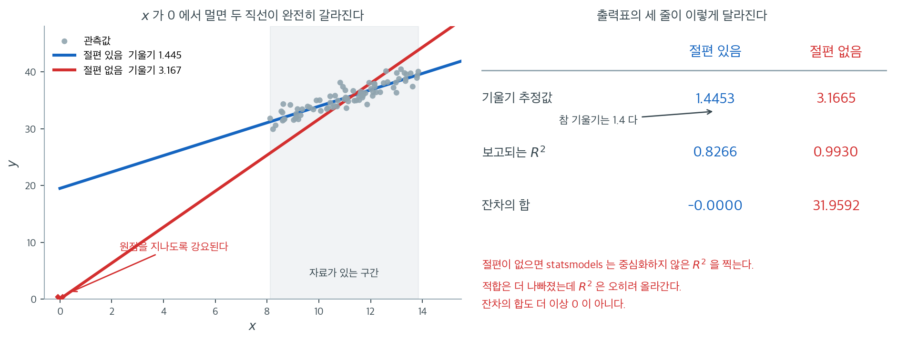

# statsmodels 최소제곱 인터페이스

`statsmodels` 라이브러리는 회귀에서 통계적 추론을 수행하는 Python의 대표적인 도구이다. 예측에 초점을 맞추는 기계학습 라이브러리와 달리 `statsmodels`는 계수 추정값, 표준오차, t 통계량, p값, 신뢰구간을 담은 상세한 요약표를 제공한다. 통계 분석에서 기대하는 표준적인 출력이다.

---

## 1. OLS 클래스

최소제곱 회귀의 핵심 인터페이스는 `statsmodels.api.OLS`이다. 이 클래스는 사용자가 설명변수 행렬에 상수(절편) 열을 명시적으로 추가할 것을 요구한다.

<div class="exbox" markdown>

**보기 1.** <span class="diff easy" title="쉬움"></span> OLS 적합과 출력표. 참 절편 $2.0$, 참 계수 $(3.0,\ 1.5)$, 잡음 $N(0, 0.5^2)$ 인 자료 $100$ 개에 `sm.OLS`를 적합하고 요약표를 인쇄한다.

**(1)** `std err`, `t`, `[0.025  0.975]` 세 열을 손으로 계산해 표와 맞추시오. 쓰는 재료는 잔차와 $(\mathbf{X}^\top\mathbf{X})^{-1}$ 뿐이다.

**(2)** 위 블록의 `F-statistic`, `Adj. R-squared`, `Log-Likelihood`, `AIC`, `BIC`, `Cond. No.` 를 모두 복원하시오. AIC 가 세는 모수의 개수는 몇인가.

</div>

??? success "풀이"

    **(1) 가운데 블록.** 오차가 $\varepsilon \sim N(0, \sigma^2\mathbf{I})$ 이면

    $$
    \widehat{\operatorname{Var}}(\hat{\boldsymbol\beta}) = s^2 (\mathbf{X}^\top\mathbf{X})^{-1},
    \qquad
    s^2 = \frac{\mathrm{RSS}}{n - p}
    $$

    이고 $p$ 는 절편을 포함한 모수의 개수다. 여기서는 $p = 3$, $n - p = 97$ 이다. 세 열은 차례로

    $$
    \mathrm{SE}(\hat\beta_j) = s\sqrt{[(\mathbf{X}^\top\mathbf{X})^{-1}]_{jj}},
    \qquad
    t_j = \frac{\hat\beta_j}{\mathrm{SE}(\hat\beta_j)},
    \qquad
    \hat\beta_j \pm t_{0.975,\,n-p}\,\mathrm{SE}(\hat\beta_j)
    $$

    이다. $t$ 열의 분모가 $\hat\beta_j - 0$ 인 것은 귀무가설이 $H_0: \beta_j = 0$ 이기 때문이다.

    **(2) 위 블록.** 전체 $F$ 검정은 "모든 기울기가 $0$" 을 검정하며 $R^2$ 로 적을 수 있다.

    $$
    F = \frac{R^2/(p-1)}{(1 - R^2)/(n-p)}
    $$

    조정 $R^2$ 는

    $$
    R^2_{\text{adj}} = 1 - (1 - R^2)\frac{n-1}{n-p}
    $$

    이다. 로그가능도는 정규 최대가능도에 $\hat\sigma^2 = \mathrm{RSS}/n$ 을 넣어 정리하면

    $$
    \log L = -\frac{n}{2}\left[\log(2\pi) + \log\frac{\mathrm{RSS}}{n} + 1\right]
    $$

    이 된다. 그리고

    $$
    \text{AIC} = -2\log L + 2k, \qquad \text{BIC} = -2\log L + k\log n
    $$

    인데 **$k$ 를 몇으로 세는지가 구현마다 다르다.** $\sigma^2$ 도 추정한 모수이니 $k = p + 1 = 4$ 로 셀 수도 있다. statsmodels 가 어느 쪽인지는 수로 가린다.

    `Cond. No.` 는 설계행렬의 조건수, 곧 최대 특이값과 최소 특이값의 비다.

    ```python
    import numpy as np
    import statsmodels.api as sm

    # 참 계수가 [3.0, 1.5], 절편이 2.0 인 자료다.
    np.random.seed(42)
    n = 100
    X = np.random.randn(n, 2)
    beta_true = np.array([3.0, 1.5])
    y = X @ beta_true + 2.0 + np.random.randn(n) * 0.5

    # statsmodels 는 절편을 자동으로 넣지 않는다. 이 줄을 빠뜨리면 원점을
    # 지나는 회귀가 되므로 sklearn 과의 가장 흔한 차이가 여기서 생긴다.
    X_with_const = sm.add_constant(X)

    # OLS(y, X) 순서다. sklearn 의 fit(X, y) 와 반대이니 헷갈리기 쉽다.
    model = sm.OLS(y, X_with_const)
    results = model.fit()

    def print_summary(res):
        """summary()에서 실행 날짜와 시각만 지우고 인쇄한다.

        statsmodels의 summary()는 표 머리에 Date와 Time을 함께 찍는다.
        그대로 두면 실행할 때마다 출력이 달라져 문서에 싣기 어렵다.
        같은 줄에 있는 다른 값(Prob (F-statistic), Log-Likelihood)은 남긴다.
        """
        lines = []
        for line in str(res.summary()).split("\n"):
            if line.startswith(("Date:", "Time:")):
                label, rest = line[:19], line[19:]
                lines.append(label.ljust(19) + " " * 19 + rest[19:])
            else:
                lines.append(line)
        print("\n".join(lines))

    print_summary(results)
    ```

    출력:

    ```
                                OLS Regression Results                            
    ==============================================================================
    Dep. Variable:                      y   R-squared:                       0.971
    Model:                            OLS   Adj. R-squared:                  0.970
    Method:                 Least Squares   F-statistic:                     1603.
    Date:                                   Prob (F-statistic):           4.97e-75
    Time:                                   Log-Likelihood:                -77.799
    No. Observations:                 100   AIC:                             161.6
    Df Residuals:                      97   BIC:                             169.4
    Df Model:                           2                                         
    Covariance Type:            nonrobust                                         
    ==============================================================================
                     coef    std err          t      P>|t|      [0.025      0.975]
    ------------------------------------------------------------------------------
    const          2.0464      0.054     37.884      0.000       1.939       2.154
    x1             3.0954      0.063     49.281      0.000       2.971       3.220
    x2             1.4139      0.054     26.258      0.000       1.307       1.521
    ==============================================================================
    Omnibus:                        4.136   Durbin-Watson:                   2.212
    Prob(Omnibus):                  0.126   Jarque-Bera (JB):                3.956
    Skew:                           0.266   Prob(JB):                        0.138
    Kurtosis:                       3.817   Cond. No.                         1.23
    ==============================================================================

    Notes:
    [1] Standard Errors assume that the covariance matrix of the errors is correctly specified.
    ```

    이제 표의 모든 수를 손으로 만들어 본다.

    ```python
    from scipy import stats

    p = X_with_const.shape[1]
    e = results.resid
    rss = (e ** 2).sum()
    s = np.sqrt(rss / (n - p))
    XtX_inv = np.linalg.inv(X_with_const.T @ X_with_const)

    se = s * np.sqrt(np.diag(XtX_inv))
    print(f"s = sqrt(RSS/(n-p)) = {s:.6f}")
    print("SE  손계산:", se.round(6), "  statsmodels:", results.bse.round(6))
    t = results.params / se
    print("t   손계산:", t.round(4), "  statsmodels:", results.tvalues.round(4))
    t_crit = stats.t.ppf(0.975, n - p)
    ci = np.column_stack([results.params - t_crit * se, results.params + t_crit * se])
    print(f"t 임계값 t_(0.975, {n - p}) = {t_crit:.5f},  신뢰구간 최대 차이 = {np.abs(ci - results.conf_int()).max():.3e}")

    R2 = results.rsquared
    print(f"F   손계산 = {(R2 / (p - 1)) / ((1 - R2) / (n - p)):.4f}   statsmodels = {results.fvalue:.4f}")
    print(f"adj 손계산 = {1 - (1 - R2) * (n - 1) / (n - p):.10f}   statsmodels = {results.rsquared_adj:.10f}")
    print(f"logL 손계산 = {-n / 2 * (np.log(2 * np.pi) + np.log(rss / n) + 1):.6f}   statsmodels = {results.llf:.6f}")
    print(f"AIC 손계산 = {-2 * results.llf + 2 * p:.6f}   statsmodels = {results.aic:.6f}")
    print(f"BIC 손계산 = {-2 * results.llf + p * np.log(n):.6f}   statsmodels = {results.bic:.6f}")
    print(f"조건수 손계산 = {np.linalg.cond(X_with_const):.4f}   statsmodels = {results.condition_number:.4f}")
    ```

    출력:

    ```
    s = sqrt(RSS/(n-p)) = 0.534875
    SE  손계산: [0.054017 0.06281  0.053847]   statsmodels: [0.054017 0.06281  0.053847]
    t   손계산: [37.8844 49.2813 26.2585]   statsmodels: [37.8844 49.2813 26.2585]
    t 임계값 t_(0.975, 97) = 1.98472,  신뢰구간 최대 차이 = 2.220e-16
    F   손계산 = 1602.5775   statsmodels = 1602.5775
    adj 손계산 = 0.9700195786   statsmodels = 0.9700195786
    logL 손계산 = -77.798698   statsmodels = -77.798698
    AIC 손계산 = 161.597396   statsmodels = 161.597396
    BIC 손계산 = 169.412907   statsmodels = 169.412907
    조건수 손계산 = 1.2339   statsmodels = 1.2339
    ```

    **(1) 세 열이 모두 맞는다.** $s = 0.534875$ 에서 출발해 표준오차 $(0.054017,\ 0.062810,\ 0.053847)$ 가 `std err` 열의 $0.054,\ 0.063,\ 0.054$ 와 같고, $t$ 값 $(37.8844,\ 49.2813,\ 26.2585)$ 가 표의 $37.884,\ 49.281,\ 26.258$ 과 같다. 신뢰구간의 최대 차이는 $2.2 \times 10^{-16}$ 으로 반올림 한계다.

    임계값 $t_{0.975,\,97} = 1.98472$ 가 $1.96$ 보다 조금 큰 것도 읽어 둘 만하다. 자유도 $97$ 이면 정규근사와 차이가 $1\%$ 남짓이다.

    **(2) 위 블록도 전부 맞는다.** $F = 1602.5775$, 조정 $R^2 = 0.9700195786$, $\log L = -77.798698$ 이 statsmodels 와 소수 자리까지 같다.

    **AIC 는 $k = 3$ 을 쓴다.** $-2\log L + 2 \cdot 3 = 161.597396$ 이 보고된 값과 같다. $k = 4$ 로 세면 $163.597$ 이 되어 맞지 않는다. 곧 **statsmodels 는 회귀계수만 세고 $\sigma^2$ 는 세지 않는다.** BIC 도 $-2\log L + 3\log 100 = 169.412907$ 로 같은 $k$ 를 쓴다.

    이 관례가 보편적이지 않다는 점이 중요하다. 같은 책 앞 절의 `pygam` 은 AIC 에 $\text{eDoF} + 1$ 을 썼다. 그러므로 **다른 패키지가 찍은 AIC 를 서로 견주면 안 된다.** AIC 는 모형들 사이의 **차이**만 뜻을 가지며, 그 차이가 옳으려면 같은 상수 규약으로 계산되어야 한다.

    `Cond. No.` $= 1.2339$ 도 재현되었다. 설명변수를 독립으로 만들었으므로 다중공선성이 없고, 그래서 조건수가 $1$ 에 가깝다. 이 값이 $30$ 을 넘으면 공선성을 의심한다.

    아래 블록은 보기 4 에서 다룬다. Durbin-Watson $2.21$ 은 자기상관 없음을, Jarque-Bera $p = 0.138$ 은 정규성 이탈의 증거 없음을 뜻한다.

`sm.add_constant(X)` 함수는 설명변수 행렬 앞에 1로 채운 열을 붙인다. 이는 모형 $Y = \beta_0 + \beta_1 X_1 + \beta_2 X_2 + \varepsilon$의 절편항 $\beta_0$에 대응한다.

!!! warning "상수를 빠뜨리면"
    `sm.add_constant()`를 호출하지 않고 `X`를 그대로 넘기면 모형이 원점을 지나는 회귀(절편 없음)를 적합한다. 이는 거의 언제나 원하는 바가 아니다. 절편을 의도적으로 없앨 특별한 이유가 없다면 항상 상수를 추가하라.

---

### add_constant 를 빠뜨리면



위 코드에서 `sm.add_constant(X)` 한 줄이 왜 그렇게 강조되는지 보자. 참 모형이 $y = 20 + 1.4x + \varepsilon$이고 $x$가 $8$과 $14$ 사이에 있는 자료 $80$개를 두 가지로 적합했다.

왼쪽 그림에서 두 직선은 회색 음영으로 표시한 자료 구간 안에서 얼핏 비슷해 보인다. 그러나 붉은 직선은 **원점을 반드시 지나야 한다**는 제약을 받고 있고, 그래서 자료를 지나가려면 기울기를 훨씬 가파르게 세울 수밖에 없다. 기울기가 $3.167$로 참값 $1.4$의 **두 배가 넘는다.** 절편을 넣은 파란 직선은 절편 $19.482$, 기울기 $1.445$로 참값 $(20,\ 1.4)$을 제대로 맞힌다. 이것이 `add_constant`를 빠뜨렸을 때 계수 해석이 통째로 무너지는 이유다. $x$가 $0$ 근처에 오는 자료였다면 차이가 작았겠지만, 나이·소득·면적처럼 $0$에서 멀리 떨어진 변수에서는 언제나 이렇게 크게 어긋난다.

오른쪽이 더 위험한 대목이다. 출력표에 찍히는 $R^2$이 $0.827$에서 $0.993$으로 **올라간다.** 적합이 나빠졌는데 지표가 좋아지는 것은 `statsmodels`가 절편 없는 모형에서 중심화하지 않은 $R^2$, 곧 $1 - \sum e_i^2 / \sum y_i^2$을 찍기 때문이다. 분모가 $\sum (y_i - \bar{y})^2$가 아니라 $\sum y_i^2$이므로 $y$의 평균이 클수록 저절로 $1$에 가까워진다. 잔차의 합도 신호를 준다. 절편이 있으면 정규방정식이 $\sum e_i = 0$을 보장하지만, 절편이 없으면 $31.96$으로 $0$에서 한참 벗어난다.

실전에서 이 실수를 잡아내는 방법은 간단하다. **요약표의 첫 행에 `const`가 있는지 확인하는 것**이다. 없는데 $R^2$이 $0.99$처럼 수상하게 높다면 거의 틀림없이 절편을 빠뜨린 것이다. `smf.ols('y ~ x', data=df)` 식 API를 쓰면 절편이 자동으로 들어가므로 이 함정 자체가 사라진다. `sklearn`의 `LinearRegression`도 기본값이 `fit_intercept=True`라 같은 문제가 없다.

---

## 2. 요약표 읽기

`results.summary()` 출력은 세 개의 패널로 이루어진다. 가장 중요한 항목은 다음과 같다.

### 위 패널 (모형 정보)

| 항목 | 의미 |
|---|---|
| R-squared | 설명된 분산의 비율 ($R^2$) |
| Adj. R-squared | 설명변수 개수를 반영해 조정한 $R^2$ |
| F-statistic | 회귀의 유의성에 대한 전체 F 검정 |
| Prob (F-statistic) | F 검정의 p값 |
| AIC / BIC | 모형 비교를 위한 정보기준 |

### 가운데 패널 (계수)

| 열 | 의미 |
|---|---|
| coef | 추정된 회귀계수 $\hat{\beta}_j$ |
| std err | $\hat{\beta}_j$의 표준오차 |
| t | t 통계량: $t = \hat{\beta}_j / \text{SE}(\hat{\beta}_j)$ |
| P>\|t\| | $H_0: \beta_j = 0$에 대한 양측 p값 |
| [0.025, 0.975] | $\beta_j$의 95% 신뢰구간 |

p값이 0.05보다 작으면, 동등하게 95% 신뢰구간이 0을 포함하지 않으면 그 설명변수는 유의수준 5%에서 통계적으로 유의하다.

### 아래 패널 (진단)

| 항목 | 의미 |
|---|---|
| Omnibus / Prob(Omnibus) | 잔차의 정규성 검정 |
| Durbin-Watson | 잔차의 자기상관 검정(2에 가까우면 자기상관 없음) |
| Jarque-Bera / Prob(JB) | 왜도와 첨도에 기초한 또 다른 정규성 검정 |
| Cond. No. | 설계행렬의 조건수(값이 크면 다중공선성을 시사) |

---

## 3. 식(formula) API

`statsmodels`의 식 API는 `patsy` 식을 이용해 R과 비슷한 문법을 제공한다. 이 인터페이스는 절편을 자동으로 추가하고 범주형 변수를 알아서 처리한다.

<div class="exbox" markdown>

**보기 2.** <span class="diff easy" title="쉬움"></span> 수식 API. 같은 자료를 `smf.ols('y ~ x1 + x2', data=df)` 로 적합한다.

**(1)** 두 API 가 "완전히 같은 결과" 를 준다는 말을 **설계행렬 수준에서** 설명하고, 어느 양까지 같은지 수로 확인하시오.

**(2)** 식 `'y ~ x1 + x2 - 1'` 은 절편을 없앤다. 그때 statsmodels 가 찍는 $R^2$ 의 **정의가 달라진다.** 그 정의를 적고 수로 확인하시오.

</div>

??? success "풀이"

    **(1) 설계행렬이 같으면 모든 것이 같다.** patsy 는 식 `y ~ x1 + x2` 를 보고 절편 열 하나와 `x1`, `x2` 열을 이어 붙인 행렬을 만든다. `sm.add_constant(X)` 가 만드는 것과 **원소 하나까지 같은 행렬**이다. 열의 순서도 절편이 맨 앞이라 같다.

    최소제곱의 모든 산출물($\hat{\boldsymbol\beta}$, 표준오차, $t$, $p$, $R^2$, $F$, $\log L$, AIC, BIC)은 $(\mathbf{X}, \mathbf{y})$ 만의 함수다. 그러므로 두 API 의 결과는 **수학적으로 같을 뿐 아니라 같은 부동소수점 연산을 거치므로 비트 단위로 같아야 한다.** 달라지는 것은 `exog_names` 하나뿐이고, `const` 가 `Intercept` 로 바뀐다.

    **(2) `- 1` 은 절편을 지우고 $R^2$ 의 분모를 바꾼다.** statsmodels 는 모형에 상수 열이 있는지를 `k_constant` 로 기억해 두고, 없으면 **중심화하지 않은** 결정계수를 찍는다.

    $$
    R^2_{\text{uncentered}} = 1 - \frac{\sum_i e_i^2}{\sum_i y_i^2}
    \qquad\text{(절편 없음)}
    $$

    $$
    R^2 = 1 - \frac{\sum_i e_i^2}{\sum_i (y_i - \bar y)^2}
    \qquad\text{(절편 있음)}
    $$

    두 분모의 관계는 $\sum y_i^2 = \sum (y_i - \bar y)^2 + n\bar y^2$ 이다. 곧 **분모가 $n\bar y^2$ 만큼 커지므로 중심화하지 않은 $R^2$ 는 언제나 더 크다.** $\bar y$ 가 $y$ 의 퍼짐에 비해 크면 거의 $1$ 이 된다.

    또 하나. 절편이 있으면 정규방정식의 첫 줄이 $\mathbf{1}^\top\mathbf{e} = 0$, 곧 $\sum e_i = 0$ 을 보장한다. 절편을 지우면 그 보장이 사라진다. 잔차의 합을 찍어 보는 것이 절편 누락을 잡아내는 간단한 방법이다.

    **(1)과 (2)를 함께 확인한다.**
    ```python
    import pandas as pd
    import statsmodels.formula.api as smf

    # 수식 API 는 R 의 문법을 따른다. 이쪽에서는 절편이 자동으로 들어가고,
    # 범주형 변수도 알아서 가변수로 바뀐다.
    df = pd.DataFrame({
        'y': y,
        'x1': X[:, 0],
        'x2': X[:, 1]
    })

    results_formula = smf.ols('y ~ x1 + x2', data=df).fit()
    print_summary(results_formula)
    ```

    출력:

    ```
                                OLS Regression Results                            
    ==============================================================================
    Dep. Variable:                      y   R-squared:                       0.971
    Model:                            OLS   Adj. R-squared:                  0.970
    Method:                 Least Squares   F-statistic:                     1603.
    Date:                                   Prob (F-statistic):           4.97e-75
    Time:                                   Log-Likelihood:                -77.799
    No. Observations:                 100   AIC:                             161.6
    Df Residuals:                      97   BIC:                             169.4
    Df Model:                           2                                         
    Covariance Type:            nonrobust                                         
    ==============================================================================
                     coef    std err          t      P>|t|      [0.025      0.975]
    ------------------------------------------------------------------------------
    Intercept      2.0464      0.054     37.884      0.000       1.939       2.154
    x1             3.0954      0.063     49.281      0.000       2.971       3.220
    x2             1.4139      0.054     26.258      0.000       1.307       1.521
    ==============================================================================
    Omnibus:                        4.136   Durbin-Watson:                   2.212
    Prob(Omnibus):                  0.126   Jarque-Bera (JB):                3.956
    Skew:                           0.266   Prob(JB):                        0.138
    Kurtosis:                       3.817   Cond. No.                         1.23
    ==============================================================================

    Notes:
    [1] Standard Errors assume that the covariance matrix of the errors is correctly specified.
    ```

    ```python
    print(f"설계행렬의 최대 차이 = {np.abs(np.asarray(results_formula.model.exog) - X_with_const).max():.3e}")
    print("열 이름:", results_formula.model.exog_names, "대", results.model.exog_names)
    for attr in ['params', 'bse', 'tvalues', 'pvalues']:
        d = np.abs(np.asarray(getattr(results_formula, attr)) - np.asarray(getattr(results, attr))).max()
        print(f"  {attr:9s} 최대 차이 = {d:.3e}")
    for attr in ['rsquared', 'fvalue', 'llf', 'aic', 'bic']:
        d = abs(getattr(results_formula, attr) - getattr(results, attr))
        print(f"  {attr:9s} 차이 = {d:.3e}")

    # 절편을 지우면 R^2 의 정의가 바뀐다.
    no_int = smf.ols('y ~ x1 + x2 - 1', data=df).fit()
    print(f"'- 1' 모형: 설명변수 {no_int.model.exog_names},  k_constant = {no_int.k_constant}")
    print(f"  statsmodels 가 찍는 R^2        = {no_int.rsquared:.6f}")
    print(f"  1 - sum e^2 / sum y^2          = {1 - (no_int.resid ** 2).sum() / (y ** 2).sum():.6f}")
    print(f"  같은 모형을 중심화해 다시 계산  = {1 - (no_int.resid ** 2).sum() / ((y - y.mean()) ** 2).sum():.6f}")
    print(f"  잔차의 합: 절편 있음 {results.resid.sum():.3e},  절편 없음 {no_int.resid.sum():.4f}")
    ```

    출력:

    ```
    설계행렬의 최대 차이 = 0.000e+00
    열 이름: ['Intercept', 'x1', 'x2'] 대 ['const', 'x1', 'x2']
      params    최대 차이 = 0.000e+00
      bse       최대 차이 = 0.000e+00
      tvalues   최대 차이 = 0.000e+00
      pvalues   최대 차이 = 0.000e+00
      rsquared  차이 = 0.000e+00
      fvalue    차이 = 0.000e+00
      llf       차이 = 0.000e+00
      aic       차이 = 0.000e+00
      bic       차이 = 0.000e+00
    '- 1' 모형: 설명변수 ['x1', 'x2'],  k_constant = 0
      statsmodels 가 찍는 R^2        = 0.648290
      1 - sum e^2 / sum y^2          = 0.648290
      같은 모형을 중심화해 다시 계산  = 0.535991
      잔차의 합: 절편 있음 2.204e-14,  절편 없음 200.6488
    ```

    **(1) 설계행렬이 글자 그대로 같다.** 최대 차이가 $0$ 이고, 그 결과 계수·표준오차·$t$·$p$·$R^2$·$F$·$\log L$·AIC·BIC 의 차이가 **모두 정확히 $0$** 이다. 반올림 오차조차 없다. 유도한 대로 같은 입력에 같은 계산이다.

    그러므로 두 API 사이의 선택은 **편의의 문제**다. 식 API 는 절편을 자동으로 넣어 주므로 `add_constant` 를 빠뜨리는 실수를 막아 주고, 범주형 변수를 가변수로 바꿔 주며, 계수에 변수 이름을 붙여 준다. 배열 API 는 설계행렬을 직접 만들어 넘기는 경우(스플라인 기저 등)에 쓴다.

    **(2) 중심화하지 않은 $R^2$ 가 확인된다.** `- 1` 모형이 찍는 $0.648290$ 이 손으로 계산한 $1 - \sum e^2/\sum y^2$ 과 소수 여섯째 자리까지 같다. 그리고 **같은 모형을 보통의 중심화 $R^2$ 로 다시 재면 $0.535991$** 이다. 차이가 $0.112$ 다. 곧 정의를 바꾸는 것만으로 $R^2$ 가 $0.11$ 부풀었다.

    잔차의 합도 유도한 대로다. 절편이 있으면 $2.2 \times 10^{-14}$ 로 사실상 $0$ 이고, 절편을 지우면 $200.6488$ 로 한참 벗어난다. 관측값당 $2.0$ 이니 바로 절편의 참값 $2.0$ 이다. **절편이 설명해야 했던 것을 잔차가 떠안은 것**이다.

    주의할 것은 $0.648290$ 을 절편 있는 모형의 $0.970625$ 와 나란히 놓고 "절편을 지우니 $R^2$ 가 내려갔다" 고 읽어서는 안 된다는 점이다. 두 수는 **분모가 다른 양**이다. 이 자료에서는 $\bar y = 2.0$ 이 $y$ 의 표준편차 $3.07$ 보다 작아 $n\bar y^2$ 의 부풀림이 작았고, 그래서 정의의 이득이 적합의 손실을 못 메웠다. 위 그림의 보기처럼 $\bar y = 20$ 쯤 되면 부풀림이 적합의 손실을 가려 $R^2$ 가 오히려 **올라간다.**

식 API가 앞의 배열 API와 **완전히 같은 결과**를 준다. 계수 이름이 `const, x1, x2`에서 `Intercept, x1, x2`로 바뀐 것뿐이다.

식 API는 절편을 자동으로 넣어 준다. 배열 API에서 `add_constant`를 빠뜨리는 실수를 막아 준다는 점이 실용적인 장점이다.

식 `'y ~ x1 + x2'`는 모형 $y = \beta_0 + \beta_1 x_1 + \beta_2 x_2 + \varepsilon$을 지정한다. 절편은 기본으로 포함된다. 없애려면 `'y ~ x1 + x2 - 1'`을 쓴다.

### 식 문법

| 식 | 모형 |
|---|---|
| `y ~ x1 + x2` | $y = \beta_0 + \beta_1 x_1 + \beta_2 x_2$ |
| `y ~ x1 * x2` | $y = \beta_0 + \beta_1 x_1 + \beta_2 x_2 + \beta_3 x_1 x_2$ |
| `y ~ x1 + I(x1**2)` | $y = \beta_0 + \beta_1 x_1 + \beta_2 x_1^2$ |
| `y ~ C(group)` | 범주형 변수의 원핫 부호화 |
| `y ~ x1 + x2 - 1` | 절편 없음 |

`I()` 감싸기는 `patsy`에게 그 식을 식 연산자가 아니라 산술로 해석하라고 알린다. 이것이 없으면 `x1**2`가 "x1의 제곱"으로 인식되지 않는다.

---

## 4. 결과를 프로그램으로 다루기

적합된 `results` 객체는 이후 분석에 필요한 모든 양을 담고 있다.

<div class="exbox" markdown>

**보기 3.** <span class="diff easy" title="쉬움"></span> 결과에서 값 꺼내기. `results` 객체의 속성으로 요약표의 각 열을 배열로 꺼낸다.

**(1)** 꺼낸 값들 사이의 **관계식**을 세 개 적고 수로 확인하시오. `conf_int()`와 `bse`, `pvalues`와 `tvalues`, `rsquared_adj`와 `rsquared` 의 관계다.

**(2)** `resid`와 `fittedvalues`가 만족해야 하는 두 등식을 적고 확인하시오.

</div>

??? success "풀이"

    **(1) 세 관계식.** 보기 1 에서 유도한 것들을 꺼낸 배열로 다시 쓰면 된다.

    $$
    \texttt{conf\_int()} = \texttt{params} \pm t_{0.975,\,n-p}\cdot\texttt{bse}
    $$

    $$
    \texttt{pvalues} = 2\,P\bigl(T_{n-p} > |\texttt{tvalues}|\bigr)
    $$

    $$
    \texttt{rsquared\_adj} = 1 - (1 - \texttt{rsquared})\frac{n-1}{n-p}
    $$

    둘째 식에서 $2$ 가 붙는 것은 **양측검정**이기 때문이다. `P>|t|` 라는 열 이름이 그것을 말한다.

    **(2) 두 등식.** 절편이 있는 OLS 는 정규방정식 $\mathbf{X}^\top(\mathbf{y} - \mathbf{X}\hat{\boldsymbol\beta}) = \mathbf{0}$ 을 만족한다. 그 첫 줄이 상수 열에 대한 것이므로

    $$
    \sum_{i=1}^n e_i = 0
    $$

    이다. 그리고 잔차의 정의에서 곧바로

    $$
    \texttt{fittedvalues} + \texttt{resid} = \mathbf{y}
    $$

    가 성립한다. 둘째 것은 당연해 보이지만, 가중최소제곱이나 변환을 쓴 모형에서는 `fittedvalues` 가 어느 눈금의 값인지 헷갈리기 쉬우므로 확인해 두는 습관이 좋다.
    ```python
    # 적합 결과에서 꺼낼 수 있는 것들을 한자리에 모았다.
    print("Coefficients:", results.params)

    # 표준오차
    print("Standard errors:", results.bse)

    # p-값
    print("P-values:", results.pvalues)

    # 신뢰구간
    print("95% CI:\n", results.conf_int(alpha=0.05))

    # 결정계수와 수정결정계수
    print("R-squared:", results.rsquared)
    print("Adjusted R-squared:", results.rsquared_adj)

    # 잔차
    residuals = results.resid

    # 적합값
    fitted = results.fittedvalues

    # AIC and BIC
    print("AIC:", results.aic)
    print("BIC:", results.bic)
    ```

    출력:

    ```
    Coefficients: [2.04639669 3.09536017 1.41392895]
    Standard errors: [0.05401682 0.06281005 0.05384654]
    P-values: [6.18804800e-60 1.81607514e-70 7.11568582e-46]
    95% CI:
     [[1.93918825 2.15360513]
     [2.9706996  3.22002073]
     [1.30705847 1.52079942]]
    R-squared: 0.9706252436321817
    Adjusted R-squared: 0.9700195785524329
    AIC: 161.5973963941535
    BIC: 169.41290695211777
    ```

    ```python
    print(f"신뢰구간 = params +- t_crit * bse  최대 차이 = "
          f"{np.abs(np.column_stack([results.params - t_crit * results.bse, results.params + t_crit * results.bse]) - results.conf_int()).max():.3e}")
    pv = 2 * stats.t.sf(np.abs(results.tvalues), n - p)
    print(f"p-값 = 2 * P(T_{n - p} > |t|)      최대 상대차이 = {np.abs(pv / results.pvalues - 1).max():.3e}")
    print(f"adj R^2 = 1 - (1-R^2)(n-1)/(n-p) = {1 - (1 - results.rsquared) * (n - 1) / (n - p):.10f}")
    print(f"잔차의 합 = {results.resid.sum():.3e},  적합값 + 잔차 = y 인가: "
          f"{np.abs(results.fittedvalues + results.resid - y).max():.3e}")
    ```

    출력:

    ```
    신뢰구간 = params +- t_crit * bse  최대 차이 = 0.000e+00
    p-값 = 2 * P(T_97 > |t|)      최대 상대차이 = 0.000e+00
    adj R^2 = 1 - (1-R^2)(n-1)/(n-p) = 0.9700195786
    잔차의 합 = 2.204e-14,  적합값 + 잔차 = y 인가: 2.776e-17
    ```

    **다섯 등식이 모두 성립한다.** 신뢰구간과 $p$-값은 차이가 정확히 $0$ 이다. statsmodels 가 바로 그 식으로 계산한다는 뜻이다. 조정 $R^2$ 도 보고된 $0.9700195785524329$ 와 소수 열째 자리까지 같다.

    잔차의 합은 $2.2 \times 10^{-14}$ 다. **정확한 $0$ 이 아니라 부동소수점의 $0$** 이다. 관측값 $100$ 개를 $10^0$ 규모로 더하는 동안 쌓인 반올림 오차이며, 값의 규모($y$ 가 $10^0 \sim 10^1$)에 비하면 $10^{-15}$ 상대오차다. 절편을 빼면 이 수가 $200$ 이 된다는 것을 보기 2 에서 보았다. 곧 **이 값의 자리 수를 보는 것만으로 절편의 유무를 알 수 있다.**

    적합값과 잔차의 합이 $\mathbf{y}$ 를 되돌려 주는 것도 $2.8 \times 10^{-17}$ 로 확인된다.

    `params`, `bse`, `pvalues`, `conf_int()` 로 요약표의 각 열을 배열로 꺼낼 수 있다. 보고서를 자동 생성하거나 여러 모형을 비교할 때 이 접근이 필요하다. **요약표의 글자를 파싱하지 말고 속성을 쓰라**는 것이 요점이며, 위에서 보았듯 그 속성들 사이의 관계가 교과서의 식 그대로이므로 어느 것을 꺼내도 서로 어긋나지 않는다.

---

## 5. 진단 메서드

`results` 객체는 모형 진단을 위한 메서드를 제공한다.

<div class="exbox" markdown>

**보기 4.** <span class="diff easy" title="쉬움"></span> 진단 도구들. 영향 측도, Breusch-Pagan 등분산 검정, Jarque-Bera 정규성 검정, VIF 를 차례로 구한다.

**(1)** Breusch-Pagan 통계량과 Jarque-Bera 통계량의 **식**을 적고, 그 식으로 계산한 값이 statsmodels 의 출력과 맞는지 확인하시오.

**(2)** 설명변수가 둘뿐일 때 VIF 는 두 변수의 표본상관 $r$ 만으로 정해진다. 그 식을 유도하고 출력의 $1.00$ 을 설명하시오. Cook 거리와 레버리지도 식으로 복원하시오.

</div>

??? success "풀이"

    **(1) 두 검정의 식.**

    **Breusch-Pagan** 은 "잔차의 크기가 설명변수에 의존하는가" 를 묻는다. 잔차의 제곱을 설명변수에 회귀하는 **보조회귀**

    $$
    e_i^2 = \gamma_0 + \gamma_1 x_{i1} + \cdots + \gamma_q x_{iq} + u_i
    $$

    를 적합하고, 그 보조회귀의 결정계수 $R^2_{\text{aux}}$ 로

    $$
    \mathrm{BP} = n\,R^2_{\text{aux}} \;\stackrel{H_0}{\sim}\; \chi^2_q
    $$

    를 쓴다. 등분산이면 $e_i^2$ 가 $x$ 로 설명되지 않아 $R^2_{\text{aux}} \approx 0$ 이고 통계량이 작다. 자유도 $q$ 는 절편을 뺀 설명변수의 개수이므로 여기서는 $2$ 다.

    **Jarque-Bera** 는 왜도 $S$ 와 첨도 $K$ 가 정규분포의 값 $0$ 과 $3$ 에서 얼마나 벗어났는지를 한 수로 묶는다.

    $$
    \mathrm{JB} = \frac{n}{6}\left(S^2 + \frac{(K-3)^2}{4}\right) \;\stackrel{H_0}{\sim}\; \chi^2_2
    $$

    두 항이 각각 왜도와 첨도의 몫이고, 정규분포에서 $\hat S \approx N(0, 6/n)$, $\hat K - 3 \approx N(0, 24/n)$ 이라는 사실에서 계수 $n/6$ 과 $1/4$ 가 나온다.

    **(2) VIF 의 닫힌 꼴.** 변수 $j$ 의 VIF 는 정의상

    $$
    \mathrm{VIF}_j = \frac{1}{1 - R_j^2}
    $$

    이고 $R_j^2$ 는 $x_j$ 를 **나머지 설명변수와 절편**에 회귀한 결정계수다. 설명변수가 둘뿐이면 나머지가 하나이므로 그 단순회귀의 결정계수는 상관계수의 제곱이다.

    $$
    R_1^2 = R_2^2 = r_{12}^2
    \qquad\Longrightarrow\qquad
    \mathrm{VIF}_1 = \mathrm{VIF}_2 = \frac{1}{1 - r_{12}^2}
    $$

    **두 VIF 가 서로 같다**는 것이 식에서 바로 나온다. 설명변수를 독립으로 만들었으므로 $r_{12} \approx 0$ 이고 VIF 는 $1$ 에 가까워야 한다.

    **Cook 거리와 레버리지.** 모자행렬 $\mathbf{H} = \mathbf{X}(\mathbf{X}^\top\mathbf{X})^{-1}\mathbf{X}^\top$ 의 대각원소 $h_i$ 가 레버리지이고

    $$
    D_i = \frac{e_i^2\, h_i}{p\, s^2\, (1 - h_i)^2},
    \qquad
    \sum_{i=1}^n h_i = \operatorname{tr}\mathbf{H} = p
    $$

    이다. 둘째 식은 사영행렬의 대각합이 그 상의 차원이라는 사실이다. 그러므로 레버리지의 합이 정확히 $3$ 이어야 한다.
    ```python
    # 진단 도구가 갖춰져 있다는 점이 statsmodels 를 쓰는 큰 이유다.
    # sklearn 에는 이런 것이 아예 없다.
    influence = results.get_influence()
    cooks_d = influence.cooks_distance[0]
    leverage = influence.hat_matrix_diag

    # 등분산성 검정
    from statsmodels.stats.diagnostic import het_breuschpagan
    bp_stat, bp_pval, _, _ = het_breuschpagan(results.resid, results.model.exog)
    print(f"Breusch-Pagan p-value: {bp_pval:.4f}")

    # 잔차의 정규성 검정
    from statsmodels.stats.stattools import jarque_bera
    jb_stat, jb_pval, skew, kurtosis = jarque_bera(results.resid)
    print(f"Jarque-Bera p-value: {jb_pval:.4f}")

    # 다중공선성 점검. 상수항 열은 건너뛴다.
    from statsmodels.stats.outliers_influence import variance_inflation_factor
    for i in range(1, X_with_const.shape[1]):
        vif = variance_inflation_factor(X_with_const, i)
        print(f"VIF for variable {i}: {vif:.2f}")
    ```

    출력:

    ```
    Breusch-Pagan p-value: 0.7942
    Jarque-Bera p-value: 0.1383
    VIF for variable 1: 1.00
    VIF for variable 2: 1.00
    ```

    ```python
    bp_stat, bp_pval, _, _ = het_breuschpagan(results.resid, X_with_const)
    aux = sm.OLS(results.resid ** 2, X_with_const).fit()
    print(f"BP 통계량 = {bp_stat:.6f},  n * R^2(보조회귀) = {n * aux.rsquared:.6f}")
    print(f"BP p-값   = {bp_pval:.6f},  chi2(2) 의 꼬리 = {stats.chi2.sf(n * aux.rsquared, 2):.6f}")

    jb_stat, jb_pval, skew, kurtosis = jarque_bera(results.resid)
    print(f"왜도 = {skew:.6f},  첨도 = {kurtosis:.6f}")
    print(f"JB 통계량 = {jb_stat:.6f},  손계산 = {n / 6 * (skew ** 2 + (kurtosis - 3) ** 2 / 4):.6f}")

    r12 = np.corrcoef(X[:, 0], X[:, 1])[0, 1]
    for i in [1, 2]:
        others = [j for j in range(p) if j != i]
        aux2 = sm.OLS(X_with_const[:, i], X_with_const[:, others]).fit()
        print(f"VIF{i} = {variance_inflation_factor(X_with_const, i):.6f},  "
              f"1/(1 - R^2) = {1 / (1 - aux2.rsquared):.6f},  1/(1 - r^2) = {1 / (1 - r12 ** 2):.6f}")

    inf = results.get_influence()
    h = inf.hat_matrix_diag
    cooks_d2 = inf.cooks_distance[0]
    s2 = rss / (n - p)
    cooks_hand = results.resid ** 2 * h / (p * s2 * (1 - h) ** 2)
    print(f"Cook 거리 최대 차이 = {np.abs(cooks_d2 - cooks_hand).max():.3e}")
    print(f"레버리지의 합 = {h.sum():.6f}  (= p = {p}),  최대 Cook D = {cooks_d2.max():.4f} (4/n = {4 / n:.3f})")
    ```

    출력:

    ```
    BP 통계량 = 0.460940,  n * R^2(보조회귀) = 0.460940
    BP p-값   = 0.794160,  chi2(2) 의 꼬리 = 0.794160
    왜도 = 0.265727,  첨도 = 3.816738
    JB 통계량 = 3.956269,  손계산 = 3.956269
    VIF1 = 1.001046,  1/(1 - R^2) = 1.001046,  1/(1 - r^2) = 1.001046
    VIF2 = 1.001046,  1/(1 - R^2) = 1.001046,  1/(1 - r^2) = 1.001046
    Cook 거리 최대 차이 = 5.551e-17
    레버리지의 합 = 3.000000  (= p = 3),  최대 Cook D = 0.1961 (4/n = 0.040)
    ```

    **(1) 두 식이 모두 맞는다.**

    - $\mathrm{BP} = n R^2_{\text{aux}} = 0.460940$ 이 statsmodels 의 값과 소수 여섯째 자리까지 같고, $p$-값도 $\chi^2_2$ 의 꼬리확률 $0.794160$ 과 같다. 보조회귀의 $R^2$ 가 $0.0046$ 밖에 안 된다. **잔차의 제곱이 설명변수로 거의 설명되지 않는다**, 곧 등분산이다.
    - $\mathrm{JB} = 3.956269$ 가 손계산과 소수 여섯째 자리까지 같다. 왜도 $0.265727$, 첨도 $3.816738$ 로 요약표의 `Skew: 0.266`, `Kurtosis: 3.817` 과 일치한다. $\chi^2_2$ 에서 $p = 0.138$ 이니 기각하지 못한다.

    JB 의 두 항 가운데 어느 쪽이 큰지도 보아 두자. 왜도 항이 $0.2657^2 = 0.0706$, 첨도 항이 $0.8167^2/4 = 0.1668$ 이니 **첨도가 두 배 이상 기여한다.** 첨도 $3.82$ 는 정규보다 꼬리가 조금 두껍다는 뜻이지만 $n = 100$ 에서는 흔한 흔들림이다.

    **(2) VIF 의 닫힌 꼴이 확인된다.** 세 값이 모두 $1.001046$ 으로 같다. 곧 `variance_inflation_factor` 가 돌려주는 값 $=$ $1/(1-R_j^2)$ $=$ $1/(1-r_{12}^2)$ 다. 두 VIF 가 같은 것도 유도대로다. 쪽의 출력이 $1.00$ 으로 찍히는 것은 소수 둘째 자리까지만 인쇄했기 때문이고, 실제로는 $1.001$ 이다. $r_{12} = 0.0323$ 이므로 $r_{12}^2 = 0.00105$ 이고 $1/(1-0.00105) = 1.00105$ 다.

    **Cook 거리도 식 그대로다.** 최대 차이가 $5.6 \times 10^{-17}$ 이다. 레버리지의 합이 정확히 $3.000000$ 으로 $p$ 와 같아, 모자행렬이 $3$ 차원 공간으로의 사영임을 수로 확인했다.

    가장 큰 Cook 거리는 $0.1961$ 이다. 흔히 쓰는 눈금 $4/n = 0.040$ 을 넘으므로 "살펴볼 점" 으로 걸린다. 그러나 **자료를 가정에 완전히 맞게 만들었으니 그 점에 이상한 것은 없다.** $4/n$ 이 아주 느슨한 눈금이어서 깨끗한 자료에서도 몇 점이 걸린다는 뜻이다. Cook 거리는 $1$ 에 가까울 때 걱정하는 것이 보통이다.

    Breusch-Pagan 과 Jarque-Bera 모두 기각하지 못하고 VIF 도 $1.00$ 이다. 자료를 가정에 맞게 만들었으니 당연한 결과이며, **진단 도구가 제대로 작동한다는 확인**이기도 하다. 참값을 아는 자료로 도구를 먼저 시험해 보는 것은 좋은 습관이다.

!!! note "VIF 반복문에서 상수 열은 건너뛴다"
    `X_with_const`의 0번 열은 절편을 위한 상수이다. 여기에 `variance_inflation_factor`를 호출해도 오류는 나지 않지만 그 값에는 아무 의미가 없다. 위 코드처럼 `range(1, ...)`로 시작해 실제 설명변수만 다루어야 한다.

!!! tip "언제 statsmodels를 쓰는가"
    주된 목표가 통계적 추론일 때 `statsmodels`를 쓴다. 곧 계수에 대한 가설검정, 신뢰구간 구성, 모형 가정 진단이 목적일 때이다. 추론이 필요 없는 순수 예측 작업에는 `sklearn.linear_model.LinearRegression`이 더 간단한 인터페이스를 제공한다.

---

## 연습문제

<div class="drillbox" markdown>

**연습문제 1.** <span class="diff easy" title="쉬움"></span>
다음은 `statsmodels` 패키지로 선형회귀 분석을 수행한 결과이다. **TV**, **라디오**, **신문** 매체에 배정한 광고비로 **매출**을 예측한다.

```text
                            OLS Regression Results                            
==============================================================================
Dep. Variable:                  Sales   R-squared:                       0.894
Model:                            OLS   Adj. R-squared:                  0.891
Method:                 Least Squares   F-statistic:                     381.2
Date:                Mon, 11 Nov 2024   Prob (F-statistic):           5.60e-66
Time:                        02:39:45   Log-Likelihood:                -273.89
No. Observations:                 140   AIC:                             555.8
Df Residuals:                     136   BIC:                             567.5
Df Model:                           3                                         
Covariance Type:            nonrobust                                         
==============================================================================
                 coef    std err          t      P>|t|      [0.025      0.975]
------------------------------------------------------------------------------
Intercept      3.0451      0.391      7.782      0.000       2.271       3.819
TV             0.0470      0.002     27.653      0.000       0.044       0.050
Radio          0.1797      0.011     16.665      0.000       0.158       0.201
Newspaper     -0.0030      0.007     -0.428      0.669      -0.017       0.011
==============================================================================
Omnibus:                       50.782   Durbin-Watson:                   2.089
Prob(Omnibus):                  0.000   Jarque-Bera (JB):              131.355
Skew:                          -1.459   Prob(JB):                     3.00e-29
Kurtosis:                       6.741   Cond. No.                         457.
==============================================================================
```

**(a)** TV, 라디오, 신문 광고비를 각각 $x_1$, $x_2$, $x_3$으로, 매출을 $y$로 나타낼 때, 회귀 결과에 근거한 예측값 $\hat{y}$은 무엇인가?

**(b)** 신문 광고의 계수는 $-0.0030$이다. 이를 신문 광고가 매출을 줄인다는 뜻으로 해석할 수 있는가? $p$값에 근거하여 그 타당성을 논하라.

**(c)** Jarque-Bera(JB) 통계량 131.355와 그 $p$값 3.00e-29는 무엇을 뜻하는가?

</div>

??? success "풀이"

    **(a)** 매출의 예측값은

    $$
    \hat{y} = 3.0451 + 0.0470 \cdot x_1 + 0.1797 \cdot x_2 - 0.0030 \cdot x_3
    $$

    절편과 각 광고 매체의 계수를 결합하여 매출을 예측한다.

    **(b)** 신문 계수의 $p$값은 $0.669$로 표준 유의수준 0.05보다 훨씬 크다. 곧 계수가 0이라는 귀무가설을 기각하지 못한다. 계수가 음수이긴 하지만 $p$값이 크므로 이 결과는 통계적으로 의미가 없다. 신문 광고가 음의 효과를 갖는다고 해석하기보다는 매출에 통계적으로 유의한 영향을 주지 않는다고 결론짓는 것이 적절하다. 95% 신뢰구간 $(-0.017, 0.011)$이 0을 포함한다는 사실도 같은 이야기를 한다.

    **(c)** Jarque-Bera 검정은 잔차가 정규분포를 따르는지 평가한다. $p$값이 $3.00 \times 10^{-29}$로 극히 작으므로 귀무가설(잔차가 정규분포를 따른다)이 강하게 기각된다. 잔차가 정규분포를 따르지 **않을** 가능성이 높다는 뜻이며, 비정규 오차나 이상점의 존재 같은 모형 문제를 시사할 수 있다. 실제로 왜도 $-1.459$와 첨도 $6.741$은 정규분포의 값(0과 3)에서 크게 벗어나 있어, 왼쪽으로 치우치고 꼬리가 두꺼운 잔차 분포임을 보여준다.

---

## 정리하며

`statsmodels` 는 **추론**을 위한 도구다.

- **요약표가 핵심 산출물이다.** 계수·표준오차·$t$·$p$ 값·신뢰구간이 한 번에 나오며, 이 장에서 손으로 계산한 것들이 그대로 들어 있다.
- **절편을 직접 넣어야 한다.** `sm.add_constant()` 를 빠뜨리면 절편 없는 모형이 적합되며, **$R^2$ 의 정의까지 달라진다.** 가장 흔한 실수다.
- **수식 인터페이스가 편하다.** `ols("y ~ x1 + C(g)", data)` 는 절편을 자동으로 넣고 범주형을 더미로 바꿔 준다.
- **진단이 함께 제공된다.** 잔차, 영향 측도, 이분산 검정, 로버스트 표준오차(`cov_type='HC3'`)까지 모형 객체에서 바로 얻는다.
- **1장의 구분이 도구 선택으로 나타난다.** 계수를 해석할 생각이면 이쪽이다.

다음 절 **sklearn** 으로 넘어간다.
