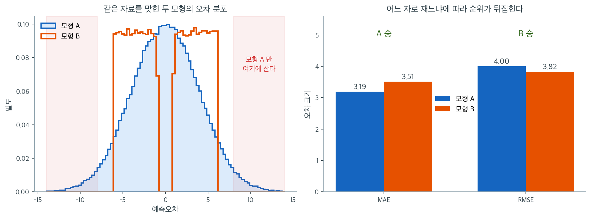

# 성능 척도

## 결정계수

<div class="defn" markdown>

### 정의 1. 결정계수 { .dfn }

$R^2$는 독립변수로부터 예측할 수 있는 종속변수 분산의 비율이다.

$$
R^2 = 1 - \frac{SS_{\text{Residual}}}{SS_{\text{Total}}}
$$

여기서

$$
\begin{array}{lll}
SS_{\text{Total}} &=& \displaystyle \sum_{i}\left(y_{i}-\bar{y}\right)^{2} \\[8pt]
SS_{\text{Residual}} &=& \displaystyle \sum_{i}\left(y_{i}-\hat{y}_{i}\right)^{2}
\end{array}
$$

절편이 있는 모형을 훈련자료에 적합했다면 $R^2$는 0과 1 사이의 값을 가지며 클수록 적합이 좋다. 그러나 $R^2$는 설명변수를 추가하면 예측력이 나아지지 않아도 항상 커지므로 과적합으로 이어질 수 있다.

</div>

### 총제곱합의 분해

$y$의 전체 변동은 설명된 부분과 설명되지 않은 부분으로 깔끔하게 분해된다.

$$
\begin{array}{lll}
SS_{\text{Total}} &=& \displaystyle \sum_{i}\left(y_{i}-\bar{y}\right)^{2} \\[10pt]
&=& \displaystyle \sum_{i}\left(\left(y_{i}-\hat{y}_{i}\right) + \left(\hat{y}_{i}-\bar{y}\right)\right)^{2} \\[10pt]
&=& \displaystyle \sum_{i}\left(y_{i}-\hat{y}_{i}\right)^{2} + \sum_{i}\left(\hat{y}_{i}-\bar{y}\right)^{2} \\[10pt]
&=& \displaystyle SS_{\text{Residual}} + SS_{\text{Treatment}}
\end{array}
$$

여기서 $SS_{\text{Treatment}}$는 회귀모형이 설명하는 변동을 나타내며, 다른 절에서 쓰는 $\text{SSR}$(회귀제곱합)과 같은 양이다. 교차항은 OLS 추정의 성질에 의해 사라진다.

### 단순선형회귀에서의 해석

단순선형회귀에서 $SS_{\text{Treatment}}$는 상관계수로 표현할 수 있다.

$$
\begin{array}{lll}
SS_{\text{Treatment}} &=& \displaystyle \sum_{i}\left(\hat{y}_{i} - \bar{y}\right)^{2} \\[10pt]
&=& \displaystyle \beta^2 \sum_{i}\left(x_i - \bar{x}\right)^{2} \\[10pt]
&\approx& \displaystyle n\sigma_x^2\beta^2 \\[10pt]
&\approx& \displaystyle n\sigma_x^2\left(\rho\frac{\sigma_y}{\sigma_x}\right)^2 \\[10pt]
&=& \displaystyle n\sigma_y^2\rho^2
\end{array}
$$

따라서

$$
R^2 = \frac{SS_{\text{Treatment}}}{SS_{\text{Total}}} \approx \frac{n\sigma_y^2 \rho^2}{n\sigma_y^2} = \rho^2
$$

!!! note "사실은 정확한 등식이다"
    위 유도에서 $\approx$가 등장하는 것은 표본분산을 $n$으로 나누느냐 $n-1$로 나누느냐를 얼버무렸기 때문이다. 두 곳에서 같은 규약을 쓰면 인자가 상쇄되어 단순선형회귀에서는 $R^2 = \rho^2$이 **정확히** 성립한다. 첫 줄의 $\hat{y}_i - \bar{y} = \hat{\beta}(x_i - \bar{x})$도 근사가 아니라 정확한 등식이다(회귀직선이 평균점 $(\bar{x}, \bar{y})$를 지나기 때문이다).

단순선형회귀에서 $R^2$는 $x$와 $y$의 상관계수의 제곱이다.

!!! tip "참고"

    - [R-squared or coefficient of determination (Khan Academy)](https://www.khanacademy.org/math/ap-statistics/bivariate-data-ap/assessing-fit-least-squares-regression/v/r-squared-or-coefficient-of-determination)
    - [R-squared intuition (Khan Academy)](https://www.khanacademy.org/math/ap-statistics/bivariate-data-ap/assessing-fit-least-squares-regression/a/r-squared-intuition)

## 수정 결정계수

<div class="defn" markdown>

### 정의 2. 수정 결정계수 { .dfn }

수정 $R^2$는 설명변수의 개수를 반영하여 불필요한 복잡도에 벌점을 준다.

$$
\text{Adjusted } R^2 = 1 - \left(1 - R^2\right) \frac{n - 1}{n - p - 1}
$$

여기서 $n$은 표본크기이고 $p$는 (절편을 제외한) 설명변수의 개수이다.

</div>

### 조정 인자의 유도

조정은 원래의 제곱합을 자유도로 나눈 불편추정값으로 바꾸는 것이다.

$$
\text{Adjusted } R^2 = 1 - \frac{SS_{\text{Residual}} / (n - p - 1)}{SS_{\text{Total}} / (n - 1)}
$$

이렇게 하면 $SS_{\text{Residual}}$의 감소가 잃어버린 자유도를 정당화할 때에만 설명변수 추가가 수정 $R^2$를 높인다.

### 결정계수와의 주요 차이

- **모형 복잡도**: 수정 $R^2$는 설명변수의 개수를 반영하지만 $R^2$는 그렇지 않다.
- **모형 비교**: 설명변수 개수가 다른 모형들을 비교할 때는 수정 $R^2$가 낫다.
- **방향**: 모형을 개선하지 못하는 설명변수를 넣으면 수정 $R^2$는 줄어들 수 있지만 $R^2$는 커지기만 한다.

## 그 밖의 성능 척도

$$
\begin{array}{lll}
\text{MAE} && \displaystyle\frac{1}{n}\sum_{i=1}^n|y_i-\hat{y}_i| \\[10pt]
\text{MSE} && \displaystyle\frac{1}{n}\sum_{i=1}^n(y_i-\hat{y}_i)^2 \\[10pt]
\text{RMSE} && \displaystyle\sqrt{\frac{1}{n}\sum_{i=1}^n(y_i-\hat{y}_i)^2}
\end{array}
$$

- **MAE(평균절대오차)**: 예측값과 실제값의 절대차이의 평균이다. MSE보다 이상점에 덜 민감하다. 반응변수와 같은 단위로 오차를 제공한다.
- **MSE(평균제곱오차)**: 제곱차이의 평균이다. 큰 오차에 더 무거운 벌점을 준다. OLS의 손실함수로 쓰인다.
- **RMSE(제곱근평균제곱오차)**: MSE의 제곱근이다. 오차를 반응변수의 원래 단위로 되돌려 MSE보다 해석하기 쉽다.

<div class="exbox" markdown>

**보기 1.** <span class="diff easy" title="쉬움"></span> 네 성능 측도 한자리에. 광고 자료에 `TV`, `Radio`, `TV:Radio` 세 설명변수로 회귀하고 $R^2$, MAE, MSE, RMSE 를 훈련·시험에서 각각 잰다.

**(1)** 이 네 수는 **서로 독립적인 정보가 아니다.** $\mathrm{RMSE}$ 와 $R^2$ 를 $\mathrm{MSE}$ 로 적어, 실제로 자유로운 수가 몇 개인지 가리고 수로 확인하시오.

**(2)** $\mathrm{RMSE}/\mathrm{MAE}$ 비를 훈련과 시험에서 계산하여, 잔차에 두꺼운 꼬리가 있는지 판정하시오. 시험 MSE 가 훈련 MSE 보다 **작은** 까닭도 그 비로 설명하시오.

</div>

??? success "풀이"

    **(1) 자유로운 수는 두 개다.** 먼저 정의에서

    $$
    \mathrm{RMSE} = \sqrt{\mathrm{MSE}}
    $$

    이므로 둘은 같은 양의 다른 표현이다. 정보가 하나 줄었다.

    $R^2$ 도 MSE 에서 나온다. 어떤 자료집합에서

    $$
    R^2 = 1 - \frac{\mathrm{RSS}}{\mathrm{TSS}}
    = 1 - \frac{\sum_i (y_i - \hat y_i)^2}{\sum_i (y_i - \bar y)^2}
    = 1 - \frac{\frac{1}{n}\sum_i (y_i - \hat y_i)^2}{\frac{1}{n}\sum_i (y_i - \bar y)^2}
    = 1 - \frac{\mathrm{MSE}}{\widehat{\operatorname{Var}}(y)}
    $$

    이다. 분자와 분모를 같은 $n$ 으로 나누었을 뿐이므로 $\widehat{\operatorname{Var}}(y)$ 는 **$n$ 으로 나눈** 표본분산이다($\texttt{ddof=0}$). 그러므로 $R^2$ 는 MSE 를 그 자료의 $y$ 분산으로 재규격화한 것이고, **새 정보가 없다.**

    남는 것은 $\mathrm{MSE}$ 와 $\mathrm{MAE}$ 둘이다. 둘은 서로에서 나오지 않는다. 하나는 제곱의 평균, 하나는 절대값의 평균이어서 **오차 분포의 다른 모양을 본다.**

    이 셈이 척도를 고르는 문제를 또렷하게 만든다. $R^2$ 와 RMSE 와 MSE 를 나란히 보고하는 것은 **같은 수를 세 번 적는 것**이고, 거기에 MAE 를 더해야 비로소 두 번째 정보가 생긴다.

    **(2) 정규잔차의 비는 $\sqrt{\pi/2}$ 다.** $\varepsilon \sim N(0, \sigma^2)$ 이면 $E|\varepsilon| = \sigma\sqrt{2/\pi}$ 이고 $\sqrt{E[\varepsilon^2]} = \sigma$ 이므로

    $$
    \frac{\mathrm{RMSE}}{\mathrm{MAE}} \;\longrightarrow\; \sqrt{\frac{\pi}{2}} = 1.2533
    $$

    이다. $\sigma$ 가 약분되므로 이 비는 **잔차의 크기와 무관하게 모양만** 잰다.

    - 비가 $1.25$ 보다 **크면** 큰 잔차 몇 개가 RMSE 를 혼자 밀어 올리는 것이므로 꼬리가 두껍다.
    - 비가 $1.25$ 보다 **작으면** 잔차의 크기가 고르다. 아래 그림의 모형 B 가 $1.09$ 인 경우다.
    - 비의 하한은 $1$ 이고(모든 잔차가 같은 크기), 상한은 없다.

    시험 MSE 가 훈련 MSE 보다 작다는 사실도 이 비가 설명할 수 있다. 훈련 쪽에 **아주 큰 잔차 몇 개**가 몰려 있다면 훈련 MSE 가 그만큼 부풀기 때문이다. 그렇다면 훈련 쪽의 비가 시험 쪽보다 클 것이다. 확인해 보자.

    ```python
    import pandas as pd
    import numpy as np
    from sklearn.model_selection import train_test_split
    from sklearn.linear_model import LinearRegression
    from sklearn import metrics

    # 앞 절과 같은 광고 자료를 쓴다.
    url = 'https://raw.githubusercontent.com/justmarkham/scikit-learn-videos/8545c74961398def7724501648fd504dbf061b41/data/Advertising.csv'
    df = pd.read_csv(url, usecols=[1, 2, 3, 4])

    df['TV:Radio'] = df['TV'] * df['Radio']

    X = df[['TV', 'Radio', 'TV:Radio']]
    y = df['Sales']

    test_size_ratio = 0.3
    x_train, x_test, y_train, y_test = train_test_split(X, y, test_size=test_size_ratio, random_state=42)

    model = LinearRegression()
    model.fit(x_train, y_train)

    y_train_pred = model.predict(x_train)
    y_test_pred = model.predict(x_test)

    print(f"Intercept: {model.intercept_}")
    print(f"Coefficients: {model.coef_}\n")

    # 아래 네 측도를 훈련과 시험에서 각각 잰다. 시험 쪽 값이 훈련 쪽보다
    # 크게 나쁘면 과적합을 의심한다.
    # R^2 — 반응의 분산 중 모형이 설명하는 몫. 단위가 없어 견주기 좋다.
    print(f"Training R^2: {model.score(x_train, y_train)}")
    print(f"Testing R^2: {model.score(x_test, y_test)}\n")

    # MAE — 오차의 절댓값 평균. 단위가 반응과 같고 이상치에 덜 휘둘린다.
    print(f"Training MAE: {metrics.mean_absolute_error(y_train, y_train_pred)}")
    print(f"Testing MAE: {metrics.mean_absolute_error(y_test, y_test_pred)}\n")

    # MSE — 오차의 제곱 평균. 큰 오차에 더 무거운 벌을 준다. 단위가 제곱이라
    # 그대로 읽기는 어렵다.
    print(f"Training MSE: {metrics.mean_squared_error(y_train, y_train_pred)}")
    print(f"Testing MSE: {metrics.mean_squared_error(y_test, y_test_pred)}\n")

    # RMSE — MSE 의 제곱근. 단위가 반응과 같아져 해석이 쉬워진다.
    # 큰 오차를 무겁게 보되 읽기도 편해, 회귀에서 가장 널리 쓰인다.
    print(f"Training RMSE: {np.sqrt(metrics.mean_squared_error(y_train, y_train_pred))}")
    print(f"Testing RMSE: {np.sqrt(metrics.mean_squared_error(y_test, y_test_pred))}\n")
    ```

    출력:

    ```
    Intercept: 6.37486462995429
    Coefficients: [0.02060952 0.04735462 0.00100684]

    Training R^2: 0.9659030787012204
    Testing R^2: 0.9673268969053402

    Training MAE: 0.6344840392254547
    Testing MAE: 0.730384235550869

    Training MSE: 0.8947370334590617
    Testing MSE: 0.8921262830343071

    Training RMSE: 0.9459054040754085
    Testing RMSE: 0.9445243686820934
    ```

    ```python
    from scipy import stats

    for name, xx, yy, pp in [("훈련", x_train, y_train, y_train_pred),
                             ("시험", x_test, y_test, y_test_pred)]:
        mae = metrics.mean_absolute_error(yy, pp)
        mse = metrics.mean_squared_error(yy, pp)
        rmse = np.sqrt(mse)
        r2 = model.score(xx, yy)
        var0 = np.var(yy, ddof=0)
        e = np.asarray(yy) - pp
        big = np.abs(e) > 3 * rmse
        print(f"{name}: MAE={mae:.6f}  MSE={mse:.6f}  RMSE={rmse:.6f}  R2={r2:.6f}")
        print(f"   RMSE^2 - MSE          = {rmse ** 2 - mse:.3e}")
        print(f"   1 - MSE/Var(y, ddof=0) = {1 - mse / var0:.6f}   (R2 와의 차이 {abs(1 - mse / var0 - r2):.3e})")
        print(f"   RMSE/MAE = {rmse / mae:.4f}    정규라면 sqrt(pi/2) = {np.sqrt(np.pi / 2):.4f}")
        print(f"   잔차 왜도 {stats.skew(e):+.3f}  첨도 {stats.kurtosis(e, fisher=False):.3f}  "
              f"최대 |e| = {np.abs(e).max():.3f} (RMSE 의 {np.abs(e).max() / rmse:.1f}배)")
        print(f"   |e| > 3*RMSE 인 관측값 {big.sum()}개 / {len(e)}개,  "
              f"그 몫이 MSE 에서 차지하는 비율 {(e[big] ** 2).sum() / (e ** 2).sum() * 100:.1f}%")
    ```

    출력:

    ```
    훈련: MAE=0.634484  MSE=0.894737  RMSE=0.945905  R2=0.965903
       RMSE^2 - MSE          = 0.000e+00
       1 - MSE/Var(y, ddof=0) = 0.965903   (R2 와의 차이 0.000e+00)
       RMSE/MAE = 1.4908    정규라면 sqrt(pi/2) = 1.2533
       잔차 왜도 -3.073  첨도 20.638  최대 |e| = 6.692 (RMSE 의 7.1배)
       |e| > 3*RMSE 인 관측값 2개 / 140개,  그 몫이 MSE 에서 차지하는 비율 47.6%
    시험: MAE=0.730384  MSE=0.892126  RMSE=0.944524  R2=0.967327
       RMSE^2 - MSE          = 1.110e-16
       1 - MSE/Var(y, ddof=0) = 0.967327   (R2 와의 차이 0.000e+00)
       RMSE/MAE = 1.2932    정규라면 sqrt(pi/2) = 1.2533
       잔차 왜도 -1.215  첨도 4.148  최대 |e| = 2.765 (RMSE 의 2.9배)
       |e| > 3*RMSE 인 관측값 0개 / 60개,  그 몫이 MSE 에서 차지하는 비율 0.0%
    ```

    **(1) 두 관계식이 정확히 성립한다.** $\mathrm{RMSE}^2 - \mathrm{MSE}$ 가 훈련에서 정확히 $0$, 시험에서 $1.1 \times 10^{-16}$ 이다. 그리고 $1 - \mathrm{MSE}/\widehat{\operatorname{Var}}(y)$ 가 `model.score` 의 $R^2$ 와 **차이 $0$** 으로 같다. 유도한 대로 **네 수 가운데 자유로운 것은 MSE 와 MAE 둘뿐**이다.

    **(2) 훈련 잔차에 두꺼운 꼬리가 있다.** 비가 훈련에서 $1.4908$ 로 정규 기준 $1.2533$ 보다 $19\%$ 크고, 시험에서는 $1.2932$ 로 $3\%$ 밖에 크지 않다.

    범인이 분명하게 드러난다. 훈련자료 $140$ 개 가운데 $|e| > 3\,\mathrm{RMSE}$ 인 것이 **단 두 개**인데, 그 둘이 **MSE 의 $47.6\%$** 를 차지한다. 가장 큰 잔차는 $6.692$ 로 RMSE 의 $7.1$ 배다. 왜도 $-3.073$, 첨도 $20.638$ 도 정규의 $0$ 과 $3$ 에서 한참 멀다. 시험자료에는 그런 관측값이 하나도 없고(왜도 $-1.215$, 첨도 $4.148$), 최대 잔차가 RMSE 의 $2.9$ 배에 그친다.

    **그래서 시험 MSE 가 훈련 MSE 보다 작다.** $0.892126$ 대 $0.894737$ 이다. 유도에서 예상한 대로이고, 과적합이 없어서가 아니라 **이상점 두 개가 우연히 훈련 쪽에 떨어졌기** 때문이다. MAE 로 보면 이야기가 뒤집힌다. 훈련 $0.6345$, 시험 $0.7304$ 로 **시험 쪽이 $15\%$ 나쁘다.** 이상점에 덜 휘둘리는 자로 재면 정상적인 방향이 나타난다.

    훈련 $R^2$ $0.9659$ 와 시험 $R^2$ $0.9673$ 이 거의 같다. 두 값이 크게 벌어지면 과적합을 의심한다. 다만 위에서 보았듯 **이 두 수가 거의 같다는 사실 자체는 MSE 가 같다는 말의 되풀이**이고, $R^2$ 가 각 집합의 $y$ 분산으로 규격화된다는 점까지 더해져 있다. 시험 쪽 $y$ 의 분산이 $27.30$ 으로 훈련 쪽 $26.24$ 보다 커서, 같은 MSE 라도 시험 $R^2$ 가 조금 더 높게 나왔다.

    **교훈은 둘을 함께 보라는 것이다.** MSE 하나만 보면 "시험이 더 좋다" 는 엉뚱한 결론에 이르고, MAE 를 함께 보면 바로잡힌다. 그리고 두 척도가 엇갈리는 바로 그 자리가 이상점이 사는 곳이다.

## 척도가 엇갈릴 때

위 보기에서는 네 척도가 모두 같은 방향을 가리켰다. 늘 그렇지는 않다.



같은 자료를 맞힌 두 모형이 있다고 하자. 왼쪽 그림이 두 모형의 예측오차 분포다. 모형 A(파란색)는 정규분포 모양이어서 오차가 대개 작지만 가끔 아주 크다. 붉게 칠한 $|e| > 8$ 구간에 사는 점은 모형 A뿐이다. 모형 B(주황색)는 오차의 크기가 늘 $1$에서 $6$ 사이로 고르다. 크게 빗나가는 일도 없지만 정확히 맞히는 일도 없다.

오른쪽이 두 자로 잰 결과다. MAE로 재면 모형 A가 $3.19$로 모형 B의 $3.51$보다 낫다. 그런데 RMSE로 재면 모형 A가 $4.00$, 모형 B가 $3.82$로 순위가 **뒤집힌다.** 제곱이 큰 오차를 증폭하기 때문이다. 모형 A의 $|e| > 8$짜리 오차들은 개수로는 전체의 $4.6\%$에 지나지 않지만 MSE에서는 훨씬 큰 몫을 차지한다. 두 모형의 $\text{RMSE}/\text{MAE}$ 비를 내 보면 A가 $1.25$, B가 $1.09$로 이 차이가 그대로 드러난다.

어느 쪽이 "더 나은 모형"인가? 자료만으로는 답할 수 없다. 큰 오차가 특별히 비싼 문제라면 — 재고를 크게 잘못 잡으면 결품이 나거나 창고가 넘치는 경우, 구조물의 하중을 과소평가하면 붕괴하는 경우 — 모형 B를 골라야 한다. 오차의 비용이 크기에 비례할 뿐이라면 모형 A가 낫다. 곧 **척도를 고르는 일은 자료 분석의 문제가 아니라 문제 정의의 문제다.** 모형을 적합하기 전에 "빗나감의 비용이 오차 크기에 어떻게 달라지는가"를 먼저 정해야 하는 이유가 여기에 있다.

## 연습문제

<div class="drillbox" markdown>

**연습문제 1.** <span class="diff easy" title="쉬움"></span>
어떤 회귀모형이 검정자료에서 MSE = 16.0, MAE = 3.2이다. 두 번째 모형은 MSE = 14.5, MAE = 3.5이다. 어느 모형이 더 나은가? MSE와 MAE가 엇갈리는 것은 자료에 대해 무엇을 시사하는가?

</div>

??? success "풀이"
    선택은 응용 상황에 달려 있다. 모형 2는 MSE가 더 낮고(14.5 대 16.0), 모형 1은 MAE가 더 낮다(3.2 대 3.5).

    두 척도가 엇갈리는 것은 **오차 분포의 모양**이 다르다는 뜻이다. RMSE/MAE 비를 보면 뚜렷해진다.

    - 모형 1: $\text{RMSE} = \sqrt{16.0} = 4.0$, 비 $= 4.0/3.2 = 1.25$
    - 모형 2: $\text{RMSE} = \sqrt{14.5} = 3.81$, 비 $= 3.81/3.5 = 1.09$

    비가 클수록 오차 분포의 꼬리가 무겁다. 곧 **모형 1**이 전형적인 오차는 작지만 몇 개의 큰 오차를 갖고 있고, **모형 2**는 오차가 더 고르게 퍼져 있되 평균적인 오차 크기는 조금 더 크다. MSE는 오차를 제곱하므로 큰 오차에 더 큰 벌점을 주고, 그래서 큰 오차가 있는 모형 1의 MSE가 더 높게 나온 것이다.

    큰 오차의 비용이 크다면 모형 2(낮은 MSE)를, 전형적인 오차 크기가 더 중요하다면 모형 1(낮은 MAE)을 택한다.

<div class="drillbox" markdown>

**연습문제 2.** <span class="diff med" title="중간"></span>
어떤 모형이 훈련자료에서 $R^2 = 0.95$, 검정자료에서 $R^2 = 0.60$이다. 문제를 진단하고 대책을 제안하라.

</div>

??? success "풀이"
    훈련 $R^2$(0.95)와 검정 $R^2$(0.60)의 큰 격차는 **과적합**을 나타낸다. 모형이 훈련자료에만 있는 패턴(잡음 포함)을 학습하여 새 자료에 일반화되지 않는 것이다.

    대책: (1) 설명변수를 빼거나, 정칙화(릿지/라쏘)를 쓰거나, 다항 차수를 낮추어 **모형 복잡도를 줄인다**. (2) 가능하면 **훈련자료를 늘린다**. (3) 모형 선택 과정에서 **교차검증**을 써서 표본 밖 성능을 더 신뢰성 있게 추정한다.

<div class="drillbox" markdown>

**연습문제 3.** <span class="diff med" title="중간"></span>
(절편이 있을 때) 훈련자료에서는 $R^2$가 항상 0과 1 사이인데도 검정자료에서는 음수가 될 수 있는 이유를 설명하라.

</div>

??? success "풀이"
    절편이 있는 훈련자료에서는 OLS가 $\text{SSE} \leq \text{SST}$를 보장하므로 $R^2 = 1 - \text{SSE}/\text{SST} \geq 0$이다.

    검정자료에서는 $R^2 = 1 - \sum(y_i - \hat{y}_i)^2 / \sum(y_i - \bar{y}_{\text{test}})^2$이다. 예측값 $\hat{y}_i$는 훈련 모형이 만들어 낸 것이므로 검정자료에서는 체계적으로 치우쳐 있을 수 있다. 모형의 예측이 모든 관측값에 대해 단순히 검정자료의 평균을 예측하는 것보다 나쁘다면 $\text{SSE} > \text{SST}$가 되어 $R^2 < 0$이다. 이는 모형이 단지 나쁜 정도가 아니라 아무 모형도 쓰지 않는 것보다 나쁘다는 뜻이다.

---

## 정리하며

성능 척도를 **한자리에** 모았다.

- **세 갈래다.** 설명력($R^2$, 조정 $R^2$), 절대 오차(MAE·MSE·RMSE), 상대 오차(MAPE·MASE).
- **하나로 충분한 경우는 없다.** $R^2$ 는 비율만, RMSE 는 크기만, MAPE 는 상대 크기만 말한다. **셋을 함께 보아야 모형을 제대로 안다.**
- **훈련 성능과 검정 성능을 구별한다.** 훈련자료의 값은 언제나 낙관적이며, 모형이 유연할수록 격차가 크다. 다음 절의 모형선택이 이 문제를 정면으로 다룬다.
- **척도의 선택이 모형의 선택을 바꾼다.** MAE 로 고른 모형과 RMSE 로 고른 모형이 다를 수 있으며, **무엇을 최소화할지가 문제 정의의 일부**다.
- **예측이 목적이면 성능 척도, 추론이 목적이면 계수와 신뢰구간**이다. 1장의 구분이 여기서 보고 방식의 차이로 나타난다.

다음 절부터 **모형선택**으로 넘어간다.
