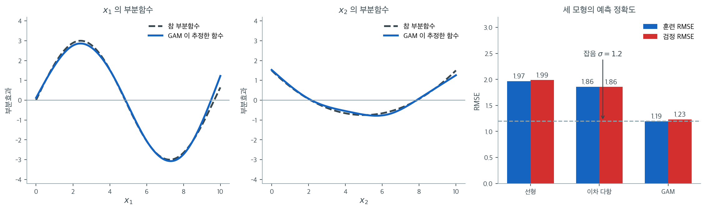

# GAM 주택 분석

## 개요

이 페이지는 King County 주택 자료를 이용해 집값 예측에 일반화가법모형(GAM)을 적용한다. 선형회귀, 다항회귀, GAM(statsmodels와 pyGAM 양쪽)을 비교하고, 부분의존 그림을 시각화하며, RMSE와 $R^2$로 모형 성능을 평가한다.

!!! note "자료에 대하여"
    `house_98105`는 King County 주택 매매 자료 가운데 우편번호 98105 지역만 걸러 낸 pandas `DataFrame`이다. 아래 코드는 이 변수가 이미 만들어져 있다고 가정한다.

## 수학적 배경

일반화가법모형은 각 설명변수가 매끄러운 함수를 통해 비선형 효과를 갖도록 허용하여 선형회귀를 확장한다.

$$
y = \beta_0 + f_1(x_1) + f_2(x_2) + \cdots + f_p(x_p) + \varepsilon,
$$

여기서 각 $f_j$는 (보통 스플라인으로) 자료에서 추정한 매끄러운 함수이다. 각 설명변수가 반응변수에 독립적으로 기여하므로 "가법"이라 부른다.

### 평활 스플라인

각 $f_j$는 기저 전개, 흔히 B-스플라인으로 표현된다.

$$
f_j(x_j) = \sum_{m=1}^{M_j} \gamma_{jm}\, B_{jm}(x_j),
$$

여기서 $B_{jm}$은 기저함수이다. 매끄러움은 **평활 모수** $\lambda_j$로 조절되며 목적함수는 다음이 된다.

$$
\min_{\gamma} \sum_{i=1}^n \!\left(y_i - \beta_0 - \sum_{j=1}^p f_j(x_{ij})\right)^{\!2} + \sum_{j=1}^p \lambda_j \int [f_j''(t)]^2\, dt.
$$

벌점 $\lambda_j \int [f_j'']^2\,dt$가 $f_j$의 요동을 조절한다. $\lambda_j$가 클수록 더 매끄러운 곡선이 된다.

### 부분의존

$y$의 $x_j$에 대한 **부분의존**은 함수 $f_j(x_j)$이며, 다른 설명변수에 대해 평균을 낸 뒤 설명변수 $j$가 반응변수에 미치는 주변 효과를 보여준다.



GAM이 실제로 무엇을 되찾는지 보려면 정답을 아는 자료가 편하다. $y = 10 + f_1(x_1) + f_2(x_2) + \varepsilon$($\varepsilon \sim N(0, 1.2^2)$)로 관측값 $700$개를 만들었다. $f_1$은 오르내리는 파동이고 $f_2$는 U자다. 두 설명변수는 서로 독립이며, GAM에는 각각 자유도 $6$의 자연 스플라인을 주었다.

왼쪽 두 칸이 결과다. 파란 실선이 GAM이 추정한 부분함수, 검은 점선이 참 함수다. 거의 구별되지 않는다. 최대 오차가 $f_1$에서 $0.58$, $f_2$에서 $0.24$인데, 잡음의 표준편차가 $1.2$임을 생각하면 잡음보다 작은 차이다. 여기서 중요한 것은 **우리가 함수의 모양을 미리 알려 주지 않았다**는 점이다. "사인 곡선"이라고도, "이차식"이라고도 말하지 않았다. 스플라인 기저와 가법성 가정만 주었더니 모양이 자료에서 나왔다.

오른쪽이 그 유연성의 값어치다. 같은 자료에 선형 모형, 이차 다항 모형, GAM을 적합했다. 검정 RMSE가 각각 $1.99$, $1.86$, $1.23$이다. 선형 모형은 $f_1$의 오르내림을 전혀 잡지 못하고, 이차 다항은 $f_2$의 U자는 맞히지만 $f_1$의 파동은 여전히 놓친다. GAM만이 잡음의 하한 $1.2$에 닿는다. 그리고 훈련 RMSE와 검정 RMSE가 $1.19$ 대 $1.23$으로 거의 같다는 점도 함께 보아 두자. 유연한 모형인데도 과적합하지 않았는데, 이는 가법성이라는 제약이 남아 있기 때문이다.

바로 그 제약이 GAM의 해석 가능성을 만든다. 모형이 $p$차원 곡면 하나가 아니라 **$p$개의 일차원 곡선의 합**이므로, 설명변수마다 한 장씩 그림을 그려 "이 변수는 어떤 모양으로 작용하는가"를 따로 읽을 수 있다. 위 두 칸이 바로 그 부분의존 그림이다. 대가는 교호작용을 담지 못한다는 것인데, 필요하다면 이차원 매끄러운 항을 따로 넣어야 한다.

## 자료

<div class="exbox" markdown>

**보기 1.** <span class="diff easy" title="쉬움"></span> 주택 자료 읽기. 전체 자료에서 우편번호 98105 지역만 걸러 낸다.

**(1)** 98105 지역의 가격 수준을 전체와 견주고, 그 차이가 **집이 더 커서** 생긴 것인지 확인하시오.

**(2)** 한 우편번호만 남기는 것이 뒤의 모형들에 무엇을 주고 무엇을 빼앗는가. 수로 말하시오.

</div>

??? success "풀이"

    **유도할 식이 없는 보기다.** 자료를 자르는 것이 전부이므로, 자르고 난 뒤의 수를 읽는다.

    ```python
    import pandas as pd

    url = ("https://raw.githubusercontent.com/gedeck/"
           "practical-statistics-for-data-scientists/master/data/house_sales.csv")
    house = pd.read_csv(url, sep='\t')
    house_98105 = house.loc[house['ZipCode'] == 98105, :]

    print(f"98105 지역 {len(house_98105)}건")
    ```

    출력:

    ```
    98105 지역 313건
    ```

    자른 자료가 전체와 어떻게 다른지 찍어 본다.

    ```python
    import numpy as np

    zips = house['ZipCode'].value_counts()
    print(f"우편번호 {house['ZipCode'].nunique()}개, 건수 최소 {zips.min()} ~ 중앙값 {zips.median():.0f} ~ 최대 {zips.max()}")
    print(f"98105 는 {len(house_98105)}건으로 전체의 {100 * len(house_98105) / len(house):.1f}%")
    for name, d in [("98105", house_98105), ("전체", house)]:
        print(f"{name:>5}  가격 중앙값 {d['AdjSalePrice'].median():>9,.0f}   "
              f"면적 중앙값 {d['SqFtTotLiving'].median():>6,.0f}")
    print(f"가격 비 {house_98105['AdjSalePrice'].median() / house['AdjSalePrice'].median():.2f}배,  "
          f"면적 비 {house_98105['SqFtTotLiving'].median() / house['SqFtTotLiving'].median():.2f}배")
    for v in ['SqFtTotLiving', 'SqFtLot', 'Bathrooms', 'Bedrooms', 'BldgGrade']:
        print(f"{v:>14}  서로 다른 값 {house_98105[v].nunique():>3}개")
    ```

    출력:

    ```
    우편번호 80개, 건수 최소 1 ~ 중앙값 288 ~ 최대 788
    98105 는 313건으로 전체의 1.4%
    98105  가격 중앙값   630,041   면적 중앙값  1,850
       전체  가격 중앙값   471,315   면적 중앙값  1,910
    가격 비 1.34배,  면적 비 0.97배
     SqFtTotLiving  서로 다른 값 180개
           SqFtLot  서로 다른 값 171개
         Bathrooms  서로 다른 값  16개
          Bedrooms  서로 다른 값   8개
         BldgGrade  서로 다른 값   8개
    ```

    **(1) 비싼 것은 집이 아니라 자리다.** 98105 의 가격 중앙값은 $630{,}041$ 달러로 전체의 $471{,}315$ 달러보다 $1.34$ 배 높다. 그런데 거주면적 중앙값은 $1{,}850$ 평방피트로 전체의 $1{,}910$ 보다 오히려 **작다**($0.97$ 배).

    집이 작은데 $34\%$ 비싸다. 그러므로 이 가격차는 아래에서 쓸 설명변수 다섯 개 가운데 어느 것으로도 설명되지 않는다. 설명하는 것은 우편번호 자체, 곧 **입지**다. 98105 는 워싱턴 대학 부근이다.

    **(2) 교란변수를 하나 지우고 표본의 $98.6\%$ 를 버렸다.** 전체 자료에 그대로 회귀를 돌리면 입지가 교란변수가 된다. 좋은 동네의 집은 비싸고, 좋은 동네의 집은 등급도 높을 것이므로, `BldgGrade` 의 계수가 "등급의 효과"와 "동네의 효과"를 섞어 담는다. 우편번호를 하나로 고정하면 **입지가 상수가 되어** 그 섞임이 사라진다. 지역 더미 $80$ 개를 모형에 넣는 것보다 거친 방법이지만 간단하다.

    대가는 표본이다. $22{,}687$ 건에서 $313$ 건으로 줄었다. $1.4\%$ 만 남았다. 자유도 $10$ 짜리 스플라인을 쓰면 관측값 $31$ 개에 모수 하나를 쓰는 셈이니, 전체 자료에서라면 아무 문제가 없던 유연성이 여기서는 과대적합의 문턱에 닿는다. 98105 가 유별나게 작은 조각인 것은 아니다. 우편번호가 $80$ 개이고 건수의 중앙값이 $288$ 이니 **보통 크기**이며, 어느 지역을 골랐어도 수백 건이었을 것이다.

    또 하나 눈에 둘 것은 **설명변수의 값이 몇 가지뿐**이라는 점이다. 면적은 서로 다른 값이 $180$ 개지만 `Bedrooms` 와 `BldgGrade` 는 각각 $8$ 개, `Bathrooms` 는 $16$ 개다. 값이 여덟 가지인 변수에 매끄러운 함수를 적합하는 것은 거의 뜻이 없고, 그래서 아래 보기 4 의 pygam 설정이 면적에만 `s()` 를 주고 나머지를 `l()` 로 둔다. 연습문제 2 가 다루는 위험이 바로 이것이다.

    여기까지가 자료다. 아래에서 선형, 다항, 스플라인, GAM 을 같은 $313$ 건에 적용해 비교한다.

### 선형 모형과 다항 모형

<div class="exbox" markdown>

**보기 2.** <span class="diff easy" title="쉬움"></span> 선형 모형과 다항 모형. 설명변수 다섯 개의 선형 모형을 기준선으로 두고, 면적에 이차항 하나를 더한 다항 모형을 세운다.

**(1)** 이 두 모형은 **중첩**되어 있다. 그 사실만으로 $R^2$ 에 대해 무엇을 단언할 수 있는가. 조정 $R^2$ 는 어떤 조건에서 오르는지 유도하시오.

**(2)** 이차항이 쓸 만한지 중첩 $F$ 검정으로 판정하고, 그 $F$ 가 이차항의 $t$ 값과 어떤 관계인지 수로 확인하시오.

</div>

??? success "풀이"

    **(1) 해석적으로.** 선형 모형의 설계행렬은 다항 모형의 설계행렬에서 이차항 열 하나를 뺀 것이다. 곧 열공간이 **포함 관계**에 있다.

    $$
    \mathcal{C}(\mathbf{X}_1) \subset \mathcal{C}(\mathbf{X}_2)
    $$

    최소제곱은 $\mathbf{y}$ 를 열공간에 사영하고 RSS 는 그 사영까지의 거리의 제곱이므로, 더 큰 공간으로 사영한 쪽의 거리가 더 멀 수 없다.

    $$
    \mathrm{RSS}_2 \le \mathrm{RSS}_1 \quad \Longrightarrow \quad R^2_2 = 1 - \frac{\mathrm{RSS}_2}{\mathrm{TSS}} \ge R^2_1
    $$

    **$R^2$ 는 결코 줄지 않는다.** 이차항이 아무 쓸모가 없어도, 심지어 무작위 잡음을 열로 넣어도 오른다. 그러므로 $R^2$ 가 올랐다는 사실은 아무 증거가 아니다.

    조정 $R^2$ 는 다르다. $p$ 를 절편을 포함한 모수의 개수라 하면

    $$
    R^2_{\text{adj}} = 1 - (1 - R^2)\frac{n-1}{n-p}
                     = 1 - \frac{\mathrm{RSS}/(n-p)}{\mathrm{TSS}/(n-1)}
    $$

    이고, $\mathrm{TSS}/(n-1)$ 은 모형과 무관한 상수다. 그러므로 **조정 $R^2$ 가 오르는 것과 $\hat\sigma^2 = \mathrm{RSS}/(n-p)$ 가 내려가는 것은 같은 말이다.** 모수를 하나 더할 때 그 조건을 풀어 보자. $\nu = n - p_2$ 를 큰 모형의 잔차 자유도라 하면 작은 모형의 잔차 자유도는 $\nu + 1$ 이고, 조건은

    $$
    \frac{\mathrm{RSS}_2}{\nu} < \frac{\mathrm{RSS}_1}{\nu + 1}
    $$

    이다. 양변에 $\nu(\nu+1) > 0$ 을 곱하면

    $$
    (\nu + 1)\,\mathrm{RSS}_2 < \nu\,\mathrm{RSS}_1
    \;\Longleftrightarrow\;
    \mathrm{RSS}_2 < \nu\,(\mathrm{RSS}_1 - \mathrm{RSS}_2)
    \;\Longleftrightarrow\;
    1 < \frac{\mathrm{RSS}_1 - \mathrm{RSS}_2}{\mathrm{RSS}_2/\nu} = F
    $$

    **모수를 하나 더해 조정 $R^2$ 가 오르는 것은 그 항의 부분 $F$ 가 $1$ 을 넘는 것과 같다.** 조정 $R^2$ 는 유의수준이 아니라 $F > 1$ 이라는 아주 느슨한 문턱을 쓰는 검정인 셈이다.

    **(2) 이차항의 검정.** 분자 자유도가 $1$ 인 중첩 $F$ 검정은 그 계수의 $t$ 검정과 **같은 검정**이다. 가설이 둘 다 $H_0: \beta_{\text{quad}} = 0$ 이고, 일반적으로

    $$
    F = \frac{(\mathrm{RSS}_1 - \mathrm{RSS}_2)/1}{\mathrm{RSS}_2/(n - p_2)} = t^2
    $$

    이 성립한다. $F_{1,\nu}$ 분포가 $t_\nu$ 의 제곱의 분포이므로 $p$-값도 정확히 같아야 한다. 그러므로 수치로 확인할 것은 $F = t^2$ 와 두 $p$-값의 일치다.

    ```python
    import numpy as np
    import pandas as pd
    import statsmodels.api as sm
    import statsmodels.formula.api as smf

    # 세 모형을 차례로 세워 견준다: 선형 → 다항 → GAM.
    predictors = ['SqFtTotLiving', 'SqFtLot', 'Bathrooms', 'Bedrooms', 'BldgGrade']
    outcome = 'AdjSalePrice'

    # 1) 선형 모형 — 기준선
    X_linear = house_98105[predictors].assign(const=1)
    result_linear = sm.OLS(house_98105[outcome], X_linear).fit()

    # 2) 다항 모형 — 면적에 이차항을 더한다. 곡선을 담을 수는 있지만
    # 다항식은 전 구간에 걸쳐 하나의 식이라, 한쪽 끝의 자료가 반대쪽 적합까지
    # 흔든다는 약점이 있다.
    formula_poly = ('AdjSalePrice ~ SqFtTotLiving + np.power(SqFtTotLiving, 2) + '
                    'SqFtLot + Bathrooms + Bedrooms + BldgGrade')
    result_poly = smf.ols(formula=formula_poly, data=house_98105).fit()
    ```

    ```python
    from scipy import stats

    n = len(house_98105)
    print(f"선형  R^2 = {result_linear.rsquared:.4f}   RSS = {result_linear.ssr:.6e}   모수 {int(result_linear.df_model) + 1}개")
    print(f"다항  R^2 = {result_poly.rsquared:.4f}   RSS = {result_poly.ssr:.6e}   모수 {int(result_poly.df_model) + 1}개")
    for name, res in [("선형", result_linear), ("다항", result_poly)]:
        p = int(res.df_model) + 1
        print(f"{name}  조정 R^2 = {1 - (1 - res.rsquared) * (n - 1) / (n - p):.4f}"
              f"   (statsmodels {res.rsquared_adj:.4f})")

    F = (result_linear.ssr - result_poly.ssr) / (result_poly.ssr / result_poly.df_resid)
    t = result_poly.tvalues['np.power(SqFtTotLiving, 2)']
    print(f"중첩 F = {F:.4f},   이차항의 t = {t:.4f},   t^2 = {t ** 2:.4f}")
    print(f"F 의 p-값 = {stats.f.sf(F, 1, result_poly.df_resid):.3e},   "
          f"t 의 p-값 = {result_poly.pvalues['np.power(SqFtTotLiving, 2)']:.3e}")
    ```

    출력:

    ```
    선형  R^2 = 0.7954   RSS = 9.781097e+12   모수 6개
    다항  R^2 = 0.8058   RSS = 9.285813e+12   모수 7개
    선형  조정 R^2 = 0.7921   (statsmodels 0.7921)
    다항  조정 R^2 = 0.8020   (statsmodels 0.8020)
    중첩 F = 16.3213,   이차항의 t = 4.0400,   t^2 = 16.3213
    F 의 p-값 = 6.766e-05,   t 의 p-값 = 6.766e-05
    ```

    **유도한 것이 모두 맞는다.**

    - $\mathrm{RSS}$ 가 $9.781 \times 10^{12}$ 에서 $9.286 \times 10^{12}$ 로 줄었고 $R^2$ 가 $0.7954 \to 0.8058$ 로 올랐다. 포함 관계가 보장한 방향 그대로다.
    - 손으로 쓴 조정 $R^2$ 식이 statsmodels 의 `rsquared_adj` 와 소수 넷째 자리까지 같다. $0.7921 \to 0.8020$ 으로 올랐다.
    - 중첩 $F = 16.3213$ 이 이차항 $t = 4.0400$ 의 제곱 $16.3213$ 과 **소수 넷째 자리까지 같다.** 두 $p$-값도 $6.766 \times 10^{-5}$ 로 같다.
    - $F = 16.32 > 1$ 이므로 (1)의 조건에 따라 조정 $R^2$ 가 올라야 하고, 실제로 올랐다.

    $p$-값이 $7 \times 10^{-5}$ 이니 **면적의 곡률은 실재한다.** 그런데 $R^2$ 로는 $0.0104$ 밖에 얻지 못했다. 유의성과 설명력은 다른 것이다. 관측값이 $313$ 개여서 작은 곡률도 잡아낼 만큼 검정력이 있을 뿐이다.

    이차항의 한계도 적어 두자. $\mathrm{SqFtTotLiving}^2$ 은 **전 구간에 걸친 하나의 식**이다. 큰 집 몇 채가 포물선의 벌어짐을 정하면 그 결정이 작은 집의 적합에도 그대로 전해진다. 아래 보기 3 의 스플라인은 바로 이 성질을 버리려고 조각별 다항을 쓴다.

### statsmodels로 만드는 GAM

<div class="exbox" markdown>

**보기 3.** <span class="diff easy" title="쉬움"></span> statsmodels로 GAM 적합. `BSplines(df=[10, 3, 3, 3, 3])`로 변수마다 스플라인 기저를 만들고 `alpha`를 모두 $0$ 으로 두어 적합한다.

**(1)** `BSplines`가 만드는 기저 열의 개수를 세시오. 식의 선형항 다섯 개와 이 기저가 **함께** 설계행렬에 들어가면 계수(rank)가 몇이 되겠는가.

**(2)** `alpha`가 모두 $0$ 이면 이 GAM 은 같은 설계행렬의 보통 OLS 와 **똑같아야 한다.** 그것을 수로 확인하고, 선형·다항 모형과 적합을 견주시오.

</div>

??? success "풀이"

    **(1) 해석적으로 — 기저 열은 17 개다.** `BSplines` 는 변수 $j$ 마다 `df`$_j$ 개의 B-스플라인 기저함수를 만든 뒤, **절편과 겹치지 않도록 한 열을 버린다.** 기저함수 전체는 더하면 $1$ 이므로 그대로 두면 절편과 완전히 공선이 되기 때문이다. 따라서 변수마다 $\mathrm{df}_j - 1$ 열이고

    $$
    \sum_{j=1}^{5} (\mathrm{df}_j - 1) = \sum_j \mathrm{df}_j - 5 = (10 + 3 + 3 + 3 + 3) - 5 = 22 - 5 = 17
    $$

    열이다. 변수별로는 $9, 2, 2, 2, 2$ 다.

    **그런데 설계행렬에는 선형항도 들어 있다.** `from_formula` 에 넘긴 식이 `SqFtTotLiving + SqFtLot + ...` 이므로 절편 $1$ 개와 선형항 $5$ 개가 먼저 놓이고 그 뒤에 기저 $17$ 개가 붙는다. 열은 모두

    $$
    1 + 5 + 17 = 23
    $$

    개다. 그러나 이 $23$ 열은 **독립이 아니다.** 변수 $j$ 의 기저함수 전체가 치는 공간을 $V_j$ 라 하면, 한 열을 버린 $\mathrm{df}_j - 1$ 개에 **절편 열을 돌려주면 $V_j$ 가 그대로 복원된다**(버린 열 $=$ $1$ $-$ 남은 열들의 합). 그리고 차수 $d \ge 1$ 인 B-스플라인 기저는 조각별 $d$ 차 다항식 전체를 치므로 $V_j$ 는 일차함수 $x_j$ 를 품는다. 곧

    $$
    x_j \in V_j \subset \mathcal{C}\bigl(\,[\,\mathbf{1},\ \mathbf{B}_j\,]\,\bigr)
    $$

    이어서 **선형항 다섯 열은 모두 군더더기다.** 계수는

    $$
    23 - 5 = 18 = 1 + 17
    $$

    이 되어야 한다. 선형항을 쓸지 매끄러운 항을 쓸지는 고르는 것인데, 이 식은 두 가지를 **동시에** 적어 넣은 꼴이다.

    **(2) alpha = 0 이면 그냥 OLS 다.** 쪽머리의 목적함수에서 $\lambda_j = 0$ 을 넣으면 벌점항이 사라져

    $$
    \min_{\gamma} \sum_i \Bigl(y_i - \beta_0 - \sum_j f_j(x_{ij})\Bigr)^2
    $$

    만 남는다. 기저가 정해진 뒤에는 $f_j$ 가 계수에 대해 선형이므로 이것은 설계행렬 $23$ 열에 대한 보통 최소제곱이다. 반응변수가 정규이고 연결함수가 항등이므로 `GLMGam` 의 반복가중최소제곱도 한 걸음에 끝난다. 그러므로 계수와 적합값이 `sm.OLS` 와 **비트 단위로** 같을 것을 기대할 수 있다.

    ```python
    from statsmodels.gam.api import GLMGam, BSplines

    # 3) GAM — 변수마다 매끄러운 함수를 따로 둔다. 스플라인은 구간마다
    # 다른 다항식을 이어 붙이므로 다항식의 위 약점이 없다.
    # 면적에만 자유도 10 을 주고 나머지는 3 으로 낮춰 두었다.
    x_spline = house_98105[predictors]
    bs = BSplines(x_spline, df=[10, 3, 3, 3, 3], degree=[3, 2, 2, 2, 2])
    # alpha 는 매끄러움에 주는 벌점이다. 0 이면 벌점 없이 자유도대로 맞춘다.
    alpha = np.array([0] * 5)

    gam_sm = GLMGam.from_formula(
        'AdjSalePrice ~ SqFtTotLiving + SqFtLot + Bathrooms + Bedrooms + BldgGrade',
        data=house_98105, smoother=bs, alpha=alpha
    )
    res_sm = gam_sm.fit()
    ```

    ```python
    from sklearn.metrics import r2_score

    df_list = [10, 3, 3, 3, 3]
    print(f"변수별 열 = {[s.basis.shape[1] for s in bs.smoothers]},  합 {bs.basis.shape[1]}")
    print(f"예측: sum(df) - 변수수 = {sum(df_list)} - {len(df_list)} = {sum(df_list) - len(df_list)}")

    X_all = np.asarray(gam_sm.exog)
    print(f"GAM 설계행렬 열 = {X_all.shape[1]}  (절편 1 + 선형 {len(predictors)} + 기저 {bs.basis.shape[1]})")
    # 열마다 규모가 크게 다르므로 규모를 맞춘 뒤 특이값을 센다.
    sv = np.linalg.svd(X_all / np.abs(X_all).max(axis=0), compute_uv=False)
    print(f"열 규모를 맞춘 뒤 특이값 가운데 1e-10 보다 작은 것 = {(sv < 1e-10).sum()}개")
    print(f"계수(rank) = {np.linalg.matrix_rank(X_all)},  df_model = {res_sm.df_model:.0f},  df_resid = {res_sm.df_resid:.0f}")

    y = house_98105[outcome].values
    ols_same = sm.OLS(y, X_all).fit()
    print(f"벌점 없는 GAM 과 같은 설계행렬 OLS: 계수 최대 차이 {np.abs(np.asarray(res_sm.params) - ols_same.params).max():.3e}, "
          f"적합값 최대 차이 {np.abs(np.asarray(res_sm.fittedvalues) - ols_same.fittedvalues).max():.3e}")

    for name, pred, p in [("선형", result_linear.fittedvalues, 6),
                          ("다항", result_poly.fittedvalues, 7),
                          ("GAM ", res_sm.fittedvalues, 18)]:
        pred = np.asarray(pred)
        print(f"{name}  모수 {p:>2}개   R^2 = {r2_score(y, pred):.4f}   "
              f"RMSE = {np.sqrt(((y - pred) ** 2).mean()):>7,.0f}")
    ```

    출력:

    ```
    변수별 열 = [9, 2, 2, 2, 2],  합 17
    예측: sum(df) - 변수수 = 22 - 5 = 17
    GAM 설계행렬 열 = 23  (절편 1 + 선형 5 + 기저 17)
    열 규모를 맞춘 뒤 특이값 가운데 1e-10 보다 작은 것 = 5개
    계수(rank) = 18,  df_model = 17,  df_resid = 295
    벌점 없는 GAM 과 같은 설계행렬 OLS: 계수 최대 차이 0.000e+00, 적합값 최대 차이 0.000e+00
    선형  모수  6개   R^2 = 0.7954   RMSE = 176,775
    다항  모수  7개   R^2 = 0.8058   RMSE = 172,241
    GAM   모수 18개   R^2 = 0.8305   RMSE = 160,907
    ```

    **(1)의 세 수가 모두 맞는다.** 변수별 열이 $9, 2, 2, 2, 2$ 로 $\mathrm{df}_j - 1$ 그대로이고 합이 $17$ 이다. 설계행렬은 $23$ 열인데 특이값 가운데 $0$ 인 것이 정확히 **$5$ 개**이고 계수는 $18$ 이다. 유도대로 선형항 다섯 열이 군더더기다. statsmodels 가 보고하는 `df_resid` $= 295 = 313 - 18$ 도 계수 $18$ 과 맞는다.

    **(2) 벌점 없는 GAM 은 OLS 와 완전히 같다.** 계수와 적합값의 차이가 둘 다 정확히 $0$ 이다. 반올림 오차조차 없다. `GLMGam` 이 같은 정규방정식을 같은 방식으로 푼다는 뜻이다. 그러므로 `alpha = 0` 인 이 모형을 "GAM" 이라 부르는 것은 이름뿐이고, **실제로는 스플라인 기저를 넣은 다중회귀**다. 매끄러움을 조절하는 손잡이가 벌점이 아니라 `df` 하나뿐이다.

    적합은 $R^2$ $0.7954 \to 0.8058 \to 0.8305$, RMSE $176{,}775 \to 172{,}241 \to 160{,}907$ 달러로 좋아진다. **그러나 모수가 $6, 7, 18$ 개다.** 관측값 $313$ 개에 모수 $18$ 개를 쓰고 얻은 $R^2$ 를 모수 $6$ 개의 것과 나란히 놓고 "GAM 이 낫다"고 말할 수는 없다. 훈련 $R^2$ 는 모수를 늘리면 반드시 오르기 때문이다(보기 2 의 (1)). 이 비교를 하려면 연습문제 1 이 마지막에 적어 둔 대로 교차검증이나 남겨 둔 검정자료가 필요하다.

    `alpha` 를 모두 $0$ 으로 두었으므로 평활 벌점이 없는 회귀 스플라인이다. 매끄러움은 오직 `df`(기저함수의 개수)로만 조절된다. 아래 보기 4 의 pygam 은 이 손잡이를 자동으로 돌린다.

### pyGAM으로 만드는 GAM

<div class="exbox" markdown>

**보기 4.** <span class="diff easy" title="쉬움"></span> pygam으로 GAM 적합. 면적에만 `s(0, n_splines=12)`를 주고 나머지 넷은 `l()`로 두고, `gridsearch`에 벌점 $\lambda$ 를 맡긴다.

**(1)** 이 모형의 **계수 개수**를 세시오. `gridsearch`는 기본 격자가 $\lambda \in$ `np.logspace(-3, 3, 11)` 인데, 항이 다섯 개이면 적합을 몇 번 해야 하는가. pygam 이 실제로 몇 번 하는지와 견주시오.

**(2)** 고른 $\lambda$ 와 **유효자유도**를 꺼내, 계수 개수와 유효자유도가 왜 다른지 말하시오. 보기 3 의 statsmodels GAM 과 견주어 이 자동화가 무엇을 얻고 무엇을 놓치는지 적으시오.

</div>

??? success "풀이"

    **(1) 계수는 17 개다.** pygam 은 항을 적은 그대로 계수를 배정한다.

    $$
    \underbrace{12}_{s(0),\ n\_splines=12} + \underbrace{1 + 1 + 1 + 1}_{l(1) \sim l(4)} + \underbrace{1}_{\text{절편}} = 17
    $$

    보기 3 의 statsmodels 설계행렬이 $23$ 열(계수 $18$)이었던 것과 거의 같은 규모다. 다만 pygam 은 선형항과 매끄러운 항을 **골라서** 적어 넣었으므로 군더더기 열이 없다.

    **격자 탐색의 횟수.** 항이 $5$ 개이고 각 항마다 $\lambda$ 를 따로 고를 수 있으므로, 격자를 제대로 다 훑으려면

    $$
    11^5 = 161{,}051
    $$

    번 적합해야 한다. $\lambda$ 하나에 적합 한 번이 아니고 **다섯 축의 격자**이기 때문이다.

    pygam 은 그렇게 하지 않는다. 기본 설정에서는 $\lambda$ 벡터를 **대각으로만** 움직인다. 곧 $\lambda_1 = \cdots = \lambda_5$ 로 묶어 두고 격자 $11$ 점을 훑으므로 적합이 $11$ 번이다. $161{,}051$ 을 $11$ 로 줄인 것이고, 그 값으로 **항마다 다른 매끄러움을 줄 수 있는 능력**을 내놓았다.

    **(2) 수치적으로.**

    ```python
    from pygam import LinearGAM, s, l

    X_gam = house_98105[predictors].values
    y_gam = house_98105[outcome].values

    # pygam 쪽은 항의 종류를 직접 고른다. s() 는 매끄러운 함수, l() 은 선형이다.
    gam_py = LinearGAM(
        s(0, n_splines=12) +  # SqFtTotLiving: smooth
        l(1) +                 # SqFtLot: linear
        l(2) +                 # Bathrooms: linear
        l(3) +                 # Bedrooms: linear
        l(4)                   # BldgGrade: linear
    )
    # gridsearch 가 벌점 lambda 를 자동으로 골라 준다. statsmodels 쪽에서
    # alpha 를 손으로 정한 것과 대비된다.
    gam_py.gridsearch(X_gam, y_gam)
    ```

    ```python
    from sklearn.metrics import r2_score

    print("항별 계수 개수 =", [t.n_coefs for t in gam_py.terms], " 합", len(gam_py.coef_))
    lam_grid = np.logspace(-3, 3, 11)
    print(f"기본 격자 = 10^{np.log10(lam_grid).round(1)}  ({len(lam_grid)}점)")
    print(f"대각 탐색 {len(lam_grid)}번  대 전체 격자 {len(lam_grid)}^5 = {len(lam_grid) ** 5:,}번")
    lam = gam_py.terms[0].lam[0]
    print(f"고른 lam = {lam:.4f} = 10^{np.log10(lam):.1f}")
    print("모든 항에 같은 lam =", {round(t.lam[0], 4) for t in gam_py.terms if t.lam is not None})
    st = gam_py.statistics_
    print(f"유효자유도(edof) = {st['edof']:.3f}   계수 {len(gam_py.coef_)}개   GCV = {st['GCV']:.4e}")
    pred = gam_py.predict(X_gam)
    print(f"R^2 = {r2_score(y_gam, pred):.4f}   RMSE = {np.sqrt(((y_gam - pred) ** 2).mean()):,.0f}")
    ```

    출력:

    ```
    항별 계수 개수 = [12, 1, 1, 1, 1, 1]  합 17
    기본 격자 = 10^[-3.  -2.4 -1.8 -1.2 -0.6  0.   0.6  1.2  1.8  2.4  3. ]  (11점)
    대각 탐색 11번  대 전체 격자 11^5 = 161,051번
    고른 lam = 15.8489 = 10^1.2
    모든 항에 같은 lam = {15.8489}
    유효자유도(edof) = 7.677   계수 17개   GCV = 3.0839e+10
    R^2 = 0.8117   RMSE = 169,580
    ```

    **(1)의 셈이 맞는다.** 항별 계수가 $[12, 1, 1, 1, 1, 1]$ 로 합이 $17$ 이다. 마지막 $1$ 이 절편이다. 그리고 다섯 항의 $\lambda$ 가 모두 $15.8489$ 로 **하나의 값**이다. 대각 탐색이라는 말 그대로이고, 적합 횟수도 $161{,}051$ 이 아니라 $11$ 이다.

    고른 값은 $\lambda = 15.8489 = 10^{1.2}$ 로 격자의 여덟째 점이다. **격자 안쪽에서 멈췄다**는 것이 중요하다. 양 끝 $10^{-3}$ 이나 $10^{3}$ 에 붙었다면 격자를 더 넓혀야 한다는 신호였을 것이다. 적합을 시작할 때의 기본값 $0.6$ 보다 $26$ 배 큰 값이므로, GCV 는 기본값보다 **더 매끄러운** 쪽을 원했다.

    **계수 17 개, 유효자유도 7.677.** 둘이 다른 까닭이 벌점의 정체다. 벌점 없는 회귀라면 모자행렬 $\mathbf{H} = \mathbf{B}(\mathbf{B}^\top\mathbf{B})^{-1}\mathbf{B}^\top$ 가 사영행렬이어서 $\operatorname{tr}\mathbf{H}$ 가 계수 개수와 같다. 벌점이 붙으면

    $$
    \mathbf{H}_\lambda = \mathbf{B}(\mathbf{B}^\top\mathbf{B} + \lambda\mathbf{D})^{-1}\mathbf{B}^\top
    $$

    가 되어 **사영이 아니라 축소**가 되고, 고윳값이 $1$ 에서 $0$ 쪽으로 끌려 내려간다. 유효자유도는 그 대각합 $\operatorname{tr}\mathbf{H}_\lambda$ 다. 여기서는 $17$ 개의 계수가 $7.677$ 개 몫만 쓰고 있다. 곧 **$\lambda$ 가 모수의 절반 이상을 거두어들였다.** 관측값이 $313$ 개뿐인 자료에서 이것은 반가운 일이다.

    **statsmodels 와 견주면.** 보기 3 의 모형은 `alpha = 0` 이라 벌점이 없고 모수 $18$ 개를 그대로 썼다. 훈련 $R^2$ 는 $0.8305$ 로 pygam 의 $0.8117$ 보다 높지만, 유효자유도가 $18$ 대 $7.677$ 이다. **모수를 두 배 넘게 쓰고 얻은 차이**이므로 훈련 $R^2$ 만으로는 어느 쪽이 나은지 알 수 없다.

    자동화가 얻은 것은 매끄러움을 자료가 정하게 했다는 것이다. 놓친 것은 두 가지다. 첫째, **항마다 다른 $\lambda$ 를 줄 수 없다.** 계수가 $12$ 개인 스플라인 항과 $1$ 개인 선형 항에 같은 $15.8489$ 가 걸린다. 둘째, **GCV 를 최소화한 $\lambda$ 에서의 성능을 그대로 일반화 성능으로 읽으면 낙관적이다.** $11$ 개 가운데 가장 좋은 것을 고른 뒤 그 값을 보고하는 것이므로 선택 편의가 섞인다. 항마다 다른 벌점이 필요하면 `lam` 에 격자의 목록을 직접 넘겨야 하고, 그러면 적합 횟수가 다시 $11^5$ 쪽으로 간다.

## 해석

- **선형 모형**: 각 설명변수가 가격에 일정한 주변 효과를 갖는다고 가정한다. 단순하지만 거주 면적과 가격 사이의 곡률을 놓칠 수 있다.
- **다항 모형**: 이차항으로 $\text{SqFtTotLiving}$의 곡률을 포착하지만 전역적인 모양을 강제한다(다항식이 모든 구간에 똑같이 적용된다).
- **GAM**: 다른 설명변수는 선형으로 두면서 $\text{SqFtTotLiving}$의 효과만 매끄러운 스플라인으로 자유롭게 변하도록 허용한다. 이 유연성이 대체로 적합을 개선한다.
- **부분의존 그림**은 각 $f_j$의 모양을 드러낸다. 부분의존이 거의 선형이면 선형항으로 충분하다는 뜻이고, 곡률이 있으면 매끄러운 항이 정당화된다.
- **유효 자유도**(EDF)는 각 매끄러운 항의 복잡도를 잰다. EDF가 클수록 요동이 심하고 과대적합 위험이 크다.

## 연습문제

<div class="drillbox" markdown>

**연습문제 1.** <span class="diff med" title="중간"></span> 선형, 다항, GAM 모형의 $R^2$와 RMSE를 비교하라. 어느 모형이 가장 좋으며 그 개선은 실질적인가?

</div>

??? success "풀이"

    ```python
    from sklearn.metrics import mean_squared_error, r2_score

    models = {
        'Linear': result_linear.fittedvalues,
        'Polynomial': result_poly.fittedvalues,
        'GAM (pyGAM)': gam_py.predict(X_gam),
    }
    for name, pred in models.items():
        rmse = np.sqrt(mean_squared_error(y_gam, pred))
        r2 = r2_score(y_gam, pred)
        print(f"{name}: R2={r2:.4f}, RMSE={rmse:.0f}")
    ```

    출력:

    ```
    Linear: R2=0.7954, RMSE=176775
    Polynomial: R2=0.8058, RMSE=172241
    GAM (pyGAM): R2=0.8117, RMSE=169580
    ```

    선형 $R^2 = 0.795$, 다항 0.806, GAM 0.812로 조금씩 나아진다. RMSE로는 176,775달러에서 169,580달러로 4% 줄었다.

    개선폭이 크지 않다는 점이 오히려 유익한 결론이다. 이 자료에서 주택 가격과 설명변수의 관계는 대체로 선형에 가깝고, 비선형 모형이 가져오는 이득이 제한적이다. **더 유연한 모형이 언제나 크게 낫지는 않다.**

    GAM은 선형 모형보다 대체로 완만하게 개선되며 다항 모형과는 비슷한 성능을 보인다. 개선의 폭은 참 관계가 얼마나 비선형인가에 달려 있다.

    다만 이 세 값은 모두 **훈련자료**에서 계산된 것이므로, 더 유연한 모형이 유리할 수밖에 없다는 점에 유의하라. 공정한 비교를 하려면 교차검증이나 남겨 둔 검정자료에서 평가해야 한다. $\square$

<div class="drillbox" markdown>

**연습문제 2.** <span class="diff med" title="중간"></span> pyGAM 설정을 바꾸어 모든 설명변수에 선형항 대신 매끄러운 스플라인을 쓰도록 하라. 적합이 개선되는가? 과대적합의 위험을 논하라.

</div>

??? success "풀이"

    ```python
    gam_all_smooth = LinearGAM(
        s(0) + s(1) + s(2) + s(3) + s(4)
    )
    gam_all_smooth.gridsearch(X_gam, y_gam)
    ```

    모든 설명변수에 매끄러운 항을 쓰면 유연성이 커져 훈련 $R^2$는 대체로 오르지만 과대적합할 수 있다. 유효 자유도가 늘어나고 모형이 신호가 아니라 잡음을 포착할 수 있다. 늘어난 유연성이 표본 밖 예측을 실제로 개선하는지는 교차검증으로 확인해야 한다.

    `Bathrooms`나 `Bedrooms`처럼 값이 몇 가지 정수뿐인 변수에 매끄러운 항을 쓰는 것은 특히 위험하다. 값의 종류가 적은 곳에 스플라인의 자유도를 쓰면 잡음을 외우기 쉽다. $\square$

<div class="drillbox" markdown>

**연습문제 3.** <span class="diff med" title="중간"></span> GAM이 왜 "가법"이라 불리는지 설명하라. 가법 구조는 어떤 가정을 부과하며 언제 위배될 수 있는가?

</div>

??? success "풀이"

    GAM은 반응변수가 개별 매끄러운 함수들의 합이라고 가정한다: $y = \beta_0 + f_1(x_1) + \cdots + f_p(x_p) + \varepsilon$. 곧 각 설명변수의 효과가 다른 설명변수의 값과 무관하다는 뜻이다(교호작용 없음). 예를 들어 거주 면적이 가격에 미치는 효과가 건물 등급에 따라 달라진다면(교호작용) 이 가정이 위배된다. 텐서곱 평활 같은 확장으로 교호작용을 다룰 수 있다. $\square$

<div class="drillbox" markdown>

**연습문제 4.** <span class="diff med" title="중간"></span> 평활 모수 $\lambda$는 편향-분산 절충을 조절한다. $\lambda \to 0$과 $\lambda \to \infty$일 때 어떻게 되는지 설명하라.

</div>

??? success "풀이"

    $\lambda \to 0$이면 벌점이 사라져 $f_j$가 자료를 보간한다(분산 큼, 편향 작음, 과대적합). $\lambda \to \infty$이면 벌점이 $f_j'' \equiv 0$을 강제하여 $f_j$가 선형이 된다(분산 작음, 편향 클 수 있음, 과소적합). 최적 $\lambda$는 이 양극단의 균형을 잡는다. pyGAM에서는 `gridsearch`가 일반화 교차검증(GCV)이나 비슷한 기준을 최소화하여 $\lambda$를 고른다. $\square$

<div class="drillbox" markdown>

**연습문제 5.** <span class="diff hard" title="어려움"></span> B-스플라인 기저를 쓰는 단변량 GAM의 벌점최소제곱 문제를 행렬로 표현하라. $\mathbf{B}$가 기저행렬이고 $\mathbf{D}$가 벌점행렬일 때 해가 $(B^\top B + \lambda D)^{-1} B^\top y$임을 보여라.

</div>

??? success "풀이"

    $f(x) = \sum_{m=1}^M \gamma_m B_m(x)$라 하면 $\mathbf{f} = \mathbf{B}\boldsymbol{\gamma}$이고 $\mathbf{B}$는 $n \times M$ 기저행렬이다. 거칢 벌점은 $\int [f'']^2\,dt = \boldsymbol{\gamma}^\top\mathbf{D}\boldsymbol{\gamma}$이며 $D_{jk} = \int B_j''(t) B_k''(t)\,dt$이다. 벌점 목적함수는

    $$
    (\mathbf{y} - \mathbf{B}\boldsymbol{\gamma})^\top(\mathbf{y} - \mathbf{B}\boldsymbol{\gamma}) + \lambda\,\boldsymbol{\gamma}^\top\mathbf{D}\boldsymbol{\gamma}.
    $$

    $\boldsymbol{\gamma}$에 대해 미분하여 0으로 두면

    $$
    -2\mathbf{B}^\top(\mathbf{y} - \mathbf{B}\boldsymbol{\gamma}) + 2\lambda\mathbf{D}\boldsymbol{\gamma} = \mathbf{0} \implies \hat{\boldsymbol{\gamma}} = (\mathbf{B}^\top\mathbf{B} + \lambda\mathbf{D})^{-1}\mathbf{B}^\top\mathbf{y}.
    $$

    이는 기저 계수에 대한 릿지 형태의 회귀이며 $\lambda\mathbf{D}$가 구조를 가진 벌점 역할을 한다. $\square$

---

## 정리하며

GAM 은 **각 변수의 효과를 매끄러운 함수로** 허용한다.

$$
y=\beta_0+f_1(x_1)+\cdots+f_p(x_p)+\varepsilon
$$

- **선형회귀와 완전 비선형 모형 사이에 있다.** 각 변수의 모양은 자유롭지만 **효과들이 여전히 더해진다**(가법성). 그래서 해석 가능성이 유지된다.
- **부분의존 그림이 해석의 도구다.** 변수 하나의 $f_j$ 를 그리면 "그 변수가 어떤 모양으로 영향을 주는가"가 직접 보인다. **선형회귀의 계수 하나가 곡선 하나로 바뀐 셈**이다.
- **매끄러움 정도를 정해야 한다.** 자유도나 벌점 모수를 교차검증으로 고르며, 너무 유연하면 과대적합한다.
- **교호작용은 기본적으로 없다.** 필요하면 명시적으로 넣어야 하며, 그러면 해석이 어려워진다.
- **선형·다항과 비교해 얻는 것과 잃는 것.** 예측 성능은 대개 오르고, 계수 하나로 요약하는 간결함은 잃는다.

다음 절 **계단함수**로 넘어간다.
