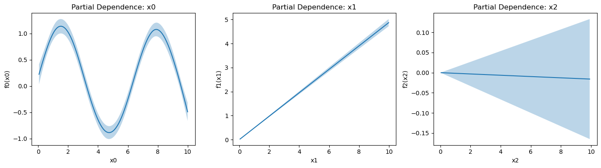
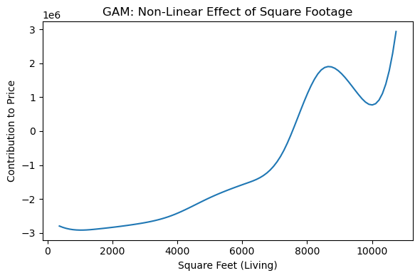

# 일반화가법모형 (GAM)

## 개요

**일반화가법모형(GAM)**은 선형 관계를 가정하는 대신 설명변수의 매끄러운 비모수 함수를 허용하여 선형회귀를 확장한다. GAM은 경직된 선형모형과 신경망 같은 지나치게 복잡한 블랙박스 방법 사이에서 유연한 중간 지대를 제공한다.

GAM의 핵심 혁신은 해석 가능성을 유지하면서 선형항을 매끄러운 함수로 대체하는 것이다.

**선형회귀:**

$$Y = \beta_0 + \beta_1 X_1 + \beta_2 X_2 + \cdots + \beta_p X_p + \epsilon$$

**일반화가법모형:**

$$Y = \beta_0 + f_1(X_1) + f_2(X_2) + \cdots + f_p(X_p) + \epsilon$$

여기서 각 $f_j$는 자료에서 학습한 매끄러운 함수(보통 스플라인)이다.

---

## 왜 GAM을 쓰는가

GAM은 선형회귀의 여러 한계에 대처한다.

1. **비선형 관계** — 현실의 많은 관계는 굽어 있다. GAM은 다항 차수를 손으로 지정하지 않고도 이를 자동으로 포착한다.

2. **변수마다 다른 매끄러움** — 각 설명변수가 벌점 모수(람다)로 조절되는 자기만의 평활 정도를 가질 수 있다.

3. **해석 가능성** — 신경망과 달리 각 매끄러운 함수 $f_j(X_j)$를 개별적으로 시각화하고 해석할 수 있다. 가법 구조 덕분에 기본적으로 효과들이 서로 얽히지 않는다.

4. **자동 과대적합 통제** — 정칙화가 유연성을 유지하면서도 매끄러운 함수의 허위 요동을 막는다.

5. **불확실성 수량화** — 나무 기반 방법과 달리 GAM은 표준오차를 통해 예측 주위의 신뢰띠를 제공한다.

---

## 수학적 정식화

### 기본 GAM

연속형 반응변수에 대한 정규 GAM은

$$Y = \beta_0 + \sum_{j=1}^{p} f_j(X_j) + \epsilon, \quad \epsilon \sim N(0, \sigma^2)$$

### 스플라인을 이용한 매끄러운 함수

매끄러운 함수 $f_j$는 보통 기저함수들의 선형결합으로 표현된다.

$$f_j(X_j) = \sum_{k=1}^{K_j} b_{jk}(X_j) \cdot c_{jk}$$

여기서

- $b_{jk}$는 기저함수(예: B-스플라인, 박판 스플라인),
- $c_{jk}$는 자료에서 학습한 계수,
- $K_j$는 변수 $j$의 기저함수 개수이다.

### 정칙화: 벌점 추정

유연성을 허용하면서 과대적합을 피하기 위해 GAM은 거칢 벌점을 쓴다.

$$\text{Loss} = \frac{1}{n} \sum_{i=1}^{n} \left(y_i - \beta_0 - \sum_{j=1}^{p} f_j(x_{ij})\right)^2 + \sum_{j=1}^{p} \lambda_j \int [f_j''(x)]^2 dx$$

여기서

- 첫째 항은 잔차제곱합이고,
- $\lambda_j$는 $j$번째 함수의 매끄러움을 조절한다. $\lambda_j$가 클수록 더 매끄러운(덜 요동치는) 함수가 된다.
- 적분항은 "거칢"(2계 도함수의 제곱)을 잰다.

### 자유도와 유효 자유도

자유도가 모수의 개수와 같은 선형회귀와 달리, GAM은 매끄러움 벌점을 반영한 **유효 자유도(eDoF)**를 갖는다.

$$\text{eDoF}_j = \text{tr}(S_j)$$

여기서 $S_j$는 기저와 벌점에 의존하는 행렬이다. 모형 전체의 복잡도는

$$\text{eDoF}_{\text{total}} = 1 + \sum_{j=1}^{p} \text{eDoF}_j$$

이 덕분에 전통적인 모수 개수 대신 eDoF를 써서 선형회귀와 같은 기준(AIC, BIC)으로 모형을 비교할 수 있다.

---

## GAM 적합: 역적합 알고리즘

가장 흔한 적합 방법은 반복적 알고리즘인 **역적합**이다.

1. 초기화: 모든 $j$에 대해 $\hat{f}_j^{(0)} = 0$, 그리고 $\hat{\beta}_0 = \bar{y}$

2. 반복 $t$에서:
   - 각 $j = 1, 2, \ldots, p$에 대해:
     - 부분잔차를 계산한다: $r_{-j} = y - \hat{\beta}_0 - \sum_{k \neq j} \hat{f}_k(X_k)$
     - 벌점 $\lambda_j$로 $(X_j, r_{-j})$에 매끄러운 함수를 적합한다: $\hat{f}_j^{(t)} = S(r_{-j} | X_j, \lambda_j)$

3. 수렴할 때까지(계수가 안정될 때까지) 반복한다.

이 방법은 적합 문제를 일변량 평활 문제들로 분해하므로, 고차원 비모수 함수를 직접 적합하는 것에 비해 GAM을 계산적으로 효율적으로 만든다.

---

## 매끄러운 항의 종류

### 선형항

선형항은 다음과 같이 포함된다.

$$f_j(X_j) = \beta_j X_j$$

매끄러움 벌점이 없으며, 관계가 정말로 선형일 때 유용하다.

### 스플라인 항 (s)

기저함수로 표현하고 목적함수에 매끄러움 벌점을 더한다.

$$f_j(X_j) = \sum_{k=1}^{K_j} b_{jk}(X_j) c_{jk}, \qquad \text{벌점: } \lambda_j \int [f_j''(x)]^2 dx$$

함수 자체는 기저함수의 선형결합이고 벌점은 함수의 일부가 아니라 목적함수에 더해지는 항이라는 점에 유의하라.

흔한 선택:

- **삼차 B-스플라인**: 매끄럽고 국소 지지를 가지며 계산이 효율적이다.
- **박판 스플라인**: 매끄러움의 의미에서 최적이지만 계산 비용이 크다.

`df`(자유도) 인자가 유연성을 조절한다. `df`가 클수록 더 많은 요동을 허용한다.

### 순환 스플라인

주기적 자료(예: 하루 중 시각, 요일)에는 순환 스플라인이 $f(0) = f(1)$(또는 적절한 경계 조건)을 강제한다.

---

### statsmodels 사용하기

`statsmodels.gam` 모듈이 GAM 적합을 제공한다.

<div class="codebox" markdown>

#### 예제 1. statsmodels로 GAM 적합 { .eg }

```python
import numpy as np
import pandas as pd
from statsmodels.gam.api import GLMGam, BSplines
import matplotlib.pyplot as plt

# 참 모형은 x0 에 대해 sin, x1 에 대해 선형, x2 는 무관하다.
# GAM 이 이 구조를 그대로 찾아내는지 보는 것이 목표다.
n = 500
np.random.seed(42)
X = np.random.uniform(0, 10, (n, 3))
y = (np.sin(X[:, 0]) + 0.5 * X[:, 1] + np.random.normal(0, 0.5, n))

df = pd.DataFrame({
    'y': y,
    'x0': X[:, 0],
    'x1': X[:, 1],
    'x2': X[:, 2]
})

# 변수마다 기저의 자유도를 달리 준다. 굽은 관계가 있으리라 보는 x0 에만
# 자유도 10 을 주고 나머지는 3 으로 묶었다. 자유도가 클수록 유연하지만
# 그만큼 잡음까지 따라갈 위험이 커진다.
x_spline = df[['x0', 'x1', 'x2']]
bs = BSplines(x_spline, df=[10, 3, 3], degree=[3, 2, 2])

formula = 'y ~ x0 + x1 + x2'
gam = GLMGam.from_formula(formula, data=df, smoother=bs)
results = gam.fit()

# summary()는 실행 날짜와 시각을 함께 찍으므로 계수 표만 인쇄한다.
print(results.summary().tables[1])
```

출력:

```
==============================================================================
                 coef    std err          z      P>|z|      [0.025      0.975]
------------------------------------------------------------------------------
Intercept      0.2502      0.214      1.167      0.243      -0.170       0.670
x0            -0.0018      0.027     -0.069      0.945      -0.054       0.051
x1             0.4849      0.009     51.797      0.000       0.467       0.503
x2            -0.0111      0.010     -1.169      0.242      -0.030       0.008
x0_s0          0.4820      0.363      1.327      0.185      -0.230       1.194
x0_s1          1.6651      0.201      8.277      0.000       1.271       2.059
x0_s2         -0.2072      0.211     -0.983      0.325      -0.620       0.206
x0_s3         -1.3892      0.162     -8.567      0.000      -1.707      -1.071
x0_s4         -0.5957      0.148     -4.031      0.000      -0.885      -0.306
x0_s5          0.9795      0.150      6.533      0.000       0.686       1.273
x0_s6          1.1175      0.199      5.607      0.000       0.727       1.508
x0_s7         -0.4096      0.226     -1.813      0.070      -0.852       0.033
x0_s8         -0.5315      0.168     -3.165      0.002      -0.861      -0.202
x1_s0          0.0208      0.120      0.174      0.862      -0.214       0.255
x1_s1          0.0372      0.059      0.630      0.529      -0.079       0.153
x2_s0         -0.2041      0.119     -1.722      0.085      -0.436       0.028
x2_s1          0.0997      0.059      1.704      0.088      -0.015       0.214
==============================================================================
```

`Df Model: 13.00`이 이 GAM이 쓴 자유도다. 선형 항이었다면 1이었을 것이다.

계수 표를 보면 스플라인 기저마다 계수가 하나씩 붙어 있다. GAM의 계수는 개별적으로 해석하는 것이 아니라 **합쳐서 하나의 곡선**으로 읽어야 한다.

</div>

### pyGAM 사용하기

`pygam` 라이브러리는 격자탐색으로 람다를 자동 선택해 주는 더 친절한 인터페이스를 제공한다.

<div class="codebox" markdown>

#### 예제 2. pygam과 부분의존도 그림 { .eg }

```python
from pygam import LinearGAM, s, l

# x0 에만 스플라인을 씌우고 나머지는 선형으로 둔다.
gam = LinearGAM(s(0, n_splines=12) + l(1) + l(2))

# 격자탐색으로 벌점 lambda 를 고른다. 자료가 스스로 매끄러움을 정하는 셈이다.
gam.gridsearch(X, y)

print(gam.summary())

# 부분의존도 그림은 "다른 변수를 고정했을 때 이 변수 하나가 반응에 미치는
# 몫"을 그린다. GAM 은 항이 더해지는 꼴이라 이런 그림이 그대로 뜻을 갖는다.
# x0 의 곡선이 sin 모양으로 나오는지가 볼거리다.
fig, axes = plt.subplots(1, 3, figsize=(14, 4))
for i in range(3):
    XX = gam.generate_X_grid(term=i)
    pdep, confi = gam.partial_dependence(term=i, X=XX, width=0.95)
    ax = axes[i]
    ax.plot(XX[:, i], pdep)
    ax.fill_between(XX[:, i], confi[:, 0], confi[:, 1], alpha=0.3)
    ax.set_xlabel(f'x{i}')
    ax.set_ylabel(f'f{i}(x{i})')
    ax.set_title(f'Partial Dependence: x{i}')

plt.tight_layout()
plt.show()
```

출력:

```
LinearGAM                                                                                                 
=============================================== ==========================================================
Distribution:                        NormalDist Effective DoF:                                      9.5773
Link Function:                     IdentityLink Log Likelihood:                                  -367.9019
Number of Samples:                          500 AIC:                                              756.9584
                                                AICc:                                             757.4599
                                                GCV:                                                0.2693
                                                Scale:                                              0.5099
                                                Pseudo R-Squared:                                   0.9103
==========================================================================================================
Feature Function                  Lambda               Rank         EDoF         P > x        Sig. Code   
================================= ==================== ============ ============ ============ ============
s(0)                              [1.]                 12           7.6          1.11e-16     ***         
l(1)                              [1.]                 1            1.0          1.11e-16     ***         
l(2)                              [1.]                 1            1.0          8.34e-01                 
intercept                                              1            0.0          9.56e-01                 
==========================================================================================================
Significance codes:  0 '***' 0.001 '**' 0.01 '*' 0.05 '.' 0.1 ' ' 1

WARNING: Fitting splines and a linear function to a feature introduces a model identifiability problem
         which can cause p-values to appear significant when they are not.

WARNING: p-values calculated in this manner behave correctly for un-penalized models or models with
         known smoothing parameters, but when smoothing parameters have been estimated, the p-values
         are typically lower than they should be, meaning that the tests reject the null too readily.
None
```



유효 자유도(Effective DoF) 9.58은 평활 벌점이 실제로 쓴 자유도다. 기저함수를 여럿 두어도 벌점이 그중 상당 부분을 눌러 실질적으로 10개 남짓만 쓴다는 뜻이다.

이것이 회귀 스플라인과 평활 스플라인의 차이다. 앞의 계단함수나 B-스플라인에서는 자유도를 사람이 골랐지만, 여기서는 벌점의 세기 $\lambda$가 자료로부터 정해진다.

</div>

!!! note "`partial_dependence`의 반환값"
    `width`(또는 `quantiles`)를 주면 `partial_dependence`는 부분의존값과 신뢰구간의 **쌍**을 돌려준다. 신뢰구간은 모양이 $(n, 2)$인 배열이므로 위처럼 `pdep, confi = ...`로 풀어서 `confi[:, 0]`, `confi[:, 1]`을 쓴다. 반환값을 `[1]`, `[2]`로 색인하면 `IndexError`가 난다. 격자를 만드는 `generate_X_grid`도 별도 함수가 아니라 모형 객체의 메서드이다.

---

## GAM의 모형선택

### 평활 모수 선택

평활 모수 $\lambda_j$는 편향-분산 절충을 조절한다.

- **$\lambda_j$가 크면** → 더 매끄러운 함수(편향 큼, 분산 작음)
- **$\lambda_j$가 작으면** → 더 요동치는 함수(편향 작음, 분산 큼)

흔한 선택 방법:

1. **일반화 교차검증(GCV)**: 적합과 복잡도의 균형을 맞추며 계산이 효율적이다.
2. **UBRE(불편 위험 추정량)**: AIC와 비슷하며 정규 반응변수에서 잘 작동한다.
3. **자동 격자탐색**: pyGAM이 람다 값의 격자를 자동으로 탐색한다.

### GAM 비교하기

매끄러운 함수를 추정한 뒤에는 다음으로 모형을 비교한다.

- **이탈도**(정규 반응변수에서는 잔차제곱합)
- **유효 자유도**(모형 복잡도를 반영)
- 모수 개수 대신 eDoF를 넣은 **AIC/BIC**:

  $$\text{AIC} = -2 \log L + 2 \cdot \text{eDoF}$$

### 모형 복잡도 조절

전체 복잡도는 다음으로 조절한다.

1. **항별 자유도**(`df` 인자): 기저함수가 적을수록 더 매끄럽다.
2. **전역 평활 벌점**: 모든 람다에 상수를 곱한다.
3. **모형 식**: 관련 있는 매끄러운 항만 포함한다.

---

## 장점과 단점

### 장점

- **유연성**: 손으로 지정하지 않고도 비선형 관계를 포착한다.
- **해석 가능성**: 개별 매끄러운 함수를 시각화하고 이해할 수 있다.
- **자동 매끄러움 선택**: 많은 알고리즘이 평활 모수를 자동으로 최적화한다.
- **불확실성 수량화**: 신뢰띠와 표준오차를 제공한다.
- **효율성**: 역적합 덕분에 중간 정도의 차원까지 확장 가능하다.
- **효과의 비교 가능성**: 가법 구조가 기본적으로 교호작용을 배제하므로 효과들을 나란히 비교할 수 있다.

### 단점

- **차원의 저주**: 설명변수가 10–15개를 넘어가면 성능이 떨어진다(비모수 방법보다는 효율적이지만).
- **가법성 가정**: 교호작용을 명시적으로 넣어야 하며, 고차 교호작용은 더 복잡해진다.
- **평활 모수 선택**: 람다의 선택에 민감할 수 있고 격자탐색은 계산량을 늘린다.
- **해석의 절충**: 관계가 복잡해질수록 단순한 모수적 형태보다 요약하기 어렵다.
- **소프트웨어 의존성**: 구현체마다 결과가 조금씩 다를 수 있다(statsmodels 대 pyGAM 대 R의 mgcv).

---

## 실전 예제: 주택 가격

여러 특성으로 집값을 예측한다고 하자. GAM은 설명변수마다 다른 정도의 매끄러움을 허용한다.

<div class="codebox" markdown>

### 예제 3. 주택 자료에 GAM 적용 { .eg }

```python
from pygam import LinearGAM, s, l
import pandas as pd

house = pd.read_csv("https://raw.githubusercontent.com/gedeck/"
                    "practical-statistics-for-data-scientists/master/data/"
                    "house_sales.csv", sep='\t')

predictors = ['SqFtTotLiving', 'SqFtLot', 'Bathrooms', 'Bedrooms', 'BldgGrade']
X = house[predictors].values
y = house['AdjSalePrice'].values

# 면적만 굽을 수 있다고 보고 나머지는 선형으로 둔다. 이렇게 섞어 쓸 수
# 있다는 것이 GAM 의 실용적인 장점이다.
gam = LinearGAM(
    s(0, n_splines=12) +     # SqFtTotLiving: smooth (likely non-linear)
    l(1) +                   # SqFtLot: linear
    l(2) +                   # Bathrooms: linear
    l(3) +                   # Bedrooms: linear
    l(4)                     # BldgGrade: linear
)

gam.gridsearch(X, y)
print(gam.summary())

# 새 집 하나의 가격을 예측해 본다.
new_house = pd.DataFrame({
    'SqFtTotLiving': [3000],
    'SqFtLot': [10000],
    'Bathrooms': [3.5],
    'Bedrooms': [4],
    'BldgGrade': [10]
})
prediction = gam.predict(new_house[predictors].values)
print(f"Predicted price: ${prediction[0]:,.0f}")

# 면적의 효과가 직선이 아님을 눈으로 확인한다.
fig, ax = plt.subplots(figsize=(6, 4))
XX = gam.generate_X_grid(term=0)
ax.plot(XX[:, 0], gam.partial_dependence(term=0, X=XX))
ax.set_xlabel('Square Feet (Living)')
ax.set_ylabel('Contribution to Price')
ax.set_title('GAM: Non-Linear Effect of Square Footage')
plt.tight_layout()
plt.show()
```

출력:

```
LinearGAM                                                                                                 
=============================================== ==========================================================
Distribution:                        NormalDist Effective DoF:                                     15.0647
Link Function:                     IdentityLink Log Likelihood:                                -313356.458
Number of Samples:                        22687 AIC:                                           626745.0454
                                                AICc:                                          626745.0696
                                                GCV:                                      58267017203.2869
                                                Scale:                                         241241.3271
                                                Pseudo R-Squared:                                   0.6084
==========================================================================================================
Feature Function                  Lambda               Rank         EDoF         P > x        Sig. Code   
================================= ==================== ============ ============ ============ ============
s(0)                              [0.001]              12           11.1         1.11e-16     ***         
l(1)                              [0.001]              1            1.0          1.44e-04     ***         
l(2)                              [0.001]              1            1.0          1.31e-02     *           
l(3)                              [0.001]              1            1.0          3.11e-15     ***         
l(4)                              [0.001]              1            1.0          1.11e-16     ***         
intercept                                              1            0.0          1.11e-16     ***         
==========================================================================================================
Significance codes:  0 '***' 0.001 '**' 0.01 '*' 0.05 '.' 0.1 ' ' 1

WARNING: Fitting splines and a linear function to a feature introduces a model identifiability problem
         which can cause p-values to appear significant when they are not.

WARNING: p-values calculated in this manner behave correctly for un-penalized models or models with
         known smoothing parameters, but when smoothing parameters have been estimated, the p-values
         are typically lower than they should be, meaning that the tests reject the null too readily.
None
Predicted price: $915,154
```



부분 의존 그림이 각 설명변수의 기여를 따로 보여준다. GAM의 강점이 바로 이 해석 가능성이다. 비선형이면서도 변수별 효과를 하나씩 떼어 볼 수 있다.

</div>

---

## 연습문제

<div class="drillbox" markdown>

**연습문제 1.** <span class="diff med" title="중간"></span>
설명변수가 세 개인 GAM의 일반형을 쓰고 표준적인 다중선형회귀 모형과 어떻게 다른지 설명하라.

</div>

??? success "풀이"
    설명변수가 셋인 GAM은

    $$
    E[Y] = \beta_0 + f_1(X_1) + f_2(X_2) + f_3(X_3)
    $$

    여기서 $f_1, f_2, f_3$은 자료에서 추정한 매끄러운(보통 비모수) 함수이다.

    표준적인 다중선형회귀에서는 $E[Y] = \beta_0 + \beta_1 X_1 + \beta_2 X_2 + \beta_3 X_3$이며 각 $f_j$가 선형으로 제약된다($f_j(X_j) = \beta_j X_j$). GAM은 이 제약을 풀어 각 설명변수가 $Y$와 유연한 비선형 관계를 갖도록 허용하되 가법 구조(매끄러운 함수들 사이의 교호작용 없음)는 유지한다.

<div class="drillbox" markdown>

**연습문제 2.** <span class="diff med" title="중간"></span>
GAM에서 평활 모수의 역할을 설명하라. 너무 크게 또는 너무 작게 설정하면 어떻게 되는가?

</div>

??? success "풀이"
    평활 모수 $\lambda$는 자료에 가깝게 적합하는 것과 함수를 매끄럽게 유지하는 것 사이의 절충을 조절한다.

    - **$\lambda$가 너무 작으면:** 매끄러운 함수가 자료를 과대적합하여 잡음까지 포착하고 분산이 큰 요동치는 곡선이 나온다.
    - **$\lambda$가 너무 크면:** 함수가 과도하게 평활되어 직선에 가까워진다. 실제 비선형 패턴을 놓쳐 편향이 생기지만 분산은 줄어든다.

    실무에서 $\lambda$는 편향과 분산의 균형을 맞추도록 교차검증(예: 일반화 교차검증, GCV)으로 고른다.

<div class="drillbox" markdown>

**연습문제 3.** <span class="diff med" title="중간"></span>
비선형 관계를 모형화할 때 다항회귀와 비교한 GAM의 장점 하나와 한계 하나를 기술하라.

</div>

??? success "풀이"
    **장점:** GAM은 자료 기반 평활로 각 설명변수의 유연성 정도를 자동으로 맞춘다. 반면 다항회귀는 차수를 미리 정해야 한다. GAM은 고차 다항식을 괴롭히는 Runge 현상(경계에서의 격렬한 진동)을 피한다.

    **한계:** GAM은 가법 구조($f_1(X_1) + f_2(X_2)$)를 가정하며 설명변수 사이의 교호작용을 기본적으로 포착하지 못한다. 다항회귀는 교호작용 항($X_1 X_2$, $X_1^2 X_2$)을 직접 넣을 수 있다. GAM에서 교호작용을 모형화하려면 텐서곱 평활이나 명시적 교호작용 항을 추가해야 하며 복잡도가 늘어난다.

---

## 정리하며

일반화가법모형은 비선형 회귀에 대한 강력하고 해석 가능한 접근을 제공한다.

- **유연한 매끄러운 함수**가 가법성을 유지하면서 경직된 선형항을 대체한다.
- 정칙화를 통한 **자동 평활**이 과대적합을 막는다.
- 각 효과의 **개별 시각화**가 해석을 돕는다.
- **실용적인 도구**(statsmodels, pyGAM)가 GAM을 실제 응용에서 쓸 수 있게 해 준다.
- 유연성과 해석 가능성 사이의 **절충** 덕분에 중간 정도의 비선형성이 예상될 때 GAM이 이상적이다.

자료가 비선형 관계를 시사하고 해석이 중요할 때, GAM은 선형회귀의 단순함과 완전 비모수 방법의 유연함 사이에서 훌륭한 균형을 제공한다.
