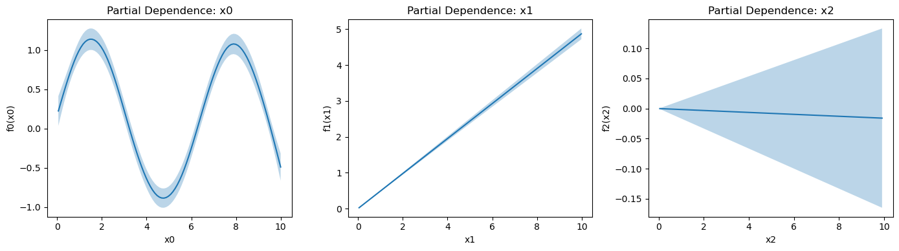
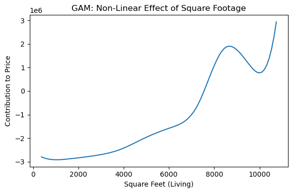

# 일반화가법모형 (GAM)

## 개요

**일반화가법모형(GAM)**은 선형 관계를 가정하는 대신 설명변수의 매끄러운 비모수 함수를 허용하여 선형회귀를 확장한다. GAM은 경직된 선형모형과 신경망 같은 지나치게 복잡한 블랙박스 방법 사이에서 유연한 중간 지대를 제공한다.

GAM의 핵심 혁신은 해석 가능성을 유지하면서 선형항을 매끄러운 함수로 대체하는 것이다.

**선형회귀:**

$$Y = \beta_0 + \beta_1 X_1 + \beta_2 X_2 + \cdots + \beta_p X_p + \epsilon$$

**일반화가법모형:**

$$Y = \beta_0 + f_1(X_1) + f_2(X_2) + \cdots + f_p(X_p) + \epsilon$$

여기서 각 $f_j$는 자료에서 학습한 매끄러운 함수(보통 스플라인)이다.

---

## 왜 GAM을 쓰는가

GAM은 선형회귀의 여러 한계에 대처한다.

1. **비선형 관계** — 현실의 많은 관계는 굽어 있다. GAM은 다항 차수를 손으로 지정하지 않고도 이를 자동으로 포착한다.

2. **변수마다 다른 매끄러움** — 각 설명변수가 벌점 모수(람다)로 조절되는 자기만의 평활 정도를 가질 수 있다.

3. **해석 가능성** — 신경망과 달리 각 매끄러운 함수 $f_j(X_j)$를 개별적으로 시각화하고 해석할 수 있다. 가법 구조 덕분에 기본적으로 효과들이 서로 얽히지 않는다.

4. **자동 과대적합 통제** — 정칙화가 유연성을 유지하면서도 매끄러운 함수의 허위 요동을 막는다.

5. **불확실성 수량화** — 나무 기반 방법과 달리 GAM은 표준오차를 통해 예측 주위의 신뢰띠를 제공한다.

---

## 수학적 정식화

### 기본 GAM

연속형 반응변수에 대한 정규 GAM은

$$Y = \beta_0 + \sum_{j=1}^{p} f_j(X_j) + \epsilon, \quad \epsilon \sim N(0, \sigma^2)$$

### 스플라인을 이용한 매끄러운 함수

매끄러운 함수 $f_j$는 보통 기저함수들의 선형결합으로 표현된다.

$$f_j(X_j) = \sum_{k=1}^{K_j} b_{jk}(X_j) \cdot c_{jk}$$

여기서

- $b_{jk}$는 기저함수(예: B-스플라인, 박판 스플라인),
- $c_{jk}$는 자료에서 학습한 계수,
- $K_j$는 변수 $j$의 기저함수 개수이다.

### 정칙화: 벌점 추정

유연성을 허용하면서 과대적합을 피하기 위해 GAM은 거칢 벌점을 쓴다.

$$\text{Loss} = \frac{1}{n} \sum_{i=1}^{n} \left(y_i - \beta_0 - \sum_{j=1}^{p} f_j(x_{ij})\right)^2 + \sum_{j=1}^{p} \lambda_j \int [f_j''(x)]^2 dx$$

여기서

- 첫째 항은 잔차제곱합이고,
- $\lambda_j$는 $j$번째 함수의 매끄러움을 조절한다. $\lambda_j$가 클수록 더 매끄러운(덜 요동치는) 함수가 된다.
- 적분항은 "거칢"(2계 도함수의 제곱)을 잰다.

### 자유도와 유효 자유도

자유도가 모수의 개수와 같은 선형회귀와 달리, GAM은 매끄러움 벌점을 반영한 **유효 자유도(eDoF)**를 갖는다.

$$\text{eDoF}_j = \text{tr}(S_j)$$

여기서 $S_j$는 기저와 벌점에 의존하는 행렬이다. 모형 전체의 복잡도는

$$\text{eDoF}_{\text{total}} = 1 + \sum_{j=1}^{p} \text{eDoF}_j$$

이 덕분에 전통적인 모수 개수 대신 eDoF를 써서 선형회귀와 같은 기준(AIC, BIC)으로 모형을 비교할 수 있다.

---

## GAM 적합: 역적합 알고리즘

가장 흔한 적합 방법은 반복적 알고리즘인 **역적합**이다.

1. 초기화: 모든 $j$에 대해 $\hat{f}_j^{(0)} = 0$, 그리고 $\hat{\beta}_0 = \bar{y}$

2. 반복 $t$에서:
   - 각 $j = 1, 2, \ldots, p$에 대해:
     - 부분잔차를 계산한다: $r_{-j} = y - \hat{\beta}_0 - \sum_{k \neq j} \hat{f}_k(X_k)$
     - 벌점 $\lambda_j$로 $(X_j, r_{-j})$에 매끄러운 함수를 적합한다: $\hat{f}_j^{(t)} = S(r_{-j} | X_j, \lambda_j)$

3. 수렴할 때까지(계수가 안정될 때까지) 반복한다.

이 방법은 적합 문제를 일변량 평활 문제들로 분해하므로, 고차원 비모수 함수를 직접 적합하는 것에 비해 GAM을 계산적으로 효율적으로 만든다.

---

## 매끄러운 항의 종류

### 선형항

선형항은 다음과 같이 포함된다.

$$f_j(X_j) = \beta_j X_j$$

매끄러움 벌점이 없으며, 관계가 정말로 선형일 때 유용하다.

### 스플라인 항 (s)

기저함수로 표현하고 목적함수에 매끄러움 벌점을 더한다.

$$f_j(X_j) = \sum_{k=1}^{K_j} b_{jk}(X_j) c_{jk}, \qquad \text{벌점: } \lambda_j \int [f_j''(x)]^2 dx$$

함수 자체는 기저함수의 선형결합이고 벌점은 함수의 일부가 아니라 목적함수에 더해지는 항이라는 점에 유의하라.

흔한 선택:

- **삼차 B-스플라인**: 매끄럽고 국소 지지를 가지며 계산이 효율적이다.
- **박판 스플라인**: 매끄러움의 의미에서 최적이지만 계산 비용이 크다.

`df`(자유도) 인자가 유연성을 조절한다. `df`가 클수록 더 많은 요동을 허용한다.

### 순환 스플라인

주기적 자료(예: 하루 중 시각, 요일)에는 순환 스플라인이 $f(0) = f(1)$(또는 적절한 경계 조건)을 강제한다.

---

### statsmodels 사용하기

`statsmodels.gam` 모듈이 GAM 적합을 제공한다.

<div class="exbox" markdown>

**보기 1.** <span class="diff easy" title="쉬움"></span> statsmodels로 GAM 적합. 참 모형이 $y = \sin(x_0) + 0.5\,x_1 + \varepsilon$ 이고 $x_2$ 는 무관한 인공자료에 GAM 을 적합한다. 답을 아는 자료이므로 복원 능력을 직접 재 볼 수 있다.

**(1)** `df=[10, 3, 3]`이 만드는 기저 열의 개수와 계수표의 행 개수를 세시오. 그 가운데 **개별적으로 식별되지 않는** 행은 몇 개인가.

**(2)** 세 부분함수 $f_0, f_1, f_2$ 를 계수표에서 복원하여 참 함수 $\sin(x_0)$, $0.5\,x_1$, $0$ 과 견주시오. 계수 하나하나를 읽는 것과 합쳐서 읽는 것이 어떻게 다른지 수로 보이시오.

</div>

??? success "풀이"

    **(1) 해석적으로.** `BSplines` 는 변수마다 `df`$_j$ 개의 기저함수를 만든 뒤 절편과 겹치지 않게 한 열을 버린다. 그러므로

    $$
    \sum_j (\mathrm{df}_j - 1) = (10 - 1) + (3 - 1) + (3 - 1) = 9 + 2 + 2 = 13
    $$

    열이다. 식 `y ~ x0 + x1 + x2` 가 절편 $1$ 개와 선형항 $3$ 개를 더 놓으므로 계수표의 행은

    $$
    1 + 3 + 13 = 17
    $$

    개다.

    **그런데 선형항 세 개는 식별되지 않는다.** 변수 $j$ 의 기저 $\mathrm{df}_j - 1$ 열에 절편을 돌려주면 그 변수의 기저 전체가 치는 공간이 복원되고, 차수 $d \ge 1$ 인 B-스플라인 기저는 일차함수를 품는다. 곧 $x_j$ 열이 이미 그 공간 안에 있다. 따라서

    $$
    \text{rank} = 17 - 3 = 14 = 1 + 13
    $$

    이고, `Df Model` 은 $14 - 1 = 13$ 으로 보고될 것이다.

    실질적인 결론은 이렇다. **`x0`, `x1`, `x2` 행의 계수는 그 자체로 아무 뜻이 없다.** 같은 적합값을 주는 계수 조합이 무한히 많고, 소프트웨어가 그 가운데 하나(최소노름 해)를 골라 보여 줄 뿐이다. 뜻을 갖는 것은 선형 행과 기저 행을 **합친** 부분함수다.

    **(2) 부분함수를 복원한다.** 변수 $j$ 의 부분함수는

    $$
    \hat f_j(x) = \hat\beta_j\, x + \sum_{k} \hat\gamma_{jk}\, B_{jk}(x)
    $$

    이다. 가법모형이므로 각 $f_j$ 는 상수만큼 자유롭다($f_1$ 에 $c$ 를 더하고 절편에서 $c$ 를 빼면 같은 모형이다). 그러므로 참 함수와 견줄 때는 **중심을 맞추고** 비교해야 한다.

    ```python
    import numpy as np
    import pandas as pd
    from statsmodels.gam.api import GLMGam, BSplines
    import matplotlib.pyplot as plt

    # 참 모형은 x0 에 대해 sin, x1 에 대해 선형, x2 는 무관하다.
    # GAM 이 이 구조를 그대로 찾아내는지 보는 것이 목표다.
    n = 500
    np.random.seed(42)
    X = np.random.uniform(0, 10, (n, 3))
    y = (np.sin(X[:, 0]) + 0.5 * X[:, 1] + np.random.normal(0, 0.5, n))

    df = pd.DataFrame({
        'y': y,
        'x0': X[:, 0],
        'x1': X[:, 1],
        'x2': X[:, 2]
    })

    # 변수마다 기저의 자유도를 달리 준다. 굽은 관계가 있으리라 보는 x0 에만
    # 자유도 10 을 주고 나머지는 3 으로 묶었다. 자유도가 클수록 유연하지만
    # 그만큼 잡음까지 따라갈 위험이 커진다.
    x_spline = df[['x0', 'x1', 'x2']]
    bs = BSplines(x_spline, df=[10, 3, 3], degree=[3, 2, 2])

    formula = 'y ~ x0 + x1 + x2'
    gam = GLMGam.from_formula(formula, data=df, smoother=bs)
    results = gam.fit()

    # summary()는 실행 날짜와 시각을 함께 찍으므로 계수 표만 인쇄한다.
    print(results.summary().tables[1])
    ```

    출력:

    ```
    ==============================================================================
                     coef    std err          z      P>|z|      [0.025      0.975]
    ------------------------------------------------------------------------------
    Intercept      0.2502      0.214      1.167      0.243      -0.170       0.670
    x0            -0.0018      0.027     -0.069      0.945      -0.054       0.051
    x1             0.4849      0.009     51.797      0.000       0.467       0.503
    x2            -0.0111      0.010     -1.169      0.242      -0.030       0.008
    x0_s0          0.4820      0.363      1.327      0.185      -0.230       1.194
    x0_s1          1.6651      0.201      8.277      0.000       1.271       2.059
    x0_s2         -0.2072      0.211     -0.983      0.325      -0.620       0.206
    x0_s3         -1.3892      0.162     -8.567      0.000      -1.707      -1.071
    x0_s4         -0.5957      0.148     -4.031      0.000      -0.885      -0.306
    x0_s5          0.9795      0.150      6.533      0.000       0.686       1.273
    x0_s6          1.1175      0.199      5.607      0.000       0.727       1.508
    x0_s7         -0.4096      0.226     -1.813      0.070      -0.852       0.033
    x0_s8         -0.5315      0.168     -3.165      0.002      -0.861      -0.202
    x1_s0          0.0208      0.120      0.174      0.862      -0.214       0.255
    x1_s1          0.0372      0.059      0.630      0.529      -0.079       0.153
    x2_s0         -0.2041      0.119     -1.722      0.085      -0.436       0.028
    x2_s1          0.0997      0.059      1.704      0.088      -0.015       0.214
    ==============================================================================
    ```

    이제 (1)의 셈을 확인하고 부분함수를 복원한다.

    ```python
    print("변수별 기저 열 =", [sm_.basis.shape[1] for sm_ in bs.smoothers], " 합", bs.basis.shape[1])
    X_all = np.asarray(gam.exog)
    print(f"설계행렬 열 {X_all.shape[1]},  rank {np.linalg.matrix_rank(X_all)}")
    print(f"Df Model = {results.df_model:.2f},  계수표의 행 = {len(results.params)}")

    p = results.params

    def partial(j, name, n_basis):
        """선형 행 하나와 기저 행 몇 개를 합쳐 부분함수를 복원한다."""
        grid = np.linspace(df[name].min(), df[name].max(), 300)
        B = bs.smoothers[j].transform(grid)
        coefs = np.array([p[f'{name}_s{k}'] for k in range(n_basis)])
        return grid, p[name] * grid + B @ coefs

    g1, f1 = partial(1, 'x1', 2)
    slope, icpt = np.polyfit(g1, f1, 1)
    print(f"f1 의 기울기 = {slope:.4f}  (참값 0.5),  직선에서 벗어난 최대량 = {np.abs(f1 - (slope * g1 + icpt)).max():.4f}")
    print(f"x1 행의 계수만 = {p['x1']:.4f},  95% 신뢰구간 = {results.conf_int().loc['x1'].round(4).tolist()}")

    g0, f0 = partial(0, 'x0', 9)
    c = (f0 - np.sin(g0)).mean()
    print(f"f0 를 sin 과 견주면: 중심차 {c:.4f},  중심 맞춘 뒤 최대 오차 {np.abs(f0 - np.sin(g0) - c).max():.4f}")
    print(f"x0 행의 계수만 = {p['x0']:.4f}")

    g2, f2 = partial(2, 'x2', 2)
    print(f"오르내림의 폭:  f0 {f0.max() - f0.min():.4f}   f1 {f1.max() - f1.min():.4f}   "
          f"f2 {f2.max() - f2.min():.4f}  (f2 의 참값은 0)")
    ```

    출력:

    ```
    변수별 기저 열 = [9, 2, 2]  합 13
    설계행렬 열 17,  rank 14
    Df Model = 13.00,  계수표의 행 = 17
    f1 의 기울기 = 0.4886  (참값 0.5),  직선에서 벗어난 최대량 = 0.0007
    x1 행의 계수만 = 0.4849,  95% 신뢰구간 = [0.4665, 0.5032]
    f0 를 sin 과 견주면: 중심차 -0.0788,  중심 맞춘 뒤 최대 오차 0.1215
    x0 행의 계수만 = -0.0018
    오르내림의 폭:  f0 2.1074   f1 4.8522   f2 0.1321  (f2 의 참값은 0)
    ```

    **(1)의 네 수가 모두 맞는다.** 기저 열이 변수별로 $9, 2, 2$ 로 합이 $13$ 이고, 계수표의 행이 $17$ 이며, 설계행렬 $17$ 열의 rank 가 $14$ 다. 식별되지 않는 행이 유도한 대로 $3$ 개다. `Df Model` 도 $13.00$ 이다.

    **(2) 부분함수는 참 함수를 잘 되찾았다.**

    - $f_1$ 의 기울기가 $0.4886$ 으로 참값 $0.5$ 에 가깝다. 직선에서 벗어난 최대량이 $0.0007$ 이니 **곡률을 쓸 수 있었는데도 거의 쓰지 않았다.** 자유도 $3$ 의 이차 스플라인을 주었지만 자료가 직선을 가리켰다는 뜻이다.
    - $f_0$ 는 $\sin$ 과 중심을 맞춘 뒤 최대 오차가 $0.1215$ 다. **잡음의 표준편차 $0.5$ 의 사분의 일**이다. 사인 곡선이라고 알려 주지 않았는데 모양이 자료에서 나왔다.
    - $f_2$ 는 참값이 상수인데 오르내림의 폭이 $0.1321$ 이다. $0$ 은 아니지만, $f_1$ 의 폭 $4.8522$ 와 견주면 **$2.7\%$** 다. 무관한 변수에 자유도를 준 대가로 생긴 잡음이며, 크기로 보아 무해하다.

    **계수 하나하나를 읽으면 엉뚱해진다.** 가장 분명한 자리가 `x0` 행이다. 계수가 $-0.0018$, $p$-값 $0.945$ 로 "$x_0$ 는 쓸모없다" 처럼 보인다. 그러나 $x_0$ 는 참 모형의 주역이고, 그 효과는 $f_0$ 의 폭 $2.1074$ 로 또렷하다. 효과가 `x0_s0` 부터 `x0_s8` 까지 아홉 행에 흩어져 있을 뿐이다.

    `x1` 행은 반대로 운이 좋은 경우다. 계수 $0.4849$ 가 참값 $0.5$ 에 가깝고 신뢰구간 $[0.4665, 0.5032]$ 가 $0.5$ 를 덮는다. 그러나 **이것을 믿을 근거는 없다.** 식별되지 않는 모수이므로 그 값은 소프트웨어가 고른 최소노름 해의 성질이고, 합쳐서 구한 기울기 $0.4886$ 과도 다르다. 다른 구현을 쓰면 $0.4849$ 가 아니라 $0$ 이 나올 수도 있다.

    `Df Model: 13.00` 이 이 GAM 이 쓴 자유도다. 선형 항이었다면 $1$ 이었을 것이다. 결국 **GAM 의 계수는 개별적으로 해석하는 것이 아니라 합쳐서 하나의 곡선으로 읽어야 한다.** 보기 2 의 부분의존 그림이 그 읽기를 그림으로 하는 도구다.

### pyGAM 사용하기

`pygam` 라이브러리는 격자탐색으로 람다를 자동 선택해 주는 더 친절한 인터페이스를 제공한다.

<div class="exbox" markdown>

**보기 2.** <span class="diff easy" title="쉬움"></span> pygam과 부분의존도 그림. 보기 1 과 같은 인공자료에 pygam 으로 GAM 을 적합하고 세 부분의존 곡선을 그린다.

**(1)** 이 모형의 계수 개수를 세시오. 그리고 **참 모형을 안다는 사실**만으로 어떤 모형도 넘을 수 없는 $R^2$ 의 상한을 해석적으로 구하시오.

**(2)** 요약표의 `Pseudo R-Squared`와 `Scale`을 (1)의 상한과 참 모수 $\sigma = 0.5$ 에 견주시오. 상한을 넘었다면 그것이 왜 모순이 아닌가.

</div>

??? success "풀이"

    **(1) 계수는 15 개다.** `s(0, n_splines=12)` 가 $12$ 개, `l(1)` 과 `l(2)` 가 각각 $1$ 개, 절편이 $1$ 개다.

    $$
    12 + 1 + 1 + 1 = 15
    $$

    **$R^2$ 의 상한.** 참 모형이

    $$
    y = \sin(X_0) + 0.5\,X_1 + \varepsilon,
    \qquad X_0, X_1, X_2 \stackrel{\text{iid}}{\sim} U(0, 10),
    \quad \varepsilon \sim N(0, 0.5^2)
    $$

    이고 세 변수와 $\varepsilon$ 이 서로 독립이므로 분산이 그대로 쪼개진다.

    $$
    \operatorname{Var}(y) = \operatorname{Var}\bigl(\sin X_0\bigr) + \operatorname{Var}(0.5\,X_1) + 0.25
    $$

    둘째 항은 균등분포의 분산이 $(b-a)^2/12$ 이므로

    $$
    \operatorname{Var}(0.5\,X_1) = 0.25 \cdot \frac{100}{12} = \frac{25}{12} = 2.083\overline{3}
    $$

    첫째 항은 적분으로 구한다.

    $$
    E[\sin X_0] = \frac{1}{10}\int_0^{10}\! \sin x\, dx = \frac{1 - \cos 10}{10},
    \qquad
    E[\sin^2 X_0] = \frac{1}{10}\int_0^{10}\! \frac{1 - \cos 2x}{2}\, dx = \frac{1}{2} - \frac{\sin 20}{40}
    $$

    이므로

    $$
    \operatorname{Var}(\sin X_0) = \frac{1}{2} - \frac{\sin 20}{40} - \left(\frac{1 - \cos 10}{10}\right)^{\!2} = 0.443355
    $$

    이다. 어떤 모형도 $\varepsilon$ 을 설명할 수는 없으므로

    $$
    R^2_{\max} = \frac{0.443355 + 2.083333}{0.443355 + 2.083333 + 0.25}
             = \frac{2.526688}{2.776688} = 0.909965
    $$

    **$0.9100$ 이 천장이다.** 참 함수를 통째로 알고 있어도 이보다 잘 설명할 수 없다.

    또 하나 예측할 수 있는 것이 잔차의 퍼짐이다. 적합이 참 함수에 가깝다면 잔차는 거의 $\varepsilon$ 이므로, 잔차표준편차 추정값이 $\sigma = 0.5$ 근처여야 한다.

    **(2) 수치적으로.**

    ```python
    from pygam import LinearGAM, s, l

    # x0 에만 스플라인을 씌우고 나머지는 선형으로 둔다.
    gam = LinearGAM(s(0, n_splines=12) + l(1) + l(2))

    # 격자탐색으로 벌점 lambda 를 고른다. 자료가 스스로 매끄러움을 정하는 셈이다.
    gam.gridsearch(X, y)

    print(gam.summary())

    # 부분의존도 그림은 "다른 변수를 고정했을 때 이 변수 하나가 반응에 미치는
    # 몫"을 그린다. GAM 은 항이 더해지는 꼴이라 이런 그림이 그대로 뜻을 갖는다.
    # x0 의 곡선이 sin 모양으로 나오는지가 볼거리다.
    fig, axes = plt.subplots(1, 3, figsize=(14, 4))
    for i in range(3):
        XX = gam.generate_X_grid(term=i)
        pdep, confi = gam.partial_dependence(term=i, X=XX, width=0.95)
        ax = axes[i]
        ax.plot(XX[:, i], pdep)
        ax.fill_between(XX[:, i], confi[:, 0], confi[:, 1], alpha=0.3)
        ax.set_xlabel(f'x{i}')
        ax.set_ylabel(f'f{i}(x{i})')
        ax.set_title(f'Partial Dependence: x{i}')

    plt.tight_layout()
    plt.show()
    ```

    출력:

    ```
    LinearGAM                                                                                                 
    =============================================== ==========================================================
    Distribution:                        NormalDist Effective DoF:                                      9.5773
    Link Function:                     IdentityLink Log Likelihood:                                  -367.9019
    Number of Samples:                          500 AIC:                                              756.9584
                                                    AICc:                                             757.4599
                                                    GCV:                                                0.2693
                                                    Scale:                                              0.5099
                                                    Pseudo R-Squared:                                   0.9103
    ==========================================================================================================
    Feature Function                  Lambda               Rank         EDoF         P > x        Sig. Code   
    ================================= ==================== ============ ============ ============ ============
    s(0)                              [1.]                 12           7.6          1.11e-16     ***         
    l(1)                              [1.]                 1            1.0          1.11e-16     ***         
    l(2)                              [1.]                 1            1.0          8.34e-01                 
    intercept                                              1            0.0          9.56e-01                 
    ==========================================================================================================
    Significance codes:  0 '***' 0.001 '**' 0.01 '*' 0.05 '.' 0.1 ' ' 1

    WARNING: Fitting splines and a linear function to a feature introduces a model identifiability problem
             which can cause p-values to appear significant when they are not.

    WARNING: p-values calculated in this manner behave correctly for un-penalized models or models with
             known smoothing parameters, but when smoothing parameters have been estimated, the p-values
             are typically lower than they should be, meaning that the tests reject the null too readily.
    None
    ```

    


    요약표의 수를 (1)의 예측과 맞춰 본다.

    ```python
    st = gam.statistics_

    Vsin = 0.5 - np.sin(20) / 40 - ((1 - np.cos(10)) / 10) ** 2
    Vlin = 0.25 * 100 / 12
    print(f"Var(sin X0) = {Vsin:.6f},  Var(0.5 X1) = {Vlin:.6f},  Var(eps) = 0.250000")
    print(f"모집단 R^2 상한 = {(Vsin + Vlin) / (Vsin + Vlin + 0.25):.6f}")

    print(f"계수 개수 = {[t.n_coefs for t in gam.terms]}  합 {len(gam.coef_)}")
    print(f"고른 lam = {gam.terms[0].lam[0]:g}  (격자 10^-3 ~ 10^3 의 가운데)")
    print(f"Pseudo R-Squared = {st['pseudo_r2']['explained_deviance']:.6f}")

    pred = gam.predict(X)
    rss = ((y - pred) ** 2).sum()
    rss_oracle = ((y - np.sin(X[:, 0]) - 0.5 * X[:, 1]) ** 2).sum()
    tss = ((y - y.mean()) ** 2).sum()
    print(f"GAM 의 RSS = {rss:.4f},  참 함수를 아는 RSS = {rss_oracle:.4f},  TSS = {tss:.4f}")
    print(f"1 - RSS/TSS = {1 - rss / tss:.6f},  1 - RSS(참)/TSS = {1 - rss_oracle / tss:.6f}")
    print(f"Scale = {st['scale']:.6f},  sqrt(RSS/(n - edof)) = {np.sqrt(rss / (n - st['edof'])):.6f}")
    print(f"Effective DoF = {st['edof']:.4f}  (계수 {len(gam.coef_)}개 가운데)")
    ```

    출력:

    ```
    Var(sin X0) = 0.443355,  Var(0.5 X1) = 2.083333,  Var(eps) = 0.250000
    모집단 R^2 상한 = 0.909965
    계수 개수 = [12, 1, 1, 1]  합 15
    고른 lam = 1  (격자 10^-3 ~ 10^3 의 가운데)
    Pseudo R-Squared = 0.910264
    GAM 의 RSS = 127.5046,  참 함수를 아는 RSS = 129.3726,  TSS = 1420.8819
    1 - RSS/TSS = 0.910264,  1 - RSS(참)/TSS = 0.908949
    Scale = 0.509891,  sqrt(RSS/(n - edof)) = 0.509891
    Effective DoF = 9.5773  (계수 15개 가운데)
    ```

    **계수 개수는 예측대로 $15$ 개다.**

    **$R^2$ 는 상한을 넘었다.** 요약표의 `Pseudo R-Squared` $= 0.9103$ 이고 (1)이 준 천장은 $0.909965$ 다. 아주 조금이지만 넘었다. **모순이 아니다.** 두 가지 까닭이 겹쳐 있다.

    첫째, $0.909965$ 는 **모집단**의 양이고 요약표의 값은 이 표본 $500$ 개에서 계산한 것이다. 표본에서는 $\varepsilon$ 의 실현된 분산이 $0.25$ 와 다르고, 설명변수의 분포도 균등분포와 조금 다르다.

    둘째, 그리고 더 중요하게, 이것은 **훈련** $R^2$ 다. 출력이 그 증거를 바로 보여 준다. GAM 의 $\mathrm{RSS} = 127.5046$ 인데 **참 함수를 그대로 써서 얻는 $\mathrm{RSS}$ 는 $129.3726$** 이다. 곧 GAM 이 정답보다 더 잘 맞췄다. 그럴 수 있는 길은 하나뿐이다. 잡음의 일부를 외운 것이다. 차이가 $1.87$, 비율로 $1.4\%$ 이니 외운 양이 많지는 않다. 참 함수를 쓴 $R^2$ 는 $0.908949$ 로 상한 아래에 있다.

    이 셈은 **훈련 $R^2$ 가 천장을 넘는 것이 과적합의 직접적인 증거**라는 점을 보여 준다. 참값을 모르는 실제 자료에서는 이 비교를 할 수 없고, 그래서 교차검증이 필요하다.

    **`Scale` 은 잔차표준편차다.** $0.509891$ 이 손으로 계산한 $\sqrt{\mathrm{RSS}/(n - \mathrm{edof})}$ 와 소수 여섯째 자리까지 같다. 분산이 아니라 **표준편차**라는 점을 기억해 두자. 참값 $\sigma = 0.5$ 와 $2\%$ 차이이고, 이 표본에서 실현된 잡음의 표준편차($0.5083$)와는 $0.3\%$ 차이다. **참 모수를 꽤 정확히 되찾았다.**

    `lam` 은 $1 = 10^0$ 으로 격자 $10^{-3} \sim 10^{3}$ 의 정확히 가운데다. 양 끝에 붙지 않았으니 격자가 충분히 넓었다.


    유효 자유도(Effective DoF) $9.5773$ 은 평활 벌점이 실제로 쓴 자유도다. 계수가 $15$ 개인데 그 가운데 $9.58$ 개 몫만 쓴다. 표에서 `s(0)` 의 Rank 가 $12$ 인데 EDoF 가 $7.6$ 이니 **스플라인 항에서만 $4.4$ 를 거두어들였다.** 기저함수를 여럿 두어도 벌점이 그중 상당 부분을 누른다는 뜻이다.

    이것이 회귀 스플라인과 평활 스플라인의 차이다. 앞의 계단함수나 B-스플라인에서는 자유도를 사람이 골랐지만, 여기서는 벌점의 세기 $\lambda$ 가 자료로부터 정해진다.

    요약표의 두 경고도 읽어 둘 것이다. 첫째 경고는 보기 1 에서 본 식별 문제를 말한다. 스플라인과 선형항을 같은 변수에 함께 주면 모수가 식별되지 않고 $p$-값이 부풀 수 있다. 둘째 경고는 $\lambda$ 를 자료로 고른 뒤 그 $\lambda$ 에서의 $p$-값을 보고하면 **귀무가설을 너무 쉽게 기각한다**고 말한다. 선택 편의다. 다행히 이 자료에서는 결론이 또렷하다. `l(2)` 곧 무관한 $x_2$ 의 $p$-값이 $0.834$ 로 **유의하지 않다고 바르게 판정했다.**

!!! note "`partial_dependence`의 반환값"
    `width`(또는 `quantiles`)를 주면 `partial_dependence`는 부분의존값과 신뢰구간의 **쌍**을 돌려준다. 신뢰구간은 모양이 $(n, 2)$인 배열이므로 위처럼 `pdep, confi = ...`로 풀어서 `confi[:, 0]`, `confi[:, 1]`을 쓴다. 반환값을 `[1]`, `[2]`로 색인하면 `IndexError`가 난다. 격자를 만드는 `generate_X_grid`도 별도 함수가 아니라 모형 객체의 메서드이다.

---

## GAM의 모형선택

### 평활 모수 선택

평활 모수 $\lambda_j$는 편향-분산 절충을 조절한다.

- **$\lambda_j$가 크면** → 더 매끄러운 함수(편향 큼, 분산 작음)
- **$\lambda_j$가 작으면** → 더 요동치는 함수(편향 작음, 분산 큼)

흔한 선택 방법:

1. **일반화 교차검증(GCV)**: 적합과 복잡도의 균형을 맞추며 계산이 효율적이다.
2. **UBRE(불편 위험 추정량)**: AIC와 비슷하며 정규 반응변수에서 잘 작동한다.
3. **자동 격자탐색**: pyGAM이 람다 값의 격자를 자동으로 탐색한다.

### GAM 비교하기

매끄러운 함수를 추정한 뒤에는 다음으로 모형을 비교한다.

- **이탈도**(정규 반응변수에서는 잔차제곱합)
- **유효 자유도**(모형 복잡도를 반영)
- 모수 개수 대신 eDoF를 넣은 **AIC/BIC**:

  $$\text{AIC} = -2 \log L + 2 \cdot \text{eDoF}$$

### 모형 복잡도 조절

전체 복잡도는 다음으로 조절한다.

1. **항별 자유도**(`df` 인자): 기저함수가 적을수록 더 매끄럽다.
2. **전역 평활 벌점**: 모든 람다에 상수를 곱한다.
3. **모형 식**: 관련 있는 매끄러운 항만 포함한다.

---

## 장점과 단점

### 장점

- **유연성**: 손으로 지정하지 않고도 비선형 관계를 포착한다.
- **해석 가능성**: 개별 매끄러운 함수를 시각화하고 이해할 수 있다.
- **자동 매끄러움 선택**: 많은 알고리즘이 평활 모수를 자동으로 최적화한다.
- **불확실성 수량화**: 신뢰띠와 표준오차를 제공한다.
- **효율성**: 역적합 덕분에 중간 정도의 차원까지 확장 가능하다.
- **효과의 비교 가능성**: 가법 구조가 기본적으로 교호작용을 배제하므로 효과들을 나란히 비교할 수 있다.

### 단점

- **차원의 저주**: 설명변수가 10–15개를 넘어가면 성능이 떨어진다(비모수 방법보다는 효율적이지만).
- **가법성 가정**: 교호작용을 명시적으로 넣어야 하며, 고차 교호작용은 더 복잡해진다.
- **평활 모수 선택**: 람다의 선택에 민감할 수 있고 격자탐색은 계산량을 늘린다.
- **해석의 절충**: 관계가 복잡해질수록 단순한 모수적 형태보다 요약하기 어렵다.
- **소프트웨어 의존성**: 구현체마다 결과가 조금씩 다를 수 있다(statsmodels 대 pyGAM 대 R의 mgcv).

---

## 실전 보기: 주택 가격

여러 특성으로 집값을 예측한다고 하자. GAM은 설명변수마다 다른 정도의 매끄러움을 허용한다.

<div class="exbox" markdown>

**보기 3.** <span class="diff easy" title="쉬움"></span> 주택 자료에 GAM 적용. King County 전체 22,687 건에 같은 짜임(면적만 `s()`, 나머지는 `l()`)의 GAM 을 적합한다.

**(1)** 요약표의 `AIC` 가 쪽머리에 적힌 $\text{AIC} = -2\log L + 2\cdot\text{eDoF}$ 와 맞는지 확인하시오. 어긋나면 그 차이가 무엇을 세는 것인가. `AICc` 의 보정항도 복원하시오.

**(2)** 고른 `Lambda` 가 격자의 어디에 놓였는지 보고, 그것이 무엇을 알려 주는 신호인지 말하시오. 같은 설명변수의 선형 OLS 와 견주어 GAM 이 얻은 것과 치른 값을 적으시오.

</div>

??? success "풀이"

    **(1) 해석적으로.** AIC 는 로그가능도에 **추정한 모수의 개수**만큼 벌점을 준다.

    $$
    \text{AIC} = -2\log L + 2k
    $$

    여기서 $k$ 를 무엇으로 셀 것인가가 요점이다. 벌점이 걸린 GAM 에서는 계수의 개수가 아니라 유효자유도를 쓴다. 그런데 정규 반응변수의 GAM 에는 계수 말고도 추정하는 모수가 하나 더 있다. **잔차분산 $\sigma^2$** 다. 그것까지 세면

    $$
    k = \text{eDoF} + 1
    $$

    이므로 쪽머리의 식보다 $2$ 만큼 큰 값이 나올 것이다. 어느 쪽인지는 수로 가린다.

    `AICc` 는 표본이 모수에 비해 작을 때 쓰는 작은표본 보정이다. 표준적인 보정항은

    $$
    \text{AICc} = \text{AIC} + \frac{2k(k+1)}{n - k - 1}
    $$

    이고, 여기서도 $k = \text{eDoF} + 1$ 을 쓰는지 확인하면 (1)의 답이 두 번 확인된다.

    **(2) 수치적으로.**
    ```python
    from pygam import LinearGAM, s, l
    import pandas as pd

    house = pd.read_csv("https://raw.githubusercontent.com/gedeck/"
                        "practical-statistics-for-data-scientists/master/data/"
                        "house_sales.csv", sep='\t')

    predictors = ['SqFtTotLiving', 'SqFtLot', 'Bathrooms', 'Bedrooms', 'BldgGrade']
    X = house[predictors].values
    y = house['AdjSalePrice'].values

    # 면적만 굽을 수 있다고 보고 나머지는 선형으로 둔다. 이렇게 섞어 쓸 수
    # 있다는 것이 GAM 의 실용적인 장점이다.
    gam = LinearGAM(
        s(0, n_splines=12) +     # SqFtTotLiving: smooth (likely non-linear)
        l(1) +                   # SqFtLot: linear
        l(2) +                   # Bathrooms: linear
        l(3) +                   # Bedrooms: linear
        l(4)                     # BldgGrade: linear
    )

    gam.gridsearch(X, y)
    print(gam.summary())

    # 새 집 하나의 가격을 예측해 본다.
    new_house = pd.DataFrame({
        'SqFtTotLiving': [3000],
        'SqFtLot': [10000],
        'Bathrooms': [3.5],
        'Bedrooms': [4],
        'BldgGrade': [10]
    })
    prediction = gam.predict(new_house[predictors].values)
    print(f"Predicted price: ${prediction[0]:,.0f}")

    # 면적의 효과가 직선이 아님을 눈으로 확인한다.
    fig, ax = plt.subplots(figsize=(6, 4))
    XX = gam.generate_X_grid(term=0)
    ax.plot(XX[:, 0], gam.partial_dependence(term=0, X=XX))
    ax.set_xlabel('Square Feet (Living)')
    ax.set_ylabel('Contribution to Price')
    ax.set_title('GAM: Non-Linear Effect of Square Footage')
    plt.tight_layout()
    plt.show()
    ```

    출력:

    ```
    LinearGAM                                                                                                 
    =============================================== ==========================================================
    Distribution:                        NormalDist Effective DoF:                                     15.0647
    Link Function:                     IdentityLink Log Likelihood:                                -313356.458
    Number of Samples:                        22687 AIC:                                           626745.0454
                                                    AICc:                                          626745.0696
                                                    GCV:                                      58267017203.2869
                                                    Scale:                                         241241.3271
                                                    Pseudo R-Squared:                                   0.6084
    ==========================================================================================================
    Feature Function                  Lambda               Rank         EDoF         P > x        Sig. Code   
    ================================= ==================== ============ ============ ============ ============
    s(0)                              [0.001]              12           11.1         1.11e-16     ***         
    l(1)                              [0.001]              1            1.0          1.44e-04     ***         
    l(2)                              [0.001]              1            1.0          1.31e-02     *           
    l(3)                              [0.001]              1            1.0          3.11e-15     ***         
    l(4)                              [0.001]              1            1.0          1.11e-16     ***         
    intercept                                              1            0.0          1.11e-16     ***         
    ==========================================================================================================
    Significance codes:  0 '***' 0.001 '**' 0.01 '*' 0.05 '.' 0.1 ' ' 1

    WARNING: Fitting splines and a linear function to a feature introduces a model identifiability problem
             which can cause p-values to appear significant when they are not.

    WARNING: p-values calculated in this manner behave correctly for un-penalized models or models with
             known smoothing parameters, but when smoothing parameters have been estimated, the p-values
             are typically lower than they should be, meaning that the tests reject the null too readily.
    None
    Predicted price: $915,154
    ```

    

    요약표의 수들을 손으로 복원해 본다.

    ```python
    import numpy as np
    from sklearn.linear_model import LinearRegression
    from sklearn.metrics import r2_score

    st = gam.statistics_
    n = len(y)

    print(f"계수 개수 = {[t.n_coefs for t in gam.terms]}  합 {len(gam.coef_)}")
    print(f"고른 lam = {gam.terms[0].lam[0]:g}   격자의 하한 = {np.logspace(-3, 3, 11)[0]:g}")
    print(f"Effective DoF = {st['edof']:.4f}")
    print(f"AIC: -2logL + 2*edof     = {-2 * st['loglikelihood'] + 2 * st['edof']:.4f}")
    print(f"     -2logL + 2*(edof+1) = {-2 * st['loglikelihood'] + 2 * (st['edof'] + 1):.4f}")
    print(f"     요약표의 AIC         = {st['AIC']:.4f}")
    k = st['edof'] + 1
    print(f"AICc = AIC + 2k(k+1)/(n-k-1) = {st['AIC'] + 2 * k * (k + 1) / (n - k - 1):.4f}"
          f"   요약표 {st['AICc']:.4f}")

    pred = gam.predict(X)
    rss = ((y - pred) ** 2).sum()
    print(f"1 - RSS/TSS = {1 - rss / ((y - y.mean()) ** 2).sum():.6f}"
          f"   요약표의 Pseudo R-Squared {st['pseudo_r2']['explained_deviance']:.4f}")
    print(f"Scale = {st['scale']:,.4f},  sqrt(RSS/(n-edof)) = {np.sqrt(rss / (n - st['edof'])):,.4f}")

    lin = LinearRegression().fit(X, y)
    print(f"선형 OLS: 모수 6개  R^2 = {r2_score(y, lin.predict(X)):.6f}")
    print(f"새 집 예측: GAM {gam.predict(new_house[predictors].values)[0]:,.0f}"
          f"   선형 {lin.predict(new_house[predictors].values)[0]:,.0f}")
    ```

    출력:

    ```
    계수 개수 = [12, 1, 1, 1, 1, 1]  합 17
    고른 lam = 0.001   격자의 하한 = 0.001
    Effective DoF = 15.0647
    AIC: -2logL + 2*edof     = 626743.0454
         -2logL + 2*(edof+1) = 626745.0454
         요약표의 AIC         = 626745.0454
    AICc = AIC + 2k(k+1)/(n-k-1) = 626745.0696   요약표 626745.0696
    1 - RSS/TSS = 0.608435   요약표의 Pseudo R-Squared 0.6084
    Scale = 241,241.3271,  sqrt(RSS/(n-edof)) = 241,241.3271
    선형 OLS: 모수 6개  R^2 = 0.540588
    새 집 예측: GAM 915,154   선형 965,956
    ```

    **(1) pygam 은 eDoF + 1 을 센다.** 쪽머리의 식으로는 $626743.0454$ 가 나오고 요약표는 $626745.0454$ 다. 정확히 $2$ 만큼 크다. 유도한 대로 $k = \text{eDoF} + 1 = 16.0647$ 을 쓰면 $626745.0454$ 로 **소수 넷째 자리까지 일치**한다. 더해진 모수 하나가 잔차분산 $\sigma^2$ 다.

    `AICc` 도 같은 $k$ 로 복원된다. 보정항이 $2k(k+1)/(n-k-1) = 0.0242$ 이고, 그것을 AIC 에 더한 $626745.0696$ 이 요약표와 소수 넷째 자리까지 같다. **보정이 $0.02$ 밖에 안 된다**는 것도 읽을 거리다. $n = 22{,}687$ 에 $k = 16$ 이니 작은표본 보정이 할 일이 없다. AICc 가 뜻을 갖는 것은 $n/k$ 가 수십 이하일 때다.

    `Scale` 과 `Pseudo R-Squared` 도 보기 2 에서 본 정의 그대로다. $\sqrt{\mathrm{RSS}/(n - \text{eDoF})} = 241{,}241.3271$ 이 요약표의 `Scale` 과 소수 넷째 자리까지 같고, $1 - \mathrm{RSS}/\mathrm{TSS} = 0.608435$ 가 `Pseudo R-Squared` $0.6084$ 와 같다.

    **(2) Lambda 가 격자의 바닥에 붙었다.** 고른 값이 $0.001$ 이고 그것이 기본 격자 `np.logspace(-3, 3, 11)` 의 **하한**이다. 이것은 "최적값을 찾았다" 가 아니라 **"격자를 더 낮은 쪽으로 넓혀 보라"** 는 신호다. GCV 가 벌점을 더 줄이고 싶어했는데 격자가 막은 것일 수 있다. 보기 2 에서는 $\lambda = 1$ 로 격자 안쪽이었으니 그때는 걱정할 것이 없었다.

    왜 바닥으로 갔는지는 짐작이 된다. 관측값이 $22{,}687$ 개인데 계수가 $17$ 개뿐이다. 자료가 모수보다 천 배 넘게 많으면 과적합의 위험이 거의 없으므로 벌점을 걸 이유가 없다. 실제로 `s(0)` 의 EDoF 가 Rank $12$ 가운데 $11.1$ 이니 **벌점이 자유도를 거의 깎지 못했다.** 보기 2 에서 $12$ 중 $7.6$ 만 남았던 것과 대비된다.

    **선형 OLS 와 견주면.** $R^2$ 가 $0.5406$ 에서 $0.6084$ 로 올랐다. $0.0678$, 비율로 $12.5\%$ 개선이다. 모수는 $6$ 개에서 유효 $15.06$ 개로 늘었다. **면적 하나에 곡선을 허락한 대가로 자유도 아홉 개를 더 쓰고 설명력을 $7$ 퍼센트포인트 얻었다.** 자료가 이만큼 많으면 괜찮은 거래다.

    예측에서도 차이가 보인다. 거주면적 $3{,}000$ 평방피트짜리 예시 주택에 대해 GAM 은 $915{,}154$ 달러, 선형 모형은 $965{,}956$ 달러를 준다. $50{,}802$ 달러, $5.3\%$ 차이다. **선형 모형이 더 비싸게 부른다**는 방향이 중요하다. 면적의 효과가 큰 집에서 꺾여 완만해지는데 직선은 그 꺾임을 모르고 계속 올라가기 때문이다. 부분의존 그림에서 보이는 것이 바로 그 꺾임이다.

    이 세 값 모두 **훈련자료**의 값임을 잊지 말 것이다. $R^2$ 와 AIC 는 모수를 늘리는 쪽을 기계적으로 좋아하지 않지만(AIC 는 벌점을 주므로), 그 벌점의 크기가 옳다는 보장은 없다. 게다가 $\lambda$ 를 GCV 로 고른 뒤 같은 자료에서 AIC 를 읽었으므로 선택 편의가 섞여 있다.

    부분 의존 그림이 각 설명변수의 기여를 따로 보여준다. GAM 의 강점이 바로 이 해석 가능성이다. 비선형이면서도 변수별 효과를 하나씩 떼어 볼 수 있다.

---

## 연습문제

<div class="drillbox" markdown>

**연습문제 1.** <span class="diff med" title="중간"></span>
설명변수가 세 개인 GAM의 일반형을 쓰고 표준적인 다중선형회귀 모형과 어떻게 다른지 설명하라.

</div>

??? success "풀이"
    설명변수가 셋인 GAM은

    $$
    E[Y] = \beta_0 + f_1(X_1) + f_2(X_2) + f_3(X_3)
    $$

    여기서 $f_1, f_2, f_3$은 자료에서 추정한 매끄러운(보통 비모수) 함수이다.

    표준적인 다중선형회귀에서는 $E[Y] = \beta_0 + \beta_1 X_1 + \beta_2 X_2 + \beta_3 X_3$이며 각 $f_j$가 선형으로 제약된다($f_j(X_j) = \beta_j X_j$). GAM은 이 제약을 풀어 각 설명변수가 $Y$와 유연한 비선형 관계를 갖도록 허용하되 가법 구조(매끄러운 함수들 사이의 교호작용 없음)는 유지한다.

<div class="drillbox" markdown>

**연습문제 2.** <span class="diff med" title="중간"></span>
GAM에서 평활 모수의 역할을 설명하라. 너무 크게 또는 너무 작게 설정하면 어떻게 되는가?

</div>

??? success "풀이"
    평활 모수 $\lambda$는 자료에 가깝게 적합하는 것과 함수를 매끄럽게 유지하는 것 사이의 절충을 조절한다.

    - **$\lambda$가 너무 작으면:** 매끄러운 함수가 자료를 과대적합하여 잡음까지 포착하고 분산이 큰 요동치는 곡선이 나온다.
    - **$\lambda$가 너무 크면:** 함수가 과도하게 평활되어 직선에 가까워진다. 실제 비선형 패턴을 놓쳐 편향이 생기지만 분산은 줄어든다.

    실무에서 $\lambda$는 편향과 분산의 균형을 맞추도록 교차검증(예: 일반화 교차검증, GCV)으로 고른다.

<div class="drillbox" markdown>

**연습문제 3.** <span class="diff med" title="중간"></span>
비선형 관계를 모형화할 때 다항회귀와 비교한 GAM의 장점 하나와 한계 하나를 기술하라.

</div>

??? success "풀이"
    **장점:** GAM은 자료 기반 평활로 각 설명변수의 유연성 정도를 자동으로 맞춘다. 반면 다항회귀는 차수를 미리 정해야 한다. GAM은 고차 다항식을 괴롭히는 Runge 현상(경계에서의 격렬한 진동)을 피한다.

    **한계:** GAM은 가법 구조($f_1(X_1) + f_2(X_2)$)를 가정하며 설명변수 사이의 교호작용을 기본적으로 포착하지 못한다. 다항회귀는 교호작용 항($X_1 X_2$, $X_1^2 X_2$)을 직접 넣을 수 있다. GAM에서 교호작용을 모형화하려면 텐서곱 평활이나 명시적 교호작용 항을 추가해야 하며 복잡도가 늘어난다.

---

## 정리하며

일반화가법모형은 비선형 회귀에 대한 강력하고 해석 가능한 접근을 제공한다.

- **유연한 매끄러운 함수**가 가법성을 유지하면서 경직된 선형항을 대체한다.
- 정칙화를 통한 **자동 평활**이 과대적합을 막는다.
- 각 효과의 **개별 시각화**가 해석을 돕는다.
- **실용적인 도구**(statsmodels, pyGAM)가 GAM을 실제 응용에서 쓸 수 있게 해 준다.
- 유연성과 해석 가능성 사이의 **절충** 덕분에 중간 정도의 비선형성이 예상될 때 GAM이 이상적이다.

자료가 비선형 관계를 시사하고 해석이 중요할 때, GAM은 선형회귀의 단순함과 완전 비모수 방법의 유연함 사이에서 훌륭한 균형을 제공한다.
