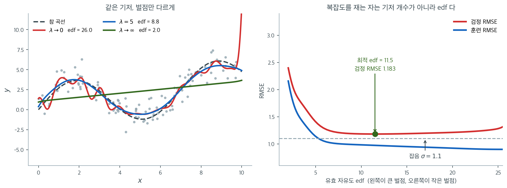

# 스플라인과 일반화가법모형

## 개요

[다항회귀](../interaction_polynomial/polynomial_regression.md)에서는 설명변수의 전 범위에 하나의 $d$차 다항식을 적합한다. 이 전역적 접근에는 근본적인 한계가 있다. 한 구역의 국소 곡률을 잡아내려고 차수를 높이면 다른 곳에서 원치 않는 진동이 생긴다(Runge 현상). 스플라인은 국소 구간마다 낮은 차수의 다항식을 적합하고 **매듭**이라 부르는 경계에서 매끄럽게 이어 붙임으로써 이를 극복한다. 일반화가법모형(GAM)은 이 아이디어를 여러 설명변수로 확장하여, 함수 형태를 미리 지정하지 않고 반응변수를 설명변수마다 하나씩의 매끄러운 함수를 더한 것으로 모형화한다.

이 절은 이러한 유연한 비선형 회귀 방법의 수학적 토대와 실용적 사용법을 다룬다. 전체를 관통하는 핵심 발상은 적합과 매끄러움 사이의 절충이다. 매듭이 너무 적거나 벌점이 너무 크면 과소적합이 되고, 매듭이 너무 많거나 벌점이 너무 작으면 과적합이 된다.

## 내용

이 절은 다음 페이지로 이루어진다.

- [**일반화가법모형**](generalized_additive_models.md) — 반응변수를 설명변수마다 하나씩의 매끄러운 함수의 합으로 모형화하고 벌점가능도로 추정하는 유연한 준모수 회귀

## 핵심 개념

### 기저함수

매듭이 $K$개인 $d$차 스플라인은 **기저함수**들의 선형결합이다. 가장 흔한 선택은 **B-스플라인 기저**로, 작은 구간에서만 0이 아닌 국소 다항함수들로 이루어진다. 회귀 스플라인 모형은 다음 형태를 갖는다.

$$
f(x) = \sum_{j=1}^{K+d+1} \beta_j B_j(x)
$$

여기서 $B_j(x)$는 B-스플라인 기저함수이다. 각 $B_j$가 국소적이므로 스플라인은 고차 다항식의 전역적 진동 문제 없이 자료의 구역마다 적응한다.

### 평활 벌점

매듭이 많은 회귀 스플라인은 자료를 과적합할 수 있다. **평활 스플라인**은 적합된 곡선의 거칢에 벌점을 주어 이에 대처한다. 목적함수는 다음을 최소화한다.

$$
\sum_{i=1}^{n} (Y_i - f(x_i))^2 + \lambda \int [f''(x)]^2 \, dx
$$

평활 모수 $\lambda \geq 0$이 절충을 조절한다. $\lambda = 0$이면 자료를 보간하고, $\lambda \to \infty$이면 $f$가 직선으로 밀려간다. 실무에서 $\lambda$는 교차검증이나 일반화 교차검증(GCV)으로 고른다.

### 유효 자유도

평활 벌점 때문에 모형의 복잡도는 단순히 기저함수의 개수가 아니다. **유효 자유도**(edf)는 실제로 쓰인 유연성을 수량화한다.

$$
\text{edf} = \operatorname{tr}(\mathbf{S})
$$

여기서 $\mathbf{S}$는 $\hat{\mathbf{f}} = \mathbf{S} \mathbf{Y}$를 만족하는 평활자(모자) 행렬이다. $\lambda = 0$이면 $\text{edf}$는 기저함수의 개수와 같다(보간). $\lambda \to \infty$이면 $\text{edf} \to 2$가 된다(절편과 기울기를 갖는 직선). 그 사이의 $\lambda$ 값은 이 두 극단 사이의 $\text{edf}$를 주어 모형 복잡도의 연속적인 척도를 제공한다.

위 문단을 그림으로 확인해 보자. 관측값 $120$개에 잡음 $\sigma = 1.1$을 주고, **기저함수 $26$개를 고정한 채 벌점 $\lambda$만** 바꾸어 적합했다. 왼쪽 그림의 세 곡선은 모두 같은 기저에서 나왔다.

$\lambda \to 0$인 붉은 곡선은 $\text{edf} = 26.0$으로 기저함수의 개수와 정확히 같다. 잡음 하나하나를 좇느라 참 곡선(검은 점선) 주위에서 끊임없이 진동하고, 자료가 성긴 오른쪽 끝에서는 화면 밖으로 튀어 오른다. $\lambda \to \infty$인 초록 곡선은 $\text{edf} = 2.0$으로 절편과 기울기 둘뿐, 곧 **직선**이다. 벌점 $\int [f'']^2$을 무한히 무겁게 매기면 이계도함수가 $0$인 함수만 살아남기 때문이다. 그 사이의 $\lambda = 5$인 파란 곡선이 $\text{edf} = 8.8$로 참 곡선을 가장 잘 따라간다.

오른쪽이 이 절충을 수로 잰 것이다. 가로축이 $\text{edf}$이고 오른쪽으로 갈수록 벌점이 작다. 훈련 RMSE(파랑)는 $\text{edf}$가 커질수록 계속 줄어들지만, 새 자료에서 잰 검정 RMSE(빨강)는 $\text{edf} = 11.5$ 근처에서 최소 $1.183$을 찍고 다시 오른다. 그 최솟값이 잡음의 표준편차 $1.1$에 거의 닿는다는 점이 중요하다. **더 유연해진다고 더 잘 맞히는 것이 아니다.** 그리고 $\text{edf}$가 $2$에서 $26$까지 **연속적으로** 움직인다는 사실이 이 방식의 진짜 이점이다. 다항 차수나 매듭 개수처럼 정수로만 조절되는 복잡도와 달리, $\lambda$ 하나를 돌려 원하는 만큼 미세하게 유연성을 조절할 수 있고 그 결과를 $\text{edf}$라는 해석 가능한 수로 보고할 수 있다.

### GAM의 가법성

GAM은 조건부 평균을 다음과 같이 모형화한다.

$$
g(\mathbb{E}[Y \mid X_1, \ldots, X_p]) = \alpha + \sum_{j=1}^{p} f_j(X_j)
$$

여기서 $g$는 연결함수이고 각 $f_j$는 자료에서 추정한 매끄러운 함수이다. **가법성** 가정은 각 설명변수가 반응변수에 기여하는 몫을 독립적으로 시각화하고 해석할 수 있다는 뜻이다. 임의의 교호작용(다변량 매끄러운 함수가 필요하다)을 허용하는 것보다는 제한적이지만 선형성을 가정하는 것보다는 훨씬 유연하다.

## 실제 응용

- **경제학**: GAM으로 비선형 가격-수요 관계를 모형화한다. 극단적인 값에서는 가격이 수요에 미치는 효과가 평평해질 수 있다.
- **금융**: 스플라인으로 옵션 가격의 변동성 스마일을 포착한다. 내재변동성이 행사가에 따라 비선형으로 변한다.
- **의학**: 평활 스플라인으로 용량-반응 곡선을 추정한다. 고용량에서 반응이 정체된다.
- **환경과학**: GAM으로 여러 오염물질 농도가 건강 결과에 미치는 비선형 효과를 평가한다. 오염물질마다 별도의 매끄러운 함수를 둔다.

## 선행 지식

이 절은 다음 내용 위에 세워진다.

- [단순·다중선형회귀](../linear_regression/simple.md) — 스플라인과 GAM이 일반화하는 선형모형
- [다항회귀](../interaction_polynomial/polynomial_regression.md) — 스플라인의 조각별 구성을 동기짓는 전역 다항식 접근
- [AIC와 BIC](../model_selection/aic_bic.md) — 평활 모수와 매듭 개수를 고르는 데 쓰는 정보기준
