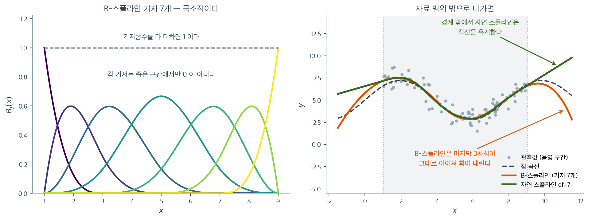

# Patsy를 이용한 스플라인

## 개요

이 페이지는 patsy의 식 인터페이스로 B-스플라인과 자연 스플라인 기저행렬을 만들어 스플라인 회귀를 수행하는 방법을 보인다. King County 주택 자료를 써서 B-스플라인, 자유도를 달리한 자연 스플라인, 사용자 지정 매듭 배치를 비교하고, 이 유연한 방법들을 선형·다항 회귀와 대조한다.

## 수학적 배경

### B-스플라인(기저 스플라인)

매듭이 $\xi_1 < \cdots < \xi_K$인 $d$차 B-스플라인은 각 매듭에서 $(d-1)$번 연속미분 가능한 조각별 다항식이다. 회귀모형은

$$
f(x) = \sum_{m=1}^{K+d+1} \gamma_m B_{m,d}(x),
$$

여기서 $B_{m,d}$는 B-스플라인 기저함수이다. 기저함수의 개수는 $K + d + 1$이다(내부 매듭 + 차수 + 1).

### 자연 스플라인

자연 삼차 스플라인은 경계 매듭 바깥에서 $f(x)$가 선형이라는 제약을 추가한다. 이 제약이 자유도를 4만큼 줄이고(각 경계에서 $f'' = 0$과 $f''' = 0$, 두 경계에 각각 두 개) 외삽 거동을 훨씬 안정적으로 만든다.



왼쪽이 "B-스플라인 기저"라는 말의 그림이다. 구간 $[1, 9]$에 $3$차 B-스플라인 기저 $7$개를 그렸다. 각 봉우리가 기저함수 하나이며, 저마다 **좁은 구간에서만 0이 아니다.** 이것이 고차 다항식과 갈라지는 지점이다. $x^{10}$ 같은 항은 정의역 전체에서 값을 가지므로 한쪽 끝의 관측값 하나가 반대쪽 끝의 적합까지 흔들지만, B-스플라인은 어떤 $x$ 근처의 자료가 서너 개 기저의 계수에만 영향을 준다. 검은 점선이 보여 주듯 기저함수를 모두 더하면 항상 $1$이 되는데, 이 성질 덕분에 계수들이 곧 곡선의 국소적인 높이처럼 행동한다.

오른쪽이 자연 스플라인의 제약이 무엇을 하는지다. 회색 음영이 자료가 있는 $[1.05,\ 8.90]$ 구간이고, 두 스플라인 모두 그 안에서는 참 곡선을 거의 똑같이 따라간다. 훈련 RMSE도 $0.680$과 $0.678$로 차이가 없다. 갈라지는 것은 **밖으로 나간 뒤**다. 주황색 B-스플라인은 경계에서 마지막 $3$차식이 그대로 이어지므로 위로 솟았다가 아래로 꺾여 내려간다. $x = 11.5$에서 예측이 $2.82$인데 참값은 $5.49$다. 초록색 자연 스플라인은 경계 매듭 바깥에서 $f'' = 0$이라는 제약을 받아 **직선으로 뻗는다.** 같은 자리에서 예측이 $9.79$로, 이쪽도 참값에서 멀지만 적어도 곡선이 폭주하지는 않는다.

이 대비가 "자유도를 $4$만큼 쓰고 대신 안정성을 산다"는 자연 스플라인의 거래다. $3$차식이 통제 없이 뻗어 나가는 쪽과 직선이 뻗어 나가는 쪽 가운데, 외삽의 위험이 훨씬 작은 것은 후자다. 물론 **어느 쪽이든 자료 범위 밖의 예측은 믿을 것이 못 된다**는 점은 같다. 자연 스플라인은 그 오차가 폭발하지 않도록 막아 줄 뿐이다.

### 자유도

스플라인의 자유도(df)가 유연성을 조절한다.

- B-스플라인: $\mathrm{df} = K + d + 1 - 1$ (기저함수 개수에서 절편을 뺀 것)
- df가 클수록 더 요동치는 적합이 가능하다
- 최적 df는 교차검증으로 고를 수 있다

### Patsy 문법

- `bs(x, df=4, degree=3)`: 자유도 4의 삼차 B-스플라인
- `bs(x, knots=[20, 40, 60])`: 내부 매듭을 지정한 B-스플라인
- `cr(x, df=4)`: 자유도 4의 자연 삼차 회귀 스플라인

## 자료

세 페이지가 공유하는 King County(시애틀) 주택 매매 자료를 읽는다.

<div class="exbox" markdown>

**보기 1.** <span class="diff easy" title="쉬움"></span> 주택 자료 읽기. 이 쪽과 뒤의 두 쪽이 공유하는 King County 매매 자료를 읽어 가격·면적·건축연도의 요약표를 본다.

**(1)** 요약표의 평균과 중앙값만으로 `AdjSalePrice`의 치우침을 읽으시오. 최솟값과 최댓값에서 걸리는 것이 있는가.

**(2)** 나이-가격 관계를 스플라인으로 다룰 때 `YrBuilt`가 설명변수로 적당한 까닭을 요약표의 수로 말하고, 매듭을 놓을 때 걸림돌이 될 만한 것을 하나 짚으시오.

</div>

??? success "풀이"

    **유도할 식이 없는 보기다.** 자료를 읽어 들이는 것이 전부이므로, 요약표에서 실제로 읽히는 수를 따라간다.

    ```python
    import pandas as pd

    # "Practical Statistics for Data Scientists" 저장소의 자료. 탭으로 구분되어 있다.
    url = ("https://raw.githubusercontent.com/gedeck/"
           "practical-statistics-for-data-scientists/8a6d3bb6468e979c861d4b37215e1413702dfdfa/data/house_sales.csv")
    house = pd.read_csv(url, sep='\t')

    print(f"{len(house)}건, 열 {house.shape[1]}개")
    print(house[['AdjSalePrice', 'SqFtTotLiving', 'YrBuilt']].describe().round(1).to_string())
    ```

    출력:

    ```
    22687건, 열 22개
           AdjSalePrice  SqFtTotLiving  YrBuilt
    count       22687.0        22687.0  22687.0
    mean       565233.3         2080.2   1971.2
    std        385402.9          913.7     30.3
    min          3368.0          370.0   1900.0
    25%        360563.0         1420.0   1950.0
    50%        471315.0         1910.0   1977.0
    75%        649411.0         2540.0   2000.0
    max      11644855.0        10740.0   2015.0
    ```

    요약표가 말하지 않는 몇 가지를 더 찍어 둔다.

    ```python
    import numpy as np
    from scipy import stats

    price = house['AdjSalePrice'].values
    age = 2024 - house['YrBuilt'].values

    print(f"평균/중앙값 = {price.mean() / np.median(price):.3f},  최댓값/중앙값 = {price.max() / np.median(price):.1f}")
    print(f"가격 왜도 = {stats.skew(price):.2f}")
    yrs = np.unique(house['YrBuilt'])
    print(f"서로 다른 건축연도 {yrs.size}개, 빠진 해 {len(set(range(1900, 2016)) - set(yrs.tolist()))}개")
    counts = house['YrBuilt'].value_counts()
    print(f"연도별 건수 최소 {counts.min()}({counts.idxmin()}) ~ 최대 {counts.max()}({counts.idxmax()})")
    print(f"나이 20년 이하 {(age <= 20).sum()}건,  100년 이상 {(age >= 100).sum()}건")
    ```

    출력:

    ```
    평균/중앙값 = 1.199,  최댓값/중앙값 = 24.7
    가격 왜도 = 5.85
    서로 다른 건축연도 116개, 빠진 해 0개
    연도별 건수 최소 20(2015) ~ 최대 1266(2006)
    나이 20년 이하 4170건,  100년 이상 2256건
    ```

    **(1) 가격은 오른쪽으로 크게 치우쳐 있다.** 평균 565,233 달러가 중앙값 471,315 달러의 $1.199$ 배다. 평균이 중앙값보다 크다는 것만으로도 오른쪽 꼬리를 짐작하지만, 치우침의 정도는 끝값이 말해 준다. 최댓값 11,644,855 달러는 중앙값의 $24.7$ 배이고, 표본왜도는 $5.85$ 다. 대칭분포라면 $0$ 이어야 하는 값이다.

    최솟값 3,368 달러는 **정상 매매로 보기 어렵다.** 370 평방피트짜리 집이라도 시애틀 권역에서 이 값에 거래되지는 않는다. 가족 간 명의 이전이나 기록 오류일 것이다. 이런 값은 그대로 두면 회귀의 왼쪽 끝을 끌어내린다.

    주의할 것은 **스플라인이 치우침을 고쳐 주지 않는다**는 점이다. 스플라인은 설명변수 쪽을 유연하게 만드는 장치이고, 적합하는 것은 여전히 조건부 **평균**이다. 꼬리가 긴 반응변수에는 $\log$ 변환이 따로 필요하다.

    **(2) `YrBuilt`는 빈틈이 없다.** 1900 년부터 2015 년까지 서로 다른 연도가 $116$ 개 있고, 그 사이에 빠진 해가 하나도 없다. 곧 나이가 $9$ 년부터 $124$ 년까지 정수 전체를 덮는다. 매듭을 어디에 놓아도 그 좌우에 자료가 있으므로, 분위수 매듭이든 지정 매듭이든 안전하게 쓸 수 있다. 표준편차 $30.3$ 년이라는 넓은 퍼짐도 유연한 적합을 받쳐 준다.

    걸림돌은 **건수가 연도마다 고르지 않다**는 것이다. 2015 년생 집은 $20$ 건뿐인데 2006 년생은 $1{,}266$ 건으로 $63$ 배 차이가 난다. 나이 $20$ 년 이하가 $4{,}170$ 건, $100$ 년 이상이 $2{,}256$ 건이니 경계 쪽이 가운데보다 성기다. 자료가 성긴 곳에서는 매듭을 촘촘히 놓아도 계수의 표준오차가 커진다. **경계에서 3차식이 폭주하는 문제가 바로 여기서 생기며**, 자연 스플라인의 선형 제약이 그것을 겨냥한 장치다(보기 4).

### B-스플라인 회귀

<div class="exbox" markdown>

**보기 2.** <span class="diff easy" title="쉬움"></span> B-스플라인 기저 만들기. `bs(age, df=4, degree=3, include_intercept=False)`로 기저행렬을 만들어 가격에 회귀한다.

**(1)** 이 식이 만드는 **기저 열의 개수**와 **내부 매듭의 개수**를 손으로 세시오. patsy 는 그 매듭을 어디에 놓겠는가.

**(2)** 코드를 돌려 설계행렬의 모양과 patsy 가 실제로 쓴 매듭벡터를 꺼내, (1)의 답과 맞는지 확인하시오.

</div>

??? success "풀이"

    **(1) 해석적으로.** $d$ 차 B-스플라인에서 내부 매듭이 $K$ 개이면 기저함수는

    $$
    K + d + 1
    $$

    개다. 쪽머리의 식 그대로다. patsy 의 `df` 는 **절편을 뺀 열 개수**를 뜻하므로

    $$
    \mathrm{df} = (K + d + 1) - 1 = K + d
    $$

    이고, 여기서 $\mathrm{df} = 4$, $d = 3$ 이니

    $$
    K = \mathrm{df} - d = 4 - 3 = 1
    $$

    **내부 매듭은 하나**다. 그러므로 기저 열은 $K + d = 4$ 개다. 이것이 `df` 와 같은 수인 것은 우연이 아니라 `df` 의 정의다.

    내부 매듭이 하나이면 patsy 는 그것을 자료의 **중앙값**에 놓는다. 내부 매듭 $K$ 개를 $0, 100$ 을 뺀 등간격 분위수에 두는 규칙이므로, $K = 1$ 일 때 그 분위수는 $50\%$ 뿐이다.

    매듭벡터의 길이도 미리 알 수 있다. B-스플라인을 계산하려면 양 끝의 경계매듭을 각각 $d + 1$ 번 겹쳐 적어야 하므로

    $$
    2(d+1) + K = 2 \cdot 4 + 1 = 9
    $$

    개가 나열된다.

    **(2) 수치적으로.** patsy 는 매듭을 `design_info` 안에 기억해 두므로 꺼내 볼 수 있다.

    ```python
    import numpy as np
    import pandas as pd
    from patsy import dmatrix, build_design_matrices
    from sklearn.linear_model import LinearRegression
    from sklearn.metrics import r2_score, mean_squared_error

    # 건축연도 대신 집의 나이를 쓴다. 나이와 가격의 관계는 직선이 아니다.
    age = 2024 - house['YrBuilt'].values
    df = pd.DataFrame({'age': age, 'price': house['AdjSalePrice'].values})

    # patsy 의 bs() 가 B-스플라인 기저를 만들어 준다. df=4 면 매듭을 자료의
    # 분위수에 맞춰 알아서 놓는다. 끝의 -1 은 patsy 가 붙이는 절편을 빼는 것이고,
    # 절편은 아래 LinearRegression 이 따로 넣는다.
    bs_design = dmatrix("bs(age, df=4, degree=3, include_intercept=False) - 1",
                        {"age": df['age']}, return_type='dataframe')
    bs_model = LinearRegression().fit(bs_design, df['price'])
    bs_r2 = r2_score(df['price'], bs_model.predict(bs_design))
    ```

    ```python
    def patsy_knots(design):
        """patsy 가 design_info 에 기억해 둔 매듭벡터를 꺼낸다."""
        info = list(design.design_info.factor_infos.values())[0]
        return list(info.state['transforms'].values())[0]._all_knots

    print("기저 열 개수 =", bs_design.shape[1])
    print("매듭벡터     =", patsy_knots(bs_design), "  길이", len(patsy_knots(bs_design)))
    print(f"내부 매듭 {patsy_knots(bs_design)[4]:.0f},  나이의 중앙값 {np.median(df['age']):.0f}")
    print(f"R^2 = {bs_r2:.4f}")
    ```

    출력:

    ```
    기저 열 개수 = 4
    매듭벡터     = [  9.   9.   9.   9.  47. 124. 124. 124. 124.]   길이 9
    내부 매듭 47,  나이의 중앙값 47
    R^2 = 0.0346
    ```

    **셋이 모두 맞는다.** 열은 $4$ 개, 매듭벡터는 길이 $9$ 로 양 끝의 $9$ 와 $124$ 가 각각 네 번 겹쳐 적혀 있고, 가운데 하나뿐인 내부 매듭이 $47$ 이다. 나이의 중앙값도 $47$ 이다.

    남는 수는 $R^2 = 0.0346$ 이다. 나이 하나로 가격 변동의 $3.5\%$ 만 설명한다. **스플라인이 유연하다는 것이 곧 잘 맞는다는 뜻은 아니다.** 집값을 가르는 것은 면적과 입지이고 나이는 작은 조각일 뿐이다. 이 쪽에서 비교할 것은 $R^2$ 의 크기가 아니라 같은 변수를 두고 기저를 바꿀 때 생기는 **차이**다.

### 사용자 지정 매듭을 쓰는 B-스플라인

<div class="exbox" markdown>

**보기 3.** <span class="diff easy" title="쉬움"></span> 매듭 자리를 직접 정하기. `df` 대신 `knots=[20, 40, 60]`을 주어 매듭을 손으로 놓는다.

**(1)** 이 식이 만드는 기저 열의 개수와 매듭벡터의 길이를 보기 2 의 식으로 예측하시오.

**(2)** 같은 개수의 열을 자동 배치로도 얻을 수 있다. `df=6`으로 적합한 것과 $R^2$ 를 견주어, **열의 개수가 같을 때에도 매듭 자리가 적합을 바꾸는지** 확인하시오.

</div>

??? success "풀이"

    **(1) 해석적으로.** 매듭을 직접 주면 `df` 를 거꾸로 계산하는 셈이다. 내부 매듭이 $K = 3$ 개, 차수가 $d = 3$ 이므로 보기 2 의 식에서

    $$
    \mathrm{df} = K + d = 3 + 3 = 6
    $$

    곧 열이 $6$ 개다. 매듭벡터의 길이는

    $$
    2(d+1) + K = 8 + 3 = 11
    $$

    이고, 양 끝의 경계매듭 $9$ 와 $124$ 가 각각 네 번, 가운데 $20, 40, 60$ 이 한 번씩 적힌다.

    `df=6, degree=3` 으로도 열은 똑같이 $6$ 개가 나온다. **같은 유연성을 두 가지 다른 매듭 배치로 쓰는 것**이므로, 둘을 견주면 매듭 자리의 몫만 남는다.

    **(2) 수치적으로.**

    ```python
    # 매듭 자리를 직접 정할 수도 있다. 관계가 꺾인다고 볼 만한 근거가 있으면
    # 분위수에 맡기는 것보다 낫다.
    knots_custom = [20, 40, 60]
    bs_custom_design = dmatrix(
        f"bs(age, knots={knots_custom}, degree=3, include_intercept=False) - 1",
        {"age": df['age']}, return_type='dataframe'
    )
    bs_custom_model = LinearRegression().fit(bs_custom_design, df['price'])
    ```

    ```python
    print("기저 열 개수 =", bs_custom_design.shape[1])
    print("매듭벡터     =", patsy_knots(bs_custom_design))
    print(f"지정 매듭 [20, 40, 60]  R^2 = "
          f"{r2_score(df['price'], bs_custom_model.predict(bs_custom_design)):.4f}")

    # 열 개수가 같은 자동 배치와 견준다.
    auto6 = dmatrix("bs(age, df=6, degree=3, include_intercept=False) - 1",
                    {"age": df['age']}, return_type='dataframe')
    auto6_model = LinearRegression().fit(auto6, df['price'])
    print(f"자동 매듭 {patsy_knots(auto6)[4:7]}  R^2 = "
          f"{r2_score(df['price'], auto6_model.predict(auto6)):.4f}")
    ```

    출력:

    ```
    기저 열 개수 = 6
    매듭벡터     = [  9   9   9   9  20  40  60 124 124 124 124]
    지정 매듭 [20, 40, 60]  R^2 = 0.0352
    자동 매듭 [24. 47. 74.]  R^2 = 0.0349
    ```

    **열 개수와 매듭벡터는 예측한 $6$ 과 길이 $11$ 이 그대로 나왔다.**

    $R^2$ 는 지정 매듭이 $0.0352$, 자동 매듭이 $0.0349$ 다. **열의 개수가 같아도 매듭 자리가 적합을 바꾼다.** 다만 바뀌는 폭이 $0.0003$ 이라는 것도 함께 읽어야 한다. 보기 2 의 $\mathrm{df} = 4$ 에서 여기 $\mathrm{df} = 6$ 으로 열을 둘 늘려 얻은 것이 $0.0346 \to 0.0349$ 였으니, **자유도를 늘려 얻는 몫과 매듭을 옮겨 얻는 몫이 같은 자리 수**다.

    자동 배치의 매듭은 $24, 47, 74$ 로 세 등분위수에 놓였고, 지정한 $20, 40, 60$ 은 그보다 왼쪽으로 쏠려 있다. 나이가 작은 쪽에 자료가 몰려 있으므로(보기 1 에서 $20$ 년 이하가 $4{,}170$ 건) 지정 매듭이 집이 많은 구간을 더 촘촘히 나눈 꼴이고, 그만큼 조금 더 맞았다.

    **다만 이 차이가 의미 있다고 주장하려면 훈련 $R^2$ 로는 모자란다.** 열의 개수가 같아 두 $R^2$ 를 바로 견줄 수 있다는 것까지는 옳지만, $0.0003$ 은 표본을 바꾸면 뒤집힐 만한 크기다. 게다가 매듭을 자료를 보고 옮겨 가며 고르면 그것 자체가 선택 과정이므로 훈련 $R^2$ 는 낙관적이 된다. 매듭 배치를 고르는 일도 교차검증에 맡겨야 한다.

### 자연 스플라인

<div class="exbox" markdown>

**보기 4.** <span class="diff easy" title="쉬움"></span> 자연 3차 스플라인. `cr(age, df=4)`로 자연 3차 회귀 스플라인 기저를 만들어 같은 자료에 적합한다.

**(1)** `cr` 기저의 네 열을 **행마다 더하면** 무엇이 되는가. 그것을 보이고, `LinearRegression()`이 절편을 한 열 더 붙일 때 설계행렬에 무슨 일이 생기는지 말하시오.

**(2)** 절편을 떼고(`fit_intercept=False`) 다시 적합하면 계수 네 개가 각각 무엇을 뜻하는지 보이시오. `bs(age, df=4)`와 $R^2$ 를 견주어 자연 스플라인의 제약이 적합에 얼마를 물리는지도 적으시오.

</div>

??? success "풀이"

    **(1) 해석적으로 — `cr` 의 네 열은 더하면 1 이다.** patsy 의 `cr` 은 매듭 $\xi_1 < \cdots < \xi_m$ 에서

    $$
    B_j(\xi_k) = \delta_{jk} =
    \begin{cases} 1 & j = k \\ 0 & j \ne k \end{cases}
    $$

    이 되도록 고른 기저다. 곧 $j$ 번째 기저함수는 $j$ 번째 매듭에서 $1$, 나머지 매듭에서 $0$ 인 자연 3차 스플라인이다. 이런 기저를 **기본기저**라 부른다.

    이제 $g(x) = \sum_{j=1}^m B_j(x)$ 를 보자. $g$ 는 자연 3차 스플라인들의 합이므로 자연 3차 스플라인이고, 매듭에서의 값은

    $$
    g(\xi_k) = \sum_{j=1}^m \delta_{jk} = 1
    $$

    로 모두 $1$ 이다. 한편 **상수함수 $1$ 도** 매듭에서 모두 $1$ 인 자연 3차 스플라인이다(양 끝 바깥에서 선형이어야 한다는 조건을 상수는 당연히 만족한다). 주어진 매듭값을 지나는 자연 3차 스플라인은 유일하므로

    $$
    \sum_{j=1}^m B_j(x) \equiv 1
    $$

    이다. 그러므로 **`cr` 의 네 열은 이미 절편을 품고 있다.** `- 1` 로 patsy 의 절편 열을 뺐더라도 네 열의 합이 $1$ 인 벡터이기 때문이다.

    여기에 `LinearRegression()` 이 상수 열을 하나 더 붙이면 설계행렬은 열이 $5$ 개인데 계수(rank)가 $4$ 뿐인 **완전한 다중공선**이 된다. 정규방정식의 해가 유일하지 않다. 적합값과 $R^2$ 는 그래도 정해지지만 **계수는 정해지지 않는다.** sklearn 은 최소제곱 해를 `lstsq` 로 구하므로 예외를 던지지 않고 아무 해 하나를 돌려주는데, 그 해의 계수와 절편은 서로 상쇄되는 거대한 수가 된다.

    보기 2 의 `bs(..., include_intercept=False)` 에는 이 일이 생기지 않는다. 기저함수 하나를 **빼** 두었으므로 남은 네 열의 합은 $1$ 이 아니다.

    **(2) 수치적으로.**

    ```python
    # 자연 3차 스플라인. 양 끝에서 직선이 되도록 묶어 두어, 자료가 드문
    # 바깥쪽에서 곡선이 크게 튀는 일을 막는다. B-스플라인의 약점을 고친 것이다.
    cs_design = dmatrix("cr(age, df=4) - 1",
                        {"age": df['age']}, return_type='dataframe')
    cs_model = LinearRegression().fit(cs_design, df['price'])
    cs_r2 = r2_score(df['price'], cs_model.predict(cs_design))
    ```

    ```python
    print("기저 열 개수 =", cs_design.shape[1], " 매듭 =", patsy_knots(cs_design).round(2))
    print(f"행별 합  최소 {cs_design.sum(axis=1).min():.12f}  최대 {cs_design.sum(axis=1).max():.12f}")

    # 절편 열을 하나 더 붙이면 어떻게 되는가. 특이값이 바로 말해 준다.
    X1 = np.column_stack([np.ones(len(cs_design)), cs_design.values])
    print("절편을 붙인 설계행렬의 특이값 =", np.linalg.svd(X1, compute_uv=False).round(4))
    print(f"열은 {X1.shape[1]}개인데 계수(rank)는 {np.linalg.matrix_rank(X1)}")
    print(f"LinearRegression() 계수의 최대 절대값 = 10^{np.log10(np.abs(cs_model.coef_).max()):.1f}")

    # 절편을 떼고 다시 적합한다.
    cs_stable = LinearRegression(fit_intercept=False).fit(cs_design, df['price'])
    Ck = pd.DataFrame(np.asarray(build_design_matrices(
        [cs_design.design_info], {"age": patsy_knots(cs_design)})[0]),
        columns=cs_design.columns)
    B = Ck.values
    print(f"매듭에서의 기저값: 대각 {np.diag(B).round(6)},  비대각 최대 "
          f"{np.abs(B - np.diag(np.diag(B))).max():.1e}")
    print("계수             =", cs_stable.coef_.round(0))
    print("매듭에서의 적합값 =", cs_stable.predict(Ck).round(0))
    print(f"R^2 = {cs_r2:.4f} (절편 포함) 대 "
          f"{r2_score(df['price'], cs_stable.predict(cs_design)):.4f} (절편 없이)")
    print(f"예측의 최대 차이 = "
          f"{np.abs(cs_model.predict(cs_design) - cs_stable.predict(cs_design)).max():.0f}")
    ```

    출력:

    ```
    기저 열 개수 = 4  매듭 = [  9.    47.33  85.67 124.  ]
    행별 합  최소 1.000000000000  최대 1.000000000000
    절편을 붙인 설계행렬의 특이값 = [175.5037  77.3597  52.5336  29.7136   0.    ]
    열은 5개인데 계수(rank)는 4
    LinearRegression() 계수의 최대 절대값 = 10^17.2
    매듭에서의 기저값: 대각 [1. 1. 1. 1.],  비대각 최대 4.6e-17
    계수             = [713887. 515523. 508845. 673888.]
    매듭에서의 적합값 = [713887. 515523. 508845. 673888.]
    R^2 = 0.0301 (절편 포함) 대 0.0301 (절편 없이)
    예측의 최대 차이 = 5936
    ```

    **(1)의 유도가 그대로 확인된다.** 행별 합이 소수 열두째 자리까지 $1$ 이고, 절편을 붙인 설계행렬의 다섯째 특이값이 $0$ 이다. 특이값이 하나 죽었다는 것이 계수가 $5$ 가 아니라 $4$ 라는 말의 수치적 표현이다. 그래서 `LinearRegression()` 이 돌려준 계수는 $10^{17.2}$ 규모로 터져 있고, 절편이 그만큼 음수여서 둘이 상쇄된다. **이 자릿수는 선형대수 라이브러리에 따라 달라질 수 있다.** 정해지지 않은 값이니 달라지는 것이 당연하다.

    **(2) 계수는 매듭에서의 적합값이다.** `fit_intercept=False` 로 적합하니 계수가

    $$
    \hat\gamma = (713887,\; 515523,\; 508845,\; 673888)
    $$

    이고, 매듭 $9,\, 47.33,\, 85.67,\, 124$ 에서의 적합값이 **같은 네 수**로 나왔다. (1)에서 $B_j(\xi_k) = \delta_{jk}$ 라 했으므로

    $$
    \hat f(\xi_k) = \sum_j \hat\gamma_j B_j(\xi_k) = \hat\gamma_k
    $$

    이어야 하고, 실제로 그렇다. 기저값 행렬의 대각이 모두 $1$, 비대각이 $4.6 \times 10^{-17}$ 이니 단위행렬이다. **이것이 `cr` 기저의 쓸모다.** B-스플라인 계수는 뜻을 읽기 어렵지만 `cr` 계수는 "나이 $9$ 년 집의 적합가격 $713{,}887$ 달러" 처럼 바로 읽힌다.

    그 네 수가 $713{,}887 \to 515{,}523 \to 508{,}845 \to 673{,}888$ 로 **내려갔다 올라간다.** 새 집이 가장 비싸고, 여든 살쯤에서 가장 싸고, 백 년을 넘기면 다시 오른다. 오래된 집이 비싼 것은 집이 좋아서가 아니라 오래된 동네가 도심에 있기 때문일 것이다. 교란변수다.

    **절편을 잘못 넣은 적합은 얼마나 나빴나.** $R^2$ 는 둘 다 $0.0301$ 로 소수 넷째 자리까지 같고, 예측의 최대 차이도 $5{,}936$ 달러다. 예측값이 $50$ 만 달러 대인 것에 비하면 $1\%$ 가량이다. 곧 **적합값은 거의 멀쩡하고 망가진 것은 계수뿐**이다. 열 공간이 같으므로 이론적으로는 예측이 **완전히** 같아야 하는데 $5{,}936$ 달러가 벌어진 것은 $10^{17}$ 규모의 수를 더하고 빼면서 생긴 자리 잃음이다.

    **마지막으로 제약의 값.** 같은 $\mathrm{df} = 4$ 로 보기 2 의 B-스플라인은 $R^2 = 0.0346$, 여기 자연 스플라인은 $0.0301$ 이다. 차이가 $0.0045$ 다.

    이 비교를 중첩모형의 비교로 읽을 수는 없다. 두 기저의 매듭이 다르므로($47$ 하나 대 $9,\,47.33,\,85.67,\,124$) 한쪽 열공간이 다른 쪽에 들어 있지 않다. 그래도 방향은 설명이 된다. B-스플라인 쪽은 네 열에 절편까지 **모수가 $5$ 개**인데 자연 스플라인 쪽은 네 열이 절편을 품고 있어 **모수가 $4$ 개**이고, 거기에 양 끝 바깥에서 선형이라는 제약까지 걸려 있다. **모수 하나와 경계 제약을 내주고 외삽의 안정성을 산 것**이다. 그 안정성이 실제로 무엇인지는 연습문제 3 에서 본다 — 자연 스플라인은 자료 범위 밖에서도 값을 돌려주는데 B-스플라인은 예외를 던진다.

### 격자에서의 예측

<div class="exbox" markdown>

**보기 5.** <span class="diff easy" title="쉬움"></span> 예측할 때 기저 재사용하기. 나이 $9$ 에서 $124$ 까지 $300$ 점 격자를 만들어 두 모형의 적합곡선을 얻는다. 기저는 `build_design_matrices`로 원래 것을 그대로 쓴다.

**(1)** 격자에 `dmatrix`를 **다시 불렀다면** 내부 매듭이 어디에 놓이겠는가. 격자가 자료와 같은 구간을 덮는데도 매듭이 달라지는 까닭을 말하시오.

**(2)** 두 방식의 예측을 실제로 견주시오. 차이가 가장 큰 곳과 차이가 $0$ 인 곳은 각각 어디이며, 왜 그런가.

</div>

??? success "풀이"

    **(1) 해석적으로.** 보기 2 에서 보았듯이 patsy 의 `bs` 는 `df=4, degree=3` 에 대해 내부 매듭 하나를 **넘겨받은 자료의 중앙값**에 놓는다. 매듭을 정하는 재료가 구간이 아니라 **값들의 분포**라는 것이 요점이다.

    훈련 자료는 나이 $22{,}687$ 개이고 그 중앙값이 $47$ 이다. 격자는 $[9, 124]$ 를 등간격으로 $300$ 등분한 것이므로 분포가 **균등**하고, 그 중앙값은 구간의 중점

    $$
    \frac{9 + 124}{2} = 66.5
    $$

    이다. 두 집합은 **최솟값과 최댓값이 같은데 중앙값이 다르다.** 자료에는 젊은 집이 몰려 있어 중앙값이 왼쪽으로 쏠렸고, 격자는 고르게 퍼져 있다. 그래서 같은 식 문자열이 **다른 기저**를 만든다.

    계수 $\hat\gamma$ 는 매듭이 $47$ 인 기저에 맞추어 구해졌다. 그것을 매듭이 $66.5$ 인 기저에 곱하면 **계수와 기저의 짝이 어긋난다.** 오류도 경고도 나지 않는다. 그저 틀린 곡선이 나온다.

    경계에서는 어긋나지 않는다. 양 끝 $9$ 와 $124$ 는 두 경우 모두 경계매듭이고, 경계매듭이 $d+1$ 번 겹쳐 있으면 그 점에서 기저는 한 함수만 $1$ 이고 나머지가 $0$ 이다. 매듭벡터의 가운데가 무엇이든 그 값은 변하지 않으므로 **$x = 9$ 와 $x = 124$ 에서의 예측은 정확히 같다.**

    **(2) 수치적으로.**

    ```python
    age_grid = np.linspace(df['age'].min(), df['age'].max(), 300)

    # 예측할 때는 반드시 원래 기저를 그대로 써야 한다. 새 자료로 dmatrix 를
    # 다시 부르면 매듭이 그 자료의 분위수로 다시 정해져, 훈련 때와 다른 기저가
    # 만들어진다. design_info 를 넘겨 주는 것이 그 실수를 막는 방법이다.
    bs_grid = build_design_matrices([bs_design.design_info], {"age": age_grid})[0]
    bs_pred = bs_model.predict(np.asarray(bs_grid))

    cs_grid = build_design_matrices([cs_design.design_info], {"age": age_grid})[0]
    cs_pred = cs_model.predict(np.asarray(cs_grid))
    ```

    ```python
    # 해서는 안 되는 쪽. 식 문자열로 dmatrix 를 다시 부른다.
    bs_wrong_design = dmatrix("bs(age, df=4, degree=3, include_intercept=False) - 1",
                              {"age": age_grid}, return_type='dataframe')
    bs_wrong = bs_model.predict(np.asarray(bs_wrong_design))

    print(f"올바른 기저의 내부 매듭   = {patsy_knots(bs_design)[4]:.1f}  (자료 22687건의 중앙값)")
    print(f"다시 부른 기저의 내부 매듭 = {patsy_knots(bs_wrong_design)[4]:.1f}  (격자 300점의 중앙값)")
    gap = np.abs(bs_wrong - bs_pred)
    print(f"두 예측의 최대 차이 = {gap.max():,.0f}   (age = {age_grid[gap.argmax()]:.1f})")
    print(f"양 끝 age = 9, 124 에서의 차이 = {gap[0]:.0f}, {gap[-1]:.0f}")
    print(f"예측값 자체의 범위 = {bs_pred.min():,.0f} ~ {bs_pred.max():,.0f}")
    ```

    출력:

    ```
    올바른 기저의 내부 매듭   = 47.0  (자료 22687건의 중앙값)
    다시 부른 기저의 내부 매듭 = 66.5  (격자 300점의 중앙값)
    두 예측의 최대 차이 = 39,608   (age = 46.7)
    양 끝 age = 9, 124 에서의 차이 = 0, 0
    예측값 자체의 범위 = 462,491 ~ 656,578
    ```

    **(1)에서 예측한 $47$ 과 $66.5$ 가 그대로 나왔다.** 양 끝에서의 차이도 예측대로 정확히 $0$ 이다.

    차이가 가장 큰 곳은 $\text{age} = 46.7$ 로, **원래 매듭이 있던 자리**다. 내부 매듭은 곡선이 꺾일 수 있는 자리이고 기저함수들의 모양이 그 근처에서 가장 많이 다르므로, 짝이 어긋난 효과가 거기서 가장 크게 드러난다.

    크기를 보자. $39{,}608$ 달러다. 예측값이 통째로 $462{,}491$ 에서 $656{,}578$ 사이, 곧 폭이 $194{,}087$ 달러인데 그 **$20\%$** 가 틀린 것이다. 보기 4 에서 절편을 잘못 넣어 생긴 오차가 $5{,}936$ 달러였던 것과 견주면 **여섯 배 이상 나쁘다.**

    이 결함이 고약한 까닭은 **조용하다**는 것이다. 보기 4 의 공선성은 특이값 $0$ 과 $10^{17}$ 짜리 계수라는 비명을 남겼지만, 여기서는 형태가 멀쩡한 $300$ 개의 수가 나온다. 그려 보면 곡선도 매끄럽다. 틀린 줄 알 방법은 매듭을 직접 꺼내 보는 것뿐이다. 그래서 `build_design_matrices` 에 `design_info` 를 넘기는 것이 선택이 아니라 **규칙**이다.

!!! warning "새 자료에 `dmatrix`를 다시 부르면 안 된다"
    식 문자열로 `dmatrix`를 다시 호출하면 patsy가 **새로 넘긴 자료로 매듭을 다시 계산한다**. 그러면 훈련에 쓴 기저와 다른 기저가 만들어져 계수가 엉뚱한 기저에 곱해진다. 반드시 원래 설계행렬의 `design_info`를 `build_design_matrices`에 넘겨 같은 매듭을 재사용해야 한다.

## 해석

- **B-스플라인**은 국소 제어를 제공한다. 각 기저함수가 좁은 구간에서만 0이 아니므로 한 구역의 적합이 멀리 떨어진 자료와 비교적 무관하다. 그래서 수치적으로 안정적이고 해석하기 좋다.
- **자연 스플라인**은 극단 매듭 바깥에서 적합을 선형으로 제약하므로 경계에서 더 안정적이다. 제약 없는 삼차 스플라인이 보이는 격렬한 외삽을 피한다.
- **자유도**: df를 키우면 훈련자료 적합은 좋아지지만 과적합 위험이 커진다. 최적 df는 교차검증이나 정보기준으로 고른다.
- **매듭 배치**: 자동 배치(균등 분위수)가 대부분의 경우 잘 작동한다. 관계의 성격이 바뀌는 지점을 분야 지식으로 안다면 사용자 지정 매듭이 유용하다.
- **비교**: 스플라인은 하나의 전역적 모양을 강제하는 대신 국소적 유연성을 제공하므로, 복잡도가 같은 다항식보다 대체로 낫다.

## 연습문제

<div class="drillbox" markdown>

**연습문제 1.** <span class="diff med" title="중간"></span> df를 3에서 8까지 바꿔 가며 B-스플라인을 적합하고 그 결과 곡선을 그려라. 어느 df에서 과적합의 징후가 나타나기 시작하는가?

</div>

??? success "풀이"

    삼차 B-스플라인에서는 `df`가 `degree`보다 작을 수 없다. `df=2, degree=3`을 넣으면
    patsy가 `ValueError: df=2 is too small for degree=3`을 던지므로 3부터 시작한다.

    ```python
    for d in range(3, 9):
        design = dmatrix(f"bs(age, df={d}, degree=3, include_intercept=False) - 1",
                         {"age": df['age']}, return_type='dataframe')
        model = LinearRegression().fit(design, df['price'])
        grid_design = build_design_matrices([design.design_info],
                                           {"age": age_grid})[0]
        print(f"df={d}: R^2 = {model.score(design, df['price']):.4f}")
    ```

    출력:

    ```
    df=3: R^2 = 0.0292
    df=4: R^2 = 0.0346
    df=5: R^2 = 0.0351
    df=6: R^2 = 0.0349
    df=7: R^2 = 0.0353
    df=8: R^2 = 0.0354
    ```

    $R^2$가 df=4에서 0.0346까지 오른 뒤로는 거의 늘지 않는다(df=6에서는 오히려 미세하게 줄었는데, 매듭 위치가 달라지면서 생기는 일이다). 훈련 자료에 대한 적합이므로 이 값만으로는 과적합을 판단할 수 없다.

    과적합은 곡선의 모양에서 드러난다. 지나친 요동으로 나타나며, 특히 자료가 성긴 경계 근처에서 두드러진다. 이 자료에서는 대체로 df > 6에서 징후가 보이기 시작한다. 형식적으로 고르려면 교차검증을 써야 한다. $\square$

<div class="drillbox" markdown>

**연습문제 2.** <span class="diff med" title="중간"></span> 매듭이 $K$개인 자연 삼차 스플라인의 자유도가 (제약 없는 삼차 스플라인의 $K + 4$가 아니라) $K$인 이유를 설명하라. "잃어버린" 4개의 자유도는 어디로 가는가?

</div>

??? success "풀이"

    구간 $[a, b]$에 매듭 $\xi_1 < \cdots < \xi_K$가 있을 때(양 끝의 경계 매듭을 포함해 센다) 제약 없는 삼차 스플라인의 차원을 세어 보자. 매듭이 구간을 $K+1$개 조각으로 나누고 조각마다 삼차 다항식이므로 계수는 $4(K+1)$개이다. 각 내부 매듭에서 $f$, $f'$, $f''$의 연속성이 3개의 제약을 주므로 $3(K-2)$… 를 세는 대신, 널리 쓰이는 결과를 그대로 쓰면 **삼차 스플라인의 차원은 $K + 4$**이다.

    자연 스플라인은 여기에 경계 바깥에서 선형이라는 조건을 얹는다. 이는 양쪽 끝 각각에서

    $$
    f''(\xi_1) = 0, \quad f'''(\xi_1) = 0, \qquad f''(\xi_K) = 0, \quad f'''(\xi_K) = 0
    $$

    이라는 **4개의 제약**을 뜻한다. 따라서 차원은

    $$
    (K + 4) - 4 = K
    $$

    가 된다. 잃어버린 4개의 자유도는 양쪽 바깥 조각의 이차항과 삼차항 계수 네 개이며, 이들이 0으로 강제되어 그 구간에서 함수가 직선이 된다.

    !!! note "df 세는 방식의 차이"
        절편을 df에 포함하느냐에 따라 문헌마다 숫자가 하나씩 달라진다. patsy의 `cr(x, df=4)`나 R의 `ns(x, df=4)`는 절편을 뺀 기저 열 4개를 돌려주므로, 모형 절편을 더하면 전체 차원이 5가 된다. 어떤 규약을 쓰든 **자연 스플라인이 같은 매듭의 삼차 스플라인보다 정확히 4만큼 작다**는 점은 변하지 않는다. $\square$

<div class="drillbox" markdown>

**연습문제 3.** <span class="diff med" title="중간"></span> 자료 범위 바깥(예: age = 150이나 age = 0)에서 B-스플라인 모형과 자연 스플라인 모형의 예측을 비교하라. 어느 쪽이 더 합리적으로 외삽하는가?

</div>

??? success "풀이"

    ```python
    age_extrap = np.array([0.0, 5.0, 145.0, 150.0])

    # 자연 스플라인: 선형으로 외삽한다.
    cs_extrap = build_design_matrices([cs_design.design_info],
                                      {"age": age_extrap})[0]
    print("Natural:", cs_model.predict(np.asarray(cs_extrap)).round(0))

    # B-스플라인: 매듭 바깥에서는 예외를 던진다.
    try:
        bs_extrap = build_design_matrices([bs_design.design_info],
                                          {"age": age_extrap})[0]
        print("B-spline:", bs_model.predict(np.asarray(bs_extrap)).round(0))
    except Exception as exc:
        print(f"B-spline: {type(exc).__name__}")
    ```

    출력:

    ```
    Natural: [772512. 741152. 775648. 801248.]
    B-spline: PatsyError
    ```

    자연 스플라인은 문제없이 계산되며 경계에서의 기울기를 그대로 이어 **선형으로** 외삽한다.

    B-스플라인 쪽은 값을 돌려주는 대신 **예외를 던진다**.

    ```text
    PatsyError: Error evaluating factor: NotImplementedError:
    some data points fall outside the outermost knots,
    and I'm not sure how to handle them.
    ```

    이 오류 자체가 답이다. B-스플라인 기저는 최외곽 매듭 바깥에서 정의되지 않으므로 patsy는 추측해서 값을 만들어 내는 대신 거부한다. 설령 삼차식을 그대로 연장하도록 구현했더라도 그 외삽값은 극단적이고 비현실적이었을 것이다. 자료 범위를 벗어나 예측해야 한다면 자연 스플라인을 써야 한다. $\square$

<div class="drillbox" markdown>

**연습문제 4.** <span class="diff med" title="중간"></span> 적합 목적함수에 릿지 형태의 항 $\lambda \|\boldsymbol{\gamma}\|^2$을 더해 B-스플라인에 거칢 벌점을 구현하라. 이것은 평활 스플라인과 어떤 관계인가?

</div>

??? success "풀이"

    ```python
    from sklearn.linear_model import Ridge

    design = dmatrix("bs(age, df=8, degree=3, include_intercept=False) - 1",
                     {"age": df['age']}, return_type='dataframe')
    ridge_model = Ridge(alpha=1e4).fit(design, df['price'])
    ```

    $\lambda\|\boldsymbol{\gamma}\|^2$을 더하면 기저 계수가 0 쪽으로 축소되어 곡선이 매끄러워진다. 이는 2계 도함수에 벌점을 주는 평활 스플라인의 벌점 $\lambda\int [f'']^2$에 대한 근사이다. 정확한 평활 스플라인은 $D_{jk} = \int B_j''(t)B_k''(t)\,dt$인 벌점행렬 $\mathbf{D}$를 쓰지만, $\lambda\mathbf{I}$(릿지)가 더 간단한 근사를 제공한다. $\square$

<div class="drillbox" markdown>

**연습문제 5.** <span class="diff hard" title="어려움"></span> 매듭이 자료점에 놓인 자연 삼차 스플라인에 대해, 평활 스플라인 추정량이 두 번 미분 가능한 모든 함수 가운데 $\sum(y_i - f(x_i))^2 + \lambda\int[f''(t)]^2\,dt$를 최소화함을 증명하라.

</div>

??? success "풀이"

    비모수 회귀의 고전적 결과이다. 핵심은 매듭에서 주어진 값을 보간하는 모든 함수 $g$ 가운데 자연 삼차 스플라인이 $\int [g'']^2\,dt$(거칢)를 최소화한다는 것이다. 변분법적 논증으로 보인다. $f$를 자연 삼차 스플라인이라 하고 $g = f + h$로 쓰면

    $$
    \int [g'']^2 = \int [f'']^2 + 2\int f'' h'' + \int [h'']^2.
    $$

    부분적분과 자연 스플라인의 경계조건에 의해 교차항 $\int f'' h'' = 0$이므로 $\int[g'']^2 \geq \int[f'']^2$이다. 따라서 자연 삼차 스플라인이 임의의 $\lambda > 0$에 대해 벌점 목적함수의 유일한 최소화 함수이다. $\square$

---

## 정리하며

스플라인은 **조각별 다항을 매끄럽게 이어 붙인다.**

- **B-스플라인이 계산에 안정적인 기저다.** 매듭 사이에서 3차 다항이고 매듭에서 2계 도함수까지 연속이므로, 계단함수의 불연속 문제가 사라진다.
- **자연 스플라인은 양 끝에서 선형으로 제약한다.** 자료가 드문 경계에서 3차 다항이 폭주하는 것을 막으며, **외삽이 조금 덜 위험해진다.**
- **매듭의 개수가 유연성을 정한다.** 위치보다 개수가 중요하며, 보통 분위수에 균등 배치하고 자유도를 교차검증으로 고른다.
- **patsy 식으로 간단히 쓴다.** `bs(x, df=5)` 나 `cr(x, df=5)` 를 수식에 넣으면 기저행렬이 자동 생성되어 보통의 OLS 로 적합된다.
- **여전히 선형모형이다.** 기저함수가 비선형일 뿐 계수에 대해서는 선형이므로, 앞서 본 추론이 그대로 적용된다.

다음 절부터 **패키지 사용법**으로 13장을 마무리한다.
