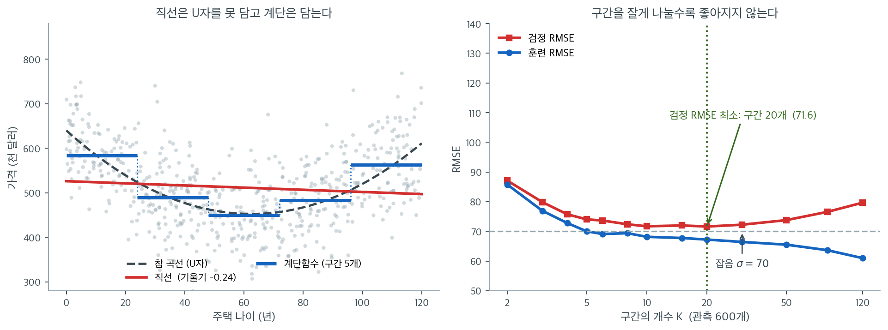

# 계단함수

## 개요

이 페이지는 비선형 모형화 기법으로서 계단함수 회귀(조각별 상수 적합)를 보인다. King County 주택 자료를 써서 구간화한 설명변수로 지시변수를 만들고, 계단함수 모형을 적합하고, 구간 개수를 달리해 비교하며, 계단함수를 선형·다항·스플라인 대안과 대조한다. 분류를 위한 로지스틱 회귀에 계단함수를 적용하는 방법도 다룬다.

## 수학적 배경

계단함수는 설명변수 $x$의 범위를 절단점 $c_1 < c_2 < \cdots < c_{K-1}$로 $K$개 구간으로 나누고 지시변수를 만든다.

$$
C_k(x) = \mathbf{1}(c_{k-1} < x \leq c_k), \qquad k = 1, \ldots, K.
$$

계단함수 회귀모형은

$$
y_i = \beta_0 + \beta_1 C_1(x_i) + \beta_2 C_2(x_i) + \cdots + \beta_K C_K(x_i) + \varepsilon_i.
$$

이는 각 구간 안에서 별도의 상수(구간 평균)를 적합하는 것과 같다. 구간 $k$에 속한 임의의 $x$에 대한 적합값은 (지시변수를 하나도 빼지 않고 모두 넣었을 때) 그 구간의 평균 반응 $\bar{y}_k$가 된다.

### 절단점 정하기

절단점은 다음 기준으로 정할 수 있다.

- **등간격 구간**: 범위를 $K$개의 같은 구간으로 나눈다
- **분위수 구간**(`pd.qcut`): 각 구간이 대략 같은 개수의 관측값을 담는다
- **분야 지식**: 의미 있는 문턱에 절단점을 둔다

## 자료

세 페이지가 공유하는 King County(시애틀) 주택 매매 자료를 읽는다.

<div class="exbox" markdown>

**보기 1.** <span class="diff easy" title="쉬움"></span> 주택 자료 읽기. 요약표를 보고, 아래에서 쓸 절단점 $0, 20, 40, 60, 80, 150$ 이 나이 분포와 어떻게 맞물리는지 미리 가늠한다.

**(1)** 요약표의 `YrBuilt` 사분위수를 **나이**의 사분위수로 바꾸시오. 왜 순서가 뒤집히는가.

**(2)** 절단점 $0, 20, 40, 60, 80, 150$ 으로 자르면 구간마다 몇 건이 들어가는가. 마지막 구간의 폭이 다른 구간의 세 배 반인데도 건수가 비슷한 까닭을 **나이 한 해당 건수**로 설명하시오.

</div>

??? success "풀이"

    **유도할 식이 없는 보기다.** 요약표와 구간별 집계를 읽는 것이 전부다.

    ```python
    import pandas as pd

    # "Practical Statistics for Data Scientists" 저장소의 자료. 탭으로 구분되어 있다.
    url = ("https://raw.githubusercontent.com/gedeck/"
           "practical-statistics-for-data-scientists/8a6d3bb6468e979c861d4b37215e1413702dfdfa/data/house_sales.csv")
    house = pd.read_csv(url, sep='\t')

    print(f"{len(house)}건, 열 {house.shape[1]}개")
    print(house[['AdjSalePrice', 'SqFtTotLiving', 'YrBuilt']].describe().round(1).to_string())
    ```

    출력:

    ```
    22687건, 열 22개
           AdjSalePrice  SqFtTotLiving  YrBuilt
    count       22687.0        22687.0  22687.0
    mean       565233.3         2080.2   1971.2
    std        385402.9          913.7     30.3
    min          3368.0          370.0   1900.0
    25%        360563.0         1420.0   1950.0
    50%        471315.0         1910.0   1977.0
    75%        649411.0         2540.0   2000.0
    max      11644855.0        10740.0   2015.0
    ```

    절단점이 나이 분포 위에 어떻게 얹히는지 집계해 본다.

    ```python
    import numpy as np

    age = 2024 - house['YrBuilt'].values
    print("YrBuilt 사분위수 =", np.percentile(house['YrBuilt'], [25, 50, 75]))
    print("나이    사분위수 =", np.percentile(age, [25, 50, 75]))

    knots = [0, 20, 40, 60, 80, 150]
    cut = pd.cut(age, bins=knots, include_lowest=True)
    tab = pd.DataFrame({'건수': pd.Series(cut).value_counts().sort_index()})
    tab['이름폭'] = [20, 20, 20, 20, 70]
    tab['실제폭'] = [20, 20, 20, 20, age.max() - 80]
    tab['한 해당'] = (tab['건수'] / tab['실제폭']).round(1)
    print(tab.to_string())
    print(f"나이의 최댓값 = {age.max()},  마지막 절단점 = {knots[-1]}")
    ```

    출력:

    ```
    YrBuilt 사분위수 = [1950. 1977. 2000.]
    나이    사분위수 = [24. 47. 74.]
                      건수  이름폭  실제폭   한 해당
    (-0.001, 20.0]  4170   20   20  208.5
    (20.0, 40.0]    5558   20   20  277.9
    (40.0, 60.0]    4212   20   20  210.6
    (60.0, 80.0]    4259   20   20  213.0
    (80.0, 150.0]   4488   70   44  102.0
    나이의 최댓값 = 124,  마지막 절단점 = 150
    ```

    **(1) 나이의 사분위수는 $24, 47, 74$ 다.** 나이 $= 2024 - \text{YrBuilt}$ 는 연도의 **감소**함수이므로 분위수의 순서가 뒤집힌다. 곧 연도의 $25\%$ 분위수인 1950 년이 나이의 $75\%$ 분위수 $74$ 가 되고, 연도의 $75\%$ 분위수인 2000 년이 나이의 $25\%$ 분위수 $24$ 가 된다. 중앙값만 자리를 지켜 $2024 - 1977 = 47$ 이다. 일반적으로 단조감소변환 $g$ 에 대해

    $$
    g\bigl(Q_p(X)\bigr) = Q_{1-p}\bigl(g(X)\bigr)
    $$

    이다. 요약표를 그대로 나이로 읽으면 사분위수를 거꾸로 집게 되므로 주의할 자리다.

    아래에서 쓸 등간격 절단점 $20, 40, 60, 80$ 은 분위수 $24, 47, 74$ 와 다르다. 분위수 셋으로 자르면 구간이 넷이지만, 등간격 절단점 넷으로 자르면 구간이 다섯이다.

    **(2) 구간별 건수는 $4{,}170$, $5{,}558$, $4{,}212$, $4{,}259$, $4{,}488$ 이다.** 가장 적은 구간과 많은 구간의 비가 $5558/4170 = 1.33$ 배이므로 **등간격으로 잘랐는데도 꽤 고르다.** 매매 건수가 건축연도에 걸쳐 대체로 퍼져 있다는 뜻이다.

    마지막 구간의 사정은 다르다. 이름은 $(80, 150]$ 이지만 나이의 최댓값이 $124$ 이므로 **실제로 쓰이는 폭은 $44$ 년**이다. 절단점 $150$ 은 "나머지 전부"를 받으려고 넉넉히 적어 둔 숫자다. 그래서 나이 한 해당 건수가

    - $(20, 40]$ : $5558 / 20 = 277.9$ 건
    - $(80, 124]$ : $4488 / 44 = 102.0$ 건

    으로 **$2.7$ 배 차이**가 난다. 건수가 비슷해 보이는 것은 구간이 넓어서 성긴 자리를 넓게 긁어모은 결과다.

    이것이 계단함수의 조절값이 "구간 개수" 하나뿐이라고 할 때 숨는 사실이다. 같은 다섯 구간이라도 경계를 등간격으로 잡느냐 분위수로 잡느냐에 따라 구간평균의 표준오차가 달라진다. 가장 성긴 구간의 추정이 가장 불안하다는 것, 그리고 그 구간이 곧 나이가 많은 쪽이라는 것을 적어 두자. 연습문제 1 이 이 비교를 다룬다.

    가격 쪽도 한 줄. $3{,}368$ 달러에서 $1{,}164$ 만 달러까지 퍼져 있어 오른쪽으로 크게 치우친 자료다. 계단함수는 구간마다 **평균**을 맞추므로 이 꼬리가 구간평균을 끌어올린다. 중앙값을 맞추고 싶으면 분위수회귀를 써야 한다.

### pd.cut으로 계단함수 만들기

<div class="exbox" markdown>

**보기 2.** <span class="diff easy" title="쉬움"></span> 계단함수 회귀. 나이를 다섯 구간으로 자르고 구간마다 상수 하나를 맞춘다.

**(1)** 적합값이 구간평균이라는 사실만으로 이 모형의 $R^2$ 를 **구간평균과 구간별 건수만으로** 적는 식을 유도하시오. 그것이 일원분산분석의 어느 양인가.

**(2)** (1)의 식으로 $R^2$ 를 손으로 계산하여 코드가 찍은 값과 맞추시오. 어긋난다면 어느 쪽이 맞는지 가려내시오.

</div>

??? success "풀이"

    **(1) 해석적으로.** 적합값이 구간평균이라는 것은 연습문제 4 가 증명한다. 구간 $k$ 에 속한 $i$ 에 대해 $\hat y_i = \bar y_k$ 이므로, 잔차제곱합은 구간 안의 흩어짐만 남는다.

    $$
    \mathrm{RSS} = \sum_{k=1}^{K} \sum_{i \in B_k} (y_i - \bar y_k)^2
    $$

    한편 전체제곱합은 각 구간에서 $\bar y_k$ 를 빼고 더하는 방식으로 쪼개진다. 구간 $k$ 안에서 $\sum_{i \in B_k}(y_i - \bar y_k) = 0$ 이므로 교차항이 사라지고

    $$
    \begin{aligned}
    \mathrm{TSS} &= \sum_k \sum_{i \in B_k} \bigl((y_i - \bar y_k) + (\bar y_k - \bar y)\bigr)^2 \\
    &= \underbrace{\sum_k \sum_{i \in B_k} (y_i - \bar y_k)^2}_{\mathrm{RSS}}
     + \underbrace{\sum_k n_k (\bar y_k - \bar y)^2}_{\mathrm{SSB}}
    \end{aligned}
    $$

    이다. 그러므로

    $$
    R^2 = 1 - \frac{\mathrm{RSS}}{\mathrm{TSS}} = \frac{\mathrm{SSB}}{\mathrm{TSS}}
        = \frac{\sum_k n_k (\bar y_k - \bar y)^2}{\sum_i (y_i - \bar y)^2}
    $$

    **구간평균 $K$ 개와 건수 $K$ 개만 있으면 $R^2$ 가 정해진다.** 개별 $y_i$ 는 분모의 $\mathrm{TSS}$ 에만 들어간다.

    이 양은 일원분산분석의 **구간간 제곱합 비율**, 곧 $\eta^2$ 다. 계단함수 회귀는 구간을 집단으로 보는 일원분산분석과 **같은 모형**이다. 이름이 둘인 것은 전통이 둘이어서다.

    **(2) 수치적으로.**

    ```python
    import numpy as np
    import pandas as pd
    from sklearn.linear_model import LinearRegression
    from sklearn.metrics import mean_squared_error, r2_score

    age = 2024 - house['YrBuilt'].values
    price = house['AdjSalePrice'].values
    df = pd.DataFrame({'age': age, 'price': price})

    # 계단함수는 연속변수를 구간으로 잘라 구간마다 상수를 맞추는 것이다.
    # 가장 거친 비선형 모형이지만 해석이 쉽다는 장점이 있다.
    knots = [0, 20, 40, 60, 80, 150]
    df['age_bin'] = pd.cut(df['age'], bins=knots, include_lowest=True)

    # 구간마다 가변수 하나씩을 만든다.
    df_dummies = pd.get_dummies(df['age_bin'], drop_first=False)

    X_step = df_dummies.values
    step_model = LinearRegression()
    step_model.fit(X_step, df['price'])

    # 절편 없이 적합하면 각 계수가 곧 그 구간의 평균이 된다.
    step_model_nc = LinearRegression(fit_intercept=False).fit(X_step, df['price'])
    for interval, coef in zip(df_dummies.columns, step_model_nc.coef_):
        print(f"{str(interval):<18} 평균 가격 = {coef:>10,.0f}")
    print(f"R^2 = {r2_score(df['price'], step_model.predict(X_step)):.4f}")
    ```

    출력:

    ```
    (-0.001, 20.0]     평균 가격 =    642,643
    (20.0, 40.0]       평균 가격 =    621,917
    (40.0, 60.0]       평균 가격 =    490,326
    (60.0, 80.0]       평균 가격 =    482,741
    (80.0, 150.0]      평균 가격 =    571,694
    R^2 = 0.0283
    ```

    이제 (1)의 식으로 같은 수를 만들어 본다.

    ```python
    grp = df.groupby('age_bin', observed=True)['price'].agg(['count', 'mean'])
    ybar = df['price'].mean()
    SSB = (grp['count'] * (grp['mean'] - ybar) ** 2).sum()
    SST = ((df['price'] - ybar) ** 2).sum()
    print(f"구간간 제곱합 SSB = {SSB:.6e}")
    print(f"전체   제곱합 SST = {SST:.6e}")
    print(f"손으로 구한 R^2 = SSB/SST = {SSB / SST:.8f}")

    pred_int = step_model.predict(X_step)
    pred_nc = step_model_nc.predict(X_step)
    pred_mean = df['age_bin'].map(grp['mean']).values.astype(float)
    for name, p in [("절편 포함 (쪽의 값)", pred_int), ("절편 없이", pred_nc),
                    ("구간평균 직접", pred_mean)]:
        print(f"{name:<20} R^2 = {r2_score(df['price'], p):.8f}")
    print(f"절편 포함 적합값 vs 구간평균: 최대 차이 {np.abs(pred_int - pred_mean).max():,.0f}")
    print(f"절편 없이 적합값 vs 구간평균: 최대 차이 {np.abs(pred_nc - pred_mean).max():.2e}")
    print(f"절편 포함 계수의 최대 절대값 = 10^{np.log10(np.abs(step_model.coef_).max()):.1f}")
    ```

    출력:

    ```
    구간간 제곱합 SSB = 9.564938e+13
    전체   제곱합 SST = 3.369673e+15
    손으로 구한 R^2 = SSB/SST = 0.02838536
    절편 포함 (쪽의 값)         R^2 = 0.02833211
    절편 없이                R^2 = 0.02838536
    구간평균 직접              R^2 = 0.02838536
    절편 포함 적합값 vs 구간평균: 최대 차이 4,365
    절편 없이 적합값 vs 구간평균: 최대 차이 4.81e-08
    절편 포함 계수의 최대 절대값 = 10^16.3
    ```

    **어긋났다. 그리고 그 어긋남이 이 보기에서 가장 쓸모 있는 대목이다.**

    (1)의 식이 준 값은 $0.02838536$ 이다. 그런데 쪽이 찍은 값은 $0.02833211$ 이다. 소수 넷째 자리에서 갈라져 반올림하면 $0.0284$ 대 $0.0283$ 이다.

    맞는 쪽은 **$0.02838536$** 이다. 두 가지가 그것을 가리킨다. 첫째, 구간평균을 직접 적합값으로 써서 계산한 $R^2$ 가 $0.02838536$ 으로 (1)의 식과 소수 여덟째 자리까지 같다. 둘째, `fit_intercept=False` 로 적합한 모형도 같은 값을 주고, 그 적합값은 구간평균과 $4.81 \times 10^{-8}$ 밖에 다르지 않다.

    그러면 `step_model` 은 왜 다른가. 쪽 아래의 경고 상자가 말하는 그 일이다. 지시변수 $K$ 개는 더하면 $1$ 이므로 절편 열과 **완전 공선**이고, 설계행렬의 계수(rank)가 열 개수보다 하나 모자란다. `LinearRegression` 은 예외를 던지지 않고 최소노름 최소제곱 해를 돌려준다. 이론적으로는 **적합값이 정확해야 한다** — 열공간은 변하지 않으니까. 그런데 그 해의 계수가 $10^{16.3}$ 규모이고 절편이 그만큼 음수여서, 둘을 더하는 과정에서 **유효숫자를 잃는다.** 적합값이 구간평균에서 최대 $4{,}365$ 달러 벗어나고, 그 흔들림이 $R^2$ 의 넷째 자리를 바꾼다.

    곧 **이론과 수치가 둘 다 맞다.** 경고 상자의 "예측값 자체는 정확하지만" 은 수학으로는 옳고, 배정밀도 부동소수점에서는 $4{,}365$ 달러만큼 어긋난다. 공선인 설계행렬을 넘기지 않는 것이 답이고, `drop_first=True` 나 `fit_intercept=False` 가 그 방법이다.

    끝으로 구간평균 자체를 읽자. $64$ 만, $62$ 만, $49$ 만, $48$ 만, $57$ 만으로 **단조롭지 않다.** $20$ 년 미만이 가장 비싸고 $60 \sim 80$ 년이 가장 싸며, $80$ 년이 넘으면 다시 오른다. **계단함수의 값어치가 여기 있다.** 선형 모형이라면 "나이가 들수록 싸진다" 같은 단조 관계만 잡아낼 수 있지만, 계단함수는 U자 모양을 가정 없이 담는다. 물론 $R^2 = 0.028$ 로 설명력 자체는 낮다.

### 직선이 못 하는 일과, 구간을 몇 개로 나눌 것인가



위 자료와 같은 모양(나이에 대해 U자)을 갖는 인공자료 $600$개로 두 가지를 확인해 보자. 왼쪽에서 붉은 직선의 기울기는 $-0.24$로 거의 평평하다. 참 관계(검은 점선)는 $0$년에서 $640$, $62$년 부근에서 최저 $452$, $120$년에서 $611$로 $190$만큼 오르내리는데, **직선은 그 오르내림을 하나도 담지 못한다.** 내려가는 구간과 올라가는 구간이 서로 상쇄되어 기울기가 $0$ 근처로 수렴하기 때문이다. 파란 계단(구간 $5$개)은 각 구간의 평균 $583.4,\ 489.7,\ 449.8,\ 482.6,\ 563.2$를 그대로 그려 U자를 되살린다. 앞의 King County 자료에서 구간별 평균이 $64$만, $62$만, $49$만, $48$만, $57$만으로 나왔던 것과 같은 모양이다.

그렇다면 구간을 잘게 나눌수록 좋은가. 오른쪽이 답이다. 훈련 RMSE(파랑)는 $K = 2$의 $85.8$에서 $K = 120$의 $61.0$까지 **끝없이 줄어든다.** 구간마다 상수 하나씩을 자유롭게 고를 수 있으니 당연한 일이고, 극단적으로 관측값마다 구간을 하나씩 주면 훈련오차는 $0$이 된다. 검정 RMSE(빨강)는 $K = 20$에서 최소 $71.6$을 찍고 그 뒤로 오른다. $K = 120$에서는 $79.7$로 $K = 5$($74.0$)보다도 나빠진다. 구간당 관측값이 다섯 개로 줄어들면 구간평균 자체가 잡음이 되기 때문이다.

계단함수의 한계도 그림에 그대로 있다. 왼쪽 파란 선은 구간 경계에서 **뚝뚝 끊긴다.** 나이 $47$년과 $49$년 집의 예측값이 $40$만큼 차이 난다는 뜻인데, 현실의 가격이 그렇게 움직일 이유는 없다. 구간을 늘려 불연속을 잘게 쪼개려 하면 위에서 본 과적합이 기다린다. 이 딜레마를 푸는 것이 다음에 볼 **스플라인**이다. 구간마다 다른 다항식을 쓰되 경계에서 매끄럽게 이어 붙여, 유연성은 얻고 불연속은 없앤다.

!!! note "지시변수를 모두 넣으면 설계행렬의 계수가 부족해진다"
    `drop_first=False`로 만든 $K$개의 지시변수는 합이 1이므로 절편과 완전 공선이다. `LinearRegression`은 내부적으로 최소제곱 최소노름 해를 쓰므로 **예측값 자체는 정확하지만** 개별 계수를 해석할 수는 없다. 계수를 해석하려면 `drop_first=True`로 기준 구간을 하나 두거나, 절편 없이(`fit_intercept=False`) $K$개 지시변수만 쓰면 된다. 뒤쪽 방식에서는 각 계수가 그 구간의 평균이 된다(연습문제 4 참조).

### 구간 개수 비교

<div class="exbox" markdown>

**보기 3.** <span class="diff easy" title="쉬움"></span> 구간 수를 바꿔 가며. `pd.qcut`으로 구간을 $3, 4, 5, 6, 8, 10$ 개로 나누어 훈련 $R^2$ 를 본다.

**(1)** "구간을 늘리면 훈련 $R^2$ 는 줄지 않는다"는 주장이 **언제** 참인지 유도하시오. `qcut`의 구간은 $q$ 를 늘릴 때 그 조건을 만족하는가.

**(2)** $q = 3$ 부터 $12$ 까지 빠짐없이 적합하여 (1)의 답을 확인하시오. $R^2$ 가 내려가는 자리가 있다면 그것이 왜 모순이 아닌지 설명하시오.

</div>

??? success "풀이"

    **(1) 조건은 모수의 개수가 아니라 구간의 세분이다.** 절단점의 집합이 $S \subset S'$ 일 때, 곧 큰 쪽이 작은 쪽의 모든 경계를 **그대로 가지고** 거기에 경계를 더 보탠 것일 때를 세분이라 부른다. 이때 작은 쪽의 지시벡터 하나는 큰 쪽의 지시벡터 몇 개의 합이므로

    $$
    \mathcal{C}(\mathbf{X}_S) \subset \mathcal{C}(\mathbf{X}_{S'})
    $$

    이고, 사영까지의 거리가 더 멀 수 없으니 $\mathrm{RSS}$ 가 줄어 $R^2$ 가 줄지 않는다. 보기 2 의 말로 바꾸면, 한 구간을 둘로 쪼개는 일은 그 구간의 평균 하나를 두 부분평균으로 바꾸는 것이고 부분평균 두 개가 전체평균 하나보다 제곱오차가 작기 때문이다.

    **세분이 아니면 보장이 없다.** 경계를 모두 옮겨 버리면 두 열공간은 포함 관계가 아니라 그저 다른 공간이고, 모수가 많은 쪽이 더 못 맞을 수 있다. 모수의 개수는 **같은 족 안에서 중첩될 때만** 적합을 보장한다.

    `qcut(q)` 의 내부 절단점은 분위수 $1/q, 2/q, \ldots, (q-1)/q$ 자리다. $q$ 에서 $q'$ 로 갈 때 세분이려면 모든 $j = 1, \ldots, q-1$ 에 대해 $j/q$ 가 $\{1/q', \ldots\}$ 에 들어야 하므로 $jq'/q$ 가 정수여야 한다. 곧

    $$
    q \mid q' \quad (\text{$q'$ 이 $q$ 의 배수})
    $$

    일 때만 세분이다. 쪽에 적힌 목록 $3, 4, 5, 6, 8, 10$ 에서 세분인 짝은 $3 \to 6$, $4 \to 8$, $5 \to 10$ 뿐이고, 이웃한 $3 \to 4$ 나 $6 \to 8$ 은 **세분이 아니다.** 그러므로 이 목록을 따라 $R^2$ 가 오르는 것은 보장된 일이 아니다.

    **(2) 수치적으로.**

    ```python
    # 구간을 몇 개로 나눌지가 이 방법의 유일한 조절값이다. 늘리면 R^2 는
    # 반드시 오르지만 구간마다 자료가 줄어 추정이 불안해진다.
    # qcut 은 개수가 고르게 들어가도록 분위수로 자른다.
    results = []
    for n_bins in [3, 4, 5, 6, 8, 10]:
        df['bin_temp'] = pd.qcut(df['age'], q=n_bins, duplicates='drop')
        X_temp = pd.get_dummies(df['bin_temp'], drop_first=False).values
        model = LinearRegression().fit(X_temp, df['price'])
        pred = model.predict(X_temp)
        r2 = r2_score(df['price'], pred)
        rmse = np.sqrt(mean_squared_error(df['price'], pred))
        results.append({'n_bins': n_bins, 'R2': r2, 'RMSE': rmse})

    print(pd.DataFrame(results).round(4).to_string(index=False))
    ```

    출력:

    ```
     n_bins     R2        RMSE
          3 0.0226 381016.7261
          4 0.0239 380754.8087
          5 0.0286 379852.0395
          6 0.0327 379038.4143
          8 0.0332 378949.6438
         10 0.0334 378904.4326
    ```

    이 목록은 $q = 7, 9$ 를 건너뛴다. 빠뜨린 자리를 메워 보자. 공선인 설계행렬이 넷째 자리를 흔들지 않도록 `fit_intercept=False` 로 적합한다(보기 2 참조).

    ```python
    rows, prev = [], None
    for q in range(3, 13):
        X = pd.get_dummies(pd.qcut(df['age'], q=q, duplicates='drop'),
                           drop_first=False).values
        r2 = r2_score(df['price'],
                      LinearRegression(fit_intercept=False).fit(X, df['price']).predict(X))
        rows.append({'q': q, '구간': X.shape[1], 'R2': round(r2, 6),
                     '앞보다': '-' if prev is None else ('내려감' if r2 < prev else '올라감')})
        prev = r2
    print(pd.DataFrame(rows).to_string(index=False))

    def qcut_edges(q):
        """qcut 이 실제로 쓴 내부 절단점."""
        cats = pd.qcut(df['age'], q=q, duplicates='drop').cat.categories
        return sorted(set(cats.right.values[:-1]))

    print()
    for small, big in [(3, 6), (4, 8), (5, 10), (6, 8), (7, 8)]:
        es, eb = qcut_edges(small), qcut_edges(big)
        print(f"q={small:2d} -> q={big:2d}:  {big} 가 {small} 의 배수 {str(big % small == 0):<5} "
              f"절단점 포함 {set(es) <= set(eb)}")
    ```

    출력:

    ```
     q  구간       R2 앞보다
     3   3 0.022651   -
     4   4 0.024003 올라감
     5   5 0.028654 올라감
     6   6 0.032741 올라감
     7   7 0.034249 올라감
     8   8 0.033282 내려감
     9   9 0.030280 내려감
    10  10 0.033404 올라감
    11  11 0.036551 올라감
    12  12 0.035454 내려감

    q= 3 -> q= 6:  6 가 3 의 배수 True  절단점 포함 True
    q= 4 -> q= 8:  8 가 4 의 배수 True  절단점 포함 True
    q= 5 -> q=10:  10 가 5 의 배수 True  절단점 포함 True
    q= 6 -> q= 8:  8 가 6 의 배수 False 절단점 포함 False
    q= 7 -> q= 8:  8 가 7 의 배수 False 절단점 포함 False
    ```

    **(1)에서 예측한 대로 $R^2$ 가 내려가는 자리가 있다.** $q = 7$ 에서 $0.034249$ 였던 것이 $q = 8$ 에서 $0.033282$ 로, $q = 9$ 에서 $0.030280$ 으로 떨어진다. 구간을 하나 늘렸는데 훈련 적합이 나빠졌다. $q = 11 \to 12$ 에서도 $0.036551 \to 0.035454$ 로 떨어진다.

    **모순이 아니다.** 세분이 아니기 때문이다. 아래 표가 그것을 확인한다. 배수인 짝 $3 \to 6$, $4 \to 8$, $5 \to 10$ 은 절단점의 포함 관계가 성립하고, 그 세 짝에서는 $R^2$ 가 각각 $0.022651 \to 0.032741$, $0.024003 \to 0.033282$, $0.028654 \to 0.033404$ 로 모두 올랐다. **유도한 보장이 지켜지는 자리에서는 예외가 없다.** 반면 $7 \to 8$ 은 절단점 $\{19, 27, 40, 56, 71, 93\}$ 과 $\{18, 24, 36, 47, 62, 74, 96\}$ 이 하나도 겹치지 않아 두 모형이 그저 서로 다른 모형이고, 거기서 내려갔다.

    그러므로 "구간을 늘리면 훈련 $R^2$ 가 반드시 오른다"는 말은 **경계를 고정한 채 쪼갤 때만** 참이다. `qcut` 처럼 $q$ 를 바꿀 때마다 경계를 전부 다시 정하는 방식에서는 참이 아니다. 자유도를 늘려 적합이 좋아진다는 직관을 쓰려면 모형들이 중첩되어 있는지 먼저 보아야 한다.

    크기도 읽어 두자. 구간을 $3$ 개에서 $12$ 개로 늘려도 $R^2$ 가 $0.023$ 에서 $0.035$ 로밖에 오르지 않는다. 모수를 네 배로 쓰고 설명력이 $1$ 퍼센트포인트 남짓 올랐을 뿐이다. **주택 나이 하나로 가격을 설명하는 데 한계가 있다**는 뜻이며, 구간을 더 쪼개는 것으로는 넘을 수 없는 한계다.

### 다른 방법과의 비교

<div class="exbox" markdown>

**보기 4.** <span class="diff easy" title="쉬움"></span> 직선·다항식과 견주기. 나이 하나로 가격을 설명하는 세 모형 — 직선, 3차 다항, 계단 5구간 — 을 나란히 놓는다.

**(1)** 단순회귀의 기울기와 $R^2$ 를 공분산·분산·상관계수로 적고, U자 관계에서 그 두 수가 무엇을 말하고 무엇을 감추는지 설명하시오.

**(2)** 보기 2 의 계단함수가 달성한 $R^2$ 는 **다섯 구간 위의 어떤 함수도 넘을 수 없는 상한**이다. 그런데 3차 다항은 모수를 하나 덜 쓰고 그 값을 넘어선다. 모순이 아닌 까닭을 수와 함께 설명하시오.

</div>

??? success "풀이"

    **(1) 해석적으로.** 설명변수가 하나인 최소제곱의 해는

    $$
    \hat\beta_1 = \frac{\widehat{\operatorname{Cov}}(x, y)}{\widehat{\operatorname{Var}}(x)},
    \qquad
    R^2 = r_{xy}^2
    $$

    이다. 둘 다 **일차 관계만** 재는 양이다. 공분산은 $x$ 가 평균보다 클 때 $y$ 도 큰 경향을 재므로, $x$ 의 한쪽 절반에서 $y$ 가 내려가고 다른 절반에서 올라가면 두 기여가 **서로 지운다.**

    나이와 가격의 관계가 바로 그 모양이다. 보기 2 의 구간평균이 $64 \to 62 \to 49 \to 48 \to 57$ 만으로 내려갔다 올라갔다. 그러므로 기울기는 $0$ 쪽으로 끌려가고 $|r|$ 도 작아진다. **기울기가 $0$ 에 가깝다는 것은 "관계가 없다"는 뜻이 아니라 "일차 관계가 없다"는 뜻이다.** 직선은 U자의 양쪽 날개를 평균 내 버리고, 그 사실을 어디에도 표시하지 않는다.

    **(2) 계단함수의 $R^2$ 가 상한인 까닭.** 구간 $B_1, \ldots, B_5$ 위에서 상수인 함수 $g$ 를 아무렇게나 잡자. 곧 $g(x) = c_k$ ($x \in B_k$). 그 제곱오차는

    $$
    \sum_k \sum_{i \in B_k} (y_i - c_k)^2
    $$

    이고, 각 $k$ 에 대해 따로 최소화된다. 한 변수의 제곱오차를 최소로 만드는 상수는 평균이므로 $c_k = \bar y_k$ 에서 최소다. 따라서 **구간 위에서 상수인 모든 함수 가운데 구간평균이 최적**이고, 보기 2 의 $R^2 = 0.028385$ 는 그 다섯 구간으로 도달할 수 있는 최댓값이다.

    3차 다항은 이 상한에 묶이지 않는다. **구간 안에서 상수가 아니기** 때문이다. 다항식은 한 구간 안에서도 나이에 따라 값이 변하므로 계단함수가 접근할 수 없는 적합값을 만들 수 있고, 그래서 모수를 덜 쓰고도 더 잘 맞을 수 있다. 상한은 "모수 $5$ 개로 도달할 수 있는 최댓값" 이 아니라 **"이 구간 분할 위에서 도달할 수 있는 최댓값"** 이다.

    **(2) 수치적으로.**

    ```python
    # 견줄 기준선 둘. 직선과 3차 다항식이다.
    linear_model = LinearRegression()
    linear_model.fit(df[['age']].values, df['price'])

    X_poly = np.column_stack([df['age'] ** i for i in range(1, 4)])
    poly_model = LinearRegression().fit(X_poly, df['price'])
    ```

    ```python
    slope_hand = np.cov(df['age'], df['price'], ddof=1)[0, 1] / np.var(df['age'], ddof=1)
    r = np.corrcoef(df['age'], df['price'])[0, 1]
    pred_lin = linear_model.predict(df[['age']].values)
    print(f"기울기: sklearn {linear_model.coef_[0]:.4f}   손계산 {slope_hand:.4f}")
    print(f"R^2: sklearn {r2_score(df['price'], pred_lin):.6f}   상관계수^2 {r ** 2:.6f}   (r = {r:.4f})")

    pred_poly = poly_model.predict(X_poly)
    print(f"3차 다항 설계행렬의 조건수 = "
          f"{np.linalg.cond(np.column_stack([np.ones(len(X_poly)), X_poly])):.3e}")

    for name, pred, p in [("직선      ", pred_lin, 2),
                          ("3차 다항  ", pred_poly, 4),
                          ("계단 5구간", step_model_nc.predict(X_step), 5)]:
        print(f"{name}  모수 {p}개   R^2 = {r2_score(df['price'], pred):.6f}   "
              f"RMSE = {np.sqrt(mean_squared_error(df['price'], pred)):>9,.0f}")
    ```

    출력:

    ```
    기울기: sklearn -1044.2267   손계산 -1044.2267
    R^2: sklearn 0.006746   상관계수^2 0.006746   (r = -0.0821)
    3차 다항 설계행렬의 조건수 = 3.864e+06
    직선        모수 2개   R^2 = 0.006746   RMSE =   384,092
    3차 다항    모수 4개   R^2 = 0.029196   RMSE =   379,727
    계단 5구간  모수 5개   R^2 = 0.028385   RMSE =   379,885
    ```

    **(1)의 두 식이 맞는다.** 기울기가 손계산과 소수 넷째 자리까지 $-1044.2267$ 로 같고, $R^2$ 가 상관계수의 제곱 $0.006746$ 과 같다.

    기울기 $-1044$ 를 글자대로 읽으면 "집이 한 해 늙으면 $1{,}044$ 달러 싸진다" 가 된다. 그런데 $r = -0.0821$ 이라 $R^2$ 가 $0.0067$ 밖에 안 된다. 계단함수가 얻은 $0.0284$ 의 **$23.8\%$** 다. 곧 **직선은 나이가 가진 정보의 사분의 일만 가져간다.** U자가 상쇄된 흔적이 바로 이 격차다.

    **(2) 3차 다항이 계단함수를 넘는다.** $R^2$ 가 $0.029196$ 대 $0.028385$ 다. 모수는 $4$ 개 대 $5$ 개로 다항이 하나 적다. 유도한 대로 상한은 구간 분할에 대한 것이고, 다항은 구간 안에서 상수가 아니므로 그 상한을 넘을 수 있다.

    차이가 $0.0008$ 로 작다는 것도 적어 두자. 모수 $4$ 개의 매끄러운 곡선과 모수 $5$ 개의 계단이 거의 같은 만큼 설명한다. RMSE 로는 $379{,}727$ 대 $379{,}885$ 달러로 $158$ 달러 차이다. **이 자료에서는 어떤 모양을 쓰든 나이로 설명되는 몫이 $3\%$ 안쪽**이라는 결론이 더 중요하다.

    다항식 쪽에는 조심할 것이 하나 있다. 설계행렬의 조건수가 $3.864 \times 10^{6}$ 이다. 나이를 그대로 세제곱하면 열의 규모가 $10^{2}$ 에서 $10^{6}$ 까지 벌어져 열들이 거의 평행해지기 때문이다. 이 자료에서는 아직 버틸 만한 수준이지만, 차수를 더 올리거나 자료 규모가 커지면 계수가 믿을 수 없게 된다. 직교다항식(`numpy.polynomial` 이나 patsy 의 `poly()`)을 쓰거나, 아예 다음 쪽의 **스플라인** 으로 가는 것이 답이다. 계단함수의 불연속과 다항식의 수치불안정을 **둘 다** 피하는 것이 스플라인의 몫이다.

## 해석

- **계단함수**는 조각별 상수이다. 한 구간 안의 모든 관측값에 대해 예측값이 같다. 그래서 구간 경계에서 불연속인 "계단" 모양의 적합값이 나온다.
- **장점**: 해석이 단순하고(예측값이 곧 구간 평균이다), 구현이 쉬우며, 국면 전환을 포착할 수 있다.
- **단점**: 경계에서 불연속이고(매끄러운 전이가 없고), 자유도를 낭비하며(구간마다 상수 하나에 모수 하나를 쓴다), 구간 배치에 민감하다.
- **비교**: 모수 개수가 같을 때 계단함수는 대체로 다항이나 스플라인 모형보다 $R^2$가 낮다. 스플라인과 다항식은 매끄러움을 통해 이웃 구역끼리 정보를 공유하기 때문이다.
- **분류**: 로그오즈가 특정 설명변수 값에서 급격히 변할 때 계단함수는 로지스틱 회귀에서도 잘 작동한다.

## 연습문제

<div class="drillbox" markdown>

**연습문제 1.** <span class="diff med" title="중간"></span> 분위수 기반 구간($K = 5$)으로 계단함수를 적합하고 등간격 구간의 구간 평균과 비교하라. 어느 방식이 더 균일한 예측 품질을 주는가?

</div>

??? success "풀이"

    ```python
    # 분위수로 나눈 구간 — 구간마다 개수가 고르다
    df['q_bin'] = pd.qcut(df['age'], q=5)
    q_means = df.groupby('q_bin')['price'].agg(['mean', 'count'])

    # 폭이 같은 구간 — 구간마다 개수가 들쭉날쭉하다
    df['w_bin'] = pd.cut(df['age'], bins=5)
    w_means = df.groupby('w_bin')['price'].agg(['mean', 'count'])
    ```

    분위수 구간은 각 구간의 관측값 개수를 대략 같게 만들어 구간 평균의 표준오차를 더 균일하게 한다. 등간격 구간은 극단 구간(예: 아주 오래된 집)에 관측값이 아주 적어 그 구간의 추정을 믿을 수 없게 될 수 있다. $\square$

<div class="drillbox" markdown>

**연습문제 2.** <span class="diff med" title="중간"></span> 구간 개수를 늘리면 훈련 $R^2$가 항상 커지거나(적어도 줄지 않고) 검정오차는 커질 수 있는 이유를 설명하라.

</div>

??? success "풀이"

    구간이 하나 늘 때마다 모수도 하나 늘어난다. 구간이 많아지면 모형이 훈련자료의 더 세밀한 패턴을 맞출 수 있어 훈련 RSS가 줄고 $R^2$가 커진다. 그러나 구간이 너무 많으면(특히 관측값이 적은 구간에서) 구간 평균이 참 조건부 기댓값의 잡음 섞인 추정이 된다. 표본 밖에서는 이 잡음 섞인 추정이 예측오차를 키운다. 극단적으로 $K = n$개 구간이면 훈련자료에서 $R^2 = 1$이지만 표본 밖 성능은 형편없다. $\square$

<div class="drillbox" markdown>

**연습문제 3.** <span class="diff med" title="중간"></span> `pd.cut` 대신 `np.digitize`로 계단함수를 구현하라. 결과가 일치하는지 확인하라.

</div>

??? success "풀이"

    ```python
    bin_edges = [0, 20, 40, 60, 80, 150]
    bin_indices = np.digitize(df['age'], bin_edges)
    # 가변수 행렬을 만든다
    K = len(bin_edges) - 1
    X_digit = np.zeros((len(df), K))
    for k in range(K):
        X_digit[:, k] = (bin_indices == k + 1).astype(float)
    model_digit = LinearRegression().fit(X_digit, df['price'])
    ```

    두 방법이 같은 지시행렬을 만들므로 예측값이 일치한다. 다만 경계값 처리가 미묘하게 다르다. `np.digitize`는 기본적으로 왼쪽이 닫힌 구간 $[c_{k-1}, c_k)$을 쓰고 `pd.cut`은 오른쪽이 닫힌 구간 $(c_{k-1}, c_k]$을 쓴다. 절단점과 정확히 같은 값이 자료에 있다면 두 방법의 배정이 달라진다. `pd.cut`과 맞추려면 `np.digitize(..., right=True)`를 쓴다. $\square$

<div class="drillbox" markdown>

**연습문제 4.** <span class="diff med" title="중간"></span> (모든 지시변수를 넣고 절편은 없는) 계단함수 모형에서 각 구간 계수의 OLS 추정값이 그 구간 반응변수의 표본평균과 같음을 수학적으로 보여라.

</div>

??? success "풀이"

    $\mathbf{X} = [C_1 \mid C_2 \mid \cdots \mid C_K]$라 하고 $C_k$를 구간 $k$의 지시벡터라 하자. 구간이 서로 겹치지 않으므로 $\mathbf{X}^\top\mathbf{X} = \mathrm{diag}(n_1, n_2, \ldots, n_K)$이고 $\mathbf{X}^\top\mathbf{y} = (\sum_{i \in B_1} y_i, \ldots, \sum_{i \in B_K} y_i)^\top$이다. 따라서

    $$
    \hat{\boldsymbol{\beta}} = (\mathbf{X}^\top\mathbf{X})^{-1}\mathbf{X}^\top\mathbf{y} = \left(\frac{\sum_{i \in B_1} y_i}{n_1}, \ldots, \frac{\sum_{i \in B_K} y_i}{n_K}\right)^\top = (\bar{y}_1, \ldots, \bar{y}_K)^\top.
    $$

    각 계수가 그 구간 안의 표본평균이다. $\square$

<div class="drillbox" markdown>

**연습문제 5.** <span class="diff med" title="중간"></span> "비싼" 주택을 예측하는 계단함수 로지스틱 회귀를, 연속형 age를 쓰는 로지스틱 회귀와 비교하라. 어느 쪽의 분류 정확도가 높으며 그 이유는 무엇인가?

</div>

??? success "풀이"

    ```python
    from sklearn.linear_model import LogisticRegression

    # "비싼" 주택을 중앙값 위로 정의한다.
    df = pd.DataFrame({'age': 2024 - house['YrBuilt'].values,
                       'price': house['AdjSalePrice'].values})
    df['expensive'] = (df['price'] > df['price'].median()).astype(int)

    # 연속형 설명변수
    logit_cont = LogisticRegression().fit(df[['age']], df['expensive'])
    acc_cont = logit_cont.score(df[['age']], df['expensive'])

    # 계단함수 설명변수
    X_class = pd.get_dummies(pd.cut(df['age'], bins=5), drop_first=True).values
    logit_step = LogisticRegression().fit(X_class, df['expensive'])
    acc_step = logit_step.score(X_class, df['expensive'])

    print(f"연속형 정확도: {acc_cont:.4f}")
    print(f"계단함수 정확도: {acc_step:.4f}")
    ```

    출력:

    ```
    연속형 정확도: 0.5614
    계단함수 정확도: 0.5818
    ```

    계단함수 쪽이 정확도 0.582로 연속형의 0.561보다 조금 낫다. 주택 나이와 가격의 관계가 단조가 아니기 때문이다. 위 구간별 평균에서 보았듯 40~80년 된 집이 가장 싸고, 새 집과 아주 오래된 집이 비싸다.

    참 로그오즈가 age에 대해 대략 선형이면 연속형 모형이 더 적은 모수로 비슷하거나 더 나은 성능을 낼 수 있다. 로그오즈가 급격히 변한다면(예: 60년이 넘은 집은 비쌀 가능성이 훨씬 낮다면) 계단함수가 이를 더 잘 포착한다. 상대적 성능은 참 관계가 어떤 모양인지에 달려 있다.

    다만 두 정확도 모두 **훈련자료**에서 계산된 것임에 유의하라. 계단함수 쪽이 모수가 더 많으므로 훈련 정확도에서 유리할 수밖에 없다. 공정한 비교를 하려면 교차검증을 써야 한다. $\square$

---

## 정리하며

계단함수는 **연속변수를 구간으로 잘라** 조각별 상수로 적합한다.

- **가장 단순한 비선형 모형이다.** 지시변수를 만들어 넣으면 보통의 선형회귀가 되며, 구간마다 다른 상수를 갖는다.
- **장점은 해석의 편의다.** "소득 3000만원 미만 집단은 …"처럼 말하기 쉽고, 비선형성을 가정 없이 담는다.
- **대가가 크다.** 구간 경계에서 불연속이라 **경계를 살짝 넘는 두 관측이 전혀 다른 예측값**을 받는다. 실제 관계가 매끄럽다면 부자연스럽다.
- **경계 위치가 자의적이다.** 자료를 보고 정하면 선택 편향이 생기고, 균등 분위수로 정하는 것이 관례다.
- **스플라인이 이 문제를 고친다.** 조각별 다항이면서 경계에서 매끄럽게 이어 붙이며, 다음 절의 주제다.

다음 절 **스플라인 (patsy)** 으로 넘어간다.
